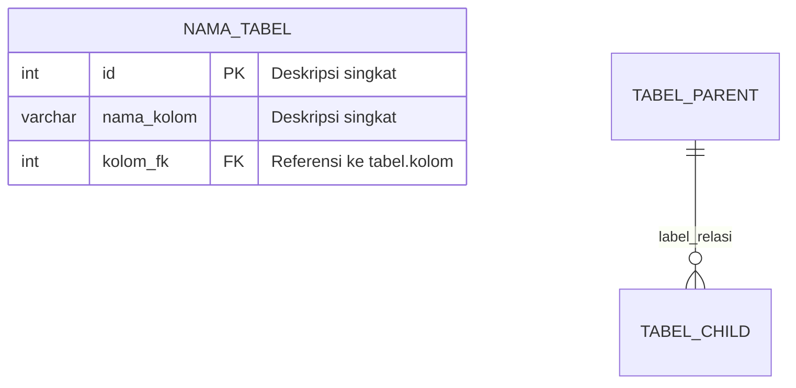
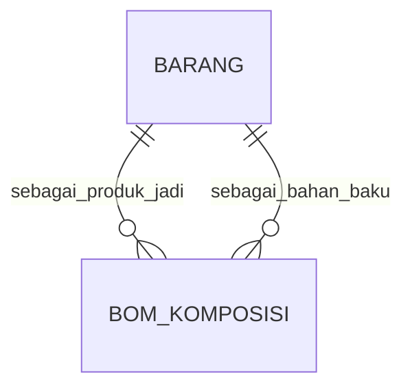

# Pembuatan & Penyusunan Dokumen ERD Database

---

## Metadata Issue

| Atribut               | Nilai                                                        |
|------------------------|--------------------------------------------------------------|
| **Judul**              | Pembuatan & Penyusunan Dokumen ERD (Entity Relationship Diagram) Database |
| **Dokumen Utama**      | ERD Database                                                 |
| **Target File**        | `docs/sdlc/03_design/02_erd_database.md`                    |
| **Fase SDLC**          | Fase 03 — Design (Perancangan Sistem)                        |
| **Prioritas**          | Tinggi                                                       |
| **Tanggal Dibuat**     | 2026-05-24                                                   |
| **Status**             | Open — Menunggu Eksekusi                                     |
| **Estimasi Kompleksitas** | Sedang                                                    |

---

## 1. Persona Pelaksana

**Persona yang ditunjuk: Senior Database Architect & Data Modeling Specialist**

Alasan pemilihan persona ini:
- ERD Database adalah representasi visual arsitektur data yang memerlukan keahlian mendalam dalam pemodelan data relasional, normalisasi database, dan notasi standar ERD (Crow's Foot / Chen).
- Persona ini memiliki otoritas teknis tertinggi dalam mendefinisikan struktur relasi antar-entitas, kardinalitas, serta integritas referensial pada skema database MySQL 8.x.
- Persona ini telah bertindak sebagai penyusun utama Data Dictionary v1.1 dan Database Schema v1.1 sebelumnya, sehingga memiliki pemahaman kontekstual penuh terhadap 28 tabel dan 58 relasi FK AbuCom.

---

## 2. File Referensi yang Digunakan

Berikut adalah daftar file referensi yang **wajib dibaca secara menyeluruh** sebelum memulai penyusunan dokumen ERD Database. File diurutkan berdasarkan tingkat relevansi dan prioritas:

| Prioritas | File Referensi | Path Relatif | Alasan Pemilihan |
|:---------:|----------------|-------------|-------------------|
| **1 (Utama)** | Database Schema SQL v1.1 | `docs/sdlc/03_design/01_database_schema.sql` | Sumber kebenaran tunggal (*single source of truth*) skema fisik 28 tabel MySQL final yang sudah tervalidasi. Berisi semua CREATE TABLE, FOREIGN KEY, INDEX, CHECK CONSTRAINT, dan data SEED. ERD **harus** 100% selaras dengan file ini. |
| **2 (Utama)** | Data Dictionary v1.1 | `docs/sdlc/02_analysis/05_data_dictionary.md` | Berisi spesifikasi lengkap 28 entitas (282 kolom), 18 kamus domain nilai, matriks 58 relasi FK, diagram Mermaid ERD konseptual (Bab 2.2), aturan bisnis data (Bab 6), dan statistik model data. |
| **3 (Pendukung)** | Access Control Matrix v1.1 | `docs/sdlc/02_analysis/06_access_control_matrix.md` | Untuk informasi klasifikasi tingkat sensitivitas per tabel dan matriks hak akses CRUD per role yang perlu dianotasi pada ERD. |
| **4 (Pendukung)** | Software Requirements Specification v1.1 | `docs/sdlc/02_analysis/02_software_requirements.md` | Cross-check kode kebutuhan fungsional (SRS-F-xxx) yang terhubung ke setiap entitas. |
| **5 (Pendukung)** | Business Requirements Document v1.1 | `docs/sdlc/02_analysis/01_business_requirements.md` | Cross-check aturan bisnis (BR-F-xx) yang mendasari desain relasi dan constraint entitas. |
| **6 (Pendukung)** | Tech Stack Decision v1.1 | `docs/sdlc/01_planning/04_tech_stack_decision.md` | Informasi konfigurasi teknis MySQL (engine InnoDB, charset utf8mb4, collation unicode_ci). |

> **Catatan**: File `docs/sdlc/narasi.txt` **TIDAK digunakan** sebagai referensi untuk issue ini karena seluruh informasi bisnis yang dibutuhkan sudah terangkum lengkap dan formal di dalam dokumen BRD, SRS, dan Data Dictionary.

---

## 3. Kerangka Struktur Dokumen ERD Database

Dokumen ERD Database harus disusun dengan struktur kerangka berikut sesuai standar praktik industri (*industry best practice*):

```
---
(YAML Front Matter: dokumen, proyek, versi, tanggal, status, penyusun)
---

# ERD Database — AbuCom

## Riwayat Perubahan Dokumen
(Tabel riwayat versi)

---

## 1. Informasi Dokumen
### 1.1. Tujuan Dokumen
### 1.2. Cakupan Dokumen
### 1.3. Posisi Dokumen dalam Siklus SDLC
### 1.4. Hubungan dengan Dokumen SDLC Lainnya
### 1.5. Audiens Target
### 1.6. Konvensi Notasi ERD & Legenda Simbol

---

## 2. Ringkasan Model Data
### 2.1. Statistik Ringkasan
### 2.2. Klasifikasi Kelompok Tabel (Pengelompokan Fungsional)

---

## 3. Diagram ERD Utama (Full ERD — Seluruh 28 Tabel)
### 3.1. ERD Fisik Lengkap (Mermaid erDiagram)
(Diagram Mermaid erDiagram yang memuat SEMUA 28 tabel dengan kolom PK/FK,
tipe data, dan garis relasi kardinalitas lengkap)

---

## 4. Diagram ERD per Kelompok Fungsional (Sub-Diagram Modular)
### 4.1. ERD Kelompok A — Tabel Induk (Master Tanpa FK)
### 4.2. ERD Kelompok B — Tabel Master Level 2 (FK ke Cabang)
### 4.3. ERD Kelompok C — Tabel Transaksional (FK ke Master)
### 4.4. ERD Kelompok D — Tabel Administrasi & Keuangan
### 4.5. ERD Kelompok E — Tabel Audit & Rekonsiliasi

(Setiap sub-bagian berisi diagram Mermaid yang lebih detail
dengan seluruh kolom, tipe data, dan relasi FK untuk kelompok tersebut)

---

## 5. Matriks Relasi & Kardinalitas
### 5.1. Daftar Lengkap Relasi Foreign Key (58 Relasi)
### 5.2. Penjelasan Aturan Integritas Referensial (ON DELETE / ON UPDATE)
### 5.3. Daftar Constraint Komposit (UNIQUE, CHECK)

---

## 6. Kamus Entitas Ringkas
(Tabel ringkas 28 entitas: Nama Tabel, Jumlah Kolom, Modul,
Jumlah FK Keluar, Jumlah FK Masuk, Sensitivitas)

---

## 7. Catatan Desain & Keputusan Arsitektural
### 7.1. Pola Multi-Cabang (cabang_id sebagai FK universal)
### 7.2. Pola Audit Trail (created_at/updated_at universal)
### 7.3. Pola Self-Referencing FK (barang → bom_komposisi)
### 7.4. Pola Nullable FK (pelanggan walk-in, desainer belum ditugaskan)
### 7.5. Pola Tabel Derivasi (7 tabel turunan dari SRS/BRD)

---

## 8. Panduan Pembacaan Diagram untuk Fase Selanjutnya
### 8.1. Cara Membaca Notasi Kardinalitas
### 8.2. Petunjuk Penggunaan ERD untuk Backend Developer
### 8.3. Mapping ERD ke Implementasi Query SQL

---

## 9. Referensi Dokumen
(Daftar file referensi yang digunakan beserta path dan kontribusinya)
```

---

## 4. Instruksi Eksekusi Detail (Low-Level Checklist)

### Fase 1: Persiapan — Pembacaan & Pengumpulan Data dari File Referensi

- [ ] **1.1.** Baca file `docs/sdlc/03_design/01_database_schema.sql` secara **keseluruhan dari baris 1 sampai baris 774**. Ini adalah sumber kebenaran utama.
- [ ] **1.2.** Dari file schema SQL, catat dan rangkum data berikut **tanpa ada yang terlewat**:
  - [ ] 1.2.1. Daftar seluruh 28 nama tabel beserta urutan pembuatannya (TABEL 01 s/d TABEL 28).
  - [ ] 1.2.2. Seluruh kolom di setiap tabel lengkap dengan: nama kolom, tipe data MySQL, constraint (PK/FK/UQ/NN/AI/CK), nilai default, dan COMMENT.
  - [ ] 1.2.3. Seluruh FOREIGN KEY constraint: nama constraint, kolom FK, tabel referensi, kolom referensi, ON DELETE behavior, ON UPDATE behavior.
  - [ ] 1.2.4. Seluruh CHECK constraint beserta ekspresinya.
  - [ ] 1.2.5. Seluruh UNIQUE constraint (baik single-column maupun composite).
  - [ ] 1.2.6. Seluruh INDEX tambahan (CREATE INDEX) beserta kolom-kolom yang diindeks.
  - [ ] 1.2.7. Pengelompokan tabel berdasarkan kelompok di schema: Kelompok A (Induk), Kelompok B (Master Level 2), Kelompok C (Transaksional), Kelompok D (Administrasi & Keuangan), Kelompok E (Audit & Rekonsiliasi).
  - [ ] 1.2.8. TABLE COMMENT dari setiap tabel (yang berisi deskripsi, sensitivitas, dan modul terkait).
- [ ] **1.3.** Baca file `docs/sdlc/02_analysis/05_data_dictionary.md` secara **keseluruhan dari baris 1 sampai baris 1550**. Catat dan rangkum data berikut:
  - [ ] 1.3.1. Diagram ERD Konseptual Mermaid yang ada di Bab 2.2 (baris 111-168).
  - [ ] 1.3.2. Matriks Relasi FK lengkap 58 entri di Bab 5.1 (baris 1243-1308).
  - [ ] 1.3.3. Daftar 19 Kamus Domain Nilai (Bab 4, baris 1083-1239) — catat nama domain dan nilai valid yang diperbolehkan.
  - [ ] 1.3.4. Aturan Bisnis Data Bab 6 (baris 1321-1367) — catat aturan komputasi dan constraint database.
  - [ ] 1.3.5. Daftar Index dan Optimasi Bab 7 (baris 1371-1393).
  - [ ] 1.3.6. Matriks Ketertelusuran Entitas → Modul Fungsional di Bab 8.1 (baris 1397-1432).
  - [ ] 1.3.7. Statistik Ringkasan Model Data di Bab 2.3 (baris 170-177): total tabel (28), total kolom (282), dan persentase multi-cabang/audit trail.
  - [ ] 1.3.8. Derivasi SRS dan BRD per tabel dari Bab 2.1 (baris 76-107).
- [ ] **1.4.** Baca file `docs/sdlc/02_analysis/06_access_control_matrix.md`. Catat:
  - [ ] 1.4.1. Tingkat sensitivitas setiap tabel (Operasional / Sensitif / Sangat Sensitif).
  - [ ] 1.4.2. Matriks hak akses CRUD per role (pemilik, kepala_percetakan, pramuniaga, kasir, desainer, produksi_cetak, fotocopy_print, gudang) terhadap setiap tabel — hanya informasi yang relevan untuk anotasi ERD.
- [ ] **1.5.** Baca file `docs/sdlc/02_analysis/02_software_requirements.md`. Catat:
  - [ ] 1.5.1. Kode kebutuhan fungsional (SRS-F-xxx) yang terhubung ke setiap entitas — gunakan untuk kolom derivasi SRS pada ringkasan entitas.
- [ ] **1.6.** Baca file `docs/sdlc/02_analysis/01_business_requirements.md`. Catat:
  - [ ] 1.6.1. Kode aturan bisnis (BR-F-xx) yang mendasari desain relasi dan constraint entitas — gunakan untuk kolom derivasi BRD pada ringkasan entitas.
- [ ] **1.7.** Baca file `docs/sdlc/01_planning/04_tech_stack_decision.md`. Catat:
  - [ ] 1.7.1. Konfigurasi teknis database: engine (InnoDB), charset (utf8mb4), collation (utf8mb4_unicode_ci), versi MySQL (8.0/8.4 LTS).

### Fase 2: Penyaringan — Seleksi Data Spesifik untuk ERD

- [ ] **2.1.** Dari seluruh data yang dirangkum di Fase 1, **saring dan ambil hanya** data/informasi yang secara langsung dibutuhkan untuk dokumen ERD Database. Kriteria penyaringan:
  - [ ] 2.1.1. **AMBIL**: Nama tabel, nama kolom, tipe data, constraint PK/FK/UQ, relasi antar-tabel, kardinalitas, ON DELETE/ON UPDATE behavior, pengelompokan tabel.
  - [ ] 2.1.2. **AMBIL**: Statistik model data (jumlah tabel, kolom, relasi FK).
  - [ ] 2.1.3. **AMBIL**: Informasi sensitivitas dan modul terkait per tabel (untuk anotasi/legend).
  - [ ] 2.1.4. **AMBIL**: Pola desain arsitektural (multi-cabang, audit trail, self-referencing FK, nullable FK, tabel derivasi).
  - [ ] 2.1.5. **ABAIKAN**: Detail seed data (INSERT INTO) — tidak relevan untuk ERD.
  - [ ] 2.1.6. **ABAIKAN**: Detail formula komputasi (Smart Payroll, HPP, depresiasi) — sudah di Data Dictionary.
  - [ ] 2.1.7. **ABAIKAN**: Detail konfigurasi runtime (parameter system_configs values) — sudah di Data Dictionary.
  - [ ] 2.1.8. **ABAIKAN**: Glosarium istilah umum — sudah ada di Data Dictionary.

### Fase 3: Penyusunan — Pembuatan Konten Dokumen ERD

#### Tahap 3A: YAML Front Matter & Header

- [ ] **3.1.** Tulis YAML Front Matter di baris paling atas dengan format:
  ```yaml
  ---
  dokumen    : ERD Database
  proyek     : AbuCom — Sistem Manajemen Terpadu Usaha Percetakan
  versi      : 1.0
  tanggal    : 2026-05-24
  status     : Draft
  penyusun   : Senior Database Architect & Data Modeling Specialist
  ---
  ```
- [ ] **3.2.** Tulis judul dokumen: `# ERD Database — AbuCom`
- [ ] **3.3.** Tulis tabel Riwayat Perubahan Dokumen versi 1.0.

#### Tahap 3B: Bab 1 — Informasi Dokumen

- [ ] **3.4.** Tulis Bab 1.1 (Tujuan Dokumen): jelaskan bahwa dokumen ini menyajikan representasi visual diagram relasi antar-entitas database AbuCom CLI untuk memudahkan pemahaman arsitektur data oleh semua stakeholder.
- [ ] **3.5.** Tulis Bab 1.2 (Cakupan Dokumen): sebutkan cakupan mencakup 28 tabel, 58 relasi FK, 5 kelompok fungsional, diagram ERD lengkap dan modular.
- [ ] **3.6.** Tulis Bab 1.3 (Posisi dalam SDLC): jelaskan bahwa dokumen ini berada di Fase 03 Design sebagai deliverable kedua setelah Database Schema SQL. Buat diagram alur posisi sederhana:
  ```
  Data Dictionary v1.1 (F02) → Database Schema v1.1 (F03) → ERD Database v1.0 (F03)
  ```
- [ ] **3.7.** Tulis Bab 1.4 (Hubungan dengan Dokumen SDLC Lainnya):
  - Input: Database Schema SQL v1.1 dan Data Dictionary v1.1.
  - Output: Menjadi referensi visual untuk API Design Document, System Design Document, dan dokumen implementasi backend di fase selanjutnya.
- [ ] **3.8.** Tulis Bab 1.5 (Audiens Target): Tim pengembang AI backend, Junior Programmer (Pemilik), Administrator Database.
- [ ] **3.9.** Tulis Bab 1.6 (Konvensi Notasi ERD & Legenda Simbol): jelaskan notasi yang digunakan dalam diagram Mermaid `erDiagram`:
  - `||--||` = One-to-One (Tepat satu)
  - `||--o{` = One-to-Many (Satu ke banyak, opsional)
  - `||--|{` = One-to-Many (Satu ke banyak, wajib ada minimal satu)
  - `PK` = Primary Key
  - `FK` = Foreign Key
  - `UQ` = Unique Constraint
  - Penjelasan simbol tipe data yang digunakan (INT, VARCHAR, DECIMAL, TEXT, TIMESTAMP, DATE, JSON, BOOLEAN/BIGINT).
  - Legenda warna/label sensitivitas jika memungkinkan.

#### Tahap 3C: Bab 2 — Ringkasan Model Data

- [ ] **3.10.** Tulis Bab 2.1 (Statistik Ringkasan): rangkum dari Data Dictionary Bab 2.3:
  - Total Tabel: 28
  - Total Kolom/Atribut: 282
  - Total Relasi FK: 58
  - Total Index Tambahan: 4
  - Total Unique Constraint: 7 (termasuk composite)
  - Total CHECK Constraint: (hitung dari schema SQL)
  - Persentase Tabel Multi-Cabang Ready: 100%
  - Persentase Tabel Audit Trail Ready: 100%
- [ ] **3.11.** Tulis Bab 2.2 (Klasifikasi Kelompok Tabel): buat tabel yang mengelompokkan 28 tabel ke dalam 5 kelompok (A-E) berdasarkan pengelompokan di file schema SQL:
  - Kelompok A — Tabel Induk: `cabang`
  - Kelompok B — Tabel Master Level 2: `pengguna`, `pelanggan`, `supplier`, `barang`, `saldo_ppob`, `saldo_ewallet`, `system_configs`
  - Kelompok C — Tabel Transaksional: `bom_komposisi`, `transaksi`, `detail_transaksi`, `antrian_kerja`, `absensi`, `kasbon`, `payroll`, `pengeluaran`, `limbah_produksi`, `jasa_service`, `poin_insentif`, `shift_handover`
  - Kelompok D — Tabel Administrasi & Keuangan: `utang_supplier`, `pinjaman_bank`, `pinjaman_kerabat`, `aset`
  - Kelompok E — Tabel Audit & Rekonsiliasi: `audit_logs`, `backup_logs`, `stock_opname`, `riwayat_harga_supplier`

#### Tahap 3D: Bab 3 — Diagram ERD Utama (Full ERD)

- [ ] **3.12.** Tulis Bab 3.1 — Buat diagram Mermaid `erDiagram` LENGKAP yang memuat **seluruh 28 tabel** beserta:
  - [ ] 3.12.1. Setiap tabel harus mencantumkan **semua kolom** dengan format: `tipe_data nama_kolom PK/FK "deskripsi singkat"`.
  - [ ] 3.12.2. Setiap relasi FK harus digambarkan dengan garis relasi dan label relasi yang deskriptif (misalnya: `CABANG ||--o{ PENGGUNA : "menaungi"`).
  - [ ] 3.12.3. Kardinalitas harus sesuai dengan matriks FK di Data Dictionary Bab 5.1.
  - [ ] 3.12.4. **Wajib cross-check**: Pastikan setiap FOREIGN KEY CONSTRAINT yang ada di file `01_database_schema.sql` terwakili sebagai garis relasi di diagram. Jangan ada yang terlewat.
  - [ ] 3.12.5. Untuk tabel `bom_komposisi` yang memiliki 2 FK ke tabel `barang` (self-referencing pattern melalui `barang_induk_id` dan `bahan_baku_id`), gambarkan kedua relasi dengan label yang berbeda dan jelas.
  - [ ] 3.12.6. Untuk tabel `shift_handover` yang memiliki 3 FK ke tabel `pengguna` (`kasir_keluar_id`, `kasir_masuk_id`, `supervisor_id`), gambarkan ketiga relasi dengan label yang berbeda dan jelas.

> **PERINGATAN PENTING**: Diagram Mermaid `erDiagram` memiliki batasan rendering jika terlalu besar. Jika diagram full ERD dengan seluruh kolom menjadi terlalu panjang dan menyebabkan error rendering, maka:
> - Buat diagram full ERD hanya dengan kolom PK dan FK saja (tanpa kolom atribut biasa) sebagai overview relasi.
> - Pindahkan detail kolom lengkap ke diagram per-kelompok di Bab 4.

#### Tahap 3E: Bab 4 — Diagram ERD per Kelompok Fungsional

- [ ] **3.13.** Tulis 5 sub-bagian (4.1 s/d 4.5) yang masing-masing berisi:
  - [ ] 3.13.1. Judul dan deskripsi singkat kelompok tabel.
  - [ ] 3.13.2. Diagram Mermaid `erDiagram` khusus kelompok tersebut yang menampilkan **seluruh kolom** dengan tipe data, constraint PK/FK, dan deskripsi singkat.
  - [ ] 3.13.3. Garis relasi FK antar-tabel di dalam kelompok DAN ke tabel induk di kelompok lain (jika ada).
  - [ ] 3.13.4. Catatan penjelasan singkat di bawah diagram tentang pola relasi yang menonjol di kelompok tersebut.

Detail per kelompok:

- [ ] **3.13.5. Kelompok A (Tabel Induk)**: Hanya tabel `cabang`. Jelaskan bahwa ini adalah root entity yang menjadi parent dari seluruh 28 tabel melalui FK `cabang_id`.
- [ ] **3.13.6. Kelompok B (Master Level 2)**: 7 tabel (`pengguna`, `pelanggan`, `supplier`, `barang`, `saldo_ppob`, `saldo_ewallet`, `system_configs`). Semua ber-FK ke `cabang`. Jelaskan peran masing-masing sebagai data master.
- [ ] **3.13.7. Kelompok C (Transaksional)**: 12 tabel. Ini adalah kelompok terbesar dan paling kompleks. Jelaskan rantai relasi: `transaksi` → `detail_transaksi`, `transaksi` → `antrian_kerja`, `transaksi` → `limbah_produksi`, `transaksi` → `poin_insentif`. Jelaskan pola self-referencing `barang` → `bom_komposisi`. Jelaskan pola multi-FK `shift_handover` → `pengguna` (3 FK).
- [ ] **3.13.8. Kelompok D (Administrasi & Keuangan)**: 4 tabel (`utang_supplier`, `pinjaman_bank`, `pinjaman_kerabat`, `aset`). Jelaskan bahwa tabel ini bersifat standalone (hanya FK ke `cabang` dan `supplier`).
- [ ] **3.13.9. Kelompok E (Audit & Rekonsiliasi)**: 4 tabel (`audit_logs`, `backup_logs`, `stock_opname`, `riwayat_harga_supplier`). Jelaskan pola audit trail dan rekonsiliasi.

#### Tahap 3F: Bab 5 — Matriks Relasi & Kardinalitas

- [ ] **3.14.** Tulis Bab 5.1: Salin dan format ulang matriks 58 relasi FK dari Data Dictionary Bab 5.1 ke dalam tabel markdown dengan kolom: No, Tabel Child, Kolom FK, Tabel Parent, Kolom PK, Kardinalitas, ON DELETE, ON UPDATE.
  - **PENTING**: Cross-check dengan file `01_database_schema.sql` — pastikan tidak ada FK yang terlewat atau salah. Jika ada perbedaan antara Data Dictionary dan schema SQL, **ikuti schema SQL** karena itu adalah sumber kebenaran final.
- [ ] **3.15.** Tulis Bab 5.2: Jelaskan 3 pola integritas referensial yang digunakan:
  - `ON DELETE RESTRICT` — untuk tabel master (mencegah penghapusan data induk jika ada anak).
  - `ON DELETE CASCADE` — untuk tabel detail/turunan (otomatis hapus baris anak jika induk dihapus).
  - `ON DELETE SET NULL` — untuk FK nullable (set NULL jika data referensi dihapus).
- [ ] **3.16.** Tulis Bab 5.3: Daftar constraint komposit:
  - UNIQUE composite: `bom_komposisi(barang_induk_id, bahan_baku_id)`, `absensi(pengguna_id, tanggal)`.
  - CHECK constraint: daftar semua dari schema SQL (hitung dan tulis lengkap).

#### Tahap 3G: Bab 6 — Kamus Entitas Ringkas

- [ ] **3.17.** Buat tabel ringkasan 28 entitas dengan kolom:

| No | Nama Tabel | Kelompok | Jumlah Kolom | Modul Terkait | FK Keluar | FK Masuk | Sensitivitas | Derivasi |
|---|---|---|---|---|---|---|---|---|

  - [ ] 3.17.1. Hitung `FK Keluar` = jumlah FOREIGN KEY yang didefinisikan di dalam tabel tersebut.
  - [ ] 3.17.2. Hitung `FK Masuk` = jumlah tabel lain yang memiliki FK yang mereferensikan tabel ini.
  - [ ] 3.17.3. `Sensitivitas` ambil dari TABLE COMMENT di schema SQL (Operasional / Sensitif / Sangat Sensitif).
  - [ ] 3.17.4. `Derivasi` = 'SRS' jika berasal dari SRS asli, atau 'Derivasi' jika diturunkan dari konteks.

#### Tahap 3H: Bab 7 — Catatan Desain & Keputusan Arsitektural

- [ ] **3.18.** Tulis Bab 7.1 (Pola Multi-Cabang): Jelaskan bahwa 100% (28/28) tabel memiliki kolom `cabang_id` sebagai FK ke tabel `cabang` dengan default value `1`. Ini memungkinkan skalabilitas multi-branch di masa depan.
- [ ] **3.19.** Tulis Bab 7.2 (Pola Audit Trail): Jelaskan bahwa 100% (28/28) tabel memiliki kolom `created_at` dan `updated_at` dengan tipe TIMESTAMP dan auto-fill dari MySQL.
- [ ] **3.20.** Tulis Bab 7.3 (Pola Self-Referencing FK): Jelaskan kasus `bom_komposisi` yang memiliki 2 FK ke tabel yang sama (`barang`): `barang_induk_id` (produk jadi) dan `bahan_baku_id` (komponen bahan).
- [ ] **3.21.** Tulis Bab 7.4 (Pola Nullable FK): Daftar kolom FK yang nullable:
  - `transaksi.pelanggan_id` → NULL artinya pelanggan non-CRM (walk-in).
  - `antrian_kerja.desainer_id` → NULL artinya desainer belum ditugaskan.
  - `antrian_kerja.produksi_id` → NULL artinya operator cetak belum ditugaskan.
  - `stock_opname.supervisor_id` → NULL artinya opname belum disetujui supervisor.
  - `jasa_service.pelanggan_id` → NULL artinya pelanggan bukan anggota CRM.
- [ ] **3.22.** Tulis Bab 7.5 (Pola Tabel Derivasi): Jelaskan 7 tabel yang didefinisikan di luar Bab 6.1 SRS (diturunkan dari konteks bisnis): `pinjaman_bank`, `pinjaman_kerabat`, `aset`, `stock_opname`, `riwayat_harga_supplier`, `saldo_ewallet`, `system_configs`.

#### Tahap 3I: Bab 8 — Panduan Pembacaan Diagram

- [ ] **3.23.** Tulis Bab 8.1 (Cara Membaca Notasi Kardinalitas): berikan contoh pembacaan diagram ERD dengan narasi sederhana, misalnya: "Satu cabang dapat menaungi banyak pengguna, tetapi satu pengguna hanya dapat terdaftar di satu cabang".
- [ ] **3.24.** Tulis Bab 8.2 (Petunjuk untuk Backend Developer): jelaskan cara menggunakan ERD sebagai panduan saat membuat query JOIN, menyusun model ORM, dan memvalidasi integritas referensial.
- [ ] **3.25.** Tulis Bab 8.3 (Mapping ERD ke Implementasi Query SQL): berikan 2-3 contoh query JOIN sederhana berdasarkan relasi di ERD (misalnya: join transaksi-detail-barang, join antrian_kerja-transaksi-pengguna).

#### Tahap 3J: Bab 9 — Referensi Dokumen

- [ ] **3.26.** Tulis bagian Referensi Dokumen di baris paling bawah dokumen dengan format:
  ```markdown
  ## 9. Referensi Dokumen

  Dokumen ini disusun berdasarkan referensi dari dokumen-dokumen berikut:

  | No | Kode Ref | Nama Dokumen | Path | Kontribusi |
  |---|---|---|---|---|
  | 1 | REF-01 | Database Schema SQL v1.1 | docs/sdlc/03_design/01_database_schema.sql | Sumber kebenaran utama ... |
  | 2 | REF-02 | Data Dictionary v1.1 | docs/sdlc/02_analysis/05_data_dictionary.md | ... |
  | ... | ... | ... | ... | ... |
  ```

### Fase 4: Validasi — Pemeriksaan Kualitas Dokumen

- [ ] **4.1.** Validasi kelengkapan entitas: pastikan semua 28 tabel tercantum di diagram ERD dan tabel ringkasan. **Tidak boleh ada tabel yang terlewat.**
- [ ] **4.2.** Validasi kelengkapan relasi FK: pastikan semua 58 relasi FK dari schema SQL tergambar di diagram ERD. **Cross-check satu per satu.**
- [ ] **4.3.** Validasi konsistensi nama: pastikan nama tabel dan kolom di ERD **persis sama** (case-sensitive) dengan nama di file `01_database_schema.sql`.
- [ ] **4.4.** Validasi kardinalitas: pastikan tipe relasi (One-to-One, One-to-Many, Many-to-One) di diagram sesuai dengan definisi FK di schema SQL dan matriks di Data Dictionary.
- [ ] **4.5.** Validasi bahasa: pastikan seluruh isi dokumen menggunakan **Bahasa Indonesia yang natural, tidak ambigu, tidak membingungkan, dan mudah dipahami**. Hindari penggunaan jargon teknis tanpa penjelasan.
- [ ] **4.6.** Validasi rendering Mermaid: pastikan seluruh blok kode `mermaid` **valid secara sintaks** dan tidak menyebabkan error rendering. Perhatikan:
  - Nama node yang mengandung karakter khusus harus di-quote.
  - Label relasi harus dalam format string yang valid.
  - Jangan gunakan HTML tags di dalam label Mermaid.
- [ ] **4.7.** Validasi data kosong: jika ada data/informasi yang **tidak ditemukan** di file referensi, tandai dengan placeholder:
  ```markdown
  > ⚠️ **[DATA KOSONG — PERLU DIISI MANUAL]**: <deskripsi data yang hilang>
  ```
- [ ] **4.8.** Validasi kelayakan referensi: pastikan dokumen ini **layak dijadikan acuan** bagi dokumen fase SDLC selanjutnya (API Design, System Design Document, implementasi backend). Dokumen harus:
  - Menyediakan informasi yang **cukup lengkap** untuk membuat query SQL tanpa harus membuka schema SQL lagi.
  - Menyediakan visualisasi yang **cukup jelas** untuk memahami arsitektur data tanpa harus membaca Data Dictionary.

### Fase 5: Penulisan — Penuangan ke Target File

- [ ] **5.1.** Tulis seluruh konten dokumen ERD Database ke target file: `docs/sdlc/03_design/02_erd_database.md`.
- [ ] **5.2.** Pastikan file ditulis dalam format Markdown standar (`.md`) dengan encoding UTF-8.
- [ ] **5.3.** Pastikan tidak ada file lain yang ditimpa atau dimodifikasi selama proses ini.

---

## 5. Instruksi Tambahan Spesifik ERD

### 5.1. Standar Penulisan Diagram Mermaid erDiagram

Gunakan format diagram Mermaid `erDiagram` berikut sebagai acuan penulisan:



### 5.2. Aturan Penamaan Label Relasi

Gunakan kata kerja Bahasa Indonesia yang mendeskripsikan hubungan bisnis antar-tabel, bukan nama kolom FK. Contoh:
- `CABANG ||--o{ PENGGUNA : "menaungi"` ✅
- `CABANG ||--o{ PENGGUNA : "cabang_id"` ❌

### 5.3. Penanganan Ambiguitas Self-Referencing FK

Untuk kasus di mana satu tabel anak memiliki **lebih dari satu FK** ke tabel parent yang sama, gunakan label relasi yang **berbeda dan eksplisit** agar tidak ambigu. Contoh:


### 5.4. Konsistensi dengan Schema SQL Final

**Aturan emas**: Jika terdapat perbedaan informasi antara Data Dictionary dan Database Schema SQL, **SELALU ikuti Database Schema SQL** (`01_database_schema.sql`) karena file tersebut adalah sumber kebenaran yang sudah divalidasi dan final.

### 5.5. Penandaan Data Kosong

Jika ada informasi yang dibutuhkan untuk ERD tetapi **tidak tersedia** di file referensi manapun, tandai dengan format berikut di tempat yang sesuai dalam dokumen:

```markdown
> ⚠️ **[DATA KOSONG — PERLU DIISI MANUAL]**: <jelaskan data apa yang hilang dan dari mana seharusnya didapat>
```

---

## 6. Kriteria Penerimaan (Acceptance Criteria)

Issue ini dianggap **selesai** apabila memenuhi seluruh kriteria berikut:

- [ ] File `docs/sdlc/03_design/02_erd_database.md` telah tertulis dan berisi konten lengkap.
- [ ] Seluruh 28 tabel database tergambar di diagram ERD (baik full maupun per-kelompok).
- [ ] Seluruh 58 relasi FK tergambar di diagram ERD dengan kardinalitas yang benar.
- [ ] Matriks relasi FK telah di-cross-check dan konsisten dengan `01_database_schema.sql`.
- [ ] Struktur dokumen mengikuti kerangka yang ditetapkan di Bab 3 issue ini.
- [ ] Seluruh konten ditulis dalam Bahasa Indonesia yang natural dan tidak ambigu.
- [ ] Diagram Mermaid valid secara sintaks dan dapat di-render tanpa error.
- [ ] Bagian Referensi Dokumen (Bab 9) telah dicantumkan di akhir dokumen.
- [ ] Tidak ada file lain yang termodifikasi selain target file.

---

## 7. Referensi File untuk Issue Ini

| No | Nama File | Path | Kontribusi untuk Issue |
|---|---|---|---|
| 1 | Database Schema SQL v1.1 | `docs/sdlc/03_design/01_database_schema.sql` | Sumber kebenaran utama 28 tabel, 58 FK, index, constraint, dan seed data |
| 2 | Data Dictionary v1.1 | `docs/sdlc/02_analysis/05_data_dictionary.md` | Spesifikasi 282 kolom, 19 domain nilai, matriks FK, diagram ERD konseptual, aturan bisnis |
| 3 | Access Control Matrix v1.1 | `docs/sdlc/02_analysis/06_access_control_matrix.md` | Klasifikasi sensitivitas tabel dan matriks CRUD per role |
| 4 | Software Requirements Specification v1.1 | `docs/sdlc/02_analysis/02_software_requirements.md` | Kode kebutuhan fungsional SRS-F-xxx per entitas |
| 5 | Business Requirements Document v1.1 | `docs/sdlc/02_analysis/01_business_requirements.md` | Kode aturan bisnis BR-F-xx per entitas |
| 6 | Tech Stack Decision v1.1 | `docs/sdlc/01_planning/04_tech_stack_decision.md` | Konfigurasi teknis MySQL (engine, charset, collation) |
