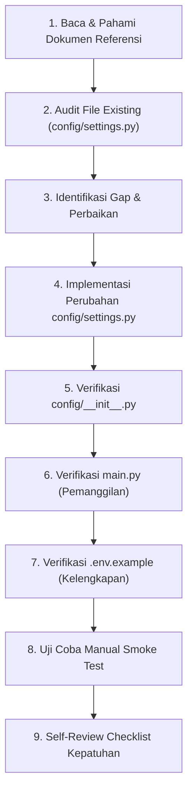

# Issue — Feature Pembacaan Konfigurasi Dotenv Saat Startup

## 1. Persona Pelaksana

> **Persona yang WAJIB diadopsi oleh AI/Programmer pelaksana:**
>
> **"Senior Python Configuration & Security Engineer"** — Seorang engineer spesialis yang memiliki keahlian mendalam dalam:
> - Pengelolaan konfigurasi runtime aplikasi Python menggunakan `python-dotenv`.
> - Validasi startup aplikasi yang ketat dan fail-safe.
> - Paradigma Pemrograman Fungsional (FP) murni tanpa OOP/class.
> - Penanganan error yang aman dan informatif menggunakan Result Pattern (NamedTuple).
> - Kepatuhan UU PDP No. 27/2022 terkait pengelolaan kunci enkripsi.
> - Portabilitas lintas OS (Windows 11 & Linux Debian 12).
>
> **Mengapa persona ini?** Feature ini menyentuh layer konfigurasi yang menjadi fondasi keamanan seluruh sistem (kredensial database, JWT secret, Fernet key). Kesalahan dalam implementasi dapat menyebabkan kebocoran data, crash startup, atau kerentanan keamanan. Diperlukan ketelitian tingkat tinggi dan pemahaman mendalam terhadap standar keamanan proyek.

---

## 2. Dokumen Referensi Utama

Berikut adalah daftar file referensi yang **WAJIB dibaca dan diekstrak** sebelum memulai implementasi. Urutkan pembacaan sesuai prioritas:

| No | Prioritas | Nama Dokumen | Path Relatif File | Alasan Pemilihan |
|:---:|:---:|---|---|---|
| 1 | **PRIMER** | Coding Standard v1.2 | `docs/sdlc/04_implementation/01_coding_standard.md` | SSoT aturan FP murni, layout direktori `config/settings.py`, aturan `.env`, Result Pattern, type hints, docstring, error codes `ERR-FILE-xxx`. |
| 2 | **PRIMER** | Environment Setup v1.2 | `docs/sdlc/04_implementation/02_environment_setup.md` | Template `.env.example` lengkap (Bab 8.2.1), panduan pengisian variabel, smoke test startup (Bab 8.6), dan contoh inisialisasi connection pool (Bab 8.7). |
| 3 | **PRIMER** | Module Structure v1.2 | `docs/sdlc/04_implementation/03_module_structure.md` | Spesifikasi teknis `config/settings.py` (Bab 8.2), daftar variabel yang dikelola, SRS mapping `SRS-F-ADD-01`. |
| 4 | **PRIMER** | Security Design v1.2 | `docs/sdlc/03_design/06_security_design.md` | Aturan kredensial `.env` (Bab 6.5), startup validator, kebijakan rotasi kredensial, error code `ERR-FILE-001`. |
| 5 | **SEKUNDER** | System Architecture v1.2 | `docs/sdlc/03_design/03_system_architecture.md` | Arsitektur 4-layer, cross-cutting concerns `config/`, dan connection pool factory. |
| 6 | **SEKUNDER** | Narasi Pemilik | `docs/sdlc/narasi.txt` | Konteks bahwa library `python-dotenv` adalah library utama wajib (baris 105), dan bahwa sistem berjalan Dual-OS (baris 106). |
| 7 | **TERSIER** | File `.env.example` aktual | `.env.example` | Sumber kebenaran (SSoT) daftar variabel `.env` yang harus di-support oleh `settings.py`. |
| 8 | **TERSIER** | File `main.py` aktual | `main.py` | Untuk memahami bagaimana `load_settings()` dipanggil di entry point dan alur startup saat ini. |

---

## 3. Rangkuman Detail Data dari Dokumen Referensi

Pelaksana **WAJIB** mengekstrak dan merangkum informasi berikut dari dokumen referensi sebelum menulis kode. **Jangan lewatkan detail kecil apapun.**

### 3.1. Daftar Lengkap Variabel `.env` (Sumber: `.env.example` + Environment Setup Bab 8.2.1)

| No | Nama Variabel | Tipe Python Target | Nilai Default (jika ada) | Wajib Diisi Manual? | Kategori |
|:---:|---|---|---|---|---|
| 1 | `APP_ENV` | `str` | `'production'` | Tidak | Lingkungan Runtime |
| 2 | `APP_CABANG_ID` | `int` | `1` | Tidak | Lingkungan Runtime |
| 3 | `DB_HOST` | `str` | `'10.10.10.10'` | Tidak (default `.env.example`: `192.168.1.200`) | Kredensial Database |
| 4 | `DB_PORT` | `int` | `3306` | Tidak | Kredensial Database |
| 5 | `DB_USER` | `str` | `'abucom_app'` | Tidak | Kredensial Database |
| 6 | `DB_PASSWORD` | `str` | **Tidak ada default** | **YA — WAJIB** | Kredensial Database |
| 7 | `DB_NAME` | `str` | `'abucom_db'` | Tidak | Kredensial Database |
| 8 | `DB_POOL_SIZE` | `int` | `5` | Tidak | Kredensial Database |
| 9 | `JWT_SECRET_KEY` | `str` | **Tidak ada default** | **YA — WAJIB** | Keamanan JWT |
| 10 | `JWT_LIFETIME_SECONDS` | `int` | `28800` | Tidak | Keamanan JWT |
| 11 | `FERNET_KEY` | `str` | **Tidak ada default** | **YA — WAJIB** | Enkripsi UU PDP |
| 12 | `BACKUP_ZIP_PASSWORD` | `str` | **Tidak ada default** | **YA — WAJIB** | Backup AES-256 |
| 13 | `PRINTER_PORT` | `str` | `'COM1'` | Tidak | Printer Thermal |
| 14 | `PRINTER_WIDTH_MM` | `int` | `58` | Tidak | Printer Thermal |

### 3.2. Aturan Validasi Startup (Sumber: Coding Standard Bab 10.1 + Security Design Bab 6.5)

- `[WAJIB]` Skrip validator otomatis wajib mengecek **keberadaan** file `.env` saat startup aplikasi. Jika file tidak ditemukan, startup **WAJIB batal** dengan kode error `ERR-FILE-001`.
- `[WAJIB]` Variabel wajib (`DB_PASSWORD`, `JWT_SECRET_KEY`, `FERNET_KEY`, `BACKUP_ZIP_PASSWORD`) **WAJIB divalidasi** tidak kosong dan tidak masih berisi placeholder `YOUR_*_HERE`.
- `[WAJIB]` Jika variabel wajib kosong/placeholder, startup **WAJIB batal** dengan kode error `ERR-FILE-002`.
- `[WAJIB]` Lingkungan deployment dibedakan menggunakan variabel `APP_ENV` (`development` vs `production`).
- `[WAJIB]` File `.env` **DILARANG** di-hardcode path-nya. Gunakan `pathlib.Path` untuk resolusi relatif dari root proyek.
- `[WAJIB]` Berkas `.env` **WAJIB** masuk ke `.gitignore`.

### 3.3. Aturan Coding Standard yang Berlaku (Sumber: Coding Standard v1.2)

| Aturan | Referensi | Detail |
|---|---|---|
| FP Murni — Tanpa Class | Bab 2.2.3 | **DILARANG** menggunakan `class` untuk konfigurasi. Gunakan `namedtuple`. |
| Imutabilitas Data | Bab 2.2.2 | Data konfigurasi WAJIB imutabel (NamedTuple). |
| Result Pattern | Bab 2.2.6 | Fungsi WAJIB mengembalikan `Result(is_success, data, error_msg)`. |
| Type Hints PEP 484 | Bab 7.1 | Seluruh fungsi publik WAJIB memiliki type hints lengkap. |
| Docstring PEP 257 | Bab 6.1-6.2 | Seluruh fungsi publik WAJIB memiliki docstring Google Style. |
| Header Module | Bab 6.4 | File WAJIB memiliki header metadata. |
| Snake Case Naming | Bab 3.1-3.2 | File dan fungsi menggunakan `snake_case`. |
| PascalCase NamedTuple | Bab 3.5 | NamedTuple menggunakan `PascalCase` (`AppConfig`). |
| Konstanta UPPER_SNAKE_CASE | Bab 3.3 | Konstanta ditulis `UPPER_SNAKE_CASE`. |
| Import Order | Bab 5.4.1 | Standard Library → Third-Party → Local Modules. |
| Single Quote Internal | Bab 5.5 | Single quote untuk string internal kode. |
| Double Quote Display | Bab 5.5 | Double quote untuk teks display dan docstring. |
| Pathlib Wajib | Bab 12.1 | Resolusi path WAJIB menggunakan `pathlib`. |
| UTF-8 Encoding | Bab 12.3 | Pembacaan file konfigurasi WAJIB `encoding='utf-8'`. |
| Error Code Format | Bab 11.5 | Format: `⛔ ERR-[KATEGORI]-[NOMOR]: [Pesan deskriptif]`. |
| Logging Standard | Bab 10.8 | Gunakan modul `logging` Python. Format: `[WAKTU] [LEVEL] [MODUL] Pesan`. |

### 3.4. Aturan Arsitektur Layer (Sumber: Coding Standard Bab 8.1-8.2, Module Structure Bab 2.2)

- `config/settings.py` termasuk dalam **Cross-cutting Concerns** (bukan layer 1/2/3).
- Boleh diimpor oleh layer di atasnya (`cli/`, `logic/`, `middleware/`).
- **DILARANG** mengimpor modul dari `cli/`, `logic/`, atau `db/`.
- `config/__init__.py` wajib melakukan re-export fungsi `load_settings`.

### 3.5. Lokasi File Target

| File | Path Absolut | Aksi |
|---|---|---|
| `config/settings.py` | `config/settings.py` | **MODIFY** — Perbaikan dan peningkatan |
| `config/__init__.py` | `config/__init__.py` | **VERIFY** — Pastikan re-export benar |
| `main.py` | `main.py` | **VERIFY** — Pastikan pemanggilan benar |
| `.env.example` | `.env.example` | **VERIFY** — Pastikan kelengkapan variabel |

---

## 4. Batasan, Cakupan, dan Alur Pengerjaan

### 4.1. Cakupan Pengerjaan (IN SCOPE)

- [x] Pembacaan file `.env` menggunakan `python-dotenv` library.
- [x] Validasi keberadaan file `.env` saat startup.
- [x] Validasi kelengkapan variabel wajib (tidak kosong, tidak placeholder).
- [x] Casting tipe data dari string `.env` ke tipe Python yang tepat (`int`, `str`).
- [x] Penyediaan data konfigurasi dalam format NamedTuple imutabel (`AppConfig`).
- [x] Penanganan error yang informatif dengan error code standar (`ERR-FILE-001`, `ERR-FILE-002`).
- [x] Logging aktivitas pembacaan konfigurasi menggunakan modul `logging`.
- [x] Kompatibilitas lintas OS (Windows 11 & Linux Debian 12) menggunakan `pathlib`.
- [x] Docstring PEP 257 dan type hints PEP 484 lengkap.
- [x] Validasi format/tipe data variabel tertentu (misalnya `DB_PORT` harus integer valid, `APP_ENV` harus `'development'` atau `'production'`).

### 4.2. Batasan Pengerjaan (OUT OF SCOPE)

> **DILARANG** menyentuh atau memodifikasi file/feature berikut:

- ❌ `db/db_connector.py` — Modul connection pool database (sudah selesai, issue terpisah).
- ❌ `db/query_builder.py` — Query builder wrapper.
- ❌ `middleware/auth_jwt.py` — Otentikasi JWT.
- ❌ `middleware/rbac_guard.py` — Guard RBAC.
- ❌ `cli/*.py` — Seluruh modul presentasi CLI.
- ❌ `logic/*.py` — Seluruh modul business logic.
- ❌ `tests/test_unit_db_connector.py` — Unit test DB connector.
- ❌ Modifikasi file `.env` aktual (berisi kredensial riil).
- ❌ Penambahan library/dependensi baru di `requirements.txt`.
- ❌ Modifikasi schema database SQL.

### 4.3. Alur Pengerjaan (Workflow)



---

## 5. Instruksi Implementasi Low-Level (Checklist Tahap Demi Tahap)

> **PERINGATAN PENTING:** Kerjakan seluruh tahapan di bawah ini secara **rapi, bersih, tidak tergesa-gesa, dan tidak buru-buru**. Baca instruksi dengan teliti sebelum menulis kode. Setiap tahapan harus diselesaikan secara tuntas sebelum melanjutkan ke tahapan berikutnya.

### TAHAP 1: Pembacaan dan Pemahaman Dokumen Referensi

- [ ] **1.1** Baca file `docs/sdlc/04_implementation/01_coding_standard.md` secara **menyeluruh**. Fokus pada:
  - [ ] Bab 2.2 (Prinsip FP Murni) — Pahami aturan tanpa class, imutabilitas, Result Pattern.
  - [ ] Bab 3 (Konvensi Penamaan) — Pahami snake_case, PascalCase, UPPER_SNAKE_CASE.
  - [ ] Bab 5 (Format dan Gaya Kode) — Pahami urutan import, penggunaan string quotes.
  - [ ] Bab 6 (Dokumentasi Kode) — Pahami template docstring dan header module.
  - [ ] Bab 7 (Type Hints) — Pahami aturan PEP 484 untuk Python 3.14+.
  - [ ] Bab 10.1 (Aturan `.env`) — Pahami **semua 4 poin aturan** kredensial `.env`.
  - [ ] Bab 10.8 (System Logging) — Pahami aturan penggunaan modul `logging`.
  - [ ] Bab 11.5 (Error Codes) — Pahami format `ERR-FILE-001`, `ERR-FILE-002`.
  - [ ] Bab 12 (Portabilitas Lintas OS) — Pahami aturan `pathlib` dan `utf-8`.
- [ ] **1.2** Baca file `docs/sdlc/04_implementation/02_environment_setup.md`. Fokus pada:
  - [ ] Bab 8.1 (Struktur Direktori) — Pahami posisi `config/settings.py`.
  - [ ] Bab 8.2 (File `.env`) — Pahami template `.env.example` lengkap (14 variabel).
  - [ ] Bab 8.6 (Smoke Test Startup) — Pahami alur verifikasi startup.
  - [ ] Bab 8.7 (Connection Pool Init) — Pahami cara `os.getenv()` dipakai di contoh.
- [ ] **1.3** Baca file `docs/sdlc/04_implementation/03_module_structure.md`. Fokus pada:
  - [ ] Bab 8.2 (config/settings.py) — Pahami daftar variabel yang dikelola.
  - [ ] Bab 2.2 (Aturan Dependensi Layer) — Pahami siapa yang boleh mengimpor `config/`.
- [ ] **1.4** Baca file `docs/sdlc/03_design/06_security_design.md`. Fokus pada:
  - [ ] Bab 6.5 (Manajemen Kredensial) — Pahami aturan startup validator dan `.env`.
  - [ ] Bab 6.1 (Enkripsi Data at Rest) — Pahami peran `FERNET_KEY` dan `BACKUP_ZIP_PASSWORD`.
- [ ] **1.5** Baca file `.env.example` yang sudah ada di root proyek. Catat semua 14 variabel.
- [ ] **1.6** Baca file `main.py`. Pahami bagaimana `load_settings()` dipanggil pada Tahap 2 (baris 48-51).
- [ ] **1.7** Baca file `config/__init__.py`. Pahami re-export `load_settings`.

### TAHAP 2: Audit File Existing (`config/settings.py`)

- [ ] **2.1** Baca seluruh isi file `config/settings.py` yang sudah ada saat ini.
- [ ] **2.2** Identifikasi dan catat temuan audit berikut:

| No | Item Audit | Status Saat Ini | Evaluasi |
|:---:|---|---|---|
| 1 | Header module metadata (PEP 257) | ✅ Sudah ada | Periksa kelengkapan format |
| 2 | Import order (Std → 3rd → Local) | ✅ Sudah benar | Verifikasi |
| 3 | NamedTuple `AppConfig` (14 field) | ✅ Sudah ada (14 field) | Verifikasi kelengkapan terhadap `.env.example` |
| 4 | Konstanta default values | ⚠️ Ada 5 konstanta | Verifikasi terhadap dokumen SDLC |
| 5 | `DEFAULT_DB_HOST` | ⚠️ Bernilai `'10.10.10.10'` | **Periksa**: apakah sesuai `.env.example` (`192.168.1.200`)? Jika ada justifikasi, biarkan. |
| 6 | Fungsi `load_settings()` | ✅ Sudah ada | Audit logika validasi |
| 7 | Validasi file `.env` exists | ✅ Sudah ada (`env_path.exists()`) | Verifikasi |
| 8 | Validasi variabel wajib | ⚠️ Hanya 3 variabel (`DB_PASSWORD`, `JWT_SECRET_KEY`, `FERNET_KEY`) | **MASALAH**: `BACKUP_ZIP_PASSWORD` belum termasuk dalam validasi wajib |
| 9 | Deteksi placeholder `YOUR_*` | ✅ Sudah ada | Verifikasi |
| 10 | Error code `ERR-FILE-001` | ✅ Sudah ada | Verifikasi format |
| 11 | Error code `ERR-FILE-002` | ✅ Sudah ada | Verifikasi format |
| 12 | Logging aktivitas | ❌ **BELUM ADA** | Harus ditambahkan menggunakan modul `logging` |
| 13 | Validasi tipe data casting | ⚠️ Casting langsung tanpa error handling | `int()` bisa throw `ValueError` jika `.env` berisi non-numerik |
| 14 | Validasi nilai `APP_ENV` | ❌ **BELUM ADA** | Harus memvalidasi hanya `'development'` atau `'production'` |
| 15 | Validasi `DB_PORT` range | ❌ **BELUM ADA** | Port harus angka integer positif 1-65535 |
| 16 | Validasi `DB_POOL_SIZE` range | ❌ **BELUM ADA** | Pool size harus integer positif 1-100 |
| 17 | Validasi `JWT_LIFETIME_SECONDS` | ❌ **BELUM ADA** | Harus integer positif |
| 18 | Validasi `PRINTER_WIDTH_MM` | ❌ **BELUM ADA** | Hanya 58 atau 80 yang valid |
| 19 | Docstring lengkap Google Style | ⚠️ Ada tapi minimalis | Lengkapi dengan Args, Returns, Raises, Example |
| 20 | Encoding `utf-8` eksplisit | ❌ **BELUM ADA** | `load_dotenv()` perlu parameter `encoding='utf-8'` |

### TAHAP 3: Implementasi Perubahan pada `config/settings.py`

> **CATATAN KRITIS:** Jangan menulis ulang seluruh file dari nol. Lakukan **perubahan incremental** pada file existing. Pertahankan seluruh kode yang sudah benar.

- [ ] **3.1** **[HEADER]** Periksa header module. Pastikan formatnya sesuai template standar:
  ```python
  """
  Nama Modul: settings.py
  Deskripsi: Agregasi dan casting data bertipe aman dari file kredensial
             rahasia lokal .env menggunakan library python-dotenv.
             Menyediakan variabel konfigurasi sebagai read-only NamedTuple imutabel.
  Author: [Nama Pelaksana / AI Model]
  Tanggal: [YYYY-MM-DD]
  """
  ```
  - [ ] Update field `Author` dengan nama pelaksana yang mengerjakan issue ini.
  - [ ] Update field `Tanggal` dengan tanggal pengerjaan.
  - [ ] Jangan hapus komentar yang sudah ada jika masih relevan.

- [ ] **3.2** **[IMPORT]** Periksa dan pastikan import sudah benar dan lengkap. Urutan wajib:
  ```python
  # 1. Standard Library
  import os
  import sys
  import logging
  from pathlib import Path
  from collections import namedtuple

  # 2. Third-Party
  from dotenv import load_dotenv

  # 3. Local Modules (Tidak ada untuk settings.py)
  ```
  - [ ] Tambahkan `import logging` jika belum ada.
  - [ ] Verifikasi tidak ada wildcard import (`from x import *`).

- [ ] **3.3** **[LOGGING]** Tambahkan inisialisasi logger modul sesuai Coding Standard Bab 10.8:
  ```python
  _logger = logging.getLogger('abucom.config')
  ```

- [ ] **3.4** **[KONSTANTA]** Periksa dan lengkapi konstanta default. Pastikan semua menggunakan `UPPER_SNAKE_CASE`:
  ```python
  DEFAULT_DB_HOST = '10.10.10.10'
  DEFAULT_DB_PORT = 3306
  DEFAULT_DB_POOL_SIZE = 5
  DEFAULT_JWT_LIFETIME = 28800
  DEFAULT_PRINTER_WIDTH = 58
  VALID_APP_ENVS = ('development', 'production')
  VALID_PRINTER_WIDTHS = (58, 80)
  ```
  - [ ] Tambahkan konstanta `VALID_APP_ENVS` berupa tuple `('development', 'production')`.
  - [ ] Tambahkan konstanta `VALID_PRINTER_WIDTHS` berupa tuple `(58, 80)`.
  - [ ] **CATATAN**: Nilai `DEFAULT_DB_HOST = '10.10.10.10'` sudah ada di kode existing. Ini berfungsi sebagai fallback default di Python, bukan IP riil. IP riil ditentukan oleh isi file `.env`. Jika diperlukan sinkronisasi dengan `.env.example` (`192.168.1.200`), **konfirmasikan terlebih dahulu dengan pemilik proyek sebelum mengubah**. Tandai sebagai `# TODO: Konfirmasi default host IP dengan pemilik proyek` jika ragu.

- [ ] **3.5** **[DAFTAR VARIABEL WAJIB]** Tambahkan konstanta daftar variabel wajib sebagai tuple:
  ```python
  REQUIRED_ENV_VARS = ('DB_PASSWORD', 'JWT_SECRET_KEY', 'FERNET_KEY', 'BACKUP_ZIP_PASSWORD')
  ```
  - [ ] Pastikan `BACKUP_ZIP_PASSWORD` **TERMASUK** dalam daftar (sebelumnya tidak ada).

- [ ] **3.6** **[NAMEDTUPLE]** Verifikasi NamedTuple `AppConfig` sudah memiliki 14 field yang sesuai dengan 14 variabel `.env.example`:
  ```python
  AppConfig = namedtuple('AppConfig', [
      'app_env',
      'app_cabang_id',
      'db_host',
      'db_port',
      'db_user',
      'db_password',
      'db_name',
      'db_pool_size',
      'jwt_secret_key',
      'jwt_lifetime_seconds',
      'fernet_key',
      'backup_zip_password',
      'printer_port',
      'printer_width_mm',
  ])
  ```
  - [ ] Verifikasi bahwa jumlah field **tepat 14** dan sesuai urutan di `.env.example`.
  - [ ] Verifikasi penamaan menggunakan `snake_case`.

- [ ] **3.7** **[FUNGSI HELPER VALIDASI]** Buat fungsi helper pure function untuk validasi tipe data casting yang aman:
  ```python
  def _safe_int_cast(value: str | None, default: int, var_name: str) -> int:
      """Melakukan casting string ke integer secara aman dengan fallback default.

      Args:
          value (str | None): Nilai string dari os.getenv().
          default (int): Nilai default jika casting gagal.
          var_name (str): Nama variabel untuk pesan error.

      Returns:
          int: Nilai integer hasil casting atau default.

      Raises:
          SystemExit: Jika nilai tidak valid dan tidak bisa di-cast.
      """
      if value is None:
          return default
      try:
          return int(value)
      except (ValueError, TypeError):
          _logger.error(
              f"ERR-FILE-003: Variabel {var_name} bernilai '{value}' bukan integer valid."
          )
          print(f"⛔ ERR-FILE-003: Variabel {var_name} bernilai '{value}' bukan integer valid di file .env.")
          sys.exit(1)
  ```
  - [ ] Pastikan fungsi ini adalah pure function (hanya bergantung pada argumen input).
  - [ ] Pastikan menggunakan underscore prefix `_` (private helper).
  - [ ] Tambahkan docstring PEP 257 Google Style lengkap.
  - [ ] Tambahkan type hints lengkap.

- [ ] **3.8** **[FUNGSI HELPER VALIDASI RANGE]** Buat fungsi helper untuk validasi range angka:
  ```python
  def _validate_int_range(value: int, min_val: int, max_val: int, var_name: str) -> int:
      """Memvalidasi nilai integer berada dalam rentang yang diizinkan.

      Args:
          value (int): Nilai integer yang akan divalidasi.
          min_val (int): Batas minimum (inklusif).
          max_val (int): Batas maksimum (inklusif).
          var_name (str): Nama variabel untuk pesan error.

      Returns:
          int: Nilai integer yang sudah tervalidasi.

      Raises:
          SystemExit: Jika nilai di luar rentang yang diizinkan.
      """
      if not (min_val <= value <= max_val):
          _logger.error(
              f"ERR-FILE-004: Variabel {var_name} bernilai {value}, di luar rentang {min_val}-{max_val}."
          )
          print(f"⛔ ERR-FILE-004: Variabel {var_name} bernilai {value}, di luar rentang {min_val}-{max_val}.")
          sys.exit(1)
      return value
  ```

- [ ] **3.9** **[FUNGSI UTAMA `load_settings()`]** Perbaiki dan tingkatkan fungsi `load_settings()` dengan perubahan berikut:

  - [ ] **3.9.1** Tambahkan parameter `encoding='utf-8'` pada pemanggilan `load_dotenv()`:
    ```python
    load_dotenv(dotenv_path=str(env_path), encoding='utf-8')
    ```

  - [ ] **3.9.2** Perbaiki validasi variabel wajib agar menggunakan konstanta `REQUIRED_ENV_VARS`:
    ```python
    for var_name in REQUIRED_ENV_VARS:
        value = os.getenv(var_name, '')
        if not value or value.startswith('YOUR_'):
            _logger.error(f"ERR-FILE-002: Variabel {var_name} belum diisi di file .env.")
            print(f"⛔ ERR-FILE-002: Variabel {var_name} belum diisi di file .env.")
            sys.exit(1)
    ```

  - [ ] **3.9.3** Tambahkan validasi nilai `APP_ENV` hanya boleh `'development'` atau `'production'`:
    ```python
    app_env = os.getenv('APP_ENV', 'development')
    if app_env not in VALID_APP_ENVS:
        _logger.error(
            f"ERR-FILE-005: APP_ENV bernilai '{app_env}', harus salah satu dari: {VALID_APP_ENVS}."
        )
        print(f"⛔ ERR-FILE-005: APP_ENV bernilai '{app_env}', harus 'development' atau 'production'.")
        sys.exit(1)
    ```

  - [ ] **3.9.4** Gunakan `_safe_int_cast()` untuk semua casting integer:
    ```python
    db_port = _safe_int_cast(os.getenv('DB_PORT'), DEFAULT_DB_PORT, 'DB_PORT')
    db_pool_size = _safe_int_cast(os.getenv('DB_POOL_SIZE'), DEFAULT_DB_POOL_SIZE, 'DB_POOL_SIZE')
    jwt_lifetime = _safe_int_cast(os.getenv('JWT_LIFETIME_SECONDS'), DEFAULT_JWT_LIFETIME, 'JWT_LIFETIME_SECONDS')
    printer_width = _safe_int_cast(os.getenv('PRINTER_WIDTH_MM'), DEFAULT_PRINTER_WIDTH, 'PRINTER_WIDTH_MM')
    app_cabang_id = _safe_int_cast(os.getenv('APP_CABANG_ID'), 1, 'APP_CABANG_ID')
    ```

  - [ ] **3.9.5** Tambahkan validasi range untuk port dan pool size:
    ```python
    db_port = _validate_int_range(db_port, 1, 65535, 'DB_PORT')
    db_pool_size = _validate_int_range(db_pool_size, 1, 100, 'DB_POOL_SIZE')
    ```

  - [ ] **3.9.6** Tambahkan validasi `PRINTER_WIDTH_MM` harus 58 atau 80:
    ```python
    if printer_width not in VALID_PRINTER_WIDTHS:
        _logger.warning(
            f"PRINTER_WIDTH_MM bernilai {printer_width}, bukan nilai standar {VALID_PRINTER_WIDTHS}. "
            f"Menggunakan default {DEFAULT_PRINTER_WIDTH}mm."
        )
        printer_width = DEFAULT_PRINTER_WIDTH
    ```

  - [ ] **3.9.7** Tambahkan logging sukses di akhir fungsi sebelum return:
    ```python
    _logger.info(
        f"Konfigurasi berhasil dimuat dari {env_path}. "
        f"Lingkungan: {app_env}, Cabang ID: {app_cabang_id}, "
        f"Target DB: {os.getenv('DB_NAME', 'abucom_db')}@{os.getenv('DB_HOST', DEFAULT_DB_HOST)}:{db_port}"
    )
    ```

  - [ ] **3.9.8** Pastikan return statement membuat `AppConfig` dengan variabel yang sudah divalidasi.

  - [ ] **3.9.9** Lengkapi docstring fungsi `load_settings()` dengan format Google Style penuh:
    ```python
    def load_settings() -> AppConfig:
        """Memuat, memvalidasi, dan meng-cast seluruh variabel konfigurasi dari file .env.

        Fungsi ini melakukan 4 tahapan validasi berurutan:
        1. Memverifikasi keberadaan fisik file .env di root proyek.
        2. Memvalidasi variabel wajib tidak kosong dan tidak placeholder.
        3. Memvalidasi tipe data casting ke integer untuk variabel numerik.
        4. Memvalidasi rentang nilai untuk variabel tertentu.

        Returns:
            AppConfig: NamedTuple imutabel berisi seluruh 14 konfigurasi runtime.

        Raises:
            SystemExit: Jika file .env tidak ditemukan (ERR-FILE-001),
                        variabel wajib kosong (ERR-FILE-002),
                        tipe data tidak valid (ERR-FILE-003),
                        nilai di luar rentang (ERR-FILE-004),
                        atau APP_ENV tidak valid (ERR-FILE-005).

        Example:
            >>> config = load_settings()
            >>> config.app_env
            'development'
            >>> config.db_port
            3306
        """
    ```

### TAHAP 4: Verifikasi `config/__init__.py`

- [ ] **4.1** Buka dan baca file `config/__init__.py`.
- [ ] **4.2** Verifikasi bahwa file melakukan re-export `load_settings`:
  ```python
  from config.settings import load_settings
  ```
- [ ] **4.3** Verifikasi header module metadata sudah ada.
- [ ] **4.4** Jika perlu, tambahkan re-export `AppConfig` agar bisa diimpor langsung:
  ```python
  from config.settings import load_settings, AppConfig
  ```

### TAHAP 5: Verifikasi `main.py` (Pemanggilan)

- [ ] **5.1** Buka dan baca file `main.py`.
- [ ] **5.2** Verifikasi bahwa `load_settings()` dipanggil setelah validasi keberadaan `.env`:
  ```python
  # Tahap 2: Muat konfigurasi dari .env
  from config.settings import load_settings
  config = load_settings()
  ```
- [ ] **5.3** Verifikasi bahwa `config` digunakan untuk inisialisasi connection pool:
  ```python
  pool_result = create_connection_pool(
      host=config.db_host,
      port=config.db_port,
      user=config.db_user,
      password=config.db_password,
      database=config.db_name,
      pool_size=config.db_pool_size,
  )
  ```
- [ ] **5.4** **JANGAN MODIFIKASI** `main.py` kecuali ditemukan masalah kritis pada pemanggilan `load_settings()`.
- [ ] **5.5** Evaluasi apakah fungsi `validate_env_file()` di `main.py` (baris 15-26) duplikat dengan validasi di `load_settings()`. Jika duplikat:
  - [ ] **TANDAI** dengan komentar `# TODO: Evaluasi apakah validasi ini duplikat dengan config/settings.py::load_settings()` tapi **JANGAN HAPUS** — biarkan sebagai defense-in-depth.

### TAHAP 6: Verifikasi `.env.example`

- [ ] **6.1** Buka dan baca file `.env.example`.
- [ ] **6.2** Verifikasi bahwa **semua 14 variabel** tercantum sesuai tabel di Bab 3.1 dokumen ini.
- [ ] **6.3** Verifikasi bahwa komentar penjelasan pada setiap bagian sudah informatif.
- [ ] **6.4** Verifikasi bahwa variabel wajib ditandai dengan `[HARUS DIISI MANUAL]`.
- [ ] **6.5** **JANGAN MODIFIKASI** `.env.example` kecuali ditemukan variabel yang hilang.

### TAHAP 7: Smoke Test Manual

- [ ] **7.1** Pastikan virtual environment dalam keadaan aktif (`(venv)`).
- [ ] **7.2** Jalankan `python main.py` dan verifikasi:
  - [ ] Tidak ada exception/traceback saat startup.
  - [ ] Pesan `[INFO] Konfigurasi dimuat. Cabang ID: ...` muncul di terminal.
  - [ ] Pesan `[INFO] Target database: ...` muncul di terminal.
- [ ] **7.3** Uji skenario error: rename `.env` menjadi `.env.bak`, jalankan `python main.py`:
  - [ ] Verifikasi pesan `⛔ ERR-FILE-001: File .env tidak ditemukan` muncul.
  - [ ] Kembalikan nama file `.env.bak` ke `.env`.
- [ ] **7.4** Uji skenario variabel kosong: set `DB_PASSWORD=` (kosongkan) di `.env`, jalankan:
  - [ ] Verifikasi pesan `⛔ ERR-FILE-002: Variabel DB_PASSWORD belum diisi` muncul.
  - [ ] Kembalikan nilai `DB_PASSWORD` ke nilai asli.
- [ ] **7.5** Uji skenario placeholder: set `JWT_SECRET_KEY=YOUR_JWT_SECRET_KEY_HERE`, jalankan:
  - [ ] Verifikasi pesan `⛔ ERR-FILE-002` muncul.
  - [ ] Kembalikan nilai asli.

### TAHAP 8: Self-Review Checklist Kepatuhan

Pastikan **SEMUA** item di bawah ini bernilai **YA** sebelum menyatakan issue selesai:

- [ ] **8.1** Seluruh kode di `config/settings.py` terbebas dari penggunaan kata kunci `class` (murni FP)?
- [ ] **8.2** Data konfigurasi dikembalikan dalam format NamedTuple imutabel `AppConfig`?
- [ ] **8.3** Semua fungsi publik memiliki type hints PEP 484 lengkap?
- [ ] **8.4** Semua fungsi publik memiliki docstring PEP 257 Google Style (Args, Returns, Raises)?
- [ ] **8.5** Header module metadata sudah ada di baris teratas file?
- [ ] **8.6** Urutan import sudah benar (Standard → Third-Party → Local)?
- [ ] **8.7** Tidak ada wildcard import (`from x import *`)?
- [ ] **8.8** Error codes menggunakan format standar `ERR-FILE-xxx`?
- [ ] **8.9** Resolusi path menggunakan `pathlib.Path` (bukan hardcode string)?
- [ ] **8.10** `load_dotenv()` menggunakan parameter `encoding='utf-8'`?
- [ ] **8.11** Variabel wajib (`DB_PASSWORD`, `JWT_SECRET_KEY`, `FERNET_KEY`, `BACKUP_ZIP_PASSWORD`) tervalidasi?
- [ ] **8.12** Casting integer menggunakan error handling yang aman (tidak crash tanpa informasi)?
- [ ] **8.13** Logging aktivitas pembacaan konfigurasi menggunakan modul `logging`?
- [ ] **8.14** `APP_ENV` tervalidasi hanya `'development'` atau `'production'`?
- [ ] **8.15** Kode berjalan lintas OS (Windows 11 & Linux Debian 12) tanpa modifikasi?
- [ ] **8.16** Tidak ada file/feature di luar cakupan (Out of Scope) yang tersentuh?
- [ ] **8.17** Smoke test startup `python main.py` berjalan normal tanpa exception?
- [ ] **8.18** Single quote (`'`) digunakan untuk string internal, double quote (`"`) untuk display/docstring?
- [ ] **8.19** Panjang baris kode tidak melebihi 120 karakter?
- [ ] **8.20** Indentasi menggunakan 4 spasi (bukan Tab)?

---

## 6. Penandaan Data Kosong / Tidak Tersedia

Jika dalam proses implementasi ditemukan data yang **kosong, tidak tersedia, ambigu, atau bertentangan** pada file referensi, pelaksana **WAJIB** menandainya menggunakan format berikut di dalam kode:

```python
# [DATA-KOSONG] Nilai default untuk DB_HOST tidak konsisten antara
# settings.py ('10.10.10.10') dan .env.example ('192.168.1.200').
# Perlu konfirmasi dari pemilik proyek untuk menentukan default yang benar.
# Saat ini menggunakan '10.10.10.10' sesuai kode existing.
```

Dan laporkan di akhir pengerjaan dalam format tabel:

| No | Item | Sumber | Masalah | Rekomendasi Tindak Lanjut |
|:---:|---|---|---|---|
| 1 | `DEFAULT_DB_HOST` | `config/settings.py` vs `.env.example` | Nilai default tidak konsisten: `'10.10.10.10'` vs `'192.168.1.200'` | Konfirmasi dengan pemilik proyek |

---

## 7. Instruksi Tambahan (Best Practice Spesifik Dotenv)

### 7.1. Penanganan File `.env` yang Tidak Lengkap

Jika user menyalin `.env.example` ke `.env` tapi lupa mengisi sebagian variabel, error message harus **spesifik** menyebutkan variabel mana yang bermasalah. Hindari pesan generik seperti "File .env tidak valid".

### 7.2. Perlindungan Terhadap Whitespace dan Trailing Newlines

Library `python-dotenv` secara default menangani whitespace di sekitar `=`. Namun, pastikan bahwa:
- Variabel string tidak mengandung trailing whitespace yang tidak disengaja.
- Variabel integer bisa di-cast meskipun ada whitespace di sekitar nilainya.

### 7.3. Logging Level Berdasarkan `APP_ENV`

Sesuai Coding Standard Bab 10.8, konfigurasi logging harus memperhatikan `APP_ENV`:
- `development`: Logging ke console (stdout).
- `production`: Logging ke file `.log`.

> **CATATAN**: Konfigurasi logging level berdasarkan `APP_ENV` sebaiknya dilakukan di `main.py` setelah `load_settings()` dipanggil, **bukan** di dalam `settings.py` itu sendiri. `settings.py` hanya menyediakan data konfigurasi.

### 7.4. Tidak Boleh Print Nilai Sensitif

`[DILARANG KERAS]` Jangan pernah mencetak (`print()`) atau me-log (`_logger.info()`) nilai sensitif seperti `DB_PASSWORD`, `JWT_SECRET_KEY`, `FERNET_KEY`, atau `BACKUP_ZIP_PASSWORD` ke terminal atau file log. Hanya nama variabel yang boleh dimunculkan di error message.

### 7.5. Idempotency

Fungsi `load_settings()` harus bersifat **idempotent** — memanggil fungsi ini berkali-kali dengan kondisi file `.env` yang sama harus selalu menghasilkan output `AppConfig` yang identik.

---

## 8. Commit Convention

Setelah pengerjaan selesai dan seluruh checklist terpenuhi, lakukan commit dengan format:

```
feat(config): perbaikan dan peningkatan validasi pembacaan konfigurasi dotenv startup
```

Branch: `feature/config-dotenv-startup-validation`

---

## 9. Catatan Akhir

> **INGATKAN DIRI SENDIRI:**
> - Kerjakan dengan rapi, bersih, tidak tergesa-gesa.
> - Baca setiap instruksi dengan teliti sebelum menulis kode.
> - Jangan berasumsi — jika ragu, tandai sebagai `[DATA-KOSONG]` dan laporkan.
> - Jangan menyentuh file di luar cakupan (Out of Scope).
> - Setiap perubahan harus diverifikasi dengan smoke test.
> - Kualitas dan kelengkapan adalah prioritas utama agar tidak menghambat feature lain.
> - Feature ini adalah **fondasi keamanan** seluruh sistem AbuCom. Kesalahan di sini berdampak pada semua modul lainnya.

---

*Dokumen issue ini disusun oleh Claude Opus 4.6 (Thinking) pada 2026-06-04 sebagai perencanaan low-level untuk eksekusi implementasi oleh junior programmer atau LLM model AI pelaksana.*
