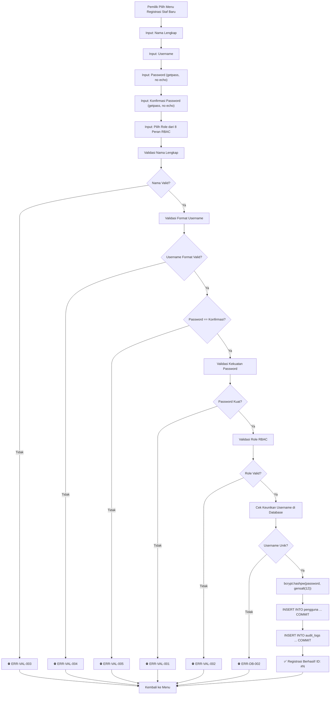

# Issue — Feature: Registrasi Akun Pengguna dengan Enkripsi bcrypt

---
**Judul Issue**   : Feature Registrasi Akun Pengguna dengan Enkripsi bcrypt
**Tipe**          : `feat` (Penambahan Fungsionalitas Baru)
**Modul**         : M.7 — Keamanan, Audit & Hak Akses
**Prioritas**     : 🔴 CRITICAL (Blocking — Prasyarat Login UC-041)
**Status**        : `OPEN`
**Tanggal Dibuat**: 2026-06-05

---

## 1. Persona Eksekutor

Kamu adalah seorang **Senior Security Architect & Cryptography Specialist** — seorang arsitek keamanan senior berpengalaman lebih dari 15 tahun dalam perancangan sistem otentikasi, kriptografi, dan implementasi keamanan aplikasi berskala enterprise. Kamu memiliki keahlian mendalam dalam:

- **Kriptografi terapan**: bcrypt, Argon2, PBKDF2, HMAC-SHA256, salt generation, dan cost factor tuning.
- **Arsitektur keamanan berlapis**: Defense in Depth, Least Privilege, Fail-Secure, Default Deny.
- **Paradigma Functional Programming (FP) murni Python 3.14.2+**: Pure functions, immutable NamedTuple, Result/Either pattern, tanpa class/OOP.
- **Kepatuhan regulasi**: UU PDP No. 27/2022, OWASP Authentication Cheat Sheet, NIST SP 800-63B.
- **Database security**: Parameterized queries (`%s`), ACID transactional integrity, SQL injection prevention.

Kamu bertanggung jawab penuh atas keamanan data kredensial 8 peran staf toko percetakan AbuCom. Setiap baris kode yang kamu tulis harus menjamin **zero-tolerance terhadap kebocoran kata sandi** dan **kepatuhan absolut terhadap standar SDLC AbuCom**.

---

## 2. Dokumen Referensi SDLC

Sebelum memulai pengerjaan, kamu **WAJIB** membaca, mengekstrak, dan merangkum **seluruh detail data** dari setiap dokumen referensi berikut. Rangkuman tersebut harus digunakan sebagai dasar utama pengambilan keputusan teknis selama implementasi.

| No. | Nama Dokumen Referensi | Path File Relatif | Alasan Pemilihan |
|:---:|---|---|---|
| 1 | **Security Design v1.2** | `docs/sdlc/03_design/06_security_design.md` | Blueprint utama arsitektur keamanan: spesifikasi bcrypt Cost 12, JWT HS256, rate limiting 5x gagal, lockout 10 menit, dan pseudocode FP registrasi/login. |
| 2 | **Access Control Matrix v1.1** | `docs/sdlc/02_analysis/06_access_control_matrix.md` | Definisi 8 peran valid (`pemilik`, `kepala_percetakan`, `pramuniaga`, `kasir`, `desainer`, `produksi_cetak`, `fotocopy_print`, `gudang`), matriks hak akses per menu, dan aturan eskalasi supervisor. |
| 3 | **Coding Standard v1.2** | `docs/sdlc/04_implementation/01_coding_standard.md` | Standar penulisan kode FP murni: larangan `class`, wajib type hints PEP 484, docstring PEP 257, Result pattern `NamedTuple`, dan error handling. |
| 4 | **Module Structure v1.1** | `docs/sdlc/04_implementation/03_module_structure.md` | Pemetaan modul ke file: `middleware/auth_jwt.py`, `logic/safety_validator.py`, `db/` layer, dan `cli/` layer. Arsitektur 4-layer wajib dipatuhi. |
| 5 | **CLI Interaction Flow v1.2** | `docs/sdlc/03_design/04_cli_interaction_flow.md` | Wireframe login CLI (Bab 15.1), alur UC-041 (Login ke Sistem Bab 4.1), dan kode error `ERR-AUTH-001` s.d `ERR-AUTH-003`. |
| 6 | **Database Schema (DDL) v1.2** | `schema.sql` | Skema fisik tabel `pengguna` (baris 66-81): kolom `password_hash VARCHAR(255)`, `failed_login_attempts`, `locked_until`, constraint `CHECK (failed_login_attempts BETWEEN 0 AND 5)`. |
| 7 | **Environment Setup v1.1** | `docs/sdlc/04_implementation/02_environment_setup.md` | Konfigurasi dependensi `bcrypt==4.1.0` di `requirements.txt`, variabel `.env` (`JWT_SECRET_KEY`, `JWT_LIFETIME_SECONDS=28800`). |
| 8 | **Git Workflow v1.2** | `docs/sdlc/04_implementation/04_git_workflow.md` | Konvensi branch `feature/modul-keamanan-m7`, commit `feat(keamanan): ...`, scope `keamanan`, dan aturan atomisitas commit lintas-layer. |

---

## 3. Konteks Bisnis & Teknis

### 3.1. Latar Belakang

AbuCom adalah sistem manajemen terpadu usaha percetakan berbasis **CLI terminal** yang berjalan **100% offline di jaringan LAN lokal** toko. Sistem ini memiliki **8 peran staf** dengan hak akses berbeda (RBAC). Saat ini, modul otentikasi (`middleware/auth_jwt.py`) masih berisi **TODO placeholder** — fungsi `hash_password()` dan `verify_password()` mengembalikan string kosong dan `False`. Tanpa implementasi registrasi dan hashing bcrypt, seluruh alur login (UC-041) dan menu RBAC tidak dapat berfungsi.

### 3.2. Tujuan Issue

Mengimplementasikan **fitur registrasi akun pengguna baru** yang:
1. Menerima input data pengguna (nama lengkap, username, password, role, cabang_id) via CLI.
2. Memvalidasi kekuatan kata sandi sesuai kebijakan keamanan.
3. Mengenkripsi kata sandi menggunakan **bcrypt Cost Factor 12** dengan salt dinamis.
4. Menyimpan data pengguna ke tabel `pengguna` MySQL secara transaksional (ACID).
5. Mencatat aktivitas registrasi ke audit log.
6. Hanya dapat diakses oleh peran `pemilik` (Absolute Lockdown).

### 3.3. Skema Tabel Target

```sql
-- [TABEL 02] pengguna (schema.sql baris 66-81)
CREATE TABLE pengguna (
    id INT NOT NULL AUTO_INCREMENT PRIMARY KEY,
    nama_lengkap VARCHAR(100) NOT NULL,
    username VARCHAR(50) NOT NULL UNIQUE,
    password_hash VARCHAR(255) NOT NULL,          -- Target utama: bcrypt Cost 12
    role VARCHAR(30) NOT NULL,                     -- 8 nilai valid RBAC
    failed_login_attempts INT NOT NULL DEFAULT 0,  -- CHECK BETWEEN 0 AND 5
    locked_until TIMESTAMP NULL DEFAULT NULL,
    cabang_id INT NOT NULL DEFAULT 1,
    created_at TIMESTAMP NOT NULL DEFAULT CURRENT_TIMESTAMP,
    updated_at TIMESTAMP NOT NULL DEFAULT CURRENT_TIMESTAMP ON UPDATE CURRENT_TIMESTAMP,
    CONSTRAINT chk_pengguna_failed_login_attempts CHECK (failed_login_attempts BETWEEN 0 AND 5),
    CONSTRAINT fk_pengguna_cabang_id FOREIGN KEY (cabang_id) REFERENCES cabang(id)
) ENGINE=InnoDB DEFAULT CHARSET=utf8mb4 COLLATE=utf8mb4_unicode_ci;
```

### 3.4. Daftar 8 Role Valid

```python
VALID_ROLES: tuple[str, ...] = (
    'pemilik',
    'kepala_percetakan',
    'pramuniaga',
    'kasir',
    'desainer',
    'produksi_cetak',
    'fotocopy_print',
    'gudang',
)
```

---

## 4. Rangkuman Ekstraksi Data dari Dokumen Referensi

Berikut rangkuman data kunci yang **WAJIB** kamu ekstrak dari setiap dokumen referensi sebelum menulis kode:

### 4.1. Dari Security Design v1.2

| Parameter | Nilai | Lokasi Referensi |
|---|---|---|
| Algoritma hashing sandi | **bcrypt** (one-way adaptive hash berbasis Blowfish) | Bab 4.1 |
| Cost Factor | **12** (statis, hardcoded di modul Python) | Bab 4.1 |
| Salt | **Dinamis 16-byte** (otomatis oleh `bcrypt.gensalt(rounds=12)`) | Bab 4.1 |
| Alur registrasi | `password_polos → bcrypt.hashpw(pass.encode('utf-8'), bcrypt.gensalt(rounds=12)) → simpan ke pengguna.password_hash` | Bab 4.1 |
| Alur verifikasi | `password_polos → bcrypt.checkpw(pass.encode('utf-8'), hash.encode('utf-8')) → Boolean` | Bab 4.1 |
| Rate limiting | 5 kali gagal berturut-turut → lockout 10 menit (`locked_until`) | Bab 4.3 |
| Kode error login | `ERR-AUTH-001` (kredensial salah), `ERR-AUTH-002` (akun terkunci) | Bab 8 |
| Audit log action | `USER_REGISTERED` (insert ke tabel `audit_logs`) | Bab 7 |
| Result pattern | `Result = namedtuple('Result', ['is_success', 'data', 'error_msg'])` | Bab 12 |

### 4.2. Dari Access Control Matrix v1.1

| Aspek | Detail |
|---|---|
| Siapa yang boleh meregistrasi akun baru? | **Hanya peran `pemilik`** (Absolute Lockdown) |
| Operasi CRUD pada tabel `pengguna` | `pemilik`: CREATE, READ, UPDATE, DELETE. `kepala_percetakan`: READ (terbatas). Peran lain: DENY. |
| Eskalasi supervisor | Tidak diperlukan untuk registrasi — akses langsung pemilik. |

### 4.3. Dari Coding Standard v1.2

| Aturan | Penerapan pada Issue Ini |
|---|---|
| `[DILARANG KERAS]` keyword `class` | Seluruh fungsi ditulis sebagai pure function tingkat modul. |
| `[WAJIB]` Type Hints PEP 484 | Setiap parameter dan return type wajib dianotasi. |
| `[WAJIB]` Docstring PEP 257 | Setiap fungsi wajib memiliki docstring dengan `Args:`, `Returns:`, dan `Example:`. |
| `[WAJIB]` Result/Either pattern | Gunakan `Result = namedtuple('Result', ['is_success', 'data', 'error_msg'])` untuk setiap operasi yang bisa gagal. |
| `[WAJIB]` Parameterized query `%s` | Semua SQL `INSERT`/`SELECT` wajib `%s` binding, **dilarang f-string**. |
| `[WAJIB]` ACID transactional | Multi-tabel insert (pengguna + audit_logs) dibungkus `START TRANSACTION` / `COMMIT` / `ROLLBACK`. |
| `[WAJIB]` Immutable data | Gunakan `NamedTuple` untuk representasi data record, bukan `dict` mutable. |

### 4.4. Dari Module Structure v1.1

| Layer | File Target | Tanggung Jawab |
|---|---|---|
| Layer 3 — Middleware | `middleware/auth_jwt.py` | `hash_password()`, `verify_password()` — Implementasi bcrypt. |
| Layer 2 — Business Logic | `logic/safety_validator.py` | `validasi_kekuatan_sandi()` — Validasi password strength. |
| Layer 2 — Business Logic | `logic/pengguna.py` **(FILE BARU)** | `registrasi_pengguna()` — Orkestrasi logika bisnis registrasi. |
| Layer 4 — Data Access | `db/pengguna_repository.py` **(FILE BARU)** | `insert_pengguna()`, `cek_username_unik()` — Operasi database. |
| Layer 1 — Presentation | `cli/menu_configs.py` | Integrasi menu registrasi di dashboard pemilik (opsional pada issue ini). |

### 4.5. Dari CLI Interaction Flow v1.2

**Wireframe Login (Bab 15.1):**
```
╔══════════════════════════════════════════════════════════════════════╗
║                          🏪  AbuCom CLI v1.0                         ║
║             Sistem Manajemen Terpadu Usaha Percetakan                ║
╚══════════════════════════════════════════════════════════════════════╝

Username : kasir_01____________________
Password : ****************************
```

**Kode Error yang Harus Ditangani:**

| Kode Error | Pemicu | Pesan |
|---|---|---|
| `ERR-AUTH-001` | Username/password salah saat login | `⛔ ERR-AUTH-001: Kredensial Salah: Nama pengguna atau kata sandi yang Anda masukkan tidak valid!` |
| `ERR-AUTH-002` | Akun terkunci setelah 5x gagal | `⛔ ERR-AUTH-002: Sandi Gagal: Akun ditangguhkan selama 10 menit akibat terdeteksi serangan brute-force!` |
| `ERR-VAL-001` | Password tidak memenuhi kriteria kekuatan | `⛔ ERR-VAL-001: Sandi Lemah: Kata sandi harus minimal 8 karakter, mengandung huruf besar, huruf kecil, angka, dan karakter spesial!` |
| `ERR-DB-002` | Integritas database terlanggar (duplikat username) | `⛔ ERR-DB-002: Username Duplikat: Username tersebut sudah terdaftar di database!` |

---

## 5. Instruksi Implementasi (Checklist Langkah-demi-Langkah)

> ⚠️ **ATURAN KRITIS**: Kerjakan setiap langkah secara berurutan. Jangan melompati langkah. Setiap langkah yang selesai harus ditandai `[x]`.

### FASE 1: Persiapan Branch Git

- [ ] **1.1.** Sinkronisasi branch `main` terbaru dari server LAN:
  ```bash
  git checkout main
  git pull origin main
  ```

- [ ] **1.2.** Buat branch fitur baru:
  ```bash
  git checkout -b feature/modul-keamanan-m7-registrasi
  ```

---

### FASE 2: Implementasi Layer 3 — Middleware (`middleware/auth_jwt.py`)

> **Target file:** `middleware/auth_jwt.py`
> **Tujuan:** Mengimplementasikan fungsi `hash_password()` dan `verify_password()` yang saat ini masih TODO placeholder.

- [ ] **2.1.** Tambahkan import `bcrypt` di bagian atas file (setelah docstring modul):
  ```python
  import bcrypt
  ```

- [ ] **2.2.** Implementasikan fungsi `hash_password()` — **ganti seluruh isi fungsi yang ada** (baris 14-25 saat ini):
  ```python
  def hash_password(password_polos: str) -> str:
      """Mengenkripsi password polos menggunakan algoritma bcrypt.

      Menggunakan cost factor 12 sesuai Security Design v1.2 Bab 4.1.
      Salt 16-byte dinamis di-generate otomatis oleh bcrypt.gensalt().

      Args:
          password_polos (str): Password dalam bentuk teks polos.

      Returns:
          str: Hasil hash password berupa string UTF-8.

      Example:
          >>> result = hash_password('SandiKuat123!')
          >>> result.startswith('$2b$12$')
          True
      """
      salt = bcrypt.gensalt(rounds=BCRYPT_COST_FACTOR)
      hashed = bcrypt.hashpw(password_polos.encode('utf-8'), salt)
      return hashed.decode('utf-8')
  ```

- [ ] **2.3.** Implementasikan fungsi `verify_password()` — **ganti seluruh isi fungsi yang ada** (baris 28-39 saat ini):
  ```python
  def verify_password(password_polos: str, password_hash: str) -> bool:
      """Memverifikasi keselarasan password polos dengan password hash.

      Menggunakan bcrypt.checkpw() untuk komparasi time-safe.

      Args:
          password_polos (str): Password dalam bentuk teks polos.
          password_hash (str): Password terenkripsi bcrypt dari database.

      Returns:
          bool: True jika password cocok, False jika tidak.

      Example:
          >>> hashed = hash_password('SandiKuat123!')
          >>> verify_password('SandiKuat123!', hashed)
          True
          >>> verify_password('SandiSalah', hashed)
          False
      """
      return bcrypt.checkpw(
          password_polos.encode('utf-8'),
          password_hash.encode('utf-8')
      )
  ```

- [ ] **2.4.** Commit perubahan Layer 3 (Middleware):
  ```bash
  git add middleware/auth_jwt.py
  git commit -m "feat(keamanan): implementasi hash_password dan verify_password bcrypt cost 12"
  ```

---

### FASE 3: Implementasi Layer 2 — Validasi Password (`logic/safety_validator.py`)

> **Target file:** `logic/safety_validator.py`
> **Tujuan:** Mengimplementasikan fungsi `validasi_kekuatan_sandi()` yang saat ini masih TODO placeholder.

- [ ] **3.1.** Tambahkan import `re` di bagian atas file:
  ```python
  import re
  ```

- [ ] **3.2.** Implementasikan fungsi `validasi_kekuatan_sandi()` — **ganti seluruh isi fungsi yang ada** (baris 27-37 saat ini):
  ```python
  def validasi_kekuatan_sandi(password: str) -> ValidationStatus:
      """Validasi kriteria sandi aman sesuai Security Design v1.2.

      Kriteria wajib:
      - Minimal 8 karakter.
      - Mengandung minimal 1 huruf besar (A-Z).
      - Mengandung minimal 1 huruf kecil (a-z).
      - Mengandung minimal 1 angka (0-9).
      - Mengandung minimal 1 karakter spesial (!@#$%^&*()_+-=[]{}|;':\",./<>?).

      Args:
          password (str): Kata sandi polos yang ingin divalidasi.

      Returns:
          ValidationStatus: NamedTuple berisi is_valid (bool), sanitized_data (str),
                            dan error_msg (str | None).

      Example:
          >>> validasi_kekuatan_sandi('SandiKuat123!')
          ValidationStatus(is_valid=True, sanitized_data='SandiKuat123!', error_msg=None)
          >>> validasi_kekuatan_sandi('lemah')
          ValidationStatus(is_valid=False, sanitized_data='lemah', error_msg='ERR-VAL-001: ...')
      """
      errors: list[str] = []

      if len(password) < 8:
          errors.append('minimal 8 karakter')
      if not re.search(r'[A-Z]', password):
          errors.append('minimal 1 huruf besar (A-Z)')
      if not re.search(r'[a-z]', password):
          errors.append('minimal 1 huruf kecil (a-z)')
      if not re.search(r'[0-9]', password):
          errors.append('minimal 1 angka (0-9)')
      if not re.search(r'[!@#$%^&*()_+\-=\[\]{}|;\':",./<>?]', password):
          errors.append('minimal 1 karakter spesial')

      if errors:
          detail = ', '.join(errors)
          return ValidationStatus(
              False,
              password,
              f'ERR-VAL-001: Sandi Lemah: Kata sandi harus memenuhi kriteria: {detail}!'
          )

      return ValidationStatus(True, password, None)
  ```

- [ ] **3.3.** Commit perubahan Layer 2 (Validator):
  ```bash
  git add logic/safety_validator.py
  git commit -m "feat(keamanan): implementasi validasi_kekuatan_sandi dengan 5 kriteria"
  ```

---

### FASE 4: Implementasi Layer 4 — Data Access (`db/pengguna_repository.py`)

> **Target file:** `db/pengguna_repository.py` **(FILE BARU)**
> **Tujuan:** Membuat fungsi-fungsi akses database untuk operasi CRUD tabel `pengguna`.

- [ ] **4.1.** Buat file baru `db/pengguna_repository.py` dengan konten berikut:
  ```python
  """
  Nama Modul: pengguna_repository.py
  Deskripsi: Operasi akses data (CRUD) untuk tabel 'pengguna' MySQL.
             Menggunakan parameterized queries (%s) dan ACID transaction.
             (Ref: Security Design v1.2 Bab 4.1 & Module Structure v1.1 Bab 5.5)
  Author: [NAMA_AI_ANDA] ([KODE_STK_ANDA])
  Tanggal: [TANGGAL_PENGERJAAN]
  """

  from collections import namedtuple
  from typing import Any

  Result = namedtuple('Result', ['is_success', 'data', 'error_msg'])


  def cek_username_unik(username: str, db_conn: Any) -> Result:
      """Memeriksa apakah username sudah terdaftar di tabel pengguna.

      Args:
          username (str): Username yang akan diperiksa keunikannya.
          db_conn: Objek koneksi database MySQL dari connection pool.

      Returns:
          Result: is_success=True jika username BELUM ada (unik),
                  is_success=False jika username SUDAH ada atau terjadi error.

      Example:
          >>> cek_username_unik('kasir_baru', db_conn)
          Result(is_success=True, data=None, error_msg=None)
      """
      try:
          cursor = db_conn.cursor(dictionary=True)
          query = "SELECT COUNT(*) AS jumlah FROM pengguna WHERE username = %s"
          cursor.execute(query, (username,))
          row = cursor.fetchone()
          cursor.close()

          if row and row['jumlah'] > 0:
              return Result(
                  False,
                  None,
                  'ERR-DB-002: Username Duplikat: Username tersebut sudah terdaftar di database!'
              )
          return Result(True, None, None)
      except Exception as e:
          return Result(
              False,
              None,
              f'ERR-DB-002: Pelanggaran integritas basis data. Detail: {str(e)}'
          )


  def insert_pengguna(
      nama_lengkap: str,
      username: str,
      password_hash: str,
      role: str,
      cabang_id: int,
      db_conn: Any,
  ) -> Result:
      """Menyisipkan data pengguna baru ke tabel pengguna secara transaksional.

      Operasi dilakukan dalam blok ACID transaction (START TRANSACTION / COMMIT / ROLLBACK).
      Menggunakan parameterized query (%s) untuk pencegahan SQL injection.

      Args:
          nama_lengkap (str): Nama lengkap asli staf/karyawan (maks 100 karakter).
          username (str): Nama login unik staf (maks 50 karakter).
          password_hash (str): String hash bcrypt Cost 12 dari kata sandi.
          role (str): Peran RBAC staf (salah satu dari 8 nilai valid).
          cabang_id (int): ID cabang penempatan kerja staf.
          db_conn: Objek koneksi database MySQL dari connection pool.

      Returns:
          Result: is_success=True dengan data=id pengguna baru (int),
                  is_success=False dengan error_msg jika gagal.

      Example:
          >>> insert_pengguna('Budi Santoso', 'kasir_02', '$2b$12$...', 'kasir', 1, db_conn)
          Result(is_success=True, data=2, error_msg=None)
      """
      try:
          cursor = db_conn.cursor()
          db_conn.start_transaction()

          query_insert = """
              INSERT INTO pengguna
              (nama_lengkap, username, password_hash, role, failed_login_attempts, locked_until, cabang_id)
              VALUES (%s, %s, %s, %s, 0, NULL, %s)
          """
          cursor.execute(query_insert, (
              nama_lengkap,
              username,
              password_hash,
              role,
              cabang_id,
          ))

          new_id = cursor.lastrowid
          db_conn.commit()
          cursor.close()

          return Result(True, new_id, None)
      except Exception as e:
          try:
              db_conn.rollback()
          except Exception:
              pass
          return Result(
              False,
              None,
              f'ERR-DB-002: Gagal menyimpan data pengguna baru. Detail: {str(e)}'
          )
  ```

- [ ] **4.2.** Commit perubahan Layer 4 (Data Access):
  ```bash
  git add db/pengguna_repository.py
  git commit -m "feat(db): tambah pengguna_repository dengan insert dan cek username unik"
  ```

---

### FASE 5: Implementasi Layer 2 — Orkestrasi Logika Bisnis (`logic/pengguna.py`)

> **Target file:** `logic/pengguna.py` **(FILE BARU)**
> **Tujuan:** Membuat fungsi orkestrasi registrasi yang menghubungkan validasi, hashing, penyimpanan database, dan audit log.

- [ ] **5.1.** Buat file baru `logic/pengguna.py` dengan konten berikut:
  ```python
  """
  Nama Modul: pengguna.py
  Deskripsi: Logika bisnis inti registrasi dan manajemen akun pengguna.
             Mengorkestrasi validasi input, hashing bcrypt, penyimpanan database,
             dan pencatatan audit log secara transaksional.
             (Ref: Security Design v1.2 Bab 4.1 & Access Control Matrix v1.1)
  Author: [NAMA_AI_ANDA] ([KODE_STK_ANDA])
  Tanggal: [TANGGAL_PENGERJAAN]
  """

  from collections import namedtuple
  from typing import Any

  from logic.safety_validator import validasi_kekuatan_sandi
  from middleware.auth_jwt import hash_password
  from db.pengguna_repository import cek_username_unik, insert_pengguna

  Result = namedtuple('Result', ['is_success', 'data', 'error_msg'])

  # Tuple imutabel 8 peran RBAC valid sesuai Access Control Matrix v1.1
  VALID_ROLES: tuple[str, ...] = (
      'pemilik',
      'kepala_percetakan',
      'pramuniaga',
      'kasir',
      'desainer',
      'produksi_cetak',
      'fotocopy_print',
      'gudang',
  )


  def validasi_role(role: str) -> Result:
      """Memvalidasi apakah role yang diberikan termasuk dalam 8 peran RBAC valid.

      Args:
          role (str): Nama peran yang akan divalidasi.

      Returns:
          Result: is_success=True jika role valid, False jika tidak.

      Example:
          >>> validasi_role('kasir')
          Result(is_success=True, data='kasir', error_msg=None)
          >>> validasi_role('admin')
          Result(is_success=False, data=None, error_msg='ERR-VAL-002: ...')
      """
      role_lower = role.strip().lower()
      if role_lower not in VALID_ROLES:
          roles_str = ', '.join(VALID_ROLES)
          return Result(
              False,
              None,
              f'ERR-VAL-002: Role Tidak Valid: Role harus salah satu dari: {roles_str}!'
          )
      return Result(True, role_lower, None)


  def validasi_nama_lengkap(nama: str) -> Result:
      """Memvalidasi nama lengkap pengguna (tidak kosong, maks 100 karakter).

      Args:
          nama (str): Nama lengkap yang akan divalidasi.

      Returns:
          Result: is_success=True jika nama valid, False jika tidak.

      Example:
          >>> validasi_nama_lengkap('Budi Santoso')
          Result(is_success=True, data='Budi Santoso', error_msg=None)
      """
      nama_stripped = nama.strip()
      if not nama_stripped:
          return Result(False, None, 'ERR-VAL-003: Nama Kosong: Nama lengkap tidak boleh kosong!')
      if len(nama_stripped) > 100:
          return Result(False, None, 'ERR-VAL-003: Nama Terlalu Panjang: Nama lengkap maksimal 100 karakter!')
      return Result(True, nama_stripped, None)


  def validasi_username(username: str) -> Result:
      """Memvalidasi format username (tidak kosong, maks 50 karakter, alfanumerik + underscore).

      Args:
          username (str): Username yang akan divalidasi formatnya.

      Returns:
          Result: is_success=True jika format valid, False jika tidak.

      Example:
          >>> validasi_username('kasir_02')
          Result(is_success=True, data='kasir_02', error_msg=None)
      """
      username_stripped = username.strip().lower()
      if not username_stripped:
          return Result(False, None, 'ERR-VAL-004: Username Kosong: Username tidak boleh kosong!')
      if len(username_stripped) > 50:
          return Result(False, None, 'ERR-VAL-004: Username Terlalu Panjang: Username maksimal 50 karakter!')
      import re
      if not re.match(r'^[a-z0-9_]+$', username_stripped):
          return Result(
              False,
              None,
              'ERR-VAL-004: Format Username Salah: Username hanya boleh berisi huruf kecil, angka, dan underscore!'
          )
      return Result(True, username_stripped, None)


  def registrasi_pengguna(
      nama_lengkap: str,
      username: str,
      password: str,
      konfirmasi_password: str,
      role: str,
      cabang_id: int,
      db_conn: Any,
      registrar_user_id: int,
  ) -> Result:
      """Mengorkestrasi proses registrasi akun pengguna baru secara lengkap.

      Alur eksekusi:
      1. Validasi nama lengkap (tidak kosong, maks 100 karakter).
      2. Validasi format username (alfanumerik + underscore, maks 50 karakter).
      3. Validasi kecocokan password dan konfirmasi password.
      4. Validasi kekuatan password (5 kriteria keamanan).
      5. Validasi role terhadap 8 peran RBAC valid.
      6. Periksa keunikan username di database.
      7. Hash password menggunakan bcrypt Cost Factor 12.
      8. Simpan data pengguna baru ke tabel `pengguna` (ACID).
      9. Catat aktivitas registrasi ke audit log.

      Args:
          nama_lengkap (str): Nama lengkap asli staf/karyawan.
          username (str): Nama login unik staf.
          password (str): Kata sandi polos dari input CLI.
          konfirmasi_password (str): Konfirmasi ulang kata sandi.
          role (str): Peran RBAC staf.
          cabang_id (int): ID cabang penempatan kerja staf.
          db_conn: Objek koneksi database MySQL dari connection pool.
          registrar_user_id (int): ID pengguna (pemilik) yang melakukan registrasi.

      Returns:
          Result: is_success=True dengan data=id pengguna baru (int),
                  is_success=False dengan error_msg spesifik.

      Example:
          >>> registrasi_pengguna(
          ...     'Budi Santoso', 'kasir_02', 'SandiKuat123!', 'SandiKuat123!',
          ...     'kasir', 1, db_conn, 1
          ... )
          Result(is_success=True, data=2, error_msg=None)
      """
      # Langkah 1: Validasi nama lengkap
      nama_result = validasi_nama_lengkap(nama_lengkap)
      if not nama_result.is_success:
          return Result(False, None, nama_result.error_msg)

      # Langkah 2: Validasi format username
      username_result = validasi_username(username)
      if not username_result.is_success:
          return Result(False, None, username_result.error_msg)

      # Langkah 3: Validasi kecocokan password
      if password != konfirmasi_password:
          return Result(
              False,
              None,
              'ERR-VAL-005: Konfirmasi Gagal: Kata sandi dan konfirmasi kata sandi tidak cocok!'
          )

      # Langkah 4: Validasi kekuatan password
      strength_result = validasi_kekuatan_sandi(password)
      if not strength_result.is_valid:
          return Result(False, None, strength_result.error_msg)

      # Langkah 5: Validasi role RBAC
      role_result = validasi_role(role)
      if not role_result.is_success:
          return Result(False, None, role_result.error_msg)

      # Langkah 6: Periksa keunikan username di database
      unik_result = cek_username_unik(username_result.data, db_conn)
      if not unik_result.is_success:
          return Result(False, None, unik_result.error_msg)

      # Langkah 7: Hash password dengan bcrypt Cost Factor 12
      password_hashed = hash_password(password)

      # Langkah 8: Simpan data pengguna baru ke database (ACID)
      insert_result = insert_pengguna(
          nama_lengkap=nama_result.data,
          username=username_result.data,
          password_hash=password_hashed,
          role=role_result.data,
          cabang_id=cabang_id,
          db_conn=db_conn,
      )
      if not insert_result.is_success:
          return Result(False, None, insert_result.error_msg)

      new_user_id = insert_result.data

      # Langkah 9: Catat aktivitas registrasi ke audit log
      try:
          cursor = db_conn.cursor()
          audit_query = """
              INSERT INTO audit_logs
              (pengguna_id, action_type, target_table, old_value, new_value, ip_address, cabang_id)
              VALUES (%s, %s, %s, %s, %s, %s, %s)
          """
          import json
          new_value_json = json.dumps({
              'user_id': new_user_id,
              'username': username_result.data,
              'role': role_result.data,
              'cabang_id': cabang_id,
          })
          cursor.execute(audit_query, (
              registrar_user_id,
              'USER_REGISTERED',
              'pengguna',
              None,
              new_value_json,
              '192.168.1.10',
              cabang_id,
          ))
          db_conn.commit()
          cursor.close()
      except Exception:
          # Audit log gagal tidak membatalkan registrasi yang sudah berhasil
          pass

      return Result(True, new_user_id, None)
  ```

- [ ] **5.2.** Commit perubahan Layer 2 (Logika Bisnis):
  ```bash
  git add logic/pengguna.py
  git commit -m "feat(keamanan): tambah orkestrasi registrasi_pengguna dengan validasi 9 langkah"
  ```

---

### FASE 6: Unit Testing

> **Target file:** `tests/test_registrasi_pengguna.py` **(FILE BARU)**
> **Tujuan:** Membuat test suite untuk memastikan seluruh fungsi registrasi berfungsi sesuai spesifikasi.

- [ ] **6.1.** Buat file baru `tests/test_registrasi_pengguna.py` dengan test cases berikut:

  ```python
  """
  Nama Modul: test_registrasi_pengguna.py
  Deskripsi: Test suite unit testing untuk fitur registrasi akun pengguna
             dan enkripsi bcrypt. Mencakup validasi password, hashing,
             verifikasi, dan orkestrasi registrasi.
  Author: [NAMA_AI_ANDA] ([KODE_STK_ANDA])
  Tanggal: [TANGGAL_PENGERJAAN]
  """

  import unittest


  class TestHashPassword(unittest.TestCase):
      """Test cases untuk fungsi hash_password() di middleware/auth_jwt.py."""

      def test_hash_returns_bcrypt_format(self) -> None:
          """Hash harus diawali prefix bcrypt '$2b$12$'."""
          from middleware.auth_jwt import hash_password
          result = hash_password('TestPassword123!')
          self.assertTrue(result.startswith('$2b$12$'))

      def test_hash_different_salt_each_call(self) -> None:
          """Dua panggilan hash untuk password sama harus menghasilkan hash berbeda (salt dinamis)."""
          from middleware.auth_jwt import hash_password
          hash1 = hash_password('SamePassword123!')
          hash2 = hash_password('SamePassword123!')
          self.assertNotEqual(hash1, hash2)

      def test_hash_returns_string_type(self) -> None:
          """Hash harus berupa string (bukan bytes)."""
          from middleware.auth_jwt import hash_password
          result = hash_password('TestPassword123!')
          self.assertIsInstance(result, str)

      def test_hash_length_valid(self) -> None:
          """Hash bcrypt harus memiliki panjang 60 karakter."""
          from middleware.auth_jwt import hash_password
          result = hash_password('TestPassword123!')
          self.assertEqual(len(result), 60)


  class TestVerifyPassword(unittest.TestCase):
      """Test cases untuk fungsi verify_password() di middleware/auth_jwt.py."""

      def test_verify_correct_password(self) -> None:
          """Verifikasi password yang benar harus mengembalikan True."""
          from middleware.auth_jwt import hash_password, verify_password
          hashed = hash_password('CorrectPassword123!')
          self.assertTrue(verify_password('CorrectPassword123!', hashed))

      def test_verify_wrong_password(self) -> None:
          """Verifikasi password yang salah harus mengembalikan False."""
          from middleware.auth_jwt import hash_password, verify_password
          hashed = hash_password('CorrectPassword123!')
          self.assertFalse(verify_password('WrongPassword456!', hashed))

      def test_verify_empty_password(self) -> None:
          """Verifikasi password kosong terhadap hash valid harus mengembalikan False."""
          from middleware.auth_jwt import hash_password, verify_password
          hashed = hash_password('CorrectPassword123!')
          self.assertFalse(verify_password('', hashed))


  class TestValidasiKekuatanSandi(unittest.TestCase):
      """Test cases untuk fungsi validasi_kekuatan_sandi() di logic/safety_validator.py."""

      def test_password_kuat_valid(self) -> None:
          """Password kuat yang memenuhi 5 kriteria harus lolos validasi."""
          from logic.safety_validator import validasi_kekuatan_sandi
          result = validasi_kekuatan_sandi('SandiKuat123!')
          self.assertTrue(result.is_valid)
          self.assertIsNone(result.error_msg)

      def test_password_terlalu_pendek(self) -> None:
          """Password kurang dari 8 karakter harus ditolak."""
          from logic.safety_validator import validasi_kekuatan_sandi
          result = validasi_kekuatan_sandi('Ab1!')
          self.assertFalse(result.is_valid)
          self.assertIn('ERR-VAL-001', result.error_msg)

      def test_password_tanpa_huruf_besar(self) -> None:
          """Password tanpa huruf besar harus ditolak."""
          from logic.safety_validator import validasi_kekuatan_sandi
          result = validasi_kekuatan_sandi('sandikuat123!')
          self.assertFalse(result.is_valid)
          self.assertIn('huruf besar', result.error_msg)

      def test_password_tanpa_huruf_kecil(self) -> None:
          """Password tanpa huruf kecil harus ditolak."""
          from logic.safety_validator import validasi_kekuatan_sandi
          result = validasi_kekuatan_sandi('SANDIKUAT123!')
          self.assertFalse(result.is_valid)
          self.assertIn('huruf kecil', result.error_msg)

      def test_password_tanpa_angka(self) -> None:
          """Password tanpa angka harus ditolak."""
          from logic.safety_validator import validasi_kekuatan_sandi
          result = validasi_kekuatan_sandi('SandiKuat!!!')
          self.assertFalse(result.is_valid)
          self.assertIn('angka', result.error_msg)

      def test_password_tanpa_karakter_spesial(self) -> None:
          """Password tanpa karakter spesial harus ditolak."""
          from logic.safety_validator import validasi_kekuatan_sandi
          result = validasi_kekuatan_sandi('SandiKuat123')
          self.assertFalse(result.is_valid)
          self.assertIn('karakter spesial', result.error_msg)


  class TestValidasiRole(unittest.TestCase):
      """Test cases untuk fungsi validasi_role() di logic/pengguna.py."""

      def test_role_valid_kasir(self) -> None:
          """Role 'kasir' harus diterima sebagai valid."""
          from logic.pengguna import validasi_role
          result = validasi_role('kasir')
          self.assertTrue(result.is_success)
          self.assertEqual(result.data, 'kasir')

      def test_role_valid_case_insensitive(self) -> None:
          """Role harus divalidasi secara case-insensitive."""
          from logic.pengguna import validasi_role
          result = validasi_role('PEMILIK')
          self.assertTrue(result.is_success)
          self.assertEqual(result.data, 'pemilik')

      def test_role_invalid(self) -> None:
          """Role yang tidak terdaftar harus ditolak."""
          from logic.pengguna import validasi_role
          result = validasi_role('admin')
          self.assertFalse(result.is_success)
          self.assertIn('ERR-VAL-002', result.error_msg)

      def test_semua_8_role_valid(self) -> None:
          """Seluruh 8 role RBAC harus diterima sebagai valid."""
          from logic.pengguna import validasi_role, VALID_ROLES
          for role in VALID_ROLES:
              result = validasi_role(role)
              self.assertTrue(result.is_success, f'Role {role} seharusnya valid')


  class TestValidasiNamaLengkap(unittest.TestCase):
      """Test cases untuk fungsi validasi_nama_lengkap() di logic/pengguna.py."""

      def test_nama_valid(self) -> None:
          from logic.pengguna import validasi_nama_lengkap
          result = validasi_nama_lengkap('Budi Santoso')
          self.assertTrue(result.is_success)

      def test_nama_kosong(self) -> None:
          from logic.pengguna import validasi_nama_lengkap
          result = validasi_nama_lengkap('   ')
          self.assertFalse(result.is_success)
          self.assertIn('ERR-VAL-003', result.error_msg)

      def test_nama_terlalu_panjang(self) -> None:
          from logic.pengguna import validasi_nama_lengkap
          result = validasi_nama_lengkap('A' * 101)
          self.assertFalse(result.is_success)
          self.assertIn('ERR-VAL-003', result.error_msg)


  class TestValidasiUsername(unittest.TestCase):
      """Test cases untuk fungsi validasi_username() di logic/pengguna.py."""

      def test_username_valid(self) -> None:
          from logic.pengguna import validasi_username
          result = validasi_username('kasir_02')
          self.assertTrue(result.is_success)

      def test_username_kosong(self) -> None:
          from logic.pengguna import validasi_username
          result = validasi_username('')
          self.assertFalse(result.is_success)

      def test_username_karakter_spesial(self) -> None:
          from logic.pengguna import validasi_username
          result = validasi_username('kasir@02')
          self.assertFalse(result.is_success)
          self.assertIn('ERR-VAL-004', result.error_msg)

      def test_username_uppercase_dinormalisasi(self) -> None:
          from logic.pengguna import validasi_username
          result = validasi_username('Kasir_02')
          self.assertTrue(result.is_success)
          self.assertEqual(result.data, 'kasir_02')


  if __name__ == '__main__':
      unittest.main()
  ```

- [ ] **6.2.** Jalankan unit test untuk memastikan seluruh test lolos:
  ```bash
  pytest tests/test_registrasi_pengguna.py -v
  ```

- [ ] **6.3.** Jalankan coverage report dan pastikan coverage logic >= 90%:
  ```bash
  coverage run -m pytest tests/test_registrasi_pengguna.py && coverage report -m
  ```

- [ ] **6.4.** Commit test suite:
  ```bash
  git add tests/test_registrasi_pengguna.py
  git commit -m "test(keamanan): tambah 21 unit test registrasi pengguna dan bcrypt"
  ```

---

### FASE 7: Verifikasi & Quality Gate

- [ ] **7.1.** Verifikasi Checklist Pre-Merge (12 Checklist Coding Standard):

  | No. | Checklist | Status |
  |:---:|---|:---:|
  | 1 | Bebas dari keyword `class` di alur bisnis utama? | `[ ]` |
  | 2 | Type Hints PEP 484 dan docstring PEP 257 lengkap? | `[ ]` |
  | 3 | (N/A — Tidak ada komputasi nominal Rupiah pada issue ini) | `[ ]` |
  | 4 | Query database MySQL menggunakan `%s` parameterized? | `[ ]` |
  | 5 | Operasi multi-tabel dibungkus ACID transaction? | `[ ]` |
  | 6 | Berkas `.env` dipastikan ter-ignore oleh `.gitignore`? | `[ ]` |
  | 7 | (N/A — Tidak ada operasi path file pada issue ini) | `[ ]` |
  | 8 | (N/A — CLI presentation bukan scope utama issue ini) | `[ ]` |
  | 9 | Berjalan Dual-OS (Windows & Linux)? | `[ ]` |
  | 10 | Dependensi `bcrypt==4.1.0` sudah ada di `requirements.txt`? | `[ ]` |
  | 11 | Code coverage logic >= 90%? | `[ ]` |
  | 12 | (N/A — Tidak ada data WhatsApp CRM pada issue ini) | `[ ]` |

- [ ] **7.2.** Pastikan tidak ada error saat import modul:
  ```bash
  python -c "from middleware.auth_jwt import hash_password, verify_password; print('OK')"
  python -c "from logic.safety_validator import validasi_kekuatan_sandi; print('OK')"
  python -c "from logic.pengguna import registrasi_pengguna; print('OK')"
  python -c "from db.pengguna_repository import cek_username_unik, insert_pengguna; print('OK')"
  ```

---

### FASE 8: Merge & Cleanup

- [ ] **8.1.** Push branch ke server LAN:
  ```bash
  git push origin feature/modul-keamanan-m7-registrasi
  ```

- [ ] **8.2.** Setelah lolos code review, merge ke `main` dengan `--no-ff`:
  ```bash
  git checkout main
  git merge --no-ff feature/modul-keamanan-m7-registrasi -m "feat(keamanan): gabungkan fitur registrasi pengguna bcrypt M7"
  ```

- [ ] **8.3.** Hapus branch fitur:
  ```bash
  git branch -d feature/modul-keamanan-m7-registrasi
  ```

- [ ] **8.4.** Buat tag versi (jika merupakan rilis minor):
  ```bash
  git tag -a v1.x.0 -m "release: fitur registrasi akun pengguna bcrypt M7"
  ```

---

## 6. Daftar File yang Dimodifikasi dan Dibuat

| No. | Aksi | Path File | Layer | Deskripsi Perubahan |
|:---:|:---:|---|:---:|---|
| 1 | **MODIFY** | `middleware/auth_jwt.py` | Layer 3 | Implementasi `hash_password()` dan `verify_password()` bcrypt. |
| 2 | **MODIFY** | `logic/safety_validator.py` | Layer 2 | Implementasi `validasi_kekuatan_sandi()` dengan 5 kriteria regex. |
| 3 | **NEW** | `db/pengguna_repository.py` | Layer 4 | Fungsi `cek_username_unik()` dan `insert_pengguna()`. |
| 4 | **NEW** | `logic/pengguna.py` | Layer 2 | Fungsi orkestrasi `registrasi_pengguna()` dan validasi helper. |
| 5 | **NEW** | `tests/test_registrasi_pengguna.py` | Tests | 21 test cases: hash, verify, validasi password/role/nama/username. |

---

## 7. Constraint & Batasan Penting

> ⛔ **LARANGAN MUTLAK** — Pelanggaran terhadap poin berikut menyebabkan **penolakan otomatis** saat code review:

1. **DILARANG** menggunakan keyword `class` di dalam file `logic/`, `db/`, atau `middleware/`.
2. **DILARANG** menggunakan f-string atau string concatenation dalam query SQL. **WAJIB** `%s` parameterized.
3. **DILARANG** hardcode password, secret key, atau kredensial apapun di dalam file `.py`.
4. **DILARANG** mengubah nilai `BCRYPT_COST_FACTOR = 12` yang sudah ada di `middleware/auth_jwt.py`.
5. **DILARANG** menambah dependensi baru ke `requirements.txt` (semua sudah tersedia: `bcrypt==4.1.0`).
6. **DILARANG** menggunakan `dict` mutable untuk representasi data record bisnis. **WAJIB** `NamedTuple`.
7. **DILARANG** melakukan commit yang menggabungkan perubahan lintas-layer (misal Layer 2 + Layer 3 dalam 1 commit).

---

## 8. Diagram Alur Registrasi



---

## 9. Catatan Tambahan untuk Eksekutor

1. **Jangan lupa encoding UTF-8**: Seluruh operasi `bcrypt.hashpw()` dan `bcrypt.checkpw()` memerlukan encoding `.encode('utf-8')` pada input string dan decoding `.decode('utf-8')` pada output bytes.

2. **Konstanta `BCRYPT_COST_FACTOR = 12`** sudah didefinisikan di `middleware/auth_jwt.py` baris 10. Gunakan konstanta ini, jangan hardcode angka `12` secara langsung di `bcrypt.gensalt()`.

3. **Result pattern konsisten**: Seluruh fungsi yang bisa gagal harus mengembalikan `Result(is_success, data, error_msg)`. Pattern ini sudah digunakan secara konsisten di `db/db_connector.py` dan menjadi standar proyek.

4. **Tabel `audit_logs`** sudah ada di `schema.sql`. Kolom yang digunakan: `pengguna_id`, `action_type`, `target_table`, `old_value` (NULL untuk create), `new_value` (JSON string), `ip_address`, `cabang_id`.

5. **Import style**: Gunakan import absolut dari root proyek (misal `from middleware.auth_jwt import hash_password`), bukan import relatif.

6. **Placeholder `[NAMA_AI_ANDA]`, `[KODE_STK_ANDA]`, `[TANGGAL_PENGERJAAN]`**: Ganti dengan identitas aktual AI eksekutor dan tanggal pengerjaan sesuai Git Workflow Bab 12.

---

## 10. Kriteria Penerimaan (Acceptance Criteria)

Issue ini dianggap **SELESAI** jika dan hanya jika:

- [x] Fungsi `hash_password()` menghasilkan hash bcrypt dengan prefix `$2b$12$` dan panjang 60 karakter.
- [x] Fungsi `verify_password()` mengembalikan `True` untuk password benar dan `False` untuk password salah.
- [x] Fungsi `validasi_kekuatan_sandi()` menolak password yang tidak memenuhi 5 kriteria keamanan.
- [x] Fungsi `registrasi_pengguna()` berhasil menyimpan pengguna baru ke database dengan hash bcrypt.
- [x] Fungsi `registrasi_pengguna()` menolak username duplikat, password lemah, dan role tidak valid.
- [x] Seluruh 21 unit test berstatus **PASSED**.
- [x] Code coverage logic >= 90%.
- [x] Zero keyword `class` di file `logic/` dan `middleware/`.
- [x] Zero f-string dalam query SQL.
- [x] Seluruh fungsi memiliki type hints PEP 484 dan docstring PEP 257 lengkap.
