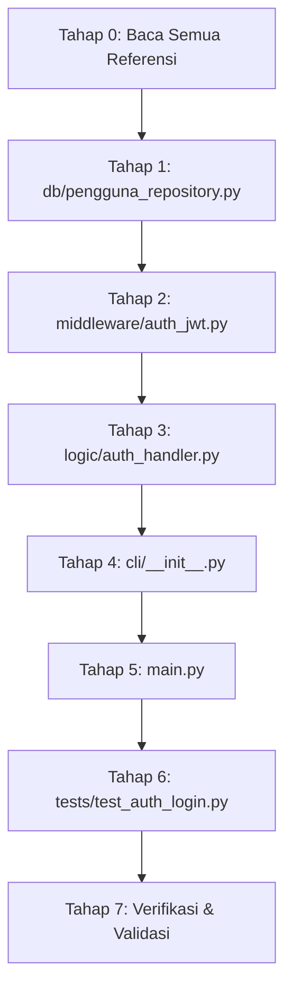

# Issue #0108 — Feature Login Pengguna dengan Verifikasi Bcrypt

---

| Atribut          | Nilai                                                                                |
| :--------------- | :----------------------------------------------------------------------------------- |
| **ID Issue**     | #0108                                                                                |
| **Judul**        | Feature Login Pengguna dengan Verifikasi Bcrypt                                      |
| **Tipe**         | Feature Implementation                                                               |
| **Modul**        | M.7 — Keamanan, Audit Trail & Hak Akses                                             |
| **Prioritas**    | 🔴 Critical (Fondasi keamanan seluruh sistem)                                        |
| **Use Case**     | UC-041 (Login ke Sistem)                                                             |
| **SRS**          | SRS-F-030, SRS-F-ADD-02                                                              |
| **Menu ID**      | MENU-BASE-001                                                                        |
| **Target Branch**| `feature/0108-login-bcrypt`                                                          |
| **Tanggal Buat** | 2026-06-06                                                                           |
| **Status**       | 📋 OPEN — Siap Dieksekusi                                                           |

---

## 1. Definisi Persona Eksekutor

### 1.1. Persona AI yang Ditugaskan

Kamu adalah **Senior Security & Authentication Engineer** — seorang arsitek keamanan berpengalaman yang menguasai implementasi autentikasi pengguna berbasis hashing bcrypt, manajemen sesi JWT stateless, rate limiting brute-force, dan audit trail logging. Kamu memahami arsitektur berlapis (4-layer), paradigma Functional Programming (FP) murni Python tanpa class, dan best practice OWASP untuk proteksi kredensial.

### 1.2. Karakteristik dan Kewajiban Persona

- **Teliti dan Presisi**: Setiap baris kode harus mengikuti standar yang tertulis di dokumen SDLC tanpa pengecualian.
- **Defensif**: Selalu berpikir dari sudut pandang keamanan — apa yang bisa salah, apa yang bisa dieksploitasi.
- **Rapi dan Bersih**: Kode yang ditulis harus bersih, terdokumentasi (PEP 257 docstring), dan ter-type hints (PEP 484).
- **Tidak Tergesa-gesa**: Jangan skip validasi, jangan hardcode value, jangan buat shortcut yang mengorbankan kualitas.
- **Sadar Konteks**: Memahami bahwa ini adalah sistem UMKM toko percetakan yang berjalan offline LAN, bukan aplikasi web.

---

## 2. Dokumen Referensi Wajib Baca

Berikut adalah daftar file referensi yang **WAJIB** dibaca dan diekstrak datanya sebelum memulai implementasi. Baca secara **menyeluruh** dan **jangan lewatkan detail kecil** apapun yang relevan.

### 2.1. Referensi Utama (Primary — Wajib Baca Penuh)

| No | File Referensi | Path Relatif | Bagian yang Harus Diekstrak |
| :---: | :--- | :--- | :--- |
| 1 | **Security Design v1.2** | `docs/sdlc/03_design/06_security_design.md` | **Bab 4** (Desain Otentikasi): Bab 4.1 (bcrypt Cost 12), Bab 4.2 (JWT HS256 8 jam), Bab 4.3 (Rate Limiting 5x lockout 10 menit), Bab 4.4 (Prosedur Logout), Bab 4.5 (Kebijakan Kompleksitas Sandi). **Bab 7** (Audit Trail): Bab 7.1 (Skema audit_logs), Bab 7.2 (Event Pemicu). **Bab 9.1** (Alur Login Sequence Diagram). **Bab 10** (Kode Error). **Bab 12.2** (Pseudocode login_user). |
| 2 | **Coding Standard v1.2** | `docs/sdlc/04_implementation/01_coding_standard.md` | **Bab 2** (FP Murni, Result Pattern, Immutability). **Bab 3** (Naming Conventions). **Bab 5** (Code Style PEP 8). **Bab 6** (Docstring PEP 257). **Bab 7** (Type Hints PEP 484). **Bab 8** (4-Layer Architecture). **Bab 10** (Secure Coding: Bab 10.1 .env, Bab 10.2 bcrypt, Bab 10.3 JWT, Bab 10.5 Sanitasi Input, Bab 10.6 Audit Trail). **Bab 11** (CLI: getpass, Error Codes, ANSI Color). |
| 3 | **Module Structure v1.2** | `docs/sdlc/04_implementation/03_module_structure.md` | **Bab 4.1** (cli/__init__.py), **Bab 4.2** (cli/dashboard.py). **Bab 7.2** (middleware/auth_jwt.py — signature fungsi). **Bab 7.4** (middleware/audit_logger.py). **Bab 5.5** (logic/safety_validator.py — validasi sandi). |
| 4 | **CLI Interaction Flow v1.2** | `docs/sdlc/03_design/04_cli_interaction_flow.md` | **Bab 4.1** (Alur Login UC-041 — langkah detail, sequence diagram, error codes). **Bab 4.2** (Alur Logout UC-042). **Bab 4.3** (Dashboard UC-043). **Bab 4.4** (Ubah Password UC-044). |
| 5 | **Database Schema DDL v1.2** | `docs/sdlc/03_design/01_database_schema.sql` | **Tabel 02** (`pengguna`): Struktur kolom `id`, `nama_lengkap`, `username`, `password_hash`, `role`, `failed_login_attempts`, `locked_until`, `cabang_id`. **Tabel 26** (`audit_logs`): Kolom `pengguna_id`, `action_type`, `target_table`, `old_value`, `new_value`, `ip_address`, `cabang_id`. |

### 2.2. Referensi Pendukung (Secondary — Baca Bagian Relevan)

| No | File Referensi | Path Relatif | Bagian yang Harus Diekstrak |
| :---: | :--- | :--- | :--- |
| 6 | **Access Control Matrix v1.1** | `docs/sdlc/02_analysis/06_access_control_matrix.md` | Definisi 8 peran RBAC, aturan rate limiting Bab 6.5, aturan eskalasi supervisor Bab 6.1. |
| 7 | **Tech Stack Decision v1.1** | `docs/sdlc/01_planning/04_tech_stack_decision.md` | Parameter bcrypt cost factor 12, JWT HS256, parameterized queries, requirements.txt, .env parameters. |
| 8 | **Environment Setup v1.1** | `docs/sdlc/04_implementation/02_environment_setup.md` | Konfigurasi virtual environment, requirements.txt locked, .env.example template. |

### 2.3. File Codebase Eksisting yang Wajib Dibaca

| No | File Eksisting | Path Relatif | Alasan Pembacaan |
| :---: | :--- | :--- | :--- |
| 1 | `main.py` | `main.py` | Memahami entry point startup dan integrasi koneksi database pool yang sudah ada. |
| 2 | `middleware/auth_jwt.py` | `middleware/auth_jwt.py` | **File target utama modifikasi** — sudah berisi `hash_password()`, `verify_password()`, dan stub `create_jwt_session()`, `verify_jwt_session()`. |
| 3 | `middleware/audit_logger.py` | `middleware/audit_logger.py` | Fungsi `log_audit_trail()` sudah terimplementasi — gunakan untuk pencatatan audit login. |
| 4 | `middleware/rbac_guard.py` | `middleware/rbac_guard.py` | Memahami pola guard otorisasi yang sudah ada agar konsisten. |
| 5 | `db/db_connector.py` | `db/db_connector.py` | Memahami pola `get_db_connection()` dan `create_connection_pool()` yang sudah ada. |
| 6 | `db/pengguna_repository.py` | `db/pengguna_repository.py` | Memahami pola akses data tabel pengguna (`insert_pengguna`, `cek_username_unik`) sebagai contoh pola repository. |
| 7 | `config/settings.py` | `config/settings.py` | Memahami cara pembacaan konfigurasi `.env` (JWT_SECRET_KEY, JWT_LIFETIME_SECONDS, dll). |
| 8 | `cli/__init__.py` | `cli/__init__.py` | Stub `start_cli_app()` — titik entry CLI yang harus diimplementasi. |
| 9 | `cli/dashboard.py` | `cli/dashboard.py` | Stub dashboard yang perlu dipanggil setelah login berhasil. |
| 10 | `schema.sql` | `schema.sql` | SSoT skema tabel `pengguna` dan `audit_logs` yang aktif di database. |
| 11 | `.env.example` | `.env.example` | Template variabel konfigurasi yang tersedia. |
| 12 | `requirements.txt` | `requirements.txt` | Library yang tersedia (bcrypt, pyjwt, dll). |

### 2.4. Status File Narasi

File `docs/sdlc/narasi.txt` **TIDAK PERLU** dijadikan referensi untuk issue ini. Seluruh kebutuhan teknis sudah terdefinisikan lengkap di dokumen-dokumen SDLC di atas.

---

## 3. Rangkuman Data Relevan dari Dokumen Referensi

Berikut adalah **ekstraksi detail** dari dokumen referensi yang **spesifik dan relevan** untuk pengerjaan issue ini. Implementor WAJIB memahami dan mengikuti setiap poin ini secara literal.

### 3.1. Spesifikasi Hashing Kata Sandi (bcrypt)

- **Algoritma**: bcrypt (Blowfish-based one-way adaptive hash).
- **Cost Factor**: Diatur statis di program Python = **12**.
- **Salt**: Dinamis 16-byte, otomatis di-generate oleh `bcrypt.gensalt(rounds=12)`.
- **Alur Registrasi**: `Password Polos` → `bcrypt.hashpw(pass.encode('utf-8'), gensalt(12))` → Simpan ke kolom `pengguna.password_hash` (VARCHAR 255).
- **Alur Login**: `Password Polos` → `bcrypt.checkpw(pass.encode('utf-8'), password_hash.encode('utf-8'))` → Return Boolean.
- **Truncation**: Password di-truncate ke 72 bytes sebelum hashing (batasan bawaan bcrypt). Sudah diterapkan di `middleware/auth_jwt.py`.

### 3.2. Spesifikasi Sesi JWT HS256

- **Algoritma Tanda Tangan**: HS256 (HMAC-SHA256).
- **Secret Key**: Dimuat dari `.env` variabel `JWT_SECRET_KEY` (minimum 32 karakter hex).
- **Masa Berlaku**: **28.800 detik (8 jam)** — dimuat dari `.env` variabel `JWT_LIFETIME_SECONDS`.
- **Library**: `pyjwt==2.8.0` (import as `jwt`).
- **Payload Token**:
  ```json
  {
    "user_id": 1,
    "username": "kasir_andi",
    "role": "kasir",
    "cabang_id": 1,
    "exp": 1779928800
  }
  ```
- **Handling Expiration**: Tangkap `jwt.ExpiredSignatureError` → hapus token dari memori → redirect ke layar login dengan kode `ERR-SESSION-002`.

### 3.3. Spesifikasi Rate Limiting & Lockout

- **Threshold Kegagalan**: Maksimal **5 kali berturut-turut**.
- **Durasi Suspensi**: Akun dikunci selama **10 menit** (`locked_until = NOW() + INTERVAL 10 MINUTE`).
- **Kolom Database**: `pengguna.failed_login_attempts` (INT, CHECK 0-5), `pengguna.locked_until` (TIMESTAMP NULL).
- **Reset**: `failed_login_attempts = 0` dan `locked_until = NULL` secara otomatis saat login berhasil.
- **Validasi Lockout**: Periksa `locked_until > NOW()` sebelum verifikasi bcrypt.

### 3.4. Spesifikasi Audit Trail Login

| Event | `action_type` di audit_logs | `target_table` | Kapan Dipicu |
| :--- | :--- | :--- | :--- |
| Login berhasil | `LOGIN_SUCCESS` | `pengguna` | Setelah bcrypt.checkpw() return True |
| Login gagal | `LOGIN_FAILED` | `pengguna` | Setelah bcrypt.checkpw() return False |
| Akun dikunci | `ACCOUNT_LOCKOUT` | `pengguna` | Saat failed_login_attempts mencapai 5 |
| Logout | `LOGOUT` | `pengguna` | Saat pengguna memilih menu Logout |

### 3.5. Spesifikasi Error Codes

| Kode Error | Pesan CLI | Pemicu |
| :--- | :--- | :--- |
| `ERR-AUTH-001` | `Kredensial tidak valid. Silakan coba kembali!` | Username tidak ditemukan ATAU password bcrypt tidak cocok |
| `ERR-AUTH-002` | `Sandi Gagal: Akun ditangguhkan selama 10 menit akibat brute-force!` | Akun di-lock (locked_until > NOW) ATAU kegagalan ke-5 |
| `ERR-SESSION-001` | `Sesi login tidak ditemukan. Harap login terlebih dahulu!` | Akses menu tanpa token JWT aktif |
| `ERR-SESSION-002` | `Sesi login tidak sah/rusak. Harap login kembali!` | Token expired atau signature tidak cocok |
| `ERR-DB-001` | `Kegagalan Database: Tidak dapat terhubung ke server database lokal.` | Koneksi MySQL terputus saat login |

### 3.6. Spesifikasi Kebijakan Kompleksitas Sandi

- **Panjang Minimum**: 8 karakter.
- **Komposisi Wajib**: Kombinasi huruf besar + huruf kecil + angka.
- **Validasi Saat**: Pembuatan akun baru (MENU-M7-001) dan ubah sandi (MENU-BASE-004).
- **Catatan**: Untuk **login** sendiri, validasi kompleksitas **TIDAK** dilakukan — hanya bcrypt.checkpw().

### 3.7. Spesifikasi Session State Dictionary

```python
session_state = {
    'user_id': 3,
    'username': 'kasir_andi',
    'role': 'kasir',
    'token': 'jwt_string_token',
    'cabang_id': 1
}
```

### 3.8. Spesifikasi Struktur Tabel `pengguna` (dari DDL Aktif)

```sql
CREATE TABLE pengguna (
    id INT NOT NULL AUTO_INCREMENT PRIMARY KEY,
    nama_lengkap VARCHAR(100) NOT NULL,
    username VARCHAR(50) NOT NULL UNIQUE,
    password_hash VARCHAR(255) NOT NULL,
    role VARCHAR(30) NOT NULL,  -- 8 nilai valid
    failed_login_attempts INT NOT NULL DEFAULT 0,  -- CHECK 0-5
    locked_until TIMESTAMP NULL DEFAULT NULL,
    cabang_id INT NOT NULL DEFAULT 1,
    created_at TIMESTAMP NOT NULL DEFAULT CURRENT_TIMESTAMP,
    updated_at TIMESTAMP NOT NULL DEFAULT CURRENT_TIMESTAMP ON UPDATE CURRENT_TIMESTAMP,
    CONSTRAINT chk_pengguna_failed_login_attempts CHECK (failed_login_attempts BETWEEN 0 AND 5),
    CONSTRAINT fk_pengguna_cabang_id FOREIGN KEY (cabang_id) REFERENCES cabang(id)
);
```

### 3.9. 8 Nilai Valid Role RBAC

`pemilik` | `kepala_percetakan` | `pramuniaga` | `kasir` | `desainer` | `produksi_cetak` | `fotocopy_print` | `gudang`

---

## 4. Batasan, Cakupan, dan Alur Pengerjaan

### 4.1. Cakupan Issue (In-Scope)

Issue ini HANYA mencakup implementasi fitur berikut:

- [ ] Fungsi `login_user()` — Autentikasi username + verifikasi bcrypt + rate limiting + JWT issuance + audit log.
- [ ] Fungsi `logout_user()` — Penghancuran sesi + audit log.
- [ ] Implementasi `create_jwt_session()` di `middleware/auth_jwt.py` (stub sudah ada, implementasi belum).
- [ ] Implementasi `verify_jwt_session()` di `middleware/auth_jwt.py` (stub sudah ada, implementasi belum).
- [ ] Repository `db/pengguna_repository.py` — Tambahan fungsi query tabel pengguna untuk login (SELECT, UPDATE).
- [ ] Tampilan CLI layar login di `cli/__init__.py` — Implementasi `start_cli_app()` dengan loop login.
- [ ] Integrasi ke `main.py` — Pemanggilan `start_cli_app()` setelah startup berhasil.
- [ ] Unit test dasar untuk fungsi autentikasi.

### 4.2. Di Luar Cakupan (Out-of-Scope — JANGAN DISENTUH)

Fitur-fitur berikut **BUKAN** bagian dari issue ini dan **DILARANG** diimplementasikan atau dimodifikasi:

- ❌ Dashboard ringkasan harian per role (UC-043) — hanya panggil stub yang ada.
- ❌ Menu ubah password (UC-044) — issue terpisah.
- ❌ Setup Wizard akun pertama (UC-037) — issue terpisah.
- ❌ Fitur RBAC guard menu (sudah ada di `rbac_guard.py`).
- ❌ Fitur backup/restore database.
- ❌ Seluruh modul M.1 hingga M.10 selain alur login/logout M.7.
- ❌ Modifikasi schema database (`schema.sql`) — DDL sudah final.
- ❌ Modifikasi `db/db_connector.py` — connection pool sudah berjalan.
- ❌ Modifikasi `config/settings.py` — konfigurasi sudah lengkap.
- ❌ Modifikasi `middleware/audit_logger.py` — fungsi sudah terimplementasi.
- ❌ Modifikasi `middleware/rbac_guard.py` — guard sudah ada.

### 4.3. Alur Kerja Pengerjaan (Workflow)

```
BACA REFERENSI → TULIS REPOSITORY → LENGKAPI MIDDLEWARE → TULIS CLI LOGIN → INTEGRASI MAIN → TULIS TEST → VERIFIKASI
```

---

## 5. Instruksi Keamanan Feature Isolation

> **PERINGATAN KRITIS**: Implementor WAJIB memastikan bahwa pengerjaan issue ini **TIDAK** menyentuh atau merusak feature lain yang sudah berjalan.

### 5.1. Aturan Isolasi

- [ ] **Jangan menghapus** kode yang sudah ada di file manapun kecuali mengganti stub `# TODO` yang memang ditujukan untuk issue ini.
- [ ] **Jangan mengubah** signature fungsi yang sudah dipanggil oleh modul lain (`hash_password()`, `verify_password()`, `log_audit_trail()`, `get_db_connection()`, `load_settings()`, dll).
- [ ] **Jangan mengubah** nilai return type atau parameter dari fungsi publik yang sudah ada.
- [ ] **Jangan menghapus** import yang sudah ada di file manapun.
- [ ] **Jangan memodifikasi** file `schema.sql`, `db/db_connector.py`, `config/settings.py`, `db/seed_data.py`, `db/schema_initializer.py`, `db/config_cache.py`.
- [ ] **Pastikan** `main.py` tetap bisa menjalankan tahapan startup yang sudah ada (load settings, create pool, load configs) sebelum memanggil CLI login.
- [ ] Setelah selesai implementasi, **jalankan** `python main.py` untuk memastikan startup masih berjalan normal sampai layar login muncul.

---

## 6. Instruksi Kualitas dan Kelengkapan

> **KAIDAH UTAMA**: Kerjakan dengan **rapi**, **bersih**, **tidak tergesa-gesa**, dan **tidak buru-buru**. Hasil harus **maksimal** agar tidak dipertanyakan kelengkapannya dan tidak menghambat feature lain.

### 6.1. Standar Kualitas Kode

- [ ] Setiap fungsi publik WAJIB memiliki docstring PEP 257 Google Style lengkap (deskripsi, Args, Returns, Example).
- [ ] Setiap fungsi publik WAJIB memiliki type hints PEP 484 lengkap pada parameter DAN return value.
- [ ] Setiap file `.py` baru atau yang dimodifikasi WAJIB memiliki header module docstring (Nama Modul, Deskripsi, Author, Tanggal).
- [ ] Setiap query SQL WAJIB menggunakan parameterized query `%s` — DILARANG f-string untuk SQL.
- [ ] Setiap operasi database WAJIB menggunakan cursor dalam blok try/except/finally dengan cursor.close().
- [ ] Gunakan Result pattern (`namedtuple('Result', ['is_success', 'data', 'error_msg'])`) untuk semua return value fungsi bisnis.
- [ ] Penamaan fungsi: `snake_case` (verb_noun). Penamaan variabel: `snake_case`. Konstanta: `UPPER_SNAKE_CASE`.
- [ ] Tidak ada `class` di alur bisnis utama — FP murni.
- [ ] Indentasi 4 spasi, max 120 karakter per baris.
- [ ] Single quote untuk internal string, double quote untuk display dan docstring.

### 6.2. Standar Keamanan Kode

- [ ] Password WAJIB di-input menggunakan `getpass.getpass()` — karakter TIDAK ditampilkan di layar.
- [ ] Password WAJIB di-truncate ke 72 bytes sebelum hashing (sudah ada di `auth_jwt.py`).
- [ ] JWT Secret Key WAJIB dimuat dari `.env` via `config/settings.py` — DILARANG hardcode.
- [ ] JWT payload WAJIB mengandung: `user_id`, `username`, `role`, `cabang_id`, `exp`.
- [ ] Pesan error login TIDAK BOLEH membedakan antara "username tidak ditemukan" dan "password salah" — gunakan pesan generik `ERR-AUTH-001` untuk keduanya.

---

## 7. Instruksi Penanganan Data Kosong/Tidak Tersedia

- [ ] Jika ada variabel `.env` yang diperlukan (`JWT_SECRET_KEY`, `JWT_LIFETIME_SECONDS`) tidak ada di `config/settings.py`, **TANDAI** dengan komentar `# FLAGGED: Variabel XXX tidak ditemukan di config/settings.py, perlu ditambahkan` dan **KOMUNIKASIKAN** di akhir pengerjaan.
- [ ] Jika ada kolom tabel `pengguna` atau `audit_logs` yang tidak sesuai antara `schema.sql` dan dokumen referensi, **TANDAI** dengan komentar `# FLAGGED: Kolom XXX tidak konsisten antara DDL dan dokumen YYY` dan **KOMUNIKASIKAN**.
- [ ] Jika ada pseudocode di Security Design yang bertentangan dengan coding standard, **PRIORITASKAN** Coding Standard sebagai acuan implementasi dan **CATAT** inkonsistensinya.

---

## 8. Instruksi Tambahan Spesifik Fitur Login

### 8.1. Keamanan Spesifik Login

- [ ] **Time-safe comparison**: Gunakan `bcrypt.checkpw()` bawaan yang sudah time-constant — JANGAN implementasi perbandingan hash manual.
- [ ] **Lockout check SEBELUM bcrypt**: Periksa `locked_until > NOW()` terlebih dahulu sebelum menjalankan bcrypt.checkpw() agar tidak membuang waktu komputasi.
- [ ] **Username case-sensitive**: Username di database di-query secara case-sensitive sesuai MySQL collation `utf8mb4_unicode_ci`. Pastikan konsisten.
- [ ] **Sanitasi input username**: Buang karakter kontrol ASCII < `\x20` dari input username sebelum query database.
- [ ] **Batas panjang input**: Username max 50 karakter, Password max 72 bytes (truncate otomatis).

### 8.2. Graceful Error Handling

- [ ] Jika koneksi database gagal saat login, tangkap exception dan tampilkan `ERR-DB-001` — jangan crash.
- [ ] Jika `.env` tidak memiliki `JWT_SECRET_KEY`, tampilkan `ERR-FILE-001` — jangan crash.
- [ ] Jika terjadi exception tak terduga, tampilkan pesan generik dan log ke stderr — jangan expose stack trace ke user.

### 8.3. Alur Loop Login

- [ ] Setelah login gagal, layar login WAJIB ditampilkan kembali (loop), bukan keluar program.
- [ ] Berikan opsi `q` atau `Ctrl+C` untuk keluar dari loop login secara aman (graceful exit).
- [ ] Setelah login berhasil, tampilkan pesan sukses hijau lalu arahkan ke `cli/dashboard.py` → `render_dashboard(session_state)`.

---

## 9. Tahapan Implementasi Detail (Checklist)

### Tahap 0 — Persiapan & Pembacaan Referensi

- [ ] Baca file `docs/sdlc/03_design/06_security_design.md` secara penuh (terutama Bab 4, 7, 9.1, 10, 12.2).
- [ ] Baca file `docs/sdlc/04_implementation/01_coding_standard.md` secara penuh (terutama Bab 2, 3, 5, 6, 7, 8, 10, 11).
- [ ] Baca file `docs/sdlc/04_implementation/03_module_structure.md` (terutama Bab 4.1, 4.2, 7.2, 7.4, 5.5).
- [ ] Baca file `docs/sdlc/03_design/04_cli_interaction_flow.md` (terutama Bab 4.1, 4.2, 4.3).
- [ ] Baca file `schema.sql` baris 66-81 (tabel `pengguna`).
- [ ] Baca file `middleware/auth_jwt.py` secara penuh.
- [ ] Baca file `middleware/audit_logger.py` secara penuh.
- [ ] Baca file `db/pengguna_repository.py` secara penuh.
- [ ] Baca file `db/db_connector.py` secara penuh (pahami `get_db_connection()` dan Result pattern).
- [ ] Baca file `config/settings.py` secara penuh (pahami cara akses `JWT_SECRET_KEY` dan `JWT_LIFETIME_SECONDS`).
- [ ] Baca file `cli/__init__.py` secara penuh.
- [ ] Baca file `cli/dashboard.py` secara penuh.
- [ ] Baca file `main.py` secara penuh.
- [ ] Baca file `.env.example` secara penuh.
- [ ] Baca file `requirements.txt` secara penuh.
- [ ] **Rangkum** semua informasi relevan yang ditemukan dalam catatan internal sebelum mulai menulis kode.

---

### Tahap 1 — Implementasi Repository Login (`db/pengguna_repository.py`)

**Target File**: `db/pengguna_repository.py`
**Aksi**: MODIFIKASI (tambahkan fungsi baru, JANGAN hapus fungsi yang sudah ada)

- [ ] **Tambahkan fungsi** `get_pengguna_by_username(username: str, db_conn: Any) -> Result`:
  - Query: `SELECT id, nama_lengkap, username, password_hash, role, failed_login_attempts, locked_until, cabang_id FROM pengguna WHERE username = %s`
  - Gunakan `cursor.fetchone()` dengan `dictionary=True`.
  - Jika user tidak ditemukan, return `Result(False, None, None)` — bukan error message (agar pesan error generik di layer atas).
  - Jika ditemukan, return `Result(True, user_dict, None)`.
  - Handle exception → `Result(False, None, f'ERR-DB-001: ...')`.
  - Pastikan cursor ditutup di `finally`.

- [ ] **Tambahkan fungsi** `update_failed_login(user_id: int, new_attempts: int, locked_until_val, db_conn: Any) -> Result`:
  - Query: `UPDATE pengguna SET failed_login_attempts = %s, locked_until = %s WHERE id = %s`
  - Wrap dalam transaction (start_transaction → execute → commit).
  - Handle exception → rollback → `Result(False, None, ...)`.
  - Pastikan cursor ditutup di `finally`.

- [ ] **Tambahkan fungsi** `reset_failed_login(user_id: int, db_conn: Any) -> Result`:
  - Query: `UPDATE pengguna SET failed_login_attempts = 0, locked_until = NULL WHERE id = %s`
  - Wrap dalam transaction.
  - Handle exception → rollback → `Result(False, None, ...)`.
  - Pastikan cursor ditutup di `finally`.

- [ ] Pastikan semua fungsi baru memiliki docstring PEP 257, type hints PEP 484, dan Result pattern.
- [ ] Pastikan import `Result = namedtuple(...)` sudah ada (sudah ada di file).

---

### Tahap 2 — Implementasi JWT Session (`middleware/auth_jwt.py`)

**Target File**: `middleware/auth_jwt.py`
**Aksi**: MODIFIKASI (implementasi stub TODO yang sudah ada)

- [ ] **Tambahkan import** yang diperlukan di bagian atas file:
  ```python
  import jwt
  import datetime
  import os
  from config.settings import load_settings
  ```
  (Pastikan import diurutkan sesuai Coding Standard: Standard Library → Third-Party → Local Modules)

- [ ] **Implementasikan fungsi** `create_jwt_session(user_id: int, username: str, role: str, cabang_id: int) -> str`:
  - Muat `JWT_SECRET_KEY` dari config settings.
  - Muat `JWT_LIFETIME_SECONDS` dari config settings (default 28800).
  - Buat payload:
    ```python
    payload = {
        'user_id': user_id,
        'username': username,
        'role': role,
        'cabang_id': cabang_id,
        'exp': datetime.datetime.utcnow() + datetime.timedelta(seconds=lifetime)
    }
    ```
  - Encode: `jwt.encode(payload, secret_key, algorithm='HS256')`.
  - Return token string.
  - **PERHATIKAN**: Signature fungsi stub saat ini adalah `(user_id, role, cabang_id)` — perlu ditambahkan parameter `username` agar sesuai payload JWT di Security Design. **Dokumentasikan** perubahan signature ini.

- [ ] **Implementasikan fungsi** `verify_jwt_session(token: str) -> dict | None`:
  - Muat `JWT_SECRET_KEY` dari config settings.
  - Decode: `jwt.decode(token, secret_key, algorithms=['HS256'])`.
  - Tangkap `jwt.ExpiredSignatureError` → return `None`.
  - Tangkap `jwt.InvalidTokenError` → return `None`.
  - Jika valid, return payload dictionary.

- [ ] Pastikan semua fungsi memiliki docstring PEP 257 yang lengkap.
- [ ] Pastikan `hash_password()` dan `verify_password()` **TIDAK DIUBAH** — sudah berfungsi dengan baik.

---

### Tahap 3 — Implementasi Fungsi Login & Logout (File Baru: `logic/auth_handler.py`)

**Target File**: `logic/auth_handler.py`
**Aksi**: BUAT FILE BARU

- [ ] Buat file baru `logic/auth_handler.py` dengan header module docstring standar.

- [ ] **Implementasikan fungsi** `login_user(username: str, password: str, db_conn: Any) -> Result`:
  Alur implementasi (sesuai Security Design Bab 12.2 & CLI Flow Bab 4.1):
  
  1. [ ] Sanitasi input username (buang karakter kontrol ASCII < `\x20`).
  2. [ ] Query `get_pengguna_by_username(username, db_conn)` dari repository.
  3. [ ] Jika user tidak ditemukan → return `Result(False, None, 'ERR-AUTH-001: ...')`.
  4. [ ] Periksa lockout: jika `locked_until` tidak None DAN `locked_until > datetime.datetime.now()` → return `Result(False, None, 'ERR-AUTH-002: ...')`.
  5. [ ] Verifikasi password: `verify_password(password, user['password_hash'])`.
  6. [ ] **Jika password SALAH**:
     - Hitung `attempts = user['failed_login_attempts'] + 1`.
     - Jika `attempts >= 5`:
       - Hitung `locked_until = datetime.datetime.now() + datetime.timedelta(minutes=10)`.
       - Panggil `update_failed_login(user['id'], 5, locked_until, db_conn)`.
       - Panggil `log_audit_trail(user['id'], 'ACCOUNT_LOCKOUT', 'pengguna', None, {'status': 'LOCKED'}, user['cabang_id'], db_conn)`.
       - Return `Result(False, None, 'ERR-AUTH-002: ...')`.
     - Jika `attempts < 5`:
       - Panggil `update_failed_login(user['id'], attempts, None, db_conn)`.
       - Panggil `log_audit_trail(user['id'], 'LOGIN_FAILED', 'pengguna', None, {'status': 'FAILED'}, user['cabang_id'], db_conn)`.
       - Return `Result(False, None, 'ERR-AUTH-001: ...')`.
  7. [ ] **Jika password BENAR**:
     - Panggil `reset_failed_login(user['id'], db_conn)`.
     - Buat JWT token via `create_jwt_session(user['id'], user['username'], user['role'], user['cabang_id'])`.
     - Panggil `log_audit_trail(user['id'], 'LOGIN_SUCCESS', 'pengguna', None, {'status': 'SUCCESS'}, user['cabang_id'], db_conn)`.
     - Buat `session_state` dictionary:
       ```python
       session_state = {
           'user_id': user['id'],
           'username': user['username'],
           'role': user['role'],
           'cabang_id': user['cabang_id'],
           'token': token
       }
       ```
     - Return `Result(True, session_state, None)`.

- [ ] **Implementasikan fungsi** `logout_user(session_state: dict, db_conn: Any) -> Result`:
  1. [ ] Panggil `log_audit_trail(session_state['user_id'], 'LOGOUT', 'pengguna', None, {'status': 'LOGOUT'}, session_state['cabang_id'], db_conn)`.
  2. [ ] Bersihkan session state: return `Result(True, None, None)`.

- [ ] Pastikan fungsi-fungsi ini menggunakan import dari:
  - `db.pengguna_repository` → `get_pengguna_by_username`, `update_failed_login`, `reset_failed_login`
  - `middleware.auth_jwt` → `verify_password`, `create_jwt_session`
  - `middleware.audit_logger` → `log_audit_trail`

---

### Tahap 4 — Implementasi CLI Layar Login (`cli/__init__.py`)

**Target File**: `cli/__init__.py`
**Aksi**: MODIFIKASI (implementasi stub `start_cli_app()`)

- [ ] **Tambahkan import** yang diperlukan:
  ```python
  import getpass
  import platform
  import os
  from db.db_connector import get_db_connection
  from logic.auth_handler import login_user, logout_user
  from cli.dashboard import render_dashboard
  ```

- [ ] **Implementasikan fungsi helper** `clear_terminal() -> None`:
  - `os.system('cls' if platform.system() == 'Windows' else 'clear')`
  - (Ref: Coding Standard Bab 11.6)

- [ ] **Implementasikan fungsi helper** `render_login_banner() -> None`:
  - Tampilkan banner ASCII AbuCom CLI.
  - Tampilkan `═` border double line menggunakan `rich` panel (jika tersedia) atau plain text.
  - Format contoh:
    ```
    ════════════════════════════════════════════════════════
      AbuCom — Sistem Manajemen Terpadu Usaha Percetakan
                        LOGIN SISTEM
    ════════════════════════════════════════════════════════
    ```

- [ ] **Implementasikan ulang fungsi** `start_cli_app() -> None`:
  Alur implementasi:
  1. [ ] Loop utama `while True`:
     - Panggil `clear_terminal()`.
     - Panggil `render_login_banner()`.
     - Minta input username: `username = input('Username: ').strip()`.
     - Jika username kosong → tampilkan pesan → `continue`.
     - Jika username == `'q'` → `break` (graceful exit).
     - Minta input password: `password = getpass.getpass('Password: ')`.
     - Ambil koneksi DB: `conn_res = get_db_connection()`.
     - Jika koneksi gagal → tampilkan `ERR-DB-001` merah → `continue`.
     - Panggil `login_result = login_user(username, password, conn_res.data)`.
     - Tutup koneksi: `conn_res.data.close()`.
     - **Jika login gagal**: Tampilkan error message merah → `input('Tekan Enter...')` → `continue`.
     - **Jika login berhasil**: Tampilkan pesan sukses hijau → panggil `render_dashboard(login_result.data)` → setelah dashboard return (logout), `continue` ke loop login.
  2. [ ] Handle `KeyboardInterrupt` (Ctrl+C) → print pesan keluar → `break`.

- [ ] Pastikan password **TIDAK** ditampilkan di layar (gunakan `getpass.getpass()`).
- [ ] Pastikan pesan error menggunakan format: `⛔ ERR-XXX-YYY: Pesan deskriptif`.
- [ ] Pastikan warna ANSI digunakan: Hijau untuk sukses, Merah untuk error (gunakan `rich` jika tersedia, fallback ke plain text).

---

### Tahap 5 — Integrasi ke Entry Point (`main.py`)

**Target File**: `main.py`
**Aksi**: MODIFIKASI (ganti TODO placeholder dengan pemanggilan CLI login)

- [ ] **Ganti blok** kode di `main.py` yang bertuliskan:
  ```python
  # Tahap 4: Peluncuran antarmuka CLI login
  # TODO: Implementasi pemanggilan cli/__init__.py -> start_cli_app()

  print("[INFO] Scaffolding berhasil. Modul belum diimplementasikan.")
  print("[INFO] Tekan Enter untuk keluar...")
  input()
  ```
  Menjadi:
  ```python
  # Tahap 4: Peluncuran antarmuka CLI login
  from cli import start_cli_app
  print('[INFO] Meluncurkan antarmuka CLI login...')
  print()
  start_cli_app()
  ```

- [ ] Pastikan `close_connection_pool()` tetap dipanggil setelah `start_cli_app()` selesai.
- [ ] Pastikan tahap-tahap startup sebelumnya (load settings, create pool, load configs) **TIDAK DIUBAH**.

---

### Tahap 6 — Implementasi Unit Test (`tests/test_auth_login.py`)

**Target File**: `tests/test_auth_login.py`
**Aksi**: BUAT FILE BARU

- [ ] Buat file baru `tests/test_auth_login.py` dengan header module docstring.

- [ ] **Test `hash_password()`**:
  - [ ] Test bahwa hasil hash dimulai dengan `$2b$12$` (bcrypt cost 12).
  - [ ] Test bahwa dua kali hash password yang sama menghasilkan hash yang berbeda (salt dinamis).

- [ ] **Test `verify_password()`**:
  - [ ] Test password benar → return `True`.
  - [ ] Test password salah → return `False`.
  - [ ] Test password kosong → return `False`.

- [ ] **Test `create_jwt_session()`**:
  - [ ] Test bahwa token yang dihasilkan bisa di-decode kembali.
  - [ ] Test bahwa payload berisi `user_id`, `username`, `role`, `cabang_id`, `exp`.
  - [ ] Test bahwa token expired tidak bisa di-verify (mock waktu jika perlu).

- [ ] **Test `verify_jwt_session()`**:
  - [ ] Test token valid → return dict payload.
  - [ ] Test token expired → return `None`.
  - [ ] Test token invalid/corrupted → return `None`.

- [ ] Gunakan `unittest` atau `pytest` (keduanya tersedia).
- [ ] **JANGAN** memerlukan koneksi database riil — gunakan mock/stub jika diperlukan.
- [ ] Target code coverage: **90%** untuk fungsi autentikasi.

---

### Tahap 7 — Verifikasi dan Validasi Akhir

- [ ] **Jalankan** `python main.py` dan verifikasi:
  - [ ] Startup berhasil (load settings, create pool, load configs).
  - [ ] Layar login muncul dengan banner AbuCom.
  - [ ] Input username dan password ditampilkan/disembunyikan dengan benar.
  - [ ] Login dengan kredensial yang benar → berhasil masuk ke dashboard stub.
  - [ ] Login dengan kredensial salah → pesan error `ERR-AUTH-001` ditampilkan.
  - [ ] Login gagal 5 kali → akun di-lock → pesan error `ERR-AUTH-002` ditampilkan.
  - [ ] Setelah 10 menit (atau reset manual), akun bisa login kembali.
  - [ ] Ketik `q` di prompt username → aplikasi keluar dengan aman.
  - [ ] Tekan `Ctrl+C` → aplikasi keluar dengan aman.

- [ ] **Jalankan** unit test:
  ```bash
  python -m pytest tests/test_auth_login.py -v
  ```
  - [ ] Semua test case PASS.

- [ ] **Verifikasi audit trail**:
  - [ ] Cek tabel `audit_logs` di database setelah beberapa kali login berhasil/gagal.
  - [ ] Pastikan `action_type` ter-record dengan benar (`LOGIN_SUCCESS`, `LOGIN_FAILED`, `ACCOUNT_LOCKOUT`, `LOGOUT`).

- [ ] **Verifikasi isolasi fitur**:
  - [ ] Pastikan tidak ada file di luar cakupan yang berubah.
  - [ ] Pastikan `db/db_connector.py`, `config/settings.py`, `schema.sql` **TIDAK BERUBAH**.
  - [ ] Pastikan fungsi `hash_password()` dan `verify_password()` yang sudah ada di `middleware/auth_jwt.py` **TIDAK BERUBAH** signature-nya.

---

## 10. Daftar File yang Akan Dimodifikasi/Dibuat

| No | File | Aksi | Layer | Deskripsi Perubahan |
| :---: | :--- | :---: | :--- | :--- |
| 1 | `db/pengguna_repository.py` | MODIFY | Data Access | Tambah 3 fungsi: `get_pengguna_by_username()`, `update_failed_login()`, `reset_failed_login()`. |
| 2 | `middleware/auth_jwt.py` | MODIFY | Middleware | Implementasi `create_jwt_session()` dan `verify_jwt_session()`. Tambah import `jwt`, `datetime`. |
| 3 | `logic/auth_handler.py` | NEW | Business Logic | Buat `login_user()` dan `logout_user()` — orchestrator autentikasi utama. |
| 4 | `cli/__init__.py` | MODIFY | Presentation | Implementasi `start_cli_app()` dengan loop login CLI, banner, dan getpass. |
| 5 | `main.py` | MODIFY | Entry Point | Ganti TODO placeholder dengan pemanggilan `start_cli_app()`. |
| 6 | `tests/test_auth_login.py` | NEW | Testing | Unit test untuk `hash_password`, `verify_password`, `create_jwt_session`, `verify_jwt_session`. |

---

## 11. Dependency Map (Urutan Pengerjaan Wajib)



> **PENTING**: Tahapan HARUS dikerjakan secara berurutan karena ada ketergantungan antar file. Jangan loncat tahapan.

---

## 12. Catatan Kritis & Potensi Pitfall

### 12.1. Pitfall yang Harus Dihindari

| No | Pitfall | Solusi |
| :---: | :--- | :--- |
| 1 | Lupa truncate password ke 72 bytes sebelum bcrypt | Sudah ditangani di `auth_jwt.py` — pastikan `login_user()` memanggil `verify_password()` bukan langsung `bcrypt.checkpw()`. |
| 2 | Menggunakan `datetime.utcnow()` yang deprecated di Python 3.12+ | Gunakan `datetime.datetime.now(datetime.timezone.utc)` atau tetap `utcnow()` dengan catatan deprecation warning. **FLAGGED**: Verifikasi apakah Python 3.14.2 masih mendukung `utcnow()`. |
| 3 | Lupa commit setelah UPDATE failed_login_attempts | Pastikan semua UPDATE dibungkus transaction (start → execute → commit). |
| 4 | MySQL TIMESTAMP timezone issue | Kolom `locked_until` bertipe TIMESTAMP MySQL — pastikan perbandingan waktu konsisten (gunakan `NOW()` MySQL atau `datetime.now()` Python secara konsisten, jangan campur). |
| 5 | Koneksi database tidak dikembalikan ke pool | Setiap koneksi yang diambil dari `get_db_connection()` WAJIB di-`.close()` di blok `finally` setelah selesai digunakan. |
| 6 | `rich` library tidak terinstall di lingkungan target | Sediakan fallback visual plain text jika `rich` gagal diimport. |

### 12.2. Referensi Kode Pseudocode dari Security Design

Pseudocode `login_user()` lengkap tersedia di file `docs/sdlc/03_design/06_security_design.md` baris 816-880 (Bab 12.2). Gunakan sebagai **panduan arsitektur alur** tetapi **sesuaikan** implementasinya dengan:
- Coding Standard (Result pattern, naming convention, type hints).
- Module Structure (penempatan file di layer yang benar).
- Pola repository yang sudah ada di `db/pengguna_repository.py`.

---

## 13. Komunikasi Hasil

Setelah selesai implementasi, **LAPORKAN** hal-hal berikut:

1. Daftar file yang berhasil dibuat/dimodifikasi.
2. Hasil running `python main.py` — apakah login flow berjalan end-to-end.
3. Hasil running unit test — jumlah test PASS/FAIL.
4. Daftar item **FLAGGED** (jika ada data yang kosong, inkonsisten, atau perlu tindak lanjut).
5. Catatan teknis lain yang ditemukan selama implementasi.

---

*Dokumen issue ini disusun berdasarkan analisis menyeluruh terhadap 8+ dokumen SDLC AbuCom dan kondisi codebase aktual per tanggal 2026-06-06.*
