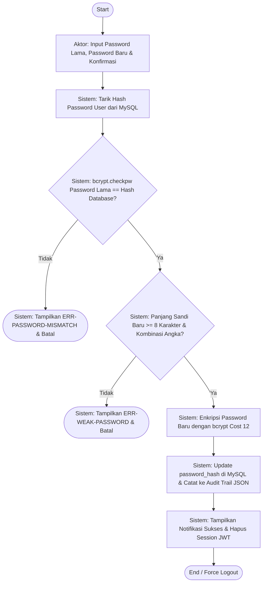
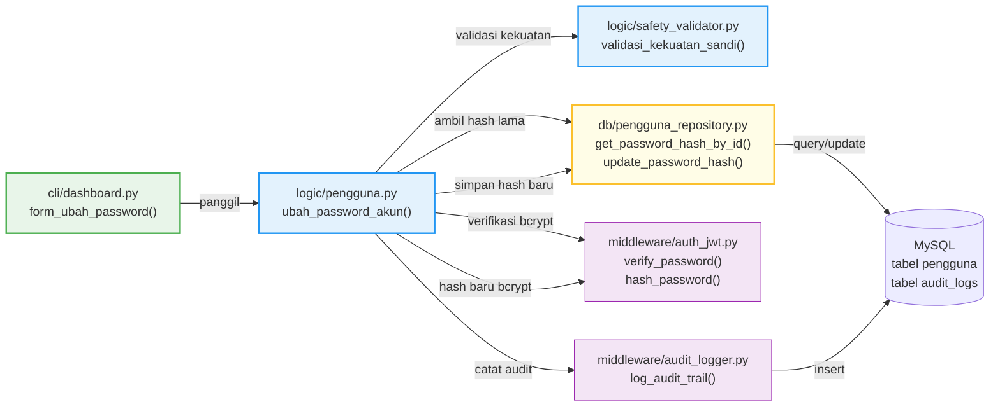

# Issue #0128 — Feature: Ubah Password Akun Sendiri (UC-044 / BASE-004)

---

## 0. Metadata Issue

| Atribut           | Nilai                                                                                     |
| :---------------- | :---------------------------------------------------------------------------------------- |
| **Issue ID**      | `#0128`                                                                                   |
| **Judul**         | Feature: Ubah Password Akun Sendiri                                                       |
| **Tipe**          | Feature — Refactoring & Completeness (fitur sudah ada parsial, perlu diperbaiki & dilengkapi) |
| **Prioritas**     | High                                                                                      |
| **Modul**         | M.7 — Keamanan, Audit Trail & Hak Akses                                                  |
| **Derivasi**      | UC-044 / WF-M7-08 / MENU-BASE-004                                                        |
| **Menu ID**       | `BASE-004` — Ubah Password (Tampil untuk **SEMUA 8 peran** RBAC)                          |
| **Tanggal Dibuat**| 2026-06-07                                                                                |
| **Status**        | Open — Siap Dikerjakan                                                                    |

---

## 1. Persona Pelaksana

> **Persona: Senior Security Architect & Lead Software Engineer**
>
> Kamu adalah seorang **Senior Security Architect** sekaligus **Lead Software Engineer** yang bertanggung jawab penuh atas implementasi fitur keamanan kritis pada sistem AbuCom. Kamu memiliki keahlian mendalam dalam:
> - Kriptografi password (bcrypt, hashing, salt, cost factor)
> - Arsitektur keamanan berlapis (Defense-in-Depth)
> - Paradigma Functional Programming (FP) murni di Python
> - Transaksi database ACID dengan MySQL InnoDB
> - Pencatatan audit trail forensik terstruktur JSON
> - Pengujian keamanan (unit test, edge-case, brute-force mitigation)
>
> Kamu wajib mengerjakan setiap checklist item di bawah ini dengan presisi tinggi, mematuhi seluruh standar coding dan keamanan yang ditetapkan oleh dokumen SDLC, dan memastikan tidak ada fitur eksisting yang rusak akibat perubahan yang kamu buat.

---

## 2. Dokumen Referensi SDLC

Berikut adalah daftar dokumen referensi yang **WAJIB** dibaca dan diekstrak relevansinya sebelum menulis kode:

| No | Dokumen Referensi | Path File | Relevansi Spesifik |
|:--:|:---|:---|:---|
| R-01 | Security Design v1.2 | `docs/sdlc/03_design/06_security_design.md` | Bab 4.1 (bcrypt Cost 12, salt dinamis), Bab 4.2 (JWT HS256, session 8 jam), Bab 6.4 (Length Bounds, validasi kekuatan sandi 5 kriteria), Bab 7.5 (audit trail JSON) |
| R-02 | Coding Standard v1.2 | `docs/sdlc/04_implementation/01_coding_standard.md` | Bab 2.1 (FP murni, larangan `class`/OOP), Bab 2.4 (Decimal-First Policy), Bab 2.3 (Result/NamedTuple pattern), Bab 10.3 (error code convention `ERR-XXX-NNN`) |
| R-03 | Module Structure v1.2 | `docs/sdlc/04_implementation/03_module_structure.md` | Bab 5.5 (Layer 2: logic/safety_validator.py), Bab 4.2 (Layer 1: cli/dashboard.py), Bab 7.4 (Middleware: audit_logger.py), pemetaan file-to-module |
| R-04 | CLI Interaction Flow v1.1 | `docs/sdlc/03_design/04_cli_interaction_flow.md` | Bab 4.4 (Alur Interaksi UC-044, 9 langkah detail, 2 kode error: `ERR-VAL-044`, `ERR-AUTH-044`), Bab 2.4 (password masking getpass), Bab 2.2 (tombol `0` kembali) |
| R-05 | Workflow Diagram v1.1 | `docs/sdlc/02_analysis/04_workflow_diagram.md` | Bab 4.8.8 (WF-M7-08: flowchart Mermaid ubah password, 5 node, 2 error path: `ERR-PASSWORD-MISMATCH`, `ERR-WEAK-PASSWORD`) |
| R-06 | Database Schema DDL v1.2 | `schema.sql` | Tabel `pengguna` (kolom `password_hash VARCHAR(255)`, `id INT PK`), Tabel `audit_logs` |
| R-07 | Use Case Diagram v1.1 | `docs/sdlc/02_analysis/03_use_case_diagram.md` | UC-044 (derivasi, aktor, alur utama, pasca-kondisi) |

---

## 3. Rangkuman Konteks dari Dokumen Referensi

### 3.1. Alur Bisnis UC-044 (Dari R-04: CLI Interaction Flow Bab 4.4)

```
Langkah 1: Pengguna memilih menu "Ubah Password Akun Sendiri" → Input [P] di dashboard
Langkah 2: Sistem meminta kata sandi lama → Output "Masukkan Password Lama: "
Langkah 3: Pengguna mengetik password lama (tersembunyi getpass) → Input [Password Lama]
Langkah 4: Sistem meminta password baru → Output "Masukkan Password Baru: "
Langkah 5: Pengguna mengetik password baru (tersembunyi getpass) → Input [Password Baru]
Langkah 6: Sistem meminta konfirmasi ulang → Output "Masukkan Kembali Password Baru: "
Langkah 7: Pengguna mengetik ulang password baru → Input [Password Baru]
Langkah 8: Sistem memvalidasi → hash bcrypt Cost 12 → UPDATE pengguna SET password_hash = %s WHERE id = %s
Langkah 9: Sistem menampilkan sukses hijau → redirect ke dashboard
```

### 3.2. Alur Workflow WF-M7-08 (Dari R-05: Workflow Diagram Bab 4.8.8)



### 3.3. Kode Error yang Berlaku (Dari R-04 & R-05)

| Kode Error | Pemicu | Pesan yang HARUS Ditampilkan |
|:---|:---|:---|
| `ERR-AUTH-044` | Password lama yang dimasukkan salah (bcrypt mismatch) | `⛔ ERR-AUTH-044: Otorisasi Gagal: Kata sandi lama yang Anda masukkan tidak valid!` |
| `ERR-VAL-044` | Password baru < 8 karakter ATAU konfirmasi 2x tidak cocok | `⛔ ERR-VAL-044: Konvalidasi Gagal: Kata sandi baru minimal harus 8 karakter dan bernilai cocok pada kedua input!` |
| `ERR-WEAK-PASSWORD` | Password baru tidak memenuhi 5 kriteria kekuatan sandi | Pesan dari `validasi_kekuatan_sandi()` di `logic/safety_validator.py` |
| `ERR-PASSWORD-MISMATCH` | Alias internal WF-M7-08 untuk `ERR-AUTH-044` | Sama dengan `ERR-AUTH-044` |
| `ERR-DB-002` | Koneksi database gagal saat query/update | `⛔ ERR-DB-002: Koneksi database gagal: {detail}` |
| `ERR-DB-003` | Kesalahan database saat eksekusi query | `⛔ ERR-DB-003: Terjadi kesalahan database: {detail}` |

### 3.4. Kriteria Kekuatan Sandi (Dari R-01: Security Design Bab 6.4)

Password baru **WAJIB** memenuhi **5 kriteria** berikut (sudah diimplementasikan di `logic/safety_validator.py`):
1. Minimal **8 karakter** panjang
2. Mengandung minimal **1 huruf besar** (A-Z)
3. Mengandung minimal **1 huruf kecil** (a-z)
4. Mengandung minimal **1 angka** (0-9)
5. Mengandung minimal **1 karakter spesial** (!@#$%^&*()_+-=[]{}|;':\",./<>?)

### 3.5. Skema Database Terkait (Dari R-06: schema.sql)

```sql
-- Tabel pengguna (kolom relevan)
CREATE TABLE pengguna (
    id INT NOT NULL AUTO_INCREMENT PRIMARY KEY,
    password_hash VARCHAR(255) NOT NULL COMMENT 'String hash bcrypt Cost 12',
    -- ... kolom lainnya
);

-- Query UPDATE yang digunakan:
UPDATE pengguna SET password_hash = %s WHERE id = %s
```

### 3.6. Pola Audit Trail (Dari R-03 & kode existing)

```python
# Pola pemanggilan audit trail untuk ubah password:
log_audit_trail(
    pengguna_id=session_state['user_id'],
    action_type='UPDATE',
    target_table='pengguna',
    old_val={'field': 'password_hash', 'note': '***REDACTED***'},
    new_val={'field': 'password_hash', 'note': '***REDACTED***'},
    cabang_id=session_state.get('cabang_id', 1),
    db_connection=db_conn
)
```

> **PENTING**: Nilai asli password_hash (baik lama maupun baru) **TIDAK BOLEH** ditulis ke audit trail demi keamanan. Gunakan `***REDACTED***` sebagai placeholder.

---

## 4. Analisis Kondisi Kode Saat Ini (Gap Analysis)

### 4.1. File yang Sudah Ada dan Relevan

| File | Path | Status | Catatan |
|:---|:---|:---:|:---|
| `dashboard.py` | `cli/dashboard.py` | ✅ Ada | Fungsi `form_ubah_password()` sudah ada di baris 894-1012, **TETAPI** ada beberapa gap |
| `auth_jwt.py` | `middleware/auth_jwt.py` | ✅ Ada | Fungsi `hash_password()` dan `verify_password()` sudah implementasi bcrypt Cost 12 |
| `safety_validator.py` | `logic/safety_validator.py` | ✅ Ada | Fungsi `validasi_kekuatan_sandi()` dengan 5 kriteria sudah ada |
| `audit_logger.py` | `middleware/audit_logger.py` | ✅ Ada | Fungsi `log_audit_trail()` sudah lengkap |
| `pengguna_repository.py` | `db/pengguna_repository.py` | ✅ Ada | **BELUM ADA** fungsi `update_password_hash()` khusus |
| `pengguna.py` | `logic/pengguna.py` | ✅ Ada | **BELUM ADA** fungsi orchestrator `ubah_password_akun()` di Logic Layer |

### 4.2. Gap yang Teridentifikasi (Masalah pada Implementasi Saat Ini)

| No | Gap | Severity | Detail |
|:--:|:---|:---:|:---|
| G-01 | **Validasi kekuatan sandi tidak dipanggil** | 🔴 Critical | `form_ubah_password()` hanya mengecek `len(password_baru) < 8`, TIDAK memanggil `validasi_kekuatan_sandi()` yang mensyaratkan 5 kriteria (huruf besar, kecil, angka, karakter spesial). Ini melanggar Security Design Bab 6.4 dan WF-M7-08 |
| G-02 | **Tidak ada force logout setelah ubah password** | 🟡 Medium | WF-M7-08 mengharuskan "Hapus Session JWT" setelah sukses ubah password, tetapi implementasi saat ini hanya menampilkan pesan sukses tanpa menghapus session JWT dan tanpa me-redirect ke layar login |
| G-03 | **Logika bisnis tercampur di Presentation Layer** | 🟡 Medium | Seluruh logika validasi, query database, hashing, dan audit trail dijalankan langsung di `cli/dashboard.py` (Layer 1). Seharusnya dipisahkan ke Logic Layer (`logic/`) dan Data Access Layer (`db/`) sesuai Module Structure |
| G-04 | **Tidak ada fungsi repository khusus `update_password_hash()`** | 🟡 Medium | Query `UPDATE pengguna SET password_hash` dieksekusi langsung di `form_ubah_password()` tanpa melalui repository layer. Melanggar pola arsitektur 4-layer |
| G-05 | **Password lama tidak di-sanitasi** | 🟠 Low | Input password lama tidak melalui `sanitasi_input_cli()`. Meski getpass sudah menangani masking, sanitasi karakter kontrol tetap diperlukan |
| G-06 | **Koneksi database tidak ditutup di semua error path** | 🟠 Low | Ada beberapa jalur error di mana koneksi database mungkin tidak ditutup dengan benar (potential resource leak) |
| G-07 | **Password baru bisa sama dengan password lama** | 🟠 Low | Tidak ada pengecekan apakah password baru berbeda dari password lama |

---

## 5. Checklist Implementasi (Low-Level)

### FASE 1: Data Access Layer — `db/pengguna_repository.py`

- [ ] **[F1-01]** Buat fungsi baru `get_password_hash_by_id(user_id: int, db_conn: Any) -> Result` di file `db/pengguna_repository.py`
  - Input: `user_id` (int), `db_conn` (koneksi MySQL)
  - Output: `Result(is_success=True, data=password_hash_string, error_msg=None)` jika ditemukan
  - Output: `Result(is_success=False, data=None, error_msg='ERR-DB-003: ...')` jika tidak ditemukan atau error
  - Query: `SELECT password_hash FROM pengguna WHERE id = %s` (parameterized)
  - Gunakan `cursor = db_conn.cursor(dictionary=True)`
  - Pastikan cursor ditutup di blok `finally`
  - Docstring lengkap dengan Args, Returns, dan Example

- [ ] **[F1-02]** Buat fungsi baru `update_password_hash(user_id: int, new_password_hash: str, db_conn: Any) -> Result` di file `db/pengguna_repository.py`
  - Input: `user_id` (int), `new_password_hash` (str bcrypt hash), `db_conn` (koneksi MySQL)
  - Output: `Result(is_success=True, data=None, error_msg=None)` jika berhasil
  - Output: `Result(is_success=False, data=None, error_msg='ERR-DB-003: ...')` jika gagal
  - Gunakan ACID transaction: `db_conn.start_transaction()` → `cursor.execute()` → `db_conn.commit()`
  - Rollback di blok `except`: `db_conn.rollback()`
  - Query: `UPDATE pengguna SET password_hash = %s WHERE id = %s` (parameterized)
  - Pastikan cursor ditutup di blok `finally`
  - Docstring lengkap

- [ ] **[F1-03]** Pastikan kedua fungsi baru mengikuti pola yang sama persis dengan fungsi existing di file (`cek_username_unik`, `insert_pengguna`, `get_pengguna_by_username`, dll):
  - Menggunakan `Result = namedtuple('Result', ['is_success', 'data', 'error_msg'])`
  - Error message diawali `ERR-DB-` sesuai coding standard
  - Tidak menggunakan `class` atau OOP

---

### FASE 2: Business Logic Layer — `logic/pengguna.py`

- [ ] **[F2-01]** Buat fungsi baru `ubah_password_akun(user_id: int, password_lama: str, password_baru: str, konfirmasi_password: str, cabang_id: int, db_conn: Any) -> Result` di file `logic/pengguna.py`
  - Fungsi ini adalah **orchestrator** utama yang menjalankan seluruh validasi dan proses ubah password
  - Alur eksekusi HARUS mengikuti urutan di bawah ini:

- [ ] **[F2-02]** Langkah 1 di dalam `ubah_password_akun()`: Validasi kecocokan password baru dan konfirmasi
  ```python
  if password_baru != konfirmasi_password:
      return Result(False, None,
          'ERR-VAL-044: Konvalidasi Gagal: Kata sandi baru minimal harus 8 karakter '
          'dan bernilai cocok pada kedua input!')
  ```

- [ ] **[F2-03]** Langkah 2 di dalam `ubah_password_akun()`: Validasi kekuatan password baru menggunakan `validasi_kekuatan_sandi()` dari `logic/safety_validator.py`
  ```python
  from logic.safety_validator import validasi_kekuatan_sandi
  strength_result = validasi_kekuatan_sandi(password_baru)
  if not strength_result.is_valid:
      return Result(False, None, strength_result.error_msg)
  ```
  - Ini memastikan 5 kriteria kekuatan sandi terpenuhi (huruf besar, kecil, angka, spesial, min 8 char)

- [ ] **[F2-04]** Langkah 3 di dalam `ubah_password_akun()`: Ambil hash password lama dari database
  ```python
  from db.pengguna_repository import get_password_hash_by_id
  hash_result = get_password_hash_by_id(user_id, db_conn)
  if not hash_result.is_success:
      return Result(False, None, hash_result.error_msg)
  ```

- [ ] **[F2-05]** Langkah 4 di dalam `ubah_password_akun()`: Verifikasi password lama menggunakan bcrypt
  ```python
  from middleware.auth_jwt import verify_password
  if not verify_password(password_lama, hash_result.data):
      return Result(False, None,
          'ERR-AUTH-044: Otorisasi Gagal: Kata sandi lama yang Anda masukkan tidak valid!')
  ```

- [ ] **[F2-06]** Langkah 5 (OPSIONAL tapi DIREKOMENDASIKAN): Cek password baru tidak sama dengan password lama
  ```python
  if verify_password(password_baru, hash_result.data):
      return Result(False, None,
          'ERR-VAL-044: Konvalidasi Gagal: Kata sandi baru tidak boleh sama dengan kata sandi lama!')
  ```

- [ ] **[F2-07]** Langkah 6 di dalam `ubah_password_akun()`: Hash password baru dengan bcrypt Cost 12
  ```python
  from middleware.auth_jwt import hash_password
  new_hash = hash_password(password_baru)
  ```

- [ ] **[F2-08]** Langkah 7 di dalam `ubah_password_akun()`: Simpan hash baru ke database via repository
  ```python
  from db.pengguna_repository import update_password_hash
  update_result = update_password_hash(user_id, new_hash, db_conn)
  if not update_result.is_success:
      return Result(False, None, update_result.error_msg)
  ```

- [ ] **[F2-09]** Langkah 8 di dalam `ubah_password_akun()`: Catat audit trail
  ```python
  from middleware.audit_logger import log_audit_trail
  log_audit_trail(
      pengguna_id=user_id,
      action_type='UPDATE',
      target_table='pengguna',
      old_val={'field': 'password_hash', 'note': '***REDACTED***'},
      new_val={'field': 'password_hash', 'note': '***REDACTED***'},
      cabang_id=cabang_id,
      db_connection=db_conn
  )
  ```
  - **PENTING**: Jangan pernah menyimpan nilai asli password ke audit trail

- [ ] **[F2-10]** Langkah 9 di dalam `ubah_password_akun()`: Return sukses
  ```python
  return Result(True, {'action': 'PASSWORD_CHANGED'}, None)
  ```

- [ ] **[F2-11]** Pastikan fungsi `ubah_password_akun()` memiliki docstring lengkap sesuai coding standard:
  - Deskripsi singkat
  - Alur eksekusi bernomor
  - Args dengan tipe data
  - Returns dengan contoh sukses dan gagal
  - Example usage

---

### FASE 3: Presentation Layer — `cli/dashboard.py`

- [ ] **[F3-01]** Refactor fungsi `form_ubah_password()` di `cli/dashboard.py` (baris 894-1012) untuk memanggil orchestrator `ubah_password_akun()` dari Logic Layer, BUKAN menulis logika bisnis secara langsung
  - Import: `from logic.pengguna import ubah_password_akun`
  - Hapus semua logika validasi, query database, dan hashing yang ada langsung di fungsi ini

- [ ] **[F3-02]** Alur baru `form_ubah_password()`:
  1. Clear terminal + tampilkan header breadcrumb "Dashboard > Ubah Password"
  2. Prompt input password lama via `getpass.getpass("Masukkan Password Lama: ")`
  3. Prompt input password baru via `getpass.getpass("Masukkan Password Baru: ")`
  4. Prompt input konfirmasi password baru via `getpass.getpass("Masukkan Kembali Password Baru: ")`
  5. Buka koneksi database via `get_db_connection()`
  6. Panggil `ubah_password_akun(user_id, password_lama, password_baru, konfirmasi, cabang_id, db_conn)`
  7. Tutup koneksi database di blok `finally`
  8. Jika `result.is_success == False`: tampilkan `⛔ {result.error_msg}` + "Tekan Enter..."
  9. Jika `result.is_success == True`: tampilkan pesan sukses hijau + **FORCE LOGOUT**

- [ ] **[F3-03]** Implementasi **FORCE LOGOUT** setelah password berhasil diubah (sesuai WF-M7-08):
  ```python
  # Setelah ubah password berhasil:
  print("✓ Password berhasil diubah! Gunakan sandi baru Anda pada login berikutnya.")
  # Atau jika HAS_RICH:
  _console.print("[bold green]✓ Password berhasil diubah! Silakan login kembali dengan sandi baru.[/]")

  input("Tekan Enter untuk melanjutkan...")

  # Force logout: hapus session JWT
  session_state['user_id'] = None
  session_state['username'] = None
  session_state['role'] = None
  session_state['cabang_id'] = None
  session_state['token'] = None
  ```
  - Setelah token dihapus, fungsi `render_dashboard()` akan mendeteksi token=None dan keluar dari loop, me-redirect ke layar login

- [ ] **[F3-04]** Pastikan semua input password menggunakan `getpass.getpass()` (bukan `input()`) agar karakter tidak dimunculkan di layar CLI sesuai CLI Interaction Flow Bab 2.4

- [ ] **[F3-05]** Pastikan penanganan exception `(EOFError, KeyboardInterrupt)` pada setiap prompt input untuk mendukung exit darurat (`Ctrl+C`)

- [ ] **[F3-06]** Pastikan koneksi database ditutup di **SEMUA** jalur keluar (sukses, error, exception) menggunakan blok `try/finally`

---

### FASE 4: Unit Testing — `tests/`

- [ ] **[F4-01]** Buat file test baru `tests/test_ubah_password.py` (atau tambahkan ke file test existing yang relevan)

- [ ] **[F4-02]** Test Case: `test_ubah_password_sukses` — Password lama valid, password baru kuat → Result sukses
  - Mock `db_conn`, `get_password_hash_by_id` return hash yang cocok
  - Mock `verify_password` return True untuk lama, False untuk baru
  - Assert `result.is_success == True`

- [ ] **[F4-03]** Test Case: `test_ubah_password_lama_salah` — Password lama tidak cocok → `ERR-AUTH-044`
  - Mock `verify_password` return False untuk password lama
  - Assert `result.error_msg` mengandung `ERR-AUTH-044`

- [ ] **[F4-04]** Test Case: `test_ubah_password_konfirmasi_tidak_cocok` — Password baru ≠ konfirmasi → `ERR-VAL-044`
  - Panggil dengan `password_baru='AbcDef123!'` dan `konfirmasi='BerbedaSekali1!'`
  - Assert `result.error_msg` mengandung `ERR-VAL-044`

- [ ] **[F4-05]** Test Case: `test_ubah_password_lemah` — Password baru < 8 karakter / tanpa huruf besar / tanpa angka → `ERR-VAL-001` (dari safety_validator)
  - Panggil dengan `password_baru='lemah'`
  - Assert `result.is_success == False`

- [ ] **[F4-06]** Test Case: `test_ubah_password_sama_dengan_lama` — Password baru sama persis dengan password lama → error
  - Assert `result.is_success == False` (jika F2-06 diimplementasikan)

- [ ] **[F4-07]** Test Case: `test_ubah_password_db_error` — Database connection gagal → `ERR-DB-003`
  - Mock `get_password_hash_by_id` return `Result(False, None, 'ERR-DB-003: ...')`
  - Assert error terhandle

---

### FASE 5: Verifikasi & Quality Assurance

- [ ] **[F5-01]** Jalankan seluruh unit test: `python -m pytest tests/test_ubah_password.py -v`
- [ ] **[F5-02]** Jalankan linter: `python -m flake8 logic/pengguna.py db/pengguna_repository.py cli/dashboard.py --max-line-length=120`
- [ ] **[F5-03]** Jalankan type checker (jika mypy tersedia): `python -m mypy logic/pengguna.py db/pengguna_repository.py`
- [ ] **[F5-04]** Verifikasi manual: jalankan aplikasi (`python main.py`), login sebagai user apapun, pilih [P] Ubah Password, dan uji:
  - Skenario sukses: password lama benar, password baru kuat → sukses + force logout
  - Skenario gagal password lama salah → pesan error `ERR-AUTH-044`
  - Skenario gagal konfirmasi tidak cocok → pesan error `ERR-VAL-044`
  - Skenario gagal password lemah (tanpa huruf besar) → pesan error `ERR-VAL-001`
  - Skenario Ctrl+C di prompt → kembali ke dashboard tanpa crash
- [ ] **[F5-05]** Periksa tabel `audit_logs` di MySQL setelah ubah password sukses — pastikan terdapat record baru dengan `action_type='UPDATE'`, `target_table='pengguna'`, dan `new_value` berisi `***REDACTED***`
- [ ] **[F5-06]** Pastikan setelah force logout, user dapat login kembali menggunakan password baru

---

## 6. Batasan & Aturan Keamanan (Constraints)

| No | Constraint | Detail |
|:--:|:---|:---|
| C-01 | **Paradigma FP Murni** | Tidak boleh menggunakan `class`, OOP, dekorator `@staticmethod`, atau mutable global state. Semua fungsi harus pure function atau berinteraksi via parameter eksplisit |
| C-02 | **Bcrypt Cost Factor 12** | Hashing password WAJIB menggunakan cost factor 12 via `bcrypt.gensalt(rounds=12)`. Tidak boleh mengubah cost factor |
| C-03 | **Parameterized Query** | Semua query SQL WAJIB menggunakan parameterized query (`%s`). DILARANG string concatenation/f-string untuk query |
| C-04 | **Password Masking** | Input password WAJIB menggunakan `getpass.getpass()` agar karakter tidak ditampilkan di layar terminal |
| C-05 | **Audit Trail Redaction** | Nilai asli password_hash TIDAK BOLEH ditulis ke audit trail. Gunakan `***REDACTED***` |
| C-06 | **ACID Transaction** | Operasi UPDATE password_hash WAJIB dibungkus dalam ACID transaction (start_transaction → execute → commit / rollback) |
| C-07 | **Result Pattern** | Semua fungsi baru WAJIB mengembalikan `Result = namedtuple('Result', ['is_success', 'data', 'error_msg'])` |
| C-08 | **Error Code Convention** | Error code format: `ERR-[KATEGORI]-[NOMOR]` (contoh: `ERR-AUTH-044`, `ERR-VAL-044`, `ERR-DB-003`) |
| C-09 | **Python 3.14+ Type Hints** | Gunakan built-in type hints (`str`, `int`, `dict`, `list`, `tuple`) tanpa import dari `typing` kecuali `Any` |
| C-10 | **Force Logout** | Setelah password berhasil diubah, session JWT WAJIB dihapus (set `None`) agar user harus login ulang |
| C-11 | **Tidak Merusak Fitur Lain** | Perubahan pada `form_ubah_password()` TIDAK BOLEH merusak fungsionalitas menu lain di dashboard (navigasi modul, logout, graceful exit, dll) |
| C-12 | **Truncate 72 Bytes** | Bcrypt memiliki batas 72 bytes. Lihat FIXME di `auth_jwt.py` baris 54-55 dan 80-81. Pastikan konsisten |

---

## 7. Daftar File yang Dimodifikasi

| No | File | Aksi | Deskripsi Perubahan |
|:--:|:---|:---:|:---|
| 1 | `db/pengguna_repository.py` | MODIFY | Tambahkan 2 fungsi baru: `get_password_hash_by_id()` dan `update_password_hash()` |
| 2 | `logic/pengguna.py` | MODIFY | Tambahkan 1 fungsi baru: `ubah_password_akun()` (orchestrator) |
| 3 | `cli/dashboard.py` | MODIFY | Refactor `form_ubah_password()` untuk memanggil orchestrator + implementasi force logout |
| 4 | `tests/test_ubah_password.py` | NEW | File unit test baru untuk fitur ubah password |

---

## 8. Catatan Komunikasi (Jika Ada Data Kosong / Ambigu)

| No | Item | Status | Catatan |
|:--:|:---|:---:|:---|
| 1 | Apakah password lama perlu rate-limited (max percobaan)? | ❓ Belum diatur di SDLC | Saat ini TIDAK diimplementasikan rate limiting untuk ubah password. Jika diperlukan, bisa ditambahkan di iterasi berikutnya |
| 2 | Apakah ada notifikasi ke pemilik jika staf mengubah password? | ❓ Tidak disebutkan di SDLC | Audit trail sudah merekam perubahan. Notifikasi aktif ke pemilik tidak diimplementasikan kecuali diminta |
| 3 | Apakah force logout harus menghapus session di sisi database juga? | ℹ️ Tidak perlu | Sistem menggunakan JWT stateless — session hanya di memori client. Menghapus token dict di sisi client sudah cukup |
| 4 | Bagaimana dengan password default staf baru? | ℹ️ Sudah diakomodasi | Staf baru diregistrasi oleh pemilik via `registrasi_pengguna()`. Password default diberikan saat registrasi. Staf wajib mengubahnya via fitur ini (UC-044 / BASE-004) sesuai narasi.txt |

---

## 9. Diagram Dependensi File (Alur Pemanggilan)



---

## 10. Ringkasan Prioritas Eksekusi

```
FASE 1 (Data Access Layer)     → Paling pertama, karena menjadi fondasi
  └─ F1-01, F1-02, F1-03

FASE 2 (Business Logic Layer)  → Kedua, orchestrator utama
  └─ F2-01 s/d F2-11

FASE 3 (Presentation Layer)    → Ketiga, UI/CLI refactoring
  └─ F3-01 s/d F3-06

FASE 4 (Unit Testing)          → Keempat, validasi otomatis
  └─ F4-01 s/d F4-07

FASE 5 (QA & Verifikasi)      → Terakhir, verifikasi menyeluruh
  └─ F5-01 s/d F5-06
```

**Total Checklist Items: 30 item**

---

*Dokumen ini disusun oleh Senior Security Architect & Lead Software Engineer berdasarkan analisis mendalam terhadap 7 dokumen referensi SDLC dan inspeksi kode sumber existing. Seluruh instruksi bersifat deterministik dan siap dieksekusi oleh junior programmer atau AI model yang lebih kecil tanpa memerlukan interpretasi ambigu.*
