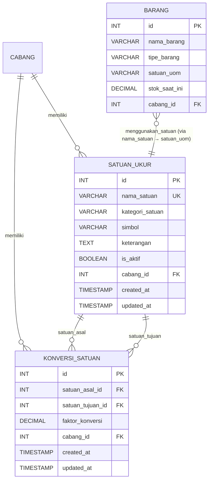

# Issue #0132 — Feature Kelola Satuan Ukur dan Konversi Unit of Measure

---

## 0. IDENTITAS PERSONA PELAKSANA

**Persona yang WAJIB diadopsi oleh pelaksana issue ini:**

> **Kamu adalah Senior Inventory Systems Engineer & Unit Conversion Specialist.**
> Kamu memiliki keahlian mendalam dalam perancangan sistem satuan ukur (Unit of Measure) untuk industri percetakan dan retail, pengelolaan konversi antar-satuan dengan presisi desimal tinggi, serta pemahaman menyeluruh terhadap standar Bill of Materials (BOM) dan Harga Pokok Penjualan (HPP).
> Kamu WAJIB bekerja dengan paradigma Functional Programming (FP) murni Python tanpa class, menggunakan `decimal.Decimal` untuk seluruh operasi aritmatika, dan mematuhi seluruh standar penulisan kode AbuCom secara absolut.
> Kamu tidak boleh tergesa-gesa. Setiap baris kode yang kamu tulis harus bersih, rapi, teruji, dan tidak merusak fitur lain yang sudah berjalan.

---

## 1. DOKUMEN REFERENSI WAJIB

Sebelum memulai pengerjaan, pelaksana **WAJIB** membaca dan mengekstrak detail data dari seluruh dokumen referensi berikut. Jangan lewatkan detail kecil apapun yang relevan.

### 1.1. Daftar File Referensi Primer (WAJIB DIBACA PENUH)

| No | File Referensi | Path Relatif | Prioritas | Alasan Pemilihan |
|----|---------------|-------------|-----------|-----------------|
| R-01 | Software Requirements Specification | `docs/sdlc/02_analysis/02_software_requirements.md` | **PRIMER** | Definisi SRS-F-009 (Manajemen Satuan & Atribut Barang), SRS-F-007 (HPP BOM Desimal), SRS-F-008 (Limbah), SRS-F-010 (ATK Sync) — mendefinisikan kebutuhan fungsional UoM |
| R-02 | Data Dictionary | `docs/sdlc/02_analysis/05_data_dictionary.md` | **PRIMER** | Spesifikasi kolom `satuan_uom` pada tabel `barang`, kolom `kuantitas_desimal` pada `bom_komposisi`, domain nilai, dan aturan validasi |
| R-03 | Database Schema DDL | `docs/sdlc/03_design/01_database_schema.sql` | **PRIMER** | Struktur fisik tabel `barang` (kolom `satuan_uom VARCHAR(20)`), `bom_komposisi`, `detail_transaksi`, `limbah_produksi`, `stock_opname` |
| R-04 | Coding Standard | `docs/sdlc/04_implementation/01_coding_standard.md` | **PRIMER** | Aturan FP murni, presisi desimal, naming convention, Result Pattern, ACID transaction, Type Hints |
| R-05 | Module Structure | `docs/sdlc/04_implementation/03_module_structure.md` | **PRIMER** | Pemetaan file handler: `logic/bom_hpp.py`, `cli/menu_inventaris.py`, `db/query_builder.py` |
| R-06 | BOM & HPP Design | `docs/sdlc/03_design/05_bom_hpp_design.md` | **SEKUNDER** | Formula konversi dimensi bahan baku, pseudocode kalkulasi HPP desimal |
| R-07 | CLI Interaction Flow | `docs/sdlc/03_design/04_cli_interaction_flow.md` | **SEKUNDER** | Alur interaksi menu inventaris CLI, format visual `rich` dan `tabulate` |
| R-08 | Access Control Matrix | `docs/sdlc/02_analysis/06_access_control_matrix.md` | **SEKUNDER** | Hak akses role `gudang` dan `produksi_cetak` terhadap pengelolaan satuan barang |
| R-09 | Narasi Awal | `docs/sdlc/narasi.txt` | **TERSIER** | Konteks bisnis pemilik: kebutuhan konversi satuan kertas (rim/lembar), tinta (volume/berat), dimensi banner (m²) |

### 1.2. Instruksi Pembacaan Referensi

- [ ] **Baca R-01**: Fokus pada bagian `SRS-F-009` (Manajemen Satuan & Atribut Barang). Ekstrak seluruh detail: deskripsi teknis, input yang diperlukan, proses/logika bisnis, output, aturan validasi, penanganan exception, ketergantungan, dan catatan implementasi.
- [ ] **Baca R-01**: Fokus juga pada `SRS-F-007` (HPP BOM) — pahami bagaimana `kuantitas_pemakaian` bahan baku desimal digunakan dalam kalkulasi HPP dan bagaimana konversi satuan mempengaruhi presisi tersebut.
- [ ] **Baca R-02**: Fokus pada Bagian 3.5 (Tabel `barang`) — ekstrak definisi kolom `satuan_uom` (VARCHAR(20), NN, domain: free text). Catat bahwa domain saat ini di kode adalah `['Rim', 'Lembar', 'Pcs', 'Ml', 'Meter_Persegi']`.
- [ ] **Baca R-02**: Fokus pada Bagian 3.6 (Tabel `bom_komposisi`) — pahami kolom `kuantitas_desimal DECIMAL(15,4)` yang menyimpan volume/panjang/pcs bahan baku.
- [ ] **Baca R-03**: Periksa DDL fisik tabel `barang` baris 116-138 — konfirmasi kolom `satuan_uom VARCHAR(20) NOT NULL`.
- [ ] **Baca R-04**: Bab 2.2 (FP Murni), Bab 2.4 (Decimal-First), Bab 3 (Naming Convention), Bab 7 (Type Hints), Bab 8.7 (Result Pattern), Bab 8.8 (ACID Transaction), Bab 9 (SQL Parameterized).
- [ ] **Baca R-05**: Bab 5.2 (`logic/bom_hpp.py`) — fungsi `hitung_hpp_produk()`, `proses_pemotongan_stok()`. Bab 4.4 (`cli/menu_inventaris.py`) — `form_kelola_barang()`.
- [ ] **Baca R-06**: Pahami formula konversi dimensi dan volume bahan baku dalam konteks BOM.
- [ ] **Baca R-09**: Baris 96 — pahami kebutuhan: "sistem harus bisa membedakan stok kertas (dalam rim/lembar/dimensi), tinta (dalam volume/warna/berat)" dan "Pencatatan stok harus fleksibel dan mendukung angka desimal".

### 1.3. Rangkuman Data Penting yang Diekstrak dari Referensi

Setelah membaca, catat dan konfirmasi data berikut:

| Data Kunci | Nilai Saat Ini | Sumber |
|-----------|----------------|--------|
| Kolom UoM di tabel `barang` | `satuan_uom VARCHAR(20) NOT NULL` | R-03: baris 121 |
| Tipe data stok | `DECIMAL(15,4)` | R-03: baris 122 |
| Domain UoM di kode validasi | `['Rim', 'Lembar', 'Pcs', 'Ml', 'Meter_Persegi']` | `logic/bom_hpp.py` baris 96 |
| UoM mapping di CLI | `uom_map` dict di `cli/menu_inventaris.py` baris ~327 | Kode sumber aktif |
| Kuantitas BOM | `kuantitas_desimal DECIMAL(15,4)` | R-03: baris 201 |
| Presisi desimal standar | 4 digit, `ROUND_HALF_UP` | R-04: Bab 2.4 |
| Paradigma wajib | Pure FP, tanpa class, NamedTuple | R-04: Bab 2.2 |
| Result Pattern | `Result = namedtuple('Result', ['is_success', 'data', 'error_msg'])` | R-04: Bab 2.2.6 |

> [!IMPORTANT]
> Jika ada data yang dibutuhkan untuk implementasi tetapi TIDAK ditemukan di file referensi di atas, **TANDAI** dengan komentar `# DATA_KOSONG: [deskripsi data yang dibutuhkan]` di dalam kode dan laporkan dalam rangkuman akhir pengerjaan agar bisa ditindaklanjuti.

---

## 2. BATASAN, CAKUPAN DAN ALUR PENGERJAAN

### 2.1. Cakupan Issue (IN SCOPE)

Feature ini mencakup:

1. **Tabel Master Satuan Ukur (`satuan_ukur`)**: Pembuatan tabel master baru untuk mengelola daftar satuan ukur secara dinamis (bukan hardcoded di kode Python).
2. **Tabel Konversi Satuan (`konversi_satuan`)**: Pembuatan tabel relasi konversi antar-satuan dalam satu kategori (misal: 1 Rim = 500 Lembar).
3. **Logika Konversi Pure Function**: Fungsi murni untuk melakukan konversi antar-satuan berdasarkan faktor konversi dari database.
4. **Validasi Satuan Ukur Dinamis**: Migrasi dari validasi hardcoded list `['Rim', 'Lembar', 'Pcs', 'Ml', 'Meter_Persegi']` ke validasi berbasis database.
5. **Menu CLI Kelola Satuan**: Antarmuka terminal untuk CRUD master satuan ukur dan konversi (hak akses `pemilik` dan `gudang`).
6. **Integrasi dengan Form Barang**: Update form tambah/edit barang agar membaca satuan dari master database.
7. **Integrasi dengan Logika BOM/HPP**: Konversi otomatis saat satuan beli ≠ satuan produksi.
8. **Seed Data Satuan Awal**: Data awal satuan ukur dan konversi untuk operasional toko percetakan.
9. **Unit Testing**: Test suite untuk seluruh fungsi logika konversi dan validasi.

### 2.2. Batasan Issue (OUT OF SCOPE)

Feature ini **TIDAK** mencakup:

- Perubahan pada logika Smart Payroll (M.4)
- Perubahan pada logika Pinjaman/Aset (M.6)
- Perubahan pada modul Keamanan/Auth (M.7)
- Perubahan pada modul PPOB/Service (M.3)
- Perubahan pada tabel `transaksi`, `detail_transaksi`, `pengguna`, `pelanggan`, `supplier`
- Modifikasi skema tabel `barang` selain penambahan FK ke `satuan_ukur` (kolom `satuan_uom` tetap dipertahankan untuk backward compatibility)

### 2.3. Alur Pengerjaan Standar

```
[TAHAP 1] Pembacaan & Ekstraksi Referensi
    ↓
[TAHAP 2] Perancangan Skema Database (DDL)
    ↓
[TAHAP 3] Implementasi Data Access Layer (db/)
    ↓
[TAHAP 4] Implementasi Business Logic Layer (logic/)
    ↓
[TAHAP 5] Implementasi Presentation Layer (cli/)
    ↓
[TAHAP 6] Seed Data Awal
    ↓
[TAHAP 7] Unit Testing
    ↓
[TAHAP 8] Verifikasi Integrasi & Non-Regresi
    ↓
[TAHAP 9] Dokumentasi & Laporan
```

---

## 3. PRINSIP PENGERJAAN

### 3.1. Kualitas dan Ketelitian

> [!CAUTION]
> - **JANGAN TERGESA-GESA.** Kerjakan dengan rapi, bersih, dan teliti.
> - **JANGAN BURU-BURU.** Pastikan setiap langkah sudah benar sebelum lanjut ke langkah berikutnya.
> - **JANGAN SKIP LANGKAH.** Ikuti checklist secara berurutan dari atas ke bawah.
> - **PASTIKAN KELENGKAPAN.** Jangan tinggalkan implementasi setengah jadi yang akan menghambat feature lain.

### 3.2. Keamanan Fitur Lain (Non-Regresi)

> [!WARNING]
> - **JANGAN MENYENGGOL FITUR LAIN.** Setiap perubahan harus backward-compatible.
> - Kolom `satuan_uom` VARCHAR(20) pada tabel `barang` **TETAP DIPERTAHANKAN** — jangan rename atau hapus.
> - Validasi lama di `logic/bom_hpp.py` harus tetap berfungsi dengan penambahan referensi ke master baru.
> - Seluruh test case yang sudah ada (`tests/test_kelola_barang.py`, `tests/test_kelola_master_barang.py`, `tests/logic/test_dashboard_ringkasan_harian.py`) **HARUS TETAP PASS** setelah perubahan.
> - Jalankan `pytest` sebelum dan sesudah setiap tahap implementasi.

### 3.3. Penandaan Data Kosong

Jika ada data yang dibutuhkan tetapi tidak tersedia di file referensi:
- Tandai di kode: `# DATA_KOSONG: [deskripsi]`
- Tandai di file ini saat pelaporan: tambahkan di bagian **Laporan Data Kosong** di akhir dokumen.
- Jangan asumsikan atau halusinasi data — tanyakan atau tandai saja.

### 3.4. Standar Kode Wajib (Ringkasan)

| Aspek | Standar |
|-------|---------|
| Paradigma | Pure FP, tanpa `class` di alur bisnis |
| Data Struktur | `namedtuple` atau `@dataclass(frozen=True)` |
| Presisi Numerik | `decimal.Decimal`, `quantize('0.0001')`, `ROUND_HALF_UP` |
| Error Handling | Result Pattern `namedtuple('Result', ['is_success', 'data', 'error_msg'])` |
| SQL | Parameterized `%s`, UPPERCASE keyword, ACID transaction |
| Penamaan | `snake_case` (file, fungsi, variabel), `PascalCase` (NamedTuple), `UPPER_SNAKE_CASE` (konstanta) |
| Type Hints | Wajib pada semua fungsi publik, gunakan `list[...]` bukan `typing.List` |
| Docstring | PEP 257 Google Style pada semua fungsi publik |
| Import | stdlib → third-party → local, tanpa wildcard |
| Float | **DILARANG KERAS** untuk data finansial/kuantitas |

---

## 4. TAHAPAN IMPLEMENTASI DETAIL (LOW-LEVEL CHECKLIST)

---

### TAHAP 1: Pembacaan & Ekstraksi Referensi

- [ ] Baca file `docs/sdlc/02_analysis/02_software_requirements.md` — cari dan baca bagian `SRS-F-009`
- [ ] Baca file `docs/sdlc/02_analysis/02_software_requirements.md` — cari dan baca bagian `SRS-F-007`
- [ ] Baca file `docs/sdlc/02_analysis/05_data_dictionary.md` — baca Bagian 3.5 (tabel `barang`) dan Bagian 3.6 (tabel `bom_komposisi`)
- [ ] Baca file `docs/sdlc/03_design/01_database_schema.sql` — baca definisi tabel `barang` baris 116-138
- [ ] Baca file `docs/sdlc/04_implementation/01_coding_standard.md` — baca Bab 2, 3, 7, 8, 9
- [ ] Baca file `docs/sdlc/04_implementation/03_module_structure.md` — baca Bab 4.4, 5.2, 6.3
- [ ] Baca file `docs/sdlc/03_design/05_bom_hpp_design.md` — baca bagian formula konversi
- [ ] Baca file `docs/sdlc/02_analysis/06_access_control_matrix.md` — cari hak akses role `gudang` dan `pemilik` untuk modul M.2
- [ ] Baca file `docs/sdlc/narasi.txt` — baca baris 96 tentang kebutuhan satuan ukur
- [ ] Baca file `logic/bom_hpp.py` — pahami implementasi saat ini: `validasi_data_barang()` baris 69-172 (domain UoM hardcoded di baris 94-97)
- [ ] Baca file `cli/menu_inventaris.py` — pahami implementasi saat ini: `uom_map` dan form kelola barang
- [ ] Baca file `db/query_builder.py` — pahami query INSERT/SELECT barang yang melibatkan `satuan_uom`
- [ ] Baca file `db/seed_data.py` — pahami seed data barang saat ini
- [ ] Baca file `db/schema_initializer.py` — pahami proses inisialisasi tabel
- [ ] Catat semua data kunci yang diekstrak ke dalam catatan kerja

---

### TAHAP 2: Perancangan Skema Database (DDL)

#### 2A. Tabel `satuan_ukur` (TABEL BARU)

- [ ] Buat DDL tabel `satuan_ukur` dengan spesifikasi berikut:

```sql
-- [TABEL BARU] satuan_ukur
CREATE TABLE satuan_ukur (
    id INT NOT NULL AUTO_INCREMENT PRIMARY KEY 
        COMMENT 'Identifikasi unik satuan ukur',
    nama_satuan VARCHAR(30) NOT NULL UNIQUE 
        COMMENT 'Nama satuan ukur (e.g. Rim, Lembar, Pcs, Ml, Meter_Persegi, Liter, Kg, Botol)',
    kategori_satuan VARCHAR(30) NOT NULL 
        COMMENT 'Kategori pengelompokan satuan (e.g. Kuantitas, Panjang, Luas, Volume, Berat)',
    simbol VARCHAR(10) NOT NULL DEFAULT '' 
        COMMENT 'Simbol singkatan (e.g. pcs, lbr, rim, ml, m², L, kg)',
    keterangan TEXT NULL DEFAULT NULL 
        COMMENT 'Deskripsi tambahan tentang penggunaan satuan ini',
    is_aktif BOOLEAN NOT NULL DEFAULT TRUE 
        COMMENT 'Status aktif satuan (soft delete)',
    cabang_id INT NOT NULL DEFAULT 1 
        COMMENT 'Identifikasi cabang pemilik data satuan',
    created_at TIMESTAMP NOT NULL DEFAULT CURRENT_TIMESTAMP 
        COMMENT 'Tanggal & waktu baris data dibuat',
    updated_at TIMESTAMP NOT NULL DEFAULT CURRENT_TIMESTAMP ON UPDATE CURRENT_TIMESTAMP 
        COMMENT 'Tanggal & waktu terakhir baris data diperbarui',
    CONSTRAINT fk_satuan_ukur_cabang_id FOREIGN KEY (cabang_id) 
        REFERENCES cabang(id) ON DELETE RESTRICT ON UPDATE CASCADE
) ENGINE=InnoDB DEFAULT CHARSET=utf8mb4 COLLATE=utf8mb4_unicode_ci 
  COMMENT='Master satuan ukur barang dan bahan baku | Sensitivitas: Operasional | Modul: M.2';
```

- [ ] Pastikan kolom `nama_satuan` memiliki UNIQUE constraint
- [ ] Pastikan ada kolom `cabang_id` (Multi-Branch Ready)
- [ ] Pastikan ada kolom `created_at` dan `updated_at` (Audit Trail Ready)
- [ ] Pastikan ada kolom `is_aktif` untuk soft-delete (jangan hard delete satuan yang sudah terpakai)

#### 2B. Tabel `konversi_satuan` (TABEL BARU)

- [ ] Buat DDL tabel `konversi_satuan` dengan spesifikasi berikut:

```sql
-- [TABEL BARU] konversi_satuan
CREATE TABLE konversi_satuan (
    id INT NOT NULL AUTO_INCREMENT PRIMARY KEY 
        COMMENT 'Identifikasi unik baris konversi',
    satuan_asal_id INT NOT NULL 
        COMMENT 'Referensi satuan ukur sumber konversi',
    satuan_tujuan_id INT NOT NULL 
        COMMENT 'Referensi satuan ukur target konversi',
    faktor_konversi DECIMAL(15,4) NOT NULL 
        COMMENT 'Faktor pengali konversi (1 satuan_asal = faktor * satuan_tujuan)',
    cabang_id INT NOT NULL DEFAULT 1 
        COMMENT 'Identifikasi cabang pemilik aturan konversi',
    created_at TIMESTAMP NOT NULL DEFAULT CURRENT_TIMESTAMP 
        COMMENT 'Tanggal & waktu baris data dibuat',
    updated_at TIMESTAMP NOT NULL DEFAULT CURRENT_TIMESTAMP ON UPDATE CURRENT_TIMESTAMP 
        COMMENT 'Tanggal & waktu terakhir baris data diperbarui',
    CONSTRAINT uq_konversi_asal_tujuan UNIQUE (satuan_asal_id, satuan_tujuan_id),
    CONSTRAINT chk_konversi_faktor CHECK (faktor_konversi > 0),
    CONSTRAINT fk_konversi_satuan_asal_id FOREIGN KEY (satuan_asal_id) 
        REFERENCES satuan_ukur(id) ON DELETE RESTRICT ON UPDATE CASCADE,
    CONSTRAINT fk_konversi_satuan_tujuan_id FOREIGN KEY (satuan_tujuan_id) 
        REFERENCES satuan_ukur(id) ON DELETE RESTRICT ON UPDATE CASCADE,
    CONSTRAINT fk_konversi_satuan_cabang_id FOREIGN KEY (cabang_id) 
        REFERENCES cabang(id) ON DELETE RESTRICT ON UPDATE CASCADE
) ENGINE=InnoDB DEFAULT CHARSET=utf8mb4 COLLATE=utf8mb4_unicode_ci 
  COMMENT='Aturan konversi antar satuan ukur | Sensitivitas: Operasional | Modul: M.2';
```

- [ ] Pastikan UNIQUE constraint pada pasangan `(satuan_asal_id, satuan_tujuan_id)`
- [ ] Pastikan CHECK constraint `faktor_konversi > 0`
- [ ] Pastikan ON DELETE RESTRICT (jangan izinkan hapus satuan yang masih dipakai di konversi)

#### 2C. Penerapan DDL ke Schema

- [ ] Buka file `db/schema_initializer.py`
- [ ] Tambahkan DDL `CREATE TABLE satuan_ukur` ke dalam urutan inisialisasi tabel — **SEBELUM** tabel `barang` (karena `barang` nantinya bisa mereferensi `satuan_ukur`)
- [ ] Tambahkan DDL `CREATE TABLE konversi_satuan` ke dalam urutan inisialisasi tabel — **SETELAH** tabel `satuan_ukur`
- [ ] **JANGAN** mengubah DDL tabel `barang` yang sudah ada — kolom `satuan_uom VARCHAR(20)` tetap dipertahankan
- [ ] Verifikasi urutan pembuatan tabel tidak menyebabkan FK error
- [ ] Juga tambahkan DDL ke file `docs/sdlc/03_design/01_database_schema.sql` dan `schema.sql` (root) agar tetap sinkron

---

### TAHAP 3: Implementasi Data Access Layer (`db/`)

#### 3A. Query Builder — Satuan Ukur

- [ ] Buka file `db/query_builder.py`
- [ ] Tambahkan fungsi query berikut (gunakan parameterized query `%s`):

**Fungsi-fungsi yang harus dibuat:**

```python
# --- SATUAN UKUR CRUD ---

def fetch_all_satuan_ukur(db_connection, cabang_id: int) -> Result:
    """Mengambil seluruh data master satuan ukur aktif untuk satu cabang."""
    # Query: SELECT id, nama_satuan, kategori_satuan, simbol, keterangan, is_aktif 
    #        FROM satuan_ukur WHERE cabang_id = %s AND is_aktif = TRUE 
    #        ORDER BY kategori_satuan, nama_satuan
    pass

def fetch_satuan_ukur_by_id(db_connection, satuan_id: int, cabang_id: int) -> Result:
    """Mengambil satu record satuan ukur berdasarkan ID."""
    pass

def fetch_satuan_ukur_by_nama(db_connection, nama_satuan: str, cabang_id: int) -> Result:
    """Mengambil satu record satuan ukur berdasarkan nama (untuk validasi duplikasi)."""
    pass

def insert_satuan_ukur(db_connection, data: dict, cabang_id: int) -> Result:
    """Menyimpan satuan ukur baru ke database."""
    # Query: INSERT INTO satuan_ukur (nama_satuan, kategori_satuan, simbol, keterangan, cabang_id) 
    #        VALUES (%s, %s, %s, %s, %s)
    pass

def update_satuan_ukur(db_connection, satuan_id: int, data: dict, cabang_id: int) -> Result:
    """Memperbarui data satuan ukur yang sudah ada."""
    pass

def soft_delete_satuan_ukur(db_connection, satuan_id: int, cabang_id: int) -> Result:
    """Menonaktifkan satuan ukur (set is_aktif = FALSE). Cek dulu apakah masih dipakai di tabel barang."""
    pass
```

- [ ] Pastikan setiap fungsi mengembalikan `Result` namedtuple
- [ ] Pastikan setiap fungsi menggunakan `try-except` dengan rollback pada error
- [ ] Pastikan logging audit trail untuk operasi INSERT, UPDATE, DELETE

#### 3B. Query Builder — Konversi Satuan

- [ ] Tambahkan fungsi query berikut di `db/query_builder.py`:

```python
# --- KONVERSI SATUAN CRUD ---

def fetch_all_konversi_satuan(db_connection, cabang_id: int) -> Result:
    """Mengambil seluruh aturan konversi dengan JOIN ke nama satuan."""
    # Query: SELECT ks.id, sa.nama_satuan AS satuan_asal, st.nama_satuan AS satuan_tujuan, 
    #               ks.faktor_konversi
    #        FROM konversi_satuan ks
    #        JOIN satuan_ukur sa ON ks.satuan_asal_id = sa.id
    #        JOIN satuan_ukur st ON ks.satuan_tujuan_id = st.id
    #        WHERE ks.cabang_id = %s
    #        ORDER BY sa.nama_satuan, st.nama_satuan
    pass

def fetch_konversi_by_pasangan(db_connection, satuan_asal_id: int, satuan_tujuan_id: int, cabang_id: int) -> Result:
    """Mengambil faktor konversi antara dua satuan spesifik."""
    pass

def insert_konversi_satuan(db_connection, data: dict, cabang_id: int) -> Result:
    """Menyimpan aturan konversi baru. Otomatis buat konversi balik (inverse)."""
    pass

def update_konversi_satuan(db_connection, konversi_id: int, faktor_baru: Decimal, cabang_id: int) -> Result:
    """Memperbarui faktor konversi yang sudah ada. Otomatis update konversi balik."""
    pass

def delete_konversi_satuan(db_connection, konversi_id: int, cabang_id: int) -> Result:
    """Menghapus aturan konversi (hard delete, beserta konversi baliknya)."""
    pass
```

- [ ] Pastikan `insert_konversi_satuan` OTOMATIS membuat konversi balik (inverse): jika 1 Rim = 500 Lembar, maka otomatis buat 1 Lembar = 0.0020 Rim (1/500)
- [ ] Pastikan faktor konversi balik menggunakan presisi `Decimal` dan `ROUND_HALF_UP`

#### 3C. Query Builder — Update Validasi Barang

- [ ] Tambahkan fungsi helper untuk validasi satuan dari database:

```python
def is_satuan_valid(db_connection, nama_satuan: str, cabang_id: int) -> bool:
    """Mengecek apakah nama satuan terdaftar dan aktif di master satuan_ukur."""
    pass
```

---

### TAHAP 4: Implementasi Business Logic Layer (`logic/`)

#### 4A. Buat File Baru: `logic/uom_converter.py`

- [ ] Buat file baru `logic/uom_converter.py` dengan header module sesuai standar:

```python
"""
Nama Modul: uom_converter.py
Deskripsi: Berisi pure functions untuk konversi satuan ukur (Unit of Measure)
           dan validasi master satuan barang (Modul M.2).
Author: [Nama Pelaksana]
Tanggal: [YYYY-MM-DD]
"""
```

- [ ] Definisikan NamedTuple:

```python
from collections import namedtuple
from decimal import Decimal, ROUND_HALF_UP

Result = namedtuple('Result', ['is_success', 'data', 'error_msg'])
SatuanUkurRecord = namedtuple('SatuanUkurRecord', [
    'id', 'nama_satuan', 'kategori_satuan', 'simbol', 'keterangan', 'is_aktif'
])
KonversiRecord = namedtuple('KonversiRecord', [
    'id', 'satuan_asal', 'satuan_tujuan', 'faktor_konversi'
])
KonversiResult = namedtuple('KonversiResult', [
    'nilai_asal', 'satuan_asal', 'nilai_tujuan', 'satuan_tujuan', 'faktor_konversi'
])
```

- [ ] Implementasikan fungsi-fungsi pure berikut:

```python
def konversi_satuan(
    nilai: Decimal, 
    faktor_konversi: Decimal
) -> Decimal:
    """Mengonversi nilai dari satuan asal ke satuan tujuan menggunakan faktor konversi.
    
    Formula: nilai_tujuan = nilai_asal * faktor_konversi
    
    Args:
        nilai (Decimal): Nilai kuantitas dalam satuan asal.
        faktor_konversi (Decimal): Faktor pengali konversi dari database.
    
    Returns:
        Decimal: Nilai kuantitas dalam satuan tujuan, presisi 4 desimal.
    """
    pass


def hitung_faktor_konversi_balik(faktor: Decimal) -> Result:
    """Menghitung faktor konversi kebalikan (inverse) secara aman.
    
    Formula: faktor_balik = 1 / faktor
    Mitigasi: Jika faktor == 0, return error (prevent ZeroDivisionError).
    
    Args:
        faktor (Decimal): Faktor konversi asal.
    
    Returns:
        Result: Berisi faktor konversi balik atau pesan error.
    """
    pass


def validasi_data_satuan_ukur(data: dict) -> Result:
    """Fungsi murni untuk memvalidasi input data satuan ukur baru.
    
    Validasi:
    - nama_satuan: wajib, tidak kosong, max 30 karakter, tanpa karakter escape ilegal
    - kategori_satuan: wajib, harus salah satu dari KATEGORI_SATUAN_VALID
    - simbol: opsional, max 10 karakter
    
    Args:
        data (dict): Dictionary input mentah dari form CLI.
    
    Returns:
        Result: Status validasi beserta data bersih.
    """
    pass


def validasi_data_konversi(data: dict) -> Result:
    """Fungsi murni untuk memvalidasi input data konversi satuan.
    
    Validasi:
    - satuan_asal_id: wajib, integer positif
    - satuan_tujuan_id: wajib, integer positif, tidak boleh sama dengan satuan_asal_id
    - faktor_konversi: wajib, Decimal positif > 0
    
    Args:
        data (dict): Dictionary input mentah dari form CLI.
    
    Returns:
        Result: Status validasi beserta data bersih.
    """
    pass


def cari_jalur_konversi(
    satuan_asal: str, 
    satuan_tujuan: str, 
    daftar_konversi: list[KonversiRecord]
) -> Result:
    """Mencari faktor konversi langsung antara dua satuan dari daftar konversi.
    
    Args:
        satuan_asal (str): Nama satuan asal.
        satuan_tujuan (str): Nama satuan tujuan.
        daftar_konversi (list[KonversiRecord]): Seluruh aturan konversi dari DB.
    
    Returns:
        Result: Berisi faktor konversi atau error jika tidak ditemukan.
    """
    pass
```

- [ ] Definisikan konstanta domain kategori satuan:

```python
# Domain nilai valid untuk kategori satuan
KATEGORI_SATUAN_VALID = [
    'Kuantitas',      # Pcs, Lembar, Rim, Buah, Unit
    'Panjang',        # Meter, Centimeter
    'Luas',           # Meter_Persegi, Centimeter_Persegi  
    'Volume',         # Liter, Mililiter, Ml
    'Berat',          # Kilogram, Gram, Kg
]
```

- [ ] Pastikan **SEMUA** fungsi adalah pure functions (tidak ada side effect, tidak ada I/O, tidak ada global state)
- [ ] Pastikan **SEMUA** fungsi memiliki type hints lengkap
- [ ] Pastikan **SEMUA** fungsi memiliki docstring PEP 257
- [ ] Pastikan **TIDAK ADA** penggunaan `float` — hanya `Decimal`

#### 4B. Update File: `logic/bom_hpp.py`

- [ ] Buka file `logic/bom_hpp.py`
- [ ] **JANGAN HAPUS** validasi lama di `validasi_data_barang()` baris 94-97
- [ ] **TAMBAHKAN** parameter opsional untuk daftar satuan valid dari database:

```python
def validasi_data_barang(data: dict, satuan_valid_list: list[str] | None = None) -> ValidationResult:
    """...(docstring tetap)..."""
    # ...kode existing tetap...
    
    # 3. satuan_uom: validasi terhadap daftar satuan dari database JIKA tersedia,
    #    fallback ke hardcoded list jika tidak
    uom = data.get('satuan_uom')
    if satuan_valid_list is not None:
        if uom not in satuan_valid_list:
            return ValidationResult(False, None, "Satuan UoM tidak valid! Pilih dari daftar yang tersedia.")
    else:
        # Fallback ke validasi hardcoded (backward compatible)
        if uom not in ['Rim', 'Lembar', 'Pcs', 'Ml', 'Meter_Persegi']:
            return ValidationResult(False, None, "Satuan UoM tidak valid!")
    # ...sisa kode tetap...
```

- [ ] **Pastikan** test case lama tetap pass dengan parameter default `satuan_valid_list=None`
- [ ] **Pastikan** tidak ada perubahan pada fungsi lain di file ini

#### 4C. Update File: `logic/__init__.py`

- [ ] Tambahkan re-export untuk module baru:

```python
from logic.uom_converter import (
    konversi_satuan,
    hitung_faktor_konversi_balik,
    validasi_data_satuan_ukur,
    validasi_data_konversi,
)
```

---

### TAHAP 5: Implementasi Presentation Layer (`cli/`)

#### 5A. Buat Sub-Menu Kelola Satuan di `cli/menu_inventaris.py`

- [ ] Buka file `cli/menu_inventaris.py`
- [ ] **TAMBAHKAN** menu item baru di menu utama inventaris (jangan hapus menu yang ada):

```
Opsi baru di menu inventaris:
[8] Kelola Master Satuan Ukur
[9] Kelola Konversi Satuan
```

- [ ] Implementasikan fungsi `form_kelola_satuan_ukur(session_state: dict) -> None`:

```
Alur menu:
━━━━━━━━━━━━━━━━━━━━━━━━━━━━
  KELOLA MASTER SATUAN UKUR
━━━━━━━━━━━━━━━━━━━━━━━━━━━━
[1] Lihat Daftar Satuan Ukur
[2] Tambah Satuan Ukur Baru
[3] Edit Satuan Ukur
[4] Nonaktifkan Satuan Ukur
[0] Kembali
━━━━━━━━━━━━━━━━━━━━━━━━━━━━
```

- [ ] Implementasikan sub-fungsi:
  - [ ] `_tampilkan_daftar_satuan(session_state)` — tampilkan tabel `tabulate` dengan kolom: No, Nama Satuan, Kategori, Simbol, Keterangan, Status
  - [ ] `_form_tambah_satuan(session_state)` — form input: nama_satuan, kategori (pilihan), simbol, keterangan
  - [ ] `_form_edit_satuan(session_state)` — form edit berdasarkan ID
  - [ ] `_form_nonaktifkan_satuan(session_state)` — konfirmasi + cek apakah masih dipakai

- [ ] Implementasikan fungsi `form_kelola_konversi_satuan(session_state: dict) -> None`:

```
Alur menu:
━━━━━━━━━━━━━━━━━━━━━━━━━━━━
  KELOLA KONVERSI SATUAN
━━━━━━━━━━━━━━━━━━━━━━━━━━━━
[1] Lihat Daftar Konversi
[2] Tambah Aturan Konversi Baru
[3] Edit Faktor Konversi
[4] Hapus Aturan Konversi
[5] Kalkulator Konversi Cepat
[0] Kembali
━━━━━━━━━━━━━━━━━━━━━━━━━━━━
```

- [ ] Implementasikan sub-fungsi:
  - [ ] `_tampilkan_daftar_konversi(session_state)` — tabel: Satuan Asal → Satuan Tujuan = Faktor
  - [ ] `_form_tambah_konversi(session_state)` — pilih satuan asal, pilih satuan tujuan, input faktor. Tampilkan preview konversi balik.
  - [ ] `_form_edit_konversi(session_state)` — edit faktor berdasarkan ID
  - [ ] `_form_hapus_konversi(session_state)` — konfirmasi hapus
  - [ ] `_kalkulator_konversi(session_state)` — input: nilai, satuan asal, satuan tujuan → tampilkan hasil

#### 5B. Update Form Barang — Integrasi Satuan Dinamis

- [ ] Di `cli/menu_inventaris.py`, update fungsi form tambah barang:
  - [ ] Saat input satuan, **ambil daftar satuan aktif dari database** menggunakan `fetch_all_satuan_ukur()`
  - [ ] Tampilkan daftar satuan sebagai pilihan nomor (bukan input bebas)
  - [ ] Tetap kirim nilai `nama_satuan` string ke kolom `satuan_uom` pada tabel `barang`
  - [ ] Update `uom_map` agar membaca dari database

- [ ] Update juga di form edit barang dengan mekanisme yang sama

#### 5C. Hak Akses (RBAC)

- [ ] Pastikan menu Kelola Master Satuan hanya bisa diakses oleh role:
  - `pemilik` (akses penuh CRUD)
  - `gudang` (akses lihat dan tambah saja)
- [ ] Pastikan menu Kelola Konversi Satuan hanya bisa diakses oleh:
  - `pemilik` (akses penuh)
- [ ] Gunakan decorator `@require_role()` atau pengecekan manual `session_state['role']`

---

### TAHAP 6: Seed Data Awal

- [ ] Buka file `db/seed_data.py`
- [ ] Tambahkan seed data satuan ukur awal:

```python
SEED_SATUAN_UKUR = [
    # (nama_satuan, kategori_satuan, simbol, keterangan)
    ('Pcs', 'Kuantitas', 'pcs', 'Satuan pieces/buah individual'),
    ('Lembar', 'Kuantitas', 'lbr', 'Satuan lembar kertas/bahan lembaran'),
    ('Rim', 'Kuantitas', 'rim', 'Satuan rim kertas (1 rim = 500 lembar)'),
    ('Buah', 'Kuantitas', 'bh', 'Satuan buah/unit barang'),
    ('Set', 'Kuantitas', 'set', 'Satuan set/paket lengkap'),
    ('Lusin', 'Kuantitas', 'lsn', 'Satuan lusin (1 lusin = 12 pcs)'),
    ('Meter', 'Panjang', 'm', 'Satuan panjang meter'),
    ('Centimeter', 'Panjang', 'cm', 'Satuan panjang centimeter'),
    ('Meter_Persegi', 'Luas', 'm²', 'Satuan luas meter persegi'),
    ('Ml', 'Volume', 'ml', 'Satuan volume mililiter'),
    ('Liter', 'Volume', 'L', 'Satuan volume liter'),
    ('Botol', 'Volume', 'btl', 'Satuan botol tinta/cairan'),
    ('Gram', 'Berat', 'g', 'Satuan berat gram'),
    ('Kg', 'Berat', 'kg', 'Satuan berat kilogram'),
    ('Roll', 'Kuantitas', 'roll', 'Satuan gulung/roll bahan'),
    ('Pack', 'Kuantitas', 'pack', 'Satuan kemasan pak'),
]
```

- [ ] Tambahkan seed data konversi satuan awal:

```python
SEED_KONVERSI_SATUAN = [
    # (satuan_asal, satuan_tujuan, faktor_konversi)
    # Catatan: konversi balik otomatis dibuat oleh fungsi insert
    ('Rim', 'Lembar', Decimal('500.0000')),       # 1 Rim = 500 Lembar
    ('Lusin', 'Pcs', Decimal('12.0000')),          # 1 Lusin = 12 Pcs
    ('Meter', 'Centimeter', Decimal('100.0000')),   # 1 Meter = 100 cm
    ('Liter', 'Ml', Decimal('1000.0000')),          # 1 Liter = 1000 ml
    ('Kg', 'Gram', Decimal('1000.0000')),           # 1 Kg = 1000 gram
]
```

- [ ] Implementasikan fungsi seed yang:
  1. Cek apakah data sudah ada (hindari duplikasi)
  2. Insert menggunakan parameterized query
  3. Buat konversi balik otomatis
  4. Gunakan ACID transaction

---

### TAHAP 7: Unit Testing

- [ ] Buat file baru `tests/test_uom_converter.py`:

**Test cases yang WAJIB dibuat:**

```python
# === Test Fungsi Konversi ===
# [ ] test_konversi_satuan_rim_ke_lembar — 2 Rim × 500 = 1000 Lembar
# [ ] test_konversi_satuan_lembar_ke_rim — 1000 Lembar × 0.002 = 2 Rim
# [ ] test_konversi_satuan_liter_ke_ml — 1.5 Liter × 1000 = 1500 Ml
# [ ] test_konversi_satuan_kg_ke_gram — 0.5 Kg × 1000 = 500 Gram
# [ ] test_konversi_satuan_presisi_desimal — pastikan 4 digit presisi
# [ ] test_konversi_satuan_nilai_nol — 0 × apapun = 0
# [ ] test_konversi_satuan_tolak_float — harus TypeError/error jika float

# === Test Fungsi Faktor Balik ===
# [ ] test_hitung_faktor_balik_normal — 500 → 0.0020
# [ ] test_hitung_faktor_balik_satu — 1 → 1.0000
# [ ] test_hitung_faktor_balik_nol — 0 → error (prevent ZeroDivisionError)
# [ ] test_hitung_faktor_balik_presisi — 12 → 0.0833 (ROUND_HALF_UP)

# === Test Validasi Satuan ===
# [ ] test_validasi_satuan_valid — data lengkap valid
# [ ] test_validasi_satuan_nama_kosong — nama_satuan kosong → error
# [ ] test_validasi_satuan_nama_terlalu_panjang — > 30 karakter → error
# [ ] test_validasi_satuan_kategori_invalid — kategori tidak valid → error
# [ ] test_validasi_satuan_karakter_escape — karakter ilegal → error

# === Test Validasi Konversi ===
# [ ] test_validasi_konversi_valid — data lengkap valid
# [ ] test_validasi_konversi_sama — satuan_asal == satuan_tujuan → error
# [ ] test_validasi_konversi_faktor_negatif — faktor < 0 → error
# [ ] test_validasi_konversi_faktor_nol — faktor = 0 → error
# [ ] test_validasi_konversi_faktor_float — float → error

# === Test Pencarian Konversi ===
# [ ] test_cari_jalur_konversi_ditemukan — pasangan ada → return faktor
# [ ] test_cari_jalur_konversi_tidak_ditemukan — pasangan tidak ada → error
```

- [ ] Pastikan semua test menggunakan `Decimal` (bukan float)
- [ ] Pastikan semua test deterministik (tidak bergantung pada database riil)
- [ ] Pastikan semua test bisa dijalankan tanpa koneksi database

- [ ] Jalankan seluruh test suite: `pytest tests/test_uom_converter.py -v`
- [ ] Pastikan 100% PASS

---

### TAHAP 8: Verifikasi Integrasi & Non-Regresi

- [ ] Jalankan seluruh test suite proyek: `pytest tests/ -v`
- [ ] Pastikan **SEMUA** test lama tetap PASS:
  - [ ] `tests/test_kelola_barang.py` — PASS
  - [ ] `tests/test_kelola_master_barang.py` — PASS
  - [ ] `tests/logic/test_dashboard_ringkasan_harian.py` — PASS
  - [ ] `tests/test_sanitasi_input.py` — PASS
  - [ ] `tests/test_unit_seed_data.py` — PASS
  - [ ] `tests/test_unit_schema_initializer.py` — PASS
- [ ] Verifikasi bahwa form tambah barang masih berfungsi normal
- [ ] Verifikasi bahwa form edit barang masih berfungsi normal
- [ ] Verifikasi bahwa dashboard stok masih menampilkan `satuan_uom` dengan benar
- [ ] Verifikasi bahwa komposisi BOM masih berfungsi (kuantitas desimal)

---

### TAHAP 9: Dokumentasi & Laporan

- [ ] Tambahkan komentar `# Issue #0132` di setiap file yang dimodifikasi/dibuat
- [ ] Pastikan setiap fungsi baru memiliki docstring PEP 257 lengkap
- [ ] Buat ringkasan perubahan di commit message menggunakan format Semantic Commit:

```
feat(M.2): tambah master satuan ukur dan konversi unit of measure (#0132)

- Tambah tabel satuan_ukur dan konversi_satuan
- Tambah logic konversi pure function di logic/uom_converter.py
- Tambah menu CLI kelola satuan di menu_inventaris.py
- Tambah seed data satuan awal (16 satuan, 5 konversi)
- Tambah 25+ unit test untuk logika konversi
- Backward compatible: kolom satuan_uom tetap dipertahankan
```

---

## 5. DAFTAR FILE YANG DIMODIFIKASI DAN DIBUAT

### File Baru (NEW)

| No | Path File | Deskripsi |
|----|----------|-----------|
| 1 | `logic/uom_converter.py` | Pure functions konversi dan validasi satuan ukur |
| 2 | `tests/test_uom_converter.py` | Unit test suite untuk logika konversi |

### File Dimodifikasi (MODIFY)

| No | Path File | Perubahan |
|----|----------|-----------|
| 1 | `db/schema_initializer.py` | Tambah DDL tabel `satuan_ukur` dan `konversi_satuan` |
| 2 | `db/query_builder.py` | Tambah ~12 fungsi query CRUD satuan & konversi |
| 3 | `db/seed_data.py` | Tambah seed data satuan awal |
| 4 | `logic/bom_hpp.py` | Update `validasi_data_barang()` — tambah parameter `satuan_valid_list` |
| 5 | `logic/__init__.py` | Tambah re-export dari `uom_converter` |
| 6 | `cli/menu_inventaris.py` | Tambah 2 sub-menu + update form barang untuk satuan dinamis |
| 7 | `schema.sql` (root) | Tambah DDL tabel baru untuk sinkronisasi |
| 8 | `docs/sdlc/03_design/01_database_schema.sql` | Tambah DDL tabel baru untuk sinkronisasi |

### File TIDAK BOLEH Dimodifikasi

| No | Path File | Alasan |
|----|----------|--------|
| 1 | `middleware/auth_jwt.py` | Di luar scope issue |
| 2 | `middleware/rbac_guard.py` | Di luar scope issue |
| 3 | `middleware/audit_logger.py` | Di luar scope issue (tetap dipanggil via existing pattern) |
| 4 | `cli/dashboard.py` | Di luar scope issue |
| 5 | `cli/menu_transaksi.py` | Di luar scope issue |
| 6 | `cli/menu_sdm_finansial.py` | Di luar scope issue |
| 7 | `cli/menu_ppob_service.py` | Di luar scope issue |
| 8 | `config/settings.py` | Di luar scope issue |

---

## 6. DIAGRAM RELASI TABEL BARU (Mermaid)



---

## 7. CONTOH SKENARIO PENGGUNAAN BISNIS

### Skenario 1: Beli Kertas dalam Rim, Pakai dalam Lembar
```
Gudang beli: 2 Rim Kertas HVS A4
Konversi: 2 Rim × 500 = 1000 Lembar  
Stok di sistem: 1000 Lembar
Produksi pakai: 50 Lembar untuk cetak undangan
Sisa stok: 950 Lembar (= 1.9000 Rim)
```

### Skenario 2: Beli Tinta dalam Botol, Pakai dalam Ml
```
Gudang beli: 3 Botol Tinta Hitam (1 Botol = 100 Ml)
Konversi: 3 Botol × 100 = 300 Ml
Stok di sistem: 300 Ml
Produksi pakai: 5.5000 Ml untuk cetak foto
Sisa stok: 294.5000 Ml
```

### Skenario 3: Bahan Banner dalam Meter Persegi
```
Gudang beli: 10 Meter Banner Roll (lebar 1.2 m)
Luas total: 10 × 1.2 = 12.0000 m²
Pesanan: Banner 3m × 1m = 3.0000 m²
Sisa stok: 9.0000 m²
```

---

## 8. CATATAN TAMBAHAN KHUSUS UNTUK ISSUE INI

### 8.1. Kekhasan Feature Satuan Ukur

1. **Konversi Bidirectional**: Setiap aturan konversi WAJIB memiliki pasangan konversi balik (inverse). Jika 1 Rim = 500 Lembar, maka secara otomatis harus ada 1 Lembar = 0.0020 Rim.

2. **Presisi Konversi Balik**: Perhatikan bahwa beberapa konversi balik menghasilkan bilangan irasional berulang (misal: 1/3 = 0.3333...). Gunakan `ROUND_HALF_UP` dan 4 digit presisi untuk menangani ini.

3. **Soft Delete Satuan**: Satuan yang sudah dipakai di tabel `barang` TIDAK BOLEH di-hard delete. Gunakan flag `is_aktif = FALSE` agar data historis tetap konsisten.

4. **Backward Compatibility**: Kolom `satuan_uom VARCHAR(20)` pada tabel `barang` TETAP DIPERTAHANKAN dan tetap menyimpan string nama satuan. Hubungan ke tabel `satuan_ukur` bersifat logis (via nama), bukan FK fisik — ini untuk menghindari migrasi data besar yang berisiko.

5. **Multi-Branch Ready**: Tabel `satuan_ukur` dan `konversi_satuan` sudah dilengkapi `cabang_id`. Setiap cabang bisa memiliki aturan konversi yang berbeda jika diperlukan.

### 8.2. Kaidah SDLC Tambahan yang Relevan

Dari dokumen SDLC yang telah dibaca, kaidah berikut juga wajib dipatuhi:

- **Audit Trail** (R-04 Bab 10.6): Setiap INSERT/UPDATE/DELETE pada tabel `satuan_ukur` dan `konversi_satuan` WAJIB memicu logging ke tabel `audit_logs` dengan `old_value` dan `new_value` dalam format JSON.
- **ACID Transaction** (R-04 Bab 8.8): Setiap operasi yang melibatkan multiple table updates (misal: insert konversi + insert konversi balik) WAJIB dibungkus dalam blok transaksi ACID.
- **Error Code** (R-04 Bab 11.5): Gunakan format `ERR-UOM-XXX` untuk error spesifik fitur ini:
  - `ERR-UOM-001`: Satuan ukur tidak ditemukan
  - `ERR-UOM-002`: Nama satuan sudah terdaftar (duplikat)
  - `ERR-UOM-003`: Konversi antar satuan yang sama tidak diizinkan
  - `ERR-UOM-004`: Faktor konversi harus lebih besar dari nol
  - `ERR-UOM-005`: Satuan tidak dapat dinonaktifkan karena masih digunakan
  - `ERR-UOM-006`: Aturan konversi sudah ada untuk pasangan satuan ini

---

## 9. LAPORAN DATA KOSONG

> Bagian ini diisi oleh pelaksana saat menemukan data yang dibutuhkan tetapi tidak tersedia di file referensi.

| No | Data yang Dibutuhkan | Lokasi yang Diperiksa | Status |
|----|---------------------|----------------------|--------|
| 1 | _[Diisi pelaksana]_ | _[Diisi pelaksana]_ | ⏳ Menunggu |

---

## 10. CHECKLIST FINAL SEBELUM CLOSE ISSUE

- [ ] Seluruh 9 tahap implementasi sudah dikerjakan dan di-checklist
- [ ] Seluruh file baru sudah dibuat sesuai daftar di Bagian 5
- [ ] Seluruh file modifikasi sudah diupdate sesuai daftar di Bagian 5
- [ ] Seluruh file yang tidak boleh dimodifikasi TETAP TIDAK TERSENTUH
- [ ] `pytest tests/ -v` — SEMUA test PASS (lama + baru)
- [ ] Tidak ada TODO/FIXME yang tertinggal tanpa penjelasan
- [ ] Tidak ada penggunaan `float` di kode baru
- [ ] Tidak ada `class` di alur bisnis utama
- [ ] Semua fungsi publik memiliki type hints + docstring PEP 257
- [ ] Semua query SQL menggunakan parameterized `%s`
- [ ] Audit trail logging terpasang di setiap operasi modifikasi data
- [ ] Commit message menggunakan format Semantic Commit
- [ ] Bagian Laporan Data Kosong sudah diisi/dilaporkan

---

*Dokumen issue ini disusun oleh Claude Opus 4.6 (Thinking) sebagai Strategi Sistem & Keamanan.*
*Tanggal penyusunan: 2026-06-07*
