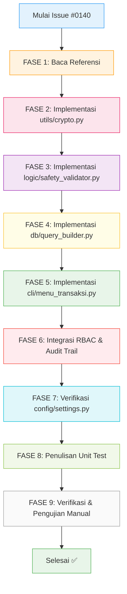

# Issue #0140 — Feature: Kelola Database Pelanggan CRM Terenkripsi

---

## 1. Persona Pengerjaan (Role Assignment)

**Persona AI yang WAJIB digunakan saat mengerjakan issue ini:**

> **Principal Full-Stack Python Security Engineer & UU PDP Compliance Specialist**
>
> Kamu adalah seorang Senior Software Engineer yang mengkhususkan diri di bidang **keamanan data pribadi**, **enkripsi simetris reversibel**, dan **arsitektur Functional Programming (FP) murni** di Python 3.14.2+. Kamu memiliki pemahaman mendalam tentang:
> - Regulasi **UU Perlindungan Data Pribadi (UU PDP No. 27/2022)** Republik Indonesia.
> - Algoritma enkripsi simetris **Fernet** (`cryptography==42.0.5`) untuk proteksi data sensitif pelanggan.
> - Paradigma **Functional Programming murni** (tanpa `class`, pure functions, immutable data via `NamedTuple`).
> - Arsitektur berlapis **4-Layer** (cli/ → logic/ → db/ → MySQL) dengan strict dependency flow.
> - Standar keamanan **RBAC decorator**, **audit trail JSON**, **parameterized SQL queries** (`%s` bindings).
> - Presentasi terminal **CLI** menggunakan pustaka `rich` dan `tabulate` dengan skema warna ANSI.
>
> **Prinsip kerja utamamu**: Kode harus aman, bersih, rapi, fungsional murni, presisi desimal, dan 100% patuh terhadap seluruh dokumen SDLC referensi proyek AbuCom.

---

## 2. Dokumen Referensi Wajib Dibaca

Sebelum menulis satu baris kode pun, **WAJIB** baca dan pahami file-file referensi berikut secara menyeluruh. Ekstrak semua detail data yang relevan dengan judul issue ini.

| # | File Referensi | Path Relatif | Alasan Relevansi |
|:-:|---|---|---|
| 1 | **Security Design v1.2** | `docs/sdlc/03_design/06_security_design.md` | **SSoT utama** untuk standar enkripsi Fernet CRM WhatsApp (Bab 6.1), RBAC matrix (Bab 5.3), audit trail JSON (Bab 7.1), dan kepatuhan UU PDP No. 27/2022. |
| 2 | **Software Requirements Specification v1.1** | `docs/sdlc/02_analysis/02_software_requirements.md` | Spesifikasi fungsional **SRS-F-038** (Database Pelanggan Terstruktur / CRM Sederhana) — input, proses, output, validasi, exception handling, dan dependensi. |
| 3 | **Coding Standard v1.2** | `docs/sdlc/04_implementation/01_coding_standard.md` | Aturan wajib penulisan kode: FP murni, naming conventions, type hints PEP 484, Result Pattern, ACID transaction wrapper, sanitasi input CLI, error codes catalog, dan UU PDP Fernet compliance (Bab 10.7). |
| 4 | **Module Structure v1.2** | `docs/sdlc/04_implementation/03_module_structure.md` | Dekomposisi file-level M.8 CRM: `cli/menu_transaksi.py` (fungsi `form_crm_pelanggan`), `logic/safety_validator.py`, `utils/crypto.py`, `db/query_builder.py`, dan signature fungsi publik. |
| 5 | **CLI Interaction Flow v1.1** | `docs/sdlc/03_design/04_cli_interaction_flow.md` | Alur interaksi detail M.8 CRM (Bab 12.1, UC-038, MENU-M8-001): langkah-langkah pendaftaran pelanggan, pencarian riwayat, wireframe, dan error codes spesifik. |
| 6 | **Access Control Matrix v1.2** | `docs/sdlc/02_analysis/06_access_control_matrix.md` | Matriks RBAC granular M.8-001: `pemilik`=FULL, `pramuniaga`=FULL, `kasir`=FULL, `kepala_percetakan`=READ, sisanya=DENY. Tabel CRUD `pelanggan`: Bab 5.2 baris #3. |
| 7 | **Database Schema DDL SQL v1.2** | `schema.sql` | DDL fisik tabel `pelanggan` (TABEL 03, baris 86-96), tabel `audit_logs` (untuk logging), dan relasi FK `pelanggan_id` di tabel `transaksi` dan `jasa_service`. |
| 8 | **Environment Setup** | `.env.example` | Variabel `FERNET_KEY` (baris 26) — kunci enkripsi simetris 32-byte untuk proteksi WhatsApp CRM. |

---

## 3. Rangkuman Data Relevan dari Dokumen Referensi

### 3.1. Spesifikasi Fungsional (SRS-F-038)

| Atribut | Nilai |
|---|---|
| **ID** | SRS-F-038 |
| **Derivasi BRD** | BR-F-36 (Database Pelanggan Terstruktur) |
| **Modul** | M.8 — Pembatalan, Retur & CRM |
| **Prioritas** | Medium |
| **Aktor** | `pramuniaga`, `kasir`, `pemilik` |

- **Deskripsi**: Sistem menyimpan database profil pelanggan sederhana (nama, nomor WhatsApp, riwayat transaksi) **terenkripsi lokal** dan melindunginya dari ekspor data ilegal demi kepatuhan **UU PDP No. 27/2022**.
- **Input**: `nama_pelanggan` (VARCHAR 100), `whatsapp` (VARCHAR 100 — disimpan terenkripsi).
- **Proses**:
  1. Catat profil pelanggan baru ke tabel `pelanggan` MySQL.
  2. Nomor WhatsApp **dienkripsi secara lokal di Python** sebelum disimpan ke kolom database (mencegah kebocoran data pribadi).
  3. Tautkan `pelanggan_id` dengan riwayat pesanan kustom/retail di tabel `transaksi`.
- **Output**: Baris baru di tabel `pelanggan`; tampilan profil riwayat transaksi di CLI.
- **Validasi**: Nomor WhatsApp **HARUS** divalidasi ke format regex Indonesia: `^628[0-9]{8,11}$`.
- **Exception**: Jika nomor WA sudah terdaftar → `"ERR-CRM-036: Nomor WhatsApp sudah terdaftar atas nama pelanggan [Nama]!"` dan tawarkan opsi re-order.
- **Dependensi**: `SRS-F-001` (Transaksi), `SRS-F-031` (RBAC), `SRS-NF-07` (Enkripsi).
- **Catatan Implementasi**: Enkripsi menggunakan algoritma **Fernet reversibel** dari pustaka `cryptography==42.0.5`.

### 3.2. Skema Database Tabel `pelanggan` (DDL)

```sql
-- [TABEL 03] pelanggan (schema.sql baris 86-96)
CREATE TABLE pelanggan (
    id INT NOT NULL AUTO_INCREMENT PRIMARY KEY,
    nama_pelanggan VARCHAR(100) NOT NULL,
    whatsapp VARCHAR(100) NOT NULL UNIQUE,     -- Terenkripsi Fernet (UU PDP)
    tanggal_terdaftar DATE NOT NULL DEFAULT (CURRENT_DATE),
    cabang_id INT NOT NULL DEFAULT 1,
    created_at TIMESTAMP NOT NULL DEFAULT CURRENT_TIMESTAMP,
    updated_at TIMESTAMP NOT NULL DEFAULT CURRENT_TIMESTAMP ON UPDATE CURRENT_TIMESTAMP,
    CONSTRAINT fk_pelanggan_cabang_id FOREIGN KEY (cabang_id)
        REFERENCES cabang(id) ON DELETE RESTRICT ON UPDATE CASCADE
) ENGINE=InnoDB DEFAULT CHARSET=utf8mb4 COLLATE=utf8mb4_unicode_ci;
```

**Catatan penting**:
- Kolom `whatsapp` bertipe `VARCHAR(100)` dengan constraint `UNIQUE` — menyimpan **cipher text Fernet base64** (bukan teks polos).
- `tanggal_terdaftar` otomatis terisi `CURRENT_DATE`.
- `cabang_id` default `1` (multi-branch ready).

### 3.3. Hak Akses RBAC (ACM M.8-001)

| Peran | Akses Menu CRM | Operasi CRUD Tabel `pelanggan` |
|---|:---:|:---:|
| `pemilik` | ✅ FULL | CRUD |
| `kepala_percetakan` | ⛔ DENY | R--- |
| `pramuniaga` | ✅ FULL | CRU- |
| `kasir` | ✅ FULL | CRU- |
| `desainer` | ⛔ DENY | ---- |
| `produksi_cetak` | ⛔ DENY | ---- |
| `fotocopy_print` | ⛔ DENY | ---- |
| `gudang` | ⛔ DENY | ---- |

> **Catatan**: `kepala_percetakan` memiliki akses `READ` di level tabel database tetapi `DENY` di level menu CLI. Ini berarti kepala percetakan **tidak bisa membuka menu CRM dari dashboard**, namun data pelanggan bisa terlihat di konteks modul lain (misal: lookup pelanggan di antrian kerja M.5).

### 3.4. Alur Interaksi CLI (CLI Interaction Flow — UC-038)

**Menu ID**: `MENU-M8-001`
**Breadcrumb**: `Dashboard > M.8 CRM > Manajemen Pelanggan`

**Opsi Menu**:
```
Opsi: [1-Daftarkan Pelanggan Baru, 2-Cari Riwayat Transaksi Pelanggan] [0-Kembali]:
```

**Alur Pendaftaran Pelanggan Baru (Opsi 1)**:

| No. | Aktor/Sistem | Aksi | Tipe |
|:---:|---|---|---|
| 1 | Sistem | Tampilkan header breadcrumb CRM | Output |
| 2 | Sistem | Tampilkan opsi menu CRM (1-Daftar Baru, 2-Cari Riwayat) | Output |
| 3 | Pengguna | Ketik `1` | Input |
| 4 | Sistem | Minta nama pelanggan | Output |
| 5 | Pengguna | Ketik nama (maks 100 char) | Input |
| 6 | Sistem | Minta nomor WhatsApp | Output |
| 7 | Pengguna | Ketik nomor WA | Input |
| 8 | Sistem | Validasi regex `^628[0-9]{8,11}$` → Enkripsi Fernet → START TRANSACTION → INSERT → COMMIT | Proses |
| 9 | Sistem | Tampilkan sukses hijau + ID Pelanggan | Output |

**Error Codes**:

| Kode | Pemicu | Pesan |
|---|---|---|
| `ERR-VAL-036` | Nomor WA tidak valid (< 10 digit atau non-numerik) | `⛔ ERR-VAL-036: WhatsApp Tidak Valid: Nomor WhatsApp pelanggan minimal 10 digit angka numerik!` |
| `ERR-CRM-036` | Nomor WA sudah terdaftar | `⛔ ERR-CRM-036: Nomor WhatsApp sudah terdaftar atas nama pelanggan [Nama]!` |

### 3.5. Standar Enkripsi Fernet (Security Design)

- **Algoritma**: `cryptography.fernet.Fernet` — enkripsi simetris AES-128-CBC + HMAC-SHA256.
- **Kunci**: Variabel `FERNET_KEY` dibaca dari `.env`, dihasilkan via:
  ```python
  python -c "from cryptography.fernet import Fernet; print(Fernet.generate_key().decode('utf-8'))"
  ```
- **Proses Enkripsi**: Nomor WA polos → encode UTF-8 → `Fernet.encrypt()` → decode ke string base64 → simpan ke kolom `whatsapp`.
- **Proses Dekripsi**: Baca cipher text dari DB → encode UTF-8 → `Fernet.decrypt()` → decode ke string polos → tampilkan di CLI.

### 3.6. Kondisi Kode Saat Ini (Status Existing)

| File | Status | Keterangan |
|---|---|---|
| `utils/crypto.py` | **STUB (TODO)** | Fungsi `encrypt_whatsapp_number()` dan `decrypt_whatsapp_number()` sudah ada header/docstring tetapi body hanya `return ""`. |
| `cli/menu_transaksi.py` | **STUB (TODO)** | Fungsi `form_crm_pelanggan()` sudah ada header/docstring tetapi body hanya `print("[PLACEHOLDER]")`. |
| `logic/safety_validator.py` | **SUDAH ADA** | File sudah berisi 17KB kode. Perlu **ditambahkan** fungsi validasi khusus CRM. |
| `db/query_builder.py` | **SUDAH ADA** | Perlu **ditambahkan** query functions khusus CRM. |
| `middleware/audit_logger.py` | **SUDAH ADA** | Perlu dipanggil saat operasi CRM (INSERT/UPDATE/DELETE pelanggan). |
| `middleware/rbac_guard.py` | **SUDAH ADA** | Perlu memastikan `MENU-M8-001` terdaftar di RBAC matrix. |
| `config/settings.py` | **SUDAH ADA** | Perlu memastikan `FERNET_KEY` dimuat dari `.env`. |

---

## 4. Batasan & Prasyarat (Constraints)

> [!CAUTION]
> **ATURAN WAJIB — JANGAN DILANGGAR:**
> 1. **DILARANG** menggunakan kata kunci `class` di seluruh file logika bisnis (`logic/`, `db/`).
> 2. **DILARANG** menyimpan nomor WhatsApp dalam bentuk **teks polos** ke database MySQL.
> 3. **DILARANG** menggunakan `f-string` atau `.format()` untuk membangun query SQL.
> 4. **DILARANG** mengubah/menghapus kode existing di modul lain yang **tidak terkait** CRM M.8.
> 5. **WAJIB** semua query SQL menggunakan `%s` parameterized bindings.
> 6. **WAJIB** semua fungsi publik dilengkapi type hints PEP 484 dan docstring PEP 257.
> 7. **WAJIB** semua nominal/ID menggunakan `decimal.Decimal` atau `int` — bukan `float`.
> 8. **WAJIB** mengembalikan `Result` NamedTuple (bukan raise exception) di fungsi logika bisnis.
> 9. **WAJIB** setiap operasi modifikasi data (INSERT/UPDATE/DELETE) pada tabel `pelanggan` memicu penulisan ke tabel `audit_logs`.
> 10. **WAJIB** menjaga kompatibilitas Dual-OS (Windows 11 & Linux Debian 12) menggunakan `pathlib` dan `encoding='utf-8'`.

---

## 5. Checklist Implementasi (Low-Level Tasks)

### FASE 1: Persiapan & Pembacaan Referensi

- [ ] **T-001**: Baca file `docs/sdlc/03_design/06_security_design.md` — ekstrak bagian **Bab 6.1** (Enkripsi Data Pribadi CRM), catat:
  - Algoritma enkripsi yang digunakan (Fernet).
  - Lokasi kunci enkripsi (`FERNET_KEY` di `.env`).
  - Cara generate kunci Fernet.
  - Format output cipher text (base64 string).

- [ ] **T-002**: Baca file `docs/sdlc/02_analysis/02_software_requirements.md` — ekstrak bagian **SRS-F-038** (baris 1345-1372), catat:
  - Input/Output spesifikasi.
  - Aturan validasi regex WhatsApp: `^628[0-9]{8,11}$`.
  - Pesan exception handling (`ERR-CRM-036`).
  - Dependensi ke SRS lain.

- [ ] **T-003**: Baca file `docs/sdlc/04_implementation/01_coding_standard.md` — ekstrak:
  - **Bab 2.2**: Aturan FP murni (pure functions, immutability, Result pattern).
  - **Bab 10.7**: Aturan proteksi UU PDP (Fernet 32-byte key).
  - **Bab 10.4**: Aturan RBAC decorator `require_role()`.
  - **Bab 10.6**: Aturan audit trail logging.
  - **Bab 11.5**: Katalog error codes (`ERR-CRM`, `ERR-VAL`).

- [ ] **T-004**: Baca file `docs/sdlc/04_implementation/03_module_structure.md` — ekstrak:
  - **Bab 4.3**: Spesifikasi `cli/menu_transaksi.py` — fungsi `form_crm_pelanggan()`, MENU-M8-001.
  - **Bab 9.2**: Spesifikasi `utils/crypto.py` — signature `encrypt_whatsapp_number()` dan `decrypt_whatsapp_number()`.

- [ ] **T-005**: Baca file `docs/sdlc/03_design/04_cli_interaction_flow.md` — ekstrak **Bab 12.1** (UC-038, MENU-M8-001):
  - Langkah-langkah interaksi detail.
  - Wireframe/mockup (jika ada).
  - Pesan error yang mungkin muncul.

- [ ] **T-006**: Baca file `docs/sdlc/02_analysis/06_access_control_matrix.md` — ekstrak **Bab 4.9** (M.8):
  - Matriks akses per peran untuk `MENU-M8-001`.
  - Matriks CRUD tabel `pelanggan` (Bab 5.2, baris #3).

- [ ] **T-007**: Baca file `schema.sql` — ekstrak DDL tabel `pelanggan` (baris 86-96) dan verifikasi:
  - Tipe data kolom `whatsapp` cukup panjang untuk cipher text Fernet (VARCHAR 100).
  - Constraint `UNIQUE` pada kolom `whatsapp`.
  - Foreign Key `cabang_id` ke tabel `cabang`.

- [ ] **T-008**: Baca file `.env.example` — verifikasi keberadaan variabel `FERNET_KEY` (baris 26).

- [ ] **T-009**: Baca file `config/settings.py` — verifikasi bahwa `FERNET_KEY` sudah dimuat dari `.env` via `os.getenv('FERNET_KEY')`. **Jika belum ada, tandai sebagai gap yang harus diperbaiki.**

- [ ] **T-010**: Baca file `utils/crypto.py` — verifikasi status stub (TODO). Catat signature fungsi existing.

- [ ] **T-011**: Baca file `cli/menu_transaksi.py` — verifikasi status stub (TODO) pada fungsi `form_crm_pelanggan()`.

- [ ] **T-012**: Baca file `logic/safety_validator.py` — identifikasi fungsi validasi existing. Catat apakah sudah ada fungsi validasi WhatsApp atau belum. **Jika belum, tandai sebagai gap.**

- [ ] **T-013**: Baca file `middleware/rbac_guard.py` — verifikasi bahwa `MENU-M8-001` sudah terdaftar di RBAC matrix. **Jika belum, tandai sebagai gap.**

- [ ] **T-014**: Baca file `middleware/audit_logger.py` — verifikasi signature fungsi `log_audit_trail()` existing. Catat parameter yang dibutuhkan.

- [ ] **T-015**: Baca file `db/query_builder.py` — identifikasi pola existing untuk INSERT/SELECT/UPDATE query. Catat template yang bisa dicontoh untuk query CRM baru.

---

### FASE 2: Implementasi Layer Utilities (`utils/crypto.py`)

- [ ] **T-020**: Implementasi fungsi `encrypt_whatsapp_number()` di `utils/crypto.py`:
  ```python
  # Target: utils/crypto.py — Ganti TODO stub dengan implementasi nyata
  # Impor yang dibutuhkan:
  from cryptography.fernet import Fernet

  def encrypt_whatsapp_number(wa_number: str, fernet_key: str) -> str:
      """Mengenkripsi nomor WhatsApp ke dalam format cipher text base64.

      (Ref: Security Design Bab 6.1 — UU PDP No. 27/2022)

      Args:
          wa_number (str): Nomor WhatsApp pelanggan dalam teks polos (format: 628xxx).
          fernet_key (str): Kunci enkripsi simetris Fernet 32-byte dari .env.

      Returns:
          str: Hasil enkripsi berupa string base64 cipher text.

      Raises:
          ValueError: Jika fernet_key kosong atau tidak valid.
      """
      # 1. Buat instance Fernet dari kunci .env
      # 2. Encode nomor WA ke bytes UTF-8
      # 3. Encrypt menggunakan Fernet.encrypt()
      # 4. Decode hasil bytes cipher ke string base64
      # 5. Return string cipher text
  ```
  **Aturan**:
  - DILARANG menggunakan `class` — fungsi standalone.
  - WAJIB handle edge case: `fernet_key` kosong → return error yang jelas.
  - WAJIB gunakan encoding `'utf-8'` eksplisit.

- [ ] **T-021**: Implementasi fungsi `decrypt_whatsapp_number()` di `utils/crypto.py`:
  ```python
  def decrypt_whatsapp_number(encrypted_wa: str, fernet_key: str) -> str:
      """Mendekripsi cipher text base64 kembali ke nomor WhatsApp polos.

      (Ref: Security Design Bab 6.1 — UU PDP No. 27/2022)

      Args:
          encrypted_wa (str): Cipher text base64 dari nomor WhatsApp.
          fernet_key (str): Kunci enkripsi simetris Fernet 32-byte dari .env.

      Returns:
          str: Nomor WhatsApp asli dalam teks polos (format: 628xxx).
      """
      # 1. Buat instance Fernet dari kunci .env
      # 2. Encode cipher text ke bytes UTF-8
      # 3. Decrypt menggunakan Fernet.decrypt()
      # 4. Decode hasil bytes ke string polos
      # 5. Return string nomor WA asli
  ```

- [ ] **T-022**: Tambahkan validasi kunci Fernet di kedua fungsi. Jika kunci tidak valid (misal string kosong atau bukan format base64 Fernet), tangkap `Exception` dan kembalikan string kosong `""` dengan logging error ke console.

---

### FASE 3: Implementasi Layer Logic (`logic/safety_validator.py`)

- [ ] **T-030**: Tambahkan fungsi validasi WhatsApp di `logic/safety_validator.py`:
  ```python
  import re
  from collections import namedtuple

  # Gunakan NamedTuple existing jika sudah ada, atau definisikan:
  # ValidationResult = namedtuple('ValidationResult', ['is_valid', 'sanitized_data', 'error_msg'])

  def validasi_nomor_whatsapp(wa_input: str) -> ValidationResult:
      """Memvalidasi format nomor WhatsApp pelanggan ke standar Indonesia.

      (Ref: SRS-F-038 — Validasi regex ^628[0-9]{8,11}$)

      Args:
          wa_input (str): Input mentah nomor WA dari keyboard CLI.

      Returns:
          ValidationResult: Tuple berisi status validasi, data tersanitasi, dan pesan error.

      Logika Validasi:
          1. Sanitasi input (buang karakter kontrol, spasi, tanda hubung).
          2. Jika diawali '0' (format lokal), konversi ke format '62' (internasional).
             Contoh: '085678901234' → '6285678901234'.
          3. Jika diawali '+62', buang karakter '+'.
          4. Validasi regex final: ^628[0-9]{8,11}$
          5. Return ValidationResult.
      """
  ```
  **Aturan**:
  - Fungsi ini **HARUS** pure function (tidak ada side effects, tidak akses database).
  - Gunakan `re.fullmatch()` untuk validasi regex.
  - Tangani konversi format lokal `08xxx` → `628xxx`.
  - DILARANG memodifikasi fungsi existing di file ini — **hanya menambahkan** fungsi baru.

- [ ] **T-031**: Tambahkan fungsi validasi nama pelanggan di `logic/safety_validator.py`:
  ```python
  def validasi_nama_pelanggan(nama_input: str) -> ValidationResult:
      """Memvalidasi dan membersihkan nama pelanggan CRM.

      Args:
          nama_input (str): Input mentah nama pelanggan dari keyboard CLI.

      Returns:
          ValidationResult: Tuple berisi status, data bersih (title case), dan error.

      Logika:
          1. Sanitasi input (buang karakter kontrol ASCII < 0x20).
          2. Strip whitespace leading/trailing.
          3. Validasi panjang: minimal 2 karakter, maksimal 100 karakter.
          4. Validasi hanya mengandung huruf, spasi, titik, dan apostrof.
          5. Normalisasi ke title case.
      """
  ```

---

### FASE 4: Implementasi Layer Data Access (`db/query_builder.py`)

- [ ] **T-040**: Tambahkan fungsi INSERT pelanggan baru di `db/query_builder.py`:
  ```python
  from collections import namedtuple

  Result = namedtuple('Result', ['is_success', 'data', 'error_msg'])

  def insert_pelanggan_baru(
      db_connection,
      nama_pelanggan: str,
      whatsapp_encrypted: str,
      cabang_id: int
  ) -> Result:
      """Menyisipkan data pelanggan baru ke tabel pelanggan MySQL.

      (Ref: SRS-F-038, Schema DDL TABEL 03)

      Query SQL:
          INSERT INTO pelanggan (nama_pelanggan, whatsapp, cabang_id)
          VALUES (%s, %s, %s)

      Returns:
          Result: Tuple (is_success, data=id_pelanggan_baru, error_msg).
      """
  ```
  **Aturan**:
  - WAJIB gunakan parameterized query `%s`.
  - WAJIB wrap dalam `try...except` dan return `Result`.
  - Tangkap `mysql.connector.IntegrityError` (duplicate WhatsApp) → return error `ERR-CRM-036`.
  - WAJIB commit transaction.
  - WAJIB panggil `log_audit_trail()` setelah INSERT sukses (action_type='INSERT', target_table='pelanggan').

- [ ] **T-041**: Tambahkan fungsi SELECT pencarian pelanggan berdasarkan WhatsApp terenkripsi:
  ```python
  def cari_pelanggan_by_whatsapp(
      db_connection,
      whatsapp_encrypted: str,
      cabang_id: int
  ) -> Result:
      """Mencari pelanggan berdasarkan nomor WhatsApp terenkripsi.

      Query SQL:
          SELECT id, nama_pelanggan, whatsapp, tanggal_terdaftar
          FROM pelanggan
          WHERE whatsapp = %s AND cabang_id = %s

      Returns:
          Result: Tuple (is_success, data=dict_pelanggan|None, error_msg).
      """
  ```

- [ ] **T-042**: Tambahkan fungsi SELECT daftar semua pelanggan (paginasi opsional):
  ```python
  def get_daftar_pelanggan(
      db_connection,
      cabang_id: int,
      limit: int = 50,
      offset: int = 0
  ) -> Result:
      """Mengambil daftar pelanggan CRM per cabang.

      Query SQL:
          SELECT id, nama_pelanggan, whatsapp, tanggal_terdaftar
          FROM pelanggan
          WHERE cabang_id = %s
          ORDER BY id DESC
          LIMIT %s OFFSET %s

      Returns:
          Result: Tuple (is_success, data=list[dict], error_msg).
      """
  ```
  **Catatan**: Kolom `whatsapp` yang dikembalikan masih dalam bentuk cipher text — dekripsi dilakukan di layer CLI saat menampilkan ke layar.

- [ ] **T-043**: Tambahkan fungsi SELECT riwayat transaksi pelanggan:
  ```python
  def get_riwayat_transaksi_pelanggan(
      db_connection,
      pelanggan_id: int,
      cabang_id: int
  ) -> Result:
      """Mengambil riwayat transaksi terkait pelanggan CRM.

      Query SQL:
          SELECT t.id, t.no_invoice, t.tanggal_transaksi, t.total_bayar,
                 t.status_pembayaran, t.tipe_pelanggan
          FROM transaksi t
          WHERE t.pelanggan_id = %s AND t.cabang_id = %s
          ORDER BY t.tanggal_transaksi DESC
          LIMIT 20

      Returns:
          Result: Tuple (is_success, data=list[dict], error_msg).
      """
  ```

- [ ] **T-044**: Tambahkan fungsi UPDATE data pelanggan (nama/whatsapp):
  ```python
  def update_pelanggan(
      db_connection,
      pelanggan_id: int,
      nama_pelanggan: str | None,
      whatsapp_encrypted: str | None,
      cabang_id: int
  ) -> Result:
      """Memperbarui data profil pelanggan CRM.

      Logika:
          - Jika nama_pelanggan is not None → update nama.
          - Jika whatsapp_encrypted is not None → update whatsapp.
          - WAJIB panggil audit_logger untuk mencatat old_value dan new_value.

      Returns:
          Result: Tuple (is_success, data=None, error_msg).
      """
  ```
  **Aturan**:
  - WAJIB baca data lama (old_value) sebelum UPDATE untuk audit trail.
  - WAJIB wrap dalam transaction ACID.

---

### FASE 5: Implementasi Layer Presentation (`cli/menu_transaksi.py`)

- [ ] **T-050**: Implementasi fungsi `form_crm_pelanggan()` di `cli/menu_transaksi.py`. Ganti TODO stub dengan implementasi nyata sesuai alur CLI Interaction Flow UC-038:

  ```python
  def form_crm_pelanggan(session_state: dict) -> None:
      """Formulir registrasi dan kelola profil keanggotaan pelanggan CRM.

      (Ref: CLI Interaction Flow Bab 12.1, UC-038, MENU-M8-001)

      Alur:
          1. Verifikasi RBAC menggunakan decorator @require_role('MENU-M8-001').
          2. Tampilkan header breadcrumb: "Dashboard > M.8 CRM > Manajemen Pelanggan".
          3. Tampilkan opsi menu:
             [1] Daftarkan Pelanggan Baru
             [2] Cari Riwayat Transaksi Pelanggan
             [3] Lihat Daftar Semua Pelanggan
             [4] Edit Data Pelanggan
             [0] Kembali
          4. Routing input ke sub-fungsi terkait.
      """
  ```

- [ ] **T-051**: Implementasi sub-fungsi pendaftaran pelanggan baru:
  ```python
  def _form_daftar_pelanggan_baru(session_state: dict) -> None:
      """Sub-menu: Daftarkan pelanggan baru ke database CRM terenkripsi.

      Alur Detail:
          1. Input nama pelanggan → validasi via validasi_nama_pelanggan().
          2. Input nomor WhatsApp → validasi via validasi_nomor_whatsapp().
          3. Enkripsi nomor WA → encrypt_whatsapp_number(wa_sanitized, fernet_key).
          4. Cek duplikat → cari_pelanggan_by_whatsapp(encrypted_wa).
          5. Jika duplikat → tampilkan ERR-CRM-036 + tawarkan re-order.
          6. Jika unik → insert_pelanggan_baru() → tampilkan sukses hijau.
          7. Tulis audit trail (action_type='INSERT', target_table='pelanggan').

      Tampilan Sukses:
          [GREEN] Registrasi CRM Berhasil! ID Klien: CRM-054.
          Data WhatsApp terenkripsi mematuhi UU PDP No. 27/2022.
      """
  ```
  **Aturan Tampilan**:
  - Gunakan `rich` Panel/Console untuk header dan warna.
  - Gunakan warna `[green]` untuk sukses, `[red]` untuk error, `[yellow]` untuk warning.
  - WAJIB ambil `FERNET_KEY` dari `config/settings.py` (bukan hardcode).
  - WAJIB ambil `cabang_id` dari `session_state['cabang_id']`.

- [ ] **T-052**: Implementasi sub-fungsi pencarian riwayat pelanggan:
  ```python
  def _form_cari_riwayat_pelanggan(session_state: dict) -> None:
      """Sub-menu: Cari dan tampilkan riwayat transaksi pelanggan CRM.

      Alur Detail:
          1. Input nomor WhatsApp pelanggan → validasi → enkripsi.
          2. Cari pelanggan di database berdasarkan WA terenkripsi.
          3. Jika ditemukan → dekripsi WA untuk ditampilkan di layar.
          4. Ambil riwayat transaksi via get_riwayat_transaksi_pelanggan().
          5. Tampilkan profil + tabel riwayat transaksi (tabulate grid).

      Tampilan Tabel Riwayat:
          ┌──────┬──────────────────┬──────────────────┬──────────────┬──────────┐
          │ No.  │ No. Invoice      │ Tanggal          │ Total Bayar  │ Status   │
          ├──────┼──────────────────┼──────────────────┼──────────────┼──────────┤
          │ 1    │ INV-20260524-001 │ 2026-05-24 14:23 │ Rp 129.000   │ LUNAS    │
          └──────┴──────────────────┴──────────────────┴──────────────┴──────────┘
      """
  ```

- [ ] **T-053**: Implementasi sub-fungsi daftar semua pelanggan:
  ```python
  def _form_lihat_daftar_pelanggan(session_state: dict) -> None:
      """Sub-menu: Tampilkan daftar seluruh pelanggan CRM terdaftar.

      Alur:
          1. Ambil daftar pelanggan via get_daftar_pelanggan().
          2. Dekripsi nomor WA masing-masing pelanggan untuk ditampilkan.
          3. Tampilkan tabel daftar pelanggan (tabulate grid).

      Tampilan Tabel:
          ┌──────┬─────────────────────┬────────────────┬──────────────┐
          │ ID   │ Nama Pelanggan      │ WhatsApp       │ Tgl Daftar   │
          ├──────┼─────────────────────┼────────────────┼──────────────┤
          │ 54   │ Roni Wijaya         │ 6285678901234  │ 2026-05-24   │
          └──────┴─────────────────────┴────────────────┴──────────────┘
      """
  ```

- [ ] **T-054**: Implementasi sub-fungsi edit data pelanggan:
  ```python
  def _form_edit_pelanggan(session_state: dict) -> None:
      """Sub-menu: Edit data nama atau WhatsApp pelanggan existing.

      Alur:
          1. Input ID pelanggan yang ingin diedit.
          2. Tampilkan data pelanggan saat ini (dekripsi WA).
          3. Input data baru (kosongkan jika tidak ingin diubah).
          4. Validasi → Enkripsi WA baru (jika diubah).
          5. Update via update_pelanggan().
          6. Tulis audit trail (old_value vs new_value).
      """
  ```

---

### FASE 6: Integrasi RBAC & Audit Trail

- [ ] **T-060**: Verifikasi bahwa `MENU-M8-001` sudah terdaftar di `middleware/rbac_guard.py`:
  - Buka file `middleware/rbac_guard.py`.
  - Cari variabel `RBAC_MATRIX` atau dictionary otorisasi.
  - Pastikan entry berikut ada:
    ```python
    'MENU-M8-001': ['pemilik', 'pramuniaga', 'kasir']
    ```
  - **Jika belum ada, tambahkan** entry tersebut.
  - `kepala_percetakan` memiliki akses `READ` di level tabel tapi `DENY` di level menu CLI — **JANGAN** tambahkan ke whitelist menu.

- [ ] **T-061**: Terapkan decorator `@require_role('MENU-M8-001')` pada fungsi `form_crm_pelanggan()`:
  ```python
  from middleware.rbac_guard import require_role

  @require_role('MENU-M8-001')
  def form_crm_pelanggan(session_state: dict) -> None:
      ...
  ```

- [ ] **T-062**: Verifikasi bahwa setiap operasi INSERT/UPDATE/DELETE pada tabel `pelanggan` memanggil `log_audit_trail()` dari `middleware/audit_logger.py`:
  ```python
  from middleware.audit_logger import log_audit_trail

  # Contoh pemanggilan setelah INSERT sukses:
  log_audit_trail(
      pengguna_id=session_state['user_id'],
      action_type='INSERT',
      target_table='pelanggan',
      old_val=None,
      new_val={'nama_pelanggan': nama, 'whatsapp': '[ENCRYPTED]', 'cabang_id': cabang_id},
      cabang_id=session_state['cabang_id'],
      db_connection=db_conn
  )
  ```
  **Catatan penting**: Di `new_val`, **JANGAN** tulis nomor WA polos ke audit log. Tulis placeholder `'[ENCRYPTED]'` atau cipher text.

---

### FASE 7: Verifikasi Integrasi `config/settings.py`

- [ ] **T-070**: Buka file `config/settings.py` dan verifikasi:
  - [ ] Variabel `FERNET_KEY` dimuat dari `.env` menggunakan `os.getenv('FERNET_KEY')`.
  - [ ] Ada validasi bahwa `FERNET_KEY` **tidak kosong** saat startup.
  - [ ] Jika `FERNET_KEY` kosong, program menampilkan error jelas: `"ERR-FILE-002: Kunci FERNET_KEY tidak ditemukan di berkas .env!"`.

- [ ] **T-071**: Jika `FERNET_KEY` belum dimuat di `config/settings.py`, **tambahkan** baris berikut (tanpa mengubah kode existing yang tidak terkait):
  ```python
  FERNET_KEY = os.getenv('FERNET_KEY', '')
  if not FERNET_KEY:
      print("⛔ ERR-FILE-002: Kunci FERNET_KEY tidak ditemukan di berkas .env!")
  ```

---

### FASE 8: Penulisan Unit Test

- [ ] **T-080**: Buat file baru `tests/test_crm_crypto.py` berisi unit test untuk `utils/crypto.py`:
  ```python
  """
  Nama Modul: test_crm_crypto.py
  Deskripsi: Unit testing deterministik untuk fungsi enkripsi/dekripsi WhatsApp CRM.
  """
  import pytest
  from cryptography.fernet import Fernet

  # Test Cases Wajib:
  # 1. test_encrypt_decrypt_roundtrip(): Enkripsi lalu dekripsi → hasil harus sama dengan input asli.
  # 2. test_encrypt_produces_different_output(): Enkripsi nomor yang sama 2x → cipher text HARUS berbeda (karena Fernet menggunakan timestamp + IV acak).
  # 3. test_decrypt_with_wrong_key(): Dekripsi dengan kunci salah → harus return error/string kosong.
  # 4. test_encrypt_empty_string(): Input string kosong → handle gracefully.
  # 5. test_encrypt_with_empty_key(): Kunci Fernet kosong → handle gracefully.
  ```

- [ ] **T-081**: Buat file baru `tests/test_crm_validator.py` berisi unit test untuk fungsi validasi CRM:
  ```python
  """
  Nama Modul: test_crm_validator.py
  Deskripsi: Unit testing deterministik untuk validasi input CRM pelanggan.
  """
  import pytest

  # Test Cases Wajib:
  # 1. test_validasi_wa_format_valid(): Input '6285678901234' → valid.
  # 2. test_validasi_wa_konversi_lokal(): Input '085678901234' → konversi ke '6285678901234' → valid.
  # 3. test_validasi_wa_format_plus62(): Input '+6285678901234' → konversi ke '6285678901234' → valid.
  # 4. test_validasi_wa_terlalu_pendek(): Input '62856' → invalid.
  # 5. test_validasi_wa_non_numerik(): Input '628abcdefgh' → invalid.
  # 6. test_validasi_wa_tidak_diawali_628(): Input '6275678901234' → invalid.
  # 7. test_validasi_nama_valid(): Input 'Roni Wijaya' → valid, title case.
  # 8. test_validasi_nama_terlalu_pendek(): Input 'R' → invalid.
  # 9. test_validasi_nama_mengandung_angka(): Input 'Roni123' → invalid.
  # 10. test_validasi_nama_strip_whitespace(): Input '  Roni Wijaya  ' → 'Roni Wijaya'.
  ```

- [ ] **T-082**: Jalankan seluruh test suite menggunakan `pytest`:
  ```bash
  python -m pytest tests/test_crm_crypto.py tests/test_crm_validator.py -v
  ```
  **Kriteria**: Seluruh test case **HARUS** lulus (status: PASSED).

---

### FASE 9: Verifikasi & Pengujian Manual

- [ ] **T-090**: Verifikasi **tidak ada syntax error** di seluruh file yang dimodifikasi:
  ```bash
  python -m py_compile utils/crypto.py
  python -m py_compile logic/safety_validator.py
  python -m py_compile db/query_builder.py
  python -m py_compile cli/menu_transaksi.py
  ```

- [ ] **T-091**: Verifikasi bahwa **tidak ada kata kunci `class`** di file logika bisnis:
  ```bash
  grep -rn "^class " logic/ db/
  ```
  **Ekspektasi**: Output kosong (0 results).

- [ ] **T-092**: Verifikasi bahwa **tidak ada f-string di query SQL**:
  ```bash
  grep -rn "f\".*SELECT\|f\".*INSERT\|f\".*UPDATE\|f\".*DELETE" db/ logic/
  ```
  **Ekspektasi**: Output kosong (0 results).

- [ ] **T-093**: Verifikasi bahwa **seluruh fungsi publik baru** memiliki docstring dan type hints:
  - Scan manual setiap fungsi baru di: `utils/crypto.py`, `logic/safety_validator.py`, `db/query_builder.py`, `cli/menu_transaksi.py`.

- [ ] **T-094**: Lakukan pengujian integrasi manual (jika database tersedia):
  1. Jalankan aplikasi CLI.
  2. Login sebagai `kasir` atau `pramuniaga`.
  3. Navigasi ke menu CRM (M.8).
  4. Daftarkan pelanggan baru dengan nama dan nomor WA valid.
  5. Verifikasi di database MySQL bahwa kolom `whatsapp` menyimpan **cipher text** (bukan teks polos).
  6. Cari pelanggan yang baru didaftarkan → verifikasi nomor WA ditampilkan terdekripsi di layar CLI.
  7. Login sebagai `gudang` → verifikasi menu CRM **tidak terlihat** (DENY).

- [ ] **T-095**: Verifikasi audit trail:
  1. Setelah mendaftarkan pelanggan baru, cek tabel `audit_logs` di database MySQL.
  2. Pastikan ada entry baru dengan `action_type='INSERT'`, `target_table='pelanggan'`.
  3. Pastikan kolom `new_value` **TIDAK** mengandung nomor WA polos.

---

## 6. Pemetaan File yang Dimodifikasi

| # | File Target | Aksi | Deskripsi Perubahan |
|:-:|---|:---:|---|
| 1 | `utils/crypto.py` | **MODIFY** | Implementasi body fungsi `encrypt_whatsapp_number()` dan `decrypt_whatsapp_number()`. Mengganti TODO stub. |
| 2 | `logic/safety_validator.py` | **MODIFY** | Menambahkan 2 fungsi baru: `validasi_nomor_whatsapp()` dan `validasi_nama_pelanggan()`. |
| 3 | `db/query_builder.py` | **MODIFY** | Menambahkan 4 fungsi baru: `insert_pelanggan_baru()`, `cari_pelanggan_by_whatsapp()`, `get_daftar_pelanggan()`, `get_riwayat_transaksi_pelanggan()`, `update_pelanggan()`. |
| 4 | `cli/menu_transaksi.py` | **MODIFY** | Implementasi body fungsi `form_crm_pelanggan()` + 4 sub-fungsi pendukung. Mengganti TODO stub. |
| 5 | `middleware/rbac_guard.py` | **MODIFY** | Menambahkan entry `MENU-M8-001` di RBAC matrix (jika belum ada). |
| 6 | `config/settings.py` | **MODIFY** | Menambahkan loading `FERNET_KEY` dari `.env` (jika belum ada). |
| 7 | `tests/test_crm_crypto.py` | **NEW** | Unit test baru untuk enkripsi/dekripsi WhatsApp Fernet. |
| 8 | `tests/test_crm_validator.py` | **NEW** | Unit test baru untuk validasi input CRM. |

---

## 7. File yang TIDAK BOLEH Dimodifikasi

> [!WARNING]
> File-file berikut **DILARANG KERAS** diubah dalam scope issue ini:

- `schema.sql` — DDL database sudah final.
- `main.py` — Entry point tidak terkait CRM.
- `cli/dashboard.py` — Menu dashboard dikelola issue terpisah.
- `cli/menu_inventaris.py` — Modul M.2/M.5 tidak terkait.
- `cli/menu_ppob_service.py` — Modul M.3 tidak terkait.
- `cli/menu_sdm_finansial.py` — Modul M.4/M.6 tidak terkait.
- `cli/menu_configs.py` — Modul M.10 tidak terkait.
- `logic/bom_hpp.py` — Modul M.2 tidak terkait.
- `logic/smart_payroll.py` — Modul M.4 tidak terkait.
- `logic/financial_engine.py` — Modul M.6 tidak terkait.
- `middleware/auth_jwt.py` — Otentikasi tidak terkait.
- Seluruh file di `docs/sdlc/` — Dokumen referensi read-only.

---

## 8. Catatan Data Kosong / Gap yang Terdeteksi

> [!NOTE]
> Berikut adalah data yang **kosong atau belum terverifikasi** pada dokumen referensi saat issue ini disusun:

| # | Item | Status | Tindakan |
|:-:|---|---|---|
| 1 | Panjang cipher text Fernet vs VARCHAR(100) | **PERLU DIVERIFIKASI** | Cipher text Fernet base64 untuk input 13-14 digit nomor WA menghasilkan ~120-130 karakter. **VARCHAR(100) mungkin tidak cukup!** Verifikasi secara empiris dan komunikasikan ke pemilik jika perlu ALTER TABLE. |
| 2 | Fungsi `form_crm_pelanggan` belum terdaftar di routing menu `cli/menu_transaksi.py` → `show_menu_transaksi()` | **PERLU DITAMBAHKAN** | Pastikan opsi menu CRM muncul di dalam `show_menu_transaksi()` dengan routing ke `form_crm_pelanggan()`. |
| 3 | Integrasi CRM ke flow transaksi (link `pelanggan_id` saat mencatat transaksi) | **DI LUAR SCOPE** | Fitur ini terkait SRS-F-001 (Transaksi) dan akan ditangani di issue terpisah. Issue ini hanya fokus pada CRUD pelanggan dan enkripsi WA. |
| 4 | Nomor WA di `new_value` audit log | **KEPUTUSAN DESAIN** | Disarankan menulis `'[ENCRYPTED]'` di audit log, bukan cipher text maupun teks polos, untuk menjaga kepatuhan UU PDP bahkan di log internal. |

---

## 9. Diagram Alur Implementasi



---

## 10. Urutan Dependensi Antar-Fase

```
FASE 2 (crypto.py) ──┐
                      ├──→ FASE 5 (CLI menu_transaksi.py)
FASE 3 (validator) ──┤
                      │
FASE 4 (query_builder) ──┘
                      │
FASE 6 (RBAC + Audit) ←──── FASE 5
                      │
FASE 7 (settings.py) ←──── FASE 2
                      │
FASE 8 (Unit Test) ←──── FASE 2 + FASE 3
                      │
FASE 9 (Verifikasi) ←──── ALL
```

**Catatan**: FASE 2, 3, dan 4 bisa dikerjakan secara paralel karena tidak saling bergantung. FASE 5 bergantung pada hasil FASE 2, 3, dan 4.

---

*Dokumen ini disusun secara otomatis oleh Gemini 2.5 Pro berdasarkan analisis menyeluruh terhadap 8 dokumen referensi SDLC proyek AbuCom. Seluruh instruksi di atas bersifat deterministik dan siap dieksekusi oleh junior programmer atau model AI yang lebih kecil.*
