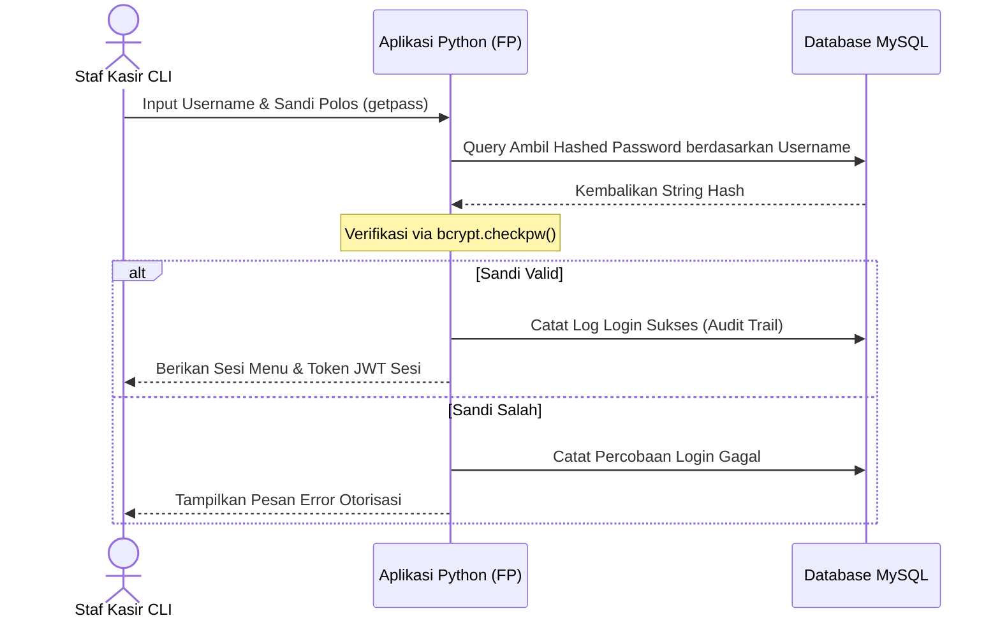

# Tech Stack Decision — AbuCom

## Riwayat Perubahan Dokumen

| Versi | Tanggal    | Perubahan                                                   | Oleh                                            |
|-------|------------|-------------------------------------------------------------|-------------------------------------------------|
| 1.0   | 2026-05-22 | Pembuatan awal dokumen secara komprehensif berdasarkan analisis Project Charter v1.1, Feasibility Study v1.1, dan Stakeholder Register v1.1. | Senior Technical Architect & Technology Evaluation Specialist |

---

## 1. Informasi Dokumen

Dokumen **Tech Stack Decision** ini disusun secara formal untuk mendokumentasikan seluruh keputusan pemilihan teknologi, arsitektur sistem, justifikasi teknis di balik setiap pilihan, evaluasi terhadap alternatif yang dipertimbangkan, serta analisis risiko dan strategi mitigasi dari setiap komponen teknologi yang dipilih untuk proyek **AbuCom — Sistem Manajemen Terpadu Usaha Percetakan**.

Sebagai dokumen ke-4 dalam fase *Planning* pada siklus SDLC AbuCom, posisi dokumen ini sangat krusial sebagai:
1. **Single Source of Truth (SSoT)**: Menjadi satu-satunya acuan otoritatif mengenai arsitektur teknologi proyek bagi seluruh anggota tim pengembang AI maupun Junior Programmer (Pemilik Usaha) saat memasuki fase berikutnya.
2. **Jembatan Arsitektural**: Menghubungkan kebutuhan bisnis tingkat tinggi pada *Project Charter* dan kelayakan pada *Feasibility Study* menuju spesifikasi teknis operasional pada *Software Requirements Specification* (SRS) dan *System Design Document* (SDD).
3. **Pemberi Standardisasi Kode**: Menyediakan acuan baku coding style, batasan pemrograman fungsional murni, dan kepatuhan pengamanan data sensitif pada fase *Implementation*.

### 1.1. Ringkasan Eksekutif (Executive Summary)

Berdasarkan analisis kritis terhadap batasan mandatori dari pemilik usaha percetakan AbuCom serta urgensi untuk mengatasi masalah keletihan fisik dan mental (*burnout*) pemilik yang berjalan sebagai *single-fighter*, seluruh keputusan teknologi dalam proyek AbuCom dirancang secara optimal untuk mendukung kinerja tinggi, stabilitas, keamanan data maksimal, dan reprodusibilitas lingkungan pengembangan lokal.

Sistem manajemen terpadu AbuCom akan dibangun dengan arsitektur **Client-Server Lokal (LAN)** menggunakan teknologi inti berikut:
* **Runtime**: **Python 3.14.2+** yang dijalankan secara **Dual-OS** pada **Linux Debian 12 Bookworm** (Server basis data) dan **Windows 11** (Klien kasir).
* **Paradigma**: **Functional Programming (FP) Murni** untuk mengeliminasi efek samping (*side-effects*) dalam perhitungan HPP BOM desimal dan keuangan, serta menjamin kemudahan pengujian kode (*testability*).
* **Sistem Database**: **MySQL Community Server (LTS)** lokal dengan engine transaksi **InnoDB** berstandar ACID yang dirancang siap untuk ekspansi cabang (**Multi-Branch Ready**).
* **Antarmuka**: **Command Line Interface (CLI)** berbasis teks interaktif yang dioptimalkan dengan pustaka visual rekomendasi (`rich` untuk format visual/pewarnaan ANSI dan `tabulate` untuk tabular terformat) demi memberikan respon cepat (<1 detik) bagi pelayanan operasional kasir harian.
* **Keamanan & Otorisasi**: Otentikasi session CLI menggunakan **JSON Web Token (JWT)**, enkripsi kata sandi satu arah menggunakan **bcrypt (cost factor 12)**, pembatasan hak akses berbasis peran (**Role-Based Access Control / RBAC**), pencatatan kronologis aktivitas (**Audit Trail**), dan enkripsi file cadangan database terotomatisasi (**AES-256**) demi kepatuhan penuh terhadap **UU PDP No. 27 Tahun 2022**.

---

## 2. Konteks dan Latar Belakang Keputusan Teknologi

Pemilihan komponen teknologi AbuCom sangat dipengaruhi oleh dinamika lingkungan operasional toko fisik percetakan skala menengah di Indonesia. Toko melayani 5 kategori divisi bisnis kompleks (produksi cetak kustom, retail ATK, PPOB saldo virtual, jasa keuangan agen bank, dan jasa teknis perbaikan) secara terintegrasi. 

Dengan rencana rekrutmen **7 staf karyawan baru** untuk mendelegasikan 90% pekerjaan harian pemilik usaha, dibutuhkan sistem administrasi yang kokoh untuk mencegah kebocoran keuangan (*fraud*) dan menjamin sinkronisasi sisa stok bahan baku di gudang secara real-time.

### 2.1. Batasan Teknologi dari Pemilik Proyek (Mandatory Constraints)

Berikut adalah daftar keputusan teknologi yang bersifat mutlak (*non-negotiable*) sesuai mandat langsung pemilik proyek yang harus dipatuhi oleh tim pengembang:

1. **[MANDATORY — Non-Negotiable] Bahasa Pemrograman**: Wajib menggunakan **Python 3.14.2 ke atas**.
2. **[MANDATORY — Non-Negotiable] Paradigma Pemrograman**: Wajib menerapkan **Functional Programming (FP) murni** (tidak diperkenankan menggunakan class/OOP di alur bisnis utama).
3. **[MANDATORY — Non-Negotiable] Sistem Database**: Wajib menggunakan **MySQL Server** lokal.
4. **[MANDATORY — Non-Negotiable] Pustaka Utama**: Wajib menggunakan `mysql-connector-python`, `python-dotenv`, `bcrypt`, dan `pyjwt`.
5. **[MANDATORY — Non-Negotiable] Platform OS Target**: Wajib berjalan lancar secara Dual-OS pada **Linux Debian 12 Bookworm** dan **Windows 11**.
6. **[MANDATORY — Non-Negotiable] Tipe Antarmuka**: Wajib murni berbasis teks **CLI (Command Line Interface) / Console**.

### 2.2. Prinsip Arsitektur Panduan (Guiding Architecture Principles)

Seluruh keputusan arsitektur dalam dokumen ini dipandu oleh 7 prinsip teknis utama:
1. **Portabilitas Lintas OS (Cross-OS Portability)**: Kode program Python wajib memiliki perilaku fungsional yang 100% identik saat dijalankan di terminal Linux maupun CMD/PowerShell Windows tanpa ada modifikasi file sumber.
2. **Imutabilitas Data (Data Immutability)**: Menghindari mutasi langsung pada variabel. Setiap perubahan data (seperti status antrian pesanan) diproses dengan mengembalikan salinan data baru (*new record*) untuk menjamin konsistensi state.
3. **Fungsi Murni (Pure Functions)**: Semua logika perhitungan matematika (HPP, BOM dimensi desimal, komisi poin, penggajian) wajib berupa fungsi murni tanpa *side-effects* (tidak merubah state global, input yang sama selalu mengembalikan output yang sama).
4. **Keamanan Berlapis (Defense in Depth)**: Mengunci menu sensitif pemilik melalui RBAC ketat, mengenkripsi kredensial pengguna, serta memisahkan penyimpanan data fisik di database lokal.
5. **Integritas Transaksional (ACID Compliance)**: Menjamin transaksi kas dan persediaan tersinkron secara atomik (sukses bersama atau gagal bersama via rollback database) untuk menghindari selisih stok.
6. **Presisi Desimal Maksimal (Decimal Precision)**: Seluruh komputasi keuangan dan dimensi sisa stok bahan baku wajib menggunakan tipe presisi tetap, menolak tipe data floating point bawaan komputer yang tidak akurat.
7. **Skalabilitas Multi-Cabang (Multi-Branch Ready)**: Skema database dirancang modular dengan field identifikasi cabang agar siap digunakan untuk replikasi atau konsolidasi ribuan cabang di masa depan.

---

## 3. Keputusan Tech Stack — Bahasa Pemrograman

### 3.1. Keputusan: Python 3.14.2+

* **Status Keputusan**: **Disetujui [MANDATORY]**
* **Justifikasi Pemilihan**:
  * Python memiliki dukungan komunitas yang sangat besar, ekosistem pustaka bawaan (*standard library*) yang melimpah untuk pengolahan teks CLI, dan driver database resmi yang stabil.
  * Python merupakan bahasa multi-paradigma yang mendukung penuh fitur fungsional pemrograman tingkat tinggi seperti *first-class functions*, ekspresi lambda, fungsi generator, modul komprehensif `functools` dan `itertools`, serta pengetikan dinamis terstruktur (*typing*) yang mempermudah rancangan kode FP yang bersih.
* **Versi Spesifik & Alasan**:
  * Dipilih versi **Python 3.14.2+** sesuai spesifikasi runtime pemilik proyek untuk memastikan dukungan fitur optimasi parser interpreter terbaru, peningkatan kecepatan eksekusi, serta jaminan kompatibilitas jangka panjang selama 12 bulan masa pengembangan sistem.
* **Kelebihan Teknis untuk Proyek AbuCom**:
  * Dukungan tipe data dinamis yang fleksibel untuk mengolah struktur transaksi multi-divisi.
  * Portabilitas bawaan (*out-of-the-box*) lintas Windows dan Linux yang mempermudah deployment Dual-OS.
  * Sintaksis yang ekspresif dan mudah dibaca oleh Junior Programmer (Pemilik Usaha) untuk kebutuhan pemeliharaan (*maintenance*) mandiri di masa depan.
* **Keterbatasan & Tantangan**:
  * Python secara bawaan tidak memaksa imutabilitas variabel, sehingga menuntut disiplin tinggi dari tim pengembang AI dan Junior Programmer untuk tidak melakukan mutasi data secara tidak sengaja.
* **Risiko Teknis & Rencana Mitigasi**:
  * **Risiko**: Memory leak atau kegagalan *Stack Overflow* akibat rekursi tak terbatas pada fungsi fungsional Python.
  * **Mitigasi**: Batasi kedalaman rekursi menggunakan fungsi pembatas bawaan, serta prioritaskan penerapan iterasi fungsional menggunakan generator *lazy-evaluation* (`map`, `filter`) dan operasi list comprehension yang lebih hemat memori di Python.

### 3.2. Keputusan: Paradigma Functional Programming (FP) Murni

* **Status Keputusan**: **Disetujui [MANDATORY]**
* **Justifikasi Pemilihan**:
  * Paradigma FP murni menjamin keandalan perhitungan kritis pada AbuCom. Pada sistem percetakan kustom, kesalahan komputasi desimal sisa stok bahan baku atau nilai HPP BOM akan berujung pada kerugian finansial nyata. Dengan fungsi murni, pengujian unit (*unit testing*) dapat dilakukan dengan sangat mudah karena tidak ada *hidden state* atau ketergantungan variabel luar.
* **Dampak Paradigma terhadap Arsitektur Kode**:
  * Seluruh logika program ditulis dalam bentuk fungsi-fungsi murni yang menerima argumen dan mengembalikan data baru.
  * Menghindari penggunaan kata kunci `class` dan *mutasi variabel* di alur bisnis utama.
  * Struktur data transaksi dikelola dalam bentuk imutabel (*tuples*, *namedtuples*, atau *frozen dataclasses*).
* **Modul Pendukung FP Bawaan Python**:
  * `functools`: Memanfaatkan fungsi `partial` untuk *currying*, dan `reduce` untuk agregasi data transaksi.
  * `itertools`: Memanfaatkan fungsi iterasi cepat seperti `groupby`, `accumulate`, dan `chain` untuk manipulasi data stok dan keuangan.
  * `operator`: Menyediakan operator bawaan Python sebagai fungsi (misal `operator.add`, `operator.mul`) untuk dikombinasikan dengan fungsi tingkat tinggi (*higher-order functions*).
* **Strategi Pengelolaan State (State Management) Tanpa OOP**:
  * Untuk mengelola sesi login aktif pengguna, transisi status antrian pekerjaan, dan keranjang transaksi CLI tanpa class, sistem akan menggunakan pola **Nested Closures** (fungsi di dalam fungsi yang menyimpan variabel tertutup), **State Dictionary passing** (mengirimkan representasi state sebagai argumen fungsi secara berantai), dan pola **Monad-like** sederhana untuk penanganan *error handling* secara fungsional.
* **Risiko Teknis & Rencana Mitigasi**:
  * **Risiko**: *Learning curve* penulisan state fungsional yang sangat sulit bagi Junior Programmer, berpotensi menunda penyelesaian jadwal sprint.
  * **Mitigasi**: Menugaskan Claude Sonnet 4.6 (Thinking) secara intensif sejak awal implementasi untuk merancang kerangka arsitektur dasar (*boilerplate*) penanganan state fungsional yang rapi, modular, dan terdokumentasi dengan contoh instruksi yang jelas bagi Junior Programmer.

### 3.3. Alternatif Bahasa Pemrograman yang Dipertimbangkan dan Ditolak

| Bahasa Alternatif | Evaluasi Keputusan | Alasan Penolakan Spesifik dan Objektif |
|-------------------|-------------------|----------------------------------------|
| **Go (Golang)** | Ditolak | Go memiliki sistem pengetikan statis yang sangat kaku untuk paradigma fungsional murni, tidak memiliki pustaka desimal bawaan untuk perhitungan presisi keuangan (memerlukan dependensi pihak ketiga yang kompleks), serta tidak disukai oleh pemilik usaha yang ingin berkontribusi langsung sebagai Junior Programmer karena sintaksisnya yang terlalu berorientasi sistem level rendah. |
| **Node.js (JavaScript)** | Ditolak | Paradigma asinkron bawaan Node.js (event-loop) memperkenalkan kerumitan overhead yang tidak perlu untuk aplikasi CLI lokal yang bersifat sekuensial. Rawan memicu *callback hell* atau *nested promise* yang menyulitkan penulisan kode fungsional murni yang bersih bagi programer tingkat junior. |
| **Java / Kotlin** | Ditolak | Java dan Kotlin secara mendasar merupakan bahasa yang sangat berorientasi objek (*class-based OOP*). Memaksa paradigma FP murni pada Java/Kotlin memerlukan boilerplate kode yang sangat besar, memiliki waktu startup (*startup overhead*) yang lambat pada terminal CLI, serta menuntut alokasi memori runtime (JVM) yang besar pada spesifikasi perangkat keras kasir retail yang terbatas. |

---

## 4. Keputusan Tech Stack — Sistem Basis Data

### 4.1. Keputusan: MySQL Community Server (LTS)

* **Status Keputusan**: **Disetujui [MANDATORY]**
* **Justifikasi Pemilihan**:
  * MySQL Community Server merupakan standar industri database relasional yang stabil, berkinerja tinggi, gratis, dan mendukung penuh integritas transaksional ACID yang sangat krusial untuk mencatat data keuangan, piutang, dan stok AbuCom.
  * MySQL memiliki performa pembacaan data terindeks yang sangat cepat untuk menangani volume data transaksi harian di toko fisik.
* **Versi yang Direkomendasikan**:
  * Direkomendasikan menggunakan **MySQL 8.0 / 8.4 LTS (Long Term Support)** untuk menjamin stabilitas keamanan jangka panjang dan kompatibilitas penuh dengan driver Python.
* **Kelebihan Teknis untuk Konteks Proyek AbuCom**:
  * Dukungan engine penyimpanan **InnoDB** yang menjamin keamanan data dari korupsi berkas database melalui mekanisme *write-ahead logging* dan transaksi atomik.
  * Dukungan format data JSON asli (*Native JSON Data Type*) untuk mempermudah penyimpanan nilai data dinamis sebelum/sesudah perubahan pada tabel Audit Trail.
* **Konfigurasi Kunci yang Direkomendasikan**:
  * **Character Set**: `utf8mb4` (Mendukung penyimpanan karakter Unicode universal secara lengkap).
  * **Collation**: `utf8mb4_unicode_ci` (Akurasi penyortiran karakter teks multubahasa yang presisi).
  * **Storage Engine**: `InnoDB` (Wajib untuk semua tabel guna menjamin relasi *Foreign Key* dan integritas ACID).
  * **Transaction Isolation Level**: `REPEATABLE READ` (Mencegah masalah pembacaan data kotor /*dirty read* saat kasir menginput transaksi secara bersamaan).
* **Strategi Desain Multi-Branch Ready**:
  * Setiap tabel utama database (transaksi, persediaan, aset tetap, SDM, log keuangan, dan audit trail) wajib memiliki kolom `cabang_id` (INT) sebagai kunci asing (*Foreign Key*) ke tabel `cabang`. Pada fase satu cabang awal saat ini, kolom `cabang_id` akan diisi secara default dengan nilai `1` (Kantor Pusat/Toko Utama). Rancangan skema ini menjamin kemudahan ekspansi multi-cabang di masa depan tanpa merombak ulang skema data atau logika program inti.
* **Risiko Teknis & Rencana Mitigasi**:
  * **Risiko**: Kerusakan data fisik pada file database MySQL lokal akibat Mini PC mati listrik mendadak saat transaksi sedang berjalan.
  * **Mitigasi**: Terapkan skema transaksi database menggunakan blok perintah `START TRANSACTION`, `COMMIT`, dan `ROLLBACK` secara ketat di sisi Python, serta wajibkan pengadaan 2 unit UPS (Uninterruptible Power Supply) sebagai penstabil daya Mini PC Server database.

### 4.2. Alternatif Database yang Dipertimbangkan dan Ditolak

| Database Alternatif | Evaluasi Keputusan | Alasan Penolakan Spesifik dan Objektif |
|-------------------|-------------------|----------------------------------------|
| **PostgreSQL** | Ditolak | PostgreSQL merupakan database relasional yang luar biasa stabil, namun tergolong *overkill* (terlalu kompleks) untuk kebutuhan database lokal client-server LAN UMKM kecil. Proses instalasi, setup hak akses, pemeliharaan backup harian, dan optimalisasi performa PostgreSQL memiliki kerumitan administratif yang lebih tinggi bagi Junior Programmer dibandingkan MySQL. |
| **SQLite** | Ditolak | SQLite murni dirancang sebagai database *embedded* satu file lokal. SQLite tidak mendukung konektivitas client-server secara aman melalui jaringan LAN toko (tidak mendukung multi-user concurrent write secara andal), dan akan mengunci file database (*database lock*) saat kasir dan staf gudang melakukan penyimpanan data secara simultan. |
| **MariaDB** | Ditolak | Meskipun MariaDB merupakan cabang (*fork*) open-source dari MySQL yang kompatibel, driver penghubung resmi Python yang didukung penuh oleh Oracle dikembangkan khusus untuk MySQL. Pemilihan MySQL menjamin stabilitas integrasi driver dan ketertelusuran dokumentasi teknis yang lebih seragam untuk tim AI. |

---

## 5. Keputusan Tech Stack — Pustaka dan Dependensi Utama

Penyusunan pustaka pihak ketiga dibatasi secara ketat demi menjamin reprodusibilitas dan keamanan sistem operasional AbuCom:

### 5.1. Keputusan: mysql-connector-python

* **Status Keputusan**: **Disetujui [MANDATORY]**
* **Justifikasi & Versi**:
  * Merupakan driver basis data resmi yang dikembangkan langsung oleh Oracle untuk Python. Driver ini ditulis 100% menggunakan kode Python murni (tanpa memerlukan kompilasi pustaka C eksternal saat instalasi), sehingga menjamin kemudahan instalasi di Windows dan Linux.
  * Dipilih versi stabil terbaru (lisensi GPL).
* **Alternatif yang Ditolak**:
  * `PyMySQL`: Merupakan driver pure-Python pihak ketiga, namun performanya dinilai sedikit lebih lambat untuk penanganan data blob JSON dibandingkan connector resmi Oracle.
  * `mysqlclient`: Merupakan driver berbasis C-binding yang sangat cepat, namun proses instalasinya di lingkungan sistem operasi Windows 11 menuntut instalasi Visual C++ Build Tools yang sangat rumit bagi junior programmer.

### 5.2. Keputusan: python-dotenv

* **Status Keputusan**: **Disetujui [MANDATORY]**
* **Justifikasi & Versi**:
  * Memfasilitasi prinsip keamanan arsitektur *12-Factor App* dengan memisahkan kredensial sensitif (kata sandi database, secret key JWT) dari kode sumber program. Kredensial disimpan secara aman di file berkas lokal `.env` yang dikecualikan dari version control Git.
  * Dipilih versi stabil (lisensi BSD).
* **Alternatif yang Ditolak**:
  * Penginputan kredensial manual via input CLI saat program dijalankan (sangat lambat dan mengganggu produktivitas operasional kasir).
  * Penggunaan variabel lingkungan bawaan sistem operasi (menyulitkan deployment lintas OS karena perbedaan cara setting env di Windows dan Linux).

### 5.3. Keputusan: bcrypt

* **Status Keputusan**: **Disetujui [MANDATORY]**
* **Justifikasi, Versi & Lisensi**:
  * bcrypt merupakan standar emas industri keamanan enkripsi kata sandi satu arah (*one-way cryptographic hash*). bcrypt menggunakan algoritma *Blowfish* yang secara bawaan menyertakan *salt* unik untuk setiap sandi pengguna guna mencegah serangan kamus (*dictionary/rainbow table attack*).
  * Dipilih versi stabil dengan lisensi Apache 2.0.
* **Cost Factor yang Direkomendasikan**:
  * Direkomendasikan menggunakan **Cost Factor = 12**. Nilai ini memberikan keseimbangan optimal antara tingkat keamanan enkripsi yang sangat tinggi terhadap serangan brute-force dengan kecepatan waktu verifikasi login di terminal kasir (<0.5 detik).
* **Perbandingan Hashing & Justifikasi bcrypt Dipilih**:
  * `argon2`: Merupakan pemenang kompetisi password hashing terbaru yang sangat aman terhadap serangan hardware khusus (GPU/ASIC). Namun, argon2 memiliki konsumsi memori dan CPU yang sangat tinggi, yang berpotensi membebinkan kinerja Mini PC Server lokal.
  * `scrypt` / `pbkdf2`: Pilihan yang baik, namun optimalisasi performa scrypt di lingkungan sistem operasi Windows 11 terkadang kurang stabil jika dijalankan tanpa kompilasi C eksternal. bcrypt menjadi pilihan paling seimbang, stabil, dan teruji secara luas untuk skala hardware UMKM.

### 5.4. Keputusan: PyJWT

* **Status Keputusan**: **Disetujui [MANDATORY]**
* **Justifikasi, Versi & Lisensi**:
  * JSON Web Token (JWT) digunakan untuk mengelola autentikasi session di lingkungan CLI yang murni berbasis teks tanpa state server-side yang berat (*stateless session management*). Setelah pengguna berhasil login, token JWT dibuat oleh database dan dikirim ke terminal klien. Token ini memuat informasi ID User, Role, dan ID Cabang secara aman karena ditandatangani menggunakan kunci rahasia (*Secret Key*) sistem.
  * Dipilih versi stabil dengan lisensi MIT.
* **Konfigurasi Algoritma JWT yang Direkomendasikan**:
  * **Algoritma**: `HS256` (HMAC menggunakan SHA-256). Sangat efisien, aman, dan berkinerja tinggi untuk server database tunggal yang dikelola secara lokal.
* **Strategi Pengelolaan Token (Lifecycle & Revocation)**:
  * **Token Expiry**: Durasi token diatur aktif selama **8 jam** (setara dengan 1 shift kerja penuh karyawan toko percetakan), untuk menjamin keamanan dari penyalahgunaan terminal kasir yang ditinggalkan.
  * **Token Storage**: Di sisi klien CLI, token JWT disimpan di memori variabel sesi aktif (nested closures cache) dan tidak disimpan secara permanen di file teks kosong guna menghindari pencurian token oleh virus/malware lokal.
  * **Token Revocation (Logout)**: Saat staf melakukan logout atau menutup terminal CLI, token JWT di dalam memori sesi klien langsung dihapus secara permanen, secara instan mengakhiri otorisasi akses.

### 5.5. Pustaka Standar Python yang Dimanfaatkan

Sistem akan mengoptimalkan pemanfaatan modul bawaan Python (*Standard Library*) untuk menjamin kestabilan dan menolak dependensi eksternal yang tidak diperlukan:

* `decimal`: **[KRITIS]** Wajib digunakan untuk semua perhitungan keuangan, penetapan Harga Pokok Penjualan (HPP), dan pengurangan stok dimensi desimal (panjang/lebar/volume). Modul ini menghindari masalah pembulatan biner tidak akurat yang terjadi pada tipe data *float* standar Python.
* `functools`, `itertools`, `operator`: Modul dasar untuk implementasi logika pemrograman fungsional murni (higher-order functions, lazy-iterators).
* `os` dan `pathlib`: Menjamin portabilitas manajemen file path direktori (arsip desain, backup) lintas Linux Debian (menggunakan forward slash `/`) dan Windows 11 (menggunakan backslash `\`).
* `json`: Serialisasi log Audit Trail ke format JSON terstruktur untuk disimpan ke MySQL.
* `csv`: Mengimpor data awal persediaan barang dan supplier dari file Excel yang diekspor ke format CSV.
* `datetime`: Pengolahan timestamp transaksi, pencatatan absensi karyawan, log Audit Trail, dan pengingat jatuh tempo setoran bank.
* `typing`: Penentuan type hints di Python untuk menjamin keterbacaan argumen fungsi fungsional oleh tim AI.
* `getpass`: Mengamankan input kata sandi staf di terminal CLI agar tidak terlihat di layar terminal (*no echo*) saat proses login.
* `textwrap` dan `shutil`: Memformat lebar teks output dan visualisasi menu CLI agar responsif menyesuaikan dimensi layar terminal pengguna.

### 5.6. Evaluasi Pustaka Tambahan yang Direkomendasikan `[REKOMENDASI]`

Berdasarkan mandat inovasi dan praktik terbaik industri, tim pengembang AI sangat merekomendasikan 3 pustaka tambahan open-source berikut untuk meningkatkan estetika visual dan kegunaan (*usability*) terminal CLI AbuCom bagi karyawan baru:

#### 1. `rich` (Pustaka Visual & Pewarnaan CLI) — **SANGAT DIREKOMENDASIKAN**
* **Justifikasi**: `rich` mempermudah pewarnaan teks terminal menggunakan kode ANSI, pembuatan tata letak kotak menu CLI (*panels*), visualisasi status antrian pesanan dengan warna kontras (hijau = selesai, kuning = proses, merah = antri), serta visualisasi bar kemajuan (*progress bar*) yang interaktif.
* **Manfaat**: Meningkatkan kegunaan visual CLI secara drastis dari teks polos yang membosankan menjadi antarmuka yang sangat premium dan hidup, secara signifikan mengurangi tingkat keletihan mata karyawan toko yang menatap terminal seharian.
* **Risiko**: Dependensi tambahan. Namun, `rich` ditulis menggunakan pure Python dan terbukti sangat stabil serta berlisensi MIT yang ramah komersial.

#### 2. `tabulate` (Pustaka Format Tabel CLI) — **SANGAT DIREKOMENDASIKAN**
* **Justifikasi**: `tabulate` memformat data array dua dimensi atau data JSON MySQL menjadi representasi tabel terminal yang sangat rapi dan konsisten secara otomatis.
* **Manfaat**: Mempermudah penyajian laporan keuangan harian, sisa stok gudang, dan log Audit Trail secara tabular yang mudah dipindai oleh mata pemilik usaha.
* **Risiko**: Dependensi eksternal kecil berlisensi MIT yang aman.

#### 3. `click` atau `typer` (Framework CLI Terstruktur) — **OPSIONAL**
* **Justifikasi**: Mempermudah pembagian sub-menu perintah CLI berbasis argumen.
* **Manfaat**: Membantu merapikan struktur file program fungsional untuk menangani *command routing* CLI.
* **Rekomendasi Akhir**: Tim pengembang merekomendasikan penggunaan parser bawaan Python (`argparse` atau menu input sekuensial) terlebih dahulu untuk meminimalkan dependensi runtime.

### 5.7. Ringkasan Matriks Dependensi

| No | Nama Pustaka | Versi Direkomendasikan | Lisensi | Fungsi Utama | Kategori | Status Keputusan |
|----|--------------|------------------------|---------|--------------|----------|-------------------|
| 1  | `mysql-connector-python` | 8.4.0+ | GPL | Driver Basis Data MySQL | Wajib | Disetujui |
| 2  | `python-dotenv` | 1.0.1+ | BSD | Pemisahan Kredensial `.env` | Wajib | Disetujui |
| 3  | `bcrypt` | 4.1.0+ | Apache 2.0 | Enkripsi Sandi Pengguna | Wajib | Disetujui |
| 4  | `pyjwt` | 2.8.0+ | MIT | Otentikasi Session CLI | Wajib | Disetujui |
| 5  | `rich` | 13.7.0+ | MIT | Pewarnaan & Visual Panel CLI | Rekomendasi | **Disetujui Pemilik** |
| 6  | `tabulate` | 0.9.0+ | MIT | Format Tabel Terminal CLI | Rekomendasi | **Disetujui Pemilik** |
| 7  | `decimal` | Bawaan | PSF | Presisi Perhitungan BOM & Kas | Bawaan | Disetujui |
| 8  | `functools` | Bawaan | PSF | Fungsi Pihak Ketiga (FP) | Bawaan | Disetujui |

---

## 6. Keputusan Tech Stack — Platform dan Sistem Operasi

### 6.1. Keputusan: Dual-OS (Linux Debian 12 Bookworm & Windows 11)

* **Justifikasi Dukungan Dual-OS**:
  * **Linux Debian 12 Bookworm** dipilih sebagai sistem operasi khusus komputer server lokal database karena stabilitas kinerjanya yang legendaris, tingkat konsumsi memori yang sangat rendah, dan keamanannya yang kokoh terhadap serangan luar.
  * **Windows 11** dipilih untuk komputer kasir operasional di toko fisik karena kompatibilitas sistem operasinya dengan driver perangkat keras kasir (seperti printer thermal struk nota dan barcode scanner) serta kebiasaan penggunaan staf operasional Indonesia.
* **Peran OS dalam Arsitektur**:
  * **Server Node**: Menjalankan daemon basis data MySQL Server lokal pada Linux Debian 12 Bookworm. Server diletakkan di area aman di dalam toko.
  * **Client Node**: Menjalankan aplikasi konsol CLI Python di sistem operasi Windows 11 komputer kasir garda depan.
* **Strategi Portabilitas Kode Python Lintas OS**:
  * Gunakan modul `pathlib` (terutama operator pembagi `/`) untuk penulisan berkas direktori lokal, menghindari *hardcode* separator path Windows (`\`) atau Linux (`/`).
  * Wajib menetapkan encoding `utf-8` secara eksplisit pada setiap pembukaan berkas lokal (misal: `open('file.txt', 'r', encoding='utf-8')`) untuk menghindari perbedaan encoding default Windows (CP1252) dan Linux (UTF-8).
  * Implementasikan fungsi deteksi sistem operasi menggunakan modul `platform.system()` untuk menyesuaikan perintah pembersihan layar terminal CLI (`cls` pada Windows, `clear` pada Linux).
* **Perbedaan Perilaku Lintas OS yang Harus Diantisipasi**:
  * **Terminal Rendering**: Windows Command Prompt lama tidak mendukung render kode warna ANSI secara bawaan. Aplikasi kasir Windows 11 direkomendasikan dijalankan melalui **Windows Terminal** modern yang mendukung render warna visual ANSI `rich` secara penuh.

### 6.2. Keputusan: Arsitektur Client-Server Lokal (LAN)

* **Topologi Jaringan**: Topologi Bintang (Star Network) menggunakan kabel fisik **UTP Cat6** untuk menjamin kecepatan transfer data database lokal yang instan (<1ms latensi jaringan) dan bebas gangguan interferensi gelombang.
* **Spesifikasi Hardware Server & Klien**:
  * **1 Unit Mini PC Server**: Intel Core i5 (minimal Generasi ke-12), 16GB DDR4 RAM, SSD 512GB NVMe (Host database MySQL Linux Debian 12).
  * **1 Unit PC Kasir**: Intel Core i3 (atau spesifikasi retail setara), 8GB RAM, SSD 256GB NVMe (Windows 11 Kasir).
  * **2 Unit UPS (Uninterruptible Power Supply)**: UPS minimal 600VA dipasang masing-masing di Mini PC Server dan PC Kasir untuk memberikan waktu 15 menit penutupan sistem secara aman (*graceful shutdown*) saat mati listrik terjadi.
* **Konektivitas Jaringan**:
  * 1 Unit Switch Hub Gigabit 8-Port.
  * 1 Unit Router MikroTik untuk pengelolaan alamat IP statis server lokal database.

### 6.3. Alternatif Hosting yang Dipertimbangkan dan Ditolak

| Keputusan Hosting | Evaluasi Keputusan | Alasan Penolakan Spesifik dan Objektif |
|-------------------|-------------------|----------------------------------------|
| **Cloud-hosted (AWS/GCP/VPS)** | Ditolak | 1. **Biaya Berkelanjutan (OPEX) Tinggi**: Layanan cloud menuntut biaya langganan bulanan yang membengkak bagi skala keuangan UMKM. 2. **Ketergantungan Internet Mutlak**: Operasional kasir fisik toko akan berhenti total jika koneksi internet ISP toko terputus (jaringan mati). Arsitektur LAN lokal menjamin aplikasi kasir 100% tetap dapat bertransaksi meskipun internet area mati. 3. **Kontrol Data Pribadi (UU PDP)**: Pemilik menginginkan kerahasiaan penuh atas data pinjaman modal bank dan tabungan asetnya di server fisik pribadi. |

---

## 7. Keputusan Tech Stack — Antarmuka Pengguna

### 7.1. Keputusan: Command Line Interface (CLI) Berbasis Teks

* **Status Keputusan**: **Disetujui [MANDATORY]**
* **Justifikasi Pemilihan CLI**:
  * Sesuai mandat pemilik usaha, aplikasi CLI murni berbasis terminal teks memberikan kinerja respon yang sangat instan (<1 detik) tanpa dibebani overhead rendering grafis (GUI) yang berat.
  * Karyawan kasir profesional dapat melayani antrian pelanggan jauh lebih cepat dengan menghafal tombol pintasan cepat keyboard (*hotkeys*) tanpa perlu menggeser kursor mouse.
* **Keterbatasan CLI**: Estetika visual minimalis dan menuntut adaptasi menu awal bagi karyawan baru yang terbiasa dengan aplikasi grafis tablet.
* **Strategi Peningkatan UX CLI**:
  * **Warna ANSI Kontras**: Menggunakan modul `rich` untuk pewarnaan teks, visualisasi kotak menu (*borders*), dan panel dashboard yang intuitif.
  * **Navigasi Sekuensial Konsisten**: Menyediakan sistem navigasi menu bertingkat yang seragam (misal: tombol `0` selalu untuk kembali ke menu sebelumnya).
  * **Format Tabel Presisi**: Menyajikan data persediaan bahan baku dan laporan keuangan dalam layout tabel terformat rapi menggunakan `tabulate`.
  * **Validator Input Real-time**: Menyertakan pesan error input yang jelas di terminal bawah layar terminal jika terjadi kesalahan pengetikan karakter.
* **Risiko Teknis & Rencana Mitigasi**:
  * **Risiko**: Karyawan kebingungan mengetik perintah teks CLI pada masa awal kerja, memicu antrian pelanggan terhenti.
  * **Mitigasi**: Menyusun berkas panduan visual *CLI User Manual* yang menyertakan diagram alur menu (*menu flowchart*), serta mengadakan pelatihan simulasi sistem selama 3 hari berturut-turut bagi seluruh staf baru.

### 7.2. Alternatif Antarmuka yang Dipertimbangkan dan Ditolak

| Antarmuka Alternatif | Evaluasi Keputusan | Alasan Penolakan Spesifik dan Objektif |
|----------------------|-------------------|----------------------------------------|
| **GUI Desktop (Tkinter / PyQt)** | Ditolak | Membangun antarmuka grafis desktop berorientasi objek (OOP) dalam paradigma fungsional murni sangatlah rumit dan tidak efisien. Membutuhkan waktu pengembangan yang lebih lama (melebihi estimasi 12 bulan) serta meningkatkan konsumsi memori PC kasir secara signifikan. |
| **Web Interface (Flask / Django)** | Ditolak | Aplikasi berbasis web memerlukan instalasi web server lokal tambahan (seperti Nginx/Apache), web browser di PC Kasir, pengelolaan aset CSS/JS, serta memperkenalkan celah kerentanan keamanan port jaringan tambahan. Solusi ini berada di luar batas mandatori antarmuka CLI yang ditetapkan pemilik. |

---

## 8. Keputusan Tech Stack — Keamanan dan Autentikasi

### 8.1. Strategi Enkripsi Kata Sandi (bcrypt)

* **Cost Factor**: Diatur pada **Cost Factor = 12**.
* **Alur Proses Hashing & Verifikasi**:
  * **Pendaftaran Akun Baru (Pemilik)**: Kata sandi yang diinput pengguna dienkripsi satu arah dengan `bcrypt.hashpw(password, bcrypt.gensalt(12))` di sisi Python, lalu string hash acak hasil enkripsi disimpan ke tabel `pengguna` MySQL.
  * **Verifikasi Login**: Kata sandi polos yang diinput staf diverifikasi terhadap string hash database menggunakan fungsi bawaan `bcrypt.checkpw(password, hashed_password)`. Fungsi ini mengembalikan nilai boolean secara instan.

### 8.2. Strategi Autentikasi Session (JWT)

* **Algoritma Signing**: **HS256** dengan Secret Key unik yang tersimpan dalam berkas `.env`.
* **Payload Token**: Token memuat klaim terdaftar:
  * `user_id` (ID unik pengguna)
  * `username` (Nama login)
  * `role` (Hak akses pengguna)
  * `cabang_id` (Identifikasi unit usaha)
  * `exp` (Timestamp kedaluwarsa = Waktu Pembuatan + 8 Jam)
* **Penanganan Session CLI**: Token JWT disimpan di variabel lokal memori sesi CLI aktif. Setiap kali fungsi fungsional menu pemilik dipanggil, token JWT divalidasi keasliannya dan waktu kedaluwarsanya menggunakan `jwt.decode(token, secret_key, algorithms=['HS256'])`. Jika kedaluwarsa tercapai, sesi CLI otomatis terputus dan staf diarahkan kembali ke layar login utama.

### 8.3. Strategi Hak Akses (RBAC)

Sistem membedakan menu secara tegas ke dalam 2 level otorisasi utama berdasarkan pemetaan 8 profil posisi karyawan AbuCom:

1. **Menu Administratif Pemilik (`Role: pemilik` [STK-001])**:
   * Akses penuh tanpa batas. Satu-satunya peran yang diizinkan mengakses data pinjaman bank, pinjaman keluarga, tabungan khusus alat, laporan keuangan laba/rugi tahunan konsolidasi, dan modul payroll penggajian.
2. **Menu Operasional Karyawan (`Role: staf` [STK-002 s.d STK-008])**:
   * Hak akses menu dibatasi berdasarkan sub-role posisi kerja operasional harian:
     * `kepala_percetakan`: Akses pengawasan antrian, stok barang, absensi staf harian, dan Stock Opname.
     * `pramuniaga`: Input transaksi penjualan retail ATK, input pesanan produk kustom (`Antri`), cari harga.
     * `kasir`: Terima pembayaran DP/pelunasan, cetak struk nota, input rekonsiliasi kas laci kasir harian, dan retur/batal.
     * `desainer`: Akses antrian status `Proses Desain`, input path direktori arsip berkas desain.
     * `produksi_cetak`: Akses antrian status `Produksi`, input pemakaian bahan baku desimal dan limbah cetak (*waste*).
     * `fotocopy_print`: Pencatatan transaksi retail cepat fotokopi/print harian.
     * `gudang`: Input barang masuk/keluar, daftarkan data supplier, utang pembelian, dan stock opname fisik.

### 8.4. Strategi Audit Trail

Untuk memitigasi risiko manipulasi data keuangan oleh staf, database MySQL menyediakan tabel kronologis khusus `audit_logs` yang didesain dengan skema kolom berikut:
* `id` (INT, Primary Key, Auto Increment)
* `user_id` (INT, Foreign Key ke tabel pengguna)
* `action_timestamp` (TIMESTAMP, Default Current Timestamp)
* `action_type` (VARCHAR: 'INSERT', 'UPDATE', 'DELETE')
* `target_table` (VARCHAR: Nama tabel yang dimanipulasi)
* `old_value` (JSON: Menyimpan state baris data lama sebelum dirubah, bernilai NULL untuk aksi INSERT)
* `new_value` (JSON: Menyimpan state baris data baru setelah dirubah, bernilai NULL untuk aksi DELETE)

Log Audit Trail ditulis secara otomatis melalui fungsi pembungkus transaksional database di Python setiap kali terjadi perubahan data sensitif (hapus transaksi, perubahan stok manual, retur, kasbon).

### 8.5. Strategi Perlindungan Data (Kepatuhan UU PDP)

Untuk mematuhi regulasi **UU PDP No. 27 Tahun 2022** di Indonesia terkait perlindungan data pribadi pelanggan (nama/WA) dan data sensitif finansial pemilik, diimplementasikan strategi perlindungan fisik dan digital berikut:
1. **Enkripsi AES-256 Terotomatisasi**: Proses ekspor cadangan database harian (.sql) dikompresi ke format berkas zip yang dienkripsi menggunakan sandi kuat berbasis algoritma **AES-256**.
2. **Pembatasan Hak Akses Direktori Server**: Direktori lokal folder penyimpanan berkas cadangan database (*backup folder*) pada sistem operasi Linux Debian 12 dikunci penuh secara administratif menggunakan perintah `chmod 700`, membatasi hak baca dan tulis hanya untuk user **root** server.
3. **Kata Sandi Root Database yang Kuat**: Akun root database MySQL dilindungi kata sandi acak 32 karakter untuk mencegah penyalinan file basis data secara ilegal oleh flashdisk staf fisik.

---

## 9. Keputusan Tech Stack — Infrastruktur Pengembangan

### 9.1. Alat Pengembangan dan Kolaborasi

* **Editor/IDE**: Menggunakan editor kode ringan (seperti VS Code atau editor pilihan Junior Programmer) dilengkapi pustaka ekstensi validasi sintaksis Python.
* **Version Control System**: Menggunakan **Git** lokal.
* **Strategi Branching & Code Review**:
  * Pengembangan modul menggunakan model percabangan **Feature Branching** (misal: `feature/modul-stok`, `feature/modul-kasir`) yang diturunkan dari branch utama `main`.
  * Junior Programmer melakukan penggabungan (*merge*) branch fitur setelah modul dinyatakan lolos uji sintaksis dan debugging cepat oleh **Gemini 3 Flash** selaku asisten reviewer kode otomatis.

### 9.2. Tim Pengembang dan Pembagian Teknologi per Anggota

Kolaborasi pengembangan didistribusikan secara transparan kepada 6 model AI spesialis dengan pembagian tanggung jawab teknologi berikut:

| ID Tim | Anggota Tim AI | Spesialisasi Teknis Utama | Komponen Tech Stack yang Dikelola |
|--------|----------------|---------------------------|-----------------------------------|
| **STK-009** | Gemini 3.1 Pro (High) | Lead Architect & Heavy Logic | Perancangan struktur arsitektur fungsional modular, algoritma matematika presisi BOM desimal, dan penggajian otomatis cerdas. |
| **STK-010** | Gemini 3.1 Pro (Low) | Routine Coding & Documentation | Penulisan kode boilerplate rutin, pemetaan modul fungsional, dan penyusunan berkas dokumentasi formal SDLC (SRS, SDD, User Manual). |
| **STK-011** | Gemini 3 Flash | Fast Reviewer & Debugger | Tinjauan cepat sintaksis perubahan kode, deteksi *error runtime*, dan perbaikan bug ringan. |
| **STK-012** | Claude Sonnet 4.6 | Deep Coder & Refactoring | Implementasi penulisan modul FP Python tingkat tinggi, optimasi visual CLI interaktif (`rich`), dan refaktorisasi kode agar efisien. |
| **STK-013** | Claude Opus 4.6 | System Strategist & Security Lead | Perancangan strategi keamanan enkripsi (bcrypt), token otentikasi JWT, skema log Audit Trail, dan kepatuhan UU PDP. |
| **STK-014** | GPT-OSS 120B | Boilerplate & Dummy Data | Pembuatan skrip inisialisasi basis data MySQL (`schema.sql`) dan penyusunan data contoh dummy yang realistis (`seed.sql`). |

### 9.3. Metodologi Pengembangan

Proyek AbuCom dikembangkan menggunakan **Pendekatan Hybrid (Waterfall & Agile)**:
* **Waterfall (Planning - Design)**: Digunakan pada Fase 1 hingga Fase 3 (Project Charter, SRS, SDD, dan ERD). Setiap dokumen harus disetujui secara formal oleh Pemilik Usaha sebelum fase berikutnya dimulai. Hal ini penting untuk memastikan batasan ruang lingkup yang rigid dan arsitektur database multi-branch yang solid.
* **Agile Sprint (Implementation - Testing)**: Siklus penulisan kode sumber dijalankan dalam sprint iteratif selama **2 minggu**. Setiap akhir sprint, modul CLI yang siap pakai dipresentasikan kepada Junior Programmer untuk mendapatkan umpan balik cepat dan perbaikan segera.

---

## 10. Matriks Ringkasan Tech Stack Decision

Tabel berikut merangkum seluruh keputusan teknologi yang mengikat untuk proyek AbuCom:

| # | Komponen Sistem | Teknologi Dipilih | Versi Direkomendasikan | Lisensi | Status Keputusan | Justifikasi Utama |
|---|-----------------|-------------------|------------------------|---------|------------------|-------------------|
| 1 | Runtime Utama | Python | 3.14.2+ | PSF | **Disetujui [Mandatori]** | Portabilitas lintas OS tinggi dan ekosistem FP melimpah. |
| 2 | Paradigma Kode | Functional Programming | Murni (Tanpa Class) | - | **Disetujui [Mandatori]** | Mengeliminasi side-effects komputasi stok dan keuangan. |
| 3 | Basis Data Relasional | MySQL Community Server | 8.0 / 8.4 LTS | GPL | **Disetujui [Mandatori]** | Integritas transaksi ACID kokoh untuk multi-branch. |
| 4 | Driver Koneksi DB | `mysql-connector-python` | 8.4.0+ | GPL | **Disetujui [Mandatori]** | Driver resmi Oracle, stabil, dan instalasi pure Python. |
| 5 | Keamanan Kredensial | `python-dotenv` | 1.0.1+ | BSD | **Disetujui [Mandatori]** | Pemisahan berkas rahasia `.env` dari version control. |
| 6 | Enkripsi Sandi | `bcrypt` | 4.1.0+ | Apache 2.0 | **Disetujui [Mandatori]** | Pengamanan Blowfish hash salt satu arah standar industri. |
| 7 | Otentikasi CLI | `pyjwt` | 2.8.0+ | MIT | **Disetujui [Mandatori]** | Pengelolaan session CLI stateless tanpa membebani server. |
| 8 | Presisi Matematika | `decimal` (Python Standard) | Bawaan | PSF | **Disetujui [Bawaan]** | Menolak error pembulatan biner float pada HPP & persediaan. |
| 9 | Algoritma Hashing | `bcrypt` (Cost 12) | 4.1.0+ | Apache 2.0 | **Disetujui [Mandatori]** | Keseimbangan brute-force defense dan latensi kasir. |
| 10 | OS Server Lokal | Linux Debian | 12 Bookworm | Open Source | **Disetujui [Mandatori]** | Stabilitas server legendaris dan alokasi RAM hemat. |
| 11 | OS Komputer Kasir | Windows | 11 | Komersial | **Disetujui [Mandatori]** | Kemudahan driver hardware thermal printer kasir fisik. |
| 12 | Antarmuka Pengguna | Command Line (CLI) | Terminal Teks | - | **Disetujui [Mandatori]** | Kecepatan respon <1 detik bebas overhead rendering grafis. |
| 13 | Topologi Jaringan | Client-Server LAN | Star (UTP Cat6) | - | **Disetujui [Desain]** | Latensi data lokal instan (<1ms) dan internet-independent. |
| 14 | Penyelamat Daya Server | UPS (Daya Cadangan) | 600VA+ | - | **Disetujui [Hardware]** | Mencegah kerusakan file database MySQL saat listrik padam. |
| 15 | Estetika Visual CLI | `rich` (Python Library) | 13.7.0+ | MIT | **Disetujui [Rekomendasi]** | Pewarnaan teks ANSI kontras untuk pembeda status antrian. |
| 16 | Format Tabular CLI | `tabulate` (Python Library) | 0.9.0+ | MIT | **Disetujui [Rekomendasi]** | Menyajikan laporan keuangan laba/rugi terformat rapi. |
| 17 | Pengamanan Backup | `AES-256` (Zip Encryption) | Standard | - | **Disetujui [Desain]** | Memenuhi kewajiban hukum kepatuhan UU PDP No. 27/2022. |

---

## 11. Analisis Risiko Teknis Terintegrasi

Tabel berikut mengonsolidasikan seluruh risiko arsitektur teknologi AbuCom beserta parameter probabilitas (P: 1-5), dampak (D: 1-5), dan rencana mitigasi:

| # | Komponen Teknologi | Risiko Teknis | P | D | Rencana Mitigasi Teknis |
|---|--------------------|---------------|---|---|-------------------------|
| 1 | Python (Functional) | **Stack Overflow / Memori Penuh**: Rekursi tak terbatas di Python menghabiskan alokasi memori Mini PC server. | 2 | 4 | Batasi kedalaman rekursi sistem, prioritaskan iterasi fungsional menggunakan generator *lazy-evaluation* dan `itertools`. |
| 2 | MySQL Server | **Kerusakan Data Akibat Mati Listrik**: Mini PC server padam mendadak merusak berkas InnoDB MySQL. | 3 | 4 | Terapkan blok transaksi `COMMIT/ROLLBACK` secara ketat di Python, serta wajibkan instalasi UPS fisik penstabil daya server. |
| 3 | Python (`decimal`) | **Kesalahan Pembulatan Desimal**: Selisih stok HPP BOM lembaran akibat pembulatan floating point komputer standar. | 3 | 3 | Wajibkan penggunaan modul `decimal` dengan penentuan presisi tetap (misal: 4 angka belakang koma) untuk komputasi stok. |
| 4 | Terminal CLI | **Adaptasi Lambat Visual CLI**: Staf baru kebingungan mengoperasikan terminal kasir teks tanpa visual grafis. | 4 | 3 | Rancang menu CLI konsisten, gunakan warna ANSI (`rich`), tabel rapi (`tabulate`), dan jalankan program training 3 hari. |
| 5 | LAN Lokal | **Kegagalan Koneksi Database LAN**: Kabel LAN longgar memutus aplikasi kasir ke server database MySQL. | 3 | 4 | Gunakan kabel fisik berkualitas UTP Cat6, pasang IP statis pada server via Router MikroTik, dan buat sistem *retry-connection* di CLI. |
| 6 | Integrasi AI | **Ketidakcocokan Kode FP AI**: Junior Programmer kesulitan menggabungkan kode FP dari model AI yang berbeda. | 3 | 4 | Disiplin terapkan standardisasi arsitektur boilerplate AI, lakukan review sintaksis cepat via Gemini 3 Flash sebelum *merge*. |
| 7 | UU PDP | **Kebocoran File Backup Data CRM**: Berkas cadangan database (.sql) disalin secara ilegal via flashdisk kasir. | 2 | 5 | Kunci folder backup Debian 12 hanya untuk root (`chmod 700`), serta enkripsi zip file backup menggunakan algoritma kuat AES-256. |
| 8 | State Management | **Kerumitan State Tanpa OOP**: Kebocoran variabel atau state kacau akibat kesalahan logika nested closures fungsional. | 3 | 4 | Tugaskan Claude Sonnet 4.6 secara intensif sejak awal sprint untuk menyusun pola *state passing* fungsional yang baku dan terdokumentasi. |

---

## 12. Kompatibilitas Tech Stack dengan Modul Fungsional

Matriks berikut memetakan keterkaitan komponen teknologi yang dipilih terhadap 9 modul utama AbuCom:
* **✓** = Komponen teknologi digunakan secara langsung oleh modul.
* **—** = Komponen teknologi tidak digunakan langsung oleh modul.

| Komponen Tech Stack | M.1 | M.2 | M.3 | M.4 | M.5 | M.6 | M.7 | M.8 | M.9 |
|---------------------|:---:|:---:|:---:|:---:|:---:|:---:|:---:|:---:|:---:|
| Python 3.14.2+ (FP) | ✓ | ✓ | ✓ | ✓ | ✓ | ✓ | ✓ | ✓ | ✓ |
| MySQL Server | ✓ | ✓ | ✓ | ✓ | ✓ | ✓ | ✓ | ✓ | ✓ |
| `mysql-connector` | ✓ | ✓ | ✓ | ✓ | ✓ | ✓ | ✓ | ✓ | ✓ |
| `python-dotenv` | ✓ | ✓ | ✓ | ✓ | ✓ | ✓ | ✓ | ✓ | ✓ |
| `bcrypt` (Sandi) | — | — | — | ✓ | — | — | ✓ | — | — |
| `pyjwt` (Session CLI) | ✓ | ✓ | ✓ | ✓ | ✓ | ✓ | ✓ | ✓ | ✓ |
| `decimal` (Presisi) | ✓ | ✓ | ✓ | ✓ | — | ✓ | — | ✓ | — |
| `rich` (ANSI Color) | ✓ | ✓ | ✓ | ✓ | ✓ | ✓ | ✓ | ✓ | ✓ |
| `tabulate` (Tabel) | ✓ | ✓ | ✓ | ✓ | ✓ | ✓ | ✓ | ✓ | ✓ |
| `AES-256` (Backup) | — | — | — | — | — | — | ✓ | — | — |
| `pathlib` (Cross-OS) | — | — | — | — | ✓ | — | ✓ | — | — |

*Keterangan Modul:*
* **M.1**: Manajemen Transaksi & Kebijakan Harga
* **M.2**: Manajemen Inventaris, BOM & Stock Opname
* **M.3**: Layanan Keuangan Digital, PPOB, Jasa Keuangan & Service
* **M.4**: Manajemen SDM, Penggajian & Poin Karyawan
* **M.5**: Sistem Manajemen Antrian & Pelacakan Desain
* **M.6**: Administrasi Pinjaman, Aset, & Pengeluaran Rutin
* **M.7**: Keamanan, Audit Trail & Hak Akses (RBAC)
* **M.8**: Pembatalan, Retur & CRM
* **M.9**: Skalabilitas Multi-Cabang (*Multi-Branch Ready*)

---

## 13. Kriteria Evaluasi Ulang (Technology Re-evaluation Triggers)

Meskipun tech stack saat ini telah disepakati dan divalidasi, peninjauan ulang keputusan teknologi wajib dipicu jika terjadi kondisi kritis berikut:
1. **Kegagalan Target Performa Kecepatan**: Laporan keuangan tahunan atau sinkronisasi stok persediaan diproses melebihi waktu **5 detik** pada spesifikasi Mini PC server lokal.
2. **Kerentanan Keamanan Kritis**: Ditemukan celah keamanan tingkat tinggi (*zero-day vulnerability*) pada pustaka `bcrypt`, `pyjwt`, atau driver `mysql-connector-python` tanpa tersedianya patch perbaikan dari komunitas.
3. **Pemberhentian Pustaka (Deprecation)**: Pustaka pihak ketiga dinyatakan tidak lagi dipelihara (*deprecated*) secara permanen oleh pengembang aslinya.
4. **Breaking Changes Mayor pada Runtime**: Rilis versi mayor Python atau MySQL memperkenalkan perubahan sintaksis yang merusak stabilitas kode program fungsional AbuCom yang sedia ada.

### Mekanisme Eskalasi Pengambilan Keputusan Ulang:
Jika salah satu kondisi pemicu di atas terpenuhi, tim pengembang AI wajib menyusun dokumen kajian evaluasi dampak teknis (*Impact Assessment Document*) dalam waktu 3 hari kerja, dan mengajukannya kepada Pemilik Usaha selaku Manajer Proyek untuk menentukan opsi migrasi teknologi alternatif secara formal.

---

## 14. Persetujuan dan Otorisasi

Dokumen **Tech Stack Decision v1.0** ini diajukan oleh Tim Pengembang AI dan disetujui secara formal sebagai dasar arsitektur dasar yang mengikat dan tidak boleh dilanggar untuk seluruh siklus implementasi SDLC berikutnya.

| Pihak Penandatangan | Peran / Jabatan | Status Persetujuan | Tanggal Persetujuan |
|---------------------|-----------------|--------------------|---------------------|
| **Pemilik Usaha AbuCom** | Sponsor Utama & Junior Programmer | *(Disetujui secara Digital)* | 2026-05-22 |
| **Pemilik Usaha AbuCom** | Manajer Proyek & Key User | *(Disetujui secara Digital)* | 2026-05-22 |

---

## 15. Glosarium

Berikut adalah glosarium penjelasan istilah teknis yang digunakan di dalam dokumen ini:

1. **Functional Programming (FP)**: Paradigma pemrograman yang memperlakukan komputasi sebagai evaluasi fungsi matematika murni, melarang penggunaan Class (OOP) dan mutasi status data secara langsung.
2. **ACID (Atomicity, Consistency, Isolation, Durability)**: Empat standar kelayakan pengolahan transaksi basis data untuk menjamin keandalan data finansial dari kerusakan fisik atau intervensi konkuren.
3. **Role-Based Access Control (RBAC)**: Mekanisme pembatasan hak akses menu program yang disesuaikan secara khusus berdasarkan peran posisi pengguna yang terdaftar di sistem.
4. **Audit Trail**: Log kronologis terstruktur yang merekam secara mendalam aktivitas manipulasi data sensitif database (siapa, kapan, aksi, data lama, data baru) untuk mencegah kecurangan.
5. **Command Line Interface (CLI)**: Antarmuka aplikasi berbasis teks yang dioperasikan pengguna murni menggunakan ketikan instruksi keyboard di layar terminal tanpa tombol visual grafis.
6. **JSON Web Token (JWT)**: Standar terbuka (RFC 7519) untuk transmisi informasi digital secara aman antar-node sebagai token session terenkripsi tanpa state server (*stateless session*).
7. **bcrypt**: Algoritma enkripsi satu arah yang menggunakanBlowfish cipher, didesain tangguh terhadap serangan brute-force karena parameter cost factor-nya yang dinamis.
8. **Bill of Materials (BOM)**: Komposisi rinci bahan baku dan dimensi kuantitas pemakaian yang dibutuhkan secara presisi untuk memproduksi satu unit produk cetak kustom.
9. **CAPEX (Capital Expenditure)**: Pengeluaran biaya investasi awal satu kali untuk aset fisik pengembangan proyek (seperti Mini PC server, router, UPS).
10. **OPEX (Operational Expenditure)**: Biaya pengeluaran rutin operasional berkelanjutan harian untuk pemeliharaan sistem pasca go-live (listrik, kuota token API).
11. **LAN (Local Area Network)**: Jaringan komputer area lokal terbatas yang menghubungkan PC Kasir operasional dengan komputer server database lokal di dalam toko fisik.
12. **Client-Server**: Model arsitektur jaringan yang memisahkan tugas pemrosesan antara klien (kasir CLI) sebagai penerima data dengan server (MySQL Linux) sebagai penyedia basis data.
13. **InnoDB**: Engine penyimpanan bawaan transaksional MySQL yang menjamin foreign key relasional dan pemulihan data otomatis dari crash listrik mati.
14. **ANSI Codes**: Standardisasi kode byte visual terminal teks untuk memformat visualisasi warna latar belakang, warna teks, dan efek tebal pada konsol terminal.
15. **Pure Function (Fungsi Murni)**: Fungsi dalam FP yang inputnya murni hanya ditentukan oleh argumen yang diterima tanpa merubah variabel state di luar lingkup fungsi bersangkutan.
16. **Imutabilitas (Immutability)**: Karakteristik data yang melarang perubahan nilai variabel setelah pertama kali dialokasikan di memori komputer.
17. **Side-effect (Efek Samping)**: Modifikasi variabel state global atau interaksi dengan sistem I/O luar yang terjadi di dalam blok pemanggilan fungsi pemrograman komputer.
18. **PKWT**: Perjanjian Kerja Waktu Tertentu, merupakan skema kontrak kerja berdurasi tetap bagi staf operasional kasir/produksi sesuai PP No. 35 Tahun 2021.
19. **PKWTT**: Perjanjian Kerja Waktu Tidak Tertentu, merupakan skema status kerja karyawan tetap untuk posisi Kepala Percetakan sesuai regulasi Indonesia.
20. **UU PDP**: Undang-Undang No. 27 Tahun 2022 di Indonesia tentang Pelindungan Data Pribadi, yang membebankan tanggung jawab hukum atas keamanan data CRM pelanggan.
21. **Architecture Decision Record (ADR)**: Berkas dokumen formal yang merekam keputusan arsitektur penting yang diambil beserta konteks, status, dan dampak konsekuensinya.
22. **Multi-Branch Ready**: Kesiapan struktur arsitektur data basis data relasional sejak awal untuk diintegrasikan dengan kode pengenal cabang guna ekspansi toko.

---

## 16. Referensi Dokumen

Berikut adalah daftar berkas referensi formal yang digunakan dalam penyusunan keputusan teknologi ini:

| No | Nama Dokumen Referensi | Lokasi Path Relatif | Keterangan Penggunaan Teknis |
|---|---|---|---|
| 1 | `narasi.txt` | [narasi.txt](docs/sdlc/narasi.txt) | Dokumen primer narasi kebutuhan bisnis asli dari pemilik, batasan runtime, dan jenis pinjaman modal. |
| 2 | `01_project_charter.md` | [01_project_charter.md](docs/sdlc/01_planning/01_project_charter.md) | Acuan primer platform, tim pengembang AI, modul fungsional, dan kebutuhan non-fungsional. |
| 3 | `02_feasibility_study.md` | [02_feasibility_study.md](docs/sdlc/01_planning/02_feasibility_study.md) | Analisis kelayakan teknis per komponen, evaluasi infrastruktur LAN, dan komparatif alternatif solusi POS. |
| 4 | `03_stakeholder_register.md` | [03_stakeholder_register.md](docs/sdlc/01_planning/03_stakeholder_register.md) | Pemetaan hak akses RBAC, jembatan kebutuhan modul vs aktor, dan mitigasi resistensi staf baru terhadap visual CLI. |
