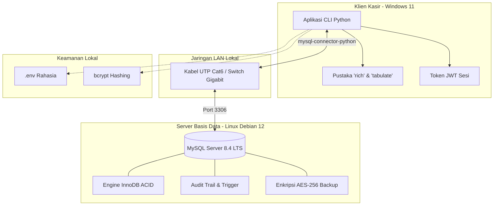

# Tech Stack Decision — AbuCom

## Riwayat Perubahan Dokumen

| Versi | Tanggal    | Perubahan                                                   | Oleh                                            |
|-------|------------|-------------------------------------------------------------|-------------------------------------------------|
| 1.0   | 2026-05-22 | Pembuatan awal dokumen secara komprehensif berdasarkan analisis Project Charter v1.1, Feasibility Study v1.1, dan Stakeholder Register v1.1. | Senior Technical Architect & Technology Evaluation Specialist |
| 1.1   | 2026-05-22 | Validasi, audit mendalam, dan penyempurnaan dokumen. Melengkapi format ADR lengkap pada pustaka utama beserta sub-bagian Risiko Teknis & Rencana Mitigasi secara eksplisit. | Principal Software Architect & Technical Documentation Lead |
| 1.2   | 2026-05-28 | Validasi menyeluruh dan penyempurnaan dokumen sesuai issue #0066. Penyesuaian fokus dokumen dengan menghapus kode spesifik implementasional, penambahan Diagram Arsitektur Sistem, Matriks Lisensi, dan Strategi Upgrade. Integrasi referensi SDLC (CAPEX, pemetaan aktor STK di RBAC). Standarisasi format ADR, bahasa, dan keterlacakan keputusan. | Principal Software Architect & Technical Documentation Lead |

---

## 1. Informasi Dokumen

Dokumen **Tech Stack Decision** ini disusun secara formal untuk mendokumentasikan seluruh keputusan pemilihan teknologi, arsitektur sistem, justifikasi teknis di balik setiap pilihan, evaluasi terhadap alternatif yang dipertimbangkan, serta analisis risiko dan strategi mitigasi dari setiap komponen teknologi yang dipilih untuk proyek **AbuCom — Sistem Manajemen Terpadu Usaha Percetakan**.

Sebagai dokumen ke-4 dalam fase *Planning* pada siklus SDLC AbuCom, posisi dokumen ini sangat krusial sebagai:
1. **Single Source of Truth (SSoT)**: Menjadi satu-satunya acuan otoritatif mengenai arsitektur teknologi proyek bagi seluruh anggota tim pengembang AI maupun Junior Programmer (Pemilik Usaha) saat memasuki fase berikutnya.
2. **Jembatan Arsitektural**: Menghubungkan kebutuhan bisnis tingkat tinggi pada *Project Charter* dan kelayakan pada *Feasibility Study* menuju spesifikasi teknis operasional pada *Software Requirements Specification* (SRS) dan *System Design Document* (SDD).
3. **Pemberi Standardisasi Kode**: Menyediakan acuan baku gaya penulisan kode, batasan pemrograman fungsional murni, dan kepatuhan pengamanan data sensitif pada fase *Implementation*.

### 1.1. Ringkasan Eksekutif (Executive Summary)

Berdasarkan analisis kritis terhadap batasan mandatori dari pemilik usaha percetakan AbuCom serta urgensi untuk mengatasi masalah keletihan fisik dan mental (*burnout*) pemilik yang berjalan sebagai *single-fighter*, seluruh keputusan teknologi dalam proyek AbuCom dirancang secara optimal untuk mendukung kinerja tinggi, stabilitas, keamanan data maksimal, dan reprodusibilitas lingkungan pengembangan lokal.

Sistem manajemen terpadu AbuCom akan dibangun dengan arsitektur **Client-Server Lokal (LAN)** menggunakan teknologi inti berikut:
* **Runtime**: **Python 3.14.2+** yang dijalankan secara **Dual-OS** pada **Linux Debian 12 Bookworm** (Server basis data) dan **Windows 11** (Klien operasional).
* **Paradigma**: **Functional Programming (FP) Murni** untuk mengeliminasi efek samping (*side-effects*) dalam perhitungan HPP BOM desimal dan keuangan, serta menjamin kemudahan pengujian kode (*testability*).
* **Sistem Basis Data**: **MySQL Community Server (LTS)** lokal dengan engine transaksi **InnoDB** berstandar ACID yang dirancang siap untuk ekspansi cabang (**Multi-Branch Ready**).
* **Antarmuka**: **Command Line Interface (CLI)** berbasis teks interaktif yang dioptimalkan dengan pustaka visual rekomendasi (`rich` untuk format visual/pewarnaan ANSI dan `tabulate` untuk tabular terformat) demi memberikan respon cepat (<1 detik) bagi pelayanan operasional kasir harian.
* **Keamanan & Otorisasi**: Otentikasi sesi CLI menggunakan **JSON Web Token (JWT)**, enkripsi kata sandi satu arah menggunakan **bcrypt (cost factor 12)**, pembatasan hak akses berbasis peran (**Role-Based Access Control / RBAC**), pencatatan kronologis aktivitas (**Audit Trail**), dan enkripsi file cadangan basis data terotomatisasi (**AES-256**) demi kepatuhan penuh terhadap **UU PDP No. 27 Tahun 2022**.

---

## 2. Arsitektur Sistem Utama

Untuk memberikan gambaran yang jelas mengenai interaksi komponen teknologi yang dipilih, berikut adalah diagram arsitektur sistem (*Dependency Graph*) aplikasi AbuCom:

---

## 3. Konteks dan Latar Belakang Keputusan Teknologi

Pemilihan komponen teknologi AbuCom sangat dipengaruhi oleh dinamika lingkungan operasional toko fisik percetakan skala menengah di Indonesia. Toko melayani 5 kategori divisi bisnis kompleks (produksi cetak kustom, ritel ATK, PPOB saldo virtual, jasa keuangan agen bank, dan jasa teknis perbaikan) secara terintegrasi. 

Dengan rencana rekrutmen **7 staf karyawan baru** untuk mendelegasikan 90% pekerjaan harian pemilik usaha, dibutuhkan sistem administrasi yang kokoh untuk mencegah kebocoran keuangan (*fraud*) dan menjamin sinkronisasi sisa stok bahan baku di gudang secara waktu nyata (*real-time*).

### 3.1. Batasan Teknologi dari Pemilik Proyek (Mandatory Constraints)

Berikut adalah daftar keputusan teknologi yang bersifat mutlak (*non-negotiable*) sesuai mandat langsung pemilik proyek yang dicantumkan dalam `narasi.txt`:

1. **Bahasa Pemrograman**: Wajib menggunakan **Python 3.14.2 ke atas**.
2. **Paradigma Pemrograman**: Wajib menerapkan **Functional Programming (FP) murni** (tidak diperkenankan menggunakan class/OOP di alur bisnis utama).
3. **Sistem Basis Data**: Wajib menggunakan **MySQL Server** lokal.
4. **Pustaka Utama**: Wajib menggunakan `mysql-connector-python`, `python-dotenv`, `bcrypt`, dan `pyjwt`.
5. **Platform OS Target**: Wajib berjalan lancar secara Dual-OS pada **Linux Debian 12 Bookworm** dan **Windows 11**.
6. **Tipe Antarmuka**: Wajib murni berbasis teks **CLI (Command Line Interface) / Console**.

### 3.2. Prinsip Arsitektur Panduan (Guiding Architecture Principles)

Seluruh keputusan arsitektur dalam dokumen ini dipandu oleh 7 prinsip teknis utama:
1. **Portabilitas Lintas OS (Cross-OS Portability)**: Kode program Python wajib memiliki perilaku fungsional yang 100% identik saat dijalankan di terminal Linux maupun CMD/PowerShell Windows tanpa ada modifikasi file sumber.
2. **Imutabilitas Data (Data Immutability)**: Menghindari mutasi langsung pada variabel. Setiap perubahan data (seperti status antrean pesanan) diproses dengan mengembalikan salinan data baru (*new record*) untuk menjamin konsistensi state.
3. **Fungsi Murni (Pure Functions)**: Semua logika perhitungan matematika (HPP, BOM dimensi desimal, komisi poin, penggajian) wajib berupa fungsi murni tanpa efek samping (*side-effects*).
4. **Keamanan Berlapis (Defense in Depth)**: Mengunci menu sensitif melalui RBAC ketat, mengenkripsi kredensial pengguna, serta memisahkan penyimpanan data fisik di basis data lokal.
5. **Integritas Transaksional (ACID Compliance)**: Menjamin transaksi kas dan persediaan tersinkron secara atomik untuk menghindari selisih stok.
6. **Presisi Desimal Maksimal (Decimal Precision)**: Seluruh komputasi keuangan dan dimensi sisa stok bahan baku wajib menggunakan tipe presisi tetap.
7. **Skalabilitas Multi-Cabang (Multi-Branch Ready)**: Skema basis data dirancang modular dengan kolom identifikasi cabang agar siap digunakan untuk replikasi cabang di masa depan.

---

## 4. Keputusan Tech Stack — Bahasa Pemrograman

### 4.1. Keputusan: Python 3.14.2+

* **Status Keputusan**: **Disetujui [Mandatori]**
* **Keterlacakan**: *Project Charter* & *narasi.txt* (Mandat Pemilik Usaha).
* **Justifikasi Pemilihan**:
  * Python memiliki dukungan komunitas yang sangat besar, ekosistem pustaka bawaan (*standard library*) yang melimpah untuk pengolahan teks CLI, dan driver basis data resmi yang stabil.
  * Mendukung penuh fitur fungsional tingkat tinggi seperti *first-class functions*, ekspresi lambda, fungsi generator, modul `functools`, serta *type hints* yang mempermudah rancangan kode FP yang bersih.
* **Versi Spesifik**:
  * Dipilih versi **Python 3.14.2+** untuk memastikan dukungan fitur optimasi parser interpreter terbaru dan menjamin kompatibilitas selama **12 bulan** masa pengembangan proyek yang diestimasikan di *Project Charter*.
* **Kelebihan Teknis**:
  * Dukungan tipe data dinamis yang fleksibel untuk mengolah struktur transaksi multi-divisi.
  * Portabilitas bawaan lintas Windows dan Linux yang mempermudah penyebaran (*deployment*) Dual-OS.
* **Keterbatasan / Tantangan**:
  * Python secara bawaan tidak memaksa imutabilitas variabel, sehingga menuntut disiplin tinggi dari tim pengembang untuk tidak melakukan mutasi data secara tidak sengaja.
* **Risiko Teknis & Rencana Mitigasi**:
  * **Risiko**: Kebocoran memori atau kegagalan *Stack Overflow* akibat rekursi tak terbatas pada fungsi.
  * **Mitigasi**: Batasi kedalaman rekursi menggunakan fungsi pembatas bawaan, serta prioritaskan penerapan iterasi fungsional menggunakan generator *lazy-evaluation* (`map`, `filter`).
* **Alternatif yang Ditolak**:
  * **Go (Golang)**: Ditolak karena sistem pengetikannya terlalu kaku untuk FP murni tanpa tipe data generik yang fleksibel, serta tidak memiliki pustaka desimal bawaan untuk perhitungan presisi keuangan.
  * **Node.js**: Ditolak karena kerumitan model asinkronnya yang rawan *callback hell* di antarmuka terminal yang bersifat sekuensial.
  * **Java / Kotlin**: Ditolak karena secara mendasar sangat berorientasi objek (OOP) dan memiliki *overhead* JVM yang terlalu besar untuk spesifikasi terminal kasir retail yang terbatas.

### 4.2. Keputusan: Paradigma Functional Programming (FP) Murni

* **Status Keputusan**: **Disetujui [Mandatori]**
* **Keterlacakan**: *Project Charter* & *narasi.txt*.
* **Justifikasi Pemilihan**:
  * Paradigma FP murni menjamin keandalan perhitungan kritis. Kesalahan komputasi desimal sisa stok bahan baku atau nilai HPP BOM akan berujung pada kerugian finansial nyata. Dengan fungsi murni, pengujian unit (*unit testing*) dapat dilakukan dengan sangat mudah karena tidak ada *hidden state* atau ketergantungan variabel luar.
* **Versi Spesifik**: Tidak relevan secara khusus, diimplementasikan pada model Python yang telah disetujui.
* **Kelebihan Teknis**:
  * Seluruh logika program ditulis dalam bentuk fungsi-fungsi murni yang menerima argumen dan mengembalikan data baru.
  * Struktur data transaksi dikelola menggunakan *tuples*, *namedtuples*, atau *frozen dataclasses* yang imutabel.
* **Keterbatasan / Tantangan**:
  * FP murni di Python memiliki kurva pembelajaran yang sangat curam, memaksa pengembang tingkat junior untuk merubah pola pikir dari OOP yang lazim.
* **Risiko Teknis & Rencana Mitigasi**:
  * **Risiko**: Kurva pembelajaran penulisan logika fungsional dan *state management* dapat menunda penyelesaian jadwal *sprint*.
  * **Mitigasi**: Menugaskan spesialis AI (Claude Sonnet 4.6) secara intensif untuk merancang kerangka arsitektur dasar *boilerplate* yang mengadopsi pola *Nested Closures* dan *State Dictionary passing* secara modular.
* **Alternatif yang Ditolak**:
  * **Object-Oriented Programming (OOP)**: Ditolak mutlak karena mutasi *state* tersembunyi dapat menyebabkan ketidakkonsistenan data antara antrean pesanan dan jumlah material di basis data yang rentan kesalahan logika (*side effects*).

---

## 5. Keputusan Tech Stack — Sistem Basis Data

### 5.1. Keputusan: MySQL Community Server (LTS)

* **Status Keputusan**: **Disetujui [Mandatori]**
* **Keterlacakan**: *Project Charter* & *Feasibility Study*.
* **Justifikasi Pemilihan**:
  * MySQL merupakan standar industri basis data relasional yang andal, efisien, gratis, dan mendukung integritas transaksional ACID yang sangat krusial untuk mencatat data keuangan dan piutang AbuCom.
* **Versi Spesifik**:
  * Direkomendasikan menggunakan **MySQL 8.0 / 8.4 LTS** untuk menjamin stabilitas keamanan jangka panjang dan kompatibilitas dengan driver Python.
* **Kelebihan Teknis**:
  * Dukungan engine penyimpanan **InnoDB** yang menjamin relasi foreign key, transaksi atomik, dan kompatibilitas penyimpanan format *Native JSON* untuk *Audit Trail*.
  * Dirancang siap mendukung arsitektur *Multi-Branch Ready* dengan skema kolom `cabang_id`.
* **Keterbatasan / Tantangan**:
  * MySQL relasional butuh skema baku yang harus dirancang sempurna sejak *Fase Design* sebelum implementasi dimulai.
* **Risiko Teknis & Rencana Mitigasi**:
  * **Risiko**: Korupsi berkas basis data lokal akibat Mini PC mati listrik mendadak di tengah transaksi jaringan LAN.
  * **Mitigasi**: Implementasi transaksi basis data transaksional menggunakan blok `START TRANSACTION`, `COMMIT`, dan `ROLLBACK`, serta wajib memasang UPS untuk menstabilkan daya server.
* **Alternatif yang Ditolak**:
  * **PostgreSQL**: Ditolak karena kompleksitas konfigurasi dan operasionalnya tergolong berlebih (*overkill*) untuk skala manajemen basis data lokal UMKM.
  * **SQLite**: Ditolak karena dirancang sebagai basis data *embedded* tunggal, tidak mendukung konektivitas client-server LAN secara multi-user tanpa mengunci file (*database lock*).
  * **MariaDB**: Ditolak demi menyelaraskan keseragaman dukungan stabilitas pemeliharaan penggerak resmi Python dari Oracle (MySQL).

---

## 6. Keputusan Tech Stack — Pustaka Utama & Standar

### 6.1. Keputusan: mysql-connector-python

* **Status Keputusan**: **Disetujui [Mandatori]**
* **Keterlacakan**: *Project Charter*.
* **Justifikasi Pemilihan**: Driver basis data resmi yang dikembangkan langsung oleh Oracle. Driver ini ditulis 100% menggunakan kode Python murni tanpa perlu kompilasi pustaka C eksternal saat instalasi.
* **Versi Spesifik**: **8.4.0+**
* **Kelebihan Teknis**: Kemudahan portabilitas instalasi yang setara pada OS Windows dan Linux.
* **Keterbatasan / Tantangan**: Lebih lambat beberapa milidetik dibandingkan *wrapper* berbasis C.
* **Risiko Teknis & Rencana Mitigasi**: 
  * **Risiko**: Gangguan koneksi saat kabel LAN bermasalah (lost connection).
  * **Mitigasi**: Terapkan mekanisme fungsi pembungkus dengan *reconnection retry* menggunakan algoritma penundaan terukur (*exponential backoff*).
* **Alternatif yang Ditolak**: `PyMySQL` atau `mysqlclient` ditolak agar spesifikasi tetap pada *driver* yang didukung penuh oleh Oracle untuk versi MySQL yang digunakan.

### 6.2. Keputusan: python-dotenv

* **Status Keputusan**: **Disetujui [Mandatori]**
* **Keterlacakan**: Praktik Terbaik Keamanan (Best Practices).
* **Justifikasi Pemilihan**: Memfasilitasi prinsip aplikasi arsitektur modern (*12-Factor App*) dengan mengabstraksi kredensial (kata sandi basis data, kunci JWT) dari kode sumber program Python.
* **Versi Spesifik**: **1.0.1+**
* **Kelebihan Teknis**: Memisahkan kredensial sensitif secara aman ke dalam berkas lingkungan tersembunyi lokal `.env`.
* **Keterbatasan / Tantangan**: Berkas konfigurasi tambahan yang berisiko tak disalin ke server jika tidak ada dokumen pendamping.
* **Risiko Teknis & Rencana Mitigasi**: 
  * **Risiko**: Berkas `.env` tidak sengaja diunggah ke repositori Git publik.
  * **Mitigasi**: Wajib mendeklarasikan ekstensi berkas rahasia tersebut ke dalam fail aturan pengabaian `.gitignore`.

### 6.3. Keputusan: bcrypt

* **Status Keputusan**: **Disetujui [Mandatori]**
* **Keterlacakan**: *Project Charter* dan kepatuhan UU PDP (Keamanan).
* **Justifikasi Pemilihan**: Menjamin keamanan otentikasi kata sandi melalui algoritma hashing *one-way* yang menyertakan penggaraman unik (*salting*), sangat efektif menangkal serangan *rainbow table*.
* **Versi Spesifik**: **4.1.0+**
* **Kelebihan Teknis**: Pengaturan **Cost Factor = 12** menyeimbangkan komputasi *brute-force defense* yang kokoh dengan kecepatan waktu verifikasi (latensi respons < 0.5 detik).
* **Keterbatasan / Tantangan**: Beban siklus CPU komputasi enkripsinya dirancang sangat berat.
* **Risiko Teknis & Rencana Mitigasi**: 
  * **Risiko**: Konsumsi CPU 100% yang membebani server lokal jika verifikasi diserang melalui banjir permintaan berturut-turut.
  * **Mitigasi**: Sistem didistribusikan sehingga verifikasi hash dijalankan di sisi PC kasir Klien (*client side checking* terhadap string hash database) yang menurunkan beban CPU server lokal.
* **Alternatif yang Ditolak**: Logaritma bawaan seperti SHA-256 ditolak karena terbukti rentan diretas melalui serangan penelusuran kamus berkecepatan tinggi.

### 6.4. Keputusan: PyJWT

* **Status Keputusan**: **Disetujui [Mandatori]**
* **Keterlacakan**: Arsitektur otentikasi tanpa state (*Stateless Session Management*).
* **Justifikasi Pemilihan**: Memungkinkan pengecekan sesi kasir secara murni pada lapisan CLI tanpa membebani basis data untuk setiap navigasi pindah menu.
* **Versi Spesifik**: **2.8.0+**
* **Kelebihan Teknis**: Menggunakan verifikasi standar *HMAC-SHA256* (HS256) dengan masa kedaluwarsa terbatas maksimum **8 jam** (1 shift karyawan) per sesi token.
* **Keterbatasan / Tantangan**: Token JWT yang dikeluarkan dan masih aktif tidak dapat dicabut paksa secara alami tanpa infrastruktur *blacklist*.
* **Risiko Teknis & Rencana Mitigasi**: 
  * **Risiko**: Manipulasi muatan token (payload) oleh pihak luar jika *secret key* bocor.
  * **Mitigasi**: Gunakan kunci acak 32 karakter kompleks (*Secret Key*) untuk tanda tangan token (Signature).
* **Alternatif yang Ditolak**: Sesi berbasis tabel *database* tradisional ditolak karena berimbas latensi kueri basis data untuk setiap penekanan perintah CLI.

### 6.5. Pemanfaatan Pustaka Standar Python (*Standard Library*)

Sistem akan mengoptimalkan pemanfaatan modul bawaan Python (*Standard Library*) tanpa melibatkan dependensi eksternal:
* `decimal`: **[Kritis]** Wajib digunakan untuk semua perhitungan keuangan, penetapan HPP, dan pengurangan stok dimensi desimal (panjang/lebar/volume). Menolak masalah pembulatan biner tidak akurat yang terjadi pada tipe data *float* standar Python.
* `functools`, `itertools`, `operator`: Modul dasar pendukung operasi fungsional (higher-order functions, lazy iterators).
* `os` dan `pathlib`: Menjamin portabilitas operasi silang lintas Linux Debian (`/`) dan Windows 11 (`\`).
* `json`: Serialisasi format log transaksi untuk tabel Audit Trail MySQL.
* `datetime`: Pengolahan parameter masa kadaluwarsa JWT dan fungsi penjadwalan.
* `typing`: Deklarasi arsitektur statis yang memfasilitasi tim AI dalam menulis fungsi terstruktur.
* `getpass`: Fungsi otentikasi penyembunyian teks sandi secara otomatis pada *shell* lokal.

### 6.6. Evaluasi Pustaka Tambahan: rich & tabulate

* **Status Keputusan**: **Disetujui [Rekomendasi]**
* **Keterlacakan**: *Project Charter* (Peningkatan UX terminal untuk menghindari resistensi adaptasi operasional).
* **Justifikasi Pemilihan**:
  * Pustaka `rich` (versi **13.7.0+**) memberikan warna teks ANSI kontras, visualisasi kotak menu (*borders*), dan *progress bar* yang membuat CLI tidak terlihat kaku.
  * Pustaka `tabulate` (versi **0.9.0+**) memformat *array* laporan menjadi tabel teks yang rata dan indah dipandang.
* **Risiko Teknis & Rencana Mitigasi**:
  * **Risiko**: Windows Command Prompt usang tidak dapat mengurai kode warna ANSI, membuat layar pecah dengan *escape character* mentah.
  * **Mitigasi**: Kasir wajib meluncurkan aplikasi dengan peranti modern bernama **Windows Terminal**. Disiapkan juga mekanisme *fallback* pengecekan dukungan kemampuan konsol di awal skrip.

### 6.7. Ringkasan Matriks Dependensi & Kepatuhan Lisensi

Tabel ini merangkum dan mengevaluasi lisensi serta dependensi terkait operasional proyek komersial internal (Proprietary).

| Komponen Pustaka | Versi | Lisensi | Status Keputusan | Potensi Konflik Terhadap Penggunaan Internal |
|------------------|-------|---------|------------------|----------------------------------------------|
| `Python` | 3.14.2+ | PSF | **Disetujui [Mandatori]** | Bebas biaya komersial. |
| `mysql-connector-python` | 8.4.0+ | GPL v2 | **Disetujui [Mandatori]** | Aman. GPL mewajibkan sistem terbuka hanya jika program didistribusikan/dijual publik. Untuk aplikasi *in-house* internal pertokoan, kode program dapat dijaga kerahasiaannya. |
| `python-dotenv` | 1.0.1+ | BSD | **Disetujui [Mandatori]** | Aman (Open Source). |
| `bcrypt` | 4.1.0+ | Apache 2.0 | **Disetujui [Mandatori]** | Aman (Open Source). |
| `pyjwt` | 2.8.0+ | MIT | **Disetujui [Mandatori]** | Aman (Open Source). |
| `rich` | 13.7.0+ | MIT | **Disetujui [Rekomendasi]** | Aman (Open Source). |
| `tabulate` | 0.9.0+ | MIT | **Disetujui [Rekomendasi]** | Aman (Open Source). |
| `decimal`, `pathlib`, dll. | Bawaan | PSF | **Disetujui [Bawaan]** | Komponen murni Python. |

---

## 7. Keputusan Tech Stack — Platform dan Sistem Operasi

### 7.1. Keputusan: Arsitektur Client-Server Lokal (LAN) Secara Dual-OS

* **Status Keputusan**: **Disetujui [Desain]**
* **Keterlacakan**: *Feasibility Study* (Skema efisiensi operasional dan CAPEX).
* **Justifikasi Arsitektur**:
  * **Linux Debian 12 Bookworm** dipilih secara mutlak sebagai penopang server MySQL karena kemampuan sistem yang kebal infeksi virus USB lokal (*malware* ritel) dan efisiensi konsumsi memori sistem *headless*.
  * **Windows 11** dipertahankan secara strategis bagi terminal operasional karena merupakan prasyarat penggerak peranti keras eksternal kasir (seperti alat pemindai kode bar (*barcode scanner*) atau peranti pencetak termal struk yang secara industri dirilis berbasis penggerak Windows).
* **Konfigurasi Topologi dan Hardware (Sesuai Batasan Anggaran CAPEX)**:
  * Pembatasan anggaran CAPEX investasi aset ditetapkan maksimal Rp 40.000.000. Komponen perangkat keras telah diseleksi sebagai berikut:
  * **1 Unit Mini PC Server**: Intel Core i5 (minimal Generasi ke-12), 16GB RAM, SSD 512GB (Host MySQL).
  * **1 Unit PC Klien Kasir**: Spesifikasi ritel Core i3 standar dengan Windows 11 terpadu.
  * **Topologi Bintang (*Star Network*)**: Implementasi infrastruktur sambungan fisik kabel gigabit UTP Cat6 didukung Router MikroTik agar komunikasi latensi pertukaran CLI dan server stabil di kecepatan < 1ms.
* **Risiko Teknis & Rencana Mitigasi**:
  * **Risiko**: Perbedaan sistem pembacaan encoding direktori lintas OS (`\` vs `/` dan encoding karakter UTF-8).
  * **Mitigasi**: Pemanfaatan kelas pembungkus *platform-agnostic* dari fungsi pustaka `pathlib`, serta pemaksaan parameter `encoding='utf-8'` pada setiap aktivitas penulisan arsip.

### 7.2. Alternatif Hosting yang Dipertimbangkan dan Ditolak

* **Cloud-hosted (AWS/GCP/VPS)**: Ditolak mutlak. Keputusan pembatalan dilandaskan pada 3 faktor esensial:
  1. Biaya OPEX tagihan basis berlangganan komputasi yang mahal merusak proyeksi kelayakan UMKM skala kecil.
  2. Ketergantungan terhadap kelancaran internet eksternal (*Downtime* jaringan ISP menghentikan seluruh pergerakan pendapatan operasional ritel toko).
  3. Regulasi hak prerogatif perlindungan informasi data permodalan tabungan (privasi).

---

## 8. Keputusan Tech Stack — Antarmuka Pengguna

### 8.1. Keputusan: Command Line Interface (CLI) Berbasis Teks

* **Status Keputusan**: **Disetujui [Mandatori]**
* **Keterlacakan**: *Project Charter* & Narasi Pemilik Usaha.
* **Justifikasi Pemilihan**: Antarmuka murni berbasis CLI dapat melayani transaksi dengan rentang respon kilat (< 1 detik). Staf kasir berpengalaman dapat melayani pelanggan instan bermodalkan hafalan input tombol (*keyboard hotkeys*), memangkas *bottleneck* navigasi penggeseran *mouse*.
* **Risiko Teknis & Rencana Mitigasi**:
  * **Risiko**: Staf baru bingung dan resisten karena kurang terbiasa.
  * **Mitigasi**: Menyiapkan panduan *User Manual* dan simulasi pengoperasian penuh 3 hari berturut-turut.
* **Alternatif Antarmuka yang Ditolak**:
  * **GUI Desktop (Tkinter / PyQt)**: Ditolak karena mengintegrasikan antarmuka grafis dalam sistem berparadigma *Functional Programming* murni menuntut *overhead* pengerjaan yang signifikan melebihi target durasi rilis.
  * **Web Interface (Flask / Django)**: Ditolak karena mewajibkan konfigurasi server eksternal, pemuatan *front-end*, serta menyalahi koridor mandat.

---

## 9. Keputusan Tech Stack — Keamanan dan Autentikasi

### 9.1. Integrasi Keamanan Hak Akses dan Kriptografi Kredensial

Sebagai upaya mematuhi keamanan tingkat tinggi, tata kelola sandi tidak pernah disimpan berbentuk string utuh, digantikan dengan penukaran status persetujuan fungsional. Otentikasi didistribusikan melalui skema: 
1. **Hashing (bcrypt)**: Enkripsi dengan pengaturan parameter `cost factor 12`. Proses validasi fungsional diutamakan untuk mengisolasi validasi sandi yang dimasukkan ke basis data, mengembalikan indikator Boolean sebagai verifikator akhir keberhasilan log kasir pengguna.
2. **Token Session (JWT)**: Setelah pengesahan kasir diverifikasi, parameter fungsi `jwt.encode()` menerbitkan tanda otorisasi dengan beban data ID pengguna, kode *role* izin operasi, ID letak unit cabang, beserta penanda pembatasan umur (*exp*) terhitung siklus masa shift tunggal **8 Jam**. Token dibubuhkan di memori lokal saat interaksi CLI berlangsung.

### 9.2. Pemetaan Hak Akses (RBAC) pada Hierarki Stakeholder

Sistem secara ketat menerapkan profil akses terisolasi berdasarkan pemetaan Aktor *Stakeholder* (STK):
* **Menu Administratif Tertinggi (`Role: pemilik` / STK-001)**: Mendapatkan keleluasaan mutlak ke ranah fitur finansial konfidensial; menilik tabungan alat, rekap beban depresiasi aset, utang kewajiban (Kreditur komersial STK-017 & STK-018), pencatatan dana lunak sahabat (STK-019), komputasi otomatis laporan Laba/Rugi terpusat, rekam jejak utang absensi, dan pengolahan modul penggajian.
* **Menu Operasi Karyawan (`Role: staf` / STK-002 s.d. STK-008)**: Memfasilitasi wewenang eksekusi pada lingkup per-posisi; Kepala Percetakan meninjau persediaan dan absensi; Kasir/Pramuniaga terbatas memanipulasi pelunasan/antrean depan; Gudang meneliti pergerakan bahan mentah, hingga Produksi & Desainer mengatur siklus eksekusi pelacakan tugas produksi.

### 9.3. Pemeliharaan Jejak Audit (Audit Trail)

Guna menekan ruang penipuan akuntasi (manipulasi stok dan fraud finansial), sistem basis data dilengkapi tabel khusus kronologis: `audit_logs`. Tabel ini menampung log jejak komprehensif pada format JSON yang merekam: 1) ID Aktor Pelaku, 2) Waktu Kejadian, 3) Tindakan (`INSERT`, `UPDATE`, `DELETE`), 4) Tabel Sasaran, 5) Catatan Parameter Lama (*old_value*), dan 6) Eksekusi Parameter Mutasi Terakhir (*new_value*). Log direkam secara otomatis melalui fungsi penulisan operasional transaksi terpusat di Python tanpa intervensi langsung operator.

### 9.4. Strategi Perlindungan Data (Kepatuhan UU PDP No. 27/2022)

Sebagai wujud perlindungan aset hukum pada pengelolaan CRM basis kontak klien ritel dan permodalan, diberlakukan standar perlindungan:
1. **Enkripsi AES-256 Otomatis**: Prosedur ekspor cadangan pencatatan MySQL dikompres ke wujud berkas zip dibungkus pengaman sandi ketat berbasis AES 256-bit.
2. **Isolasi Folder Linux**: Akses berkas cadangan dilindungi atribut Linux tingkat penguasa direktori mutlak `chmod 700`, meniadakan hak akses salin staf toko secara langsung ke *flashdisk*.

### 9.5. Proteksi Input dan Akses Anomali

1. **Proteksi SQL Injection**: Sistem CLI murni dilarang keras mengkoneksikan format *f-string* interpolasi dalam membangun perintah kueri basis data. Operasi mutlak menggunakan pengikat parameter (*parameterized binding* `%s`) resmi dari modul pustaka database.
2. **Rate Limiting Gagal Login**: Kegagalan berulangkali (batas limit 5 kesalahan log masuk) memaksa pembekuan durasi 10 menit terhadap identitas kasir yang dicurigai (dimonitor lewat indikator pencatat rentang pinalti waktu timestamp `locked_until` MySQL).
3. **Validasi Pembersih ANSI**: Pencegahan perintah terminal eksekusi injeksi parameter ASCII *escape bytes* yang dikendalikan pengguna untuk menghindarkan layar teks operasional rusak atau disalahgunakan oleh input keliru.

---

## 10. Keputusan Infrastruktur Pengembangan

### 10.1. Tim Pengembang dan Pembagian Kerja Model AI

Pengembangan dipimpin oleh Junior Programmer (Pemilik Usaha). Instruksi pengembangan dan penulisan skrip didistribusikan kepada 6 asisten pemodelan logikal AI (STK-009 s.d. STK-014) dengan pembagian tugas hierarkis yang telah disepakati pada **Project Charter**. Junior Programmer mengarahkan kolaborasi modul fungsional harian dan mengintegrasikannya secara berkala menggunakan ulasan kode silang.

### 10.2. Strategi Pengelolaan Pustaka dan Versi (Upgrade Strategy)

Guna mempertahankan kestabilan arsitektur lintas OS PC Kasir dan PC Server Debian lokal:
1. **Penerapan requirements.txt**: Seluruh modul Python pihak ketiga wajib dibekukan parameter rilis spesifik versinya menggunakan `pip freeze` di berkas repositori sentral `requirements.txt`.
2. **Aturan Mutlak Upgrade Komponen**: Pembaruan paket perangkat pihak ketiga (minor / mayor) **dilarang**, kecuali jika komunitas pengembang orisinil mendeklarasikan penanganan segera atas kerentanan bahaya ancaman siber taraf ekstrem (*zero-day patch*).
3. **Instalasi Bersih (Clean Deployment)**: Semua inisiasi mesin komputer operasional baru kelak diinstalasikan cukup menekan rutinitas penyesuaian: `pip install -r requirements.txt`.

### 10.3. Strategi Skrip Inisialisasi Basis Data

Membangun landasan data secara otomasi terstruktur sebagai pengganti operasi manajemen pangkalan manual (*database management software*):
* **Skrip Fungsional Utama**: Pendefinisian tabel dasar, deklarasi Foreign Key terpadu kolom referensial `cabang_id`, inisiasi tipe JSON bawaan, serta pemulihan parameter trigger log aktivitas disusun murni sebagai berkas infrastruktur konsep (Strategi infrastruktur data sebagai kode).
* **Skrip Data Bawaan**: Skrip suplemen diikutsertakan menjejalkan status hierarki fiktif staf operasional awal dan referensi kompensasi sistem gaji agar modul antarmuka komputasi memiliki acuan data uji coba integrasi simulasi awal tanpa error *missing-tables*.

### 10.4. Validasi Unit Testing FP

Operasi finansial desimal stok BOM dan logaritma kalkulasi komisi insentif (Payroll), dilindungi rutinitas pemantauan cacat operasional dengan instrumen asersi baku standard library Python:
1. Setiap fungsi diuji parameter masukan terhadap keluarannya secara sekuensial bebas ketergantungan status variabel.
2. Penetapan target batasan persentase kelulusan analisis kode komputasional minimal di titik **90%** jangkauan kompilasi *test-coverage* logik per modul sebelum disatukan ke versi pengerjaan tahap produksi.

---

## 11. Kriteria Evaluasi Ulang (Technology Re-evaluation Triggers)

Meskipun tech stack saat ini telah disepakati dan divalidasi mutlak, peninjauan ulang strategis (*re-evaluation*) atas kelayakan keputusannya akan dipicu secara formal jika proyek mengalami kondisi teknis kritis berikut:
1. **Kegagalan Target Performa Kecepatan**: Penyajian komputasi data terpadu (seperti modul HPP desimal vs kalkulasi Laba Rugi) melebihi perlambatan pemrosesan **5 detik** pada performa keras server saat jam operasional operan transaksi teramai kasir toko.
2. **Kerentanan Keamanan Fatal Sistem Terungkap**: Dipublikasikannya risiko *zero-day vulnerability* fatal yang tak bisa ditanggulangi internal komunitas atas salah satu perpustakaan pustaka pendukung arsitektur, terutama pustaka utama basis interaksi jaringan (misal: MySQL driver resmi / ekstensi keamanan pengenal `bcrypt`).
3. **Pemberhentian Siklus Hidup Pustaka Mutlak (Deprecation)**: Modul-modul sandaran esensial (seperti `rich`) tiba-tiba ditinggalkan pihak pengembang resminya (*end-of-life support*) secara permanen.
4. **Stabilitas Rilis Skrip Fatal Lintas Versi**: Perilaku parser interpretasi bahasa Python masa depan merusak fungsionalitas kerangka program logikal (contoh kemunculan *breaking-changes* di ekosistem peranti inti versi terbaru).

**Prosedur Resolusi Evaluasi**: 
Manakala satu insiden di atas tervalidasi meyakinkan, pengembang arsitek khusus berkewajiban meletakkan rumusan telaah perbaikan dokumen asesmen resiko dalam kerangka evaluasi masa 3 Hari kerja, untuk memutuskan jalur migrasi dan amandemen teknologi secara resmi kepada Pemilik Usaha proyek (Manajer Proyek).

---

## 12. Persetujuan dan Otorisasi

Dokumen **Tech Stack Decision v1.2** ini diajukan oleh Tim Pengembang AI dan disetujui secara formal sebagai dasar arsitektur baku, yang mutlak mengikat pedoman kelayakan untuk diteruskan dalam penulisan spesifikasi teknis rinci sistem di fase SRS dan perancangan detail arsitektur logika SDD.

| Pihak Penandatangan | Peran / Jabatan | Status Persetujuan | Tanggal Persetujuan |
|---------------------|-----------------|--------------------|---------------------|
| **Pemilik Usaha AbuCom** | Sponsor Utama & Junior Programmer | *(Disetujui secara Digital)* | 2026-05-28 |
| **Pemilik Usaha AbuCom** | Manajer Proyek & Key User | *(Disetujui secara Digital)* | 2026-05-28 |

---

## 13. Glosarium

Berikut adalah daftar penjelasan istilah teknis dan terminologi industri yang digunakan di dalam dokumen ini:

1. **Functional Programming (FP)**: Paradigma pemrograman yang memperlakukan komputasi sebagai evaluasi fungsi matematika murni, melarang penggunaan pemrograman berbasis kelas (*Object-Oriented Programming / OOP*) dan memblokir mutasi status variabel (*side-effects*) secara langsung.
2. **ACID (Atomicity, Consistency, Isolation, Durability)**: Standar integritas transaksi relasional basis data untuk memastikan data keuangan AbuCom tersimpan solid terhindar dari pemutusan arus fisik listrik maupun persinggungan baca-tulis antrean bersamaan.
3. **Role-Based Access Control (RBAC)**: Mekanisme arsitektur filter hierarki restriksi layar menu berdasarkan fungsi profil otorisasi pengguna individu.
4. **Audit Trail**: Skema tabel riwayat berformat JSON yang merekam log modifikasi sensitif secara transparan (User, waktu, data lawas, dan data terbaru) guna menekan peluang pemalsuan pembukuan transaksi harian.
5. **Command Line Interface (CLI)**: Tampilan visual instruksi konsol murni menggunakan papan tik huruf (*keyboard*), bebas interaksi tunjuk tombol (tanpa *mouse*) guna mempercepat alur navigasi aplikasi.
6. **JSON Web Token (JWT)**: Rantai kode enkripsi kredensial sesaat operasional pengelola memori pengguna terbebas akses verifikasi tabel pangkalan data tambahan (arsitektur stateless session).
7. **bcrypt**: Perangkat logaritma perlambatan pencarian kata sandi (Hashing) anti peretasan menggunakan Blowfish, dipertahankan kekuatan pelindung pengacaknya karena perpaduan adaptif atas kalkulasi nilai beban parameter (*Cost Factor*).
8. **CAPEX (Capital Expenditure)**: Pagu pembatasan anggaran dana awal (Rp 40.000.000) bagi pembelian peranti keras fisik proyek, Mini PC, PC kasir, kabel, UPS perangkat.
9. **Bill of Materials (BOM)**: Klasifikasi detail komposisi ukuran presisi desimal material baku pencetakan (panjang, luas permukaan bidang desimal, cair volume tinta) atas sebuah item jasa cetakan pesanan kustom.
10. **Multi-Branch Ready**: Kesiapan desain tata letak penyusunan struktur kolom tabel penyimpan basis data (`cabang_id`), diinisialisasi agar sistem 1 titik ini seketika dapat digandakan merangkai ekosistem multi-toko jarak jauh tanpa perombakan kode total kelak.
11. **UU PDP**: Undang-Undang No. 27 Tahun 2022 Pelindungan Data Pribadi Negara Republik Indonesia; peraturan nasional yang mengharuskan privasi direktori daftar relasi dan arsip pelanggan diamankan perlindungan sandi berlapis anti pencurian.
12. **Architecture Decision Record (ADR)**: Format pendokumentasian formal (seperti di bagian 4, 5, 6) atas sebuah penyelesaian kerangka arsitektur, meliputi rasionalisasi penolakan, justifikasi penyetujuan, beserta pengkajian ancaman bahaya risiko.
13. **SQL Injection**: Anomali serangan masuknya kode intervensi manipulasi di form aplikasi pengguna (kasir) ke kueri perintah utama basis data; dimitigasi secara baku menggunakan pencegahan operator pembungkus parameter kueri (`%s`).
14. **requirements.txt**: Format spesifikasi pembekuan rilis modul ekstensi perpustakaan pustaka pengembangan pihak ketiga, sebagai petunjuk integrasi penyetelan lingkungan sistem terpadu.

---

## 14. Daftar Referensi Dokumen

Berikut adalah daftar berkas referensi formal yang dijadikan landasan evaluasi keputusan teknologi dokumen ini:

| No | `Nama Dokumen Referensi` | Lokasi Path Relatif | Keterangan Penggunaan Teknis dalam Dokumen |
|:---:|---|---|---|
| 1 | `narasi.txt` | `docs/sdlc/narasi.txt` | Parameter mandat primer pemilihan arsitektur, pembatasan orientasi logika kode mutlak (FP & Dual-OS). |
| 2 | `01_project_charter.md` | `docs/sdlc/01_planning/01_project_charter.md` | Rujukan distribusi spesialisasi AI tim pengembangan, beban prioritas ruang lingkup modul operasional (M.1-M.9), estimasi tempo durasi pengembangan (12 bulan). |
| 3 | `02_feasibility_study.md` | `docs/sdlc/01_planning/02_feasibility_study.md` | Landasan justifikasi penolakan metode Web/GUI/Cloud, spesifikasi alokasi anggaran infrastruktur LAN (CAPEX). |
| 4 | `03_stakeholder_register.md` | `docs/sdlc/01_planning/03_stakeholder_register.md` | Referensi pemetaan pembatasan lapis perlindungan (RBAC) bagi struktur aktor (STK-001 hingga STK-008), penentuan rencana transisi pelatihan staf. |
