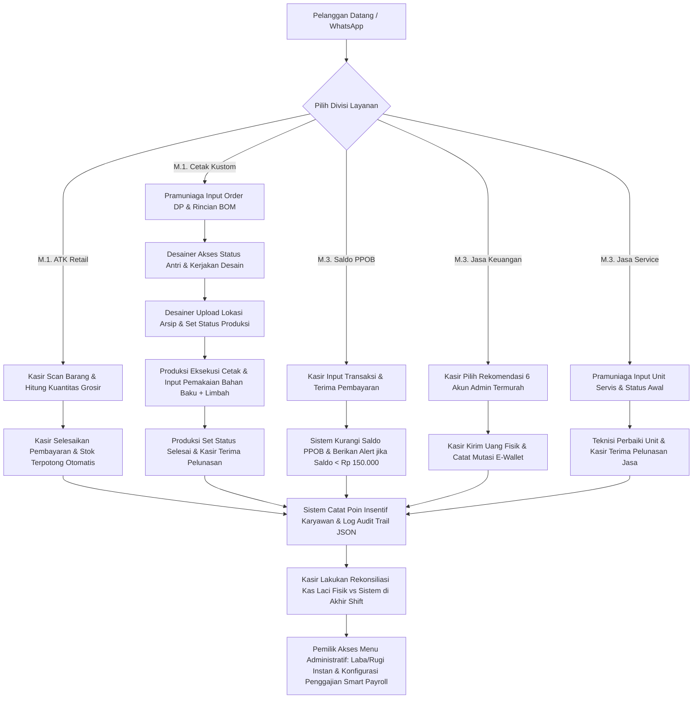

# Business Requirements Document (BRD) — AbuCom

## Riwayat Perubahan Dokumen

| Versi | Tanggal    | Perubahan | Oleh |
|---|---|---|---|
| 1.0   | 2026-05-23 | Pembuatan awal dokumen berdasarkan analisis komprehensif seluruh dokumen fase Planning (Project Charter v1.1, Feasibility Study v1.1, Stakeholder Register v1.1, Tech Stack Decision v1.1, Innovation Proposal v1.1) dan narasi asli pemilik usaha. | Senior Business Analyst & Requirements Engineering Specialist |
| 1.1   | 2026-05-23 | Revisi menyeluruh v1.1 berdasarkan analisis kelayakan & inovasi. Menambahkan modul supplier & utang usaha (BR-F-40), melengkapi BEP, mengeliminasi placeholder privat ke format instruksi pemilik, menyelaraskan pain points, dan memperbaiki matriks traceability. | Senior Business Analyst & Requirements Engineering Specialist |

---

## 1. Informasi Dokumen

### 1.1. Tujuan Dokumen
Dokumen *Business Requirements Document* (BRD) ini disusun untuk mengidentifikasi, menganalisis, dan mendokumentasikan secara formal seluruh kebutuhan bisnis, aturan operasional, serta batasan strategis yang wajib dipenuhi dalam pembangunan **AbuCom — Sistem Manajemen Terpadu Usaha Percetakan**. Dokumen ini berfokus pada perspektif bisnis ("*Apa yang dibutuhkan oleh bisnis?*") guna memastikan keselarasan antara solusi perangkat lunak yang dikembangkan dengan visi operasional pemilik usaha.

### 1.2. Cakupan Dokumen
Dokumen ini mencakup analisis mendalam terhadap lima divisi bisnis AbuCom (produksi percetakan, retail ATK, layanan digital/PPOB, jasa keuangan agen, dan jasa perbaikan teknis), pemetaan 19 pemangku kepentingan, hak akses berbasis peran (RBAC), aturan bisnis numerik eksplisit, 43 kebutuhan fungsional dan non-fungsional, manajemen risiko operasional, kriteria penerimaan bisnis, serta glosarium istilah domain percetakan. Dokumen ini membatasi diri pada kebutuhan tingkat tinggi dan logis bisnis, serta sengaja mengabaikan detail implementasi teknis kode program yang menjadi domain dari dokumen spesifikasi berikutnya.

### 1.3. Posisi Dokumen dalam Siklus SDLC
Dalam siklus pengembangan perangkat lunak (*Software Development Life Cycle* - SDLC) AbuCom, dokumen ini merupakan output pertama pada **Fase 02 Analysis (Analisis Kebutuhan)**. Dokumen ini menjadi jembatan formal pertama yang mentransisikan visi konseptual dari Fase 01 Planning (Perencanaan) menuju fase pendefinisan teknis berikutnya.

### 1.4. Hubungan dengan Dokumen SDLC Lainnya
BRD ini diderivasi langsung dari data tervalidasi pada *Project Charter v1.1*, *Feasibility Study v1.1*, *Stakeholder Register v1.1*, *Tech Stack Decision v1.1*, dan *Innovation Proposal v1.1*. Dokumen ini selanjutnya akan berfungsi sebagai **input primer tunggal** bagi tim pengembang untuk menyusun dokumen *Software Requirements Specification* (SRS - Fase Analysis akhir), *System Design Document* (SDD - Fase Design), serta dokumen skenario pengujian *Test Plan & Test Cases* (Fase Testing).

### 1.5. Audiens Target
Target pembaca formal dari dokumen ini meliputi:
1. **Pemilik Usaha AbuCom**: Selaku inisiator, sponsor utama, dan *Junior Programmer* yang akan melakukan integrasi sistem.
2. **Tim Pengembang AI (Gemini & Claude)**: Selaku asisten arsitek, pembuat kode fungsional, dan auditor keamanan.
3. **Calon Karyawan Staf (Terutama Kepala Percetakan)**: Sebagai panduan pemahaman proses bisnis digital baru.

---

## 2. Ringkasan Eksekutif (Executive Summary)

Usaha UMKM AbuCom mengoperasikan lima unit bisnis yang sangat kompleks di satu lokasi fisik secara simulatan. Saat ini, pemilik usaha mengelola seluruh kegiatan tersebut sendirian (*single-fighter*) secara manual dengan mengandalkan berkas Microsoft Excel yang berserakan dan tidak tersinkronisasi. Kompleksitas ini menyebabkan pemilik usaha mengalami stres berat, keletihan mental (*burnout*), serta memicu tingginya risiko operasional seperti pesanan pelanggan yang terlewat, kebocoran kas laci kasir, selisih persediaan gudang yang tidak terukur (limbah produksi), dan denda setoran bank akibat keterlambatan pelacakan jatuh tempo.

Untuk mengatasi isu kritis ini, diputuskan untuk melakukan rekrutmen **7 staf karyawan baru** yang didukung oleh penerapan aplikasi kustom internal terpadu berbasis *Command Line Interface* (CLI) Python dan database MySQL lokal. Studi Kelayakan (*Feasibility Study v1.1*) menetapkan keputusan investasi proyek ini berada pada status **GO WITH CONDITIONS (GO DENGAN CATATAN)**. Proyek ini sangat layak secara ekonomi dengan proyeksi tingkat pengembalian investasi (ROI) sebesar **26,0%** pada tahun pertama, nilai bersih saat ini (NPV) yang sangat positif sebesar **Rp 47.471.075**, dan periode pengembalian modal (*Payback Period*) yang cepat yaitu **9,5 bulan** berdasarkan total investasi (CAPEX) sebesar **Rp 40.000.000**. Berdasarkan analisis kelayakan ekonomi, Titik Impas (*Break-Even Point* - BEP) investasi CAPEX dicapai pada **bulan ke-9,5** operasional dengan akumulasi **800 transaksi** percetakan kustom, sedangkan BEP OPEX bulanan sebesar **Rp 500.000** dapat ditutupi dengan minimal **10 transaksi** kustom per bulan.

Dokumen BRD ini secara formal merinci seluruh kebutuhan bisnis terstruktur yang mencakup otomatisasi persediaan menggunakan skema *Bill of Materials* (BOM) presisi desimal, pembukuan laba rugi instan, pelacakan antrian (*job tracking*) tanpa pesanan terlewat (*zero-missed orders*), sistem penggajian cerdas pelindung kas harian, serta pengamanan privasi data (kepatuhan UU PDP No. 27/2022) melalui enkripsi bcrypt, token otentikasi JWT, sistem peran RBAC, dan Audit Trail terstruktur JSON guna mengeliminasi celah fraud internal.

---

## 3. Profil Bisnis dan Konteks Operasional

### 3.1. Deskripsi Usaha
UMKM AbuCom adalah sebuah unit usaha mikro, kecil, dan menengah (UMKM) mandiri yang menyediakan jasa pelayanan percetakan terpadu, perdagangan eceran alat tulis kantor, serta berbagai layanan transaksi digital dan perbaikan perangkat teknologi. Usaha ini beroperasi secara fisik di toko lokal terdedikasi dengan alamat operasional yang terdaftar sebagai:

> ⚠️ PERLU DIISI PEMILIK: [Alamat lengkap toko fisik AbuCom, nomor jalan, kecamatan, kabupaten/kota, dan provinsi tempat usaha beroperasi secara fisik.]

### 3.2. Struktur Organisasi (Saat Ini dan Rencana)
*   **Kondisi Saat Ini**: Dijalankan murni secara tunggal oleh **Pemilik Usaha AbuCom** yang memegang seluruh peran operasional, administratif, keuangan, logistik, hingga pelayanan WhatsApp.
*   **Kondisi Rencana (Fase Go-Live)**: Struktur organisasi taktis baru dibentuk dengan mempekerjakan **7 staf karyawan** yang menduduki posisi sebagai berikut:
    1.  **1 Kepala Percetakan**: Bertanggung jawab atas koordinasi toko, persediaan, pengawasan antrian, dan laporan harian.
    2.  **1 Staf Pramuniaga**: Melayani pelanggan di konter garda depan, mencatat kontak CRM, dan input antrian transaksi.
    3.  **1 Staf Kasir**: Menangani penerimaan kas, input DP/pelunasan, retur/batal, dan rekonsiliasi uang fisik laci.
    4.  **1 Staf Desainer**: Memproses desain pesanan kustom percetakan dan mencatat direktori arsip file desain.
    5.  **1 Staf Produksi Cetak**: Melakukan pencetakan fisik, *finishing*, menginput bahan baku riil, dan mencatat limbah produksi.
    6.  **1 Staf Fotocopy & Print**: Melayani transaksi cepat retail fotokopi/print dokumen, serta membantu divisi cetak.
    7.  **1 Staf Gudang**: Mengelola stok barang masuk/keluar, pencatatan supplier, utang tempo, dan Stock Opname fisik.

### 3.3. Kategori Produk dan Layanan (5 Divisi)
AbuCom membagi operasional bisnisnya ke dalam lima kategori divisi utama:
1.  **Divisi Produk Percetakan (Produksi Sendiri)**: Pembuatan stempel flash kustom, cetak foto berbagai ukuran, pembuatan buku yasin kustom, pencetakan undangan pernikahan, cetak baliho/banner, fotokopi dokumen, jasa pengetikan, print data, cetak stiker, hingga pembuatan pin nama dada akrilik/resin.
2.  **Divisi Alat Tulis Kantor / ATK (Retail)**: Perdagangan eceran barang fisik berupa kertas HVS, kertas foto, kertas undangan kosong, tinta printer, pulpen, hekter, map snelhechter jepit logam, map biasa plastik/kertas, map warna, lakban, selotip, pensil, dan perlengkapan kantor.
3.  **Divisi Layanan Digital & PPOB**: Penjualan pulsa handphone prabayar, paket data internet, pulsa listrik prabayar (token PLN), dan pembayaran tagihan bulanan (listrik PLN pascabayar).
4.  **Divisi Jasa Keuangan**: Layanan transfer uang tunai antar bank di Indonesia dan jasa penarikan tunai saldo e-wallet/rekening.
5.  **Divisi Jasa Teknis**: Layanan jasa perbaikan (service) printer fisik, serta instalasi ulang sistem operasi Windows/Linux pada laptop dan komputer pelanggan.

### 3.4. Budaya Kerja
Budaya operasional harian yang diterapkan di toko AbuCom bersifat **Kerjasama Tim Lintas Fungsi (Cross-Functional)** yang berlandaskan asas gotong royong. Setiap karyawan, meskipun memiliki peran utama yang spesifik, wajib saling membantu dan mengisi celah pekerjaan di divisi lain saat terjadi antrian pelanggan yang padat atau kendala produksi fisik, guna menjamin kelancaran pelayanan keseluruhan.

### 3.5. Sumber Pendanaan Usaha
Operasional dan investasi pengembangan AbuCom didanai dari dua sumber modal terpisah:
1.  **Pinjaman Tanpa Bunga**: Modal pinjaman yang bersumber dari sahabat, teman, kerabat dekat, keluarga, dan orang tua pemilik usaha. Pendanaan ini memiliki karakteristik sosial (*social contract*): bebas dari bunga finansial, namun pemberi dana memegang hak untuk meminta pengembalian dana titipan mereka kapan saja secara mendadak untuk kebutuhan darurat.
2.  **Pinjaman Berbunga**: Modal kredit usaha komersial yang bersumber dari lembaga perbankan resmi di Indonesia, yaitu **Bank Rakyat Indonesia (Bank BRI)** dan **Bank Mandiri**, yang dibebani kewajiban setoran cicilan bulanan tetap dan tenor yang terkunci secara hukum.

---

## 4. Analisis Proses Bisnis

### 4.1. Proses Bisnis Saat Ini (As-Is)

#### 4.1.1. Alur Kerja Divisi Percetakan
1.  Pemilik usaha melayani pelanggan di konter atau via WhatsApp.
2.  Pemilik mendesain pesanan kustom di komputer, lalu meminta persetujuan pelanggan.
3.  Pemilik mengambil bahan baku fisik (karet stempel, gagang, dll.) di gudang belakang toko.
4.  Pemilik melakukan proses cetak fisik, pemotongan, finishing laminasi, pengemasan, dan menyerahkannya ke pelanggan.
5.  Pemilik mencatat transaksi secara manual ke dalam lembar kerja Microsoft Excel.
6.  Pemilik memperkirakan pengurangan stok bahan baku di gudang secara visual, lalu mengurangi angka stok di Excel secara manual.
7.  Pemilik merancang daftar belanja stok yang habis, pergi belanja fisik ke supplier, mengangkut bahan, dan mengetik kembali data barang masuk ke berkas Excel stok.

#### 4.1.2. Alur Kerja Divisi Penjualan ATK
1.  Pembeli memilih barang retail di toko.
2.  Pemilik mencari daftar harga barang retail di lembar Excel yang berserakan, menjumlahkan total belanja, menerima uang, dan memberikan kembalian fisik.
3.  Pemilik secara manual membuka file Excel stok ATK dan mengurangi sisa kuantitas barang satu per satu.
4.  Pemilik melakukan opname fisik gudang secara visual dan acak untuk menyusun daftar belanja ATK baru ke supplier.

#### 4.1.3. Alur Kerja Divisi Layanan Pulsa dan PPOB
1.  Pelanggan menyebutkan nomor HP dan nominal pulsa/token/tagihan bulanan yang ingin dibayar.
2.  Pemilik membuka salah satu dari 2 akun saldo virtual terpisah di HP (akun pulsa prabayar atau akun token/tagihan bulanan).
3.  Pemilik mengirimkan saldo virtual ke nomor pelanggan secara fisik.
4.  Pemilik menerima uang pembayaran dari pelanggan, lalu mencatat manual data nomor, nominal, dan keuntungan transaksi ke berkas Excel rekap bulanan.
5.  Pemilik memeriksa sisa saldo virtual di HP secara manual. Jika saldo mendekati batas kritis **Rp 150.000**, pemilik mentransfer dana pengisian deposit minimal **Rp 500.000** ke penyedia saldo.

#### 4.1.4. Alur Kerja Divisi Jasa Keuangan
1.  Pelanggan datang ingin melakukan transfer antar bank atau menarik tunai uang elektronik.
2.  Pemilik membuka 6 akun uang elektronik di perangkatnya (Agen Bank Mandiri, Dana, Gopay, LinkAja, ShopeePay, OVO).
3.  Pemilik membandingkan manual biaya admin di antara akun-akun tersebut untuk merekomendasikan biaya termurah bagi pelanggan.
4.  Pemilik memproses transfer atau menerima tarik tunai secara fisik di perangkat e-wallet Agen bank.
5.  Pemilik menerima uang tunai dari pelanggan, memotong komisi jasa, dan mencatat mutasi keluar-masuk saldo secara manual di file Excel keuangan.

#### 4.1.5. Alur Kerja Divisi Jasa Teknis
1.  Pemilik menerima unit printer rusak atau laptop pelanggan.
2.  Pemilik membongkar/memperbaiki unit secara fisik, menginstal ulang OS di toko, dan melakukan pengetesan fungsional.
3.  Pemilik menyerahkan kembali unit ke pelanggan, menerima pembayaran tunai, dan mencatat rincian jasa ke file Excel harian.

#### 4.1.6. Alur Kerja Administrasi Pinjaman, SDM, dan Pengeluaran
1.  **Pinjaman Tanpa Bunga**: Pemilik mencatat nama kerabat pemberi pinjaman dan saldo terutang di file Excel terpisah. Perubahan saldo akibat penarikan mendadak dicatat manual secara asinkron.
2.  **Pinjaman Bank**: Pemilik melacak cicilan bulanan Bank Mandiri & Bank BRI di kalender fisik/Excel untuk mengingat jadwal jatuh tempo pembayaran bulanan.
3.  **Administrasi Pengeluaran**: Pemilik mencatat pengeluaran bulanan (listrik, air, internet toko), depresiasi mesin cetak, tabungan pengadaan mesin baru, dan rencana kasbon karyawan secara manual.

---

### 4.2. Identifikasi Titik Kelemahan (Pain Points)
Berdasarkan investigasi terhadap alur kerja As-Is di atas, diidentifikasi titik kelemahan bisnis sebagai berikut:
*   **Burnout Ekstrim Pemilik Usaha**: Pemilik bertindak sebagai *single point of failure* yang memicu kelelahan fisik/mental akut dan menurunkan produktivitas strategis.
*   **Kebocoran Transaksi akibat Pesanan Terlewat (WhatsApp & Fisik)**: Pesanan masuk lewat konter atau pesan WhatsApp seringkali lupa dikerjakan akibat tidak adanya pelacakan status pekerjaan terpadu.
*   **Ketidakakuratan HPP & Nilai Persediaan**: Formula HPP tidak akurat karena perhitungan bahan baku stempel/baliho kustom berbasis ukuran panjang x lebar desimal tidak didukung oleh Excel standar, sehingga sisa stok bahan di gudang selalu mengalami selisih terhadap pencatatan sistem.
*   **Kebocoran Stok Limbah Produksi**: Bahan baku yang rusak atau salah cetak (limbah) dibuang begitu saja tanpa pencatatan kuantitas, menyembunyikan inefisiensi biaya operasional.
*   **Risiko Kebocoran Kas & Fraud**: Ketiadaan pembatasan hak akses keuangan sensitif, ketiadaan rekap aktivitas modifikasi data (*Audit Trail*), dan tidak adanya pencocokan uang kasir laci kas fisik (*Cash Reconciliation*) memicu celah fraud yang tinggi saat karyawan baru masuk.
*   **Kerentanan Pinjaman Tanpa Bunga**: Penarikan modal mendadak dari keluarga dapat melumpuhkan arus kas operasional toko karena dana darurat tidak terproteksi secara sistematis.

---

### 4.3. Proses Bisnis yang Diharapkan (To-Be)
Dengan penerapan aplikasi kustom CLI Python dan database MySQL terpadu, alur kerja operasional bertransformasi menjadi:

1.  **Pelayanan Terintegrasi**: Staf Pramuniaga melayani pelanggan langsung di konter dengan menginput transaksi ke CLI kasir. Skema harga retail, grosir, atau mitra terhitung otomatis berdasarkan kuantitas barang.
2.  **Pembayaran Bertahap & Job Tracking**: Transaksi cetak kustom diinput dengan status pembayaran DP. Pesanan masuk antrian status `Antri` di modul *Job Tracking*.
3.  **Pelacakan Desain & Produksi**: Staf Desainer memfilter antrian status `Proses Desain`, mengerjakan file, mencatatkan path arsip direktori penyimpanan, lalu mengubah status ke `Produksi`.
4.  **Presisi Inventaris (BOM) & Limbah**: Staf Produksi mengambil bahan baku, mencetak pesanan, menginput kuantitas pemakaian bahan baku riil desimal presisi (panjang x lebar / volume), serta menginput data bahan yang rusak (limbah) ke aplikasi. Stok gudang terpotong otomatis dan biaya HPP presisi tersimpan.
5.  **Poin Insentif & Penggajian**: Sistem mencatat kontribusi poin insentif staf per transaksi berdasarkan 4-tier tingkat kesulitan. Pada akhir bulan, slip penggajian cerdas dihitung otomatis dengan mengevaluasi kondisi target laba bulanan usaha, terpotong utang kasbon aktif staf secara otomatis.
6.  **Pemisahan Otorisasi & Audit Trail**: Menu pinjaman bank/keluarga, tabungan, pengeluaran besar, dan laporan profitabilitas dikunci rapat (RBAC) hanya untuk level login Pemilik. Setiap perubahan data kas/stok dicatat kronologis di log Audit Trail JSON.
7.  **Rekonsiliasi Akhir Shift**: Staf Kasir wajib menginput jumlah uang tunai fisik di laci kasir untuk mencocokkannya dengan kas sistem sebelum melakukan serah terima shift kasir (*shift handover log*).

---

## 5. Pemangku Kepentingan dan Kebutuhan Bisnis per Aktor

### 5.1. Aktor Internal Pengguna Sistem
1.  **Pemilik Usaha AbuCom (`Role: pemilik`)**: Sponsor, Junior PM, administrator teknis, dan pengguna administratif penuh.
2.  **Calon Staf Kepala Percetakan (`Role: kepala_percetakan`)**: Pengawas harian toko, stok gudang, dan absensi karyawan.
3.  **Calon Staf Pramuniaga (`Role: pramuniaga`)**: Melayani konter depan, input database CRM pelanggan, pencatatan transaksi awal.
4.  **Calon Staf Kasir (`Role: kasir`)**: Menangani laci uang, input DP/pelunasan, retur, batal, dan rekonsiliasi kas harian.
5.  **Calon Staf Desainer (`Role: desainer`)**: Mengelola antrian desain, memproses mockup cetak kustom, mencatat path arsip desain.
6.  **Calon Staf Produksi Cetak (`Role: produksi_cetak`)**: Eksekutor cetak fisik, input sisa stok bahan desimal, pencatatan limbah.
7.  **Calon Staf Fotocopy & Print (`Role: fotocopy_print`)**: Mencatat transaksi ritel cepat fotokopi/print lembaran.
8.  **Calon Staf Gudang (`Role: gudang`)**: Mengelola barang masuk/keluar, stock opname fisik, pencatatan supplier & utang.

### 5.2. Kebutuhan dan Ekspektasi per Aktor
*   **Pemilik Usaha (STK-001)**:
    *   *Kebutuhan*: Otomatisasi 100% Laporan Keuangan, pembukuan laba rugi instan divisi, kalkulasi HPP otomatis berbasis BOM desimal, monitoring kasbon, Smart Payroll penggajian cerdas, dan keamanan data pinjaman pribadi.
    *   *Ekspektasi*: Meniadaan Excel manual, membebaskan diri dari burnout, mendelegasikan operasional ke staf baru dengan jaminan sistem 100% bebas dari kebocoran/kecurangan keuangan.
*   **Staf Kasir, Pramuniaga, Gudang, & Teknisi (STK-002 s.d STK-008)**:
    *   *Kebutuhan*: Antarmuka CLI yang intuitif dengan panduan input yang jelas, navigasi keyboard terstruktur, notifikasi alert stok kritis, dan menu pencatatan serah terima shift yang cepat.
    *   *Ekspektasi*: Kemudahan mencatat transaksi penjualan tanpa menghafal lembar Excel manual harga, keadilan insentif via sistem poin otomatis, transparansi slip gaji & sisa utang kasbon.

### 5.3. Hak Akses dan Pembatasan Menu per Aktor (RBAC)
Untuk melindungi data sensitif pemilik dan kas usaha, hak akses terminal CLI dibatasi secara ketat berdasarkan aturan peran (*Role-Based Access Control*):

| Peran Pengguna (Role) | Transaksi & Kasir | Antrian & Desain | Gudang & Opname | Absensi Staf | Keuangan & Laba/Rugi | Pinjaman & Aset | Payroll Gaji | Audit Trail |
|---|:---:|:---:|:---:|:---:|:---:|:---:|:---:|:---:|
| **pemilik** | Akses Penuh | Akses Penuh | Akses Penuh | Akses Penuh | Akses Penuh | Akses Penuh | Akses Penuh | Akses Penuh |
| **kepala_percetakan**| Lihat-Saja | Akses Penuh | Akses Penuh | Akses Penuh | Ditolak | Ditolak | Ditolak | Ditolak |
| **pramuniaga** | Hanya Input | Akses Penuh | Ditolak | Hanya Input | Ditolak | Ditolak | Ditolak | Ditolak |
| **kasir** | Akses Penuh | Lihat-Saja | Ditolak | Hanya Input | Ditolak | Ditolak | Ditolak | Ditolak |
| **desainer** | Ditolak | Akses Penuh | Ditolak | Hanya Input | Ditolak | Ditolak | Ditolak | Ditolak |
| **produksi_cetak** | Ditolak | Akses Penuh | Lihat-Saja | Hanya Input | Ditolak | Ditolak | Ditolak | Ditolak |
| **fotocopy_print** | Hanya Ritel | Ditolak | Ditolak | Hanya Input | Ditolak | Ditolak | Ditolak | Ditolak |
| **gudang** | Ditolak | Ditolak | Akses Penuh | Hanya Input | Ditolak | Ditolak | Ditolak | Ditolak |

### 5.4. Aktor Eksternal
1.  **Pelanggan AbuCom (STK-015)**: Individu/mitra bisnis pemesan jasa percetakan, retail ATK, PPOB, transfer uang, dan service.
2.  **Vendor & Supplier Bahan Baku / ATK (STK-016)**: Pemasok komoditas retail dan bahan mentah percetakan.
3.  **Bank BRI & Bank Mandiri (STK-017 & STK-018)**: Institusi keuangan kreditur modal komersial usaha.
4.  **Kerabat & Keluarga (STK-019)**: Sahabat, teman, orang tua pemberi pinjaman modal kekeluargaan tanpa bunga.

### 5.5. Kebutuhan dan Ekspektasi Aktor Eksternal
*   **Pelanggan**: Pelayanan cepat di konter, estimasi waktu penyelesaian cetak yang tepat, kerahasiaan nomor WhatsApp dan data pribadi terjaga aman (Kepatuhan UU PDP), serta kemudahan cetak ulang (*re-order*) cepat.
*   **Supplier**: Pembayaran utang pengadaan barang tepat waktu sesuai tenggat waktu tempo.
*   **Bank Mandiri & BRI**: Kewajiban setoran bulanan dan bunga dibayar penuh sebelum tanggal jatuh tempo.
*   **Kerabat & Keluarga**: Transparansi mutlak atas sisa saldo pinjaman modal, serta kesiapan kas pemilik mengembalikan dana titipan mereka secara fleksibel saat ditarik mendadak.

---

## 6. Tujuan Bisnis dan Manfaat Terukur

### 6.1. Tujuan Umum
Membangun sistem aplikasi manajemen internal AbuCom berbasis CLI Python & MySQL yang modular, aman, dan berkinerja tinggi untuk mengotomatisasi seluruh alur kerja operasional 5 divisi usaha, meniadakan ketergantungan pada Excel manual yang tidak terintegrasi, serta menyajikan laporan persediaan stok dan laba rugi instan demi mendukung kebebasan mental pemilik dari keletihan harian (*burnout*).

### 6.2. Tujuan Spesifik (SMART Goals)
*   **S.1 (Otomatisasi Persediaan & BOM)**: Mengurangi selisih kuantitas stok barang fisik di gudang terhadap catatan sistem hingga di bawah **1,0%** melalui fitur potong stok otomatis berbasis skema *Bill of Materials* (BOM) dengan input dimensi desimal panjang x lebar atau volume desimal presisi.
*   **S.2 (Keuangan Instan & Laba/Rugi)**: Menyajikan laporan keuangan laba/rugi, pengeluaran rutin harian, dan tabungan aset secara instan (waktu pemrosesan data **< 5 detik**) per divisi operasional usaha.
*   **S.3 (Zero-Missed Orders)**: Mencapai tingkat kekeliruan pesanan pelanggan yang terlewat hingga **0%** menggunakan visualisasi dashboard antrian pekerjaan digital (*job tracking*) dengan 5 tahapan transisi status.
*   **S.4 (Smart Payroll & SDM)**: Memfasilitasi kesiapan operasional rekrutmen 7 staf baru melalui modul absensi terintegrasi penggajian cerdas bulanan (gaji bulanan tetap vs persentase keuntungan laba usaha) dan sistem pemotongan utang kasbon terotomatisasi.
*   **S.5 (Kesiapan Multi-Cabang)**: Menjamin rancangan struktur basis data MySQL memiliki kesiapan **100% Multi-Branch Ready** dengan kolom ID cabang di setiap tabel utama untuk mendukung ekspansi cabang baru di masa depan tanpa merombak kode sistem.
*   **S.6 (Break-Even Point)**: Mencapai titik impas investasi CAPEX **Rp 40.000.000** pada bulan ke-**9,5** masa operasional Go-Live dengan memproses akumulasi **800 transaksi** percetakan kustom.

### 6.3. Manfaat Bisnis Kuantitatif
*   **Reduksi Waktu Pembukuan**: Memotong waktu pengerjaan rekap transaksi harian dan penyusunan laporan keuangan bulanan dari rata-rata **2-3 jam per hari** menjadi **instan (< 5 detik)** secara otomatis setelah penutupan rekonsiliasi kasir selesai.
*   **Efisiensi Limbah Produksi**: Menurunkan kerugian finansial akibat persediaan bahan baku percetakan kustom yang rusak, cacat, atau salah cetak sebesar **15%** per tahun melalui pencatatan log *Waste Management* terstruktur.
*   **Penyelamatan Transaksi Terlewat**: Mengeliminasi insiden pesanan WhatsApp atau pesanan fisik yang lupa dikerjakan hingga **0% (Zero-Missed Orders)**, menyelamatkan potensi hilangnya transaksi senilai rata-rata **Rp 2.000.000** per bulan.
*   **Efisiensi OPEX Biaya Admin**: Meningkatkan margin laba bersih dari divisi jasa keuangan transfer uang hingga **12%** menggunakan modul visual rekomendasi akun dengan biaya admin termurah dari 6 e-wallet digital.

### 6.4. Manfaat Bisnis Kualitatif
*   **Mitigasi Burnout Pemilik**: Memulihkan kesehatan mental pemilik usaha dengan mendelegasikan 100% aktivitas transaksi kas, desain, produksi cetak, dan gudang kepada 7 staf operasional secara aman.
*   **Kredibilitas Layanan Meningkat**: Pelayanan pelanggan menjadi jauh lebih profesional, responsif, tepat waktu, dan terjaga kerahasiaan datanya sesuai UU PDP No. 27/2022.
*   **Pencegahan Fraud Internal**: Memberikan proteksi penuh terhadap kas laci kasir, persediaan gudang, dan manipulasi data keuangan harian dari kecurangan staf baru berkat log Audit Trail yang ketat, RBAC level pemilik, enkripsi bcrypt, session JWT, dan rekonsiliasi uang fisik harian.
*   **Kesiapan Duplikasi Ekspansi**: Menyediakan standardisasi sistem operasional digital terstruktur yang siap diduplikasi secara instan untuk cabang baru.

---

## 7. Kebutuhan Bisnis Fungsional

Kebutuhan bisnis fungsional dirinci secara logis berdasarkan pengelompokan 10 Modul Utama AbuCom.

### 7.1. Modul Manajemen Transaksi & Kebijakan Harga (M.1)

#### **BR-F-01: Pencatatan Transaksi Penjualan Multi-Divisi**
*   **Deskripsi**: Sistem harus mampu mencatat transaksi penjualan dari kelima divisi usaha (produk percetakan kustom, retail ATK, pulsa/token PPOB, transfer/tarik tunai, jasa service) secara terpisah namun terintegrasi dalam satu database.
*   **Aktor Terkait**: `pramuniaga`, `kasir`, `fotocopy_print`
*   **Aturan Bisnis**: Pencatatan transaksi wajib menyertakan timestamp, ID User kasir aktif, ID Cabang default, detail barang/jasa, kuantitas, subtotal, dan metode pembayaran.
*   **Kriteria Penerimaan**: Staf kasir dapat memasukkan dan menyimpan transaksi multi-divisi dalam satu layar struk transaksi tunggal di CLI dengan waktu penyimpanan database **< 1 detik**.
*   **Prioritas**: High
*   **Sumber Data**: Project Charter v1.1 Bagian 8.1 [F-1.1], Narasi Asli Harapan Poin 1.

#### **BR-F-02: Multi-Skema Harga Dinamis (Retail, Grosir, Mitra)**
*   **Deskripsi**: Sistem harus mengelola skema harga barang yang bervariasi: Harga Retail (satuan), Harga Grosir (kuantitas minimum), dan Harga Spesial Mitra secara otomatis di terminal kasir.
*   **Aktor Terkait**: `pramuniaga`, `kasir`
*   **Aturan Bisnis**: Parameter kuantitas grosir dan diskon kemitraan ditarik secara dinamis dari database. Perhitungan subtotal transaksi harus langsung menyesuaikan tipe harga yang dipilih.
*   **Kriteria Penerimaan**: Ketika kasir mengubah tipe pelanggan ke "Mitra" atau kuantitas barang ATK melebihi batas minimum grosir, sistem secara otomatis mengubah tarif per unit barang dan menghitung total harga baru secara akurat.
*   **Prioritas**: High
*   **Sumber Data**: Project Charter v1.1 Bagian 8.1 [F-1.3], Innovation Proposal v1.1 [INV-INT-22].

#### **BR-F-03: Pembayaran Bertahap (Down Payment & Pelunasan)**
*   **Deskripsi**: Sistem harus mendukung skema pembayaran pesanan bertahap: pembayaran Uang Muka (DP) di awal transaksi dan perekaman pelunasan di akhir saat barang diserahkan ke pelanggan.
*   **Aktor Terkait**: `kasir`
*   **Aturan Bisnis**: Transaksi bertahap memiliki status pembayaran `BELUM LUNAS` saat di-input DP. Sisa tagihan (Total - DP) harus dicatat secara eksplisit dan kasir laci kas bertambah sesuai nominal DP yang diserahkan.
*   **Kriteria Penerimaan**: Kasir dapat mencari ID pesanan belum lunas, merekam nominal pelunasan kas, mencetak struk tanda lunas, dan mengubah status pembayaran pesanan menjadi `LUNAS`.
*   **Prioritas**: High
*   **Sumber Data**: Project Charter v1.1 Bagian 8.1 [F-1.2], Innovation Proposal v1.1 [INV-INT-23].

#### **BR-F-04: Alur Pembatalan Transaksi & Retur Tersinkronisasi**
*   **Deskripsi**: Sistem harus memfasilitasi alur pembatalan transaksi (pengembalian DP) dan retur barang retail yang rusak/salah cetak dengan melakukan pengembalian stok gudang & penyesuaian kas laci yang sinkron secara otomatis.
*   **Aktor Terkait**: `kasir`
*   **Aturan Bisnis**: Pembatalan pesanan mengembalikan DP 100% dan memotong saldo kas laci kasir aktif. Retur barang ATK mengembalikan kuantitas barang ke database stok dan mencatat pengeluaran kas retur di database keuangan.
*   **Kriteria Penerimaan**: Kasir dapat memproses retur barang, kuantitas stok barang di tabel persediaan bertambah otomatis, dan kas laci terpotong secara transaksional aman (ACID compliance di MySQL).
*   **Prioritas**: High
*   **Sumber Data**: Project Charter v1.1 Bagian 8.1 [F-1.4], Innovation Proposal v1.1 [INV-INT-24].

#### **BR-F-05: Pelacakan Margin Keuntungan per Produk**
*   **Deskripsi**: Sistem harus menyajikan perhitungan metrik persentase margin keuntungan kotor untuk setiap item barang retail dan jasa cetak kustom secara instan di terminal pemilik.
*   **Aktor Terkait**: `pemilik`
*   **Aturan Bisnis**: Margin dihitung berdasarkan rumus: `((Harga Jual - HPP BOM) / Harga Jual) * 100`. Nilai HPP ditarik secara dinamis dari komposisi bahan baku barang.
*   **Kriteria Penerimaan**: Pemilik dapat melihat tabel ringkasan barang/jasa di mana kolom "Margin (%)" tampil akurat dan terformat desimal rapi.
*   **Prioritas**: Medium
*   **Sumber Data**: Innovation Proposal v1.1 [INV-NEW-05].

#### **BR-F-06: Template Laporan Cetak Teks Struk Nota (Printer Thermal)**
*   **Deskripsi**: Sistem harus mampu mengekspor data laporan rekapitulasi harian dan struk transaksi harian menjadi format berkas plain text (.txt) dengan ukuran kolom yang disesuaikan untuk dicetak langsung via printer thermal struk 58mm/80mm di kasir.
*   **Aktor Terkait**: `kasir`, `pemilik`
*   **Aturan Bisnis**: Lebar karakter struk dibatasi maksimal 32 karakter (untuk printer 58mm) atau 48 karakter (untuk printer 80mm) secara fungsional.
*   **Kriteria Penerimaan**: Kasir dapat mengekspor rekap struk harian ke file .txt lokal yang siap dikirim langsung ke printer thermal fisik di toko tanpa merusak tata letak teks.
*   **Prioritas**: Medium
*   **Sumber Data**: Innovation Proposal v1.1 [INV-NEW-07].

---

### 7.2. Modul Manajemen Inventaris, BOM & Stock Opname (M.2)

#### **BR-F-07: Sistem HPP Otomatis Berbasis Bill of Materials (BOM) Presisi Desimal**
*   **Deskripsi**: Sistem harus mampu menghitung Harga Pokok Penjualan (HPP) produk percetakan kustom secara otomatis berdasarkan komposisi pemakaian bahan baku multi-bahan dengan presisi desimal angka (panjang x lebar lembaran atau volume desimal cairan).
*   **Aktor Terkait**: `produksi_cetak`, `pemilik`
*   **Aturan Bisnis**: Perhitungan wajib menggunakan pustaka `decimal` Python untuk presisi tetap (4 angka di belakang koma). Stok bahan baku (panjang/lebar) di database terpotong otomatis saat status produksi selesai.
*   **Kriteria Penerimaan**: Ketika pesanan stempel flash diproses selesai, sistem menghitung biaya bahan baku (karet stempel, gagang, tinta) secara pecahan desimal, mencatatkan nilai HPP riil transaksi, dan mengurangi stok persediaan bahan di MySQL secara presisi.
*   **Prioritas**: High
*   **Sumber Data**: Project Charter v1.1 Bagian 8.1 [F-2.1] & [F-2.2], Innovation Proposal v1.1 [INV-INT-04].

#### **BR-F-08: Pencatatan Limbah Produksi (Waste Management)**
*   **Deskripsi**: Sistem harus menyediakan formulir input khusus untuk mencatat kuantitas bahan baku yang rusak, cacat, atau salah cetak selama proses produksi cetak, guna menjaga sinkronisasi stok fisik gudang.
*   **Aktor Terkait**: `produksi_cetak`
*   **Aturan Bisnis**: Bahan yang dideklarasikan sebagai limbah (waste) akan dipotong dari stok persediaan dan dicatatkan nominal kerugian biayanya ke dalam database keuangan operasional.
*   **Kriteria Penerimaan**: Staf produksi dapat memilih ID bahan baku, memasukkan ukuran/panjang bahan yang salah cetak, stok terpotong, dan laporan limbah tersimpan di log khusus.
*   **Prioritas**: High
*   **Sumber Data**: Project Charter v1.1 Bagian 4.1.1 [M.2], Innovation Proposal v1.1 [INV-INT-05].

#### **BR-F-09: Manajemen Satuan & Atribut Barang (Unit of Measure)**
*   **Deskripsi**: Sistem harus mendukung pengelolaan data persediaan dengan berbagai jenis satuan ukur (Rim, Lembar, Pcs, Mililiter, Gram, Dimensi) dan konversi dinamis di database.
*   **Aktor Terkait**: `gudang`, `produksi_cetak`
*   **Aturan Bisnis**: Angka sisa stok persediaan desimal presisi wajib didukung penuh untuk bahan baku eceran di gudang percetakan.
*   **Kriteria Penerimaan**: Staf gudang dapat mendaftarkan bahan baku dengan satuan UoM pecahan desimal (seperti sisa kertas foto 0,75 pack) dan sistem menyimpan nilai kuantitas tersebut dengan valid.
*   **Prioritas**: High
*   **Sumber Data**: Project Charter v1.1 Bagian 4.1.1 [M.2], Innovation Proposal v1.1 [INV-INT-06].

#### **BR-F-10: Sinkronisasi Barang Retail ATK untuk Produksi Internal**
*   **Deskripsi**: Sistem harus memfasilitasi pencatatan pemotongan stok barang retail ATK yang diambil oleh staf untuk kebutuhan operasional internal produksi toko (stok retail terpotong dan tercatat sebagai biaya operasional).
*   **Aktor Terkait**: `gudang`, `produksi_cetak`
*   **Aturan Bisnis**: Transaksi internal ini memicu pemotongan persediaan barang ATK dengan nilai HPP barang retail tersebut didebit sebagai biaya pengeluaran operasional toko.
*   **Kriteria Penerimaan**: Staf gudang dapat menginput pengambilan 1 rim kertas HVS retail untuk operasional fotocopi internal, stok ATK berkurang 1, dan pengeluaran operasional bertambah otomatis.
*   **Prioritas**: Medium
*   **Sumber Data**: Project Charter v1.1 Bagian 8.1 [F-2.3], Innovation Proposal v1.1 [INV-INT-07].

#### **BR-F-11: Rekonsiliasi Stok Berkala (Stock Opname)**
*   **Deskripsi**: Sistem harus menyediakan fitur pembekuan stok sementara, formulir pencatatan kuantitas fisik barang gudang fisik vs sistem, penghitungan selisih stok secara otomatis, dan penyimpanan riwayat stock opname.
*   **Aktor Terkait**: `gudang`, `kepala_percetakan`
*   **Aturan Bisnis**: Penyesuaian stok sistem akibat selisih opname fisik dicatat secara permanen di log audit dengan identifikasi ID User pelaksana yang melakukan otorisasi.
*   **Kriteria Penerimaan**: Staf gudang dapat menjalankan menu Stock Opname, memasukkan angka fisik, sistem mengeluarkan selisih kuantitas, dan memperbarui stok basis data MySQL setelah disetujui Kepala Percetakan.
*   **Prioritas**: High
*   **Sumber Data**: Project Charter v1.1 Bagian 8.1 [F-2.5], Innovation Proposal v1.1 [INV-INT-08].

#### **BR-F-12: Analisis Prediksi Re-Order Stok Bahan Baku**
*   **Deskripsi**: Sistem harus menganalisis data konsumsi bulanan persediaan bahan baku secara otomatis untuk memproyeksikan sisa hari ketersediaan dan memicu alert visual jika stok diprediksi habis dalam 7 hari.
*   **Aktor Terkait**: `gudang`, `kepala_percetakan`
*   **Aturan Bisnis**: Rumus estimasi: `Sisa Hari = Stok Saat Ini / Rata-rata Pemakaian Harian`. Notifikasi tampil di menu utama gudang.
*   **Kriteria Penerimaan**: Saat staf gudang membuka menu persediaan, sistem menampilkan penanda visual berwarna kuning/merah pada daftar barang yang diprediksi habis sebelum 7 hari operasional.
*   **Prioritas**: High
*   **Sumber Data**: Project Charter v1.1 Bagian 8.3 [N-3.3], Innovation Proposal v1.1 [INV-REC-03].

#### **BR-F-13: Fitur Riwayat Harga Beli Supplier (Price Tracking)**
*   **Deskripsi**: Sistem harus merekam riwayat fluktuasi harga beli barang baku atau retail dari setiap supplier fisik setiap kali staf gudang menginput transaksi pengadaan barang masuk.
*   **Aktor Terkait**: `gudang`
*   **Aturan Bisnis**: Data disimpan di tabel riwayat harga untuk menyajikan komparasi harga supplier termurah untuk produk sejenis secara real-time.
*   **Kriteria Penerimaan**: Staf gudang dapat mengakses data barang, melihat daftar harga beli historis dari 3 supplier berbeda, dan memilih supplier paling murah secara cepat.
*   **Prioritas**: Medium
*   **Sumber Data**: Project Charter v1.1 Bagian 8.1 [F-2.4], Innovation Proposal v1.1 [INV-NEW-02].

#### **BR-F-14: Fitur Import Data CSV/Excel Semiautomatis**
*   **Deskripsi**: Sistem harus menyediakan skrip utilitas CLI independen untuk mengimpor data awal persediaan barang, supplier, dan aset dari file CSV ekspor Excel lama pemilik setelah divalidasi kebersihan formatnya.
*   **Aktor Terkait**: `pemilik`, `gudang`
*   **Aturan Bisnis**: Skrip harus menyaring data kosong, format data tidak sesuai, atau baris data duplikat secara fungsional sebelum dimasukkan ke database MySQL.
*   **Kriteria Penerimaan**: Pemilik dapat menjalankan skrip import CSV, data 1000+ barang retail terisi ke tabel persediaan database secara bersih dalam waktu **< 5 detik**.
*   **Prioritas**: High
*   **Sumber Data**: Narasi Asli Poin 7 (Pekerjaan Administratif), Innovation Proposal v1.1 [INV-NEW-08].

#### **BR-F-40: Manajemen Data Supplier & Pencatatan Utang Usaha**
*   **Deskripsi**: Sistem harus mampu mencatat profil data supplier/vendor bahan baku dan ATK serta mencatat riwayat transaksi utang usaha atas pembelian barang tempo.
*   **Aktor Terkait**: `gudang`, `kepala_percetakan`
*   **Aturan Bisnis**: Pembelian barang tempo wajib menyertakan nominal utang, tanggal transaksi, nama supplier, dan tanggal jatuh tempo pembayaran. Pelunasan utang memotong saldo kas keluar.
*   **Kriteria Penerimaan**: Staf gudang dapat merekam utang supplier baru di CLI, daftar utang tampil di laporan, dan status berubah menjadi `LUNAS` saat pembayaran dicatat.
*   **Prioritas**: High
*   **Sumber Data**: Project Charter v1.1 Bagian 8.1 [F-2.4], Narasi Asli Poin 7.

---

### 7.3. Modul Layanan Keuangan Digital, PPOB, Jasa Keuangan & Service (M.3)

#### **BR-F-15: Manajemen Saldo PPOB & Alert Deposit Otomatis**
*   **Deskripsi**: Sistem harus melacak saldo virtual PPOB pada 2 akun terpisah (akun pulsa/data dan akun token/tagihan) secara manual dan memicu alert visual otomatis jika saldo di bawah **Rp 150.000**.
*   **Aktor Terkait**: `kasir`
*   **Aturan Bisnis**: Sistem harus mencatat riwayat top-up saldo virtual dengan nilai deposit minimal yang direkomendasikan sebesar **Rp 500.000**.
*   **Kriteria Penerimaan**: Ketika transaksi pulsa dicatat dan menyebabkan saldo virtual akun PPOB tersisa **Rp 140.000**, terminal CLI kasir langsung memancarkan notifikasi peringatan "SALDO PPOB KRITIS - SEGERA DEPOSIT MINIMAL RP 500.000".
*   **Prioritas**: High
*   **Sumber Data**: Project Charter v1.1 Bagian 8.1 [F-3.1], Innovation Proposal v1.1 [INV-INT-27].

#### **BR-F-16: Optimalisasi Biaya Admin Jasa Keuangan (6 Akun Digital)**
*   **Deskripsi**: Sistem harus merekam transaksi transfer & tarik tunai dengan menyajikan perbandingan biaya admin di antara 6 e-wallet (Mandiri Agen, Dana, Gopay, LinkAja, ShopeePay, OVO) untuk merekomendasikan opsi paling hemat bagi pelanggan secara real-time.
*   **Aktor Terkait**: `kasir`
*   **Aturan Bisnis**: Tabel data biaya admin statis disimpan di database untuk perbandingan. Komisi keuntungan jasa transfer dihitung dari selisih tarif biaya admin toko ke pelanggan dengan biaya admin asli e-wallet.
*   **Kriteria Penerimaan**: Kasir menginput transfer ke OVO nominal **Rp 500.000**, sistem merekomendasikan akun "Dana" karena memiliki tarif admin termurah (misal **Rp 1.000** vs Agen Mandiri **Rp 3.000**), meminimalkan potongan saldo.
*   **Prioritas**: High
*   **Sumber Data**: Project Charter v1.1 Bagian 8.1 [F-3.2], Innovation Proposal v1.1 [INV-INT-28].

#### **BR-F-17: Pencatatan Transaksi Jasa Service & Teknisi Terintegrasi**
*   **Deskripsi**: Sistem harus menyediakan menu pencatatan terstruktur untuk penerimaan perbaikan (service) unit printer/PC pelanggan (Nama Pelanggan, Unit, Kerusakan, Estimasi, Status Perbaikan) terhubung ke kas masuk.
*   **Aktor Terkait**: `pramuniaga`, `kasir`
*   **Aturan Bisnis**: Suku cadang fisik yang diambil dari gudang untuk kebutuhan servis printer harus secara otomatis terpotong dari tabel persediaan retail ATK.
*   **Kriteria Penerimaan**: Staf pramuniaga dapat mendaftarkan printer servis baru, status tercatat `Diterima`, dan kasir merekam pelunasan biaya servis saat status diubah menjadi `Selesai & Diambil`.
*   **Prioritas**: High
*   **Sumber Data**: Project Charter v1.1 Bagian 8.1 [F-3.3], Innovation Proposal v1.1 [INV-INT-29].

---

### 7.4. Modul Manajemen SDM, Penggajian & Poin Karyawan (M.4)

#### **BR-F-18: Manajemen Data Karyawan, Absensi, dan Kasbon**
*   **Deskripsi**: Sistem harus mampu mencatat profil data karyawan (nama, peran, status PKWT/PKWTT), kehadiran/absensi harian shift, dan riwayat penarikan kasbon (pinjaman) karyawan.
*   **Aktor Terkait**: `kepala_percetakan`, `pemilik`
*   **Aturan Bisnis**: Absensi karyawan diinput setiap hari operasional untuk menghitung kehadiran bulanan yang memotong/mempengaruhi penggajian dasar.
*   **Kriteria Penerimaan**: Kepala Percetakan dapat mencatat absensi karyawan harian dan pemilik dapat melihat riwayat absensi bulanan staf di terminal CLI.
*   **Prioritas**: High
*   **Sumber Data**: Project Charter v1.1 Bagian 8.1 [F-4.1], Narasi Asli Poin 6.

#### **BR-F-19: Sistem Penggajian Otomatis Cerdas (Smart Payroll)**
*   **Deskripsi**: Sistem harus menghitung payroll bulanan staf secara otomatis berdasarkan skema cerdas: Gaji Bulanan Tetap jika laba bersih usaha mencapai target **Rp 15.000.000**, atau skema pembagian Gaji Persentase Laba sebesar **25,0%** dari laba bersih bulanan toko secara proporsional kepada staf aktif dengan jaminan minimum **50,0%** UMR daerah jika target tidak tercapai.
*   **Aktor Terkait**: `pemilik`
*   **Aturan Bisnis**: Nilai target laba **Rp 15.000.000** dan persentase **25,0%** bersifat dinamis (diambil dari tabel konfigurasi). UMR daerah operasional diisi secara manual oleh pemilik berdasarkan data berikut:

> ⚠️ PERLU DIISI PEMILIK: [Nominal Rupiah standar UMR (Upah Minimum Regional) daerah setempat yang berlaku untuk dijadikan basis penentuan jaminan gaji minimum 50% UMR daerah.]

*   **Kriteria Penerimaan**: Pemilik memproses payroll bulanan saat laba bersih toko tercatat **Rp 12.000.000** (di bawah target), sistem membagi **Rp 3.000.000** (25% dari 12jt) secara proporsional kepada karyawan aktif dengan jaminan batas bawah **50,0%** UMR.
*   **Prioritas**: High
*   **Sumber Data**: Project Charter v1.1 Bagian 8.1 [F-4.2], Innovation Proposal v1.1 [INV-INT-09].

#### **BR-F-20: Sistem Poin Insentif Karyawan Berbasis Beban Kerja**
*   **Deskripsi**: Sistem harus mencatat akumulasi poin insentif staf per transaksi berdasarkan 4-tier tingkat kesulitan tugas untuk ditambahkan sebagai bonus bulanan pada payroll.
*   **Aktor Terkait**: `kasir`, `pemilik`
*   **Aturan Bisnis**: Nilai komisi rupiah per poin diatur dinamis di database. Karyawan yang terlibat langsung (misal desainer & kasir) mendapatkan pembagian poin sesuai alur transaksional.
    *   1 Poin (Rp 500): Transaksi rutin/mudah (ATK, Pulsa, Jasa Transfer nominal kecil).
    *   3 Poin (Rp 1.500): Jasa dasar (Fotokopi, Print, Pengetikan, Jasa Transfer nominal besar).
    *   5 Poin (Rp 2.500): Produk kustom (Stempel flash, cetak foto, stiker eceran, pin nama dada).
    *   10 Poin (Rp 5.000): Pekerjaan berat/teknis (Cetak baliho, buku yasin, undangan pernikahan, service printer, install laptop).
*   **Kriteria Penerimaan**: Setelah kasir menyelesaikan pembayaran cetak buku yasin (pekerjaan berat), sistem secara otomatis menambahkan 10 poin (setara **Rp 5.000**) ke akun insentif karyawan produksi/desainer terkait.
*   **Prioritas**: High
*   **Sumber Data**: Project Charter v1.1 Bagian 8.1 [F-4.4], Innovation Proposal v1.1 [INV-INT-10].

#### **BR-F-21: Pemotongan Gaji Otomatis atas Kasbon Aktif**
*   **Deskripsi**: Sistem harus memotong total nominal gaji bulanan karyawan secara otomatis pada slip payroll jika karyawan bersangkutan memiliki sisa utang kasbon aktif.
*   **Aktor Terkait**: `pemilik`
*   **Aturan Bisnis**: Batas limit nominal kasbon aktif karyawan dibatasi maksimal **Rp 1.000.000** atau maksimal **30,0%** dari gaji standar bulanan karyawan.
*   **Kriteria Penerimaan**: Karyawan memiliki kasbon aktif **Rp 200.000**, saat pemilik menyetujui slip gaji bulanan karyawan sebesar **Rp 3.000.000**, slip gaji otomatis tercetak bersih senilai **Rp 2.800.000** dengan catatan penutupan kasbon.
*   **Prioritas**: High
*   **Sumber Data**: Project Charter v1.1 Bagian 8.1 [F-4.3], Innovation Proposal v1.1 [INV-INT-11].

---

### 7.5. Modul Sistem Manajemen Antrian & Pelacakan Desain (M.5)

#### **BR-F-22: Sistem Manajemen Antrian Digital (Job Tracking 5 Status)**
*   **Deskripsi**: Sistem harus melacak status pengerjaan pesanan kustom pelanggan secara sekuensial dengan lima status transisi: `Antri` -> `Proses Desain` -> `Produksi` -> `Selesai` -> `Diambil`.
*   **Aktor Terkait**: `pramuniaga`, `desainer`, `produksi_cetak`, `kasir`
*   **Aturan Bisnis**: Perubahan status memicu pemutakhiran record database dan log Audit Trail. Peran pengguna dibatasi hanya diizinkan mengubah status sesuai bidang tugasnya (RBAC).
*   **Kriteria Penerimaan**: Staf desainer dapat melihat antrian khusus status `Proses Desain` di terminal CLI, mengeksekusi pengerjaan, dan mengubah statusnya menjadi `Produksi` yang langsung tampil di layar terminal staf produksi cetak.
*   **Prioritas**: High
*   **Sumber Data**: Project Charter v1.1 Bagian 8.1 [F-5.1], Innovation Proposal v1.1 [INV-INT-12].

#### **BR-F-23: Arsip Desain Pelanggan untuk Cetak Ulang Cepat**
*   **Deskripsi**: Sistem harus merekam metadata path lokasi direktori penyimpanan berkas desain pelanggan (folder penyimpanan server lokal) untuk pencarian instan saat cetak ulang (*re-order*).
*   **Aktor Terkait**: `desainer`, `pramuniaga`
*   **Aturan Bisnis**: Path arsip desain ditautkan langsung dengan ID pelanggan (CRM) dan ID pesanan kustom.
*   **Kriteria Penerimaan**: Ketika pelanggan datang ingin cetak ulang stempel lamanya, pramuniaga mencari nama pelanggan di CLI, sistem menampilkan tautan path direktori desain (seperti `D:/arsip_desain/stk-001/stempel_flash.pdf`) secara instan.
*   **Prioritas**: Medium
*   **Sumber Data**: Project Charter v1.1 Bagian 8.1 [F-5.2], Innovation Proposal v1.1 [INV-INT-13].

#### **BR-F-24: Notifikasi Template WhatsApp Ready**
*   **Deskripsi**: Sistem harus memfasilitasi pembuatan teks template pesan WhatsApp terformat (notifikasi DP diterima, pesanan siap diambil, rincian biaya servis) yang disertai dengan tautan web `https://wa.me/` untuk disalin-tempel manual oleh staf ke WhatsApp Web secara cepat.
*   **Aktor Terkait**: `pramuniaga`, `kasir`
*   **Aturan Bisnis**: Teks template di-generate dinamis di Python dengan menyisipkan nama pelanggan, nominal uang, status pesanan, dan nomor WA tujuan.
*   **Kriteria Penerimaan**: Setelah kasir memproses pesanan ke status `Selesai`, sistem menampilkan teks "Pesan WA: Halo [Nama], pesanan stempel Anda telah selesai..." beserta link wa.me yang siap disalin kasir ke WA Web.
*   **Prioritas**: Medium
*   **Sumber Data**: Project Charter v1.1 Bagian 8.3 [N-3.2], Innovation Proposal v1.1 [INV-REC-02].

---

### 7.6. Modul Administrasi Pinjaman, Aset, & Pengeluaran Rutin (M.6)

#### **BR-F-25: Administrasi Pinjaman Modal Terstruktur (Bank & Kerabat)**
*   **Deskripsi**: Sistem harus mampu mencatat secara terpisah dan transparan pinjaman modal tanpa bunga kerabat yang sangat fleksibel (penarikan, pengembalian, sisa saldo) dan pinjaman modal bank komersial berbunga (BRI dan Mandiri) yang memuat nominal, tenor, bunga, setoran bulanan, dan tanggal jatuh tempo.
*   **Aktor Terkait**: `pemilik`
*   **Aturan Bisnis**: Pinjaman tanpa bunga kerabat harus memiliki rekap log mutasi transparan. Pinjaman bank dihitung sisa tenor dan bunga secara matematis. Data detail pinjaman bank pemilik diisi secara manual berdasarkan data berikut:

> ⚠️ PERLU DIISI PEMILIK: [Detail spesifik nominal plafon kredit, persentase bunga kredit bulanan/tahunan, sisa tenor pelunasan dalam bulan, dan tanggal jatuh tempo bulanan untuk Bank BRI dan Bank Mandiri.]

*   **Kriteria Penerimaan**: Pemilik dapat melihat layar administrasi pinjaman terpadu di mana sisa utang bank dan pinjaman keluarga tersaji akurat sesuai transaksi pembayaran yang dicatatkan di CLI.
*   **Prioritas**: High
*   **Sumber Data**: Project Charter v1.1 Bagian 8.1 [F-6.1] & [F-6.2], Innovation Proposal v1.1 [INV-INT-30].

#### **BR-F-26: Laporan Laba/Rugi Komprehensif Instan per Divisi**
*   **Deskripsi**: Sistem harus menyajikan laporan laba rugi komprehensif harian, bulanan, dan tahunan yang dapat dianalisis per kategori layanan usaha dengan waktu pemrosesan **< 5 detik**.
*   **Aktor Terkait**: `pemilik`
*   **Aturan Bisnis**: Perhitungan laba bersih diperoleh dari akumulasi pendapatan kotor multi-divisi dikurangi total HPP bahan baku (BOM desimal), dikurangi pengeluaran operasional rutin, limbah produksi (*waste cost*), dan bonus poin karyawan.
*   **Kriteria Penerimaan**: Pemilik memilih menu laporan keuangan bulanan, terminal CLI menampilkan tabel ringkasan laba kotor, HPP, pengeluaran operasional, dan laba bersih per divisi secara instan (**< 2 detik**).
*   **Prioritas**: High
*   **Sumber Data**: Project Charter v1.1 Bagian 8.1 [F-6.4], Innovation Proposal v1.1 [INV-INT-26].

#### **BR-F-27: Sistem Notifikasi Jatuh Tempo Utang Otomatis (Alert H-3)**
*   **Deskripsi**: Sistem harus mendeteksi dan menampilkan pesan peringatan visual (*startup alert*) H-3 sebelum tanggal jatuh tempo cicilan bulanan Bank (BRI & Mandiri) atau tenggat waktu pembayaran utang supplier tempo.
*   **Aktor Terkait**: `pemilik`
*   **Aturan Bisnis**: Pemicu peringatan otomatis berjalan setiap kali aplikasi CLI pertama kali diluncurkan (*startup login*) oleh level pemilik.
*   **Kriteria Penerimaan**: Ketika pemilik login di terminal CLI pada tanggal 22 (jatuh tempo Bank BRI tanggal 25), sistem langsung memancarkan teks berkedip kuning: "PERINGATAN JATUH TEMPO H-3: SETORAN BANK BRI JATUH TEMPO TANGGAL 25!".
*   **Prioritas**: High
*   **Sumber Data**: Project Charter v1.1 Bagian 8.1 [F-6.2], Innovation Proposal v1.1 [INV-NEW-03].

#### **BR-F-28: Pengelolaan Aset Tetap, Depresiasi, dan Tabungan Aset**
*   **Deskripsi**: Sistem harus mencatat daftar aset tetap usaha (mesin cetak, PC server, CCTV) beserta perhitungan depresiasi nilai aset bulanan, pengeluaran operasional depresiasi, serta pencatatan dana tabungan khusus pengadaan alat baru di masa depan.
*   **Aktor Terkait**: `pemilik`
*   **Aturan Bisnis**: Metode penyusutan menggunakan garis lurus (*straight-line depreciation*) dengan masa manfaat mesin cetak dihitung dinamis. Tabungan alat ditarik dari alokasi laba bersih bulanan yang disimpan secara virtual.
*   **Kriteria Penerimaan**: Pemilik dapat melihat database aset tetap, nominal penyusutan mesin cetak bulanan tampil otomatis, dan saldo tabungan alat bertambah sesuai alokasi laba bulanan yang disimpan.
*   **Prioritas**: Medium
*   **Sumber Data**: Project Charter v1.1 Bagian 8.1 [F-6.3], Narasi Asli Poin 7.

#### **BR-F-29: Pengelolaan Pengeluaran Operasional Rutin & Biaya Tak Terduga**
*   **Deskripsi**: Sistem harus mampu mencatat seluruh pengeluaran rutin operasional bulanan (air, listrik, internet) dan anggaran pengeluaran tidak terduga (kerusakan mesin, biaya transport mendadak) secara rinci.
*   **Aktor Terkait**: `pemilik`, `kepala_percetakan`
*   **Aturan Bisnis**: Pengeluaran operasional rutin hanya dapat di-input oleh Kepala Percetakan, sedangkan pengeluaran besar dan tidak terduga wajib melalui persetujuan/otentikasi login pemilik.
*   **Kriteria Penerimaan**: Kepala Percetakan mencatatkan tagihan internet toko di menu pengeluaran, sistem merekamnya ke kas keluar harian, dan pemilik melihat pengeluaran tersebut pada slip laba/rugi akhir bulan.
*   **Prioritas**: Medium
*   **Sumber Data**: Project Charter v1.1 Bagian 8.1 [F-6.3], Narasi Asli Poin 7.

---

### 7.7. Modul Keamanan, Audit Trail & Hak Akses (M.7)

#### **BR-F-30: Role-Based Access Control (RBAC) Multi-Level CLI**
*   **Deskripsi**: Sistem harus membatasi akses menu di tingkat aplikasi CLI untuk membedakan antara menu Pemilik (sensitif/keuangan) and menu Staf (operasional) berdasarkan login session terotentikasi.
*   **Aktor Terkait**: `pemilik`, `kepala_percetakan`, `kasir`, `pramuniaga`, `desainer`, `produksi_cetak`, `fotocopy_print`, `gudang`
*   **Aturan Bisnis**: User tidak diizinkan mengetik perintah atau membuka menu di luar daftar menu otorisasi perannya. Sistem harus menolak akses dengan pesan error otorisasi yang sesuai.
*   **Kriteria Penerimaan**: Staf dengan peran `kasir` mencoba mengakses menu penggajian atau modal pinjaman bank di CLI, sistem menolak akses, menampilkan pesan "Akses Ditolak: Hak Akses Pemilik Dibutuhkan", dan mencatat insiden ke Audit Trail.
*   **Prioritas**: High
*   **Sumber Data**: Project Charter v1.1 Bagian 8.2 [N-2.1], Tech Stack Decision v1.1 Bagian 8.3, Innovation Proposal v1.1 [INV-INT-15].

#### **BR-F-31: Audit Trail Kronologis Terstruktur (Format JSON)**
*   **Deskripsi**: Sistem wajib mencatat setiap aktivitas modifikasi data sensitif (hapus transaksi harian, edit manual persediaan stok, retur barang, persetujuan kasbon) ke tabel log audit basis data MySQL.
*   **Aktor Terkait**: `pemilik`
*   **Aturan Bisnis**: Log Audit Trail harus mencatat secara kronologis: ID User pelaksana, Timestamp kejadian, Tipe Aksi (INSERT/UPDATE/DELETE), Nama Tabel yang dimanipulasi, serta data sebelum (*old_value*) dan sesudah (*new_value*) dalam format JSON terstruktur.
*   **Kriteria Penerimaan**: Pemilik membuka menu log Audit Trail di CLI, sistem menyajikan tabel daftar aktivitas yang menunjukkan siapa kasir yang mengedit transaksi nominal rupiah tertentu, lengkap dengan data asli lama dan data baru secara instan.
*   **Prioritas**: High
*   **Sumber Data**: Project Charter v1.1 Bagian 8.2 [N-2.2], Tech Stack Decision v1.1 Bagian 8.4, Innovation Proposal v1.1 [INV-INT-16].

#### **BR-F-32: Log Serah Terima Shift Karyawan (Shift Handover Log)**
*   **Deskripsi**: Sistem harus mencatat peristiwa serah terima shift kasir aktif di terminal kasir, mencakup ID staf keluar, ID staf masuk, timestamp, total uang kasir fisik saat diserahterimakan, dan catatan operasional khusus.
*   **Aktor Terkait**: `kasir`, `kepala_percetakan`
*   **Aturan Bisnis**: Serah terima shift kasir tidak dapat disimpan jika uang laci kasir fisik belum diinput secara lengkap dan divalidasi silang oleh Kepala Percetakan.
*   **Kriteria Penerimaan**: Staf kasir 1 menyerahkan shift ke kasir 2, sistem merekam data serah terima shift dan mengunci data transaksi kasir 1 dari modifikasi lebih lanjut di shift berikutnya.
*   **Prioritas**: Medium
*   **Sumber Data**: Innovation Proposal v1.1 [INV-NEW-04].

#### **BR-F-33: Rekonsiliasi Kas Harian Kasir (Cash Reconciliation)**
*   **Deskripsi**: Sistem harus memfasilitasi menu rekonsiliasi kas (pencocokan jumlah uang tunai fisik di laci kasir toko vs jumlah uang kas tercatat di sistem aplikasi) di setiap akhir shift/hari kerja kasir.
*   **Aktor Terkait**: `kasir`
*   **Aturan Bisnis**: Batas toleransi selisih uang kas fisik laci kasir vs sistem dibatasi maksimal **Rp 10.000** per shift kasir. Selisih di atas toleransi wajib mencantumkan catatan tertulis justifikasi dan memicu alert audit.
*   **Kriteria Penerimaan**: Kasir menginput uang laci fisik **Rp 1.505.000** saat sistem mencatat **Rp 1.500.000**, sistem merekam selisih lebih **Rp 5.000** (di bawah batas toleransi Rp 10.000) dan mencetak tanda serah terima kas harian yang valid.
*   **Prioritas**: High
*   **Sumber Data**: Project Charter v1.1 Bagian 8.1 [F-6.5], Innovation Proposal v1.1 [INV-INT-25].

#### **BR-F-34: Sistem Peringatan Anomali Transaksi (Fraud Detection Sederhana)**
*   **Deskripsi**: Sistem harus memantau dan memancarkan notifikasi peringatan visual anomali pada panel dashboard pemilik saat terdeteksi aktivitas mencurigakan staf di toko.
*   **Aktor Terkait**: `pemilik`
*   **Aturan Bisnis**: Indikator anomali meliputi: pembatalan pesanan berulang (> 3 kali dalam 1 shift kasir), transaksi retur berturut-turut oleh kasir yang sama, atau selisih kas fisik melebihi batas toleransi **Rp 10.000**.
*   **Kriteria Penerimaan**: Terjadi selisih kas **Rp 25.000** di shift kasir 1, ketika pemilik login ke sistem CLI keesokan harinya, sistem langsung memancarkan notifikasi merah: "PERINGATAN FRAUD: TERDETEKSI SELISIH KAS RP 25.000 PADA SHIFT KASIR PADA TANGGAL [TGL]".
*   **Prioritas**: High
*   **Sumber Data**: Feasibility Study v1.1 Bagian 10 [Baris 483], Innovation Proposal v1.1 [INV-NEW-06].

#### **BR-F-35: Input Data Awal Secara Manual dari Excel**
*   **Deskripsi**: Sistem harus memfasilitasi menu entry data awal yang berserakan di file Excel lama milik pemilik usaha agar database sistem baru menjadi rapi dan bersih.
*   **Aktor Terkait**: `pemilik`, `gudang`
*   **Aturan Bisnis**: Fitur ini digunakan hanya sekali pada masa awal penerapan sistem (*deployment setup*) untuk mengisi database awal.
*   **Kriteria Penerimaan**: Pemilik dapat menginput secara bertahap sisa modal pinjaman bank, data master supplier lama, dan daftar inventaris barang langsung melalui antarmuka CLI setup.
*   **Prioritas**: High
*   **Sumber Data**: Project Charter v1.1 Bagian 8.2 [N-2.2], Narasi Asli Poin 7.

---

### 7.8. Modul Pembatalan, Retur & CRM (M.8)

#### **BR-F-36: Database Pelanggan Terstruktur (CRM Sederhana)**
*   **Deskripsi**: Sistem harus menyimpan database pelanggan sederhana yang memuat nama lengkap, nomor WhatsApp, serta log kronologis riwayat transaksi pesanan mereka untuk kebutuhan promosi terarah di masa depan.
*   **Aktor Terkait**: `pramuniaga`, `kasir`, `pemilik`
*   **Aturan Bisnis**: Data pelanggan dilindungi enkripsi lokal dengan pembatasan hak ekspor data (UU PDP). Database CRM terhubung dengan ID pesanan di database penjualan.
*   **Kriteria Penerimaan**: Pramuniaga mencari nomor WhatsApp pelanggan di CLI, sistem menyajikan nama pelanggan, total kuantitas transaksi lampau, dan riwayat pesanan kustom stempel flash mereka secara detail dalam waktu **< 1 detik**.
*   **Prioritas**: Medium
*   **Sumber Data**: Project Charter v1.1 Bagian 8.1 [F-5.3], Innovation Proposal v1.1 [INV-INT-14].

---

### 7.9. Modul Skalabilitas Multi-Cabang (M.9)

#### **BR-F-37: Arsitektur Data Multi-Cabang (Multi-Branch Ready)**
*   **Deskripsi**: Sistem database relasional MySQL wajib menyertakan kolom pengenal unit/cabang `cabang_id` (INT) sebagai foreign key di setiap tabel utama (transaksi persediaan, aset, keuangan, SDM) sejak fase inisiasi.
*   **Aktor Terkait**: `pemilik` (selaku administrator data)
*   **Aturan Bisnis**: Pada fase satu cabang fisik pertama saat ini, kolom `cabang_id` diisi secara otomatis dengan nilai default `1` (Kantor Pusat/Toko Utama) pada setiap penyimpanan data.
*   **Kriteria Penerimaan**: Seluruh skema database MySQL ter-setup dengan relasi `cabang_id` yang konsisten, siap digunakan untuk replikasi data multi-cabang terpusat tanpa memerlukan restrukturisasi database di masa depan.
*   **Prioritas**: High
*   **Sumber Data**: Project Charter v1.1 Bagian 4.1.1 [M.9], Innovation Proposal v1.1 [INV-INT-01].

---

### 7.10. Modul Konfigurasi Sistem (Runtime Config) (M.10)

#### **BR-F-38: Sistem Konfigurasi Dinamis Tanpa Hardcode (Runtime Config)**
*   **Deskripsi**: Sistem harus menyediakan menu pengelolaan parameter regulasi bisnis yang tersimpan di tabel konfigurasi database `system_configs` agar dapat dimodifikasi oleh pemilik usaha secara dinamis tanpa mengubah kode program.
*   **Aktor Terkait**: `pemilik`
*   **Aturan Bisnis**: Parameter dinamis meliputi: target laba smart payroll bulanan (**Rp 15.000.000**), persentase penggajian gaji laba (**25,0%**), limit kasbon karyawan (**Rp 1.000.000**), threshold deposit saldo PPOB (**Rp 150.000**), batas toleransi selisih kas (**Rp 10.000**), dan nilai rupiah per poin insentif karyawan.
*   **Kriteria Penerimaan**: Pemilik mengubah target laba smart payroll bulanan dari **Rp 15.000.000** menjadi **Rp 18.000.000** di menu CLI, sistem menyimpan konfigurasi baru, dan komputasi penggajian bulanan langsung mengevaluasi target baru tersebut.
*   **Prioritas**: High
*   **Sumber Data**: Innovation Proposal v1.1 [INV-NEW-09].

---

## 8. Kebutuhan Bisnis Non-Fungsional

### 8.1. Keamanan dan Privasi

#### **BR-NF-01: Paradigma Pemrograman Fungsional (Keandalan Logika)**
*   **Deskripsi**: Seluruh logika bisnis kalkulasi (HPP, BOM desimal, komisi poin, payroll gaji, depresiasi aset) wajib ditulis menggunakan paradigma pemrograman fungsional murni (*Functional Programming*) di Python (fungsi murni, imutabilitas, menolak penggunaan class/OOP di alur bisnis inti).
*   **Kriteria Penerimaan**: Kode program Python terverifikasi bebas dari efek samping (*side-effects*), terbebas dari mutasi state variabel acak, dan mempermudah unit testing modular.
*   **Prioritas**: High
*   **Sumber Data**: Project Charter v1.1 Bagian 8.2 [N-2.4], Tech Stack Decision v1.1 Bagian 3.2, Innovation Proposal v1.1 [INV-INT-02].

#### **BR-NF-02: Arsitektur Infrastruktur Client-Server LAN Lokal**
*   **Deskripsi**: Aplikasi CLI Python di kasir Windows 11 wajib terhubung ke server database MySQL lokal pada Mini PC Debian 12 melalui topologi jaringan kabel fisik UTP Cat6 LAN lokal di toko.
*   **Kriteria Penerimaan**: Koneksi data kasir ke database server tetap berjalan lancar dengan latensi jaringan **< 1ms** meskipun koneksi internet eksternal ISP toko dalam keadaan terputus (jaringan mati).
*   **Prioritas**: High
*   **Sumber Data**: Tech Stack Decision v1.1 Bagian 6.2, Innovation Proposal v1.1 [INV-INT-03].

#### **BR-NF-03: Proteksi SQL Injection & Injeksi Karakter Control CLI**
*   **Deskripsi**: Sistem wajib mengamankan data MySQL dari celah SQL injection dengan menerapkan *parameterized queries* (`%s`) resmi driver, menolak manipulasi f-string SQL, serta menyaring masukan terminal yang mengandung karakter kontrol ANSI perusak visual teks.
*   **Kriteria Penerimaan**: Percobaan input tanda petik tunggal (`'`) atau sintaks SQL (seperti `OR 1=1`) oleh kasir pada input pencarian nama barang ditolak aman oleh sistem tanpa merusak sintaks query basis data.
*   **Prioritas**: High
*   **Sumber Data**: Tech Stack Decision v1.1 Bagian 8.6 & 8.8, Innovation Proposal v1.1 [INV-INT-19].

### 8.2. Audit dan Pelacakan Aktivitas
*(Kebutuhan log kronologis Audit Trail terstruktur JSON telah dideklarasikan secara detail pada fungsional `BR-F-31`).*

### 8.3. Keamanan Kredensial

#### **BR-NF-04: Enkripsi Kredensial Sandi (bcrypt Cost 12)**
*   **Deskripsi**: Kata sandi akun login seluruh pengguna wajib disimpan di basis data menggunakan enkripsi satu arah *bcrypt* dengan parameter Cost Factor = 12.
*   **Kriteria Penerimaan**: Sandi polos tidak tersimpan di database MySQL. Kecepatan verifikasi login saat shift dimulai berjalan cepat di bawah **0,5 detik** tanpa membebani utilisasi CPU PC kasir harian.
*   **Prioritas**: High
*   **Sumber Data**: Tech Stack Decision v1.1 Bagian 8.1, Innovation Proposal v1.1 [INV-INT-17].

#### **BR-NF-05: Otentikasi Session CLI Stateless (JWT 8 Jam)**
*   **Deskripsi**: Otorisasi session pengguna aktif di terminal CLI wajib diamankan menggunakan token berbasis JSON Web Token (JWT) terenkripsi algoritma HS256 dengan masa kedaluwarsa dibatasi selama **8 jam** (1 shift kerja).
*   **Kriteria Penerimaan**: Staf kasir yang meninggalkan aplikasi CLI aktif melebihi 8 jam otomatis ter-logout dari sistem dan diarahkan ke layar login utama demi mencegah pembobolan menu Pemilik.
*   **Prioritas**: High
*   **Sumber Data**: Tech Stack Decision v1.1 Bagian 8.2, Innovation Proposal v1.1 [INV-INT-18].

#### **BR-NF-06: Keamanan Brute-Force Login (Rate Limiting 5x Locked 10 Menit)**
*   **Deskripsi**: Sistem wajib membatasi kegagalan autentikasi login staf maksimal **5 kali berturut-turut** sebelum mengunci akses akun pengguna bersangkutan selama **10 menit** (menyimpan timestamp locked di database).
*   **Kriteria Penerimaan**: Percobaan menebak kata sandi kasir secara salah sebanyak 5 kali berturut-turut langsung ditolak masuk, menampilkan pesan penguncian akun, dan menolak proses login selama 10 menit ke depan.
*   **Prioritas**: High
*   **Sumber Data**: Tech Stack Decision v1.1 Bagian 8.7, Innovation Proposal v1.1 [INV-INT-20].

#### **BR-NF-07: Enkripsi Ekspor Database Cadangan (AES-256 Kepatuhan UU PDP)**
*   **Deskripsi**: File cadangan database .sql ekspor harian wajib dikompresi ke berkas zip terenkripsi algoritma kuat AES-256 bit dan diletakkan pada folder dengan hak akses terproteksi penuh administrative Linux (`chmod 700`).
*   **Kriteria Penerimaan**: File cadangan database yang disalin secara ilegal melalui flashdisk tidak dapat diekstrak atau dibaca oleh pihak ketiga luar, menjamin kepatuhan regulasi perlindungan data UU PDP No. 27/2022.
*   **Prioritas**: High
*   **Sumber Data**: Tech Stack Decision v1.1 Bagian 8.5, Innovation Proposal v1.1 [INV-INT-21].

### 8.4. Keandalan Sistem

#### **BR-NF-08: Penjadwalan Backup Data Otomatis Harian**
*   **Deskripsi**: Sistem harus menjalankan skrip otomatisasi ekspor basis data cadangan ke format SQL terkompresi secara teratur setiap hari (pukul 21:00) ke folder penyimpanan sekunder Mini PC lokal.
*   **Kriteria Penerimaan**: File cadangan database harian ter-generate otomatis tepat waktu setiap hari tanpa memerlukan intervensi manual pemilik usaha.
*   **Prioritas**: High
*   **Sumber Data**: Project Charter v1.1 Bagian 8.3 [N-3.1], Innovation Proposal v1.1 [INV-REC-01].

### 8.5. Portabilitas

#### **BR-NF-09: Portabilitas Runtime Dual-OS Lintas Windows & Linux**
*   **Deskripsi**: Aplikasi CLI Python 3.14.2+ wajib dapat dijalankan lancar secara Dual-OS lintas lingkungan terminal Linux Debian 12 Bookworm (Mini PC Server) maupun Windows 11 (PC Kasir) tanpa ada modifikasi file logika program inti.
*   **Kriteria Penerimaan**: Pustaka standard OS path (`pathlib`), standard encoding `utf-8`, and modul platform diimplementasikan fungsional untuk menyesuaikan perintah bersihkan layar (`cls` / `clear`) di Windows dan Linux secara mulus.
*   **Prioritas**: High
*   **Sumber Data**: Tech Stack Decision v1.1 Bagian 6.1.

### 8.6. Kecepatan Respons

#### **BR-NF-10: Latensi Pemrosesan Laporan Tahunan & Stock Opname**
*   **Deskripsi**: Agregasi pencarian laporan laba rugi tahunan konsolidasi dan kalkulasi rekonsiliasi data stock opname di database wajib diselesaikan dalam waktu kurang dari **5 detik** pada spesifikasi Mini PC server standar.
*   **Kriteria Penerimaan**: Ketika menu pencarian laporan laba/rugi tahunan dipilih oleh pemilik, sistem memproses dan menampilkan data tabular dalam waktu kurang dari **2 detik**.
*   **Prioritas**: High
*   **Sumber Data**: Project Charter v1.1 Bagian 8.2 [N-2.6], Feasibility Study v1.1 Bagian 4.2.6.

### 8.7. Skalabilitas
*(Kebutuhan arsitektur data multi-cabang ready telah dideklarasikan pada fungsional `BR-F-37`).*

### 8.8. Kemudahan Penggunaan (Usability)

#### **BR-NF-11: Dashboard Ringkasan Harian CLI (Modern ANSI Console)**
*   **Deskripsi**: Sistem harus menyediakan visualisasi layar dashboard terformat rapi (panel, borders, kontras warna status ANSI) menggunakan bantuan pustaka `rich` dan `tabulate` saat login level pemilik berhasil dilakukan.
*   **Kriteria Penerimaan**: Pemilik disajikan ringkasan omzet harian berjalan, profit kotor, antrian kritis, stok menipis, dan sisa kas secara informatif di layar utama console CLI harian.
*   **Prioritas**: High
*   **Sumber Data**: Innovation Proposal v1.1 [INV-NEW-01].

---

## 9. Aturan Bisnis (Business Rules)

Berikut adalah kompilasi aturan kebijakan operasional numerik AbuCom yang wajib terkunci di dalam database konfigurasi dan logika program:

1.  **Multi-Skema Harga (ATK Retail & Grosir)**:
    *   *Harga Retail*: Berlaku untuk pembelian eceran dengan kuantitas `Q < Batas Minimum Grosir`.
    *   *Harga Grosir*: Berlaku otomatis jika kuantitas pembelian `Q >= Batas Minimum Grosir` (misalnya minimum 12 pcs atau 1 rim). Selisih harga jual retail vs grosir diatur di database item.
    *   *Harga Spesial Mitra*: Berlaku flat untuk pelanggan terdaftar dengan keanggotaan `Mitra`, memotong harga jual sebesar persentase diskon mitra yang dikonfigurasi.
2.  **Skema DP Transaksi**:
    *   Pencatatan pesanan produk percetakan kustom wajib menyertakan pembayaran Uang Muka (DP) minimal sebesar **Rp 0** (atau disesuaikan dengan kebijakan pemilik/nilai pesanan) sebagai tanda jadi pesanan terdaftar belum lunas.
    *   Barang tidak diizinkan diubah statusnya menjadi `Diambil` oleh kasir jika status tagihan belum dirubah ke `LUNAS` melalui pembayaran pelunasan penuh.
3.  **Smart Payroll (Penggajian Cerdas)**:
    *   *Target Laba Bersih Usaha*: Ditetapkan sebesar **Rp 15.000.000** per bulan.
    *   *Skenario A (Laba Bersih Bulanan >= Rp 15.000.000)*: Karyawan aktif dibayar menggunakan Gaji Bulanan Tetap penuh sesuai kesepakatan kontrak kerja staf.
    *   *Skenario B (Laba Bersih Bulanan < Rp 15.000.000)*: Karyawan aktif dibayar menggunakan porsi pembagian Gaji Persentase Laba sebesar **25,0%** dari laba bersih bulanan berjalan yang dibagi secara proporsional kepada staf aktif.
    *   *Batas Jaminan Gaji Minimum*: Staf aktif dijamin mendapatkan bayaran minimal sebesar **50,0% dari UMR daerah** operasional setempat, guna menjaga perlindungan hak staf sesuai regulasi ketenagakerjaan Indonesia.
4.  **Batas Limit Kasbon Karyawan**:
    *   Setiap staf aktif dibatasi melakukan penarikan kasbon (pinjaman karyawan) maksimal sebesar **Rp 1.000.000** atau maksimal **30,0%** dari upah standar bulanan mereka secara kumulatif.
    *   Sistem secara otomatis memotong gaji bersih staf pada siklus payroll bulanan jika terdapat utang kasbon aktif.
5.  **Poin Insentif Karyawan per Transaksi harian**:
    *   *Tier 1 (1 Poin = Rp 500)*: Transaksi rutin/mudah (Penjualan ATK retail, Top-up Pulsa, Jasa Transfer nominal kecil).
    *   *Tier 2 (3 Poin = Rp 1.500)*: Jasa dasar (Jasa fotocopi cepat, Print data hitam-putih/warna, Pengetikan dokumen, Jasa Transfer nominal besar).
    *   *Tier 3 (5 Poin = Rp 2.500)*: Produk kustom (Stempel flash, cetak foto, stiker eceran, pin nama dada).
    *   *Tier 4 (10 Poin = Rp 5.000)*: Pekerjaan berat/teknis (Cetak baliho format lebar, cetak yasin kustom, undangan pernikahan, service printer, install laptop/PC).
6.  **Akun Deposit PPOB**:
    *   *Saldo Kritis PPOB*: Batas minimum saldo virtual PPOB diatur sebesar **Rp 150.000** untuk memicu visual alert.
    *   *Deposit Top-up Rekomendasi*: Nilai minimal transaksi pengisian saldo virtual PPOB direkomendasikan sebesar **Rp 500.000** setiap kali top-up dilakukan demi efisiensi biaya.
7.  **Rekonsiliasi Kas Laci Kasir**:
    *   Batas maksimal toleransi selisih antara nominal uang kas fisik di laci kasir terhadap catatan sistem di akhir shift kasir adalah sebesar **Rp 10.000** per shift.
    *   Segala selisih melebihi batas **Rp 10.000** wajib merekam catatan tertulis justifikasi fisik dan memicu peringatan anomali audit ke pemilik.
8.  **Keamanan Akun CLI**:
    *   *Rate Limiting*: Maksimal kegagalan input sandi login berturut-turut dibatasi sebanyak **5 kali**.
    *   *Penangguhan Akun*: Penguncian akun sementara dilakukan selama **10 menit** (`locked_until`) setelah batas terlampaui.
    *   *Session Timeout*: Validitas session token JWT dibatasi maksimal **8 jam** sejak waktu pembuatan token login.

---

## 10. Inovasi dan Rekomendasi Best Practice

Penyusunan BRD ini mematuhi **Mandat Inovasi & Best Practice** dari pemilik dengan merancang integrasi 43 inovasi terstruktur yang dibagi sebagai berikut:

### 10.1. Inovasi Terintegrasi
Sebanyak 30 inovasi terintegrasi (`INV-INT-01` s.d `INV-INT-30`) disematkan secara penuh untuk memperkuat keandalan logika fungsional sistem, persediaan, logistik, administrasi SDM/Kasbon, dan skema keamanan kredensial. Inovasi arsitektur database *Multi-Branch Ready* sejak awal (`INV-INT-01`) memastikan kesiapan ekspansi ribuan cabang di masa depan. Paradigma *Functional Programming* murni (`INV-INT-02`) mengeliminasi bug pembulatan keuangan dan persediaan desimal.

### 10.2. Inovasi Tambahan Baru
Sebanyak 13 inovasi tambahan baru (3 rekomendasi lama `INV-REC-01 s.d 03` dan 10 usulan baru AI `INV-NEW-01 s.d 09` dan `BR-F-40`) disematkan untuk meningkatkan kualitas interaksi visual user (Rich CLI Dashboard), optimalisasi pengadaan barang (Price Tracking Supplier & Manajemen Supplier/Utang), proteksi likuiditas kas pemilik (Dana Cadangan Darurat **Rp 4.500.000**), penegakan akuntabilitas kas kasir (Shift Handover Log & Toleransi Kasir **Rp 10.000**), serta sistem pencegahan kecurangan (Fraud Detection Alert).

### 10.3. Dampak dan Prioritas Implementasi
Inovasi diatur prioritas pengembangannya secara taktis:
*   **Prioritas Utama (Bulan ke-5 s.d 6)**: Pustaka import CSV semiautomatis (INV-NEW-08) dibangun awal untuk mendukung migrasi data Excel yang bersih, diikuti dengan penyusunan visual Dashboard CLI ringkas (INV-NEW-01) dan penjadwalan Backup otomatis (INV-REC-01).
*   **Prioritas Kedua (Bulan ke-7 s.d 9)**: Price tracking supplier (INV-NEW-02), analisis prediksi re-order (INV-REC-03), dan tabel sistem konfigurasi dinamis (INV-NEW-09).
*   **Prioritas Ketiga (Bulan ke-10)**: Fraud detection anomali (INV-NEW-06), alert jatuh tempo (INV-NEW-03), dan margin profit per produk (INV-NEW-05).

---

## 11. Batasan dan Asumsi Bisnis

### 11.1. Batasan Operasional
*   **Antarmuka Teks CLI**: Aplikasi murni berbasis terminal Command Line Interface (CLI) teks polos. Tidak ada aplikasi web mobile, GUI desktop, atau tablet kasir pada fase awal pengerjaan.
*   **Pencatatan Pihak Ketiga Manual**: Mutasi keuangan saldo PPOB dan 6 akun transaksi e-wallet agen bank tidak terhubung otomatis via API eksternal perbankan (luar ruang lingkup). Staf harus memproses secara fisik di HP/EDC Agen lalu merekam data transaksi secara manual di aplikasi CLI.
*   **Keterbatasan Paradigma Python**: Wajib menerapkan pemrograman fungsional murni tanpa class/OOP pada logika bisnis inti, yang meningkatkan kompleksitas manajemen status sesi pengguna (*state management nested closures*).
*   **Penerapan Cabang Tunggal Awal**: Implementasi awal difokuskan hanya untuk 1 toko fisik utama terlebih dahulu, meskipun skema database relasional MySQL dirancang siap menampung ID cabang yang fleksibel.

### 11.2. Batasan Anggaran dan Waktu
*   **Batasan Anggaran**: Anggaran investasi awal (CAPEX) dibatasi maksimal **Rp 40.000.000** yang bersumber dari laba toko dan pinjaman modal pemilik.
*   **Batasan Waktu**: Jangka waktu keseluruhan siklus pengembangan (SDLC) hingga go-live dibatasi selama **12 bulan**.

### 11.3. Asumsi Bisnis
*   **Keberhasilan Rekrutmen Karyawan**: Berasumsi pemilik dapat merekrut 7 staf untuk mengisi struktur organisasi baru tepat waktu sebelum Go-Live aplikasi di Bulan ke-12.
*   **Ketersediaan Data Awal**: Pemilik usaha meluangkan waktu melakukan pembersihan data (*cleansing*) dan migrasi awal dari Excel yang berserakan agar database awal bersih.
*   **Infrastruktur Fisik Stabil**: Toko fisik memiliki pasokan listrik yang stabil (dilindungi UPS server lokal) dan koneksi jaringan kabel LAN UTP Cat6 stabil untuk topologi client-server.

### 11.4. Ketergantungan Proyek (Project Dependencies)
*   **Keandalan Akses & Saldo Akun Pihak Ketiga**: Kelangsungan transaksi kas PPOB dan 6 e-wallet bergantung penuh pada ketersediaan operasional fisik perangkat EDC/HP eksternal dan saldo minimal yang terjaga.
*   **Stabilitas Pasokan Listrik & Jaringan LAN**: Mengingat database MySQL dipasang secara lokal, integritas transaksi sangat bergantung pada jaringan LAN kabel UTP Cat6 dan perlindungan UPS dari mati listrik mendadak.
*   **Kompatibilitas Runtime Python**: Ketergantungan penuh pada tersedianya Python versi minimal 3.14.2+ beserta pustaka pendukung yang terinstal secara tepat lintas Windows 11 dan Linux Debian 12.

---

## 12. Risiko Bisnis dan Mitigasi

Berikut adalah identifikasi risiko operasional bisnis, probabilitas (1-5), dampak (1-5), serta rencana mitigasi bisnis terstruktur:

| Risiko Bisnis | Probabilitas | Dampak | Rencana Mitigasi Bisnis |
|---|:---:|:---:|---|
| **Burnout Kronis Pemilik Usaha**: Pemilik sakit/kelelahan ekstrim sebelum aplikasi go-live, menghentikan operasional toko fisik. | 3 | 5 | Optimalkan asisten AI untuk penulisan dokumentasi rutin, batasi ulasan berkala pemilik hanya pada testing fungsional CLI yang kritis. |
| **Ketidakakuratan Migrasi Data Excel**: Data stok/keuangan lama yang berserakan diimpor dalam kondisi kotor dan rusak. | 4 | 4 | Gunakan modul import data CSV semiautomatis (INV-NEW-08) yang dilengkapi validasi tipe data masukan di Python sebelum masuk ke MySQL. |
| **Penarikan Dana Mendadak Pinjaman Tanpa Bunga**: Kerabat dekat menarik dana modal secara mendadak, melumpuhkan kas toko. | 3 | 4 | **[KRITIS]** Amankan alokasi Dana Cadangan Darurat sebesar **Rp 4.500.000** ke rekening terdedikasi terpisah, terisolasi dari kas operasional harian toko. |
| **Kecurangan Kas & Persediaan (Fraud Staf Baru)**: Staf kasir atau gudang melakukan manipulasi entry kas atau pencurian stok bahan. | 3 | 5 | Terapkan rekonsiliasi kas harian wajib (toleransi selisih **Rp 10.000**), log serah terima shift kasir, RBAC level pemilik, dan log Audit Trail JSON. |
| **Ketidaksesuaian Adaptasi Staf Baru**: Staf baru dengan literasi komputer rendah mengalami kesulitan mengoperasikan terminal CLI teks. | 3 | 3 | Sediakan buku panduan visual *CLI User Manual* yang interaktif dan jadwalkan pelatihan simulasi sistem selama 3 hari berturut-turut sebelum go-live. |

---

## 13. Kriteria Penerimaan Bisnis (Business Acceptance Criteria)

Sistem AbuCom dinyatakan sukses dan layak diterima secara bisnis apabila memenuhi kriteria definisi selesai (*Definition of Done*) objektif berikut:

1.  **Otomatisasi Laporan Finansial (100% Bebas Excel)**:
    *   *Indikator*: Seluruh laporan laba/rugi per divisi harian/bulanan/tahunan, pengeluaran rutin, dan rekonsiliasi kas ter-generate instan (**< 5 detik**) di terminal CLI.
    *   *Metode Uji*: Verifikasi biner (Ya/Tidak) bahwa pemilik tidak perlu menyalin data transaksi secara manual ke Excel untuk menghitung laporan laba rugi.
2.  **Akurasi Sinkronisasi Stok Bahan Baku (< 1,0% Selisih)**:
    *   *Indikator*: Selisih kuantitas stok bahan baku cetak di gudang fisik terhadap catatan sistem di bawah **1,0%** saat stock opname berkala.
    *   *Metode Uji*: Formula `(Jumlah Selisih Stok / Total Stok Sistem) * 100% <= 1,0%` diuji setelah 1 bulan berjalan penuh menggunakan HPP BOM dimensi/volume desimal.
3.  **Efisiensi Antrian Produksi (Zero-Missed Orders)**:
    *   *Indikator*: 0 pesanan kustom pelanggan terlewat, terlambat, atau lupa dikerjakan akibat kelalaian staf toko.
    *   *Metode Uji*: Verifikasi log database antrian menunjukkan status transisi selesai 100% dari status `Antri` hingga `Diambil` untuk seluruh ID pesanan bulanan terdaftar.
4.  **Integritas Keamanan Hak Akses (100% Terjaga)**:
    *   *Indikator*: Peran staf operasional sama sekali tidak memiliki akses membuka menu administrasi keuangan sensitif, pinjaman bank, tabungan, dan smart payroll.
    *   *Metode Uji*: Pengujian penetrasi internal (UAT) menunjukkan 100% percobaan akses ilegal peran staf ditolak sistem dengan pesan error otorisasi yang sesuai.
5.  **Mitigasi Burnout Pemilik Usaha**:
    *   *Indikator*: Pemilik berhasil mendelegasikan aktivitas kas, desain, produksi, dan gudang kepada staf, serta melacak kehadiran dan penggajian secara otomatis.
    *   *Metode Uji*: Pemilik hanya perlu login ke aplikasi minimal 1 kali seminggu untuk memantau laba/rugi dan menyetujui payroll, sementara operasional toko berjalan mandiri tanpa intervensi fisik pemilik.

---

## 14. Glosarium Istilah Bisnis dan Domain Percetakan

Berikut adalah glosarium alfabetis penjelasan istilah domain percetakan, retail, teknis, dan keuangan yang digunakan dalam dokumen BRD ini:

1.  **Audit Trail**: Catatan log kronologis terstruktur yang merekam urutan aktivitas sistem, berguna sebagai bukti penelusuran keamanan atas perubahan data sensitif.
2.  **Baliho**: Media promosi cetak luar ruangan berskala besar, biasanya dicetak di atas bahan flexi menggunakan mesin printer format lebar.
3.  **Bill of Materials (BOM)**: Daftar komprehensif bahan baku, komponen, dan kuantitas presisi desimal yang dibutuhkan untuk memproduksi satu unit produk akhir percetakan kustom.
4.  **Buku Yasin**: Buku berisi surat Yasin dan tahlil yang dicetak khusus kustom untuk acara peringatan kematian, biasanya dilengkapi sampul tebal hiasan emas.
5.  **CAPEX (Capital Expenditure)**: Investasi pengeluaran modal awal untuk pengadaan aset fisik infrastruktur (Mini PC Server, LAN, PC Kasir) di awal proyek.
6.  **Functional Programming (Pemrograman Fungsional)**: Paradigma pemrograman yang memperlakukan komputasi sebagai evaluasi fungsi matematika murni dan menghindari perubahan status (*state*) serta data yang dapat dimutasi.
7.  **Kasbon**: Skema pinjaman uang tunai di muka yang diberikan pemilik kepada karyawan, yang pengembaliannya dipotong otomatis dari gaji bulanan karyawan bersangkutan.
8.  **Map Snelhechter**: Jenis map kertas atau plastik yang dilengkapi dengan pengikat jepitan logam di tengahnya untuk menjepit kertas dokumen terlubang.
9.  **Nama Dada**: Papan nama kecil (pin tag name) akrilik/resin yang dipasang di dada pakaian staf karyawan.
10. **Nomor Induk Berusaha (NIB)**: Identitas pelaku usaha resmi di Indonesia yang diterbitkan oleh Lembaga OSS Kementerian Investasi RI untuk legalitas operasional dan rekrutmen.
11. **NPV (Net Present Value)**: Selisih antara nilai sekarang dari aliran manfaat kas masuk dengan nilai sekarang dari aliran pengeluaran modal (CAPEX) dengan memperhitungkan faktor diskonto.
12. **OPEX (Operational Expenditure)**: Biaya operasional rutin bulanan/tahunan pasca go-live yang dibutuhkan untuk memelihara kestabilan sistem aplikasi dan Mini PC server lokal.
13. **Payback Period**: Jangka waktu yang dibutuhkan untuk memperoleh kembali seluruh modal investasi awal (CAPEX) berdasarkan akumulasi arus kas manfaat bersih tahunan.
14. **PKWT (Perjanjian Kerja Waktu Tertentu)**: Kontrak kerja antara pengusaha dan karyawan untuk hubungan kerja dalam jangka waktu tertentu (karyawan kontrak).
15. **PKWTT (Perjanjian Kerja Waktu Tidak Tertentu)**: Kontrak hubungan kerja yang bersifat tetap antara pengusaha dan karyawan.
16. **PPOB (Payment Point Online Bank)**: Layanan loket pembayaran tagihan online yang bekerja sama dengan perbankan, seperti pulsa, token listrik PLN, tagihan air, dan internet.
17. **Retur**: Pengembalian barang retail ATK rusak/salah dari pelanggan atau barang pengadaan dari supplier akibat cacat produksi untuk disinkronkan ke kas dan persediaan.
18. **ROI (Return on Investment)**: Rasio persentase tingkat efisiensi pengembalian modal investasi yang ditanamkan pada proyek.
19. **Stempel Flash**: Jenis stempel otomatis tanpa bantalan tinta luar, menggunakan karet khusus penyerap tinta warna yang disinari lampu flash mesin stempel saat pembuatan.
20. **Stock Opname**: Proses penghitungan fisik persediaan barang/bahan baku di gudang secara langsung untuk dicocokkan dengan catatan stok sistem guna menyesuaikan selisih.
21. **Uang Muka / DP (Down Payment)**: Pembayaran sebagian dari total harga transaksi yang diserahkan pelanggan di awal sebagai tanda jadi pesanan terdaftar.
22. **UU PDP (Undang-Undang Pelindungan Data Pribadi)**: Undang-Undang Republik Indonesia Nomor 27 Tahun 2022 yang mengatur mengenai hak subjek data pribadi, kewajiban pengelola data pribadi (CRM Pelanggan), dan sanksi kebocoran data.
23. **Utang Usaha (Accounts Payable)**: Kewajiban keuangan kepada supplier/vendor atas pengadaan bahan baku atau retail ATK dengan skema pembayaran tempo/tertunda.

---

## 15. Referensi Dokumen

Berikut adalah daftar 6 berkas referensi resmi fase Planning yang digunakan secara biner sebagai basis data penyusunan dokumen BRD ini:

| # | Nama Berkas Referensi | Lokasi Path Relatif | Keterangan |
|---|---|---|---|
| 1 | `01_project_charter.md` | `docs/sdlc/01_planning/01_project_charter.md` | Dokumen Project Charter v1.1 — Referensi primer definisi ruang lingkup, modul, dan tim. |
| 2 | `02_feasibility_study.md` | `docs/sdlc/01_planning/02_feasibility_study.md` | Dokumen Feasibility Study v1.1 — Referensi kelayakan ekonomi (NPV, ROI, BEP), operasional, teknis, dan prasyarat. |
| 3 | `03_stakeholder_register.md` | `docs/sdlc/01_planning/03_stakeholder_register.md`| Dokumen Stakeholder Register v1.1 — Referensi profil 19 stakeholder, Power/Interest grid, dan hak akses dasar. |
| 4 | `04_tech_stack_decision.md` | `docs/sdlc/01_planning/04_tech_stack_decision.md` | Dokumen Tech Stack Decision v1.1 — Referensi batasan mandatori Python, MySQL, CLI, library utama, dan keamanan. |
| 5 | `05_innovation_proposal.md` | `docs/sdlc/01_planning/05_innovation_proposal.md` | Dokumen Innovation Proposal v1.1 — Referensi parameter 42 inovasi (integrated, recommended, new) dan relasi modul. |
| 6 | `narasi.txt` | `docs/sdlc/narasi.txt` | Narasi Asli Pemilik Usaha AbuCom — Referensi primer operasional, workflow manual divisi, dan mandat inovasi. |
