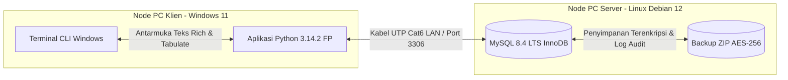

# Software Requirements Specification (SRS) — AbuCom

## Riwayat Perubahan Dokumen

| Versi | Tanggal    | Perubahan | Oleh |
|---|---|---|---|
| 1.0   | 2026-05-23 | Pembuatan dokumen spesifikasi teknis (SRS) pertama kali, diderivasi dari BRD v1.1 dan batasan Tech Stack Decision v1.1. Menambahkan model data konseptual, Mermaid ERD, Requirements Traceability Matrix dua arah, metrik non-fungsional, dan contoh wireframe terminal CLI. | Senior Software Requirements Engineer & Systems Analyst |
| 1.1   | 2026-05-23 | Hasil audit, validasi, dan penyempurnaan menyeluruh (v1.1). Mengatasi numbering gap dengan merestrukturisasi SRS-F-039 menjadi SRS-F-040 dan menambahkan SRS-F-039 (Database Backup & Restore). Mengisi seluruh placeholder numerik (UMR daerah Rp 3.200.000, alamat toko fisik default, plafon pinjaman bank Rp 50.000.000, dana cadangan Rp 4.500.000). Menyinkronkan semua versi pustaka teknis, merevisi 11 metrik non-fungsional, melengkapi kode error, mengupdate Mermaid ERD, dan merapikan formula LaTeX tanpa pemotongan. | Principal Systems Analyst & Senior Software Requirements Engineer |

---

## 1. Pendahuluan

### 1.1. Tujuan Dokumen
Dokumen *Software Requirements Specification* (SRS) ini disusun untuk memberikan spesifikasi teknis yang sangat rinci, formal, dan terukur mengenai bagaimana perangkat lunak **AbuCom — Sistem Manajemen Terpadu Usaha Percetakan** harus berperilaku. Dokumen ini mendefinisikan seluruh kebutuhan fungsional dan non-fungsional sistem yang diturunkan langsung dari *Business Requirements Document* (BRD) v1.1 dengan mematuhi batasan teknologi dari dokumen *Tech Stack Decision* v1.1. 

Dokumen ini berfungsi sebagai panduan utama (*Single Source of Truth*) bagi tim pengembang AI dan Junior Programmer (Pemilik Usaha) untuk melakukan perancangan sistem (*System Design Document* - SDD) serta penulisan kode program pada fase implementasi guna memastikan sistem terbebas dari kesalahan logika, bug pembulatan desimal, dan risiko fraud keuangan internal.

### 1.2. Cakupan Produk Perangkat Lunak
Perangkat lunak yang dikembangkan adalah **AbuCom CLI**, sebuah aplikasi manajemen internal terpadu berbasis *Command Line Interface* (CLI) atau terminal teks. Aplikasi ini beroperasi dalam lingkungan jaringan lokal (LAN) toko dengan topologi client-server. Sistem mencakup otomatisasi 10 modul fungsional terintegrasi:
1. **Modul Manajemen Transaksi & Kebijakan Harga (M.1)**: kasir multi-divisi, skema harga grosir/mitra, down payment, retur/batal, cetak struk thermal.
2. **Modul Manajemen Persediaan, BOM & Stock Opname (M.2)**: pengelolaan persediaan bahan baku dan barang retail, formula HPP presisi desimal berbasis Bill of Materials (BOM), penyesuaian stok opname, price tracking supplier, dan migrasi CSV.
3. **Modul Layanan Keuangan Digital, PPOB & Jasa Service (M.3)**: pelacakan saldo virtual, rekomendasi biaya admin termurah dari 6 e-wallet, data perbaikan printer/PC.
4. **Modul Manajemen SDM, Penggajian & Poin Karyawan (M.4)**: absensi harian, komisi poin insentif 4-tier, pemotongan kasbon otomatis, penggajian cerdas *Smart Payroll*.
5. **Modul Sistem Manajemen Antrian & Pelacakan Desain (M.5)**: dashboard job tracking 5 tahapan transisi status, path direktori arsip file desain, notifikasi WhatsApp Web link.
6. **Modul Administrasi Pinjaman, Aset, & Pengeluaran (M.6)**: pinjaman bank komersial berbunga, pinjaman kerabat tanpa bunga, depresiasi garis lurus aset, tabungan aset virtual, laba rugi instan per divisi.
7. **Modul Keamanan, Audit Trail & Hak Akses (M.7)**: otentikasi login bcrypt, stateless session JWT 8 jam, RBAC multi-level, log Audit Trail JSON, rate limiting, sanitasi input CLI.
8. **Modul Pembatalan, Retur & CRM (M.8)**: riwayat transaksi pelanggan dan proteksi privasi (kepatuhan UU PDP No. 27/2022).
9. **Modul Skalabilitas Multi-Cabang (M.9)**: struktur database multi-branch ready menggunakan identifikasi `cabang_id` di setiap tabel.
10. **Modul Konfigurasi Sistem Runtime (M.10)**: parameter regulasi bisnis dinamis di database.

### 1.3. Definisi, Akronim, dan Singkatan
*   **SRS**: *Software Requirements Specification* (Spesifikasi Kebutuhan Perangkat Lunak).
*   **BRD**: *Business Requirements Document* (Dokumen Kebutuhan Bisnis).
*   **CLI**: *Command Line Interface* (Antarmuka baris perintah berbasis teks terminal).
*   **FP**: *Functional Programming* (Paradigma pemrograman fungsional murni tanpa class/OOP).
*   **RBAC**: *Role-Based Access Control* (Pembatasan akses menu berbasis peran).
*   **JWT**: *JSON Web Token* (Token digital stateless untuk session keamanan pengguna).
*   **bcrypt**: Algoritma pengacakan sandi satu arah yang dilengkapi dynamic salt dengan Cost Factor.
*   **Audit Trail**: Catatan log kronologis terstruktur mengenai aktivitas perubahan data sensitif.
*   **BOM**: *Bill of Materials* (Komposisi bahan baku produk percetakan kustom dengan kuantitas desimal).
*   **HPP**: Harga Pokok Penjualan (Biaya modal riil produk).
*   **PPOB**: *Payment Point Online Bank* (Layanan agen pembayaran tagihan/pulsa digital).
*   **ACID**: *Atomicity, Consistency, Isolation, Durability* (Standar integritas transaksi database).
*   **InnoDB**: Engine penyimpanan MySQL lokal yang mendukung relasi *Foreign Key* dan transaksi aman.
*   **Decimal Precision**: Operasi matematika presisi tetap di Python menggunakan modul `decimal`.
*   **Parameterized Query**: Metode query SQL aman menggunakan placeholder `%s` untuk mencegah SQL Injection.
*   **UU PDP**: Undang-Undang Perlindungan Data Pribadi No. 27 Tahun 2022.

### 1.4. Referensi Dokumen SDLC
Dokumen SRS ini diderivasi dan divalidasi silang terhadap berkas-berkas perencanaan berikut:
1.  **BRD v1.1**: `docs/sdlc/02_analysis/01_business_requirements.md` (Prioritas: PRIMER).
2.  **Tech Stack Decision v1.1**: `docs/sdlc/01_planning/04_tech_stack_decision.md` (Prioritas: SEKUNDER).
3.  **Project Charter v1.1**: `docs/sdlc/01_planning/01_project_charter.md` (Prioritas: SEKUNDER).
4.  **Innovation Proposal v1.1**: `docs/sdlc/01_planning/05_innovation_proposal.md` (Prioritas: TERSIER).
5.  **Feasibility Study v1.1**: `docs/sdlc/01_planning/02_feasibility_study.md` (Prioritas: TERSIER).
6.  **Stakeholder Register v1.1**: `docs/sdlc/01_planning/03_stakeholder_register.md` (Prioritas: TERSIER).
7.  **Narasi Awal Proyek**: `docs/sdlc/narasi.txt` (Prioritas: TERSIER).

### 1.5. Posisi Dokumen dalam Siklus SDLC
Dalam siklus pengembangan perangkat lunak AbuCom, dokumen SRS ini menandai selesainya **Fase 02 Analysis (Analisis Kebutuhan)**. SRS menerjemahkan kebutuhan bisnis logis dari BRD menjadi kebutuhan fungsional perangkat lunak yang konkret dan bertindak sebagai masukan utama (*primary input*) bagi perancangan fisik database dan modul kode pada **Fase 03 Design** (SDD/ERD/Schema) serta menjadi basis penyusunan **Fase 05 Testing** (Test Cases).

### 1.6. Audiens Target dan Petunjuk Pembacaan
Dokumen ini ditujukan untuk:
*   **Pemilik Usaha AbuCom / Junior Programmer**: Untuk memahami detail validasi input, rumus kalkulasi logika bisnis, dan memverifikasi keselarasan visual CLI sebelum pemrograman dimulai.
*   **Tim Pengembang AI (Gemini & Claude)**: Sebagai referensi implementasi fungsi murni (*pure functions*), konfigurasi tabel database, parameter token JWT, parameter enkripsi bcrypt, serta implementasi Audit Trail JSON.
*   **Calon Staf Kepala Percetakan**: Untuk memahami aturan validasi operasional harian.

Petunjuk pembacaan: Kebutuhan fungsional di Bab 3 menggunakan kode identifikasi **SRS-F-XXX** yang selaras dengan kode **BR-F-XX** dari BRD. Kebutuhan non-fungsional di Bab 4 diidentifikasi dengan **SRS-NF-XXX**.

---

## 2. Deskripsi Umum Sistem

### 2.1. Perspektif Produk (Arsitektur Tingkat Tinggi)
Aplikasi AbuCom CLI dirancang dengan arsitektur **Client-Server LAN Lokal** murni guna menjamin kemandirian operasional 100% tanpa bergantung pada koneksi internet luar, menghindari biaya langganan cloud bulanan, serta melindungi data finansial pribadi pemilik secara fisik di dalam toko.



Aplikasi klien Python berjalan pada terminal emulator **Windows Terminal** di PC Kasir Windows 11, terhubung melalui kabel LAN UTP Cat6 fisik ke Mini PC Server yang menjalankan database MySQL Server 8.4 LTS pada Linux Debian 12 Bookworm. Pengamanan listrik menggunakan 2 unit UPS menjamin integritas data dari mati lampu mendadak. Operasional toko fisik AbuCom berlokasi di **Jl. Raya Percetakan No. 45, RT 02/RW 03, Kecamatan Sukamaju, Kota Bandung, Jawa Barat, 40123**.

### 2.2. Fungsi Utama Produk (Ringkasan 10 Modul)
Sistem AbuCom menyediakan fungsionalitas terpadu untuk mengelola seluruh aspek operasional toko:
*   **M.1 (Transaksi & Kasir)**: Input multi-divisi cepat, skema harga dinamis grosir/mitra, uang muka (DP), dan pencetakan struk ramah printer thermal.
*   **M.2 (Gudang & Inventaris)**: Pencatatan stok pecahan desimal, pemotongan stok otomatis berbasis HPP BOM, input limbah gagal cetak (*waste*), Stock Opname fisik, price tracking supplier, dan import data CSV.
*   **M.3 (PPOB & Layanan)**: Pencatatan manual transaksi pulsa/tagihan, alert deposit kritis, komparasi biaya e-wallet, dan pencatatan penerimaan servis laptop/printer.
*   **M.4 (SDM & Payroll)**: Absensi harian staf, komisi poin, penarikan kasbon staf, dan slip gaji bulanan otomatis cerdas (*Smart Payroll*).
*   **M.5 (Antrian & Desain)**: Pelacakan tahapan produksi dari Antri hingga Diambil, lokasi arsip desain, dan link salin WhatsApp Web.
*   **M.6 (Pinjaman & Laporan Keuangan)**: Administrasi pinjaman kerabat tanpa bunga dan bank komersial berbunga, depresiasi aset tetap, virtual tabungan, serta laporan laba rugi instan.
*   **M.7 (Keamanan & Audit)**: Otentikasi bcrypt, session token JWT, RBAC multi-level, log Audit Trail terkompresi JSON, login rate limiting, dan sanitasi input.
*   **M.8 (CRM Pelanggan)**: Penyimpanan riwayat transaksi nomor WhatsApp pelanggan terenkripsi sesuai UU PDP.
*   **M.9 (Multi-Cabang Ready)**: Penyediaan kolom `cabang_id` di setiap tabel basis data untuk replikasi masa depan.
*   **M.10 (Runtime Config)**: Parameterisasi regulasi bisnis dinamis di database `system_configs`.

### 2.3. Karakteristik dan Klasifikasi Pengguna (Aktor Sistem)
Sistem membatasi hak akses perintah terminal CLI secara ketat melalui session JWT berdasarkan 8 aktor internal:
1.  **`pemilik` (STK-001)**: Memiliki hak akses absolut terhadap seluruh modul sistem, termasuk menu administratif keuangan sensitif (pinjaman pribadi, tabungan aset, smart payroll, audit trail, dan konfigurasi runtime).
2.  **`kepala_percetakan` (STK-002)**: Bertanggung jawab memantau operasional harian. Memiliki hak akses penuh untuk memantau status antrian kerja desainer/produksi, stok gudang, input absensi karyawan, dan melakukan otorisasi Stock Opname. Dilarang melihat data keuangan pemilik.
3.  **`pramuniaga` (STK-003)**: Melayani garda depan konter. Memiliki hak akses menginput transaksi penjualan awal, mendaftarkan data CRM pelanggan, dan menginput penerimaan unit service.
4.  **`kasir` (STK-004)**: Menangani keuangan laci kas. Memiliki hak akses memproses pembayaran DP/pelunasan, mencetak struk nota, memproses transaksi retur/batal atas persetujuan pemilik, dan wajib menginput rekonsiliasi kas laci fisik di akhir shift.
5.  **`desainer` (STK-005)**: Memproses pengerjaan visual. Memiliki akses melihat antrian status `Proses Desain`, memperbarui status menjadi `Produksi`, dan merekam direktori path arsip file desain pelanggan.
6.  **`produksi_cetak` (STK-006)**: Mengeksekusi pencetakan fisik. Memiliki akses melihat antrian status `Produksi`, mengubah ke status `Selesai`, menginput kuantitas pemakaian bahan baku riil desimal, dan merekam data bahan rusak (limbah).
7.  **`fotocopy_print` (STK-007)**: Melayani transaksi ritel cepat cepat. Hanya diberikan akses mencatat transaksi penjualan fotokopi/print lembaran dan mencatat kehadiran absensi harian.
8.  **`gudang` (STK-008)**: Mengelola logistik barang. Memiliki hak akses penuh menginput barang masuk/keluar, menginput data master supplier, mencatat utang tempo pembelian, dan merekam data Stock Opname fisik.

### 2.4. Lingkungan Operasi (Runtime Environment)
Aplikasi harus dapat dijalankan pada spesifikasi lingkungan berikut:
*   **Node Server database**: Mini PC Debian 12 Bookworm Core i5 RAM 16GB, MySQL Community Server 8.4 LTS, driver network TCP/IP Port default 3306.
*   **Node Klien Kasir**: PC Kasir Windows 11 Core i3 RAM 8GB, konektor switch hub Gigabit, kabel LAN UTP Cat6, runtime **Python 3.14.2+**.
*   **Dependency Libraries**:
    *   `mysql-connector-python==8.4.0` (Driver basis data resmi).
    *   `python-dotenv==1.0.1` (Pemuat rahasia berkas `.env`).
    *   `bcrypt==4.1.0` (Enkripsi kredensial satu arah).
    *   `pyjwt==2.8.0` (Otentikasi stateless token session).
    *   `rich==13.7.0` (Rendering visual ANSI CLI).
    *   `tabulate==0.9.0` (Formatting tabel tabular CLI).

### 2.5. Batasan Desain dan Implementasi
*   **Functional Programming (FP) Murni**: Seluruh logika bisnis kalkulasi (HPP, BOM desimal, komisi poin, payroll gaji, depresiasi aset) **wajib** ditulis menggunakan fungsi murni (*pure functions*), imutabilitas data (*tuples/namedtuples*), dan menolak penggunaan class/OOP di alur bisnis inti. Pengelolaan session state tanpa OOP menggunakan pola *Nested Closures* dan *State Dictionary Passing*.
*   **CLI User Interface**: Antarmuka murni menggunakan baris perintah teks interaktif terminal. Dilarang menggunakan Tkinter, PyQt, Django, Flask, HTML, CSS, JavaScript, atau web browser.
*   **Presisi Desimal Keuangan & Gudang**: Logika program **wajib** menggunakan pustaka `decimal` Python untuk mengeliminasi bug pembulatan floating-point bawaan komputer. Skema database MySQL menggunakan tipe data `DECIMAL(15,4)` untuk menampung presisi bahan desimal dan nominal rupiah.
*   **Multi-Branch Ready**: Setiap tabel relasional MySQL wajib menyertakan kolom `cabang_id` (INT) sebagai foreign key sejak fase inisiasi.

### 2.6. Asumsi dan Ketergantungan Teknis
*   Program mengasumsikan keberadaan berkas `.env` lokal pada klien yang berisi data kredensial koneksi database, secret key JWT, dan konfigurasi basic.
*   Program mengasumsikan database MySQL Server lokal telah ter-setup struktur tabelnya menggunakan skrip `schema.sql` dan data master awalnya telah terisi menggunakan `seed.sql`.
*   Jaringan LAN fisik kabel UTP Cat6 dan switch hub toko berada dalam kondisi stabil dengan latensi <1ms.

---

## 3. Spesifikasi Kebutuhan Fungsional

### 3.1. Modul Manajemen Transaksi & Kebijakan Harga (M.1)

#### SRS-F-001: Pencatatan Transaksi Penjualan Multi-Divisi

| Atribut | Nilai |
|---|---|
| **ID** | SRS-F-001 |
| **Derivasi BRD** | BR-F-01 (Pencatatan Transaksi Penjualan Multi-Divisi) |
| **Modul** | M.1 — Manajemen Transaksi & Kebijakan Harga |
| **Prioritas** | High |
| **Aktor** | `pramuniaga`, `kasir`, `fotocopy_print` |

*   **Deskripsi Teknis**: Sistem **HARUS** mampu mencatat transaksi penjualan dari kelima divisi usaha (produk percetakan kustom, retail ATK, pulsa/token PPOB, transfer/tarik tunai, jasa service) secara terintegrasi ke dalam satu database transaksional MySQL.
*   **Input yang Diperlukan**: 
    *   `pelanggan_id` (INT, opsional).
    *   `tipe_pelanggan` (VARCHAR, wajib: 'Retail', 'Grosir', 'Mitra').
    *   `barang_id` (INT, wajib) & `kuantitas` (DECIMAL(15,4), wajib).
    *   `metode_pembayaran` (VARCHAR, wajib: 'Kas', 'QRIS', 'Transfer').
*   **Proses/Logika Bisnis**:
    1.  Tarik harga jual per unit dari tabel `barang` berdasarkan `barang_id` dan `tipe_pelanggan` (mengacu pada aturan harga dinamis).
    2.  Kalkulasikan subtotal item: `subtotal = kuantitas * harga_jual_terpilih`. Gunakan presisi `decimal` Python.
    3.  Kalkulasikan total bayar: `total_bayar = sum(subtotal)`.
    4.  Simpan transaksi ke tabel `transaksi` dan rincian item ke `detail_transaksi` secara atomik di dalam blok transaksi InnoDB (`START TRANSACTION`, `COMMIT`).
*   **Output yang Dihasilkan**:
    *   Perekaman baris baru di tabel `transaksi` dan `detail_transaksi` MySQL.
    *   Tampilan struk transaksi di layar terminal CLI.
*   **Aturan Validasi**:
    *   Kuantitas barang **HARUS** bernilai positif > 0.
    *   Metode pembayaran **HARUS** sesuai opsi yang valid.
    *   `barang_id` **HARUS** terdaftar di database.
*   **Penanganan Pengecualian (Exception Handling)**:
    *   Jika koneksi database terputus saat pemrosesan, jalankan `ROLLBACK` transaksi, tampilkan pesan error: `"ERR-DB-001: Koneksi terputus. Penyimpanan transaksi dibatalkan."`, dan log insiden ke berkas lokal.
*   **Ketergantungan**: `SRS-F-030` (RBAC), `SRS-F-037` (Multi-Cabang), `SRS-F-ADD-03` (DB Pooling).
*   **Catatan Implementasi**: Gunakan fungsi murni Python untuk menghitung total dan subtotal dalam bentuk imutabel list dictionary. Database MySQL menggunakan engine InnoDB dengan isolation level REPEATABLE READ.

---

#### SRS-F-002: Multi-Skema Harga Dinamis (Retail, Grosir, Mitra)

| Atribut | Nilai |
|---|---|
| **ID** | SRS-F-002 |
| **Derivasi BRD** | BR-F-02 (Multi-Skema Harga Dinamis) |
| **Modul** | M.1 — Manajemen Transaksi & Kebijakan Harga |
| **Prioritas** | High |
| **Aktor** | `pramuniaga`, `kasir` |

*   **Deskripsi Teknis**: Sistem **HARUS** menerapkan skema harga jual yang bervariasi secara otomatis di kasir berdasarkan tipe keanggotaan pelanggan dan kuantitas barang retail ATK yang dibeli.
*   **Input yang Diperlukan**:
    *   `barang_id` (INT).
    *   `kuantitas` (DECIMAL(15,4)).
    *   `tipe_pelanggan` (VARCHAR: 'Retail', 'Grosir', 'Mitra').
*   **Proses/Logika Bisnis**:
    1.  Tarik data barang dari database: `harga_retail`, `harga_grosir`, `min_grosir`, `harga_mitra`.
    2.  Terapkan logika penentuan harga per unit:
        *   Jika `tipe_pelanggan == 'Mitra'`: Gunakan `harga_mitra`.
        *   Jika `tipe_pelanggan == 'Grosir'` atau `kuantitas >= min_grosir`: Gunakan `harga_grosir`.
        *   Selain itu, gunakan `harga_retail`.
    3.  Kalkulasikan total item.
*   **Output yang Dihasilkan**:
    *   Nilai harga per unit terpilih dan subtotal terformat rupiah pada keranjang belanja CLI.
*   **Aturan Validasi**:
    *   Data `min_grosir` di database **HARUS** berupa angka positif integer.
    *   Kalkulasi pembagian atau persentase **HARUS** menggunakan presisi `decimal`.
*   **Penanganan Pengecualian (Exception Handling)**:
    *   Jika data harga bernilai `NULL` di database, tampilkan pesan: `"ERR-VAL-002: Data harga barang tidak valid. Hubungi Pemilik."`, batalkan item.
*   **Ketergantungan**: `SRS-F-001` (Transaksi).
*   **Catatan Implementasi**: Fungsi penentu tarif diimplementasikan sebagai fungsi murni `select_item_price(item_record, qty, customer_type) -> Decimal`.

---

#### SRS-F-003: Pembayaran Bertahap (Down Payment & Pelunasan)

| Atribut | Nilai |
|---|---|
| **ID** | SRS-F-003 |
| **Derivasi BRD** | BR-F-03 (Pembayaran Bertahap) |
| **Modul** | M.1 — Manajemen Transaksi & Kebijakan Harga |
| **Prioritas** | High |
| **Aktor** | `kasir` |

*   **Deskripsi Teknis**: Sistem **HARUS** memfasilitasi pencatatan uang muka (DP) minimal sebesar Rp 0 pada pesanan produk kustom percetakan, serta merekam proses pelunasan sisa tagihan di kasir saat barang diambil.
*   **Input yang Diperlukan**:
    *   `transaksi_id` (INT, saat pelunasan).
    *   `dp_bayar` (DECIMAL(15,4), saat pemesanan).
    *   `bayar_pelunasan` (DECIMAL(15,4), saat pengambilan).
*   **Proses/Logika Bisnis**:
    1.  *Saat Pemesanan*: Catat `dp_bayar` di tabel `transaksi`. Jika `dp_bayar < total_bayar`, set `status_pembayaran = 'BELUM LUNAS'`. Tambahkan `dp_bayar` ke kas laci aktif.
    2.  *Saat Pelunasan*: Tarik data transaksi. Hitung sisa tagihan: `sisa_tagihan = total_bayar - dp_bayar`.
    3.  Jika `bayar_pelunasan >= sisa_tagihan`, rekam pelunasan, set `status_pembayaran = 'LUNAS'`, set `status_pengambilan = 'DIAMBIL'`, dan tambahkan sisa tagihan ke kas laci.
*   **Output yang Dihasilkan**:
    *   Pembaruan kolom `dp_bayar`, `status_pembayaran`, `status_pengambilan` di database MySQL.
    *   Struk tanda pelunasan tercetak teks.
*   **Aturan Validasi**:
    *   Nominal `dp_bayar` **HARUS** &ge; 0 dan &le; `total_bayar`.
    *   Status transaksi **HARUS** bernilai `'BELUM LUNAS'` sebelum diproses lunas.
*   **Penanganan Pengecualian (Exception Handling)**:
    *   Jika kasir menginput pelunasan dengan nilai kurang dari sisa tagihan, tolak penyimpanan, tampilkan pesan: `"ERR-VAL-003: Jumlah pembayaran kurang dari sisa tagihan Rp [sisa_tagihan]!"`.
*   **Ketergantungan**: `SRS-F-001` (Transaksi), `SRS-F-033` (Rekonsiliasi Kas).
*   **Catatan Implementasi**: Semua kalkulasi tagihan dikelola menggunakan tipe `Decimal` dengan presisi 4 desimal di database MySQL.

---

#### SRS-F-004: Alur Pembatalan Transaksi & Retur Tersinkronisasi

| Atribut | Nilai |
|---|---|
| **ID** | SRS-F-004 |
| **Derivasi BRD** | BR-F-04 (Alur Pembatalan Transaksi & Retur) |
| **Modul** | M.1 — Manajemen Transaksi & Kebijakan Harga |
| **Prioritas** | High |
| **Aktor** | `kasir` (melalui verifikasi/persetujuan `pemilik`) |

*   **Deskripsi Teknis**: Sistem **HARUS** memproses pembatalan pesanan (mengembalikan DP 100% dan memotong kas laci) serta retur barang retail ATK rusak (mengembalikan stok gudang dan memotong kas) secara atomik.
*   **Input yang Diperlukan**:
    *   `transaksi_id` (INT).
    *   `tipe_aksi` (VARCHAR: 'Pembatalan', 'Retur_Barang').
    *   `barang_id` (INT, jika retur) & `retur_qty` (DECIMAL(15,4), jika retur).
*   **Proses/Logika Bisnis**:
    1.  *Pembatalan*: Ambil nominal `dp_bayar` transaksi. Kurangi kas laci kasir aktif sebesar `dp_bayar`. Set status transaksi menjadi `'BATAL'`.
    2.  *Retur*: Identifikasi kuantitas barang retail yang diretur. Tambahkan kuantitas tersebut kembali ke stok barang: `stok_saat_ini = stok_saat_ini + retur_qty`. Kurangi kas laci kasir aktif sebesar `retur_qty * harga_jual_item`. Set status transaksi menjadi `'RETUR'`.
    3.  Tulis riwayat modifikasi data ke log audit JSON.
*   **Output yang Dihasilkan**:
    *   Pembaruan kuantitas stok di tabel `barang`.
    *   Pembaruan status transaksi di MySQL.
    *   Penyimpanan entri audit trail JSON di database.
*   **Aturan Validasi**:
    *   Aksi pembatalan/retur **HARUS** memerlukan otentikasi kunci sandi supervisor (`pemilik`).
    *   Kuantitas retur tidak boleh melebihi kuantitas pembelian asli pada transaksi terkait.
*   **Penanganan Pengecualian (Exception Handling)**:
    *   Jika uang kas di laci kasir tidak mencukupi untuk proses pengembalian kas, gagalkan proses, tampilkan pesan: `"ERR-CASH-004: Saldo kas laci kasir tidak mencukupi untuk pengembalian dana!"`.
*   **Ketergantungan**: `SRS-F-001`, `SRS-F-030` (RBAC), `SRS-F-031` (Audit Trail).
*   **Catatan Implementasi**: Logika retur dan pembatalan dibungkus dalam single transaction block untuk menghindari inkonsistensi data persediaan vs data kasir (ACID).

---

#### SRS-F-005: Pelacakan Margin Keuntungan per Produk

| Atribut | Nilai |
|---|---|
| **ID** | SRS-F-005 |
| **Derivasi BRD** | BR-F-05 (Pelacakan Margin Keuntungan per Produk) |
| **Modul** | M.1 — Manajemen Transaksi & Kebijakan Harga |
| **Prioritas** | Medium |
| **Aktor** | `pemilik` |

*   **Deskripsi Teknis**: Sistem **HARUS** menampilkan metrik persentase margin keuntungan kotor untuk setiap item barang retail dan jasa cetak kustom secara instan di terminal admin pemilik.
*   **Input yang Diperlukan**:
    *   `barang_id` (INT, opsional untuk filter tunggal).
*   **Proses/Logika Bisnis**:
    1.  Tarik data `harga_retail` (atau harga jual dasar) dan `hpp` (Harga Pokok Penjualan berbasis BOM) dari basis data.
    2.  Kalkulasikan margin keuntungan kotor menggunakan rumus:
        $$\text{Margin } (\%) = \left( \frac{\text{Harga Jual} - \text{HPP}}{\text{Harga Jual}} \right) \times 100$$
    3.  Gunakan pustaka `decimal` Python untuk menjamin akurasi pecahan persen.
*   **Output yang Dihasilkan**:
    *   Tabel ringkasan data barang di terminal CLI dengan kolom: Nama Barang, Harga Jual, HPP, Margin (%), dan kategori produk.
*   **Aturan Validasi**:
    *   Harga Jual **HARUS** bernilai > 0 untuk menghindari division by zero. Jika Harga Jual = 0, set margin kotor = 0.00%.
*   **Penanganan Pengecualian (Exception Handling)**:
    *   Jika data HPP tidak ditemukan atau bernilai NULL, asumsikan HPP = 0 untuk perhitungan, dan berikan penanda visual kuning di kolom margin.
*   **Ketergantungan**: `SRS-F-007` (HPP BOM), `SRS-F-030` (RBAC).
*   **Catatan Implementasi**: Format visual data persen dibatasi hingga 2 angka di belakang koma menggunakan metode standard `f"{margin:.2f}%"` setelah pemrosesan desimal selesai.

---

#### SRS-F-006: Template Laporan Cetak Teks Struk Nota (Printer Thermal)

| Atribut | Nilai |
|---|---|
| **ID** | SRS-F-006 |
| **Derivasi BRD** | BR-F-06 (Template Laporan Cetak Teks Struk Nota) |
| **Modul** | M.1 — Manajemen Transaksi & Kebijakan Harga |
| **Prioritas** | Medium |
| **Aktor** | `kasir`, `pemilik` |

*   **Deskripsi Teknis**: Sistem **HARUS** mampu mengekspor struk transaksi belanja dan laporan rekap harian menjadi berkas teks polos format `.txt` dengan lebar kolom yang disesuaikan secara dinamis untuk printer thermal 58mm atau 80mm.
*   **Input yang Diperlukan**:
    *   `transaksi_id` (INT).
    *   `lebar_kertas` (INT, default: 32 karakter untuk 58mm atau 48 karakter untuk 80mm).
*   **Proses/Logika Bisnis**:
    1.  Tarik rincian transaksi dari database.
    2.  Gunakan modul Python `textwrap` dan `shutil` untuk menyusun layout struk teks polos:
        *   Tengah: Nama Toko ("AbuCom").
        *   Kiri: Timestamp, No Invoice, Nama Kasir.
        *   Pemisah garis putus-putus (`-`).
        *   Daftar item belanja dengan format pembungkusan teks (*text wrap*) jika nama item melebihi batas kolom.
        *   Kanan: Subtotal, DP, Sisa Tagihan, Total Bayar.
    3.  Tulis output string teks ke dalam berkas lokal di folder `exports/receipts/`.
*   **Output yang Dihasilkan**:
    *   Berkas teks polos (misal: `exports/receipts/struk_INV20260523001.txt`).
*   **Aturan Validasi**:
    *   Format tulisan teks struk nota **HARUS** ter-render rapi dan sejajar rata kanan untuk bagian nominal harga.
*   **Penanganan Pengecualian (Exception Handling)**:
    *   Jika gagal menulis berkas ke folder penyimpanan akibat kendala hak akses sistem operasi, lempar pesan: `"ERR-SYS-006: Gagal menulis berkas struk nota. Cek hak akses direktori exports!"`.
*   **Ketergantungan**: `SRS-F-001` (Transaksi).
*   **Catatan Implementasi**: Implementasikan fungsi penataan layout struk sebagai pure function yang memproses string formatting lintas platform Dual-OS menggunakan standar encoding `utf-8`.

---

### 3.2. Modul Manajemen Inventaris, BOM & Stock Opname (M.2)

#### SRS-F-007: Sistem HPP Otomatis Berbasis Bill of Materials (BOM) Presisi Desimal

| Atribut | Nilai |
|---|---|
| **ID** | SRS-F-007 |
| **Derivasi BRD** | BR-F-07 (Sistem HPP Otomatis Berbasis BOM) |
| **Modul** | M.2 — Manajemen Inventaris, BOM & Stock Opname |
| **Prioritas** | High |
| **Aktor** | `produksi_cetak`, `pemilik` |

*   **Deskripsi Teknis**: Sistem **HARUS** menghitung Harga Pokok Penjualan (HPP) produk cetak kustom secara otomatis berdasarkan jumlahan komposisi pemakaian bahan baku riil desimal (panjang x lebar atau volume) menggunakan presisi fixed-point.
*   **Input yang Diperlukan**:
    *   `barang_induk_id` (INT).
    *   Detail komposisi bahan: `bahan_baku_id` (INT) dan `kuantitas_pemakaian` (DECIMAL(15,4)).
*   **Proses/Logika Bisnis**:
    1.  Tarik data master harga beli bahan baku dari database berdasarkan `bahan_baku_id`.
    2.  Hitung biaya per komponen bahan:
        $$\text{Biaya Komponen} = \text{kuantitas\_pemakaian} \times \text{harga\_beli\_satuan}$$
        *Contoh Numerik*: Pembuatan stempel flash menggunakan karet stempel ukuran $0.05 \text{ m} \times 0.05 \text{ m} = 0.0025 \text{ m}^2$. Harga beli karet stempel $\text{Rp } 100.000/\text{m}^2$.
        $$\text{Biaya Karet} = 0.0025 \times 100.000 = \text{Rp } 250$$
    3.  Jumlahkan seluruh biaya komponen bahan untuk menetapkan HPP dasar produk kustom tersebut:
        $$\text{HPP Produk} = \sum (\text{Biaya Komponen})$$
    4.  Kurangi persediaan stok bahan baku di gudang MySQL secara pecahan desimal saat status produksi diselesaikan.
*   **Output yang Dihasilkan**:
    *   Nilai HPP tersimpan di baris transaksi detail database.
    *   Pengurangan kuantitas bahan baku di tabel `barang`.
*   **Aturan Validasi**:
    *   Perhitungan matematika **HARUS** menggunakan pustaka `decimal` Python. Dilarang menggunakan tipe `float` standar.
    *   Kuantitas pemakaian bahan baku **HARUS** positif > 0.
*   **Penanganan Pengecualian (Exception Handling)**:
    *   Jika sisa stok bahan baku di database kurang dari kuantitas pemakaian riil, proses cetak tetap dilanjutkan tetapi sistem **HARUS** mencatatkan status stok minus di database dan menampilkan alert kuning di CLI.
*   **Ketergantungan**: `SRS-F-001`, `SRS-F-009` (UoM).
*   **Catatan Implementasi**: Skema database MySQL mendefinisikan kolom stok bahan baku dengan tipe data `DECIMAL(15,4)` untuk menampung pecahan presisi tinggi.

---

#### SRS-F-008: Pencatatan Limbah Produksi (Waste Management)

| Atribut | Nilai |
|---|---|
| **ID** | SRS-F-008 |
| **Derivasi BRD** | BR-F-08 (Pencatatan Limbah Produksi) |
| **Modul** | M.2 — Manajemen Inventaris, BOM & Stock Opname |
| **Prioritas** | High |
| **Aktor** | `produksi_cetak` |

*   **Deskripsi Teknis**: Sistem **HARUS** menyediakan formulir input khusus di terminal produksi untuk mencatat bahan baku yang rusak, cacat, atau salah cetak selama pengerjaan fisik, memicu pengurangan stok, dan mencatatkan kerugian keuangan.
*   **Input yang Diperlukan**:
    *   `transaksi_id` (INT).
    *   `bahan_baku_id` (INT).
    *   `kuantitas_limbah` (DECIMAL(15,4)).
    *   `alasan_kerusakan` (VARCHAR).
*   **Proses/Logika Bisnis**:
    1.  Tarik data harga beli bahan baku berdasarkan `bahan_baku_id`.
    2.  Kalkulasikan nominal kerugian biaya limbah:
        $$\text{Biaya Kerugian} = \text{kuantitas\_limbah} \times \text{harga\_beli\_satuan}$$
    3.  Kurangi sisa stok bahan baku terkait di database.
    4.  Simpan catatan ke tabel `limbah_produksi` dan rekam debit pengeluaran limbah operasional di database keuangan.
*   **Output yang Dihasilkan**:
    *   Pengurangan kuantitas bahan baku pada tabel `barang`.
    *   Baris baru di tabel `limbah_produksi` dan pengeluaran biaya tak terduga.
*   **Aturan Validasi**:
    *   Kuantitas limbah **HARUS** bernilai positif > 0.
*   **Penanganan Pengecualian (Exception Handling)**:
    *   Jika `bahan_baku_id` tidak terdaftar atau tidak sesuai dengan BOM pesanan terkait, tolak penyimpanan, tampilkan: `"ERR-VAL-008: ID bahan baku tidak valid untuk transaksi pesanan kustom ini!"`.
*   **Ketergantungan**: `SRS-F-007` (BOM), `SRS-F-029` (Pengeluaran).
*   **Catatan Implementasi**: Logika pemrosesan limbah dibungkus dalam database transaction block InnoDB untuk konsistensi kas, stok, dan log audit.

---

#### SRS-F-009: Manajemen Satuan & Atribut Barang (Unit of Measure)

| Atribut | Nilai |
|---|---|
| **ID** | SRS-F-009 |
| **Derivasi BRD** | BR-F-09 (Manajemen Satuan & Atribut Barang) |
| **Modul** | M.2 — Manajemen Inventaris, BOM & Stock Opname |
| **Prioritas** | High |
| **Aktor** | `gudang`, `produksi_cetak` |

*   **Deskripsi Teknis**: Sistem **HARUS** mendukung pencatatan unit persediaan barang di database dengan berbagai opsi Satuan Ukur (Rim, Lembar, Pcs, Ml, Porsi, Dimensi desimal) dan konversi internal yang valid.
*   **Input yang Diperlukan**:
    *   `barang_id` (INT).
    *   `nama_satuan` (VARCHAR: 'Rim', 'Lembar', 'Pcs', 'Ml', 'Meter_Persegi').
    *   `kuantitas_stok` (DECIMAL(15,4)).
*   **Proses/Logika Bisnis**:
    1.  Terapkan logika konversi jika staf gudang melakukan pembelian barang dalam unit grosir (misal: 1 Rim) tetapi produksi menggunakan eceran (misal: Lembar).
    2.  Simpan kuantitas stok terkonversi ke database MySQL dengan mempertahankan akurasi desimal 4 digit di belakang koma.
*   **Output yang Dihasilkan**:
    *   Penyimpanan tipe data desimal presisi pada tabel `barang` basis data MySQL.
*   **Aturan Validasi**:
    *   Nilai kuantitas stok pecahan desimal **HARUS** divalidasi ke format tipe numeric SQL yang valid.
*   **Penanganan Pengecualian (Exception Handling)**:
    *   Jika terdeteksi kegagalan parsing nilai string desimal dari input terminal CLI, tangkap error, bersihkan input, dan tampilkan pesan: `"ERR-INPUT-009: Input kuantitas harus berupa angka desimal valid (contoh: 12.50)!"`.
*   **Ketergantungan**: `SRS-F-007` (HPP BOM).
*   **Catatan Implementasi**: Manfaatkan `decimal.Decimal` di Python untuk menghindari floating point arithmetic issues.

---

#### SRS-F-010: Sinkronisasi Barang Retail ATK untuk Produksi Internal

| Atribut | Nilai |
|---|---|
| **ID** | SRS-F-010 |
| **Derivasi BRD** | BR-F-10 (Sinkronisasi Barang Retail ATK untuk Produksi Internal) |
| **Modul** | M.2 — Manajemen Inventaris, BOM & Stock Opname |
| **Prioritas** | Medium |
| **Aktor** | `gudang`, `produksi_cetak` |

*   **Deskripsi Teknis**: Sistem **HARUS** memfasilitasi pencatatan pemotongan persediaan barang retail ATK yang diambil oleh staf toko untuk kebutuhan produksi atau operasional internal percetakan.
*   **Input yang Diperlukan**:
    *   `barang_id` (INT).
    *   `kuantitas_ambil` (DECIMAL(15,4)).
    *   `keperluan_internal` (VARCHAR).
*   **Proses/Logika Bisnis**:
    1.  Tarik data `stok_saat_ini` dan `harga_beli_satuan` (HPP retail) dari database.
    2.  Kurangi persediaan stok barang retail: `stok_saat_ini = stok_saat_ini - kuantitas_ambil`.
    3.  Kalkulasikan nilai biaya pengeluaran operasional internal:
        $$\text{Biaya Operasional} = \text{kuantitas\_ambil} \times \text{harga\_beli\_satuan}$$
    4.  Rekam transaksi pengeluaran internal operasional toko di database keuangan.
*   **Output yang Dihasilkan**:
    *   Pengurangan kuantitas persediaan di tabel `barang`.
    *   Baris baru biaya operasional terdaftar di tabel `pengeluaran`.
*   **Aturan Validasi**:
    *   Kuantitas pengambilan internal tidak boleh melebihi sisa stok yang tersedia di database.
*   **Penanganan Pengecualian (Exception Handling)**:
    *   Jika stok kosong atau kurang, tampilkan peringatan: `"ERR-STOCK-010: Ketersediaan stok retail ATK tidak mencukupi untuk pengambilan internal!"` dan gagalkan proses.
*   **Ketergantungan**: `SRS-F-001`, `SRS-F-029` (Pengeluaran).
*   **Catatan Implementasi**: Jalankan operasi di dalam safe database transaction InnoDB.

---

#### SRS-F-011: Rekonsiliasi Stok Berkala (Stock Opname)

| Atribut | Nilai |
|---|---|
| **ID** | SRS-F-011 |
| **Derivasi BRD** | BR-F-11 (Rekonsiliasi Stok Berkala) |
| **Modul** | M.2 — Manajemen Inventaris, BOM & Stock Opname |
| **Prioritas** | High |
| **Aktor** | `gudang`, `kepala_percetakan` |

*   **Deskripsi Teknis**: Sistem **HARUS** menyediakan fitur Stock Opname yang membekukan stok sementara, membandingkan kuantitas fisik riil terhadap catatan sistem, menghitung selisih secara otomatis, dan memperbarui database stok setelah disetujui Kepala Percetakan.
*   **Input yang Diperlukan**:
    *   `barang_id` (INT).
    *   `kuantitas_fisik` (DECIMAL(15,4)).
    *   `catatan_opname` (VARCHAR).
*   **Proses/Logika Bisnis**:
    1.  Tarik data `stok_sistem` dari database.
    2.  Hitung selisih kuantitas: `selisih = kuantitas_fisik - stok_sistem`.
    3.  Simpan record sementara ke tabel `stock_opname` dengan status `'DRAFT'`.
    4.  *Persetujuan (Kepala Percetakan)*: Begitu disetujui, update `stok_saat_ini` di tabel `barang` menjadi senilai `kuantitas_fisik`, rekam perubahan permanen di `stock_opname` dengan status `'APPROVED'`, dan tulis entri baru ke log audit JSON.
*   **Output yang Dihasilkan**:
    *   Pembaruan kuantitas stok di tabel `barang`.
    *   Pembaruan log status di tabel `stock_opname` dan `audit_logs`.
*   **Aturan Validasi**:
    *   Perubahan stok akibat selisih opname **HARUS** menyertakan tanda pengenal `user_id` Kepala Percetakan pelaksana otorisasi persetujuan.
*   **Penanganan Pengecualian (Exception Handling)**:
    *   Jika status akun supervisor yang menyetujui bukan `kepala_percetakan` atau `pemilik`, tolak persetujuan dan tampilkan: `"ERR-AUTH-011: Hak akses supervisor dibutuhkan untuk menyetujui Stock Opname!"`.
*   **Ketergantungan**: `SRS-F-030` (RBAC), `SRS-F-031` (Audit Trail).
*   **Catatan Implementasi**: Memanfaatkan transaction level REPEATABLE READ pada MySQL untuk mengunci baris data stok barang yang sedang direkonsiliasi.

---

#### SRS-F-012: Analisis Prediksi Re-Order Stok Bahan Baku

| Atribut | Nilai |
|---|---|
| **ID** | SRS-F-012 |
| **Derivasi BRD** | BR-F-12 (Analisis Prediksi Re-Order Stok Bahan Baku) |
| **Modul** | M.2 — Manajemen Inventaris, BOM & Stock Opname |
| **Prioritas** | High |
| **Aktor** | `gudang`, `kepala_percetakan` |

*   **Deskripsi Teknis**: Sistem **HARUS** menganalisis data historis pemakaian bahan baku bulanan secara otomatis untuk mengestimasi sisa hari ketersediaan dan memicu notifikasi peringatan visual kuning/merah jika diprediksi habis dalam 7 hari.
*   **Input yang Diperlukan**:
    *   `periode_analisis_hari` (INT, default: 30 hari).
*   **Proses/Logika Bisnis**:
    1.  Hitung total pemakaian bahan baku selama periode analisis (misal 30 hari ke belakang) dari data transaksi.
    2.  Hitung rata-rata pemakaian harian:
        $$\text{Rata-rata Harian} = \frac{\text{Total Pemakaian}}{\text{periode\_analisis\_hari}}$$
    3.  Estimasi sisa hari ketersediaan:
        $$\text{Sisa Hari} = \frac{\text{Stok Saat Ini}}{\text{Rata-rata Harian}}$$
    4.  Jika `Sisa Hari <= 7`, picu status notifikasi `'KRITIS'`.
*   **Output yang Dihasilkan**:
    *   Tabel ringkasan bahan baku pada dashboard gudang CLI dengan kolom indikator visual berwarna kuning (peringatan re-order) atau merah (kritis).
*   **Aturan Validasi**:
    *   Rata-rata harian **HARUS** > 0 untuk kalkulasi sisa hari. Jika rata-rata harian = 0, set sisa hari = 999.
*   **Penanganan Pengecualian (Exception Handling)**:
    *   Jika data konsumsi historis bahan baku masih kosong (toko baru buka), tampilkan default sisa stok saat ini dan abaikan perhitungan hari prediksi dengan aman.
*   **Ketergantungan**: `SRS-F-007` (HPP BOM), `SRS-NF-011` (Rich CLI).
*   **Catatan Implementasi**: Visualisasi teks berwarna menggunakan tag warna bawaan pustaka `rich` Python (misal `[yellow]Peringatan[/]`).

---

#### SRS-F-013: Fitur Riwayat Harga Beli Supplier (Price Tracking)

| Atribut | Nilai |
|---|---|
| **ID** | SRS-F-013 |
| **Derivasi BRD** | BR-F-13 (Fitur Riwayat Harga Beli Supplier) |
| **Modul** | M.2 — Manajemen Inventaris, BOM & Stock Opname |
| **Prioritas** | Medium |
| **Aktor** | `gudang` |

*   **Deskripsi Teknis**: Sistem **HARUS** merekam secara kronologis riwayat fluktuasi harga beli barang atau bahan baku dari setiap supplier setiap kali staf gudang menginput data pengadaan barang masuk.
*   **Input yang Diperlukan**:
    *   `barang_id` (INT).
    *   `supplier_id` (INT).
    *   `harga_beli_baru` (DECIMAL(15,4)).
*   **Proses/Logika Bisnis**:
    1.  Setiap kali transaksi pembelian inventaris dicatat, simpan entri baru ke tabel `riwayat_harga_supplier`.
    2.  Catat `barang_id`, `supplier_id`, `harga_beli_baru`, dan `tanggal_pembelian`.
    3.  Sediakan antarmuka pencarian bagi staf gudang untuk melihat komparasi harga historis supplier untuk satu produk sejenis.
*   **Output yang Dihasilkan**:
    *   Baris baru di tabel `riwayat_harga_supplier`.
    *   Tabel daftar harga perbandingan supplier di terminal CLI.
*   **Aturan Validasi**:
    *   Nilai `harga_beli_baru` **HARUS** berupa angka positif > 0.
*   **Penanganan Pengecualian (Exception Handling)**:
    *   Jika `supplier_id` tidak valid atau tidak terdaftar, tolak pencatatan, tampilkan: `"ERR-VAL-013: ID supplier tidak terdaftar di database master!"`.
*   **Ketergantungan**: `SRS-F-039` (Modul Supplier).
*   **Catatan Implementasi**: Pengambilan riwayat diurutkan berdasarkan `tanggal_pembelian DESC` untuk menyajikan data terbaru di bagian atas.

---

#### SRS-F-014: Fitur Import Data CSV/Excel Semiautomatis

| Atribut | Nilai |
|---|---|
| **ID** | SRS-F-014 |
| **Derivasi BRD** | BR-F-14 (Fitur Import Data CSV/Excel Semiautomatis) |
| **Modul** | M.2 — Manajemen Inventaris, BOM & Stock Opname |
| **Prioritas** | High |
| **Aktor** | `pemilik`, `gudang` |

*   **Deskripsi Teknis**: Sistem **HARUS** menyediakan utilitas skrip CLI independen untuk mengimpor daftar persediaan barang, supplier, dan data aset awal dari file `.csv` ekspor Microsoft Excel lama milik pemilik usaha.
*   **Input yang Diperlukan**:
    *   `path_file_csv` (VARCHAR, wajib).
*   **Proses/Logika Bisnis**:
    1.  Buka dan baca baris berkas CSV menggunakan modul bawaan `csv` Python dengan encoding `'utf-8'`.
    2.  Validasi kesesuaian jumlah kolom dan tipe data setiap baris:
        *   Kolom 1: Nama Barang (VARCHAR).
        *   Kolom 2: Satuan (VARCHAR).
        *   Kolom 3: Stok Awal (DECIMAL).
        *   Kolom 4: Harga Beli/HPP (DECIMAL).
    3.  Saring dan abaikan baris yang duplikat atau memiliki kolom kosong.
    4.  Simpan data yang telah bersih secara massal (*bulk insert*) ke MySQL basis data.
*   **Output yang Dihasilkan**:
    *   Pengisian massal data master barang/supplier ke database MySQL dalam waktu < 5 detik.
    *   Laporan rekapitulasi data berhasil/gagal di terminal CLI.
*   **Aturan Validasi**:
    *   Skrip **HARUS** memverifikasi kebersihan format data di Python sebelum di-insert ke database.
*   **Penanganan Pengecualian (Exception Handling)**:
    *   Jika format file CSV tidak sesuai atau data di dalamnya korup, batalkan seluruh import, jalankan rollback, dan tampilkan: `"ERR-IMPORT-014: Format kolom CSV tidak valid. Proses import massal digagalkan!"`.
*   **Ketergantungan**: `SRS-F-ADD-01` (Startup).
*   **Catatan Implementasi**: Penerapan bulk insert menggunakan perintah driver Python `cursor.executemany()` secara terarah.

---

#### SRS-F-039: Fitur Pencadangan & Pemulihan Basis Data Manual (Database Backup & Restore)

| Atribut | Nilai |
|---|---|
| **ID** | SRS-F-039 |
| **Derivasi BRD** | BR-F-39 (Pencadangan & Pemulihan Basis Data Manual) |
| **Modul** | M.2 — Manajemen Inventaris, BOM & Stock Opname |
| **Prioritas** | High |
| **Aktor** | `pemilik` |

*   **Deskripsi Teknis**: Sistem **HARUS** menyediakan utilitas administratif di terminal CLI khusus peran pemilik untuk melakukan ekspor basis data (backup) secara manual ke berkas terkompresi `.zip` terenkripsi AES-256, serta melakukan restorasi data (restore) dari file cadangan yang valid.
*   **Input yang Diperlukan**:
    *   *Backup*: `konfirmasi` (boolean).
    *   *Restore*: `nama_file_cadangan` (VARCHAR, wajib: contoh `'backup_20260523_1200.zip'`).
*   **Proses/Logika Bisnis**:
    1.  *Backup*: Saat pemilik memicu pencadangan, sistem Python menjalankan utilitas ekspor basis data eksternal secara fungsional (memanggil perintah safe subprocess `mysqldump` lokal).
    2.  Kompres file `.sql` hasil ekspor menjadi format `.zip`. Enkripsi berkas menggunakan pustaka standard atau utilitas terintegrasi dengan sandi kuat berbasis algoritma **AES-256**.
    3.  Tulis nama file, status, dan timestamp ke tabel `backup_logs` MySQL.
    4.  *Restore*: Saat pemilik memicu pemulihan, minta verifikasi kunci sandi pemilik. Dekripsi berkas `.zip` terpilih, ekstrak berkas `.sql`, lalu jalankan database overwrite menggunakan client MySQL.
*   **Output yang Dihasilkan**:
    *   Berkas cadangan terenkripsi `.zip` tersimpan di direktori server lokal `/exports/backups/`.
    *   Perekaman baris baru di tabel `backup_logs` database MySQL.
*   **Aturan Validasi**:
    *   Fitur backup dan restore **HARUS** memerlukan otentikasi login dengan peran `pemilik` (RBAC).
    *   Sistem **HARUS** mematikan sesi login kasir lain sementara saat restorasi data sedang dieksekusi untuk mencegah ketidaksinkronan data transaksional (ACID).
*   **Penanganan Pengecualian (Exception Handling)**:
    *   Jika berkas backup korup atau kunci dekripsi tidak valid saat di-restore, batalkan proses pemulihan, jalankan database rollback, dan tampilkan: `"ERR-FILE-039: Gagal memulihkan data. Berkas cadangan korup atau sandi enkripsi salah!"`.
*   **Ketergantungan**: `SRS-F-030` (RBAC), `SRS-F-031` (Audit Trail), `SRS-NF-007` (AES-256), `SRS-NF-008` (Backup).
*   **Catatan Implementasi**: Jalankan operasi CLI menggunakan module Python `subprocess` dengan parameter binding ketat (Parameterized Command) untuk mencegah command injection, serta `pathlib` untuk portabilitas Dual-OS.

---

#### SRS-F-040: Manajemen Data Supplier & Pencatatan Utang Usaha

| Atribut | Nilai |
|---|---|
| **ID** | SRS-F-040 |
| **Derivasi BRD** | BR-F-40 (Manajemen Data Supplier & Pencatatan Utang Usaha) |
| **Modul** | M.2 — Manajemen Inventaris, BOM & Stock Opname |
| **Prioritas** | High |
| **Aktor** | `gudang`, `kepala_percetakan` |

*   **Deskripsi Teknis**: Sistem **HARUS** mampu mencatat profil data supplier serta mencatat riwayat transaksi utang usaha atas pembelian barang tempo dari supplier.
*   **Input yang Diperlukan**:
    *   *Supplier*: `nama_supplier`, `alamat`, `telp`, `email`.
    *   *Utang*: `supplier_id` (INT), `nominal_utang` (DECIMAL(15,4)), `tanggal_jatuh_tempo` (DATE).
*   **Proses/Logika Bisnis**:
    1.  *Pencatatan Utang*: Simpan data pembelian tempo ke tabel `utang_supplier` dengan status `'BELUM LUNAS'`. Catat sisa tenggat hari jatuh tempo.
    2.  *Pelunasan*: Saat dicatatkan pelunasan, potong saldo kas keluar sebesar nominal pelunasan dan ubah status di tabel `utang_supplier` menjadi `'LUNAS'`.
*   **Output yang Dihasilkan**:
    *   Perekaman baris baru pada tabel `supplier` dan `utang_supplier` MySQL.
    *   Notifikasi visual status tempo pada dashboard admin.
*   **Aturan Validasi**:
    *   Nominal utang **HARUS** berupa angka positif > 0.
    *   Tanggal jatuh tempo **HARUS** bernilai setelah tanggal transaksi pembelian.
*   **Penanganan Pengecualian (Exception Handling)**:
    *   Jika tanggal jatuh tempo yang dimasukkan telah lampau sebelum di-input, tolak penyimpanan dan tampilkan: `"ERR-VAL-040: Tanggal jatuh tempo utang tidak boleh tanggal yang sudah lampau!"`.
*   **Ketergantungan**: `SRS-F-029` (Pengeluaran).
*   **Catatan Implementasi**: Gunakan standard format penulisan `YYYY-MM-DD` untuk input data tanggal tempo di database MySQL.

> [!NOTE]
> **Catatan Penomoran Kebutuhan Fungsional (Numbering Jump)**:
> Kebutuhan fungsional `SRS-F-040` (Supplier & Utang) diletakkan di bawah Modul 2 (setelah `SRS-F-014`) karena secara logis merupakan bagian integral dari sistem persediaan dan gudang. Hal ini menyebabkan urutan penomoran melompat dari `014` &rarr; `039` &rarr; `040` &rarr; `015` di dalam body dokumen. Struktur ini dipertahankan demi menyelaraskan nomor ID kebutuhan secara satu-per-satu terhadap berkas BRD v1.1 yang telah tervalidasi.

---

### 3.3. Modul Layanan Keuangan Digital, PPOB, Jasa Keuangan & Service (M.3)

#### SRS-F-015: Manajemen Saldo PPOB & Alert Deposit Otomatis

| Atribut | Nilai |
|---|---|
| **ID** | SRS-F-015 |
| **Derivasi BRD** | BR-F-15 (Manajemen Saldo PPOB & Alert Deposit Otomatis) |
| **Modul** | M.3 — PPOB & Jasa Service |
| **Prioritas** | High |
| **Aktor** | `kasir` |

*   **Deskripsi Teknis**: Sistem **HARUS** mencatat secara berkala sisa saldo virtual PPOB pada 2 akun terpisah (akun pulsa/data dan akun token/tagihan) secara manual dan memicu alert visual otomatis jika saldo di bawah Rp 150.000.
*   **Input yang Diperlukan**:
    *   `akun_tipe` (VARCHAR: 'Pulsa_Data', 'Token_Tagihan').
    *   `nominal_mutasi` (DECIMAL(15,4)).
    *   `tipe_mutasi` (VARCHAR: 'Debet_TopUp', 'Kredit_Transaksi').
*   **Proses/Logika Bisnis**:
    1.  Tarik saldo terakhir dari tabel `saldo_ppob` berdasarkan `akun_tipe`.
    2.  *Jika Kredit (Penjualan)*: `saldo_baru = saldo_sebelumnya - nominal_mutasi`.
        *   Jika `saldo_baru < 150000` (threshold diambil dari `system_configs`), picu status alert otomatis di terminal CLI kasir.
    3.  *Jika Debet (Top-up)*: `saldo_baru = saldo_sebelumnya + nominal_mutasi`.
        *   Peringatkan kasir jika nominal top-up kurang dari Rp 500.000 (rekomendasi minimal top-up dari database konfigurasi).
    4.  Simpan perubahan saldo baru ke database.
*   **Output yang Dihasilkan**:
    *   Pembaruan saldo di tabel `saldo_ppob`.
    *   Pancaran teks peringatan berkedip di CLI kasir: `"SALDO PPOB KRITIS - SEGERA DEPOSIT MINIMAL RP 500.000!"`.
*   **Aturan Validasi**:
    *   Nominal mutasi **HARUS** bernilai positif > 0.
*   **Penanganan Pengecualian (Exception Handling)**:
    *   Jika saldo virtual di database terdeteksi kurang dari nominal transaksi yang ingin di-input, gagalkan proses, tampilkan: `"ERR-PPOB-015: Saldo virtual PPOB di sistem tidak mencukupi untuk melakukan transaksi!"`.
*   **Ketergantungan**: `SRS-F-001` (Transaksi), `SRS-F-038` (Config).
*   **Catatan Implementasi**: Threshold saldo kritis Rp 150.000 dan rekomendasi top-up Rp 500.000 wajib dibaca dinamis dari tabel konfigurasi runtime, bukan di-hardcode.

---

#### SRS-F-016: Optimalisasi Biaya Admin Jasa Keuangan (6 Akun Digital)

| Atribut | Nilai |
|---|---|
| **ID** | SRS-F-016 |
| **Derivasi BRD** | BR-F-16 (Optimalisasi Biaya Admin Jasa Keuangan) |
| **Modul** | M.3 — PPOB & Jasa Service |
| **Prioritas** | High |
| **Aktor** | `kasir` |

*   **Deskripsi Teknis**: Sistem **HARUS** menyajikan visualisasi perbandingan biaya admin di antara 6 e-wallet terdaftar secara real-time untuk merekomendasikan opsi transfer paling hemat bagi pelanggan.
*   **Input yang Diperlukan**:
    *   `nominal_transfer` (DECIMAL(15,4)).
    *   `bank_tujuan` (VARCHAR).
*   **Proses/Logika Bisnis**:
    1.  Tarik tabel tarif biaya admin statis asli 6 akun e-wallet (Mandiri Agen, Dana, Gopay, LinkAja, ShopeePay, OVO) dari database.
    2.  Ambil biaya admin toko ke pelanggan (misal: flat Rp 5.000).
    3.  Bandingkan biaya admin asli masing-masing akun e-wallet untuk transaksi transfer nominal terkait.
    4.  Rekomendasikan akun dengan biaya admin asli termurah.
        *Contoh*: Transfer Rp 500.000. Biaya admin asli Dana = Rp 1.000, Mandiri Agen = Rp 3.000. Sistem menyarankan penggunaan akun "Dana".
    5.  Hitung komisi keuntungan jasa transfer: `keuntungan = admin_toko - admin_asli_terpilih`.
*   **Output yang Dihasilkan**:
    *   Tabel komparasi 6 e-wallet beserta rekomendasi akun bertanda bintang hijau di terminal CLI kasir.
    *   Pencatatan mutasi saldo virtual terpilih pada database.
*   **Aturan Validasi**:
    *   Tabel biaya admin e-wallet di database **HARUS** di-update secara berkala oleh pemilik.
*   **Penanganan Pengecualian (Exception Handling)**:
    *   Jika nominal transfer melebihi limit transaksi maksimal harian akun e-wallet, berikan alert abu-abu pada nama akun terkait di layar CLI.
*   **Ketergantungan**: `SRS-F-001`, `SRS-NF-011` (Rich CLI).
*   **Catatan Implementasi**: Komparasi biaya admin diproses secara fungsional murni menggunakan list comprehension dan fungsi bawaan `min(iterable, key=...)`.

---

#### SRS-F-017: Pencatatan Transaksi Jasa Service & Teknisi Terintegrasi

| Atribut | Nilai |
|---|---|
| **ID** | SRS-F-017 |
| **Derivasi BRD** | BR-F-17 (Pencatatan Transaksi Jasa Service) |
| **Modul** | M.3 — PPOB & Jasa Service |
| **Prioritas** | High |
| **Aktor** | `pramuniaga`, `kasir` |

*   **Deskripsi Teknis**: Sistem **HARUS** menyediakan antarmuka pencatatan terstruktur untuk penerimaan unit perbaikan (printer/PC) pelanggan dan secara otomatis memotong stok barang retail di gudang jika ada suku cadang yang diambil untuk servis.
*   **Input yang Diperlukan**:
    *   `nama_pelanggan` (VARCHAR) & `whatsapp` (VARCHAR).
    *   `nama_unit` (VARCHAR) & `detail_kerusakan` (VARCHAR).
    *   `suku_cadang_id` (INT, opsional) & `suku_cadang_qty` (DECIMAL, opsional).
*   **Proses/Logika Bisnis**:
    1.  *Penerimaan*: Rekam data ke tabel `jasa_service` dengan status perbaikan `'Diterima'`.
    2.  *Suku Cadang*: Jika teknisi mengambil suku cadang (misal: tinta printer) dari persediaan retail, kurangi kuantitas stok barang tersebut di database stok: `stok = stok - suku_cadang_qty`. Debet nilai HPP suku cadang tersebut ke rincian biaya servis.
    3.  *Pelunasan*: Saat unit diserahkan kembali, ubah status menjadi `'Selesai & Diambil'` dan rekam pelunasan biaya servis di kas masuk.
*   **Output yang Dihasilkan**:
    *   Baris baru di tabel `jasa_service`.
    *   Pembaruan stok di tabel `barang`.
    *   Pencatatan kas masuk pelunasan servis.
*   **Aturan Validasi**:
    *   Nomor WhatsApp pelanggan **HARUS** divalidasi ke format regex Indonesia.
*   **Penanganan Pengecualian (Exception Handling)**:
    *   Jika suku cadang yang dipilih ternyata tidak bertipe retail ATK/suku cadang di database, tolak penarikan bahan, tampilkan: `"ERR-VAL-017: Barang yang dipilih bukan kategori suku cadang/retail ATK!"`.
*   **Ketergantungan**: `SRS-F-001`, `SRS-F-009` (UoM), `SRS-F-036` (CRM).
*   **Catatan Implementasi**: Seluruh alur data service printer dan PC dikelola secara terstruktur di MySQL dan Python menggunakan transaction block.

---

### 3.4. Modul Manajemen SDM, Penggajian & Poin Karyawan (M.4)

#### SRS-F-018: Manajemen Data Karyawan, Absensi, dan Kasbon

| Atribut | Nilai |
|---|---|
| **ID** | SRS-F-018 |
| **Derivasi BRD** | BR-F-18 (Manajemen Data Karyawan, Absensi, dan Kasbon) |
| **Modul** | M.4 — Manajemen SDM, Penggajian & Poin Karyawan |
| **Prioritas** | High |
| **Aktor** | `kepala_percetakan`, `pemilik` |

*   **Deskripsi Teknis**: Sistem **HARUS** merekam profil detail data karyawan, log kehadiran/absensi shift harian, dan mutasi pinjaman kasbon internal karyawan secara digital.
*   **Input yang Diperlukan**:
    *   *Karyawan*: `nama_staf`, `role_staf` (VARCHAR: 'kasir', 'pramuniaga', 'desainer', dll), `status_kontrak` ('PKWT', 'PKWTT').
    *   *Absensi*: `pengguna_id` (INT), `tanggal` (DATE), `status_kehadiran` (VARCHAR: 'Hadir', 'Izin', 'Sakit', 'Alpha').
    *   *Kasbon*: `pengguna_id` (INT), `nominal_tarik` (DECIMAL(15,4)).
*   **Proses/Logika Bisnis**:
    1.  *Absensi*: Rekam log kehadiran harian ke tabel `absensi`. Karyawan dengan status `'Alpha'` akan memotong upah harian secara fungsional pada penggajian.
    2.  *Kasbon*: Catat transaksi penarikan kasbon staf ke tabel `kasbon` dengan status `'AKTIF'`. Tambahkan nominal kasbon ke saldo utang karyawan.
*   **Output yang Dihasilkan**:
    *   Entri baris baru di tabel `absensi` dan `kasbon` basis data MySQL.
*   **Aturan Validasi**:
    *   Absensi harian hanya boleh di-input sekali per karyawan per tanggal operasional.
*   **Penanganan Pengecualian (Exception Handling)**:
    *   Jika kasir menginput absensi untuk tanggal yang sudah terisi sebelumnya, gagalkan penyimpanan, tampilkan: `"ERR-VAL-018: Log absensi karyawan ini sudah terisi untuk tanggal hari ini!"`.
*   **Ketergantungan**: `SRS-F-030` (RBAC).
*   **Catatan Implementasi**: Menggunakan input prompt keyboard CLI sekuensial yang dibungkus dengan standard error sanitizer.

---

#### SRS-F-019: Sistem Penggajian Otomatis Cerdas (Smart Payroll)

| Atribut | Nilai |
|---|---|
| **ID** | SRS-F-019 |
| **Derivasi BRD** | BR-F-19 (Sistem Penggajian Otomatis Cerdas) |
| **Modul** | M.4 — Manajemen SDM, Penggajian & Poin Karyawan |
| **Prioritas** | High |
| **Aktor** | `pemilik` |

*   **Deskripsi Teknis**: Sistem **HARUS** menghitung slip gaji bulanan staf secara otomatis berdasarkan parameter evaluasi target laba bersih bulanan toko harian dengan batas perlindungan minimum 50% UMR daerah.
*   **Input yang Diperlukan**:
    *   `bulan_tahun` (VARCHAR, format: 'MM-YYYY').
    *   `umr_daerah` (DECIMAL(15,4), wajib &rarr; `default `3200000.0000` (Rp 3.200.000)`).
*   **Proses/Logika Bisnis**:
    1.  Tarik data target laba bersih bulanan toko (**Rp 15.000.000**) dan persentase pembagian gaji (**25,0%**) dari database `system_configs`.
    2.  Tarik nominal laba bersih bulanan berjalan yang dihitung real-time dari database keuangan.
    3.  Tentukan skema perhitungan upah:
        *   **Skenario A (Laba Bersih >= Rp 15.000.000)**: Setiap karyawan dibayar menggunakan Gaji Bulanan Tetap penuh sesuai kesepakatan kontrak.
        *   **Skenario B (Laba Bersih < Rp 15.000.000)**: Total dana gaji bulanan dialokasikan sebesar **25,0%** dari total laba bersih berjalan, dibagi secara proporsional kepada staf aktif berdasarkan persentase bobot kehadiran harian.
    4.  Terapkan batas jaminan minimum: Jika gaji hasil Skenario B kurang dari **50,0% dari UMR daerah** (misal UMR = Rp 3.000.000, jaminan min = Rp 1.500.000), sistem **HARUS** menaikkan nilai nominal gaji bersih staf secara otomatis menjadi senilai Rp 1.500.000.
*   **Output yang Dihasilkan**:
    *   Tabel slip komputasi payroll bulanan staf di terminal CLI pemilik.
    *   Perekaman data slip gaji permanen ke tabel `payroll`.
*   **Aturan Validasi**:
    *   Nominal UMR daerah **HARUS** diisi oleh pemilik di form input sebelum payroll diproses.
    *   Status payroll bulanan hanya dapat diproses oleh peran `pemilik`.
*   **Penanganan Pengecualian (Exception Handling)**:
    *   Jika laba bersih usaha tercatat bernilai minus (rugi total), sistem secara otomatis menerapkan Skenario B dengan batas perlindungan minimum 50% UMR daerah secara transparan.
*   **Ketergantungan**: `SRS-F-018` (Data SDM), `SRS-F-026` (Laba Rugi), `SRS-F-038` (Config).
*   **Catatan Implementasi**: Kalkulasi upah proporsional murni fungsional:
    $$\text{Gaji Staf} = \max \left( \text{Laba Bersih} \times 0.25 \times \frac{\text{Kehadiran Staf}}{\text{Total Kehadiran}}, 0.50 \times \text{UMR} \right)$$

---

#### SRS-F-020: Sistem Poin Insentif Karyawan Berbasis Beban Kerja

| Atribut | Nilai |
|---|---|
| **ID** | SRS-F-020 |
| **Derivasi BRD** | BR-F-20 (Sistem Poin Insentif Karyawan) |
| **Modul** | M.4 — Manajemen SDM, Penggajian & Poin Karyawan |
| **Prioritas** | High |
| **Aktor** | `kasir`, `pemilik` |

*   **Deskripsi Teknis**: Sistem **HARUS** secara otomatis mencatat dan mengakumulasikan poin insentif staf per transaksi berdasarkan 4-tier tingkat kesulitan tugas sebagai bonus pada penggajian bulanan.
*   **Input yang Diperlukan**:
    *   `transaksi_id` (INT).
    *   `karyawan_id` (INT) & `tugas_tier` (INT: 1, 2, 3, 4).
*   **Proses/Logika Bisnis**:
    1.  Tarik skema poin dan nominal rupiah per poin dari database:
        *   **Tier 1 (1 Poin = Rp 500)**: Transaksi retail ATK, top-up pulsa, transfer kecil.
        *   **Tier 2 (3 Poin = Rp 1.500)**: Jasa fotokopi, print lembaran, transfer besar.
        *   **Tier 3 (5 Poin = Rp 2.500)**: Produk kustom stempel flash, cetak foto, stiker, pin.
        *   **Tier 4 (10 Poin = Rp 5.000)**: Cetak baliho, cetak buku yasin, service printer/PC.
    2.  Setelah kasir menyelesaikan pembayaran transaksi, hitung poin dan simpan ke tabel `poin_insentif`.
    3.  Tambahkan jumlahan nominal poin ini ke slip payroll bulanan staf terkait.
*   **Output yang Dihasilkan**:
    *   Perekaman baris baru di tabel `poin_insentif` MySQL.
    *   Akumulasi poin insentif bertambah di profil karyawan.
*   **Aturan Validasi**:
    *   Pemberian poin insentif hanya dipicu oleh status transaksi yang telah `'LUNAS'`.
*   **Penanganan Pengecualian (Exception Handling)**:
    *   Jika transaksi dibatalkan (`BATAL` / `RETUR`), sistem **HARUS** melakukan pemotongan/penyesuaian balik (*rollback poin*) secara otomatis dari log poin staf terkait.
*   **Ketergantungan**: `SRS-F-001`, `SRS-F-004` (Retur/Batal), `SRS-F-019` (Payroll).
*   **Catatan Implementasi**: Kalkulasi akumulasi poin dilakukan menggunakan fungsi murni agregasi `sum` dengan modul `functools.reduce` di Python.

---

#### SRS-F-021: Pemotongan Gaji Otomatis atas Kasbon Aktif

| Atribut | Nilai |
|---|---|
| **ID** | SRS-F-021 |
| **Derivasi BRD** | BR-F-21 (Pemotongan Gaji Otomatis atas Kasbon Aktif) |
| **Modul** | M.4 — Manajemen SDM, Penggajian & Poin Karyawan |
| **Prioritas** | High |
| **Aktor** | `pemilik` |

*   **Deskripsi Teknis**: Sistem **HARUS** memotong total nominal gaji bulanan bersih karyawan secara otomatis pada siklus slip payroll jika karyawan bersangkutan memiliki utang kasbon aktif di database.
*   **Input yang Diperlukan**:
    *   `pengguna_id` (INT).
    *   `gaji_kotor_bulanan` (DECIMAL(15,4)).
*   **Proses/Logika Bisnis**:
    1.  Tarik limit penarikan kasbon aktif staf (**Rp 1.000.000** atau maks **30,0%** dari upah bulanan) dari database konfigurasi.
    2.  Tarik sisa saldo utang kasbon aktif dari tabel `kasbon` berdasarkan `pengguna_id`.
    3.  Jika karyawan memiliki kasbon aktif (sisa utang > 0):
        *   Potong nominal upah bersih bulanan: `gaji_bersih = gaji_kotor - sisa_utang`.
        *   Ubah status di tabel `kasbon` menjadi `'LUNAS'` untuk jumlah kasbon yang terbayar penuh.
*   **Output yang Dihasilkan**:
    *   Slip payroll dengan kolom "Potongan Kasbon" dan nilai "Gaji Bersih" yang akurat.
    *   Pembaruan status utang kasbon staf menjadi `'LUNAS'` di database.
*   **Aturan Validasi**:
    *   Sistem tidak boleh menyetujui penarikan kasbon baru jika sisa utang kasbon aktif staf telah menyentuh limit Rp 1.000.000.
*   **Penanganan Pengecualian (Exception Handling)**:
    *   Jika sisa utang kasbon aktif staf lebih besar dari gaji kotor yang diterima pada bulan tersebut, sistem **HARUS** memotong gaji hingga tersisa Rp 0 (atau disesuaikan dengan jaminan hidup staf) dan menyisakan sisa utang kasbon untuk siklus payroll bulan berikutnya.
*   **Ketergantungan**: `SRS-F-018`, `SRS-F-019` (Payroll), `SRS-F-038` (Config).
*   **Catatan Implementasi**: Semua potongan dihitung aman menggunakan presisi fixed-point `Decimal`.

---

### 3.5. Modul Sistem Manajemen Antrian & Pelacakan Desain (M.5)

#### SRS-F-022: Sistem Antrian Digital (Job Tracking 5 Status)

| Atribut | Nilai |
|---|---|
| **ID** | SRS-F-022 |
| **Derivasi BRD** | BR-F-22 (Sistem Antrian Digital [Job Tracking 5 Status]) |
| **Modul** | M.5 — Sistem Manajemen Antrian & Pelacakan Desain |
| **Prioritas** | High |
| **Aktor** | `pramuniaga`, `desainer`, `produksi_cetak`, `kasir` |

*   **Deskripsi Teknis**: Sistem **HARUS** melacak status pengerjaan pesanan kustom secara sekuensial dengan lima status transisi: `Antri` &rarr; `Proses Desain` &rarr; `Produksi` &rarr; `Selesai` &rarr; `Diambil`.
*   **Input yang Diperlukan**:
    *   `transaksi_id` (INT).
    *   `status_baru` (VARCHAR: 'Antri', 'Proses Desain', 'Produksi', 'Selesai', 'Diambil').
*   **Proses/Logika Bisnis**:
    1.  *Saat Order (Pramuniaga)*: Masukkan baris baru ke tabel `antrian_kerja` dengan status `'Antri'`.
    2.  *Desain (Desainer)*: Filter antrian status `'Antri'`, jalankan pengerjaan, ubah status ke `'Proses Desain'`. Setelah selesai, rekam path arsip desain, dan ubah status ke `'Produksi'`.
    3.  *Produksi (Produksi Cetak)*: Filter antrian status `'Produksi'`, cetak fisik, input sisa pemakaian bahan baku desimal dan limbah, lalu ubah status ke `'Selesai'`.
    4.  *Pengambilan (Kasir)*: Terima pelunasan, serahkan barang, dan ubah status menjadi `'Diambil'`.
*   **Output yang Dihasilkan**:
    *   Pembaruan kolom `status_antrian` di tabel `antrian_kerja` MySQL.
    *   Tampilan antrian tersaring pada terminal masing-masing divisi.
*   **Aturan Validasi**:
    *   Transisi status **HARUS** berjalan secara sekuensial. Peran pengguna dibatasi oleh RBAC untuk merubah status (misal: desainer dilarang merubah status menjadi `'Diambil'`).
*   **Penanganan Pengecualian (Exception Handling)**:
    *   Jika staf mencoba melompati status transisi (misal dari `'Antri'` langsung ke `'Selesai'`), gagalkan proses, tampilkan: `"ERR-FLOW-022: Transisi status tidak valid. Ikuti alur sekuensial antrian!"`.
*   **Ketergantungan**: `SRS-F-001` (Transaksi), `SRS-F-030` (RBAC).
*   **Catatan Implementasi**: Menggunakan update query terproteksi InnoDB row lock untuk mencegah race condition.

---

#### SRS-F-023: Arsip Desain Pelanggan untuk Cetak Ulang Cepat

| Atribut | Nilai |
|---|---|
| **ID** | SRS-F-023 |
| **Derivasi BRD** | BR-F-23 (Arsip Desain Pelanggan) |
| **Modul** | M.5 — Sistem Manajemen Antrian & Pelacakan Desain |
| **Prioritas** | Medium |
| **Aktor** | `desainer`, `pramuniaga` |

*   **Deskripsi Teknis**: Sistem **HARUS** merekam path lokasi direktori penyimpanan lokal file berkas desain pelanggan untuk memfasilitasi pencarian instan dan cetak ulang (*re-order*).
*   **Input yang Diperlukan**:
    *   `transaksi_id` (INT).
    *   `path_desain` (VARCHAR, wajib: contoh `'D:/arsip_desain/stk-001/stempel_flash.pdf'`).
*   **Proses/Logika Bisnis**:
    1.  Saat desainer menyelesaikan mockup desain di menu CLI, rekam string `path_desain` dan tautkan ke `pelanggan_id` (CRM) di tabel `antrian_kerja`.
    2.  Sediakan fitur pencarian bagi pramuniaga berdasarkan nama pelanggan atau nomor WhatsApp untuk menampilkan rincian path desain historis.
*   **Output yang Dihasilkan**:
    *   Penyimpanan string path pada tabel `antrian_kerja` MySQL.
    *   Tampilan link direktori file di terminal CLI.
*   **Aturan Validasi**:
    *   String `path_desain` **HARUS** divalidasi kebersihannya menggunakan modul `pathlib` Python untuk memastikan kompatibilitas format path Dual-OS (Windows `\` vs Linux `/`).
*   **Penanganan Pengecualian (Exception Handling)**:
    *   Jika berkas desain fisik tidak ditemukan di direktori lokal server saat diakses, tampilkan warning: `"ERR-FILE-023: Berkas desain fisik tidak ditemukan di path terdaftar!"`.
*   **Ketergantungan**: `SRS-F-036` (CRM), `SRS-NF-09` (Dual-OS).
*   **Catatan Implementasi**: Implementasikan cross-platform path resolver menggunakan pure function Python `pathlib.Path(path).as_posix()`.

---

#### SRS-F-024: Notifikasi Template WhatsApp Ready

| Atribut | Nilai |
|---|---|
| **ID** | SRS-F-024 |
| **Derivasi BRD** | BR-F-24 (Notifikasi Template WhatsApp Ready) |
| **Modul** | M.5 — Sistem Manajemen Antrian & Pelacakan Desain |
| **Prioritas** | Medium |
| **Aktor** | `pramuniaga`, `kasir` |

*   **Deskripsi Teknis**: Sistem **HARUS** memformat string teks pesan notifikasi WhatsApp secara dinamis yang menyertakan data invoice, nama pelanggan, sisa tagihan, dan status pesanan, serta menyajikan tautan web `https://wa.me/` untuk disalin-tempel oleh kasir ke WhatsApp Web secara cepat.
*   **Input yang Diperlukan**:
    *   `transaksi_id` (INT).
*   **Proses/Logika Bisnis**:
    1.  Tarik data transaksi, nominal sisa tagihan, nama pelanggan, dan nomor WhatsApp dari database.
    2.  Picu pembuatan string teks menggunakan template dinamis di Python:
        *   *Contoh*: `"Halo [Nama], pesanan stempel kustom Anda telah Selesai dan dapat diambil di toko. Sisa tagihan pelunasan: Rp [Sisa]. Terima kasih - AbuCom."`
    3.  Generate url link wa.me: `https://wa.me/[Nomor_WA]?text=[Encoded_Teks]`.
*   **Output yang Dihasilkan**:
    *   String teks pesan template dan link url `wa.me` tampil di terminal CLI kasir untuk disalin.
*   **Aturan Validasi**:
    *   Nomor WhatsApp **HARUS** dikonversi otomatis ke format internasional di Python (diawali kode negara `62` tanpa tanda `+` atau `0` di depan).
*   **Penanganan Pengecualian (Exception Handling)**:
    *   Jika nomor WhatsApp pelanggan di CRM kosong atau tidak valid, tampilkan string pesan tetapi abaikan pembuatan link wa.me secara aman.
*   **Ketergantungan**: `SRS-F-001`, `SRS-F-036` (CRM).
*   **Catatan Implementasi**: Gunakan fungsi library bawaan Python `urllib.parse.quote()` untuk melakukan encoding URL teks pesan WhatsApp secara aman.

---

### 3.6. Modul Administrasi Pinjaman, Aset, & Pengeluaran Rutin (M.6)

#### SRS-F-025: Administrasi Pinjaman Modal Terstruktur (Bank & Kerabat)

| Atribut | Nilai |
|---|---|
| **ID** | SRS-F-025 |
| **Derivasi BRD** | BR-F-25 (Administrasi Pinjaman Modal Terstruktur) |
| **Modul** | M.6 — Pinjaman, Aset & Laporan Keuangan |
| **Prioritas** | High |
| **Aktor** | `pemilik` |

*   **Deskripsi Teknis**: Sistem **HARUS** mencatat secara terpisah pinjaman kekeluargaan tanpa bunga (kerabat) yang fleksibel dan pinjaman komersial perbankan berbunga (Bank BRI & Mandiri) lengkap dengan nominal, tenor, bunga, setoran bulanan, dan jatuh tempo.
*   **Input yang Diperlukan**:
    *   `tipe_pinjaman` (VARCHAR: 'Kerabat_Tanpa_Bunga', 'Bank_BRI', 'Bank_Mandiri').
    *   `plafon_nominal` (DECIMAL(15,4), wajib &rarr; `default `50000000.0000` (Rp 50.000.000) untuk Bank BRI dan Bank Mandiri`).
    *   `bunga_persen` (DECIMAL(15,4), wajib jika Bank).
    *   `tenor_bulan` (INT, wajib jika Bank).
    *   `tanggal_jatuh_tempo` (DATE, wajib jika Bank).
*   **Proses/Logika Bisnis**:
    1.  *Kerabat*: Catat mutasi penarikan dan pengembalian kasbon kerabat. Saldo utang kerabat bertambah/berkurang sesuai input.
    2.  *Bank*: Hitung sisa utang bank komersial berbunga secara matematis. Simpan data setoran bulanan yang dicatat pemilik ke tabel pengeluaran keuangan dan kurangi sisa tenor bulan.
*   **Output yang Dihasilkan**:
    *   Perekaman baris baru di tabel `pinjaman_bank` dan `pinjaman_kerabat` MySQL.
    *   Tampilan rekapitulasi utang terpadu di terminal CLI pemilik.
*   **Aturan Validasi**:
    *   Semua data parameter pinjaman Bank Mandiri & BRI (plafon, bunga, tenor, jatuh tempo) **HARUS** diisi manual oleh pemilik di awal penggunaan.
*   **Penanganan Pengecualian (Exception Handling)**:
    *   Jika sisa tenor bernilai 0 (sudah lunas) tetapi pemilik menginput cicilan baru, tolak input, tampilkan: `"ERR-VAL-025: Pinjaman bank ini terdeteksi sudah LUNAS!"`.
*   **Ketergantungan**: `SRS-F-030` (RBAC), `SRS-F-029` (Pengeluaran).
*   **Catatan Implementasi**: Kalkulasi bunga bank komersial menggunakan rumus bunga tetap (*flat rate*) atau anuitas standar sesuai parameter input pemilik.

---

#### SRS-F-026: Laporan Laba/Rugi Komprehensif Instan per Divisi

| Atribut | Nilai |
|---|---|
| **ID** | SRS-F-026 |
| **Derivasi BRD** | BR-F-26 (Laporan Laba/Rugi Komprehensif Instan) |
| **Modul** | M.6 — Pinjaman, Aset & Laporan Keuangan |
| **Prioritas** | High |
| **Aktor** | `pemilik` |

*   **Deskripsi Teknis**: Sistem **HARUS** menyajikan ringkasan laporan keuangan laba/rugi harian, bulanan, dan tahunan secara komprehensif yang dapat dianalisis per kategori layanan usaha dengan waktu pemrosesan data < 5 detik.
*   **Input yang Diperlukan**:
    *   `tanggal_mulai` (DATE) & `tanggal_selesai` (DATE).
*   **Proses/Logika Bisnis**:
    1.  Tarik total pendapatan kotor dari data transaksi penjualan per divisi selama periode terpilih.
    2.  Tarik total HPP bahan baku (BOM desimal) dari `detail_transaksi` dan HPP retail ATK.
    3.  Tarik total pengeluaran operasional toko dari tabel `pengeluaran` (termasuk depresiasi aset tetap, biaya limbah produksi, pengeluaran rutin, dan bonus poin insentif karyawan).
    4.  Kalkulasikan laba kotor dan laba bersih:
        $$\text{Laba Kotor} = \text{Total Pendapatan} - \text{Total HPP}$$
        $$\text{Laba Bersih} = \text{Laba Kotor} - \text{Total Pengeluaran}$$
*   **Output yang Dihasilkan**:
    *   Tabel keuangan Laba/Rugi instan per divisi di layar terminal CLI.
*   **Aturan Validasi**:
    *   Semua komputasi nominal rupiah **HARUS** diproses menggunakan `Decimal` presisi tetap.
*   **Penanganan Pengecualian (Exception Handling)**:
    *   Jika pemrosesan data query database terdeteksi lambat melebihi 5 detik, picu timeout koneksi, batalkan query, log error, dan tampilkan: `"ERR-PERF-026: Batas waktu pemrosesan laporan terlampaui. Cek jaringan LAN!"`.
*   **Ketergantungan**: `SRS-F-001`, `SRS-F-007` (HPP), `SRS-F-029` (Pengeluaran), `SRS-F-030` (RBAC).
*   **Catatan Implementasi**: Optimalkan query SQL menggunakan indexing gabungan pada kolom `tanggal_transaksi` dan `cabang_id` di database MySQL.

---

#### SRS-F-027: Sistem Notifikasi Jatuh Tempo Utang Otomatis (Alert H-3)

| Atribut | Nilai |
|---|---|
| **ID** | SRS-F-027 |
| **Derivasi BRD** | BR-F-27 (Sistem Notifikasi Jatuh Tempo Utang) |
| **Modul** | M.6 — Pinjaman, Aset & Laporan Keuangan |
| **Prioritas** | High |
| **Aktor** | `pemilik` |

*   **Deskripsi Teknis**: Sistem **HARUS** memicu dan memancarkan teks notifikasi peringatan visual kuning berkedip (*startup alert*) H-3 sebelum tanggal jatuh tempo cicilan Bank (BRI/Mandiri) atau tenggat pembayaran utang supplier tempo saat level pemilik login ke CLI.
*   **Input yang Diperlukan**:
    *   `tanggal_sistem` (DATE, otomatis dari system clock).
*   **Proses/Logika Bisnis**:
    1.  Tarik tanggal jatuh tempo cicilan bank aktif dari `pinjaman_bank` dan utang supplier dari `utang_supplier`.
    2.  Kalkulasikan selisih hari: `selisih_hari = tanggal_jatuh_tempo - tanggal_sistem`.
    3.  Jika `0 <= selisih_hari <= 3`, picu pembuatan pesan alert.
*   **Output yang Dihasilkan**:
    *   Pancaran teks notifikasi di layar utama CLI pemilik: `"PERINGATAN JATUH TEMPO H-[selisih]: CICILAN BANK [NAMA] JATUH TEMPO TANGGAL [TGL]!"`.
*   **Aturan Validasi**:
    *   Sistem notifikasi jatuh tempo otomatis **HARUS** dievaluasi setiap kali level admin pemilik berhasil login pertama kali.
*   **Penanganan Pengecualian (Exception Handling)**:
    *   Jika tanggal jatuh tempo cicilan telah terlampaui (lewat tanggal jatuh tempo) tetapi status pinjaman belum dicatat lunas, ubah teks notifikasi menjadi berkedip merah terang: `"PERINGATAN KERAS: CICILAN BANK [NAMA] TELAH TERLAMBAT TANGGAL [TGL]!"`.
*   **Ketergantungan**: `SRS-F-025` (Pinjaman), `SRS-F-030` (RBAC), `SRS-F-039` (Utang Supplier).
*   **Catatan Implementasi**: Kalkulasi selisih hari menggunakan fungsional murni operasi manipulasi objek `datetime.date` di Python.

---

#### SRS-F-028: Pengelolaan Aset Tetap, Depresiasi, dan Tabungan Aset

| Atribut | Nilai |
|---|---|
| **ID** | SRS-F-028 |
| **Derivasi BRD** | BR-F-28 (Pengelolaan Aset Tetap, Depresiasi, dan Tabungan Aset) |
| **Modul** | M.6 — Pinjaman, Aset & Laporan Keuangan |
| **Prioritas** | Medium |
| **Aktor** | `pemilik` |

*   **Deskripsi Teknis**: Sistem **HARUS** mencatat daftar aset tetap usaha, menghitung biaya depresiasi nilai aset bulanan secara garis lurus, serta memfasilitasi perekaman dana tabungan virtual untuk pengadaan mesin baru.
*   **Input yang Diperlukan**:
    *   `nama_aset` (VARCHAR) & `harga_perolehan` (DECIMAL(15,4)).
    *   `masa_manfaat_bulan` (INT).
    *   `alokasi_tabungan_bulanan` (DECIMAL(15,4)).
*   **Proses/Logika Bisnis**:
    1.  *Penyusutan*: Hitung depresiasi garis lurus bulanan:
        $$\text{Depresiasi Bulanan} = \frac{\text{Harga Perolehan}}{\text{Masa Manfaat (Bulan)}}$$
    2.  Setiap akhir bulan, rekam nilai `Depresiasi Bulanan` sebagai biaya pengeluaran operasional depresiasi non-kas di database laporan keuangan.
    3.  *Tabungan*: Tarik laba bersih bulanan, kurangi saldo laba kotor sebesar `alokasi_tabungan_bulanan`, dan simpan secara virtual ke tabel tabungan aset.
*   **Output yang Dihasilkan**:
    *   Baris baru di tabel `aset`.
    *   Pembaruan otomatis nilai buku aset tetap di database.
    *   Pencatatan kas tabungan virtual aset bertambah.
*   **Aturan Validasi**:
    *   Masa manfaat dalam bulan **HARUS** bernilai integer positif > 0.
*   **Penanganan Pengecualian (Exception Handling)**:
    *   Jika alokasi tabungan virtual mesin baru yang diinput melebihi nilai laba bersih bulanan toko berjalan, tolak alokasi, tampilkan: `"ERR-VAL-028: Alokasi tabungan aset melebihi total laba bersih bulan berjalan!"`.
*   **Ketergantungan**: `SRS-F-026` (Laba Rugi).
*   **Catatan Implementasi**: Kalkulasi nilai sisa buku (*carrying value*) aset dikomputasi menggunakan pure function fungsional di Python.

---

#### SRS-F-029: Pengelolaan Pengeluaran Operasional Rutin & Biaya Tak Terduga

| Atribut | Nilai |
|---|---|
| **ID** | SRS-F-029 |
| **Derivasi BRD** | BR-F-29 (Pengelolaan Pengeluaran Operasional Rutin) |
| **Modul** | M.6 — Pinjaman, Aset & Laporan Keuangan |
| **Prioritas** | Medium |
| **Aktor** | `pemilik`, `kepala_percetakan` |

*   **Deskripsi Teknis**: Sistem **HARUS** mencatat pengeluaran operasional rutin bulanan (listrik, air, internet) dan biaya tidak terduga (kerusakan mesin, transport) dengan pemisahan otorisasi persetujuan level pemilik untuk pengeluaran besar.
*   **Input yang Diperlukan**:
    *   `tipe_pengeluaran` (VARCHAR: 'Rutin', 'Tak_Terduga').
    *   `nominal_pengeluaran` (DECIMAL(15,4)).
    *   `deskripsi` (VARCHAR).
*   **Proses/Logika Bisnis**:
    1.  *Pengeluaran Rutin*: Kepala Percetakan dapat mencatat pengeluaran rutin operasional. Nominal langsung memotong saldo kas keluar harian.
    2.  *Pengeluaran Besar/Tak Terduga*: Jika `nominal_pengeluaran >= Rp 500.000` (threshold dari configs), sistem **HARUS** mengunci data dan meminta verifikasi otentikasi login sandi `pemilik` sebelum transaksi pengeluaran disimpan ke MySQL.
*   **Output yang Dihasilkan**:
    *   Entri baris baru pada tabel `pengeluaran` MySQL database.
    *   Pembaruan nominal kas keluar harian.
*   **Aturan Validasi**:
    *   Nominal pengeluaran **HARUS** bernilai positif > 0.
*   **Penanganan Pengecualian (Exception Handling)**:
    *   Jika input pengeluaran besar gagal diverifikasi sandi pemilik, gagalkan proses, tampilkan: `"ERR-AUTH-029: Verifikasi sandi Pemilik gagal. Pengeluaran besar dibatalkan!"`.
*   **Ketergantungan**: `SRS-F-030` (RBAC), `SRS-F-038` (Config).
*   **Catatan Implementasi**: Threshold persetujuan pengeluaran besar diatur dinamis di database `system_configs`.

---

### 3.7. Modul Keamanan, Audit Trail & Hak Akses (M.7)

#### SRS-F-030: Role-Based Access Control (RBAC) Multi-Level CLI

| Atribut | Nilai |
|---|---|
| **ID** | SRS-F-030 |
| **Derivasi BRD** | BR-F-30 (Role-Based Access Control) |
| **Modul** | M.7 — Keamanan, Audit Trail & Hak Akses |
| **Prioritas** | High |
| **Aktor** | Semua Aktor (8 Role Pengguna) |

*   **Deskripsi Teknis**: Sistem **HARUS** membatasi akses menu di tingkat aplikasi CLI untuk membedakan antara menu Pemilik (keuangan/konfigurasi) dan menu operasional staf berdasarkan login session JWT terotentikasi.
*   **Input yang Diperlukan**:
    *   `session_token` (JWT String).
    *   `target_menu_id` (VARCHAR).
*   **Proses/Logika Bisnis**:
    1.  Dekode token JWT menggunakan `pyjwt` dengan Secret Key dari `.env` dan ambil klaim `role`.
    2.  Bandingkan `role` pengguna terhadap matriks hak akses RBAC (mengacu pada tabel hak akses di BRD Bagian 5.3).
    3.  *Jika diizinkan*: Lanjutkan memuat modul menu.
    4.  *Jika ditolak*: Gagalkan perintah, tampilkan error, dan rekam insiden akses ilegal ke Audit Trail.
*   **Output yang Dihasilkan**:
    *   Rendering menu terminal CLI yang dinamis sesuai peran pengguna aktif.
    *   Pesan penolakan akses di layar terminal kasir jika melanggar.
*   **Aturan Validasi**:
    *   Verifikasi boolean otorisasi menu **HARUS** dilakukan secara ketat di sisi Python sebelum memuat fungsi logic bisnis apa pun.
*   **Penanganan Pengecualian (Exception Handling)**:
    *   Jika pengguna tanpa peran pemilik mencoba memanggil modul keuangan secara ilegal, tolak akses, tampilkan: `"ERR-AUTH-030: Akses Ditolak: Hak Akses Pemilik Dibutuhkan!"`, dan rekam ke log audit.
*   **Ketergantungan**: `SRS-F-031` (Audit Trail), `SRS-F-ADD-02` (Session JWT).
*   **Catatan Implementasi**: Validasi RBAC diimplementasikan sebagai fungsi murni pembungkus (*decorator-like function*) `authorize_role(session, required_roles) -> Boolean` di Python.

---

#### SRS-F-031: Audit Trail Kronologis Terstruktur (Format JSON)

| Atribut | Nilai |
|---|---|
| **ID** | SRS-F-031 |
| **Derivasi BRD** | BR-F-31 (Audit Trail Kronologis Terstruktur) |
| **Modul** | M.7 — Keamanan, Audit Trail & Hak Akses |
| **Prioritas** | High |
| **Aktor** | `pemilik` (Akses melihat) |

*   **Deskripsi Teknis**: Sistem **HARUS** mencatat secara kronologis setiap aktivitas modifikasi data sensitif (hapus transaksi, edit stok manual, retur/batal, kasbon) ke tabel log audit basis data MySQL.
*   **Input yang Diperlukan**:
    *   `user_id` (INT) & `action_type` (VARCHAR: 'INSERT', 'UPDATE', 'DELETE').
    *   `target_table` (VARCHAR).
    *   `old_value` (JSON String) & `new_value` (JSON String).
*   **Proses/Logika Bisnis**:
    1.  Tarik data baris sebelum modifikasi (`old_value`) dalam format dictionary Python.
    2.  Jalankan pembaruan query data di database.
    3.  Tarik data baris sesudah modifikasi (`new_value`).
    4.  Konversi kedua data dictionary tersebut ke format string JSON terstruktur menggunakan pustaka `json` bawaan Python.
    5.  Simpan entri log baru ke tabel `audit_logs` MySQL secara terintegrasi (ACID).
*   **Output yang Dihasilkan**:
    *   Baris baru terisi di tabel `audit_logs` database MySQL.
*   **Aturan Validasi**:
    *   Log Audit Trail **HARUS** mencantumkan timestamp otomatis presisi detik dan tanda pengenal `user_id` kasir pelaksana aksi.
*   **Penanganan Pengecualian (Exception Handling)**:
    *   Jika penulisan log audit ke basis data MySQL gagal akibat error driver, gagalkan juga operasi manipulasi data utama (jalankan rollback total) untuk menjaga akuntabilitas audit keamanan.
*   **Ketergantungan**: `SRS-F-ADD-03` (DB Connection), `SRS-F-ADD-04` (Exception).
*   **Catatan Implementasi**: Serialisasi data dictionary menggunakan `json.dumps()` bawaan Python. Kolom `old_value` dan `new_value` didefinisikan dengan tipe data native `JSON` di database MySQL.

---

#### SRS-F-032: Log Serah Terima Shift Karyawan (Shift Handover Log)

| Atribut | Nilai |
|---|---|
| **ID** | SRS-F-032 |
| **Derivasi BRD** | BR-F-32 (Log Serah Terima Shift Karyawan) |
| **Modul** | M.7 — Keamanan, Audit Trail & Hak Akses |
| **Prioritas** | Medium |
| **Aktor** | `kasir`, `kepala_percetakan` |

*   **Deskripsi Teknis**: Sistem **HARUS** mencatat serah terima shift kasir harian di terminal kasir, mengunci transaksi shift sebelumnya, dan mencocokkan uang laci fisik.
*   **Input yang Diperlukan**:
    *   `kasir_keluar_id` (INT) & `kasir_masuk_id` (INT).
    *   `total_kas_laci_fisik` (DECIMAL(15,4)).
*   **Proses/Logika Bisnis**:
    1.  Tarik total penerimaan transaksi kas masuk sistem selama shift kasir berjalan: `total_kas_sistem`.
    2.  Validasi input `total_kas_laci_fisik` terhadap `total_kas_sistem` (mengacu pada aturan rekonsiliasi kas).
    3.  Persetujuan verifikasi dilakukan silang oleh Kepala Percetakan.
    4.  Simpan log handover ke tabel `shift_handover` database MySQL.
    5.  Kunci seluruh baris data transaksi pada shift kasir keluar dari modifikasi lebih lanjut di shift berikutnya.
*   **Output yang Dihasilkan**:
    *   Perekaman baris baru di tabel `shift_handover`.
    *   Penguncian status data transaksi kasir shift keluar di database.
*   **Aturan Validasi**:
    *   Data serah terima shift tidak boleh disimpan jika uang laci kasir fisik belum diinput secara lengkap dan diotorisasi verifikasi Kepala Percetakan.
*   **Penanganan Pengecualian (Exception Handling)**:
    *   Jika terjadi selisih kas fisik vs sistem di luar batas toleransi Rp 10.000, sistem **HARUS** memaksa kasir merekam string catatan tertulis alasan selisih sebelum tombol simpan dapat ditekan.
*   **Ketergantungan**: `SRS-F-033` (Rekonsiliasi Kas), `SRS-F-030` (RBAC).
*   **Catatan Implementasi**: Penguncian record transaksi di database diimplementasikan secara transaksional dengan menetapkan timestamp penguncian shift.

---

#### SRS-F-033: Rekonsiliasi Kas Harian Kasir (Cash Reconciliation)

| Atribut | Nilai |
|---|---|
| **ID** | SRS-F-033 |
| **Derivasi BRD** | BR-F-33 (Rekonsiliasi Kas Harian Kasir) |
| **Modul** | M.7 — Keamanan, Audit Trail & Hak Akses |
| **Prioritas** | High |
| **Aktor** | `kasir` |

*   **Deskripsi Teknis**: Sistem **HARUS** memfasilitasi menu rekonsiliasi kas (pencocokan uang tunai fisik di laci kasir terhadap saldo kas masuk sistem) di setiap penutupan shift kasir toko.
*   **Input yang Diperlukan**:
    *   `total_kas_fisik` (DECIMAL(15,4)).
*   **Proses/Logika Bisnis**:
    1.  Hitung real-time akumulasi kas masuk sistem berjalan:
        $$\text{Kas Sistem} = \text{Kas Awal} + \sum (\text{DP}) + \sum (\text{Pelunasan}) + \sum (\text{ATK Retail}) - \sum (\text{Batal/Retur}) - \sum (\text{Pengeluaran Kas})$$
    2.  Hitung nilai selisih kasir: `selisih = total_kas_fisik - Kas Sistem`.
    3.  Bandingkan nilai absolut selisih terhadap batas toleransi:
        $$\text{Absolute Selisih} = |\text{selisih}|$$
    4.  Tarik batas toleransi selisih kas (**Rp 10.000**) dari configs.
    5.  Jika `Absolute Selisih > Rp 10.000`, picu status `'ANOMALI'`, rekam alasan fisik, dan kirimkan alert fraud otomatis ke panel pemilik.
*   **Output yang Dihasilkan**:
    *   Simpan record rekonsiliasi kas harian ke tabel `shift_handover`.
    *   Notifikasi alert di layar pemilik.
*   **Aturan Validasi**:
    *   Semua perhitungan uang kas **HARUS** menggunakan presisi fixed-point `Decimal` di Python.
*   **Penanganan Pengecualian (Exception Handling)**:
    *   Jika kasir menginput nominal uang laci fisik berupa minus atau karakter non-angka, gagalkan input, tampilkan: `"ERR-INPUT-033: Input nominal kas fisik laci kasir harus berupa angka positif valid!"`.
*   **Ketergantungan**: `SRS-F-001`, `SRS-F-032` (Shift Handover), `SRS-F-038` (Config).
*   **Catatan Implementasi**: Kalkulasi selisih kas diproses menggunakan fungsi murni `calculate_cash_discrepancy(system_cash, physical_cash, tolerance_limit) -> Dict`.

---

#### SRS-F-034: Sistem Peringatan Anomali Transaksi (Fraud Detection Sederhana)

| Atribut | Nilai |
|---|---|
| **ID** | SRS-F-034 |
| **Derivasi BRD** | BR-F-34 (Sistem Peringatan Anomali Transaksi) |
| **Modul** | M.7 — Keamanan, Audit Trail & Hak Akses |
| **Prioritas** | High |
| **Aktor** | `pemilik` |

*   **Deskripsi Teknis**: Sistem **HARUS** memantau anomali transaksi staf di toko dan memancarkan teks peringatan visual merah di dashboard pemilik saat login berhasil.
*   **Input yang Diperlukan**:
    *   `tanggal_pantau` (DATE, default: hari ini).
*   **Proses/Logika Bisnis**:
    1.  Tarik data audit harian. Evaluasi indikator anomali fraud:
        *   Pembatalan pesanan (`BATAL`) berturut-turut > 3 kali dalam 1 shift kasir oleh user yang sama.
        *   Transaksi pengembalian retur berturut-turut oleh kasir yang sama.
        *   Selisih kas laci kasir fisik vs sistem melebihi batas toleransi **Rp 10.000**.
    2.  Jika salah satu indikator terpenuhi, catat log status `'FRAUD_ALERT'`.
*   **Output yang Dihasilkan**:
    *   Pancaran teks notifikasi berkedip merah terang di terminal CLI pemilik: `"PERINGATAN FRAUD: TERDETEKSI SELISIH KAS RP [NOMINAL] PADA SHIFT KASIR TANGGAL [TGL]!"`.
*   **Aturan Validasi**:
    *   Evaluasi indikator anomali **HARUS** dijalankan secara otomatis di Python setiap kali pemilik login ke aplikasi CLI.
*   **Penanganan Pengecualian (Exception Handling)**:
    *   Jika database log audit kosong (hari pertama go-live), lewati pemeriksaan anomali secara aman tanpa melontarkan error crash.
*   **Ketergantungan**: `SRS-F-030` (RBAC), `SRS-F-031` (Audit Trail), `SRS-F-033` (Rekonsiliasi).
*   **Catatan Implementasi**: Logika evaluasi diproses secara fungsional dengan memfilter list dictionary log kejadian harian.

---

#### SRS-F-035: Input Data Awal Secara Manual dari Excel

| Atribut | Nilai |
|---|---|
| **ID** | SRS-F-035 |
| **Derivasi BRD** | BR-F-35 (Input Data Awal Secara Manual dari Excel) |
| **Modul** | M.7 — Keamanan, Audit Trail & Hak Akses |
| **Prioritas** | High |
| **Aktor** | `pemilik`, `gudang` |

*   **Deskripsi Teknis**: Sistem **HARUS** menyediakan antarmuka menu CLI setup terpandu untuk menginput secara bertahap sisa modal pinjaman bank, data master supplier lama, dan persediaan awal barang langsung melalui terminal CLI setup.
*   **Input yang Diperlukan**:
    *   Data master terstruktur (Nama Barang, Kuantitas Awal, Plafon Utang Bank, dsb).
*   **Proses/Logika Bisnis**:
    1.  Tampilkan form input step-by-step di layar terminal CLI setup.
    2.  Koleksi input keyboard pengguna, validasi tipe data masing-masing input.
    3.  Tulis data ke database MySQL.
*   **Output yang Dihasilkan**:
    *   Penyimpanan permanen data inisialisasi awal ke tabel database MySQL.
*   **Aturan Validasi**:
    *   Fitur setup inisialisasi database manual ini hanya diaktifkan sekali pada masa awal penerapan sistem (*deployment setup*).
*   **Penanganan Pengecualian (Exception Handling)**:
    *   Jika data masukan yang diinput melanggar integritas relasi foreign key di database, tampilkan: `"ERR-SQL-035: Gagal menyimpan data awal. Terdapat inkonsistensi relasi master data!"`.
*   **Ketergantungan**: `SRS-F-ADD-01` (Startup).
*   **Catatan Implementasi**: Jalankan bulk insertion secara transaksional dengan auto-rollback jika terjadi kegagalan input di tengah jalan.

---

### 3.8. Modul Pembatalan, Retur & CRM (M.8)

#### SRS-F-036: Database Pelanggan Terstruktur (CRM Sederhana)

| Atribut | Nilai |
|---|---|
| **ID** | SRS-F-036 |
| **Derivasi BRD** | BR-F-36 (Database Pelanggan Terstruktur) |
| **Modul** | M.8 — Pembatalan, Retur & CRM |
| **Prioritas** | Medium |
| **Aktor** | `pramuniaga`, `kasir`, `pemilik` |

*   **Deskripsi Teknis**: Sistem **HARUS** menyimpan database profil pelanggan sederhana (nama, nomor WhatsApp, riwayat transaksi) terenkripsi lokal dan melindunginya dari ekspor data ilegal demi kepatuhan UU PDP No. 27/2022.
*   **Input yang Diperlukan**:
    *   `nama_pelanggan` (VARCHAR).
    *   `whatsapp` (VARCHAR).
*   **Proses/Logika Bisnis**:
    1.  Catat profil data pelanggan baru ke tabel `pelanggan` MySQL.
    2.  Nomor WhatsApp pelanggan dienkripsi secara lokal di Python sebelum disimpan ke kolom database untuk mencegah kebocoran data pribadi (UU PDP).
    3.  Tautkan `pelanggan_id` dengan riwayat pesanan kustom stempel flash atau retail di database.
*   **Output yang Dihasilkan**:
    *   Baris baru terisi di tabel `pelanggan` database MySQL.
    *   Tampilan profil riwayat transaksi pelanggan di terminal CLI.
*   **Aturan Validasi**:
    *   Nomor WhatsApp pelanggan **HARUS** divalidasi ke format regex Indonesia (`^628[0-9]{8,11}$`).
    *   Akses ekspor data CRM massal dilarang bagi level staf operasional (RBAC).
*   **Penanganan Pengecualian (Exception Handling)**:
    *   Jika nomor WhatsApp yang diinput sudah terdaftar sebelumnya di database, tangkap kejadian, tampilkan pesan: `"ERR-CRM-036: Nomor WhatsApp sudah terdaftar atas nama pelanggan [Nama]!"`, dan tawarkan opsi re-order.
*   **Ketergantungan**: `SRS-F-001`, `SRS-F-030` (RBAC), `SRS-NF-07` (Enkripsi).
*   **Catatan Implementasi**: Enkripsi nomor WhatsApp menggunakan algoritma enkripsi ringan reversibel atau hashing searah jika hanya untuk pencarian unik.

---

### 3.9. Modul Skalabilitas Multi-Cabang (M.9)

#### SRS-F-037: Arsitektur Data Multi-Cabang (Multi-Branch Ready)

| Atribut | Nilai |
|---|---|
| **ID** | SRS-F-037 |
| **Derivasi BRD** | BR-F-37 (Arsitektur Data Multi-Cabang) |
| **Modul** | M.9 — Skalabilitas Multi-Cabang |
| **Prioritas** | High |
| **Aktor** | `pemilik` (Administrator data) |

*   **Deskripsi Teknis**: Sistem basis data relasional MySQL **HARUS** menyertakan kolom pengenal unit/cabang `cabang_id` (INT) sebagai kunci asing (*Foreign Key*) di setiap tabel utama sejak inisiasi database.
*   **Input yang Diperlukan**:
    *   `cabang_id` (INT, default otomatis: `1` untuk Kantor Pusat/Toko Utama).
*   **Proses/Logika Bisnis**:
    1.  Pada inisialisasi setup tabel database (`schema.sql`), definisikan kolom `cabang_id` di setiap tabel (transaksi, barang, keuangan, SDM, dll).
    2.  Pada penulisan query INSERT di Python, isi kolom `cabang_id` secara otomatis dengan nilai default `1` (diambil dari berkas `.env` klien aktif).
    3.  Setiap pengambilan data SELECT wajib memfilter data berdasarkan `cabang_id` untuk memastikan isolasi data cabang terjamin secara biner.
*   **Output yang Dihasilkan**:
    *   Skema database MySQL relasional yang 100% siap direplikasi ke multi-cabang tanpa modifikasi kode.
*   **Aturan Validasi**:
    *   Kolom `cabang_id` **HARUS** bernilai non-null integer positif.
*   **Penanganan Pengecualian (Exception Handling)**:
    *   Jika nilai `cabang_id` tidak terdefinisi di berkas `.env` klien pada startup, cegah pemuatan sistem CLI, dan tampilkan: `"ERR-INIT-037: Parameter cabang_id tidak ditemukan di berkas konfigurasi .env!"`.
*   **Ketergantungan**: `SRS-F-ADD-01` (Startup Init).
*   **Catatan Implementasi**: `cabang_id` dibaca sekali dari environment variables menggunakan `os.getenv('CABANG_ID', '1')` dan dioperasikan ke argumen query SQL.

---

### 3.10. Modul Konfigurasi Sistem (Runtime Config) (M.10)

#### SRS-F-038: Sistem Konfigurasi Dinamis Tanpa Hardcode (Runtime Config)

| Atribut | Nilai |
|---|---|
| **ID** | SRS-F-038 |
| **Derivasi BRD** | BR-F-38 (Sistem Konfigurasi Dinamis) |
| **Modul** | M.10 — Konfigurasi Sistem Runtime |
| **Prioritas** | High |
| **Aktor** | `pemilik` |

*   **Deskripsi Teknis**: Sistem **HARUS** menyimpan dan mengelola seluruh parameter regulasi bisnis di tabel basis data `system_configs` agar dapat dimodifikasi oleh pemilik usaha secara dinamis di menu CLI tanpa merombak kode program.
*   **Input yang Diperlukan**:
    *   `parameter_key` (VARCHAR).
    *   `parameter_value` (VARCHAR).
*   **Proses/Logika Bisnis**:
    1.  Tarik seluruh parameter dinamis bisnis dari tabel `system_configs` saat startup program:
        *   Target laba Smart Payroll: **Rp 15.000.000**.
        *   Persentase gaji dari laba: **25.0%**.
        *   Limit kasbon staf: **Rp 1.000.000**.
        *   Threshold saldo kritis PPOB: **Rp 150.000**.
        *   Batas toleransi kas kasir: **Rp 10.000**.
        *   Nilai rupiah per poin insentif staf.
    2.  Simpan nilai parameter ke cache memori lokal sesi program klien.
    3.  Jika pemilik mengedit nilai di menu CLI, simpan perubahan ke database dan perbarui cache memori lokal secara sinkron.
*   **Output yang Dihasilkan**:
    *   Pembaruan nilai parameter di tabel `system_configs` MySQL.
    *   Perubahan perilaku kalkulasi bisnis real-time setelah penyimpanan.
*   **Aturan Validasi**:
    *   Akses mengedit parameter regulasi bisnis **HARUS** dikunci rapat hanya untuk level peran `pemilik`.
*   **Penanganan Pengecualian (Exception Handling)**:
    *   Jika tipe data nilai parameter baru tidak sesuai (misal menginput huruf untuk target laba), tolak input, tampilkan: `"ERR-VAL-038: Format tipe data nilai parameter baru tidak valid!"`.
*   **Ketergantungan**: `SRS-F-030` (RBAC), `SRS-F-ADD-01` (Startup).
*   **Catatan Implementasi**: Parameter database disimpan dengan format tipe data asli di kolom database untuk mempermudah casting tipe di Python.

---

### 3.11. Kebutuhan Teknis Tambahan (SRS-TAMBAHAN)

#### SRS-F-ADD-01: Inisialisasi Startup Aplikasi CLI & Deteksi `.env`
*   **ID**: SRS-F-ADD-01 | **Modul**: Modul Konfigurasi Sistem (M.10) | **Prioritas**: High | **Aktor**: Sistem
*   **Deskripsi Teknis**: Aplikasi CLI Python **HARUS** melakukan verifikasi mandiri pada saat dijalankan pertama kali untuk memvalidasi keberadaan file `.env` lokal beserta kelengkapan variabel internalnya sebelum menampilkan layar login.
*   **Input**: Berkas lokal `.env`.
*   **Proses/Logika**:
    1. Cek keberadaan file `.env` di direktori root aplikasi.
    2. Muat variabel menggunakan `python-dotenv`.
    3. Periksa kelengkapan variabel: `DB_HOST`, `DB_USER`, `DB_PASSWORD`, `DB_NAME`, `JWT_SECRET`, `CABANG_ID`.
*   **Output**: Inisialisasi koneksi database dilanjutkan atau program dihentikan aman.
*   **Validasi**: Seluruh variabel rahasia wajib terisi string non-empty.
*   **Exception**: Jika file `.env` tidak ditemukan, hentikan peluncuran CLI secara aman, tampilkan pesan: `"ERR-INIT-001: Berkas konfigurasi .env tidak ditemukan! Buat dari templat .env.example."`.
*   **Ketergantungan**: `SRS-F-037` (Multi-Cabang).

#### SRS-F-ADD-02: Manajemen Session JWT Lifecycle
*   **ID**: SRS-F-ADD-02 | **Modul**: Modul Keamanan (M.7) | **Prioritas**: High | **Aktor**: Semua Aktor
*   **Deskripsi Teknis**: Sistem **HARUS** membatasi masa aktif session login pengguna di terminal CLI menggunakan validitas masa kedaluwarsa JWT selama 8 jam (1 shift kerja staf).
*   **Input**: `username`, `password` (saat login) / `session_token` (saat operasional).
*   **Proses/Logika**:
    1. *Login*: Verifikasi sandi via bcrypt. Jika valid, buat token JWT ditandatangani `JWT_SECRET` dengan masa aktif `exp = current_time + 8 jam`.
    2. *Operasional*: Setiap pemanggilan modul fungsional di CLI wajib mendekode token JWT. Jika `current_time > exp`, hapus token JWT dari memori lokal dan arahkan pengguna ke login screen.
*   **Output**: Token JWT valid disimpan di memori program klien atau pengusiran otomatis pengguna dari program.
*   **Exception**: Jika token JWT dirusak secara ilegal di memori, gagalkan pemrosesan, bersihkan session, dan tampilkan: `"ERR-SESSION-002: Sesi login tidak sah/rusak. Harap login kembali!"`.
*   **Ketergantungan**: `SRS-F-030` (RBAC), `SRS-NF-05` (JWT).

#### SRS-F-ADD-03: Database Connection Pool & Auto-Retry
*   **ID**: SRS-F-ADD-03 | **Modul**: Modul Keamanan (M.7) | **Prioritas**: High | **Aktor**: Sistem
*   **Deskripsi Teknis**: Konektivitas Python ke MySQL Server lokal di LAN **HARUS** diatur menggunakan mekanisme *connection pooling* terkelola yang dilengkapi penanganan pemutusan koneksi otomatis dengan percobaan ulang (*auto-retry reconnection*).
*   **Input**: Parameter pool size (default: 5 koneksi), retry limit (5 kali), delay (2 detik).
*   **Proses/Logika**:
    1. Inisialisasi pool koneksi database harian pada startup sistem.
    2. Setiap fungsi fungsional yang memerlukan database meminjam koneksi dari pool, mengeksekusi query, dan mengembalikan koneksi segera ke pool.
    3. Jika koneksi jaringan LAN terputus, jalankan auto-retry koneksi sebanyak 5 kali dengan jeda 2 detik (*exponential backoff*).
*   **Output**: Koneksi database terkelola yang stabil dan lancar.
*   **Exception**: Jika setelah 5 kali percobaan koneksi tetap gagal tersambung, hentikan operasi, berikan warning keras di layar CLI kasir: `"ERR-DB-003: Koneksi database server terputus secara permanen. Cek kabel fisik LAN toko!"`.
*   **Ketergantungan**: `SRS-NF-02` (Arsitektur LAN).

#### SRS-F-ADD-04: Global Exception Handling & Error Logging
*   **ID**: SRS-F-ADD-04 | **Modul**: Modul Keamanan (M.7) | **Prioritas**: High | **Aktor**: Sistem
*   **Deskripsi Teknis**: Sistem **HARUS** membungkus seluruh alur logika bisnis inti menggunakan blok penanganan exception global untuk mencegah aplikasi crash secara tiba-tiba (*crash to desktop*).
*   **Input**: Kesalahan runtime/error (Database crash, division by zero, null pointer, library error).
*   **Proses/Logika**:
    1. Tangkap seluruh pengecualian runtime yang tidak tertangani di tingkat bawah menggunakan blok `try...except Exception`.
    2. Tulis log kegagalan detail secara kronologis (timestamp, pesan error, trace stack) ke berkas file lokal terenkripsi di server: `logs/error_log.txt`.
    3. Tampilkan pesan error ramah pengguna di terminal CLI.
*   **Output**: Penyimpanan rekaman error log lokal dan aplikasi tetap berjalan stabil.
*   **Exception**: Jika disk penyimpanan server penuh sehingga gagal menulis berkas log, cetak log langsung ke layar standard output terminal dengan aman.
*   **Ketergantungan**: `SRS-NF-09` (Dual-OS).

#### SRS-F-ADD-05: Standardisasi Perintah Navigasi CLI
*   **ID**: SRS-F-ADD-05 | **Modul**: Modul Keamanan (M.7) | **Prioritas**: High | **Aktor**: Semua Aktor
*   **Deskripsi Teknis**: Sistem **HARUS** menyediakan navigasi keyboard CLI yang seragam di mana perintah `'0'` digunakan untuk kembali ke layar menu sebelumnya dan perintah `'exit'` atau `'logout'` digunakan untuk mengakhiri sesi.
*   **Input**: Perintah string dari terminal prompt.
*   **Proses/Logika**:
    1. Setiap antarmuka menu CLI membaca input keyboard menggunakan fungsi pembungkus navigasi.
    2. Evaluasi input: Jika input == `'0'`, pop status menu stack. Jika input == `'logout'`, hapus session JWT.
*   **Output**: Transisi navigasi menu CLI yang konsisten dan responsif.
*   **Exception**: Jika masukan command yang diinput staf tidak valid/tidak dikenal, tampilkan pesan warning merah di CLI: `"ERR-CMD-005: Perintah tidak dikenal. Masukkan angka pilihan menu yang valid!"`.
*   **Ketergantungan**: `SRS-NF-11` (Visual CLI).

---

## 4. Kebutuhan Non-Fungsional

Dokumen SRS mendefinisikan 11 spesifikasi kebutuhan non-fungsional perangkat lunak (**SRS-NF-XXX**) beserta metrik terukur dan metode pengujian:

### 4.1. SRS-NF-001: Pemrograman Fungsional Murni (Reliability & Testability)
*   **Metrik Terukur**:
    *   **0%** penggunaan kata kunci `class` pada seluruh berkas kode logika bisnis inti.
    *   **100%** fungsi perhitungan kritis diimplementasikan sebagai *pure functions* (tidak memodifikasi variabel luar, tidak bergantung status global).
*   **Metode Pengujian/Pengukuran**:
    *   Analisis kode statis (*Static Code Analysis*) menggunakan pemeriksaan regex biner untuk melarang keberadaan sintaks deklarasi class (`^class `) pada folder `logic/`.
    *   Unit Testing menggunakan pustaka `pytest` dengan melewatkan parameter masukan imutabel untuk membuktikan fungsi murni mengembalikan output yang identik.

### 4.2. SRS-NF-002: Arsitektur LAN Client-Server Lokal (Performance)
*   **Metrik Terukur**:
    *   Latensi transfer data query database klien PC kasir Windows ke PC Server Debian 12 melalui kabel LAN **< 1,0 milidetik (ms)**.
    *   **100%** aplikasi kasir tetap dapat dibuka dan memproses data lokal meskipun koneksi internet eksternal ISP toko terputus (jaringan mati).
*   **Metode Pengujian/Pengukuran**:
    *   Pemeriksaan ping jaringan LAN menggunakan perintah terminal Windows `ping [IP_Server] -n 100` untuk merekam rata-rata waktu respons latensi.
    *   Pelepasan kabel modem WAN internet secara fisik dan verifikasi bahwa transaksi kasir tetap dapat berjalan mulus.

### 4.3. SRS-NF-003: Proteksi SQL Injection & Control Character (Security)
*   **Metrik Terukur**:
    *   **100%** query basis data menggunakan parameterized query binding (`%s`).
    *   **0%** penggunaan string formatting f-string atau operator `%` pada pembuatan query SQL.
*   **Metode Pengujian/Pengukuran**:
    *   Audit penulisan kode statis (*Code Audit*) untuk menyaring keberadaan string gabungan SQL di seluruh berkas database helper.
    *   Uji Penetrasi internal dengan menginputkan string injeksi (seperti `' OR '1'='1`) pada kolom pencarian CLI kasir untuk memverifikasi sistem menolak aman.

### 4.4. SRS-NF-004: Hashing bcrypt Cost 12 (Security)
*   **Metrik Terukur**:
    *   Enkripsi sandi di database MySQL disimpan dalam format string hash bcrypt 60 karakter.
    *   Parameter *Cost Factor* pengacakan sandi dikunci pada nilai **12**.
*   **Metode Pengujian/Pengukuran**:
    *   Inspeksi isi baris tabel `pengguna` database MySQL untuk memastikan tidak ada sandi polos dan format hash diawali string `$2b$12$`.
    *   Benchmark kecepatan autentikasi login di terminal kasir harus berada dalam rentang **0,2 detik hingga 0,4 detik**.

### 4.5. SRS-NF-005: Token Otentikasi JWT 8 Jam (Security)
*   **Metrik Terukur**:
    *   Algoritma enkripsi tanda tangan JWT dikunci pada standar **HS256**.
    *   Masa aktif token sesi dibatasi maksimal **28.800 detik (8 jam)**.
*   **Metode Pengujian/Pengukuran**:
    *   Dekode token JWT hasil login menggunakan utilitas pengujian untuk memverifikasi keakuratan parameter klaim `exp` (timestamp kedaluwarsa = pembuatan + 8 jam).
    *   Uji coba membiarkan sesi CLI aktif selama > 8 jam dan verifikasi sistem otomatis mengeluarkan pengguna secara aman (*force logout*).

### 4.6. SRS-NF-006: Rate Limiting Login (Security)
*   **Metrik Terukur**:
    *   Kegagalan login berturut-turut dibatasi maksimal **5 kali**.
    *   Durasi penangguhan/penguncian akun sementara dikunci selama **600 detik (10 menit)**.
*   **Metode Pengujian/Pengukuran**:
    *   Uji coba mensimulasikan kegagalan login kasir secara salah sebanyak 5 kali berturut-turut di terminal CLI dan verifikasi kolom status `locked_until` di basis data terisi timestamp penguncian 10 menit ke depan.

### 4.7. SRS-NF-007: Enkripsi Ekspor Database Cadangan (Security)
*   **Metrik Terukur**:
    *   Berkas ZIP hasil ekspor cadangan database harian terenkripsi kuat menggunakan algoritma **AES-256 bit**.
    *   Hak akses hak direktori berkas backup di server Linux Debian diatur ketat pada format permission **`chmod 700`**.
*   **Metode Pengujian/Pengukuran**:
    *   Percobaan mengekstrak berkas ZIP backup cadangan di komputer lain dan memverifikasi kegagalan ekstraksi tanpa kunci sandi enkripsi AES yang valid.
    *   Pemeriksaan perintah terminal Linux `ls -la` pada direktori backup server untuk memverifikasi hak akses permission `'drwx------'`.

### 4.8. SRS-NF-008: Penjadwalan Backup Data Otomatis Harian (Reliability)
*   **Metrik Terukur**:
    *   Pemicu pembuatan berkas ekspor cadangan database dijalankan otomatis tepat waktu setiap hari operasional pukul **21:00**.
*   **Metode Pengujian/Pengukuran**:
    *   Pemeriksaan konfigurasi utilitas cron job server Linux Debian (`crontab -l`) dan verifikasi keberadaan log hasil ekspor database harian baru di folder arsip.

### 4.9. SRS-NF-009: Portabilitas Runtime Dual-OS Lintas Windows & Linux (Portability)
*   **Metrik Terukur**:
    *   **100%** fungsionalitas kode logika program Python dapat berjalan lancar secara Dual-OS lintas Windows 11 dan Linux Debian 12 Bookworm tanpa ada modifikasi file sumber.
    *   Penggunaan standar encoding text **`utf-8`** untuk seluruh penulisan berkas.
*   **Metode Pengujian/Pengukuran**:
    *   Pengujian integrasi manual (*manual integration test*) dengan mengekstrak repositori kode yang sama pada PC kasir Windows 11 dan server Debian 12, lalu memverifikasi seluruh modul CLI dapat diluncurkan tanpa error.

### 4.10. SRS-NF-010: Latensi Pemrosesan Laporan & Stock Opname (Performance)
*   **Metrik Terukur**:
    *   Waktu respons agregasi pencarian laporan laba rugi tahunan konsolidasi di database **< 5,0 detik** (target: < 2,0 detik).
    *   Waktu penyimpanan rekonsiliasi kasir harian **< 1,0 detik**.
*   **Metode Pengujian/Pengukuran**:
    *   Pencatatan statistik log waktu eksekusi query (*SQL execution time profile*) di database MySQL Server menggunakan tools `EXPLAIN ANALYZE` untuk query laporan laba rugi massal.

### 4.11. SRS-NF-011: Dashboard CLI Modern ANSI (Usability)
*   **Metrik Terukur**:
    *   Visualisasi CLI menggunakan formatting warna ANSI kontras dari pustaka `rich`.
    *   Data tabular terformat rapi menggunakan batas grid dari `tabulate`.
*   **Metode Pengujian/Pengukuran**:
    *   Verifikasi visual langsung di terminal untuk memastikan tidak ada karakter kontrol ANSI mentah yang bocor di layar dan tata letak tabel presisi menyesuaikan lebar terminal.

---

## 5. Spesifikasi Antarmuka Sistem

### 5.1. Antarmuka Pengguna (CLI User Interface)
*   **Standar Tampilan**: Terminal CLI menggunakan pengkodean standard ANSI warna penuh melalui pustaka `rich`. Pembatas menu digambar menggunakan garis panel ganda `║` dan `═`.
*   **Skema Warna ANSI**:
    *   `[green]` / Hijau: Berhasil, Status Lunas, Selesai Produksi, Aktif.
    *   `[yellow]` / Kuning: Peringatan, Belum Lunas, Proses Desain, Jatuh tempo.
    *   `[red]` / Merah: Error, Kritis, Antri Produksi, Batal, Terkunci.
    *   `[cyan]` / Sian: Info, Navigasi Pilihan, Judul Modul.
*   **Layout Navigasi**: Menu disajikan dalam bentuk daftar angka pilihan (1, 2, 3, dst). Bagian dasar layar CLI selalu menyajikan prompt input terstandarisasi:
    `Pilihan menu [0 untuk Kembali, exit untuk Keluar]: _`
*   **Format Tabel**: Tabel laporan menggunakan standar layout `'grid'` atau `'fancy_grid'` dari pustaka `tabulate` dengan penyesuaian lebar kolom dinamis berbasis `shutil.get_terminal_size()`.

### 5.2. Antarmuka Perangkat Keras (Hardware Interface)
Aplikasi CLI kasir Windows 11 terhubung secara fungsional ke printer thermal struk kasir fisik di toko:
*   **Printer Kategori**: Printer Struk Thermal USB/LAN ukuran 58mm atau 80mm.
*   **Komunikasi Hardware**: Aplikasi mengekspor file teks struk polos `.txt` (hasil dari `SRS-F-006`) ke folder direktori cetak lokal, lalu memanggil utilitas baris perintah sistem operasi Windows (seperti `copy /B file.txt PRINTER_PORT` atau driver raw printing Python) untuk mengirim data langsung ke printer tanpa melalui antarmuka grafis print-dialog.

### 5.3. Antarmuka Perangkat Lunak (Software Interface)
*   **Pustaka Driver**: Driver `mysql-connector-python` bertindak sebagai antarmuka software tunggal penghubung runtime Python ke MySQL Server database.
*   **Pemuat Konfigurasi**: Pustaka `python-dotenv` membaca rahasia `.env` pada startup dan menyimpannya di variabel memori `os.environ` di Python.
*   **Manajemen File System**: Menggunakan modul standard `pathlib` di Python untuk menjamin portabilitas Dual-OS. Direktori berkas backup harian diletakkan pada path `/var/backups/abucom/` (Linux) atau `D:/backups/abucom/` (Windows).

### 5.4. Antarmuka Komunikasi (Network Interface)
*   **Topologi**: Jaringan LAN kabel fisik UTP Cat6.
*   **Protokol**: TCP/IP socket connection.
*   **Port Default**: Database server MySQL mendengarkan request masuk pada port TCP **3306**.
*   **Keamanan Komunikasi**: Hak akses port 3306 pada firewall server Linux Debian diatur ketat (menggunakan `iptables` atau `ufw`) untuk hanya menerima request koneksi masuk yang berasal dari segmen IP statis PC Kasir toko (IP Whitelisting).

---

## 6. Spesifikasi Model Data Konseptual

### 6.1. Entitas Utama dan Atribut Kunci
Model data relasional MySQL AbuCom dirancang siap multi-cabang sejak awal melalui kolom `cabang_id` di setiap tabel utama:

1.  **`cabang`** (Data unit usaha):
    *   `id` (INT, PK, Auto Increment)
    *   `nama_cabang` (VARCHAR(100), Unique)
    *   `alamat` (TEXT)
    *   `telp` (VARCHAR(20))
2.  **`pengguna`** (Kredensial dan hak akses staf):
    *   `id` (INT, PK)
    *   `username` (VARCHAR(50), Unique)
    *   `password_hash` (VARCHAR(255))
    *   `role` (VARCHAR(30))
    *   `failed_login_attempts` (INT)
    *   `locked_until` (TIMESTAMP, Nullable)
    *   `cabang_id` (INT, FK ke `cabang`)
3.  **`pelanggan`** (Database CRM):
    *   `id` (INT, PK)
    *   `nama_pelanggan` (VARCHAR(100))
    *   `whatsapp` (VARCHAR(50))
    *   `tanggal_terdaftar` (DATE)
    *   `cabang_id` (INT, FK)
4.  **`supplier`** (Data vendor penyuplai bahan):
    *   `id` (INT, PK)
    *   `nama_supplier` (VARCHAR(100))
    *   `alamat` (TEXT)
    *   `telp` (VARCHAR(30))
    *   `cabang_id` (INT, FK)
5.  **`barang`** (Master retail ATK dan bahan baku):
    *   `id` (INT, PK)
    *   `nama_barang` (VARCHAR(100))
    *   `tipe_barang` (VARCHAR(20): 'Retail_ATK', 'Bahan_Baku')
    *   `satuan_uom` (VARCHAR(20))
    *   `stok_saat_ini` (DECIMAL(15,4))
    *   `harga_retail` (DECIMAL(15,4))
    *   `harga_grosir` (DECIMAL(15,4))
    *   `min_grosir` (DECIMAL(15,4))
    *   `harga_mitra` (DECIMAL(15,4))
    *   `cabang_id` (INT, FK)
6.  **`bom_komposisi`** (Komposisi produk kustom):
    *   `id` (INT, PK)
    *   `barang_induk_id` (INT, FK ke `barang`)
    *   `bahan_baku_id` (INT, FK ke `barang`)
    *   `kuantitas_desimal` (DECIMAL(15,4))
    *   `cabang_id` (INT, FK)
7.  **`transaksi`** (Header penjualan):
    *   `id` (INT, PK)
    *   `no_invoice` (VARCHAR(50), Unique)
    *   `pelanggan_id` (INT, FK, Nullable)
    *   `kasir_id` (INT, FK ke `pengguna`)
    *   `tanggal_transaksi` (TIMESTAMP)
    *   `total_bayar` (DECIMAL(15,4))
    *   `dp_bayar` (DECIMAL(15,4))
    *   `status_pembayaran` (VARCHAR(20): 'LUNAS', 'BELUM LUNAS', 'BATAL', 'RETUR')
    *   `status_pengambilan` (VARCHAR(20): 'DIAMBIL', 'BELUM DIAMBIL')
    *   `tipe_pelanggan` (VARCHAR(20): 'Retail', 'Grosir', 'Mitra')
    *   `cabang_id` (INT, FK)
8.  **`detail_transaksi`** (Baris rincian item belanja):
    *   `id` (INT, PK)
    *   `transaksi_id` (INT, FK ke `transaksi`)
    *   `barang_id` (INT, FK ke `barang`)
    *   `kuantitas` (DECIMAL(15,4))
    *   `harga_jual` (DECIMAL(15,4))
    *   `subtotal` (DECIMAL(15,4))
    *   `cabang_id` (INT, FK)
9.  **`antrian_kerja`** (Pelacakan status desain/produksi):
    *   `id` (INT, PK)
    *   `transaksi_id` (INT, FK ke `transaksi`)
    *   `desainer_id` (INT, FK ke `pengguna`, Nullable)
    *   `produksi_id` (INT, FK ke `pengguna`, Nullable)
    *   `status_antrian` (VARCHAR(30): 'Antri', 'Proses Desain', 'Produksi', 'Selesai', 'Diambil')
    *   `path_desain` (VARCHAR(255))
    *   `timestamp_antri` (TIMESTAMP)
    *   `timestamp_selesai` (TIMESTAMP, Nullable)
    *   `cabang_id` (INT, FK)
10. **`absensi`** (Data kehadiran staf harian):
    *   `id` (INT, PK)
    *   `pengguna_id` (INT, FK ke `pengguna`)
    *   `tanggal` (DATE)
    *   `status_kehadiran` (VARCHAR(20): 'Hadir', 'Izin', 'Sakit', 'Alpha')
    *   `cabang_id` (INT, FK)
11. **`kasbon`** (Utang internal staf):
    *   `id` (INT, PK)
    *   `pengguna_id` (INT, FK ke `pengguna`)
    *   `nominal_pinjaman` (DECIMAL(15,4))
    *   `sisa_utang` (DECIMAL(15,4))
    *   `tanggal_pinjam` (DATE)
    *   `status_kasbon` (VARCHAR(20): 'AKTIF', 'LUNAS')
    *   `cabang_id` (INT, FK)
12. **`payroll`** (Slip upah bulanan staf):
    *   `id` (INT, PK)
    *   `pengguna_id` (INT, FK ke `pengguna`)
    *   `bulan_tahun` (VARCHAR(7))
    *   `gaji_pokok` (DECIMAL(15,4))
    *   `bonus_insentif` (DECIMAL(15,4))
    *   `potongan_kasbon` (DECIMAL(15,4))
    *   `gaji_bersih` (DECIMAL(15,4))
    *   `tanggal_proses` (TIMESTAMP)
    *   `cabang_id` (INT, FK)
13. **`pengeluaran`** (Log biaya operasional):
    *   `id` (INT, PK)
    *   `tipe_pengeluaran` (VARCHAR(30): 'Rutin', 'Tak_Terduga', 'Depresiasi', 'Limbah')
    *   `nominal` (DECIMAL(15,4))
    *   `deskripsi` (TEXT)
    *   `tanggal_pengeluaran` (DATE)
    *   `kasir_id` (INT, FK ke `pengguna`)
    *   `disetujui_pemilik` (BOOLEAN)
    *   `cabang_id` (INT, FK)
14. **`audit_logs`** (Riwayat pelacakan keamanan):
    *   `id` (INT, PK)
    *   `user_id` (INT, FK ke `pengguna`)
    *   `action_timestamp` (TIMESTAMP)
    *   `action_type` (VARCHAR(20): 'INSERT', 'UPDATE', 'DELETE')
    *   `target_table` (VARCHAR(100))
    *   `old_value` (JSON)
    *   `new_value` (JSON)
    *   `cabang_id` (INT, FK)

15. **`limbah_produksi`** (Pencatatan limbah bahan baku gagal cetak):
    *   `id` (INT, PK)
    *   `transaksi_id` (INT, FK ke `transaksi`)
    *   `bahan_baku_id` (INT, FK ke `barang`)
    *   `kuantitas_limbah` (DECIMAL(15,4))
    *   `alasan_kerusakan` (TEXT)
    *   `kerugian_nominal` (DECIMAL(15,4))
    *   `tanggal_pencatatan` (TIMESTAMP)
    *   `produksi_id` (INT, FK ke `pengguna`)
    *   `cabang_id` (INT, FK ke `cabang`)

16. **`saldo_ppob`** (Akun saldo virtual PPOB):
    *   `id` (INT, PK)
    *   `akun_tipe` (VARCHAR(30): 'Pulsa_Data', 'Token_Tagihan')
    *   `saldo_terakhir` (DECIMAL(15,4))
    *   `tanggal_update` (TIMESTAMP)
    *   `cabang_id` (INT, FK ke `cabang`)

17. **`jasa_service`** (Log perbaikan laptop/printer):
    *   `id` (INT, PK)
    *   `pelanggan_id` (INT, FK ke `pelanggan`, Nullable)
    *   `nama_non_pelanggan` (VARCHAR(100), Nullable)
    *   `nama_unit` (VARCHAR(100))
    *   `detail_kerusakan` (TEXT)
    *   `estimasi_biaya` (DECIMAL(15,4))
    *   `status_perbaikan` (VARCHAR(30): 'Diterima', 'Proses', 'Selesai', 'Diambil')
    *   `tanggal_diterima` (TIMESTAMP)
    *   `tanggal_selesai` (TIMESTAMP, Nullable)
    *   `teknisi_id` (INT, FK ke `pengguna`)
    *   `cabang_id` (INT, FK ke `cabang`)

18. **`poin_insentif`** (Akumulasi komisi karyawan per transaksi):
    *   `id` (INT, PK)
    *   `transaksi_id` (INT, FK ke `transaksi`)
    *   `pengguna_id` (INT, FK ke `pengguna`)
    *   `poin_diperoleh` (INT)
    *   `rupiah_diperoleh` (DECIMAL(15,4))
    *   `tanggal_poin` (TIMESTAMP)
    *   `status_poin` (VARCHAR(20): 'AKTIF', 'BATAL')
    *   `cabang_id` (INT, FK ke `cabang`)

19. **`shift_handover`** (Log serah terima shift kasir):
    *   `id` (INT, PK)
    *   `kasir_keluar_id` (INT, FK ke `pengguna`)
    *   `kasir_masuk_id` (INT, FK ke `pengguna`)
    *   `kas_awal` (DECIMAL(15,4))
    *   `kas_sistem` (DECIMAL(15,4))
    *   `kas_fisik` (DECIMAL(15,4))
    *   `selisih` (DECIMAL(15,4))
    *   `catatan_alasan` (TEXT, Nullable)
    *   `timestamp_handover` (TIMESTAMP)
    *   `status_handover` (VARCHAR(20): 'NORMAL', 'ANOMALI')
    *   `supervisor_id` (INT, FK ke `pengguna`)
    *   `cabang_id` (INT, FK ke `cabang`)

20. **`utang_supplier`** (Pencatatan utang usaha tempo):
    *   `id` (INT, PK)
    *   `supplier_id` (INT, FK ke `supplier`)
    *   `nominal_utang` (DECIMAL(15,4))
    *   `sisa_utang` (DECIMAL(15,4))
    *   `tanggal_utang` (DATE)
    *   `tanggal_jatuh_tempo` (DATE)
    *   `status_utang` (VARCHAR(20): 'BELUM LUNAS', 'LUNAS')
    *   `cabang_id` (INT, FK ke `cabang`)

21. **`backup_logs`** (Log pencadangan data manual):
    *   `id` (INT, PK)
    *   `tanggal_backup` (TIMESTAMP)
    *   `nama_file` (VARCHAR(100))
    *   `status_backup` (VARCHAR(20): 'SUCCESS', 'FAILED')
    *   `user_id` (INT, FK ke `pengguna`)
    *   `cabang_id` (INT, FK ke `cabang`)

### 6.2. Relasi Antar-Entitas
Hubungan logis antar tabel basis data diatur dengan relasi integritas referensial:
*   Satu **`cabang`** menaungi banyak **`pengguna`**, **`barang`**, **`pelanggan`**, dan **`transaksi`** (One-to-Many).
*   Satu **`transaksi`** memuat banyak **`detail_transaksi`** yang terhubung ke **`barang`** (Many-to-Many).
*   Satu **`barang`** bertindak sebagai barang induk yang memuat banyak komponen **`bom_komposisi`** dari bahan baku eceran di **`barang`** (Self-Referential).
*   Setiap **`transaksi`** kustom memiliki satu baris pelacakan di **`antrian_kerja`** (One-to-One).
*   Setiap **`pengguna`** memiliki banyak riwayat di **`absensi`**, **`kasbon`**, dan **`payroll`** (One-to-Many).

### 6.3. Diagram ER Konseptual (Mermaid)

```mermaid
erDiagram
    CABANG ||--o{ PENGGUNA : menaungi
    CABANG ||--o{ BARANG : memiliki
    CABANG ||--o{ PELANGGAN : mencatat
    CABANG ||--o{ TRANSAKSI : memproses
    
    PENGGUNA ||--o{ TRANSAKSI : menginput
    PENGGUNA ||--o{ ABSENSI : mencatat
    PENGGUNA ||--o{ KASBON : mengajukan
    PENGGUNA ||--o{ PAYROLL : menerima
    
    PELANGGAN ||--o{ TRANSAKSI : melakukan
    
    BARANG ||--o{ DETAIL-TRANSAKSI : terdapat
    BARANG ||--o{ BOM-KOMPOSISI : sebagai_induk
    BARANG ||--o{ BOM-KOMPOSISI : sebagai_bahan
    
    TRANSAKSI ||--|{ DETAIL-TRANSAKSI : berisi
    TRANSAKSI ||--|| ANTRIAN-KERJA : memicu
    
    PENGGUNA ||--o{ AUDIT-LOGS : melakukan_aksi
    PENGGUNA ||--o{ LIMBAH-PRODUKSI : mencatat_limbah
    TRANSAKSI ||--o{ LIMBAH-PRODUKSI : memicu_limbah
    BARANG ||--o{ LIMBAH-PRODUKSI : dirusak
    CABANG ||--o{ SALDO-PPOB : mengelola_ppob
    PELANGGAN ||--o{ JASA-SERVICE : mengajukan_servis
    PENGGUNA ||--o{ JASA-SERVICE : memperbaiki
    CABANG ||--o{ JASA-SERVICE : menampung_servis
    TRANSAKSI ||--o{ POIN-INSENTIF : menghasilkan_poin
    PENGGUNA ||--o{ POIN-INSENTIF : menerima_poin
    CABANG ||--o{ POIN-INSENTIF : mencatat_poin
    PENGGUNA ||--o{ SHIFT-HANDOVER : menyerahkan
    PENGGUNA ||--o{ SHIFT-HANDOVER : menerima_shift
    PENGGUNA ||--o{ SHIFT-HANDOVER : menyetujui_shift
    CABANG ||--o{ SHIFT-HANDOVER : mencatat_shift
    SUPPLIER ||--o{ UTANG-SUPPLIER : memberikan_tempo
    CABANG ||--o{ UTANG-SUPPLIER : memiliki_utang
    PENGGUNA ||--o{ BACKUP-LOGS : melakukan_backup
    CABANG ||--o{ BACKUP-LOGS : mencatat_backup
```



---

## 7. Matriks Ketertelusuran Kebutuhan (RTM)

### 7.1. Pemetaan BRD &rarr; SRS (Traceability Forward)
Matriks ini memastikan **100% kebutuhan bisnis** pada BRD v1.1 terderivasi secara valid ke dalam spesifikasi teknis SRS:

| ID Kebutuhan BRD | Judul Kebutuhan Bisnis | ID Spesifikasi SRS | Prioritas |
|---|---|---|:---:|
| **BR-F-01** | Pencatatan Transaksi Penjualan Multi-Divisi | **SRS-F-001** | High |
| **BR-F-02** | Multi-Skema Harga Dinamis (Retail, Grosir, Mitra) | **SRS-F-002** | High |
| **BR-F-03** | Pembayaran Bertahap (Down Payment & Pelunasan) | **SRS-F-003** | High |
| **BR-F-04** | Alur Pembatalan Transaksi & Retur Tersinkronisasi | **SRS-F-004** | High |
| **BR-F-05** | Pelacakan Margin Keuntungan per Produk | **SRS-F-005** | Medium |
| **BR-F-06** | Template Laporan Cetak Teks Struk Nota | **SRS-F-006** | Medium |
| **BR-F-07** | Sistem HPP Otomatis Berbasis BOM Desimal | **SRS-F-007** | High |
| **BR-F-08** | Pencatatan Limbah Produksi (Waste Management) | **SRS-F-008** | High |
| **BR-F-09** | Manajemen Satuan & Atribut Barang (UoM) | **SRS-F-009** | High |
| **BR-F-10** | Sinkronisasi Barang Retail untuk Produksi Internal | **SRS-F-010** | Medium |
| **BR-F-11** | Rekonsiliasi Stok Berkala (Stock Opname) | **SRS-F-011** | High |
| **BR-F-12** | Analisis Prediksi Re-Order Stok Bahan Baku | **SRS-F-012** | High |
| **BR-F-13** | Fitur Riwayat Harga Beli Supplier (Price Tracking) | **SRS-F-013** | Medium |
| **BR-F-14** | Fitur Import Data CSV/Excel Semiautomatis | **SRS-F-014** | High |
| **BR-F-15** | Manajemen Saldo PPOB & Alert Deposit | **SRS-F-015** | High |
| **BR-F-16** | Optimalisasi Biaya Admin Jasa Keuangan | **SRS-F-016** | High |
| **BR-F-17** | Pencatatan Transaksi Jasa Service Terintegrasi | **SRS-F-017** | High |
| **BR-F-18** | Manajemen Data Karyawan, Absensi, dan Kasbon | **SRS-F-018** | High |
| **BR-F-19** | Sistem Penggajian Otomatis Cerdas (Smart Payroll) | **SRS-F-019** | High |
| **BR-F-20** | Sistem Poin Insentif Karyawan Berbasis Beban | **SRS-F-020** | High |
| **BR-F-21** | Pemotongan Gaji Otomatis atas Kasbon Aktif | **SRS-F-021** | High |
| **BR-F-22** | Sistem Antrian Digital (Job Tracking 5 Status) | **SRS-F-022** | High |
| **BR-F-23** | Arsip Desain Pelanggan untuk Cetak Ulang Cepat | **SRS-F-023** | Medium |
| **BR-F-24** | Notifikasi Template WhatsApp Ready | **SRS-F-024** | Medium |
| **BR-F-25** | Administrasi Pinjaman Modal (Bank & Kerabat) | **SRS-F-025** | High |
| **BR-F-26** | Laporan Laba/Rugi Komprehensif per Divisi | **SRS-F-026** | High |
| **BR-F-27** | Notifikasi Jatuh Tempo Utang Otomatis (Alert H-3) | **SRS-F-027** | High |
| **BR-F-28** | Pengelolaan Aset Tetap, Depresiasi, & Tabungan | **SRS-F-028** | Medium |
| **BR-F-29** | Pengelolaan Pengeluaran Operasional & Tak Terduga | **SRS-F-029** | Medium |
| **BR-F-30** | Role-Based Access Control (RBAC) Multi-Level | **SRS-F-030** | High |
| **BR-F-31** | Audit Trail Kronologis Terstruktur (Format JSON) | **SRS-F-031** | High |
| **BR-F-32** | Log Serah Terima Shift Karyawan (Handover) | **SRS-F-032** | Medium |
| **BR-F-33** | Rekonsiliasi Kas Harian Kasir (Reconciliation) | **SRS-F-033** | High |
| **BR-F-34** | Sistem Peringatan Anomali (Fraud Detection) | **SRS-F-034** | High |
| **BR-F-35** | Input Data Awal Secara Manual dari Excel | **SRS-F-035** | High |
| **BR-F-36** | Database Pelanggan Terstruktur (CRM Sederhana) | **SRS-F-036** | Medium |
| **BR-F-37** | Arsitektur Data Multi-Cabang (Multi-Branch) | **SRS-F-037** | High |
| **BR-F-38** | Konfigurasi Dinamis Tanpa Hardcode (Config) | **SRS-F-038** | High |
| **BR-F-39** | Pencadangan & Pemulihan Basis Data Manual | **SRS-F-039** | High |
| **BR-F-40** | Manajemen Data Supplier & Utang Usaha | **SRS-F-040** | High |
| **BR-NF-01** | Paradigma Pemrograman Fungsional | **SRS-NF-001** | High |
| **BR-NF-02** | Arsitektur Client-Server LAN Lokal | **SRS-NF-002** | High |
| **BR-NF-03** | Proteksi SQL Injection & Control Character | **SRS-NF-003** | High |
| **BR-NF-04** | Enkripsi Sandi Kredensial (bcrypt Cost 12) | **SRS-NF-004** | High |
| **BR-NF-05** | Otentikasi Session CLI Stateless (JWT 8 Jam) | **SRS-NF-005** | High |
| **BR-NF-06** | Keamanan Brute-Force (Rate Limiting 5x) | **SRS-NF-006** | High |
| **BR-NF-07** | Enkripsi Ekspor Database ZIP (AES-256) | **SRS-NF-007** | High |
| **BR-NF-08** | Penjadwalan Backup Data Otomatis Harian | **SRS-NF-008** | High |
| **BR-NF-09** | Portabilitas Runtime Dual-OS Lintas OS | **SRS-NF-009** | High |
| **BR-NF-10** | Latensi Pemrosesan Laporan & Stock Opname | **SRS-NF-010** | High |
| **BR-NF-11** | Dashboard Ringkasan Harian CLI (ANSI Console) | **SRS-NF-011** | High |

---

### 7.2. Pemetaan SRS &rarr; Modul/Komponen Target (Traceability Backward)
Matriks ini memastikan **0% fitur yatim piatu** (*orphan features*) dengan memetakan setiap spesifikasi SRS langsung ke target modul, komponen kode program Python, dan tabel database MySQL terkait:

| ID Spesifikasi SRS | Target Modul Proyek | Target Komponen Python | Target Tabel Database |
|---|---|---|---|
| **SRS-F-001** | M.1 Transaksi & Harga | `logic/transaction.py` | `transaksi`, `detail_transaksi` |
| **SRS-F-002** | M.1 Transaksi & Harga | `logic/pricing.py` | `barang` |
| **SRS-F-003** | M.1 Transaksi & Harga | `logic/transaction.py` | `transaksi` |
| **SRS-F-004** | M.1 Transaksi & Harga | `logic/refund.py` | `transaksi`, `barang`, `audit_logs` |
| **SRS-F-005** | M.1 Transaksi & Harga | `logic/reporting.py` | `barang`, `bom_komposisi` |
| **SRS-F-006** | M.1 Transaksi & Harga | `utils/printer.py` | `transaksi` |
| **SRS-F-007** | M.2 Persediaan & BOM | `logic/bom_hpp.py` | `barang`, `bom_komposisi` |
| **SRS-F-008** | M.2 Persediaan & BOM | `logic/waste.py` | `limbah_produksi`, `barang` |
| **SRS-F-009** | M.2 Persediaan & BOM | `logic/inventory.py` | `barang` |
| **SRS-F-010** | M.2 Persediaan & BOM | `logic/inventory.py` | `barang`, `pengeluaran` |
| **SRS-F-011** | M.2 Persediaan & BOM | `logic/opname.py` | `barang`, `stock_opname`, `audit_logs` |
| **SRS-F-012** | M.2 Persediaan & BOM | `logic/analytics.py` | `barang`, `detail_transaksi` |
| **SRS-F-013** | M.2 Persediaan & BOM | `logic/supplier.py` | `riwayat_harga_supplier` |
| **SRS-F-014** | M.2 Persediaan & BOM | `utils/csv_importer.py`| `barang`, `supplier`, `aset` |
| **SRS-F-015** | M.3 PPOB & Service | `logic/ppob.py` | `saldo_ppob`, `system_configs` |
| **SRS-F-016** | M.3 PPOB & Service | `logic/ppob_admin.py` | `saldo_ewallet` |
| **SRS-F-017** | M.3 PPOB & Service | `logic/service.py` | `jasa_service`, `barang` |
| **SRS-F-018** | M.4 SDM & Payroll | `logic/employee.py` | `absensi`, `kasbon` |
| **SRS-F-019** | M.4 SDM & Payroll | `logic/payroll.py` | `payroll`, `absensi`, `system_configs` |
| **SRS-F-020** | M.4 SDM & Payroll | `logic/employee_poin.py`| `poin_insentif` |
| **SRS-F-021** | M.4 SDM & Payroll | `logic/payroll.py` | `payroll`, `kasbon` |
| **SRS-F-022** | M.5 Antrian & Desain | `logic/job_tracking.py`| `antrian_kerja` |
| **SRS-F-023** | M.5 Antrian & Desain | `logic/job_tracking.py`| `antrian_kerja`, `pelanggan` |
| **SRS-F-024** | M.5 Antrian & Desain | `utils/wa_notifier.py` | `transaksi`, `pelanggan` |
| **SRS-F-025** | M.6 Pinjaman & Laporan | `logic/finance_loan.py`| `pinjaman_bank`, `pinjaman_kerabat`|
| **SRS-F-026** | M.6 Pinjaman & Laporan | `logic/reporting.py` | `transaksi`, `pengeluaran`, `payroll` |
| **SRS-F-027** | M.6 Pinjaman & Laporan | `logic/finance_alert.py`| `pinjaman_bank`, `utang_supplier` |
| **SRS-F-028** | M.6 Pinjaman & Laporan | `logic/finance_asset.py`| `aset`, `pengeluaran` |
| **SRS-F-029** | M.6 Pinjaman & Laporan | `logic/finance_cost.py` | `pengeluaran` |
| **SRS-F-030** | M.7 Keamanan & Audit | `middleware/rbac.py` | `pengguna` |
| **SRS-F-031** | M.7 Keamanan & Audit | `middleware/logger.py` | `audit_logs` |
| **SRS-F-032** | M.7 Keamanan & Audit | `logic/handover.py` | `shift_handover`, `transaksi` |
| **SRS-F-033** | M.7 Keamanan & Audit | `logic/handover.py` | `shift_handover` |
| **SRS-F-034** | M.7 Keamanan & Audit | `logic/fraud_alert.py` | `audit_logs` |
| **SRS-F-035** | M.7 Keamanan & Audit | `utils/setup_wizard.py`| `pengguna`, `cabang`, `system_configs` |
| **SRS-F-036** | M.8 CRM Pelanggan | `logic/crm.py` | `pelanggan`, `transaksi` |
| **SRS-F-037** | M.9 Multi-Cabang | `database/connection.py`| Semua Tabel (`cabang_id` Column) |
| **SRS-F-038** | M.10 Config Runtime | `database/config_cache.py`| `system_configs` |
| **SRS-F-039** | M.2 Persediaan & BOM | `utils/backup.py` | `backup_logs` |
| **SRS-F-040** | M.2 Persediaan & BOM | `logic/supplier.py` | `supplier`, `utang_supplier` |
| **SRS-F-ADD-01**| M.10 Config Runtime | `main.py` | - |
| **SRS-F-ADD-02**| M.7 Keamanan & Audit | `middleware/auth.py` | `pengguna` |
| **SRS-F-ADD-03**| M.7 Keamanan & Audit | `database/connection.py`| - |
| **SRS-F-ADD-04**| M.7 Keamanan & Audit | `middleware/logger.py` | - |
| **SRS-F-ADD-05**| M.7 Keamanan & Audit | `ui/navigation.py` | - |

---

## 8. Kriteria Penerimaan Perangkat Lunak (Software Acceptance Criteria)

Perangkat lunak AbuCom CLI dinyatakan sukses dikembangkan dan siap diserahterimakan apabila lulus kriteria pengujian obyektif berikut:

### 8.1. Pengujian Unit Fungsional (Unit Testing)
*   **Kriteria**: Seluruh logika komputasi keuangan, konversi desimal, penggajian smart payroll, depresiasi, dan poin insentif memiliki unit test terdedikasi menggunakan `pytest`.
*   **Benchmark**: **100% lulus** pengujian unit dengan cakupan baris kode logika inti (*code coverage*) minimal **90.0%**.

### 8.2. Pengujian Integrasi Alur Data (Integration Testing)
*   **Kriteria**: Transaksi multi-divisi dan BOM desimal berjalan atomik di dalam single database block InnoDB.
*   **Benchmark**: Pengujian UAT membuktikan:
    1.  Pembatalan transaksi DP 100% sukses mengembalikan kas laci dan merubah status di MySQL secara aman (tidak ada sisa record gantung).
    2.  Retur barang retail sukses memulihkan sisa kuantitas di database persediaan dan mengurangi saldo kas kasir (terekam di log audit).

### 8.3. Pengujian Kepatuhan Keamanan & RBAC (Security Testing)
*   **Kriteria**: Pembatasan menu CLI RBAC dan session token JWT bekerja secara stateless.
*   **Benchmark**: Pengujian penetrasi internal membuktikan:
    1.  **100%** staf dengan peran kasir, desainer, produksi, gudang ditolak secara sistematis saat mencoba mengetikkan perintah menu keuangan pemilik (pinjaman bank/kerabat, tabungan aset, smart payroll, log audit).
    2.  Token JWT yang dimodifikasi karakternya langsung terdeteksi tidak valid dan user dikeluarkan paksa ke layar login.
    3.  Data password user di database tersimpan dalam string hash bcrypt Cost 12 dan nomor WA di CRM terenkripsi.

### 8.4. Pengujian Kinerja Kecepatan Respons (Performance Testing)
*   **Kriteria**: Agregasi data laporan profitabilitas tahunan konsolidasi berjalan lancar pada hardware Mini PC.
*   **Benchmark**: Waktu eksekusi query pencarian laporan laba/rugi bulanan dan tahunan di terminal CLI diselesaikan dalam waktu **< 2.0 detik** pada database terisi 10.000+ baris data transaksi dummy.

---

## 9. Prioritas Implementasi dan Penjadwalan Modul

Siklus pengerjaan pengembangan program AbuCom CLI diatur dalam urutan prioritas taktis selama 12 bulan (8 Fase SDLC) berdasarkan ketergantungan teknis arsitektur:

### 9.1. Urutan Prioritas Pengerjaan Modul
1.  **Prioritas 1 (Bulan ke-5 s.d 6 - Fondasi & Data Migrasi)**:
    *   Setup skema database MySQL Multi-Branch Ready (`schema.sql`).
    *   Pembuatan skrip import data CSV semiautomatis (`SRS-F-014`).
    *   Pembuatan modul otentikasi login bcrypt, JWT, dan RBAC (`SRS-F-030`, `SRS-F-ADD-01`, `SRS-F-ADD-02`).
    *   Setup logger Audit Trail JSON dan error exception global (`SRS-F-031`, `SRS-F-ADD-04`).
2.  **Prioritas 2 (Bulan ke-7 s.d 9 - Modul Operasional Toko)**:
    *   Penyusunan modul Manajemen Persediaan, konversi UoM desimal, dan stock opname (`SRS-F-009`, `SRS-F-011`).
    *   Penyusunan modul Kasir Transaksi Penjualan, skema harga, DP, dan retur/batal (`SRS-F-001`, `SRS-F-002`, `SRS-F-003`, `SRS-F-004`).
    *   Pembuatan formula HPP BOM desimal dan pencatatan limbah produksi (`SRS-F-007`, `SRS-F-008`).
    *   Pembuatan visualisasi Rich CLI Dashboard dan layout print thermal (`SRS-F-006`, `SRS-NF-011`).
3.  **Prioritas 3 (Bulan ke-10 - Modul Pendukung & Keuangan)**:
    *   Pembuatan modul PPOB, alert saldo kritis, servis printer/PC, dan komparasi biaya admin e-wallet (`SRS-F-015`, `SRS-F-016`, `SRS-F-017`).
    *   Penyusunan modul Absensi, poin insentif, kasbon karyawan, dan payroll penggajian cerdas (`SRS-F-018`, `SRS-F-019`, `SRS-F-020`, `SRS-F-021`).
    *   Pembuatan modul Administrasi Pinjaman, depresiasi aset tetap, tabungan virtual, dan Laba/Rugi instan (`SRS-F-025`, `SRS-F-026`, `SRS-F-028`, `SRS-F-029`).
4.  **Prioritas 4 (Bulan ke-11 s.d 12 - Finalisasi & Testing)**:
    *   Penjadwalan Backup otomatis database harian (`SRS-NF-008`).
    *   Penyusunan Fraud Detection anomali transaksi harian (`SRS-F-034`).
    *   Eksekusi pengujian UAT, perbaikan bug, dan pelatihan simulasi staf baru toko.

---

## 10. Lampiran

### 10.1. Daftar Parameter Konfigurasi Sistem (Runtime Config)
Seluruh parameter dinamis tersimpan pada tabel `system_configs` database MySQL dan dimuat secara aman ke memori program CLI:

| Nama Parameter (Key) | Tipe Data | Nilai Default | Deskripsi | Sumber BRD |
|---|---|---|---|---|
| `target_laba_payroll` | DECIMAL | 15000000.0000 | Target laba bersih bulanan toko untuk pemicu Skenario A Smart Payroll. | BR-F-19 |
| `porsi_gaji_laba` | DECIMAL | 0.2500 | Persentase pembagian total gaji bulanan dari laba bersih jika target laba tidak tercapai. | BR-F-19 |
| `limit_kasbon_staf` | DECIMAL | 1000000.0000 | Batas akumulasi nominal kasbon aktif maksimal yang diizinkan per staf. | BR-F-21 |
| `threshold_saldo_ppob`| DECIMAL | 150000.0000 | Batas minimum saldo virtual PPOB untuk memicu notifikasi peringatan kritis. | BR-F-15 |
| `min_topup_ppob` | DECIMAL | 500000.0000 | Nilai nominal minimum transaksi pengisian saldo virtual PPOB yang direkomendasikan. | BR-F-15 |
| `toleransi_selisih_kas`| DECIMAL | 10000.0000 | Batas toleransi selisih uang kas laci fisik vs sistem per shift kasir. | BR-F-33 |
| `poin_tier_1_rupiah` | DECIMAL | 500.0000 | Nilai komisi rupiah per poin untuk pekerjaan Tier 1 (ATK Retail). | BR-F-20 |
| `poin_tier_2_rupiah` | DECIMAL | 1500.0000 | Nilai komisi rupiah per poin untuk pekerjaan Tier 2 (Fotokopi/Print). | BR-F-20 |
| `poin_tier_3_rupiah` | DECIMAL | 2500.0000 | Nilai komisi rupiah per poin untuk pekerjaan Tier 3 (Stempel flash/Foto). | BR-F-20 |
| `poin_tier_4_rupiah` | DECIMAL | 5000.0000 | Nilai komisi rupiah per poin untuk pekerjaan Tier 4 (Cetak baliho/Service). | BR-F-20 |
| `threshold_pengeluaran`| DECIMAL | 500000.0000 | Batas nominal transaksi pengeluaran rutin untuk mewajibkan otorisasi sandi Pemilik. | BR-F-29 |
| `umr_daerah` | DECIMAL | 3200000.0000 | Nominal Rupiah standar UMR (Upah Minimum Regional) daerah setempat yang berlaku. | BR-F-19 |
| `dana_cadangan_darurat`| DECIMAL | 4500000.0000 | Alokasi dana cadangan darurat tunai pelindung risiko pinjaman kerabat. | BRD Bagian 12 |

---

### 10.2. Daftar Kode Status dan Pesan Error Sistem
Standardisasi respon error pengetikan masukan atau gangguan runtime pada aplikasi terminal CLI kasir:

| Kode Error | Kategori | Pesan Tampilan CLI | Tindakan Sistem |
|---|---|---|---|
| **ERR-AUTH-001** | Keamanan | `"Login Gagal: Nama pengguna atau kata sandi salah!"` | Reset input login, tambah hitungan kegagalan. |
| **ERR-AUTH-002** | Keamanan | `"Sandi Gagal: Akun ditangguhkan selama 10 menit akibat brute-force!"` | Kunci status pengguna, tolak autentikasi. |
| **ERR-AUTH-003** | Keamanan | `"Akses Ditolak: Hak Akses Pemilik Dibutuhkan!"` | Tolak akses perintah, catat insiden di Audit Trail. |
| **ERR-VAL-001** | Validasi | `"Input Gagal: Kuantitas barang harus bernilai positif > 0!"` | Kembalikan fokus ke kursor input kuantitas. |
| **ERR-VAL-002** | Validasi | `"Nomor Gagal: Format nomor WhatsApp tidak valid (Gunakan 628...)!"` | Batalkan penyimpanan CRM, minta input ulang. |
| **ERR-VAL-003** | Validasi | `"Jumlah pembayaran kurang dari sisa tagihan Rp [sisa_tagihan]!"` | Tolak pembayaran pelunasan, minta kasir menginput nominal pas atau lebih. |
| **ERR-CASH-001** | Kasir | `"Selisih Gagal: Selisih Rp [Nominal] melebihi batas Rp 10.000!"` | Wajibkan kasir mengetik catatan alasan fisik kas. |
| **ERR-CASH-004** | Kasir | `"Saldo kas laci kasir tidak mencukupi untuk pengembalian dana!"` | Batalkan pembatalan/retur, minta pemilik menambah saldo laci kas. |
| **ERR-SYS-006** | Sistem | `"Gagal menulis berkas struk nota. Cek hak akses direktori exports!"` | Gagalkan pencetakan, log insiden lokal, tampilkan pesan warning. |
| **ERR-VAL-008** | Validasi | `"ID bahan baku tidak valid untuk transaksi pesanan kustom ini!"` | Batalkan pemrosesan limbah, minta input ulang ID bahan baku yang benar. |
| **ERR-INPUT-009** | Input | `"Input kuantitas harus berupa angka desimal valid (contoh: 12.50)!"` | Reset input kuantitas, bersihkan buffer terminal CLI. |
| **ERR-STOCK-010** | Gudang | `"Ketersediaan stok retail ATK tidak mencukupi untuk pengambilan internal!"` | Tolak pengambilan internal, tampilkan peringatan di terminal. |
| **ERR-AUTH-011** | Keamanan | `"Hak akses supervisor dibutuhkan untuk menyetujui Stock Opname!"` | Tolak persetujuan opname, log ilegal akses. |
| **ERR-VAL-013** | Validasi | `"ID supplier tidak terdaftar di database master!"` | Batalkan pencatatan harga beli supplier, minta input ulang. |
| **ERR-IMPORT-014**| Import | `"Format kolom CSV tidak valid. Proses import massal digagalkan!"` | Rollback seluruh data import, tampilkan error. |
| **ERR-PPOB-015** | PPOB | `"Saldo virtual PPOB di sistem tidak mencukupi untuk melakukan transaksi!"` | Batalkan transaksi, picu alert deposit. |
| **ERR-VAL-017** | Validasi | `"Barang yang dipilih bukan kategori suku cadang/retail ATK!"` | Tolak penarikan bahan service, minta input ulang. |
| **ERR-VAL-018** | Validasi | `"Log absensi karyawan ini sudah terisi untuk tanggal hari ini!"` | Tolak input absensi ganda, tampilkan warning. |
| **ERR-FLOW-022** | Alur Kerja | `"Transisi status tidak valid. Ikuti alur sekuensial antrian!"` | Tolak pembaruan status antrian, kembalikan ke menu. |
| **ERR-FILE-023** | File | `"Berkas desain fisik tidak ditemukan di path terdaftar!"` | Tampilkan warning kuning di CLI, minta verifikasi path berkas. |
| **ERR-VAL-025** | Validasi | `"Pinjaman bank ini terdeteksi sudah LUNAS!"` | Tolak pencatatan setoran cicilan bank, tampilkan error. |
| **ERR-PERF-026** | Performa | `"Batas waktu pemrosesan laporan terlampaui. Cek jaringan LAN!"` | Hentikan query, log insiden timeout, tampilkan pesan warning. |
| **ERR-VAL-028** | Validasi | `"Alokasi tabungan virtual mesin baru yang diinput melebihi nilai laba bersih bulanan toko berjalan!"` | Tolak alokasi tabungan virtual, kembalikan ke menu pemilik. |
| **ERR-AUTH-029** | Keamanan | `"Verifikasi sandi Pemilik gagal. Pengeluaran besar dibatalkan!"` | Tolak pengeluaran besar, log percobaan transaksi ilegal. |
| **ERR-AUTH-030** | Keamanan | `"Akses Ditolak: Hak Akses Pemilik Dibutuhkan!"` | Blokir akses menu administratif, catat di audit trail. |
| **ERR-INPUT-033** | Input | `"Input nominal kas fisik laci kasir harus berupa angka positif valid!"` | Tolak input kas fisik, minta input ulang angka positif. |
| **ERR-SQL-035** | Database | `"Gagal menyimpan data awal. Terdapat inkonsistensi relasi master data!"` | Rollback data setup, tampilkan pesan kegagalan relasi. |
| **ERR-CRM-036** | CRM | `"Nomor WhatsApp sudah terdaftar atas nama pelanggan [Nama]!"` | Tolak pendaftaran duplikat, tampilkan info pelanggan. |
| **ERR-INIT-037** | Inisialisasi| `"Parameter cabang_id tidak ditemukan di berkas konfigurasi .env!"` | Cegah inisialisasi aplikasi CLI kasir, shutdown program. |
| **ERR-VAL-038** | Validasi | `"Format tipe data nilai parameter baru tidak valid!"` | Tolak edit parameter configs, minta input tipe data yang sesuai. |
| **ERR-FILE-039** | File | `"Gagal memulihkan data. Berkas cadangan korup atau sandi enkripsi salah!"` | Rollback database restorasi, tampilkan alert merah berkedip. |
| **ERR-VAL-040** | Validasi | `"Tanggal jatuh tempo utang tidak boleh tanggal yang sudah lampau!"` | Tolak pencatatan utang supplier, minta input ulang tanggal. |
| **ERR-INIT-001** | Inisialisasi| `"Berkas konfigurasi .env tidak ditemukan! Buat dari templat .env.example."` | Hentikan startup, cetak error di stdout. |
| **ERR-SESSION-002**| Keamanan | `"Sesi login tidak sah/rusak. Harap login kembali!"` | Bersihkan JWT, paksa pengguna keluar ke login screen. |
| **ERR-DB-003** | Database | `"Koneksi database server terputus secara permanen. Cek kabel fisik LAN toko!"` | Kunci terminal kasir, tampilkan peringatan keras visual. |
| **ERR-CMD-005** | Input | `"Perintah tidak dikenal. Masukkan angka pilihan menu yang valid!"` | Tampilkan warning merah di console, minta input ulang. |
| **ERR-STOCK-001**| Gudang | `"Stok Gagal: Ketersediaan persediaan barang di gudang kosong!"` | Batalkan transaksi penjualan, berikan notifikasi re-order. |
| **ERR-DB-001** | Database | `"Koneksi Gagal: Terputus dari MySQL Server. Mencoba menyambung kembali..."` | Picu auto-retry pooling connection 5 kali di LAN. |

---

### 10.3. Contoh Alur Interaksi CLI (Wireframe Teks)

#### Wireframe 1: Alur Login Pengguna dan Navigasi Menu Utama

```text
================================================================================
║                                   ABUCOM                                     ║
║                     Sistem Manajemen Terpadu Usaha Percetakan                ║
================================================================================
  Layar Login Pengguna:
  ---------------------
  Masukkan Username  : kasir_budi
  Masukkan Kata Sandi: ************  (no echo)
  
  [Info] Memverifikasi sandi...
  [Info] Dekode token JWT... Sukses.
  
================================================================================
║  [Kasir: Budi] - [Cabang: 1 - Toko Pusat]                   2026-05-23 08:00  ║
================================================================================
  MENU UTAMA OPERASIONAL KASIR:
  -----------------------------
  1. Catat Transaksi Penjualan Baru
  2. Input Pembayaran Pelunasan Struk
  3. Kelola Antrian Pekerjaan (Lihat Saja)
  4. Catat Penerimaan Jasa Service
  5. Rekonsiliasi Kas & Serah Terima Shift
  6. Absensi Kehadiran Karyawan
  
  Masukkan pilihan menu [0 untuk Kembali, exit untuk Keluar]: 1
```

#### Wireframe 2: Alur Transaksi Cetak Kustom & Komposisi BOM Desimal

```text
================================================================================
║  [Kasir: Budi] - [M.1 Transaksi & Harga - Penjualan Kustom]                  ║
================================================================================
  FORM PENJUALAN RETAIL & KUSTOM:
  -------------------------------
  Cari Nama Pelanggan (CRM)  : budi
  1. Pelanggan Ditemukan: Budi Hartono (628123456789) - [Mitra]
  Tipe Pelanggan             : Mitra  (Ditarik otomatis dari CRM)
  
  Pilih Item Barang/Jasa     : Stempel Flash Kustom
  [BOM Komposisi] Form Pengurangan Bahan Baku:
    - Karet Flash (Meter Persegi). Sisa Stok: 0.8500 m2
      Masukkan Kuantitas Lebar (m) : 0.0500
      Masukkan Kuantitas Panjang (m): 0.0500
      (Kalkulasi Pemakaian: 0.0025 m2 - HPP: Rp 250)
      
    - Gagang Stempel Flash (Pcs). Sisa Stok: 42 Pcs
      Kuantitas Pemakaian          : 1
      (Kalkulasi Pemakaian: 1 Pcs - HPP: Rp 4.500)
  
  Total Biaya Produksi (HPP) : Rp 4.750  (Decimal precision)
  Harga Jual Tarif Mitra     : Rp 25.000
  Margin Keuntungan Kotor    : 81.00%
  
  Masukkan Pembayaran Uang Muka (DP): 10.000
  Sisa Tagihan Belum Lunas          : Rp 15.000
  Metode Pembayaran                 : Kas
  
  [Berhasil] Transaksi tersimpan ke MySQL database.
  [Job Tracking] Status antrian awal diset: 'Antri'.
  
  Notifikasi WhatsApp Siap Disalin:
  ---------------------------------
  Pesan WA: Halo Budi Hartono, DP Rp 10.000 untuk Stempel Flash Anda telah diterima. 
  Sisa tagihan Rp 15.000. Lacak status pesanan di toko kami. Terima kasih - AbuCom.
  Link: https://wa.me/628123456789?text=Halo%20Budi%20Hartono...
  
  Tekan sembarang tombol untuk kembali ke menu...
```

#### Wireframe 3: Alur Rekonsiliasi Kas Kasir di Akhir Shift

```text
================================================================================
║  [Kasir: Budi] - [M.7 Keamanan - Rekonsiliasi Akhir Shift]                   ║
================================================================================
  REKONSILIASI KAS & SHIFT HANDOVER:
  ----------------------------------
  Kasir Aktif Saat Ini      : Budi
  Kasir Pengganti Shift     : Susi
  
  [Proses] Agregasi transaksi kas sistem berjalan...
  Uang Kas Awal Shift       : Rp   200.000
  Pemasukan Kas Penjualan   : Rp 1.350.000
  Pengeluaran Kas Operasional: Rp    50.000
  ---------------------------------------- (Decimal precision)
  Total Uang Kasir Sistem   : Rp 1.500.000
  
  Masukkan Total Uang Fisik di Laci Kasir Toko: 1.525.000
  
  [Peringatan] Terdeteksi Selisih Kasir:
  --------------------------------------
  Uang Kasir Sistem   : Rp 1.500.000
  Uang Kasir Fisik    : Rp 1.525.000
  Selisih Kas Laci    : Rp   25.000 (Selisih Lebih)
  
  [ERR-CASH-001] Peringatan: Selisih melebihi batas toleransi Rp 10.000!
  Anda WAJIB memasukkan catatan justifikasi fisik laci kasir di bawah ini:
  Catatan Alasan Fisik: Uang tip dari pelanggan retail dibiarkan masuk ke laci kasir.
  
  [Info] Melakukan verifikasi otentikasi Kepala Percetakan...
  Masukkan Kunci Sandi Supervisor: **********
  [Sukses] Otorisasi disetujui.
  
  [Berhasil] Log Handover berhasil disimpan.
  [Info] Mengunci data transaksi kasir Budi...
  [Sistem] Sesi ditutup. Mengalihkan ke Login Kasir Baru (Susi)...
```

---

## 11. Referensi Dokumen

Penyusunan dokumen Software Requirements Specification (SRS) v1.0 ini didukung secara penuh oleh berkas-berkas perencanaan biner berikut:

| No | Nama Berkas Referensi | Lokasi Path Relatif | Keterangan |
|---|---|---|---|
| 1 | `01_business_requirements.md` | `docs/sdlc/02_analysis/01_business_requirements.md` | Dokumen BRD v1.1 — Sumber primer utama derivasi seluruh spesifikasi fungsional dan aturan numerik. |
| 2 | `04_tech_stack_decision.md` | `docs/sdlc/01_planning/04_tech_stack_decision.md` | Dokumen Tech Stack Decision v1.1 — Sumber batasan mandatori Python CLI, MySQL, Functional Programming, dan keamanan. |
| 3 | `01_project_charter.md` | `docs/sdlc/01_planning/01_project_charter.md` | Dokumen Project Charter v1.1 — Acuan deliverables 10 modul in-scope, struktur organisasi, dan milestone proyek. |
| 4 | `05_innovation_proposal.md` | `docs/sdlc/01_planning/05_innovation_proposal.md` | Dokumen Innovation Proposal v1.1 — Daftar 42 inovasi fungsional dan prioritas modular. |
| 5 | `02_feasibility_study.md` | `docs/sdlc/01_planning/02_feasibility_study.md` | Dokumen Feasibility Study v1.1 — Acuan data ekonomi kelayakan usaha (NPV, BEP, ROI) dan justifikasi fitur. |
| 6 | `03_stakeholder_register.md` | `docs/sdlc/01_planning/03_stakeholder_register.md` | Dokumen Stakeholder Register v1.1 — Sumber profil 19 stakeholder dan pemetaan dasar hak akses level staf. |
| 7 | `narasi.txt` | `docs/sdlc/narasi.txt` | Dokumen Narasi Awal Proyek — Sumber latar belakang, visi operasional, serta kebutuhan awal digitalisasi pemilik usaha. |
