# Use Case Diagram — AbuCom

## Riwayat Perubahan Dokumen

| Versi | Tanggal    | Perubahan | Oleh |
|---|---|---|---|
| 1.1   | 2026-05-23 | Validasi kelayakan bahasa (kalimat aktif subjek Aktor/Sistem), pengisian data alur pengecualian (Exception Flow) yang kosong dengan kode error standar RTM SRS, penyesuaian dependensi, dan penambahan daftar pustaka referensi. | Senior Business Analyst & UML Modeling Specialist |
| 1.0   | 2026-05-23 | Pembuatan awal dokumen Use Case Diagram (UCD) komprehensif, diderivasi dari BRD v1.1 dan SRS v1.1. Mencakup pemodelan 8 aktor internal, 4 aktor eksternal, 44 daftar use case, 11 diagram Mermaid, spesifikasi naratif terstruktur, relasi include/extend, matriks traceability, dan glosarium. | Senior Systems Analyst & UML Modeling Specialist |

---

## 1. Informasi Dokumen

### 1.1. Tujuan Dokumen
Dokumen **Use Case Diagram (UCD)** ini disusun untuk mendefinisikan secara formal, visual, dan prosedural seluruh interaksi antara aktor (pengguna internal dan entitas eksternal) dengan fungsionalitas sistem **AbuCom CLI**. Artefak ini bertujuan untuk menghilangkan ambiguitas fungsionalitas sistem sebelum memasuki fase perancangan teknis dan pengkodean.

### 1.2. Cakupan Dokumen
Dokumen ini mencakup:
1. Identifikasi 8 peran aktor internal dan 4 aktor eksternal.
2. Spesifikasi batasan sistem (*system boundary*) berbasis antarmuka terminal CLI.
3. Master daftar 44 use case (40 use case fungsional modul + 4 use case dasar operasional).
4. Diagram visual UCD (overview arsitektur modul + 10 sub-modul) menggunakan sintaks Mermaid.
5. Spesifikasi naratif (*Use Case Specification*) detail untuk masing-masing dari 44 use case.
6. Pemetaan relasi dependensi `<<include>>` dan `<<extend>>` antar use case.
7. Matriks penelusuran (*traceability matrix*) dua arah terhadap BRD v1.1 dan SRS v1.1.

### 1.3. Posisi Dokumen dalam Siklus SDLC
Dalam siklus SDLC AbuCom, dokumen ini merupakan **artefak ketiga dan penutup** pada **Fase 02 Analysis**. Dokumen ini memperjelas pemetaan aktor-fungsionalitas dari SRS v1.1 menjadi model logis interaktif sebelum ditransisikan ke **Fase 03 Design** (System Design Document, ERD, dan Skema Database).

```
+------------------------------------+
|  Fase 01: Planning (Charter, dsb)  |
+------------------------------------+
                  |
                  v
+------------------------------------+
|  Fase 02: BRD v1.1 & SRS v1.1      |
+------------------------------------+
                  |
                  v
+====================================+
|  Fase 02: Use Case Diagram (UCD)   |  <-- POSISI DOKUMEN INI
+====================================+
                  |
                  v
+------------------------------------+
|  Fase 03: Design (SDD & ERD)       |
+------------------------------------+
```

### 1.4. Hubungan dengan Dokumen SDLC Lainnya
*   **BRD v1.1 & SRS v1.1 (Input)**: Menjadi basis data utama pemetaan kebutuhan bisnis fungsional (BR-F-01 s.d BR-F-40) dan spesifikasi teknis (SRS-F-001 s.d SRS-F-040+).
*   **System Design Document / SDD (Output)**: Menjadi acuan pembuatan bagan arsitektur runtime, diagram sekuensial (*sequence diagrams*), dan definisi *pure functions* Python.
*   **Database Schema & ERD (Output)**: Membimbing identifikasi entitas relasional yang terlibat dalam transaksi use case.
*   **Test Plan & Test Cases (Output)**: Alur utama (*main flow*), alternatif (*alternative flow*), dan pengecualian (*exception flow*) pada narasi use case menjadi basis penyusunan skenario pengujian unit (UAT) dan integrasi.

### 1.5. Audiens Target
*   **Pemilik Usaha (Junior PM & Programmer)**: Selaku pengembang utama untuk memandu validasi logika program dan integrasi sistem.
*   **Tim Pengembang AI (Gemini & Claude)**: Selaku asisten pengembang untuk mengaudit dan menulis implementasi fungsi murni.
*   **Calon Staf Toko (Kepala Percetakan, Kasir, Gudang)**: Selaku operator untuk memahami alur kerja operasional baru.

---

## 2. Identifikasi Aktor Sistem

### 2.1. Aktor Internal (Pengguna Sistem)
Aktor internal adalah pengguna yang melakukan proses otentikasi login dan berinteraksi langsung dengan antarmuka CLI AbuCom.

| ID Aktor | Nama Aktor | Role Sistem | Deskripsi Singkat | Hak Akses Utama |
|---|---|---|---|---|
| **ACT-01** | Pemilik Usaha | `pemilik` | Pengelola tertinggi bisnis, sponsor utama proyek, dan penanggung jawab finansial. | Hak akses absolut 100% terhadap seluruh modul, menu administratif keuangan, audit trail, penggajian, dan konfigurasi runtime. |
| **ACT-02** | Kepala Percetakan | `kepala_percetakan` | Pengawas operasional harian toko, antrian produksi, dan absensi karyawan. | Hak akses penuh untuk memantau status antrian kerja, stok gudang, input absensi karyawan, pengeluaran rutin, dan otorisasi Stock Opname. Dilarang mengakses menu laba/rugi dan gaji. |
| **ACT-03** | Staf Pramuniaga | `pramuniaga` | Petugas garda depan konter pelayanan yang berinteraksi pertama kali dengan pelanggan. | Hanya diizinkan menginput data transaksi penjualan awal, mencatat database CRM pelanggan, dan menginput penerimaan unit service printer/PC. |
| **ACT-04** | Staf Kasir | `kasir` | Pengelola laci uang kasir, DP pesanan, pelunasan transaksi, dan penutupan shift kas harian. | Hak akses penuh transaksi kasir, input DP/pelunasan, retur/batal atas persetujuan pemilik, dan wajib menginput data Rekonsiliasi Kas laci kasir fisik. |
| **ACT-05** | Staf Desainer | `desainer` | Eksekutor pemrosesan visual desain pesanan kustom pelanggan. | Hak akses melihat antrian status `Proses Desain`, memperbarui status menjadi `Produksi`, dan merekam direktori path arsip file desain. |
| **ACT-06** | Staf Produksi Cetak | `produksi_cetak` | Eksekutor pencetakan fisik, laminasi, *finishing*, dan pengemasan produk kustom. | Hak akses melihat antrian status `Produksi`, mengubah ke status `Selesai`, menginput pemakaian bahan baku riil desimal presisi, dan mencatat limbah produksi. |
| **ACT-07** | Staf Fotocopy & Print | `fotocopy_print` | Petugas pelaksana transaksi retail cepat fotokopi dan print dokumen eceran. | Hanya diberikan akses mencatat transaksi retail cepat fotokopi/print lembaran dan mencatat kehadiran absensi harian. |
| **ACT-08** | Staf Gudang | `gudang` | Pengelola persediaan fisik toko, pengadaan barang masuk, dan operasional logistik. | Hak akses penuh menginput barang masuk/keluar, master data supplier, riwayat harga beli, transaksi utang tempo, dan input draf Stock Opname fisik. |

### 2.2. Aktor Eksternal (Non-Pengguna Sistem)
Aktor eksternal adalah entitas di luar sistem CLI yang tidak melakukan login, namun sistem harus berinteraksi dengan mereka melalui media eksternal (struk, notifikasi WA, mutasi bank, tempo pengiriman).

| ID Aktor | Nama Aktor | Deskripsi Singkat | Hubungan dengan Sistem |
|---|---|---|---|
| **ACT-EXT-01** | Pelanggan AbuCom | Pembeli retail ATK, pemesan jasa cetak kustom, atau pengguna jasa digital/service. | Menerima struk nota thermal cetak, menerima tautan notifikasi pesan WhatsApp Web, dan datanya tersimpan di database CRM terenkripsi. |
| **ACT-EXT-02** | Vendor / Supplier | Penyedia pasokan barang retail ATK atau bahan baku kertas/tinta cetak. | Menerima data pesanan barang masuk, pencatatan harga beli (price tracking), dan pelunasan transaksi utang usaha tempo. |
| **ACT-EXT-03** | Institusi Perbankan | Lembaga keuangan resmi penyedia kredit komersial (Bank Mandiri dan Bank BRI). | Tercatat dalam modul pinjaman modal berbunga, menerima pembayaran setoran bulanan, dan memicu alert jatuh tempo H-3. |
| **ACT-EXT-04** | Kerabat & Keluarga | Sahabat atau keluarga pemberi pinjaman modal sosial tanpa bunga fleksibel. | Tercatat dalam modul pinjaman tanpa bunga, sisa saldo terutang dipantau pemilik, dan dapat ditarik mendadak. |

### 2.3. Diagram Hierarki Generalisasi Aktor (Mermaid)

Hubungan generalisasi digunakan untuk menyederhanakan hak akses menu CLI. Peran `Staf Operasional` mengabstraksikan fungsi dasar yang dimiliki seluruh staf operasional toko, sedangkan peran `Supervisor` mengabstraksikan peran dengan hak otorisasi dan kontrol harian.

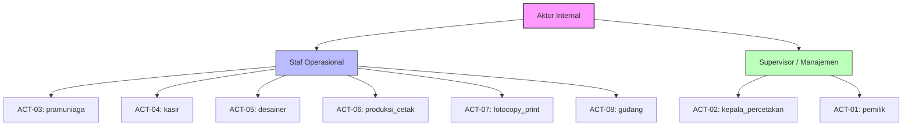

---

## 3. System Boundary dan Daftar Use Case

### 3.1. Definisi System Boundary
Batas sistem (*System Boundary*) dalam proyek ini didefinisikan secara ketat pada aplikasi **AbuCom CLI**. 

*   **Di Dalam Batas Sistem**: Seluruh logika eksekusi *pure functions* Python klien kasir, state session JWT runtime, modul parsing input teks CLI terminal, log transaksi lokal, dan koneksi transaksional database MySQL Server lokal (Debian 12) melalui topologi jaringan LAN fisik toko.
*   **Di Luar Batas Sistem**: Sistem operasi Windows 11/Debian 12, jaringan kabel LAN fisik UTP Cat6, perangkat keras UPS, printer thermal fisik kasir, browser Google Chrome (WhatsApp Web), serta portal mobile banking/perangkat fisik Agen Bank eksternal.

### 3.2. Master Daftar Use Case

Tabel di bawah memetakan seluruh 44 Use Case (UC-001 s.d UC-044) yang terbagi dalam 10 Modul Fungsional AbuCom ditambah 4 Use Case Dasar Operasional Sistem.

| UC-ID | Nama Use Case | Modul | Aktor Primer | Aktor Sekunder | Prioritas | Derivasi BRD | Derivasi SRS |
|---|---|---|---|---|---|---|---|
| **UC-001** | Mencatat Transaksi Penjualan Multi-Divisi | M.1 | `pramuniaga`, `kasir`, `fotocopy_print` | `pemilik` | High | BR-F-01 | SRS-F-001 |
| **UC-002** | Mengubah Skema Harga Otomatis | M.1 | `pramuniaga`, `kasir` | - | High | BR-F-02 | SRS-F-002 |
| **UC-003** | Mengelola Pembayaran Uang Muka (DP) & Pelunasan | M.1 | `kasir` | - | High | BR-F-03 | SRS-F-003 |
| **UC-004** | Memproses Pembatalan Transaksi & Retur Barang | M.1 | `kasir` | `pemilik` | High | BR-F-04 | SRS-F-004 |
| **UC-005** | Melacak Margin Keuntungan per Produk | M.1 | `pemilik` | - | Medium | BR-F-05 | SRS-F-005 |
| **UC-006** | Mengekspor Struk Nota format Thermal | M.1 | `kasir`, `pemilik` | - | Medium | BR-F-06 | SRS-F-006 |
| **UC-007** | Menghitung HPP Otomatis Berbasis BOM Desimal | M.2 | `produksi_cetak`, `pemilik` | - | High | BR-F-07 | SRS-F-007 |
| **UC-008** | Mencatat Limbah Produksi (Waste Management) | M.2 | `produksi_cetak` | - | High | BR-F-08 | SRS-F-008 |
| **UC-009** | Mengelola Satuan & Atribut Barang (Unit of Measure) | M.2 | `gudang`, `produksi_cetak` | - | High | BR-F-09 | SRS-F-009 |
| **UC-010** | Sinkronisasi Pengambilan ATK untuk Produksi Internal | M.2 | `gudang`, `produksi_cetak` | - | Medium | BR-F-10 | SRS-F-010 |
| **UC-011** | Memproses Rekonsiliasi Stok (Stock Opname) | M.2 | `gudang` | `kepala_percetakan` | High | BR-F-11 | SRS-F-011 |
| **UC-012** | Menganalisis Prediksi Re-Order Stok Bahan Baku | M.2 | `gudang`, `kepala_percetakan` | - | High | BR-F-12 | SRS-F-012 |
| **UC-013** | Melacak Riwayat Harga Beli Supplier (Price Tracking) | M.2 | `gudang` | - | Medium | BR-F-13 | SRS-F-013 |
| **UC-014** | Mengimpor Data Awal dari CSV Semiautomatis | M.2 | `pemilik`, `gudang` | - | High | BR-F-14 | SRS-F-014 |
| **UC-015** | Mengelola Data Supplier & Mencatat Utang Usaha | M.2 | `gudang` | `kepala_percetakan` | High | BR-F-40 | SRS-F-040 |
| **UC-016** | Melakukan Backup & Restore Database Manual | M.2 | `pemilik` | - | High | BR-F-39 | SRS-F-039 |
| **UC-017** | Mengelola Saldo PPOB & Alert Deposit | M.3 | `kasir` | - | High | BR-F-15 | SRS-F-015 |
| **UC-018** | Menentukan Akun Jasa Keuangan Terhemat (6 Akun) | M.3 | `kasir` | - | High | BR-F-16 | SRS-F-016 |
| **UC-019** | Mencatat Transaksi Jasa Service & Teknisi | M.3 | `pramuniaga`, `kasir` | - | High | BR-F-17 | SRS-F-017 |
| **UC-020** | Mengelola Data Karyawan, Absensi, dan Kasbon | M.4 | `kepala_percetakan`, `pemilik` | - | High | BR-F-18 | SRS-F-018 |
| **UC-021** | Memproses Penggajian Cerdas (Smart Payroll) | M.4 | `pemilik` | - | High | BR-F-19 | SRS-F-019 |
| **UC-022** | Mengakumulasi Poin Insentif Karyawan | M.4 | `kasir`, `pemilik` | - | High | BR-F-20 | SRS-F-020 |
| **UC-023** | Memotong Gaji Otomatis atas Kasbon Aktif | M.4 | `pemilik` | - | High | BR-F-21 | SRS-F-021 |
| **UC-024** | Melacak Status Antrian Pekerjaan (Job Tracking) | M.5 | `pramuniaga`, `desainer`, `produksi_cetak`, `kasir` | - | High | BR-F-22 | SRS-F-022 |
| **UC-025** | Mengelola Arsip Desain Pelanggan | M.5 | `desainer`, `pramuniaga` | - | Medium | BR-F-23 | SRS-F-023 |
| **UC-026** | Membuat Link Notifikasi WhatsApp | M.5 | `pramuniaga`, `kasir` | - | Medium | BR-F-24 | SRS-F-024 |
| **UC-027** | Mengelola Pinjaman Modal Terstruktur (Bank & Keluarga) | M.6 | `pemilik` | - | High | BR-F-25 | SRS-F-025 |
| **UC-028** | Melihat Laporan Laba/Rugi Instan per Divisi | M.6 | `pemilik` | - | High | BR-F-26 | SRS-F-026 |
| **UC-029** | Menerima Notifikasi Jatuh Tempo Utang H-3 | M.6 | `pemilik` | - | High | BR-F-27 | SRS-F-027 |
| **UC-030** | Mengelola Aset Tetap, Depresiasi, dan Tabungan | M.6 | `pemilik` | - | Medium | BR-F-28 | SRS-F-028 |
| **UC-031** | Mengelola Pengeluaran Rutin & Biaya Tak Terduga | M.6 | `pemilik`, `kepala_percetakan` | - | Medium | BR-F-29 | SRS-F-029 |
| **UC-032** | Mengakses Menu Berdasarkan RBAC Multi-Level | M.7 | Semua Aktor | - | High | BR-F-30 | SRS-F-030 |
| **UC-033** | Mengaudit Modifikasi Data Melalui Log Audit JSON | M.7 | `pemilik` | - | High | BR-F-31 | SRS-F-031 |
| **UC-034** | Melakukan Serah Terima Shift Karyawan | M.7 | `kasir` | `kepala_percetakan` | Medium | BR-F-32 | SRS-F-032 |
| **UC-035** | Melakukan Rekonsiliasi Kas Harian | M.7 | `kasir` | - | High | BR-F-33 | SRS-F-033 |
| **UC-036** | Memantau Peringatan Anomali Transaksi (Fraud Detection) | M.7 | `pemilik` | - | High | BR-F-34 | SRS-F-034 |
| **UC-037** | Menginput Data Awal secara Manual dari Excel (Setup) | M.7 | `pemilik`, `gudang` | - | High | BR-F-35 | SRS-F-035 |
| **UC-038** | Mengelola Database CRM & Riwayat Pelanggan | M.8 | `pramuniaga`, `kasir`, `pemilik` | - | Medium | BR-F-36 | SRS-F-036 |
| **UC-039** | Menerapkan Identifikasi Multi-Cabang | M.9 | `pemilik` | - | High | BR-F-37 | SRS-F-037 |
| **UC-040** | Mengonfigurasi Parameter Bisnis Runtime | M.10 | `pemilik` | - | High | BR-F-38 | SRS-F-038 |
| **UC-041** | Melakukan Login ke Sistem | Dasar | Semua Aktor | - | High | Tambahan | Tambahan |
| **UC-042** | Melakukan Logout dari Sistem | Dasar | Semua Aktor | - | High | Tambahan | Tambahan |
| **UC-043** | Melihat Dashboard Ringkasan Harian (Dashboard Utama) | Dasar | Semua Aktor | - | High | Tambahan | Tambahan |
| **UC-044** | Mengubah Password Akun Sendiri | Dasar | Semua Aktor | - | Medium | Tambahan | Tambahan |

---

## 4. Use Case Diagram (Visual Mermaid)

### 4.1. Diagram Use Case Utama — Keseluruhan Sistem
Diagram overview ini menggambarkan relasi antara seluruh aktor (internal dan eksternal) dengan sub-modul fungsional yang berada di dalam System Boundary AbuCom CLI.

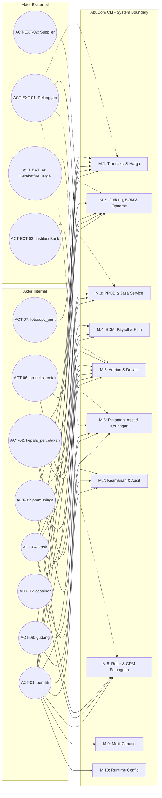

---

### 4.2. Diagram Use Case per Modul

#### 4.2.1. Modul M.1 — Manajemen Transaksi & Kebijakan Harga
Modul ini berfokus pada pelayanan penjualan kasir, pembagian skema harga, pembayaran DP/pelunasan, dan pembatalan transaksi.

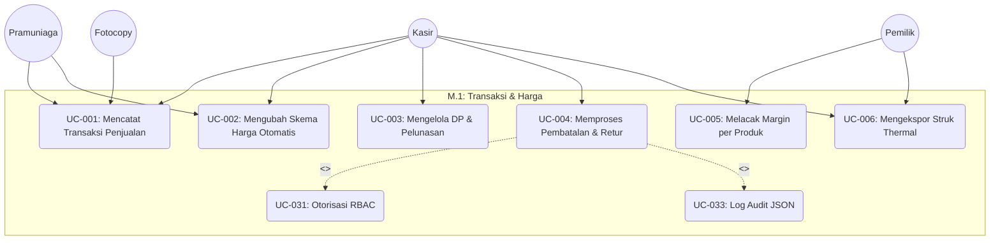

#### 4.2.2. Modul M.2 — Manajemen Inventaris, BOM & Stock Opname
Modul ini menangani pengelolaan stok, pecahan desimal UoM, HPP berbasis BOM, limbah, opname fisik, price tracking supplier, dan backup basis data.

```mermaid
graph TB
    subgraph M.2: Gudang, BOM & Opname
        UC007("UC-007: Menghitung HPP BOM Desimal")
        UC008("UC-008: Mencatat Limbah Produksi")
        UC009("UC-009: Mengelola Satuan & UoM")
        UC010("UC-010: Sinkronisasi Pengambilan ATK Internal")
        UC011("UC-011: Memproses Rekonsiliasi Stok (Stock Opname)")
        UC012("UC-012: Menganalisis Prediksi Re-Order")
        UC013("UC-013: Melacak Riwayat Harga Supplier")
        UC014("UC-014: Mengimpor Data CSV Semiautomatis")
        UC015("UC-015: Mengelola Supplier & Utang")
        UC016("UC-016: Backup & Restore DB Manual")
        
        UC011 -.->|"<<include>>"| UC031("UC-031: Otorisasi RBAC")
        UC011 -.->|"<<include>>"| UC033("UC-033: Log Audit JSON")
    end

    gudang((Staf Gudang)) --> UC009 & UC010 & UC011 & UC012 & UC013 & UC014 & UC015
    produksi_cetak((Produksi)) --> UC007 & UC008 & UC009 & UC010
    kepala_percetakan((Kepala Percetakan)) --> UC011 & UC012 & UC015
    pemilik((Pemilik)) --> UC007 & UC014 & UC016
```

#### 4.2.3. Modul M.3 — Layanan Keuangan Digital, PPOB & Jasa Service
Modul ini menangani pencatatan saldo digital PPOB, optimasi komisi transfer antar bank, dan data perbaikan unit laptop/printer pelanggan.

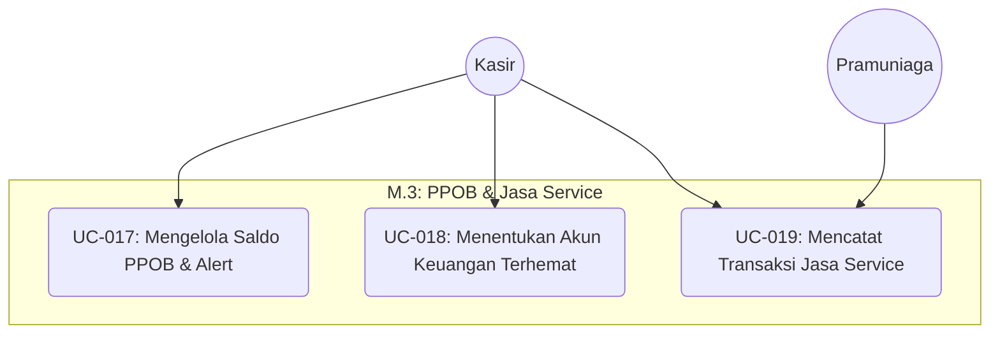

#### 4.2.4. Modul M.4 — Manajemen SDM, Penggajian & Poin Karyawan
Modul ini mencakup administrasi keaktifan staf, presensi kehadiran, komisi bonus poin per transaksi, payroll cerdas, dan potongan kasbon otomatis.

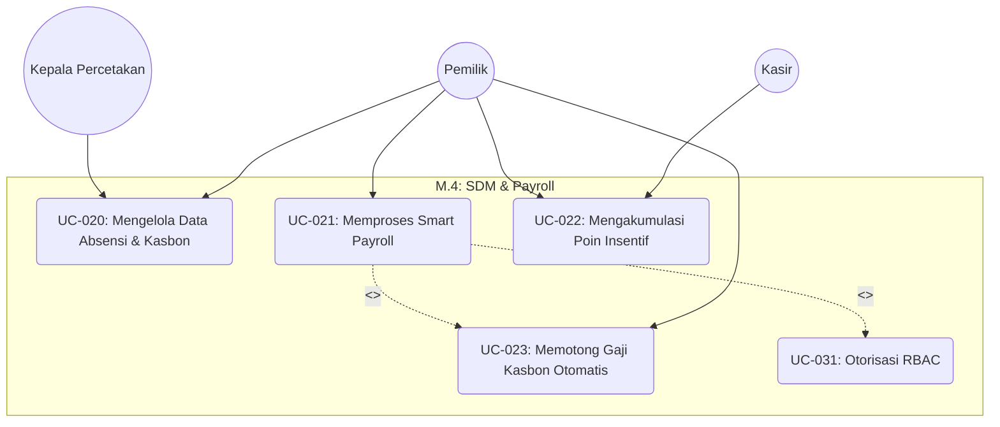

#### 4.2.5. Modul M.5 — Sistem Manajemen Antrian & Pelacakan Desain
Modul ini berfokus pada pelacakan status produksi (job tracking 5 tahapan), penautan path direktori file desain, dan tautan ringkas salin WhatsApp.

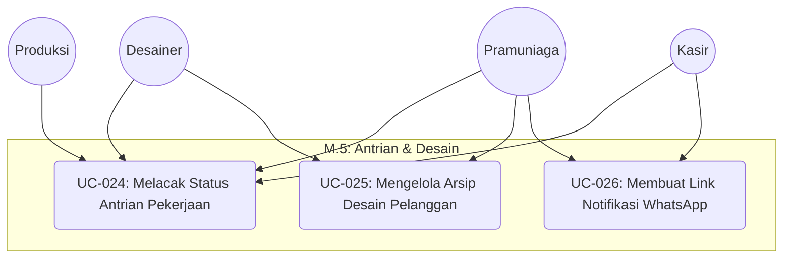

#### 4.2.6. Modul M.6 — Administrasi Pinjaman, Aset & Pengeluaran
Modul ini mencakup administrasi pinjaman bank (berbunga) dan keluarga (bebas bunga), penyusutan garis lurus aset fisik, tabungan virtual pengadaan, pengeluaran rutin, dan profitabilitas laba/rugi instan.

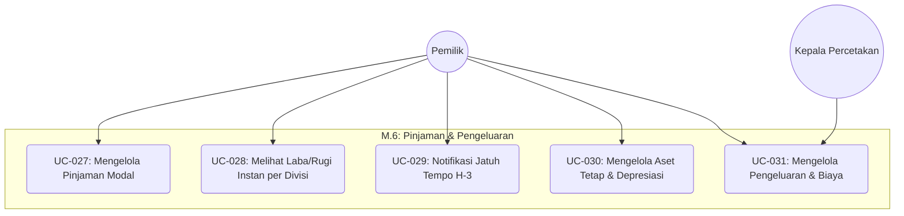

#### 4.2.7. Modul M.7 — Keamanan, Audit Trail & Hak Akses
Modul ini mencakup pengamanan sistem berbasis login otentikasi bcrypt, stateless session JWT, pembatasan RBAC, Audit Trail log format JSON, serah terima shift kasir, dan rekonsiliasi kasir laci fisik harian.

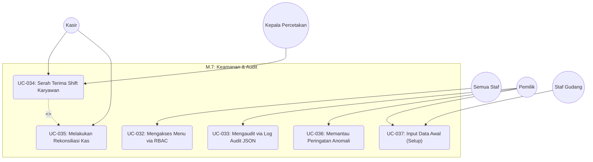

#### 4.2.8. Modul M.8 — Pembatalan, Retur & CRM Pelanggan
Modul ini menangani pencatatan nomor WhatsApp pelanggan terenkripsi, riwayat transaksi lampau, dan pemrosesan CRM sesuai UU PDP No. 27/2022.

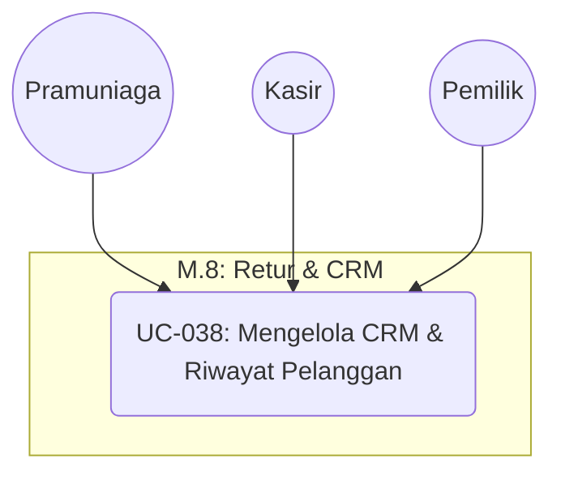

#### 4.2.9. Modul M.9 — Skalabilitas Multi-Cabang
Modul ini menjamin rancangan basis data MySQL memiliki kolom foreign key `cabang_id` di setiap tabel transaksi utama untuk mendukung ekspansi multi-cabang terpusat di masa depan.

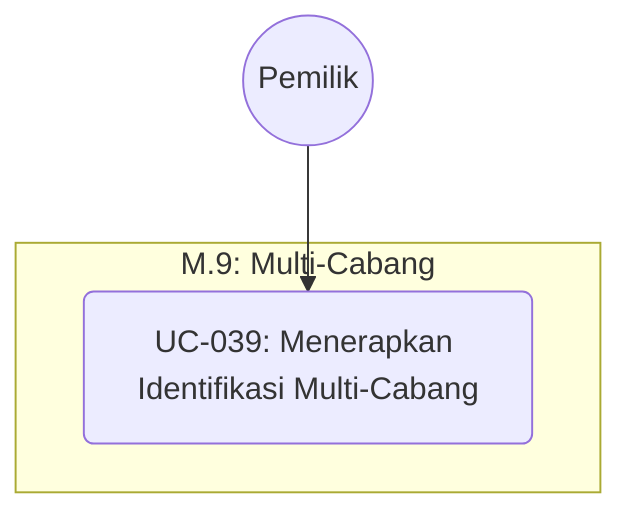

#### 4.2.10. Modul M.10 — Konfigurasi Sistem Runtime
Modul ini memfasilitasi parameterisasi regulasi bisnis dinamis di database `system_configs` sehingga pemilik dapat mengubah ambang batas kas bon, target gaji, toleransi selisih kas, dan komisi poin tanpa menyentuh kode Python.

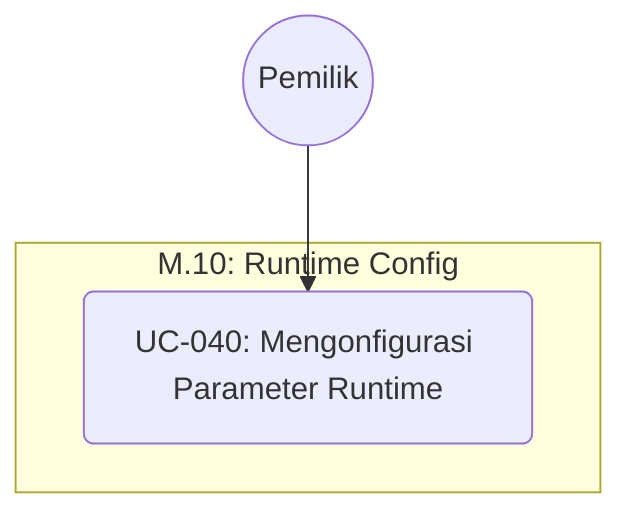

---

## 5. Spesifikasi Naratif Use Case (Use Case Description)

### 5.1. Konvensi Penulisan
Setiap spesifikasi naratif use case ditulis mengikuti kaidah Dialog Interaktif berurutan (Main Flow) yang menggambarkan aksi input aktor pada terminal teks kasir dan respons luaran teks terstruktur dari sistem CLI. Penanganan kesalahan dan verifikasi sandi dituliskan eksplisit pada bagian Exception Flow dengan mereferensikan kode error SRS v1.1.

---

### 5.2. Spesifikasi Use Case per Modul

#### UC-001: Mencatat Transaksi Penjualan Multi-Divisi
| Atribut | Nilai |
|---|---|
| **UC-ID** | UC-001 |
| **Nama Use Case** | Mencatat Transaksi Penjualan Multi-Divisi |
| **Derivasi** | BR-F-01 / SRS-F-001 |
| **Modul** | M.1 — Manajemen Transaksi & Kebijakan Harga |
| **Prioritas** | High |
| **Aktor Primer** | `pramuniaga`, `kasir`, `fotocopy_print` |
| **Aktor Sekunder** | `pemilik` (Verifikasi jika retur/batal) |
| **Deskripsi Singkat** | Mencatat transaksi penjualan dari 5 divisi toko (cetak kustom, retail ATK, PPOB, jasa transfer, service) ke dalam database secara terpadu. |
| **Prakondisi (Precondition)** | Aktor telah berhasil login dan session JWT kasir aktif. |
| **Pemicu (Trigger)** | Aktor memilih menu "Mencatat Transaksi Baru" di terminal kasir CLI. |
| **Alur Utama (Main Flow)** | 1. Aktor memilih tipe pelanggan ('Retail', 'Grosir', 'Mitra').<br>2. Sistem menampilkan formulir input penambahan barang/jasa.<br>3. Aktor memasukkan ID Barang/Jasa dan Kuantitas pemesanan.<br>4. Sistem melakukan lookup harga barang, mengevaluasi aturan harga dinamis (UC-002), menghitung subtotal desimal presisi fixed-point.<br>5. Aktor dapat mengulangi langkah 3 untuk menambah item lainnya.<br>6. Aktor menyelesaikan input dan memilih metode pembayaran ('Kas', 'QRIS', 'Transfer').<br>7. Sistem menghitung total belanja, menyimpan record transaksi ke tabel `transaksi` secara ACID, mengurangi stok barang retail, dan memproses komisi poin staf (UC-022).<br>8. Sistem menampilkan ringkasan nota transaksi di layar terminal CLI. |
| **Alur Alternatif (Alternative Flow)** | **A1. Transaksi Cetak Kustom**: Pada langkah 3, jika barang merupakan produk kustom, sistem memicu perhitungan HPP berbasis komposisi bahan desimal (UC-007) dan mendaftarkan status pesanan ke antrian `Antri` di modul Job Tracking (UC-024). |
| **Alur Pengecualian (Exception Flow)** | **E1. ERR-DB-001 (Koneksi Terputus)**: Jika koneksi MySQL terputus saat menyimpan data, sistem melakukan rollback transaksi, menampilkan pesan kegagalan, dan mencatat log lokal.<br>**E2. ERR-STOCK-010 (Stok Kurang)**: Jika stok retail ATK tidak mencukupi kuantitas pembelian, sistem menampilkan peringatan stok kurang, menolak item, dan meminta aktor mengulang input. |
| **Pasca-Kondisi (Postcondition)** | Record transaksi tersimpan permanen di database, stok berkurang, dan laci uang kasir fisik bertambah (jika metode pembayaran Kas). |
| **Aturan Bisnis Terkait** | Penyimpanan wajib menyertakan: ID User aktif, ID Cabang default (1), timestamp, subtotal desimal, dan metode pembayaran. |
| **Catatan Khusus** | Kalkulasi matematika wajib memanfaatkan library `decimal` Python. |

#### UC-002: Mengubah Skema Harga Otomatis
| Atribut | Nilai |
|---|---|
| **UC-ID** | UC-002 |
| **Nama Use Case** | Mengubah Skema Harga Otomatis |
| **Derivasi** | BR-F-02 / SRS-F-002 |
| **Modul** | M.1 — Manajemen Transaksi & Kebijakan Harga |
| **Prioritas** | High |
| **Aktor Primer** | `pramuniaga`, `kasir` |
| **Aktor Sekunder** | - |
| **Deskripsi Singkat** | Menentukan dan menyesuaikan tarif harga jual barang retail per unit secara otomatis berdasarkan tipe pelanggan dan kuantitas barang yang dibeli. |
| **Prakondisi (Precondition)** | Transaksi baru sedang diproses di kasir (UC-001). |
| **Pemicu (Trigger)** | Aktor menginput barang atau mengubah tipe pelanggan di terminal kasir. |
| **Alur Utama (Main Flow)** | 1. Sistem menerima input ID Barang dan Kuantitas.<br>2. Sistem melakukan query ke tabel `barang` untuk mengambil harga retail, grosir, mitra, dan batas kuantitas minimum grosir (`min_grosir`).<br>3. Jika tipe pelanggan adalah 'Mitra', sistem menetapkan tarif = `harga_mitra`.<br>4. Jika tipe pelanggan adalah 'Grosir' ATAU kuantitas belanja &ge; `min_grosir`, sistem menetapkan tarif = `harga_grosir`.<br>5. Selain kondisi di atas, sistem menerapkan tarif standar = `harga_retail`.<br>6. Sistem mengembalikan nilai tarif terpilih ke alur transaksi kasir. |
| **Alur Alternatif (Alternative Flow)** | - |
| **Alur Pengecualian (Exception Flow)** | **E1. ERR-VAL-002 (Data Harga NULL)**: Jika harga di database bernilai NULL, sistem menampilkan alert error, menolak penambahan barang, dan meminta pemilik mengkonfigurasi harga. |
| **Pasca-Kondisi (Postcondition)** | Tarif per unit terpilih secara dinamis dan presisi desimal tanpa campur tangan manual kasir. |
| **Aturan Bisnis Terkait** | Penentuan harga bersifat terenkapsulasi sebagai pure function tanpa efek samping status program. |
| **Catatan Khusus** | Menjamin tidak ada manipulasi data harga dinamis di tingkat kode hardcode. |

#### UC-003: Mengelola Pembayaran Uang Muka (DP) & Pelunasan
| Atribut | Nilai |
|---|---|
| **UC-ID** | UC-003 |
| **Nama Use Case** | Mengelola Pembayaran Uang Muka (DP) & Pelunasan |
| **Derivasi** | BR-F-03 / SRS-F-003 |
| **Modul** | M.1 — Manajemen Transaksi & Kebijakan Harga |
| **Prioritas** | High |
| **Aktor Primer** | `kasir` |
| **Aktor Sekunder** | - |
| **Deskripsi Singkat** | Memproses transaksi pesanan cetak kustom dengan skema bayar uang muka (DP) dan pencatatan sisa tagihan pelunasan saat pengambilan barang. |
| **Prakondisi (Precondition)** | Transaksi penjualan produk kustom sedang di-input dan terdaftar (UC-001). |
| **Pemicu (Trigger)** | Aktor memilih opsi "Pembayaran Bertahap" di menu kasir CLI. |
| **Alur Utama (Main Flow)** | 1. Aktor menginput nominal Rupiah uang muka (`dp_bayar`).<br>2. Jika `dp_bayar < total_bayar`, sistem menandai kolom status pembayaran sebagai `'BELUM LUNAS'`.<br>3. Sistem menyimpan transaksi, menambahkan nominal DP ke saldo laci kasir aktif, dan mencetak nota tanda DP.<br>4. **Proses Pelunasan**: Aktor mencari ID Transaksi belum lunas saat pelanggan datang mengambil barang.<br>5. Sistem menampilkan sisa tagihan: `sisa_tagihan = total_bayar - dp_bayar`.<br>6. Aktor menginput nominal uang pelunasan dari pelanggan.<br>7. Sistem memperbarui status pembayaran menjadi `'LUNAS'`, status pengambilan menjadi `'DIAMBIL'`, mencetak nota lunas, dan mencatatkan kas masuk pelunasan. |
| **Alur Alternatif (Alternative Flow)** | **A1. DP 100% (Lunas di Awal)**: Jika kasir memasukkan nominal DP sama dengan total bayar, sistem langsung menetapkan status pembayaran `'LUNAS'` dan status pengambilan `'BELUM DIAMBIL'`. |
| **Alur Pengecualian (Exception Flow)** | **E1. ERR-VAL-003 (Pembayaran Kurang)**: Jika uang pelunasan yang diinput kasir kurang dari sisa tagihan, sistem menolak pembaruan data, memancarkan peringatan nominal sisa, dan membatalkan proses pelunasan. |
| **Pasca-Kondisi (Postcondition)** | Status pembayaran terupdate menjadi 'LUNAS' di MySQL database, dan saldo kas bertambah. |
| **Aturan Bisnis Terkait** | Nominal DP minimal diatur sebesar Rp 0 (fleksibel). |
| **Catatan Khusus** | Sisa tagihan dihitung secara transaksional aman guna mencegah manipulasi angka sisa utang pelanggan. |

#### UC-004: Memproses Pembatalan Transaksi & Retur Barang
| Atribut | Nilai |
|---|---|
| **UC-ID** | UC-004 |
| **Nama Use Case** | Memproses Pembatalan Transaksi & Retur Barang |
| **Derivasi** | BR-F-04 / SRS-F-004 |
| **Modul** | M.1 — Manajemen Transaksi & Kebijakan Harga |
| **Prioritas** | High |
| **Aktor Primer** | `kasir` |
| **Aktor Sekunder** | `pemilik` (Otorisasi sandi supervisor) |
| **Deskripsi Singkat** | Membatalkan transaksi pesanan belum lunas (DP dikembalikan) atau memproses retur barang retail rusak dengan pengembalian stok & pemotongan kas. |
| **Prakondisi (Precondition)** | Transaksi yang dimaksud sudah terdaftar di database MySQL. |
| **Pemicu (Trigger)** | Aktor memilih opsi "Pembatalan/Retur Transaksi" di terminal kasir CLI. |
| **Alur Utama (Main Flow)** | 1. Aktor memasukkan ID Transaksi.<br>2. Sistem menampilkan detail item transaksi di layar.<br>3. Aktor memilih jenis aksi: 'Pembatalan' (DP kembali) atau 'Retur Barang'.<br>4. Sistem meminta otentikasi kata sandi supervisor (`pemilik`).<br>5. Aktor Pemilik memasukkan kata sandi di terminal CLI kasir.<br>6. **Skenario Pembatalan**: Sistem mengubah status transaksi menjadi `'BATAL'`, memotong saldo kas laci aktif sebesar DP transaksi terkait, dan menyimpan rekam modifikasi di log audit JSON (UC-033).<br>7. **Skenario Retur**: Aktor memasukkan ID Barang dan kuantitas retur. Sistem menambahkan stok barang di gudang secara otomatis, memotong saldo kas kasir aktif sebesar harga jual retur, mengubah status transaksi menjadi `'RETUR'`, dan menyimpan log audit. |
| **Alur Alternatif (Alternative Flow)** | - |
| **Alur Pengecualian (Exception Flow)** | **E1. ERR-AUTH-011 (Sandi Salah)**: Jika kata sandi pemilik salah, sistem membatalkan proses pembatalan/retur dan mengunci menu.<br>**E2. ERR-CASH-004 (Kas Kurang)**: Jika saldo laci kas kasir aktif tidak mencukupi untuk mengembalikan uang retur, sistem membatalkan proses dan menampilkan alert. |
| **Pasca-Kondisi (Postcondition)** | Status transaksi terupdate di MySQL, stok gudang bertambah (jika retur), kas kasir berkurang, dan log Audit Trail tersimpan. |
| **Aturan Bisnis Terkait** | Kasir mutlak dilarang menyetujui pembatalan/retur tanpa otorisasi langsung dari pemilik. |
| **Catatan Khusus** | Proses dibungkus dalam blok transaksi tunggal MySQL (Isolation Level: Repeatable Read). |

#### UC-005: Melacak Margin Keuntungan per Produk
| Atribut | Nilai |
|---|---|
| **UC-ID** | UC-005 |
| **Nama Use Case** | Melacak Margin Keuntungan per Produk |
| **Derivasi** | BR-F-05 / SRS-F-005 |
| **Modul** | M.1 — Manajemen Transaksi & Kebijakan Harga |
| **Prioritas** | Medium |
| **Aktor Primer** | `pemilik` |
| **Aktor Sekunder** | - |
| **Deskripsi Singkat** | Menghitung dan menampilkan persentase margin keuntungan kotor untuk setiap produk retail atau jasa cetak kustom di toko. |
| **Prakondisi (Precondition)** | Aktor login dengan level `pemilik`. |
| **Pemicu (Trigger)** | Pemilik memilih menu "Laporan Margin Keuntungan Produk" di terminal CLI. |
| **Alur Utama (Main Flow)** | 1. Sistem membaca daftar harga jual dan HPP (Harga Pokok Penjualan berbasis komposisi BOM) setiap item dari database.<br>2. Sistem melakukan kalkulasi margin kotor untuk setiap produk menggunakan rumus: `Margin = ((Harga Jual - HPP) / Harga Jual) * 100`.<br>3. Sistem mengurutkan hasil berdasarkan persentase margin terbesar.<br>4. Sistem menampilkan tabel tabular margin produk di layar CLI. |
| **Alur Alternatif (Alternative Flow)** | **A1. Filter Produk**: Pemilik dapat memasukkan parameter nama produk atau kategori untuk memfilter hasil secara spesifik. |
| **Alur Pengecualian (Exception Flow)** | **E1. ERR-VAL-005 (Division by Zero)**: Jika terdapat barang dengan harga jual Rp 0, sistem menangkap perkecualian, menetapkan margin = 0.00% secara aman, dan melanjutkan iterasi. |
| **Pasca-Kondisi (Postcondition)** | Pemilik mendapat data profitabilitas margin produk secara real-time. |
| **Aturan Bisnis Terkait** | Metrik Margin keuntungan kotor hanya diizinkan diakses oleh level pemilik (RBAC). |
| **Catatan Khusus** | Kalkulasi matematika wajib memanfaatkan library `decimal` Python. |

#### UC-006: Mengekspor Struk Nota format Thermal
| Atribut | Nilai |
|---|---|
| **UC-ID** | UC-006 |
| **Nama Use Case** | Mengekspor Struk Nota format Thermal |
| **Derivasi** | BR-F-06 / SRS-F-006 |
| **Modul** | M.1 — Manajemen Transaksi & Kebijakan Harga |
| **Prioritas** | Medium |
| **Aktor Primer** | `kasir`, `pemilik` |
| **Aktor Sekunder** | - |
| **Deskripsi Singkat** | Mengekspor data nota transaksi harian kasir menjadi format plain text (.txt) dengan ukuran kolom terformat rapi untuk dicetak langsung ke printer thermal 58mm/80mm. |
| **Prakondisi (Precondition)** | Transaksi belanja berhasil dicatat di basis data (UC-001). |
| **Pemicu (Trigger)** | Aktor memilih opsi "Cetak Struk Nota" setelah transaksi selesai. |
| **Alur Utama (Main Flow)** | 1. Aktor memilih ukuran kertas printer thermal ('58mm' atau '80mm').<br>2. Sistem melakukan query detail transaksi berdasarkan ID Transaksi.<br>3. Sistem menjalankan formatting layout string teks:<br>   - Lebar kertas 32 karakter (58mm) atau 48 karakter (80mm).<br>   - Nama toko, alamat default, kasir di posisi tengah.<br>   - Pembungkusan string nama item belanja jika melebihi batas kolom.<br>   - Penyejajaran nominal subtotal rata kanan.<br>4. Sistem menyimpan output string sebagai file `.txt` di folder lokal `/exports/receipts/`.<br>5. Sistem menampilkan struk visual teks di terminal kasir. |
| **Alur Alternatif (Alternative Flow)** | - |
| **Alur Pengecualian (Exception Flow)** | **E1. ERR-SYS-006 (Gagal Tulis Berkas)**: Jika folder tujuan terkunci oleh sistem operasi, sistem menangkap error, menampilkan pesan kegagalan penulisan file, dan mencatat log kejadian. |
| **Pasca-Kondisi (Postcondition)** | Berkas teks nota thermal berhasil di-generate secara eksternal. |
| **Aturan Bisnis Terkait** | Format teks plain text (.txt) menggunakan standar encoding UTF-8. |
| **Catatan Khusus** | Menjamin tidak ada data visual teks terpotong kasar saat dicetak ke kertas thermal fisik. |

#### UC-007: Menghitung HPP Otomatis Berbasis BOM Desimal
| Atribut | Nilai |
|---|---|
| **UC-ID** | UC-007 |
| **Nama Use Case** | Menghitung HPP Otomatis Berbasis BOM Desimal |
| **Derivasi** | BR-F-07 / SRS-F-007 |
| **Modul** | M.2 — Manajemen Inventaris, BOM & Stock Opname |
| **Prioritas** | High |
| **Aktor Primer** | `produksi_cetak`, `pemilik` |
| **Aktor Sekunder** | - |
| **Deskripsi Singkat** | Menghitung Harga Pokok Penjualan (HPP) produk cetak kustom secara otomatis berdasarkan jumlahan pemakaian bahan baku desimal presisi (panjang x lebar / volume desimal). |
| **Prakondisi (Precondition)** | Data komposisi bahan produk kustom (Bill of Materials) sudah terdaftar di database. |
| **Pemicu (Trigger)** | Staf produksi memproses status pesanan kustom menjadi selesai di terminal CLI (UC-024). |
| **Alur Utama (Main Flow)** | 1. Sistem mendeteksi ID Pesanan kustom yang diselesaikan.<br>2. Sistem mengambil data komposisi bahan baku (BOM) produk terkait dari tabel database.<br>3. Sistem mengambil data harga beli bahan baku terbaru dari database master.<br>4. Sistem menghitung biaya komponen bahan: `Biaya Komponen = kuantitas_pemakaian * harga_beli_satuan` (menggunakan presisi `decimal` 4 digit di belakang koma).<br>5. Sistem menjumlahkan seluruh biaya komponen bahan untuk menetapkan HPP dasar.<br>6. Sistem mencatat nilai HPP tersebut ke dalam baris detail transaksi MySQL.<br>7. Sistem mengurangi sisa stok bahan baku desimal di gudang basis data. |
| **Alur Alternatif (Alternative Flow)** | - |
| **Alur Pengecualian (Exception Flow)** | **E1. ERR-STOCK-EMPTY (Stok Kurang)**: Jika stok bahan baku kurang dari pemakaian riil desimal, sistem tetap menyelesaikan proses namun mencatatkan log stok minus di database dan menampilkan alert kuning peringatan re-order (UC-012). |
| **Pasca-Kondisi (Postcondition)** | HPP tersimpan presisi di database transaksional, persediaan bahan baku terpotong pecahan desimal. |
| **Aturan Bisnis Terkait** | Perhitungan matematika mutlak dilarang memanfaatkan tipe data floating-point standard bawaan komputer guna menghindari selisih pembulatan rupiah. |
| **Catatan Khusus** | Skema tabel persediaan menggunakan tipe data DECIMAL(15,4) di MySQL. |

#### UC-008: Mencatat Limbah Produksi (Waste Management)
| Atribut | Nilai |
|---|---|
| **UC-ID** | UC-008 |
| **Nama Use Case** | Mencatat Limbah Produksi (Waste Management) |
| **Derivasi** | BR-F-08 / SRS-F-008 |
| **Modul** | M.2 — Manajemen Inventaris, BOM & Stock Opname |
| **Prioritas** | High |
| **Aktor Primer** | `produksi_cetak` |
| **Aktor Sekunder** | - |
| **Deskripsi Singkat** | Mencatat kuantitas bahan baku yang rusak/cacat (limbah) selama pengerjaan produksi fisik ke sistem guna memotong stok dan membukukan biaya kerugian. |
| **Prakondisi (Precondition)** | Aktor login dengan level `produksi_cetak` dan pesanan kustom aktif. |
| **Pemicu (Trigger)** | Aktor memilih menu "Pencatatan Limbah Gagal Produksi" di terminal CLI. |
| **Alur Utama (Main Flow)** | 1. Aktor memasukkan ID Transaksi cetak kustom yang bermasalah.<br>2. Aktor memilih bahan baku yang rusak dari daftar komponen BOM.<br>3. Aktor menginput kuantitas bahan baku yang rusak (ukuran desimal panjang x lebar atau volume).<br>4. Aktor memasukkan alasan kegagalan (misal: "Salah cetak", "Mesin macet").<br>5. Sistem mengambil harga beli satuan bahan baku, menghitung biaya kerugian: `Biaya Kerugian = kuantitas_limbah * harga_beli_satuan`.<br>6. Sistem memotong kuantitas stok bahan baku di tabel persediaan database MySQL.<br>7. Sistem menyimpan log limbah ke tabel `limbah_produksi` dan mencatat biaya kerugian tersebut di tabel pengeluaran operasional. |
| **Alur Alternatif (Alternative Flow)** | - |
| **Alur Pengecualian (Exception Flow)** | **E1. ERR-VAL-008 (ID Bahan Tidak Valid)**: Jika ID bahan baku yang dimasukkan tidak cocok dengan komponen BOM pesanan terkait, sistem menolak penyimpanan dan memancarkan peringatan. |
| **Pasca-Kondisi (Postcondition)** | Catatan limbah tersimpan, sisa stok gudang terpotong akurat, dan nominal kerugian terdebit di laporan keuangan. |
| **Aturan Bisnis Terkait** | Limbah wajib dicatatkan untuk menjaga sinkronisasi akurasi stok gudang fisik toko. |
| **Catatan Khusus** | Kerugian dibukukan sebagai biaya pengeluaran operasional internal (OPEX). |

#### UC-009: Mengelola Satuan & Atribut Barang (Unit of Measure)
| Atribut | Nilai |
|---|---|
| **UC-ID** | UC-009 |
| **Nama Use Case** | Mengelola Satuan & Atribut Barang (Unit of Measure) |
| **Derivasi** | BR-F-09 / SRS-F-009 |
| **Modul** | M.2 — Manajemen Inventaris, BOM & Stock Opname |
| **Prioritas** | High |
| **Aktor Primer** | `gudang`, `produksi_cetak` |
| **Aktor Sekunder** | - |
| **Deskripsi Singkat** | Mendaftarkan dan mengonfigurasi variasi tipe satuan ukur (Rim, Lembar, Pcs, Ml, Meter Persegi) dan konversi stok desimal presisi tinggi di database. |
| **Prakondisi (Precondition)** | Aktor login dengan level `gudang` atau `produksi_cetak`. |
| **Pemicu (Trigger)** | Aktor memilih menu "Mengelola Satuan Barang (UoM)" di terminal CLI. |
| **Alur Utama (Main Flow)** | 1. Aktor memilih ID Barang/Bahan Baku.<br>2. Sistem menampilkan detail satuan UoM saat ini dan kuantitas stok.<br>3. Aktor memasukkan parameter satuan baru, atau mendefinisikan faktor konversi (misal: 1 Rim = 500 Lembar).<br>4. Sistem menyimpan konfigurasi satuan and faktor konversi tersebut ke tabel `satuan_barang` di MySQL. |
| **Alur Alternatif (Alternative Flow)** | **A1. Konversi Stok Masuk**: Gudang melakukan pembelian ATK eceran dalam partai besar (Rim), sistem mengonversi secara otomatis ke pecahan eceran (Lembar) di basis data. |
| **Alur Pengecualian (Exception Flow)** | **E1. ERR-INPUT-009 (Format Desimal Salah)**: Jika aktor memasukkan nilai konversi string huruf, sistem menolak input, menampilkan pesan error parsing desimal, dan meminta input angka valid. |
| **Pasca-Kondisi (Postcondition)** | Konversi UoM barang terdaftar, kuantitas stok dikelola dalam format pecahan desimal presisi tinggi. |
| **Aturan Bisnis Terkait** | Satuan barang di gudang disesuaikan dengan tipe divisi operasional. |
| **Catatan Khusus** | MySQL menggunakan DECIMAL(15,4) untuk menjaga konsistensi unit terkecil. |

#### UC-010: Sinkronisasi Pengambilan ATK untuk Produksi Internal
| Atribut | Nilai |
|---|---|
| **UC-ID** | UC-010 |
| **Nama Use Case** | Sinkronisasi Pengambilan ATK untuk Produksi Internal |
| **Derivasi** | BR-F-10 / SRS-F-010 |
| **Modul** | M.2 — Manajemen Inventaris, BOM & Stock Opname |
| **Prioritas** | Medium |
| **Aktor Primer** | `gudang`, `produksi_cetak` |
| **Aktor Sekunder** | - |
| **Deskripsi Singkat** | Mencatat pengambilan barang dagangan retail ATK toko untuk digunakan secara internal sebagai bahan penunjang produksi operasional toko. |
| **Prakondisi (Precondition)** | Aktor login dengan level `gudang` atau `produksi_cetak`. |
| **Pemicu (Trigger)** | Aktor memilih menu "Pengambilan ATK Operasional Internal" di terminal CLI. |
| **Alur Utama (Main Flow)** | 1. Aktor memasukkan ID Barang retail ATK dan kuantitas yang diambil.<br>2. Aktor memasukkan rincian tujuan pemakaian (misal: "1 rim kertas HVS untuk print nota").<br>3. Sistem memeriksa ketersediaan stok barang terkait.<br>4. Sistem memotong kuantitas stok barang retail: `stok_baru = stok_lama - kuantitas_ambil`.<br>5. Sistem mengambil harga beli barang (HPP retail) dari database.<br>6. Sistem membukukan pengeluaran internal: `Biaya Operasional = kuantitas_ambil * HPP_retail`.<br>7. Sistem mencatat transaksi ini di database pengeluaran operasional toko. |
| **Alur Alternatif (Alternative Flow)** | - |
| **Alur Pengecualian (Exception Flow)** | **E1. ERR-STOCK-010 (Stok Tidak Cukup)**: Jika kuantitas pengambilan melebihi sisa stok sistem, sistem menampilkan pesan error stok tidak mencukupi, menggagalkan pemotongan, dan kembali ke menu awal. |
| **Pasca-Kondisi (Postcondition)** | Stok retail ATK berkurang, pengeluaran operasional internal bertambah sesuai nilai modal (HPP) barang. |
| **Aturan Bisnis Terkait** | Pengambilan internal wajib dinilai berdasarkan modal HPP barang, bukan harga jual retail. |
| **Catatan Khusus** | Memastikan pembukuan laba rugi toko tetap akurat secara finansial. |

#### UC-011: Memproses Rekonsiliasi Stok (Stock Opname)
| Atribut | Nilai |
|---|---|
| **UC-ID** | UC-011 |
| **Nama Use Case** | Memproses Rekonsiliasi Stok (Stock Opname) |
| **Derivasi** | BR-F-11 / SRS-F-011 |
| **Modul** | M.2 — Manajemen Inventaris, BOM & Stock Opname |
| **Prioritas** | High |
| **Aktor Primer** | `gudang` |
| **Aktor Sekunder** | `kepala_percetakan` (Persetujuan otorisasi) |
| **Deskripsi Singkat** | Mencocokkan jumlah stok fisik barang/bahan di gudang toko secara langsung terhadap sisa stok di sistem, menghitung selisih, dan menyesuaikan database. |
| **Prakondisi (Precondition)** | Aktor login dengan level `gudang` dan master barang aktif. |
| **Pemicu (Trigger)** | Gudang memilih menu "Stock Opname Baru" di terminal CLI. |
| **Alur Utama (Main Flow)** | 1. Sistem membekukan manipulasi stok barang terpilih sementara.<br>2. Aktor memasukkan ID Barang dan jumlah kuantitas fisik riil.<br>3. Sistem mengambil data kuantitas stok sistem (`stok_sistem`) dari database.<br>4. Sistem menghitung selisih secara otomatis: `selisih = kuantitas_fisik - stok_sistem`.<br>5. Sistem menyimpan draf data stock opname dengan status `'DRAFT'`.<br>6. **Persetujuan**: Aktor supervisor membuka menu otorisasi opname di CLI.<br>7. Aktor supervisor mengotorisasi status menjadi `'APPROVED'`.<br>8. Sistem memperbarui data stok di tabel `barang` secara transaksional, melepas pembekuan stok, dan menyimpan entri Audit Trail JSON (UC-033). |
| **Alur Alternatif (Alternative Flow)** | **A1. Opname Sebagian**: Staf gudang dapat memfilter opname hanya pada kategori barang tertentu (misal: "Kertas Foto saja") agar operasional kasir divisi lain tidak terganggu. |
| **Alur Pengecualian (Exception Flow)** | **E1. ERR-AUTH-011 (Otorisasi Ditolak)**: Jika otorisasi persetujuan dilakukan oleh staf biasa (bukan supervisor), sistem menolak pembaruan data stok, membatalkan opname, dan mencatat log fraud. |
| **Pasca-Kondisi (Postcondition)** | Kuantitas stok di basis data selaras dengan kondisi fisik gudang riil, terdokumentasi di log audit. |
| **Aturan Bisnis Terkait** | Stock Opname wajib menyertakan identitas supervisor penyetuju secara eksplisit di database. |
| **Catatan Khusus** | Menggunakan tingkat isolasi REPEATABLE READ di MySQL InnoDB untuk mencegah *phantom reads*. |

#### UC-012: Menganalisis Prediksi Re-Order Stok Bahan Baku
| Atribut | Nilai |
|---|---|
| **UC-ID** | UC-012 |
| **Nama Use Case** | Menganalisis Prediksi Re-Order Stok Bahan Baku |
| **Derivasi** | BR-F-12 / SRS-F-012 |
| **Modul** | M.2 — Manajemen Inventaris, BOM & Stock Opname |
| **Prioritas** | High |
| **Aktor Primer** | `gudang`, `kepala_percetakan` |
| **Aktor Sekunder** | - |
| **Deskripsi Singkat** | Menganalisis tingkat konsumsi historis bahan baku secara bulanan untuk memproyeksikan sisa hari ketersediaan stok, memancarkan peringatan jika stok menipis sebelum 7 hari. |
| **Prakondisi (Precondition)** | Aktor login dan terdapat data transaksi konsumsi bahan baku historis di database. |
| **Pemicu (Trigger)** | Aktor membuka menu "Dashboard Inventaris & Logistik" di CLI. |
| **Alur Utama (Main Flow)** | 1. Sistem memproses query total pemakaian bahan baku selama 30 hari ke belakang dari data detail transaksi.<br>2. Sistem menghitung rata-rata pemakaian harian: `Rata-rata Harian = Total Pemakaian / 30`.<br>3. Sistem mengestimasi sisa hari ketersediaan: `Sisa Hari = Stok Saat Ini / Rata-rata Harian`.<br>4. Jika `Sisa Hari <= 7`, sistem menandai baris bahan baku tersebut dengan warna kuning (Peringatan Re-Order) atau merah (Kritis) di terminal CLI kasir. |
| **Alur Alternatif (Alternative Flow)** | - |
| **Alur Pengecualian (Exception Flow)** | **E1. NO-HISTORICAL-DATA (Data Kosong)**: Jika database transaksi kosong (toko baru), sistem menangkap kondisi ini, mengabaikan perhitungan prediksi, dan menampilkan status stok saat ini secara aman. |
| **Pasca-Kondisi (Postcondition)** | Aktor dibimbing notifikasi visual visual tentang daftar barang yang harus dibeli ke supplier. |
| **Aturan Bisnis Terkait** | Pemicu peringatan re-order berjalan otomatis pada tingkat runtime CLI. |
| **Catatan Khusus** | Menggunakan tag ANSI warna di terminal kasir melalui pustaka `rich` Python. |

#### UC-013: Melacak Riwayat Harga Beli Supplier (Price Tracking)
| Atribut | Nilai |
|---|---|
| **UC-ID** | UC-013 |
| **Nama Use Case** | Melacak Riwayat Harga Beli Supplier (Price Tracking) |
| **Derivasi** | BR-F-13 / SRS-F-013 |
| **Modul** | M.2 — Manajemen Inventaris, BOM & Stock Opname |
| **Prioritas** | Medium |
| **Aktor Primer** | `gudang` |
| **Aktor Sekunder** | - |
| **Deskripsi Singkat** | Merekam fluktuasi harga beli barang/bahan baku dari setiap supplier yang terdaftar setiap kali staf menginput transaksi pengadaan barang masuk. |
| **Prakondisi (Precondition)** | Aktor login sebagai `gudang` dan master supplier aktif di database (UC-015). |
| **Pemicu (Trigger)** | Staf gudang mencatatkan transaksi pasokan barang masuk baru dari supplier. |
| **Alur Utama (Main Flow)** | 1. Aktor menginput ID Barang, ID Supplier, kuantitas, dan harga beli baru.<br>2. Sistem membandingkan harga beli baru dengan harga beli historis di database.<br>3. Sistem menyimpan entri baru ke tabel `riwayat_harga_supplier` (mencakup: `barang_id`, `supplier_id`, `harga_beli_baru`, dan timestamp).<br>4. Sistem memperbarui harga beli standar (HPP) barang di database master.<br>5. Sistem menampilkan grafik tabel tren harga beli barang dari berbagai supplier di layar CLI. |
| **Alur Alternatif (Alternative Flow)** | - |
| **Alur Pengecualian (Exception Flow)** | **E1. ERR-VAL-013 (Supplier Tidak Terdaftar)**: Jika ID Supplier yang dimasukkan tidak valid, sistem menolak pencatatan harga, memancarkan error, dan meminta kasir meregistrasi supplier terlebih dahulu. |
| **Pasca-Kondisi (Postcondition)** | Riwayat harga beli supplier terekam kronologis, memfasilitasi pengambilan keputusan pengadaan paling murah. |
| **Aturan Bisnis Terkait** | Harga beli baru harus bernilai Rupiah positif &ge; Rp 0. |
| **Catatan Khusus** | Riwayat diurutkan berdasarkan tanggal terbaru (`DESC`) di terminal CLI. |

#### UC-014: Mengimpor Data Awal dari CSV Semiautomatis
| Atribut | Nilai |
|---|---|
| **UC-ID** | UC-014 |
| **Nama Use Case** | Mengimpor Data Awal dari CSV Semiautomatis |
| **Derivasi** | BR-F-14 / SRS-F-014 |
| **Modul** | M.2 — Manajemen Inventaris, BOM & Stock Opname |
| **Prioritas** | High |
| **Aktor Primer** | `pemilik`, `gudang` |
| **Aktor Sekunder** | - |
| **Deskripsi Singkat** | Mengimpor master data awal persediaan barang, supplier, dan daftar aset tetap secara massal dari file CSV hasil ekspor lembar Microsoft Excel lama pemilik usaha. |
| **Prakondisi (Precondition)** | Aktor meletakkan berkas `.csv` terformat bersih di direktori lokal toko server. |
| **Pemicu (Trigger)** | Aktor memicu skrip CLI utilitas import massal. |
| **Alur Utama (Main Flow)** | 1. Aktor memasukkan path relatif berkas `.csv` (misal: `exports/data_ATK.csv`).<br>2. Sistem membuka file, membaca baris data menggunakan modul bawaan `csv` Python dengan encoding UTF-8.<br>3. Sistem memvalidasi keselarasan struktur kolom dan membersihkan spasi data.<br>4. Sistem mengevaluasi dan mengabaikan baris data duplikat atau kolom kosong.<br>5. Sistem menyisipkan data secara massal (*bulk insert*) ke tabel database MySQL dalam satu transaksi InnoDB.<br>6. Sistem menyajikan ringkasan jumlah baris data yang berhasil dan gagal diimpor di layar CLI. |
| **Alur Alternatif (Alternative Flow)** | - |
| **Alur Pengecualian (Exception Flow)** | **E1. ERR-IMPORT-014 (Format Kolom Rusak)**: Jika format kolom CSV tidak sesuai standar skema database, sistem membatalkan seluruh proses import massal (rollback), menampilkan error, dan mencatat baris data yang bermasalah. |
| **Pasca-Kondisi (Postcondition)** | Database terisi massal dengan data master bersih dalam waktu pemrosesan cepat < 5 detik. |
| **Aturan Bisnis Terkait** | Fitur hanya dijalankan sekali pada masa inisiasi setup awal sistem baru. |
| **Catatan Khusus** | Menggunakan metode `cursor.executemany()` driver Python untuk kinerja tinggi. |

#### UC-015: Mengelola Data Supplier & Mencatat Utang Usaha
| Atribut | Nilai |
|---|---|
| **UC-ID** | UC-015 |
| **Nama Use Case** | Mengelola Data Supplier & Mencatat Utang Usaha |
| **Derivasi** | BR-F-40 / SRS-F-040 |
| **Modul** | M.2 — Manajemen Inventaris, BOM & Stock Opname |
| **Prioritas** | High |
| **Aktor Primer** | `gudang` |
| **Aktor Sekunder** | `kepala_percetakan` (Persetujuan pencatatan utang) |
| **Deskripsi Singkat** | Mengelola database profil supplier, mencatatkan nominal transaksi utang usaha atas pembelian barang tempo, dan melacak tanggal jatuh tempo pembayaran utang. |
| **Prakondisi (Precondition)** | Aktor login sebagai `gudang` dan modul logistik aktif. |
| **Pemicu (Trigger)** | Staf gudang memilih menu "Manajemen Supplier & Utang Tempo" di terminal CLI. |
| **Alur Utama (Main Flow)** | 1. Aktor mendaftarkan profil supplier baru (nama, telepon, alamat).<br>2. Saat mencatat pembelian barang pasokan masuk, aktor memilih opsi pembayaran 'Tempo' (Utang).<br>3. Aktor memasukkan nominal total utang dan memilih tanggal jatuh tempo pembayaran.<br>4. Sistem meminta otorisasi persetujuan utang dari Kepala Percetakan.<br>5. Aktor supervisor (Kepala Percetakan) mengonfirmasi persetujuan.<br>6. Sistem merekam baris utang usaha ke tabel `utang_supplier` MySQL, memicu alert visual jatuh tempo H-3 (UC-029), dan memperbarui stok barang dagangan. |
| **Alur Alternatif (Alternative Flow)** | **A1. Pencatatan Pelunasan Utang**: Staf gudang memilih ID utang tempo, merekam nominal pelunasan, sistem memotong kas keluar operasional, dan memperbarui status utang menjadi `'LUNAS'`. |
| **Alur Pengecualian (Exception Flow)** | **E1. ERR-AUTH-011 (Persetujuan Gagal)**: Jika persetujuan ditolak Kepala Percetakan, transaksi utang dibatalkan sistem, dan stok barang masuk tidak tersimpan. |
| **Pasca-Kondisi (Postcondition)** | Database supplier terupdate, transaksi utang terdaftar, dan sisa saldo kewajiban terpantau. |
| **Aturan Bisnis Terkait** | Pencatatan transaksi tempo wajib memuat nominal utang, tanggal jatuh tempo, dan ID supplier. |
| **Catatan Khusus** | Tersinkronisasi dengan modul pengeluaran kas harian (M.6). |

#### UC-016: Melakukan Backup & Restore Database Manual
| Atribut | Nilai |
|---|---|
| **UC-ID** | UC-016 |
| **Nama Use Case** | Melakukan Backup & Restore Database Manual |
| **Derivasi** | BR-F-39 / SRS-F-039 |
| **Modul** | M.2 — Manajemen Inventaris, BOM & Stock Opname |
| **Prioritas** | High |
| **Aktor Primer** | `pemilik` |
| **Aktor Sekunder** | - |
| **Deskripsi Singkat** | Melakukan pencadangan database manual ke format terkompresi .zip terenkripsi AES-256, atau memulihkan data dari file backup eksternal secara aman. |
| **Prakondisi (Precondition)** | Aktor login sebagai `pemilik` and akses sistem file server aktif. |
| **Pemicu (Trigger)** | Pemilik memilih menu "Pencadangan/Pemulihan Database" di terminal CLI. |
| **Alur Utama (Main Flow)** | 1. Aktor memilih aksi: 'Backup Manual' atau 'Restore Manual'.<br>2. **Skenario Backup**: Sistem Python memanggil perintah subprocess aman `mysqldump` untuk mengekspor database.<br>3. Sistem mengompresi file `.sql` menjadi `.zip`, melakukan enkripsi berkas menggunakan algoritma AES-256 dengan kunci sandi pemilik, dan menyimpannya di `/exports/backups/`.<br>4. **Skenario Restore**: Aktor memasukkan nama berkas cadangan dan menginput kunci sandi enkripsi.<br>5. Sistem menangguhkan sesi login staf kasir aktif sementara (ACID safety).<br>6. Sistem mendekripsi berkas `.zip`, mengekstrak file `.sql`, menimpa database MySQL, menyalakan kembali sesi, dan menyajikan notifikasi sukses pemulihan di layar CLI. |
| **Alur Alternatif (Alternative Flow)** | - |
| **Alur Pengecualian (Exception Flow)** | **E1. ERR-FILE-039 (Restore Gagal)**: Jika file backup korup atau sandi salah, sistem membatalkan penimpaan database, melakukan rollback data, menampilkan pesan error restore, dan membuka sesi kasir kembali secara aman. |
| **Pasca-Kondisi (Postcondition)** | File backup terenkripsi tersimpan di penyimpanan fisik toko, atau database berhasil dipulihkan tanpa merusak konsistensi data transaksi. |
| **Aturan Bisnis Terkait** | Fitur backup/restore mutlak dibatasi hanya untuk peran pemilik (RBAC). |
| **Catatan Khusus** | Restorasi database menuntut penangguhan sesi user aktif demi mencegah data pecah. |

#### UC-017: Mengelola Saldo PPOB & Alert Deposit
| Atribut | Nilai |
|---|---|
| **UC-ID** | UC-017 |
| **Nama Use Case** | Mengelola Saldo PPOB & Alert Deposit |
| **Derivasi** | BR-F-15 / SRS-F-015 |
| **Modul** | M.3 — Layanan Keuangan Digital, PPOB & Jasa Service |
| **Prioritas** | High |
| **Aktor Primer** | `kasir` |
| **Aktor Sekunder** | - |
| **Deskripsi Singkat** | Melacak sisa saldo virtual PPOB pada 2 akun pulsa/data & token secara manual, memicu alert visual otomatis jika saldo kritis di bawah Rp 150.000. |
| **Prakondisi (Precondition)** | Aktor login dan modul transaksi PPOB aktif. |
| **Pemicu (Trigger)** | Aktor mencatatkan transaksi pulsa/token pelanggan di terminal kasir (UC-001). |
| **Alur Utama (Main Flow)** | 1. Aktor memasukkan transaksi penjualan pulsa/token PPOB.<br>2. Sistem mengurangi angka nominal saldo virtual PPOB terkait di database: `saldo_baru = saldo_lama - nominal_pulsa`.<br>3. Sistem menyimpan transaksi penjualan dan mencatat komisi keuntungan toko.<br>4. Sistem mengevaluasi sisa saldo virtual.<br>5. Jika `saldo_baru < Rp 150.000`, sistem memancarkan notifikasi berkedip di terminal CLI: `"PERINGATAN: SALDO PPOB KRITIS - SEGERA TOP-UP DEPOSIT MINIMAL RP 500.000"`. |
| **Alur Alternatif (Alternative Flow)** | **A1. Pengisian Saldo (Top-up)**: Kasir mentransfer deposit secara fisik ke provider, memilih menu top-up di CLI, memasukkan nominal deposit (minimal Rp 500.000), sistem menambah saldo virtual PPOB di MySQL, dan mencatat transaksi kas keluar. |
| **Alur Pengecualian (Exception Flow)** | **E1. ERR-PPOB-015 (Saldo PPOB Tidak Cukup)**: Jika saldo virtual PPOB tidak mencukupi nominal transaksi yang diinput, sistem menolak pemrosesan transaksi, memancarkan pesan kesalahan saldo kurang, dan mengaktifkan alert kritis untuk top-up deposit. |
| **Pasca-Kondisi (Postcondition)** | Saldo virtual terupdate di MySQL, dan peringatan visual terpicu jika stok saldo menipis. |
| **Aturan Bisnis Terkait** | Batas limit saldo kritis default diatur sebesar Rp 150.000 di tabel parameter. |
| **Catatan Khusus** | Membantu kasir menghindari penolakan transaksi pulsa pelanggan akibat saldo habis. |

#### UC-018: Menentukan Akun Jasa Keuangan Terhemat
| Atribut | Nilai |
|---|---|
| **UC-ID** | UC-018 |
| **Nama Use Case** | Menentukan Akun Jasa Keuangan Terhemat |
| **Derivasi** | BR-F-16 / SRS-F-016 |
| **Modul** | M.3 — Layanan Keuangan Digital, PPOB & Jasa Service |
| **Prioritas** | High |
| **Aktor Primer** | `kasir` |
| **Aktor Sekunder** | - |
| **Deskripsi Singkat** | Menyajikan komparasi tabel tarif biaya admin dari 6 e-wallet (Mandiri Agen, Dana, Gopay, LinkAja, ShopeePay, OVO) untuk merekomendasikan opsi transfer paling hemat. |
| **Prakondisi (Precondition)** | Pelanggan datang ingin mengirim/tarik tunai uang elektronik di konter kasir. |
| **Pemicu (Trigger)** | Kasir memilih menu "Transaksi Transfer Uang / Jasa Keuangan" di terminal CLI. |
| **Alur Utama (Main Flow)** | 1. Aktor memasukkan nama platform tujuan transfer dan nominal Rupiah uang transfer.<br>2. Sistem melakukan query ke tabel `biaya_admin_bank` yang menyimpan daftar biaya admin tetap dari 6 e-wallet.<br>3. Sistem memproses biaya admin, komisi toko, dan keuntungan kotor secara fungsional.<br>4. Sistem menampilkan tabel komparasi biaya admin di terminal CLI kasir.<br>5. Sistem merekam e-wallet termurah dan menampilkan teks: "Rekomendasi: Gunakan DANA - Biaya Admin Rp 1.000".<br>6. Aktor menyetujui, sistem memproses pengurangan saldo e-wallet terkait, dan menyimpan transaksi kas masuk. |
| **Alur Alternatif (Alternative Flow)** | - |
| **Alur Pengecualian (Exception Flow)** | **E1. ERR-DB-001 (Koneksi Database Terputus)**: Jika koneksi MySQL terputus saat mengambil data tarif admin bank/e-wallet, sistem membatalkan query, menampilkan pesan kegagalan koneksi, dan menyarankan kasir menguji koneksi LAN. |
| **Pasca-Kondisi (Postcondition)** | Kasir memilih akun paling hemat secara real-time, memaksimalkan selisih margin keuntungan jasa transfer untuk toko. |
| **Aturan Bisnis Terkait** | Komisi keuntungan toko dihitung dari selisih tarif admin pelanggan terhadap admin asli platform. |
| **Catatan Khusus** | Data tarif admin statis disimpan di MySQL database dan dapat diupdate via runtime config. |

#### UC-019: Mencatat Transaksi Jasa Service & Teknisi
| Atribut | Nilai |
|---|---|
| **UC-ID** | UC-019 |
| **Nama Use Case** | Mencatat Transaksi Jasa Service & Teknisi |
| **Derivasi** | BR-F-17 / SRS-F-017 |
| **Modul** | M.3 — Layanan Keuangan Digital, PPOB & Jasa Service |
| **Prioritas** | High |
| **Aktor Primer** | `pramuniaga`, `kasir` |
| **Aktor Sekunder** | - |
| **Deskripsi Singkat** | Mencatat penerimaan perbaikan (service) unit printer/PC pelanggan, memantau status servis, dan menyinkronkan pemakaian suku cadang dari stok retail ATK. |
| **Prakondisi (Precondition)** | Pelanggan membawa unit rusak ke toko, dan aktor telah login. |
| **Pemicu (Trigger)** | Aktor memilih menu "Penerimaan Unit Service Baru" di terminal CLI. |
| **Alur Utama (Main Flow)** | 1. Aktor menginput nama pelanggan, nomor telepon, tipe unit, keluhan kerusakan, estimasi biaya jasa, dan menetapkan status awal `'DITERIMA'`.<br>2. Sistem menyimpan log service ke tabel `jasa_service` MySQL dan mencetak tanda terima untuk pelanggan.<br>3. **Proses Pengambilan**: Aktor membuka ID Service terkait setelah unit selesai diperbaiki oleh teknisi.<br>4. Aktor merekam detail perbaikan, mengubah status menjadi `'SELESAI & DIAMBIL'`.<br>5. Sistem memproses transaksi kas masuk pembayaran servis dan memperbarui database. |
| **Alur Alternatif (Alternative Flow)** | **A1. Pemakaian Suku Cadang Retail**: Jika proses perbaikan membutuhkan suku cadang yang diambil dari stok retail ATK toko (misal: tinta printer), teknisi menginput barang_id suku cadang, sistem memotong stok retail ATK secara otomatis (UC-010) dan memasukkannya sebagai biaya tambahan di nota servis. |
| **Alur Pengecualian (Exception Flow)** | **E1. ERR-VAL-017 (Barang Bukan Suku Cadang)**: Jika suku cadang yang dipilih oleh teknisi bukan berkategori suku cadang atau ATK retail, sistem menolak penarikan barang, memancarkan pesan kesalahan, dan meminta input ulang ID barang. |
| **Pasca-Kondisi (Postcondition)** | Log service tersimpan aman, stok suku cadang terpotong, status terupdate, dan kas toko bertambah. |
| **Aturan Bisnis Terkait** | Suku cadang retail yang dipakai untuk perbaikan wajib memotong stok secara transaksional (ACID). |
| **Catatan Khusus** | Menjamin tidak ada kebocoran stok retail ATK yang dipakai secara ilegal untuk service. |

#### UC-020: Mengelola Data Karyawan, Absensi, dan Kasbon
| Atribut | Nilai |
|---|---|
| **UC-ID** | UC-020 |
| **Nama Use Case** | Mengelola Data Karyawan, Absensi, dan Kasbon |
| **Derivasi** | BR-F-18 / SRS-F-018 |
| **Modul** | M.4 — Manajemen SDM, Penggajian & Poin Karyawan |
| **Prioritas** | High |
| **Aktor Primer** | `kepala_percetakan`, `pemilik` |
| **Aktor Sekunder** | - |
| **Deskripsi Singkat** | Mencatat master data profil karyawan baru, merekam kehadiran (absensi) shift harian, dan mencatatkan pinjaman uang di muka (kasbon) karyawan. |
| **Prakondisi (Precondition)** | Aktor login dengan level minimal `kepala_percetakan` atau `pemilik`. |
| **Pemicu (Trigger)** | Aktor memilih menu "Manajemen Staf & Absensi" di terminal CLI. |
| **Alur Utama (Main Flow)** | 1. Aktor mendaftarkan profil karyawan baru (Nama, Peran, Status PKWT/PKWTT).<br>2. **Absensi Harian**: Aktor supervisor membuka menu absensi di CLI, mencatat presensi staf aktif ('Hadir', 'Sakit', 'Alpa'). Sistem menyimpan catatan absensi bulanan.<br>3. **Pencatatan Kasbon**: Aktor supervisor memilih ID Karyawan dan menginput nominal kasbon atas persetujuan Pemilik.<br>4. Sistem memotong saldo kas keluar harian toko, merekam nominal kasbon aktif ke tabel `kasbon_staf` MySQL, dan mencatatkan log audit trail. |
| **Alur Alternatif (Alternative Flow)** | - |
| **Alur Pengecualian (Exception Flow)** | **E1. ERR-LIMIT-KASBON (Kasbon Melebihi Batas)**: Jika nominal kasbon yang diajukan melebihi limit Rp 1.000.000 atau &gt; 30% gaji standar bulanan karyawan, sistem menolak transaksi, menampilkan error, and membatalkan pencatatan kasbon.<br>**E2. ERR-VAL-018 (Absensi Ganda)**: Jika kasir menginput data absensi untuk karyawan pada tanggal yang sudah terisi sebelumnya, sistem menolak penyimpanan, menampilkan pesan error absensi ganda, dan kembali ke menu. |
| **Pasca-Kondisi (Postcondition)** | Database profil staf terupdate, absensi terekam, kasbon aktif terdaftar, and kas keluar tercatat. |
| **Aturan Bisnis Terkait** | Pengajuan kasbon staf dibatasi limit maksimum Rp 1.000.000 secara sistematis. |
| **Catatan Khusus** | Terdokumentasi di log audit JSON level keamanan pemilik (UC-033). |

#### UC-021: Memproses Penggajian Cerdas (Smart Payroll)
| Atribut | Nilai |
|---|---|
| **UC-ID** | UC-021 |
| **Nama Use Case** | Memproses Penggajian Cerdas (Smart Payroll) |
| **Derivasi** | BR-F-19 / SRS-F-019 |
| **Modul** | M.4 — Manajemen SDM, Penggajian & Poin Karyawan |
| **Prioritas** | High |
| **Aktor Primer** | `pemilik` |
| **Aktor Sekunder** | - |
| **Deskripsi Singkat** | Menghitung gaji bulanan staf secara otomatis berdasarkan skema Smart Payroll: Gaji Tetap (jika target laba Rp 15 juta tercapai) atau skema bagi hasil 25% dari Laba Bersih. |
| **Prakondisi (Precondition)** | Aktor login sebagai `pemilik` and proses pembukuan laba/rugi bulanan toko sudah dihitung (UC-028). |
| **Pemicu (Trigger)** | Pemilik memilih menu "Proses Gaji Bulanan (Smart Payroll)" di terminal CLI. |
| **Alur Utama (Main Flow)** | 1. Aktor memilih bulan operasional penggajian.<br>2. Sistem mengambil data total laba bersih toko bulan terkait dari database keuangan.<br>3. Sistem membandingkan laba bersih terhadap parameter target bulanan (Rp 15.000.000).<br>4. **Skenario A (Laba Bersih &ge; Rp 15 juta)**: Sistem menerapkan skema Gaji Bulanan Tetap penuh untuk setiap karyawan sesuai kontrak kerja.<br>5. **Skenario B (Laba Bersih < Rp 15 juta)**: Sistem menerapkan skema Pembagian Gaji Persentase Laba sebesar 25.0% dari laba bersih bulanan secara proporsional kepada staf aktif, dengan jaminan batas bawah 50.0% UMR daerah (Rp 3.200.000).<br>6. Sistem memproses pemotongan kasbon aktif karyawan (UC-023).<br>7. Sistem menghitung poin insentif bulanan karyawan (UC-022) sebagai bonus tambahan.<br>8. Sistem menyajikan slip gaji detail di terminal CLI, menyimpan data payroll bulanan ke tabel `payroll_gaji` secara ACID, and memotong kas keluar besar. |
| **Alur Alternatif (Alternative Flow)** | - |
| **Alur Pengecualian (Exception Flow)** | **E1. ERR-VAL-028 (Laba Bersih Belum Dihitung)**: Jika data pembukuan laba bersih bulanan bernilai kosong atau belum dihitung (UC-028), sistem menolak memproses penggajian, menampilkan pesan kesalahan, dan meminta pemilik memicu perhitungan laba/rugi bulanan terlebih dahulu.<br>**E2. ERR-DB-001 (Koneksi Terputus)**: Jika koneksi basis data terputus saat memproses payroll, sistem melakukan rollback data, menampilkan error, dan mencatat log lokal. |
| **Pasca-Kondisi (Postcondition)** | Slip gaji terbit otomatis, sisa utang kasbon terpotong, poin insentif ditutup, and kas keluar terdaftar. |
| **Aturan Bisnis Terkait** | Skema penggajian Smart Payroll mutlak dibatasi hanya untuk level login Pemilik (RBAC). Jaminan UMR daerah setempat default Rp 3.200.000. |
| **Catatan Khusus** | Menjamin keadilan finansial bagi karyawan sekaligus melindungi kas pemilik saat toko lesu. |

#### UC-022: Mengakumulasi Poin Insentif Karyawan
| Atribut | Nilai |
|---|---|
| **UC-ID** | UC-022 |
| **Nama Use Case** | Mengakumulasi Poin Insentif Karyawan |
| **Derivasi** | BR-F-20 / SRS-F-020 |
| **Modul** | M.4 — Manajemen SDM, Penggajian & Poin Karyawan |
| **Prioritas** | High |
| **Aktor Primer** | `kasir`, `pemilik` |
| **Aktor Sekunder** | - |
| **Deskripsi Singkat** | Mencatat akumulasi poin komisi bonus insentif staf per transaksi berdasarkan 4-tier tingkat kesulitan beban kerja untuk ditambahkan pada slip payroll bulanan. |
| **Prakondisi (Precondition)** | Transaksi penjualan berhasil diselesaikan di kasir (UC-001). |
| **Pemicu (Trigger)** | Status transaksi pesanan/jasa sukses direkam di database kasir. |
| **Alur Utama (Main Flow)** | 1. Sistem memeriksa ID Transaksi dan mengidentifikasi item barang/jasa yang dibeli.<br>2. Sistem menetapkan poin insentif berdasarkan tingkat kesulitan:<br>   - Tier 1 (1 Poin - Rp 500)<br>   - Tier 2 (3 Poin - Rp 1.500)<br>   - Tier 3 (5 Poin - Rp 2.500)<br>   - Tier 4 (10 Poin - Rp 5.000)<br>3. Sistem mengidentifikasi ID Karyawan pelaksana (desainer, kasir, atau produksi cetak) dari data transaksi.<br>4. Sistem menyisipkan poin baru ke tabel `poin_insentif_staf` MySQL secara otomatis.<br>5. Pada akhir bulan, sistem menjumlahkan poin: `Bonus Poin = Total Poin * Nilai Rupiah Per Poin` (untuk ditambahkan di payroll UC-021). |
| **Alur Alternatif (Alternative Flow)** | - |
| **Alur Pengecualian (Exception Flow)** | **E1. ERR-VAL-013 (Karyawan Tidak Valid)**: Jika ID Karyawan pelaksana transaksi tidak ditemukan di database master, sistem membatalkan akumulasi poin, memancarkan pesan kesalahan, dan memicu peninjauan konfigurasi pengguna. |
| **Pasca-Kondisi (Postcondition)** | Poin insentif staf terakumulasi dinamis di database MySQL secara transaksional aman. |
| **Aturan Bisnis Terkait** | Nilai nominal rupiah per poin diatur dinamis di database (default Rp 500/poin). |
| **Catatan Khusus** | Transparansi poin insentif dapat dipantau staf di menu absensi pribadi. |

#### UC-023: Memotong Gaji Otomatis atas Kasbon Aktif
| Atribut | Nilai |
|---|---|
| **UC-ID** | UC-023 |
| **Nama Use Case** | Memotong Gaji Otomatis atas Kasbon Aktif |
| **Derivasi** | BR-F-21 / SRS-F-021 |
| **Modul** | M.4 — Manajemen SDM, Penggajian & Poin Karyawan |
| **Prioritas** | High |
| **Aktor Primer** | `pemilik` |
| **Aktor Sekunder** | - |
| **Deskripsi Singkat** | Mengurangi total nominal gaji bulanan bersih staf secara otomatis pada slip payroll jika staf yang bersangkutan memiliki sisa utang kasbon aktif. |
| **Prakondisi (Precondition)** | Pemilik memproses payroll bulanan (UC-021). Karyawan memiliki catatan kasbon aktif di database (UC-020). |
| **Pemicu (Trigger)** | Sistem memproses detail rincian slip gaji staf terkait di modul Smart Payroll. |
| **Alur Utama (Main Flow)** | 1. Sistem melakukan query ke tabel `kasbon_staf` untuk memeriksa apakah terdapat sisa utang kasbon aktif dari ID Karyawan terpilih.<br>2. Sistem mengambil nominal sisa utang kasbon.<br>3. Sistem menghitung gaji kotor staf bulanan.<br>4. Sistem melakukan pemotongan: `Gaji Bersih = Gaji Kotor - Sisa Kasbon`.<br>5. Sistem memperbarui status kasbon menjadi `'LUNAS'` di database MySQL secara atomik.<br>6. Sistem menerbitkan struk slip gaji bersih staf dengan melampirkan keterangan penutupan sisa kasbon. |
| **Alur Alternatif (Alternative Flow)** | **A1. Pelunasan Sebagian**: Jika sisa kasbon lebih besar dari gaji kotor bulanan, sistem memotong gaji kotor hingga batas sisa minimal Rp 0, and sisa utang kasbon diperbarui sisa saldonya untuk dipotong di bulan depan. |
| **Alur Pengecualian (Exception Flow)** | **E1. ERR-INPUT-033 (Nominal Kasbon Tidak Valid)**: Jika data nominal kasbon di database bernilai negatif atau format tidak valid, sistem menghentikan pemotongan otomatis, menampilkan peringatan data kasbon tidak konsisten, dan menyarankan pemilik memeriksa manual audit log JSON (UC-033). |
| **Pasca-Kondisi (Postcondition)** | Gaji bersih staf terhitung akurat, status kasbon terupdate lunas di basis data. |
| **Aturan Bisnis Terkait** | Kasbon aktif staf dibatasi limit maksimum Rp 1.000.000 untuk menghindari kredit macet internal. |
| **Catatan Khusus** | Mengeliminasi kesalahan penagihan manual kasbon staf harian pemilik. |

#### UC-024: Melacak Status Antrian Pekerjaan (Job Tracking)
| Atribut | Nilai |
|---|---|
| **UC-ID** | UC-024 |
| **Nama Use Case** | Melacak Status Antrian Pekerjaan (Job Tracking) |
| **Derivasi** | BR-F-22 / SRS-F-022 |
| **Modul** | M.5 — Sistem Manajemen Antrian & Pelacakan Desain |
| **Prioritas** | High |
| **Aktor Primer** | `pramuniaga`, `desainer`, `produksi_cetak`, `kasir` |
| **Aktor Sekunder** | - |
| **Deskripsi Singkat** | Memantau dan mengubah status pengerjaan pesanan kustom pelanggan secara sekuensial dengan lima status transisi: Antri &rarr; Proses Desain &rarr; Produksi &rarr; Selesai &rarr; Diambil. |
| **Prakondisi (Precondition)** | Transaksi cetak kustom baru berhasil dicatat di kasir dengan status `BELUM LUNAS` (UC-001). |
| **Pemicu (Trigger)** | Aktor membuka menu "Dashboard Job Tracking Antrian Pekerjaan" di terminal CLI. |
| **Alur Utama (Main Flow)** | 1. Sistem menampilkan daftar antrian pekerjaan di layar CLI berdasarkan status pengerjaan.<br>2. **Transaksi Masuk**: Aktor mendaftarkan pesanan, sistem menetapkan status awal `'Antri'`.<br>3. **Tahap Desain**: Aktor desainer memfilter antrian, memilih ID Pesanan, mengubah status menjadi `'Proses Desain'`, melakukan pengerjaan visual mockup, merekam arsip path direktori file desain (UC-025), lalu mengubah status ke `'Produksi'`.<br>4. **Tahap Produksi**: Aktor produksi cetak mengambil antrian `'Produksi'`, mencetak fisik, menginput bahan baku riil desimal presisi (UC-007) dan limbah (UC-008), lalu mengubah status ke `'Selesai'`.<br>5. **Tahap Pengambilan**: Aktor memproses pelunasan kas (UC-003) saat pelanggan datang, sistem memperbarui status ke `'Diambil'`, dan menyimpan log audit. |
| **Alur Alternatif (Alternative Flow)** | - |
| **Alur Pengecualian (Exception Flow)** | **E1. ERR-AUTH-030 (Pelanggaran Hak Akses)**: Jika desainer mencoba mengubah status ke `'Diambil'` (menu kasir) atau kasir mencoba mengubah ke `'Produksi'`, sistem menolak perubahan, menampilkan alert hak akses ditolak, and mencatat log audit.<br>**E2. ERR-FLOW-022 (Transisi Status Tidak Valid)**: Jika aktor mencoba melompati tahapan status transisi (misalnya dari 'Antri' langsung ke 'Selesai' atau 'Diambil' tanpa melalui 'Proses Desain' dan 'Produksi'), sistem menolak perubahan status, menampilkan pesan transisi tidak valid, dan mengembalikan antrian ke status semula. |
| **Pasca-Kondisi (Postcondition)** | Status transisi pesanan kustom terupdate sekuensial dan presisi di basis data. |
| **Aturan Bisnis Terkait** | Perubahan status dibatasi secara ketat berdasarkan matriks RBAC peran pengguna (M.7). |
| **Catatan Khusus** | Menjamin tidak ada pesanan kustom (WhatsApp / fisik) yang terlewat (Zero-Missed Orders). |

#### UC-025: Mengelola Arsip Desain Pelanggan
| Atribut | Nilai |
|---|---|
| **UC-ID** | UC-025 |
| **Nama Use Case** | Mengelola Arsip Desain Pelanggan |
| **Derivasi** | BR-F-23 / SRS-F-023 |
| **Modul** | M.5 — Sistem Manajemen Antrian & Pelacakan Desain |
| **Prioritas** | Medium |
| **Aktor Primer** | `desainer`, `pramuniaga` |
| **Aktor Sekunder** | - |
| **Deskripsi Singkat** | Merekam path lokasi direktori penyimpanan berkas mockup desain pelanggan di server lokal toko agar dapat dicari instan saat cetak ulang (*re-order*). |
| **Prakondisi (Precondition)** | Pesanan kustom aktif dan desainer memproses pengerjaan status `'Proses Desain'` (UC-024). |
| **Pemicu (Trigger)** | Desainer mengunggah mockup desain di komputer dan merekam lokasinya di CLI. |
| **Alur Utama (Main Flow)** | 1. Aktor memasukkan ID Pesanan kustom di terminal CLI.<br>2. Aktor memasukkan deskripsi mockup dan menyalin path direktori folder penyimpanan server (misal: `D:/arsip_desain/pelanggan_05/stempel_warna.pdf`).<br>3. Sistem menautkan path arsip desain dengan ID Pelanggan (CRM) dan ID Transaksi di MySQL.<br>4. Sistem memperbarui status antrian ke `'Produksi'`. |
| **Alur Alternatif (Alternative Flow)** | **A1. Pencarian Cetak Ulang**: Pelanggan datang ingin cetak ulang stempel lamanya, pramuniaga mencari nama pelanggan di database CRM (UC-038), sistem menyajikan daftar transaksi lampau beserta link path file arsip desain secara instan. |
| **Alur Pengecualian (Exception Flow)** | **E1. ERR-FILE-023 (Berkas Desain Tidak Ditemukan)**: Jika berkas mockup desain di path lokal server tidak ditemukan saat diakses atau folder tidak terbaca, sistem menampilkan peringatan kuning di CLI, meminta verifikasi path berkas, namun tetap mempertahankan record di MySQL database. |
| **Pasca-Kondisi (Postcondition)** | Tautan direktori file tersimpan rapi di database master, memotong waktu setup desain ulang cetak. |
| **Aturan Bisnis Terkait** | Path arsip desain wajib ditautkan langsung dengan database CRM terenkripsi (UU PDP). |
| **Catatan Khusus** | Menghindari kehilangan berkas desain pelanggan akibat berserakan di desktop folder. |

#### UC-026: Membuat Link Notifikasi WhatsApp
| Atribut | Nilai |
|---|---|
| **UC-ID** | UC-026 |
| **Nama Use Case** | Membuat Link Notifikasi WhatsApp |
| **Derivasi** | BR-F-24 / SRS-F-024 |
| **Modul** | M.5 — Sistem Manajemen Antrian & Pelacakan Desain |
| **Prioritas** | Medium |
| **Aktor Primer** | `pramuniaga`, `kasir` |
| **Aktor Sekunder** | - |
| **Deskripsi Singkat** | Membuat teks template pesan WhatsApp terformat otomatis (rincian biaya servis, status pesanan selesai) disertai link web wa.me untuk disalin manual oleh staf. |
| **Prakondisi (Precondition)** | Transaksi/servis/pesanan mengalami perubahan status bermakna di sistem. |
| **Pemicu (Trigger)** | Aktor menekan opsi "Kirim Notifikasi WhatsApp" setelah transaksi selesai. |
| **Alur Utama (Main Flow)** | 1. Sistem mendeteksi ID Transaksi atau ID Service yang diproses.<br>2. Sistem mengambil data nama pelanggan, nomor telepon, total tagihan, dan sisa pembayaran dari database.<br>3. Sistem meng-generate teks notifikasi terformat dinamis di Python (misal: `"Halo [Nama], pesanan stempel Anda telah SELESAI. Sisa pelunasan Rp [Sisa]. Silakan diambil di toko AbuCom."`).<br>4. Sistem membuat url tautan WhatsApp Web API: `https://wa.me/[Nomor_WA]?text=[Teks_Enkoder]`.<br>5. Sistem menyajikan teks pesan terformat dan link url di terminal kasir.<br>6. Aktor menyalin link secara manual (copy) untuk ditempelkan (paste) ke aplikasi browser WhatsApp Web di PC Toko. |
| **Alur Alternatif (Alternative Flow)** | - |
| **Alur Pengecualian (Exception Flow)** | **E1. ERR-VAL-002 (Format Nomor WhatsApp Tidak Valid)**: Jika nomor telepon pelanggan tidak valid (kosong atau mengandung karakter non-numerik yang tidak dapat dibersihkan), sistem menolak pembuatan tautan wa.me, menampilkan pesan error format nomor salah, dan meminta input ulang data pelanggan. |
| **Pasca-Kondisi (Postcondition)** | Teks template dan tautan wa.me siap digunakan staf kasir secara cepat dan profesional. |
| **Aturan Bisnis Terkait** | Pembuatan pesan WA tidak memicu integrasi berbayar API pihak ketiga (bebas biaya bulanan). |
| **Catatan Khusus** | Kepatuhan privasi UU PDP: nomor WA pelanggan tidak disebarluaskan secara publik. |

#### UC-027: Mengelola Pinjaman Modal Terstruktur
| Atribut | Nilai |
|---|---|
| **UC-ID** | UC-027 |
| **Nama Use Case** | Mengelola Pinjaman Modal Terstruktur |
| **Derivasi** | BR-F-25 / SRS-F-025 |
| **Modul** | M.6 — Administrasi Pinjaman, Aset & Pengeluaran |
| **Prioritas** | High |
| **Aktor Primer** | `pemilik` |
| **Aktor Sekunder** | - |
| **Deskripsi Singkat** | Mencatat dan mengelola secara terpisah pinjaman modal komersial berbunga bank (Mandiri/BRI) dan pinjaman modal kekeluargaan tanpa bunga (kerabat). |
| **Prakondisi (Precondition)** | Aktor login sebagai `pemilik` (RBAC). |
| **Pemicu (Trigger)** | Pemilik memilih menu "Administrasi Pinjaman Modal Usaha" di terminal CLI. |
| **Alur Utama (Main Flow)** | 1. Aktor memilih jenis pinjaman: 'Pinjaman Bank (Berbunga)' atau 'Pinjaman Kerabat (Bebas Bunga)'.<br>2. **Skenario Pinjaman Bank**: Aktor mendaftarkan pinjaman baru (pilihan bank, nominal plafon kredit, bunga bulanan %, tenor bulan, tanggal jatuh tempo). Sistem menghitung setoran cicilan tetap bulanan dan sisa kewajiban terutang.<br>3. **Skenario Pinjaman Kerabat**: Aktor mencatatkan nama kerabat, nominal pinjaman tanpa bunga. Sistem merekam setiap log mutasi penarikan dan cicilan pengembalian modal secara fleksibel.<br>4. Sistem menyimpan catatan transaksi ke tabel `pinjaman_modal` dan memperbarui saldo modal kas toko. |
| **Alur Alternatif (Alternative Flow)** | **A1. Pembayaran Cicilan**: Pemilik mencatat setoran pembayaran cicilan bulanan bank atau pengembalian sebagian pinjaman keluarga, sistem mengurangi saldo sisa utang di MySQL, and mencatatkan kas keluar keuangan. |
| **Alur Pengecualian (Exception Flow)** | **E1. ERR-VAL-025 (Pinjaman Sudah Lunas)**: Jika pemilik menginput pembayaran cicilan baru pada pinjaman bank yang sisa tenornya sudah 0 (telah lunas), sistem menolak input cicilan, memancarkan pesan kesalahan, dan membatalkan transaksi keuangan. |
| **Pasca-Kondisi (Postcondition)** | Sisa utang modal bank komersial dan keluarga terpetakan transparan, kas bertambah, and jadwal cicilan jatuh tempo terpantau. |
| **Aturan Bisnis Terkait** | Detail plafon pinjaman bank default dibatasi maksimal Rp 50.000.000 untuk keamanan operasional. |
| **Catatan Khusus** | Melindungi arus kas operasional dari penarikan mendadak pinjaman kerabat melalui proteksi dana darurat. |

#### UC-028: Melihat Laporan Laba/Rugi Instan per Divisi
| Atribut | Nilai |
|---|---|
| **UC-ID** | UC-028 |
| **Nama Use Case** | Melihat Laporan Laba/Rugi Instan per Divisi |
| **Derivasi** | BR-F-26 / SRS-F-026 |
| **Modul** | M.6 — Administrasi Pinjaman, Aset & Pengeluaran |
| **Prioritas** | High |
| **Aktor Primer** | `pemilik` |
| **Aktor Sekunder** | - |
| **Deskripsi Singkat** | Menyajikan laporan profitabilitas laba/rugi komprehensif harian, bulanan, tahunan per kategori divisi operasional usaha secara real-time. |
| **Prakondisi (Precondition)** | Aktor login sebagai `pemilik` (RBAC). Data transaksi penjualan dan pengeluaran aktif. |
| **Pemicu (Trigger)** | Pemilik memilih menu "Laporan Keuangan Laba/Rugi Instan" di terminal CLI. |
| **Alur Utama (Main Flow)** | 1. Aktor memasukkan parameter filter rentang waktu (tanggal harian / bulan bulanan / tahun tahunan).<br>2. Sistem memicu fungsi kalkulasi murni Python untuk menghitung:<br>   - Total Pendapatan Kotor (akumulasi dari 5 divisi).<br>   - Total HPP Bahan Baku (dihitung presisi desimal dari komposisi BOM).<br>   - Total Pengeluaran Operasional (rutin, tidak terduga, penyusutan aset).<br>   - Total Kerugian Limbah Produksi (*waste cost*).<br>   - Total Pembayaran Bonus Poin Karyawan.<br>3. Sistem menghitung laba bersih: `Laba Bersih = Pendapatan - HPP - Pengeluaran - Limbah - Bonus`.<br>4. Sistem menyajikan ringkasan profitabilitas laba/rugi tabular per divisi secara instan (< 2 detik) di layar CLI. |
| **Alur Alternatif (Alternative Flow)** | - |
| **Alur Pengecualian (Exception Flow)** | **E1. ERR-PERF-026 (Timeout Pemrosesan Laporan)**: Jika agregasi data query database terdeteksi lambat melebihi 5 detik saat memuat laporan tahunan konsolidasi, sistem membatalkan query, menampilkan pesan warning timeout performa, dan mencatat log kejadian. |
| **Pasca-Kondisi (Postcondition)** | Pemilik mendapatkan laporan profitabilitas yang valid dan bersih dari data Excel manual berserakan. |
| **Aturan Bisnis Terkait** | Laporan keuangan Laba/Rugi mutlak dibatasi hanya untuk tingkat login Pemilik (RBAC). |
| **Catatan Khusus** | Menggunakan optimalisasi query SQL (aggregation) untuk membatasi waktu pemrosesan data < 5 detik. |

#### UC-029: Menerima Notifikasi Jatuh Tempo Utang H-3
| Atribut | Nilai |
|---|---|
| **UC-ID** | UC-029 |
| **Nama Use Case** | Menerima Notifikasi Jatuh Tempo Utang H-3 |
| **Derivasi** | BR-F-27 / SRS-F-027 |
| **Modul** | M.6 — Administrasi Pinjaman, Aset & Pengeluaran |
| **Prioritas** | High |
| **Aktor Primer** | `pemilik` |
| **Aktor Sekunder** | - |
| **Deskripsi Singkat** | Mendeteksi secara otomatis dan menampilkan peringatan visual H-3 sebelum tanggal jatuh tempo cicilan bulanan Bank atau tenggat pembayaran utang supplier tempo. |
| **Prakondisi (Precondition)** | Terdapat data pinjaman bank aktif (UC-027) atau utang supplier tempo (UC-015) di database. |
| **Pemicu (Trigger)** | Pemilik melakukan login otentikasi CLI saat startup aplikasi (UC-041). |
| **Alur Utama (Main Flow)** | 1. Aktor memasukkan kredensial login dan sistem memvalidasi session JWT.<br>2. Sistem memicu fungsi evaluasi tanggal jatuh tempo di database MySQL.<br>3. Sistem memeriksa apakah selisih tanggal jatuh tempo cicilan bank atau utang supplier terhadap tanggal lokal saat ini adalah &le; 3 hari.<br>4. Jika kondisi terpenuhi, sebelum masuk ke dashboard menu utama, sistem langsung menampilkan panel notifikasi berkedip kuning di CLI: `"PERINGATAN JATUH TEMPO H-3: CICILAN BANK/UTANG SUPPLIER AKAN JATUH TEMPO PADA TANGGAL [TGL]. SEGERA SIAPKAN DANA!"`.<br>5. Aktor menekan tombol enter untuk melanjutkan ke menu utama. |
| **Alur Alternatif (Alternative Flow)** | - |
| **Alur Pengecualian (Exception Flow)** | **E1. ERR-DB-003 (Koneksi Server Terputus)**: Jika sistem mengalami kegagalan koneksi permanen ke database MySQL saat mengevaluasi jatuh tempo di startup, sistem mengabaikan alert, menampilkan error konektivitas keras di layar CLI kasir, dan menghentikan pemuatan menu. |
| **Pasca-Kondisi (Postcondition)** | Pemilik memperoleh proteksi harian dari insiden terlambat bayar utang yang memicu denda bank. |
| **Aturan Bisnis Terkait** | Alert falls diatur aktif pada parameter waktu H-3 secara dinamis. |
| **Catatan Khusus** | Membantu pemilik menghindari stres dan melacak jatuh tempo tanpa melihat kalender fisik. |

#### UC-030: Mengelola Aset Tetap, Depresiasi, dan Tabungan
| Atribut | Nilai |
|---|---|
| **UC-ID** | UC-030 |
| **Nama Use Case** | Mengelola Aset Tetap, Depresiasi, dan Tabungan |
| **Derivasi** | BR-F-28 / SRS-F-028 |
| **Modul** | M.6 — Administrasi Pinjaman, Aset & Pengeluaran |
| **Prioritas** | Medium |
| **Aktor Primer** | `pemilik` |
| **Aktor Sekunder** | - |
| **Deskripsi Singkat** | Mencatat daftar aset fisik usaha (mesin cetak, server), menghitung penyusutan nilai aset secara garis lurus bulanan, dan menabung alokasi laba virtual. |
| **Prakondisi (Precondition)** | Aktor login sebagai `pemilik` (RBAC). |
| **Pemicu (Trigger)** | Pemilik memilih menu "Manajemen Aset Tetap & Depresiasi" di terminal CLI. |
| **Alur Utama (Main Flow)** | 1. Aktor mendaftarkan aset baru (Nama Aset, Harga Perolehan awal, Tanggal Beli, Masa Manfaat bulan).<br>2. Sistem menyimpan aset ke tabel `aset_tetap` MySQL.<br>3. **Kalkulasi Depresiasi**: Setiap akhir bulan, sistem memproses penyusutan nilai secara garis lurus: `Depresiasi Bulanan = Harga Perolehan / Masa Manfaat`. Nilai sisa aset berkurang, and tercatat sebagai biaya pengeluaran depresiasi bulanan.<br>4. **Tabungan Aset**: Aktor mengalokasikan persentase laba bulanan untuk disimpan secara virtual ke tabel `tabungan_aset` untuk rencana pengadaan mesin baru di masa depan. Saldo tabungan bertambah. |
| **Alur Alternatif (Alternative Flow)** | - |
| **Alur Pengecualian (Exception Flow)** | **E1. ERR-VAL-028 (Alokasi Tabungan Aset Melebihi Laba)**: Jika pemilik mengalokasikan tabungan virtual aset baru yang nominalnya melebihi total laba bersih bulan berjalan di database, sistem menolak penyimpanan alokasi, menampilkan pesan error nominal melebihi batas, dan kembali ke menu awal. |
| **Pasca-Kondisi (Postcondition)** | Database aset terupdate, nilai buku aset menyusut presisi di MySQL, and saldo tabungan virtual aset bertambah. |
| **Aturan Bisnis Terkait** | Metode penyusutan dinilai secara akuntansi garis lurus (*straight-line*). Dana tabungan aset dialokasikan dari laba bersih. |
| **Catatan Khusus** | Menjamin ketersediaan modal di masa depan saat mesin cetak fisik toko mengalami kerusakan aus. |

#### UC-031: Mengelola Pengeluaran Rutin & Biaya Tak Terduga
| Atribut | Nilai |
|---|---|
| **UC-ID** | UC-031 |
| **Nama Use Case** | Mengelola Pengeluaran Rutin & Biaya Tak Terduga |
| **Derivasi** | BR-F-29 / SRS-F-029 |
| **Modul** | M.6 — Administrasi Pinjaman, Aset & Pengeluaran |
| **Prioritas** | Medium |
| **Aktor Primer** | `pemilik`, `kepala_percetakan` |
| **Aktor Sekunder** | - |
| **Deskripsi Singkat** | Mencatat pengeluaran operasional toko rutin bulanan (air, internet) dan biaya pengeluaran darurat besar atas persetujuan pemilik. |
| **Prakondisi (Precondition)** | Aktor login dan memiliki hak akses menu pengeluaran. |
| **Pemicu (Trigger)** | Aktor memilih menu "Pencatatan Biaya Pengeluaran Toko" di terminal CLI. |
| **Alur Utama (Main Flow)** | 1. Aktor menginput jenis pengeluaran, deskripsi pemakaian, nominal Rupiah pengeluaran, and mengunggah timestamp.<br>2. **Evaluasi Otorisasi**: Jika nominal pengeluaran di bawah Rp 500.000, Aktor supervisor (Kepala Percetakan) diizinkan menyimpan data pengeluaran secara langsung.<br>3. Jika nominal pengeluaran &ge; Rp 500.000 atau merupakan biaya tak terduga, sistem menahan data dengan status `'PENDING'` dan meminta otentikasi sandi supervisor (`pemilik`).<br>4. Aktor supervisor (Pemilik) menginput sandi untuk menyetujui.<br>5. Sistem menyimpan pengeluaran ke tabel `pengeluaran` MySQL, memotong saldo kas kasir, and mencatatkan log audit JSON. |
| **Alur Alternatif (Alternative Flow)** | - |
| **Alur Pengecualian (Exception Flow)** | **E1. ERR-CASH-004 (Kas Toko Kurang)**: Jika saldo kas di sistem tidak mencukupi untuk membayar pengeluaran fisik, sistem menolak penyimpanan dan menampilkan alert kas laci tidak cukup.<br>**E2. ERR-AUTH-029 (Otorisasi Pemilik Gagal)**: Jika pengeluaran bernilai &ge; Rp 500.000 atau merupakan pengeluaran tak terduga dan otentikasi sandi supervisor (Pemilik) salah/gagal, sistem membatalkan pencatatan pengeluaran dan mencatat insiden percobaan ilegal di log audit. |
| **Pasca-Kondisi (Postcondition)** | Pengeluaran terdaftar, kas toko berkurang, slip keuangan laba/rugi bulanan terupdate otomatis. |
| **Aturan Bisnis Terkait** | Pengeluaran besar di atas limit Rp 500.000 mutlak membutuhkan otentikasi login Pemilik (RBAC). |
| **Catatan Khusus** | Menjamin tidak ada pembengkakan biaya operasional siluman dari staf baru. |

#### UC-032: Mengakses Menu Berdasarkan RBAC Multi-Level
| Atribut | Nilai |
|---|---|
| **UC-ID** | UC-032 |
| **Nama Use Case** | Mengakses Menu Berdasarkan RBAC Multi-Level |
| **Derivasi** | BR-F-30 / SRS-F-030 |
| **Modul** | M.7 — Keamanan, Audit Trail & Hak Akses |
| **Prioritas** | High |
| **Aktor Primer** | Semua Aktor Internal |
| **Aktor Sekunder** | - |
| **Deskripsi Singkat** | Membatasi dan menyaring menu perintah di terminal CLI secara dinamis agar pengguna hanya diizinkan mengakses menu sesuai otorisasi perannya. |
| **Prakondisi (Precondition)** | Aktor berhasil login ke sistem dan session JWT memuat informasi role pengguna (UC-041). |
| **Pemicu (Trigger)** | Aktor memilih/mengetikkan menu perintah di terminal CLI. |
| **Alur Utama (Main Flow)** | 1. Aktor mengklik/mengetikkan menu perintah di terminal kasir.<br>2. Sistem memicu fungsi middleware otorisasi untuk membaca data peran pengguna (`role`) dari session JWT.<br>3. Sistem mencocokkan menu pilihan terhadap tabel Matriks RBAC di database (BRD v1.1 Bagian 5.3).<br>4. Jika peran pengguna memiliki status `'Akses Penuh'` atau `'Hanya Input'` atau `'Lihat Saja'`, sistem mengizinkan akses menu dan menampilkan layar fungsional terkait. |
| **Alur Alternatif (Alternative Flow)** | - |
| **Alur Pengecualian (Exception Flow)** | **E1. ERR-AUTH-030 (Akses Ditolak)**: Jika peran pengguna pada menu terkait bernilai 'Ditolak' (seperti kasir mengakses menu Laba/Rugi), sistem memblokir akses perintah, menyajikan teks merah akses ditolak, dan mencatat insiden percobaan akses ilegal ke log Audit Trail JSON. |
| **Pasca-Kondisi (Postcondition)** | Menu sensitif terlindungi secara biner, memotong celah bypass otorisasi dari staf baru. |
| **Aturan Bisnis Terkait** | Matriks hak akses RBAC dikunci rapat di database `rbac_rules` dan dikelola pemilik. |
| **Catatan Khusus** | Pengamanan stateless session JWT memiliki masa kedaluwarsa 8 jam. |

#### UC-033: Mengaudit Modifikasi Data Melalui Log Audit JSON
| Atribut | Nilai |
|---|---|
| **UC-ID** | UC-033 |
| **Nama Use Case** | Mengaudit Modifikasi Data Melalui Log Audit JSON |
| **Derivasi** | BR-F-31 / SRS-F-031 |
| **Modul** | M.7 — Keamanan, Audit Trail & Hak Akses |
| **Prioritas** | High |
| **Aktor Primer** | `pemilik` |
| **Aktor Sekunder** | - |
| **Deskripsi Singkat** | Mencatat setiap aktivitas modifikasi data sensitif (hapus transaksi, edit stok, retur, kasbon) ke tabel log audit basis data MySQL dalam format JSON terstruktur. |
| **Prakondisi (Precondition)** | Transaksi modifikasi data sensitif berhasil dipicu oleh aktor di terminal kasir. |
| **Pemicu (Trigger)** | Aksi modifikasi database (INSERT, UPDATE, DELETE) pada tabel sensitif berhasil dieksekusi. |
| **Alur Utama (Main Flow)** | 1. Sistem mendeteksi peristiwa modifikasi data.<br>2. Sistem mengidentifikasi: ID User pelaksana, Timestamp lokal, Tipe Aksi, dan Nama Tabel.<br>3. Sistem mengemas data sebelum diubah (`old_value`) dan data sesudah diubah (`new_value`) menjadi objek string JSON terstruktur.<br>4. Sistem menyimpan catatan secara kronologis ke tabel `audit_logs` MySQL secara atomik.<br>5. **Pengauditan**: Aktor Pemilik membuka menu "Audit Trail Laporan Modifikasi" di CLI, sistem menampilkan tabel log audit lengkap dengan data perbandingan JSON secara instan. |
| **Alur Alternatif (Alternative Flow)** | - |
| **Alur Pengecualian (Exception Flow)** | **E1. ERR-SYS-006 (Gagal Tulis Log)**: Jika database penuh atau terputus sehingga gagal menulis record ke tabel `audit_logs`, sistem mencatat pesan warning error secara lokal ke berkas file teks cadangan `logs/error_log.txt` di server. |
| **Pasca-Kondisi (Postcondition)** | Riwayat manipulasi data tersimpan aman secara permanen di database MySQL (InnoDB), siap dijadikan bukti forensik jika terjadi kecurangan staf. |
| **Aturan Bisnis Terkait** | Log audit trail bersifat read-only 100% (tidak dapat dimodifikasi/dihapus oleh siapa pun). |
| **Catatan Khusus** | Menggunakan tipe data JSON native di MySQL untuk pencarian terstruktur cepat. |

#### UC-034: Melakukan Serah Terima Shift Karyawan
| Atribut | Nilai |
|---|---|
| **UC-ID** | UC-034 |
| **Nama Use Case** | Melakukan Serah Terima Shift Karyawan |
| **Derivasi** | BR-F-32 / SRS-F-032 |
| **Modul** | M.7 — Keamanan, Audit Trail & Hak Akses |
| **Prioritas** | Medium |
| **Aktor Primer** | `kasir` |
| **Aktor Sekunder** | `kepala_percetakan` (Otorisasi penutupan shift) |
| **Deskripsi Singkat** | Mencatat peristiwa serah terima shift kasir aktif di terminal, mencakup ID kasir keluar/masuk, timestamp, total uang fisik laci kasir, dan validasi rekonsiliasi kas. |
| **Prakondisi (Precondition)** | Kasir aktif selesai bekerja di shift-nya, dan kasir pengganti telah bersiap. |
| **Pemicu (Trigger)** | Kasir memilih menu "Tutup Shift & Serah Terima Kasir" di terminal CLI. |
| **Alur Utama (Main Flow)** | 1. Aktor aktif melakukan rekonsiliasi kas laci fisik (UC-035).<br>2. Aktor aktif memasukkan ID Kasir pengganti (staf masuk).<br>3. Sistem menampilkan total uang laci tercatat sistem dan membandingkannya dengan uang fisik yang diinput kasir.<br>4. Aktor supervisor (Kepala Percetakan) melakukan otorisasi verifikasi keselarasan serah terima shift.<br>5. Sistem mencatat log serah terima ke tabel `shift_handover` MySQL.<br>6. Sistem membekukan data transaksi dari kasir aktif (kasir keluar) untuk shift tersebut, menghapus session JWT aktif, dan meminta kasir pengganti melakukan login baru. |
| **Alur Alternatif (Alternative Flow)** | - |
| **Alur Pengecualian (Exception Flow)** | **E1. ERR-INPUT-033 (Uang Laci Belum Dihitung)**: Jika kasir aktif belum melakukan input nominal uang fisik laci kasir secara lengkap untuk rekonsiliasi kas (UC-035), sistem menolak proses serah terima shift dan mengunci layar kasir. |
| **Pasca-Kondisi (Postcondition)** | Sesi kasir lama terkunci aman, data shift terekam, and laci kasir dialihkan ke kasir baru. |
| **Aturan Bisnis Terkait** | Serah terima shift kasir tidak dapat disimpan jika uang laci belum dihitung. |
| **Catatan Khusus** | Menjamin tidak ada manipulasi transaksi kasir lama di shift kasir baru. |

#### UC-035: Melakukan Rekonsiliasi Kas Harian
| Atribut | Nilai |
|---|---|
| **UC-ID** | UC-035 |
| **Nama Use Case** | Melakukan Rekonsiliasi Kas Harian |
| **Derivasi** | BR-F-33 / SRS-F-033 |
| **Modul** | M.7 — Keamanan, Audit Trail & Hak Akses |
| **Prioritas** | High |
| **Aktor Primer** | `kasir` |
| **Aktor Sekunder** | - |
| **Deskripsi Singkat** | Menghitung uang tunai fisik di laci kasir toko di akhir shift dan mencocokkannya dengan saldo kas yang dicatat sistem aplikasi kasir CLI. |
| **Prakondisi (Precondition)** | Kasir aktif akan mengakhiri shift kerjanya (UC-034). |
| **Pemicu (Trigger)** | Kasir memilih menu "Rekonsiliasi Uang Kas Laci Kasir" di terminal CLI. |
| **Alur Utama (Main Flow)** | 1. Aktor menghitung fisik uang kertas/logam di laci kasir fisik.<br>2. Aktor menginput total nominal uang fisik ke terminal CLI kasir.<br>3. Sistem melakukan query total transaksi kas masuk/keluar dari database untuk shift tersebut.<br>4. Sistem menghitung saldo kas tercatat sistem.<br>5. Sistem menghitung selisih kas: `selisih = fisik - sistem`.<br>6. Jika `selisih <= Rp 10.000` (batas toleransi aman), sistem merekam rekonsiliasi ke tabel `rekonsiliasi_kas` MySQL dengan status `'MATCH'`. |
| **Alur Alternatif (Alternative Flow)** | **A1. Selisih Lebih/Kurang Di Luar Toleransi**: Jika selisih kas > Rp 10.000, sistem memaksa kasir menuliskan catatan tertulis justifikasi selisih, merekam rekonsiliasi dengan status `'DISCREPANCY'`, memicu sistem peringatan anomali (UC-036) dan log audit JSON. |
| **Alur Pengecualian (Exception Flow)** | **E1. ERR-INPUT-033 (Nominal Kas Fisik Tidak Valid)**: Jika kasir menginput nominal uang laci fisik berupa minus atau karakter non-angka, sistem menolak input, menampilkan pesan kesalahan format angka positif, dan meminta input ulang.<br>**E2. ERR-CASH-001 (Selisih Kas Melebihi Batas)**: Jika selisih kas fisik vs sistem > Rp 10.000 (melebihi batas toleransi), sistem menuntut kasir mengetik catatan penjelasan/justifikasi tertulis di terminal CLI sebelum diizinkan menyimpan draf rekonsiliasi. |
| **Pasca-Kondisi (Postcondition)** | Catatan rekonsiliasi kas harian tersimpan permanen di database, memproteksi laci uang dari fraud internal. |
| **Aturan Bisnis Terkait** | Batas limit toleransi selisih kas default Rp 10.000 secara dinamis. |
| **Catatan Khusus** | Menghilangkan celah manipulasi uang fisik laci kasir oleh staf baru. |

#### UC-036: Memantau Peringatan Anomali Transaksi
| Atribut | Nilai |
|---|---|
| **UC-ID** | UC-036 |
| **Nama Use Case** | Memantau Peringatan Anomali Transaksi |
| **Derivasi** | BR-F-34 / SRS-F-034 |
| **Modul** | M.7 — Keamanan, Audit Trail & Hak Akses |
| **Prioritas** | High |
| **Aktor Primer** | `pemilik` |
| **Aktor Sekunder** | - |
| **Deskripsi Singkat** | Memantau dashboard deteksi fraud sederhana di panel pemilik yang memancarkan notifikasi peringatan jika terdeteksi pembatalan berulang atau selisih kas besar. |
| **Prakondisi (Precondition)** | Terjadi pencatatan transaksi anomali di database (batal berulang > 3 kali, selisih kas > Rp 10.000). |
| **Pemicu (Trigger)** | Pemilik melakukan login otentikasi CLI saat startup aplikasi (UC-041). |
| **Alur Utama (Main Flow)** | 1. Aktor Pemilik login ke sistem terminal CLI.<br>2. Sistem memicu fungsi background scanner untuk mengevaluasi data transaksi harian di database MySQL.<br>3. Sistem memeriksa apakah terdapat pembatalan pesanan kustom berulang (> 3 kali dalam 1 shift kasir), retur berturut-turut, atau selisih kas rekonsiliasi > Rp 10.000.<br>4. Jika kondisi terpenuhi, sebelum masuk ke menu utama, sistem langsung menampilkan panel notifikasi berkedip merah.<br>5. Aktor Pemilik menekan enter untuk masuk ke menu peninjauan log audit detail. |
| **Alur Alternatif (Alternative Flow)** | - |
| **Alur Pengecualian (Exception Flow)** | **E1. ERR-DB-001 (Koneksi Terputus)**: Jika koneksi MySQL terputus saat background scanner memproses data transaksi harian di startup, sistem mengabaikan peringatan anomali sementara, mencatat error ke log lokal, dan mengizinkan pemilik masuk ke menu utama. |
| **Pasca-Kondisi (Postcondition)** | Pemilik memperoleh sistem peringatan fraud dini untuk menyelamatkan toko dari kecurangan internal. |
| **Aturan Bisnis Terkait** | Indikator anomali dibatasi oleh parameter dinamis di runtime config. |
| **Catatan Khusus** | Peringatan visual terformat menggunakan ANSI color red bawaan pustaka CLI. |

#### UC-037: Menginput Data Awal secara Manual dari Excel
| Atribut | Nilai |
|---|---|
| **UC-ID** | UC-037 |
| **Nama Use Case** | Menginput Data Awal secara Manual dari Excel |
| **Derivasi** | BR-F-35 / SRS-F-035 |
| **Modul** | M.7 — Keamanan, Audit Trail & Hak Akses |
| **Prioritas** | High |
| **Aktor Primer** | `pemilik`, `gudang` |
| **Aktor Sekunder** | - |
| **Deskripsi Singkat** | Menyediakan antarmuka terminal setup awal untuk menginput manual sisa modal pinjaman bank, data master supplier lama, dan aset dari Excel yang berserakan. |
| **Prakondisi (Precondition)** | Aplikasi CLI pertama kali di-deploy di toko server (clean database). |
| **Pemicu (Trigger)** | Aktor meluncurkan menu "Setup Deployment & Migrasi Manual" di CLI. |
| **Alur Utama (Main Flow)** | 1. Aktor memilih kategori data awal: 'Profil Toko/Cabang', 'Data Pinjaman Awal', 'Data Master Supplier', atau 'Data Master Barang'.<br>2. Sistem menampilkan panduan baris demi baris di layar CLI.<br>3. Aktor mengetikkan data manual dari berkas Excel lama milik pemilik usaha.<br>4. Sistem melakukan validasi tipe data dan kelengkapan kolom.<br>5. Sistem menyisipkan data secara aman ke database MySQL.<br>6. Aktor dapat mengulangi langkah 1 s.d 5 secara bertahap hingga seluruh data setup awal terisi. |
| **Alur Alternatif (Alternative Flow)** | - |
| **Alur Pengecualian (Exception Flow)** | **E1. ERR-INPUT-009 (Format Input Salah)**: Jika aktor memasukkan nilai string huruf pada kolom nominal Rupiah pinjaman, stok, atau harga, sistem menangkap error parsing, menolak baris data, dan meminta mengetik ulang angka valid.<br>**E2. ERR-SQL-035 (Inkonsistensi Relasi Data)**: Jika data masukan melanggar integritas relasi foreign key di database MySQL, sistem membatalkan penyimpanan (rollback), menampilkan error inkonsistensi data relasi, dan mengembalikan status setup. |
| **Pasca-Kondisi (Postcondition)** | Database awal terisi rapi, membebaskan pemilik dari ketergantungan berkas Excel berserakan. |
| **Aturan Bisnis Terkait** | Menu setup hanya diizinkan diakses pada masa inisiasi penerapan sistem. |
| **Catatan Khusus** | Bekerja sinergis dengan modul import CSV semiautomatis (UC-014). |

#### UC-038: Mengelola Database CRM & Riwayat Pelanggan
| Atribut | Nilai |
|---|---|
| **UC-ID** | UC-038 |
| **Nama Use Case** | Mengelola Database CRM & Riwayat Pelanggan |
| **Derivasi** | BR-F-36 / SRS-F-036 |
| **Modul** | M.8 — Pembatalan, Retur & CRM |
| **Prioritas** | Medium |
| **Aktor Primer** | `pramuniaga`, `kasir`, `pemilik` |
| **Aktor Sekunder** | - |
| **Deskripsi Singkat** | Menyimpan database pelanggan terstruktur (nama, nomor WA), melacak riwayat transaksi lampau untuk memotong waktu re-order cetak stempel. |
| **Prakondisi (Precondition)** | Aktor login dan transaksi kasir aktif. |
| **Pemicu (Trigger)** | Aktor memilih menu "Pencarian/Registrasi Pelanggan CRM" di terminal CLI. |
| **Alur Utama (Main Flow)** | 1. Aktor memasukkan nomor WhatsApp pelanggan konter.<br>2. **lookup Pelanggan**: Sistem mencari nomor WA di tabel `pelanggan` MySQL.<br>3. **Skenario A (Pelanggan Terdaftar)**: Sistem menyajikan profil nama, total transaksi lampau, and direktori path file arsip desain (UC-025) secara instan.<br>4. **Skenario B (Pelanggan Baru)**: Aktor mendaftarkan profil pelanggan baru (nama, telepon). Sistem melakukan enkripsi lokal (kepatuhan UU PDP No. 27/2022) dan meregistrasi baris baru di MySQL.<br>5. Sistem menautkan ID pelanggan dengan nota transaksi penjualan (UC-001). |
| **Alur Alternatif (Alternative Flow)** | - |
| **Alur Pengecualian (Exception Flow)** | **E1. ERR-CRM-036 (Nomor WhatsApp Sudah Terdaftar)**: Jika aktor mencoba mendaftarkan pelanggan baru dengan nomor WhatsApp yang sudah terdaftar di database CRM, sistem menolak pendaftaran ganda, menampilkan pesan peringatan beserta nama pelanggan terdaftar, dan menawarkan opsi re-order. |
| **Pasca-Kondisi (Postcondition)** | Profil pelanggan terdaftar aman, riwayat transaksi terpetakan, and re-order desain berjalan instan. |
| **Aturan Bisnis Terkait** | Database pelanggan dilindungi enkripsi lokal dengan pembatasan ekspor data (UU PDP). |
| **Catatan Khusus** | Menjamin kerahasiaan nomor WhatsApp dan data pribadi pelanggan dari kebocoran luar. |

#### UC-039: Menerapkan Identifikasi Multi-Cabang
| Atribut | Nilai |
|---|---|
| **UC-ID** | UC-039 |
| **Nama Use Case** | Menerapkan Identifikasi Multi-Cabang |
| **Derivasi** | BR-F-37 / SRS-F-037 |
| **Modul** | M.9 — Skalabilitas Multi-Cabang |
| **Prioritas** | High |
| **Aktor Primer** | `pemilik` |
| **Aktor Sekunder** | - |
| **Deskripsi Singkat** | Mengonfigurasi dan menyisipkan kolom foreign key `cabang_id` di setiap tabel relasional MySQL untuk mendukung ekspansi cabang baru tanpa merombak kode. |
| **Prakondisi (Precondition)** | Skema database MySQL diinisiasi pada server lokal (Debian 12). |
| **Pemicu (Trigger)** | Pemilik meluncurkan konfigurasi setup struktur basis data. |
| **Alur Utama (Main Flow)** | 1. Sistem mengonfigurasi skema database relasional MySQL.<br>2. Sistem menyisipkan kolom `cabang_id` (INT) sebagai foreign key di tabel: transaksi, persediaan, aset, keuangan, SDM.<br>3. Pada fase satu cabang fisik pertama saat ini, sistem menetapkan nilai parameter default `cabang_id = 1` (Kantor Pusat/Toko Utama) secara tersembunyi pada setiap penulisan data transaksional di Python.<br>4. Sistem menyimpan konfigurasi cabang ke tabel `cabang_usaha` MySQL. |
| **Alur Alternatif (Alternative Flow)** | **A1. Penambahan Cabang Baru**: Di masa depan, pemilik dapat meregistrasi ID cabang baru (`cabang_id = 2`) di tabel cabang untuk langsung mengaktifkan replikasi database terpusat secara instan. |
| **Alur Pengecualian (Exception Flow)** | **E1. ERR-INIT-037 (Parameter cabang_id Tidak Ditemukan)**: Jika nilai `cabang_id` tidak terdefinisi di berkas `.env` klien pada startup, sistem mencegah pemuatan CLI, menampilkan pesan kesalahan konfigurasi parameter, dan keluar dari aplikasi. |
| **Pasca-Kondisi (Postcondition)** | Arsitektur data multi-cabang terintegrasi 100%, siap mendukung ekspansi bisnis UMKM AbuCom. |
| **Aturan Bisnis Terkait** | Penyisipan kolom `cabang_id` dikunci tersembunyi secara transaksional di runtime. |
| **Catatan Khusus** | Menjamin struktur program 100% Multi-Branch Ready sejak fase inisiasi awal. |

#### UC-040: Mengonfigurasi Parameter Bisnis Runtime
| Atribut | Nilai |
|---|---|
| **UC-ID** | UC-040 |
| **Nama Use Case** | Mengonfigurasi Parameter Bisnis Runtime |
| **Derivasi** | BR-F-38 / SRS-F-038 |
| **Modul** | M.10 — Konfigurasi Sistem Runtime |
| **Prioritas** | High |
| **Aktor Primer** | `pemilik` |
| **Aktor Sekunder** | - |
| **Deskripsi Singkat** | Mengubah parameter regulasi bisnis dinamis di database (threshold PPOB, limit kasbon, target gaji) tanpa memodifikasi kode program Python. |
| **Prakondisi (Precondition)** | Aktor login sebagai `pemilik` (RBAC) dan parameter dasar aktif di database. |
| **Pemicu (Trigger)** | Pemilik memilih menu "Runtime Business Configuration" di terminal CLI. |
| **Alur Utama (Main Flow)** | 1. Sistem menampilkan daftar parameter bisnis yang tersimpan di tabel `system_configs` MySQL.<br>2. Aktor Pemilik memilih parameter yang ingin diubah: target laba smart payroll bulanan, persentase bagi hasil gaji laba, limit kasbon, threshold deposit saldo kritis PPOB, batas toleransi selisih kas, atau nilai komisi rupiah per poin.<br>3. Aktor Pemilik memasukkan nominal baru di terminal CLI.<br>4. Sistem melakukan validasi numeric, menyimpan perubahan di MySQL, and memperbarui memori runtime CLI.<br>5. Logika komputasi selanjutnya langsung mengadopsi nilai parameter yang baru diubah. |
| **Alur Alternatif (Alternative Flow)** | - |
| **Alur Pengecualian (Exception Flow)** | **E1. ERR-VAL-038 (Format Tipe Data Tidak Valid)**: Jika tipe data nilai parameter baru tidak sesuai dengan tipe parameter di database (misal menginput string huruf untuk target laba desimal), sistem menolak input, menampilkan error format tipe data tidak valid, dan kembali ke daftar konfigurasi. |
| **Pasca-Kondisi (Postcondition)** | Parameter regulasi bisnis terupdate di database, and aplikasi kasir CLI mengadopsi aturan baru tanpa restart. |
| **Aturan Bisnis Terkait** | Akses pengelolaan parameter runtime mutlak dikunci hanya untuk peran pemilik (RBAC). |
| **Catatan Khusus** | Mencegah kecacatan kode akibat hardcode parameter bisnis di tingkat file program Python. |

#### UC-041: Melakukan Login ke Sistem
| Atribut | Nilai |
|---|---|
| **UC-ID** | UC-041 |
| **Nama Use Case** | Melakukan Login ke Sistem |
| **Derivasi** | Tambahan Dasar Operasional |
| **Modul** | Dasar Operasional |
| **Prioritas** | High |
| **Aktor Primer** | Semua Aktor Internal |
| **Aktor Sekunder** | - |
| **Deskripsi Singkat** | Melakukan verifikasi otentikasi login pengguna berbasis kata sandi terenkripsi bcrypt dan menerbitkan stateless session token JWT 8 jam. |
| **Prakondisi (Precondition)** | Aplikasi CLI diluncurkan di terminal kasir. |
| **Pemicu (Trigger)** | Pengguna memilih opsi "Masuk ke Sistem / Login" di layar menu utama CLI. |
| **Alur Utama (Main Flow)** | 1. Sistem menampilkan formulir login CLI meminta input nama pengguna (`username`) dan kata sandi (`password`).<br>2. Aktor mengetikkan username dan password.<br>3. Sistem melakukan query ke tabel `users` MySQL untuk mencari username.<br>4. Sistem memverifikasi kecocokan password menggunakan fungsi bcrypt Python (verifikasi sandi satu arah dengan dynamic salt).<br>5. Jika sandi cocok, sistem meng-generate token stateless JWT yang memuat ID User, Peran (Role), Cabang, dan masa kedaluwarsa 8 jam.<br>6. Sistem merekam login ke log Audit Trail JSON.<br>7. Sistem mengarahkan pengguna masuk ke layar dashboard ringkasan harian (UC-043) sesuai tingkat otorisasi peran (RBAC UC-032). |
| **Alur Alternatif (Alternative Flow)** | **A1. Pemicu Alert Jatuh Tempo (Pemilik)**: Jika aktor yang berhasil login adalah `pemilik`, sistem secara otomatis mengevaluasi tanggal jatuh tempo bank dan supplier untuk memancarkan alert H-3 (UC-029). |
| **Alur Pengecualian (Exception Flow)** | **E1. ERR-AUTH-001 (Kredensial Salah)**: Jika username tidak ditemukan atau password tidak cocok, sistem menolak login, memancarkan pesan kredensial salah, dan meningkatkan hitungan kegagalan.<br>**E2. ERR-AUTH-002 (Akun Ditangguhkan)**: Jika kegagalan login berturut-turut &gt; 5 kali pada username yang sama, sistem memblokir akun sementara selama 10 menit (600 detik) untuk mencegah brute-force, dan menampilkan pesan penangguhan akun. |
| **Pasca-Kondisi (Postcondition)** | Pengguna masuk ke dalam sistem CLI dengan session token JWT aktif, and menu CLI tersaring RBAC. |
| **Aturan Bisnis Terkait** | Enkripsi sandi wajib menggunakan algoritma bcrypt (Cost factor default 12). |
| **Catatan Khusus** | Menjamin tidak ada data sandi polos tersimpan di database MySQL. Kepatuhan UU PDP No. 27/2022. |

#### UC-042: Melakukan Logout dari Sistem
| Atribut | Nilai |
|---|---|
| **UC-ID** | UC-042 |
| **Nama Use Case** | Melakukan Logout dari Sistem |
| **Derivasi** | Tambahan Dasar Operasional |
| **Modul** | Dasar Operasional |
| **Prioritas** | High |
| **Aktor Primer** | Semua Aktor Internal |
| **Aktor Sekunder** | - |
| **Deskripsi Singkat** | Menghapus token stateless session JWT aktif dari memori aplikasi CLI kasir secara aman untuk mengakhiri sesi kerja pengguna. |
| **Prakondisi (Precondition)** | Aktor login dan memiliki session JWT aktif (UC-041). |
| **Pemicu (Trigger)** | Pengguna mengetikkan/memilih menu perintah "Keluar dari Sistem / Logout" di CLI. |
| **Alur Utama (Main Flow)** | 1. Sistem mengonfirmasi permintaan logout pengguna.<br>2. Aktor mengonfirmasi 'Ya'.<br>3. Sistem menghapus secara permanen token JWT aktif dari memori internal aplikasi Python.<br>4. Sistem mencatat peristiwa logout pengguna di log audit JSON.<br>5. Sistem menampilkan layar pembuka login CLI (UC-041). |
| **Alur Alternatif (Alternative Flow)** | - |
| **Alur Pengecualian (Exception Flow)** | **E1. ERR-SESSION-002 (Sesi Tidak Valid)**: Jika session JWT kedaluwarsa atau terhapus sebelum aktor memicu logout, sistem langsung mengarahkan pengguna ke login screen secara otomatis. |
| **Pasca-Kondisi (Postcondition)** | Sesi JWT terhapus dari memori, and layar terminal terkunci kembali dari akses luar ilegal. |
| **Aturan Bisnis Terkait** | Logout wajib mengosongkan session state di terminal klien secara biner. |
| **Catatan Khusus** | Mencegah pembajakan terminal kasir yang ditinggalkan staf tanpa pengawasan. |

#### UC-043: Melihat Dashboard Ringkasan Harian (Dashboard Utama)
| Atribut | Nilai |
|---|---|
| **UC-ID** | UC-043 |
| **Nama Use Case** | Melihat Dashboard Ringkasan Harian (Dashboard Utama) |
| **Derivasi** | Tambahan Dasar Operasional |
| **Modul** | Dasar Operasional |
| **Prioritas** | High |
| **Aktor Primer** | Semua Aktor Internal |
| **Aktor Sekunder** | - |
| **Deskripsi Singkat** | Menampilkan dashboard visual ANSI teks ringkasan harian (jumlah antrian, sisa stok, kas masuk harian) yang isinya disesuaikan berdasarkan filter peran RBAC. |
| **Prakondisi (Precondition)** | Aktor berhasil login ke sistem CLI (UC-041). |
| **Pemicu (Trigger)** | Aktor pertama kali dialihkan ke menu utama pasca login atau memilih menu "Dashboard Utama". |
| **Alur Utama (Main Flow)** | 1. Sistem membaca session JWT pengguna untuk mengidentifikasi level peran (role).<br>2. Sistem memicu query summary data dari MySQL.<br>3. **Skenario A (Pemilik)**: Sistem menyajikan dashboard keuangan penuh (laba bersih hari ini, total kas laci, grafik transaksi 5 divisi, and alert jatuh tempo bank).<br>4. **Skenario B (Kasir)**: Sistem menyajikan dashboard transaksi kasir (saldo laci kasir aktif, sisa saldo virtual PPOB, and jumlah invoice belum lunas).<br>5. **Skenario C (Desainer/Produksi)**: Sistem menyajikan dashboard operasional (jumlah pekerjaan antrian cetak kustom, status job tracking aktif, and alert bahan habis).<br>6. Sistem menampilkan dashboard tabular rapi di layar terminal kasir menggunakan pustaka formatting CLI. |
| **Alur Alternatif (Alternative Flow)** | - |
| **Alur Pengecualian (Exception Flow)** | **E1. ERR-DB-003 (Koneksi Database Terputus)**: Jika setelah 5 kali retry koneksi database server terputus secara permanen saat memuat dashboard harian, sistem menghentikan operasi dan menampilkan warning keras di layar CLI kasir. |
| **Pasca-Kondisi (Postcondition)** | Aktor memperoleh visualisasi ringkasan status operasional harian toko yang relevan terhadap tugasnya secara instan. |
| **Aturan Bisnis Terkait** | Tampilan data dashboard disaring secara ketat mematuhi batasan RBAC. |
| **Catatan Khusus** | Output dashboard terformat ANSI warna menggunakan pustaka `tabulate` dan `rich` Python. |

#### UC-044: Mengubah Password Akun Sendiri
| Atribut | Nilai |
|---|---|
| **UC-ID** | UC-044 |
| **Nama Use Case** | Mengubah Password Akun Sendiri |
| **Derivasi** | Tambahan Dasar Operasional |
| **Modul** | Dasar Operasional |
| **Prioritas** | Medium |
| **Aktor Primer** | Semua Aktor Internal |
| **Aktor Sekunder** | - |
| **Deskripsi Singkat** | Memfasilitasi pengguna untuk memperbarui kata sandi login akun pribadinya secara mandiri melalui verifikasi sandi lama and enkripsi bcrypt baru. |
| **Prakondisi (Precondition)** | Aktor login dan session JWT aktif (UC-041). |
| **Pemicu (Trigger)** | Pengguna memilih menu "Ubah Kata Sandi Akun" di terminal CLI. |
| **Alur Utama (Main Flow)** | 1. Sistem menampilkan layar input kata sandi lama, kata sandi baru, and konfirmasi kata sandi baru.<br>2. Aktor menginput kata sandi lama.<br>3. Sistem mengambil sandi terenkripsi (hash) milik pengguna dari database dan mencocokkannya menggunakan fungsi bcrypt.<br>4. Aktor memasukkan kata sandi baru dan mengonfirmasinya.<br>5. Sistem mengenkripsi kata sandi baru menggunakan bcrypt (Cost factor 12) dan memperbarui kolom sandi di tabel `users` MySQL secara atomik.<br>6. Sistem menampilkan notifikasi sukses pemutakhiran sandi dan memaksa pengguna melakukan login ulang (UC-041). |
| **Alur Alternatif (Alternative Flow)** | - |
| **Alur Pengecualian (Exception Flow)** | **E1. ERR-PASSWORD-MISMATCH (Sandi Lama Salah)**: Jika kata sandi lama tidak cocok, sistem menolak pembaruan data sandi, menampilkan error, and membatalkan proses.<br>**E2. ERR-WEAK-PASSWORD (Sandi Lemah)**: Jika kata sandi baru yang dimasukkan kurang dari 8 karakter atau tidak mengandung kombinasi angka, sistem menolak update dan meminta sandi kuat. |
| **Pasca-Kondisi (Postcondition)** | Kata sandi baru terenkripsi bcrypt tersimpan di MySQL database, sandi lama hangus. |
| **Aturan Bisnis Terkait** | Pergantian sandi wajib diverifikasi sandi lama terlebih dahulu demi keamanan akun staf. |
| **Catatan Khusus** | Kepatuhan UU PDP No. 27/2022: sandi baru mutlak di-hash biner biner menggunakan bcrypt salt. |

---

## 6. Relasi Antar Use Case

### 6.1. Relasi <<include>>
Relasi `<<include>>` mendefinisikan use case dasar yang secara wajib dijalankan/disertakan saat use case induk dijalankan.

| Use Case Induk | Use Case yang Di-include | Keterangan / Alasan Dependensi |
|---|---|---|
| **UC-001** (Mencatat Transaksi) | **UC-032** (Mengakses Menu via RBAC) | Setiap penginputan transaksi kasir wajib melalui validasi hak akses peran pengguna sebelum menu kasir terbuka. |
| **UC-004** (Memproses Pembatalan) | **UC-032** (Mengakses Menu via RBAC) | Pembatalan/retur menuntut validasi hak akses level supervisor (Pemilik). |
| **UC-004** (Memproses Pembatalan) | **UC-033** (Mengaudit via Log JSON) | Peristiwa sensitif pembatalan transaksi and pengembalian uang DP kas wajib terekam permanen di log audit JSON. |
| **UC-011** (Memproses Opname) | **UC-032** (Mengakses Menu via RBAC) | Stock Opname fisik menuntut validasi hak otorisasi supervisor Kepala Percetakan. |
| **UC-011** (Memproses Opname) | **UC-033** (Mengaudit via Log JSON) | Penyesuaian stok sistem akibat selisih fisik wajib dicatatkan di log audit detail. |
| **UC-015** (Mengelola Supplier) | **UC-032** (Mengakses Menu via RBAC) | Pencatatan transaksi utang modal tempo menuntut otorisasi Kepala Percetakan. |
| **UC-021** (Memproses Smart Payroll) | **UC-023** (Memotong Gaji Kasbon) | Kalkulasi payroll bulanan wajib menyertakan pemotongan nominal utang kasbon aktif staf secara otomatis. |
| **UC-021** (Memproses Smart Payroll) | **UC-032** (Mengakses Menu via RBAC) | Penggajian staf mutlak menuntut otorisasi level Pemilik. |
| **UC-034** (Serah Terima Shift) | **UC-032** (Mengakses Menu via RBAC) | Serah terima kasir aktif menuntut otorisasi validasi dari Kepala Percetakan. |
| **UC-034** (Serah Terima Shift) | **UC-035** (Melakukan Rekonsiliasi) | Penutupan shift kasir wajib memicu proses input uang laci kasir fisik untuk dicocokkan dengan sistem. |
| **UC-040** (Mengonfigurasi Parameter)| **UC-032** (Mengakses Menu via RBAC) | Perubahan parameter runtime bisnis mutlak dikunci untuk otorisasi login Pemilik. |

### 6.2. Relasi <<extend>>
Relasi `<<extend>>` mendefinisikan use case opsional yang memperluas perilaku use case dasar jika kondisi pemicu (*extension point*) terpenuhi.

| Use Case Dasar | Use Case Ekstensi | Kondisi Pemicu Ekstensi |
|---|---|---|
| **UC-001** (Mencatat Transaksi) | **UC-022** (Mengakumulasi Poin) | Transaksi penjualan berhasil diselesaikan secara sukses di terminal kasir CLI. |
| **UC-001** (Mencatat Transaksi) | **UC-024** (Melacak Status Antrian) | Transaksi yang dicatatkan merupakan produk kustom percetakan atau perbaikan service. |
| **UC-001** (Mencatat Transaksi) | **UC-026** (Membuat Link WA) | Aktor kasir memilih opsi kirim notifikasi WhatsApp setelah transaksi selesai dicatat. |
| **UC-011** (Memproses Opname) | **UC-012** (Menganalisis Re-Order) | Hasil penyesuaian stok opname menyebabkan sisa stok bahan baku di bawah batas aman. |
| **UC-017** (Mengelola Saldo PPOB) | **UC-026** (Membuat Link WA) | Transaksi PPOB sukses dan kasir memilih kirim struk via WA. |
| **UC-017** (Mengelola Saldo PPOB) | **UC-036** (Memantau Peringatan) | Saldo virtual PPOB di database menyentuh batas kritis di bawah Rp 150.000. |
| **UC-019** (Mencatat Jasa Service) | **UC-010** (Sinkronisasi ATK) | Proses perbaikan printer/PC memerlukan suku cadang fisik yang diambil dari stok retail ATK toko. |
| **UC-021** (Memproses Smart Payroll) | **UC-028** (Melihat Laba/Rugi) | Sistem mendeteksi total laba bulanan untuk menentukan bonus persentase 25% gaji laba. |
| **UC-035** (Melakukan Rekonsiliasi) | **UC-036** (Memantau Peringatan) | Ditemukan selisih kas fisik laci kasir terhadap sistem melebihi toleransi Rp 10.000. |
| **UC-041** (Melakukan Login) | **UC-029** (Notifikasi Jatuh Tempo) | Login berhasil diselesaikan oleh pengguna dengan level peran `pemilik` (startup check). |

---

## 7. Matriks Traceability Use Case

### 7.1. Matriks UC ↔ BRD
Memastikan seluruh Kebutuhan Bisnis Fungsional dari BRD v1.1 terpetakan 100% tanpa ada yang terlewat.

| BRD ID | Nama Kebutuhan Bisnis | Terpetakan ke UC-ID | Status |
|---|---|---|---|
| **BR-F-01** | Pencatatan Transaksi Penjualan Multi-Divisi | **UC-001** | Terpenuhi |
| **BR-F-02** | Multi-Skema Harga Dinamis (Retail, Grosir, Mitra)| **UC-002** | Terpenuhi |
| **BR-F-03** | Pembayaran Uang Muka (DP) & Pelunasan | **UC-003** | Terpenuhi |
| **BR-F-04** | Alur Pembatalan Transaksi & Retur | **UC-004** | Terpenuhi |
| **BR-F-05** | Pelacakan Margin Keuntungan per Produk | **UC-005** | Terpenuhi |
| **BR-F-06** | Template Struk Nota Thermal 58mm/80mm | **UC-006** | Terpenuhi |
| **BR-F-07** | HPP Otomatis Berbasis BOM Desimal | **UC-007** | Terpenuhi |
| **BR-F-08** | Pencatatan Limbah Produksi (Waste) | **UC-008** | Terpenuhi |
| **BR-F-09** | Manajemen Satuan & UoM Stok Desimal | **UC-009** | Terpenuhi |
| **BR-F-10** | Sinkronisasi ATK untuk Produksi Internal | **UC-010** | Terpenuhi |
| **BR-F-11** | Rekonsiliasi Stok Opname Berkala | **UC-011** | Terpenuhi |
| **BR-F-12** | Analisis Prediksi Re-Order Bahan Baku | **UC-012** | Terpenuhi |
| **BR-F-13** | Price Tracking Fluktuasi Supplier | **UC-013** | Terpenuhi |
| **BR-F-14** | Import Data CSV Semiautomatis | **UC-014** | Terpenuhi |
| **BR-F-15** | Saldo PPOB & Alert Deposit Rp 150.000 | **UC-017** | Terpenuhi |
| **BR-F-16** | Optimasi Komisi Jasa Transfer 6 E-Wallet | **UC-018** | Terpenuhi |
| **BR-F-17** | Pencatatan Transaksi Service Printer/PC | **UC-019** | Terpenuhi |
| **BR-F-18** | Data Karyawan, Presensi Absensi & Kasbon | **UC-020** | Terpenuhi |
| **BR-F-19** | Penggajian Cerdas Smart Payroll 25% Laba | **UC-021** | Terpenuhi |
| **BR-F-20** | Poin Insentif Karyawan 4-Tier | **UC-022** | Terpenuhi |
| **BR-F-21** | Pemotongan Gaji Otomatis atas Kasbon Aktif | **UC-023** | Terpenuhi |
| **BR-F-22** | Job Tracking Antrian Cetak Kustom 5 Status | **UC-024** | Terpenuhi |
| **BR-F-23** | Arsip Direktori Mockup Desain Pelanggan | **UC-025** | Terpenuhi |
| **BR-F-24** | Pembuatan Teks Link Notifikasi WhatsApp | **UC-026** | Terpenuhi |
| **BR-F-25** | Pinjaman Bank Berbunga & Keluarga Tanpa Bunga | **UC-027** | Terpenuhi |
| **BR-F-26** | Laporan Profitabilitas Laba/Rugi Instan Divisi | **UC-028** | Terpenuhi |
| **BR-F-27** | Alert Jatuh Tempo Utang Bank & Supplier H-3 | **UC-029** | Terpenuhi |
| **BR-F-28** | Aset Tetap, Depresiasi Garis Lurus & Tabungan | **UC-030** | Terpenuhi |
| **BR-F-29** | Pengeluaran Rutin & Biaya Darurat Besar | **UC-031** | Terpenuhi |
| **BR-F-30** | Pembatasan Menu Hak Akses CLI RBAC | **UC-032** | Terpenuhi |
| **BR-F-31** | Audit Trail Log Kronologis Format JSON | **UC-033** | Terpenuhi |
| **BR-F-32** | Serah Terima Shift Handover Log Kasir | **UC-034** | Terpenuhi |
| **BR-F-33** | Rekonsiliasi Kas Uang Laci Fisik Kasir | **UC-035** | Terpenuhi |
| **BR-F-34** | Dashboard Deteksi Fraud Anomali Transaksi | **UC-036** | Terpenuhi |
| **BR-F-35** | Setup Entry Data Awal Migrasi Manual Excel | **UC-037** | Terpenuhi |
| **BR-F-36** | Database CRM WhatsApp & Riwayat Transaksi | **UC-038** | Terpenuhi |
| **BR-F-37** | Arsitektur Kolom Relasi Multi-Cabang `cabang_id` | **UC-039** | Terpenuhi |
| **BR-F-38** | Konfigurasi Parameter Runtime `system_configs` | **UC-040** | Terpenuhi |
| **BR-F-39** | Backup & Restore ZIP AES-256 DB Manual | **UC-016** | Terpenuhi |
| **BR-F-40** | Pengelolaan Supplier & Transaksi Utang Usaha | **UC-015** | Terpenuhi |

### 7.2. Matriks UC ↔ SRS
Memastikan seluruh Spesifikasi Kebutuhan Teknis dari SRS v1.1 terakomodasi 100% dalam alur use case.

| SRS ID | Nama Kebutuhan Teknis Perangkat Lunak | Terakomodasi di UC-ID | Status |
|---|---|---|---|
| **SRS-F-001** | Perekaman Baris Baru Transaksi Multi-Divisi | **UC-001** | Terpenuhi |
| **SRS-F-002** | Lookup & Penetapan Skema Harga Dinamis | **UC-002** | Terpenuhi |
| **SRS-F-003** | Update Pembayaran DP & Status Belum Lunas | **UC-003** | Terpenuhi |
| **SRS-F-004** | Rollback Transaksional Pembatalan & Retur | **UC-004** | Terpenuhi |
| **SRS-F-005** | Perhitungan Matematika Margin decimal.Decimal | **UC-005** | Terpenuhi |
| **SRS-F-006** | Export String Formatting Nota Plain Text | **UC-006** | Terpenuhi |
| **SRS-F-007** | Pengurangan Stok Bahan Desimal DECIMAL(15,4) | **UC-007** | Terpenuhi |
| **SRS-F-008** | Debit Anggaran Operasional Kerugian Limbah | **UC-008** | Terpenuhi |
| **SRS-F-009** | Konversi Konfigurasi Satuan UoM Database | **UC-009** | Terpenuhi |
| **SRS-F-010** | Mutasi Stok Dagang ke Beban Operasional | **UC-010** | Terpenuhi |
| **SRS-F-011** | Lock Baris Database Persetujuan Stock Opname | **UC-011** | Terpenuhi |
| **SRS-F-012** | Formula Prediksi Sisa Hari Dashboard Inventaris | **UC-012** | Terpenuhi |
| **SRS-F-013** | Price Tracking Riwayat Pembelian Supplier | **UC-013** | Terpenuhi |
| **SRS-F-014** | Bulk Insert CSV executemany() Driver Python | **UC-014** | Terpenuhi |
| **SRS-F-015** | Alert Threshold Saldo Kritis PPOB Rp 150.000 | **UC-017** | Terpenuhi |
| **SRS-F-016** | Query Perbandingan Keuntungan 6 E-Wallet | **UC-018** | Terpenuhi |
| **SRS-F-017** | Perekaman Log Unit Servis & Suku Cadang | **UC-019** | Terpenuhi |
| **SRS-F-018** | Data Karyawan PKWT/PKWTT & Log Kasbon | **UC-020** | Terpenuhi |
| **SRS-F-019** | Smart Payroll Logic Jaminan Batas Bawah UMR | **UC-021** | Terpenuhi |
| **SRS-F-020** | Penambahan Insentif Poin Otomatis 4-Tier | **UC-022** | Terpenuhi |
| **SRS-F-021** | Autocut Sisa Utang Kasbon Slip Gaji Gaji | **UC-023** | Terpenuhi |
| **SRS-F-022** | Otorisasi RBAC Transisi Status Job Tracking | **UC-024** | Terpenuhi |
| **SRS-F-023** | Penautan Path Direktori Mockup & CRM | **UC-025** | Terpenuhi |
| **SRS-F-024** | Regex Pembersihan Nomor WhatsApp Klien | **UC-026** | Terpenuhi |
| **SRS-F-025** | Kalkulasi Tenor & Bunga Modal Pinjaman Bank | **UC-027** | Terpenuhi |
| **SRS-F-026** | Aggregation Query Keuangan Profitabilitas < 5s | **UC-028** | Terpenuhi |
| **SRS-F-027** | Startup Check Pemicu Alert Jatuh Tempo H-3 | **UC-029** | Terpenuhi |
| **SRS-F-028** | Penyusutan Garis Lurus & Tabungan Virtual | **UC-030** | Terpenuhi |
| **SRS-F-029** | Otorisasi Pengeluaran & Biaya Darurat Besar | **UC-031** | Terpenuhi |
| **SRS-F-030** | Stateless JWT Session 8 Jam Menu Filter CLI | **UC-032** | Terpenuhi |
| **SRS-F-031** | Perekaman old_value/new_value JSON Audit | **UC-033** | Terpenuhi |
| **SRS-F-032** | Handover Log Kasir & Pembekuan Transaksi | **UC-034** | Terpenuhi |
| **SRS-F-033** | Validasi Selisih Kas Rekonsiliasi Kas Laci | **UC-035** | Terpenuhi |
| **SRS-F-034** | Peringatan Visual Anomali Startup Dash pemilik | **UC-036** | Terpenuhi |
| **SRS-F-035** | Entry Setup Manual Data Awal Migrasi Excel | **UC-037** | Terpenuhi |
| **SRS-F-036** | Enkripsi Database CRM WhatsApp UU PDP | **UC-038** | Terpenuhi |
| **SRS-F-037** | Foreign Key cabang_id Default 1 All Tables | **UC-039** | Terpenuhi |
| **SRS-F-038** | Parameter Tabel Konfigurasi system_configs | **UC-040** | Terpenuhi |
| **SRS-F-039** | safe subprocess mysqldump & AES-256 ZIP | **UC-016** | Terpenuhi |
| **SRS-F-040** | Transaksi Utang Tempo & Supplier Profil | **UC-015** | Terpenuhi |

### 7.3. Matriks UC ↔ Aktor
Memetakan keterlibatan aktor (primer dan sekunder) pada masing-masing dari 44 Use Case.

| UC-ID | Nama Use Case | pemilik | kepala_percetakan | pramuniaga | kasir | desainer | produksi_cetak | fotocopy_print | gudang | Pelanggan | Supplier | Bank | Kerabat |
|---|---|:---:|:---:|:---:|:---:|:---:|:---:|:---:|:---:|:---:|:---:|:---:|:---:|
| **UC-001** | Mencatat Transaksi Penjualan | P | P | P | P | - | - | P | - | S | - | - | - |
| **UC-002** | Mengubah Skema Harga Otomatis | - | - | P | P | - | - | - | - | S | - | - | - |
| **UC-003** | Mengelola DP & Pelunasan | - | - | - | P | - | - | - | - | S | - | - | - |
| **UC-004** | Memproses Pembatalan & Retur | S | - | - | P | - | - | - | - | S | - | - | - |
| **UC-005** | Melacak Margin per Produk | P | - | - | - | - | - | - | - | - | - | - | - |
| **UC-006** | Mengekspor Struk Thermal | P | - | - | P | - | - | - | - | S | - | - | - |
| **UC-007** | Menghitung HPP BOM Desimal | P | - | - | - | - | P | - | - | - | - | - | - |
| **UC-008** | Mencatat Limbah Produksi | - | - | - | - | - | P | - | - | - | - | - | - |
| **UC-009** | Mengelola Satuan & UoM | - | - | - | - | - | P | - | P | - | - | - | - |
| **UC-010** | Sinkronisasi ATK Internal | - | - | - | - | - | P | - | P | - | - | - | - |
| **UC-011** | Memproses Rekonsiliasi Stok | - | S | - | - | - | - | - | P | - | - | - | - |
| **UC-012** | Menganalisis Prediksi Re-Order | - | P | - | - | - | - | - | P | - | S | - | - |
| **UC-013** | Melacak Riwayat Harga Supplier | - | - | - | - | - | - | - | P | - | S | - | - |
| **UC-014** | Mengimpor Data CSV | P | - | - | - | - | - | - | P | - | - | - | - |
| **UC-015** | Mengelola Supplier & Utang | - | S | - | - | - | - | - | P | - | S | - | - |
| **UC-016** | Backup & Restore DB Manual | P | - | - | - | - | - | - | - | - | - | - | - |
| **UC-017** | Mengelola Saldo PPOB & Alert | - | - | - | P | - | - | - | - | S | - | - | - |
| **UC-018** | Menentukan Akun Keuangan | - | - | - | P | - | - | - | - | S | - | - | - |
| **UC-019** | Mencatat Transaksi Jasa Service | - | - | P | P | - | - | - | - | S | - | - | - |
| **UC-020** | Mengelola Data Absensi & Kasbon | P | P | - | - | - | - | - | - | - | - | - | - |
| **UC-021** | Memproses Smart Payroll | P | - | - | - | - | - | - | - | - | - | - | - |
| **UC-022** | Mengakumulasi Poin Insentif | P | - | - | P | - | - | - | - | - | - | - | - |
| **UC-023** | Memotong Gaji Kasbon | P | - | - | - | - | - | - | - | - | - | - | - |
| **UC-024** | Melacak Status Antrian Job | - | - | P | P | P | P | - | - | S | - | - | - |
| **UC-025** | Mengelola Arsip Desain | - | - | P | - | P | - | - | - | S | - | - | - |
| **UC-026** | Membuat Link Notifikasi WhatsApp| - | - | P | P | - | - | - | - | S | - | - | - |
| **UC-027** | Mengelola Pinjaman Modal | P | - | - | - | - | - | - | - | - | - | S | S |
| **UC-028** | Melihat Laba/Rugi per Divisi | P | - | - | - | - | - | - | - | - | - | - | - |
| **UC-029** | Menerima Notifikasi Jatuh Tempo | P | - | - | - | - | - | - | - | - | S | S | - |
| **UC-030** | Mengelola Aset & Depresiasi | P | - | - | - | - | - | - | - | - | - | - | - |
| **UC-031** | Mengelola Pengeluaran & Biaya | P | P | - | - | - | - | - | - | - | - | - | - |
| **UC-032** | Mengakses Menu via RBAC | P | P | P | P | P | P | P | P | - | - | - | - |
| **UC-033** | Mengaudit via Log Audit JSON | P | - | - | - | - | - | - | - | - | - | - | - |
| **UC-034** | Serah Terima Shift Karyawan | - | S | - | P | - | - | - | - | - | - | - | - |
| **UC-035** | Melakukan Rekonsiliasi Kas | - | - | - | P | - | - | - | - | - | - | - | - |
| **UC-036** | Memantau Peringatan Anomali | P | - | - | - | - | - | - | - | - | - | - | - |
| **UC-037** | Input Data Awal (Setup) | P | - | - | - | - | - | - | P | - | - | - | - |
| **UC-038** | Mengelola CRM & Riwayat | P | - | P | P | - | - | - | - | S | - | - | - |
| **UC-039** | Menerapkan Identifikasi Cabang| P | - | - | - | - | - | - | - | - | - | - | - |
| **UC-040** | Mengonfigurasi Param Runtime | P | - | - | - | - | - | - | - | - | - | - | - |
| **UC-041** | Melakukan Login ke Sistem | P | P | P | P | P | P | P | P | - | - | - | - |
| **UC-042** | Melakukan Logout dari Sistem | P | P | P | P | P | P | P | P | - | - | - | - |
| **UC-043** | Melihat Dashboard Ringkasan | P | P | P | P | P | P | P | P | - | - | - | - |
| **UC-044** | Mengubah Password Akun Sendiri | P | P | P | P | P | P | P | P | - | - | - | - |

*(Keterangan: **P** = Aktor Primer (menginisiasi), **S** = Aktor Sekunder (terlibat/notifikasi))*

---

## 8. Glosarium

Berikut adalah glosarium penjelasan istilah UML modeling dan domain bisnis percetakan terintegrasi yang digunakan dalam dokumen ini:

1.  **Aktor**: Entitas luar yang berinteraksi langsung dengan fungsional sistem, dapat berupa manusia (aktor internal) atau organisasi/perangkat (aktor eksternal).
2.  **Aktor Eksternal**: Entitas di luar aplikasi CLI yang tidak melakukan otentikasi login tetapi bertransaksi bisnis dan menerima luaran sistem (seperti pelanggan, bank).
3.  **Aktor Internal**: Pengguna terotentikasi yang melakukan login ke terminal CLI kasir dan memiliki sesi token JWT aktif (seperti desainer, kasir).
4.  **Alur Alternatif (Alternative Flow)**: Alur transaksi sah di luar alur utama, menggambarkan variasi skenario yang berakhir dengan kesuksesan tujuan use case.
5.  **Alur Pengecualian (Exception Flow)**: Alur kegagalan atau penanganan kesalahan, menggambarkan skenario error atau pembatalan transaksi use case.
6.  **Alur Utama (Main Flow / Basic Flow)**: Alur langkah-langkah normal sekuensial ideal tanpa error, menggambarkan dialog interaktif kasir dan sistem CLI.
7.  **Batas Sistem (System Boundary)**: Batas pemisah logis dan fisik antara apa yang menjadi bagian dari perangkat lunak (klien Python + server MySQL) dan apa yang di luar kendali sistem (printer, browser).
8.  **BOM (Bill of Materials)**: Daftar komposisi kebutuhan bahan baku detail pecahan desimal untuk memproses pencetakan stempel/baliho produk kustom.
9.  **Kasbon**: Fasilitas pinjaman uang di muka untuk karyawan, yang saldonya dipotong otomatis saat pemilik memproses payroll bulanan.
10. **Limbah Produksi (Waste)**: Bahan baku yang rusak atau salah cetak selama pengerjaan fisik, kuantitasnya dicatat di CLI untuk memotong persediaan dan membukukan biaya kerugian.
11. **Prakondisi (Precondition)**: Kondisi mandatori yang wajib terpenuhi secara valid di sistem sebelum use case diizinkan dimulai (seperti session JWT aktif).
12. **Pasca-Kondisi (Postcondition)**: Kondisi mutakhir status sistem setelah alur use case diselesaikan secara sukses (seperti status transaksi terupdate di database).
13. **Pemicu (Trigger)**: Tindakan inisiasi awal aktor yang memicu dimulainya pemrosesan use case di terminal CLI.
14. **PPOB (Payment Point Online Bank)**: Layanan agen transaksi pulsa, token listrik, tagihan air, and data digital terintegrasi toko.
15. **RBAC (Role-Based Access Control)**: Sistem penyaringan dan pembatasan menu perintah CLI berdasarkan level hak akses peran login staf.
16. **Rekonsiliasi Kas (Cash Reconciliation)**: Proses pencocokan berkala jumlah uang kas fisik laci kasir terhadap catatan sistem di akhir shift.
17. **Relasi <<extend>>**: Hubungan dependensi opsional, use case dasar diperluas perilakunya oleh use case ekstensi jika pemicu khusus tercapai.
18. **Relasi <<include>>**: Hubungan dependensi wajib, use case dasar secara mutlak menyertakan perilaku dari use case yang di-include.
19. **Smart Payroll**: Modul penggajian cerdas bulanan staf yang mengevaluasi target laba toko bulanan secara dinamis di database.
20. **Stock Opname**: Penghitungan fisik persediaan gudang secara berkala untuk mendeteksi selisih stok sistem and mencatat log audit.
21. **Use Case**: Deskripsi fungsionalitas sistem yang menghasilkan nilai terukur bagi aktor yang berinteraksi.
22. **UU PDP**: Undang-Undang Perlindungan Data Pribadi No. 27 Tahun 2022 yang melidungi kerahasiaan CRM nomor WA pelanggan.

---

## 9. Referensi Dokumen

Berikut adalah daftar berkas referensi resmi SDLC AbuCom yang dijadikan landasan perakitan Use Case Diagram ini:

| # | Nama Berkas Referensi | Lokasi Path Relatif | Keterangan |
|---|---|---|---|
| 1 | `01_business_requirements.md` | `docs/sdlc/02_analysis/01_business_requirements.md` | BRD v1.1 — Sumber utama pemetaan aktor internal/eksternal, matriks RBAC, kebutuhan bisnis fungsional, dan regulasi bisnis. |
| 2 | `02_software_requirements.md` | `docs/sdlc/02_analysis/02_software_requirements.md` | SRS v1.1 — Sumber utama spesifikasi teknis kebutuhan fungsional (SRS-F), dependensi include/extend, non-fungsional (SRS-NF), and Mermaid ERD. |
| 3 | `03_stakeholder_register.md` | `docs/sdlc/01_planning/03_stakeholder_register.md` | Stakeholder Register v1.1 — Profil 19 stakeholder dan pembagian grid pengaruh/kepentingan. |
| 4 | `01_project_charter.md` | `docs/sdlc/01_planning/01_project_charter.md` | Project Charter v1.1 — Visi misi, cakupan ruang lingkup 10 modul sistem, and estimasi tim pengembang. |
| 5 | `05_innovation_proposal.md` | `docs/sdlc/01_planning/05_innovation_proposal.md` | Innovation Proposal v1.1 — Rincian 43 inovasi terintegrasi yang mempengaruhi pembagian use case operasional. |
