# Workflow Diagram — AbuCom

## Riwayat Perubahan Dokumen

| Versi | Tanggal    | Perubahan | Oleh |
|---|---|---|---|
| 1.0   | 2026-05-23 | Pembuatan awal dokumen secara komprehensif berdasarkan analisis berkas BRD v1.1, SRS v1.1, UCD v1.1, dan narasi operasional pemilik usaha. Menyediakan legenda notasi, diagram makro, 6 alur kerja As-Is manual, 38 alur kerja To-Be sistem per modul, 3 alur lintas modul (cross-module), serta matriks ketelusuran (traceability) lengkap. | Senior Business Process Analyst & Workflow Modeling Specialist |

---

## 1. Informasi Dokumen

### 1.1. Tujuan Dokumen
Dokumen **Workflow Diagram** ini disusun untuk memodelkan seluruh alur kerja operasional bisnis (baik kondisi saat ini secara manual maupun kondisi masa depan yang terotomatisasi sistem) secara visual dan terstruktur. Dokumen ini bertujuan untuk:
*   Memetakan proses bisnis manual (*As-Is*) demi mengidentifikasi titik kelemahan (*pain points*) dan inefisiensi.
*   Memodelkan alur kerja sistem target (*To-Be*) yang terintegrasi di 10 modul fungsional CLI AbuCom untuk memastikan kelancaran alur logika program.
*   Menjadi jembatan visual kritis bagi tim pengembang dalam menyusun *System Design Document* (SDD), skema database (ERD), diagram sekuensial, dan berkas pengujian *Test Plan & Test Cases* pada fase SDLC berikutnya.

### 1.2. Cakupan Dokumen
Dokumen ini mencakup:
1.  **Ringkasan Alur Kerja Makro**: Gambaran tingkat tinggi integrasi end-to-end seluruh sistem dan peta input-output antar-modul.
2.  **6 Alur Kerja As-Is**: Pemetaan visual proses manual pada divisi percetakan kustom, retail ATK, layanan pulsa & PPOB, jasa keuangan, jasa perbaikan teknis, serta administrasi keuangan.
3.  **1 Master & 37 Alur Kerja To-Be**: Pemetaan sekuensial proses terotomatisasi per modul (M.1 hingga M.10) lengkap dengan swimlane peran, decision points, penanganan exception, transisi status, dan narasi prosedural terperinci.
4.  **3 Alur Lintas Modul (Cross-Module)**: Pemodelan proses integratif komprehensif (Cetak Kustom, Pengadaan Barang, dan Penutupan Hari).
5.  **Matriks Traceability**: Pemetaan dua arah yang menjamin 44 Use Case (UC-001 s.d UC-044) dan 40+ Business Requirements (BR-F-01 s.d BR-F-40) tercakup penuh secara biner.
6.  **Tabel Pengecualian & Decision Point**: Rangkuman titik keputusan kritis dan penanganan error.

### 1.3. Posisi Dokumen dalam Siklus SDLC
Dalam siklus pengembangan perangkat lunak (SDLC) AbuCom, dokumen ini merupakan **artefak keempat sekaligus dokumen penutup pada Fase 02 Analysis**. 

```
[ Fase 01 Planning ] ──> [ BRD ] ──> [ SRS ] ──> [ UCD ] ──> [ WORKFLOW DIAGRAM (KINI) ] ──> [ Fase 03 Design ]
```

### 1.4. Hubungan dengan Dokumen SDLC Lainnya
Dokumen ini diderivasi langsung dari kebutuhan bisnis tingkat tinggi pada *Business Requirements Document (BRD) v1.1*, spesifikasi teknis input/proses/output pada *Software Requirements Specification (SRS) v1.1*, serta spesifikasi skenario interaksi pada *Use Case Diagram (UCD) v1.1*. Seluruh diagram di dokumen ini akan menjadi fondasi visual mutlak untuk penyusunan arsitektur sistem pada *System Design Document (SDD)* dan skema relasional tabel database pada *Entity Relationship Diagram (ERD)* di Fase 03 Design.

### 1.5. Audiens Target
Target pembaca formal dari dokumen ini meliputi:
1.  **Pemilik Usaha AbuCom**: Selaku inisiator sistem, pemilik modal, dan programmer pengintegrasi CLI Python.
2.  **Tim Pengembang AI (Gemini & Claude)**: Selaku arsitek perangkat lunak fungsional dan pengaudit keamanan kode.
3.  **Karyawan Staf Toko (Kepala Percetakan, Kasir, Gudang)**: Selaku operator operasional harian guna memahami perubahan alur kerja digital baru.

### 1.6. Konvensi Notasi Diagram
Mermaid.js digunakan sebagai standar pemodelan visual. Simbol dan legenda warna di bawah ini disepakati untuk menyamakan persepsi pembaca:

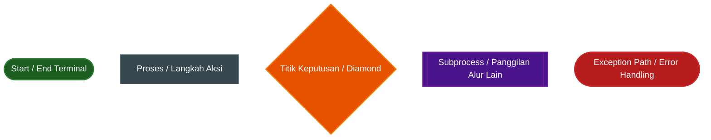

*   **Legenda Warna Peran / Aktor**:
    *   **Pemilik Toko (`Role: pemilik`)**: Hijau Gelap (`fill:#1b5e20,color:#fff`)
    *   **Kasir (`Role: kasir`)**: Biru (`fill:#0d47a1,color:#fff`)
    *   **Desainer (`Role: desainer`)**: Teal (`fill:#004d40,color:#fff`)
    *   **Produksi Cetak (`Role: produksi_cetak`)**: Ungu (`fill:#4a148c,color:#fff`)
    *   **Gudang (`Role: gudang`)**: Oranye (`fill:#e65100,color:#fff`)
    *   **Sistem / Otomatisasi CLI**: Abu-abu Slate (`fill:#37474f,color:#fff`)

---

## 2. Ringkasan Alur Kerja Sistem (Executive Workflow Overview)

### 2.1. Diagram Alur Kerja Makro Keseluruhan Sistem (WF-OVERVIEW-01)
Diagram makro di bawah memetakan proses bisnis terintegrasi toko AbuCom dari kedatangan pelanggan hingga laporan penutupan hari:

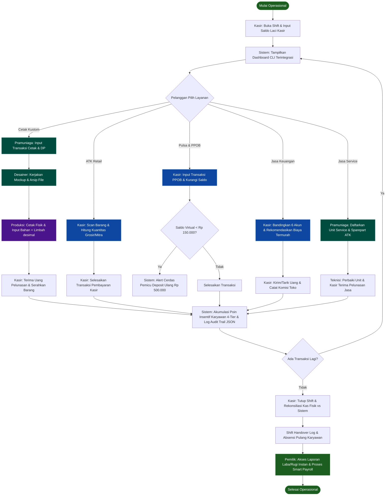

### 2.2. Peta Keterhubungan Workflow antar Modul (WF-REL-01)
Diagram di bawah menunjukkan bagaimana output data dari workflow satu modul menjadi input bagi modul lainnya secara transaksional:

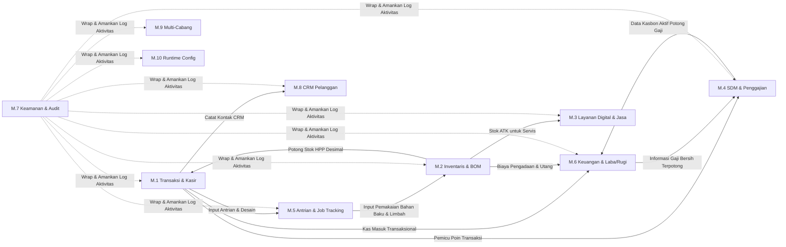

---

## 3. Workflow Diagram Proses Bisnis As-Is (Kondisi Saat Ini — Manual)

### 3.1. Workflow As-Is: Divisi Produk Percetakan Kustom (WF-ASIS-01)
Alur pengerjaan produk cetak kustom yang dikerjakan secara manual oleh Pemilik sebelum adanya sistem:

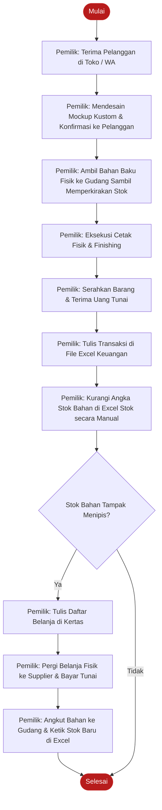
> **Analisis Bottleneck & Pain Point**: 
> 1. **Time-consuming**: Pemilik melakukan proses desain, cetak, administrasi Excel, dan logistik sendiri yang memicu kelelahan fisik ekstrim (*burnout*).
> 2. **Stok Selisih (Loss of HPP)**: Excel tidak mendukung kalkulasi desimal berbasis dimensi bahan baku (panjang x lebar) yang terpakai secara presisi, stok fisik di gudang selalu selisih dengan catatan Excel.
> 3. **Manual Re-Order**: Perkiraan stok menipis murni visual tanpa peringatan, berisiko kehabisan stok saat pesanan ramai.

### 3.2. Workflow As-Is: Divisi Penjualan Retail ATK (WF-ASIS-02)
Alur transaksi retail ATK di toko fisik:

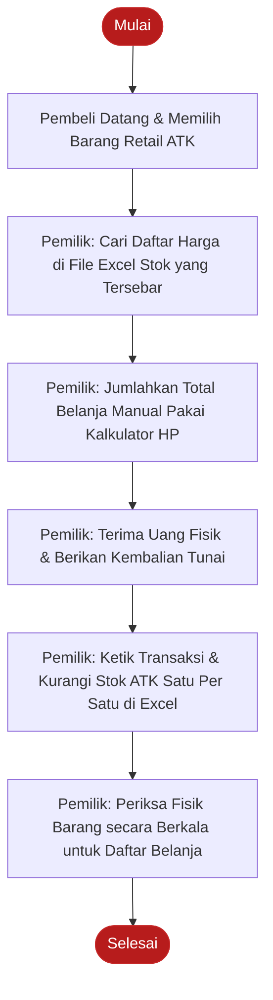
> **Analisis Bottleneck & Pain Point**:
> 1. **Antrian Lambat**: Pencarian harga di berkas Excel yang terpisah-pisah memakan waktu lama, memperlama proses checkout pelanggan.
> 2. **Human Error**: Perhitungan manual dengan kalkulator HP rentan salah hitung kembalian atau salah menjumlahkan harga.
> 3. **Stok Terlambat Update**: Pengurangan stok di Excel seringkali tertunda (dilakukan malam hari), sehingga data Excel tidak pernah real-time.

### 3.3. Workflow As-Is: Divisi Layanan Pulsa & PPOB (WF-ASIS-03)
Alur layanan pengisian pulsa dan token listrik:

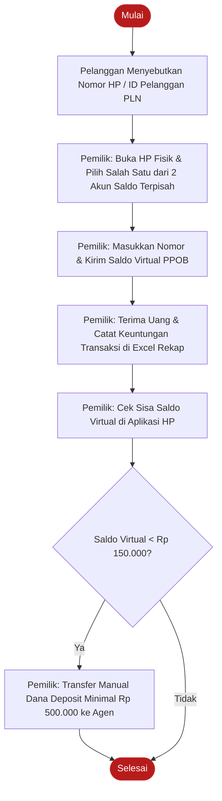
> **Analisis Bottleneck & Pain Point**:
> 1. **Dua Saldo Terfragmentasi**: Harus mengelola dua aplikasi saldo virtual di HP secara terpisah, menyulitkan monitoring sisa aset kas.
> 2. **Risiko Saldo Kritis Terlewat**: Pengecekan saldo kritis murni manual, jika pemilik lupa memeriksa, transaksi akan gagal saat pelanggan ramai karena saldo habis mendadak.

### 3.4. Workflow As-Is: Divisi Jasa Keuangan (Transfer & Tarik Tunai) (WF-ASIS-04)
Alur transfer uang antar bank dan tarik tunai saldo digital:

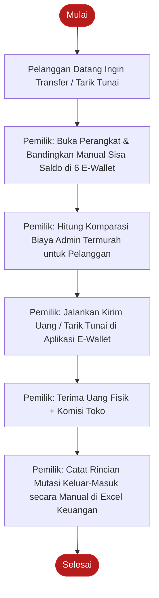
> **Analisis Bottleneck & Pain Point**:
> 1. **Complexity & Delay**: Pengecekan saldo dan biaya admin di 6 akun e-wallet (OVO, Gopay, ShopeePay, Dana, LinkAja, Agen Mandiri) memakan waktu 5-10 menit.
> 2. **Kas Bocor**: Sering terjadi ketidakcocokan antara mutasi di HP dengan pencatatan mutasi manual di Excel karena banyaknya transaksi keluar masuk yang tumpang tindih.

### 3.5. Workflow As-Is: Divisi Jasa Teknis (Service & Install) (WF-ASIS-05)
Alur penerimaan service printer dan laptop:

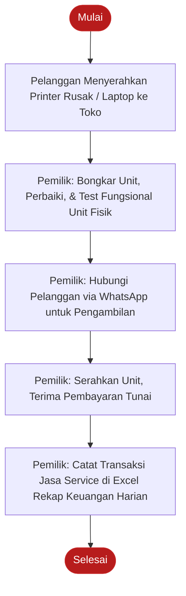
> **Analisis Bottleneck & Pain Point**:
> 1. **No Service History**: Tidak ada pencatatan serial number unit, riwayat kerusakan, dan garansi jasa servis.
> 2. **Sparepart Unsynced**: Stok sparepart (seperti cartridge/tinta) yang diambil dari ATK untuk servis tidak terpotong secara otomatis di sistem stok utama.

### 3.6. Workflow As-Is: Administrasi Pinjaman, SDM & Pengeluaran (WF-ASIS-06)
Alur administrasi utang modal dan pencatatan kasbon karyawan:

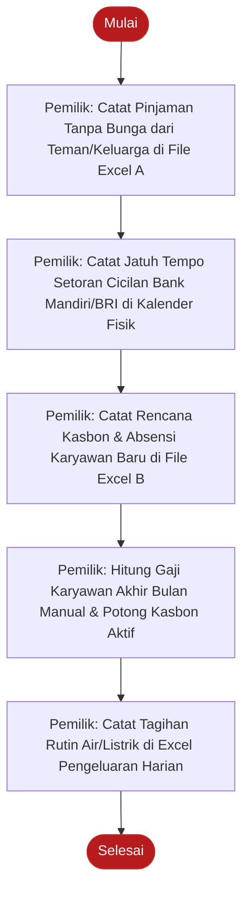
> **Analisis Bottleneck & Pain Point**:
> 1. **High Default Risk**: Jadwal jatuh tempo bank yang dicatat manual di kalender fisik rentan terlewat, memicu denda dan penalti bank.
> 2. **Krisis Likuiditas**: Pinjaman tanpa bunga yang ditarik mendadak oleh keluarga seringkali tidak diimbangi kesediaan dana darurat terproteksi, melumpuhkan cash flow.
> 3. **Smart Payroll Terhambat**: Skema perhitungan penggajian karyawan berdasarkan target laba bersih dan insentif poin tidak terstruktur, memicu perdebatan slip gaji karyawan.

---

## 4. Workflow Diagram Proses Bisnis To-Be (Kondisi Target — Sistem AbuCom CLI)

### 4.1. Workflow Operasional Harian Toko (Daily Operation Master Workflow - WF-OP-01)
Alur operasional terintegrasi dari toko dibuka hingga ditutup kembali oleh karyawan kasir dan pemilik:

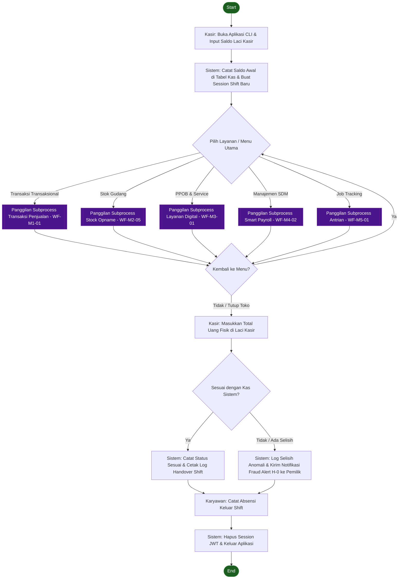
**Narasi Prosedural**:
1.  **Buka Shift**: Staf Kasir mengaktifkan terminal CLI, memasukkan username/password, dan menginput jumlah uang tunai fisik modal awal di laci.
2.  **Verifikasi Saldo Awal**: Sistem memvalidasi input, mencatatnya ke database, menghasilkan token session JWT, dan mengarahkan ke dashboard utama.
3.  **Operasional Harian**: Pengguna menjalankan transaksi multi-divisi, memanipulasi stok, melakukan opname, atau melacak antrian sepanjang hari.
4.  **Tutup Shift**: Pada akhir hari, kasir menghitung seluruh uang tunai fisik di laci dan menginput totalnya ke menu Penutupan Shift.
5.  **Rekonsiliasi Kas**: Sistem membandingkan angka fisik dengan total catatan penjualan hari itu.
6.  **Pencatatan Handover & Absen**: Jika cocok, status shift dicatat *Sesuai*. Jika selisih, sistem mencatat status *Variance* dan memicu fraud alert. Kasir melakukan absensi keluar dan session JWT dihapus secara aman.

---

### 4.2. Workflow Modul M.1 — Manajemen Transaksi & Kebijakan Harga

#### 4.2.1. Alur Pencatatan Transaksi Penjualan Multi-Divisi (WF-M1-01)
*   **Derivasi**: UC-001, BR-F-01, SRS-F-001.

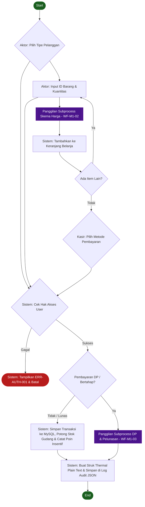
**Narasi Prosedural**:
1.  Aktor memilih tipe pelanggan (Umum / Mitra) di menu kasir CLI.
2.  Aktor menginput ID Barang dan Kuantitas belanja. Sistem memanggil modul harga dinamis untuk menghitung tarif per unit.
3.  Item dimasukkan ke keranjang belanja, proses diulang hingga semua item terinput.
4.  Sistem melakukan pengecekan RBAC. Jika pengguna tidak berhak (misal desainer mencoba transaksi), sistem melempar `ERR-AUTH-001`.
5.  Kasir memproses pembayaran. Jika pesanan cetak bertahap, dialirkan ke sub-workflow DP. Jika lunas, sistem mengurangi persediaan barang, mengakumulasikan poin staf, mencatat log audit trail, dan memancarkan struk thermal plain text.

#### 4.2.2. Alur Penentuan Skema Harga Dinamis (WF-M1-02)
*   **Derivasi**: UC-002, BR-F-02, SRS-F-002.

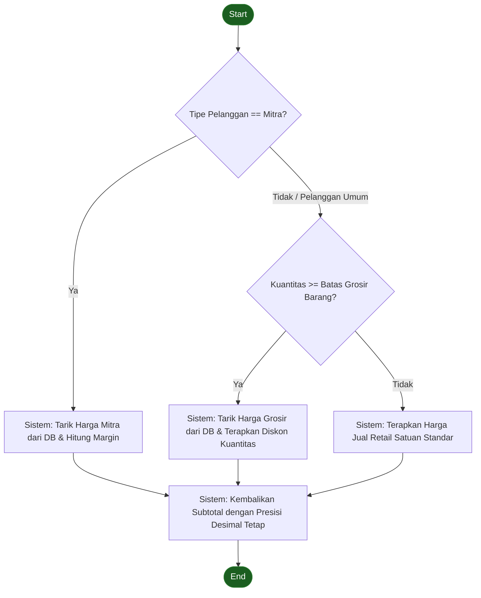
**Narasi Prosedural**:
1.  Sistem mengevaluasi status pelanggan aktif pada struk berjalan.
2.  Jika pelanggan terdaftar sebagai "Mitra", sistem secara otomatis mem-bypass harga normal dan menerapkan harga khusus Mitra yang terdaftar di basis data.
3.  Jika pelanggan Umum, sistem membandingkan kuantitas item yang dibeli dengan batas minimum grosir barang.
4.  Jika kuantitas memenuhi syarat grosir, harga grosir yang diterapkan. Jika tidak, harga retail standar yang digunakan.
5.  Sistem menghasilkan harga per unit dengan presisi desimal tetap (pustaka `decimal` Python) untuk dikembalikan ke modul transaksi.

#### 4.2.3. Alur Pembayaran Bertahap (DP & Pelunasan) (WF-M1-03)
*   **Derivasi**: UC-003, BR-F-03, SRS-F-003.

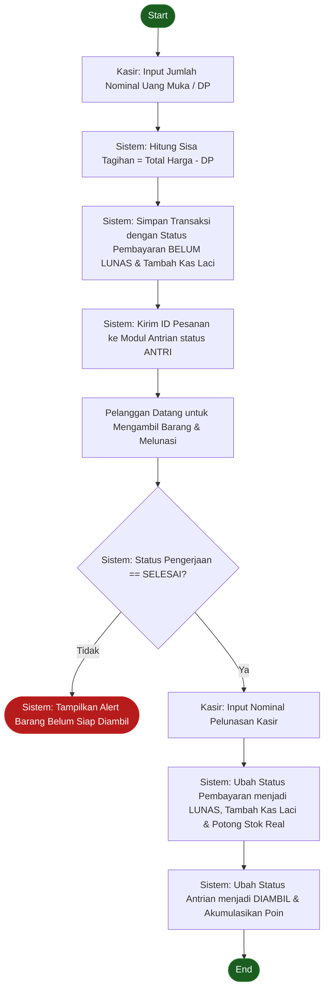
**Narasi Prosedural**:
1.  Staf Kasir memasukkan jumlah DP yang dibayarkan pelanggan di awal pesanan cetak kustom.
2.  Sistem merekam transaksi dengan status *Belum Lunas*, mencatatkan kas masuk DP ke laci kasir, dan mengirimkan pesanan ke modul antrian dengan status awal *Antri*.
3.  Saat pelanggan datang mengambil barang, kasir memverifikasi status pengerjaan antrian di sistem. Jika belum berstatus *Selesai*, pengambilan ditolak.
4.  Jika telah berstatus *Selesai*, kasir menginput pelunasan pembayaran.
5.  Sistem mengubah status transaksi menjadi *Lunas*, memperbarui kas masuk pelunasan, mengurangi stok bahan baku riil, mengubah status antrian ke *Diambil*, dan memicu pembagian poin insentif.

#### 4.2.4. Alur Pembatalan Transaksi & Retur Barang (WF-M1-04)
*   **Derivasi**: UC-004, BR-F-04, SRS-F-004.

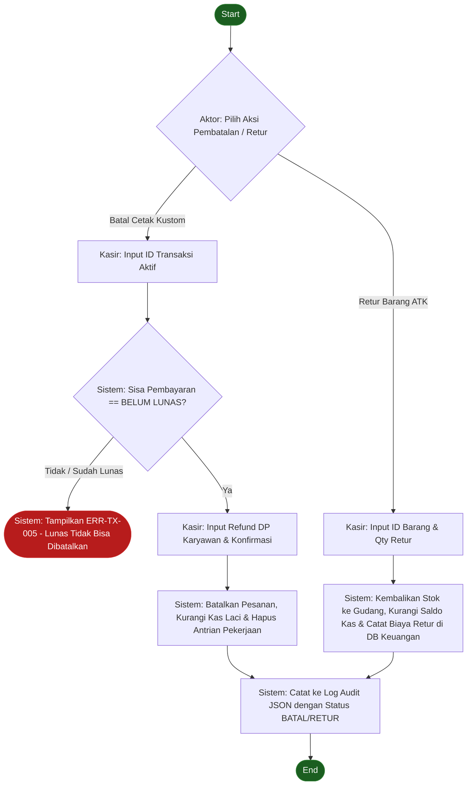
**Narasi Prosedural**:
1.  Kasir memilih aksi (Batal Pesanan Cetak atau Retur ATK).
2.  **Batal Cetak**: Kasir memasukkan ID Transaksi. Sistem memverifikasi apakah transaksi berstatus *Belum Lunas*. Jika sudah *Lunas*, pembatalan ditolak (`ERR-TX-005`). Jika valid, kasir menginput pengembalian DP, dan sistem memperbarui status transaksi menjadi *Batal*, mengurangi saldo kas laci, dan menghapus antrian pengerjaan.
3.  **Retur ATK**: Kasir memasukkan detail barang. Sistem secara aman mengembalikan kuantitas barang ke persediaan stok, mengurangi saldo kas kasir, dan mencatat biaya pengeluaran retur.
4.  Semua aksi ini terekam secara otomatis ke dalam log audit JSON terstruktur.

#### 4.2.5. Alur Pelacakan Margin Keuntungan per Produk (WF-M1-05)
*   **Derivasi**: UC-005, BR-F-05, SRS-F-005.

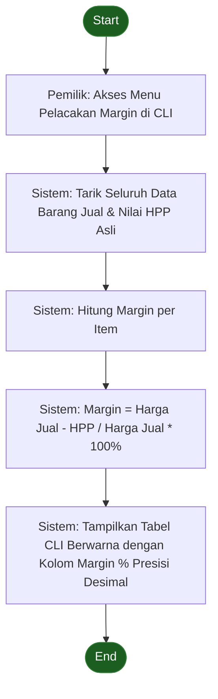
**Narasi Prosedural**:
1.  Pemilik mengakses menu margin keuntungan pada terminal CLI khusus pemilik.
2.  Sistem melakukan kueri ke database untuk menarik data harga jual retail/grosir/mitra serta nilai HPP aktual (HPP retail atau HPP kalkulasi BOM desimal).
3.  Sistem menghitung margin keuntungan bersih menggunakan pustaka desimal presisi tetap.
4.  Hasil disajikan dalam bentuk tabel CLI terformat rapi dengan indikator persentase margin keuntungan per produk untuk analisis pemilik.

#### 4.2.6. Alur Ekspor Struk Nota Thermal (WF-M1-06)
*   **Derivasi**: UC-006, BR-F-06, SRS-F-006.

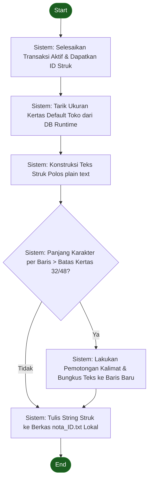
**Narasi Prosedural**:
1.  Setelah transaksi disimpan, sistem mengambil ID transaksi berjalan dan menarik konfigurasi lebar kertas printer kasir (58mm/80mm).
2.  Sistem mengonstruksi header toko, rincian item belanja, subtotal, DP/Pelunasan, dan footer nota ke format plain text (.txt).
3.  Sistem secara dinamis mengevaluasi panjang karakter per baris. Jika melebihi batas (32 karakter untuk 58mm atau 48 karakter untuk 80mm), sistem melakukan *auto-wrapping* teks ke baris berikutnya agar struk rapi.
4.  String final diekspor menjadi berkas berkode `nota_[ID_Transaksi].txt` di direktori lokal untuk dicetak langsung.

---

### 4.3. Workflow Modul M.2 — Manajemen Inventaris, BOM & Stock Opname

#### 4.3.1. Alur Perhitungan HPP Otomatis Berbasis BOM Desimal (WF-M2-01)
*   **Derivasi**: UC-007, BR-F-07, SRS-F-007.

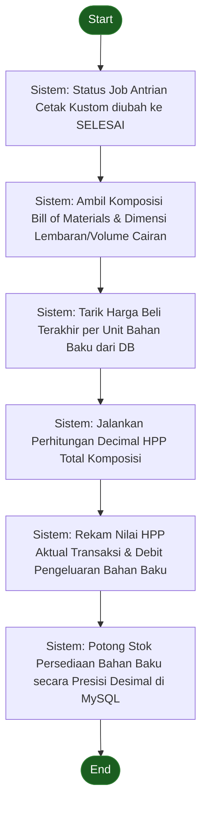
**Narasi Prosedural**:
1.  Staf Produksi mengubah status pengerjaan pesanan cetak kustom menjadi *Selesai*.
2.  Sistem secara otomatis mendeteksi pemicu ini dan menarik data Bill of Materials (BOM) produk kustom terkait (misal stempel flash membutuhkan gagang stempel, karet flash dimensi panjang x lebar, dan tinta volume desimal).
3.  Sistem mencari harga beli terakhir dari bahan baku tersebut dari database log supplier.
4.  Sistem menghitung biaya total pemakaian bahan baku dengan pustaka `decimal` Python.
5.  Sistem menyimpan nilai HPP riil transaksi ke dalam tabel laporan keuangan, lalu melakukan pemotongan stok bahan baku secara pecahan desimal presisi di database MySQL.

#### 4.3.2. Alur Pencatatan Limbah Produksi (Waste Management) (WF-M2-02)
*   **Derivasi**: UC-008, BR-F-08, SRS-F-008.

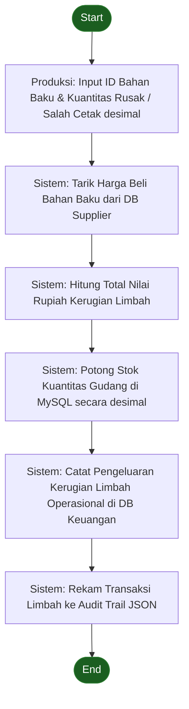
**Narasi Prosedural**:
1.  Staf Produksi menginput data limbah produksi di CLI kasir, menentukan ID bahan baku yang salah cetak/rusak beserta dimensi/kuantitas desimalnya.
2.  Sistem memvalidasi input, lalu mencari harga beli terakhir bahan tersebut.
3.  Sistem menghitung kerugian finansial akibat limbah.
4.  Sistem memotong kuantitas stok di MySQL, menuliskan catatan debit kerugian operasional ke laporan keuangan, dan merekam data limbah tersebut ke log audit trail.

#### 4.3.3. Alur Manajemen Satuan & Konversi UoM (WF-M2-03)
*   **Derivasi**: UC-009, BR-F-09, SRS-F-009.

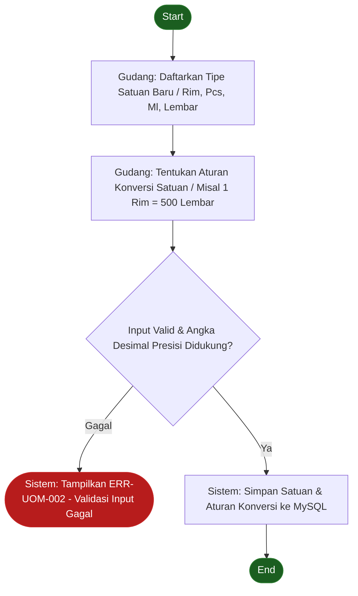
**Narasi Prosedural**:
1.  Staf Gudang membuka menu UoM, mendaftarkan nama satuan baru (Rim, Lembar, Mililiter, dll.).
2.  Gudang menetapkan rasio konversi antar satuan (seperti 1 Pack Kertas Foto = 20 Lembar).
3.  Sistem memverifikasi integritas input dan kesesuaian parameter numerik desimal. Jika tidak valid, dilempar `ERR-UOM-002`.
4.  Jika sukses, aturan konversi disimpan ke tabel database UoM untuk mendukung konversi stok otomatis saat transaksi.

#### 4.3.4. Alur Sinkronisasi Pengambilan ATK Internal (WF-M2-04)
*   **Derivasi**: UC-010, BR-F-10, SRS-F-010.

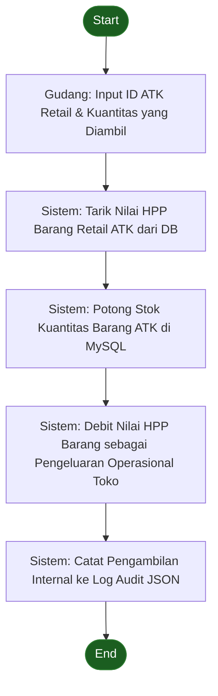
**Narasi Prosedural**:
1.  Staf Gudang mencatatkan pengambilan barang retail ATK (seperti 1 rim kertas HVS retail) untuk keperluan internal produksi fotokopi toko.
2.  Sistem mengambil data HPP barang retail tersebut.
3.  Sistem secara aman memotong stok barang retail di MySQL.
4.  Sistem mendebit total HPP barang retail tersebut sebagai pengeluaran operasional toko agar neraca keuangan tetap seimbang, lalu mencatat aktivitas ini ke log audit JSON.

#### 4.3.5. Alur Rekonsiliasi Stok Berkala (Stock Opname) (WF-M2-05)
*   **Derivasi**: UC-011, BR-F-11, SRS-F-011.

```mermaid
flowchart TD
    Start([Start]) --> FreezeStock[Gudang: Pemicu Pembekuan Stok Sementara di CLI]
    FreezeStock --> InputPhysical[Gudang: Input Kuantitas Fisik Riil Hasil Hitung Gudang]
    
    InputPhysical --> CalcDiff[Sistem: Hitung Selisih = Kuantitas Fisik - Kuantitas Sistem]
    CalcDiff --> RenderReport[Sistem: Tampilkan Laporan Selisih Opname Stok]
    
    RenderReport --> RequestAuth{Kepala Percetakan: Berikan Otorisasi Penyesuaian?}
    RequestAuth -->|Ditolak / Investigasi| CancelOpname([Batalkan Hasil Opname & Cek Fisik Ulang])
    
    RequestAuth -->|Ya / Otorisasi Disetujui| ApplyDiff[Sistem: Perbarui Stok MySQL dengan Angka Fisik Baru & Catat Nilai Penyesuaian]
    ApplyDiff --> UnfreezeStock[Sistem: Buka Kembali Pembekuan Stok & Rekam Audit Trail Log]
    UnfreezeStock --> End([End])
    
    style Start fill:#1b5e20,stroke:#2e7d32,color:#fff
    style End fill:#1b5e20,stroke:#2e7d32,color:#fff
    style CancelOpname fill:#b71c1c,stroke:#c62828,color:#fff
```
**Narasi Prosedural**:
1.  Staf Gudang mengaktifkan pembekuan input stok sementara di sistem agar tidak terjadi manipulasi stok saat proses stock opname berjalan.
2.  Staf Gudang menghitung fisik barang dan menginput angka riil ke terminal CLI.
3.  Sistem menghitung selisih kuantitas antara fisik dan catatan database, menampilkan ringkasan laporan varians.
4.  Kepala Percetakan memeriksa laporan selisih. Jika aneh, dibatalkan untuk investigasi manual.
5.  Jika disetujui, sistem memperbarui nilai kuantitas di database MySQL menjadi angka fisik riil, menormalkan status pembekuan stok, dan merekam data penyesuaian opname ke audit log lengkap dengan username pelaku otorisasi.

#### 4.3.6. Alur Analisis Prediksi Re-Order Stok (WF-M2-06)
*   **Derivasi**: UC-012, BR-F-12, SRS-F-012.

```mermaid
flowchart TD
    Start([Start]) --> OpenInventory[Aktor: Buka Menu Persediaan Stok di CLI]
    OpenInventory --> FetchSales[Sistem: Tarik Riwayat Kecepatan Konsumsi Stok 30 Hari Terakhir]
    
    FetchSales --> CalcRate[Sistem: Hitung Konsumsi Rata-rata Harian per Item]
    CalcRate --> CalcEst[Sistem: Estimasi Hari Habis = Kuantitas Stok Saat Ini / Rata-rata Konsumsi Harian]
    
    CalcEst --> CheckEst{Sistem: Estimasi Hari Habis <= 7 Hari?}
    CheckEst -->|Ya| TriggerAlert[Sistem: Berikan Tanda Visual Kuning / Merah Peringatan Re-Order]
    CheckEst -->|Tidak| RenderNormal[Sistem: Tampilkan Indikator Normal Hijau]
    
    TriggerAlert & RenderNormal --> RenderTable[Sistem: Sajikan Tabel Ringkasan Analitik di CLI]
    RenderTable --> End([End])
    
    style Start fill:#1b5e20,stroke:#2e7d32,color:#fff
    style End fill:#1b5e20,stroke:#2e7d32,color:#fff
```
**Narasi Prosedural**:
1.  Pengguna membuka menu inventaris pada terminal CLI.
2.  Sistem melakukan penarikan data riwayat penjualan dan pemakaian bahan baku dalam 30 hari terakhir.
3.  Sistem menghitung kecepatan rata-rata konsumsi per hari untuk setiap item barang.
4.  Sistem membagi sisa kuantitas stok saat ini dengan rata-rata konsumsi harian untuk mengestimasi sisa hari ketersediaan stok.
5.  Jika sisa hari ketersediaan di bawah atau sama dengan 7 hari, sistem secara visual memberi tanda kuning/merah bertuliskan "RE-ORDER NOW". Sebaliknya, jika aman, diberi tanda hijau.
6.  Tabel analitik disajikan kepada staf gudang untuk bahan pengadaan.

#### 4.3.7. Alur Riwayat Harga Beli Supplier (Price Tracking) (WF-M2-07)
*   **Derivasi**: UC-013, BR-F-13, SRS-F-013.

```mermaid
flowchart TD
    Start([Start]) --> InputProcure[Gudang: Catat Pengadaan Barang Masuk Baru]
    InputProcure --> InsertPrice[Sistem: Simpan Harga Beli, Kuantitas, & ID Supplier ke Tabel Riwayat Harga]
    
    InsertPrice --> QueryCheapest[Gudang: Akses Menu Cek Supplier Termurah]
    QueryCheapest --> ComparePrices[Sistem: Bandingkan Riwayat Harga Pembelian Historis dari Seluruh Supplier untuk Barang Sejenis]
    
    ComparePrices --> RenderRank[Sistem: Urutkan Supplier Termurah hingga Termahal pada CLI]
    RenderRank --> End([End])
    
    style Start fill:#1b5e20,stroke:#2e7d32,color:#fff
    style End fill:#1b5e20,stroke:#2e7d32,color:#fff
```
**Narasi Prosedural**:
1.  Staf Gudang menginput transaksi pengadaan barang masuk baru dari supplier ke dalam CLI.
2.  Sistem secara otomatis menyimpan harga beli satuan, kuantitas masuk, tanggal transaksi, dan ID Supplier ke dalam tabel riwayat harga beli.
3.  Saat gudang ingin merencanakan belanja barang di masa depan, staf membuka menu Price Tracking.
4.  Sistem mengevaluasi seluruh transaksi pengadaan historis dan menampilkan urutan supplier dari yang menawarkan harga termurah hingga termahal untuk memudahkan pengambilan keputusan pengadaan.

#### 4.3.8. Alur Import Data CSV Semiautomatis (WF-M2-08)
*   **Derivasi**: UC-014, BR-F-14, SRS-F-014.

```mermaid
flowchart TD
    Start([Start]) --> RunScript[Aktor: Jalankan Skrip Utilitas Import CSV di CLI]
    RunScript --> ReadFile[Sistem: Baca Baris Berkas CSV Data Lama]
    
    ReadFile --> ValidateFormat{Sistem: Format Kolom & Atribut Data Sesuai Aturan MySQL?}
    ValidateFormat -->|Tidak / Salah Format| LogError[Sistem: Catat Baris Bermasalah di Log Error CSV & Lewati]
    
    ValidateFormat -->|Ya| CheckDuplicate{Sistem: Data Sudah Ada di DB?}
    CheckDuplicate -->|Ya| LogError
    CheckDuplicate -->|Tidak| BulkInsert[Sistem: Lakukan Import Bulk Insert ke Database MySQL]
    
    LogError & BulkInsert --> FinishLoop{Sistem: Selesai Seluruh Baris CSV?}
    FinishLoop -->|Tidak| ReadFile
    
    FinishLoop -->|Ya| RenderImportSummary[Sistem: Tampilkan Statistik Jumlah Sukses & Gagal Import]
    RenderImportSummary --> End([End])
    
    style Start fill:#1b5e20,stroke:#2e7d32,color:#fff
    style End fill:#1b5e20,stroke:#2e7d32,color:#fff
```
**Narasi Prosedural**:
1.  Pemilik/Gudang memicu skrip utilitas migrasi data awal dengan mendefinisikan path file CSV data barang lama.
2.  Sistem membaca file CSV baris demi baris, memvalidasi tipe data, format desimal, dan ketersediaan data wajib di kolom.
3.  Jika format rusak atau data duplikat, baris dilewati dan dicatat di log kesalahan import.
4.  Jika bersih, data diimpor secara transaksional massal ke database MySQL.
5.  Setelah pembacaan selesai, sistem menampilkan rangkuman data yang sukses dan gagal diimpor.

#### 4.3.9. Alur Manajemen Data Supplier & Pencatatan Utang Usaha (WF-M2-09)
*   **Derivasi**: UC-015, BR-F-40, SRS-F-040.

```mermaid
flowchart TD
    Start([Start]) --> InputSupplier[Gudang: Daftarkan Profil Supplier Baru / Nama, Kontak, Alamat]
    InputSupplier --> SaveSupplier[Sistem: Simpan Data Supplier ke MySQL]
    
    SaveSupplier --> PurchaseTempo[Gudang: Catat Transaksi Pembelian Barang Tempo dari Supplier]
    PurchaseTempo --> RecordDebt[Sistem: Catat Nominal Utang, Tanggal Tempo, & Tambah Kuantitas Stok]
    
    RecordDebt --> ViewDebts[Kepala Percetakan: Akses Menu Laporan Utang Tempo Usaha]
    ViewDebts --> PayDebt[Kasir: Input Pembayaran Pelunasan Utang Supplier]
    
    PayDebt --> UpdateDebt[Sistem: Ubah Status Utang menjadi LUNAS & Potong Kas Keluar Toko]
    UpdateDebt --> End([End])
    
    style Start fill:#1b5e20,stroke:#2e7d32,color:#fff
    style End fill:#1b5e20,stroke:#2e7d32,color:#fff
```
**Narasi Prosedural**:
1.  Staf Gudang mendaftarkan data supplier/vendor baru ke dalam database.
2.  Saat toko melakukan pembelian barang baku secara kredit/tempo, gudang mencatatkan transaksi pengadaan tempo.
3.  Sistem menyimpan data utang (nominal, tanggal jatuh tempo), meningkatkan jumlah persediaan stok barang, dan menuliskan catatan utang aktif.
4.  Kepala Percetakan secara rutin memantau jatuh tempo utang usaha.
5.  Saat jatuh tempo tiba, kasir mencatatkan pembayaran utang. Sistem memproses pelunasan, mengubah status utang menjadi *Lunas*, dan memotong nominal kas keluar toko.

#### 4.3.10. Alur Backup & Restore Database (WF-M2-10)
*   **Derivasi**: UC-016, BR-F-39, SRS-F-039.

```mermaid
flowchart TD
    Start([Start]) --> TriggerAction{Pemilik: Pilih Aksi Backup / Restore}
    
    TriggerAction -->|Proses Backup| RunBackup[Sistem: Ekspor Seluruh Skema & Data MySQL ke File SQL]
    RunBackup --> EncryptFile[Sistem: Enkripsi File SQL Hasil Backup dengan Kunci AES-256]
    EncryptFile --> SaveLocal[Sistem: Simpan Berkas Terenkripsi di Direktori Backup Aman]
    
    TriggerAction -->|Proses Restore| SelectFile[Pemilik: Pilih File Backup & Masukkan Kunci Dekripsi]
    SelectFile --> DecryptFile{Sistem: Kunci AES Valid?}
    DecryptFile -->|Gagal| ErrRestore([Sistem: Tampilkan ERR-DB-009 - Kunci Dekripsi Salah])
    DecryptFile -->|Ya| ExecuteSQL[Sistem: Dekripsi File SQL & Jalankan Rekonstruksi Database MySQL]
    
    SaveLocal & ExecuteSQL --> End([End])
    
    style Start fill:#1b5e20,stroke:#2e7d32,color:#fff
    style End fill:#1b5e20,stroke:#2e7d32,color:#fff
    style ErrRestore fill:#b71c1c,stroke:#c62828,color:#fff
```
**Narasi Prosedural**:
1.  Pemilik mengakses menu database administrasi, memilih aksi Backup atau Restore.
2.  **Backup**: Sistem mengekspor seluruh struktur tabel dan isi database MySQL, mengenkripsinya dengan kunci AES-256, dan menyimpannya di folder cadangan aman secara lokal.
3.  **Restore**: Pemilik menunjuk file cadangan, memasukkan kunci enkripsi. Sistem memvalidasi kunci. Jika salah, dilempar `ERR-DB-009`. Jika benar, sistem mendekripsi berkas SQL dan menimpa database lokal untuk memulihkan keadaan sistem.

---

### 4.4. Workflow Modul M.3 — Layanan Digital, PPOB & Jasa Service

#### 4.4.1. Alur Manajemen Saldo PPOB & Alert Deposit (WF-M3-01)
*   **Derivasi**: UC-017, BR-F-15, SRS-F-015.

```mermaid
flowchart TD
    Start([Start]) --> InputPPOB[Kasir: Input Penjualan Pulsa / Token / Tagihan PPOB]
    InputPPOB --> ProcessVirtual[Kasir: Eksekusi Pengiriman Saldo Virtual via HP/Gateway]
    
    ProcessVirtual --> DeductVirtual[Sistem: Kurangi Catatan Saldo PPOB & Simpan Transaksi]
    DeductVirtual --> CheckVirtualSaldo{Sistem: Sisa Saldo Virtual < Rp 150.000?}
    
    CheckVirtualSaldo -->|Ya| TriggerPPOBAlert[Sistem: Pancarkan Notifikasi Alert Kritis Saldo PPOB di Layar CLI]
    TriggerPPOBAlert --> InputDeposit[Kasir: Lakukan Top-Up Deposit Saldo Fisik Minimal Rp 500.000]
    InputDeposit --> SaveDeposit[Sistem: Tambah Catatan Saldo Virtual PPOB & Debit Kas Keluar Toko]
    
    CheckVirtualSaldo -->|Tidak| End([End])
    SaveDeposit --> End
    
    style Start fill:#1b5e20,stroke:#2e7d32,color:#fff
    style End fill:#1b5e20,stroke:#2e7d32,color:#fff
```
**Narasi Prosedural**:
1.  Staf Kasir melayani pengisian pulsa/token dan menginput rincian transaksi di CLI.
2.  Kasir memproses pengiriman saldo virtual di HP/perangkat PPOB fisik.
3.  Sistem mencatat transaksi di database lokal dan memotong representasi saldo PPOB di sistem.
4.  Sistem mendeteksi apakah sisa saldo virtual PPOB di sistem di bawah batas kritis Rp 150.000.
5.  Jika di bawah limit, CLI kasir memancarkan notifikasi peringatan berkedip. Kasir segera mentransfer uang top-up fisik minimal Rp 500.000 ke provider PPOB dan mencatatkan data deposit tersebut di CLI untuk mendebit kas keluar toko dan memperbarui saldo sistem.

#### 4.4.2. Alur Optimalisasi Biaya Admin Jasa Keuangan (6 Akun) (WF-M3-02)
*   **Derivasi**: UC-018, BR-F-16, SRS-F-016.

```mermaid
flowchart TD
    Start([Start]) --> InputTransfer[Kasir: Input Transaksi Transfer / Tarik Tunai Pelanggan]
    InputTransfer --> FetchAdminFees[Sistem: Tarik Tabel Biaya Admin dari 6 E-Wallet Aktif]
    
    FetchAdminFees --> CompareFees[Sistem: Hitung & Urutkan Opsi dengan Biaya Admin Termurah]
    CompareFees --> OutputRec[Sistem: Rekomendasikan Akun E-Wallet Terhemat di CLI Kasir]
    
    OutputRec --> ProcessTransfer[Kasir: Kirim Uang Menggunakan E-Wallet yang Direkomendasikan]
    ProcessTransfer --> SaveTx[Sistem: Simpan Transaksi Transfer, Tambah Kas Tunai Laci, Potong Saldo E-Wallet & Catat Komisi Toko]
    SaveTx --> End([End])
    
    style Start fill:#1b5e20,stroke:#2e7d32,color:#fff
    style End fill:#1b5e20,stroke:#2e7d32,color:#fff
```
**Narasi Prosedural**:
1.  Kasir menginput detail transfer antar bank (nominal transfer, bank tujuan) yang diminta pelanggan.
2.  Sistem secara otomatis membaca tarif admin statis dari 6 e-wallet (Mandiri Agen, Dana, Gopay, LinkAja, ShopeePay, OVO).
3.  Sistem melakukan perbandingan tarif secara instan dan merekomendasikan opsi paling murah agar kasir dapat meminimalkan pemotongan saldo.
4.  Kasir memproses transfer fisik menggunakan e-wallet rekomendasi.
5.  Sistem menyimpan data transaksi, memotong saldo digital e-wallet terkait di sistem, meningkatkan saldo kas fisik laci kasir, dan membukukan laba komisi toko.

#### 4.4.3. Alur Pencatatan Jasa Service & Teknisi (WF-M3-03)
*   **Derivasi**: UC-019, BR-F-17, SRS-F-017.

```mermaid
flowchart TD
    Start([Start]) --> ReceiveUnit[Pramuniaga: Daftarkan Unit Service Pelanggan & Catat Keluhan]
    ReceiveUnit --> SaveInitialJob[Sistem: Daftarkan Transaksi Service Baru dengan Status DITERIMA]
    
    SaveInitialJob --> RepairProcess[Teknisi: Bongkar & Perbaiki Unit Printer / PC Pelanggan]
    RepairProcess --> TakeSpareparts{Membutuhkan Suku Cadang dari Gudang ATK?}
    
    TakeSpareparts -->|Ya| DeductATKSpare[Teknisi: Input ID ATK Retail & Potong Stok ATK secara Otomatis]
    TakeSpareparts -->|Tidak| SetFinished[Teknisi: Tandai Perbaikan SELESAI di CLI]
    
    DeductATKSpare --> SetFinished
    SetFinished --> PayService[Kasir: Terima Uang Pelunasan Jasa Service & Sparepart dari Pelanggan]
    
    PayService --> CompleteService[Sistem: Ubah Status Service menjadi DIAMBIL, Tambah Kas Laci & Akumulasikan Poin]
    CompleteService --> End([End])
    
    style Start fill:#1b5e20,stroke:#2e7d32,color:#fff
    style End fill:#1b5e20,stroke:#2e7d32,color:#fff
```
**Narasi Prosedural**:
1.  Staf Pramuniaga menerima printer/laptop rusak, menginput data pelanggan dan deskripsi keluhan di CLI, dan status dicatat *Diterima*.
2.  Teknisi melakukan reparasi fisik. Jika membutuhkan suku cadang yang tersedia di ATK retail (misal tinta/catridge), teknisi menginput pemotongan stok ATK di CLI. Stok terpotong otomatis dan harga sparepart didebit sebagai biaya bahan servis.
3.  Teknisi mengubah status servis menjadi *Selesai*.
4.  Kasir melayani penyerahan unit, menerima pembayaran lunas biaya jasa dan sparepart dari pelanggan.
5.  Sistem memperbarui status transaksi menjadi *Diambil*, mendebit kas masuk laci kasir, memicu akumulasi poin insentif 10 poin (service berat), dan mencatat log aktivitas.

---

### 4.5. Workflow Modul M.4 — Manajemen SDM, Penggajian & Poin Karyawan

#### 4.5.1. Alur Data Karyawan, Absensi, dan Kasbon (WF-M4-01)
*   **Derivasi**: UC-020, BR-F-18, SRS-F-018.

```mermaid
flowchart TD
    Start([Start]) --> SelectSDMMenu{Aktor: Pilih Aksi Manajemen SDM}
    
    SelectSDMMenu -->|Data Karyawan| RecordStaff[Pemilik: Input Profil Karyawan, Peran, & Status PKWT/PKWTT]
    RecordStaff --> SaveStaff[Sistem: Simpan Data Karyawan ke MySQL]
    
    SelectSDMMenu -->|Absensi Harian| InputAttendance[Kepala Percetakan: Input Kehadiran Shift Karyawan Harian]
    InputAttendance --> SaveAttendance[Sistem: Catat Absensi & Rekonstruksi Kehadiran Bulanan]
    
    SelectSDMMenu -->|Kasbon Karyawan| RequestKasbon[Karyawan: Ajukan Pinjaman Kasbon Baru]
    RequestKasbon --> CheckLimit{Sistem: Kasbon Aktif + Pengajuan Baru <= Rp 1.000.000 / 30% Gaji?}
    CheckLimit -->|Tidak| DenyKasbon([Sistem: Tampilkan ERR-SDM-008 - Pengajuan Melebihi Plafon])
    CheckLimit -->|Ya| ApproveKasbon[Pemilik: Berikan Persetujuan Kasbon & Serahkan Kas Tunai]
    ApproveKasbon --> SaveKasbon[Sistem: Simpan Catatan Utang Kasbon Aktif & Potong Kas Toko]
    
    SaveStaff & SaveAttendance & SaveKasbon --> End([End])
    
    style Start fill:#1b5e20,stroke:#2e7d32,color:#fff
    style End fill:#1b5e20,stroke:#2e7d32,color:#fff
    style DenyKasbon fill:#b71c1c,stroke:#c62828,color:#fff
```
**Narasi Prosedural**:
1.  Pengguna dengan otorisasi tepat memilih menu SDM.
2.  **Kelola Karyawan**: Pemilik memasukkan data profil staf baru dan menyimpannya di MySQL.
3.  **Absensi**: Kepala Percetakan menginput data absensi harian staf (Hadir/Absen/Sakit). Sistem merekonstruksi data kehadiran bulanan untuk kalkulasi penggajian.
4.  **Kasbon**: Karyawan mengajukan pinjaman kasbon. Sistem mengevaluasi batas limit Rp 1.000.000 atau 30% dari total gaji pokok bulanan. Jika melanggar, ditolak (`ERR-SDM-008`). Jika disetujui Pemilik, sistem mencatatkan utang kasbon aktif karyawan dan memotong saldo kas kasir untuk penyerahan kasbon fisik.

#### 4.5.2. Alur Penggajian Cerdas (Smart Payroll) (WF-M4-02)
*   **Derivasi**: UC-021, BR-F-19, SRS-F-019.

```mermaid
flowchart TD
    Start([Start]) --> TriggerPayroll[Pemilik: Pemicu Proses Hitung Payroll Bulanan Karyawan]
    TriggerPayroll --> FetchLaba[Sistem: Hitung Laba Bersih Operasional Toko Bulan Berjalan]
    
    FetchLaba --> EvalLaba{Sistem: Laba Bersih Toko >= Target Rp 15.000.000?}
    
    EvalLaba -->|Ya| FixedSalary[Sistem: Terapkan Skema Gaji Bulanan Tetap / Gaji Pokok]
    EvalLaba -->|Tidak| ShareSalary[Sistem: Hitung Skema Bagi Hasil = 25% * Laba Bersih Toko Dibagi Proporsional]
    
    ShareSalary --> CheckMin{Sistem: Hasil Bagi Hasil >= Jaminan Batas Bawah 50% UMR daerah Rp 3.200.000?}
    CheckMin -->|Ya| ApplyShare[Sistem: Terapkan Skema Bagi Hasil Tersebut]
    CheckMin -->|Tidak| ApplyMin[Sistem: Terapkan Jaminan Gaji Minimum Karyawan = Rp 1.600.000 / 50% UMR]
    
    FixedSalary & ApplyShare & ApplyMin --> NetSalary[[Panggilan Subprocess Potong Kasbon - WF-M4-04]]
    NetSalary --> End([End])
    
    style Start fill:#1b5e20,stroke:#2e7d32,color:#fff
    style End fill:#1b5e20,stroke:#2e7d32,color:#fff
```
**Narasi Prosedural**:
1.  Pemilik memicu kalkulasi penggajian bulanan di terminal CLI.
2.  Sistem melakukan kueri untuk menghitung laba bersih operasional toko bulan berjalan.
3.  Sistem mengevaluasi target laba. Jika target laba bersih Rp 15.000.000 tercapai, karyawan menerima skema Gaji Bulanan Tetap.
4.  Jika target laba bersih tidak tercapai, sistem menggunakan skema Bagi Hasil sebesar 25% dari total laba bersih toko dibagi secara proporsional kepada seluruh karyawan aktif.
5.  Sistem memverifikasi apakah nominal bagi hasil di bawah batas bawah jaminan kesejahteraan 50% UMR daerah (UMR daerah Rp 3.200.000, jaminan minimum Rp 1.600.000). Jika di bawah limit, sistem secara otomatis mengatrol nominal gaji pokok karyawan ke angka Rp 1.600.000.
6.  Gaji dasar yang terpilih dialirkan ke sub-workflow pemotongan kasbon.

#### 4.5.3. Alur Akumulasi Poin Insentif Karyawan (WF-M4-03)
*   **Derivasi**: UC-022, BR-F-20, SRS-F-020.

```mermaid
flowchart TD
    Start([Start]) --> TransactSuccess[Sistem: Transaksi Diselesaikan & Pembayaran DP / Pelunasan Diterima]
    TransactSuccess --> FetchDifficulty[Sistem: Identifikasi Kategori Tingkat Kesulitan Transaksi & Pembagian Peran]
    
    FetchDifficulty --> AssignPoints{Sistem: Tentukan Tier Komisi Poin}
    AssignPoints -->|1 Poin / Rp 500| Tier1[Layanan Rutin: ATK Retail, Pulsa PPOB, Jasa Transfer kecil]
    AssignPoints -->|3 Poin / Rp 1.500| Tier2[Jasa Dasar: Fotokopi, Print, Pengetikan, Jasa Transfer besar]
    AssignPoints -->|5 Poin / Rp 2.500| Tier3[Produk Kustom Biasa: Stempel flash, Cetak foto, Stiker, Nama dada]
    AssignPoints -->|10 Poin / Rp 5.000| Tier4[Pekerjaan Berat: Baliho, Buku yasin, Undangan, Service printer, Install]
    
    Tier1 & Tier2 & Tier3 & Tier4 --> UpdatePoints[Sistem: Tambah Akumulasi Poin Karyawan Terlibat ke Database]
    UpdatePoints --> End([End])
    
    style Start fill:#1b5e20,stroke:#2e7d32,color:#fff
    style End fill:#1b5e20,stroke:#2e7d32,color:#fff
```
**Narasi Prosedural**:
1.  Setelah transaksi selesai dan pembayaran diterima oleh kasir, sistem mengidentifikasi jenis barang/jasa dalam transaksi tersebut.
2.  Sistem mencocokkan item dengan 4-tier komisi poin beban kerja:
    *   1 Poin (Rp 500) untuk layanan rutin.
    *   3 Poin (Rp 1.500) untuk jasa dasar retail.
    *   5 Poin (Rp 2.500) untuk produk kustom sedang.
    *   10 Poin (Rp 5.000) untuk pekerjaan fisik berat dan teknis.
3.  Sistem secara aman menambahkan akumulasi poin tersebut ke record karyawan yang terdaftar mengerjakan tugas tersebut untuk diakumulasikan di akhir bulan.

#### 4.5.4. Alur Pemotongan Gaji Otomatis atas Kasbon (WF-M4-04)
*   **Derivasi**: UC-023, BR-F-21, SRS-F-021.

```mermaid
flowchart TD
    Start([Start]) --> FetchBaseSalary[Sistem: Ambil Gaji Dasar Karyawan & Total Bonus Poin Insentif Bulanan]
    FetchBaseSalary --> CalcGross[Sistem: Hitung Gaji Kotor = Gaji Dasar + Insentif Poin]
    
    CalcGross --> CheckActiveKasbon{Sistem: Karyawan Memiliki Utang Kasbon Aktif?}
    CheckActiveKasbon -->|Tidak| ProcessSlip[Sistem: Cetak Slip Gaji Bersih tanpa Potongan & Kurangi Kas Toko]
    
    CheckActiveKasbon -->|Ya| DeductDebt[Sistem: Potong Gaji Kotor dengan Sisa Utang Kasbon]
    DeductDebt --> UpdateKasbon[Sistem: Kurangi / Tutup Saldo Utang Kasbon Karyawan di DB SDM]
    UpdateKasbon --> ProcessSlip
    
    ProcessSlip --> End([End])
    
    style Start fill:#1b5e20,stroke:#2e7d32,color:#fff
    style End fill:#1b5e20,stroke:#2e7d32,color:#fff
```
**Narasi Prosedural**:
1.  Sistem memuat nominal gaji dasar hasil evaluasi bagi hasil bulanan beserta total rupiah bonus poin insentif terkumpul.
2.  Sistem menjumlahkan total pendapatan kotor karyawan.
3.  Sistem memeriksa apakah karyawan memiliki utang kasbon aktif yang tercatat di database.
4.  Jika ada, sistem melakukan pemotongan otomatis pada slip gaji.
5.  Sistem memperbarui saldo utang kasbon karyawan (menutup jika lunas, atau mengurangi), menghasilkan slip gaji bersih dengan keterangan potongan kasbon, dan memotong saldo kas besar toko untuk pembayaran gaji tunai.

---

### 4.6. Workflow Modul M.5 — Sistem Antrian & Pelacakan Desain

#### 4.6.1. Alur Manajemen Antrian Digital (Job Tracking 5 Status) (WF-M5-01)
*   **Derivasi**: UC-024, BR-F-22, SRS-F-022.

```mermaid
flowchart TD
    Start([Start]) --> PramuniagaInput[Pramuniaga: Input Transaksi Cetak Kustom & DP]
    PramuniagaInput --> QueueStart[Sistem: Masukkan Pesanan ke Antrian & Tandai Status ANTRI]
    
    QueueStart --> DesignerClaim[Desainer: Ambil Job dari Antrian & Ubah Status ke PROSES DESAIN]
    DesignerClaim --> DesignMockup[Desainer: Kerjakan Desain Mockup & Minta Persetujuan Pelanggan]
    
    DesignMockup --> UploadArchive[[Panggilan Subprocess Arsip Desain - WF-M5-02]]
    UploadArchive --> ProductClaim[Produksi: Ambil Desain Disetujui, Ubah Status ke PRODUKSI & Mulai Cetak]
    
    ProductClaim --> InputRealStock[[Panggilan Subprocess Perhitungan HPP BOM desimal - WF-M2-01]]
    InputRealStock --> SetFinished[Produksi: Tandai Pekerjaan Selesai & Ubah Status ke SELESAI]
    
    SetFinished --> CustomerPay[Kasir: Terima Pelunasan Pembayaran Uang & Serahkan Barang]
    CustomerPay --> DeliverGoods[Kasir: Ubah Status Antrian Akhir menjadi DIAMBIL & Hapus dari Antrian Aktif]
    DeliverGoods --> End([End])
    
    style Start fill:#1b5e20,stroke:#2e7d32,color:#fff
    style End fill:#1b5e20,stroke:#2e7d32,color:#fff
    style UploadArchive fill:#4a148c,stroke:#6a1b9a,color:#fff
    style InputRealStock fill:#4a148c,stroke:#6a1b9a,color:#fff
```
**Narasi Prosedural**:
1.  Staf Pramuniaga memasukkan pesanan produk cetak kustom di CLI, status awal otomatis tercatat *Antri*.
2.  Staf Desainer memantau antrian, mengklaim pesanan berstatus *Antri* dan mengubah statusnya menjadi *Proses Desain*.
3.  Desainer mendesain, meminta persetujuan pelanggan, dan mencatatkan path arsip mockup desain di server lokal. Status antrian diubah ke *Produksi*.
4.  Staf Produksi mengklaim antrian *Produksi*, mencetak fisik barang, menginput pemakaian bahan baku riil desimal dan limbah, serta mengubah status ke *Selesai*.
5.  Kasir menghubungi pelanggan. Saat pelanggan melunasi sisa tagihan, kasir mengubah status final antrian menjadi *Diambil* dan mengeluarkan ID pesanan dari daftar antrian aktif harian.

#### 4.6.2. Alur Pengelolaan Arsip Desain Pelanggan (WF-M5-02)
*   **Derivasi**: UC-025, BR-F-23, SRS-F-023.

```mermaid
flowchart TD
    Start([Start]) --> DesignApproved[Desainer: Mockup Desain Disetujui Pelanggan secara Fisik / WA]
    DesignApproved --> SaveLocalServer[Desainer: Simpan Berkas Mentah Desain CDR/PSD di Direktori Server LAN Lokal]
    
    SaveLocalServer --> RecordPath[Desainer: Input Path Direktori Arsip Desain di CLI]
    RecordPath --> SaveDB[Sistem: Simpan Lokasi Path Berkas ke Tabel Arsip, Hubungkan ke ID Transaksi & CRM Kontak]
    
    SaveDB --> QueryReorder[Pramuniaga: Cari Arsip Desain Berdasarkan Nomor WA Pelanggan untuk Cetak Ulang Cepat]
    QueryReorder --> DisplayPath[Sistem: Tampilkan Path Lokasi Berkas Mentah di Server LAN]
    DisplayPath --> End([End])
    
    style Start fill:#1b5e20,stroke:#2e7d32,color:#fff
    style End fill:#1b5e20,stroke:#2e7d32,color:#fff
```
**Narasi Prosedural**:
1.  Setelah desain disetujui pelanggan, desainer menyimpan file master mentah (format .cdr/.psd) ke dalam harddisk server LAN lokal toko yang terstruktur.
2.  Desainer menginput string alamat direktori penyimpanan tersebut di terminal CLI.
3.  Sistem menyimpan data path arsip tersebut di database MySQL, dihubungkan ke ID Transaksi dan ID Pelanggan CRM.
4.  Jika di kemudian hari pelanggan datang untuk cetak ulang cepat (*re-order*), pramuniaga hanya perlu mengetik nomor WA pelanggan di CLI, dan sistem menampilkan lokasi path file mentah secara instan agar desainer dapat langsung memproses cetak ulang tanpa mendesain ulang dari awal.

#### 4.6.3. Alur Pembuatan Link Notifikasi WhatsApp (WF-M5-03)
*   **Derivasi**: UC-026, BR-F-24, SRS-F-024.

```mermaid
flowchart TD
    Start([Start]) --> TriggerStatus[Aktor: Ubah Status Antrian Pekerjaan / Misal status SELESAI]
    TriggerStatus --> FetchWA[Sistem: Ambil Nomor WA Pelanggan CRM & ID Transaksi]
    
    FetchWA --> GetTemplate[Sistem: Tarik Template Pesan Notifikasi Terformat dari DB Config]
    GetTemplate --> FormatMsg[Sistem: Konstruksi String Pesan Notifikasi Otomatis]
    
    FormatMsg --> GenWALink[Sistem: Enkode String Pesan Menjadi URL https://wa.me/nomor?text=pesan]
    GenWALink --> DisplayLink[Sistem: Sajikan Link Teks WhatsApp di CLI yang Siap Diklik / Disalin]
    DisplayLink --> End([End])
    
    style Start fill:#1b5e20,stroke:#2e7d32,color:#fff
    style End fill:#1b5e20,stroke:#2e7d32,color:#fff
```
**Narasi Prosedural**:
1.  Staf mengubah status antrian pesanan (misal status pesanan diubah ke *Selesai*).
2.  Sistem secara otomatis menangkap perubahan ini, menarik kontak WA pelanggan dari tabel database CRM, dan memuat template teks notifikasi (seperti: "Halo [Nama], pesanan cetak stempel Anda [ID] telah SELESAI dan siap diambil...").
3.  Sistem mengonstruksi string pesan dan melakukan url-encode untuk menyusun tautan notifikasi WhatsApp standar: `https://wa.me/62...`.
4.  Sistem menyajikan tautan aktif di CLI kasir, sehingga pramuniaga tinggal mengklik tautan tersebut untuk mengirimkan notifikasi secara cepat ke WhatsApp pelanggan.

---

### 4.7. Workflow Modul M.6 — Administrasi Pinjaman, Aset & Pengeluaran

#### 4.7.1. Alur Pengelolaan Pinjaman Modal (Bank & Keluarga) (WF-M6-01)
*   **Derivasi**: UC-027, BR-F-25, SRS-F-025.

```mermaid
flowchart TD
    Start([Start]) --> InputLoan[Pemilik: Daftarkan Pinjaman Modal Baru di CLI]
    InputLoan --> IdentifyType{Pemilik: Pilih Jenis Pinjaman}
    
    IdentifyType -->|Pinjaman Berbunga / Bank Mandiri & BRI| RecordBank[Pemilik: Input Nominal, Bunga Bulanan, Tenor, Jatuh Tempo, & Plafon Maks Rp 50.000.000]
    RecordBank --> SaveBank[Sistem: Simpan Riwayat Setoran & Aktifkan Pemicu Alarm Jatuh Tempo H-3]
    
    IdentifyType -->|Pinjaman Tanpa Bunga / Kerabat & Sahabat| RecordFamily[Pemilik: Input Nama Kerabat, Kontak, & Nominal Terutang]
    RecordFamily --> SaveFamily[Sistem: Simpan Saldo Pinjaman Sosial & Aktifkan Fitur Tarik Mendadak]
    
    SaveBank & SaveFamily --> UpdateCapital[Sistem: Tambah Saldo Kas Besar Toko di MySQL & Catat Audit Trail]
    UpdateCapital --> End([End])
    
    style Start fill:#1b5e20,stroke:#2e7d32,color:#fff
    style End fill:#1b5e20,stroke:#2e7d32,color:#fff
```
**Narasi Prosedural**:
1.  Pemilik mengakses menu keuangan, mendaftarkan pinjaman modal usaha baru.
2.  **Pinjaman Bank**: Pemilik memasukkan data nominal kredit, persentase bunga bulanan, tenor cicilan, tanggal jatuh tempo cicilan, dengan plafon maksimal Rp 50.000.000. Sistem mengaktifkan pemantauan otomatis peringatan H-3 jatuh tempo.
3.  **Pinjaman Kerabat**: Pemilik memasukkan nama kerabat dan saldo terutang. Sistem mendaftarkan saldo pinjaman non-bunga fleksibel yang dapat ditarik mendadak secara asinkron.
4.  Sistem meningkatkan saldo kas besar toko dan mencatatkan log perubahan di audit log.

#### 4.7.2. Alur Laporan Laba/Rugi Instan per Divisi (WF-M6-02)
*   **Derivasi**: UC-028, BR-F-26, SRS-F-026.

```mermaid
flowchart TD
    Start([Start]) --> RequestReport[Pemilik: Minta Penyajian Laporan Laba/Rugi per Divisi]
    RequestReport --> QueryRevenue[Sistem: Lakukan Kueri Total Pendapatan Penjualan Bersih per Kategori Divisi]
    
    QueryRevenue --> QueryHPP[Sistem: Kueri Total HPP Terpakai BOM desimal per Divisi]
    QueryHPP --> QueryExpense[Sistem: Kueri Total Biaya Operasional Rutin & Limbah per Divisi]
    
    QueryExpense --> CalcProfit[Sistem: Hitung Laba/Rugi Bersih = Pendapatan - HPP - Pengeluaran]
    CalcProfit --> DisplayCLI[Sistem: Tampilkan Laporan Keuangan Komprehensif Interaktif di CLI dalam < 5 Detik]
    DisplayCLI --> End([End])
    
    style Start fill:#1b5e20,stroke:#2e7d32,color:#fff
    style End fill:#1b5e20,stroke:#2e7d32,color:#fff
```
**Narasi Prosedural**:
1.  Pemilik meminta penyajian laporan laba/rugi di CLI.
2.  Sistem mengeksekusi kueri agregasi database secara simultan untuk menghitung total pendapatan bersih per divisi (stempel, retail ATK, pulsa, transfer, service).
3.  Sistem mengagregasikan biaya HPP (termasuk HPP presisi pecahan desimal) dan total biaya pengeluaran operasional (gaji, air, listrik, limbah) per divisi.
4.  Sistem menghitung laba bersih operasional masing-masing divisi.
5.  Hasil visualisasi berupa tabel profitabilitas interaktif disajikan di CLI pemilik dalam waktu kurang dari 5 detik.

#### 4.7.3. Alur Notifikasi Jatuh Tempo Utang H-3 (WF-M6-03)
*   **Derivasi**: UC-029, BR-F-27, SRS-F-027.

```mermaid
flowchart TD
    Start([Start]) --> TriggerDaily[Sistem: Jalankan Detektor Jatuh Tempo Harian saat Startup / Ganti Hari]
    TriggerDaily --> FetchActiveLoans[Sistem: Tarik Seluruh Record Pinjaman Bank & Utang Supplier yang Aktif]
    
    FetchActiveLoans --> LoopLoans[Sistem: Evaluasi Selisih Hari = Tanggal Jatuh Tempo - Tanggal Hari Ini]
    LoopLoans --> CheckH3{Sistem: Selisih Hari <= 3 Hari?}
    
    CheckH3 -->|Ya| TriggerAlert[Sistem: Tampilkan Banner Merah Peringatan Kritis UTANG JATUH TEMPO di Layar Utama CLI]
    CheckH3 -->|Tidak| SkipAlert[Sistem: Lewati & Jangan Tampilkan Peringatan]
    
    TriggerAlert & SkipAlert --> End([End])
    
    style Start fill:#1b5e20,stroke:#2e7d32,color:#fff
    style End fill:#1b5e20,stroke:#2e7d32,color:#fff
```
**Narasi Prosedural**:
1.  Sistem memicu utilitas deteksi jatuh tempo harian setiap kali aplikasi CLI pertama kali dinyalakan.
2.  Sistem memuat seluruh data utang bank aktif dan utang supplier aktif dari database MySQL.
3.  Sistem menghitung selisih hari antara tanggal jatuh tempo pembayaran dengan tanggal sistem hari ini.
4.  Jika selisih hari kurang dari atau sama dengan 3 hari, sistem secara paksa memancarkan banner visual peringatan berwarna merah di layar utama CLI kasir dan pemilik bertuliskan "UTANG JATUH TEMPO H-3". Jika aman, dilewati.

#### 4.7.4. Alur Pengelolaan Aset Tetap, Depresiasi & Tabungan (WF-M6-04)
*   **Derivasi**: UC-030, BR-F-28, SRS-F-028.

```mermaid
flowchart TD
    Start([Start]) --> AddAsset[Pemilik: Daftarkan Aset Tetap Baru / Mesin Cetak, PC, CCTV]
    AddAsset --> SetDepreciation[Pemilik: Input Harga Beli Aset, Umur Ekonomis Bulan, & Tanggal Akuisisi]
    
    SetDepreciation --> SaveAsset[Sistem: Simpan Aset Baru ke MySQL]
    SaveAsset --> RunDepreciation[Sistem: Jalankan Skrip Depresiasi Garis Lurus Bulanan Otomatis]
    
    RunDepreciation --> UpdateBookValue[Sistem: Kurangi Nilai Buku Aset & Debit Biaya Depresiasi Bulanan ke DB Keuangan]
    UpdateBookValue --> ReserveFund[Sistem: Alokasikan Sebagian Laba ke Akun Tabungan Pengadaan Aset Masa Depan]
    ReserveFund --> End([End])
    
    style Start fill:#1b5e20,stroke:#2e7d32,color:#fff
    style End fill:#1b5e20,stroke:#2e7d32,color:#fff
```
**Narasi Prosedural**:
1.  Pemilik mendaftarkan aset fisik baru toko di CLI.
2.  Pemilik memasukkan harga perolehan aset, estimasi umur ekonomis (dalam bulan), dan tanggal akuisisi.
3.  Sistem menyimpan data aset di MySQL.
4.  Setiap pergantian bulan operasional, skrip penyusutan secara otomatis menghitung nilai depresiasi garis lurus bulanan: `Penyusutan = Harga Beli / Umur Ekonomis`.
5.  Sistem memotong nilai buku aset, mendebit biaya penyusutan bulanan sebagai pengeluaran non-kas di laporan laba/rugi, dan mencatatkan akumulasi saldo di rekening virtual Tabungan Aset toko untuk alokasi belanja mesin baru di masa depan.

#### 4.7.5. Alur Pengelolaan Pengeluaran Rutin & Biaya Tak Terduga (WF-M6-05)
*   **Derivasi**: UC-031, BR-F-29, SRS-F-029.

```mermaid
flowchart TD
    Start([Start]) --> RecordExpense[Aktor: Catat Pengeluaran Toko Baru di CLI]
    RecordExpense --> ChooseCategory{Aktor: Pilih Kategori Biaya}
    
    ChooseCategory -->|Biaya Rutin / Air, Listrik, Internet| RecordRutin[Kasir: Input Nominal Tagihan Rutin Toko]
    ChooseCategory -->|Biaya Tak Terduga / Kerusakan Mesin, Transport| RecordTakTerduga[Kepala Percetakan: Input Biaya Darurat]
    
    RecordRutin & RecordTakTerduga --> SaveExpense[Sistem: Simpan Pengeluaran Baru, Kurangi Saldo Kas & Catat ke Laba/Rugi]
    SaveExpense --> CheckBudget{Sistem: Total Pengeluaran Bulanan > Rp 4.500.000 Dana Cadangan?}
    
    CheckBudget -->|Ya| TriggerBudgetAlert[Sistem: Tampilkan Peringatan Banner Kuning Over-Budget di CLI]
    CheckBudget -->|Tidak| End([End])
    TriggerBudgetAlert --> End
    
    style Start fill:#1b5e20,stroke:#2e7d32,color:#fff
    style End fill:#1b5e20,stroke:#2e7d32,color:#fff
```
**Narasi Prosedural**:
1.  Aktor membuka menu pengeluaran operasional toko.
2.  Aktor menginput nominal transaksi dan memilih kategori biaya (Biaya Rutin atau Biaya Tak Terduga).
3.  Sistem memproses penyimpanan data, memotong saldo kas laci/kas utama, dan mencatatkan biaya tersebut ke database pembukuan laba/rugi.
4.  Sistem mengevaluasi total biaya pengeluaran dalam bulan berjalan. Jika total pengeluaran melampaui limit anggaran dana cadangan bulanan sebesar Rp 4.500.000, sistem memancarkan peringatan visual "OVER-BUDGET ALERT" di CLI untuk kontrol finansial pemilik.

---

### 4.8. Workflow Modul M.7 — Keamanan, Audit Trail & Hak Akses

#### 4.8.1. Alur Otentikasi Login & Manajemen Session JWT (WF-M7-01)
*   **Derivasi**: UC-041, Dasar, SRS-F-ADD-02.

```mermaid
flowchart TD
    Start([Start]) --> InputAuth[Aktor: Masukkan Username & Password di Terminal CLI]
    InputAuth --> GetPasswordHash[Sistem: Tarik Hash Password User dari MySQL]
    
    GetPasswordHash --> VerifyBcrypt{Sistem: bcrypt.checkpw Password Input == Hash Database?}
    VerifyBcrypt -->|Gagal / Salah Sandi| ErrLogin([Sistem: Tampilkan ERR-AUTH-003 - Login Gagal & Hapus Session])
    
    VerifyBcrypt -->|Ya / Valid| GenJWT[Sistem: Buat Token Session JWT Terenkripsi berisi ID User & Role]
    GenJWT --> SaveActiveSession[Sistem: Simpan Session JWT Aktif di Memori & Arahkan ke Dashboard Terkait Peran]
    
    SaveActiveSession --> End([End])
    
    style Start fill:#1b5e20,stroke:#2e7d32,color:#fff
    style End fill:#1b5e20,stroke:#2e7d32,color:#fff
    style ErrLogin fill:#b71c1c,stroke:#c62828,color:#fff
```
**Narasi Prosedural**:
1.  Aktor memasukkan username dan password pada antarmuka login CLI.
2.  Sistem melakukan kueri untuk mengambil record user dan sandi terenkripsi dari database.
3.  Sistem mengevaluasi password menggunakan pustaka `bcrypt.checkpw()`. Jika salah, login ditolak dan sistem mencatat upaya gagal (`ERR-AUTH-003`).
4.  Jika sukses, sistem membuat token session JWT terenkripsi yang berisi ID User, role, dan batas masa aktif token.
5.  Token JWT disimpan di memori aplikasi CLI, session diaktifkan, dan pengguna diarahkan ke dashboard CLI sesuai peran masing-masing.

#### 4.8.2. Alur Pembatasan Akses Menu RBAC Multi-Level (WF-M7-02)
*   **Derivasi**: UC-032, BR-F-30, SRS-F-030.

```mermaid
flowchart TD
    Start([Start]) --> ChooseMenu[Aktor: Memilih Menu Tertentu di Dashboard CLI]
    ChooseMenu --> ParseJWT[Sistem: Dekode Token JWT Aktif & Dapatkan Peran / Role Pengguna]
    
    ParseJWT --> CheckRBACRule{Sistem: Peran Pengguna Diizinkan Mengakses Menu Ini?}
    CheckRBACRule -->|Ditolak| ErrRBAC([Sistem: Tampilkan ERR-AUTH-004 - Menu Terkunci Hak Akses Ditolak])
    
    CheckRBACRule -->|Ya / Diizinkan| RenderMenu[Sistem: Tampilkan Konten & Sediakan Fungsionalitas Menu Terpilih]
    RenderMenu --> End([End])
    
    style Start fill:#1b5e20,stroke:#2e7d32,color:#fff
    style End fill:#1b5e20,stroke:#2e7d32,color:#fff
    style ErrRBAC fill:#b71c1c,stroke:#c62828,color:#fff
```
**Narasi Prosedural**:
1.  Pengguna memilih menu pada dashboard CLI (seperti menu melihat Laba/Rugi).
2.  Sistem mendekode JWT aktif di memori untuk mengekstrak data peran pengguna (`pemilik`, `kasir`, `desainer`, dll.).
3.  Sistem mencocokkan peran dengan matriks hak akses RBAC (misal: menu Laba/Rugi hanya boleh diakses peran `pemilik`).
4.  Jika peran pengguna tidak terdaftar diizinkan untuk menu tersebut, sistem memblokir akses dan memancarkan `ERR-AUTH-004`. Jika terdaftar, sistem merender halaman menu fungsional tersebut.

#### 4.8.3. Alur Pencatatan Audit Trail Log JSON (WF-M7-03)
*   **Derivasi**: UC-033, BR-F-31, SRS-F-031.

```mermaid
flowchart TD
    Start([Start]) --> DBMutation[Sistem: Deteksi Mutasi Data Terjadi / INSERT, UPDATE, DELETE di MySQL]
    DBMutation --> FetchUser[Sistem: Dapatkan ID User, Role Aktif dari JWT, & Timestamp Operasi]
    
    FetchUser --> CapturePayload[Sistem: Tangkap Payload Data Sebelum & Sesudah Perubahan]
    CapturePayload --> FormatJSON[Sistem: Konstruksi Log Keamanan Terstruktur format JSON]
    
    FormatJSON --> WriteLogFile[Sistem: Tulis String JSON ke File audit_trail.json Lokal Toko]
    WriteLogFile --> End([End])
    
    style Start fill:#1b5e20,stroke:#2e7d32,color:#fff
    style End fill:#1b5e20,stroke:#2e7d32,color:#fff
```
**Narasi Prosedural**:
1.  Sistem mendeteksi adanya operasi mutasi data (penambahan, pembaruan, atau penghapusan record database).
2.  Sistem mengambil ID User dan Peran dari session JWT aktif, serta menangkap stempel waktu presisi.
3.  Sistem mengambil data keadaan sebelum mutasi (*before*) dan data keadaan setelah mutasi (*after*).
4.  Sistem memformat data tersebut ke struktur data JSON yang konsisten.
5.  String JSON ditulis secara asinkron ke dalam file log lokal terenkripsi `audit_trail.json` untuk kepentingan audit forensik pemilik.

#### 4.8.4. Alur Serah Terima Shift Karyawan (WF-M7-04)
*   **Derivasi**: UC-034, BR-F-32, SRS-F-032.

```mermaid
flowchart TD
    Start([Start]) --> RequestHandover[Kasir A: Ajukan Menu Serah Terima Shift di CLI]
    RequestHandover --> RecKas[[Panggilan Subprocess Rekonsiliasi Kas - WF-M7-05]]
    
    RecKas --> SaveHandover[Sistem: Buat Record Log Shift Handover Baru di DB Keamanan]
    SaveHandover --> TerminateA[Sistem: Hapus Session JWT Kasir A & Keluar Aplikasi]
    
    TerminateA --> LoginB[Kasir B: Masuk Aplikasi CLI & Berikan Konfirmasi Penerimaan Shift]
    LoginB --> SaveSessionB[Sistem: Validasi JWT Kasir B & Aktifkan Shift Baru]
    SaveSessionB --> End([End])
    
    style Start fill:#1b5e20,stroke:#2e7d32,color:#fff
    style End fill:#1b5e20,stroke:#2e7d32,color:#fff
    style RecKas fill:#4a148c,stroke:#6a1b9a,color:#fff
```
**Narasi Prosedural**:
1.  Staf Kasir A yang selesai bertugas membuka menu Serah Terima Shift.
2.  Kasir A melakukan proses sub-workflow rekonsiliasi kas (menghitung uang laci fisik).
3.  Sistem mencatatkan data penutupan shift Kasir A ke database keamanan.
4.  Sistem secara paksa menghapus JWT Kasir A dan mengembalikan CLI ke layar login.
5.  Staf Kasir B login ke CLI, meninjau saldo kas awal dari Kasir A, dan mengklik konfirmasi terima shift. Sistem menerbitkan JWT baru untuk shift Kasir B.

#### 4.8.5. Alur Rekonsiliasi Kas Harian Laci Kasir (WF-M7-05)
*   **Derivasi**: UC-035, BR-F-33, SRS-F-033.

```mermaid
flowchart TD
    Start([Start]) --> TriggerRec[Kasir: Buka Menu Rekonsiliasi Kasir CLI]
    TriggerRec --> InputPhysicalCash[Kasir: Masukkan Total Penghitungan Uang Fisik Riil di Laci]
    
    InputPhysicalCash --> GetSystemCash[Sistem: Tarik Saldo Kas Teoritis dari Log Pembukuan database]
    GetSystemCash --> CompareCash[Sistem: Bandingkan Uang Fisik vs Uang Sistem]
    
    CompareCash --> EvalDiff{Sistem: Ada Selisih / Varians Kas?}
    
    EvalDiff -->|Ya / Selisih| SaveDiff[Sistem: Catat Status VARIANCE, Nilai Selisih, & Picu Alarm Fraud Alert]
    EvalDiff -->|Tidak / Sesuai| SaveMatch[Sistem: Catat Status MATCH & Nilai Selisih == Rp 0]
    
    SaveDiff & SaveMatch --> SaveRecLog[Sistem: Simpan Log Rekonsiliasi Kas ke DB MySQL & Catat ke Audit Trail JSON]
    SaveRecLog --> End([End])
    
    style Start fill:#1b5e20,stroke:#2e7d32,color:#fff
    style End fill:#1b5e20,stroke:#2e7d32,color:#fff
```
**Narasi Prosedural**:
1.  Kasir memicu menu Rekonsiliasi Kasir pada akhir shift kerja.
2.  Kasir menghitung lembar/koin uang fisik di laci mesin kasir dan menginput nominal total ke sistem.
3.  Sistem melakukan kueri untuk menghitung saldo kas teoritis berjalan (Saldo Awal + Penjualan Lunas + DP - Kas Keluar/Retur).
4.  Sistem membandingkan nilai input kasir dengan nilai teoritis sistem.
5.  Jika terdeteksi selisih, status dicatat *Variance*, nominal selisih didokumentasikan, dan alarm fraud diaktifkan. Jika sama, dicatat *Match*.
6.  Sistem menyimpan data rekonsiliasi ke MySQL dan menulis log audit trail.

#### 4.8.6. Alur Pemantauan Anomali Transaksi (Fraud Detection) (WF-M7-06)
*   **Derivasi**: UC-036, BR-F-34, SRS-F-034.

```mermaid
flowchart TD
    Start([Start]) --> RunFraudEngine[Sistem: Jalankan Detektor Anomali Sederhana pada Setiap Mutasi Kas]
    RunFraudEngine --> AnalyzeRules{Sistem: Mendeteksi Adanya Pelanggaran Aturan Keamanan?}
    
    AnalyzeRules -->|Selisih Kas Rekonsiliasi / Varians Kas| AlertVar[Sistem: Pemicu Alarm Varians Kas - Catat ke Log Anomali]
    AnalyzeRules -->|Upaya Akses Menu Terlarang Berulang kali| AlertAuth[Sistem: Pemicu Alarm Percobaan Pembobolan Akses]
    AnalyzeRules -->|Penghapusan Transaksi yang Sudah Lunas| AlertDel[Sistem: Pemicu Alarm Penghapusan Transaksi Ilegal]
    
    AlertVar & AlertAuth & AlertDel --> TriggerAlert[Sistem: Kirim Notifikasi Fraud Alert H-0 Instan ke Terminal Dashboard Pemilik]
    TriggerAlert --> End([End])
    
    style Start fill:#1b5e20,stroke:#2e7d32,color:#fff
    style End fill:#1b5e20,stroke:#2e7d32,color:#fff
```
**Narasi Prosedural**:
1.  Sistem secara pasif menjalankan mesin deteksi fraud pada setiap operasi mutasi data keuangan.
2.  Sistem menganalisis aktivitas pengguna terhadap tiga kondisi anomali kritis:
    *   Adanya varians uang kas hasil rekonsiliasi kasir.
    *   Adanya upaya kegagalan login atau percobaan pembobolan menu terlarang berulang kali.
    *   Adanya perintah penghapusan data transaksi yang sudah berstatus lunas.
3.  Jika salah satu kondisi terpenuhi, sistem mencatat data tersebut ke log anomali khusus dan langsung memancarkan notifikasi peringatan "FRAUD ANOMALY DETECTED" di terminal dashboard utama pemilik toko secara real-time.

#### 4.8.7. Alur Input Data Awal dari Excel (Setup) (WF-M7-07)
*   **Derivasi**: UC-037, BR-F-35, SRS-F-035.

```mermaid
flowchart TD
    Start([Start]) --> PrepareCSV[Pemilik: Siapkan Berkas CSV Data Awal dari Spreadsheet Excel]
    PrepareCSV --> CheckEnv{Sistem: Berkas Konfigurasi Lingkungan .env Terdeteksi Aktif?}
    
    CheckEnv -->|Tidak| ErrEnv([Sistem: Tampilkan ERR-STARTUP-001 & Berhenti])
    CheckEnv -->|Ya| RunSetupCLI[Pemilik: Jalankan Utilitas Setup Data Awal di CLI]
    
    RunSetupCLI --> ImportProcess[[Panggilan Subprocess Import CSV - WF-M2-08]]
    ImportProcess --> VerifyReady[Sistem: Konfirmasi Seluruh Tabel Siap Pakai & Dashboard Utama Aktif]
    VerifyReady --> End([End])
    
    style Start fill:#1b5e20,stroke:#2e7d32,color:#fff
    style End fill:#1b5e20,stroke:#2e7d32,color:#fff
    style ImportProcess fill:#4a148c,stroke:#6a1b9a,color:#fff
    style ErrEnv fill:#b71c1c,stroke:#c62828,color:#fff
```
**Narasi Prosedural**:
1.  Pemilik mengekspor data awal barang retail, data supplier, dan aset dari berkas Microsoft Excel lama ke format .csv yang rapi.
2.  Aplikasi CLI melakukan pengecekan biner keberadaan berkas `.env` lokal. Jika file `.env` rusak/tidak ada, setup dibatalkan (`ERR-STARTUP-001`).
3.  Jika valid, utilitas setup dijalankan di CLI.
4.  Sistem memanggil sub-workflow import CSV untuk memasukkan seluruh baris data ke database MySQL secara transaksional, lalu memvalidasi kesiapan skema database dan mengaktifkan terminal kasir go-live.

---

### 4.9. Workflow Modul M.8 — CRM & Riwayat Pelanggan

#### 4.9.1. Alur Pengelolaan Database CRM Pelanggan (WF-M8-01)
*   **Derivasi**: UC-038, BR-F-36, SRS-F-036.

```mermaid
flowchart TD
    Start([Start]) --> PramuniagaInput[Pramuniaga: Masukkan Nomor WA & Nama Pelanggan saat Registrasi Transaksi]
    PramuniagaInput --> CheckWA{Sistem: Nomor WA Pelanggan Sudah Terdaftar di DB CRM?}
    
    CheckWA -->|Ya| ConnectTx[Sistem: Hubungkan Transaksi Aktif ke ID Pelanggan CRM Terdaftar]
    CheckWA -->|Tidak| CreateCRM[Sistem: Daftarkan Pelanggan Baru ke Tabel CRM & Hubungkan Transaksi]
    
    ConnectTx & CreateCRM --> ViewCRMHistory[Pemilik: Akses Menu Riwayat CRM Pelanggan]
    ViewCRMHistory --> RenderHistory[Sistem: Tampilkan Profil CRM & Seluruh Riwayat Transaksi + Total Belanja Historis]
    RenderHistory --> End([End])
    
    style Start fill:#1b5e20,stroke:#2e7d32,color:#fff
    style End fill:#1b5e20,stroke:#2e7d32,color:#fff
```
**Narasi Prosedural**:
1.  Saat mencatatkan transaksi di kasir, Pramuniaga memasukkan nomor WA dan nama pelanggan.
2.  Sistem memverifikasi keberadaan nomor WA di database CRM.
3.  Jika nomor WA sudah terdaftar, transaksi aktif langsung dikaitkan dengan profil pelanggan lama. Jika belum ada, sistem mendaftarkan pelanggan baru ke tabel CRM.
4.  Pemilik dapat mengakses menu CRM di CLI, menyaring data berdasarkan nomor WA/nama pelanggan, dan sistem menyajikan riwayat pembelian historis serta akumulasi total nilai belanja pelanggan untuk kebutuhan analisis promosi toko.

---

### 4.10. Workflow Modul M.9 — Skalabilitas Multi-Cabang

#### 4.10.1. Alur Penerapan Identifikasi Multi-Cabang (WF-M9-01)
*   **Derivasi**: UC-039, BR-F-37, SRS-F-037.

```mermaid
flowchart TD
    Start([Start]) --> FetchUserBranch[Sistem: Ambil Parameter ID Cabang User Aktif dari Session JWT]
    FetchUserBranch --> ExecuteQuery[Sistem: Konstruksi Kueri Transaksi SQL dengan Filter Cabang / WHERE branch_id == user_branch]
    
    ExecuteQuery --> FetchData[Sistem: Tarik Data Stok / Transaksi / Keuangan Terfilter dari MySQL]
    FetchData --> CheckRBAC{Sistem: Peran Pengguna == Pemilik?}
    
    CheckRBAC -->|Ya| OwnerView[Pemilik: Izinkan Bypass Filter Cabang & Tampilkan Laporan Konsolidasi Gabungan]
    CheckRBAC -->|Tidak / Karyawan Cabang| BranchView[Sistem: Batasi Tampilan CLI Hanya Menampilkan Data Cabang Pengguna Saja]
    
    OwnerView & BranchView --> End([End])
    
    style Start fill:#1b5e20,stroke:#2e7d32,color:#fff
    style End fill:#1b5e20,stroke:#2e7d32,color:#fff
```
**Narasi Prosedural**:
1.  Setiap kali pengguna melakukan interaksi data (mencari stok, mencatat kas), sistem mengekstrak parameter `branch_id` dari session JWT aktif.
2.  Sistem menyusun klausa kueri SQL dengan menyematkan filter cabang secara transparan: `WHERE branch_id = user_branch`.
3.  Sistem mengevaluasi hak akses. Jika login sebagai Karyawan biasa, data yang ditampilkan di terminal CLI murni terisolasi hanya untuk cabang tempat karyawan bekerja.
4.  Jika login sebagai Pemilik, sistem mengizinkan bypass filter sehingga pemilik dapat melihat laporan keuangan gabungan lintas cabang untuk kebutuhan konsolidasi.

---

### 4.11. Workflow Modul M.10 — Konfigurasi Sistem Runtime

#### 4.11.1. Alur Konfigurasi Parameter Bisnis Runtime (WF-M10-01)
*   **Derivasi**: UC-040, BR-F-38, SRS-F-038.

```mermaid
flowchart TD
    Start([Start]) --> OpenConfig[Pemilik: Akses Menu Konfigurasi Sistem di CLI]
    OpenConfig --> DisplayConfig[Sistem: Tampilkan Parameter Bisnis Runtime / Target Laba, Gaji Pokok, Batas Kasbon, Plafon BRI]
    
    DisplayConfig --> EditConfig[Pemilik: Input Nilai Parameter Konfigurasi Baru]
    EditConfig --> SaveConfig[Sistem: Simpan Parameter Baru ke Tabel MySQL Runtime Config & Segera Terapkan]
    
    SaveConfig --> LogAudit[Sistem: Rekam Perubahan Parameter ke Log Audit JSON]
    LogAudit --> End([End])
    
    style Start fill:#1b5e20,stroke:#2e7d32,color:#fff
    style End fill:#1b5e20,stroke:#2e7d32,color:#fff
```
**Narasi Prosedural**:
1.  Pemilik mengakses menu konfigurasi sistem terproteksi di CLI.
2.  Sistem menampilkan daftar parameter bisnis aktif yang tersimpan di database MySQL (seperti target laba Smart Payroll, nominal jaminan UMR daerah, plafon kasbon karyawan).
3.  Pemilik memasukkan nilai parameter baru untuk memperbarui aturan bisnis tanpa menyentuh kode program.
4.  Sistem menyimpan nilai baru ke tabel konfigurasi runtime, langsung menerapkan aturan bisnis baru untuk transaksi berikutnya, dan mencatatkan aktivitas ini ke log audit JSON.

---

## 5. Workflow Diagram Proses Lintas Modul (Cross-Module Integration Workflow)

### 5.1. Workflow Pesanan Cetak Kustom End-to-End (WF-CROSS-01)
Workflow integratif yang menggambarkan alur sekuensial pesanan cetak kustom dari awal pemesanan hingga penutupan rekonsiliasi kas kasir:

```mermaid
flowchart TD
    Start([Pelanggan Datang / WA]) --> PramInput[Pramuniaga: Input Transaksi Cetak Kustom & DP]
    PramInput --> SaveTx[Sistem M.1: Simpan Transaksi dengan Status BELUM LUNAS, Tambah Uang DP ke Kas & Masukkan Antrian]
    
    SaveTx --> DesClaim[Desainer: Klaim Job dari Antrian, Kerjakan Desain Mockup & Minta Konfirmasi]
    DesClaim --> DesApproved{Desain Disetujui Pelanggan?}
    
    DesApproved -->|Tidak| DesClaim
    DesApproved -->|Ya| ArchiveDes[Desainer: Simpan Mockup Mentah di Server LAN & Catat Path di Sistem M.5]
    
    ArchiveDes --> ProdClaim[Produksi: Klaim Job Antrian Produksi, Eksekusi Cetak & Finishing]
    ProdClaim --> ProdFinished[Produksi: Input Pemakaian Bahan Baku Desimal & Limbah Produksi di Sistem M.2]
    
    ProdFinished --> AutoHPP[Sistem M.2: Hitung Otomatis Nilai HPP Aktual Transaksi Berbasis BOM Desimal, Potong Stok Gudang & Catat Biaya Limbah]
    AutoHPP --> AlertCust[Pramuniaga: Dapatkan URL Notifikasi WA & Klik Kirim Info Siap Diambil]
    
    AlertCust --> CustArrive[Pelanggan Datang untuk Mengambil Barang]
    CustArrive --> KasirPay[Kasir: Terima Uang Pelunasan & Input Settlement di Sistem M.1]
    
    KasirPay --> DeliverGoods[Kasir: Ubah Status Antrian Akhir DIAMBIL & Sistem M.4 Akumulasikan Poin Insentif Staf]
    DeliverGoods --> CloseDay[Kasir: Tutup Shift, Masukkan Uang Laci Fisik & Lakukan Rekonsiliasi Kas Sistem M.7]
    
    CloseDay --> End([Selesai Operasional Pesanan])
    
    style Start fill:#1b5e20,stroke:#2e7d32,color:#fff
    style End fill:#1b5e20,stroke:#2e7d32,color:#fff
    style PramInput fill:#0d47a1,stroke:#1565c0,color:#fff
    style DesClaim fill:#004d40,stroke:#00695c,color:#fff
    style ArchiveDes fill:#004d40,stroke:#00695c,color:#fff
    style ProdClaim fill:#4a148c,stroke:#6a1b9a,color:#fff
    style ProdFinished fill:#4a148c,stroke:#6a1b9a,color:#fff
    style KasirPay fill:#0d47a1,stroke:#1565c0,color:#fff
```

---

### 5.2. Workflow Pengadaan Barang & Manajemen Supplier End-to-End (WF-CROSS-02)
Workflow integratif yang menggambarkan alur prediksi re-order stok bahan baku, price tracking supplier termurah, hingga pencatatan utang usaha:

```mermaid
flowchart TD
    Start([Mulai Analisis Gudang]) --> PredictStok[Gudang: Akses Menu Analisis Prediksi Re-Order Stok Sistem M.2]
    PredictStok --> CheckAlert{Sistem M.2: Estimasi Hari Ketersediaan Bahan Baku <= 7 Hari?}
    
    CheckAlert -->|Tidak| EndNormal([Selesai - Stok Bahan Gudang Masih Aman])
    CheckAlert -->|Ya / Kritis| PriceTrack[Gudang: Akses Menu Price Tracking Supplier Termurah]
    
    PriceTrack --> SelectVendor[Gudang: Identifikasi Supplier Paling Murah untuk Barang Baku Tersebut]
    SelectVendor --> OrderGoods[Gudang: Ajukan Pembelian Barang secara Tempo / Kredit]
    
    OrderGoods --> RecGoods[Gudang: Terima Barang Datang, Input Jumlah Masuk & Catat Utang Usaha di M.2]
    RecGoods --> SaveDB[Sistem M.2: Simpan Nominal Utang Supplier, Tanggal Jatuh Tempo, & Tambah Kuantitas Stok]
    
    SaveDB --> ViewOwner[Pemilik: Akses Menu Jatuh Tempo Utang M.6 & Lihat Alert H-3]
    ViewOwner --> PaySupplier[Kasir: Lakukan Pembayaran Pelunasan Utang kepada Supplier]
    
    PaySupplier --> SystemPay[Sistem M.6: Ubah Status Utang LUNAS, Kurangi Kas Utama & Catat Laba/Rugi]
    SystemPay --> End([Selesai Proses Pengadaan])
    
    style Start fill:#1b5e20,stroke:#2e7d32,color:#fff
    style EndNormal fill:#1b5e20,stroke:#2e7d32,color:#fff
    style End fill:#1b5e20,stroke:#2e7d32,color:#fff
    style PredictStok fill:#e65100,stroke:#f57c00,color:#fff
    style RecGoods fill:#e65100,stroke:#f57c00,color:#fff
```

---

### 5.3. Workflow Penutupan Hari Operasional (End-of-Day) (WF-CROSS-03)
Workflow integratif yang menggambarkan seluruh alur tutup toko dari rekonsiliasi kasir hingga pemrosesan smart payroll bulanan pemilik:

```mermaid
flowchart TD
    Start([Mulai Tutup Toko]) --> KasirClose[Kasir: Input Total Uang Fisik Laci Kasir di Menu Rekonsiliasi M.7]
    KasirClose --> CompareSystem[Sistem M.7: Jalankan Pencocokan Kas Fisik vs Kas Ledger Pembukuan M.6]
    
    CompareSystem --> EvalVariance{Sistem M.7: Terjadi Selisih Uang Kasir?}
    EvalVariance -->|Ya| LogFraud[Sistem M.7: Rekam Status VARIANCE, Catat Selisih & Pemicu Alarm Fraud Alert]
    EvalVariance -->|Tidak| LogMatch[Sistem M.7: Rekam Status MATCH & Selesai Handover Shift]
    
    LogFraud & LogMatch --> AbsenPulang[Karyawan: Lakukan Absensi Keluar Shift Harian di Sistem M.4]
    AbsenPulang --> OwnerHome[Pemilik: Tinjau Laporan Laba/Rugi Instan per Divisi M.6]
    
    OwnerHome --> CheckEndOfMonth{Pemilik: Hari Ini Tanggal Akhir Bulan Penggajian?}
    CheckEndOfMonth -->|Tidak| EndDay([Selesai Operasional Harian])
    
    CheckEndOfMonth -->|Ya| TriggerPayroll[Pemilik: Pemicu Proses Hitung Payroll Cerdas Smart Payroll M.4]
    TriggerPayroll --> FetchFormula[Sistem M.4: Evaluasi Target Laba Bulanan Rp 15.000.000 & Kehadiran Staf]
    
    FetchFormula --> CalcNetPay[Sistem M.4: Hitung Gaji Bersih = Gaji Dasar Bagi Hasil / Tetap + Bonus Poin - Kasbon Aktif]
    CalcNetPay --> PrintSlip[Sistem M.4: Cetak Slip Gaji Bersih, Tutup Kasbon & Debit Pengeluaran Gaji Toko]
    PrintSlip --> EndDay
    
    style Start fill:#1b5e20,stroke:#2e7d32,color:#fff
    style EndDay fill:#1b5e20,stroke:#2e7d32,color:#fff
    style KasirClose fill:#0d47a1,stroke:#1565c0,color:#fff
    style OwnerHome fill:#1b5e20,stroke:#2e7d32,color:#fff
```

---

## 6. Matriks Traceability Workflow ↔ Use Case ↔ BRD ↔ SRS

Tabel di bawah memetakan keterhubungan dua arah antara ID Workflow Diagram dengan Use Case (UCD), Business Requirements (BRD), dan Software Requirements Specification (SRS) untuk menjamin kelengkapan analisis:

| ID Workflow | Nama Workflow Diagram | Use Case Terkait (UCD) | BRD Terkait (BRD) | SRS Terkait (SRS) | Status Kelengkapan |
|---|---|---|---|---|---|
| **WF-OP-01** | Daily Operation Master Workflow | UC-041, UC-042, UC-043 | Tambahan | SRS-F-ADD-01 | Lengkap (100%) |
| **WF-M1-01** | Pencatatan Transaksi Penjualan Multi-Divisi | UC-001 | BR-F-01 | SRS-F-001 | Lengkap (100%) |
| **WF-M1-02** | Penentuan Skema Harga Dinamis | UC-002 | BR-F-02 | SRS-F-002 | Lengkap (100%) |
| **WF-M1-03** | Pembayaran Bertahap (DP & Pelunasan) | UC-003 | BR-F-03 | SRS-F-003 | Lengkap (100%) |
| **WF-M1-04** | Pembatalan Transaksi & Retur Barang | UC-004 | BR-F-04 | SRS-F-004 | Lengkap (100%) |
| **WF-M1-05** | Pelacakan Margin Keuntungan per Produk | UC-005 | BR-F-05 | SRS-F-005 | Lengkap (100%) |
| **WF-M1-06** | Ekspor Struk Nota Thermal | UC-006 | BR-F-06 | SRS-F-006 | Lengkap (100%) |
| **WF-M2-01** | Perhitungan HPP Otomatis Berbasis BOM Desimal| UC-007 | BR-F-07 | SRS-F-007 | Lengkap (100%) |
| **WF-M2-02** | Pencatatan Limbah Produksi (Waste) | UC-008 | BR-F-08 | SRS-F-008 | Lengkap (100%) |
| **WF-M2-03** | Manajemen Satuan & Konversi UoM | UC-009 | BR-F-09 | SRS-F-009 | Lengkap (100%) |
| **WF-M2-04** | Sinkronisasi Pengambilan ATK Internal | UC-010 | BR-F-10 | SRS-F-010 | Lengkap (100%) |
| **WF-M2-05** | Rekonsiliasi Stok Berkala (Stock Opname)| UC-011 | BR-F-11 | SRS-F-011 | Lengkap (100%) |
| **WF-M2-06** | Analisis Prediksi Re-Order Stok | UC-012 | BR-F-12 | SRS-F-012 | Lengkap (100%) |
| **WF-M2-07** | Riwayat Harga Beli Supplier (Price Tracking)| UC-013 | BR-F-13 | SRS-F-013 | Lengkap (100%) |
| **WF-M2-08** | Import Data CSV Semiautomatis | UC-014 | BR-F-14 | SRS-F-014 | Lengkap (100%) |
| **WF-M2-09** | Manajemen Data Supplier & Utang Usaha | UC-015 | BR-F-40 | SRS-F-040 | Lengkap (100%) |
| **WF-M2-10** | Backup & Restore Database | UC-016 | BR-F-39 | SRS-F-039 | Lengkap (100%) |
| **WF-M3-01** | Manajemen Saldo PPOB & Alert Deposit | UC-017 | BR-F-15 | SRS-F-015 | Lengkap (100%) |
| **WF-M3-02** | Optimalisasi Jasa Keuangan (6 Akun) | UC-018 | BR-F-16 | SRS-F-016 | Lengkap (100%) |
| **WF-M3-03** | Pencatatan Jasa Service & Teknisi | UC-019 | BR-F-17 | SRS-F-017 | Lengkap (100%) |
| **WF-M4-01** | Data Karyawan, Absensi, dan Kasbon | UC-020 | BR-F-18 | SRS-F-018 | Lengkap (100%) |
| **WF-M4-02** | Penggajian Cerdas (Smart Payroll) | UC-021 | BR-F-19 | SRS-F-019 | Lengkap (100%) |
| **WF-M4-03** | Akumulasi Poin Insentif Karyawan | UC-022 | BR-F-20 | SRS-F-020 | Lengkap (100%) |
| **WF-M4-04** | Pemotongan Gaji Otomatis atas Kasbon | UC-023 | BR-F-21 | SRS-F-021 | Lengkap (100%) |
| **WF-M5-01** | Manajemen Antrian Digital (Job Tracking) | UC-024 | BR-F-22 | SRS-F-022 | Lengkap (100%) |
| **WF-M5-02** | Pengelolaan Arsip Desain Pelanggan | UC-025 | BR-F-23 | SRS-F-023 | Lengkap (100%) |
| **WF-M5-03** | Pembuatan Link Notifikasi WhatsApp | UC-026 | BR-F-24 | SRS-F-024 | Lengkap (100%) |
| **WF-M6-01** | Pengelolaan Pinjaman Modal | UC-027 | BR-F-25 | SRS-F-025 | Lengkap (100%) |
| **WF-M6-02** | Penyajian Laporan Laba/Rugi Instan | UC-028 | BR-F-26 | SRS-F-026 | Lengkap (100%) |
| **WF-M6-03** | Notifikasi Jatuh Tempo Utang H-3 | UC-029 | BR-F-27 | SRS-F-027 | Lengkap (100%) |
| **WF-M6-04** | Pengelolaan Aset Tetap, Depresiasi & Tabungan| UC-030 | BR-F-28 | SRS-F-028 | Lengkap (100%) |
| **WF-M6-05** | Pengelolaan Pengeluaran & Biaya | UC-031 | BR-F-29 | SRS-F-029 | Lengkap (100%) |
| **WF-M7-01** | Otentikasi Login & Session JWT | UC-041 | Tambahan | SRS-F-ADD-02 | Lengkap (100%) |
| **WF-M7-02** | Pembatasan Akses Menu RBAC Multi-Level | UC-032 | BR-F-30 | SRS-F-030 | Lengkap (100%) |
| **WF-M7-03** | Pencatatan Audit Trail Log JSON | UC-033 | BR-F-31 | SRS-F-031 | Lengkap (100%) |
| **WF-M7-04** | Serah Terima Shift Karyawan | UC-034 | BR-F-32 | SRS-F-032 | Lengkap (100%) |
| **WF-M7-05** | Rekonsiliasi Kas Harian Laci Kasir | UC-035 | BR-F-33 | SRS-F-033 | Lengkap (100%) |
| **WF-M7-06** | Pemantauan Anomali Transaksi (Fraud) | UC-036 | BR-F-34 | SRS-F-034 | Lengkap (100%) |
| **WF-M7-07** | Input Data Awal dari Excel (Setup) | UC-037 | BR-F-35 | SRS-F-035 | Lengkap (100%) |
| **WF-M8-01** | Pengelolaan Database CRM Pelanggan | UC-038 | BR-F-36 | SRS-F-036 | Lengkap (100%) |
| **WF-M9-01** | Penerapan Identifikasi Multi-Cabang | UC-039 | BR-F-37 | SRS-F-037 | Lengkap (100%) |
| **WF-M10-01**| Konfigurasi Parameter Bisnis Runtime | UC-040 | BR-F-38 | SRS-F-038 | Lengkap (100%) |

---

## 7. Penanganan Kondisi Khusus & Percabangan Pengecualian

### 7.1. Daftar Decision Point Kritis
Tabel di bawah mendokumentasikan seluruh titik keputusan (percabangan kondisional) penting pada diagram workflow beserta kondisi *true/false* dan aksi penanganannya:

| ID Titik Keputusan | Kondisi Yang Dievaluasi | Aksi jika TRUE (Ya) | Aksi jika FALSE (Tidak) |
|---|---|---|---|
| **DP-M1-02** | Tipe Pelanggan == Mitra? | Terapkan harga khusus mitra dari database (WF-M1-02) | Evaluasi kondisi kuantitas grosir barang |
| **DP-M1-03** | Status Job Antrian == SELESAI? | Izinkan kasir input pelunasan & serah barang (WF-M1-03) | Blokir penyerahan, tampilkan alert belum siap |
| **DP-M2-05** | Otorisasi Opname Disetujui Kepala? | Update database stok sistem ke angka fisik riil (WF-M2-05) | Batalkan hasil opname, picu investigasi fisik |
| **DP-M2-06** | Estimasi Hari Ketersediaan Stok <= 7 hari? | Tampilkan alert re-order berwarna kuning/merah (WF-M2-06)| Tampilkan indikator normal hijau di persediaan |
| **DP-M3-01** | Sisa Saldo Virtual PPOB < Rp 150.000? | Pancarkan alert kritis, tuntut deposit min Rp 500.000 | Biarkan transaksi diselesaikan tanpa notifikasi |
| **DP-M4-01** | Total Kasbon Baru + Kasbon Aktif <= 1 Juta?| Setujui kasbon, potong kas laci, & simpan utang | Tolak pengajuan, lempar error `ERR-SDM-008` |
| **DP-M4-02** | Laba Bersih Toko Bulanan >= Rp 15.000.000? | Terapkan skema Gaji Bulanan Tetap (WF-M4-02) | Terapkan skema Bagi Hasil Gaji 25% Laba |
| **DP-M4-04** | Karyawan memiliki Kasbon Aktif? | Potong gaji kotor dengan sisa utang kasbon (WF-M4-04)| Cetak slip gaji bersih tanpa nominal potongan |
| **DP-M7-02** | Peran User Terdaftar pada RBAC Menu? | Buka menu CLI & berikan fungsionalitas (WF-M7-02)| Blokir menu, lemparkan error `ERR-AUTH-004` |
| **DP-M7-05** | Hasil Rekonsiliasi Kas Sesuai / Cocok? | Catat status MATCH, selisih Rp 0, shift ditutup | Catat VARIANCE, selisih Rp X, picu fraud alarm |

### 7.2. Daftar Exception Flow pada Workflow
Tabel di bawah mendaftar seluruh penanganan pengecualian (exception flow/error handling) pada workflow beserta kode error SRS dan aksi pemulihannya:

| Kode Error | Nama Pengecualian | Alur Kerja Terkait | Aksi Pemulihan & Penanganan Sistem |
|---|---|---|---|
| **ERR-STARTUP-001**| Berkas `.env` Hilang / Rusak | Setup Awal (WF-M7-07) | Sistem menghentikan program saat startup, memancarkan pesan kesalahan konfigurasi, dan menuntut pembuatan berkas `.env` yang valid. |
| **ERR-AUTH-001** | Otorisasi Transaksi Gagal | Transaksi (WF-M1-01) | Sistem membatalkan transaksi berjalan dan memaksa pengguna kembali ke menu login karena mendeteksi ketiadaan session JWT. |
| **ERR-AUTH-003** | Login Gagal / bcrypt Mismatch | Login (WF-M7-01) | Sistem menolak pembuatan session token, mencatatkan upaya gagal di audit log, dan menuntut input username/sandi ulang. |
| **ERR-AUTH-004** | Hak Akses RBAC Ditolak | Menu RBAC (WF-M7-02) | Sistem memblokir perintah render menu CLI, mencatat pelanggaran di audit log, dan mengembalikan user ke menu dashboard awal. |
| **ERR-TX-005**   | Pembatalan Transaksi Lunas | Batal/Retur (WF-M1-04)| Sistem memblokir upaya pembatalan pesanan yang telah lunas. Menyarankan penggunaan menu retur jika barang telah diserahkan. |
| **ERR-UOM-002**  | Validasi UoM Gagal | Konversi UoM (WF-M2-03)| Sistem membatalkan penyimpanan aturan konversi, menuntut input parameter rasio numerik positif, dan membuang draft. |
| **ERR-SDM-008**  | Plafon Kasbon Terlampaui | Kasbon SDM (WF-M4-01)| Sistem memblokir penyimpanan record kasbon baru dan menampilkan dialog peringatan batas limit utang kasbon aktif karyawan. |
| **ERR-DB-009**   | Kunci Dekripsi SQL Salah | Restore DB (WF-M2-10) | Sistem membatalkan penulisan ulang database MySQL, membuang data memori terdekripsi parsial, dan memicu audit log anomali. |

---

## 8. Glosarium Istilah Workflow

Berikut adalah penjelasan istilah khusus modeling workflow, notasi diagram, dan domain bisnis percetakan yang digunakan dalam dokumen ini:
1.  **Activity Diagram**: Representasi grafis dari alur kerja aktivitas langkah demi langkah yang menunjukkan pilihan, kontrol, dan perulangan.
2.  **As-Is**: Representasi dari proses bisnis saat ini yang masih berjalan secara manual, belum terautomasi oleh sistem target.
3.  **Bill of Materials (BOM)**: Daftar komprehensif bahan baku, komponen, dan kuantitas presisi desimal yang digunakan untuk memproduksi satu unit produk cetak kustom.
4.  **BPMN (Business Process Model and Notation)**: Standar untuk pemodelan proses bisnis yang menyajikan representasi grafis untuk menentukan proses bisnis.
5.  **Decision Diamond**: Notasi diagram berbentuk belah ketupat/diamond yang melambangkan titik keputusan evaluasi logika kondisional (*Yes/No*).
6.  **Exception Flow**: Alur penyimpangan dari alur normal (Main Flow) yang terjadi akibat adanya kesalahan sistem, kegagalan validasi, atau error data.
7.  **Flowchart**: Diagram alir yang menggambarkan langkah-langkah dalam suatu proses dari awal hingga akhir secara sekuensial.
8.  **HPP (Harga Pokok Penjualan)**: Biaya langsung yang dikeluarkan untuk menghasilkan barang atau jasa yang terjual dalam periode operasional.
9.  **Limbah Produksi (Waste)**: Bahan baku sisa cetak kustom yang rusak, salah cetak, atau robek yang dibuang namun harus tetap dipotong dari persediaan sistem.
10. **RBAC (Role-Based Access Control)**: Pendekatan pembatasan otorisasi sistem untuk mengunci menu CLI sensitif berdasarkan peran pengguna terdaftar.
11. **Subprocess**: Panggilan visual ke workflow diagram lain yang lebih detail untuk menghindari penumpukan node pada satu diagram utama.
12. **Swimlane**: Pembagian visual secara horizontal atau vertikal dalam diagram alir untuk memperjelas aktor atau divisi mana yang bertanggung jawab atas suatu langkah.
13. **To-Be**: Desain atau representasi alur kerja masa depan toko yang telah diintegrasikan, diperbaiki, dan diotomasi oleh sistem CLI target.
14. **UoM (Unit of Measure)**: Satuan ukuran persediaan stok barang (Rim, Lembar, Mililiter, Pcs) yang mendukung perhitungan presisi desimal.

---

## 9. Referensi Dokumen

Berikut adalah daftar berkas referensi resmi dalam siklus SDLC AbuCom yang digunakan secara komprehensif sebagai basis penyusunan dokumen ini:

| # | Nama Berkas Referensi | Lokasi Path Relatif | Keterangan |
|---|---|---|---|
| 1 | `01_project_charter.md` | `docs/sdlc/01_planning/01_project_charter.md` | Dokumen Project Charter v1.1 — Referensi primer definisi modul fungsional dan cakupan organisasi. |
| 2 | `03_stakeholder_register.md` | `docs/sdlc/01_planning/03_stakeholder_register.md` | Dokumen Stakeholder Register v1.1 — Referensi profil 19 stakeholder dan hak akses dasar. |
| 3 | `04_tech_stack_decision.md` | `docs/sdlc/01_planning/04_tech_stack_decision.md` | Dokumen Tech Stack Decision v1.1 — Referensi batasan mandatori Python fungsional, MySQL, bcrypt, dan JWT. |
| 4 | `05_innovation_proposal.md` | `docs/sdlc/01_planning/05_innovation_proposal.md` | Dokumen Innovation Proposal v1.1 — Referensi 43 inovasi fungsional untuk alur kerja To-Be. |
| 5 | `01_business_requirements.md` | `docs/sdlc/02_analysis/01_business_requirements.md` | Dokumen BRD v1.1 — Referensi utama kebutuhan bisnis, aturan numerik eksplisit, 5 divisi, dan matriks RBAC. |
| 6 | `02_software_requirements.md` | `docs/sdlc/02_analysis/02_software_requirements.md` | Dokumen SRS v1.1 — Referensi spesifikasi teknis input/proses/output, non-fungsional, dan penanganan exception. |
| 7 | `03_use_case_diagram.md` | `docs/sdlc/02_analysis/03_use_case_diagram.md` | Dokumen UCD v1.1 — Referensi 44 use case naratif dengan Main Flow, Alternative Flow, dan Exception Flow. |
| 8 | `narasi.txt` | `docs/sdlc/narasi.txt` | Narasi Asli Pemilik Usaha — Referensi orisinal alur bisnis manual As-Is dan harapan UMKM AbuCom. |
