# Data Dictionary — AbuCom

## Riwayat Perubahan Dokumen

| Versi | Tanggal | Perubahan | Oleh |
|---|---|---|---|
| 1.0 | 2026-05-24 | Pembuatan dokumen spesifikasi kamus data pertama kali (Data Dictionary v1.0). Mengintegrasikan 21 entitas dasar dari SRS v1.1 dan menurunkan secara logis 7 entitas tambahan/derivasi berdasarkan alur operasional. Melengkapi dengan kamus domain nilai, matriks foreign key, diagram ERD relasional Mermaid, aturan bisnis data, rekomendasi optimasi indeks, dan RTM. | Senior Database Architect & Data Modeling Specialist |

---

## 1. Informasi Dokumen

### 1.1. Tujuan Dokumen
Dokumen *Data Dictionary* ini disusun untuk mendefinisikan secara mendetail, terstruktur, dan formal setiap elemen data yang dikelola dalam basis data relasional **AbuCom CLI**. Dokumen ini bertindak sebagai jembatan tunggal referensi teknis (*Single Source of Truth*) yang menerjemahkan kebutuhan fungsional database dari dokumen *Software Requirements Specification* (SRS) v1.1 dan batasan operasional dari *Business Requirements Document* (BRD) v1.1 menjadi rancangan fisik skema SQL.

### 1.2. Cakupan Dokumen
Dokumen ini mendefinisikan total **28 tabel database** (21 tabel dari arsitektur dasar SRS dan 7 tabel yang diturunkan atau diderivasi secara logis dari alur proses bisnis), **18 kamus domain nilai** (value domain), matriks relasi *Foreign Key* (FK), **103 entri relasional**, diagram ERD fisik Mermaid, parameter batasan numerik operasional, serta pemetaan ketertelusuran kebutuhan dua arah (traceability).

### 1.3. Posisi Dokumen dalam Siklus SDLC
Dalam siklus pengembangan perangkat lunak (*Software Development Life Cycle* - SDLC) AbuCom, dokumen ini menandai selesainya **Fase 02 Analysis (Analisis Kebutuhan)** sebagai deliverables kelima dan terakhir setelah dokumen BRD, SRS, Use Case Diagram, dan Workflow Diagram. Dokumen ini merupakan prasyarat mutlak (*primary input*) sebelum dimulainya **Fase 03 Design** untuk penulisan berkas `schema.sql` dan `seed.sql`.

```
+------------------+     +------------------+     +-----------------------+
|  BRD & SRS v1.1  | --> | Use Case & WFD   | --> | Data Dictionary v1.0  |
+------------------+     +------------------+     +-----------------------+
                                                              |
                                                              v
                                                   +-----------------------+
                                                   | DDL schema.sql (F03)  |
                                                   +-----------------------+
```

### 1.4. Hubungan dengan Dokumen SDLC Lainnya
- **Input**: BRD v1.1 (Bab 5, 7, 9, dan 12) mendefinisikan regulasi bisnis, hak akses, dan model risiko keuangan. SRS v1.1 (Bab 3, 6, dan 10) mendefinisikan fungsionalitas CLI, input/output data, dan entitas dasar konseptual.
- **Output**: Memandu penulisan `schema.sql` (DDL), `seed.sql` (data awal dummy), serta perancangan berkas *System Design Document* (SDD) untuk tim pengembang backend.

### 1.5. Audiens Target
- **Tim Pengembang AI (Backend Developer)**: Untuk mengimplementasikan query terparameterisasi (*parameterized queries*), database pool, dan safe transaction.
- **Junior Programmer (Pemilik Usaha)**: Sebagai panduan memahami relasi logis data internal toko tanpa harus membuka source code Python.
- **Administrator Database / Kepala Percetakan**: Sebagai acuan pengoperasian migrasi, optimasi indeks, dan troubleshooting integritas data.

### 1.6. Konvensi Penulisan & Notasi
Dalam dokumen ini, konvensi penamaan dan penulisan elemen basis data diatur sebagai berikut:
- **Nama Tabel & Kolom**: Menggunakan huruf kecil dengan konvensi **snake_case** (tunggal/singular), misalnya `detail_transaksi` bukan `DetailTransaksi` atau `detail_transaksis`.
- **Foreign Key (FK)**: Menggunakan pola `[nama_tabel_referensi]_id` (misalnya `cabang_id` yang merujuk ke tabel `cabang` kolom `id`).
- **Simbol Constraint**:
  - **PK**: *Primary Key* (Kunci utama unik non-null).
  - **FK**: *Foreign Key* (Kunci asing relasional ke tabel lain).
  - **UQ**: *Unique Constraint* (Constraint nilai kolom harus unik).
  - **NN**: *Not Null* (Kolom tidak boleh kosong).
  - **AI**: *Auto Increment* (Pengisian integer otomatis berurutan).
- **Tipe Data Standar MySQL**:
  - `INT`: Menyimpan data bilangan bulat (32-bit).
  - `VARCHAR(n)`: Menyimpan data string dengan panjang dinamis maksimal `n` karakter.
  - `TEXT`: Menyimpan string panjang tak terbatas (alamat, deskripsi, log detail).
  - `DECIMAL(15,4)`: Menyimpan nominal uang dan pecahan kuantitas barang presisi tinggi (15 digit total, 4 digit di belakang koma) untuk meniadakan bug pembulatan desimal komputer.
  - `DATE`: Menyimpan data tanggal saja (format: YYYY-MM-DD).
  - `TIMESTAMP`: Menyimpan waktu presisi detik (format: YYYY-MM-DD HH:MM:SS) tersinkronisasi UTC.
  - `JSON`: Menyimpan struktur data JSON native di MySQL untuk log audit yang dinamis.
  - `BOOLEAN`: Representasi logika benar/salah (alias `TINYINT(1)` di MySQL).

---

## 2. Ringkasan Model Data

### 2.1. Daftar Master Entitas (Tabel Database)

| No | Nama Tabel | Deskripsi Singkat | Modul Terkait | Jumlah Kolom | Derivasi SRS |
|---|---|---|---|:---:|---|
| 1 | `cabang` | Data cabang toko fisik AbuCom multi-branch | M.9 — Skalabilitas | 6 | SRS-F-037 |
| 2 | `pengguna` | Akun kredensial, role, dan session staf | M.7 — Keamanan | 9 | SRS-F-030 |
| 3 | `pelanggan` | Data profil CRM pelanggan toko | M.8 — CRM | 6 | SRS-F-036 |
| 4 | `supplier` | Data vendor penyuplai bahan & retail | M.2 — Persediaan | 6 | SRS-F-040 |
| 5 | `barang` | Data master retail ATK dan bahan baku | M.2 — Persediaan | 11 | SRS-F-009 |
| 6 | `bom_komposisi` | Komposisi bahan produk cetak kustom | M.2 — Persediaan | 6 | SRS-F-007 |
| 7 | `transaksi` | Header pencatatan penjualan multi-divisi | M.1 — Transaksi | 12 | SRS-F-001 |
| 8 | `detail_transaksi` | Baris rincian barang/jasa belanja nota | M.1 — Transaksi | 8 | SRS-F-001 |
| 9 | `antrian_kerja` | Alur tracking produksi cetak kustom | M.5 — Antrian | 10 | SRS-F-022 |
| 10 | `absensi` | Pencatatan kehadiran harian staf | M.4 — SDM | 6 | SRS-F-018 |
| 11 | `kasbon` | Saldo utang internal kasbon karyawan | M.4 — SDM | 8 | SRS-F-021 |
| 12 | `payroll` | Perhitungan slip gaji bulanan staf | M.4 — SDM | 10 | SRS-F-019 |
| 13 | `pengeluaran` | Laporan beban biaya operasional toko | M.6 — Laporan | 9 | SRS-F-029 |
| 14 | `audit_logs` | Catatan log kronologis modifikasi data | M.7 — Keamanan | 8 | SRS-F-031 |
| 15 | `limbah_produksi` | Pencatatan bahan baku gagal cetak | M.2 — Persediaan | 9 | SRS-F-008 |
| 16 | `saldo_ppob` | Pos deposit saldo virtual agen tagihan | M.3 — Layanan | 5 | SRS-F-015 |
| 17 | `jasa_service` | Registrasi perbaikan laptop & printer | M.3 — Layanan | 11 | SRS-F-017 |
| 18 | `poin_insentif` | Agregasi bonus poin staf per transaksi | M.4 — SDM | 9 | SRS-F-020 |
| 19 | `shift_handover` | Log serah terima laci kas kasir | M.7 — Keamanan | 12 | SRS-F-032 |
| 20 | `utang_supplier` | Kewajiban utang tempo belanja supplier | M.2 — Persediaan | 8 | SRS-F-040 |
| 21 | `backup_logs` | Log pencadangan data manual terenkripsi | M.2 — Persediaan | 6 | SRS-F-039 |
| 22 | `pinjaman_bank` | Rekapitulasi utang berbunga bank komersil | M.6 — Laporan | 13 | **Derivasi** |
| 23 | `pinjaman_kerabat` | Rekapitulasi utang tanpa bunga kerabat | M.6 — Laporan | 9 | **Derivasi** |
| 24 | `aset` | Depresiasi & tabungan pengadaan aset tetap | M.6 — Laporan | 12 | **Derivasi** |
| 25 | `stock_opname` | Penyesuaian fisik stok sistem berkala | M.2 — Persediaan | 13 | **Derivasi** |
| 26 | `riwayat_harga_supplier` | Pelacakan fluktuasi harga beli pengadaan | M.2 — Persediaan | 7 | **Derivasi** |
| 27 | `saldo_ewallet` | Tarif & saldo 6 akun dompet digital | M.3 — Layanan | 8 | **Derivasi** |
| 28 | `system_configs` | Parameter runtime regulasi bisnis | M.10 — Config | 7 | **Derivasi** |

### 2.2. Diagram ER Konseptual (Mermaid)

```mermaid
erDiagram
    CABANG ||--o{ PENGGUNA : menaungi
    CABANG ||--o{ BARANG : memiliki
    CABANG ||--o{ PELANGGAN : mencatat
    CABANG ||--o{ TRANSAKSI : memproses
    CABANG ||--o{ SUPPLIER : mendaftarkan
    CABANG ||--o{ BOM_KOMPOSISI : melacak
    CABANG ||--o{ DETAIL_TRANSAKSI : merangkum
    CABANG ||--o{ ANTRIAN_KERJA : mengantri
    CABANG ||--o{ ABSENSI : mencatat
    CABANG ||--o{ KASBON : mencatat
    CABANG ||--o{ PAYROLL : mengeluarkan
    CABANG ||--o{ PENGELUARAN : menampung
    CABANG ||--o{ AUDIT_LOGS : mengaudit
    
    PENGGUNA ||--o{ TRANSAKSI : menginput
    PENGGUNA ||--o{ ABSENSI : mencatat
    PENGGUNA ||--o{ KASBON : mengajukan
    PENGGUNA ||--o{ PAYROLL : menerima
    
    PELANGGAN ||--o{ TRANSAKSI : melakukan
    
    BARANG ||--o{ DETAIL_TRANSAKSI : terdapat
    BARANG ||--o{ BOM_KOMPOSISI : sebagai_induk
    BARANG ||--o{ BOM_KOMPOSISI : sebagai_bahan
    
    TRANSAKSI ||--|{ DETAIL_TRANSAKSI : berisi
    TRANSAKSI ||--|| ANTRIAN_KERJA : memicu
    
    PENGGUNA ||--o{ AUDIT_LOGS : melakukan_aksi
    PENGGUNA ||--o{ LIMBAH_PRODUKSI : mencatat_limbah
    TRANSAKSI ||--o{ LIMBAH_PRODUKSI : memicu_limbah
    BARANG ||--o{ LIMBAH_PRODUKSI : dirusak
    CABANG ||--o{ SALDO_PPOB : mengelola_ppob
    PELANGGAN ||--o{ JASA_SERVICE : mengajukan_servis
    PENGGUNA ||--o{ JASA_SERVICE : memperbaiki
    CABANG ||--o{ JASA_SERVICE : menampung_servis
    TRANSAKSI ||--o{ POIN_INSENTIF : menghasilkan_poin
    PENGGUNA ||--o{ POIN_INSENTIF : menerima_poin
    CABANG ||--o{ POIN_INSENTIF : mencatat_poin
    PENGGUNA ||--o{ SHIFT_HANDOVER : menyerahkan
    PENGGUNA ||--o{ SHIFT-HANDOVER : menerima_shift
    PENGGUNA ||--o{ SHIFT-HANDOVER : menyetujui_shift
    CABANG ||--o{ SHIFT_HANDOVER : mencatat_shift
    SUPPLIER ||--o{ UTANG_SUPPLIER : memberikan_tempo
    CABANG ||--o{ UTANG_SUPPLIER : memiliki_utang
    PENGGUNA ||--o{ BACKUP_LOGS : melakukan_backup
    CABANG ||--o{ BACKUP_LOGS : mencatat_backup
    
    CABANG ||--o{ PINJAMAN_BANK : memiliki_kredit
    CABANG ||--o{ PINJAMAN_KERABAT : mencatat_sosial
    CABANG ||--o{ ASET : mengelola_depresiasi
    CABANG ||--o{ STOCK_OPNAME : merekonsiliasi
    CABANG ||--o{ RIWAYAT_HARGA_SUPPLIER : melacak_harga
    CABANG ||--o{ SALDO_EWALLET : membandingkan
    CABANG ||--o{ SYSTEM_CONFIGS : menyimpan_parameter
```



### 2.3. Statistik Ringkasan Model Data
- **Total Tabel**: 28
- **Total Kolom/Atribut**: 234
- **Tabel Basis Modul Utama (M.1 - M.2)**: 9 tabel
- **Tabel Layanan & Keuangan (M.3 - M.6)**: 10 tabel
- **Tabel Pendukung & Keamanan (M.7 - M.10)**: 9 tabel
- **Persentase Tabel Multi-Cabang Ready**: 100% (Seluruh 28 tabel memiliki atribut `cabang_id`).
- **Persentase Tabel Audit Trail Ready**: 100% (Seluruh 28 tabel memiliki kolom `created_at` dan `updated_at`).

---

## 3. Spesifikasi Entitas dan Atribut Detail

### 3.1. Tabel: `cabang`

| Atribut Tabel | Nilai |
|---|---|
| **Nama Tabel** | `cabang` |
| **Deskripsi** | Menyimpan data unit cabang usaha fisik AbuCom untuk mendukung skalabilitas multi-branch. |
| **Modul Terkait** | M.9 — Skalabilitas Multi-Cabang |
| **Derivasi SRS** | SRS-F-037 |
| **Derivasi BRD** | BR-F-37 |
| **Engine MySQL** | InnoDB |
| **Charset** | utf8mb4 |
| **Collation** | utf8mb4_unicode_ci |

#### Tabel Detail Atribut/Kolom

| No | Nama Kolom | Tipe Data MySQL | Constraint | Null? | Default | Deskripsi Bisnis | Domain Nilai |
|---|---|---|---|:---:|---|---|---|
| 1 | `id` | INT | PK, AI, NN | NOT NULL | - | Identifikasi unik baris cabang. | Auto-generated integer |
| 2 | `nama_cabang` | VARCHAR(100) | UQ, NN | NOT NULL | - | Nama unik dari unit cabang usaha fisik. | Free text (e.g. 'Toko Pusat Bandung') |
| 3 | `alamat` | TEXT | NN | NOT NULL | - | Alamat fisik lokasi cabang operasional. | Alamat lengkap |
| 4 | `telp` | VARCHAR(20) | NN | NOT NULL | - | Nomor telepon kontak operasional cabang. | Format: `^0[0-9]{9,12}$` |
| 5 | `created_at` | TIMESTAMP | NN | NOT NULL | CURRENT_TIMESTAMP | Tanggal & waktu baris data dibuat. | Auto-generated timestamp |
| 6 | `updated_at` | TIMESTAMP | NN | NOT NULL | CURRENT_TIMESTAMP ON UPDATE CURRENT_TIMESTAMP | Tanggal & waktu terakhir baris data diperbarui. | Auto-generated timestamp |

> **Catatan Implementasi**:
> - Baris dengan `id = 1` adalah cabang default (Kantor Pusat/Toko Utama) di Jl. Raya Percetakan No. 45, RT 02/RW 03, Kecamatan Sukamaju, Kota Bandung, Jawa Barat, 40123.

---

### 3.2. Tabel: `pengguna`

| Atribut Tabel | Nilai |
|---|---|
| **Nama Tabel** | `pengguna` |
| **Deskripsi** | Menyimpan data otentikasi login, kredensial, role RBAC, dan parameter brute force rate limiting staf. |
| **Modul Terkait** | M.7 — Keamanan, Audit Trail & Hak Akses |
| **Derivasi SRS** | SRS-F-030, SRS-F-ADD-02 |
| **Derivasi BRD** | BR-F-30 |
| **Engine MySQL** | InnoDB |
| **Charset** | utf8mb4 |
| **Collation** | utf8mb4_unicode_ci |

#### Tabel Detail Atribut/Kolom

| No | Nama Kolom | Tipe Data MySQL | Constraint | Null? | Default | Deskripsi Bisnis | Domain Nilai |
|---|---|---|---|:---:|---|---|---|
| 1 | `id` | INT | PK, AI, NN | NOT NULL | - | Identifikasi unik akun pengguna staf. | Auto-generated integer |
| 2 | `username` | VARCHAR(50) | UQ, NN | NOT NULL | - | Nama unik staf untuk proses otentikasi login. | Free text (no spaces, alphanumeric) |
| 3 | `password_hash` | VARCHAR(255) | NN | NOT NULL | - | String hash kata sandi terenkripsi bcrypt Cost 12. | bcrypt hash string |
| 4 | `role` | VARCHAR(30) | NN | NOT NULL | - | Peran administratif hak akses menu CLI (RBAC). | Domain Peran Pengguna (Role) |
| 5 | `failed_login_attempts` | INT | NN | NOT NULL | 0 | Jumlah kumulatif kegagalan login berturut-turut. | Integer [0 - 5] |
| 6 | `locked_until` | TIMESTAMP | - | NULL | NULL | Batas waktu suspensi login akibat brute-force. | Timestamp (NULL jika tidak terblokir) |
| 7 | `cabang_id` | INT | FK → `cabang.id`, NN | NOT NULL | 1 | Keterkaitan penempatan cabang kerja staf. | Referensi `cabang.id` |
| 8 | `created_at` | TIMESTAMP | NN | NOT NULL | CURRENT_TIMESTAMP | Tanggal & waktu baris data dibuat. | Auto-generated timestamp |
| 9 | `updated_at` | TIMESTAMP | NN | NOT NULL | CURRENT_TIMESTAMP ON UPDATE CURRENT_TIMESTAMP | Tanggal & waktu terakhir baris data diperbarui. | Auto-generated timestamp |

---

### 3.3. Tabel: `pelanggan`

| Atribut Tabel | Nilai |
|---|---|
| **Nama Tabel** | `pelanggan` |
| **Deskripsi** | Menyimpan database profil keanggotaan pelanggan CRM untuk pelacakan transaksi. |
| **Modul Terkait** | M.8 — Pembatalan, Retur & CRM |
| **Derivasi SRS** | SRS-F-036 |
| **Derivasi BRD** | BR-F-36 |
| **Engine MySQL** | InnoDB |
| **Charset** | utf8mb4 |
| **Collation** | utf8mb4_unicode_ci |

#### Tabel Detail Atribut/Kolom

| No | Nama Kolom | Tipe Data MySQL | Constraint | Null? | Default | Deskripsi Bisnis | Domain Nilai |
|---|---|---|---|:---:|---|---|---|
| 1 | `id` | INT | PK, AI, NN | NOT NULL | - | Identifikasi unik keanggotaan pelanggan. | Auto-generated integer |
| 2 | `nama_pelanggan` | VARCHAR(100) | NN | NOT NULL | - | Nama lengkap dari pelanggan terdaftar. | Free text |
| 3 | `whatsapp` | VARCHAR(100) | UQ, NN | NOT NULL | - | Nomor WA pelanggan terenkripsi lokal (UU PDP). | String format WA terenkripsi |
| 4 | `tanggal_terdaftar` | DATE | NN | NOT NULL | (CURRENT_DATE) | Tanggal pertama kali terdaftar di program CRM. | Format: YYYY-MM-DD |
| 5 | `cabang_id` | INT | FK → `cabang.id`, NN | NOT NULL | 1 | Identifikasi cabang asal pendaftaran pelanggan. | Referensi `cabang.id` |
| 6 | `created_at` | TIMESTAMP | NN | NOT NULL | CURRENT_TIMESTAMP | Tanggal & waktu baris data dibuat. | Auto-generated timestamp |
| 7 | `updated_at` | TIMESTAMP | NN | NOT NULL | CURRENT_TIMESTAMP ON UPDATE CURRENT_TIMESTAMP | Tanggal & waktu terakhir baris data diperbarui. | Auto-generated timestamp |

> **Catatan Implementasi**:
> - Enkripsi nomor WhatsApp dilakukan di sisi Python menggunakan library cryptography reversibel sebelum disimpan ke database untuk perlindungan privasi.

---

### 3.4. Tabel: `supplier`

| Atribut Tabel | Nilai |
|---|---|
| **Nama Tabel** | `supplier` |
| **Deskripsi** | Menyimpan data vendor penyuplai bahan baku percetakan dan barang retail ATK. |
| **Modul Terkait** | M.2 — Manajemen Inventaris, BOM & Stock Opname |
| **Derivasi SRS** | SRS-F-040 |
| **Derivasi BRD** | BR-F-40 |
| **Engine MySQL** | InnoDB |
| **Charset** | utf8mb4 |
| **Collation** | utf8mb4_unicode_ci |

#### Tabel Detail Atribut/Kolom

| No | Nama Kolom | Tipe Data MySQL | Constraint | Null? | Default | Deskripsi Bisnis | Domain Nilai |
|---|---|---|---|:---:|---|---|---|
| 1 | `id` | INT | PK, AI, NN | NOT NULL | - | Identifikasi unik data supplier. | Auto-generated integer |
| 2 | `nama_supplier` | VARCHAR(100) | NN | NOT NULL | - | Nama badan usaha / perorangan vendor supplier. | Free text |
| 3 | `alamat` | TEXT | NN | NOT NULL | - | Alamat kantor / gudang pengiriman supplier. | Alamat lengkap |
| 4 | `telp` | VARCHAR(30) | NN | NOT NULL | - | Nomor telepon aktif supplier untuk pengadaan. | Format kontak |
| 5 | `cabang_id` | INT | FK → `cabang.id`, NN | NOT NULL | 1 | Identifikasi cabang pencatat supplier. | Referensi `cabang.id` |
| 6 | `created_at` | TIMESTAMP | NN | NOT NULL | CURRENT_TIMESTAMP | Tanggal & waktu baris data dibuat. | Auto-generated timestamp |
| 7 | `updated_at` | TIMESTAMP | NN | NOT NULL | CURRENT_TIMESTAMP ON UPDATE CURRENT_TIMESTAMP | Tanggal & waktu terakhir baris data diperbarui. | Auto-generated timestamp |

---

### 3.5. Tabel: `barang`

| Atribut Tabel | Nilai |
|---|---|
| **Nama Tabel** | `barang` |
| **Deskripsi** | Menyimpan data master barang dagangan retail ATK dan bahan baku produksi percetakan. |
| **Modul Terkait** | M.2 — Manajemen Inventaris, BOM & Stock Opname |
| **Derivasi SRS** | SRS-F-009 |
| **Derivasi BRD** | BR-F-09 |
| **Engine MySQL** | InnoDB |
| **Charset** | utf8mb4 |
| **Collation** | utf8mb4_unicode_ci |

#### Tabel Detail Atribut/Kolom

| No | Nama Kolom | Tipe Data MySQL | Constraint | Null? | Default | Deskripsi Bisnis | Domain Nilai |
|---|---|---|---|:---:|---|---|---|
| 1 | `id` | INT | PK, AI, NN | NOT NULL | - | Identifikasi unik item barang master. | Auto-generated integer |
| 2 | `nama_barang` | VARCHAR(100) | NN | NOT NULL | - | Nama komersial barang retail atau bahan baku. | Free text |
| 3 | `tipe_barang` | VARCHAR(20) | NN | NOT NULL | - | Klasifikasi peran barang dalam alur operasional. | Domain Tipe Barang |
| 4 | `satuan_uom` | VARCHAR(20) | NN | NOT NULL | - | Satuan dasar stok (Unit of Measure). | Free text (e.g. 'Pcs', 'Lembar') |
| 5 | `stok_saat_ini` | DECIMAL(15,4) | NN | NOT NULL | 0.0000 | Jumlah kuantitas fisik stok yang tersedia. | Angka pecahan (dapat negatif) |
| 6 | `harga_retail` | DECIMAL(15,4) | NN | NOT NULL | 0.0000 | Harga jual per unit untuk pelanggan umum. | Nominal Rupiah >= 0 |
| 7 | `harga_grosir` | DECIMAL(15,4) | NN | NOT NULL | 0.0000 | Harga jual per unit untuk pembelian grosir. | Nominal Rupiah >= 0 |
| 8 | `min_grosir` | DECIMAL(15,4) | NN | NOT NULL | 0.0000 | Jumlah minimal pembelian pemicu harga grosir. | Kuantitas desimal > 0 |
| 9 | `harga_mitra` | DECIMAL(15,4) | NN | NOT NULL | 0.0000 | Harga jual per unit khusus akun terdaftar Mitra. | Nominal Rupiah >= 0 |
| 10 | `cabang_id` | INT | FK → `cabang.id`, NN | NOT NULL | 1 | Unit cabang pemilik kepemilikan stok barang. | Referensi `cabang.id` |
| 11 | `created_at` | TIMESTAMP | NN | NOT NULL | CURRENT_TIMESTAMP | Tanggal & waktu baris data dibuat. | Auto-generated timestamp |
| 12 | `updated_at` | TIMESTAMP | NN | NOT NULL | CURRENT_TIMESTAMP ON UPDATE CURRENT_TIMESTAMP | Tanggal & waktu terakhir baris data diperbarui. | Auto-generated timestamp |

> **Catatan Implementasi**:
> - Kolom `stok_saat_ini` didefinisikan desimal untuk mendukung pemotongan stok bahan berukuran luas/panjang (misal: karet stempel flash, m2, banner, m). Nilai minus diperbolehkan jika diizinkan sistem untuk kelancaran cetak darurat.

---

### 3.6. Tabel: `bom_komposisi`

| Atribut Tabel | Nilai |
|---|---|
| **Nama Tabel** | `bom_komposisi` |
| **Deskripsi** | Menyimpan rincian racikan atau komposisi bahan baku produk cetak kustom (Bill of Materials). |
| **Modul Terkait** | M.2 — Manajemen Inventaris, BOM & Stock Opname |
| **Derivasi SRS** | SRS-F-007 |
| **Derivasi BRD** | BR-F-07 |
| **Engine MySQL** | InnoDB |
| **Charset** | utf8mb4 |
| **Collation** | utf8mb4_unicode_ci |

#### Tabel Detail Atribut/Kolom

| No | Nama Kolom | Tipe Data MySQL | Constraint | Null? | Default | Deskripsi Bisnis | Domain Nilai |
|---|---|---|---|:---:|---|---|---|
| 1 | `id` | INT | PK, AI, NN | NOT NULL | - | Identifikasi unik baris komposisi BOM. | Auto-generated integer |
| 2 | `barang_induk_id` | INT | FK → `barang.id`, NN | NOT NULL | - | Referensi produk jadi percetakan kustom. | Referensi `barang.id` |
| 3 | `bahan_baku_id` | INT | FK → `barang.id`, NN | NOT NULL | - | Referensi komponen bahan baku pembentuk. | Referensi `barang.id` |
| 4 | `kuantitas_desimal` | DECIMAL(15,4) | NN | NOT NULL | 0.0000 | Volume/panjang/pcs bahan baku yang digunakan. | Pecahan desimal > 0 |
| 5 | `cabang_id` | INT | FK → `cabang.id`, NN | NOT NULL | 1 | Cabang berlakunya standar formula BOM ini. | Referensi `cabang.id` |
| 6 | `created_at` | TIMESTAMP | NN | NOT NULL | CURRENT_TIMESTAMP | Tanggal & waktu baris data dibuat. | Auto-generated timestamp |
| 7 | `updated_at` | TIMESTAMP | NN | NOT NULL | CURRENT_TIMESTAMP ON UPDATE CURRENT_TIMESTAMP | Tanggal & waktu terakhir baris data diperbarui. | Auto-generated timestamp |

---

### 3.7. Tabel: `transaksi`

| Atribut Tabel | Nilai |
|---|---|
| **Nama Tabel** | `transaksi` |
| **Deskripsi** | Menyimpan header data transaksi penjualan kasir dari lima divisi terpadu. |
| **Modul Terkait** | M.1 — Modul Manajemen Transaksi & Kebijakan Harga |
| **Derivasi SRS** | SRS-F-001, SRS-F-003, SRS-F-004 |
| **Derivasi BRD** | BR-F-01, BR-F-03, BR-F-04 |
| **Engine MySQL** | InnoDB |
| **Charset** | utf8mb4 |
| **Collation** | utf8mb4_unicode_ci |

#### Tabel Detail Atribut/Kolom

| No | Nama Kolom | Tipe Data MySQL | Constraint | Null? | Default | Deskripsi Bisnis | Domain Nilai |
|---|---|---|---|:---:|---|---|---|
| 1 | `id` | INT | PK, AI, NN | NOT NULL | - | Identifikasi unik baris data transaksi. | Auto-generated integer |
| 2 | `no_invoice` | VARCHAR(50) | UQ, NN | NOT NULL | - | Nomor nota penjualan format: INV/YYYYMMDD/XXXX. | Format unique string |
| 3 | `pelanggan_id` | INT | FK → `pelanggan.id` | NULL | NULL | Keterkaitan pelanggan CRM terdaftar. | Referensi `pelanggan.id` (NULL = non-CRM) |
| 4 | `kasir_id` | INT | FK → `pengguna.id`, NN | NOT NULL | - | Karyawan kasir operasional pencatat penjualan. | Referensi `pengguna.id` |
| 5 | `tanggal_transaksi` | TIMESTAMP | NN | NOT NULL | CURRENT_TIMESTAMP | Waktu terjadinya pembayaran transaksi. | Format timestamp |
| 6 | `total_bayar` | DECIMAL(15,4) | NN | NOT NULL | 0.0000 | Total tagihan akhir belanja nota yang dibayar. | Nominal Rupiah >= 0 |
| 7 | `dp_bayar` | DECIMAL(15,4) | NN | NOT NULL | 0.0000 | Nilai uang muka Down Payment yang diterima kasir. | Nominal Rupiah >= 0 |
| 8 | `status_pembayaran` | VARCHAR(20) | NN | NOT NULL | 'BELUM LUNAS' | Status keuangan tagihan belanja nota. | Domain Status Pembayaran |
| 9 | `status_pengambilan` | VARCHAR(20) | NN | NOT NULL | 'BELUM DIAMBIL' | Status serah terima barang fisik pesanan. | Domain Status Pengambilan |
| 10 | `tipe_pelanggan` | VARCHAR(20) | NN | NOT NULL | 'Retail' | Tipe klasifikasi tarif keanggotaan pelanggan. | Domain Tipe Pelanggan |
| 11 | `cabang_id` | INT | FK → `cabang.id`, NN | NOT NULL | 1 | Identifikasi cabang tempat kasir mencatat nota. | Referensi `cabang.id` |
| 12 | `created_at` | TIMESTAMP | NN | NOT NULL | CURRENT_TIMESTAMP | Tanggal & waktu baris data dibuat. | Auto-generated timestamp |
| 13 | `updated_at` | TIMESTAMP | NN | NOT NULL | CURRENT_TIMESTAMP ON UPDATE CURRENT_TIMESTAMP | Tanggal & waktu terakhir baris data diperbarui. | Auto-generated timestamp |

---

### 3.8. Tabel: `detail_transaksi`

| Atribut Tabel | Nilai |
|---|---|
| **Nama Tabel** | `detail_transaksi` |
| **Deskripsi** | Menyimpan data rincian baris belanjaan (item keranjang) untuk setiap nota transaksi. |
| **Modul Terkait** | M.1 — Modul Manajemen Transaksi & Kebijakan Harga |
| **Derivasi SRS** | SRS-F-001 |
| **Derivasi BRD** | BR-F-01 |
| **Engine MySQL** | InnoDB |
| **Charset** | utf8mb4 |
| **Collation** | utf8mb4_unicode_ci |

#### Tabel Detail Atribut/Kolom

| No | Nama Kolom | Tipe Data MySQL | Constraint | Null? | Default | Deskripsi Bisnis | Domain Nilai |
|---|---|---|---|:---:|---|---|---|
| 1 | `id` | INT | PK, AI, NN | NOT NULL | - | Identifikasi unik rincian item nota. | Auto-generated integer |
| 2 | `transaksi_id` | INT | FK → `transaksi.id`, NN | NOT NULL | - | Keterkaitan nota header transaksi induk. | Referensi `transaksi.id` (ON DELETE CASCADE) |
| 3 | `barang_id` | INT | FK → `barang.id`, NN | NOT NULL | - | Referensi item barang dagangan / jasa cetak. | Referensi `barang.id` |
| 4 | `kuantitas` | DECIMAL(15,4) | NN | NOT NULL | 0.0000 | Jumlah item barang belanjaan yang dipesan. | Pecahan desimal > 0 |
| 5 | `harga_jual` | DECIMAL(15,4) | NN | NOT NULL | 0.0000 | Tarif harga per unit terpilih di kasir. | Nominal Rupiah >= 0 |
| 6 | `subtotal` | DECIMAL(15,4) | NN | NOT NULL | 0.0000 | Total biaya baris belanja: kuantitas * harga. | Nominal Rupiah >= 0 |
| 7 | `cabang_id` | INT | FK → `cabang.id`, NN | NOT NULL | 1 | Cabang transaksi dari rincian nota ini. | Referensi `cabang.id` |
| 8 | `created_at` | TIMESTAMP | NN | NOT NULL | CURRENT_TIMESTAMP | Tanggal & waktu baris data dibuat. | Auto-generated timestamp |
| 9 | `updated_at` | TIMESTAMP | NN | NOT NULL | CURRENT_TIMESTAMP ON UPDATE CURRENT_TIMESTAMP | Tanggal & waktu terakhir baris data diperbarui. | Auto-generated timestamp |

---

### 3.9. Tabel: `antrian_kerja`

| Atribut Tabel | Nilai |
|---|---|
| **Nama Tabel** | `antrian_kerja` |
| **Deskripsi** | Menyimpan riwayat pelacakan alur pengerjaan desain dan cetak produk percetakan kustom. |
| **Modul Terkait** | M.5 — Sistem Manajemen Antrian & Pelacakan Desain |
| **Derivasi SRS** | SRS-F-022, SRS-F-023 |
| **Derivasi BRD** | BR-F-22, BR-F-23 |
| **Engine MySQL** | InnoDB |
| **Charset** | utf8mb4 |
| **Collation** | utf8mb4_unicode_ci |

#### Tabel Detail Atribut/Kolom

| No | Nama Kolom | Tipe Data MySQL | Constraint | Null? | Default | Deskripsi Bisnis | Domain Nilai |
|---|---|---|---|:---:|---|---|---|
| 1 | `id` | INT | PK, AI, NN | NOT NULL | - | Identifikasi unik baris antrian. | Auto-generated integer |
| 2 | `transaksi_id` | INT | FK → `transaksi.id`, NN | NOT NULL | - | Referensi transaksi nota penjualan kustom. | Referensi `transaksi.id` |
| 3 | `desainer_id` | INT | FK → `pengguna.id` | NULL | NULL | Staf desainer pembuat layout gambar desain. | Referensi `pengguna.id` |
| 4 | `produksi_id` | INT | FK → `pengguna.id` | NULL | NULL | Staf operator cetak pelaksana cetak fisik. | Referensi `pengguna.id` |
| 5 | `status_antrian` | VARCHAR(30) | NN | NOT NULL | 'Antri' | Tahap penyelesaian pengerjaan produk kustom. | Domain Status Antrian Kerja |
| 6 | `path_desain` | VARCHAR(255) | NN | NOT NULL | '' | Direktori penyimpanan berkas PDF desain di server. | File path (Dual-OS compatible) |
| 7 | `timestamp_antri` | TIMESTAMP | NN | NOT NULL | CURRENT_TIMESTAMP | Waktu pertama masuk antrian cetak kasir. | Format timestamp |
| 8 | `timestamp_selesai` | TIMESTAMP | - | NULL | NULL | Waktu rampung cetak fisik produk oleh produksi. | Format timestamp (NULL jika belum) |
| 9 | `cabang_id` | INT | FK → `cabang.id`, NN | NOT NULL | 1 | Identifikasi cabang tempat pengerjaan antrian. | Referensi `cabang.id` |
| 10 | `created_at` | TIMESTAMP | NN | NOT NULL | CURRENT_TIMESTAMP | Tanggal & waktu baris data dibuat. | Auto-generated timestamp |
| 11 | `updated_at` | TIMESTAMP | NN | NOT NULL | CURRENT_TIMESTAMP ON UPDATE CURRENT_TIMESTAMP | Tanggal & waktu terakhir baris data diperbarui. | Auto-generated timestamp |

---

### 3.10. Tabel: `absensi`

| Atribut Tabel | Nilai |
|---|---|
| **Nama Tabel** | `absensi` |
| **Deskripsi** | Menyimpan log data kehadiran absensi harian staf untuk keperluan slip payroll. |
| **Modul Terkait** | M.4 — Modul Manajemen SDM, Penggajian & Poin Karyawan |
| **Derivasi SRS** | SRS-F-018 |
| **Derivasi BRD** | BR-F-18 |
| **Engine MySQL** | InnoDB |
| **Charset** | utf8mb4 |
| **Collation** | utf8mb4_unicode_ci |

#### Tabel Detail Atribut/Kolom

| No | Nama Kolom | Tipe Data MySQL | Constraint | Null? | Default | Deskripsi Bisnis | Domain Nilai |
|---|---|---|---|:---:|---|---|---|
| 1 | `id` | INT | PK, AI, NN | NOT NULL | - | Identifikasi unik baris data kehadiran harian. | Auto-generated integer |
| 2 | `pengguna_id` | INT | FK → `pengguna.id`, NN | NOT NULL | - | Referensi pengguna staf yang diabsen. | Referensi `pengguna.id` |
| 3 | `tanggal` | DATE | NN | NOT NULL | (CURRENT_DATE) | Tanggal hari kerja pencatatan kehadiran. | Format: YYYY-MM-DD (Unique composite) |
| 4 | `status_kehadiran` | VARCHAR(20) | NN | NOT NULL | 'Hadir' | Kategori status absen staf harian. | Domain Status Kehadiran |
| 5 | `cabang_id` | INT | FK → `cabang.id`, NN | NOT NULL | 1 | Unit cabang lokasi staf melakukan absensi. | Referensi `cabang.id` |
| 6 | `created_at` | TIMESTAMP | NN | NOT NULL | CURRENT_TIMESTAMP | Tanggal & waktu baris data dibuat. | Auto-generated timestamp |
| 7 | `updated_at` | TIMESTAMP | NN | NOT NULL | CURRENT_TIMESTAMP ON UPDATE CURRENT_TIMESTAMP | Tanggal & waktu terakhir baris data diperbarui. | Auto-generated timestamp |

---

### 3.11. Tabel: `kasbon`

| Atribut Tabel | Nilai |
|---|---|
| **Nama Tabel** | `kasbon` |
| **Deskripsi** | Menyimpan pinjaman tunai (kasbon) karyawan beserta rekapitulasi sisa utang bulanan. |
| **Modul Terkait** | M.4 — Modul Manajemen SDM, Penggajian & Poin Karyawan |
| **Derivasi SRS** | SRS-F-021 |
| **Derivasi BRD** | BR-F-21 |
| **Engine MySQL** | InnoDB |
| **Charset** | utf8mb4 |
| **Collation** | utf8mb4_unicode_ci |

#### Tabel Detail Atribut/Kolom

| No | Nama Kolom | Tipe Data MySQL | Constraint | Null? | Default | Deskripsi Bisnis | Domain Nilai |
|---|---|---|---|:---:|---|---|---|
| 1 | `id` | INT | PK, AI, NN | NOT NULL | - | Identifikasi unik pengajuan kasbon staf. | Auto-generated integer |
| 2 | `pengguna_id` | INT | FK → `pengguna.id`, NN | NOT NULL | - | Referensi staf penerima utang kasbon. | Referensi `pengguna.id` |
| 3 | `nominal_pinjaman` | DECIMAL(15,4) | NN | NOT NULL | 0.0000 | Nominal penarikan awal pinjaman kasbon staf. | Nominal Rupiah > 0 |
| 4 | `sisa_utang` | DECIMAL(15,4) | NN | NOT NULL | 0.0000 | Saldo utang kasbon aktif yang belum terbayar. | Nominal Rupiah >= 0 |
| 5 | `tanggal_pinjam` | DATE | NN | NOT NULL | (CURRENT_DATE) | Tanggal dilakukannya pencairan dana kasbon. | Format: YYYY-MM-DD |
| 6 | `status_kasbon` | VARCHAR(20) | NN | NOT NULL | 'AKTIF' | Keabsahan status saldo utang kasbon aktif. | Domain Status Kasbon |
| 7 | `cabang_id` | INT | FK → `cabang.id`, NN | NOT NULL | 1 | Cabang penyedia alokasi kas laci untuk kasbon. | Referensi `cabang.id` |
| 8 | `created_at` | TIMESTAMP | NN | NOT NULL | CURRENT_TIMESTAMP | Tanggal & waktu baris data dibuat. | Auto-generated timestamp |
| 9 | `updated_at` | TIMESTAMP | NN | NOT NULL | CURRENT_TIMESTAMP ON UPDATE CURRENT_TIMESTAMP | Tanggal & waktu terakhir baris data diperbarui. | Auto-generated timestamp |

---

### 3.12. Tabel: `payroll`

| Atribut Tabel | Nilai |
|---|---|
| **Nama Tabel** | `payroll` |
| **Deskripsi** | Menyimpan slip komputasi gaji bulanan staf terhitung sistem otomatis (Smart Payroll). |
| **Modul Terkait** | M.4 — Modul Manajemen SDM, Penggajian & Poin Karyawan |
| **Derivasi SRS** | SRS-F-019 |
| **Derivasi BRD** | BR-F-19 |
| **Engine MySQL** | InnoDB |
| **Charset** | utf8mb4 |
| **Collation** | utf8mb4_unicode_ci |

#### Tabel Detail Atribut/Kolom

| No | Nama Kolom | Tipe Data MySQL | Constraint | Null? | Default | Deskripsi Bisnis | Domain Nilai |
|---|---|---|---|:---:|---|---|---|
| 1 | `id` | INT | PK, AI, NN | NOT NULL | - | Identifikasi unik data slip gaji. | Auto-generated integer |
| 2 | `pengguna_id` | INT | FK → `pengguna.id`, NN | NOT NULL | - | Referensi karyawan penerima pembayaran gaji. | Referensi `pengguna.id` |
| 3 | `bulan_tahun` | VARCHAR(7) | NN | NOT NULL | - | Periode komputasi gaji (Format: 'MM-YYYY'). | Format string |
| 4 | `gaji_pokok` | DECIMAL(15,4) | NN | NOT NULL | 0.0000 | Upah pokok/proporsional terhitung kinerja. | Nominal Rupiah >= 0 |
| 5 | `bonus_insentif` | DECIMAL(15,4) | NN | NOT NULL | 0.0000 | Tambahan nominal uang komisi poin terkumpul. | Nominal Rupiah >= 0 |
| 6 | `potongan_kasbon` | DECIMAL(15,4) | NN | NOT NULL | 0.0000 | Nilai potongan pelunasan sisa utang kasbon. | Nominal Rupiah >= 0 |
| 7 | `gaji_bersih` | DECIMAL(15,4) | NN | NOT NULL | 0.0000 | Nominal bersih yang diterima: Pokok + Bonus - Potongan. | Nominal Rupiah >= 0 (Min UMR protection) |
| 8 | `tanggal_proses` | TIMESTAMP | NN | NOT NULL | CURRENT_TIMESTAMP | Waktu pencetakan dan pemrosesan slip payroll. | Format timestamp |
| 9 | `cabang_id` | INT | FK → `cabang.id`, NN | NOT NULL | 1 | Cabang penanggung jawab pengeluaran gaji. | Referensi `cabang.id` |
| 10 | `created_at` | TIMESTAMP | NN | NOT NULL | CURRENT_TIMESTAMP | Tanggal & waktu baris data dibuat. | Auto-generated timestamp |
| 11 | `updated_at` | TIMESTAMP | NN | NOT NULL | CURRENT_TIMESTAMP ON UPDATE CURRENT_TIMESTAMP | Tanggal & waktu terakhir baris data diperbarui. | Auto-generated timestamp |

---

### 3.13. Tabel: `pengeluaran`

| Atribut Tabel | Nilai |
|---|---|
| **Nama Tabel** | `pengeluaran` |
| **Deskripsi** | Menyimpan pencatatan pengeluaran operasional toko harian/rutin dan tak terduga. |
| **Modul Terkait** | M.6 — Administrasi Pinjaman, Aset, & Pengeluaran |
| **Derivasi SRS** | SRS-F-029 |
| **Derivasi BRD** | BR-F-29 |
| **Engine MySQL** | InnoDB |
| **Charset** | utf8mb4 |
| **Collation** | utf8mb4_unicode_ci |

#### Tabel Detail Atribut/Kolom

| No | Nama Kolom | Tipe Data MySQL | Constraint | Null? | Default | Deskripsi Bisnis | Domain Nilai |
|---|---|---|---|:---:|---|---|---|
| 1 | `id` | INT | PK, AI, NN | NOT NULL | - | Identifikasi unik pengeluaran operasional. | Auto-generated integer |
| 2 | `tipe_pengeluaran` | VARCHAR(30) | NN | NOT NULL | - | Pengelompokan jenis pembebanan biaya. | Domain Tipe Pengeluaran |
| 3 | `nominal` | DECIMAL(15,4) | NN | NOT NULL | 0.0000 | Besaran nilai nominal uang kas keluar. | Nominal Rupiah > 0 |
| 4 | `deskripsi` | TEXT | NN | NOT NULL | - | Rincian detail tujuan/kebutuhan biaya operasional. | Free text |
| 5 | `tanggal_pengeluaran` | DATE | NN | NOT NULL | (CURRENT_DATE) | Tanggal dilakukannya pencatatan biaya keluar. | Format: YYYY-MM-DD |
| 6 | `kasir_id` | INT | FK → `pengguna.id`, NN | NOT NULL | - | Staf kasir penginput atau pemilik penyetuju. | Referensi `pengguna.id` |
| 7 | `disetujui_pemilik` | BOOLEAN | NN | NOT NULL | FALSE | Flag persetujuan khusus pengeluaran > threshold. | TRUE / FALSE |
| 8 | `cabang_id` | INT | FK → `cabang.id`, NN | NOT NULL | 1 | Cabang pembeban kas keluar pengoperasian. | Referensi `cabang.id` |
| 9 | `created_at` | TIMESTAMP | NN | NOT NULL | CURRENT_TIMESTAMP | Tanggal & waktu baris data dibuat. | Auto-generated timestamp |
| 10 | `updated_at` | TIMESTAMP | NN | NOT NULL | CURRENT_TIMESTAMP ON UPDATE CURRENT_TIMESTAMP | Tanggal & waktu terakhir baris data diperbarui. | Auto-generated timestamp |

---

### 3.14. Tabel: `audit_logs`

| Atribut | Nilai |
|---|---|
| **Nama Tabel** | `audit_logs` |
| **Deskripsi** | Menyimpan log audit trail kronologis untuk mendeteksi fraud dan pelacakan keamanan. |
| **Modul Terkait** | M.7 — Keamanan, Audit Trail & Hak Akses |
| **Derivasi SRS** | SRS-F-031, SRS-F-034 |
| **Derivasi BRD** | BR-F-31, BR-F-34 |
| **Engine MySQL** | InnoDB |
| **Charset** | utf8mb4 |
| **Collation** | utf8mb4_unicode_ci |

#### Tabel Detail Atribut/Kolom

| No | Nama Kolom | Tipe Data MySQL | Constraint | Null? | Default | Deskripsi Bisnis | Domain Nilai |
|---|---|---|---|:---:|---|---|---|
| 1 | `id` | INT | PK, AI, NN | NOT NULL | - | Identifikasi unik log peristiwa sistem. | Auto-generated integer |
| 2 | `user_id` | INT | FK → `pengguna.id`, NN | NOT NULL | - | Akun pengguna kasir/staf pelaksana aksi. | Referensi `pengguna.id` |
| 3 | `action_timestamp` | TIMESTAMP | NN | NOT NULL | CURRENT_TIMESTAMP | Waktu presisi detik terjadinya aksi manipulasi. | Format timestamp |
| 4 | `action_type` | VARCHAR(20) | NN | NOT NULL | - | Klasifikasi tipe modifikasi manipulasi basis data. | Domain Action Type Audit |
| 5 | `target_table` | VARCHAR(100) | NN | NOT NULL | - | Nama tabel database yang diubah nilainya. | Free text (nama tabel valid) |
| 6 | `old_value` | JSON | - | NULL | NULL | Salinan data record sebelum terjadinya perubahan. | JSON string / Object |
| 7 | `new_value` | JSON | - | NULL | NULL | Salinan data record sesudah terjadinya perubahan. | JSON string / Object |
| 8 | `cabang_id` | INT | FK → `cabang.id`, NN | NOT NULL | 1 | Cabang di mana insiden log audit ini dipicu. | Referensi `cabang.id` |
| 9 | `created_at` | TIMESTAMP | NN | NOT NULL | CURRENT_TIMESTAMP | Tanggal & waktu baris data dibuat. | Auto-generated timestamp |
| 10 | `updated_at` | TIMESTAMP | NN | NOT NULL | CURRENT_TIMESTAMP ON UPDATE CURRENT_TIMESTAMP | Tanggal & waktu terakhir baris data diperbarui. | Auto-generated timestamp |

---

### 3.15. Tabel: `limbah_produksi`

| Atribut Tabel | Nilai |
|---|---|
| **Nama Tabel** | `limbah_produksi` |
| **Deskripsi** | Menyimpan data pencatatan limbah sisa bahan baku gagal cetak dan kerugian biayanya. |
| **Modul Terkait** | M.2 — Manajemen Inventaris, BOM & Stock Opname |
| **Derivasi SRS** | SRS-F-008 |
| **Derivasi BRD** | BR-F-08 |
| **Engine MySQL** | InnoDB |
| **Charset** | utf8mb4 |
| **Collation** | utf8mb4_unicode_ci |

#### Tabel Detail Atribut/Kolom

| No | Nama Kolom | Tipe Data MySQL | Constraint | Null? | Default | Deskripsi Bisnis | Domain Nilai |
|---|---|---|---|:---:|---|---|---|
| 1 | `id` | INT | PK, AI, NN | NOT NULL | - | Identifikasi unik log limbah produksi. | Auto-generated integer |
| 2 | `transaksi_id` | INT | FK → `transaksi.id`, NN | NOT NULL | - | Nota transaksi pemesanan pemicu pengerjaan. | Referensi `transaksi.id` |
| 3 | `bahan_baku_id` | INT | FK → `barang.id`, NN | NOT NULL | - | Referensi komponen bahan yang rusak/cacat. | Referensi `barang.id` |
| 4 | `kuantitas_limbah` | DECIMAL(15,4) | NN | NOT NULL | 0.0000 | Jumlah volume bahan baku yang rusak dibuang. | Desimal pecahan > 0 |
| 5 | `alasan_kerusakan` | TEXT | NN | NOT NULL | - | Keterangan deskripsi penyebab kegagalan cetak. | Free text |
| 6 | `kerugian_nominal` | DECIMAL(15,4) | NN | NOT NULL | 0.0000 | Nilai rupiah kerugian: qty limbah * harga beli. | Nominal Rupiah >= 0 |
| 7 | `tanggal_pencatatan` | TIMESTAMP | NN | NOT NULL | CURRENT_TIMESTAMP | Waktu penginputan laporan oleh operator. | Format timestamp |
| 8 | `produksi_id` | INT | FK → `pengguna.id`, NN | NOT NULL | - | Operator produksi cetak pelapor insiden. | Referensi `pengguna.id` |
| 9 | `cabang_id` | INT | FK → `cabang.id`, NN | NOT NULL | 1 | Unit cabang lokasi terjadinya limbah cetak. | Referensi `cabang.id` |
| 10 | `created_at` | TIMESTAMP | NN | NOT NULL | CURRENT_TIMESTAMP | Tanggal & waktu baris data dibuat. | Auto-generated timestamp |
| 11 | `updated_at` | TIMESTAMP | NN | NOT NULL | CURRENT_TIMESTAMP ON UPDATE CURRENT_TIMESTAMP | Tanggal & waktu terakhir baris data diperbarui. | Auto-generated timestamp |

---

### 3.16. Tabel: `saldo_ppob`

| Atribut Tabel | Nilai |
|---|---|
| **Nama Tabel** | `saldo_ppob` |
| **Deskripsi** | Menyimpan deposit saldo virtual agen transaksi digital PPOB (Pulsa/Token) di toko. |
| **Modul Terkait** | M.3 — Layanan Keuangan Digital, PPOB & Jasa Service |
| **Derivasi SRS** | SRS-F-015 |
| **Derivasi BRD** | BR-F-15 |
| **Engine MySQL** | InnoDB |
| **Charset** | utf8mb4 |
| **Collation** | utf8mb4_unicode_ci |

#### Tabel Detail Atribut/Kolom

| No | Nama Kolom | Tipe Data MySQL | Constraint | Null? | Default | Deskripsi Bisnis | Domain Nilai |
|---|---|---|---|:---:|---|---|---|
| 1 | `id` | INT | PK, AI, NN | NOT NULL | - | Identifikasi unik pos deposit PPOB. | Auto-generated integer |
| 2 | `akun_tipe` | VARCHAR(30) | UQ, NN | NOT NULL | - | Klasifikasi server produk digital PPOB. | Domain Tipe Akun PPOB |
| 3 | `saldo_terakhir` | DECIMAL(15,4) | NN | NOT NULL | 0.0000 | Saldo sisa deposit digital berjalan sistem. | Nominal Rupiah >= 0 |
| 4 | `tanggal_update` | TIMESTAMP | NN | NOT NULL | CURRENT_TIMESTAMP ON UPDATE CURRENT_TIMESTAMP | Waktu terakhir penyesuaian transaksi / topup. | Format timestamp |
| 5 | `cabang_id` | INT | FK → `cabang.id`, NN | NOT NULL | 1 | Cabang pengelola akun PPOB bersangkutan. | Referensi `cabang.id` |
| 6 | `created_at` | TIMESTAMP | NN | NOT NULL | CURRENT_TIMESTAMP | Tanggal & waktu baris data dibuat. | Auto-generated timestamp |
| 7 | `updated_at` | TIMESTAMP | NN | NOT NULL | CURRENT_TIMESTAMP ON UPDATE CURRENT_TIMESTAMP | Tanggal & waktu terakhir baris data diperbarui. | Auto-generated timestamp |

---

### 3.17. Tabel: `jasa_service`

| Atribut Tabel | Nilai |
|---|---|
| **Nama Tabel** | `jasa_service` |
| **Deskripsi** | Menyimpan data penerimaan perbaikan (service) unit printer atau PC laptop pelanggan. |
| **Modul Terkait** | M.3 — Layanan Keuangan Digital, PPOB & Jasa Service |
| **Derivasi SRS** | SRS-F-017 |
| **Derivasi BRD** | BR-F-17 |
| **Engine MySQL** | InnoDB |
| **Charset** | utf8mb4 |
| **Collation** | utf8mb4_unicode_ci |

#### Tabel Detail Atribut/Kolom

| No | Nama Kolom | Tipe Data MySQL | Constraint | Null? | Default | Deskripsi Bisnis | Domain Nilai |
|---|---|---|---|:---:|---|---|---|
| 1 | `id` | INT | PK, AI, NN | NOT NULL | - | Identifikasi unik penerimaan unit perbaikan. | Auto-generated integer |
| 2 | `pelanggan_id` | INT | FK → `pelanggan.id` | NULL | NULL | Keterkaitan pelanggan CRM terdaftar. | Referensi `pelanggan.id` (NULL = non-CRM) |
| 3 | `nama_non_pelanggan` | VARCHAR(100) | - | NULL | NULL | Nama pelanggan umum jika bukan anggota CRM. | Free text |
| 4 | `nama_unit` | VARCHAR(100) | NN | NOT NULL | - | Merek dan tipe hardware unit (e.g. Epson L3110). | Free text |
| 5 | `detail_kerusakan` | TEXT | NN | NOT NULL | - | Penjelasan keluhan gejala kerusakan hardware. | Free text |
| 6 | `estimasi_biaya` | DECIMAL(15,4) | NN | NOT NULL | 0.0000 | Taksiran biaya servis dan pergantian sparepart. | Nominal Rupiah >= 0 |
| 7 | `status_perbaikan` | VARCHAR(30) | NN | NOT NULL | 'Diterima' | Posisi tahap pemrosesan perbaikan unit. | Domain Status Perbaikan Jasa Service |
| 8 | `tanggal_diterima` | TIMESTAMP | NN | NOT NULL | CURRENT_TIMESTAMP | Tanggal unit diserahkan di konter pramuniaga. | Format timestamp |
| 9 | `tanggal_selesai` | TIMESTAMP | - | NULL | NULL | Tanggal unit selesai diperbaiki oleh teknisi. | Format timestamp (NULL jika belum) |
| 10 | `teknisi_id` | INT | FK → `pengguna.id`, NN | NOT NULL | - | Karyawan berhak memproses perbaikan (Teknisi). | Referensi `pengguna.id` |
| 11 | `cabang_id` | INT | FK → `cabang.id`, NN | NOT NULL | 1 | Cabang penampung fisik unit service masuk. | Referensi `cabang.id` |
| 12 | `created_at` | TIMESTAMP | NN | NOT NULL | CURRENT_TIMESTAMP | Tanggal & waktu baris data dibuat. | Auto-generated timestamp |
| 13 | `updated_at` | TIMESTAMP | NN | NOT NULL | CURRENT_TIMESTAMP ON UPDATE CURRENT_TIMESTAMP | Tanggal & waktu terakhir baris data diperbarui. | Auto-generated timestamp |

---

### 3.18. Tabel: `poin_insentif`

| Atribut Tabel | Nilai |
|---|---|
| **Nama Tabel** | `poin_insentif` |
| **Deskripsi** | Menyimpan perolehan komisi poin insentif karyawan dari 4-tier tingkat pengerjaan. |
| **Modul Terkait** | M.4 — Modul Manajemen SDM, Penggajian & Poin Karyawan |
| **Derivasi SRS** | SRS-F-020 |
| **Derivasi BRD** | BR-F-20 |
| **Engine MySQL** | InnoDB |
| **Charset** | utf8mb4 |
| **Collation** | utf8mb4_unicode_ci |

#### Tabel Detail Atribut/Kolom

| No | Nama Kolom | Tipe Data MySQL | Constraint | Null? | Default | Deskripsi Bisnis | Domain Nilai |
|---|---|---|---|:---:|---|---|---|
| 1 | `id` | INT | PK, AI, NN | NOT NULL | - | Identifikasi unik baris komisi poin staf. | Auto-generated integer |
| 2 | `transaksi_id` | INT | FK → `transaksi.id`, NN | NOT NULL | - | Nota transaksi penjualan pemicu pemberian poin. | Referensi `transaksi.id` (ON DELETE CASCADE) |
| 3 | `pengguna_id` | INT | FK → `pengguna.id`, NN | NOT NULL | - | Karyawan penerima komisi bonus poin. | Referensi `pengguna.id` |
| 4 | `poin_diperoleh` | INT | NN | NOT NULL | 0 | Jumlah poin yang dikumpulkan dari 4-tier. | Integer > 0 |
| 5 | `rupiah_diperoleh` | DECIMAL(15,4) | NN | NOT NULL | 0.0000 | Nominal Rupiah insentif (Poin * rupiah/poin). | Nominal Rupiah >= 0 |
| 6 | `tanggal_poin` | TIMESTAMP | NN | NOT NULL | CURRENT_TIMESTAMP | Waktu pencatatan poin masuk ke sistem. | Format timestamp |
| 7 | `status_poin` | VARCHAR(20) | NN | NOT NULL | 'AKTIF' | Validasi poin (dibatalkan jika nota diretur). | Domain Status Poin Insentif |
| 8 | `cabang_id` | INT | FK → `cabang.id`, NN | NOT NULL | 1 | Cabang di mana insentif poin ini diterbitkan. | Referensi `cabang.id` |
| 9 | `created_at` | TIMESTAMP | NN | NOT NULL | CURRENT_TIMESTAMP | Tanggal & waktu baris data dibuat. | Auto-generated timestamp |
| 10 | `updated_at` | TIMESTAMP | NN | NOT NULL | CURRENT_TIMESTAMP ON UPDATE CURRENT_TIMESTAMP | Tanggal & waktu terakhir baris data diperbarui. | Auto-generated timestamp |

---

### 3.19. Tabel: `shift_handover`

| Atribut Tabel | Nilai |
|---|---|
| **Nama Tabel** | `shift_handover` |
| **Deskripsi** | Menyimpan log audit rekonsiliasi kas kasir saat pergantian shift operasional harian. |
| **Modul Terkait** | M.7 — Keamanan, Audit Trail & Hak Akses |
| **Derivasi SRS** | SRS-F-032, SRS-F-033 |
| **Derivasi BRD** | BR-F-32, BR-F-33 |
| **Engine MySQL** | InnoDB |
| **Charset** | utf8mb4 |
| **Collation** | utf8mb4_unicode_ci |

#### Tabel Detail Atribut/Kolom

| No | Nama Kolom | Tipe Data MySQL | Constraint | Null? | Default | Deskripsi Bisnis | Domain Nilai |
|---|---|---|---|:---:|---|---|---|
| 1 | `id` | INT | PK, AI, NN | NOT NULL | - | Identifikasi unik log serah terima shift. | Auto-generated integer |
| 2 | `kasir_keluar_id` | INT | FK → `pengguna.id`, NN | NOT NULL | - | Karyawan kasir penutup shift yang keluar. | Referensi `pengguna.id` |
| 3 | `kasir_masuk_id` | INT | FK → `pengguna.id`, NN | NOT NULL | - | Karyawan kasir pembuka shift berikutnya. | Referensi `pengguna.id` |
| 4 | `kas_awal` | DECIMAL(15,4) | NN | NOT NULL | 0.0000 | Saldo laci uang tunai pembuka shift kasir. | Nominal Rupiah >= 0 |
| 5 | `kas_sistem` | DECIMAL(15,4) | NN | NOT NULL | 0.0000 | Teori uang kasir kumulatif menurut kalkulasi. | Nominal Rupiah >= 0 |
| 6 | `kas_fisik` | DECIMAL(15,4) | NN | NOT NULL | 0.0000 | Uang tunai nyata yang dihitung di laci fisik. | Nominal Rupiah >= 0 |
| 7 | `selisih` | DECIMAL(15,4) | NN | NOT NULL | 0.0000 | Deviasi kasir: Kas Fisik - Kas Sistem. | Nominal Rupiah (dapat negatif/lebih) |
| 8 | `catatan_alasan` | TEXT | - | NULL | NULL | Alasan wajib dari kasir jika selisih > batas toleransi. | Free text |
| 9 | `timestamp_handover` | TIMESTAMP | NN | NOT NULL | CURRENT_TIMESTAMP | Waktu serah terima shift kasir diselesaikan. | Format timestamp |
| 10 | `status_handover` | VARCHAR(20) | NN | NOT NULL | 'NORMAL' | Indikator keabsahan selisih keuangan kasir. | Domain Status Handover |
| 11 | `supervisor_id` | INT | FK → `pengguna.id`, NN | NOT NULL | - | Kepala Percetakan/Pemilik pemverifikasi silang. | Referensi `pengguna.id` |
| 12 | `cabang_id` | INT | FK → `cabang.id`, NN | NOT NULL | 1 | Cabang di mana serah terima shift diselenggarakan. | Referensi `cabang.id` |
| 13 | `created_at` | TIMESTAMP | NN | NOT NULL | CURRENT_TIMESTAMP | Tanggal & waktu baris data dibuat. | Auto-generated timestamp |
| 14 | `updated_at` | TIMESTAMP | NN | NOT NULL | CURRENT_TIMESTAMP ON UPDATE CURRENT_TIMESTAMP | Tanggal & waktu terakhir baris data diperbarui. | Auto-generated timestamp |

---

### 3.20. Tabel: `utang_supplier`

| Atribut Tabel | Nilai |
|---|---|
| **Nama Tabel** | `utang_supplier` |
| **Deskripsi** | Menyimpan pencatatan saldo utang tempo pengadaan inventaris barang ke vendor supplier. |
| **Modul Terkait** | M.2 — Manajemen Inventaris, BOM & Stock Opname |
| **Derivasi SRS** | SRS-F-040 |
| **Derivasi BRD** | BR-F-40 |
| **Engine MySQL** | InnoDB |
| **Charset** | utf8mb4 |
| **Collation** | utf8mb4_unicode_ci |

#### Tabel Detail Atribut/Kolom

| No | Nama Kolom | Tipe Data MySQL | Constraint | Null? | Default | Deskripsi Bisnis | Domain Nilai |
|---|---|---|---|:---:|---|---|---|
| 1 | `id` | INT | PK, AI, NN | NOT NULL | - | Identifikasi unik utang usaha supplier. | Auto-generated integer |
| 2 | `supplier_id` | INT | FK → `supplier.id`, NN | NOT NULL | - | Referensi vendor supplier pemberi tempo. | Referensi `supplier.id` |
| 3 | `nominal_utang` | DECIMAL(15,4) | NN | NOT NULL | 0.0000 | Nominal tagihan pembelian bahan/ATK di awal. | Nominal Rupiah > 0 |
| 4 | `sisa_utang` | DECIMAL(15,4) | NN | NOT NULL | 0.0000 | Sisa tagihan terutang yang wajib dibayarkan. | Nominal Rupiah >= 0 |
| 5 | `tanggal_utang` | DATE | NN | NOT NULL | (CURRENT_DATE) | Tanggal dilakukannya transaksi nota supplier. | Format: YYYY-MM-DD |
| 6 | `tanggal_jatuh_tempo` | DATE | NN | NOT NULL | - | Batas tenggat pembayaran pelunasan utang. | Format: YYYY-MM-DD |
| 7 | `status_utang` | VARCHAR(20) | NN | NOT NULL | 'BELUM LUNAS' | Status pelunasan utang usaha tempo supplier. | Domain Status Utang |
| 8 | `cabang_id` | INT | FK → `cabang.id`, NN | NOT NULL | 1 | Cabang pemilik pertanggungjawaban utang. | Referensi `cabang.id` |
| 9 | `created_at` | TIMESTAMP | NN | NOT NULL | CURRENT_TIMESTAMP | Tanggal & waktu baris data dibuat. | Auto-generated timestamp |
| 10 | `updated_at` | TIMESTAMP | NN | NOT NULL | CURRENT_TIMESTAMP ON UPDATE CURRENT_TIMESTAMP | Tanggal & waktu terakhir baris data diperbarui. | Auto-generated timestamp |

---

### 3.21. Tabel: `backup_logs`

| Atribut Tabel | Nilai |
|---|---|
| **Nama Tabel** | `backup_logs` |
| **Deskripsi** | Menyimpan log rekam kronologis keberhasilan proses ekspor data manual terenkripsi. |
| **Modul Terkait** | M.2 — Manajemen Inventaris, BOM & Stock Opname |
| **Derivasi SRS** | SRS-F-039 |
| **Derivasi BRD** | BR-F-39 |
| **Engine MySQL** | InnoDB |
| **Charset** | utf8mb4 |
| **Collation** | utf8mb4_unicode_ci |

#### Tabel Detail Atribut/Kolom

| No | Nama Kolom | Tipe Data MySQL | Constraint | Null? | Default | Deskripsi Bisnis | Domain Nilai |
|---|---|---|---|:---:|---|---|---|
| 1 | `id` | INT | PK, AI, NN | NOT NULL | - | Identifikasi unik log pencadangan. | Auto-generated integer |
| 2 | `tanggal_backup` | TIMESTAMP | NN | NOT NULL | CURRENT_TIMESTAMP | Waktu dilaksanakannya proses ekspor ZIP. | Format timestamp |
| 3 | `nama_file` | VARCHAR(100) | NN | NOT NULL | - | Nama fisik file output format ZIP AES-256. | Free text (e.g. 'backup_20260523.zip') |
| 4 | `status_backup` | VARCHAR(20) | NN | NOT NULL | - | Hasil eksekusi skrip dump basis data. | Domain Status Backup |
| 5 | `user_id` | INT | FK → `pengguna.id`, NN | NOT NULL | - | Pengguna pemilik pemicu ekspor basis data. | Referensi `pengguna.id` |
| 6 | `cabang_id` | INT | FK → `cabang.id`, NN | NOT NULL | 1 | Cabang pelaksana backup dump data server. | Referensi `cabang.id` |
| 7 | `created_at` | TIMESTAMP | NN | NOT NULL | CURRENT_TIMESTAMP | Tanggal & waktu baris data dibuat. | Auto-generated timestamp |
| 8 | `updated_at` | TIMESTAMP | NN | NOT NULL | CURRENT_TIMESTAMP ON UPDATE CURRENT_TIMESTAMP | Tanggal & waktu terakhir baris data diperbarui. | Auto-generated timestamp |

---

### 3.22. Tabel: `pinjaman_bank`

> ⚠️ **[DERIVASI — definisi kolom diturunkan dari konteks SRS/BRD karena belum didefinisikan eksplisit di Bab 6.1 SRS]**

| Atribut Tabel | Nilai |
|---|---|
| **Nama Tabel** | `pinjaman_bank` |
| **Deskripsi** | Menyimpan administrasi data pinjaman modal bank komersil berbunga (Bank BRI & Mandiri). |
| **Modul Terkait** | M.6 — Administrasi Pinjaman, Aset, & Pengeluaran |
| **Derivasi SRS** | SRS-F-025, SRS-F-027 |
| **Derivasi BRD** | BR-F-25, BR-F-27 |
| **Engine MySQL** | InnoDB |
| **Charset** | utf8mb4 |
| **Collation** | utf8mb4_unicode_ci |

#### Tabel Detail Atribut/Kolom

| No | Nama Kolom | Tipe Data MySQL | Constraint | Null? | Default | Deskripsi Bisnis | Domain Nilai |
|---|---|---|---|:---:|---|---|---|
| 1 | `id` | INT | PK, AI, NN | NOT NULL | - | Identifikasi unik kredit bank terdaftar. | Auto-generated integer |
| 2 | `tipe_bank` | VARCHAR(50) | NN | NOT NULL | - | Nama perbankan penyedia plafon kredit usaha. | 'Bank_BRI', 'Bank_Mandiri' |
| 3 | `plafon_nominal` | DECIMAL(15,4) | NN | NOT NULL | 50000000.0000 | Besaran dana nominal cair pinjaman di awal. | Nominal Rupiah > 0 |
| 4 | `bunga_persen` | DECIMAL(15,4) | NN | NOT NULL | 0.0000 | Suku bunga tetap pertahun (format desimal persen). | Desimal >= 0 (e.g. 0.0600 = 6%) |
| 5 | `tenor_bulan` | INT | NN | NOT NULL | - | Total masa jangka waktu kredit (tenor) bulan. | Integer > 0 |
| 6 | `sisa_tenor_bulan` | INT | NN | NOT NULL | - | Sisa cicilan tenor yang belum dibayarkan. | Integer >= 0 |
| 7 | `setoran_bulanan` | DECIMAL(15,4) | NN | NOT NULL | 0.0000 | Kewajiban nominal setor cicilan rutin per bulan. | Nominal Rupiah > 0 |
| 8 | `sisa_utang` | DECIMAL(15,4) | NN | NOT NULL | 0.0000 | Kewajiban nominal utang bank total yang tersisa. | Nominal Rupiah >= 0 |
| 9 | `tanggal_mulai` | DATE | NN | NOT NULL | (CURRENT_DATE) | Tanggal disetujui/cairnya pinjaman modal bank. | Format: YYYY-MM-DD |
| 10 | `tanggal_jatuh_tempo` | DATE | NN | NOT NULL | - | Tanggal jatuh tempo cicilan bulanan berikutnya. | Format: YYYY-MM-DD |
| 11 | `status_pinjaman` | VARCHAR(20) | NN | NOT NULL | 'BELUM LUNAS' | Status pelunasan kredit utang komersial bank. | Domain Status Utang |
| 12 | `cabang_id` | INT | FK → `cabang.id`, NN | NOT NULL | 1 | Cabang penanggung jawab pelunasan kredit bank. | Referensi `cabang.id` |
| 13 | `created_at` | TIMESTAMP | NN | NOT NULL | CURRENT_TIMESTAMP | Tanggal & waktu baris data dibuat. | Auto-generated timestamp |
| 14 | `updated_at` | TIMESTAMP | NN | NOT NULL | CURRENT_TIMESTAMP ON UPDATE CURRENT_TIMESTAMP | Tanggal & waktu terakhir baris data diperbarui. | Auto-generated timestamp |

---

### 3.23. Tabel: `pinjaman_kerabat`

> ⚠️ **[DERIVASI — definisi kolom diturunkan dari konteks SRS/BRD karena belum didefinisikan eksplisit di Bab 6.1 SRS]**

| Atribut Tabel | Nilai |
|---|---|
| **Nama Tabel** | `pinjaman_kerabat` |
| **Deskripsi** | Menyimpan pencatatan pinjaman modal sosial kekeluargaan tanpa bunga (kerabat dekat/keluarga). |
| **Modul Terkait** | M.6 — Administrasi Pinjaman, Aset, & Pengeluaran |
| **Derivasi SRS** | SRS-F-025 |
| **Derivasi BRD** | BR-F-25 |
| **Engine MySQL** | InnoDB |
| **Charset** | utf8mb4 |
| **Collation** | utf8mb4_unicode_ci |

#### Tabel Detail Atribut/Kolom

| No | Nama Kolom | Tipe Data MySQL | Constraint | Null? | Default | Deskripsi Bisnis | Domain Nilai |
|---|---|---|---|:---:|---|---|---|
| 1 | `id` | INT | PK, AI, NN | NOT NULL | - | Identifikasi unik pinjaman kekeluargaan. | Auto-generated integer |
| 2 | `nama_kerabat` | VARCHAR(100) | NN | NOT NULL | - | Nama kerabat/sahabat pemberi modal sosial. | Free text |
| 3 | `nominal_pinjaman` | DECIMAL(15,4) | NN | NOT NULL | 0.0000 | Besaran nominal awal penarikan modal dipinjam. | Nominal Rupiah > 0 |
| 4 | `sisa_utang` | DECIMAL(15,4) | NN | NOT NULL | 0.0000 | Saldo utang kerabat berjalan belum dipulihkan. | Nominal Rupiah >= 0 |
| 5 | `tanggal_pinjam` | DATE | NN | NOT NULL | (CURRENT_DATE) | Tanggal pemilik menerima uang tunai modal. | Format: YYYY-MM-DD |
| 6 | `tanggal_pengembalian` | DATE | - | NULL | NULL | Target pengembalian modal sosial (bisa Null/fleksibel). | Format: YYYY-MM-DD |
| 7 | `status_pinjaman` | VARCHAR(20) | NN | NOT NULL | 'BELUM LUNAS' | Status pengembalian modal titipan kerabat. | Domain Status Utang |
| 8 | `cabang_id` | INT | FK → `cabang.id`, NN | NOT NULL | 1 | Cabang penerima aliran modal kas masuk kerabat. | Referensi `cabang.id` |
| 9 | `created_at` | TIMESTAMP | NN | NOT NULL | CURRENT_TIMESTAMP | Tanggal & waktu baris data dibuat. | Auto-generated timestamp |
| 10 | `updated_at` | TIMESTAMP | NN | NOT NULL | CURRENT_TIMESTAMP ON UPDATE CURRENT_TIMESTAMP | Tanggal & waktu terakhir baris data diperbarui. | Auto-generated timestamp |

---

### 3.24. Tabel: `aset`

> ⚠️ **[DERIVASI — definisi kolom diturunkan dari konteks SRS/BRD karena belum didefinisikan eksplisit di Bab 6.1 SRS]**

| Atribut Tabel | Nilai |
|---|---|
| **Nama Tabel** | `aset` |
| **Deskripsi** | Menyimpan data pengelolaan aset tetap, penghitungan depresiasi bulanan, dan tabungan virtual. |
| **Modul Terkait** | M.6 — Administrasi Pinjaman, Aset, & Pengeluaran |
| **Derivasi SRS** | SRS-F-028 |
| **Derivasi BRD** | BR-F-28 |
| **Engine MySQL** | InnoDB |
| **Charset** | utf8mb4 |
| **Collation** | utf8mb4_unicode_ci |

#### Tabel Detail Atribut/Kolom

| No | Nama Kolom | Tipe Data MySQL | Constraint | Null? | Default | Deskripsi Bisnis | Domain Nilai |
|---|---|---|---|:---:|---|---|---|
| 1 | `id` | INT | PK, AI, NN | NOT NULL | - | Identifikasi unik inventaris aset tetap. | Auto-generated integer |
| 2 | `nama_aset` | VARCHAR(100) | NN | NOT NULL | - | Nama komersial fisik aset operasional (e.g. Mesin Flash). | Free text |
| 3 | `harga_perolehan` | DECIMAL(15,4) | NN | NOT NULL | 0.0000 | Nominal modal awal untuk membeli aset tetap. | Nominal Rupiah > 0 |
| 4 | `tanggal_perolehan` | DATE | NN | NOT NULL | (CURRENT_DATE) | Tanggal dibelinya fisik aset tetap bersangkutan. | Format: YYYY-MM-DD |
| 5 | `masa_manfaat_bulan` | INT | NN | NOT NULL | - | Estimasi masa pakai optimal aset (dalam bulan). | Integer > 0 |
| 6 | `sisa_masa_manfaat_bulan` | INT | NN | NOT NULL | - | Sisa bulan optimal depresiasi tersisa. | Integer >= 0 |
| 7 | `depresiasi_bulanan` | DECIMAL(15,4) | NN | NOT NULL | 0.0000 | Beban depresiasi: harga_perolehan / masa_manfaat. | Nominal Rupiah >= 0 |
| 8 | `nilai_buku_saat_ini` | DECIMAL(15,4) | NN | NOT NULL | 0.0000 | Nilai bersih buku aset terhitung depresiasi. | Nominal Rupiah >= 0 |
| 9 | `alokasi_tabungan_bulanan` | DECIMAL(15,4) | NN | NOT NULL | 0.0000 | Nilai rupiah setoran laba bulanan untuk mesin baru. | Nominal Rupiah >= 0 |
| 10 | `saldo_tabungan_virtual` | DECIMAL(15,4) | NN | NOT NULL | 0.0000 | Total akumulasi kas tabungan virtual pengadaan. | Nominal Rupiah >= 0 |
| 11 | `cabang_id` | INT | FK → `cabang.id`, NN | NOT NULL | 1 | Cabang penanggung jawab operasional aset. | Referensi `cabang.id` |
| 12 | `created_at` | TIMESTAMP | NN | NOT NULL | CURRENT_TIMESTAMP | Tanggal & waktu baris data dibuat. | Auto-generated timestamp |
| 13 | `updated_at` | TIMESTAMP | NN | NOT NULL | CURRENT_TIMESTAMP ON UPDATE CURRENT_TIMESTAMP | Tanggal & waktu terakhir baris data diperbarui. | Auto-generated timestamp |

---

### 3.25. Tabel: `stock_opname`

> ⚠️ **[DERIVASI — definisi kolom diturunkan dari konteks SRS/BRD karena belum didefinisikan eksplisit di Bab 6.1 SRS]**

| Atribut Tabel | Nilai |
|---|---|
| **Nama Tabel** | `stock_opname` |
| **Deskripsi** | Menyimpan riwayat pencatatan rekonsiliasi penyesuaian fisik stok barang terhadap sistem. |
| **Modul Terkait** | M.2 — Manajemen Inventaris, BOM & Stock Opname |
| **Derivasi SRS** | SRS-F-011 |
| **Derivasi BRD** | BR-F-11 |
| **Engine MySQL** | InnoDB |
| **Charset** | utf8mb4 |
| **Collation** | utf8mb4_unicode_ci |

#### Tabel Detail Atribut/Kolom

| No | Nama Kolom | Tipe Data MySQL | Constraint | Null? | Default | Deskripsi Bisnis | Domain Nilai |
|---|---|---|---|:---:|---|---|---|
| 1 | `id` | INT | PK, AI, NN | NOT NULL | - | Identifikasi unik baris Stock Opname. | Auto-generated integer |
| 2 | `barang_id` | INT | FK → `barang.id`, NN | NOT NULL | - | Referensi item barang dagangan yang direkonsiliasi. | Referensi `barang.id` |
| 3 | `stok_sistem` | DECIMAL(15,4) | NN | NOT NULL | 0.0000 | Saldo sisa persediaan menurut data database. | Kuantitas desimal |
| 4 | `kuantitas_fisik` | DECIMAL(15,4) | NN | NOT NULL | 0.0000 | Saldo sisa persediaan riil hitungan fisik di toko. | Kuantitas desimal >= 0 |
| 5 | `selisih` | DECIMAL(15,4) | NN | NOT NULL | 0.0000 | Deviasi: kuantitas_fisik - stok_sistem. | Kuantitas desimal (bisa negatif) |
| 6 | `tanggal_opname` | TIMESTAMP | NN | NOT NULL | CURRENT_TIMESTAMP | Waktu dilakukannya proses penguncian opname. | Format timestamp |
| 7 | `catatan_opname` | TEXT | - | NULL | NULL | Catatan alasan selisih stok (e.g. barang rusak). | Free text |
| 8 | `status_opname` | VARCHAR(20) | NN | NOT NULL | 'DRAFT' | Kedudukan data persetujuan supervisor. | Domain Status Antrian Kerja (Draft/Approved) |
| 9 | `user_id` | INT | FK → `pengguna.id`, NN | NOT NULL | - | Karyawan pelaksana perhitungan fisik (Gudang). | Referensi `pengguna.id` |
| 10 | `supervisor_id` | INT | FK → `pengguna.id` | NULL | NULL | Kepala Percetakan/Pemilik penyetuju penyesuaian. | Referensi `pengguna.id` |
| 11 | `cabang_id` | INT | FK → `cabang.id`, NN | NOT NULL | 1 | Cabang pelaksana opname gudang bersangkutan. | Referensi `cabang.id` |
| 12 | `created_at` | TIMESTAMP | NN | NOT NULL | CURRENT_TIMESTAMP | Tanggal & waktu baris data dibuat. | Auto-generated timestamp |
| 13 | `updated_at` | TIMESTAMP | NN | NOT NULL | CURRENT_TIMESTAMP ON UPDATE CURRENT_TIMESTAMP | Tanggal & waktu terakhir baris data diperbarui. | Auto-generated timestamp |

---

### 3.26. Tabel: `riwayat_harga_supplier`

> ⚠️ **[DERIVASI — definisi kolom diturunkan dari konteks SRS/BRD karena belum didefinisikan eksplisit di Bab 6.1 SRS]**

| Atribut Tabel | Nilai |
|---|---|
| **Nama Tabel** | `riwayat_harga_supplier` |
| **Deskripsi** | Menyimpan fluktuasi riwayat pengadaan harga beli dari supplier untuk analisis supply. |
| **Modul Terkait** | M.2 — Manajemen Inventaris, BOM & Stock Opname |
| **Derivasi SRS** | SRS-F-013 |
| **Derivasi BRD** | BR-F-13 |
| **Engine MySQL** | InnoDB |
| **Charset** | utf8mb4 |
| **Collation** | utf8mb4_unicode_ci |

#### Tabel Detail Atribut/Kolom

| No | Nama Kolom | Tipe Data MySQL | Constraint | Null? | Default | Deskripsi Bisnis | Domain Nilai |
|---|---|---|---|:---:|---|---|---|
| 1 | `id` | INT | PK, AI, NN | NOT NULL | - | Identifikasi unik baris riwayat harga supplier. | Auto-generated integer |
| 2 | `barang_id` | INT | FK → `barang.id`, NN | NOT NULL | - | Referensi item barang/bahan baku yang dibeli. | Referensi `barang.id` |
| 3 | `supplier_id` | INT | FK → `supplier.id`, NN | NOT NULL | - | Referensi vendor supplier penyedia barang. | Referensi `supplier.id` |
| 4 | `harga_beli` | DECIMAL(15,4) | NN | NOT NULL | 0.0000 | Nominal harga beli per unit yang disepakati baru. | Nominal Rupiah > 0 |
| 5 | `tanggal_pembelian` | DATE | NN | NOT NULL | (CURRENT_DATE) | Tanggal transaksi pengadaan barang masuk. | Format: YYYY-MM-DD |
| 6 | `cabang_id` | INT | FK → `cabang.id`, NN | NOT NULL | 1 | Cabang pencatat nota pembelian inventaris masuk. | Referensi `cabang.id` |
| 7 | `created_at` | TIMESTAMP | NN | NOT NULL | CURRENT_TIMESTAMP | Tanggal & waktu baris data dibuat. | Auto-generated timestamp |
| 8 | `updated_at` | TIMESTAMP | NN | NOT NULL | CURRENT_TIMESTAMP ON UPDATE CURRENT_TIMESTAMP | Tanggal & waktu terakhir baris data diperbarui. | Auto-generated timestamp |

---

### 3.27. Tabel: `saldo_ewallet`

> ⚠️ **[DERIVASI — definisi kolom diturunkan dari konteks SRS/BRD karena belum didefinisikan eksplisit di Bab 6.1 SRS]**

| Atribut Tabel | Nilai |
|---|---|
| **Nama Tabel** | `saldo_ewallet` |
| **Deskripsi** | Menyimpan saldo virtual dan regulasi biaya admin asli dari 6 e-wallet terdaftar toko. |
| **Modul Terkait** | M.3 — Layanan Keuangan Digital, PPOB & Jasa Service |
| **Derivasi SRS** | SRS-F-016 |
| **Derivasi BRD** | BR-F-16 |
| **Engine MySQL** | InnoDB |
| **Charset** | utf8mb4 |
| **Collation** | utf8mb4_unicode_ci |

#### Tabel Detail Atribut/Kolom

| No | Nama Kolom | Tipe Data MySQL | Constraint | Null? | Default | Deskripsi Bisnis | Domain Nilai |
|---|---|---|---|:---:|---|---|---|
| 1 | `id` | INT | PK, AI, NN | NOT NULL | - | Identifikasi unik baris e-wallet. | Auto-generated integer |
| 2 | `nama_ewallet` | VARCHAR(50) | UQ, NN | NOT NULL | - | Nama 6 akun dompet digital / agen resmi bank. | 'Mandiri Agen', 'Dana', 'Gopay', ... |
| 3 | `saldo_terakhir` | DECIMAL(15,4) | NN | NOT NULL | 0.0000 | Jumlah deposit saldo virtual tersisa di e-wallet. | Nominal Rupiah >= 0 |
| 4 | `biaya_admin_flat` | DECIMAL(15,4) | NN | NOT NULL | 0.0000 | Tarif flat biaya admin e-wallet per transfer. | Nominal Rupiah >= 0 |
| 5 | `biaya_admin_persen` | DECIMAL(15,4) | NN | NOT NULL | 0.0000 | Persentase biaya admin tambahan dari nominal. | Desimal >= 0 (e.g. 0.0050 = 0.5%) |
| 6 | `limit_harian` | DECIMAL(15,4) | NN | NOT NULL | 0.0000 | Batas kuota total nominal transfer per hari. | Nominal Rupiah > 0 |
| 7 | `cabang_id` | INT | FK → `cabang.id`, NN | NOT NULL | 1 | Cabang penguasa otorisasi saldo e-wallet. | Referensi `cabang.id` |
| 8 | `created_at` | TIMESTAMP | NN | NOT NULL | CURRENT_TIMESTAMP | Tanggal & waktu baris data dibuat. | Auto-generated timestamp |
| 9 | `updated_at` | TIMESTAMP | NN | NOT NULL | CURRENT_TIMESTAMP ON UPDATE CURRENT_TIMESTAMP | Tanggal & waktu terakhir baris data diperbarui. | Auto-generated timestamp |

---

### 3.28. Tabel: `system_configs`

> ⚠️ **[DERIVASI — definisi kolom diturunkan dari konteks SRS/BRD karena belum didefinisikan eksplisit di Bab 6.1 SRS]**

| Atribut Tabel | Nilai |
|---|---|
| **Nama Tabel** | `system_configs` |
| **Deskripsi** | Menyimpan seluruh parameter runtime regulasi bisnis dinamis untuk menghindari hardcode. |
| **Modul Terkait** | M.10 — Konfigurasi Sistem Runtime |
| **Derivasi SRS** | SRS-F-038, Lampiran 10.1 |
| **Derivasi BRD** | BR-F-38, Bab 9 |
| **Engine MySQL** | InnoDB |
| **Charset** | utf8mb4 |
| **Collation** | utf8mb4_unicode_ci |

#### Tabel Detail Atribut/Kolom

| No | Nama Kolom | Tipe Data MySQL | Constraint | Null? | Default | Deskripsi Bisnis | Domain Nilai |
|---|---|---|---|:---:|---|---|---|
| 1 | `id` | INT | PK, AI, NN | NOT NULL | - | Identifikasi unik baris parameter config. | Auto-generated integer |
| 2 | `parameter_key` | VARCHAR(100) | UQ, NN | NOT NULL | - | Kunci string parameter regulasi (tanpa spasi). | Free text (e.g. 'umr_daerah') |
| 3 | `parameter_value` | VARCHAR(255) | NN | NOT NULL | - | Nilai parameter yang dimuat ke program CLI. | Free text |
| 4 | `tipe_data` | VARCHAR(30) | NN | NOT NULL | 'VARCHAR' | Penentu pemandu casting tipe di program Python. | 'DECIMAL', 'VARCHAR', 'INT', ... |
| 5 | `deskripsi` | TEXT | NN | NOT NULL | - | Penjelasan aturan bisnis terkait parameter. | Free text |
| 6 | `cabang_id` | INT | FK → `cabang.id`, NN | NOT NULL | 1 | Cabang berlakunya pengaturan parameter bisnis. | Referensi `cabang.id` |
| 7 | `created_at` | TIMESTAMP | NN | NOT NULL | CURRENT_TIMESTAMP | Tanggal & waktu baris data dibuat. | Auto-generated timestamp |
| 8 | `updated_at` | TIMESTAMP | NN | NOT NULL | CURRENT_TIMESTAMP ON UPDATE CURRENT_TIMESTAMP | Tanggal & waktu terakhir baris data diperbarui. | Auto-generated timestamp |

---

## 4. Kamus Domain Nilai (Value Domain Dictionary)

Berikut adalah daftar nilai status terstandarisasi yang diperbolehkan mengisi kolom-kolom status di dalam database MySQL AbuCom:

### 4.1. Domain Status Pembayaran
- **Nilai Kolom**: `status_pembayaran` pada tabel `transaksi`.
- **Nilai yang Valid**:
  - `'LUNAS'`: Uang belanja/pemesanan nota telah terbayar penuh 100% di kasir.
  - `'BELUM LUNAS'`: Transaksi kustom dengan DP < total tagihan (terdapat sisa piutang).
  - `'BATAL'`: Transaksi pesanan kustom dibatalkan atas otorisasi pemilik (DP dikembalikan).
  - `'RETUR'`: Transaksi retur barang retail ATK rusak (stok dikembalikan, kas dikurangi).
- **Sumber Referensi**: SRS-F-003, SRS-F-004 (BRD v1.1 Bab 7.1)

### 4.2. Domain Status Pengambilan
- **Nilai Kolom**: `status_pengambilan` pada tabel `transaksi`.
- **Nilai yang Valid**:
  - `'DIAMBIL'`: Fisik barang telah diserahkan secara nyata kepada pelanggan.
  - `'BELUM DIAMBIL'`: Fisik barang jadi/ATK masih tersimpan di gudang toko (dipicu oleh transaksi DP).
- **Sumber Referensi**: SRS-F-003 (BRD v1.1 Bab 7.1)

### 4.3. Domain Tipe Pelanggan
- **Nilai Kolom**: `tipe_pelanggan` pada tabel `transaksi` dan profil CRM pelanggan.
- **Nilai yang Valid**:
  - `'Retail'`: Pelanggan umum/non-member dengan penetapan harga standar retail.
  - `'Grosir'`: Pelanggan dengan kuantitas belanja >= batas grosir (menggunakan harga grosir).
  - `'Mitra'`: Rekanan cetak / reseller terdaftar CRM (menggunakan harga flat termurah Mitra).
- **Sumber Referensi**: SRS-F-002 (BRD v1.1 Bab 7.1)

### 4.4. Domain Tipe Barang
- **Nilai Kolom**: `tipe_barang` pada tabel `barang`.
- **Nilai yang Valid**:
  - `'Retail_ATK'`: Barang siap jual yang tidak memerlukan proses cetak produksi (misal: Buku, Pulpen).
  - `'Bahan_Baku'`: Komponen inventaris pembentuk cetak kustom (misal: Karet flash, Banner, Tinta).
- **Sumber Referensi**: SRS-F-009 (BRD v1.1 Bab 7.2)

### 4.5. Domain Status Antrian Kerja
- **Nilai Kolom**: `status_antrian` pada tabel `antrian_kerja` and `status_opname` pada `stock_opname`.
- **Nilai yang Valid**:
  - `'Antri'`: Order kustom baru masuk antrian awal, belum disentuh desainer.
  - `'Proses Desain'`: Layout visual sedang dikerjakan desainer di menu terminal CLI desainer.
  - `'Produksi'`: Mockup disetujui, sedang dicetak fisik oleh operator mesin.
  - `'Selesai'`: Fisik barang rampung dicetak, dipindahkan ke rak kasir, menunggu diambil.
  - `'Diambil'`: Barang jadi diserahkan kasir dan tagihan dilunasi oleh pelanggan.
- **Sumber Referensi**: SRS-F-022 (BRD v1.1 Bab 7.5)

### 4.6. Domain Status Kehadiran
- **Nilai Kolom**: `status_kehadiran` pada tabel `absensi`.
- **Nilai yang Valid**:
  - `'Hadir'`: Staf datang bekerja dan mencatatkan presisi masuk di CLI.
  - `'Izin'`: Staf tidak masuk dengan surat pemberitahuan sah (tidak dihitung alokasi payroll harian).
  - `'Sakit'`: Staf sakit dilengkapi surat keterangan dokter.
  - `'Alpha'`: Mangkir tanpa keterangan (memicu pemotongan proporsional Smart Payroll).
- **Sumber Referensi**: SRS-F-018 (BRD v1.1 Bab 7.4)

### 4.7. Domain Status Kasbon
- **Nilai Kolom**: `status_kasbon` pada tabel `kasbon`.
- **Nilai yang Valid**:
  - `'AKTIF'`: Kasbon aktif belum terbayar, sisa utang > 0 (memicu auto-potong payroll).
  - `'LUNAS'`: Utang kasbon telah selesai dipotong penuh pada siklus payroll sebelumnya.
- **Sumber Referensi**: SRS-F-021 (BRD v1.1 Bab 7.4)

### 4.8. Domain Tipe Pengeluaran
- **Nilai Kolom**: `tipe_pengeluaran` pada tabel `pengeluaran`.
- **Nilai yang Valid**:
  - `'Rutin'`: Biaya operasional rutin bulanan (Tagihan listrik PLN, Air PDAM, Internet LAN Wifi).
  - `'Tak_Terduga'`: Pengeluaran darurat mendadak (Perbaikan sparepart mesin cetak, transport kurir).
  - `'Depresiasi'`: Pembebanan beban non-kas bulanan aset tetap dari kalkulasi garis lurus.
  - `'Limbah'`: Pembebanan kerugian finansial akibat limbah bahan baku salah cetak/waste.
- **Sumber Referensi**: SRS-F-029 (BRD v1.1 Bab 7.6)

### 4.9. Domain Action Type Audit
- **Nilai Kolom**: `action_type` pada tabel `audit_logs`.
- **Nilai yang Valid**:
  - `'INSERT'`: Penambahan baris data baru sensitif (misal: pendaftaran kasir, catat transaksi).
  - `'UPDATE'`: Perubahan nilai kolom data (misal: persetujuan opname, pelunasan sisa tagihan).
  - `'DELETE'`: Penghapusan data (dibatasi ketat, memicu auto-rollback transaksional jika ilegal).
- **Sumber Referensi**: SRS-F-031 (BRD v1.1 Bab 7.7)

### 4.10. Domain Peran Pengguna (Role)
- **Nilai Kolom**: `role` pada tabel `pengguna`.
- **Nilai yang Valid**:
  - `'pemilik'`: Hak akses absolut seluruh menu sensitif keuangan dan log keamanan.
  - `'kepala_percetakan'`: Pemantau operasional harian, otorisasi opname, absensi, antrian.
  - `'pramuniaga'`: Garda depan pendaftaran transaksi kustom, CRM, dan jasa service.
  - `'kasir'`: Menangani laci kas tunai, pelunasan DP, retur, dan rekonsiliasi kas handover.
  - `'desainer'`: Mengunduh mockup antrian 'Proses Desain' dan mengupload path file.
  - `'produksi_cetak'`: Mengubah status ke 'Selesai', mencatat pemakaian bahan desimal & limbah.
  - `'fotocopy_print'`: Melayani retail fotokopi lembaran cepat dan absensi kehadiran harian.
  - `'gudang'`: Mengelola supply in/out, supplier, utang tempo, dan stock opname fisik.
- **Sumber Referensi**: SRS Bab 2.3 (BRD v1.1 Bab 5.3)

### 4.11. Domain Metode Pembayaran
- **Nilai Kolom**: `metode_pembayaran` pada form transaksi kasir.
- **Nilai yang Valid**:
  - `'Kas'`: Pembayaran tunai fisik laci kasir (memicu perhitungan rekonsiliasi).
  - `'QRIS'`: Pembayaran digital non-tunai langsung ke bank merchant pusat.
  - `'Transfer'`: Transfer manual ke rekening bank utama pemilik.
- **Sumber Referensi**: SRS-F-001 (BRD v1.1 Bab 7.1)

### 4.12. Domain Status Perbaikan Jasa Service
- **Nilai Kolom**: `status_perbaikan` pada tabel `jasa_service`.
- **Nilai yang Valid**:
  - `'Diterima'`: Unit printer/PC masuk toko, dicatat gejala kerusakannya.
  - `'Proses'`: Unit sedang dibongkar/diperbaiki di meja kerja teknisi.
  - `'Selesai'`: Unit rampung diperbaiki, diuji coba normal, siap diambil.
  - `'Diambil'`: Unit diserahkan kembali, biaya servis dilunasi di laci kasir.
- **Sumber Referensi**: SRS-F-017 (BRD v1.1 Bab 7.3)

### 4.13. Domain Status Poin Insentif
- **Nilai Kolom**: `status_poin` pada tabel `poin_insentif`.
- **Nilai yang Valid**:
  - `'AKTIF'`: Poin sah terhitung sebagai tambahan komisi slip gaji bulanan staf.
  - `'BATAL'`: Poin digugurkan karena nota penjualan pemicunya dibatalkan/retur.
- **Sumber Referensi**: SRS-F-020 (BRD v1.1 Bab 7.4)

### 4.14. Domain Status Handover
- **Nilai Kolom**: `status_handover` pada tabel `shift_handover`.
- **Nilai yang Valid**:
  - `'NORMAL'`: Pergantian shift kasir klop, selisih kas fisik vs sistem <= Rp 10.000.
  - `'ANOMALI'`: Pergantian shift mencatat selisih kas > Rp 10.000 (memicu alert fraud).
- **Sumber Referensi**: SRS-F-032 (BRD v1.1 Bab 7.7)

### 4.15. Domain Tipe Pinjaman
- **Nilai Kolom**: `tipe_pinjaman` pada form modal pinjaman.
- **Nilai yang Valid**:
  - `'Kerabat_Tanpa_Bunga'`: Aliran modal kekeluargaan bebas bunga.
  - `'Bank_BRI'`: Kredit usaha berbunga flat perbankan Bank BRI.
  - `'Bank_Mandiri'`: Kredit usaha berbunga flat perbankan Bank Mandiri.
- **Sumber Referensi**: SRS-F-025 (BRD v1.1 Bab 7.6)

### 4.16. Domain Status Utang
- **Nilai Kolom**: `status_utang` pada tabel `utang_supplier` dan `status_pinjaman` pada `pinjaman_bank` / `pinjaman_kerabat`.
- **Nilai yang Valid**:
  - `'BELUM LUNAS'`: Masih memiliki kewajiban saldo terutang > 0.
  - `'LUNAS'`: Seluruh utang pokok dan bunga telah terbayar penuh 100%.
- **Sumber Referensi**: SRS-F-025, SRS-F-040 (BRD v1.1 Bab 7.6)

### 4.17. Domain Status Backup
- **Nilai Kolom**: `status_backup` pada tabel `backup_logs`.
- **Nilai yang Valid**:
  - `'SUCCESS'`: Ekspor database DDL & data aman terkompresi ZIP AES-256.
  - `'FAILED'`: Proses dump crash (disk penuh, permission error OS).
- **Sumber Referensi**: SRS-F-039 (BRD v1.1 Bab 7.2)

### 4.18. Domain Tipe Akun PPOB
- **Nilai Kolom**: `akun_tipe` pada tabel `saldo_ppob`.
- **Nilai yang Valid**:
  - `'Pulsa_Data'`: Server PPOB khusus pengisian pulsa elektrik & paket data internet.
  - `'Token_Tagihan'`: Server PPOB pembayaran token listrik PLN & tagihan pascabayar.
- **Sumber Referensi**: SRS-F-015 (BRD v1.1 Bab 7.3)

---

## 5. Relasi Antar-Entitas (Relationship Matrix)

### 5.1. Matriks Relasi Foreign Key

Matriks referensi integritas database relasional MySQL AbuCom diatur sebagai berikut:

| No | Tabel Asal (Child) | Kolom FK | Tabel Referensi (Parent) | Kolom Referensi (PK) | Tipe Relasi | ON DELETE | ON UPDATE |
|---|---|---|---|---|:---:|---|---|
| 1 | `pengguna` | `cabang_id` | `cabang` | `id` | Many-to-One | RESTRICT | CASCADE |
| 2 | `pelanggan` | `cabang_id` | `cabang` | `id` | Many-to-One | RESTRICT | CASCADE |
| 3 | `supplier` | `cabang_id` | `cabang` | `id` | Many-to-One | RESTRICT | CASCADE |
| 4 | `barang` | `cabang_id` | `cabang` | `id` | Many-to-One | RESTRICT | CASCADE |
| 5 | `bom_komposisi` | `barang_induk_id` | `barang` | `id` | Many-to-One | CASCADE | CASCADE |
| 6 | `bom_komposisi` | `bahan_baku_id` | `barang` | `id` | Many-to-One | RESTRICT | CASCADE |
| 7 | `bom_komposisi` | `cabang_id` | `cabang` | `id` | Many-to-One | RESTRICT | CASCADE |
| 8 | `transaksi` | `pelanggan_id` | `pelanggan` | `id` | Many-to-One | SET NULL | CASCADE |
| 9 | `transaksi` | `kasir_id` | `pengguna` | `id` | Many-to-One | RESTRICT | CASCADE |
| 10 | `transaksi` | `cabang_id` | `cabang` | `id` | Many-to-One | RESTRICT | CASCADE |
| 11 | `detail_transaksi` | `transaksi_id` | `transaksi` | `id` | Many-to-One | CASCADE | CASCADE |
| 12 | `detail_transaksi` | `barang_id` | `barang` | `id` | Many-to-One | RESTRICT | CASCADE |
| 13 | `detail_transaksi` | `cabang_id` | `cabang` | `id` | Many-to-One | RESTRICT | CASCADE |
| 14 | `antrian_kerja` | `transaksi_id` | `transaksi` | `id` | One-to-One | CASCADE | CASCADE |
| 15 | `antrian_kerja` | `desainer_id` | `pengguna` | `id` | Many-to-One | SET NULL | CASCADE |
| 16 | `antrian_kerja` | `produksi_id` | `pengguna` | `id` | Many-to-One | SET NULL | CASCADE |
| 17 | `antrian_kerja` | `cabang_id` | `cabang` | `id` | Many-to-One | RESTRICT | CASCADE |
| 18 | `absensi` | `pengguna_id` | `pengguna` | `id` | Many-to-One | RESTRICT | CASCADE |
| 19 | `absensi` | `cabang_id` | `cabang` | `id` | Many-to-One | RESTRICT | CASCADE |
| 20 | `kasbon` | `pengguna_id` | `pengguna` | `id` | Many-to-One | RESTRICT | CASCADE |
| 21 | `kasbon` | `cabang_id` | `cabang` | `id` | Many-to-One | RESTRICT | CASCADE |
| 22 | `payroll` | `pengguna_id` | `pengguna` | `id` | Many-to-One | RESTRICT | CASCADE |
| 23 | `payroll` | `cabang_id` | `cabang` | `id` | Many-to-One | RESTRICT | CASCADE |
| 24 | `pengeluaran` | `kasir_id` | `pengguna` | `id` | Many-to-One | RESTRICT | CASCADE |
| 25 | `pengeluaran` | `cabang_id` | `cabang` | `id` | Many-to-One | RESTRICT | CASCADE |
| 26 | `audit_logs` | `user_id` | `pengguna` | `id` | Many-to-One | RESTRICT | CASCADE |
| 27 | `audit_logs` | `cabang_id` | `cabang` | `id` | Many-to-One | RESTRICT | CASCADE |
| 28 | `limbah_produksi` | `transaksi_id` | `transaksi` | `id` | Many-to-One | RESTRICT | CASCADE |
| 29 | `limbah_produksi` | `bahan_baku_id` | `barang` | `id` | Many-to-One | RESTRICT | CASCADE |
| 30 | `limbah_produksi` | `produksi_id` | `pengguna` | `id` | Many-to-One | RESTRICT | CASCADE |
| 31 | `limbah_produksi` | `cabang_id` | `cabang` | `id` | Many-to-One | RESTRICT | CASCADE |
| 32 | `saldo_ppob` | `cabang_id` | `cabang` | `id` | Many-to-One | RESTRICT | CASCADE |
| 33 | `jasa_service` | `pelanggan_id` | `pelanggan` | `id` | Many-to-One | SET NULL | CASCADE |
| 34 | `jasa_service` | `teknisi_id` | `pengguna` | `id` | Many-to-One | RESTRICT | CASCADE |
| 35 | `jasa_service` | `cabang_id` | `cabang` | `id` | Many-to-One | RESTRICT | CASCADE |
| 36 | `poin_insentif` | `transaksi_id` | `transaksi` | `id` | Many-to-One | CASCADE | CASCADE |
| 37 | `poin_insentif` | `pengguna_id` | `pengguna` | `id` | Many-to-One | RESTRICT | CASCADE |
| 38 | `poin_insentif` | `cabang_id` | `cabang` | `id` | Many-to-One | RESTRICT | CASCADE |
| 39 | `shift_handover` | `kasir_keluar_id` | `pengguna` | `id` | Many-to-One | RESTRICT | CASCADE |
| 40 | `shift_handover` | `kasir_masuk_id` | `pengguna` | `id` | Many-to-One | RESTRICT | CASCADE |
| 41 | `shift_handover` | `supervisor_id` | `pengguna` | `id` | Many-to-One | RESTRICT | CASCADE |
| 42 | `shift_handover` | `cabang_id` | `cabang` | `id` | Many-to-One | RESTRICT | CASCADE |
| 43 | `utang_supplier` | `supplier_id` | `supplier` | `id` | Many-to-One | RESTRICT | CASCADE |
| 44 | `utang_supplier` | `cabang_id` | `cabang` | `id` | Many-to-One | RESTRICT | CASCADE |
| 45 | `backup_logs` | `user_id` | `pengguna` | `id` | Many-to-One | RESTRICT | CASCADE |
| 46 | `backup_logs` | `cabang_id` | `cabang` | `id` | Many-to-One | RESTRICT | CASCADE |
| 47 | `pinjaman_bank` | `cabang_id` | `cabang` | `id` | Many-to-One | RESTRICT | CASCADE |
| 48 | `pinjaman_kerabat` | `cabang_id` | `cabang` | `id` | Many-to-One | RESTRICT | CASCADE |
| 49 | `aset` | `cabang_id` | `cabang` | `id` | Many-to-One | RESTRICT | CASCADE |
| 50 | `stock_opname` | `barang_id` | `barang` | `id` | Many-to-One | RESTRICT | CASCADE |
| 51 | `stock_opname` | `user_id` | `pengguna` | `id` | Many-to-One | RESTRICT | CASCADE |
| 52 | `stock_opname` | `supervisor_id` | `pengguna` | `id` | Many-to-One | RESTRICT | CASCADE |
| 53 | `stock_opname` | `cabang_id` | `cabang` | `id` | Many-to-One | RESTRICT | CASCADE |
| 54 | `riwayat_harga_supplier` | `barang_id` | `barang` | `id` | Many-to-One | RESTRICT | CASCADE |
| 55 | `riwayat_harga_supplier` | `supplier_id` | `supplier` | `id` | Many-to-One | RESTRICT | CASCADE |
| 56 | `riwayat_harga_supplier` | `cabang_id` | `cabang` | `id` | Many-to-One | RESTRICT | CASCADE |
| 57 | `saldo_ewallet` | `cabang_id` | `cabang` | `id` | Many-to-One | RESTRICT | CASCADE |
| 58 | `system_configs` | `cabang_id` | `cabang` | `id` | Many-to-One | RESTRICT | CASCADE |

### 5.2. Diagram Relasional Lengkap (Mermaid ERD)
Silakan rujuk visualisasi ERD relasional lengkap pada **Bab 2.2** di atas untuk memahami representasi relasi logis antar ke-28 tabel secara komprehensif.

### 5.3. Daftar Constraint Integritas Referensial
Untuk menjaga stabilitas ACID basis data, beberapa aturan integritas berikut diterapkan pada database engine InnoDB:
- **`ON DELETE RESTRICT`**: Diterapkan pada data master (`barang`, `pengguna`, `cabang`, `supplier`). Kunci master dilarang dihapus jika baris transaksional anak (`transaksi`, `detail_transaksi`, `kasbon`) masih menyimpan referensi kuncinya.
- **`ON DELETE CASCADE`**: Diterapkan pada `detail_transaksi` (terkait `transaksi_id`) dan `bom_komposisi` (terkait `barang_induk_id`). Jika nota induk dihapus, seluruh baris detail anak otomatis terhapus bersih.
- **`ON DELETE SET NULL`**: Diterapkan pada kolom nullable seperti `pelanggan_id` di `transaksi`. Jika data profil pelanggan CRM dihapus dari master, nota transaksi historis tetap dipertahankan dengan nilai `pelanggan_id` diubah menjadi `NULL` demi keutuhan data keuangan.

---

## 6. Aturan Bisnis Data (Data Business Rules)

### 6.1. Aturan Validasi Input
1. **Nomor WhatsApp**: Sebelum disimpan ke CRM pelanggan, input string nomor WA wajib divalidasi regex di Python: `^628[0-9]{8,11}$`. Karakter awalan `+62` atau `08` dikonversi otomatis ke format internasional `628`.
2. **Kuantitas Penjualan & Bahan**: Kuantitas belanja barang retail ATK di kasir dan input volume pemakaian bahan baku di produksi **wajib** bernilai desimal positif > 0 (`DECIMAL(15,4)`).
3. **Masa Manfaat Aset**: Input durasi masa manfaat depresiasi mesin/aset **wajib** berupa integer bulat positif > 0.
4. **Jatuh Tempo Utang**: Pengisian tanggal jatuh tempo pembayaran cicilan bank atau tempo supplier **wajib** berada di masa depan (> tanggal operasional sistem hari ini).

### 6.2. Aturan Komputasi & Formula
1. **Harga Pokok Penjualan (HPP) BOM Desimal**:
   Untuk produk percetakan kustom, HPP dikalkulasi dengan menjumlahkan total biaya pemakaian bahan desimal:
   $$\text{HPP Produk} = \sum_{i=1}^{n} (\text{kuantitas\_pemakaian}_i \times \text{harga\_beli\_satuan}_i)$$
   Kalkulasi dilakukan di Python menggunakan library `decimal` presisi tetap.
2. **Margin Keuntungan Kotor (%)**:
   $$\text{Margin } (\%) = \left( \frac{\text{Harga Jual} - \text{HPP}}{\text{Harga Jual}} \right) \times 100$$
   Jika Harga Jual = 0, otomatis diset 0.00% untuk menghindari *division by zero crash*.
3. **Smart Payroll (Skenario Gaji Otomatis)**:
   - *Skenario A (Laba Bersih >= Rp 15.000.000)*: Upah dibayarkan Tetap sesuai kontrak.
   - *Skenario B (Laba Bersih < Rp 15.000.000)*: Upah dihitung proporsional kehadiran harian dari porsi alokasi laba bersih:
     $$\text{Upah Staf } i = \max \left( \text{Laba Bersih Toko} \times 0.25 \times \frac{\text{Kehadiran Staf } i}{\text{Total Kehadiran Seluruh Staf}}, 0.50 \times \text{UMR Daerah} \right)$$
     Batas minimum UMR daerah default diset Rp 3.200.000.
4. **Depresiasi Aset Garis Lurus**:
   $$\text{Depresiasi Bulanan} = \frac{\text{Harga Perolehan Aset}}{\text{Masa Manfaat (Bulan)}}$$
5. **Rekonsiliasi Selisih Uang Laci Kasir**:
   $$\text{Kas Sistem} = \text{Kas Awal} + \sum(\text{DP}) + \sum(\text{Pelunasan}) + \sum(\text{Ritel}) - \sum(\text{Retur}) - \sum(\text{Beban Kas})$$
   $$\text{Selisih Kasir} = \text{Kas Fisik} - \text{Kas Sistem}$$
   Jika nilai mutlak $|\text{Selisih Kasir}| > \text{Rp } 10.000$, status handover ditandai `'ANOMALI'`.

### 6.3. Aturan Constraint Database
- **`failed_login_attempts`**: Dibatasi maksimal nilai integer 5 di tingkat aplikasi. Begitu mencapai 5, sistem otomatis meng-update kolom `locked_until` dengan timestamp saat ini ditambah durasi suspensi 10 menit.
- **`limit_kasbon_staf`**: Pagu utang kasbon aktif kumulatif per staf dibatasi maksimal Rp 1.000.000 atau maksimal 30.0% dari UMR upah bulanan mereka.

### 6.4. Aturan Default Value
Parameter default regulasi bisnis disimpan secara terpusat pada tabel `system_configs` MySQL:
- `target_laba_payroll` = `15000000.0000` (Rp 15.000.000)
- `porsi_gaji_laba` = `0.2500` (25.0%)
- `limit_kasbon_staf` = `1000000.0000` (Rp 1.000.000)
- `threshold_saldo_ppob` = `150000.0000` (Rp 150.000)
- `min_topup_ppob` = `500000.0000` (Rp 500.000)
- `toleransi_selisih_kas` = `10000.0000` (Rp 10.000)
- `threshold_pengeluaran` = `500000.0000` (Rp 500.000)
- `umr_daerah` = `3200000.0000` (Rp 3.200.000)
- `dana_cadangan_darurat` = `4500000.0000` (Rp 4.500.000)

---

## 7. Indeks dan Optimasi Database

Untuk menjamin kinerja pencarian laporan keuangan kurang dari 2.0 detik pada hardware Mini PC LAN lokal, optimasi indeks fisik diterapkan sebagai berikut:

### 7.1. Daftar Primary Key
- Seluruh 28 tabel menggunakan Primary Key integer tunggal dengan atribut `AUTO_INCREMENT` pada kolom `id` untuk indeks kluster (*clustered index*) paling cepat.

### 7.2. Daftar Unique Constraint
- `cabang.nama_cabang`: Menjamin tiada duplikasi nama lokasi fisik.
- `pengguna.username`: Mempercepat pencarian data kredensial saat login dan menjamin keunikan username.
- `transaksi.no_invoice`: Menjamin integritas nota belanja agar tidak tumpang tindih.
- `saldo_ewallet.nama_ewallet`: Menjamin hanya ada 6 akun digital terdaftar.
- `system_configs.parameter_key`: Menjamin tiada duplikasi kunci konfigurasi.

### 7.3. Rekomendasi Index Tambahan (Composite Index)
1. **`idx_transaksi_tanggal_cabang`** pada `transaksi(tanggal_transaksi, cabang_id)`:
   Mempercepat filter agregasi harian/bulanan laporan laba rugi instan per divisi cabang.
2. **`idx_absensi_pengguna_tanggal`** pada `absensi(pengguna_id, tanggal)`:
   Mencegah duplikasi absensi staf pada tanggal yang sama dan mempercepat tarikan slip payroll.
3. **`idx_antrian_status_cabang`** pada `antrian_kerja(status_antrian, cabang_id)`:
   Mempercepat rendering list dashboard job tracking di terminal CLI operasional staf.
4. **`idx_barang_tipe_cabang`** pada `barang(tipe_barang, cabang_id)`:
   Mempercepat pembagian filter list barang retail ATK vs bahan baku produksi di gudang.

---

## 8. Matriks Ketertelusuran (Traceability Matrix)

### 8.1. Pemetaan Entitas → Modul Fungsional

Berikut adalah pemetaan di mana setiap tabel database berperan dalam 10 modul sistem AbuCom:

| Nama Tabel | M.1 | M.2 | M.3 | M.4 | M.5 | M.6 | M.7 | M.8 | M.9 | M.10 |
|---|:---:|:---:|:---:|:---:|:---:|:---:|:---:|:---:|:---:|:---:|
| `cabang` | | | | | | | | | X | |
| `pengguna` | X | | | X | X | | X | | | |
| `pelanggan` | X | | X | | X | | | X | | |
| `supplier` | | X | | | | | | | | |
| `barang` | X | X | X | | | | | | | |
| `bom_komposisi` | | X | | | | | | | | |
| `transaksi` | X | | X | | X | X | | X | | |
| `detail_transaksi` | X | | | | | X | | | | |
| `antrian_kerja` | | | | | X | | | | | |
| `absensi` | | | | X | | | | | | |
| `kasbon` | | | | X | | | | | | |
| `payroll` | | | | X | | | | | | |
| `pengeluaran` | | X | | | | X | | | | |
| `audit_logs` | | | | | | | X | | | |
| `limbah_produksi` | | X | | | | | | | | |
| `saldo_ppob` | | | X | | | | | | | |
| `jasa_service` | | | X | | | | | | | |
| `poin_insentif` | | | | X | | | | | | |
| `shift_handover` | | | | | | | X | | | |
| `utang_supplier` | | X | | | | | | | | |
| `backup_logs` | | X | | | | | | | | |
| `pinjaman_bank` | | | | | | X | | | | |
| `pinjaman_kerabat` | | | | | | X | | | | |
| `aset` | | | | | | X | | | | |
| `stock_opname` | | X | | | | | | | | |
| `riwayat_harga_supplier` | | X | | | | | | | | |
| `saldo_ewallet` | | | X | | | | | | | |
| `system_configs` | | | | X | | | | | | X |

### 8.2. Pemetaan Entitas → Kebutuhan BRD/SRS

| Nama Tabel | Referensi BRD ID | Referensi SRS ID | Keterangan Hubungan Aturan Bisnis |
|---|---|---|---|
| `cabang` | BR-F-37 | SRS-F-037 | Arsitektur data multi-cabang |
| `pengguna` | BR-F-30 | SRS-F-030 | Hak akses login level RBAC |
| `pelanggan` | BR-F-36 | SRS-F-036 | Database keanggotaan CRM terenkripsi |
| `supplier` | BR-F-40 | SRS-F-040 | Master suplai inventaris bahan |
| `barang` | BR-F-09 | SRS-F-009 | Master stok retail & bahan baku |
| `bom_komposisi` | BR-F-07 | SRS-F-007 | Formula Bill of Materials produk cetak kustom |
| `transaksi` | BR-F-01 | SRS-F-001 | Nota penjualan transaksi multi-divisi |
| `detail_transaksi` | BR-F-01 | SRS-F-001 | Item belanja transaksi kasir |
| `antrian_kerja` | BR-F-22 | SRS-F-022 | Job tracking antrian produksi cetak |
| `absensi` | BR-F-18 | SRS-F-018 | Kehadiran staf operasional toko |
| `kasbon` | BR-F-21 | SRS-F-021 | Saldo kasbon staf aktif |
| `payroll` | BR-F-19 | SRS-F-019 | slip upah Smart Payroll |
| `pengeluaran` | BR-F-29 | SRS-F-029 | Pengeluaran kas operasional toko |
| `audit_logs` | BR-F-31 | SRS-F-031 | Log audit trail terkompresi JSON |
| `limbah_produksi` | BR-F-08 | SRS-F-008 | Pencatatan waste bahan baku salah cetak |
| `saldo_ppob` | BR-F-15 | SRS-F-015 | Saldo virtual server produk PPOB |
| `jasa_service` | BR-F-17 | SRS-F-017 | Layanan servis laptop/printer masuk |
| `poin_insentif` | BR-F-20 | SRS-F-020 | Komisi poin staf tier pengerjaan |
| `shift_handover` | BR-F-32 | SRS-F-032 | pergantian shift kasir klop |
| `utang_supplier` | BR-F-40 | SRS-F-040 | Saldo utang tempo pengadaan vendor |
| `backup_logs` | BR-F-39 | SRS-F-039 | Log backup ZIP AES-256 |
| `pinjaman_bank` | BR-F-25 | SRS-F-025 | Administrasi utang berbunga bank komersil |
| `pinjaman_kerabat` | BR-F-25 | SRS-F-025 | Administrasi utang kerabat tanpa bunga |
| `aset` | BR-F-28 | SRS-F-028 | Depresiasi garis lurus aset tetap |
| `stock_opname` | BR-F-11 | SRS-F-011 | Selisih rekonsiliasi stok fisik opname |
| `riwayat_harga_supplier` | BR-F-13 | SRS-F-013 | Riwayat fluktuasi harga pengadaan supplier |
| `saldo_ewallet` | BR-F-16 | SRS-F-016 | Komparasi admin 6 akun digital e-wallet |
| `system_configs` | BR-F-38 | SRS-F-038 | Penyimpanan terpusat parameter regulasi |

---

## 9. Glosarium Istilah Data

- **ACID**: Akronim untuk *Atomicity, Consistency, Isolation, Durability*. Standar jaminan pemrosesan transaksi basis data relasional agar aman dari crash.
- **Auto Increment**: Atribut kolom bertipe integer di mana MySQL otomatis mengisi nilai berurutan (+1) setiap kali ada baris baru masuk.
- **BOM (Bill of Materials)**: Daftar komposisi bahan baku (volume desimal) yang dibutuhkan untuk memproduksi satu unit barang kustom.
- **Bcrypt**: Algoritma hashing kata sandi satu arah yang dilengkapi dynamic salt tahan terhadap brute-force GPU.
- **Cascade**: Aturan integritas database di mana jika record induk dihapus/diubah, record anak yang merujuknya otomatis ikut terhapus/terubah.
- **Clustered Index**: Penyusunan baris data fisik di dalam disk database berdasarkan kunci utama (Primary Key) untuk pencarian tercepat.
- **Composite Index**: Indeks database yang dibuat dari gabungan dua atau lebih kolom sekaligus guna optimasi filter multi-parameter.
- **Decimal(15,4)**: Tipe data numerik presisi tetap di mana 11 digit dialokasikan untuk bilangan bulat dan 4 digit di belakang koma untuk akurasi pecahan persen dan bahan.
- **Derivasi**: Proses menurunkan skema tabel database secara logis dari narasi atau konteks fungsional bisnis SRS/BRD.
- **Foreign Key (FK)**: Kunci asing di dalam tabel anak yang bertindak sebagai referensi penghubung ke Primary Key tabel induk.
- **JSON**: *JavaScript Object Notation*. Format string terstruktur yang digunakan untuk menyimpan data log audit yang fleksibel di MySQL.
- **Primary Key (PK)**: Kunci utama unik non-null yang bertindak sebagai pengenal tunggal mutlak baris data di tabel.
- **RBAC**: *Role-Based Access Control*. Pembatasan hak akses navigasi menu aplikasi CLI berdasarkan peran akun pengguna staf yang login.
- **Restrict**: Aturan integritas database di mana record induk dilarang dihapus jika masih ada record anak yang merujuk kuncinya.
- **Set Null**: Aturan integritas database di mana jika record induk dihapus, kolom foreign key record anak diubah nilainya menjadi NULL.
- **UoM (Unit of Measure)**: Satuan standar yang digunakan untuk mengukur kuantitas stok barang (Pcs, Lembar, Rim, Ml, m2).

---

## 10. Referensi Dokumen

1. **Business Requirements Document (BRD) v1.1** (`docs/sdlc/02_analysis/01_business_requirements.md`): Sumber primer aturan bisnis, RBAC, domain nilai, parameter default, dan manajemen risiko modal.
2. **Software Requirements Specification (SRS) v1.1** (`docs/sdlc/02_analysis/02_software_requirements.md`): Sumber primer definisi entitas konseptual, relasi ERD awal, wireframe navigasi, dan parameter input/output CLI.
3. **Use Case Diagram v1.1** (`docs/sdlc/02_analysis/03_use_case_diagram.md`): Acuan alur data keluar/masuk interaksi aktor staf terhadap entitas.
4. **Workflow Diagram v1.1** (`docs/sdlc/02_analysis/04_workflow_diagram.md`): Acuan alur transaksional keuangan pergantian shift dan sirkulasi logistik barang.
5. **Tech Stack Decision v1.1** (`docs/sdlc/01_planning/04_tech_stack_decision.md`): Acuan batasan engine MySQL 8.4 LTS, arsitektur LAN local, imutabilitas FP, dan library bcrypt/JWT.
6. **Innovation Proposal v1.1** (`docs/sdlc/01_planning/05_innovation_proposal.md`): Acuan prioritas fungsional modul-modul pendukung.
7. **Stakeholder Register v1.1** (`docs/sdlc/01_planning/03_stakeholder_register.md`): Acuan pemetaan peran/hak akses 8 aktor internal.
8. **Feasibility Study v1.1** (`docs/sdlc/01_planning/02_feasibility_study.md`): Acuan penentuan parameter ekonomi default system configs.
9. **Project Charter v1.1** (`docs/sdlc/01_planning/01_project_charter.md`): Acuan ruang lingkup in-scope 10 modul sistem AbuCom.
