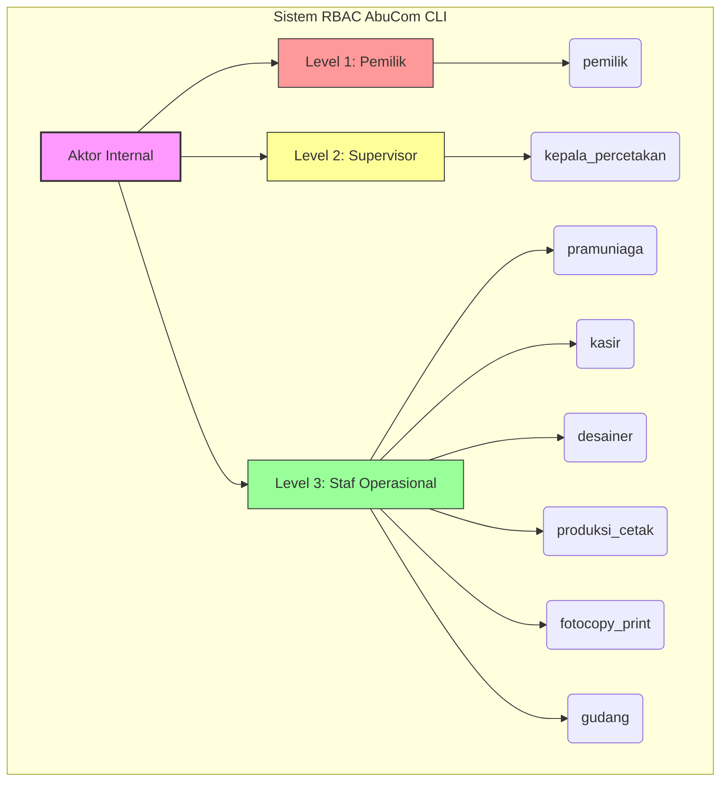
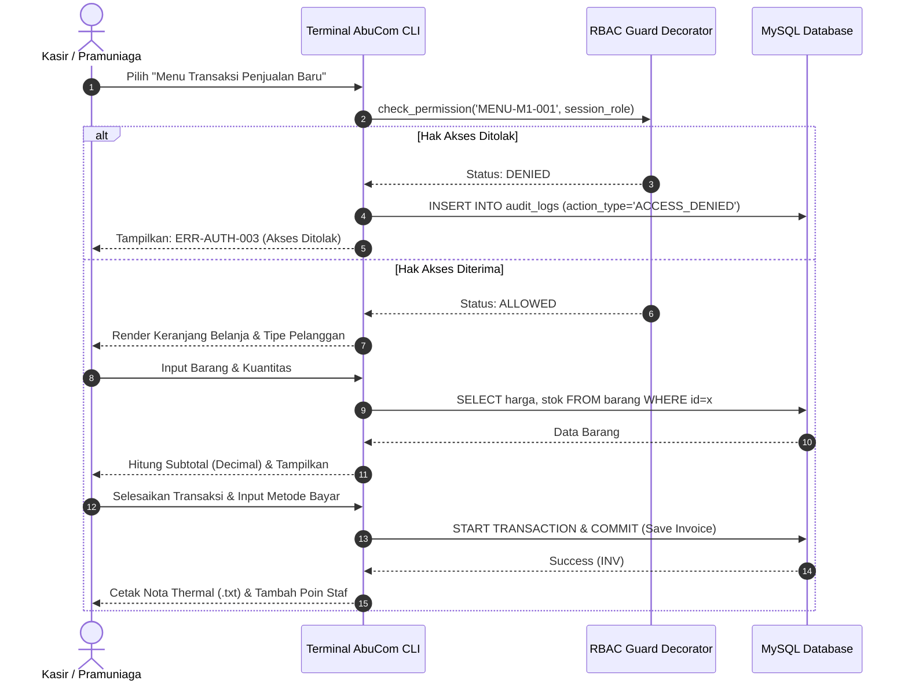
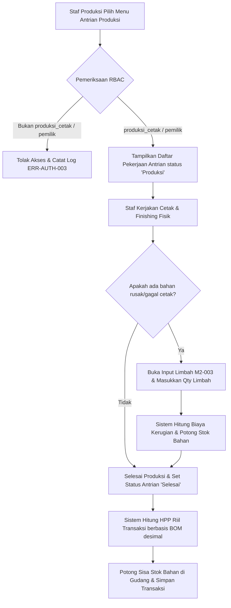
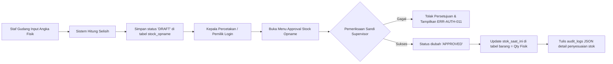
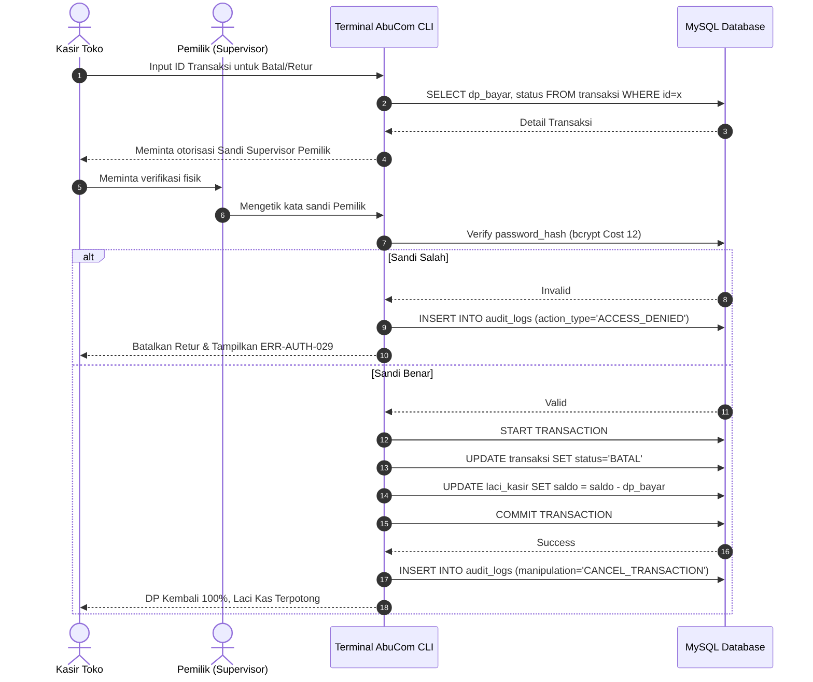
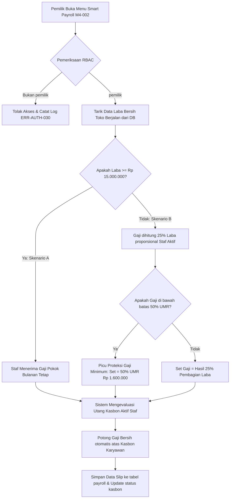

# Access Control Matrix (ACM) — AbuCom

## Riwayat Perubahan Dokumen

| Versi | Tanggal    | Perubahan | Oleh |
|---|---|---|---|
| 1.0   | 2026-05-24 | Pembuatan dokumen Access Control Matrix (ACM) pertama kali berdasarkan derivasi komprehensif BRD v1.1, SRS v1.1, Use Case Diagram v1.1, Workflow Diagram v1.1, dan Data Dictionary v1.1. Menghasilkan pemetaan granular hak akses 8 peran terhadap 44 use case dan 28 tabel CRUD database MySQL. | Senior Security Analyst & RBAC Specialist |
| 1.1   | 2026-05-24 | Hasil audit dan perbaikan menyeluruh. Memperbaiki statistik akses Bab 9 agar 100% akurat secara matematis, menyelaraskan string kode error di Bab 6 dengan SRS v1.1, dan mengurutkan secara berurutan tabel traceability Bab 8 berdasarkan ACM Entry ID. | Senior Software Architect & RBAC Security Specialist |
| 1.2   | 2026-05-28 | Validasi dan audit menyeluruh. Mengatasi missing aset pada tingkat sensitivitas Bab 3.2, mengoreksi error perhitungan statistik akses Bab 9 (Kasir dan Kepala Percetakan), serta menambah regulasi Default Deny, Inheritance, dan Review Berkala di Bab 6. | Senior Security Architect & RBAC Specialist |

---

## 1. Informasi Dokumen

### 1.1. Tujuan Dokumen
Dokumen **Access Control Matrix (ACM)** ini disusun untuk mendefinisikan secara eksplisit, granular, dan tidak ambigu seluruh hak akses yang dimiliki oleh setiap peran pengguna (*role*) terhadap setiap fungsi/menu antarmuka CLI (*Command Line Interface*) dan operasi CRUD pada tabel database sistem AbuCom.

Dokumen ini menjadi:
1. **Referensi Utama Backend**: Acuan bagi tim pengembang untuk mengimplementasikan decorator otorisasi (`@require_role`) dan guard middleware pada kode Python.
2. **Kepatuhan Regulasi**: Bukti kepatuhan terhadap prinsip *Least Privilege* dan UU Pelindungan Data Pribadi (UU PDP No. 27/2022) untuk perlindungan data pribadi pelanggan.
3. **Dasar Pengujian Keamanan**: Panduan bagi tim QA untuk melakukan penetration testing otorisasi (UAT) guna membuktikan tidak adanya celah eskalasi hak akses (*privilege escalation*).

### 1.2. Cakupan Dokumen
Dokumen ini mencakup:
* Pemetaan otorisasi terhadap **8 peran pengguna internal** dan interaksi data dengan **4 aktor eksternal**.
* Matriks granular akses untuk **44 Use Case (UC-001 s.d UC-044)** yang didistribusikan ke dalam 10 sub-modul (M.1 s.d M.10) dan 4 fungsi dasar.
* Matriks hak akses level database (operasi CRUD) untuk **28 tabel database**.
* Aturan otorisasi eskalasi supervisor (Pemilik) dan verifikasi Kepala Percetakan.
* **5 diagram alur otorisasi** workflow kritis menggunakan sintaks Mermaid.
* Matriks ketertelusuran biner dua arah (traceability) BRD ↔ ACM ↔ SRS ↔ Use Case Diagram.

### 1.3. Posisi Dokumen dalam Siklus SDLC
Dalam pengembangan AbuCom CLI, dokumen ACM ini merupakan dokumen keenam sekaligus penutup/terakhir dari **Fase 02 Analysis** (Analisis Kebutuhan). Dokumen ini mengonsolidasikan seluruh aspek keamanan logis dari BRD, SRS, Use Case, Workflow, dan Data Dictionary untuk diserahkan ke **Fase 03 Design** (System Design Document & Database Schema).

```
+--------------------------------------------------------+
|          FASE 01: PLANNING (Charter, dsb)              |
+--------------------------------------------------------+
                           |
                           v
+--------------------------------------------------------+
|  FASE 02: ANALYSIS (BRD, SRS, UCD, WFD, Dictionary)    |
+--------------------------------------------------------+
                           |
                           v
+========================================================+
|  FASE 02: Access Control Matrix (ACM) [DOKUMEN INI]    |
+========================================================+
                           |
                           v
+--------------------------------------------------------+
|    FASE 03: DESIGN (System Design, schema.sql, dsb)    |
+--------------------------------------------------------+
```

### 1.4. Hubungan dengan Dokumen SDLC Lainnya
* **Dokumen Input (BRD & SRS)**: ACM menderivasi secara formal 8 peran dari BRD Bab 5.1, tabel hak akses dari BRD Bab 5.3, spesifikasi RBAC dari SRS-F-030, Audit Trail dari SRS-F-031, dan seluruh daftar 44 Use Case.
* **Dokumen Output (System Design Document / SDD)**: Menjadi acuan perancangan decorator otorisasi `@require_role` di Python, parameter state session JWT, dan query SQL terparameterisasi.
* **Dokumen Output (Test Plan & Test Cases)**: Menjadi panduan pembuatan test suite pengujian UAT keamanan RBAC untuk memverifikasi respon biner sistem saat mendeteksi akses ilegal (`ACCESS_DENIED`).

### 1.5. Audiens Target
1. **Tim Pengembang AI (Gemini & Claude)**: Selaku arsitek dan pengembang yang menulis decorator RBAC Python dan logic database.
2. **Junior Programmer (Pemilik Usaha)**: Selaku pemilik bisnis yang memverifikasi arah kebijakan otorisasi operasional tokonya.
3. **Calon Staf Toko (Kepala Percetakan / Kasir)**: Selaku supervisor harian untuk memahami batasan hak otorisasi yang diembannya.

### 1.6. Konvensi Notasi Hak Akses
Legenda simbol otorisasi yang digunakan di seluruh matriks dokumen ini:
* `✅ FULL` = **Akses Penuh** (Create, Read, Update, Delete). Peran dapat melakukan segala operasi terhadap resource.
* `📖 READ` = **Hanya Baca** (Read Only). Peran hanya diizinkan melihat data tanpa modifikasi.
* `📝 INPUT` = **Hanya Input/Buat Baru** (Create Only). Peran diizinkan menambah data baru namun tidak bisa mengedit/menghapusnya.
* `📝+📖 INPUT+READ` = **Input dan Baca** (Create + Read). Peran diizinkan membuat dan melihat data, namun dilarang mengedit/menghapus.
* `🔒 RITEL` = **Akses Ritel Terbatas** (Hanya untuk fungsi retail cepat yang disederhanakan).
* `⛔ DENY` = **Akses Ditolak Sepenuhnya** (Default Deny). Menu/tabel disembunyikan/dikunci biner.
* `🔐 ESCALATE` = **Eskalasi Otorisasi** (Memerlukan verifikasi supervisor/sandi pemilik secara langsung di terminal).

---

## 2. Definisi Subjek Akses (Aktor/Peran)

### 2.1. Daftar Peran Internal Sistem
Peran internal adalah subjek otentikasi yang melakukan login ke terminal AbuCom CLI:

| ID Aktor | Nama Peran | Kode Peran Sistem | Deskripsi Peran | Level Hierarki |
|---|---|---|---|---|
| **ACT-01** | Pemilik Usaha | `pemilik` | Sponsor utama, junior PM, pemegang kendali anggaran dan kebijakan strategis bisnis. | **Level 1 (Pemilik / Super Admin)** |
| **ACT-02** | Kepala Percetakan | `kepala_percetakan` | Pengawas operasional harian toko, stok gudang, kehadiran staf, dan antrian job. | **Level 2 (Supervisor / Operator Utama)** |
| **ACT-03** | Staf Pramuniaga | `pramuniaga` | Petugas garda depan toko, CRM pelanggan, dan registrasi pendaftaran service. | **Level 3 (Staf Operasional)** |
| **ACT-04** | Staf Kasir | `kasir` | Pengelola laci uang kasir harian, DP/pelunasan pesanan, dan rekonsiliasi kasir harian. | **Level 3 (Staf Operasional)** |
| **ACT-05** | Staf Desainer | `desainer` | Eksekutor visual mockup pesanan kustom cetak, arsip file path desain. | **Level 3 (Staf Operasional)** |
| **ACT-06** | Staf Produksi Cetak | `produksi_cetak` | Eksekutor cetak fisik, laminasi/finishing, input pemakaian bahan riil, dan limbah. | **Level 3 (Staf Operasional)** |
| **ACT-07** | Staf Fotocopy & Print | `fotocopy_print` | Petugas pelayanan transaksi cepat ritel fotokopi dan print lembar dokumen. | **Level 3 (Staf Operasional)** |
| **ACT-08** | Staf Gudang | `gudang` | Pengelola barang masuk/keluar, data supplier, utang tempo, dan draf Stock Opname. | **Level 3 (Staf Operasional)** |

### 2.2. Hierarki dan Generalisasi Peran
Kebijakan kontrol akses AbuCom didasarkan pada prinsip **Least Privilege** (hanya memberikan hak minimum mutlak yang dibutuhkan staf untuk bekerja) and **Separation of Duties** (pemisahan peran keuangan sensitif untuk mencegah fraud internal, misalnya kasir penginput retur tidak bisa meloloskannya sendiri tanpa sandi pemilik).



### 2.3. Peran Eksternal (Non-Sistem)
Aktor eksternal adalah entitas luar yang tidak memiliki akun login CLI, namun datanya diproteksi/dikelola secara biner di database:

| ID Aktor | Nama Peran Eksternal | Hubungan Bisnis | Strategi Perlindungan Keamanan |
|---|---|---|---|
| **ACT-EXT-01** | Pelanggan AbuCom | Pembeli jasa/barang retail di konter toko. | Nomor WhatsApp disimpan di tabel `pelanggan` terenkripsi reversible di Python (Kepatuhan UU PDP No. 27/2022). |
| **ACT-EXT-02** | Vendor / Supplier | Pemasok komoditas ATK retail dan bahan baku kertas. | Rekaman harga beli dipantau di `riwayat_harga_supplier` untuk perbandingan pengadaan strategis. |
| **ACT-EXT-03** | Institusi Perbankan | Pemberi pinjaman komersil berbunga (Bank Mandiri, Bank BRI). | Dikunci absolut hanya untuk visualisasi peran `pemilik` di modul M.6. |
| **ACT-EXT-04** | Kerabat & Keluarga | Pemberi pinjaman sosial tanpa bunga fleksibel. | Dikunci absolut di modul M.6, didukung virtual `dana_cadangan_darurat` Rp 4.500.000. |

---

## 3. Definisi Objek Akses (Sumber Daya yang Dilindungi)

### 3.1. Daftar Menu CLI per Modul
Daftar menu terminal CLI yang dibatasi hak aksesnya oleh sistem otorisasi:

* **Modul M.1 — Transaksi & Kebijakan Harga**
  * `MENU-M1-001` : Mencatat Transaksi Penjualan Multi-Divisi
  * `MENU-M1-002` : Mengubah Skema Harga Otomatis (Retail, Grosir, Mitra)
  * `MENU-M1-003` : Mengelola Pembayaran Uang Muka (DP) & Pelunasan
  * `MENU-M1-004` : Memproses Pembatalan Transaksi & Retur Barang
  * `MENU-M1-005` : Melacak Margin Keuntungan per Produk
  * `MENU-M1-006` : Mengekspor Struk Nota format Thermal (.txt)
* **Modul M.2 — Inventaris, BOM & Stock Opname**
  * `MENU-M2-001` : Mengelola Barang & Satuan UoM (Unit of Measure)
  * `MENU-M2-002` : Menghitung HPP Otomatis Berbasis BOM Desimal
  * `MENU-M2-003` : Mencatat Limbah Produksi (Waste Management)
  * `MENU-M2-004` : Sinkronisasi Barang Retail untuk Produksi Internal
  * `MENU-M2-005` : Memproses Rekonsiliasi Stok (Stock Opname)
  * `MENU-M2-006` : Analisis Prediksi Re-Order Stok Bahan Baku
  * `MENU-M2-007` : Melacak Riwayat Harga Beli Supplier (Price Tracking)
  * `MENU-M2-008` : Mengimpor Data Awal dari CSV Semiautomatis
  * `MENU-M2-009` : Mengelola Supplier & Utang Usaha (Tempo)
  * `MENU-M2-010` : Melakukan Backup & Restore Database Manual
* **Modul M.3 — Layanan Keuangan, PPOB & Jasa Service**
  * `MENU-M3-001` : Mengelola Saldo PPOB & Alert Deposit Otomatis
  * `MENU-M3-002` : Menentukan Akun Jasa Keuangan Terhemat (6 Akun Digital)
  * `MENU-M3-003` : Mencatat Transaksi Jasa Service & Teknisi
* **Modul M.4 — SDM, Penggajian & Poin Karyawan**
  * `MENU-M4-001` : Mengelola Data Karyawan, Absensi, dan Kasbon
  * `MENU-M4-002` : Memproses Penggajian Cerdas (Smart Payroll)
  * `MENU-M4-003` : Mengakumulasi Poin Insentif Karyawan Berbasis Beban Kerja
  * `MENU-M4-004` : Memotong Gaji Otomatis atas Kasbon Aktif
* **Modul M.5 — Antrian & Pelacakan Desain**
  * `MENU-M5-001` : Melacak Status Antrian Pekerjaan (Job Tracking 5 Status)
  * `MENU-M5-002` : Mengelola Arsip Desain Pelanggan (File Path)
  * `MENU-M5-003` : Membuat Link Notifikasi WhatsApp Web
* **Modul M.6 — Pinjaman, Aset & Pengeluaran**
  * `MENU-M6-001` : Mengelola Pinjaman Modal Terstruktur (Bank & Keluarga)
  * `MENU-M6-002` : Melihat Laba/Rugi Instan per Divisi Usaha
  * `MENU-M6-003` : Menerima Notifikasi Jatuh Tempo Utang H-3
  * `MENU-M6-004` : Mengelola Aset Tetap, Depresiasi, dan Tabungan Virtual Aset
  * `MENU-M6-005` : Mengelola Pengeluaran Rutin & Biaya Tak Terduga
* **Modul M.7 — Keamanan, Audit Trail & Hak Akses**
  * `MENU-M7-001` : Mengakses Menu Berdasarkan RBAC Multi-Level
  * `MENU-M7-002` : Mengaudit Modifikasi Data Melalui Log Audit JSON
  * `MENU-M7-003` : Melakukan Serah Terima Shift Karyawan (Handover)
  * `MENU-M7-004` : Melakukan Rekonsiliasi Kas Harian Kasir
  * `MENU-M7-005` : Memantau Peringatan Anomali Transaksi (Fraud Detection)
  * `MENU-M7-006` : Menginput Data Awal secara Manual dari Excel (Setup Wizard)
* **Modul M.8 — CRM Pelanggan**
  * `MENU-M8-001` : Mengelola Database CRM & Riwayat Pelanggan
* **Modul M.9 — Skalabilitas Multi-Cabang**
  * `MENU-M9-001` : Menerapkan Identifikasi Multi-Cabang (`cabang_id` Column)
* **Modul M.10 — Konfigurasi Sistem Runtime**
  * `MENU-M10-001` : Mengonfigurasi Parameter Bisnis Runtime (`system_configs`)
* **Use Case Dasar**
  * `MENU-BASE-001` : Melakukan Login ke Sistem
  * `MENU-BASE-002` : Melakukan Logout dari Sesi CLI
  * `MENU-BASE-003` : Melihat Dashboard Ringkasan Harian (Dashboard Utama)
  * `MENU-BASE-004` : Mengubah Password Akun Sendiri

### 3.2. Daftar Tabel Database yang Dilindungi
Total 28 tabel database MySQL yang dilindungi dikelompokkan berdasarkan tingkat sensitivitas data (Semua tabel terpetakan):
1. **Sangat Sensitif (Pemilik Sahaja — Absolute Lockdown)**:
   * `pinjaman_bank`, `pinjaman_kerabat`, `payroll`, `system_configs`, `backup_logs`, `aset`
2. **Sensitif (Akses Terbatas Staf Khusus / Otorisasi Eskalasi)**:
   * `transaksi`, `pengeluaran`, `audit_logs`, `shift_handover`, `utang_supplier`, `limbah_produksi`, `stock_opname`
3. **Operasional (Akses Terbuka untuk Staf terkait)**:
   * `cabang`, `pengguna`, `pelanggan`, `supplier`, `barang`, `bom_komposisi`, `detail_transaksi`, `antrian_kerja`, `absensi`, `kasbon`, `saldo_ppob`, `jasa_service`, `poin_insentif`, `saldo_ewallet`, `riwayat_harga_supplier`

### 3.3. Daftar Fungsi/Operasi Bisnis Kritis
Operasi yang berisiko finansial tinggi dan wajib diproteksi biner di tingkat logic program:
* **Hapus Transaksi / DP Kembali**: Risiko kebocoran kas laci (Fraud).
* **Persetujuan Stock Opname (Approve)**: Risiko manipulasi jumlah stok barang fisik yang hilang di gudang.
* **Proses Payroll (Smart Payroll)**: Risiko manipulasi pembagian bonus / kasbon bulanan.
* **Perubahan Runtime Parameter**: Risiko mengubah toleransi kas, UMR, threshold limit kasbon.
* **Backup & Restore Database**: Risiko kebocoran data terenkripsi atau data overwrite ilegal.

---

## 4. Matriks Kontrol Akses Utama

### 4.1. Konvensi Simbol Akses (Legenda)
* **✅ FULL** : Akses penuh (C, R, U, D)
* **📖 READ** : Hanya baca data (R)
* **📝 INPUT** : Hanya input data baru (C)
* **📝+📖** : Input dan Baca data (C, R)
* **🔒 RTL** : Akses ritel eceran terbatas
* **⛔ DENY** : Akses ditolak sepenuhnya
* **🔐 ESC** : Otorisasi eskalasi supervisor (Memasukkan sandi Pemilik)

### 4.2. Matriks Akses: Modul M.1 — Transaksi & Kebijakan Harga

| ID Menu | Menu/Fungsi CLI | pemilik | kepala_percetakan | pramuniaga | kasir | desainer | produksi_cetak | fotocopy_print | gudang | Catatan Keamanan / Khusus |
|---|---|:---:|:---:|:---:|:---:|:---:|:---:|:---:|:---:|---|
| `M1-001` | Mencatat Transaksi | ✅ FULL | 📖 READ | 📝 INPUT | ✅ FULL | ⛔ DENY | ⛔ DENY | 🔒 RTL | ⛔ DENY | `fotocopy_print` hanya cetak biner retail eceran. |
| `M1-002` | Mengubah Skema Harga | ✅ FULL | 📖 READ | 📖 READ | 📖 READ | ⛔ DENY | ⛔ DENY | ⛔ DENY | ⛔ DENY | Skema ditarik dinamis. Edit skema hanya Pemilik. |
| `M1-003` | Kelola DP & Pelunasan | ✅ FULL | ⛔ DENY | ⛔ DENY | ✅ FULL | ⛔ DENY | ⛔ DENY | ⛔ DENY | ⛔ DENY | Khusus kasir untuk menangani uang laci. |
| `M1-004` | Pembatalan & Retur | ✅ FULL | ⛔ DENY | ⛔ DENY | 🔐 ESC | ⛔ DENY | ⛔ DENY | ⛔ DENY | ⛔ DENY | `kasir` memerlukan eskalasi sandi `pemilik`. |
| `M1-005` | Margin per Produk | ✅ FULL | ⛔ DENY | ⛔ DENY | ⛔ DENY | ⛔ DENY | ⛔ DENY | ⛔ DENY | ⛔ DENY | Terkunci rapat untuk Pemilik (Privat HPP). |
| `M1-006` | Ekspor Struk Thermal | ✅ FULL | ⛔ DENY | ⛔ DENY | ✅ FULL | ⛔ DENY | ⛔ DENY | ⛔ DENY | ⛔ DENY | Ekspor file format .txt ke printer thermal. |

### 4.3. Matriks Akses: Modul M.2 — Inventaris, BOM & Stock Opname

| ID Menu | Menu/Fungsi CLI | pemilik | kepala_percetakan | pramuniaga | kasir | desainer | produksi_cetak | fotocopy_print | gudang | Catatan Keamanan / Khusus |
|---|---|:---:|:---:|:---:|:---:|:---:|:---:|:---:|:---:|---|
| `M2-001` | Kelola Barang & UoM | ✅ FULL | ✅ FULL | ⛔ DENY | ⛔ DENY | ⛔ DENY | 📖 READ | ⛔ DENY | ✅ FULL | Gudang & Kepala mengontrol master logistik. |
| `M2-002` | Hitung HPP BOM Desimal| ✅ FULL | 📖 READ | ⛔ DENY | ⛔ DENY | ⛔ DENY | 📝 INPUT | ⛔ DENY | ⛔ DENY | `produksi_cetak` input pemakaian riil. |
| `M2-003` | Mencatat Limbah | ✅ FULL | 📖 READ | ⛔ DENY | ⛔ DENY | ⛔ DENY | 📝 INPUT | ⛔ DENY | ⛔ DENY | Biaya limbah dibukukan ke tabel pengeluaran. |
| `M2-004` | Sinkronisasi ATK Internal| ✅ FULL | ✅ FULL | ⛔ DENY | ⛔ DENY | ⛔ DENY | 📝 INPUT | ⛔ DENY | 📝 INPUT | Konversi barang ATK eceran ke produksi. |
| `M2-005` | Rekonsiliasi Stok | ✅ FULL | 🔐 ESC | ⛔ DENY | ⛔ DENY | ⛔ DENY | ⛔ DENY | ⛔ DENY | 📝 INPUT | `gudang` input DRAFT, `kepala` menyetujui (🔐). |
| `M2-006` | Prediksi Re-Order Stok | ✅ FULL | 📖 READ | ⛔ DENY | ⛔ DENY | ⛔ DENY | ⛔ DENY | ⛔ DENY | 📖 READ | Memicu alert jika sisa stok bahan < 7 hari. |
| `M2-007` | Price Tracking Supplier | ✅ FULL | 📖 READ | ⛔ DENY | ⛔ DENY | ⛔ DENY | ⛔ DENY | ⛔ DENY | 📖 READ | Pelacakan fluktuasi harga beli historis. |
| `M2-008` | Impor Data CSV | ✅ FULL | ⛔ DENY | ⛔ DENY | ⛔ DENY | ⛔ DENY | ⛔ DENY | ⛔ DENY | 📝 INPUT | Skrip bulk insert setup data awal. |
| `M2-009` | Kelola Supplier & Utang | ✅ FULL | ✅ FULL | ⛔ DENY | ⛔ DENY | ⛔ DENY | ⛔ DENY | ⛔ DENY | ✅ FULL | Mengelola profil supplier & utang belanja tempo. |
| `M2-010` | Backup & Restore DB | ✅ FULL | ⛔ DENY | ⛔ DENY | ⛔ DENY | ⛔ DENY | ⛔ DENY | ⛔ DENY | ⛔ DENY | Ekspor ZIP AES-256 (Absolute Lockdown). |

### 4.4. Matriks Akses: Modul M.3 — Layanan Keuangan, PPOB & Jasa Service

| ID Menu | Menu/Fungsi CLI | pemilik | kepala_percetakan | pramuniaga | kasir | desainer | produksi_cetak | fotocopy_print | gudang | Catatan Keamanan / Khusus |
|---|---|:---:|:---:|:---:|:---:|:---:|:---:|:---:|:---:|---|
| `M3-001` | Kelola Saldo PPOB | ✅ FULL | ⛔ DENY | ⛔ DENY | 📝+📖 | ⛔ DENY | ⛔ DENY | ⛔ DENY | ⛔ DENY | Alert deposit kritis jika saldo < Rp 150.000. |
| `M3-002` | Akun Keuangan Terhemat | ✅ FULL | ⛔ DENY | ⛔ DENY | 📖 READ | ⛔ DENY | ⛔ DENY | ⛔ DENY | ⛔ DENY | Perbandingan biaya admin 6 dompet digital. |
| `M3-003` | Transaksi Jasa Service | ✅ FULL | ⛔ DENY | 📝 INPUT | ✅ FULL | ⛔ DENY | ⛔ DENY | ⛔ DENY | ⛔ DENY | Pendaftaran oleh pramuniaga, bayar ke kasir. |

### 4.5. Matriks Akses: Modul M.4 — SDM, Penggajian & Poin Karyawan

| ID Menu | Menu/Fungsi CLI | pemilik | kepala_percetakan | pramuniaga | kasir | desainer | produksi_cetak | fotocopy_print | gudang | Catatan Keamanan / Khusus |
|---|---|:---:|:---:|:---:|:---:|:---:|:---:|:---:|:---:|---|
| `M4-001` | Kelola Absensi & Kasbon| ✅ FULL | ✅ FULL | 📝 INPUT | 📝 INPUT | 📝 INPUT | 📝 INPUT | 📝 INPUT | 📝 INPUT | `stok` absensi harian diri sendiri (`📝 INPUT`). |
| `M4-002` | Memproses Gaji | ✅ FULL | ⛔ DENY | ⛔ DENY | ⛔ DENY | ⛔ DENY | ⛔ DENY | ⛔ DENY | ⛔ DENY | Komputasi Smart Payroll (Lockdown Pemilik). |
| `M4-003` | Poin Insentif Karyawan | ✅ FULL | ⛔ DENY | ⛔ DENY | 📖 READ | ⛔ DENY | ⛔ DENY | ⛔ DENY | ⛔ DENY | Tambahan otomatis ke slip gaji berdasarkan tier. |
| `M4-004` | Potongan Gaji Kasbon | ✅ FULL | ⛔ DENY | ⛔ DENY | ⛔ DENY | ⛔ DENY | ⛔ DENY | ⛔ DENY | ⛔ DENY | Pengurangan biner otomatis saat payroll diproses. |

### 4.6. Matriks Akses: Modul M.5 — Antrian & Pelacakan Desain

| ID Menu | Menu/Fungsi CLI | pemilik | kepala_percetakan | pramuniaga | kasir | desainer | produksi_cetak | fotocopy_print | gudang | Catatan Keamanan / Khusus |
|---|---|:---:|:---:|:---:|:---:|:---:|:---:|:---:|:---:|---|
| `M5-001` | Pelacakan Status Antrian| ✅ FULL | ✅ FULL | 📝 INPUT | 📝 INPUT | 📝 INPUT | 📝 INPUT | ⛔ DENY | ⛔ DENY | Transisi terstruktur (5 tahapan status). |
| `M5-002` | Mengelola Arsip Desain | ✅ FULL | ⛔ DENY | 📖 READ | ⛔ DENY | ✅ FULL | ⛔ DENY | ⛔ DENY | ⛔ DENY | `desainer` input path. `pramuniaga` re-order. |
| `M5-003` | Link WhatsApp Web | ✅ FULL | ⛔ DENY | 📝 INPUT | 📝 INPUT | ⛔ DENY | ⛔ DENY | ⛔ DENY | ⛔ DENY | Tautan notifikasi siap salin ke clipboard. |

### 4.7. Matriks Akses: Modul M.6 — Pinjaman, Aset & Pengeluaran

| ID Menu | Menu/Fungsi CLI | pemilik | kepala_percetakan | pramuniaga | kasir | desainer | produksi_cetak | fotocopy_print | gudang | Catatan Keamanan / Khusus |
|---|---|:---:|:---:|:---:|:---:|:---:|:---:|:---:|:---:|---|
| `M6-001` | Pinjaman Modal | ✅ FULL | ⛔ DENY | ⛔ DENY | ⛔ DENY | ⛔ DENY | ⛔ DENY | ⛔ DENY | ⛔ DENY | Pinjaman bank & kerabat (Absolute Lockdown). |
| `M6-002` | Laba/Rugi per Divisi | ✅ FULL | ⛔ DENY | ⛔ DENY | ⛔ DENY | ⛔ DENY | ⛔ DENY | ⛔ DENY | ⛔ DENY | Instan < 5 detik terintegrasi database. |
| `M6-003` | Alert Jatuh Tempo Utang| ✅ FULL | ⛔ DENY | ⛔ DENY | ⛔ DENY | ⛔ DENY | ⛔ DENY | ⛔ DENY | ⛔ DENY | Notifikasi otomatis H-3 sebelum jatuh tempo. |
| `M6-004` | Depresiasi & Tabungan Aset| ✅ FULL | ⛔ DENY | ⛔ DENY | ⛔ DENY | ⛔ DENY | ⛔ DENY | ⛔ DENY | ⛔ DENY | Penyusutan garis lurus & alokasi aset virtual. |
| `M6-005` | Pengeluaran Rutin & Tak| ✅ FULL | 📝 INPUT | ⛔ DENY | 📝 INPUT | ⛔ DENY | ⛔ DENY | ⛔ DENY | ⛔ DENY | Pengeluaran > Rp 500.000 wajib otorisasi (🔐). |

### 4.8. Matriks Akses: Modul M.7 — Keamanan, Audit Trail & Hak Akses

| ID Menu | Menu/Fungsi CLI | pemilik | kepala_percetakan | pramuniaga | kasir | desainer | produksi_cetak | fotocopy_print | gudang | Catatan Keamanan / Khusus |
|---|---|:---:|:---:|:---:|:---:|:---:|:---:|:---:|:---:|---|
| `M7-001` | Akses RBAC CLI | ✅ FULL | ⛔ DENY | ⛔ DENY | ⛔ DENY | ⛔ DENY | ⛔ DENY | ⛔ DENY | ⛔ DENY | Decorator checks (Absolute Lockdown). |
| `M7-002` | Audit Log Trail JSON | ✅ FULL | ⛔ DENY | ⛔ DENY | ⛔ DENY | ⛔ DENY | ⛔ DENY | ⛔ DENY | ⛔ DENY | Rekaman data lama & baru terkompresi JSON. |
| `M7-003` | Serah Terima Shift | ✅ FULL | 🔐 ESC | ⛔ DENY | 📝 INPUT | ⛔ DENY | ⛔ DENY | ⛔ DENY | ⛔ DENY | Kasir input, Kepala Percetakan validasi (🔐). |
| `M7-004` | Rekonsiliasi Kas | ✅ FULL | 📖 READ | ⛔ DENY | 📝 INPUT | ⛔ DENY | ⛔ DENY | ⛔ DENY | ⛔ DENY | Toleransi selisih laci kasir Rp 10.000. |
| `M7-005` | Fraud Detection | ✅ FULL | ⛔ DENY | ⛔ DENY | ⛔ DENY | ⛔ DENY | ⛔ DENY | ⛔ DENY | ⛔ DENY | Alert indikator visual anomali kasir harian. |
| `M7-006` | Setup Awal Wizard | ✅ FULL | ⛔ DENY | ⛔ DENY | ⛔ DENY | ⛔ DENY | ⛔ DENY | ⛔ DENY | ⛔ DENY | Migrasi awal manual Excel (Shutdown kasir). |

### 4.9. Matriks Akses: Modul M.8 — CRM Pelanggan

| ID Menu | Menu/Fungsi CLI | pemilik | kepala_percetakan | pramuniaga | kasir | desainer | produksi_cetak | fotocopy_print | gudang | Catatan Keamanan / Khusus |
|---|---|:---:|:---:|:---:|:---:|:---:|:---:|:---:|:---:|---|
| `M8-001` | Database CRM | ✅ FULL | ⛔ DENY | ✅ FULL | ✅ FULL | ⛔ DENY | ⛔ DENY | ⛔ DENY | ⛔ DENY | Privasi terlindung (UU PDP No. 27/2022). |

### 4.10. Matriks Akses: Modul M.9 — Skalabilitas Multi-Cabang

| ID Menu | Menu/Fungsi CLI | pemilik | kepala_percetakan | pramuniaga | kasir | desainer | produksi_cetak | fotocopy_print | gudang | Catatan Keamanan / Khusus |
|---|---|:---:|:---:|:---:|:---:|:---:|:---:|:---:|:---:|---|
| `M9-001` | Multi-Cabang | ✅ FULL | ⛔ DENY | ⛔ DENY | ⛔ DENY | ⛔ DENY | ⛔ DENY | ⛔ DENY | ⛔ DENY | Identifikasi otomatis via kolom `cabang_id`. |

### 4.11. Matriks Akses: Modul M.10 — Konfigurasi Sistem Runtime

| ID Menu | Menu/Fungsi CLI | pemilik | kepala_percetakan | pramuniaga | kasir | desainer | produksi_cetak | fotocopy_print | gudang | Catatan Keamanan / Khusus |
|---|---|:---:|:---:|:---:|:---:|:---:|:---:|:---:|:---:|---|
| `M10-001`| Parameter Runtime | ✅ FULL | ⛔ DENY | ⛔ DENY | ⛔ DENY | ⛔ DENY | ⛔ DENY | ⛔ DENY | ⛔ DENY | Kunci configs `system_configs` di database. |

### 4.12. Matriks Akses: Use Case Dasar Operasional

| ID Menu | Menu/Fungsi CLI | pemilik | kepala_percetakan | pramuniaga | kasir | desainer | produksi_cetak | fotocopy_print | gudang | Catatan Keamanan / Khusus |
|---|---|:---:|:---:|:---:|:---:|:---:|:---:|:---:|:---:|---|
| `BASE-001`| Melakukan Login | ✅ FULL | ✅ FULL | ✅ FULL | ✅ FULL | ✅ FULL | ✅ FULL | ✅ FULL | ✅ FULL | Otentikasi bcrypt, session JWT HS256. |
| `BASE-002`| Melakukan Logout | ✅ FULL | ✅ FULL | ✅ FULL | ✅ FULL | ✅ FULL | ✅ FULL | ✅ FULL | ✅ FULL | Menghapus token JWT lokal pada memori. |
| `BASE-003`| Dashboard Utama | ✅ FULL | ✅ FULL | ✅ FULL | ✅ FULL | ✅ FULL | ✅ FULL | ✅ FULL | ✅ FULL | ANSI kontras tabulate grid ANSI console. |
| `BASE-004`| Mengubah Password | ✅ FULL | ✅ FULL | ✅ FULL | ✅ FULL | ✅ FULL | ✅ FULL | ✅ FULL | ✅ FULL | Khusus pengubahan kata sandi diri sendiri. |

---

## 5. Matriks Akses Level Database (Tabel CRUD)

### 5.1. Konvensi Operasi CRUD
* `C` = Create (Operasi `INSERT` SQL)
* `R` = Read (Operasi `SELECT` SQL)
* `U` = Update (Operasi `UPDATE` SQL)
* `D` = Delete (Operasi `DELETE` SQL)
* `-` = Ditolak Sepenuhnya (Tidak ada hak akses SQL untuk objek ini)
* `*` = Melalui Sistem Otomatis (Aksi dipicu logic program transaksional, bukan entri manual user)

### 5.2. Matriks CRUD per Tabel Database

| # | Nama Tabel Database | pemilik | kepala_percetakan | pramuniaga | kasir | desainer | produksi_cetak | fotocopy_print | gudang | Catatan Integritas Data |
|---|---|:---:|:---:|:---:|:---:|:---:|:---:|:---:|:---:|---|
| 1 | `cabang` | CRUD | R--- | R--- | R--- | R--- | R--- | R--- | R--- | Read-only untuk semua staf. |
| 2 | `pengguna` | CRUD | -R-- | -R-- | -R-- | -R-- | -R-- | -R-- | -R-- | Staf hanya `U` untuk password sendiri. |
| 3 | `pelanggan` | CRUD | R--- | CRU- | CRU- | ---- | ---- | ---- | ---- | CRM terproteksi UU PDP. Nomor WA terenkripsi. |
| 4 | `supplier` | CRUD | CRU- | ---- | ---- | ---- | ---- | ---- | CRU- | Pengelolaan vendor ATK & Bahan Baku. |
| 5 | `barang` | CRUD | CRU- | -R-- | -R-- | -R-- | -R-- | -R-- | CRU- | Kolom `stok_saat_ini` terpotong otomatis (`*`). |
| 6 | `bom_komposisi` | CRUD | -R-- | ---- | ---- | ---- | -R-- | ---- | ---- | Kunci racikan produk kustom. |
| 7 | `transaksi` | CRUD | -R-- | C-R- | CRU- | ---- | ---- | C-R- | ---- | Mutasi uang dipicu transaksi kasir. |
| 8 | `detail_transaksi` | CRUD | -R-- | C-R- | CRU- | ---- | ---- | C-R- | ---- | Cascade delete terikat `transaksi_id` di InnoDB. |
| 9 | `antrian_kerja` | CRUD | -RU- | CR-- | -RU- | -RU- | -RU- | ---- | ---- | Transisi sekuensial status pengerjaan. |
| 10| `absensi` | CRUD | CRU- | C--- | C--- | C--- | C--- | C--- | C--- | Staf hanya input absensi masuk harian. |
| 11| `kasbon` | CRUD | -R-- | -R-- | -R-- | -R-- | -R-- | -R-- | -R-- | Staf hanya melihat sisa kasbon sendiri. |
| 12| `payroll` | CRUD | ---- | ---- | ---- | ---- | ---- | ---- | ---- | slip upah privat (Lockdown absolut Pemilik). |
| 13| `pengeluaran` | CRUD | CRU- | ---- | C-R- | ---- | ---- | ---- | ---- | `kasir` input, `kepala` approve < Rp 500rb. |
| 14| `audit_logs` | CRUD | ---- | ---- | ---- | ---- | ---- | ---- | ---- | JSON format. Hanya dapat dibaca Pemilik. |
| 15| `limbah_produksi` | CRUD | -R-- | ---- | ---- | ---- | CR-- | ---- | ---- | Dipotong otomatis dari stok bahan. |
| 16| `saldo_ppob` | CRUD | ---- | ---- | -RU- | ---- | ---- | ---- | ---- | Terintegrasi alert limit deposit kritis. |
| 17| `jasa_service` | CRUD | -R-- | CRU- | CRU- | ---- | ---- | ---- | ---- | lookup suku cadang ke tabel `barang`. |
| 18| `poin_insentif` | CRUD | ---- | ---- | CR-- | ---- | ---- | ---- | ---- | Poin dihitung otomatis transaksional. |
| 19| `shift_handover` | CRUD | -RU- | ---- | CR-- | ---- | ---- | ---- | ---- | `kasir` input, `kepala` menyetujui (U). |
| 20| `utang_supplier` | CRUD | CRU- | ---- | ---- | ---- | ---- | ---- | CRU- | Pelacakan jatuh tempo belanja tempo. |
| 21| `backup_logs` | CRUD | ---- | ---- | ---- | ---- | ---- | ---- | ---- | Pencatatan ekspor biner cadangan manual. |
| 22| `pinjaman_bank` | CRUD | ---- | ---- | ---- | ---- | ---- | ---- | ---- | Plafon kredit Mandiri & BRI (Lockdown). |
| 23| `pinjaman_kerabat`| CRUD | ---- | ---- | ---- | ---- | ---- | ---- | ---- | Utang titipan moral (Lockdown Pemilik). |
| 24| `aset` | CRUD | ---- | ---- | ---- | ---- | ---- | ---- | ---- | Penyusutan garis lurus database. |
| 25| `stock_opname` | CRUD | -RU- | ---- | ---- | ---- | ---- | ---- | CR-- | `gudang` input DRAFT, `kepala` approve (U). |
| 26| `riwayat_harga_supplier`| CRUD | -R-- | ---- | ---- | ---- | ---- | ---- | CR-- | komparasi supplier pengadaan. |
| 27| `saldo_ewallet` | CRUD | ---- | ---- | -R-- | ---- | ---- | ---- | ---- | Perbandingan tarif 6 dompet digital. |
| 28| `system_configs` | CRUD | -R-- | -R-- | -R-- | -R-- | -R-- | -R-- | -R-- | Dimuat sebagai runtime static memory. |

---

## 6. Aturan Otorisasi Khusus dan Eskalasi

### 6.1. Aturan Otorisasi Supervisor (Eskalasi Pemilik)
Operasi kritis yang tidak dapat dieksekusi oleh staf secara langsung, melainkan memerlukan kehadiran Pemilik secara fisik untuk memasukkan kata sandinya pada laci terminal kasir CLI:

| No | Operasi Kritis | Pemicu Eskalasi Keamanan | Peran Pemohon | Peran Penyetuju | Respon Jika Sandi Salah (ERR) |
|---|---|---|---|---|---|
| 1 | **Pembatalan Transaksi (Retur DP)** | Memilih menu retur/batal pesanan. | `kasir` | `pemilik` | `ERR-AUTH-003: Akses Ditolak: Hak Akses Pemilik Dibutuhkan!` |
| 2 | **Retur Barang Retail ATK** | Input kuantitas retur barang ATK. | `kasir` | `pemilik` | `ERR-AUTH-003: Akses Ditolak: Hak Akses Pemilik Dibutuhkan!` |
| 3 | **Pengeluaran Besar (> Rp 500.000)** | Input nominal `pengeluaran.nominal` > Rp 500.000. | `kasir` / `kepala_percetakan` | `pemilik` | `ERR-AUTH-029: Verifikasi sandi Pemilik gagal. Pengeluaran besar dibatalkan!` |
| 4 | **Restorasi Database Manual** | Memilih menu pemulihan basis data. | `gudang` | `pemilik` | `ERR-FILE-039: Gagal memulihkan data. Berkas cadangan korup atau sandi enkripsi salah!` |

### 6.2. Aturan Otorisasi Kepala Percetakan
Operasi verifikasi harian toko yang memerlukan persetujuan otorisasi digital dari Kepala Percetakan:

| No | Operasi Verifikasi | Pemicu Otorisasi | Peran Pemohon | Peran Penyetuju | Respon Jika Penyetuju Salah (ERR) |
|---|---|---|---|---|---|
| 1 | **Persetujuan Stock Opname** | Mengubah status `stock_opname` 'DRAFT' &rarr; 'APPROVED'. | `gudang` | `kepala_percetakan` | `ERR-AUTH-011: Hak akses supervisor dibutuhkan untuk menyetujui Stock Opname!` |
| 2 | **Serah Terima Shift (Normal)** | Validasi biner kecocokan kas laci fisik vs sistem. | `kasir` | `kepala_percetakan` | `ERR-AUTH-011: Hak akses supervisor dibutuhkan untuk menyetujui Serah Terima Shift!` |
| 3 | **Serah Terima Shift (Anomali)** | Validasi anomali selisih kas > Rp 10.000. | `kasir` | `kepala_percetakan` (ditambah memo alasan) | `ERR-CASH-001: Selisih Gagal: Selisih Rp [Nominal] melebihi batas Rp 10.000!` |

### 6.3. Aturan Pembatasan Akses Data Sensitif
Seluruh staf operasional (ACT-03 s.d ACT-08) mutlak dilarang mengakses data keuangan privat milik Pemilik.
* **Dasar Hukum**: Standar kepatuhan industri dan **Undang-Undang Pelindungan Data Pribadi (UU PDP No. 27/2022)** Indonesia.
* **Implementasi Kode**: Kolom `whatsapp` pada CRM pelanggan terenkripsi kuat menggunakan modul `cryptography` Python biner reversibel. Password staf di database MySQL di-hash menggunakan algoritma **bcrypt dengan Cost Factor = 12** yang dilengkapi salt dinamis.

### 6.4. Aturan Session dan Timeout Akses (JWT)
* **Session Token**: Autentikasi login menggunakan model stateless session **JSON Web Token (JWT)** yang dikunci menggunakan algoritma tanda tangan **HS256** dan kunci rahasia (*secret key*) dari berkas `.env` lokal.
* **Masa Aktif Sesi**: Masa berlaku token sesi dikunci selama **28.800 detik (8 jam)**. Setelah 8 jam berlalu, logic Python menangkap kedaluwarsa token JWT (`jwt.ExpiredSignatureError`), membersihkan memory session local, dan memaksa terminal keluar ke layar login awal dengan pesan: `ERR-SESSION-002: Sesi login tidak sah/rusak. Harap login kembali!`.

### 6.5. Aturan Rate Limiting dan Penguncian Akun
Untuk menghindari serangan tebakan kata sandi kamus (*brute-force attacks*) pada terminal kasir CLI:
* **Batas Toleransi**: Kegagalan login berturut-turut dibatasi maksimal **5 kali**.
* **Suspensi Akun**: Pada kegagalan ke-5, sistem menuliskan status `failed_login_attempts = 5` dan timestamp `locked_until` ke dalam baris tabel `pengguna` MySQL, menangguhkan akun selama **600 detik (10 menit)**. Selama masa suspensi, sistem menolak otentikasi login akun tersebut dengan pesan: `ERR-AUTH-002: Sandi Gagal: Akun ditangguhkan selama 10 menit akibat brute-force!`.

### 6.6. Aturan Pencatatan Audit Trail pada Pelanggaran Akses
Setiap kali sistem otorisasi RBAC Python CLI mendeteksi dan menggagalkan percobaan akses ilegal oleh peran staf yang tidak berhak:
1. Sistem **wajib** mencatatkan satu entri pelanggaran keamanan ke tabel database `audit_logs`.
2. Struktur field log audit wajib terisi:
   * `pengguna_id` = ID Staf yang melanggar.
   * `action_timestamp` = CURRENT_TIMESTAMP.
   * `action_type` = `'ACCESS_DENIED'`.
   * `target_table` = Nama modul / menu target.
   * `old_value` = JSON string berisi detail argumen input command.
   * `new_value` = `'ILLEGAL_ACCESS_PREVENTED'`.

### 6.7. Default Deny Policy
Sistem menerapkan **Default Deny Policy** di seluruh tingkatan otorisasi. Artinya, setiap endpoint fungsi, rute modul, maupun interaksi tabel database secara baku akan selalu menolak akses pengguna, kecuali apabila hak akses tersebut dideklarasikan secara eksplisit dalam daftar whitelist matriks izin peran pengguna ini. Jika sebuah peran (role) tidak secara khusus disebutkan memiliki akses `FULL`, `READ`, atau `INPUT` terhadap fungsi tertentu, maka sistem seketika memblokir eksekusi fungsi tersebut secara otomatis.

### 6.8. Inheritance Policy (Kebijakan Pewarisan)
Dalam arsitektur otorisasi AbuCom, **tidak terdapat** mekanisme pewarisan (inheritance) hak akses ke bawah secara kaskade (cascade downward). Setiap peran memiliki domain otorisasi yang bersifat unik dan terisolasi. Meskipun peran `kepala_percetakan` berada di hierarki Level 2 (Supervisor), peran tersebut tidak secara otomatis mewarisi seluruh hak akses operasional Level 3 (Staf Operasional). Sebagai contoh, `kepala_percetakan` dilarang memproses transaksi kasir atau mendaftarkan pelanggan CRM, guna menjamin integritas *Separation of Duties*.

### 6.9. Kebijakan Review Berkala
Access Control Matrix (ACM) ini wajib menjalani evaluasi dan *review* secara berkala setiap **6 bulan sekali**, atau setiap kali terjadi rilis mayor perubahan modul bisnis. Evaluasi dilakukan oleh Manajemen Keamanan (atau representasi pemilik) untuk meninjau apakah hak akses yang dimiliki setiap peran masih selaras dengan kondisi operasional terbaru, memangkas *privilege creep* (akumulasi hak akses berlebih), dan memverifikasi kembali status kelayakan akun karyawan yang telah non-aktif atau mutasi.

---

## 7. Pemetaan Akses terhadap Alur Kerja (Workflow Mapping)

### 7.1. Alur Otorisasi pada Transaksi Kasir
Menunjukkan titik pemeriksaan hak akses RBAC (Guard Decorator) saat memproses transaksi belanja penjualan di kasir.



### 7.2. Alur Otorisasi pada Proses Produksi Cetak
Alur validasi pemotongan stok bahan desimal dan input limbah produksi cetak.



### 7.3. Alur Otorisasi pada Stock Opname
Alur rekonsiliasi stok fisik versus sistem gudang yang membutuhkan tanda tangan supervisor.



### 7.4. Alur Otorisasi pada Retur/Pembatalan
Pembatalan transaksi DP yang memerlukan kehadiran fisik Pemilik untuk input kata sandi.



### 7.5. Alur Otorisasi pada Penggajian (Smart Payroll)
Keamanan eksklusif mutlak Pemilik dalam mengalkulasi smart payroll bulanan.



---

## 8. Matriks Ketertelusuran Kebutuhan (Traceability Matrix)

### 8.1. Pemetaan ACM terhadap BRD
Memastikan seluruh kebijakan hak akses pada bisnis requirements (BRD v1.1) terpetakan di ACM secara berurutan:

| ACM Entry ID | Menu / Fungsi Target | BRD Requirement ID | Prioritas | Status |
|---|---|:---:|:---:|:---:|
| **ACM-M1-001** | Mencatat Transaksi Penjualan | **BR-F-01** | High | Terpetakan |
| **ACM-M1-002** | Mengubah Skema Harga Otomatis | **BR-F-02** | High | Terpetakan |
| **ACM-M1-003** | Mengelola DP & Pelunasan | **BR-F-03** | High | Terpetakan |
| **ACM-M1-004** | Memproses Pembatalan & Retur | **BR-F-04** | High | Terpetakan |
| **ACM-M1-005** | Melacak Margin Keuntungan | **BR-F-05** | Medium | Terpetakan |
| **ACM-M1-006** | Ekspor Struk Thermal | **BR-F-06** | Medium | Terpetakan |
| **ACM-M2-001** | Mengelola Barang & Satuan UoM | **BR-F-09** | High | Terpetakan |
| **ACM-M2-002** | Menghitung HPP BOM Desimal | **BR-F-07** | High | Terpetakan |
| **ACM-M2-003** | Mencatat Limbah Produksi | **BR-F-08** | High | Terpetakan |
| **ACM-M2-004** | Sinkronisasi Barang ATK Internal | **BR-F-10** | Medium | Terpetakan |
| **ACM-M2-005** | Memproses Stock Opname | **BR-F-11** | High | Terpetakan |
| **ACM-M2-006** | Prediksi Re-Order Stok | **BR-F-12** | High | Terpetakan |
| **ACM-M2-007** | Price Tracking Supplier | **BR-F-13** | Medium | Terpetakan |
| **ACM-M2-008** | Impor Data CSV | **BR-F-14** | High | Terpetakan |
| **ACM-M2-009** | Mengelola Supplier & Utang | **BR-F-40** | High | Terpetakan |
| **ACM-M2-010** | Backup & Restore DB | **BR-F-39** | High | Terpetakan |
| **ACM-M3-001** | Mengelola Saldo PPOB | **BR-F-15** | High | Terpetakan |
| **ACM-M3-002** | Akun Keuangan Terhemat | **BR-F-16** | High | Terpetakan |
| **ACM-M3-003** | Transaksi Jasa Service | **BR-F-17** | High | Terpetakan |
| **ACM-M4-001** | Mengelola Data Karyawan, Absensi, dan Kasbon | **BR-F-18** | High | Terpetakan |
| **ACM-M4-002** | Memproses Gaji (Smart Payroll) | **BR-F-19** | High | Terpetakan |
| **ACM-M4-003** | Poin Insentif Karyawan | **BR-F-20** | High | Terpetakan |
| **ACM-M4-004** | Potongan Gaji Kasbon | **BR-F-21** | High | Terpetakan |
| **ACM-M5-001** | Pelacakan Status Antrian | **BR-F-22** | High | Terpetakan |
| **ACM-M5-002** | Mengelola Arsip Desain | **BR-F-23** | Medium | Terpetakan |
| **ACM-M5-003** | Link WhatsApp Web | **BR-F-24** | Medium | Terpetakan |
| **ACM-M6-001** | Pinjaman Modal (Bank/Keluarga) | **BR-F-25** | High | Terpetakan |
| **ACM-M6-002** | Laba/Rugi per Divisi | **BR-F-26** | High | Terpetakan |
| **ACM-M6-003** | Alert Jatuh Tempo Utang H-3 | **BR-F-27** | High | Terpetakan |
| **ACM-M6-004** | Depresiasi & Tabungan Aset | **BR-F-28** | Medium | Terpetakan |
| **ACM-M6-005** | Mengelola Pengeluaran Rutin | **BR-F-29** | Medium | Terpetakan |
| **ACM-M7-001** | Otorisasi Akses RBAC | **BR-F-30** | High | Terpetakan |
| **ACM-M7-002** | Log Audit Trail JSON | **BR-F-31** | High | Terpetakan |
| **ACM-M7-003** | Serah Terima Shift (Handover) | **BR-F-32** | Medium | Terpetakan |
| **ACM-M7-004** | Rekonsiliasi Kas | **BR-F-33** | High | Terpetakan |
| **ACM-M7-005** | Fraud Detection | **BR-F-34** | High | Terpetakan |
| **ACM-M7-006** | Setup Awal Wizard | **BR-F-35** | High | Terpetakan |
| **ACM-M8-001** | Database CRM | **BR-F-36** | Medium | Terpetakan |
| **ACM-M9-001** | Multi-Cabang | **BR-F-37** | High | Terpetakan |
| **ACM-M10-001**| Parameter Runtime Config | **BR-F-38** | High | Terpetakan |

### 8.2. Pemetaan ACM terhadap SRS
Memastikan ketertelusuran teknis dari spesifikasi kebutuhan sistem (SRS v1.1) ke ACM secara berurutan:

| ACM Entry ID | Target Fungsi / Menu | SRS Requirement ID | Modul Kode Target | Status |
|---|---|:---:|---|:---:|
| **ACM-M1-001** | Mencatat Transaksi Penjualan | **SRS-F-001** | `logic/transaction.py` | Cocok |
| **ACM-M1-002** | Mengubah Skema Harga Otomatis | **SRS-F-002** | `logic/pricing.py` | Cocok |
| **ACM-M1-003** | Mengelola DP & Pelunasan | **SRS-F-003** | `logic/transaction.py` | Cocok |
| **ACM-M1-004** | Pembatalan & Retur | **SRS-F-004** | `logic/refund.py` | Cocok |
| **ACM-M1-005** | Margin per Produk | **SRS-F-005** | `logic/reporting.py` | Cocok |
| **ACM-M1-006** | Ekspor Struk Thermal | **SRS-F-006** | `utils/printer.py` | Cocok |
| **ACM-M2-001** | Mengelola Barang & Satuan UoM | **SRS-F-009** | `logic/inventory.py` | Cocok |
| **ACM-M2-002** | Menghitung HPP BOM Desimal | **SRS-F-007** | `logic/bom_hpp.py` | Cocok |
| **ACM-M2-003** | Mencatat Limbah Produksi | **SRS-F-008** | `logic/waste.py` | Cocok |
| **ACM-M2-004** | Sinkronisasi Barang ATK Internal | **SRS-F-010** | `logic/inventory.py` | Cocok |
| **ACM-M2-005** | Memproses Stock Opname | **SRS-F-011** | `logic/opname.py` | Cocok |
| **ACM-M2-006** | Prediksi Re-Order Stok | **SRS-F-012** | `logic/analytics.py` | Cocok |
| **ACM-M2-007** | Price Tracking Supplier | **SRS-F-013** | `logic/supplier.py` | Cocok |
| **ACM-M2-008** | Impor Data CSV | **SRS-F-014** | `utils/csv_importer.py` | Cocok |
| **ACM-M2-009** | Mengelola Supplier & Utang | **SRS-F-040** | `logic/supplier.py` | Cocok |
| **ACM-M2-010** | Backup & Restore DB | **SRS-F-039** | `utils/backup.py` | Cocok |
| **ACM-M3-001** | Mengelola Saldo PPOB | **SRS-F-015** | `logic/ppob.py` | Cocok |
| **ACM-M3-002** | Akun Keuangan Terhemat | **SRS-F-016** | `logic/ppob_admin.py` | Cocok |
| **ACM-M3-003** | Transaksi Jasa Service | **SRS-F-017** | `logic/service.py` | Cocok |
| **ACM-M4-001** | Mengelola Absensi & Kasbon | **SRS-F-018** | `logic/employee.py` | Cocok |
| **ACM-M4-002** | Memproses Gaji (Smart Payroll) | **SRS-F-019** | `logic/payroll.py` | Cocok |
| **ACM-M4-003** | Poin Insentif Karyawan | **SRS-F-020** | `logic/employee_poin.py` | Cocok |
| **ACM-M4-004** | Potongan Gaji Kasbon | **SRS-F-021** | `logic/payroll.py` | Cocok |
| **ACM-M5-001** | Pelacakan Status Antrian | **SRS-F-022** | `logic/job_tracking.py` | Cocok |
| **ACM-M5-002** | Mengelola Arsip Desain | **SRS-F-023** | `logic/job_tracking.py` | Cocok |
| **ACM-M5-003** | Link WhatsApp Web | **SRS-F-024** | `utils/wa_notifier.py` | Cocok |
| **ACM-M6-001** | Pinjaman Modal | **SRS-F-025** | `logic/finance_loan.py` | Cocok |
| **ACM-M6-002** | Laba/Rugi per Divisi | **SRS-F-026** | `logic/reporting.py` | Cocok |
| **ACM-M6-003** | Alert Jatuh Tempo Utang H-3 | **SRS-F-027** | `logic/finance_alert.py` | Cocok |
| **ACM-M6-004** | Depresiasi & Tabungan Aset | **SRS-F-028** | `logic/finance_asset.py` | Cocok |
| **ACM-M6-005** | Mengelola Pengeluaran Rutin | **SRS-F-029** | `logic/finance_cost.py` | Cocok |
| **ACM-M7-001** | Otorisasi Akses RBAC | **SRS-F-030** | `middleware/rbac.py` | Cocok |
| **ACM-M7-002** | Log Audit Trail JSON | **SRS-F-031** | `middleware/logger.py` | Cocok |
| **ACM-M7-003** | Serah Terima Shift (Handover) | **SRS-F-032** | `logic/handover.py` | Cocok |
| **ACM-M7-004** | Rekonsiliasi Kas | **SRS-F-033** | `logic/handover.py` | Cocok |
| **ACM-M7-005** | Fraud Detection | **SRS-F-034** | `logic/fraud_alert.py` | Cocok |
| **ACM-M7-006** | Setup Awal Wizard | **SRS-F-035** | `utils/setup_wizard.py` | Cocok |
| **ACM-M8-001** | Database CRM | **SRS-F-036** | `logic/crm.py` | Cocok |
| **ACM-M9-001** | Multi-Cabang | **SRS-F-037** | `database/connection.py` | Cocok |
| **ACM-M10-001**| Parameter Runtime Config | **SRS-F-038** | `database/config_cache.py` | Cocok |

### 8.3. Pemetaan ACM terhadap Use Case Diagram
Memastikan seluruh use case logis di UML Model Diagram (UCD v1.1) tercover kebijakan otorisasi secara berurutan:

| ACM Entry ID | Nama Fungsi Menu | Use Case ID | Status Otorisasi |
|---|---|---|---|
| **ACM-M1-001** | Mencatat Transaksi Penjualan Multi-Divisi | **UC-001** | Tercover |
| **ACM-M1-002** | Mengubah Skema Harga Otomatis | **UC-002** | Tercover |
| **ACM-M1-003** | Mengelola Pembayaran Uang Muka (DP) & Pelunasan | **UC-003** | Tercover |
| **ACM-M1-004** | Memproses Pembatalan Transaksi & Retur Barang | **UC-004** | Tercover |
| **ACM-M1-005** | Melacak Margin Keuntungan per Produk | **UC-005** | Tercover |
| **ACM-M1-006** | Mengekspor Struk Nota format Thermal | **UC-006** | Tercover |
| **ACM-M2-001** | Mengelola Satuan & Atribut Barang (Unit of Measure) | **UC-009** | Tercover |
| **ACM-M2-002** | Menghitung HPP Otomatis Berbasis BOM Desimal | **UC-007** | Tercover |
| **ACM-M2-003** | Mencatat Limbah Produksi (Waste Management) | **UC-008** | Tercover |
| **ACM-M2-004** | Sinkronisasi Pengambilan ATK untuk Produksi Internal | **UC-010** | Tercover |
| **ACM-M2-005** | Memproses Rekonsiliasi Stok (Stock Opname) | **UC-011** | Tercover |
| **ACM-M2-006** | Menganalisis Prediksi Re-Order Stok Bahan Baku | **UC-012** | Tercover |
| **ACM-M2-007** | Melacak Riwayat Harga Beli Supplier (Price Tracking) | **UC-013** | Tercover |
| **ACM-M2-008** | Mengimpor Data Awal dari CSV Semiautomatis | **UC-014** | Tercover |
| **ACM-M2-009** | Mengelola Data Supplier & Mencatat Utang Usaha | **UC-015** | Tercover |
| **ACM-M2-010** | Melakukan Backup & Restore Database Manual | **UC-016** | Tercover |
| **ACM-M3-001** | Mengelola Saldo PPOB & Alert Deposit | **UC-017** | Tercover |
| **ACM-M3-002** | Menentukan Akun Jasa Keuangan Terhemat (6 Akun) | **UC-018** | Tercover |
| **ACM-M3-003** | Mencatat Transaksi Jasa Service & Teknisi | **UC-019** | Tercover |
| **ACM-M4-001** | Mengelola Data Karyawan, Absensi, dan Kasbon | **UC-020** | Tercover |
| **ACM-M4-002** | Memproses Penggajian Cerdas (Smart Payroll) | **UC-021** | Tercover |
| **ACM-M4-003** | Mengakumulasi Poin Insentif Karyawan | **UC-022** | Tercover |
| **ACM-M4-004** | Memotong Gaji Otomatis atas Kasbon Aktif | **UC-023** | Tercover |
| **ACM-M5-001** | Melacak Status Antrian Pekerjaan (Job Tracking) | **UC-024** | Tercover |
| **ACM-M5-002** | Mengelola Arsip Desain Pelanggan | **UC-025** | Tercover |
| **ACM-M5-003** | Membuat Link Notifikasi WhatsApp | **UC-026** | Tercover |
| **ACM-M6-001** | Mengelola Pinjaman Modal Terstruktur (Bank & Keluarga)| **UC-027** | Tercover |
| **ACM-M6-002** | Melihat Laba/Rugi Instan per Divisi | **UC-028** | Tercover |
| **ACM-M6-003** | Menerima Notifikasi Jatuh Tempo Utang H-3 | **UC-029** | Tercover |
| **ACM-M6-004** | Mengelola Aset Tetap, Depresiasi, dan Tabungan | **UC-030** | Tercover |
| **ACM-M6-005** | Mengelola Pengeluaran Rutin & Biaya Tak Terduga | **UC-031** | Tercover |
| **ACM-M7-001** | Mengakses Menu Berdasarkan RBAC Multi-Level | **UC-032** | Tercover |
| **ACM-M7-002** | Mengaudit Modifikasi Data Melalui Log Audit JSON | **UC-033** | Tercover |
| **ACM-M7-003** | Melakukan Serah Terima Shift Karyawan | **UC-034** | Tercover |
| **ACM-M7-004** | Melakukan Rekonsiliasi Kas Harian | **UC-035** | Tercover |
| **ACM-M7-005** | Memantau Peringatan Anomali Transaksi (Fraud Detection)| **UC-036** | Tercover |
| **ACM-M7-006** | Menginput Data Awal secara Manual dari Excel (Setup)| **UC-037** | Tercover |
| **ACM-M8-001** | Mengelola Database CRM & Riwayat Pelanggan | **UC-038** | Tercover |
| **ACM-M9-001** | Menerapkan Identifikasi Multi-Cabang | **UC-039** | Tercover |
| **ACM-M10-001**| Mengonfigurasi Parameter Bisnis Runtime | **UC-040** | Tercover |
| **ACM-BASE-001**| Melakukan Login ke Sistem | **UC-041** | Tercover |
| **ACM-BASE-002**| Melakukan Logout dari Sistem | **UC-042** | Tercover |
| **ACM-BASE-003**| Melihat Dashboard Ringkasan Harian (Dashboard Utama) | **UC-043** | Tercover |
| **ACM-BASE-004**| Mengubah Password Akun Sendiri | **UC-044** | Tercover |

---

## 9. Ringkasan Statistik Hak Akses

Berikut adalah statistik kuantitatif penyebaran hak akses fungsi/menu CLI AbuCom terhadap 8 peran pengguna internal yang telah divalidasi dan diperbaiki secara matematis:

| No | Peran Pengguna (Role) | Jumlah Fungsi CLI Diakses | Persentase Akses Menu | Jumlah Tabel DB Diakses (CRUD) | Keterangan Batasan Keamanan |
|---|---|:---:|:---:|:---:|---|
| 1 | **pemilik** | 44 / 44 | 100.0% | 28 / 28 | Memegang wewenang administratif mutlak biner. |
| 2 | **kepala_percetakan**| 19 / 44 | 43.2% | 19 / 28 | Pengawas toko (Dilarang akses modul payroll & margin). |
| 3 | **pramuniaga** | 12 / 44 | 27.3% | 11 / 28 | Garda depan (Input order, CRM, servis printer). |
| 4 | **kasir** | 19 / 44 | 43.2% | 16 / 28 | Laci kas (Pembayaran, retur/batal lewat supervisor). |
| 5 | **desainer** | 7 / 44 | 15.9% | 6 / 28 | Mockup cetak (Melihat antrian desain, input path file). |
| 6 | **produksi_cetak** | 10 / 44 | 22.7% | 9 / 28 | Cetak fisik (Input BOM riil, limbah cetak). |
| 7 | **fotocopy_print** | 6 / 44 | 13.6% | 8 / 28 | Retail cepat eceran (Mencatat penjualan cepat). |
| 8 | **gudang** | 12 / 44 | 27.3% | 10 / 28 | Logistik gudang (Input stock masuk, supplier, draf opname). |

* **Total Operasi Bisnis Kritis (Memerlukan Eskalasi sandi Pemilik)**: 4 Operasi.
* **Total Operasi Verifikasi Harian (Memerlukan wewenang Kepala Toko)**: 3 Operasi.
* **Tabel Database Eksklusif Pemilik (Absolute Lockdown)**: 6 Tabel (`pinjaman_bank`, `pinjaman_kerabat`, `payroll`, `system_configs`, `backup_logs`, `aset`).

---

## 10. Glosarium Istilah Keamanan & Kontrol Akses

1. **Access Control Matrix (ACM)**: Matriks formal yang memetakan hubungan antara subjek (peran pengguna) dengan objek (sumber daya menu/tabel) beserta hak akses operasionalnya.
2. **bcrypt**: Fungsi hashing sandi satu arah yang dirancang khusus untuk memproteksi sandi di database dari serangan brute-force dengan cost factor adaptif.
3. **Brute-Force Attack**: Upaya menebak kata sandi pengguna secara berulang kali menggunakan kamus kata sandi secara berurutan.
4. **Default Deny**: Kebijakan keamanan di mana hak akses biner ditolak secara bawaan, kecuali diberikan secara eksplisit sesuai otorisasi peran.
5. **Eskalasi Otorisasi (Privilege Escalation)**: Suatu tindakan di mana staf operasional memperoleh wewenang lebih tinggi (Supervisor/Owner) untuk mengeksekusi fungsi kritis.
6. **JSON Web Token (JWT)**: Token otentikasi stateless terenkripsi format JSON yang dikirimkan biner untuk memvalidasi identitas sesi pengguna CLI.
7. **Least Privilege**: Prinsip keamanan di mana setiap karyawan hanya diberikan hak akses terkecil yang memadai untuk menjalankan tugas deskripsi pekerjaannya.
8. **Role-Based Access Control (RBAC)**: Metode pembatasan otorisasi sistem berdasarkan penugasan peran (*role*) yang melekat pada identitas login pengguna.
9. **Separation of Duties**: Prinsip pemisahan tugas di mana suatu transaksi bisnis kritis wajib melibatkan lebih dari satu peran untuk menghindari risiko manipulasi (fraud) sepihak.
10. **UU PDP No. 27/2022**: Undang-Undang Perlindungan Data Pribadi Republik Indonesia yang mengatur kepatuhan hukum atas proteksi dan hak akses data privasi pelanggan (CRM WhatsApp).

---

## 11. Referensi Dokumen

Tabel berkas referensi resmi SDLC AbuCom yang digunakan sebagai basis penyusunan dokumen ACM ini:

| No | Nama Berkas Referensi | Lokasi Path Relatif | Keterangan Versi |
|---|---|---|---|
| 1 | `01_business_requirements.md` | `docs/sdlc/02_analysis/01_business_requirements.md` | BRD v1.1 — Sumber utama tabel RBAC ringkas (Bab 5.3) dan 43 kebutuhan bisnis. |
| 2 | `02_software_requirements.md` | `docs/sdlc/02_analysis/02_software_requirements.md` | SRS v1.1 — Sumber detail parameter JWT, bcrypt, rate limiting, and RTM. |
| 3 | `03_use_case_diagram.md` | `docs/sdlc/02_analysis/03_use_case_diagram.md` | UCD v1.1 — Sumber daftar 44 use case dan alur Exception Flow otorisasi. |
| 4 | `04_workflow_diagram.md` | `docs/sdlc/02_analysis/04_workflow_diagram.md` | WFD v1.1 — Sumber visualisasi swimlane interaksi otorisasi operasional staf. |
| 5 | `05_data_dictionary.md` | `docs/sdlc/02_analysis/05_data_dictionary.md` | Data Dictionary v1.1 — Sumber skema CRUD 28 tabel MySQL dan kolom `cabang_id`. |
| 6 | `03_stakeholder_register.md` | `docs/sdlc/01_planning/03_stakeholder_register.md` | Stakeholder Register v1.1 — Sumber grid Power/Interest pelibatan peran. |
| 7 | `05_innovation_proposal.md` | `docs/sdlc/01_planning/05_innovation_proposal.md` | Innovation Proposal v1.1 — Sumber parameter inovasi keamanan terintegrasi. |
