# ERD Database — AbuCom

## Riwayat Perubahan Dokumen

| Versi | Tanggal    | Perubahan | Oleh |
|:---:|---|---|---|
| **1.2** | 2026-05-29 | Validasi menyeluruh terhadap Database Schema v1.1. Perbaikan total atribut menjadi 284 kolom sesuai DDL SQL fisik, memastikan konsistensi jumlah kolom. Penyusunan ulang format dokumen sesuai arahan Issue #0075. | Senior Database Architect & Data Modeling Specialist |
| **1.1** | 2026-05-24 | Validasi & perbaikan menyeluruh v1.1. Koreksi statistik model data (Unique=9, CHECK=42), melengkapi matriks FK (audit_logs FKs), menyinkronkan jumlah kolom (stock_opname=13, utang_supplier=11), menyinkronkan incoming FK pengguna=17, serta menambahkan catatan anti-normalisasi (7.6), index komposit (7.7), dan seed data (7.8). | Senior Database Architect & Data Modeling Specialist |
| **1.0** | 2026-05-24 | Inisialisasi awal penyusunan dokumen ERD (Entity Relationship Diagram) Database AbuCom. Mengintegrasikan seluruh 28 entitas fisik, 58 relasi foreign key, dan diagram modular terkelompok untuk menjamin keselarasan 100% dengan Database Schema DDL SQL v1.1 dan Data Dictionary v1.1. | Senior Database Architect & Data Modeling Specialist |

---

## 1. Informasi Dokumen

### 1.1. Tujuan Dokumen
Dokumen **Entity Relationship Diagram (ERD) Database** ini disusun untuk menyediakan representasi visual formal dari arsitektur data relasional sistem **AbuCom CLI**. Visualisasi ini dirancang untuk memudahkan pemahaman struktur basis data fisik, memetakan rantai hubungan biner antar-tabel, mengidentifikasi batas-batas integritas referensial, serta membantu tim pengembang dalam menyusun query JOIN dan pemodelan objek transaksional yang aman dan efisien.

### 1.2. Cakupan Dokumen
Cakupan dokumen ini mencakup pemodelan visual dan dokumentasi teknis terhadap:
* **28 Tabel Database** yang diinisialisasi dalam MySQL 8.x LTS AbuCom.
* **58 Relasi Foreign Key (FK)** yang mengikat integritas relasional data.
* **5 Kelompok Fungsional Modular** untuk mengelompokkan entitas sesuai dengan domain operasional bisnis.
* Pola desain database tingkat lanjut (*multi-branch readiness*, *audit trail tracking*, *self-referencing FK*, *nullable FK*, dan *derived entities*).

### 1.3. Posisi Dokumen dalam Siklus SDLC
Dalam siklus pengembangan sistem (*System Development Life Cycle* — SDLC) AbuCom, dokumen ini berada pada **Fase 03 Design (Perancangan Sistem)** sebagai deliverable kedua setelah berkas fisik `docs/sdlc/03_design/01_database_schema.sql`. ERD bertindak sebagai dokumentasi visual teknis yang memvalidasi kebenaran skema fisik SQL terhadap pemodelan konseptual *Data Dictionary*.

```
+-----------------------------+     +-------------------------------+     +===============================+
|   Data Dictionary v1.1      | --> |  Database Schema DDL SQL v1.1 | --> |      ERD Database v1.1        |
|  Fase 02 — Analysis (F02)   |     |    Fase 03 — Design (F03)     |     |  Fase 03 — Design [DOKUMEN]   |
+-----------------------------+     +-------------------------------+     +===============================+
```

### 1.4. Hubungan dengan Dokumen SDLC Lainnya
* **Input (Dokumen Acuan)**: 
  - `docs/sdlc/03_design/01_database_schema.sql` (Sumber Kebenaran Tunggal fisik MySQL final).
  - `docs/sdlc/02_analysis/05_data_dictionary.md` (Spesifikasi 307 atribut, kamus domain, dan aturan bisnis).
  - `docs/sdlc/02_analysis/06_access_control_matrix.md` (Anotasi tingkat sensitivitas data dan kepatuhan privasi).
* **Output (Dokumen Pengguna)**:
  - Menjadi acuan visual utama bagi pengembang backend saat mengimplementasikan API dan logic database Python.
  - Memandu pembuatan UAT Security Test Cases untuk verifikasi RBAC.

### 1.5. Audiens Target
* **Backend Developer / AI Coding Assistant**: Untuk memandu penulisan decorator `@require_role`, safe transaction wrapper, dan optimasi query.
* **Database Administrator (DBA)**: Untuk memantau dampak performa composite index, penyesuaian foreign key, dan skema backup.
* **Staf Internal / Kepala Percetakan**: Sebagai peta visual alur operasional dan relasi data internal AbuCom.

### 1.6. Konvensi Notasi ERD & Legenda Simbol
Visualisasi dalam dokumen ini menggunakan sintaks standar **Mermaid erDiagram** dengan notasi relasi **Crow's Foot**:

#### Notasi Kardinalitas Relasi
* `||--||` : *One-to-One* (Satu ke tepat satu — wajib).
* `||--o{` : *One-to-Many* (Satu ke banyak, opsional/nol atau lebih).
* `||--|{` : *One-to-Many* (Satu ke banyak, minimal satu).
* `}|--|{` : *Many-to-Many* (Banyak ke banyak — secara fisik dipecah melalui tabel persimpangan).

#### Penandaan Kunci (Constraints)
* `PK` : *Primary Key* (Indeks unik non-null kluster).
* `FK` : *Foreign Key* (Referensi integritas referensial ke tabel parent).
* `UQ` : *Unique Constraint* (Kewajiban nilai kolom harus unik).

#### Tipe Data Fisik MySQL 8.x
* `int` : Integer bilangan bulat (32-bit).
* `varchar` : Karakter alfanumerik panjang dinamis.
* `text` : Teks panjang tak terbatas (alamat, deskripsi).
* `decimal` : Nilai pecahan presisi tetap `DECIMAL(15,4)` untuk keuangan & kuantitas desimal.
* `timestamp` : Waktu detil presisi detik tersinkronisasi UTC.
* `date` : Tanggal kalender (YYYY-MM-DD).
* `json` : Dokumen semi-terstruktur JSON native MySQL.
* `boolean` : Nilai kebenaran biner (`TINYINT(1)`).
* `bigint` : Integer ukuran besar (64-bit) untuk log ukuran backup.

---

## 2. Ringkasan Model Data

### 2.1. Statistik Ringkasan
Berdasarkan visualisasi ERD fisik dan skema DDL SQL v1.1, statistik arsitektur model data AbuCom diuraikan sebagai berikut:
* **Total Tabel**: 28
* **Total Kolom/Atribut**: 284
* **Total Relasi Foreign Key**: 58
* **Total Unique Constraint**: 9 (tunggal & composite)
* **Total CHECK Constraint**: 42
* **Total Index Tambahan (Composite)**: 4
* **Tabel Multi-Cabang Ready (`cabang_id` Column)**: 100% (28 dari 28 tabel)
* **Tabel Audit Trail Ready (`created_at`/`updated_at`)**: 100% (28 dari 28 tabel)

### 2.2. Klasifikasi Kelompok Tabel (Pengelompokan Fungsional)
Guna menyederhanakan visualisasi model data berskala besar, ke-28 tabel basis data AbuCom diklasifikasikan ke dalam **5 Kelompok Fungsional**:

```
+--------------------------------------------------------------------------------------------------+
|                                    ARSITEKTUR DATA ABUCOM                                        |
+--------------------------------------------------------------------------------------------------+
                                                 |
       +--------------------+--------------------+--------------------+--------------------+
       |                    |                    |                    |                    |
 +--------------+     +--------------+     +--------------+     +--------------+     +--------------+
 |  KELOMPOK A  |     |  KELOMPOK B  |     |  KELOMPOK C  |     |  KELOMPOK D  |     |  KELOMPOK E  |
 | Tabel Induk  |     | Master Lvl 2 |     | Transaksional|     | Adm/Keuangan |     | Audit/Rekon  |
 | (1 Tabel)    |     | (7 Tabel)    |     | (12 Tabel)   |     | (4 Tabel)    |     | (4 Tabel)    |
 +--------------+     +--------------+     +--------------+     +--------------+     +--------------+
```

| Kelompok | Deskripsi Fungsional | Daftar Tabel Basis Data |
|---|---|---|
| **Kelompok A** | **Tabel Induk (Master Tanpa FK)**<br>Root entity yang tidak memiliki dependensi foreign key ke tabel mana pun. | `cabang` |
| **Kelompok B** | **Tabel Master Level 2 (FK ke Cabang)**<br>Tabel-tabel master dasar yang mencatat profil entitas statis dan berelasi langsung ke `cabang`. | `pengguna`, `pelanggan`, `supplier`, `barang`, `saldo_ppob`, `saldo_ewallet`, `system_configs` |
| **Kelompok C** | **Tabel Transaksional (FK ke Master)**<br>Tabel pencatatan transaksi operasional harian, rantai produksi kustom, log absensi, payroll, dan slip kasir. | `bom_komposisi`, `transaksi`, `detail_transaksi`, `antrian_kerja`, `absensi`, `kasbon`, `payroll`, `pengeluaran`, `limbah_produksi`, `jasa_service`, `poin_insentif`, `shift_handover` |
| **Kelompok D** | **Tabel Administrasi & Keuangan**<br>Administrasi kewajiban jangka panjang, inventaris aset tetap toko, depresiasi bulanan, dan tabungan virtual. | `utang_supplier`, `pinjaman_bank`, `pinjaman_kerabat`, `aset` |
| **Kelompok E** | **Tabel Audit & Rekonsiliasi**<br>Pencatatan rekam log keamanan kronologis, backup zip database, penyesuaian stok opname, dan pelacakan harga. | `audit_logs`, `backup_logs`, `stock_opname`, `riwayat_harga_supplier` |

---

## 3. Diagram ERD Utama (Full ERD — Seluruh 28 Tabel)

### 3.1. ERD Fisik Lengkap (Mermaid erDiagram)
Diagram ini menyajikan gambaran visual global hubungan relasional Crow's Foot di antara **seluruh 28 tabel** basis data AbuCom. Demi menjaga stabilitas performa render visual, diagram utama ini difokuskan pada pemetaan **Primary Key (PK)**, **Foreign Key (FK)**, dan **Unique Constraint (UQ)** dari setiap entitas:

```mermaid
erDiagram
    cabang {
        int id PK
    }
    pengguna {
        int id PK
        int cabang_id FK
    }
    pelanggan {
        int id PK
        int cabang_id FK
    }
    supplier {
        int id PK
        int cabang_id FK
    }
    barang {
        int id PK
        int cabang_id FK
    }
    saldo_ppob {
        int id PK
        int cabang_id FK
    }
    saldo_ewallet {
        int id PK
        int cabang_id FK
    }
    system_configs {
        int id PK
        int cabang_id FK
    }
    bom_komposisi {
        int id PK
        int barang_induk_id FK
        int bahan_baku_id FK
        int cabang_id FK
    }
    transaksi {
        int id PK
        int pelanggan_id FK
        int kasir_id FK
        int cabang_id FK
    }
    detail_transaksi {
        int id PK
        int transaksi_id FK
        int barang_id FK
        int cabang_id FK
    }
    antrian_kerja {
        int id PK
        int transaksi_id FK
        int desainer_id FK
        int produksi_id FK
        int cabang_id FK
    }
    absensi {
        int id PK
        int pengguna_id FK
        int cabang_id FK
    }
    kasbon {
        int id PK
        int pengguna_id FK
        int cabang_id FK
    }
    payroll {
        int id PK
        int pengguna_id FK
        int cabang_id FK
    }
    pengeluaran {
        int id PK
        int kasir_id FK
        int cabang_id FK
    }
    limbah_produksi {
        int id PK
        int transaksi_id FK
        int bahan_baku_id FK
        int produksi_id FK
        int cabang_id FK
    }
    jasa_service {
        int id PK
        int pelanggan_id FK
        int teknisi_id FK
        int cabang_id FK
    }
    poin_insentif {
        int id PK
        int transaksi_id FK
        int pengguna_id FK
        int cabang_id FK
    }
    shift_handover {
        int id PK
        int kasir_keluar_id FK
        int kasir_masuk_id FK
        int supervisor_id FK
        int cabang_id FK
    }
    utang_supplier {
        int id PK
        int supplier_id FK
        int cabang_id FK
    }
    pinjaman_bank {
        int id PK
        int cabang_id FK
    }
    pinjaman_kerabat {
        int id PK
        int cabang_id FK
    }
    aset {
        int id PK
        int cabang_id FK
    }
    audit_logs {
        int id PK
        int pengguna_id FK
        int cabang_id FK
    }
    backup_logs {
        int id PK
        int pengguna_id FK
        int cabang_id FK
    }
    stock_opname {
        int id PK
        int barang_id FK
        int pengguna_id FK
        int supervisor_id FK
        int cabang_id FK
    }
    riwayat_harga_supplier {
        int id PK
        int barang_id FK
        int supplier_id FK
        int cabang_id FK
    }

    cabang ||--o{ pengguna : "menaungi"
    cabang ||--o{ pelanggan : "mencatat"
    cabang ||--o{ supplier : "mendaftarkan"
    cabang ||--o{ barang : "memiliki"
    cabang ||--o{ saldo_ppob : "mengelola_ppob"
    cabang ||--o{ saldo_ewallet : "membandingkan"
    cabang ||--o{ system_configs : "menyimpan_parameter"
    cabang ||--o{ bom_komposisi : "melacak"
    cabang ||--o{ transaksi : "memproses"
    cabang ||--o{ detail_transaksi : "merangkum"
    cabang ||--o{ antrian_kerja : "mengantri"
    cabang ||--o{ absensi : "mencatat"
    cabang ||--o{ kasbon : "mencatat"
    cabang ||--o{ payroll : "mengeluarkan"
    cabang ||--o{ pengeluaran : "menampung"
    cabang ||--o{ limbah_produksi : "mencatat_limbah"
    cabang ||--o{ jasa_service : "menampung_servis"
    cabang ||--o{ poin_insentif : "mencatat_poin"
    cabang ||--o{ shift_handover : "mencatat_shift"
    cabang ||--o{ utang_supplier : "memiliki_utang"
    cabang ||--o{ pinjaman_bank : "memiliki_kredit"
    cabang ||--o{ pinjaman_kerabat : "mencatat_sosial"
    cabang ||--o{ aset : "mengelola_depresiasi"
    cabang ||--o{ audit_logs : "mengaudit"
    cabang ||--o{ backup_logs : "mencatat_backup"
    cabang ||--o{ stock_opname : "merekonsiliasi"
    cabang ||--o{ riwayat_harga_supplier : "melacak_harga"

    pengguna ||--o{ transaksi : "menginput"
    pengguna ||--o{ absensi : "mencatat_kehadiran"
    pengguna ||--o{ kasbon : "mengajukan"
    pengguna ||--o{ payroll : "menerima"
    pengguna ||--o{ audit_logs : "melakukan_aksi"
    pengguna ||--o{ backup_logs : "melakukan_backup"
    pengguna ||--o{ pengeluaran : "menginput_biaya"

    pelanggan ||--o{ transaksi : "melakukan"
    pelanggan ||--o{ jasa_service : "mengajukan_servis"

    supplier ||--o{ utang_supplier : "memberikan_tempo"
    supplier ||--o{ riwayat_harga_supplier : "menyediakan"

    barang ||--o{ bom_komposisi : "sebagai_induk"
    barang ||--o{ bom_komposisi : "sebagai_bahan"
    barang ||--o{ detail_transaksi : "terdapat"
    barang ||--o{ limbah_produksi : "dirusak"
    barang ||--o{ stock_opname : "mereferensikan"
    barang ||--o{ riwayat_harga_supplier : "melacak_harga"

    transaksi ||--|{ detail_transaksi : "berisi"
    transaksi ||--|| antrian_kerja : "memicu"
    transaksi ||--o{ limbah_produksi : "memicu_limbah"
    transaksi ||--o{ poin_insentif : "menghasilkan_poin"

    pengguna ||--o{ antrian_kerja : "didesain_oleh"
    pengguna ||--o{ antrian_kerja : "diproduksi_oleh"
    pengguna ||--o{ limbah_produksi : "mencatat_limbah"
    pengguna ||--o{ jasa_service : "memperbaiki"
    pengguna ||--o{ poin_insentif : "menerima_poin"
    pengguna ||--o{ shift_handover : "menyerahkan"
    pengguna ||--o{ shift_handover : "menerima_shift"
    pengguna ||--o{ shift_handover : "menyetujui_shift"
    pengguna ||--o{ stock_opname : "melaksanakan_opname"
    pengguna ||--o{ stock_opname : "menyetujui_opname"
```



---

## 4. Diagram ERD per Kelompok Fungsional (Sub-Diagram Modular)

Bab ini menyajikan diagram Mermaid `erDiagram` yang lebih detail untuk masing-masing dari 5 kelompok fungsional, menampilkan **seluruh nama kolom**, **tipe data**, **constraint**, dan **deskripsi singkat kolom**.

### 4.1. ERD Kelompok A — Tabel Induk (Master Tanpa FK)
Kelompok ini hanya terdiri dari satu entitas dasar (`cabang`), yang bertindak sebagai root entity universal. Seluruh data transaksi, logistik, dan administratif di bawahnya wajib merujuk ke tabel ini guna mendukung skalabilitas multi-cabang sejak awal.

```mermaid
erDiagram
    cabang {
        int id PK "Identifikasi unik baris cabang"
        varchar nama_cabang UQ "Nama unik unit cabang usaha fisik"
        text alamat "Alamat fisik lokasi cabang operasional"
        varchar telp "Nomor telepon kontak operasional"
        timestamp created_at "Tanggal & waktu data dibuat"
        timestamp updated_at "Tanggal & waktu terakhir diperbarui"
    }
```
* **Karakteristik**: Berdiri sendiri (stand-alone), tidak memiliki FK keluar, namun memiliki 27 relasi FK masuk (merujuk ke kolom `id`).

### 4.2. ERD Kelompok B — Tabel Master Level 2 (FK ke Cabang)
Kelompok ini mendefinisikan profil-profil master utama toko (kredensial staf, keanggotaan CRM, logistik bahan/ATK, regulasi konfigurasi, dan deposit virtual) yang langsung terikat dengan kepemilikan unit cabang.

```mermaid
erDiagram
    cabang ||--o{ pengguna : "menaungi"
    cabang ||--o{ pelanggan : "mencatat"
    cabang ||--o{ supplier : "mendaftarkan"
    cabang ||--o{ barang : "memiliki"
    cabang ||--o{ saldo_ppob : "mengelola_ppob"
    cabang ||--o{ saldo_ewallet : "membandingkan"
    cabang ||--o{ system_configs : "menyimpan_parameter"

    pengguna {
        int id PK "Identifikasi unik staf"
        varchar nama_lengkap "Nama lengkap asli staf"
        varchar username UQ "Nama unik untuk otentikasi login"
        varchar password_hash "Hash kata sandi terenkripsi (bcrypt)"
        varchar role "Peran administratif hak akses CLI (RBAC)"
        int failed_login_attempts "Kegagalan login berturut-turut (0-5)"
        timestamp locked_until "Batas waktu suspensi brute force (nullable)"
        int cabang_id FK "Cabang tempat staf ditugaskan"
        timestamp created_at "Tanggal dibuat"
        timestamp updated_at "Tanggal diperbarui"
    }
    pelanggan {
        int id PK "Identifikasi unik anggota CRM"
        varchar nama_pelanggan "Nama lengkap pelanggan"
        varchar whatsapp UQ "Nomor WA pelanggan terenkripsi lokal"
        date tanggal_terdaftar "Tanggal pertama gabung CRM"
        int cabang_id FK "Cabang asal pendaftaran pelanggan"
        timestamp created_at "Tanggal dibuat"
        timestamp updated_at "Tanggal diperbarui"
    }
    supplier {
        int id PK "Identifikasi unik data supplier"
        varchar nama_supplier "Nama badan usaha/supplier"
        text alamat "Alamat gudang/kantor supplier"
        varchar telp "Nomor telepon operasional supplier"
        int cabang_id FK "Cabang pencatat data supplier"
        timestamp created_at "Tanggal dibuat"
        timestamp updated_at "Tanggal diperbarui"
    }
    barang {
        int id PK "Identifikasi unik item barang"
        varchar nama_barang "Nama komersial barang retail/bahan"
        varchar tipe_barang "Tipe: Retail_ATK atau Bahan_Baku"
        varchar satuan_uom "Satuan dasar stok (Unit of Measure)"
        decimal stok_saat_ini "Volume stok (mendukung desimal)"
        decimal harga_beli "Harga beli per unit dari supplier"
        decimal harga_retail "Harga jual eceran pelanggan umum"
        decimal harga_grosir "Harga jual grosir tier 2"
        decimal min_grosir "Jumlah minimal pemicu grosir"
        decimal harga_mitra "Harga khusus rekanan CRM Mitra"
        int cabang_id FK "Cabang pemilik persediaan stok"
        timestamp created_at "Tanggal dibuat"
        timestamp updated_at "Tanggal diperbarui"
    }
    saldo_ppob {
        int id PK "Identifikasi unik pos deposit"
        varchar akun_tipe UQ "Tipe server: Pulsa_Data / Token_Tagihan"
        decimal saldo_terakhir "Saldo deposit digital sisa berjalan"
        timestamp tanggal_update "Waktu terakhir topup/transaksi"
        int cabang_id FK "Cabang pengelola akun PPOB"
        timestamp created_at "Tanggal dibuat"
        timestamp updated_at "Tanggal diperbarui"
    }
    saldo_ewallet {
        int id PK "Identifikasi unik baris e-wallet"
        varchar nama_ewallet UQ "Nama 6 akun dompet digital terdaftar"
        decimal saldo_terakhir "Jumlah saldo tersisa di e-wallet"
        decimal biaya_admin_flat "Tarif flat admin per transfer"
        decimal biaya_admin_persen "Tarif persentase dari nominal"
        decimal limit_harian "Batas kuota total nominal per hari"
        int cabang_id FK "Cabang otorisasi e-wallet"
        timestamp created_at "Tanggal dibuat"
        timestamp updated_at "Tanggal diperbarui"
    }
    system_configs {
        int id PK "Identifikasi parameter config"
        varchar parameter_key UQ "Kunci string regulasi bisnis"
        varchar parameter_value "Nilai konfigurasi (string)"
        varchar tipe_data "Casting tipe: DECIMAL/VARCHAR/INT/etc"
        text deskripsi "Penjelasan kegunaan parameter bisnis"
        int cabang_id FK "Cabang berlakunya pengaturan"
        timestamp created_at "Tanggal dibuat"
        timestamp updated_at "Tanggal diperbarui"
    }
```

### 4.3. ERD Kelompok C — Tabel Transaksional (FK ke Master)
Ini merupakan kelompok terbesar dan terkompleks dalam arsitektur data AbuCom, menampung seluruh pencatatan transaksi kasir, log antrian desain, pencatatan limbah bahan cetak, absensi, kasbon, slip payroll, jasa servis laptop/printer, poin komisi staf, serta serah terima shift harian.

```mermaid
erDiagram
    cabang ||--o{ bom_komposisi : "melacak"
    cabang ||--o{ transaksi : "memproses"
    cabang ||--o{ detail_transaksi : "merangkum"
    cabang ||--o{ antrian_kerja : "mengantri"
    cabang ||--o{ absensi : "mencatat"
    cabang ||--o{ kasbon : "mencatat"
    cabang ||--o{ payroll : "mengeluarkan"
    cabang ||--o{ pengeluaran : "menampung"
    cabang ||--o{ limbah_produksi : "mencatat_limbah"
    cabang ||--o{ jasa_service : "menampung_servis"
    cabang ||--o{ poin_insentif : "mencatat_poin"
    cabang ||--o{ shift_handover : "mencatat_shift"

    barang ||--o{ bom_komposisi : "sebagai_induk"
    barang ||--o{ bom_komposisi : "sebagai_bahan"
    barang ||--o{ detail_transaksi : "terdapat"
    barang ||--o{ limbah_produksi : "dirusak"

    pelanggan ||--o{ transaksi : "melakukan"
    pelanggan ||--o{ jasa_service : "mengajukan_servis"

    transaksi ||--|{ detail_transaksi : "berisi"
    transaksi ||--|| antrian_kerja : "memicu"
    transaksi ||--o{ limbah_produksi : "memicu_limbah"
    transaksi ||--o{ poin_insentif : "menghasilkan_poin"

    pengguna ||--o{ transaksi : "menginput"
    pengguna ||--o{ antrian_kerja : "didesain_oleh"
    pengguna ||--o{ antrian_kerja : "diproduksi_oleh"
    pengguna ||--o{ absensi : "mencatat_kehadiran"
    pengguna ||--o{ kasbon : "mengajukan"
    pengguna ||--o{ payroll : "menerima"
    pengguna ||--o{ pengeluaran : "menginput_biaya"
    pengguna ||--o{ limbah_produksi : "mencatat_limbah"
    pengguna ||--o{ jasa_service : "memperbaiki"
    pengguna ||--o{ poin_insentif : "menerima_poin"
    pengguna ||--o{ shift_handover : "menyerahkan"
    pengguna ||--o{ shift_handover : "menerima_shift"
    pengguna ||--o{ shift_handover : "menyetujui_shift"

    bom_komposisi {
        int id PK "Identifikasi unik formula"
        int barang_induk_id FK "Referensi produk jadi kustom"
        int bahan_baku_id FK "Referensi bahan baku"
        decimal kuantitas_desimal "Volume pemakaian bahan baku"
        int cabang_id FK "Cabang berlakunya standar"
        timestamp created_at "Tanggal dibuat"
        timestamp updated_at "Tanggal diperbarui"
    }
    transaksi {
        int id PK "Identifikasi unik nota"
        varchar no_invoice UQ "Nomor nota format: INV/YYYYMMDD/XXXX"
        int pelanggan_id FK "Pelanggan CRM (NULL jika walk-in)"
        int kasir_id FK "Kasir pencatat transaksi"
        timestamp tanggal_transaksi "Waktu transaksi dibayarkan"
        decimal total_bayar "Total tagihan akhir belanja nota yang dibayar"
        decimal dp_bayar "Nilai Down Payment yang diterima"
        varchar status_pembayaran "LUNAS/BELUM LUNAS/BATAL/RETUR"
        varchar status_pengambilan "DIAMBIL/BELUM DIAMBIL"
        varchar metode_pembayaran "Kas/QRIS/Transfer"
        varchar tipe_pelanggan "Retail/Grosir/Mitra"
        int cabang_id FK "Cabang tempat transaksi dicatat"
        timestamp created_at "Tanggal dibuat"
        timestamp updated_at "Tanggal diperbarui"
    }
    detail_transaksi {
        int id PK "Identifikasi rincian nota"
        int transaksi_id FK "Nota transaksi induk"
        int barang_id FK "Barang ATK / jasa cetak"
        decimal kuantitas "Kuantitas barang belanjaan"
        decimal harga_jual "Tarif unit terpilih kasir"
        decimal subtotal "Subtotal: kuantitas * harga"
        int cabang_id FK "Cabang pencatatan rincian"
        timestamp created_at "Tanggal dibuat"
        timestamp updated_at "Tanggal diperbarui"
    }
    antrian_kerja {
        int id PK "Identifikasi unik antrian"
        int transaksi_id FK "Referensi nota kustom"
        int desainer_id FK "Desainer visual layout (nullable)"
        int produksi_id FK "Operator produksi cetak (nullable)"
        varchar status_antrian "Antri/Proses Desain/Produksi/Selesai/Diambil"
        varchar path_desain "Direktori PDF desain di server"
        timestamp timestamp_antri "Waktu masuk antrian kasir"
        timestamp timestamp_selesai "Waktu rampung cetak fisik (nullable)"
        int cabang_id FK "Cabang tempat pengerjaan"
        timestamp created_at "Tanggal dibuat"
        timestamp updated_at "Tanggal diperbarui"
    }
    absensi {
        int id PK "Identifikasi unik absensi"
        int pengguna_id FK "Staf yang melakukan presensi"
        date tanggal "Tanggal absensi kerja harian"
        varchar status_kehadiran "Hadir/Izin/Sakit/Alpha"
        int cabang_id FK "Cabang penempatan absen"
        timestamp created_at "Tanggal dibuat"
        timestamp updated_at "Tanggal diperbarui"
    }
    kasbon {
        int id PK "Identifikasi unik kasbon"
        int pengguna_id FK "Karyawan penerima utang kasbon"
        decimal nominal_pinjaman "Plafon kasbon ditarik awal"
        decimal sisa_utang "Sisa saldo utang kasbon aktif"
        decimal cicilan_per_bulan "Potongan bulanan otomatis slip"
        date tanggal_pinjam "Tanggal pencairan kasbon"
        varchar status_kasbon "AKTIF / LUNAS"
        int cabang_id FK "Cabang pemberi dana laci kasbon"
        timestamp created_at "Tanggal dibuat"
        timestamp updated_at "Tanggal diperbarui"
    }
    payroll {
        int id PK "Identifikasi unik slip gaji"
        int pengguna_id FK "Staf penerima payroll"
        varchar bulan_tahun "Periode gaji (Format: MM-YYYY)"
        decimal gaji_pokok "Upah pokok bulanan terhitung"
        decimal bonus_insentif "Komisi poin insentif bulanan"
        decimal potongan_kasbon "Auto-debit pelunasan kasbon"
        decimal gaji_bersih "Gaji bersih: Pokok + Bonus - Potongan"
        varchar metode_bayar_gaji "Saluran bayar: Tunai / Transfer"
        timestamp tanggal_proses "Tanggal slip payroll diproses"
        int cabang_id FK "Cabang penanggung beban gaji"
        timestamp created_at "Tanggal dibuat"
        timestamp updated_at "Tanggal diperbarui"
    }
    pengeluaran {
        int id PK "Identifikasi pengeluaran"
        varchar tipe_pengeluaran "Rutin/Tak_Terduga/Depresiasi/Limbah"
        decimal nominal "Besaran dana laci kas keluar"
        text deskripsi "Rincian kebutuhan operasional"
        date tanggal_pengeluaran "Tanggal pencatatan kas keluar"
        int kasir_id FK "Kasir/Pemilik pencatat pengeluaran"
        boolean disetujui_pemilik "Flag otorisasi sandi pemilik (>500rb)"
        int cabang_id FK "Cabang pembeban kas keluar"
        timestamp created_at "Tanggal dibuat"
        timestamp updated_at "Tanggal diperbarui"
    }
    limbah_produksi {
        int id PK "Identifikasi log limbah"
        int transaksi_id FK "Nota pemicu cetak kustom"
        int bahan_baku_id FK "Bahan baku yang rusak/gagal"
        decimal kuantitas_limbah "Volume kuantitas bahan dibuang"
        text alasan_kerusakan "Penyebab kegagalan cetak operator"
        decimal kerugian_nominal "Kerugian: Qty * harga_beli"
        timestamp tanggal_pencatatan "Tanggal input log oleh operator"
        int produksi_id FK "Staf produksi pelapor insiden"
        int cabang_id FK "Cabang lokasi insiden limbah"
        timestamp created_at "Tanggal dibuat"
        timestamp updated_at "Tanggal diperbarui"
    }
    jasa_service {
        int id PK "Identifikasi unik perbaikan"
        int pelanggan_id FK "Pelanggan CRM (NULL jika walk-in)"
        varchar nama_non_pelanggan "Nama jika bukan anggota CRM (nullable)"
        varchar nama_unit "Merek & tipe hardware laptop/printer"
        text detail_kerusakan "Keluhan kelalaian hardware unit"
        decimal estimasi_biaya "Taksiran biaya pergantian & servis"
        varchar status_perbaikan "Diterima/Proses/Selesai/Diambil"
        timestamp tanggal_diterima "Tanggal serah unit di konter"
        timestamp tanggal_selesai "Tanggal unit selesai diservis"
        int teknisi_id FK "Staf Teknisi penanggung perbaikan"
        int cabang_id FK "Cabang penerima fisik servis"
        timestamp created_at "Tanggal dibuat"
        timestamp updated_at "Tanggal diperbarui"
    }
    poin_insentif {
        int id PK "Identifikasi unik poin staf"
        int transaksi_id FK "Nota pemicu perolehan insentif"
        int pengguna_id FK "Karyawan penerima bonus komisi"
        int poin_diperoleh "Akumulasi poin (4-tier)"
        decimal rupiah_diperoleh "Rupiah dikonversi dari poin"
        timestamp tanggal_poin "Tanggal perolehan poin masuk"
        varchar status_poin "AKTIF / BATAL (jika nota diretur)"
        int cabang_id FK "Cabang penerbit insentif poin"
        timestamp created_at "Tanggal dibuat"
        timestamp updated_at "Tanggal diperbarui"
    }
    shift_handover {
        int id PK "Identifikasi unik handover"
        int kasir_keluar_id FK "Kasir shift tutup keluar"
        int kasir_masuk_id FK "Kasir shift berikutnya masuk"
        decimal kas_awal "Saldo pembuka uang tunai shift"
        decimal kas_sistem "Teori kas kumulatif sistem berjalan"
        decimal kas_fisik "Uang nyata dihitung di laci fisik"
        decimal selisih "Deviasi kasir: Kas Fisik - Kas Sistem"
        text catatan_alasan " memo wajib jika selisih > batas"
        timestamp timestamp_handover "Waktu serah terima ditutup"
        varchar status_handover "NORMAL / ANOMALI (> Rp 10.000)"
        int supervisor_id FK "Kepala/Pemilik pemverifikasi kasir"
        int cabang_id FK "Cabang pelaksanaan handover"
        timestamp created_at "Tanggal dibuat"
        timestamp updated_at "Tanggal diperbarui"
    }
```

### 4.4. ERD Kelompok D — Tabel Administrasi & Keuangan
Mendokumentasikan kewajiban belanja logistik jangka panjang kepada vendor, utang komersial berbunga bank, pinjaman sosial kerabat dekat pemilik usaha, dan manajemen penyusutan mesin inventaris cetak.

```mermaid
erDiagram
    cabang ||--o{ utang_supplier : "memiliki_utang"
    cabang ||--o{ pinjaman_bank : "memiliki_kredit"
    cabang ||--o{ pinjaman_kerabat : "mencatat_sosial"
    cabang ||--o{ aset : "mengelola_depresiasi"

    supplier ||--o{ utang_supplier : "memberikan_tempo"

    utang_supplier {
        int id PK "Identifikasi unik utang usaha"
        int supplier_id FK "Vendor supplier tempo pengadaan"
        decimal nominal_utang "Tagihan awal pembelian logistik"
        decimal sisa_utang "Sisa tagihan tempo terutang"
        date tanggal_utang "Tanggal transaksi nota supplier"
        date tanggal_jatuh_tempo "Tenggat pelunasan utang tempo"
        date tanggal_pelunasan "Tanggal pelunasan utang (nullable)"
        varchar status_utang "LUNAS / BELUM LUNAS"
        int cabang_id FK "Cabang penanggung jawab utang"
        timestamp created_at "Tanggal dibuat"
        timestamp updated_at "Tanggal diperbarui"
    }
    pinjaman_bank {
        int id PK "Identifikasi kredit bank"
        varchar tipe_bank "Nama bank: Bank_BRI / Bank_Mandiri"
        decimal plafon_nominal "Plafon dana cair di awal"
        decimal bunga_persen "Suku bunga flat pertahun desimal"
        int tenor_bulan "Masa jangka cicilan (tenor) bulan"
        int sisa_tenor_bulan "Sisa cicilan tersisa"
        decimal setoran_bulanan "Cicilan rutin bulanan wajib"
        decimal sisa_utang "Nominal utang bank total tersisa"
        date tanggal_mulai "Tanggal cair plafon bank"
        date tanggal_jatuh_tempo "Jatuh tempo cicilan bulan depan"
        varchar status_pinjaman "LUNAS / BELUM LUNAS"
        int cabang_id FK "Cabang penanggung pelunasan bank"
        timestamp created_at "Tanggal dibuat"
        timestamp updated_at "Tanggal diperbarui"
    }
    pinjaman_kerabat {
        int id PK "Identifikasi pinjaman kerabat"
        varchar nama_kerabat "Nama kerabat dekat pemberi modal"
        decimal nominal_pinjaman "Nominal awal modal dipinjam"
        decimal sisa_utang "Saldo utang sosial berjalan"
        date tanggal_pinjam "Tanggal menerima aliran modal"
        date tanggal_pengembalian "Target pengembalian (nullable)"
        varchar status_pinjaman "LUNAS / BELUM LUNAS"
        int cabang_id FK "Cabang penerima aliran modal kas"
        timestamp created_at "Tanggal dibuat"
        timestamp updated_at "Tanggal diperbarui"
    }
    aset {
        int id PK "Identifikasi unik aset tetap"
        varchar nama_aset "Merek komersial fisik mesin tetap"
        decimal harga_perolehan "Modal awal pembelian aset"
        date tanggal_perolehan "Tanggal beli fisik aset tetap"
        int masa_manfaat_bulan "Masa pakai optimal (bulan)"
        int sisa_masa_manfaat_bulan "Sisa bulan optimal depresiasi"
        decimal depresiasi_bulanan "Depresiasi: Perolehan / Masa optimal"
        decimal nilai_buku_saat_ini "Nilai bersih aset berjalan"
        decimal alokasi_tabungan_bulanan "Setoran bulanan untuk mesin baru"
        decimal saldo_tabungan_virtual "Akumulasi tabungan virtual mesin"
        int cabang_id FK "Cabang penanggung operasional aset"
        timestamp created_at "Tanggal dibuat"
        timestamp updated_at "Tanggal diperbarui"
    }
```



### 4.5. ERD Kelompok E — Tabel Audit & Rekonsiliasi
Kelompok tabel khusus untuk menjamin kepatuhan regulasi keamanan RBAC (*security compliance*), rekam zip backup database untuk tanggap bencana (*disaster recovery*), rekonsiliasi data opname fisik barang gudang harian, dan price tracking supplier untuk analisis pengadaan barang paling murah.

```mermaid
erDiagram
    cabang ||--o{ audit_logs : "mengaudit"
    cabang ||--o{ backup_logs : "mencatat_backup"
    cabang ||--o{ stock_opname : "merekonsiliasi"
    cabang ||--o{ riwayat_harga_supplier : "melacak_harga"

    pengguna ||--o{ audit_logs : "melakukan_aksi"
    pengguna ||--o{ backup_logs : "melakukan_backup"
    pengguna ||--o{ stock_opname : "melaksanakan_opname"
    pengguna ||--o{ stock_opname : "menyetujui_opname"

    barang ||--o{ stock_opname : "mereferensikan"
    barang ||--o{ riwayat_harga_supplier : "melacak_harga"

    supplier ||--o{ riwayat_harga_supplier : "menyediakan"

    audit_logs {
        int id PK "Identifikasi unik log peristiwa"
        int pengguna_id FK "Akun staf pelaksana manipulasi"
        timestamp action_timestamp "Waktu presisi detik terjadinya aksi"
        varchar action_type "INSERT/UPDATE/DELETE/ACCESS_DENIED"
        varchar target_table "Nama tabel database yang diubah"
        json old_value "Salinan record lama (nullable)"
        json new_value "Salinan record baru (nullable)"
        varchar ip_address "IP client pemicu aksi (nullable)"
        int cabang_id FK "Cabang pemicu insiden log"
        timestamp created_at "Tanggal dibuat"
        timestamp updated_at "Tanggal diperbarui"
    }
    backup_logs {
        int id PK "Identifikasi unik log backup"
        timestamp tanggal_backup "Waktu proses zip AES-256 dieksekusi"
        varchar nama_file "Nama file output ZIP terenkripsi"
        varchar status_backup "SUCCESS / FAILED"
        int pengguna_id FK "Akun pemilik pemicu backup"
        bigint ukuran_file_kb "Ukuran file fisik ZIP (Kilobyte)"
        int cabang_id FK "Cabang pelaksana backup data"
        timestamp created_at "Tanggal dibuat"
        timestamp updated_at "Tanggal diperbarui"
    }
    stock_opname {
        int id PK "Identifikasi unik opname"
        int barang_id FK "Item barang yang direkonsiliasi"
        decimal stok_sistem "Saldo persediaan menurut data database"
        decimal kuantitas_fisik "Saldo riil hitungan fisik di toko"
        decimal selisih "Deviasi: fisik - sistem"
        timestamp tanggal_opname "Waktu penguncian opname"
        text catatan_opname "Catatan alasan deviasi stok (nullable)"
        varchar status_opname "DRAFT / APPROVED"
        int pengguna_id FK "Operator Gudang penginput opname"
        int supervisor_id FK "Kepala/Pemilik penyetuju (nullable)"
        int cabang_id FK "Cabang pelaksana opname gudang"
        timestamp created_at "Tanggal dibuat"
        timestamp updated_at "Tanggal diperbarui"
    }
    riwayat_harga_supplier {
        int id PK "Identifikasi unik log harga"
        int barang_id FK "Item barang/bahan baku yang dibeli"
        int supplier_id FK "Vendor supplier logistik"
        decimal harga_beli "Nominal harga beli disepakati baru"
        date tanggal_pembelian "Tanggal nota logistik pengadaan"
        int cabang_id FK "Cabang pencatat transaksi masuk"
        timestamp created_at "Tanggal dibuat"
        timestamp updated_at "Tanggal diperbarui"
    }
```



---

## 5. Matriks Relasi & Kardinalitas

### 5.1. Daftar Lengkap Relasi Foreign Key (58 Relasi)
Matriks integritas referensial basis data relasional MySQL AbuCom dipetakan secara terperinci di bawah ini:

| No | Tabel Asal (Child) | Kolom FK | Tabel Referensi (Parent) | Kolom Referensi (PK) | Tipe Relasi | ON DELETE | ON UPDATE | Keterangan Aturan Bisnis |
|:---:|---|---|---|---|:---:|:---:|:---:|---|
| 1 | `pengguna` | `cabang_id` | `cabang` | `id` | Many-to-One | RESTRICT | CASCADE | Karyawan terikat wajib ke satu cabang tertentu. |
| 2 | `pelanggan` | `cabang_id` | `cabang` | `id` | Many-to-One | RESTRICT | CASCADE | Database CRM melacak cabang asal pelanggan terdaftar. |
| 3 | `supplier` | `cabang_id` | `cabang` | `id` | Many-to-One | RESTRICT | CASCADE | Melacak asal cabang yang mendaftarkan supplier. |
| 4 | `barang` | `cabang_id` | `cabang` | `id` | Many-to-One | RESTRICT | CASCADE | Inventaris stok dipisahkan secara fisik per cabang. |
| 5 | `saldo_ppob` | `cabang_id` | `cabang` | `id` | Many-to-One | RESTRICT | CASCADE | Alokasi deposit virtual dikelola secara terpisah. |
| 6 | `saldo_ewallet` | `cabang_id` | `cabang` | `id` | Many-to-One | RESTRICT | CASCADE | Rekapitulasi deposit virtual diatur per unit cabang. |
| 7 | `system_configs` | `cabang_id` | `cabang` | `id` | Many-to-One | RESTRICT | CASCADE | Pengaturan bisnis runtime berlaku spesifik per cabang. |
| 8 | `bom_komposisi` | `barang_induk_id` | `barang` | `id` | Many-to-One | CASCADE | CASCADE | Jika master barang kustom dihapus, racikan terhapus. |
| 9 | `bom_komposisi` | `bahan_baku_id` | `barang` | `id` | Many-to-One | RESTRICT | CASCADE | Master bahan baku tidak bisa dihapus jika ada di formula. |
| 10 | `bom_komposisi` | `cabang_id` | `cabang` | `id` | Many-to-One | RESTRICT | CASCADE | Standar formula racikan diatur per cabang. |
| 11 | `transaksi` | `pelanggan_id` | `pelanggan` | `id` | Many-to-One | SET NULL | CASCADE | CRM dihapus, riwayat nota tetap ada dengan pelanggan NULL. |
| 12 | `transaksi` | `kasir_id` | `pengguna` | `id` | Many-to-One | RESTRICT | CASCADE | Akun kasir dilarang dihapus jika memiliki riwayat transaksi. |
| 13 | `transaksi` | `cabang_id` | `cabang` | `id` | Many-to-One | RESTRICT | CASCADE | Transaksi terekam spesifik pada cabang terjadinya penjualan. |
| 14 | `detail_transaksi` | `transaksi_id` | `transaksi` | `id` | Many-to-One | CASCADE | CASCADE | Jika invoice dihapus, seluruh isi keranjang ikut terhapus. |
| 15 | `detail_transaksi` | `barang_id` | `barang` | `id` | Many-to-One | RESTRICT | CASCADE | Item barang dilarang dihapus jika tersimpan di keranjang. |
| 16 | `detail_transaksi` | `cabang_id` | `cabang` | `id` | Many-to-One | RESTRICT | CASCADE | Audit rincian transaksi terikat pada cabang. |
| 17 | `antrian_kerja` | `transaksi_id` | `transaksi` | `id` | One-to-One | CASCADE | CASCADE | Jika nota kustom dibatalkan, job antrian terhapus bersih. |
| 18 | `antrian_kerja` | `desainer_id` | `pengguna` | `id` | Many-to-One | SET NULL | CASCADE | Akun desainer dihapus/kosong, status desainer menjadi NULL. |
| 19 | `antrian_kerja` | `produksi_id` | `pengguna` | `id` | Many-to-One | SET NULL | CASCADE | Operator cetak dihapus, status produksi di antrian NULL. |
| 20 | `antrian_kerja` | `cabang_id` | `cabang` | `id` | Many-to-One | RESTRICT | CASCADE | Job antrian dikerjakan spesifik di cabang bersangkutan. |
| 21 | `absensi` | `pengguna_id` | `pengguna` | `id` | Many-to-One | RESTRICT | CASCADE | Kredensial staf dilarang dihapus jika memiliki riwayat absensi. |
| 22 | `absensi` | `cabang_id` | `cabang` | `id` | Many-to-One | RESTRICT | CASCADE | Melacak lokasi unit cabang tempat staf absen masuk. |
| 23 | `kasbon` | `pengguna_id` | `pengguna` | `id` | Many-to-One | RESTRICT | CASCADE | Karyawan berutang kasbon tidak bisa dihapus dari master. |
| 24 | `kasbon` | `cabang_id` | `cabang` | `id` | Many-to-One | RESTRICT | CASCADE | Kasbon dibiayai dari laci kasir cabang bersangkutan. |
| 25 | `payroll` | `pengguna_id` | `pengguna` | `id` | Many-to-One | RESTRICT | CASCADE | Staf tidak bisa dihapus jika slip payroll sudah terbit. |
| 26 | `payroll` | `cabang_id` | `cabang` | `id` | Many-to-One | RESTRICT | CASCADE | Biaya gaji dibebankan pada kas keuangan cabang. |
| 27 | `pengeluaran` | `kasir_id` | `pengguna` | `id` | Many-to-One | RESTRICT | CASCADE | Log penginput kas keluar tidak bisa dihapus dari database. |
| 28 | `pengeluaran` | `cabang_id` | `cabang` | `id` | Many-to-One | RESTRICT | CASCADE | Biaya rutin / tak terduga dibebankan per cabang. |
| 29 | `limbah_produksi` | `transaksi_id` | `transaksi` | `id` | Many-to-One | RESTRICT | CASCADE | Nota pemicu gagal cetak dilarang keras dihapus. |
| 30 | `limbah_produksi` | `bahan_baku_id` | `barang` | `id` | Many-to-One | RESTRICT | CASCADE | Bahan baku master dilindungi jika tercatat di log waste. |
| 31 | `limbah_produksi` | `produksi_id` | `pengguna` | `id` | Many-to-One | RESTRICT | CASCADE | Akun pelapor limbah cetak (operator) dilindungi. |
| 32 | `limbah_produksi` | `cabang_id` | `cabang` | `id` | Many-to-One | RESTRICT | CASCADE | Limbah cetak dibukukan pada unit cabang kejadian. |
| 33 | `jasa_service` | `pelanggan_id` | `pelanggan` | `id` | Many-to-One | SET NULL | CASCADE | CRM dihapus, rekap laptop service non-member (NULL). |
| 34 | `jasa_service` | `teknisi_id` | `pengguna` | `id` | Many-to-One | RESTRICT | CASCADE | Teknisi service laptop dilindungi dari penghapusan. |
| 35 | `jasa_service` | `cabang_id` | `cabang` | `id` | Many-to-One | RESTRICT | CASCADE | Unit hardware service disimpan pada loker fisik cabang. |
| 36 | `poin_insentif` | `transaksi_id` | `transaksi` | `id` | Many-to-One | CASCADE | CASCADE | Nota retur/batal memicu penghapusan poin otomatis. |
| 37 | `poin_insentif` | `pengguna_id` | `pengguna` | `id` | Many-to-One | RESTRICT | CASCADE | Karyawan penerima komisi dilindungi dari penghapusan. |
| 38 | `poin_insentif` | `cabang_id` | `cabang` | `id` | Many-to-One | RESTRICT | CASCADE | Biaya insentif diterbitkan dan dibebankan per cabang. |
| 39 | `shift_handover` | `kasir_keluar_id` | `pengguna` | `id` | Many-to-One | RESTRICT | CASCADE | Kasir keluar dilindungi dari penghapusan master. |
| 40 | `shift_handover` | `kasir_masuk_id` | `pengguna` | `id` | Many-to-One | RESTRICT | CASCADE | Kasir pengganti dilindungi dari penghapusan master. |
| 41 | `shift_handover` | `supervisor_id` | `pengguna` | `id` | Many-to-One | RESTRICT | CASCADE | Kepala verifikator handover laci kas dilindungi. |
| 42 | `shift_handover` | `cabang_id` | `cabang` | `id` | Many-to-One | RESTRICT | CASCADE | Rekonsiliasi kas harian diselenggarakan per cabang. |
| 43 | `utang_supplier` | `supplier_id` | `supplier` | `id` | Many-to-One | RESTRICT | CASCADE | Vendor tidak bisa dihapus jika utang usaha masih berjalan. |
| 44 | `utang_supplier` | `cabang_id` | `cabang` | `id` | Many-to-One | RESTRICT | CASCADE | Tanggung jawab utang logistik dibebankan per cabang. |
| 45 | `backup_logs` | `pengguna_id` | `pengguna` | `id` | Many-to-One | RESTRICT | CASCADE | Pelaksana ekspor zip database (Pemilik) dilindungi. |
| 46 | `backup_logs` | `cabang_id` | `cabang` | `id` | Many-to-One | RESTRICT | CASCADE | Lokasi pencatatan pencadangan db pada server cabang. |
| 47 | `pinjaman_bank` | `cabang_id` | `cabang` | `id` | Many-to-One | RESTRICT | CASCADE | Tagihan kredit BRI/Mandiri diikat pada cabang. |
| 48 | `pinjaman_kerabat` | `cabang_id` | `cabang` | `id` | Many-to-One | RESTRICT | CASCADE | Utang keluarga bebas bunga diikat pada cabang terkait. |
| 49 | `aset` | `cabang_id` | `cabang` | `id` | Many-to-One | RESTRICT | CASCADE | Unit mesin tetap dioperasikan dan didepresiasi di cabang. |
| 50 | `stock_opname` | `barang_id` | `barang` | `id` | Many-to-One | RESTRICT | CASCADE | Master barang logistik dilindungi jika dalam proses opname. |
| 51 | `stock_opname` | `pengguna_id` | `pengguna` | `id` | Many-to-One | RESTRICT | CASCADE | Staf Gudang pelaksana hitung opname dilindungi. |
| 52 | `stock_opname` | `supervisor_id` | `pengguna` | `id` | Many-to-One | RESTRICT | CASCADE | Kepala percetakan pemberi approval opname dilindungi. |
| 53 | `stock_opname` | `cabang_id` | `cabang` | `id` | Many-to-One | RESTRICT | CASCADE | Penyelarasan stok opname dieksekusi per gudang cabang. |
| 54 | `riwayat_harga_supplier` | `barang_id` | `barang` | `id` | Many-to-One | RESTRICT | CASCADE | Item barang dilindungi dari penghapusan jika ada log harga. |
| 55 | `riwayat_harga_supplier` | `supplier_id` | `supplier` | `id` | Many-to-One | RESTRICT | CASCADE | Vendor dilindungi dari penghapusan jika ada log harga. |
| 56 | `riwayat_harga_supplier` | `cabang_id` | `cabang` | `id` | Many-to-One | RESTRICT | CASCADE | Pelacakan fluktuasi harga beli pengadaan dibukukan per cabang. |
| 57 | `audit_logs` | `pengguna_id` | `pengguna` | `id` | Many-to-One | RESTRICT | CASCADE | Melacak akun staf pelaksana aksi/manipulasi data. |
| 58 | `audit_logs` | `cabang_id` | `cabang` | `id` | Many-to-One | RESTRICT | CASCADE | Melacak cabang tempat terjadinya peristiwa log audit. |

### 5.2. Penjelasan Aturan Integritas Referensial (ON DELETE / ON UPDATE)
* **`ON DELETE RESTRICT` (Proteksi Master)**: Diterapkan pada 90% relasi parent master. MySQL akan memblokir keras upaya penghapusan data induk (`cabang`, `pengguna`, `barang`, `supplier`) jika id kunci primer mereka sudah terlanjur direferensikan pada data sekunder/transaksi harian. Ini untuk mencegah hilangnya riwayat keuangan dan *orphaned records*.
* **`ON DELETE CASCADE` (Hapus Sekaligus)**: Diterapkan pada detail nota transaksional. Jika transaksi induk (`transaksi`) dihapus, maka MySQL secara transaksional otomatis menghapus bersih seluruh isi keranjang (`detail_transaksi`) dan tracking job (`antrian_kerja`). Begitu pula untuk formula `bom_komposisi` terhadap `barang_induk_id`.
* **`ON DELETE SET NULL` (Netralisasi Relasi)**: Diterapkan pada kolom asing yang bersifat opsional/nullable. Jika pelanggan CRM (`pelanggan`) dihapus, historis nota penjualan (`transaksi.pelanggan_id`) tidak dihapus melainkan diubah menjadi `NULL`. Ini menjamin laporan total pendapatan harian toko tetap utuh dan akurat secara matematis.

### 5.3. Daftar Constraint Komposit (UNIQUE, CHECK)
Selain foreign key, integritas basis data dikunci secara ketat di tingkat engine InnoDB melalui constraints berikut:

#### Unique Composite Constraints
* **`bom_komposisi`** `uq_bom_komposisi_induk_bahan`: Kombinasi komposit (`barang_induk_id`, `bahan_baku_id`) harus unik. Mencegah duplikasi racikan bahan baku yang sama untuk satu produk kustom.
* **`absensi`** `uq_absensi_pengguna_tanggal`: Kombinasi komposit (`pengguna_id`, `tanggal`) harus unik. Menjamin staf hanya dapat melakukan pencatatan absensi satu kali per hari kerja.

#### CHECK Constraints (Validasi Rentang Nilai MySQL 8.x)
* `chk_pengguna_failed_login_attempts`: `failed_login_attempts` antara 0 s.d 5.
* `chk_barang_harga_beli`: `harga_beli` >= 0.
* `chk_barang_harga_retail`: `harga_retail` >= 0.
* `chk_barang_harga_grosir`: `harga_grosir` >= 0.
* `chk_barang_harga_mitra`: `harga_mitra` >= 0.
* `chk_barang_min_grosir`: `min_grosir` > 0.
* `chk_transaksi_total_bayar`: `total_bayar` >= 0.
* `chk_transaksi_dp_bayar`: `dp_bayar` >= 0 DAN `dp_bayar` <= `total_bayar`.
* `chk_kasbon_nominal_pinjaman`: `nominal_pinjaman` > 0.
* `chk_kasbon_sisa_utang`: `sisa_utang` >= 0 DAN `sisa_utang` <= `nominal_pinjaman`.
* `chk_kasbon_cicilan_per_bulan`: `cicilan_per_bulan` >= 0.
* `chk_payroll_gaji_pokok`: `gaji_pokok` >= 0.
* `chk_payroll_bonus_insentif`: `bonus_insentif` >= 0.
* `chk_payroll_potongan_kasbon`: `potongan_kasbon` >= 0.
* `chk_payroll_gaji_bersih`: `gaji_bersih` >= 0.
* `chk_pengeluaran_nominal`: `nominal` > 0.
* `chk_limbah_produksi_kuantitas_limbah`: `kuantitas_limbah` > 0.
* `chk_limbah_produksi_kerugian_nominal`: `kerugian_nominal` >= 0.
* `chk_jasa_service_estimasi_biaya`: `estimasi_biaya` >= 0.
* `chk_poin_insentif_poin_diperoleh`: `poin_diperoleh` > 0.
* `chk_poin_insentif_rupiah_diperoleh`: `rupiah_diperoleh` >= 0.
* `chk_shift_handover_kas_awal`: `kas_awal` >= 0.
* `chk_shift_handover_kas_sistem`: `kas_sistem` >= 0.
* `chk_shift_handover_kas_fisik`: `kas_fisik` >= 0.
* `chk_utang_supplier_nominal_utang`: `nominal_utang` > 0.
* `chk_utang_supplier_sisa_utang`: `sisa_utang` >= 0 DAN `sisa_utang` <= `nominal_utang`.
* `chk_pinjaman_bank_plafon_nominal`: `plafon_nominal` > 0.
* `chk_pinjaman_bank_bunga_persen`: `bunga_persen` >= 0.
* `chk_pinjaman_bank_tenor_bulan`: `tenor_bulan` > 0.
* `chk_pinjaman_bank_sisa_tenor_bulan`: `sisa_tenor_bulan` >= 0.
* `chk_pinjaman_bank_setoran_bulanan`: `setoran_bulanan` > 0.
* `chk_pinjaman_bank_sisa_utang`: `sisa_utang` >= 0.
* `chk_pinjaman_kerabat_nominal_pinjaman`: `nominal_pinjaman` > 0.
* `chk_pinjaman_kerabat_sisa_utang`: `sisa_utang` >= 0.
* `chk_aset_harga_perolehan`: `harga_perolehan` > 0.
* `chk_aset_masa_manfaat_bulan`: `masa_manfaat_bulan` > 0.
* `chk_aset_sisa_masa_manfaat_bulan`: `sisa_masa_manfaat_bulan` >= 0.
* `chk_aset_depresiasi_bulanan`: `depresiasi_bulanan` >= 0.
* `chk_aset_nilai_buku_saat_ini`: `nilai_buku_saat_ini` >= 0.
* `chk_aset_alokasi_tabungan_bulanan`: `alokasi_tabungan_bulanan` >= 0.
* `chk_aset_saldo_tabungan_virtual`: `saldo_tabungan_virtual` >= 0.
* `chk_riwayat_harga_supplier_harga_beli`: `harga_beli` > 0.

---

## 6. Kamus Entitas Ringkas

Tabel ringkasan 28 entitas menyajikan peta statistik struktural dan administrasi model data AbuCom:

| No | Nama Tabel | Kelompok | Jumlah Kolom | Modul Terkait | FK Keluar | FK Masuk | Sensitivitas | Jenis Derivasi |
|:---:|---|---|:---:|---|:---:|:---:|---|---|
| 1 | `cabang` | Kelompok A | 6 | M.9 — Skalabilitas | 0 | 27 | Operasional | SRS (SRS-F-037) |
| 2 | `pengguna` | Kelompok B | 10 | M.7 — Keamanan | 1 | 17 | Operasional | SRS (SRS-F-030) |
| 3 | `pelanggan` | Kelompok B | 7 | M.8 — CRM | 1 | 2 | Operasional | SRS (SRS-F-036) |
| 4 | `supplier` | Kelompok B | 7 | M.2 — Persediaan | 1 | 2 | Operasional | SRS (SRS-F-040) |
| 5 | `barang` | Kelompok B | 13 | M.2 — Persediaan | 1 | 6 | Operasional | SRS (SRS-F-009) |
| 6 | `saldo_ppob` | Kelompok B | 7 | M.3 — Layanan | 1 | 0 | Operasional | SRS (SRS-F-015) |
| 7 | `saldo_ewallet` | Kelompok B | 9 | M.3 — Layanan | 1 | 0 | Operasional | **Derivasi** |
| 8 | `system_configs` | Kelompok B | 8 | M.10 — Config | 1 | 0 | Sangat Sensitif | **Derivasi** |
| 9 | `bom_komposisi` | Kelompok C | 7 | M.2 — Persediaan | 3 | 0 | Operasional | SRS (SRS-F-007) |
| 10 | `transaksi` | Kelompok C | 14 | M.1 — Transaksi | 3 | 4 | Sensitif | SRS (SRS-F-001) |
| 11 | `detail_transaksi` | Kelompok C | 9 | M.1 — Transaksi | 3 | 0 | Operasional | SRS (SRS-F-001) |
| 12 | `antrian_kerja` | Kelompok C | 11 | M.5 — Antrian | 4 | 0 | Operasional | SRS (SRS-F-022) |
| 13 | `absensi` | Kelompok C | 7 | M.4 — SDM | 2 | 0 | Operasional | SRS (SRS-F-018) |
| 14 | `kasbon` | Kelompok C | 10 | M.4 — SDM | 2 | 0 | Operasional | SRS (SRS-F-021) |
| 15 | `payroll` | Kelompok C | 12 | M.4 — SDM | 2 | 0 | Sangat Sensitif | SRS (SRS-F-019) |
| 16 | `pengeluaran` | Kelompok C | 10 | M.6 — Laporan | 2 | 0 | Sensitif | SRS (SRS-F-029) |
| 17 | `limbah_produksi` | Kelompok C | 11 | M.2 — Persediaan | 4 | 0 | Sensitif | SRS (SRS-F-008) |
| 18 | `jasa_service` | Kelompok C | 13 | M.3 — Layanan | 3 | 0 | Operasional | SRS (SRS-F-017) |
| 19 | `poin_insentif` | Kelompok C | 10 | M.4 — SDM | 3 | 0 | Operasional | SRS (SRS-F-020) |
| 20 | `shift_handover` | Kelompok C | 14 | M.7 — Keamanan | 4 | 0 | Sensitif | SRS (SRS-F-032) |
| 21 | `utang_supplier` | Kelompok D | 11 | M.2 — Persediaan | 2 | 0 | Sensitif | SRS (SRS-F-040) |
| 22 | `pinjaman_bank` | Kelompok D | 14 | M.6 — Laporan | 1 | 0 | Sangat Sensitif | **Derivasi** |
| 23 | `pinjaman_kerabat` | Kelompok D | 10 | M.6 — Laporan | 1 | 0 | Sangat Sensitif | **Derivasi** |
| 24 | `aset` | Kelompok D | 13 | M.6 — Laporan | 1 | 0 | Sangat Sensitif | **Derivasi** |
| 25 | `audit_logs` | Kelompok E | 11 | M.7 — Keamanan | 2 | 0 | Sangat Sensitif | SRS (SRS-F-031) |
| 26 | `backup_logs` | Kelompok E | 9 | M.2 — Persediaan | 2 | 0 | Sangat Sensitif | SRS (SRS-F-039) |
| 27 | `stock_opname` | Kelompok E | 13 | M.2 — Persediaan | 4 | 0 | Sensitif | **Derivasi** |
| 28 | `riwayat_harga_supplier` | Kelompok E | 8 | M.2 — Persediaan | 3 | 0 | Operasional | **Derivasi** |

---

## 7. Catatan Desain & Keputusan Arsitektural

### 7.1. Pola Multi-Cabang (`cabang_id` sebagai FK universal)
Untuk memastikan basis data mendukung skalabilitas multi-branch, **100% (28 dari 28) tabel** basis data AbuCom dilengkapi kolom `cabang_id` yang merujuk ke tabel induk `cabang(id)` dengan nilai default `1` (Toko Pusat Bandung). 
* **Keuntungan**: Backend developer dapat dengan mudah menerapkan pemisahan data (*data isolation*) multi-cabang cukup dengan menambahkan filter `WHERE cabang_id = X` pada setiap query SQL. Hal ini menjamin keamanan privasi data masing-masing cabang ketika unit cabang usaha fisik bertambah di kemudian hari.

### 7.2. Pola Audit Trail (`created_at`/`updated_at` universal)
Setiap tabel di basis data AbuCom dilengkapi dengan kolom:
* `created_at` (TIMESTAMP DEFAULT CURRENT_TIMESTAMP)
* `updated_at` (TIMESTAMP DEFAULT CURRENT_TIMESTAMP ON UPDATE CURRENT_TIMESTAMP)
* **Keuntungan**: Menyediakan rekam jejak kronologis otomatis di tingkat database. Hal ini memungkinkan DBA melacak waktu pembuatan awal dan waktu perubahan terakhir dari baris data tanpa membebani logika pemrograman Python backend.

### 7.3. Pola Self-Referencing FK (`barang` &rarr; `bom_komposisi`)
Tabel `bom_komposisi` dirancang khusus untuk memetakan formula racikan produk cetak kustom menggunakan pola *self-referencing* (relasi ke tabel yang sama):
* Kolom `barang_induk_id` merujuk ke master `barang(id)` (berperan sebagai produk cetak kustom jadi, misal: Stempel Flash Flash Bulat).
* Kolom `bahan_baku_id` merujuk ke master `barang(id)` (berperan sebagai komponen pembentuk, misal: Karet Gagang Bulat, Tinta Stempel).
* **Keputusan Keamanan**: Relasi `barang_induk_id` dikonfigurasi `ON DELETE CASCADE` agar formula otomatis terhapus saat produk dihapus, whereas `bahan_baku_id` dikonfigurasi `ON DELETE RESTRICT` untuk mencegah bahan baku dihapus secara ilegal saat masih aktif digunakan dalam standar racikan formula toko.

### 7.4. Pola Nullable FK (Kasus Opsional Bisnis)
Several foreign keys dikonfigurasi *nullable* (dapat bernilai NULL) untuk mendukung kelenturan alur kerja nyata:
1. `transaksi.pelanggan_id`: Bernilai `NULL` jika pembeli adalah pelanggan non-CRM (walk-in customer) yang tidak ingin mendaftarkan data WhatsApp-nya.
2. `antrian_kerja.desainer_id` & `produksi_id`: Bernilai `NULL` di awal pemesanan kasir, menandakan pekerjaan baru masuk antrian dan belum dialokasikan kepada staf desainer visual maupun operator mesin cetak.
3. `stock_opname.supervisor_id`: Bernilai `NULL` jika draf opname fisik baru dicatat oleh operator gudang dan sedang menunggu reviu/persetujuan supervisor (Kepala Percetakan / Pemilik).
4. `jasa_service.pelanggan_id`: Bernilai `NULL` jika pemilik laptop/printer rusak yang diservis di toko bukan merupakan anggota CRM AbuCom.

### 7.5. Pola Tabel Derivasi (7 Tabel Tambahan)
Kami mendefinisikan 7 tabel tambahan di luar kebutuhan dasar SRS untuk memelihara kestabilan data transaksional dan mencegah bug pembulatan komputasi:
* `saldo_ewallet` & `system_configs`: Memindahkan konstanta admin e-wallet dan parameter bisnis (seperti threshold limit kasbon, UMR, persentase payroll) dari hardcode program Python ke tabel basis data agar dapat diubah dinamis oleh Pemilik.
* `pinjaman_bank`, `pinjaman_kerabat`, `aset`: Mengelola secara presisi depresiasi garis lurus, setoran bulanan, sisa tenor, dan pencadangan modal tunai.
* `stock_opname` & `riwayat_harga_supplier`: Mengunci data logistik fisik harian untuk meminimalisir deviasi/fraud stok gudang serta memantau pergerakan fluktuasi harga bahan dari supplier.

### 7.6. Derived Columns & Redundant Storage (Keputusan Anti-Normalisasi)
Guna menjamin integritas data komputasi transaksional dan mencegah overhead kalkulasi JOIN runtime pada hardware server lokal Mini PC yang terbatas, basis data AbuCom sengaja menyimpan beberapa atribut derived secara redundan di tingkat kolom fisik:
1. `detail_transaksi.subtotal`: Disimpan secara fisik dari hasil komputasi `kuantitas * harga_jual`. Keputusan ini untuk mengunci nilai belanja transaksional historis secara permanen sehingga bila di kemudian hari harga barang atau diskon berubah, nilai historis nota tidak ikut berubah, sekaligus mempercepat query agregasi kasir harian.
2. `shift_handover.selisih`: Disimpan secara fisik dari hasil selisih matematis `kas_fisik - kas_sistem`. Keputusan ini untuk mengamankan data deviasi laci kasir demi memfasilitasi audit trail kepatuhan fraud secara instan tanpa perlu memicu kalkulasi ulang historis log transaksi kasir shift terkait.
3. `limbah_produksi.kerugian_nominal`: Disimpan secara fisik dari komputasi `kuantitas_limbah * harga_beli` bahan baku pada tanggal kejadian. Hal ini berguna untuk melacak kerugian nominal nyata (*waste loss*) secara presisi sesuai dengan fluktuasi harga beli bahan baku supplier saat itu.
4. `payroll.gaji_bersih`: Disimpan secara fisik dari formula `gaji_pokok + bonus_insentif - potongan_kasbon`. Hal ini melindungi keaslian data historis slip gaji staf dari perubahan parameter UMR bulanan atau pelunasan kasbon di masa mendatang.

### 7.7. Strategi Index Komposit (Composite Index Strategy)
Selain indeks otomatis (Primary Key dan Foreign Key), basis data AbuCom mengimplementasikan 4 composite index (indeks gabungan) tambahan di tingkat tabel fisik untuk menjamin query CLI Mini PC LAN merespons kurang dari 2.0 detik:
1. `idx_transaksi_tanggal_cabang` pada `transaksi(tanggal_transaksi, cabang_id)`: Mempercepat komputasi periodik laporan keuangan, laba bersih, HPP, dan performa omzet harian per divisi cabang.
2. `idx_absensi_pengguna_tanggal` pada `absensi(pengguna_id, tanggal)`: Mengoptimalkan pemindaian log kehadiran harian staf oleh supervisor dan mempercepat filter agregasi upah bulanan pada modul Smart Payroll.
3. `idx_antrian_status_cabang` pada `antrian_kerja(status_antrian, cabang_id)`: Mempercepat filter real-time data antrian job cetak kustom aktif (status 'Antri' atau 'Produksi') per cabang pada dashboard terminal CLI.
4. `idx_barang_tipe_cabang` pada `barang(tipe_barang, cabang_id)`: Mengoptimalkan pemisahan filter stok persediaan eceran ATK vs bahan baku pergudangan per cabang.

### 7.8. Kebijakan Seed Data Awal (Database Bootstrapping)
Sistem database AbuCom mewajibkan inisialisasi seed data awal (*minimum database bootstrapping*) secara aman untuk menjamin kelancaran runtime aplikasi pertama kali:
1. **Pusat Usaha (cabang)**: Inisialisasi baris `id = 1` dengan `'Toko Pusat Bandung'` sebagai root universal multi-branch.
2. **Akun Pemilik (pengguna)**: Inisialisasi baris `id = 1` dengan `username = 'pemilik'` dan hash bcrypt yang aman untuk menjamin pemilik dapat login pertama kali.
3. **Akun Layanan (saldo_ppob)**: Top-up saldo awal untuk server `Pulsa_Data` (Rp 1.000.000) dan `Token_Tagihan` (Rp 1.500.000).
4. **Keagenan Dompet (saldo_ewallet)**: Inisialisasi data flat admin, limit harian, dan saldo awal Rp 1.000.000 - Rp 2.000.000 untuk 6 agen resmi bank/e-wallet terdaftar (`Mandiri Agen`, `Dana`, `Gopay`, `LinkAja`, `ShopeePay`, `OVO`).
5. **Runtime Parameters (system_configs)**: Inisialisasi 13 key-value parameter bisnis dinamis (limit kasbon, threshold UMR, tier bonus poin, toleransi selisih laci kas, threshold otorisasi pengeluaran) agar sistem runtime berjalan lurus tanpa hardcode.

---

## 8. Panduan Pembacaan Diagram untuk Fase Selanjutnya

### 8.1. Cara Membaca Notasi Kardinalitas
Untuk membaca alur visual pada diagram ERD Modular di atas, ikuti formula pembacaan kalimat bisnis berikut:
* **Satu Cabang menaungi Banyak Pengguna**: `cabang ||--o{ pengguna : "menaungi"` 
  - *Pembacaan*: Satu unit cabang fisik wajib dan hanya bisa menaungi nol atau lebih banyak staf karyawan, tetapi satu staf karyawan hanya boleh terdaftar secara eksklusif pada tepat satu unit cabang.
* **Satu Nota Transaksi memiliki Tepat Satu Antrian Kerja**: `transaksi ||--|| antrian_kerja : "memicu"`
  - *Pembacaan*: Satu nota penjualan cetakan kustom memicu tepat satu antrian pengerjaan produksi cetak, dan satu baris antrian kerja wajib terikat secara eksklusif ke tepat satu nota transaksi induk.

### 8.2. Petunjuk Penggunaan ERD untuk Backend Developer
1. **Wrappers & Safe Transactions**: Untuk transaksi kompleks (seperti kasir pembayaran DP, persetujuan stock opname, dan Smart Payroll), backend developer **wajib** menggunakan blok SQL `START TRANSACTION` dan `COMMIT` guna menjamin properti ACID di tingkat database engine InnoDB.
2. **Decimal Precision**: Pastikan variabel uang dan kuantitas di Python dideklarasikan menggunakan modul `decimal.Decimal` (bukan tipe `float` standar komputer) saat dipasangkan ke kolom database tipe `DECIMAL(15,4)` demi menghindari bug pembulatan desimal.
3. **Pemberlakuan `@require_role`**: Rujuk matriks hak akses CRUD biner Bab 5.2 ACM untuk menyematkan decorator otorisasi peran yang tepat pada menu CLI Python.

### 8.3. Mapping ERD to SQL Query Implementations
Berikut adalah 3 contoh query JOIN nyata yang disusun berdasarkan peta relasi ERD untuk mempermudah tim backend:

#### Contoh 1: Agregasi Detail Belanja Kasir (Modul Transaksi M.1)
Mendapatkan seluruh daftar item belanjaan (ATK/Jasa) beserta kuantitas desimal dan subtotal pada suatu nomor nota invoice:
```sql
SELECT 
    t.no_invoice,
    b.nama_barang,
    b.tipe_barang,
    dt.kuantitas,
    b.satuan_uom,
    dt.harga_jual,
    dt.subtotal
FROM detail_transaksi dt
JOIN transaksi t ON dt.transaksi_id = t.id
JOIN barang b ON dt.barang_id = b.id
WHERE t.no_invoice = 'INV/20260524/0001';
```

#### Contoh 2: Pelacakan Job Antrian Produksi Cetak Kustom (Modul Antrian M.5)
Menampilkan daftar pekerjaan yang siap dicetak fisik (status 'Produksi') lengkap dengan nama desainer, operator produksi, dan direktori path gambar desain:
```sql
SELECT 
    ak.id AS antrian_id,
    t.no_invoice,
    ud.nama_lengkap AS nama_desainer,
    up.nama_lengkap AS nama_operator,
    ak.status_antrian,
    ak.path_desain,
    ak.timestamp_antri
FROM antrian_kerja ak
JOIN transaksi t ON ak.transaksi_id = t.id
LEFT JOIN pengguna ud ON ak.desainer_id = ud.id
LEFT JOIN pengguna up ON ak.produksi_id = up.id
WHERE ak.status_antrian = 'Produksi' 
  AND ak.cabang_id = 1;
```

#### Contoh 3: Pelaporan smart-payroll bulanan Staf (Modul SDM M.4)
Menampilkan data slip gaji komputasi slip payroll staf bulanan beserta catatan nominal kasbon yang otomatis terpotong:
```sql
SELECT 
    p.bulan_tahun,
    u.nama_lengkap AS nama_karyawan,
    u.role,
    p.gaji_pokok,
    p.bonus_insentif,
    p.potongan_kasbon,
    p.gaji_bersih,
    p.metode_bayar_gaji,
    p.tanggal_proses
FROM payroll p
JOIN pengguna u ON p.pengguna_id = u.id
WHERE p.bulan_tahun = '05-2026'
ORDER BY p.gaji_bersih DESC;
```

---

## 9. Referensi Dokumen

Penyusunan spesifikasi formal ERD Database ini didasarkan pada dokumen referensi SDLC AbuCom berikut:

| No | Kode Ref | Nama Dokumen Acuan | Path Berkas Relatif | Kontribusi Konten Terhadap ERD |
|:---:|---|---|---|---|
| 1 | **REF-01** | Database Schema SQL v1.1 | `docs/sdlc/03_design/01_database_schema.sql` | **Sumber Kebenaran Tunggal fisik**. Memberikan spesifikasi 28 tabel, 284 nama kolom, tipe data presisi, foreign key, CHECK, UQ, index, dan seed data. |
| 2 | **REF-02** | Data Dictionary v1.1 | `docs/sdlc/02_analysis/05_data_dictionary.md` | Menyediakan kamus domain status, statistik ringkasan, relasi konseptual, dan traceability kebutuhan SRS-F-xxx. |
| 3 | **REF-03** | Access Control Matrix v1.1 | `docs/sdlc/02_analysis/06_access_control_matrix.md` | Memberikan anotasi tingkat sensitivitas data per tabel (Operasional/Sensitif/Sangat Sensitif) dan visualisasi diagram otorisasi. |
| 4 | **REF-04** | Software Requirements Specification v1.1 | `docs/sdlc/02_analysis/02_software_requirements.md` | Memvalidasi fungsionalitas CLI per entitas master (SRS-F-001 s.d SRS-F-040). |
| 5 | **REF-05** | Business Requirements Document v1.1 | `docs/sdlc/02_analysis/01_business_requirements.md` | Memvalidasi batasan komputasi payroll, HPP, depresiasi, dan limit kasbon (BR-F-01 s.d BR-F-40). |
| 6 | **REF-06** | Tech Stack Decision v1.1 | `docs/sdlc/01_planning/04_tech_stack_decision.md` | Konfigurasi teknis MySQL (Engine InnoDB, Charset utf8mb4, Collation utf8mb4_unicode_ci). |
