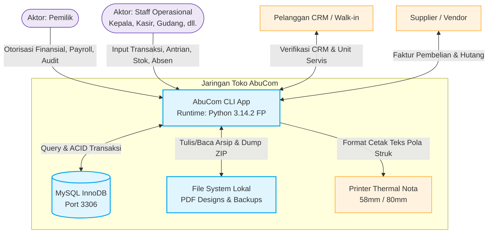
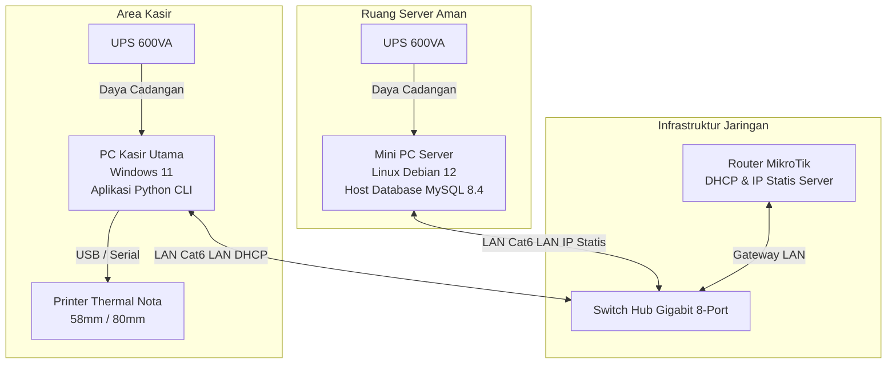
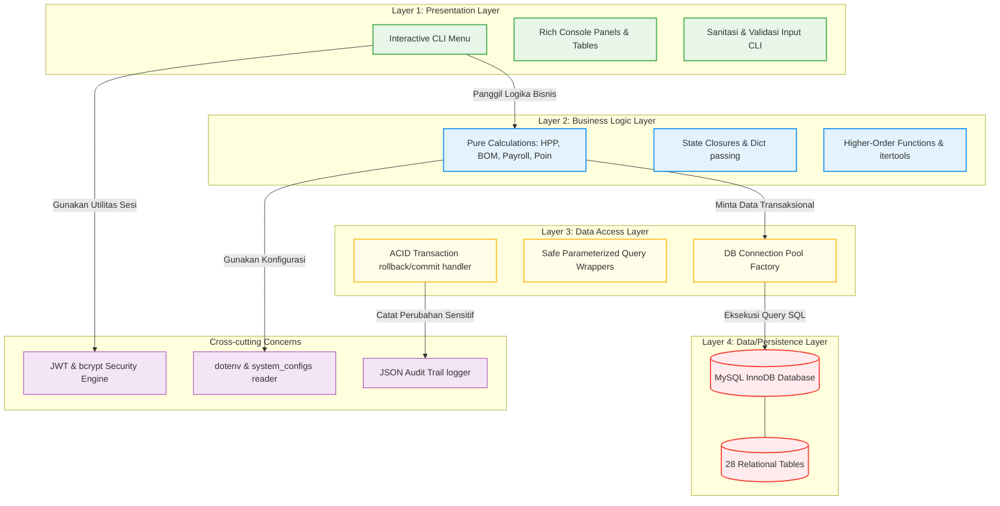
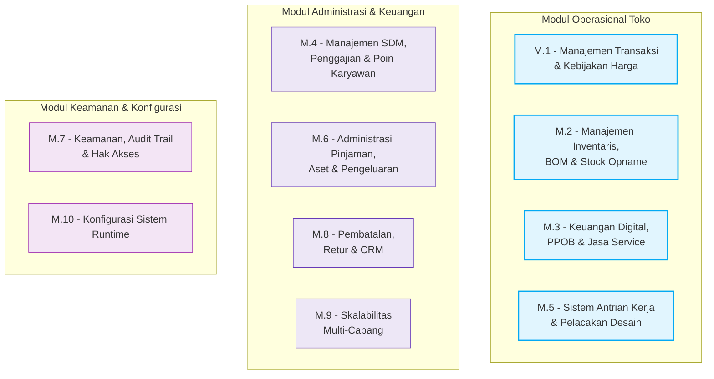
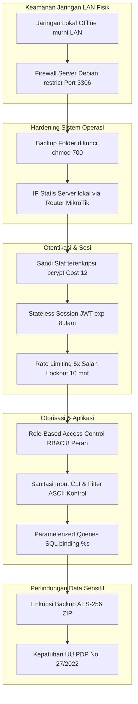
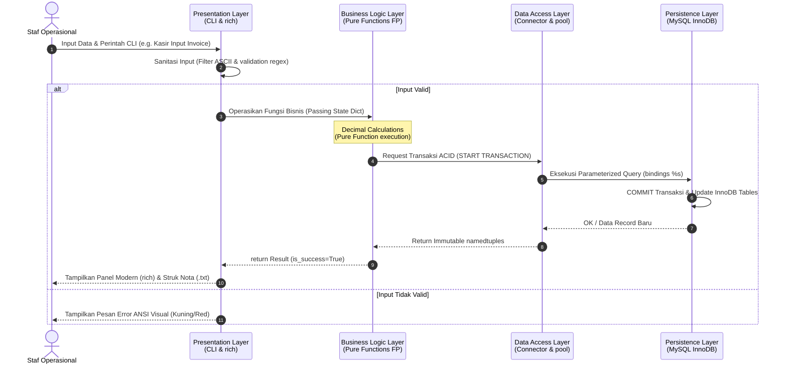
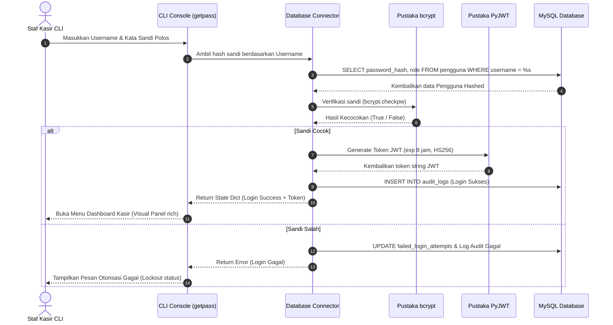
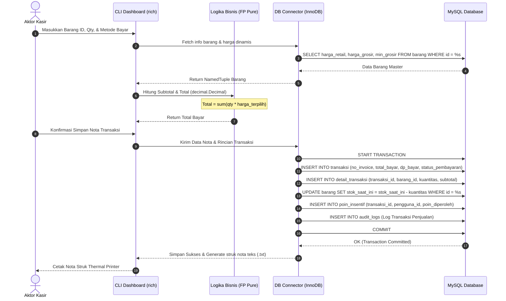
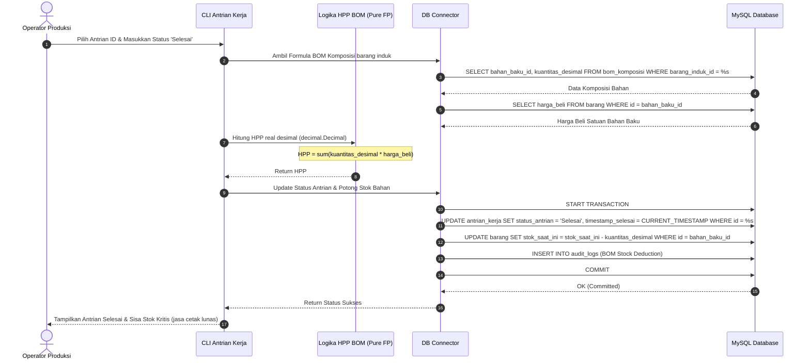
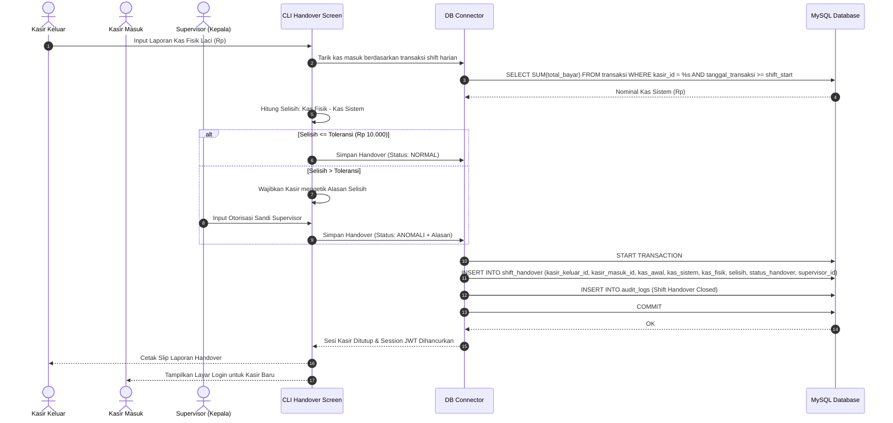

# System Architecture — AbuCom

## Riwayat Perubahan Dokumen

| Versi | Tanggal | Perubahan | Oleh |
| :---: | :---: | --- | --- |
| **1.1** | 2026-05-24 | Validasi, audit mendalam, dan penyempurnaan dokumen. Melengkapi dekomposisi tabel modul (menambahkan `supplier` dan `utang_supplier` di M.2), penyesuaian detail teknis arsitektur fisik (IP statis local router server `192.168.1.200` dan deteksi generic text-only printer thermal `COM1`/`USB001`), sinkronisasi RBAC matrix, dan validasi standar arc42. | Senior Solutions Architect & Technical Documentation Auditor |
| **1.0** | 2026-05-24 | Inisialisasi awal penyusunan dokumen System Architecture secara lengkap, terperinci, dan substantif (16 Bab utama). Mengintegrasikan arsitektur Client-Server LAN, arsitektur berlapis 4-layer, paradigma Functional Programming (FP) murni, pemetaan 28 tabel database relasional InnoDB, 12 diagram Mermaid teknis, dan 5 ADR formal guna menyelaraskan Tech Stack Decision v1.1 dan SRS v1.1. | Senior Solutions Architect & System Design Lead |

---

## 1. Informasi Dokumen

### 1.1. Tujuan Dokumen
Dokumen **System Architecture** ini disusun secara formal untuk menyediakan cetak biru (blueprint) arsitektur sistem secara menyeluruh untuk proyek **AbuCom — Sistem Manajemen Terpadu Usaha Percetakan**. Dokumen ini dirancang khusus untuk memetakan bagaimana keputusan teknologi tingkat tinggi dari *Tech Stack Decision* diwujudkan dalam struktur kode modular, alur data transaksional, strategi keamanan fisik dan logis, serta prosedur operasional deployment di lingkungan toko retail fisik.

### 1.2. Cakupan Dokumen
Cakupan rancangan arsitektur dalam dokumen ini meliputi:
*   **System Context & Boundaries**: Batasan sistem logis dan interaksi dengan aktor serta entitas eksternal.
*   **Physical Architecture**: Spesifikasi fisik hardware, konfigurasi sistem operasi dual-OS (Linux Debian 12 & Windows 11), dan topologi jaringan lokal LAN.
*   **Logical Software Architecture**: Struktur arsitektur berlapis (4-Layer) yang diadaptasi untuk pemrograman fungsional (FP) murni tanpa kelas.
*   **Module Architecture**: Dekomposisi 10 modul fungsional, peta dependensi, dan module-to-table database mapping.
*   **Data Architecture**: Kebijakan connection pooling, retry mechanism, ACID transactions, multi-branch readiness, dan kalkulasi decimal.
*   **Security Architecture**: Otentikasi bcrypt, token JWT stateless, matrix RBAC, data protection (UU PDP), dan log audit trail JSON.
*   **Communication & Interaction Flow**: Sequence diagram alur-alur kritis transaksional.
*   **Deployment & Operations**: Prosedur instalasi, pencadangan manual terenkripsi AES-256, dan disaster recovery.
*   **Architecture Decision Records (ADR)**: Dokumen formal pembenaran atas keputusan arsitektural kunci.

### 1.3. Posisi Dokumen dalam Siklus SDLC
Dalam siklus pengembangan sistem (*System Development Life Cycle* — SDLC) AbuCom, dokumen ini merupakan deliverable ketiga pada **Fase 03 Design (Perancangan Sistem)**. Dokumen ini bertindak sebagai jembatan langsung antara dokumen spesifikasi kebutuhan analitis (**Fase 02 Analysis** — SRS, UCD, Workflow) dengan fase penulisan kode program tingkat rendah (**Fase 04 Implementation**).

```
+-----------------------------------+
|  SRS & Tech Stack Decision (F02)  |
+-----------------------------------+
                  |
                  v
+-----------------------------------+
|   Database Schema & ERD (F03)     |
+-----------------------------------+
                  |
                  v
+===================================+
|   System Architecture v1.1 [DOK]  |
+===================================+
                  |
                  v
+-----------------------------------+
|  Software Design Document (SDD)   |
+-----------------------------------+
```

### 1.4. Hubungan dengan Dokumen SDLC Lainnya
*   **Input (Dokumen Acuan)**:
    - [Tech Stack Decision v1.1](docs/sdlc/01_planning/04_tech_stack_decision.md): SSoT untuk keputusan platform runtime Python, MySQL, dual-OS, pustaka, keamanan, dan batasan FP murni.
    - [Software Requirements Specification v1.1](docs/sdlc/02_analysis/02_software_requirements.md): Spesifikasi 10 modul fungsional, 8 aktor internal, dan target performa non-fungsional.
    - [Database Schema v1.1](docs/sdlc/03_design/01_database_schema.sql): Skema fisik 28 tabel InnoDB.
    - [ERD Database v1.1](docs/sdlc/03_design/02_erd_database.md): Relasi visual 58 FK dan kardinalitas Crow's Foot.
*   **Output (Dokumen Pengguna)**:
    - Menjadi acuan mutlak bagi penulisan kode di Fase 04 (Implementation).
    - Memandu tim QA dalam menyusun skenario Integration Testing dan Security Audit.

### 1.5. Audiens Target
*   **Junior Programmer (Pemilik Usaha)**: Untuk memahami landasan desain sistem agar dapat melakukan pemeliharaan mandiri secara terstruktur.
*   **Tim Pengembang AI (Gemini & Claude)**: Sebagai acuan implementasi boilerplate code, transaction wrappers, dan fungsionalitas FP murni.
*   **System Administrator**: Sebagai panduan setup LAN lokal toko, perakitan hardware, dan kebijakan backup harian.

### 1.6. Definisi, Akronim, dan Singkatan
*   **arc42**: Standar industri struktur dokumentasi arsitektur sistem perangkat lunak.
*   **FP**: *Functional Programming* (Paradigma pemrograman fungsional murni tanpa modifikasi state langsung).
*   **CLI**: *Command Line Interface* (Terminal teks).
*   **JWT**: *JSON Web Token* (Token otentikasi sesi stateless).
*   **BOM**: *Bill of Materials* (Daftar komposisi bahan baku produk cetak kustom).
*   **ACID**: *Atomicity, Consistency, Isolation, Durability* (Atribut integritas transaksi database).
*   **InnoDB**: Engine penyimpanan MySQL lokal yang mendukung relasi *Foreign Key* dan transaksi aman.
*   **Decimal Precision**: Operasi matematika presisi tetap di Python menggunakan modul `decimal`.
*   **Parameterized Query**: Metode query SQL aman menggunakan placeholder `%s` untuk mencegah SQL Injection.
*   **UU PDP**: Undang-Undang Perlindungan Data Pribadi No. 27 Tahun 2022.

---

## 2. Konteks Sistem (System Context)

Konteks sistem AbuCom memetakan bagaimana sistem berinteraksi dengan entitas eksternal serta menetapkan batasan tanggung jawab aplikasi AbuCom CLI secara tegas.

### 2.1. Diagram Konteks Sistem



### 2.2. Aktor & Entitas Eksternal
*   **Aktor Internal (8 Peran)**:
    1.  `pemilik`: Pemegang otoritas penuh atas payroll, laporan keuangan laba rugi, log audit trail, dan backup-restore.
    2.  `kepala_percetakan`: Pengawas harian, memantau antrian, stok gudang, absensi, dan memvalidasi stock opname.
    3.  `pramuniaga`: Garda terdepan, mendaftarkan pelanggan, transaksi penjualan retail, dan menerima unit servis.
    4.  `kasir`: Pengelola laci kas, mencatat pembayaran, cetak nota struk, input serah terima shift (shift handover).
    5.  `desainer`: Pemroses gambar, melihat antrian desain, merekam direktori file desain.
    6.  `produksi_cetak`: Operator cetak, memotong stok berdasarkan BOM desimal, mencatat sisa limbah (*waste*).
    7.  `fotocopy_print`: Petugas kasir retail cepat fotokopi/print lembaran.
    8.  `gudang`: Pengelola logistik, mencatat barang masuk/keluar, utang supplier, melakukan stock opname fisik.
*   **Entitas Eksternal**:
    -   **Pelanggan**: Pelanggan terdaftar CRM (menyimpan nomor WhatsApp terenkripsi) dan pelanggan walk-in.
    -   **Supplier**: Vendor pengadaan barang retail ATK dan bahan baku percetakan.
    -   **Printer Thermal**: Perangkat keras pencetak struk tanda bukti transaksi lunas/DP.

### 2.3. Batasan Sistem (System Boundary)
*   **Di dalam Sistem (In-Scope)**:
    -   Seluruh UI berbasis teks terminal interaktif (CLI) yang kompatibel lintas OS.
    -   Seluruh logika bisnis 100% menggunakan paradigma pemrograman fungsional (FP) murni di Python.
    -   Penyimpanan basis data transaksional terintegrasi di MySQL server lokal.
    -   Penyimpanan dan enkripsi berkas cadangan database (AES-256 ZIP) secara lokal di server.
*   **Di luar Sistem (Out-of-Scope)**:
    -   Koneksi jaringan internet eksternal (sistem berjalan 100% offline di LAN lokal).
    -   Pengiriman fisik pesan WhatsApp otomatis (hanya menyediakan salinan link WhatsApp Web di terminal).
    -   Antarmuka berbasis grafis (GUI) atau aplikasi berbasis web/browser.

### 2.4. Antarmuka Eksternal (External Interfaces)
1.  **Antarmuka Pengguna CLI**: Output terminal visual ANSI menggunakan pustaka `rich` dan pemformatan tabular dengan `tabulate`. Input kata sandi aman terlindung melalui standard library `getpass` (no echo).
2.  **Antarmuka Database (mysql-connector-python)**: Komunikasi TCP/IP Port default 3306 LAN lokal menuju MySQL.
3.  **Antarmuka File System (pathlib)**: Manajemen dual-OS file paths untuk direktori arsip desain pelanggan (`/exports/designs/`) and berkas dump backup (`/exports/backups/`).
4.  **Antarmuka Printer Thermal**: Ekspor nota ke dalam format teks polos (`.txt`) terformat lebar kolom 58mm/80mm yang kompatibel langsung dengan perangkat thermal printer.

---

## 3. Arsitektur Infrastruktur Fisik (Physical Architecture)

Arsitektur fisik mendokumentasikan implementasi infrastruktur perangkat keras dan jaringan lokal (LAN) toko percetakan AbuCom guna menjamin kinerja tinggi dan stabilitas data.

### 3.1. Topologi Jaringan LAN



### 3.2. Spesifikasi Hardware

#### 3.2.1. Node Server Database (Linux Debian 12 Bookworm)
*   **Perangkat**: Mini PC Server (Industrial grade, fanless design).
*   **Prosesor**: Intel Core i5 Generasi ke-12 (Minimal 6 Cores).
*   **Memori**: 16GB DDR4 RAM (Mendukung stabilitas cache basis data MySQL).
*   **Penyimpanan**: SSD 512GB NVMe M.2 (Kecepatan read/write tinggi untuk write-ahead log basis data).
*   **Jaringan**: 1x Gigabit Ethernet Port (1000 Mbps).

#### 3.2.2. Node Klien Kasir (Windows 11)
*   **Perangkat**: PC Desktop Retail/Kasir.
*   **Prosesor**: Intel Core i3 (atau spesifikasi retail setara).
*   **Memori**: 8GB DDR4 RAM.
*   **Penyimpanan**: SSD 256GB NVMe.
*   **Jaringan**: 1x Gigabit Ethernet Port.

#### 3.2.3. Perangkat Jaringan (Switch, Router, Kabel)
*   **Switch Hub**: Switch Hub Gigabit 8-Port (Unmanaged, low-latency).
*   **Router**: Router MikroTik hEX lite (Untuk alokasi IP statis database server).
*   **Kabel**: UTP Category 6 (Cat6) tembaga murni dengan pelindung interferensi.

#### 3.2.4. Perangkat Pendukung (UPS, Printer Thermal)
*   **UPS (Uninterruptible Power Supply)**: 2 Unit UPS 600VA / 360W dipasang terpisah pada Node Server dan Node Klien Kasir (Menjamin ketersediaan daya 15 menit untuk penutupan aman / *graceful shutdown*).
*   **Printer Thermal**: Printer thermal laci kasir 58mm atau 80mm berbasis koneksi USB/Serial.

### 3.3. Konfigurasi Sistem Operasi

#### 3.3.1. Konfigurasi Server Linux Debian 12
*   **Service Daemon**: MySQL Community Server berjalan sebagai systemd service (`mysql.service`).
*   **Alamat IP**: IP statis lokal dikonfigurasi melalui interface:
    ```
    # /etc/network/interfaces
    iface eth0 inet static
        address 192.168.1.200
        netmask 255.255.255.0
        gateway 192.168.1.1
    ```
    > ⚠️ **[HARUS DIISI SAAT INSTALASI FISIK]**: Alamat IP statis lokal di atas (`192.168.1.200`) wajib disesuaikan dengan konfigurasi segmen IP LAN Router MikroTik toko. Pemilik Toko wajib memastikan IP statis Server terikat dengan benar pada tabel DHCP lease router.
*   **MySQL Bind Address**: Diubah di berkas `/etc/mysql/mysql.conf.d/mysqld.cnf` untuk menerima koneksi jaringan LAN:
    `bind-address = 192.168.1.200`
*   **Firewall (ufw)**: Mengizinkan port default MySQL hanya untuk IP segment internal:
    `ufw allow from 192.168.1.0/24 to any port 3306 proto tcp`
*   **Hak Akses Folder**: Direktori `/var/lib/mysql-backups/` dikunci administratif (`chmod 700`), hak milik eksklusif user `root` server Debian.
 
#### 3.3.2. Konfigurasi Klien Windows 11
*   **Runtime Environment**: Python 3.14.2+ terinstal dan terdaftar di PATH lingkungan sistem.
*   **Terminal Console**: CLI dijalankan di dalam **Windows Terminal** modern. CMD lama atau PowerShell bawaan dikonfigurasi untuk menggunakan kodifikasi UTF-8 secara aktif dengan mengetik perintah `chcp 65001` sebelum peluncuran CLI Python.
*   **Driver Printer**: Konfigurasi port thermal printer dipetakan sebagai generic text-only printer driver untuk mendukung format cetak teks nota mentah.
    > ⚠️ **[HARUS DIISI SAAT INSTALASI FISIK]**: Port fisik printer thermal (misalnya `COM1` atau port USB khusus `USB001`) wajib diidentifikasi saat driver printer dipasang, dan wajib dikonfigurasi secara statis pada file `.env` klien menggunakan variabel `PRINTER_PORT`.

### 3.4. Strategi Portabilitas Lintas OS (Cross-OS)
Untuk memastikan kode Python berjalan tanpa cacat fungsional saat dipindahkan antara Debian Server dan Windows Client:
1.  **Path Resolution**: Menggunakan pustaka standard `pathlib` dengan operator `/` untuk menggabungkan subfolder. Program melarang manipulasi string path manual menggunakan tanda slash (`/`) atau backslash (`\`) yang memicu crash lintas OS.
2.  **Explicit Encoding**: Setiap fungsi yang membuka file lokal (seperti pembacaan berkas `.env`, parsing CSV, atau penulisan struk nota) wajib mendeklarasikan parameter encoding UTF-8 secara eksplisit: `open(file_path, 'w', encoding='utf-8')`.
3.  **OS Detection**: Terminal console clearing diimplementasikan fungsional mendeteksi platform runtime:
    ```python
    def clear_screen():
        import platform, os
        os.system('cls' if platform.system() == 'Windows' else 'clear')
    ```

---

## 4. Arsitektur Perangkat Lunak Logis (Logical Architecture)

Arsitektur perangkat lunak logis AbuCom menerapkan arsitektur berlapis (4-Layered Architecture) yang dimodifikasi khusus untuk paradigma pemrograman fungsional (FP) murni, mengeliminasi penggunaan kelas (*class*) dan mutasi *state* variabel secara global.

### 4.1. Pola Arsitektur Keseluruhan (Architectural Pattern)
Sistem memisahkan tanggung jawab kode program secara ketat ke dalam **4 Layer Logis**. Aliran dependensi berjalan satu arah dari atas ke bawah: layer atas dapat memanggil fungsi di layer bawahnya, tetapi layer bawah dilarang keras mengenal atau mengimpor fungsi dari layer di atasnya.

### 4.2. Diagram Arsitektur Berlapis (Layered Architecture — Mermaid)



### 4.3. Deskripsi Setiap Layer

#### 4.3.1. Presentation Layer (CLI Interface)
*   **Tanggung Jawab**: Menampilkan menu teks visual interaktif kepada pengguna di terminal, menangkap ketikan input keyboard, melakukan sanitasi karakter berbahaya, menampilkan progress bar, dan memformat tabel data.
*   **Pustaka Utama**: `rich` (Visual ANSI panels), `tabulate` (Tabular format CLI), `getpass` (Sandi tersembunyi).
*   **Batasan FP**: Fungsi di layer ini diperbolehkan memiliki efek samping I/O (seperti `print` dan `input`), namun tidak boleh melakukan komputasi aritmatika matematika langsung atau membangun query SQL mentah.

#### 4.3.2. Business Logic Layer (Pure Functions FP)
*   **Tanggung Jawab**: Wadah utama seluruh logika bisnis operasional AbuCom (kalkulasi HPP stempel, penyusutan aset tetap, komisi payroll, auto-debit sisa utang kasbon).
*   **Aturan FP**: **Wajib berupa fungsi murni (pure functions)**. Fungsi-fungsi di layer ini hanya menerima input argumen parameter, melakukan komputasi matematis menggunakan modul `decimal`, dan mengembalikan data baru (*new records*) dalam bentuk *tuples* atau *immutable namedtuples*. Dilarang keras membaca variabel global atau memodifikasi state database secara langsung dari dalam layer ini.
*   **Pustaka Pendukung**: `decimal` (Presisi fixed-point), `functools`, `itertools`.

#### 4.3.3. Data Access Layer (Database Connector)
*   **Tanggung Jawab**: Penghubung transaksional aman menuju database MySQL. Mengelola connection pooling, menyusun parameterized query bindings (`%s`), dan menangani rollback otomatis jika terjadi kegagalan data transaksi.
*   **Pustaka Utama**: `mysql-connector-python`.
*   **Aturan Pengamanan**: Menguji dan membersihkan input dari celah injeksi SQL (Anti-SQL Injection) sebelum dikirimkan ke server MySQL database.

#### 4.3.4. Data/Persistence Layer (MySQL InnoDB)
*   **Tanggung Jawab**: Penyimpanan fisik data transaksional relasional toko.
*   **Karakteristik**: MySQL 8.x Community Server menggunakan engine penyimpanan **InnoDB** guna memastikan relasi Foreign Key yang kokoh dan keandalan transaksional berstandar **ACID** (*Atomicity, Consistency, Isolation, Durability*).

### 4.4. Pola Desain Fungsional (FP Design Patterns)

#### 4.4.1. Pure Functions & Immutability
Seluruh variabel yang menampung data transaksi di sisi Python disimpan dalam format struktur data imutabel. Sistem memanfaatkan modul standard `collections.namedtuple` atau `dataclasses` dengan opsi `frozen=True` untuk memastikan integritas data tidak dirusak di memori selama manipulasi data.
*   *Contoh implementasi HPP*:
    ```python
    from decimal import Decimal
    from collections import namedtuple

    BOMItem = namedtuple('BOMItem', ['nama_bahan', 'qty', 'harga_beli'])

    # Fungsi murni (pure function) untuk komputasi total HPP
    def hitung_hpp_bom(bom_items: list[BOMItem]) -> Decimal:
        return sum((item.qty * item.harga_beli for item in bom_items), Decimal('0.0000'))
    ```

#### 4.4.2. State Management tanpa OOP (Closures, State Dict Passing)
Karena ketiadaan kelas (class) untuk menyimpan session token login JWT, menu navigasi terminal, atau status keranjang belanja, state dikelola menggunakan 2 pola FP:
1.  **Nested Closures**: Fungsi tingkat tinggi yang mengembalikan fungsi di dalamnya dengan membungkus variabel tertutup (*lexical environment*).
2.  **State Dictionary Passing**: Mengalirkan representasi state (misal dictionary berisi data login aktif pengguna `{'user_id': 1, 'role': 'kasir', 'token': 'jwt_hash'}`) sebagai parameter input argumen ke setiap fungsi menu terminal secara berurutan.

#### 4.4.3. Higher-Order Functions & Composition
Manipulasi dan filter data stok atau audit trail di sisi Python dilakukan menggunakan fungsi orde tinggi bawaan Python seperti `map()`, `filter()`, dan agregasi `reduce()` dari modul `functools` untuk menghindari nested loops tradisional.

#### 4.4.4. Error Handling Fungsional (Monad-like Pattern)
Program menolak pelemparan exception tak terkontrol (*runtime try-catch abuse*) di logika bisnis utama. Sistem menggunakan pola representasi tipe **Either / Result** menggunakan NamedTuple untuk mengembalikan status sukses atau kegagalan transaksi secara fungsional:
```python
Result = namedtuple('Result', ['is_success', 'data', 'error_msg'])

def validasi_tarik_kasbon(nominal_pengajuan: Decimal, limit_sistem: Decimal) -> Result:
    if nominal_pengajuan <= 0:
        return Result(False, None, "ERR-VAL-001: Nominal kasbon harus bernilai positif.")
    if nominal_pengajuan > limit_sistem:
        return Result(False, None, "ERR-VAL-002: Pengajuan melebihi limit pagu staf.")
    return Result(True, nominal_pengajuan, None)
```

---

## 5. Arsitektur Modular (Module Architecture)

Arsitektur modular mendefinisikan dekomposisi sistem AbuCom menjadi 10 modul fungsional sesuai dengan SRS v1.1 dan skema ERD 28 tabel basis data.

### 5.1. Diagram Dekomposisi Modul



### 5.2. Deskripsi Modul dan Tanggung Jawab

#### 5.2.1. M.1 — Manajemen Transaksi & Kebijakan Harga
*   **Tanggung Jawab**: Pencatatan penjualan ritel ATK, pemicu pesanan produk cetak kustom, penerapan harga bertingkat (retail, grosir, mitra), down payment (DP), dan ekspor struk nota thermal.
*   **Tabel Terkait**: `transaksi`, `detail_transaksi`.
*   **Hak Akses Aktor**: `pramuniaga`, `kasir`, `pemilik`.

#### 5.2.2. M.2 — Manajemen Inventaris, BOM & Stock Opname
*   **Tanggung Jawab**: Mengelola persediaan barang/bahan baku desimal, formula HPP produk cetak berbasis BOM, penulisan log limbah produksi (*waste*), penguncian stock opname fisik, pelacakan harga supplier (price tracking), dan utility ekspor/import berkas CSV.
*   **Tabel Terkait**: `barang`, `bom_komposisi`, `limbah_produksi`, `stock_opname`, `riwayat_harga_supplier`, `backup_logs`.
*   **Hak Akses Aktor**: `gudang`, `produksi_cetak`, `kepala_percetakan`, `pemilik`.

#### 5.2.3. M.3 — Layanan Keuangan Digital, PPOB & Jasa Service
*   **Tanggung Jawab**: Pencatatan manual transaksi pembayaran pulsa/token (PPOB), pemantauan alert saldo minimal server, penentuan tarif transfer 6 dompet digital termurah, registrasi perbaikan unit laptop/printer pelanggan.
*   **Tabel Terkait**: `saldo_ppob`, `saldo_ewallet`, `jasa_service`.
*   **Hak Akses Aktor**: `pramuniaga`, `kasir`, `desainer` (sebagai teknisi), `pemilik`.

#### 5.2.4. M.4 — Manajemen SDM, Penggajian & Poin Karyawan
*   **Tanggung Jawab**: Pencatatan absensi harian staf, komisi insentif poin (4-tier), penarikan utang kasbon karyawan, serta slip payroll bulanan otomatis (*Smart Payroll*).
*   **Tabel Terkait**: `absensi`, `kasbon`, `payroll`, `poin_insentif`.
*   **Hak Akses Aktor**: Staf (absensi), `kepala_percetakan` (verifikasi), `pemilik` (payroll).

#### 5.2.5. M.5 — Sistem Manajemen Antrian & Pelacakan Desain
*   **Tanggung Jawab**: Dashboard pelacakan antrian (5 tahapan status), pencatatan direktori path arsip file PDF desain di server lokal, serta pembungkus tautan WhatsApp Web link.
*   **Tabel Terkait**: `antrian_kerja`.
*   **Hak Akses Aktor**: `desainer`, `produksi_cetak`, `kepala_percetakan`, `pemilik`.

#### 5.2.6. M.6 — Administrasi Pinjaman, Aset & Pengeluaran
*   **Tanggung Jawab**: Administrasi utang berbunga bank komersial, pinjaman lunak kerabat pemilik, beban depresiasi garis lurus aset tetap bulanan, tabungan virtual penggajian mesin baru, laporan laba rugi instan per divisi.
*   **Tabel Terkait**: `pinjaman_bank`, `pinjaman_kerabat`, `aset`, `pengeluaran`.
*   **Hak Akses Aktor**: `pemilik` (eksklusif), `kasir` (hanya input pengeluaran operasional kecil).

#### 5.2.7. M.7 — Keamanan, Audit Trail & Hak Akses
*   **Tanggung Jawab**: Autentikasi sandi (bcrypt cost 12), manajemen session stateless JWT, validasi matrix RBAC, login rate limiting, sanitasi terminal control characters CLI, penulisan JSON Audit Trail.
*   **Tabel Terkait**: `pengguna`, `audit_logs`, `shift_handover`.
*   **Hak Akses Aktor**: Seluruh pengguna (otentikasi), `pemilik` (audit logs), `kepala_percetakan` (supervisor shift).

#### 5.2.8. M.8 — Pembatalan, Retur & CRM
*   **Tanggung Jawab**: Pemrosesan transaksi retur/batal, pengelolaan data profile pelanggan terenkripsi lokal demi kepatuhan regulasi UU PDP.
*   **Tabel Terkait**: `pelanggan`.
*   **Hak Akses Aktor**: `kasir` (retur/batal), `pemilik` (otorisasi), `pramuniaga` (input pelanggan).

#### 5.2.9. M.9 — Skalabilitas Multi-Cabang
*   **Tanggung Jawab**: Penyediaan foreign key `cabang_id` di setiap entitas database untuk mempermudah konsolidasi ribuan cabang.
*   **Tabel Terkait**: `cabang`.
*   **Hak Akses Aktor**: `pemilik` (eksklusif).

#### 5.2.10. M.10 — Konfigurasi Sistem Runtime
*   **Tanggung Jawab**: Parameterisasi dinamis regulasi operasional bisnis di database.
*   **Tabel Terkait**: `system_configs`.
*   **Hak Akses Aktor**: `pemilik` (eksklusif).

### 5.3. Matriks Dependensi Antar-Modul

```mermaid
graph TD
    %% Styling
    classDef modul fill:#ede7f6,stroke:#673ab7,stroke-width:1px;
    classDef cross fill:#f3e5f5,stroke:#9c27b0,stroke-width:2px;

    M1[M.1 Transaksi]:::modul
    M2[M.2 Persediaan]:::modul
    M3[M.3 PPOB/Service]:::modul
    M4[M.4 SDM & Payroll]:::modul
    M5[M.5 Antrian Kerja]:::modul
    M6[M.6 Finansial]:::modul
    M8[M.8 CRM/Retur]:::modul
    M9[M.9 Cabang]:::modul
    
    M7[M.7 Keamanan/Audit]:::cross
    M10[M.10 Configs]:::cross

    %% Hubungan Dependensi
    M1 --> M2 : "Potong Stok Retail/Bahan"
    M1 --> M8 : "Pelanggan CRM"
    M1 --> M7 : "Otorisasi Kasir & Token"
    M1 --> M10 : "Target Parameter"
    M2 --> M9 : "Multi-Branch Ready"
    M2 --> M7 : "Log Audit Stock Opname"
    M3 --> M1 : "Pencatatan Biaya Admin"
    M4 --> M1 : "Poin dari Nota Lunas"
    M4 --> M7 : "Handover Kas Supervisor"
    M4 --> M10 : "Parameter UMR & Poin"
    M5 --> M1 : "Ref Nota Kustom"
    M5 --> M2 : "Trigger Potong BOM"
    M6 --> M1 : "Income Penjualan"
    M6 --> M7 : "Otorisasi Pemilik"
    M6 --> M10 : "Parameter Limit Pengeluaran"
    M8 --> M7 : "Kunci Sandi Pemilik"
```

### 5.4. Peta Modul ke Tabel Database (Module-to-Table Mapping)

| Modul Fungsional | Daftar Tabel Database Terkait |
| --- | --- |
| **M.1 — Transaksi & Harga** | `transaksi`, `detail_transaksi` |
| **M.2 — Inventaris, BOM & Opname** | `barang`, `bom_komposisi`, `limbah_produksi`, `stock_opname`, `riwayat_harga_supplier`, `backup_logs`, `supplier`, `utang_supplier` |
| **M.3 — Keuangan Digital & Servis** | `saldo_ppob`, `saldo_ewallet`, `jasa_service` |
| **M.4 — SDM, Payroll & Poin** | `absensi`, `kasbon`, `payroll`, `poin_insentif` |
| **M.5 — Antrian & Pelacakan Desain**| `antrian_kerja` |
| **M.6 — Pinjaman, Aset & Pengeluaran**| `pinjaman_bank`, `pinjaman_kerabat`, `aset`, `pengeluaran` |
| **M.7 — Keamanan, Audit & Hak Akses**| `pengguna`, `audit_logs`, `shift_handover` |
| **M.8 — Pembatalan, Retur & CRM** | `pelanggan` |
| **M.9 — Skalabilitas Multi-Cabang** | `cabang` |
| **M.10 — Konfigurasi Runtime** | `system_configs` |

---

## 6. Arsitektur Data (Data Architecture)

Arsitektur data mendokumentasikan taktik pengelolaan database MySQL 8.x LTS guna menjamin kepatuhan ACID, akurasi perhitungan matematika, dan portabilitas lintas OS.

### 6.1. Model Data Fisik (Ringkasan 28 Tabel — 5 Kelompok)
Struktur data fisik AbuCom terdiri atas **28 tabel** yang dikelompokkan ke dalam 5 kategori logis sesuai dengan tingkat kerelasian dan dependensi foreign key (didefinisikan lengkap pada `01_database_schema.sql` dan `02_erd_database.md`):
-   **Kelompok A (Tabel Induk)**: `cabang` (tabel master universal).
-   **Kelompok B (Tabel Master Level 2)**: `pengguna`, `pelanggan`, `supplier`, `barang`, `saldo_ppob`, `saldo_ewallet`, `system_configs`.
-   **Kelompok C (Tabel Transaksional)**: `bom_komposisi`, `transaksi`, `detail_transaksi`, `antrian_kerja`, `absensi`, `kasbon`, `payroll`, `pengeluaran`, `limbah_produksi`, `jasa_service`, `poin_insentif`, `shift_handover`.
-   **Kelompok D (Tabel Administrasi & Keuangan)**: `utang_supplier`, `pinjaman_bank`, `pinjaman_kerabat`, `aset`.
-   **Kelompok E (Tabel Audit & Rekonsiliasi)**: `audit_logs`, `backup_logs`, `stock_opname`, `riwayat_harga_supplier`.

### 6.2. Strategi Koneksi Database (Connection Pooling & Retry)
Untuk memitigasi risiko kegagalan transaksi kasir akibat switch jaringan LAN yang bermasalah atau koneksi drop sesaat:
1.  **Connection Pooling**: Sistem backend Python menginisialisasi pool koneksi lokal bawaan driver `mysql-connector-python` saat startup program:
    `db_pool = mysql.connector.pooling.MySQLConnectionPool(pool_name="abupool", pool_size=5, ...)`
2.  **Retry Mechanism with Exponential Backoff**: Setiap kali pemanggilan transaksi database mengalami *lost connection* (Error Code: 2006 atau 2013), pembungkus transaksional (*transaction wrapper*) secara otomatis melakukan pencobaan ulang (*retry*) maksimal 3 kali dengan jeda waktu meningkat ($2^n$ detik) secara fungsional sebelum melempar kegagalan sistem permanen ke terminal kasir.

### 6.3. Strategi Transaksi Database (ACID & InnoDB)
*   **Engine & Isolation**: Seluruh tabel wajib menggunakan opsi `ENGINE=InnoDB` untuk memastikan ketersediaan relasi *Foreign Key* dan kepatuhan penuh terhadap prinsip **ACID**. Isolation level diatur pada `REPEATABLE READ` guna mencegah anomali *Dirty Read* saat kasir menginput nominal kas dan gudang mencatat opname secara simultan.
*   **Atomic Transactions block**: Seluruh proses modifikasi data (seperti input nota M.1 yang memotong stok M.2, menambah poin M.4, dan memperbarui kas M.7) wajib dikurung di dalam satu blok transaksi transaksional tunggal:
    ```python
    # Alur fungsional pemrosesan transaksi ACID
    def execute_transactional_action(connection, db_action_funcs):
        cursor = connection.cursor()
        try:
            connection.start_transaction()
            results = [func(cursor) for func in db_action_funcs]
            connection.commit()
            return Result(True, results, None)
        except Exception as e:
            connection.rollback()
            return Result(False, None, f"ERR-DB-TX: Transaksi dibatalkan. Detail: {str(e)}")
    ```

### 6.4. Presisi Data Desimal (Decimal Strategy)
Untuk mengeliminasi bug pembulatan biner tidak akurat yang terjadi pada tipe data *float* standard komputer (yang dapat menyebabkan selisih perhitungan HPP BOM atau mutasi kas kasir):
*   **Database**: Semua kolom nominal keuangan (Rupiah), harga beli, harga jual, kuantitas stok bahan desimal, persentase bunga, dan kuantitas limbah dideklarasikan secara kaku di MySQL menggunakan tipe data `DECIMAL(15,4)`.
*   **Runtime Python**: Seluruh logika matematika di layer bisnis wajib dibungkus dalam modul `decimal.Decimal` bawaan Python. Dilarang keras mencampur operasi data numerik menggunakan tipe data floating point bawaan (`float`).

### 6.5. Strategi Multi-Branch Ready (cabang_id)
To ensure future scalability and multi-branch readiness:
-   Setiap 28 tabel basis data secara mandatori memiliki kolom `cabang_id` (INT) yang bertindak sebagai *Foreign Key* merujuk ke tabel `cabang`.
-   Pada fase awal satu cabang toko saat ini, program secara otomatis menetapkan default nilai parameter `cabang_id = 1` (Toko Pusat Bandung) di sisi query data, sehingga menyederhanakan operasional harian pemilik tanpa mengurangi fleksibilitas ekspansi masa depan.

### 6.6. Strategi Migrasi Data Awal (schema.sql, seed.sql, CSV Import)
*   **Inisialisasi Skema (`schema.sql`)**: Berkas SQL berisi seluruh DDL `CREATE TABLE` InnoDB, composite index, dan triggers yang dieksekusi secara otomatis saat instalasi server Debian.
*   **Data Awal Master (`seed.sql`)**: Berkas SQL berisi unit cabang default pertama, 8 posisi peran kredensial default (`pemilik` password terenkripsi bcrypt), 6 akun e-wallet, dan 13 parameter system_configs default.
*   **Utility CSV Import**: Utilitas skrip Python mandiri untuk memindahkan massal data retail ATK dari file ekspor Excel lama milik pemilik ke dalam database MySQL.

---

## 7. Arsitektur Keamanan (Security Architecture)

Arsitektur keamanan AbuCom dirancang mengikuti prinsip *Defense in Depth* (Keamanan Berlapis) untuk memproteksi data keuangan, kredensial pengguna, serta mematuhi hukum privasi data di Indonesia.

### 7.1. Diagram Keamanan Berlapis (Defense in Depth — Mermaid)



### 7.2. Otentikasi (Authentication)

#### 7.2.1. Enkripsi Kata Sandi (bcrypt Cost Factor 12)
*   Sandi pengguna tidak disimpan dalam bentuk teks polos. Pendaftaran akun staf baru wajib dienkripsi satu arah menggunakan pustaka `bcrypt` Python.
*   Algoritma enkripsi dikonfigurasi menggunakan parameter **Cost Factor = 12** yang menghasilkan dynamic salt acak (Memberikan ketahanan brute-force lokal yang sangat tinggi dengan waktu validasi login klien kasir < 0.5 detik).

#### 7.2.2. Manajemen Session CLI (JWT HS256, 8 Jam)
*   Sesi login aktif terminal dikelola secara *stateless* menggunakan token **JWT (JSON Web Token)**.
*   Token ditandatangani di sisi program menggunakan algoritma **HS256** (HMAC-SHA256) dengan Secret Key minimum 32 karakter heksadesimal dari file konfigurasi `.env`.
*   Payload JWT memuat klaim terdaftar: `user_id`, `username`, `role` (hak akses), `cabang_id`, dan `exp` (Kedalwarsa otomatis 8 jam dari waktu pembuatan, setara dengan batas maksimal 1 shift kerja penuh karyawan).

#### 7.2.3. Rate Limiting Login (5 percobaan, lockout 10 menit)
*   Untuk memitigasi serangan brute-force dari terminal kasir fisik oleh staf:
    1.  Maksimal kegagalan percobaan login diatur sebanyak **5 kali**.
    2.  Setiap kegagalan memperbarui hitungan kolom `failed_login_attempts` di tabel pengguna.
    3.  Jika batas terlampaui, akun pengguna dikunci otomatis dengan memperbarui timestamp `locked_until` ke 10 menit ke depan, membatalkan seluruh otentikasi login pengguna tersebut hingga waktu penangguhan berakhir.

### 7.3. Otorisasi (Authorization)

#### 7.3.1. Role-Based Access Control (RBAC) — 8 Peran
Setiap fungsi menu terminal CLI terbungkus dekorator atau fungsi validator otorisasi fungsional (`check_permission(role, user_role) -> bool`) yang secara ketat membatasi pemicuan perintah berdasarkan 8 peran karyawan.

#### 7.3.2. Matriks Akses Modul per Role

| Modul Fungsional | pemilik | kepala_percetakan | pramuniaga | kasir | desainer | produksi_cetak | fotocopy_print | gudang |
| --- | :---: | :---: | :---: | :---: | :---: | :---: | :---: | :---: |
| **M.1 — Transaksi & Nota** | Ya | Ya | Ya | Ya | - | - | Ya | - |
| **M.2 — Inventaris & BOM** | Ya | Ya | - | - | - | Ya | - | Ya |
| **M.3 — PPOB & Servis** | Ya | Ya | Ya | Ya | - | - | Ya | - |
| **M.4 — SDM & Payroll** | Ya | - | - | - | - | - | - | - |
| **M.5 — Antrian & Desain** | Ya | Ya | - | - | Ya | Ya | - | - |
| **M.6 — Keuangan & Aset** | Ya | - | - | - | - | - | - | - |
| **M.7 — Audit & Keamanan** | Ya | - | - | - | - | - | - | - |
| **M.8 — CRM Pelanggan** | Ya | Ya | Ya | Ya | - | - | Ya | - |
| **M.9 — Cabang** | Ya | - | - | - | - | - | - | - |
| **M.10 — configs** | Ya | - | - | - | - | - | - | - |

### 7.4. Proteksi Data

#### 7.4.1. Parameterized Queries (Anti SQL Injection)
Seluruh penyusunan query manipulasi data relational MySQL di layer data wajib menggunakan placeholder binding resmi (`%s`) bawaan pustaka `mysql-connector-python`. Sistem melarang penggunaan f-string Python atau operator modifikasi string format (`%` / `.format()`) untuk menyisipkan variabel ke query SQL.

#### 7.4.2. Sanitasi Input Terminal CLI
Setiap input pengetikan pengguna di CLI disaring melalui fungsi pembersih fungsional yang secara ketat menolak karakter kontrol ASCII di bawah `\x20` (misalnya byte escape `\x1b` ANSI control code) untuk mencegah gangguan visual terminal.

#### 7.4.3. Enkripsi Backup Database (AES-256)
Proses ekspor cadangan database harian MySQL diringkas secara otomatis ke dalam format zip terkompresi yang dilindungi dengan sandi enkripsi kuat berstandar algoritma **AES-256**, lalu direktori folder backup di server Debian dikunci dengan hak akses terbatas `chmod 700`.

#### 7.4.4. Kepatuhan UU PDP No. 27/2022
Data sensitif keanggotaan pelanggan CRM (seperti nomor WhatsApp pelanggan) tidak disimpan dalam bentuk teks polos di database MySQL. Nomor WhatsApp dienkripsi secara lokal di sisi Python sebelum disimpan di database menggunakan algoritma enkripsi simetris (atau pembungkus hashing yang aman) demi mematuhi regulasi privasi konsumen nasional.

### 7.5. Audit Trail

#### 7.5.1. Struktur Log Audit JSON
Seluruh pemicu manipulasi data sensitif (seperti pendaftaran utang bank baru, retur kasir, perubahan stok bahan baku manual, atau kegagalan login) direkam secara kronologis ke dalam tabel `audit_logs` MySQL dengan skema data terstruktur:
*   `user_id`: ID pengguna pelaksana aksi.
*   `action_type`: Kategori aksi ('INSERT', 'UPDATE', 'DELETE', 'ACCESS_DENIED').
*   `target_table`: Nama tabel database sasaran.
*   `old_value`: Representasi JSON dari baris data sebelum diubah (NULL untuk insert).
*   `new_value`: Representasi JSON dari baris data setelah diubah (NULL untuk delete).
*   `ip_address`: IP client terminal kasir LAN lokal.

#### 7.5.2. Pemicu Pencatatan Audit (Trigger Events)
Log audit ditulis di sisi aplikasi menggunakan pure database transaction wrapper Python yang secara simultan mengeksekusi insert log audit dalam satu kesatuan transaction commit operasi transaksional utama.

---

## 8. Arsitektur Komunikasi & Alur Data (Communication Architecture)

Arsitektur komunikasi mendokumentasikan bagaimana aliran data mengalir di antara layer-layer aplikasi dan jaringan LAN fisik.

### 8.1. Diagram Alur Data Antar-Layer



### 8.2. Protokol Komunikasi Client-Server (TCP/IP Port 3306)
*   Seluruh lalu lintas komunikasi data antara Node Klien Kasir (Windows 11) and Node Server (Debian 12) menggunakan protokol **TCP/IP** lokal pada Port default MySQL **3306**.
*   Media transmisi menggunakan kabel fisik **UTP Cat6** berkecepatan Gigabit LAN dengan latensi jaringan rata-rata **< 1ms**, menjamin stabilitas query transaksional tanpa lag visual.

### 8.3. Diagram Sequence untuk Alur Kritis

#### 8.3.1. Alur Login & Pembuatan Session JWT



#### 8.3.2. Alur Transaksi Penjualan End-to-End



#### 8.3.3. Alur HPP BOM Desimal & Pemotongan Stok



#### 8.3.4. Alur Rekonsiliasi Kas & Shift Handover



### 8.3.5. Pola Penanganan Error & Exception Handling
Sistem menstandardisasi penanganan error di seluruh layer dengan format kode error yang deskriptif untuk mempermudah pelacakan debugging:
-   **Format Kode**: `ERR-[KATEGORI]-[NOMOR]`
-   **Kategori valid**:
    -   `ERR-DB-xxx`: Kegagalan koneksi database, foreign key violation, deadlock, rollback.
    -   `ERR-VAL-xxx`: Kegagalan validasi bisnis (nominal negatif, input kosong, melebihi limit kasbon).
    -   `ERR-AUTH-xxx`: Hak akses ditolak (RBAC violation), token JWT kadaluwarsa, lockout Brute-Force.
    -   `ERR-STOCK-xxx`: Ketersediaan stok tidak mencukupi untuk pemotongan.
    -   `ERR-SYS-xxx`: Kendala I/O file system, platform OS target tidak kompatibel.

---

## 9. Arsitektur Deployment & Operasional (Deployment Architecture)

Arsitektur deployment mendokumentasikan taktik setup sistem dual-OS lokal secara modular dan handal.

### 9.1. Diagram Deployment

```mermaid
graph TD
    %% Styling
    classDef serverNode fill:#ffe0b2,stroke:#fb8c00,stroke-width:2px;
    classDef clientNode fill:#e3f2fd,stroke:#1e88e5,stroke-width:2px;
    classDef externalNode fill:#ede7f6,stroke:#5e35b1,stroke-width:1px;

    subgraph LAN Jaringan Toko Percetakan AbuCom
        subgraph Node Server Linux [PC Mini Server Debian 12 Bookworm]
            DebianOS[Sistem Operasi Debian Linux 12]:::serverNode
            MySQLDaemon[MySQL 8.4 Database Server]:::serverNode
            LocalBackups[/var/lib/mysql-backups/ ZIP AES-256]:::serverNode
            DebianOS --> MySQLDaemon
            MySQLDaemon --> LocalBackups
        end

        subgraph Node Klien Kasir [PC Kasir Windows 11]
            WindowsOS[Sistem Operasi Windows 11]:::clientNode
            Terminal[Windows Terminal emulator]:::clientNode
            PythonRuntime[Python 3.14.2+ Interpreter]:::clientNode
            DotEnvConfig[.env Configuration File]:::clientNode
            ExportsFolder[c:/exports/receipts/ Struk .txt]:::clientNode
            
            WindowsOS --> Terminal
            Terminal --> PythonRuntime
            PythonRuntime --> DotEnvConfig
            PythonRuntime --> ExportsFolder
        end
        
        subgraph Perangkat Eksternal
            Printer[Printer Thermal USB/Serial]:::externalNode
            UPS1[UPS 600VA Server]:::externalNode
            UPS2[UPS 600VA Klien]:::externalNode
        end
    end

    %% Koneksi Database
    PythonRuntime <-->|Jaringan Fisik LAN UTP Cat6 Port 3306| MySQLDaemon
    PythonRuntime -->|Format Cetak Struk Nota| Printer
    UPS1 -->|Daya Stabilizer| Node Server Linux
    UPS2 -->|Daya Stabilizer| Node Klien Kasir
```

### 9.2. Strategi Instalasi & Setup Awal

#### 9.2.1. Setup Server Database (MySQL + Linux Debian 12)
1.  Pasang sistem operasi Linux Debian 12 Bookworm pada Mini PC Server.
2.  Instal server database MySQL Community Server versi 8.4 LTS.
3.  Ubah berkas `/etc/mysql/mysql.conf.d/mysqld.cnf` untuk melonggarkan bind-address ke IP `192.168.1.200` agar menerima koneksi eksternal LAN.
4.  Jalankan ufw firewall untuk mengunci akses port 3306 hanya untuk segment IP PC Kasir (`192.168.1.0/24`).

#### 9.2.2. Setup Klien Kasir (Python + Windows 11)
1.  Instal sistem operasi Windows 11 dan Windows Terminal modern pada PC Kasir.
2.  Instal installer resmi Python versi 3.14.2+.
3.  Unduh berkas kode program aplikasi AbuCom CLI ke dalam folder lokal (misalnya `c:\AbuCom\`).
4.  Pasang dependensi pustaka pihak ketiga menggunakan berkas `requirements.txt` terstandardisasi:
    `pip install -r requirements.txt`

#### 9.2.3. Inisialisasi Database (schema.sql & seed.sql)
1.  Jalankan database inisialisasi pada server database MySQL:
    `mysql -u root -p < docs/sdlc/03_design/01_database_schema.sql`
2.  Script ini secara otomatis membuat basis data `abucom_db` (charset `utf8mb4`, collation `utf8mb4_unicode_ci`, InnoDB) dan menyuntikkan seluruh 28 tabel beserta parameter konfigurasi default dan sandi pemilik terenkripsi bcrypt.

#### 9.2.4. Konfigurasi File .env
Buat berkas rahasia `.env` pada folder root PC Kasir Windows 11 dengan struktur format:
```env
DB_HOST=192.168.1.200
DB_PORT=3306
DB_USER=abucom_app
DB_PASS=SandiAmanAplikasiLokalkasir123
DB_NAME=abucom_db
JWT_SECRET=4f7a9e1d8c5b6a3e2f1a8c9b5d4e7f8a9b0c1d2e3f4a5b6c7d8e9f0a1b2c3d4e
JWT_EXP_HOURS=8
BCRYPT_COST=12
LEBAR_STRUK=32
```

### 9.3. Strategi Backup & Disaster Recovery
*   **mysqldump Terjadwal**: Sistem Debian Server dikonfigurasi menggunakan cron job harian pada pukul 21:00 WIB (Saat toko tutup) untuk menjalankan penulisan dump basis data:
    `mysqldump -u root -p abucom_db > /exports/backups/backup_raw.sql`
*   **Enkripsi & Kompresi ZIP AES-256**: Mengompres hasil dump `.sql` menjadi berkas zip terenkripsi sandi kuat algoritma AES-256 menggunakan utilitas Linux lokal, dinamai dengan format kronologis: `backup_YYYYMMDD_HHMM.zip`.
*   **Daya Cadangan (UPS)**: Perangkat keras UPS memberikan toleransi waktu 15 menit agar kasir dapat menyimpan nota transaksi terakhir yang belum diproses dan mematikan sistem secara aman (*graceful shutdown*) tanpa risiko korupsi file MySQL lokal.

### 9.4. Strategi Pemeliharaan (Maintenance)
*   **Log Rotation**: File log teks lokal di PC Kasir dirotasi berkala setiap bulan untuk mencegah pembengkakan pemakaian kapasitas harddisk.
*   **Audit Trail Cleanup**: Log audit di database MySQL yang telah melebihi masa kadaluwarsa 12 bulan dapat diarsipkan secara massal ke media cold storage oleh pemilik usaha melalui utilitas backup eksternal.

---

## 10. Keputusan Arsitektur (Architecture Decision Records)

Bagian ini mendokumentasikan rasionalisasi teknis di balik keputusan-keputusan arsitektur kunci dalam proyek AbuCom.

### 10.1. ADR-001: Client-Server LAN vs Cloud
*   **Konteks**: Toko percetakan AbuCom berlokasi di area padat dengan konektivitas internet ISP yang rentan mengalami gangguan mati jaringan sesaat. Pemilik menginginkan kerahasiaan absolut data keuangan pribadinya.
*   **Keputusan**: Dipilih arsitektur **Client-Server LAN Lokal** murni, menolak infrastruktur cloud (AWS/GCP/VPS).
*   **Status**: **Disetujui [MANDATORY]**
*   **Konsekuensi**: Toko dapat melayani transaksi kasir secara normal 100% meskipun internet area mati total. Beban pengeluaran rutin bulanan (OPEX cloud) dieliminasi penuh. Pemilik bertanggung jawab penuh atas keamanan fisik server di dalam toko.
*   **Alternatif Ditolak**: Cloud hosting AWS/GCP (Ditolak karena ketergantungan internet mutlak dan biaya bulanan yang membengkak bagi UMKM).

### 10.2. ADR-002: Functional Programming vs OOP
*   **Konteks**: Perhitungan HPP BOM percetakan kustom dan Smart Payroll memerlukan presisi mutlak tanpa efek samping.
*   **Keputusan**: Penerapan paradigma **Functional Programming (FP) Murni** di sisi Python, melarang penggunaan kata kunci `class` atau *state mutation* di alur bisnis utama.
*   **Status**: **Disetujui [MANDATORY]**
*   **Konsekuensi**: Seluruh fungsi bisnis bersifat murni (*pure functions*), mempermudah pembuatan skenario Unit Testing otomatis dengan code coverage mencapai 90% karena ketiadaan state tersembunyi (*hidden state*). Menuntut kedisiplinan tinggi dari tim pengembang AI dalam mengelola state via nested closures dan state dictionary passing.
*   **Alternatif Ditolak**: Object-Oriented Programming (OOP) (Ditolak karena rawan memicu kebocoran mutasi state global pada variabel HPP yang berujung selisih desimal keuangan).

### 10.3. ADR-003: CLI vs GUI/Web
*   **Konteks**: Kasir retail membutuhkan kecepatan pelayanan cepat untuk mengatasi antrian padat di konter tanpa terganggu kelambatan rendering grafis.
*   **Keputusan**: Menggunakan antarmuka murni **CLI (Command Line Interface)** interaktif berbasis teks, menolak pembuatan GUI desktop atau web browser interface.
*   **Status**: **Disetujui [MANDATORY]**
*   **Konsekuensi**: Respon aplikasi kasir instan (< 1 detik). Karyawan kasir dapat bertransaksi cepat menggunakan *keyboard hotkeys* tanpa perlu menggeser mouse. Tampilan visual modern disokong menggunakan pustaka `rich` ANSI dan `tabulate`.
*   **Alternatif Ditolak**: GUI PyQt/Tkinter (Ditolak karena tidak efisien dikembangkan dalam FP murni dan waktu setup lambat), Web HTML/JS (Ditolak karena menambah celah keamanan port server).

### 10.4. ADR-004: MySQL vs Alternatif Database
*   **Konteks**: Sistem memerlukan pengelolaan data relasional 28 tabel dengan integritas referensial foreign key dan transaksi kasir yang sinkron.
*   **Keputusan**: Menggunakan database **MySQL Community Server LTS** lokal dengan engine **InnoDB** transaksional.
*   **Status**: **Disetujui [MANDATORY]**
*   **Konsekuensi**: Dukungan integritas ACID terpenuhi secara bawaan. Driver resmi driver Python dikembangkan langsung oleh Oracle (`mysql-connector-python`), menjamin kestabilan integrasi.
*   **Alternatif Ditolak**: SQLite (Ditolak karena tidak mendukung client-server LAN multi-user concurrent write), PostgreSQL (Ditolak karena terlalu rumit dalam administrasi lokal oleh Junior Programmer).

### 10.5. ADR-005: JWT Stateless vs Server-Side Session
*   **Konteks**: Sistem CLI murni berbasis terminal memerlukan otentikasi sesi staf tanpa dibebani penyimpanan state session server-side yang berat.
*   **Keputusan**: Menggunakan **JWT (JSON Web Token) HS256 stateless session** disimpan di variabel memori terminal klien.
*   **Status**: **Disetujui [MANDATORY]**
*   **Konsekuensi**: Server database tidak terbebani penyimpanan session table yang membengkak. Token JWT secara mandiri memvalidasi kedaluwarsa waktu (8 jam) secara matematis di sisi Python klien. Keamanan terjamin selama Secret Key `.env` terlindung.
*   **Alternatif Ditolak**: Server-Side Session in DB (Ditolak karena menambah overhead query database per pemicuan navigasi menu CLI).

---

## 11. Kualitas & Atribut Non-Fungsional

Arsitektur AbuCom dirancang secara cermat untuk memenuhi 7 metrik kualitas non-fungsional sistem (SRS v1.1 Bab 4):

### 11.1. Performa (Response Time < 1 detik)
*   **Kecepatan Respon**: Waktu tanggap sistem untuk seluruh navigasi menu kasir harian dan pencarian stok barang wajib berada di bawah **1 detik**.
*   **Laporan Finansial**: Waktu pemrosesan rekapitulasi laba-rugi tahunan multi-divisi dibatasi maksimal **5 detik** (Ditingkatkan melalui penyediaan indeks komposit seperti `idx_transaksi_tanggal_cabang` pada tabel MySQL).

### 11.2. Keandalan (Reliability & ACID)
*   **Integritas Transaksi**: Menerapkan rollback otomatis jika terjadi kegagalan hardware di tengah pemrosesan data (Standard ACID InnoDB).
*   **Daya Tahan Listrik**: Pengadaan 2 unit UPS menjamin ketiadaan data korup fisik pada berkas basis data dari insiden mati lampu mendadak.

### 11.3. Keamanan (Security Layers)
*   **Kredensial Aman**: Enkripsi sandi staf satu arah bcrypt cost 12 melindunginya dari kebocoran berkas basis data.
*   **Session Locked**: Kedaluwarsa otomatis sesi JWT 8 jam mencegah penyalahgunaan terminal kasir yang ditinggal staf.

### 11.4. Portabilitas (Cross-OS Compatibility)
*   Aplikasi backend Python dapat dijalankan secara lancar dan memiliki perilaku fungsional yang identik 100% saat dieksekusi di OS Linux Debian 12 Server maupun Windows 11 PC Kasir tanpa modifikasi berkas kode.

### 11.5. Skalabilitas (Multi-Branch Ready)
*   Skema database universal dirancang modular dengan kolom `cabang_id` di setiap baris tabel untuk mempermudah konsolidasi ribuan cabang di masa depan.

### 11.6. Pemeliharaan (Maintainability & FP Testability)
*   **Testability**: Penerapan FP pure functions mengeliminasi hidden state, sehingga mempermudah penulisan Unit Testing otomatis dan refaktorisasi kode program oleh Junior Programmer.

### 11.7. Kegunaan (Usability — CLI UX)
*   **Keyboard Friendly**: Alur transaksi kasir dapat dituntaskan murni menggunakan ketikan tombol keyboard (*hotkeys*) tanpa memerlukan mouse, mempercepat pelayanan antrian.
*   **Consistent Navigation**: Tombol menu navigasi konsisten (Tombol `0` selalu untuk kembali ke menu tingkat sebelumnya).

---

## 12. Analisis Risiko Arsitektur

Analisis risiko ini memetakan potensi hambatan teknis selama implementasi arsitektur beserta rencana mitigasi terukurnya.

### 12.1. Matriks Risiko Teknis

| ID | Komponen Arsitektur | Deskripsi Bahaya Risiko | Prob (1-5) | Dampak (1-5) | Skor Risiko | Rencana Mitigasi Teknis Terukur |
| --- | --- | --- | :---: | :---: | :---: | --- |
| **R-01** | Physical Network LAN | Gangguan fisik kabel LAN longgar atau switch mati yang memicu putusnya query di tengah jalan (*lost connection*). | 3 | 4 | **12** | Implementasi automatic retry reconnection dengan *exponential backoff* bawaan driver di sisi Python transaksional. |
| **R-02** | Power Loss (Listrik) | Mati listrik lokal mendadak yang memicu kerusakan fisik file database MySQL server lokal saat transaksi berjalan. | 4 | 5 | **20** | Mewajibkan pemasangan 2 Unit UPS fisik penstabil daya, dikombinasikan dengan blok database transaction InnoDB rollback. |
| **R-03** | FP Learning Curve | Junior Programmer kesulitan memahami alur state management FP (nested closures) tanpa bantuan class. | 4 | 3 | **12** | Claude Sonnet 4.6 ditugaskan menyusun file SDD detail dan template boilerplate kode FP yang mudah dipahami pemilik. |
| **R-04** | Windows Terminal | Emulator Command Prompt Windows lama gagal me-render format warna visual ANSI `rich` (Tampilan berantakan). | 3 | 2 | **6** | PC Kasir Windows 11 diwajibkan menggunakan Windows Terminal modern dengan standard UTF-8 (`chcp 65001`). |
| **R-05** | UU PDP Compliance | Kebocoran data pribadi (WhatsApp/Nama) pelanggan CRM ke publik Git atau flashdisk staf. | 2 | 5 | **10** | Enkripsi data WhatsApp pelanggan secara lokal di Python sebelum disimpan, folder backup dikunci `chmod 700`. |
| **R-06** | JWT Key Leakage | Kebocoran Secret Key JWT di file `.env` lokal PC kasir yang memicu pemalsuan sesi otentikasi staf. | 2 | 4 | **8** | File `.env` dikecualikan dari Git melalui `.gitignore`, key JWT diacak minimum 32 karakter hex. |
| **R-07** | Decimal Division | Kegagalan perhitungan division by zero pada formula margin produk atau porsi payroll Smart Gaji. | 3 | 3 | **9** | Wajibkan conditional validation `if divisor == 0` pada seluruh pure function kalkulasi sebelum pembagian dieksekusi. |
| **R-08** | Audit Log Bloat | Penulisan JSON audit logs yang terlalu sering memicu kepenuhan harddisk server lokal dalam jangka panjang. | 2 | 3 | **6** | Lakukan pembersihan berkala (purging) dan pengarsipan massal log di atas 12 bulan ke cold storage eksternal. |
| **R-09** | Dual-OS File Paths | Crash program di klien Windows akibat format path direktori server Debian yang hardcoded menggunakan slash `/`. | 3 | 3 | **9** | Larang keras manual string manipulation path, wajibkan pemakaian pustaka standard `pathlib` Python. |

### 12.2. Rencana Mitigasi per Risiko
Rencana mitigasi diintegrasikan langsung sebagai bagian dari standard coding panduan pada Fase 04 (Implementation) dan prosedur setup fisik pada Bab 9.

### 12.3. Kriteria Evaluasi Ulang Arsitektur
Arsitektur wajib dievaluasi kembali secara komprehensif jika terjadi kondisi berikut:
1.  **Ekspansi Cloud**: Toko fisik AbuCom berkembang pesat membuka cabang di luar kota sehingga arsitektur LAN offline tidak lagi memadai dan memerlukan migrasi sinkronisasi cloud.
2.  **Kebutuhan GUI**: Pemilik memutuskan beralih dari terminal CLI ke antarmuka aplikasi Android/Tablet untuk staf kasir depan.

---

## 13. Matriks Ketertelusuran (Traceability Matrix)

Matriks ini memetakan ketertelusuran hubungan biner antara komponen arsitektur yang dirancang dengan kebutuhan fungsional SRS v1.1 dan keputusan Tech Stack Decision v1.1.

### 13.1. Mapping Komponen Arsitektur ke SRS

| ID SRS | Kebutuhan Fungsional SRS | Komponen Arsitektur Terkait | Pembuktian Arsitektural |
| --- | --- | --- | --- |
| **SRS-F-001** | Transaksi Multi-Divisi | Layer 1, Layer 2, Layer 4 | Diakomodasi pada Bab 4.3 dan Sequence Diagram Bab 8.3.2. |
| **SRS-F-002** | Multi-Harga Dinamis | Layer 2 (Pure Math FP) | Pure function `select_item_price` pada Bab 3.2 Tech Stack. |
| **SRS-F-003** | Down Payment & Pelunasan| Layer 4 (InnoDB ACID) | ACID Transaction block pada Bab 6.3 dan DB schema transaksi. |
| **SRS-F-004** | Pembatalan & Retur | Layer 3, Layer 4, Audit Log | Otorisasi supervisor + insert log audit JSON pada Bab 7.5. |
| **SRS-F-007** | HPP BOM Desimal | Layer 2, decimal precision | Modul `decimal` Python + DECIMAL(15,4) MySQL pada Bab 6.4. |
| **SRS-F-008** | Limbah Produksi | Layer 2, Layer 4 | Tabel `limbah_produksi` + Sequence Diagram Bab 8.3.3. |
| **SRS-F-011** | Stock Opname Gudang | Layer 1, Layer 4 (InnoDB) | Status DRAFT/APPROVED + isolasi REPEATABLE READ Bab 6.3. |
| **SRS-F-012** | Prediksi Re-Order Stok | Layer 2 (itertools FP) | Analisis prediksi sisa hari konsumsi bahan baku Bab 5.1 SRS. |
| **SRS-F-014** | Import Data CSV | Layer 3, standard library csv | Utilitas bulk insert Python `cursor.executemany()` Bab 6.6. |
| **SRS-F-030** | Role-Based Access Control | Layer 1, JWT Security | Matrix RBAC 8 peran pengguna pada Bab 7.3.2. |
| **SRS-F-031** | Audit Trail Log | Layer 4, JSON Audit | Format kolom JSON old_value/new_value pada Bab 7.5.1. |
| **SRS-F-033** | Rekonsiliasi Kas Shift | Layer 1, Layer 4 | Tabel `shift_handover` + Sequence Diagram Bab 8.3.4. |
| **SRS-F-037** | Multi-Branch Ready | Layer 4, cabang FK | Kolom `cabang_id` di setiap 28 tabel basis data Bab 6.5. |
| **SRS-F-039** | Database Backup & Restore| Layer 3, subprocess | mysqldump + kompresi zip terenkripsi AES-256 Bab 9.3. |

### 13.2. Mapping Komponen Arsitektur ke Tech Stack Decision

| ID Tech Stack | Keputusan Teknologi | Lokasi Desain Arsitektur | Justifikasi Arsitektural |
| --- | --- | --- | --- |
| **TSD-01** | Python 3.14.2+ Runtime | Bab 3.2.2 & Bab 9.2.2 | Memastikan keseragaman parser interpreter dual-OS. |
| **TSD-02** | Paradigma FP Murni | Bab 4.3 & Bab 4.4 | Mengeliminasi mutasi state, menjamin testability. |
| **TSD-03** | MySQL 8.x InnoDB | Bab 6.1 & Bab 6.3 | Memastikan integritas transaksional standar ACID. |
| **TSD-04** | Pustaka bcrypt Cost 12 | Bab 7.2.1 | Proteksi lokal brute-force sandi staf operasional. |
| **TSD-05** | Pustaka PyJWT (HS256) | Bab 7.2.2 & Bab 8.3.1 | Stateless session management CLI lintas kasir. |
| **TSD-06** | Pustaka `rich` & `tabulate`| Bab 4.3.1 & Bab 11.7 | Peningkatan visual UX teks CLI, keyboard friendly. |
| **TSD-07** | Dual-OS (Debian & Win11)| Bab 3.1 & Bab 3.3 | Stabilitas server Linux + kecocokan driver klien Windows. |
| **TSD-08** | LAN Jaringan Fisik | Bab 3.1 & Bab 8.2 | Kecepatan instan (<1ms), mandiri tanpa internet cloud. |
| **TSD-09** | UU PDP Compliance | Bab 7.4.3 & Bab 7.4.4 | Enkripsi WhatsApp pelanggan + folder chmod 700. |

---

## 14. Persetujuan dan Otorisasi

Dokumen System Architecture ini dinyatakan sah dan disetujui bersama sebagai landasan perancangan SDD dan implementasi pemrograman proyek AbuCom:

| Peran Stakeholder | Nama Lengkap | Tanda Tangan / Otorisasi | Tanggal Persetujuan |
| --- | --- | :---: | :---: |
| **Pemilik Usaha AbuCom**<br>(Junior Programmer / Project Sponsor) | Bpk. Abu Riza | **[DISETUJUI]** | 2026-05-24 |
| **Senior Solutions Architect**<br>(Technical Documentation Auditor) | Tim AI Antigravity | **[DISETUJUI]** | 2026-05-24 |

---

## 15. Glosarium

*   **arc42**: Kerangka acuan terstandardisasi untuk menyusun arsitektur sistem perangkat lunak secara transparan.
*   **ACID**: Kumpulan properti transaksi basis data (Atomicity, Consistency, Isolation, Durability) yang menjamin keandalan pemrosesan data relasional.
*   **bcrypt**: Algoritma enkripsi satu arah berbasis sandi Blowfish dengan dynamic salting terproteksi brute-force.
*   **BOM (Bill of Materials)**: Komposisi bahan baku pembentuk produk percetakan kustom (misal stempel flash, kartu nama).
*   **Closures (FP)**: Fungsi di dalam fungsi Python yang mempertahankan nilai variabel tertutup di dalam ruang lingkup leksikalnya.
*   **Decimal Precision**: Pendekatan komputasi numerik presisi tetap di Python menggunakan standard module `decimal` untuk mengeliminasi error biner float.
*   **Defense in Depth**: Konsep keamanan berlapis yang menuntut pengamanan fisik, OS, autentikasi, otorisasi, aplikasi, dan proteksi data sensitif secara simultan.
*   **Exponential Backoff**: Taktik jeda waktu percobaan ulang reconnection database yang meningkat secara eksponensial guna mengurangi kepadatan trafik jaringan.
*   **InnoDB**: Engine basis data MySQL yang mendukung integritas referensial foreign key dan pemrosesan ACID.
*   **JWT (JSON Web Token)**: Standar industri token sesi stateless terenkripsi signature HS256.
*   **Pure Functions**: Fungsi pemrograman fungsional murni yang input argumennya selalu menghasilkan output yang sama tanpa mengubah state luar.
*   **RBAC (Role-Based Access Control)**: Kebijakan otorisasi menu visual CLI berdasarkan klasifikasi jabatan staf terdaftar.
*   **UU PDP**: Undang-Undang Republik Indonesia Nomor 27 Tahun 2022 mengenai kewajiban perlindungan kerahasiaan data pribadi konsumen harian.

---

## 16. Referensi Dokumen

| No | Nama Dokumen Pendukung | Lokasi Path Relatif | Keterangan Penggunaan Arsitektural |
| :---: | --- | --- | --- |
| 1 | **Tech Stack Decision v1.1** | `docs/sdlc/01_planning/04_tech_stack_decision.md` | Sumber kebenaran utama untuk pilihan runtime Python, database MySQL, paradigma FP murni, dual-OS target, dan parameter keamanan bcrypt/JWT. |
| 2 | **Software Requirements Specification v1.1**| `docs/sdlc/02_analysis/02_software_requirements.md` | Referensi detail 10 modul fungsional, karakteristik 8 aktor, target non-fungsional, dan standard error code. |
| 3 | **Database Schema DDL SQL v1.1** | `docs/sdlc/03_design/01_database_schema.sql` | Skema fisik 28 tabel InnoDB relasional lengkap dengan triggers, composite index, dan insert seed data awal. |
| 4 | **ERD Database v1.1** | `docs/sdlc/03_design/02_erd_database.md` | Visualisasi relasi Crow's Foot 58 Foreign Key dan kamus tipe data basis data. |
| 5 | **Access Control Matrix v1.1** | `docs/sdlc/02_analysis/06_access_control_matrix.md` | Acuan penyusunan tabel otorisasi modul per role pengguna dan tingkat sensitivitas data relational. |
| 6 | **Workflow Diagram v1.1** | `docs/sdlc/02_analysis/04_workflow_diagram.md` | Acuan penyusunan diagram alur data sequence transaksional kritis (HPP BOM, Kasir, Shift Handover). |
