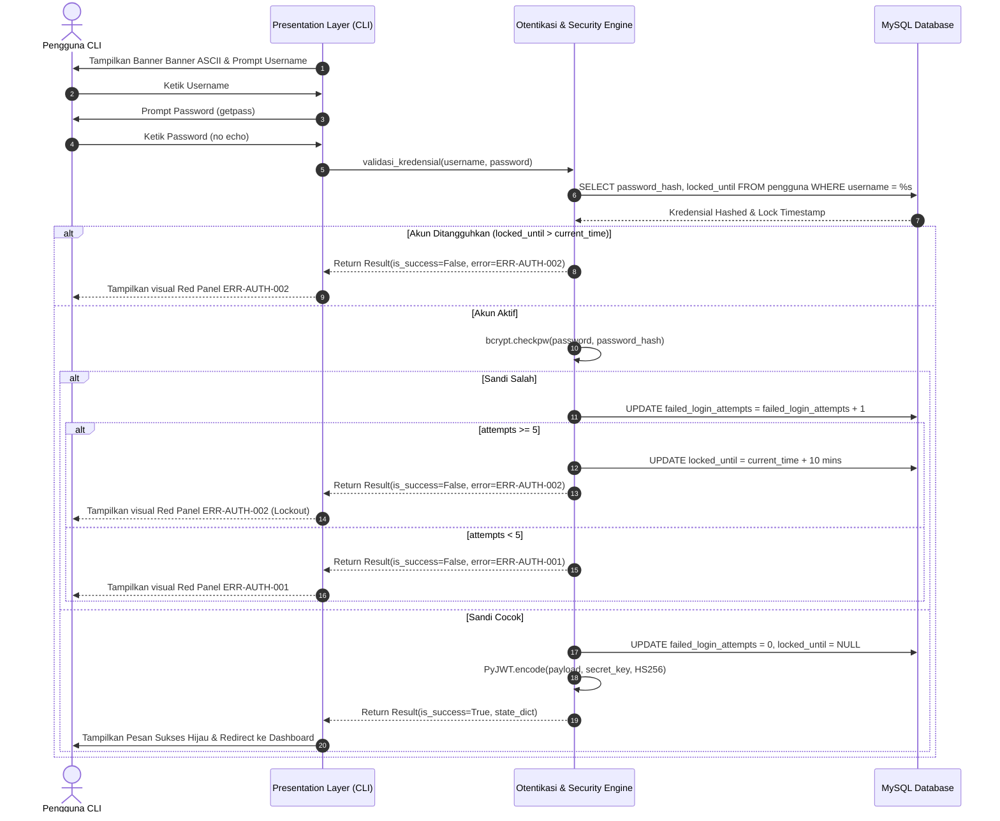
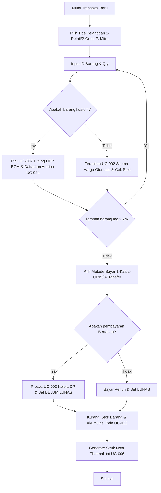
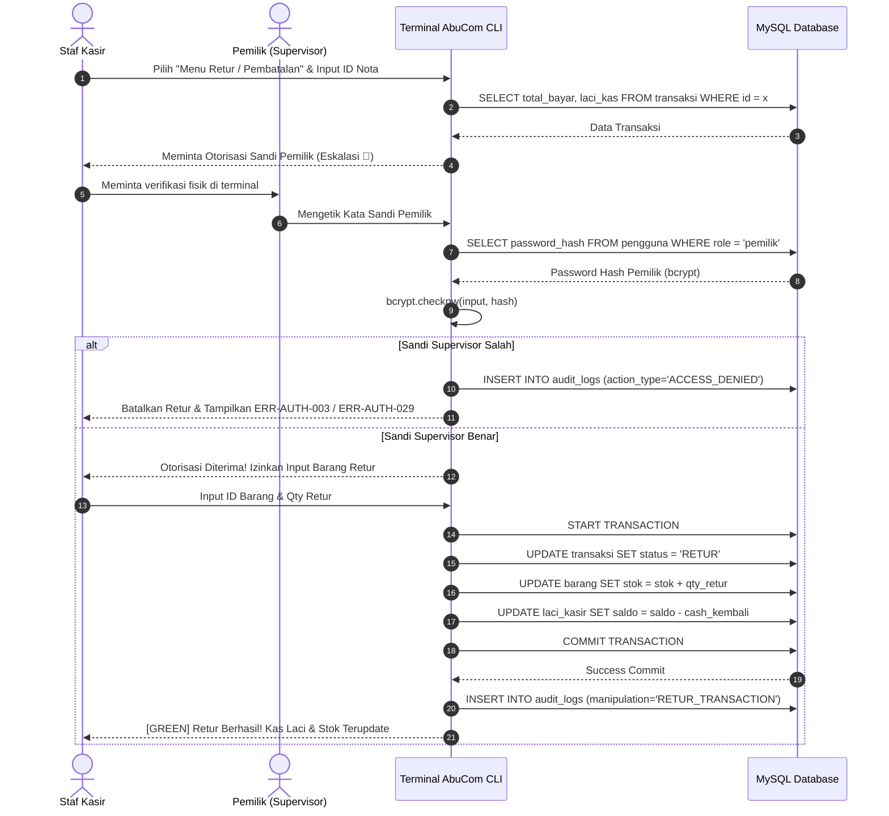
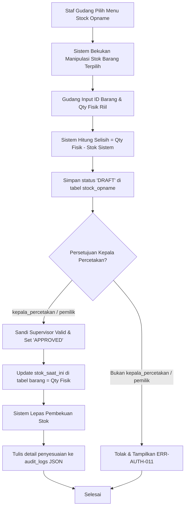
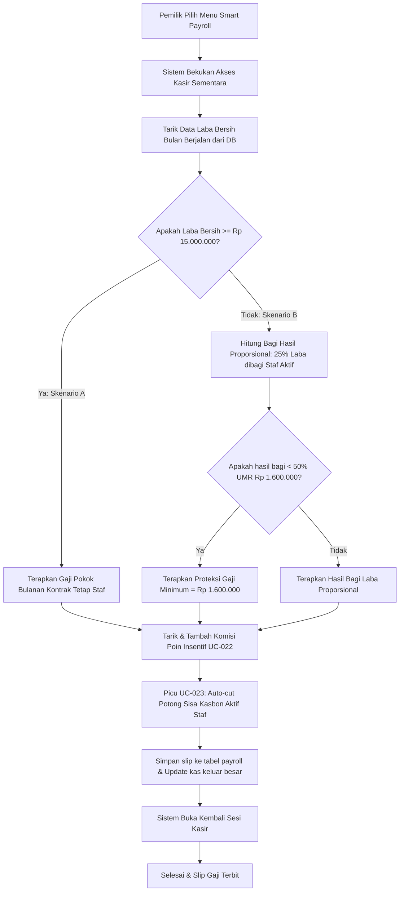
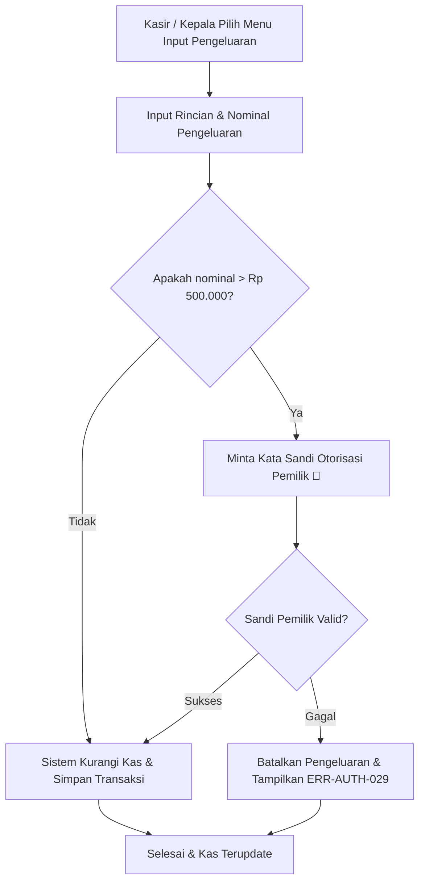

# CLI Interaction Flow — AbuCom

## Riwayat Perubahan Dokumen

| Versi | Tanggal    | Perubahan | Oleh |
| :---: | :---: | --- | --- |
| **1.0** | 2026-05-24 | Pembuatan awal dokumen CLI Interaction Flow secara komprehensif. Menjabarkan konvensi desain, hierarki menu, alur interaksi detail 44 Use Case (UC-001 s.d UC-044), wireframe ASCII terminal, matriks visibilitas menu per role, dan matriks ketertelusuran kebutuhan (traceability matrix). | Senior UX/CLI Interaction Designer & Terminal Interface Architect |

---

## 1. Informasi Dokumen

### 1.1. Tujuan Dokumen
Dokumen **CLI Interaction Flow** ini disusun secara rinci dan terstruktur untuk memetakan seluruh alur interaksi pengguna (*user interaction flow*) dengan antarmuka berbasis teks *Command Line Interface* (CLI) pada sistem **AbuCom**. Dokumen ini menjadi pedoman operasional tunggal bagi tim pengembang untuk menulis kode Presentation Layer di Python, serta membantu tim QA untuk merancang skenario uji fungsionalitas visual UAT.

### 1.2. Cakupan Dokumen
Dokumen ini mencakup:
1. **Prinsip Desain CLI**: Standar navigasi, visualisasi panels, validasi input, error code layout, dan taktik portabilitas dual-OS.
2. **Peta Hierarki Menu**: Representasi pohon menu navigasi serta matriks visibilitas granular untuk 8 peran pengguna (RBAC).
3. **Alur Interaksi Dasar**: Rincian langkah operasional otentikasi login, logout, dashboard visual harian, dan ubah sandi.
4. **Alur Interaksi 10 Modul Fungsional**: Dokumentasi komprehensif step-by-step 40 use case fungsional (UC-001 s.d UC-040) lengkap dengan prompt input, tipe data, validasi, dan response error.
5. **Wireframe Monospace ASCII**: Representasi visual layout terminal untuk layar utama.
6. **Matriks Ketertelusuran (Traceability Matrix)**: Pemetaan keterkaitan logis antara CLI flow terhadap UCD v1.1, SRS v1.1, dan WFD v1.1.

### 1.3. Posisi Dokumen dalam Siklus SDLC
Dalam pengembangan proyek AbuCom CLI, dokumen ini berada pada **Fase 03 Design (Perancangan Sistem)** sebagai deliverable keempat, melengkapi Database Schema, ERD, dan System Architecture.

```
+-----------------------------------+
|  Fase 02: Analysis (SRS & UCD)    |
+-----------------------------------+
                  |
                  v
+-----------------------------------+
|  Fase 03: Database & Architecture  |
+-----------------------------------+
                  |
                  v
+===================================+
|  CLI Interaction Flow v1.0 [DOK]  |  <-- POSISI DOKUMEN INI
+===================================+
                  |
                  v
+-----------------------------------+
|  Fase 04: Implementation (Code)   |
+-----------------------------------+
```

### 1.4. Hubungan dengan Dokumen SDLC Lainnya
* **Dokumen Acuan (Input)**:
  - `03_use_case_diagram.md` (UCD v1.1): Sumber utama 44 use case fungsional, prakondisi, dan pemicu.
  - `02_software_requirements.md` (SRS v1.1): Acuan parameter input/output teknis, kode error standar, dan dependensi visual.
  - `06_access_control_matrix.md` (ACM v1.1): Basis otorisasi menu per role dan eskalasi sandi supervisor.
  - `03_system_architecture.md` (SA v1.1): Acuan teknis state passing JWT, Pure Functions FP murni, dan layout logis presentation layer.
* **Dokumen Pengguna (Output)**:
  - **Fase 04 Implementation**: Menjadi acuan mutlak penulisan fungsi menu, prompt, panel `rich`, dan tabel `tabulate`.
  - **Fase 05 Testing**: Menjadi acuan perancangan *test suite* pengujian UAT terminal.

### 1.5. Audiens Target
1. **Developer / AI Coding Agent**: Panduan teknis menyusun nested CLI loops dan decorator otorisasi.
2. **Quality Assurance Team**: Lembar validasi skenario transisi menu dan pemicu exception error.
3. **Pemilik Usaha / Karyawan**: Untuk simulasi visual alur operasional toko sebelum sistem dideploy.

### 1.6. Definisi, Akronim, dan Singkatan
* **Breadcrumb**: Penunjuk visual path navigasi di bagian atas terminal (contoh: `Dashboard > M.1 Transaksi`).
* **Hotkey**: Tombol numerik cepat (`1`, `2`, `3`) untuk memilih opsi sub-menu.
* **ANSI Color**: Kode warna konsol bawaan terminal untuk memberikan feedback sukses (hijau) atau error (merah).
* **Getpass**: Utilitas standard Python untuk menyembunyikan input password di terminal (no echo).
* **FP (Functional Programming)**: Paradigma pemrograman fungsional murni tanpa modifikasi state global.

---

## 2. Prinsip Desain Interaksi CLI

### 2.1. Filosofi UX Terminal AbuCom
Sistem dirancang dengan filosofi **"Fast, Lightweight, and Keyboard-Only"**. Karena operasional toko percetakan menuntut kecepatan kasir melayani antrian, antarmuka CLI AbuCom mengeliminasi kebutuhan penggunaan mouse. Seluruh navigasi, input, dan eksekusi diselesaikan penuh via keyboard dengan respon waktu layar < 1 detik.

### 2.2. Konvensi Navigasi Global
1. **Tombol `0` (Kembali)**: Di setiap layar sub-menu atau form input, tombol `0` secara konsisten berfungsi untuk membatalkan proses dan kembali ke menu setingkat di atasnya.
2. **Hotkey Numerik**: Pilihan menu utama dan sub-menu wajib dipicu menggunakan angka berurutan (`1`, `2`, `3`, dst).
3. **Pola Konfirmasi Aksi Destruktif**: Operasi kritis (retur, hapus, pembatalan, opname, payroll, restore) wajib menyajikan konfirmasi eksplisit `[Y/N]` (Case-Insensitive) sebelum data disimpan.
4. **Pola Enter Kosong**: Menekan `Enter` tanpa mengetikkan nilai pada prompt input opsional akan mengisi nilai bawaan (*default value*) atau mengulangi prompt jika field bersifat mandatory (`NOT NULL`).
5. **Exit Darurat**: Tombol `q` pada menu utama atau penekanan shortcut keyboard `Ctrl+C` akan memicu penutupan aplikasi secara aman (*graceful exit*) setelah membersihkan memori token JWT lokal.

### 2.3. Konvensi Visual & Pustaka Tampilan
Sistem Presentation Layer diimplementasikan menggunakan standardisasi visual berikut:
* **Panel Visual (`rich` library)**: Header menu, dashboard ringkasan, dan banner otorisasi dibungkus dalam container panels visual `rich` dengan border double line (`═══`).
* **Tabel Terformat (`tabulate` library)**: Tampilan daftar barang, detail keranjang belanja, log audit, and laporan laba rugi disajikan rapi menggunakan standard border tabular.
* **ANSI Color Palette**:
  - `Green` (ansi hijau): Indikator sukses transaksi dan status `LUNAS`.
  - `Red` (ansi merah): Indikator penolakan akses dan status error kritis (`ERR-`).
  - `Yellow` (ansi kuning): Peringatan stok kritis, jatuh tempo utang H-3, status `BELUM LUNAS`, dan konfirmasi.
  - `Blue` (ansi biru): Indikator bantuan, panduan input, dan breadcrumb.
  - `Magenta` (ansi magenta): Judul utama modul dan banner dashboard.

### 2.4. Konvensi Input & Validasi
Setiap input pengetikan pengguna melalui Presentation Layer disaring secara ketat:
1. **Sanitasi Kontrol ASCII**: Menghapus byte escape ANSI berbahaya (karakter kontrol < `\x20` seperti `\x1b`) untuk melindungi konsol dari injeksi kode visual terminal.
2. **Password Masking**: Input kata sandi wajib ditangkap menggunakan modul `getpass` Python (tanpa memancarkan visual ketikan ke layar kasir).
3. **Fixed-Point Decimal**: Input nominal Rupiah dan persediaan bahan baku desimal divalidasi ke format `decimal.Decimal` Python sebelum dikirim ke database (Menghindari pembulatan float tidak akurat).
4. **Validasi Regex**: Format tanggal divalidasi `^\d{4}-\d{2}-\d{2}$` (YYYY-MM-DD), and nomor telepon di CRM disanitasi menggunakan regex pembersih nomor WhatsApp lokal.

### 2.5. Konvensi Pesan Error & Feedback
Pesan kegagalan sistem visual wajib disajikan konsisten di baris terbawah terminal dengan format:
`[RED] ⛔ ERR-[KATEGORI]-[NOMOR]: [Pesan deskriptif fungsional berbahasa Indonesia]`

Kategori kode error:
* `ERR-AUTH-xxx`: Kegagalan login, otorisasi eskalasi supervisor, lockout brute-force.
* `ERR-VAL-xxx`: Kegagalan validasi input data, format parsing desimal/tanggal salah.
* `ERR-STOCK-xxx`: Ketersediaan stok tidak cukup di gudang.
* `ERR-CASH-xxx`: Selisih rekonsiliasi kas handover melebihi batas toleransi.
* `ERR-SESSION-xxx`: Masa aktif token JWT kadaluwarsa/rusak.
* `ERR-DB-xxx`: Terputusnya koneksi basis data MySQL lokal.
* `ERR-SYS-xxx`: Kegagalan penulisan/pembacaan berkas fisik OS.

### 2.6. Konvensi Aksesibilitas & Portabilitas
* **Windows Console**: Mengharuskan eksekusi perintah `chcp 65001` sebelum runtime CLI dijalankan agar console Windows Terminal mendukung rendering border box Unicode dan karakter UTF-8.
* **Cross-OS Paths**: Penautan path file (backup database, file desain) dikelola cross-platform menggunakan modul `pathlib`.
* **Platform-Aware Clear**: Fungsi pembersihan layar terminal disesuaikan dinamis berdasarkan deteksi OS (`cls` di Windows, `clear` di Linux).

---

## 3. Peta Hierarki Menu CLI Global

### 3.1. Diagram Hierarki Menu Utama (Mermaid Tree)

```mermaid
graph TD
    classDef main fill:#e1f5fe,stroke:#03a9f4,stroke-width:2px;
    classDef sub fill:#f1f8e9,stroke:#8bc34a,stroke-width:1px;
    classDef base fill:#fff8e1,stroke:#ffb300,stroke-width:1px;

    Login[Layar Login Awal UC-041]:::main --> Auth{Validasi JWT & Role}
    
    Auth -->|Gagal| Login
    Auth -->|Sukses| Dashboard[Dashboard Utama UC-043]:::main
    
    %% Menu Dasar
    Dashboard --> Base1[Ubah Password UC-044]:::base
    Dashboard --> Base2[Logout Sistem UC-042]:::base
    
    %% Modul-Modul Utama
    Dashboard --> M1[M.1 Transaksi & Harga]:::sub
    Dashboard --> M2[M.2 Inventaris & BOM]:::sub
    Dashboard --> M3[M.3 PPOB & Service]:::sub
    Dashboard --> M4[M.4 SDM & Payroll]:::sub
    Dashboard --> M5[M.5 Antrian & Desain]:::sub
    Dashboard --> M6[M.6 Pinjaman & Laba-Rugi]:::sub
    Dashboard --> M7[M.7 Keamanan & Audit]:::sub
    Dashboard --> M8[M.8 CRM Pelanggan]:::sub
    Dashboard --> M9[M.9 Multi-Cabang]:::sub
    Dashboard --> M10[M.10 Config Runtime]:::sub
    
    %% Sub-menu M.1
    M1 --> M1_1[1. Input Transaksi UC-001]
    M1 --> M1_2[2. Skema Harga UC-002]
    M1 --> M1_3[3. Kelola DP & Pelunasan UC-003]
    M1 --> M1_4[4. Retur/Pembatalan UC-004]
    M1 --> M1_5[5. Margin Produk UC-005]
    M1 --> M1_6[6. Struk Thermal UC-006]

    %% Sub-menu M.2
    M2 --> M2_1[1. Kelola Barang & UoM UC-009]
    M2 --> M2_2[2. Hitung HPP BOM UC-007]
    M2 --> M2_3[3. Catat Limbah UC-008]
    M2 --> M2_4[4. Sinkronisasi ATK UC-010]
    M2 --> M2_5[5. Stock Opname UC-011]
    M2 --> M2_6[6. Prediksi Re-Order UC-012]
    M2 --> M2_7[7. Price Tracking UC-013]
    M2 --> M2_8[8. Import CSV UC-014]
    M2 --> M2_9[9. Supplier & Utang UC-015]
    M2 --> M2_10[10. Backup/Restore UC-016]

    %% Sub-menu M.3
    M3 --> M3_1[1. Saldo PPOB & Alert UC-017]
    M3 --> M3_2[2. E-Wallet Terhemat UC-018]
    M3 --> M3_3[3. Jasa Service UC-019]

    %% Sub-menu M.4
    M4 --> M4_1[1. Absensi & Kasbon UC-020]
    M4 --> M4_2[2. Smart Payroll UC-021]
    M4 --> M4_3[3. Poin Insentif UC-022]
    M4 --> M4_4[4. Potong Gaji Kasbon UC-023]

    %% Sub-menu M.5
    M5 --> M5_1[1. Job Tracking Antrian UC-024]
    M5 --> M5_2[2. Arsip Desain UC-025]
    M5 --> M5_3[3. Link Notifikasi WA UC-026]

    %% Sub-menu M.6
    M6 --> M6_1[1. Pinjaman Modal UC-027]
    M6 --> M6_2[2. Laporan Laba/Rugi UC-028]
    M6 --> M6_3[3. Jatuh Tempo H-3 UC-029]
    M6 --> M6_4[4. Aset & Depresiasi UC-030]
    M6 --> M6_5[5. Pengeluaran Rutin UC-031]

    %% Sub-menu M.7
    M7 --> M7_1[1. RBAC CLI Filter UC-032]
    M7 --> M7_2[2. Log Audit JSON UC-033]
    M7 --> M7_3[3. Shift Handover UC-034]
    M7 --> M7_4[4. Rekonsiliasi Kas UC-035]
    M7 --> M7_5[5. Fraud Detection UC-036]
    M7 --> M7_6[6. Setup Wizard UC-037]

    %% Sub-menu M.8
    M8 --> M8_1[1. CRM Pelanggan UC-038]

    %% Sub-menu M.9
    M9 --> M9_1[1. Multi-Cabang UC-039]

    %% Sub-menu M.10
    M10 --> M10_1[1. Parameter Runtime UC-040]
```



### 3.2. Deskripsi Singkat Setiap Node Menu

| ID Menu | Nama Menu CLI | Level | Deskripsi Singkat Fungsional |
| :--- | :--- | :---: | :--- |
| **MENU-BASE-001** | Login Sistem | 0 | Layar otentikasi username dan password tersembunyi. |
| **MENU-BASE-002** | Logout Sesi | 1 | Menghapus token JWT lokal dan me-redirect ke login screen. |
| **MENU-BASE-003** | Dashboard Ringkasan | 1 | Tampilan dashboard grafik teks ringkasan harian toko sesuai role. |
| **MENU-BASE-004** | Ubah Password | 1 | Mengubah kata sandi pengguna aktif menggunakan verifikasi sandi lama. |
| **MENU-M1-001** | Mencatat Transaksi | 2 | Form input keranjang belanja multi-divisi dan pemilihan metode bayar. |
| **MENU-M1-002** | Skema Harga Otomatis | 2 | Konfigurasi tarif bertingkat (retail, grosir, mitra) per kuantitas unit. |
| **MENU-M1-003** | Kelola DP & Pelunasan | 2 | Perekaman uang muka pesanan kustom cetak serta penagihan sisa. |
| **MENU-M1-004** | Pembatalan & Retur | 2 | Pembatalan transaksi DP cetak kustom atau retur retail ATK. |
| **MENU-M1-005** | Margin per Produk | 2 | Grafik margin kotor per produk berbasis HPP real-time (Eksklusif Pemilik). |
| **MENU-M1-006** | Ekspor Struk Thermal | 2 | Generate plain text nota struk 58mm/80mm siap cetak ke file. |
| **MENU-M2-001** | Kelola Barang & UoM | 2 | Tambah, ubah, dan hapus master data persediaan unit UoM. |
| **MENU-M2-002** | Hitung HPP BOM Desimal | 2 | Komputasi harga pokok cetak kustom berbasis pemakaian bahan baku desimal. |
| **MENU-M2-003** | Mencatat Limbah | 2 | Perekaman bahan baku rusak untuk penyesuaian stok & pembukuan rugi. |
| **MENU-M2-004** | Sinkronisasi ATK | 2 | Pengubahan persediaan retail ATK eceran menjadi ATK produksi internal. |
| **MENU-M2-005** | Rekonsiliasi Stok | 2 | Form input Stock Opname fisik vs sistem (DDraft & Approved). |
| **MENU-M2-006** | Prediksi Re-Order | 2 | Analisis konsumsi bahan harian untuk alert visual re-order H-7. |
| **MENU-M2-007** | Price Tracking Supplier| 2 | Monitoring fluktuasi riwayat harga beli pasokan barang masuk. |
| **MENU-M2-008** | Impor Data CSV | 2 | Migrasi bulk data awal toko dari CSV Microsoft Excel manual. |
| **MENU-M2-009** | Supplier & Utang Usaha | 2 | Manajemen vendor and pencatatan utang tempo pembelian stok. |
| **MENU-M2-010** | Backup & Restore DB | 2 | Cadangan manual terkompresi ZIP AES-256 (Eksklusif Pemilik). |
| **MENU-M3-001** | Kelola Saldo PPOB | 2 | Update deposit dan pencatatan manual pulsa/token (alert Rp 150rb). |
| **MENU-M3-002** | E-Wallet Terhemat | 2 | Tabel perbandingan biaya admin 6 dompet digital transfer terhemat. |
| **MENU-M3-003** | Transaksi Jasa Service | 2 | Penerimaan unit service rusak, status perbaikan, & link suku cadang. |
| **MENU-M4-001** | Kelola Absensi & Kasbon| 2 | Rekam kehadiran absensi harian staf dan log pinjaman kasbon. |
| **MENU-M4-002** | Smart Payroll | 2 | Proses slip gaji bulanan berbasis bagi hasil target laba (Eksklusif). |
| **MENU-M4-003** | Poin Insentif Karyawan | 2 | Akumulasi komisi bonus poin staf per transaksi berdasarkan 4-tier. |
| **MENU-M4-004** | Potongan Gaji Kasbon | 2 | Auto-cut sisa utang kasbon bulanan karyawan saat payroll. |
| **MENU-M5-001** | Job Tracking Antrian | 2 | Monitoring sekuensial 5 status alur produksi pesanan kustom. |
| **MENU-M5-002** | Mengelola Arsip Desain | 2 | Penyimpanan dan lookup path folder mockup desain pelanggan di server. |
| **MENU-M5-003** | Link WhatsApp Web | 2 | Generator salinan tautan notifikasi ringkas wa.me client. |
| **MENU-M6-001** | Pinjaman Modal | 2 | Pencatatan cicilan utang bank Mandiri/BRI dan modal keluarga. |
| **MENU-M6-002** | Laporan Laba/Rugi | 2 | Laporan keuangan Laba/Rugi instan per divisi operasional toko. |
| **MENU-M6-003** | Alert Jatuh Tempo H-3 | 2 | Notifikasi otomatis startup check sisa utang jatuh tempo. |
| **MENU-M6-004** | Aset & Depresiasi | 2 | Penyusutan garis lurus aset dan tabungan virtual alokasi mesin. |
| **MENU-M6-005** | Pengeluaran Rutin | 2 | Input belanja operasional (eskalasi sandi jika > Rp 500.000). |
| **MENU-M7-001** | RBAC CLI Filter | 2 | middleware penyaring hak akses command dan dekorator menu. |
| **MENU-M7-002** | Log Audit JSON | 2 | Viewer log trail perubahan old_value/new_value (Eksklusif Pemilik). |
| **MENU-M7-003** | Shift Handover | 2 | Serah terima shift kasir dan pembekuan transaksi sementara. |
| **MENU-M7-004** | Rekonsiliasi Kas | 2 | Input pencocokan nominal uang laci fisik vs catatan laci sistem. |
| **MENU-M7-005** | Fraud Detection | 2 | Dashboard visual pemantau anomali laci kasir (Eksklusif Pemilik). |
| **MENU-M7-006** | Setup Wizard | 2 | Langkah awal seting konfigurasi dasar toko baru. |
| **MENU-M8-001** | Database CRM | 2 | Pengelolaan profil pelanggan (enkripsi WhatsApp mematuhi UU PDP). |
| **MENU-M9-001** | Multi-Cabang | 2 | Identifikasi id cabang transaksional basis data (Default id = 1). |
| **MENU-M10-001**| Parameter Runtime | 2 | Pengaturan nilai konfigurasi operational toko di `system_configs`. |

### 3.3. Matriks Visibilitas Menu per Role (8 Peran)
Berdasarkan Access Control Matrix (ACM) v1.1 Bab 4, berikut adalah visibilitas biner menu CLI (Tampil / Sembunyi) pada Presentation Layer untuk setiap peran login. Menu dengan status `⛔ DENY` akan secara otomatis **disembunyikan** dari tampilan console pengguna.

| ID Menu | pemilik | kepala_percetakan | pramuniaga | kasir | desainer | produksi_cetak | fotocopy_print | gudang |
| :--- | :---: | :---: | :---: | :---: | :---: | :---: | :---: | :---: |
| **M1-001** | Tampil | Tampil | Tampil | Tampil | Sembunyi | Sembunyi | Tampil | Sembunyi |
| **M1-002** | Tampil | Tampil | Tampil | Tampil | Sembunyi | Sembunyi | Sembunyi | Sembunyi |
| **M1-003** | Tampil | Sembunyi | Sembunyi | Tampil | Sembunyi | Sembunyi | Sembunyi | Sembunyi |
| **M1-004** | Tampil | Sembunyi | Sembunyi | Tampil | Sembunyi | Sembunyi | Sembunyi | Sembunyi |
| **M1-005** | Tampil | Sembunyi | Sembunyi | Sembunyi | Sembunyi | Sembunyi | Sembunyi | Sembunyi |
| **M1-006** | Tampil | Sembunyi | Sembunyi | Tampil | Sembunyi | Sembunyi | Sembunyi | Sembunyi |
| **M2-001** | Tampil | Tampil | Sembunyi | Sembunyi | Sembunyi | Tampil | Sembunyi | Tampil |
| **M2-002** | Tampil | Tampil | Sembunyi | Sembunyi | Sembunyi | Tampil | Sembunyi | Sembunyi |
| **M2-003** | Tampil | Tampil | Sembunyi | Sembunyi | Sembunyi | Tampil | Sembunyi | Sembunyi |
| **M2-004** | Tampil | Tampil | Sembunyi | Sembunyi | Sembunyi | Tampil | Sembunyi | Tampil |
| **M2-005** | Tampil | Tampil | Sembunyi | Sembunyi | Sembunyi | Sembunyi | Sembunyi | Tampil |
| **M2-006** | Tampil | Tampil | Sembunyi | Sembunyi | Sembunyi | Sembunyi | Sembunyi | Tampil |
| **M2-007** | Tampil | Tampil | Sembunyi | Sembunyi | Sembunyi | Sembunyi | Sembunyi | Tampil |
| **M2-008** | Tampil | Sembunyi | Sembunyi | Sembunyi | Sembunyi | Sembunyi | Sembunyi | Tampil |
| **M2-009** | Tampil | Tampil | Sembunyi | Sembunyi | Sembunyi | Sembunyi | Sembunyi | Tampil |
| **M2-010** | Tampil | Sembunyi | Sembunyi | Sembunyi | Sembunyi | Sembunyi | Sembunyi | Sembunyi |
| **M3-001** | Tampil | Sembunyi | Sembunyi | Tampil | Sembunyi | Sembunyi | Sembunyi | Sembunyi |
| **M3-002** | Tampil | Sembunyi | Sembunyi | Tampil | Sembunyi | Sembunyi | Sembunyi | Sembunyi |
| **M3-003** | Tampil | Sembunyi | Tampil | Tampil | Sembunyi | Sembunyi | Sembunyi | Sembunyi |
| **M4-001** | Tampil | Tampil | Tampil | Tampil | Tampil | Tampil | Tampil | Tampil |
| **M4-002** | Tampil | Sembunyi | Sembunyi | Sembunyi | Sembunyi | Sembunyi | Sembunyi | Sembunyi |
| **M4-003** | Tampil | Sembunyi | Sembunyi | Tampil | Sembunyi | Sembunyi | Sembunyi | Sembunyi |
| **M4-004** | Tampil | Sembunyi | Sembunyi | Sembunyi | Sembunyi | Sembunyi | Sembunyi | Sembunyi |
| **M5-001** | Tampil | Tampil | Tampil | Tampil | Tampil | Tampil | Sembunyi | Sembunyi |
| **M5-002** | Tampil | Sembunyi | Tampil | Sembunyi | Tampil | Sembunyi | Sembunyi | Sembunyi |
| **M5-003** | Tampil | Sembunyi | Tampil | Tampil | Sembunyi | Sembunyi | Sembunyi | Sembunyi |
| **M6-001** | Tampil | Sembunyi | Sembunyi | Sembunyi | Sembunyi | Sembunyi | Sembunyi | Sembunyi |
| **M6-002** | Tampil | Sembunyi | Sembunyi | Sembunyi | Sembunyi | Sembunyi | Sembunyi | Sembunyi |
| **M6-003** | Tampil | Sembunyi | Sembunyi | Sembunyi | Sembunyi | Sembunyi | Sembunyi | Sembunyi |
| **M6-004** | Tampil | Sembunyi | Sembunyi | Sembunyi | Sembunyi | Sembunyi | Sembunyi | Sembunyi |
| **M6-005** | Tampil | Tampil | Sembunyi | Tampil | Sembunyi | Sembunyi | Sembunyi | Sembunyi |
| **M7-001** | Tampil | Sembunyi | Sembunyi | Sembunyi | Sembunyi | Sembunyi | Sembunyi | Sembunyi |
| **M7-002** | Tampil | Sembunyi | Sembunyi | Sembunyi | Sembunyi | Sembunyi | Sembunyi | Sembunyi |
| **M7-003** | Tampil | Tampil | Sembunyi | Tampil | Sembunyi | Sembunyi | Sembunyi | Sembunyi |
| **M7-004** | Tampil | Tampil | Sembunyi | Tampil | Sembunyi | Sembunyi | Sembunyi | Sembunyi |
| **M7-005** | Tampil | Sembunyi | Sembunyi | Sembunyi | Sembunyi | Sembunyi | Sembunyi | Sembunyi |
| **M7-006** | Tampil | Sembunyi | Sembunyi | Sembunyi | Sembunyi | Sembunyi | Sembunyi | Sembunyi |
| **M8-001** | Tampil | Sembunyi | Tampil | Tampil | Sembunyi | Sembunyi | Sembunyi | Sembunyi |
| **M9-001** | Tampil | Sembunyi | Sembunyi | Sembunyi | Sembunyi | Sembunyi | Sembunyi | Sembunyi |
| **M10-001**| Tampil | Sembunyi | Sembunyi | Sembunyi | Sembunyi | Sembunyi | Sembunyi | Sembunyi |
| **BASE-001**| Tampil | Tampil | Tampil | Tampil | Tampil | Tampil | Tampil | Tampil |
| **BASE-002**| Tampil | Tampil | Tampil | Tampil | Tampil | Tampil | Tampil | Tampil |
| **BASE-003**| Tampil | Tampil | Tampil | Tampil | Tampil | Tampil | Tampil | Tampil |
| **BASE-004**| Tampil | Tampil | Tampil | Tampil | Tampil | Tampil | Tampil | Tampil |

---

## 4. Alur Interaksi Dasar Sistem (Use Case Dasar)

### 4.1. Alur Interaksi: Login ke Sistem (UC-041)

#### Diagram Alur Interaksi (Mermaid)



#### Langkah-Langkah Interaksi Detail

| No. | Aktor/Sistem | Aksi | Tipe | Contoh Tampilan/Input |
| :---: | :--- | :--- | :---: | :--- |
| 1 | Sistem | Membersihkan layar, menampilkan banner Unicode AbuCom CLI v1.0, and menanyakan username. | Output | `Username: ` |
| 2 | Pengguna | Mengetikkan nama pengguna. | Input | `kasir_01` (string max 50 char) |
| 3 | Sistem | Menampilkan prompt password. | Output | `Password: ` |
| 4 | Pengguna | Mengetikkan password (karakter tidak dimunculkan di layar konsol). | Input | `[Sandi Rahasia Staf]` (getpass) |
| 5 | Sistem | Melakukan query database, memvalidasi hash bcrypt, and mengecek lockout rate limiting. | Proses | Sesi transaksional MySQL |
| 6a | Sistem | Jika data valid: membuat token JWT, menampilkan pesan sukses hijau, and mengalirkan state login ke Dashboard. | Output | `[GREEN] login Sukses! Selamat bekerja, Kasir 01.` |
| 6b | Sistem | Jika gagal: memancarkan panel merah kesalahan, dan mengunci input jika gagal berturut-turut &ge; 5 kali. | Output | `⛔ ERR-AUTH-001: Username atau password salah!` atau `⛔ ERR-AUTH-002: Akun ditangguhkan akibat brute-force!` |

#### Pesan Error yang Mungkin Muncul

| Kode Error | Pemicu | Pesan yang Ditampilkan |
| :--- | :--- | :--- |
| `ERR-AUTH-001` | Username tidak terdaftar atau sandi bcrypt tidak cocok. | `⛔ ERR-AUTH-001: Kredensial Salah: Nama pengguna atau kata sandi yang Anda masukkan tidak valid!` |
| `ERR-AUTH-002` | Akun ditangguhkan selama 10 menit setelah 5 kali gagal berturut-turut. | `⛔ ERR-AUTH-002: Sandi Gagal: Akun ditangguhkan selama 10 menit akibat terdeteksi serangan brute-force!` |
| `ERR-DB-001` | Koneksi database ke Mini PC Server terputus saat login. | `⛔ ERR-DB-001: Kegagalan Database: Tidak dapat terhubung ke server database lokal. Harap hubungi administrator!` |

---

### 4.2. Alur Interaksi: Logout dari Sistem (UC-042)

#### Langkah-Langkah Interaksi Detail

| No. | Aktor/Sistem | Aksi | Tipe | Contoh Tampilan/Input |
| :---: | :--- | :--- | :---: | :--- |
| 1 | Pengguna | Memilih opsi "Logout dari Sesi CLI" di menu utama. | Input | `Pilihan menu [0-Kembali]: 9` (numerik) |
| 2 | Sistem | Meminta konfirmasi biner tindakan logout dari pengguna. | Output | `Apakah Anda yakin ingin logout? [Y/N]: ` |
| 3 | Pengguna | Mengetik konfirmasi `Y` atau `y`. | Input | `Y` (char, case-insensitive) |
| 4 | Sistem | Menghapus data token JWT lokal di memory state dictionary, membersihkan layar console. | Proses | Memusnahkan objek token di sisi klien Python. |
| 5 | Sistem | Me-redirect browser/terminal kembali ke Layar Login Awal. | Output | `[GREEN] Anda telah berhasil logout secara aman.` |

---

### 4.3. Alur Interaksi: Dashboard Utama per Role (UC-043)

#### Langkah-Langkah Interaksi Detail

| No. | Aktor/Sistem | Aksi | Tipe | Contoh Tampilan/Input |
| :---: | :--- | :--- | :---: | :--- |
| 1 | Sistem | Mendeteksi payload `role` dari parameter session JWT. | Proses | Membaca klaim JWT di runtime memory. |
| 2 | Sistem | Menarik data ringkasan harian spesifik dari database MySQL. | Proses | Agregasi data real-time. |
| 3a | Sistem | **Dashboard Pemilik**: Menampilkan panel laba bersih toko berjalan, persentase target gaji payroll, alert jatuh tempo utang, and status laci uang kasir. | Output | Panel Laba Rugi Tabular visual `rich` |
| 3b | Sistem | **Dashboard Kasir**: Menampilkan log transaksi shift aktif, saldo virtual e-wallet/PPOB, dan status sisa antrian cetak belum bayar. | Output | Panel Kasir Visual (Jumlah Nota Lunas/DP) |
| 3c | Sistem | **Dashboard Gudang**: Menampilkan alert stok kritis bahan baku re-order H-7 dan draf stock opname aktif. | Output | Tabel Grid Barang Kritis ANSI Kuning/Merah |
| 4 | Sistem | Menampilkan menu navigasi yang filternya disesuaikan (hanya memunculkan menu yang diizinkan ACM). | Output | `Pilihan Menu Anda [1-10]: ` |

---

### 4.4. Alur Interaksi: Ubah Password Akun Sendiri (UC-044)

#### Langkah-Langkah Interaksi Detail

| No. | Aktor/Sistem | Aksi | Tipe | Contoh Tampilan/Input |
| :---: | :--- | :--- | :---: | :--- |
| 1 | Pengguna | Memilih menu "Ubah Password Akun Sendiri" di terminal. | Input | `Pilihan menu: 8` |
| 2 | Sistem | Meminta kata sandi aktif saat ini untuk verifikasi keamanan. | Output | `Masukkan Password Lama: ` |
| 3 | Pengguna | Mengetikkan password lama (tersembunyi). | Input | `[Password Lama]` (getpass) |
| 4 | Sistem | Meminta password baru yang memenuhi syarat (min 8 karakter). | Output | `Masukkan Password Baru: ` |
| 5 | Pengguna | Mengetikkan password baru (tersembunyi). | Input | `[Password Baru]` (getpass) |
| 6 | Sistem | Meminta konfirmasi ulang password baru. | Output | `Masukkan Kembali Password Baru: ` |
| 7 | Pengguna | Mengetik ulang password baru (tersembunyi). | Input | `[Password Baru]` (getpass) |
| 8 | Sistem | Memastikan password baru cocok, melakukan hash ulang menggunakan bcrypt cost 12, and mengupdate database MySQL. | Proses | `UPDATE pengguna SET password_hash = %s WHERE id = %s` |
| 9 | Sistem | Menyajikan visual sukses hijau dan mengembalikan pengguna ke dashboard. | Output | `[GREEN] Password berhasil diubah! Gunakan sandi baru Anda pada login berikutnya.` |

#### Pesan Error yang Mungkin Muncul

| Kode Error | Pemicu | Pesan yang Ditampilkan |
| :--- | :--- | :--- |
| `ERR-VAL-044` | Password baru kurang dari 8 karakter atau konfirmasi 2x tidak cocok. | `⛔ ERR-VAL-044: Konvalidasi Gagal: Kata sandi baru minimal harus 8 karakter dan bernilai cocok pada kedua input!` |
| `ERR-AUTH-044` | Password lama yang dimasukkan salah. | `⛔ ERR-AUTH-044: Otorisasi Gagal: Kata sandi lama yang Anda masukkan tidak valid!` |

---

## 5. Alur Interaksi Modul M.1 — Transaksi & Kebijakan Harga

### 5.1. Alur: Mencatat Transaksi Penjualan Multi-Divisi (UC-001)

| Atribut | Nilai |
| :--- | :--- |
| **Derivasi UC** | UC-001 |
| **Derivasi SRS** | SRS-F-001 |
| **Derivasi WF** | WF-M1-01 / WF-OVERVIEW-01 |
| **Modul** | M.1 — Transaksi & Kebijakan Harga |
| **Aktor Primer** | `pramuniaga`, `kasir`, `fotocopy_print` |
| **Menu ID** | MENU-M1-001 |
| **Hak Akses** | `pemilik`: FULL, `kepala_percetakan`: READ, `pramuniaga`: INPUT, `kasir`: FULL, `fotocopy_print`: RTL |

#### Diagram Alur Interaksi (Mermaid)



#### Langkah-Langkah Interaksi Detail

| No. | Aktor/Sistem | Aksi | Tipe | Contoh Tampilan/Input |
|---|---|---|---|---|
| 1 | Sistem | Menampilkan header breadcrumb path menu transaksi. | Output | `Dashboard > M.1 Transaksi & Harga > Mencatat Transaksi Baru` |
| 2 | Sistem | Meminta memilih kategori kelompok tipe pelanggan. | Output | `Pilih Tipe Pelanggan [1-Retail, 2-Grosir, 3-Mitra] [0-Batal]: ` |
| 3 | Pengguna | Mengetikkan pilihan numerik kategori pelanggan. | Input | `1` (integer) |
| 4 | Sistem | Menyajikan grid pencarian barang/jasa dan meminta ID Barang. | Output | `Masukkan ID Barang / Jasa [0-Selesai & Bayar]: ` |
| 5 | Pengguna | Mengetikkan ID Barang yang dibeli pelanggan. | Input | `102` (integer > 0) |
| 6 | Sistem | Menampilkan nama barang, stok saat ini, and menanyakan kuantitas. | Output | `Kertas HVS A4 (Stok: 45 Rim). Kuantitas: ` |
| 7 | Pengguna | Mengetik kuantitas pembelian unit. | Input | `2` (decimal / integer > 0) |
| 8 | Sistem | Memproses harga dinamis (UC-002), menghitung subtotal desimal fixed-point, and merekam item ke keranjang local memory. | Proses | `Subtotal: Rp 90.000 (Decimal)` |
| 9 | Sistem | Menampilkan tabel keranjang berjalan menggunakan `tabulate` grid and bertanya apakah ingin menambah item. | Output | `Tambahkan item lain ke keranjang? [Y/N]: ` |
| 10 | Pengguna | Mengetik `N` untuk beralih ke menu penyelesaian kas. | Input | `N` (char, case-insensitive) |
| 11 | Sistem | Menampilkan grand total nominal belanja dan menanyakan metode bayar. | Output | `TOTAL: Rp 90.000. Metode Pembayaran [1-Kas, 2-QRIS, 3-Transfer]: ` |
| 12 | Pengguna | Mengetik metode pembayaran kas. | Input | `1` (integer) |
| 13 | Sistem | Meminta input uang tunai fisik yang diterima dari pembeli. | Output | `Uang Diterima Pelanggan: Rp ` |
| 14 | Pengguna | Mengetik nominal Rupiah uang cash fisik. | Input | `100000` (decimal) |
| 15 | Sistem | Melakukan validasi transaksi, start transaction, update stok master barang, mencatat poin, commit data, and menyajikan kembalian. | Proses | `Kembalian: Rp 10.000` |
| 16 | Sistem | Menampilkan status sukses, log audit trail, and opsi ekspor struk nota thermal (UC-006). | Output | `[GREEN] Transaksi Berhasil! ID Nota: INV-20260524-001. Cetak Nota? [Y/N]: ` |

#### Pesan Error yang Mungkin Muncul

| Kode Error | Pemicu | Pesan yang Ditampilkan |
| :--- | :--- | :--- |
| `ERR-STOCK-010` | Stok barang ATK di database master kurang dari kuantitas yang diminta. | `⛔ ERR-STOCK-010: Stok Kurang: Sisa persediaan barang di database tidak mencukupi untuk memenuhi jumlah pembelian!` |
| `ERR-VAL-001` | ID barang tidak terdaftar atau kuantitas diinput non-numerik. | `⛔ ERR-VAL-001: Input Salah: ID barang tidak valid atau kuantitas harus diisi berupa angka positif!` |

---

### 5.2. Alur: Mengubah Skema Harga Otomatis (UC-002)

| Atribut | Nilai |
| :--- | :--- |
| **Derivasi UC** | UC-002 |
| **Derivasi SRS** | SRS-F-002 |
| **Derivasi WF** | WF-M1-01 (Subprocess) |
| **Modul** | M.1 — Transaksi & Kebijakan Harga |
| **Aktor Primer** | `pramuniaga`, `kasir` |
| **Menu ID** | Terintegrasi dinamis dalam MENU-M1-001 |
| **Hak Akses** | `pemilik`: FULL, `kepala_percetakan`: READ, `pramuniaga`: READ, `kasir`: READ |

#### Langkah-Langkah Interaksi Detail

| No. | Aktor/Sistem | Aksi | Tipe | Contoh Tampilan/Input |
|---|---|---|---|---|
| 1 | Sistem | Membaca tipe pelanggan yang dipilih kasir pada awal transaksi (UC-001). | Proses | Session state read |
| 2 | Sistem | Meminta ID barang and kuantitas belanja dari prompt kasir. | Proses | Ambil argumen parameter fungsi |
| 3 | Sistem | Melakukan query database ke tabel `barang` untuk mengekstrak kolom `harga_retail`, `harga_grosir`, `harga_mitra`, and `min_grosir`. | Proses | `SELECT harga_retail, harga_grosir, harga_mitra, min_grosir FROM barang WHERE id = %s` |
| 4a | Sistem | **Skenario Mitra**: Jika tipe pelanggan = `3` (Mitra), sistem langsung menerapkan harga satuan = `harga_mitra` desimal. | Proses | `harga_satuan = harga_mitra` |
| 4b | Sistem | **Skenario Grosir**: Jika tipe pelanggan = `2` (Grosir) ATAU kuantitas belanja &ge; `min_grosir`, sistem langsung menerapkan `harga_grosir`. | Proses | `harga_satuan = harga_grosir` |
| 4c | Sistem | **Skenario Retail**: Selain kondisi di atas, sistem menetapkan standard `harga_retail` secara bawaan. | Proses | `harga_satuan = harga_retail` |
| 5 | Sistem | Menampilkan harga satuan hasil pencocokan dinamis di terminal kasir. | Output | `[BLUE] Skema Harga Diterapkan: Grosir (Rp 40.000 / Rim)` |

---

### 5.3. Alur: Mengelola Pembayaran DP & Pelunasan (UC-003)

| Atribut | Nilai |
| :--- | :--- |
| **Derivasi UC** | UC-003 |
| **Derivasi SRS** | SRS-F-003 |
| **Derivasi WF** | WF-M1-01 / WF-CROSS-01 |
| **Modul** | M.1 — Transaksi & Kebijakan Harga |
| **Aktor Primer** | `kasir` |
| **Menu ID** | MENU-M1-003 |
| **Hak Akses** | `pemilik`: FULL, `kasir`: FULL, `staf_lain`: DENY |

#### Langkah-Langkah Interaksi Detail

| No. | Aktor/Sistem | Aksi | Tipe | Contoh Tampilan/Input |
|---|---|---|---|---|
| 1 | Sistem | Menampilkan header breadcrumb path menu pengelolaan DP/Pelunasan. | Output | `Dashboard > M.1 Transaksi > Pengelolaan DP & Pelunasan` |
| 2 | Sistem | Meminta memilih opsi aksi transaksi bertahap. | Output | `Opsi: [1-Input DP Transaksi Baru, 2-Proses Pelunasan Nota] [0-Kembali]: ` |
| 3 | Pengguna | Mengetikkan pilihan `2` untuk pelunasan nota lama. | Input | `2` (integer) |
| 4 | Sistem | Meminta memasukkan Nomor ID Invoice/Nota yang belum lunas. | Output | `Masukkan ID Nota (contoh: INV-20260524-001): ` |
| 5 | Pengguna | Mengetikkan nomor ID nota pesanan kustom cetak. | Input | `INV-20260524-001` (string) |
| 6 | Sistem | Lookup database transaksional, menyajikan detail belanja, nominal DP awal yang dibayar, and sisa tagihan terutang. | Output | `Total Belanja: Rp 150.000. DP Dibayar: Rp 50.000. SISA TAGIHAN: Rp 100.000. [YELLOW] Status: BELUM LUNAS.` |
| 7 | Sistem | Meminta nominal uang tunai pelunasan yang diserahkan pelanggan. | Output | `Masukkan Nominal Uang Pelunasan: Rp ` |
| 8 | Pengguna | Mengetikkan nominal Rupiah pelunasan. | Input | `100000` (decimal) |
| 9 | Sistem | Melakukan query update database, mengubah kolom status pembayaran `'BELUM LUNAS'` &rarr; `'LUNAS'`, and status antrian ambil. | Proses | `UPDATE transaksi SET status_bayar = 'LUNAS', status_ambil = 'DIAMBIL' WHERE id = %s` |
| 10 | Sistem | Menampilkan status transaksi lunas, nominal kembalian, and otomatis menyimpan track audit log. | Output | `[GREEN] Pelunasan Nota Berhasil! Status: LUNAS. Nota lunas siap dicetak.` |

#### Pesan Error yang Mungkin Muncul

| Kode Error | Pemicu | Pesan yang Ditampilkan |
| :--- | :--- | :--- |
| `ERR-VAL-003` | Uang pelunasan yang diinput kasir kurang dari sisa tagihan terutang pelanggan. | `⛔ ERR-VAL-003: Nominal Kurang: Jumlah pelunasan yang Anda input kurang dari sisa tagihan pelanggan!` |

---

### 5.4. Alur: Memproses Pembatalan & Retur (UC-004)

| Atribut | Nilai |
| :--- | :--- |
| **Derivasi UC** | UC-004 |
| **Derivasi SRS** | SRS-F-004 |
| **Derivasi WF** | WF-M1-04 (Retur) |
| **Modul** | M.1 — Transaksi & Kebijakan Harga |
| **Aktor Primer** | `kasir` |
| **Aktor Sekunder** | `pemilik` (Otorisasi sandi eskalasi) |
| **Menu ID** | MENU-M1-004 |
| **Hak Akses** | `pemilik`: FULL, `kasir`: ESC, `staf_lain`: DENY |

#### Diagram Alur Otorisasi Eskalasi Retur (Mermaid Sequence)



#### Langkah-Langkah Interaksi Detail

| No. | Aktor/Sistem | Aksi | Tipe | Contoh Tampilan/Input |
|---|---|---|---|---|
| 1 | Sistem | Menampilkan header breadcrumb path menu retur. | Output | `Dashboard > M.1 Transaksi > Pembatalan & Retur Transaksi` |
| 2 | Sistem | Meminta menginput Nomor Nota transaksi yang akan diretur/batal. | Output | `Masukkan ID Nota Transaksi: ` |
| 3 | Pengguna | Mengetikkan ID nota belanja. | Input | `INV-20260524-002` (string) |
| 4 | Sistem | Lookup database, menyajikan detail baris belanja barang, status kas, and meminta otorisasi. | Output | `Detail Nota Ditemukan. [YELLOW] 🔐 Hak Otorisasi Pemilik Dibutuhkan untuk memproses retur!` |
| 5 | Sistem | Meminta input kata sandi supervisor Pemilik. | Output | `Masukkan Kata Sandi Pemilik: ` |
| 6 | Pengguna | Pemilik mengetikkan kata sandinya secara langsung (tanpa visual echo). | Input | `[Sandi Pemilik]` (getpass) |
| 7 | Sistem | Memeriksa password, jika valid: mengizinkan input detail retur. | Proses | bcrypt verify session |
| 8 | Sistem | Meminta memasukkan ID Barang yang diretur and kuantitasnya. | Output | `ID Barang yang diretur: ` |
| 9 | Pengguna | Mengetikkan ID Barang retail ATK yang rusak/gagal. | Input | `102` (integer) |
| 10 | Sistem | Meminta kuantitas unit barang retur. | Output | `Kuantitas barang retur: ` |
| 11 | Pengguna | Mengetik kuantitas barang retur. | Input | `1` (integer) |
| 12 | Sistem | Memproses rollback transaksional: start transaction, mengembalikan stok ATK di gudang master, mengurangi laci kas kasir aktif, commit data, and membuat log audit JSON detail. | Proses | Transaksi ACID MySQL InnoDB |
| 13 | Sistem | Menampilkan status sukses retur barang and nominal uang yang dikembalikan ke pelanggan dari laci kas. | Output | `[GREEN] Retur Berhasil! Status: RETUR. Kembalikan uang pembeli: Rp 45.000. Laci kas terpotong.` |

#### Pesan Error yang Mungkin Muncul

| Kode Error | Pemicu | Pesan yang Ditampilkan |
| :--- | :--- | :--- |
| `ERR-AUTH-003` | Sandi pemilik yang diinputkan salah saat eskalasi otorisasi. | `⛔ ERR-AUTH-003: Akses Ditolak: Sandi supervisor salah. Hak akses Pemilik dibutuhkan untuk meretur!` |
| `ERR-CASH-004` | Saldo tunai laci kasir aktif kurang dari nominal retur pengembalian. | `⛔ ERR-CASH-004: Kas Kurang: Saldo tunai laci kas kasir aktif tidak mencukupi untuk proses retur!` |

---

### 5.5. Alur: Melacak Margin Keuntungan per Produk (UC-005)

| Atribut | Nilai |
| :--- | :--- |
| **Derivasi UC** | UC-005 |
| **Derivasi SRS** | SRS-F-005 |
| **Derivasi WF** | WF-M6-02 (Subprocess) |
| **Modul** | M.1 — Transaksi & Kebijakan Harga |
| **Aktor Primer** | `pemilik` |
| **Menu ID** | MENU-M1-005 |
| **Hak Akses** | `pemilik`: FULL, `staf_lain`: DENY (Lockdown) |

#### Langkah-Langkah Interaksi Detail

| No. | Aktor/Sistem | Aksi | Tipe | Contoh Tampilan/Input |
|---|---|---|---|---|
| 1 | Sistem | Memeriksa level login aktif (RBAC). Jika bukan pemilik, tampilkan ERR-AUTH-003. | Proses | Middleware check |
| 2 | Sistem | Membaca daftar harga jual retail master and HPP riil barang (termasuk HPP kustom berbasis BOM UC-007) dari MySQL. | Proses | Query `SELECT nama, harga_retail, hpp FROM barang` |
| 3 | Sistem | Memproses persentase margin keuntungan kotor fungsional di memori Python menggunakan presisi desimal: `margin = ((harga_retail - hpp) / harga_retail) * 100`. | Proses | decimal calculations |
| 4 | Sistem | Mengurutkan produk berdasarkan persentase margin terbesar, lalu memformat visual dalam tabel `tabulate` panel. | Output | Tabel tabular margin kotor produk retail dan kustom |
| 5 | Sistem | Menampilkan ringkasan data di layar CLI pemilik. | Output | `[MAGENTA] ═════ LAPORAN MARGIN KEUNTUNGAN PRODUK REAL-TIME ═════` |

---

### 5.6. Alur: Mengekspor Struk Nota Thermal (UC-006)

| Atribut | Nilai |
| :--- | :--- |
| **Derivasi UC** | UC-006 |
| **Derivasi SRS** | SRS-F-006 |
| **Derivasi WF** | WF-M1-01 (Output) |
| **Modul** | M.1 — Transaksi & Kebijakan Harga |
| **Aktor Primer** | `kasir`, `pemilik` |
| **Menu ID** | MENU-M1-006 |
| **Hak Akses** | `pemilik`: FULL, `kasir`: FULL, `staf_lain`: DENY |

#### Langkah-Langkah Interaksi Detail

| No. | Aktor/Sistem | Aksi | Tipe | Contoh Tampilan/Input |
|---|---|---|---|---|
| 1 | Sistem | Menampilkan opsi format lebar kertas printer thermal kasir. | Output | `Pilih Lebar Kertas Stuk Nota: [1-58mm (32 char), 2-80mm (48 char)] [0-Kembali]: ` |
| 2 | Pengguna | Mengetikkan pilihan lebar kertas. | Input | `1` (integer) |
| 3 | Sistem | Membaca database detail baris item belanja berdasarkan ID Nota aktif. | Proses | Query relational tables |
| 4 | Sistem | Menjalankan fungsi formatting string teks polos (.txt) dengan alignment monospace (nama toko rata tengah, pembungkusan baris nama barang, nominal subtotal rata kanan). | Proses | Text formatter Python |
| 5 | Sistem | Menuliskan berkas teks ke folder lokal menggunakan library cross-platform path resolution. | Proses | `open('exports/receipts/INV-x.txt', 'w', encoding='utf-8')` |
| 6 | Sistem | Menampilkan preview visual nota layout thermal di layar CLI. | Output | `[GREEN] Berkas nota thermal berhasil diekspor di exports/receipts/INV-20260524-001.txt!` |

---

## 6. Alur Interaksi Modul M.2 — Inventaris, BOM & Stock Opname

### 6.1. Alur: Menghitung HPP Otomatis Berbasis BOM (UC-007)

| Atribut | Nilai |
| :--- | :--- |
| **Derivasi UC** | UC-007 |
| **Derivasi SRS** | SRS-F-007 |
| **Derivasi WF** | WF-M2-02 / WF-CROSS-01 |
| **Modul** | M.2 — Inventaris, BOM & Stock Opname |
| **Aktor Primer** | `produksi_cetak`, `pemilik` |
| **Menu ID** | MENU-M2-002 |
| **Hak Akses** | `pemilik`: FULL, `kepala_percetakan`: READ, `produksi_cetak`: INPUT, `staf_lain`: DENY |

#### Langkah-Langkah Interaksi Detail

| No. | Aktor/Sistem | Aksi | Tipe | Contoh Tampilan/Input |
|---|---|---|---|---|
| 1 | Sistem | Menampilkan header path menu komputasi HPP BOM. | Output | `Dashboard > M.2 Inventaris > Penghitungan HPP Berbasis BOM` |
| 2 | Sistem | Meminta ID Transaksi cetak kustom yang status antriannya diubah ke Produksi/Selesai. | Output | `Masukkan ID Transaksi Cetak Kustom: ` |
| 3 | Pengguna | Mengetikkan ID transaksi pesanan kustom. | Input | `INV-20260524-003` (string) |
| 4 | Sistem | Membaca racikan komponen bahan baku (Bill of Materials) dari tabel `bom_komposisi` database MySQL. | Proses | `SELECT bahan_id, qty_komposisi FROM bom_komposisi WHERE produk_id = %s` |
| 5 | Sistem | Query harga beli terbaru dari supplier untuk komponen bahan baku. | Proses | `SELECT harga_beli FROM barang WHERE id = %s` |
| 6 | Sistem | Melakukan perkalian & jumlahan presisi desimal: `HPP = sum(qty_komposisi * harga_beli)` via fungsional Python. | Proses | `decimal.Decimal` arithmetic |
| 7 | Sistem | Mengupdate record HPP di database detail transaksi, and otomatis memotong stok bahan desimal di gudang. | Proses | `UPDATE detail_transaksi SET hpp = %s WHERE transaksi_id = %s` |
| 8 | Sistem | Menampilkan rincian HPP riil produk kustom di layar CLI staf produksi cetak. | Output | `[GREEN] HPP Komposisi BOM Berhasil Dihitung: Rp 56.400 / Pcs. Stok bahan baku terpotong DECIMAL(15,4) di database.` |

---

### 6.2. Alur: Mencatat Limbah Produksi (UC-008)

| Atribut | Nilai |
| :--- | :--- |
| **Derivasi UC** | UC-008 |
| **Derivasi SRS** | SRS-F-008 |
| **Derivasi WF** | WF-M2-03 |
| **Modul** | M.2 — Inventaris, BOM & Stock Opname |
| **Aktor Primer** | `produksi_cetak` |
| **Menu ID** | MENU-M2-003 |
| **Hak Akses** | `pemilik`: FULL, `kepala_percetakan`: READ, `produksi_cetak`: INPUT, `staf_lain`: DENY |

#### Langkah-Langkah Interaksi Detail

| No. | Aktor/Sistem | Aksi | Tipe | Contoh Tampilan/Input |
|---|---|---|---|---|
| 1 | Sistem | Menampilkan header path menu waste management. | Output | `Dashboard > M.2 Inventaris > Pencatatan Limbah Gagal Produksi` |
| 2 | Sistem | Meminta ID Transaksi cetak kustom yang bermasalah/gagal cetak. | Output | `Masukkan ID Transaksi Terkait: ` |
| 3 | Pengguna | Mengetikkan ID Nota transaksi. | Input | `INV-20260524-003` (string) |
| 4 | Sistem | Menyajikan daftar bahan baku yang terdaftar di komponen BOM pesanan tersebut. | Output | `Daftar komponen: [1-Karet Runaflex, 2-Gagang Kayu Stempel]. Pilih Bahan Rusak: ` |
| 5 | Pengguna | Mengetik nomor opsi bahan rusak. | Input | `1` (integer) |
| 6 | Sistem | Meminta menginput kuantitas bahan yang rusak (format desimal). | Output | `Masukkan Qty Bahan Rusak (dalam satuan desimal): ` |
| 7 | Pengguna | Mengetikkan nominal kuantitas limbah fisik. | Input | `0.1500` (decimal) |
| 8 | Sistem | Meminta mengetikkan deskripsi/alasan kegagalan cetak fisik. | Output | `Alasan Gagal/Kerusakan: ` |
| 9 | Pengguna | Mengetik alasan kegagalan. | Input | `Karet Runaflex robek saat proses cutting mesin` |
| 10 | Sistem | Mengambil harga beli bahan, menghitung biaya kerugian, start transaction, memotong stok bahan baku di MySQL, merekam log limbah, membukukan kerugian ke tabel pengeluaran operasional (OPEX), commit data. | Proses | ACID Transaction MySQL |
| 11 | Sistem | Menyajikan visual sukses hijau and data kerugian yang dibukukan. | Output | `[GREEN] Limbah Produksi Berhasil Dicatat! Biaya Kerugian Rp 12.000 dibukukan sebagai OPEX. Stok bahan baku terpotong.` |

---

### 6.3. Alur: Mengelola Satuan & Atribut Barang UoM (UC-009)

| Atribut | Nilai |
| :--- | :--- |
| **Derivasi UC** | UC-009 |
| **Derivasi SRS** | SRS-F-009 |
| **Derivasi WF** | WF-M2-01 |
| **Modul** | M.2 — Inventaris, BOM & Stock Opname |
| **Aktor Primer** | `gudang`, `produksi_cetak` |
| **Menu ID** | MENU-M2-001 |
| **Hak Akses** | `pemilik`: FULL, `kepala_percetakan`: FULL, `produksi_cetak`: READ, `gudang`: FULL, `staf_lain`: DENY |

#### Langkah-Langkah Interaksi Detail

| No. | Aktor/Sistem | Aksi | Tipe | Contoh Tampilan/Input |
|---|---|---|---|---|
| 1 | Sistem | Menampilkan header path menu UoM. | Output | `Dashboard > M.2 Inventaris > Manajemen Satuan & UoM` |
| 2 | Sistem | Meminta menginput ID Barang yang akan diatur satuan atau faktor konversinya. | Output | `Masukkan ID Barang / Bahan: ` |
| 3 | Pengguna | Mengetikkan ID barang di database. | Input | `105` (integer) |
| 4 | Sistem | Menyajikan nama barang and status satuan saat ini. | Output | `Barang: Kertas HVS 80gr. Satuan Utama: Rim. Pilihan: [1-Tambah Atribut, 2-Set Faktor Konversi] [0-Batal]: ` |
| 5 | Pengguna | Mengetikkan pilihan `2`. | Input | `2` (integer) |
| 6 | Sistem | Meminta definisi faktor konversi ke unit terkecil (format desimal). | Output | `Masukkan faktor konversi (1 Rim = ... Lembar): ` |
| 7 | Pengguna | Mengetikkan angka konversi. | Input | `500.0000` (decimal) |
| 8 | Sistem | Memvalidasi input format desimal, lalu meng-update konfigurasi satuan barang ke database MySQL. | Proses | `UPDATE barang SET konversi_uom = %s WHERE id = %s` |
| 9 | Sistem | Menampilkan konfirmasi sukses update data. | Output | `[GREEN] Konfigurasi UoM Berhasil! 1 Rim dikonversi presisi = 500 Lembar di database.` |

---

### 6.4. Alur: Sinkronisasi Pengambilan ATK Internal (UC-010)

| Atribut | Nilai |
| :--- | :--- |
| **Derivasi UC** | UC-010 |
| **Derivasi SRS** | SRS-F-010 |
| **Derivasi WF** | WF-M2-04 |
| **Modul** | M.2 — Inventaris, BOM & Stock Opname |
| **Aktor Primer** | `gudang`, `produksi_cetak` |
| **Menu ID** | MENU-M2-004 |
| **Hak Akses** | `pemilik`: FULL, `kepala_percetakan`: FULL, `produksi_cetak`: INPUT, `gudang`: INPUT, `staf_lain`: DENY |

#### Langkah-Langkah Interaksi Detail

| No. | Aktor/Sistem | Aksi | Tipe | Contoh Tampilan/Input |
|---|---|---|---|---|
| 1 | Sistem | Menampilkan header path menu pengambilan ATK internal. | Output | `Dashboard > M.2 Inventaris > Pengambilan ATK Internal Toko` |
| 2 | Sistem | Meminta menginput ID Barang retail ATK yang akan diambil untuk keperluan cetak/operasional toko. | Output | `Masukkan ID Barang Retail ATK: ` |
| 3 | Pengguna | Mengetikkan ID Barang. | Input | `102` (integer) |
| 4 | Sistem | Menyajikan nama barang, sisa stok, and menanyakan kuantitas yang diambil. | Output | `Barang: Kertas HVS A4. Stok: 43 Rim. Kuantitas diambil: ` |
| 5 | Pengguna | Mengetik kuantitas pengambilan. | Input | `1` (integer) |
| 6 | Sistem | Meminta memasukkan detail rincian keperluan pemakaian internal. | Output | `Tulis Keperluan Pemakaian: ` |
| 7 | Pengguna | Mengetik rincian keperluan. | Input | `Dipakai untuk print nota transaksi thermal kasir harian` |
| 8 | Sistem | Memotong stok retail ATK, mengambil modal HPP barang, membukukan pengeluaran internal (OPEX): `Biaya = Qty * HPP_retail` ke MySQL database. | Proses | Mutasi stok transaksional |
| 9 | Sistem | Menampilkan visual sukses hijau and biaya modal operasional yang didebit. | Output | `[GREEN] Sinkronisasi Berhasil! Stok ATK retail terpotong. Biaya modal operasional Rp 42.000 dibukukan.` |

---

### 6.5. Alur: Memproses Rekonsiliasi Stok / Stock Opname (UC-011)

| Atribut | Nilai |
| :--- | :--- |
| **Derivasi UC** | UC-011 |
| **Derivasi SRS** | SRS-F-011 |
| **Derivasi WF** | WF-M2-05 / WF-OP-01 (Buka Shift) |
| **Modul** | M.2 — Inventaris, BOM & Stock Opname |
| **Aktor Primer** | `gudang` |
| **Aktor Sekunder** | `kepala_percetakan` (Persetujuan otorisasi) |
| **Menu ID** | MENU-M2-005 |
| **Hak Akses** | `pemilik`: FULL, `kepala_percetakan`: ESC, `gudang`: INPUT, `staf_lain`: DENY |

#### Diagram Alur Otorisasi Stock Opname (Mermaid Flowchart)



#### Langkah-Langkah Interaksi Detail

| No. | Aktor/Sistem | Aksi | Tipe | Contoh Tampilan/Input |
|---|---|---|---|---|
| 1 | Sistem | Menampilkan header path menu Stock Opname. | Output | `Dashboard > M.2 Inventaris > Proses Stock Opname` |
| 2 | Sistem | Meminta menginput ID Barang yang disensus fisiknya di gudang. | Output | `Masukkan ID Barang / Bahan Baku: ` |
| 3 | Pengguna | Mengetikkan ID Barang. | Input | `108` (integer) |
| 4 | Sistem | Mengunci mutasi stok barang tersebut di database sementara, menyajikan stok di sistem, and menanyakan kuantitas fisik riil. | Output | `Kertas Foto (Stok Sistem: 120 Lembar). MASUKKAN QTY FISIK RIIL: ` |
| 5 | Pengguna | Mengetikkan jumlah persediaan fisik yang dihitung di rak toko. | Input | `118` (integer) |
| 6 | Sistem | Menghitung selisih otomatis: `selisih = 118 - 120 = -2 Lembar` (kurang 2), and menyimpan draf opname status `'DRAFT'`. | Proses | `Draf Opname Tersimpan. Selisih: -2 Lembar.` |
| 7 | Sistem | Meminta otorisasi persetujuan dari Kepala Percetakan untuk update stok. | Output | `[YELLOW] 🔐 Persetujuan Supervisor dibutuhkan untuk approve Stock Opname!` |
| 8 | Sistem | Meminta input kata sandi supervisor Kepala Percetakan. | Output | `Masukkan Sandi Kepala Percetakan: ` |
| 9 | Pengguna | Kepala Percetakan mengetikkan kata sandinya (no echo). | Input | `[Sandi Kepala]` (getpass) |
| 10 | Sistem | Memvalidasi sandi. Jika cocok: mengubah status draf &rarr; `'APPROVED'`, meng-update stok di tabel `barang` = 118 Lembar, melepas pembekuan stok, and mencatat log audit detail penyesuaian. | Proses | InnoDB Row locking & release |
| 11 | Sistem | Menampilkan status sukses opname and sisa penyesuaian. | Output | `[GREEN] Stock Opname Disetujui! Stok database diselaraskan = 118 Lembar. Selisih -2 Lembar berhasil dibukukan.` |

#### Pesan Error yang Mungkin Muncul

| Kode Error | Pemicu | Pesan yang Ditampilkan |
| :--- | :--- | :--- |
| `ERR-AUTH-011` | Sandi supervisor yang diinput salah saat menyetujui stock opname. | `⛔ ERR-AUTH-011: Otorisasi Ditolak: Sandi supervisor salah. Persetujuan Stock Opname dibatalkan!` |

---

### 6.6. Alur: Menganalisis Prediksi Re-Order Stok (UC-012)

| Atribut | Nilai |
| :--- | :--- |
| **Derivasi UC** | UC-012 |
| **Derivasi SRS** | SRS-F-012 |
| **Derivasi WF** | WF-M2-05 (Subprocess) |
| **Modul** | M.2 — Inventaris, BOM & Stock Opname |
| **Aktor Primer** | `gudang`, `kepala_percetakan` |
| **Menu ID** | MENU-M2-006 |
| **Hak Akses** | `pemilik`: FULL, `kepala_percetakan`: READ, `gudang`: READ, `staf_lain`: DENY |

#### Langkah-Langkah Interaksi Detail

| No. | Aktor/Sistem | Aksi | Tipe | Contoh Tampilan/Input |
|---|---|---|---|---|
| 1 | Pengguna | Memilih menu "Prediksi Re-Order Stok Bahan" di terminal. | Input | `Pilihan menu: 6` |
| 2 | Sistem | Membaca data transaksi historis konsumsi bahan 30 hari terakhir. | Proses | SQL aggregation query |
| 3 | Sistem | Memproses rata-rata pemakaian harian: `harian = total_30_hari / 30`, and sisa hari: `sisa_hari = stok_saat_ini / harian`. | Proses | mathematical evaluation |
| 4 | Sistem | Mengidentifikasi bahan baku yang sisa ketersediaannya &le; 7 hari. | Proses | Threshold limit comparison |
| 5 | Sistem | Menampilkan tabel visual `rich` dengan menandai bahan kritis warna merah/kuning di terminal. | Output | Tabel status prediksi re-order stok bahan baku |
| 6 | Sistem | Memancarkan alert saran pembelian supplier jika sisa hari kritis. | Output | `[RED] ⚠️ KARTU STENSI: Stok kritis! Habis dalam 3 hari. Segera order ke Supplier A.` |

---

### 6.7. Alur: Melacak Riwayat Harga Supplier (UC-013)

| Atribut | Nilai |
| :--- | :--- |
| **Derivasi UC** | UC-013 |
| **Derivasi SRS** | SRS-F-013 |
| **Derivasi WF** | WF-M2-09 |
| **Modul** | M.2 — Inventaris, BOM & Stock Opname |
| **Aktor Primer** | `gudang` |
| **Menu ID** | MENU-M2-007 |
| **Hak Akses** | `pemilik`: FULL, `kepala_percetakan`: READ, `gudang`: READ, `staf_lain`: DENY |

#### Langkah-Langkah Interaksi Detail

| No. | Aktor/Sistem | Aksi | Tipe | Contoh Tampilan/Input |
|---|---|---|---|---|
| 1 | Pengguna | Memilih menu "Price Tracking Supplier" di terminal. | Input | `Pilihan menu: 7` |
| 2 | Sistem | Meminta menginput ID Barang/Bahan Baku yang akan dilacak riwayat harganya. | Output | `Masukkan ID Barang / Bahan Baku: ` |
| 3 | Pengguna | Mengetikkan ID barang. | Input | `102` (integer) |
| 4 | Sistem | Melakukan query ke tabel `riwayat_harga_supplier` untuk menarik kronologi harga beli historis. | Proses | `SELECT tanggal, nama_supplier, harga_beli FROM riwayat_harga_supplier WHERE barang_id = %s ORDER BY tanggal DESC` |
| 5 | Sistem | Menyajikan tabel tren harga beli dari berbagai supplier yang terurut dari tanggal paling baru. | Output | Tabel visual komparasi fluktuasi harga beli supplier |
| 6 | Sistem | Menandai baris harga termurah dengan indikator warna biru. | Output | `[BLUE] Rekomendasi Supplier Termurah: Supplier Indah (Rp 40.000 / Rim)` |

---

### 6.8. Alur: Mengimpor Data CSV Semiautomatis (UC-014)

| Atribut | Nilai |
| :--- | :--- |
| **Derivasi UC** | UC-014 |
| **Derivasi SRS** | SRS-F-014 |
| **Derivasi WF** | WF-M2-08 |
| **Modul** | M.2 — Inventaris, BOM & Stock Opname |
| **Aktor Primer** | `pemilik`, `gudang` |
| **Menu ID** | MENU-M2-008 |
| **Hak Akses** | `pemilik`: FULL, `gudang`: INPUT, `staf_lain`: DENY |

#### Langkah-Langkah Interaksi Detail

| No. | Aktor/Sistem | Aksi | Tipe | Contoh Tampilan/Input |
|---|---|---|---|---|
| 1 | Sistem | Menampilkan header path menu import data. | Output | `Dashboard > M.2 Inventaris > Impor Data Massal CSV` |
| 2 | Sistem | Meminta meletakkan file `.csv` di folder server and memasukkan path file relatifnya di console. | Output | `Masukkan Path Relatif Berkas CSV (contoh: exports/ATK.csv): ` |
| 3 | Pengguna | Mengetikkan path lokasi file CSV. | Input | `exports/master_ATK.csv` (string) |
| 4 | Sistem | Membuka file, membaca header kolom, and memvalidasi keselarasan struktur format skema database MySQL. | Proses | csv parsing and validation |
| 5 | Sistem | Melakukan bulk insert secara transaksional ke database MySQL menggunakan executemany() driver Python. | Proses | `cursor.executemany(sql_insert, csv_rows)` |
| 6 | Sistem | Menyajikan ringkasan baris data yang sukses diimpor and total waktu eksekusi. | Output | `[GREEN] Impor Sukses! 450 data barang retail ATK berhasil dimasukkan dalam waktu 2.4 detik.` |

#### Pesan Error yang Mungkin Muncul

| Kode Error | Pemicu | Pesan yang Ditampilkan |
| :--- | :--- | :--- |
| `ERR-SYS-006` | File CSV di path yang diinputkan tidak ditemukan atau folder terkunci OS. | `⛔ ERR-SYS-006: File Tidak Ditemukan: Berkas CSV di path exports/master_ATK.csv tidak dapat diakses atau dibaca!` |
| `ERR-VAL-002` | Struktur kolom file CSV rusak atau tipe data tidak cocok (misal string di kolom harga). | `⛔ ERR-VAL-002: Format Kolom Rusak: Struktur kolom CSV tidak sesuai standar skema database. Impor massal dibatalkan (Rollback)!` |

---

### 6.9. Alur: Mengelola Supplier & Utang Usaha (UC-015)

| Atribut | Nilai |
| :--- | :--- |
| **Derivasi UC** | UC-015 |
| **Derivasi SRS** | SRS-F-040 |
| **Derivasi WF** | WF-M2-09 |
| **Modul** | M.2 — Inventaris, BOM & Stock Opname |
| **Aktor Primer** | `gudang` |
| **Aktor Sekunder** | `kepala_percetakan` (Persetujuan pencatatan utang) |
| **Menu ID** | MENU-M2-009 |
| **Hak Akses** | `pemilik`: FULL, `kepala_percetakan`: ESC, `gudang`: FULL, `staf_lain`: DENY |

#### Langkah-Langkah Interaksi Detail

| No. | Aktor/Sistem | Aksi | Tipe | Contoh Tampilan/Input |
|---|---|---|---|---|
| 1 | Sistem | Menampilkan header path menu supplier & utang. | Output | `Dashboard > M.2 Inventaris > Supplier & Utang Usaha` |
| 2 | Sistem | Meminta memilih menu aksi logistik supplier. | Output | `Pilih Opsi: [1-Registrasi Supplier Baru, 2-Catat Pembelian Stok Tempo (Utang)] [0-Kembali]: ` |
| 3 | Pengguna | Mengetikkan pilihan `2`. | Input | `2` (integer) |
| 4 | Sistem | Meminta memilih ID Supplier yang terdaftar. | Output | `Masukkan ID Supplier: ` |
| 5 | Pengguna | Mengetikkan ID supplier. | Input | `12` (integer) |
| 6 | Sistem | Meminta memasukkan total tagihan utang and tanggal jatuh tempo pembayaran tempo (format YYYY-MM-DD). | Output | `Total Nominal Utang: Rp ` |
| 7 | Pengguna | Mengetik nominal Rupiah utang belanja. | Input | `2500000` (decimal) |
| 8 | Sistem | Meminta tanggal tenggat jatuh tempo utang. | Output | `Tanggal Jatuh Tempo Pembayaran (YYYY-MM-DD): ` |
| 9 | Pengguna | Mengetik tanggal jatuh tempo. | Input | `2026-06-24` (string) |
| 10 | Sistem | Meminta otorisasi persetujuan utang baru dari Kepala Percetakan. | Output | `[YELLOW] 🔐 Otorisasi Supervisor dibutuhkan untuk mencatatkan utang tempo belanja!` |
| 11 | Sistem | Meminta kata sandi supervisor Kepala Percetakan. | Output | `Masukkan Sandi Kepala Percetakan: ` |
| 12 | Pengguna | Kepala Percetakan mengetikkan kata sandinya (no echo). | Input | `[Sandi Kepala]` (getpass) |
| 13 | Sistem | Memvalidasi sandi. Jika valid: menyimpan data utang belanja tempo ke tabel `utang_supplier` MySQL, memicu setting alert jatuh tempo H-3 (UC-029), and memperbarui persediaan stok. | Proses | UPDATE & INSERT transaksional |
| 14 | Sistem | Menampilkan status sukses pencatatan utang usaha supplier. | Output | `[GREEN] Kewajiban Utang Tempo Berhasil Dicatat! Jatuh tempo pada 2026-06-24. Alert H-3 diaktifkan.` |

---

### 6.10. Alur: Backup & Restore Database (UC-016)

| Atribut | Nilai |
| :--- | :--- |
| **Derivasi UC** | UC-016 |
| **Derivasi SRS** | SRS-F-039 |
| **Derivasi WF** | WF-M2-10 |
| **Modul** | M.2 — Inventaris, BOM & Stock Opname |
| **Aktor Primer** | `pemilik` |
| **Menu ID** | MENU-M2-010 |
| **Hak Akses** | `pemilik`: FULL, `staf_lain`: DENY (Lockdown) |

#### Langkah-Langkah Interaksi Detail

| No. | Aktor/Sistem | Aksi | Tipe | Contoh Tampilan/Input |
|---|---|---|---|---|
| 1 | Sistem | Memeriksa hak akses (RBAC). Hanya mengizinkan level Pemilik, staf lain ditolak keras. | Proses | Security guard check |
| 2 | Sistem | Meminta memilih opsi tindakan database. | Output | `Pilih Tindakan Database: [1-Backup Enkripsi AES-256, 2-Restore Database Manual] [0-Kembali]: ` |
| 3 | Pengguna | Mengetikkan pilihan `1` untuk mencadangkan database. | Input | `1` (integer) |
| 4 | Sistem | Memanggil perintah subprocess eksternal `mysqldump` secara aman untuk mengekspor database. | Proses | safe subprocess call |
| 5 | Sistem | Melakukan kompresi file dump `.sql` menjadi `.zip`, and menerapkan enkripsi AES-256 menggunakan kata sandi pemilik. | Proses | zipfile with pycryptodome |
| 6 | Sistem | Menyimpan file backup terenkripsi di folder `/exports/backups/` and mencatat riwayat log backup di database. | Proses | physical storage write |
| 7 | Sistem | Menampilkan visual sukses hijau and path file cadangan yang disimpan. | Output | `[GREEN] Backup Basis Data Berhasil! Berkas terkompresi terenkripsi AES-256 disimpan di exports/backups/db_backup_20260524.zip` |

---

## 7. Alur Interaksi Modul M.3 — Keuangan Digital, PPOB & Service

### 7.1. Alur: Mengelola Saldo PPOB & Alert Deposit (UC-017)

| Atribut | Nilai |
| :--- | :--- |
| **Derivasi UC** | UC-017 |
| **Derivasi SRS** | SRS-F-015 |
| **Derivasi WF** | WF-M3-01 |
| **Modul** | M.3 — Keuangan Digital, PPOB & Service |
| **Aktor Primer** | `kasir` |
| **Menu ID** | MENU-M3-001 |
| **Hak Akses** | `pemilik`: FULL, `kasir`: INPUT_READ, `staf_lain`: DENY |

#### Langkah-Langkah Interaksi Detail

| No. | Aktor/Sistem | Aksi | Tipe | Contoh Tampilan/Input |
|---|---|---|---|---|
| 1 | Sistem | Menampilkan header path menu saldo PPOB. | Output | `Dashboard > M.3 PPOB > Kelola Saldo & Deposit` |
| 2 | Sistem | Membaca saldo akun virtual pulsa & token PPOB berjalan di database. | Proses | Query `SELECT saldo_pulsa, saldo_token FROM saldo_ppob WHERE id=1` |
| 3 | Sistem | Menyajikan saldo di layar CLI kasir. | Output | `Saldo PPOB Aktif: Pulsa: Rp 120.000 (KRITIS), Token: Rp 800.000. [YELLOW] ⚠️ Saldo Pulsa di bawah batas kritis Rp 150.000!` |
| 4 | Sistem | Menanyakan apakah ingin menginput pengisian deposit (top-up) saldo. | Output | `Pilih Opsi: [1-Top-up Saldo Pulsa, 2-Top-up Saldo Token] [0-Kembali]: ` |
| 5 | Pengguna | Mengetikkan pilihan `1` untuk mengisi saldo pulsa. | Input | `1` (integer) |
| 6 | Sistem | Meminta menginput nominal deposit baru (minimal Rp 500.000 sesuai SOP). | Output | `Masukkan Nominal Top-up Saldo Pulsa (Min Rp 500.000): Rp ` |
| 7 | Pengguna | Mengetik nominal Rupiah top-up. | Input | `500000` (decimal) |
| 8 | Sistem | Melakukan validasi nominal, start transaction, meng-update saldo virtual pulsa di MySQL: `saldo = 120.000 + 500.000 = Rp 620.000`, mencatatkan mutasi kas keluar di tabel pengeluaran operasional, commit data. | Proses | ACID Transaction MySQL |
| 9 | Sistem | Menampilkan visual sukses hijau, saldo terupdate, and mematikan alarm peringatan saldo kritis. | Output | `[GREEN] Pengisian Saldo Pulsa Berhasil! Saldo Pulsa Terupdate: Rp 620.000 (NORMAL). Kas keluar terdaftar.` |

#### Pesan Error yang Mungkin Muncul

| Kode Error | Pemicu | Pesan yang Ditampilkan |
| :--- | :--- | :--- |
| `ERR-VAL-015` | Nominal top-up yang dimasukkan kasir di bawah batas minimal Rp 500.000. | `⛔ ERR-VAL-015: Batas Minimal: Nominal pengisian deposit saldo PPOB minimal harus sebesar Rp 500.000!` |

---

### 7.2. Alur: Menentukan Akun Jasa Keuangan Terhemat (UC-018)

| Atribut | Nilai |
| :--- | :--- |
| **Derivasi UC** | UC-018 |
| **Derivasi SRS** | SRS-F-016 |
| **Derivasi WF** | WF-M3-02 |
| **Modul** | M.3 — Keuangan Digital, PPOB & Service |
| **Aktor Primer** | `kasir` |
| **Menu ID** | MENU-M3-002 |
| **Hak Akses** | `pemilik`: FULL, `kasir`: READ, `staf_lain`: DENY |

#### Langkah-Langkah Interaksi Detail

| No. | Aktor/Sistem | Aksi | Tipe | Contoh Tampilan/Input |
|---|---|---|---|---|
| 1 | Sistem | Menampilkan header path menu komparasi transfer. | Output | `Dashboard > M.3 PPOB > Akun Keuangan Terhemat (Jasa Transfer)` |
| 2 | Sistem | Meminta memasukkan nominal uang yang ingin ditransfer pelanggan. | Output | `Masukkan Nominal Uang Transfer: Rp ` |
| 3 | Pengguna | Mengetikkan nominal Rupiah transfer. | Input | `1500000` (decimal) |
| 4 | Sistem | Melakukan query ke database tabel `saldo_ewallet` untuk mengambil data saldo e-wallet aktif and tabel tarif biaya admin tetap dari 6 dompet digital terdaftar. | Proses | Query `SELECT nama, saldo, biaya_admin FROM ewallet` |
| 5 | Sistem | Memproses perbandingan total biaya admin fungsional di memori Python. | Proses | decimal comparisons |
| 6 | Sistem | Menyajikan tabel komparasi biaya admin dan saldo aktif 6 dompet digital menggunakan format tabular `tabulate` visual. | Output | Tabel visual komparasi biaya transfer 6 dompet digital |
| 7 | Sistem | Merekomendasikan dompet digital termurah and memiliki saldo memadai. | Output | `[BLUE] Rekomendasi Platform Terhemat: DANA (Biaya Admin Terendah: Rp 1.000).` |

---

### 7.3. Alur: Mencatat Transaksi Jasa Service (UC-019)

| Atribut | Nilai |
| :--- | :--- |
| **Derivasi UC** | UC-019 |
| **Derivasi SRS** | SRS-F-017 |
| **Derivasi WF** | WF-M3-03 |
| **Modul** | M.3 — Keuangan Digital, PPOB & Service |
| **Aktor Primer** | `pramuniaga`, `kasir` |
| **Menu ID** | MENU-M3-003 |
| **Hak Akses** | `pemilik`: FULL, `pramuniaga`: INPUT, `kasir`: FULL, `staf_lain`: DENY |

#### Langkah-Langkah Interaksi Detail

| No. | Aktor/Sistem | Aksi | Tipe | Contoh Tampilan/Input |
|---|---|---|---|---|
| 1 | Sistem | Menampilkan header path menu unit servis. | Output | `Dashboard > M.3 PPOB > Penerimaan Unit Service Baru` |
| 2 | Sistem | Meminta menginput data identitas pelanggan and detail kerusakan barang. | Output | `Nama Pelanggan: ` |
| 3 | Pengguna | Mengetikkan nama pemilik laptop/printer. | Input | `Budi Santoso` (string max 100 char) |
| 4 | Sistem | Meminta nomor WhatsApp pelanggan. | Output | `Nomor WhatsApp Pelanggan: ` |
| 5 | Pengguna | Mengetik nomor WhatsApp. | Input | `081234567890` (string) |
| 6 | Sistem | Meminta tipe unit and keluhan kerusakan fisik barang. | Output | `Tipe Unit (misal: Printer Epson L3110): ` |
| 7 | Pengguna | Mengetik tipe unit. | Input | `Printer Epson L3110` (string) |
| 8 | Sistem | Meminta rincian keluhan kerusakan. | Output | `Keluhan Kerusakan Unit: ` |
| 9 | Pengguna | Mengetik keluhan pelanggan. | Input | `Tinta warna merah tidak keluar saat print lembar dokumen` |
| 10 | Sistem | Meminta estimasi biaya jasa servis awal. | Output | `Estimasi Biaya Jasa Servis: Rp ` |
| 11 | Pengguna | Mengetikkan estimasi Rupiah jasa. | Input | `75000` (decimal) |
| 12 | Sistem | Menyimpan log penerimaan ke tabel `jasa_service` MySQL, menetapkan status awal `'DITERIMA'`, and otomatis men-generate tanda terima visual teks siap ekspor struk nota thermal. | Proses | `INSERT INTO jasa_service (pelanggan, wa, unit, keluhan, biaya, status) VALUES (%s, %s, %s, %s, %s, 'DITERIMA')` |
| 13 | Sistem | Menampilkan status sukses and ID perbaikan service. | Output | `[GREEN] Unit Service Berhasil Terdaftar! ID Service: SRV-20260524-001. Tanda terima tercetak.` |

---

## 8. Alur Interaksi Modul M.4 — SDM, Penggajian & Poin

### 8.1. Alur: Mengelola Data Karyawan, Absensi & Kasbon (UC-020)

| Atribut | Nilai |
| :--- | :--- |
| **Derivasi UC** | UC-020 |
| **Derivasi SRS** | SRS-F-018 |
| **Derivasi WF** | WF-M4-01 / WF-OP-01 (Buka Shift) |
| **Modul** | M.4 — SDM, Penggajian & Poin |
| **Aktor Primer** | `kepala_percetakan`, `pemilik` |
| **Menu ID** | MENU-M4-001 |
| **Hak Akses** | `pemilik`: FULL, `kepala_percetakan`: FULL, `staf_lain`: INPUT (Hanya input absensi masuk diri sendiri) |

#### Langkah-Langkah Interaksi Detail

| No. | Aktor/Sistem | Aksi | Tipe | Contoh Tampilan/Input |
|---|---|---|---|---|
| 1 | Sistem | Menampilkan header path menu SDM & Absensi. | Output | `Dashboard > M.4 SDM & Payroll > Kelola Karyawan, Absensi & Kasbon` |
| 2 | Sistem | Meminta memilih menu tindakan administrasi personalia staf. | Output | `Pilih Opsi: [1-Input Absensi Harian Staf, 2-Pencatatan Pinjaman Kasbon Karyawan] [0-Kembali]: ` |
| 3 | Pengguna | Mengetikkan pilihan `2` untuk mencatat kasbon pinjaman staf. | Input | `2` (integer) |
| 4 | Sistem | Menyajikan daftar nama karyawan terdaftar and meminta memasukkan ID Karyawan yang mengajukan kasbon. | Output | `Daftar Karyawan Aktif. Masukkan ID Karyawan Pemohon Kasbon: ` |
| 5 | Pengguna | Mengetikkan ID karyawan di database. | Input | `3` (integer) |
| 6 | Sistem | Meminta memasukkan nominal Rupiah pinjaman kasbon. | Output | `Masukkan Nominal Pengajuan Kasbon (Maks Rp 1.000.000): Rp ` |
| 7 | Pengguna | Mengetik nominal kasbon staf. | Input | `300000` (decimal) |
| 8 | Sistem | Memproses verifikasi: cek limit kasbon (maks Rp 1.000.000), cek status saldo kas keluar harian, start transaction, mengurangi saldo kas keluar toko, menyisipkan data ke tabel `kasbon_staf` MySQL, menuliskan JSON audit log, commit data. | Proses | ACID Transaction MySQL |
| 9 | Sistem | Menampilkan status sukses pencatatan kasbon pinjaman uang karyawan. | Output | `[GREEN] Kasbon Karyawan Berhasil Dicatat! Nominal Rp 300.000 dibukukan. Saldo kas keluar terdaftar. Utang kasbon aktif terdaftar.` |

#### Pesan Error yang Mungkin Muncul

| Kode Error | Pemicu | Pesan yang Ditampilkan |
| :--- | :--- | :--- |
| `ERR-LIMIT-KASBON` | Nominal pengajuan kasbon staf di atas batas sistem Rp 1.000.000. | `⛔ ERR-LIMIT-KASBON: Melebihi Batas: Nominal pengajuan pinjaman kasbon staf melebihi batas sistem maksimum Rp 1.000.000!` |

---

### 8.2. Alur: Memproses Smart Payroll (UC-021)

| Atribut | Nilai |
| :--- | :--- |
| **Derivasi UC** | UC-021 |
| **Derivasi SRS** | SRS-F-019 |
| **Derivasi WF** | WF-M4-02 |
| **Modul** | M.4 — SDM, Penggajian & Poin |
| **Aktor Primer** | `pemilik` |
| **Menu ID** | MENU-M4-002 |
| **Hak Akses** | `pemilik`: FULL, `staf_lain`: DENY (Lockdown Pemilik) |

#### Diagram Alur Smart Payroll (Mermaid Flowchart)



#### Langkah-Langkah Interaksi Detail

| No. | Aktor/Sistem | Aksi | Tipe | Contoh Tampilan/Input |
|---|---|---|---|---|
| 1 | Sistem | Memeriksa hak akses level login (RBAC). Hanya Pemilik yang diizinkan (Absolute Lockdown). | Proses | Security guard check |
| 2 | Sistem | Menampilkan header path menu Smart Payroll. | Output | `Dashboard > M.4 SDM & Payroll > Pemrosesan Smart Payroll` |
| 3 | Sistem | Meminta menginput bulan operasional yang akan dihitung gajinya (format YYYY-MM). | Output | `Masukkan Bulan Pemrosesan Gaji (YYYY-MM): ` |
| 4 | Pengguna | Mengetikkan bulan penggajian bulanan. | Input | `2026-05` (string) |
| 5 | Sistem | Membaca database keuntungan laba bersih toko bulan 2026-05 (UC-028) and membandingkannya terhadap target Rp 15.000.000. | Proses | Query `SELECT laba_bersih FROM keuangan` |
| 6a | Sistem | **Skenario A (Laba &ge; Rp 15 Juta)**: Menerapkan skema Gaji Pokok Tetap penuh sesuai kontrak kerja personal masing-masing staf. | Proses | Apply standard base salary |
| 6b | Sistem | **Skenario B (Laba < Rp 15 Juta)**: Membagi hasil proporsional 25% laba bersih dibagi jumlah staf aktif, dengan jaminan proteksi minimum 50% UMR daerah (Rp 1.600.000). | Proses | Bagi hasil & UMR limit check |
| 7 | Sistem | Melakukan query & menambah komisi poin insentif bulanan staf (UC-022). | Proses | Poin aggregation |
| 8 | Sistem | Melakukan query & pemotongan otomatis sisa utang kasbon aktif staf (UC-023). | Proses | Auto-cut kasbon deduction |
| 9 | Sistem | Menyimpan slip gaji bulanan ke tabel `payroll` MySQL secara ACID, memperbarui pengeluaran besar, and menyajikan tabel tabular slip penggajian di layar CLI pemilik. | Output | Tabel tabular rincian slip penggajian Smart Payroll bulanan |
| 10 | Sistem | Menampilkan status sukses, log audit trail, and me-release pembekuan sesi. | Output | `[GREEN] Smart Payroll Berhasil Diproses! Slip gaji terbit, sisa kasbon staf lunas terpotong, kas besar terdebit.` |

#### Pesan Error yang Mungkin Muncul

| Kode Error | Pemicu | Pesan yang Ditampilkan |
| :--- | :--- | :--- |
| `ERR-VAL-028` | Data laba bersih bulanan berjalan bernilai kosong atau belum dihitung di sistem. | `⛔ ERR-VAL-028: Laba Kosong: Pembukuan laba bersih bulanan belum dihitung. Harap jalankan Laporan Laba/Rugi terlebih dahulu!` |

---

### 8.3. Alur: Mengakumulasi Poin Insentif Karyawan (UC-022)

| Atribut | Nilai |
| :--- | :--- |
| **Derivasi UC** | UC-022 |
| **Derivasi SRS** | SRS-F-020 |
| **Derivasi WF** | WF-M4-03 / WF-M1-01 (Subprocess) |
| **Modul** | M.4 — SDM, Penggajian & Poin |
| **Aktor Primer** | `kasir`, `pemilik` |
| **Menu ID** | MENU-M4-003 |
| **Hak Akses** | `pemilik`: FULL, `kasir`: READ, `staf_lain`: DENY |

#### Langkah-Langkah Interaksi Detail

| No. | Aktor/Sistem | Aksi | Tipe | Contoh Tampilan/Input |
|---|---|---|---|---|
| 1 | Sistem | Mendeteksi ID Transaksi yang berhasil dicommit di kasir (UC-001). | Proses | SQL transaction trigger |
| 2 | Sistem | Membaca item barang kustom/jasa yang dibeli and mengidentifikasi tingkat kesulitan bebannya: Tier 1 (1 poin), Tier 2 (3 poin), Tier 3 (5 poin), Tier 4 (10 poin). | Proses | Difficulty categorization |
| 3 | Sistem | Mengambil ID Karyawan desainer, kasir, or produksi cetak pelaksana yang terikat di detail transaksi. | Proses | Relational tables read |
| 4 | Sistem | Mengakumulasikan poin secara transaksional ke tabel `poin_insentif` MySQL secara otomatis. | Proses | `INSERT INTO poin_insentif (karyawan_id, poin, detail_transaksi_id) VALUES (%s, %s, %s)` |
| 5 | Sistem | Pada menu pribadi, staf dapat mengecek akumulasi poin: `Bonus Poin = Total Poin * Rp 500`. | Output | `Poin Insentif Anda: 45 Poin (Estimasi Bonus: Rp 22.500)` |

---

### 8.4. Alur: Memotong Gaji Otomatis atas Kasbon (UC-023)

| Atribut | Nilai |
| :--- | :--- |
| **Derivasi UC** | UC-023 |
| **Derivasi SRS** | SRS-F-021 |
| **Derivasi WF** | WF-M4-02 (Subprocess) |
| **Modul** | M.4 — SDM, Penggajian & Poin |
| **Aktor Primer** | `pemilik` |
| **Menu ID** | MENU-M4-004 |
| **Hak Akses** | `pemilik`: FULL, `staf_lain`: DENY (Lockdown Pemilik) |

#### Langkah-Langkah Interaksi Detail

| No. | Aktor/Sistem | Aksi | Tipe | Contoh Tampilan/Input |
|---|---|---|---|---|
| 1 | Sistem | Memicu fungsi evaluasi kasbon saat pemrosesan payroll bulanan berjalan (UC-021). | Proses | Subprocess call |
| 2 | Sistem | Melakukan query database ke tabel `kasbon` untuk mengekstrak sisa utang kasbon aktif milik ID Karyawan terkait. | Proses | `SELECT id, sisa_kasbon FROM kasbon WHERE karyawan_id = %s AND status = 'BELUM_LUNAS'` |
| 3 | Sistem | Membaca nominal sisa kasbon, lalu mengurangkan dari nominal gaji kotor bulanan staf: `gaji_bersih = gaji_kotor - sisa_kasbon`. | Proses | decimal subtraction |
| 4a | Sistem | **Skenario Lunas**: Jika gaji kotor &ge; sisa kasbon, sistem memotong gaji penuh, and mengupdate status kasbon di MySQL &rarr; `'LUNAS'`. | Proses | `UPDATE kasbon SET status = 'LUNAS', sisa_kasbon = 0 WHERE id = %s` |
| 4b | Sistem | **Skenario Sisa**: Jika sisa kasbon > gaji kotor, sistem memotong gaji kotor hingga batas sisa minimal Rp 0, and mengupdate sisa kasbon staf. | Proses | Partial deduction update |
| 5 | Sistem | Melampirkan detail nominal pemotongan kasbon tersebut pada struk slip gaji digital staf. | Output | `Potongan Kasbon: Rp 300.000 (Lunas)` |

---

## 9. Alur Interaksi Modul M.5 — Antrian & Pelacakan Desain

### 9.1. Alur: Melacak Status Antrian Pekerjaan (UC-024)

| Atribut | Nilai |
| :--- | :--- |
| **Derivasi UC** | UC-024 |
| **Derivasi SRS** | SRS-F-022 |
| **Derivasi WF** | WF-M5-01 / WF-CROSS-01 |
| **Modul** | M.5 — Antrian & Pelacakan Desain |
| **Aktor Primer** | `pramuniaga`, `desainer`, `produksi_cetak`, `kasir` |
| **Menu ID** | MENU-M5-001 |
| **Hak Akses** | `pemilik`: FULL, `kepala_percetakan`: FULL, `pramuniaga`: INPUT, `kasir`: INPUT_READ, `desainer`: INPUT_READ, `produksi_cetak`: INPUT_READ |

#### Langkah-Langkah Interaksi Detail

| No. | Aktor/Sistem | Aksi | Tipe | Contoh Tampilan/Input |
|---|---|---|---|---|
| 1 | Sistem | Menampilkan header path menu Job Tracking. | Output | `Dashboard > M.5 Antrian > Pelacakan Antrian Pekerjaan (Job Tracking)` |
| 2 | Sistem | Membaca database antrian kerja, menyusun daftar pesanan berjalan berdasarkan urutan transisi status. | Proses | Query `SELECT id, status_kerja FROM antrian_kerja` |
| 3 | Sistem | Menyajikan tabel visual antrian kerja `rich` terurut status. | Output | Tabel visual status antrian pekerjaan (Antri, Desain, Produksi, Selesai) |
| 4 | Pengguna | Memilih ID Pesanan kustom yang akan diupdate tahapan statusnya. | Input | `Masukkan ID Antrian Pekerjaan: ` |
| 5 | Pengguna | Mengetikkan ID antrian. | Input | `8` (integer) |
| 6 | Sistem | Menyajikan status aktif pesanan, and meminta memilih transisi status berikutnya sesuai wewenang RBAC. | Output | `Pesanan: Cetak Banner. Status Aktif: 'Proses Desain'. Pilih status baru: [1-Produksi] [0-Kembali]: ` |
| 7 | Pengguna | Desainer mengetikkan pilihan `1` setelah menyelesaikan mockup file. | Input | `1` (integer) |
| 8 | Sistem | Memverifikasi wewenang aktor, memvalidasi urutan sekuensial tahapan status (tidak boleh melompati urutan), start transaction, meng-update status antrian ke `'Produksi'` di MySQL, commit data. | Proses | `UPDATE antrian_kerja SET status_kerja = 'Produksi' WHERE id = %s` |
| 9 | Sistem | Menampilkan status sukses update antrian, and otomatis mengirim track log audit JSON. | Output | `[GREEN] Transaksi Antrian Berhasil! Status diupdate: Produksi. Staf Produksi Cetak segera memproses.` |

#### Pesan Error yang Mungkin Muncul

| Kode Error | Pemicu | Pesan yang Ditampilkan |
| :--- | :--- | :--- |
| `ERR-FLOW-022` | Staf mencoba melompati tahapan sekuensial status (misal dari 'Antri' langsung ke 'Selesai'). | `⛔ ERR-FLOW-022: Transisi Tidak Valid: Perubahan status ditolak. Anda tidak boleh melompati tahapan sekuensial antrian!` |
| `ERR-AUTH-030` | Staf desainer mencoba mengubah status ke 'Diambil' (kewenangan eksklusif kasir). | `⛔ ERR-AUTH-030: Akses Ditolak: Peran Desainer tidak diizinkan mengubah status antrian ke tahapan pengambilan!` |

---

### 9.2. Alur: Mengelola Arsip Desain Pelanggan (UC-025)

| Atribut | Nilai |
| :--- | :--- |
| **Derivasi UC** | UC-025 |
| **Derivasi SRS** | SRS-F-023 |
| **Derivasi WF** | WF-M5-02 |
| **Modul** | M.5 — Antrian & Pelacakan Desain |
| **Aktor Primer** | `desainer`, `pramuniaga` |
| **Menu ID** | MENU-M5-002 |
| **Hak Akses** | `pemilik`: FULL, `pramuniaga`: READ, `desainer`: FULL, `staf_lain`: DENY |

#### Langkah-Langkah Interaksi Detail

| No. | Aktor/Sistem | Aksi | Tipe | Contoh Tampilan/Input |
|---|---|---|---|---|
| 1 | Sistem | Menampilkan header path menu arsip desain. | Output | `Dashboard > M.5 Antrian > Pengelolaan Arsip Desain Pelanggan` |
| 2 | Sistem | Meminta ID Antrian pesanan cetak kustom aktif. | Output | `Masukkan ID Antrian Pekerjaan: ` |
| 3 | Pengguna | Mengetikkan ID antrian. | Input | `8` (integer) |
| 4 | Sistem | Meminta menginput menyalin path direktori folder penyimpanan mockup file PDF desain di server lokal toko. | Output | `Salin Path File Mockup Desain Server (contoh: D:/arsip_desain/stempel.pdf): ` |
| 5 | Pengguna | Mengetik path folder server. | Input | `D:/designs/pelanggan_08/banner_toko.pdf` (string) |
| 6 | Sistem | Memvalidasi input path, jika file terdeteksi ada di file system lokal server, tautkan path tersebut dengan ID Transaksi and database CRM di MySQL, update status antrian. | Proses | File existence check & SQL update |
| 7 | Sistem | Menampilkan konfirmasi sukses pengarsipan visual. | Output | `[GREEN] Arsip Desain Berhasil Ditautkan! Path folder server tersimpan rapi untuk cetak ulang (re-order).` |

---

### 9.3. Alur: Membuat Link Notifikasi WhatsApp (UC-026)

| Atribut | Nilai |
| :--- | :--- |
| **Derivasi UC** | UC-026 |
| **Derivasi SRS** | SRS-F-024 |
| **Derivasi WF** | WF-M5-03 |
| **Modul** | M.5 — Antrian & Pelacakan Desain |
| **Aktor Primer** | `pramuniaga`, `kasir` |
| **Menu ID** | MENU-M5-003 |
| **Hak Akses** | `pemilik`: FULL, `pramuniaga`: INPUT, `kasir`: INPUT, `staf_lain`: DENY |

#### Langkah-Langkah Interaksi Detail

| No. | Aktor/Sistem | Aksi | Tipe | Contoh Tampilan/Input |
|---|---|---|---|---|
| 1 | Sistem | Mendeteksi ID Transaksi or ID Servis yang mengalami perubahan status selesai. | Proses | Parameter reading |
| 2 | Sistem | Mengambil data nama pelanggan, nomor WhatsApp terdaftar, and sisa pelunasan tagihan dari database MySQL. | Proses | Query `SELECT nama, wa, sisa FROM crm` |
| 3 | Sistem | Memproses string formatting template teks pesan notifikasi dinamis di Python. | Proses | String encoder |
| 4 | Sistem | Menjalankan regex pembersih nomor WhatsApp lokal Indonesia (+62 / 08 &rarr; 628). | Proses | Regex pattern matching |
| 5 | Sistem | Meng-generate url link notifikasi WhatsApp Web: `https://wa.me/6281234567890?text=[Teks_Tersandi]`. | Proses | url formatting |
| 6 | Sistem | Menyajikan template pesan teks and link url siap salin di terminal kasir. | Output | Template notifikasi teks dan tautan wa.me siap copy |
| 7 | Sistem | Staf menyalin link manual untuk dikirimkan via browser PC toko. | Output | `[BLUE] Notifikasi WhatsApp Siap Dikirim! Salin url di atas untuk ditempel di browser WhatsApp Web.` |

---

## 10. Alur Interaksi Modul M.6 — Pinjaman, Aset & Pengeluaran

### 10.1. Alur: Mengelola Pinjaman Modal (UC-027)

| Atribut | Nilai |
| :--- | :--- |
| **Derivasi UC** | UC-027 |
| **Derivasi SRS** | SRS-F-025 |
| **Derivasi WF** | WF-M6-01 |
| **Modul** | M.6 — Pinjaman, Aset & Pengeluaran |
| **Aktor Primer** | `pemilik` |
| **Menu ID** | MENU-M6-001 |
| **Hak Akses** | `pemilik`: FULL, `staf_lain`: DENY (Lockdown) |

#### Langkah-Langkah Interaksi Detail

| No. | Aktor/Sistem | Aksi | Tipe | Contoh Tampilan/Input |
|---|---|---|---|---|
| 1 | Sistem | Memeriksa hak akses level login (RBAC). Hanya Pemilik yang diizinkan (Absolute Lockdown). | Proses | Security guard check |
| 2 | Sistem | Menampilkan header path menu Pinjaman. | Output | `Dashboard > M.6 Keuangan > Administrasi Pinjaman Modal Usaha` |
| 3 | Sistem | Meminta memilih jenis kategori modal pinjaman. | Output | `Pilih Kategori Pinjaman: [1-Bank Komersial (Berbunga), 2-Kerabat (Bebas Bunga)] [0-Kembali]: ` |
| 4 | Pengguna | Mengetikkan pilihan `1` untuk mencatat kredit bank baru. | Input | `1` (integer) |
| 5 | Sistem | Meminta nama bank kreditur, plafon kredit nominal Rupiah, bunga per tahun (format desimal), tenor jangka waktu bulan, and tanggal akad jatuh tempo. | Output | `Masukkan Nama Institusi Bank Kreditur: ` |
| 6 | Pengguna | Mengetik nama bank. | Input | `Bank Mandiri` (string) |
| 7 | Sistem | Meminta nominal plafon kredit (maks Rp 50.000.000 untuk pengamanan). | Output | `Nominal Plafon Kredit: Rp ` |
| 8 | Pengguna | Mengetik nominal pinjaman bank. | Input | `40000000` (decimal) |
| 9 | Sistem | Meminta tingkat bunga tahunan (%). | Output | `Tingkat Bunga Per Tahun (%): ` |
| 10 | Pengguna | Mengetik persentase bunga bank. | Input | `9.50` (decimal) |
| 11 | Sistem | Meminta tenor jangka waktu bulan. | Output | `Tenor Pinjaman (dalam satuan Bulan): ` |
| 12 | Pengguna | Mengetik tenor. | Input | `24` (integer) |
| 13 | Sistem | Memproses perhitungan setoran cicilan tetap bulanan & sisa kewajiban terutang di memori Python, start transaction, menyimpan ke tabel `pinjaman_bank` MySQL, memperbarui modal kas toko, commit data. | Proses | ACID Transaction MySQL |
| 14 | Sistem | Menampilkan visual sukses hijau, nominal cicilan bulanan yang terhitung, and mengaktifkan alert jatuh tempo bulanan H-3. | Output | `[GREEN] Pencatatan Pinjaman Bank Sukses! Cicilan Bulanan Tetap: Rp 1.837.200. Alert H-3 diaktifkan.` |

#### Pesan Error yang Mungkin Muncul

| Kode Error | Pemicu | Pesan yang Ditampilkan |
| :--- | :--- | :--- |
| `ERR-VAL-025` | Nominal plafon kredit yang dimasukkan di atas batas maksimum Rp 50.000.000. | `⛔ ERR-VAL-025: Melebihi Batas: Nominal plafon pinjaman bank melebihi batas sistem maksimum Rp 50.000.000!` |

---

### 10.2. Alur: Melihat Laporan Laba/Rugi Instan per Divisi (UC-028)

| Atribut | Nilai |
| :--- | :--- |
| **Derivasi UC** | UC-028 |
| **Derivasi SRS** | SRS-F-026 |
| **Derivasi WF** | WF-M6-02 / WF-OP-01 (Tutup Shift) |
| **Modul** | M.6 — Pinjaman, Aset & Pengeluaran |
| **Aktor Primer** | `pemilik` |
| **Menu ID** | MENU-M6-002 |
| **Hak Akses** | `pemilik`: FULL, `staf_lain`: DENY (Lockdown) |

#### Langkah-Langkah Interaksi Detail

| No. | Aktor/Sistem | Aksi | Tipe | Contoh Tampilan/Input |
|---|---|---|---|---|
| 1 | Sistem | Memeriksa hak akses (RBAC). Hanya Pemilik yang diizinkan (Absolute Lockdown). | Proses | Security guard check |
| 2 | Sistem | Menampilkan header path menu Laporan Laba/Rugi. | Output | `Dashboard > M.6 Keuangan > Laporan Laba/Rugi Instan` |
| 3 | Sistem | Meminta parameter filter rentang waktu evaluasi laporan keuangan. | Output | `Masukkan Rentang Waktu: [1-Harian, 2-Bulanan, 3-Tahunan] [0-Kembali]: ` |
| 4 | Pengguna | Mengetikkan pilihan `2` untuk laporan bulanan. | Input | `2` (integer) |
| 5 | Sistem | Meminta menginput bulan evaluasi keuangan (format YYYY-MM). | Output | `Masukkan Bulan Evaluasi (YYYY-MM): ` |
| 6 | Pengguna | Mengetikkan bulan laporan. | Input | `2026-05` (string) |
| 7 | Sistem | Memicu agregasi query SQL berkinerja tinggi untuk mengalkulasi total pendapatan kotor 5 divisi, HPP bahan baku (BOM desimal), OPEX pengeluaran (rutin, tak terduga, depresiasi aset), kerugian limbah waste cost, and total bonus poin staf. | Proses | Query SQL Aggregation |
| 8 | Sistem | Memproses matematika laba bersih fungsional: `Laba = Pendapatan - HPP - OPEX - Limbah - Bonus`. | Proses | `decimal.Decimal` arithmetic |
| 9 | Sistem | Menyajikan laporan profitabilitas Laba/Rugi komprehensif tabular `tabulate` visual di layar CLI pemilik dalam waktu pemrosesan cepat < 5 detik. | Output | Laporan Laba/Rugi Bulanan Tabular visual `rich` |

#### Pesan Error yang Mungkin Muncul

| Kode Error | Pemicu | Pesan yang Ditampilkan |
| :--- | :--- | :--- |
| `ERR-SYS-028` | Agregasi data query database terdeteksi lambat melebihi batas toleransi 5 detik. | `⛔ ERR-SYS-028: Timeout Pemrosesan: Agregasi data transaksi bulanan terdeteksi lambat. Coba perkecil parameter filter rentang waktu!` |

---

### 10.3. Alur: Menerima Notifikasi Jatuh Tempo H-3 (UC-029)

| Atribut | Nilai |
| :--- | :--- |
| **Derivasi UC** | UC-029 |
| **Derivasi SRS** | SRS-F-027 |
| **Derivasi WF** | WF-M6-03 / WF-OP-01 (Buka Shift) |
| **Modul** | M.6 — Pinjaman, Aset & Pengeluaran |
| **Aktor Primer** | `pemilik` |
| **Menu ID** | MENU-M6-003 |
| **Hak Akses** | `pemilik`: FULL, `staf_lain`: DENY (Lockdown) |

#### Langkah-Langkah Interaksi Detail

| No. | Aktor/Sistem | Aksi | Tipe | Contoh Tampilan/Input |
|---|---|---|---|---|
| 1 | Pengguna | Memasukkan username and kata sandi pemilik di terminal login, menekan Enter. | Input | Login credentials |
| 2 | Sistem | Memvalidasi token JWT, mendeteksi role pemilik, and memicu fungsi startup check penanggalan. | Proses | JWT authentication check |
| 3 | Sistem | Membandingkan tanggal jatuh tempo cicilan bank atau utang supplier di MySQL terhadap tanggal sistem lokal saat ini. | Proses | Date comparison |
| 4 | Sistem | Mengidentifikasi kewajiban utang aktif yang jatuh temponya &le; 3 hari. | Proses | Threshold limit comparison |
| 5 | Sistem | Sebelum menampilkan menu dashboard utama, langsung memotong visual layar and memancarkan panel berkedip kuning di CLI. | Output | `[YELLOW] ⚠️ PERINGATAN JATUH TEMPO H-3: Cicilan Bank Mandiri (Rp 1.837.200) akan jatuh tempo pada 2026-05-27. Siapkan dana!` |
| 6 | Pengguna | Membaca alert, menekan tombol `Enter` untuk melanjutkan. | Input | Penekanan Enter |
| 7 | Sistem | Mengalihkan halaman console ke Dashboard Utama Pemilik secara aman. | Output | Halaman Dashboard Pemilik |

---

### 10.4. Alur: Mengelola Aset Tetap & Depresiasi (UC-030)

| Atribut | Nilai |
| :--- | :--- |
| **Derivasi UC** | UC-030 |
| **Derivasi SRS** | SRS-F-028 |
| **Derivasi WF** | WF-M6-04 |
| **Modul** | M.6 — Pinjaman, Aset & Pengeluaran |
| **Aktor Primer** | `pemilik` |
| **Menu ID** | MENU-M6-004 |
| **Hak Akses** | `pemilik`: FULL, `staf_lain`: DENY (Lockdown) |

#### Langkah-Langkah Interaksi Detail

| No. | Aktor/Sistem | Aksi | Tipe | Contoh Tampilan/Input |
|---|---|---|---|---|
| 1 | Sistem | Memeriksa hak akses level login (RBAC). Hanya Pemilik yang diizinkan (Absolute Lockdown). | Proses | Security guard check |
| 2 | Sistem | Menampilkan header path menu Aset. | Output | `Dashboard > M.6 Keuangan > Aset Tetap, Depresiasi & Tabungan` |
| 3 | Sistem | Meminta memilih opsi tindakan administrasi aset fisik toko. | Output | `Opsi: [1-Registrasi Aset Baru, 2-Alokasikan Tabungan Laba Virtual Aset] [0-Kembali]: ` |
| 4 | Pengguna | Mengetikkan pilihan `2`. | Input | `2` (integer) |
| 5 | Sistem | Membaca saldo tabungan virtual aset, laba bersih bulan berjalan, and meminta menginput nominal tabungan alokasi. | Output | `Saldo Tabungan Aset Saat Ini: Rp 8.500.000. Laba Bersih Bulan Ini: Rp 12.000.000. Alokasikan Tabungan Laba: Rp ` |
| 6 | Pengguna | Mengetik nominal Rupiah alokasi tabungan virtual. | Input | `2000000` (decimal) |
| 7 | Sistem | Memvalidasi nominal alokasi (tidak boleh melebihi laba bersih), start transaction, menyisipkan data ke tabel `tabungan_aset` MySQL, meng-update kas besar, commit data. | Proses | ACID Transaction MySQL |
| 8 | Sistem | Menampilkan visual sukses hijau and sisa nominal tabungan virtual aset ter-update. | Output | `[GREEN] Alokasi Tabungan Aset Sukses! Saldo Tabungan Aset Baru: Rp 10.500.000. Kas terupdate.` |

#### Pesan Error yang Mungkin Muncul

| Kode Error | Pemicu | Pesan yang Ditampilkan |
| :--- | :--- | :--- |
| `ERR-VAL-028` | Nominal alokasi tabungan virtual aset melebihi total laba bersih bulan berjalan di database. | `⛔ ERR-VAL-028: Nominal Melebihi Batas: Jumlah alokasi tabungan virtual aset tidak boleh melebihi total laba bersih bulan berjalan!` |

---

### 10.5. Alur: Mengelola Pengeluaran Rutin (UC-031)

| Atribut | Nilai |
| :--- | :--- |
| **Derivasi UC** | UC-031 |
| **Derivasi SRS** | SRS-F-029 |
| **Derivasi WF** | WF-M6-05 |
| **Modul** | M.6 — Pinjaman, Aset & Pengeluaran |
| **Aktor Primer** | `pemilik`, `kepala_percetakan` |
| **Aktor Sekunder** | `pemilik` (Otorisasi sandi jika pengeluaran besar) |
| **Menu ID** | MENU-M6-005 |
| **Hak Akses** | `pemilik`: FULL, `kepala_percetakan`: FULL, `kasir`: INPUT, `staf_lain`: DENY |

#### Diagram Alur Otorisasi Pengeluaran Besar (Mermaid Flowchart)



#### Langkah-Langkah Interaksi Detail

| No. | Aktor/Sistem | Aksi | Tipe | Contoh Tampilan/Input |
|---|---|---|---|---|
| 1 | Sistem | Menampilkan header path menu Pengeluaran. | Output | `Dashboard > M.6 Keuangan > Input Pengeluaran Rutin` |
| 2 | Sistem | Meminta menginput rincian item pengeluaran and nominal Rupiah belanja operasional. | Output | `Rincian Pengeluaran (kategori rutin/darurat): ` |
| 3 | Pengguna | Mengetik detail item pengeluaran. | Input | `Pembelian suku cadang sparepart dinamo mesin cetak yang terbakar` |
| 4 | Sistem | Meminta menginput nominal Rupiah pengeluaran operasional. | Output | `Masukkan Nominal Pengeluaran: Rp ` |
| 5 | Pengguna | Mengetik nominal pengeluaran. | Input | `1200000` (decimal) |
| 6 | Sistem | Mengevaluasi nominal. Karena nominal > Rp 500.000, sistem meminta kata sandi supervisor Pemilik. | Output | `[YELLOW] Nominal > Rp 500.000. 🔐 Otorisasi Sandi Pemilik dibutuhkan untuk melanjutkan!` |
| 7 | Sistem | Meminta sandi pemilik. | Output | `Masukkan Sandi Pemilik: ` |
| 8 | Pengguna | Pemilik mengetikkan kata sandinya (no echo). | Input | `[Sandi Pemilik]` (getpass) |
| 9 | Sistem | Memeriksa password. Jika valid: memproses transaksi kas keluar besar, start transaction, merekam pengeluaran ke tabel `pengeluaran` MySQL, commit data. | Proses | ACID Transaction MySQL |
| 10 | Sistem | Menampilkan status sukses, nominal kas keluar yang dipotong, and log audit JSON. | Output | `[GREEN] Pengeluaran Darurat Disetujui! Nominal Rp 1.200.000 dibukukan. Saldo kas keluar terdaftar.` |

#### Pesan Error yang Mungkin Muncul

| Kode Error | Pemicu | Pesan yang Ditampilkan |
| :--- | :--- | :--- |
| `ERR-AUTH-029` | Sandi pemilik salah saat memverifikasi nominal pengeluaran besar > Rp 500.000. | `⛔ ERR-AUTH-029: Sandi Salah: Verifikasi sandi Pemilik gagal. Pengeluaran besar di atas Rp 500.000 dibatalkan!` |

---

## 11. Alur Interaksi Modul M.7 — Keamanan, Audit & Hak Akses

### 11.1. Alur: Mengakses Menu RBAC Multi-Level (UC-032)

| Atribut | Nilai |
| :--- | :--- |
| **Derivasi UC** | UC-032 |
| **Derivasi SRS** | SRS-F-030 |
| **Derivasi WF** | Seluruh Modul CLI |
| **Modul** | M.7 — Keamanan, Audit & Hak Akses |
| **Aktor Primer** | Semua Aktor |
| **Menu ID** | MENU-M7-001 |
| **Hak Akses** | Semua Peran terdaftar memiliki saringan RBAC yang melekat di sesi login |

#### Langkah-Langkah Interaksi Detail

| No. | Aktor/Sistem | Aksi | Tipe | Contoh Tampilan/Input |
|---|---|---|---|---|
| 1 | Pengguna | Memasukkan input numerik perintah CLI di prompt sub-menu. | Input | `Pilihan menu: 2` (Skema Harga UC-002) |
| 2 | Sistem | Membaca payload JWT token di runtime memory untuk mengambil data `role` pengguna aktif. | Proses | JWT token decoding |
| 3 | Sistem | Membandingkan ID Menu and role aktif terhadap database matriks ACM v1.1. | Proses | Otorisasi biner check |
| 4a | Sistem | **Skenario Diizinkan**: Jika role memiliki akses (FULL, READ, INPUT, RTL, ESC), sistem langsung mengeksekusi pure function sub-menu terkait. | Proses | Function invocation |
| 4b | Sistem | **Skenario Ditolak**: Jika status = `⛔ DENY` (Sembunyi), sistem menolak keras perintah, membatalkan eksekusi, and memancarkan error panel merah. | Output | `[RED] ⛔ ERR-AUTH-003: Akses Ditolak: Anda tidak memiliki wewenang untuk membuka menu ini!` |
| 5 | Sistem | Pada kasus ditolak, sistem menyisipkan record kegagalan keamanan ke tabel audit log. | Proses | `INSERT INTO audit_logs (action_type='ACCESS_DENIED')` |

---

### 11.2. Alur: Mengaudit Log Audit Trail JSON (UC-033)

| Atribut | Nilai |
| :--- | :--- |
| **Derivasi UC** | UC-033 |
| **Derivasi SRS** | SRS-F-031 |
| **Derivasi WF** | M.7 Keamanan |
| **Modul** | M.7 — Keamanan, Audit & Hak Akses |
| **Aktor Primer** | `pemilik` |
| **Menu ID** | MENU-M7-002 |
| **Hak Akses** | `pemilik`: FULL, `staf_lain`: DENY (Lockdown) |

#### Langkah-Langkah Interaksi Detail

| No. | Aktor/Sistem | Aksi | Tipe | Contoh Tampilan/Input |
|---|---|---|---|---|
| 1 | Sistem | Memeriksa level login aktif (RBAC). Hanya Pemilik yang diizinkan (Absolute Lockdown). | Proses | Security guard check |
| 2 | Pengguna | Memilih menu "Viewer Log Audit Trail JSON" di terminal. | Input | `Pilihan menu: 2` |
| 3 | Sistem | Menarik baris data perubahan terenkode JSON dari tabel `audit_logs` MySQL. | Proses | Query `SELECT * FROM audit_logs ORDER BY id DESC` |
| 4 | Sistem | Menyajikan tabel visual log audit terstruktur terformat tabular `tabulate` visual (mencakup: Timestamp, ID Staf, Jenis Aksi, Kolom `old_value` string JSON data lama, Kolom `new_value` string JSON data baru). | Output | Laporan Log Audit Trail JSON Tabular visual `rich` |
| 5 | Sistem | Pemilik dapat memantau deteksi manipulasi and log akses ilegal staf secara real-time. | Output | Panel Audit Trail Log Viewer visual |

---

### 11.3. Alur: Serah Terima Shift Karyawan (UC-034)

| Atribut | Nilai |
| :--- | :--- |
| **Derivasi UC** | UC-034 |
| **Derivasi SRS** | SRS-F-032 |
| **Derivasi WF** | WF-M7-01 / WF-CROSS-03 |
| **Modul** | M.7 — Keamanan, Audit & Hak Akses |
| **Aktor Primer** | `kasir` |
| **Aktor Sekunder** | `kepala_percetakan` (Persetujuan handover) |
| **Menu ID** | MENU-M7-003 |
| **Hak Akses** | `pemilik`: FULL, `kepala_percetakan`: ESC, `kasir`: INPUT_READ, `staf_lain`: DENY |

#### Langkah-Langkah Interaksi Detail

| No. | Aktor/Sistem | Aksi | Tipe | Contoh Tampilan/Input |
|---|---|---|---|---|
| 1 | Sistem | Menampilkan header path menu Handover. | Output | `Dashboard > M.7 Keamanan > Serah Terima Shift (Handover)` |
| 2 | Sistem | Membekukan manipulasi transaksi kasir aktif sementara, membaca saldo kasir harian di sistem (berdasarkan akumulasi nota lunas), and meminta input uang kas fisik di laci kasir riil. | Output | `[YELLOW] Transaksi kasir dibekukan sementara. Saldo Kas Laci Sistem: Rp 1.450.000. MASUKKAN UANG FISIK DI LACI RETAIL KASIR: Rp ` |
| 3 | Pengguna | Kasir menghitung uang kertas & koin fisik di laci kasir riil, lalu mengetikkan nominal Rupiahnya di console. | Input | `1452000` (decimal) |
| 4 | Sistem | Menghitung selisih otomatis: `selisih = 1.452.000 - 1.450.000 = Rp 2.000` (selisih lebih). | Proses | decimal subtraction |
| 5 | Sistem | Mengevaluasi toleransi selisih kas (toleransi &le; Rp 10.000). Karena selisih Rp 2.000 di bawah toleransi harian, status diatur `'NORMAL'`. | Proses | Threshold limit comparison |
| 6 | Sistem | Meminta otorisasi persetujuan serah terima shift dari Kepala Percetakan. | Output | `[YELLOW] 🔐 Otorisasi Supervisor dibutuhkan untuk menyetujui serah terima shift!` |
| 7 | Sistem | Meminta sandi supervisor Kepala Percetakan. | Output | `Masukkan Sandi Kepala Percetakan: ` |
| 8 | Pengguna | Kepala Percetakan mengetikkan kata sandinya (no echo). | Input | `[Sandi Kepala]` (getpass) |
| 9 | Sistem | Memvalidasi sandi. Jika cocok: menyimpan log handover ke tabel `shift_handover` MySQL, me-release pembekuan transaksi, membersihkan token JWT lokal kasir lama, and me-redirect terminal ke layar login staf kasir shift berikutnya. | Proses | UPDATE & INSERT transaksional |
| 10 | Sistem | Menampilkan visual sukses hijau serah terima shift harian kasir. | Output | `[GREEN] Handover Sukses! Status: NORMAL (Selisih Rp 2.000). Staf kasir lama berhasil logout.` |

---

### 11.4. Alur: Rekonsiliasi Kas Harian (UC-035)

| Atribut | Nilai |
| :--- | :--- |
| **Derivasi UC** | UC-035 |
| **Derivasi SRS** | SRS-F-033 |
| **Derivasi WF** | WF-M7-01 (Subprocess) |
| **Modul** | M.7 — Keamanan, Audit & Hak Akses |
| **Aktor Primer** | `kasir` |
| **Menu ID** | MENU-M7-004 |
| **Hak Akses** | `pemilik`: FULL, `kepala_percetakan`: READ, `kasir`: INPUT, `staf_lain`: DENY |

#### Langkah-Langkah Interaksi Detail

| No. | Aktor/Sistem | Aksi | Tipe | Contoh Tampilan/Input |
|---|---|---|---|---|
| 1 | Sistem | Memicu fungsi pencocokan kas saat kasir melakukan handover shift harian (UC-034). | Proses | Subprocess call |
| 2 | Sistem | Membaca nominal uang laci fisik riil yang diinput kasir, and memproses selisihnya terhadap nominal laci kasir sistem. | Proses | decimal calculations |
| 3a | Sistem | **Skenario Normal**: Jika selisih nominal kas &le; Rp 10.000 (batas toleransi), sistem mengizinkan handover status `'NORMAL'`. | Proses | `handover_status = 'NORMAL'` |
| 3b | Sistem | **Skenario Anomali**: Jika selisih nominal kas > Rp 10.000 (misalnya kurang Rp 50.000), sistem menandai status `'ANOMALI'`. | Proses | `handover_status = 'ANOMALI'` |
| 4 | Sistem | Pada kasus anomali selisih kas > Rp 10.000, kasir diwajibkan menulis memo alasan (misal: "Lupa mencatat retur barang atau salah kembalian"). | Output | `[RED] ⚠️ Selisih Rp 50.000 melebihi batas Rp 10.000! MASUKKAN MEMO ALASAN: ` |
| 5 | Pengguna | Kasir mengetik memo alasan. | Input | `Lupa mencatatkan transaksi pengeluaran operasional kecil Rp 50.000` |
| 6 | Sistem | Menyimpan log anomali ke database, memancarkan peringatan visual fraud detection (UC-036) ke pemilik, and menyelesaikan handover dengan persetujuan Kepala Percetakan. | Proses | database record write |

#### Pesan Error yang Mungkin Muncul

| Kode Error | Pemicu | Pesan yang Ditampilkan |
| :--- | :--- | :--- |
| `ERR-CASH-001` | Kasir mencoba menyelesaikan rekonsiliasi kas handover dengan selisih anomali tanpa mengisi memo alasan. | `⛔ ERR-CASH-001: Selisih Gagal: Memo alasan wajib diinput jika nominal selisih kas laci kasir melebihi Rp 10.000!` |

---

### 11.5. Alur: Memantau Peringatan Anomali / Fraud Detection (UC-036)

| Atribut | Nilai |
| :--- | :--- |
| **Derivasi UC** | UC-036 |
| **Derivasi SRS** | SRS-F-034 |
| **Derivasi WF** | M.7 Keamanan |
| **Modul** | M.7 — Keamanan, Audit & Hak Akses |
| **Aktor Primer** | `pemilik` |
| **Menu ID** | MENU-M7-005 |
| **Hak Akses** | `pemilik`: FULL, `staf_lain`: DENY (Lockdown) |

#### Langkah-Langkah Interaksi Detail

| No. | Aktor/Sistem | Aksi | Tipe | Contoh Tampilan/Input |
|---|---|---|---|---|
| 1 | Pengguna | Pemilik melakukan login otentikasi CLI saat startup aplikasi (UC-041). | Input | Login credentials |
| 2 | Sistem | Memvalidasi token JWT, mendeteksi role pemilik, and memicu fungsi fraud check. | Proses | JWT authentication check |
| 3 | Sistem | Membaca data log handover kasir berjalan di database `shift_handover` MySQL. | Proses | Query `SELECT * FROM shift_handover WHERE status = 'ANOMALI'` |
| 4 | Sistem | Mengidentifikasi serah terima shift kasir yang nominal selisih lacinya > Rp 10.000. | Proses | Threshold limit comparison |
| 5 | Sistem | Sebelum memuat dashboard utama pemilik, langsung memotong visual layar and memancarkan panel berkedip merah di CLI. | Output | `[RED] 🚨 ALERT FRAUD DETECTION: Terdeteksi selisih kas kasir ANOMALI sebesar Rp -50.000 pada shift Kasir 01. Memo: salah kembalian.` |
| 6 | Pengguna | Membaca alert, menekan tombol `Enter` untuk melanjutkan. | Input | Penekanan Enter |
| 7 | Sistem | Mengalihkan halaman console ke Dashboard Utama Pemilik secara aman. | Output | Halaman Dashboard Pemilik |

---

### 11.6. Alur: Mengakses Setup Wizard (UC-037)

| Atribut | Nilai |
| :--- | :--- |
| **Derivasi UC** | UC-037 |
| **Derivasi SRS** | SRS-F-035 |
| **Derivasi WF** | Inisiasi Toko Baru |
| **Modul** | M.7 — Keamanan, Audit & Hak Akses |
| **Aktor Primer** | `pemilik`, `gudang` |
| **Menu ID** | MENU-M7-006 |
| **Hak Akses** | `pemilik`: FULL, `gudang`: INPUT, `staf_lain`: DENY |

#### Langkah-Langkah Interaksi Detail

| No. | Aktor/Sistem | Aksi | Tipe | Contoh Tampilan/Input |
|---|---|---|---|---|
| 1 | Sistem | Menampilkan header path menu Setup Wizard. | Output | `Dashboard > M.7 Keamanan > Setup Wizard Inisiasi Toko Baru` |
| 2 | Sistem | Meminta memilih langkah migrasi setup data awal secara terpandu. | Output | `Pilih Langkah: [1-Setup Identifikasi Cabang, 2-Migrasi Karyawan, 3-Migrasi Barang] [0-Batal]: ` |
| 3 | Pengguna | Mengetikkan pilihan `3` untuk migrasi barang retail ATK. | Input | `3` (integer) |
| 4 | Sistem | Meminta memasukkan berkas path Excel/CSV data barang. | Output | `Masukkan Path Berkas Migrasi CSV Barang (contoh: setup/barang.csv): ` |
| 5 | Pengguna | Mengetik path file. | Input | `setup/barang_retail.csv` (string) |
| 6 | Sistem | Membaca file CSV, membersihkan data, and memicu utility import massal transaksional ke database MySQL. | Proses | csv parser & executemany |
| 7 | Sistem | Menampilkan visual sukses hijau, total baris barang yang terdaftar, and mengakhiri setup wizard. | Output | `[GREEN] Setup Wizard Sukses! 150 master data barang retail ATK berhasil didaftarkan di database.` |

---

## 12. Alur Interaksi Modul M.8 — CRM Pelanggan

### 12.1. Alur: Mengelola Database CRM & Riwayat Pelanggan (UC-038)

| Atribut | Nilai |
| :--- | :--- |
| **Derivasi UC** | UC-038 |
| **Derivasi SRS** | SRS-F-036 |
| **Derivasi WF** | M.8 CRM |
| **Modul** | M.8 — CRM Pelanggan |
| **Aktor Primer** | `pramuniaga`, `kasir`, `pemilik` |
| **Menu ID** | MENU-M8-001 |
| **Hak Akses** | `pemilik`: FULL, `kepala_percetakan`: READ, `pramuniaga`: FULL, `kasir`: FULL, `staf_lain`: DENY |

#### Langkah-Langkah Interaksi Detail

| No. | Aktor/Sistem | Aksi | Tipe | Contoh Tampilan/Input |
|---|---|---|---|---|
| 1 | Sistem | Menampilkan header path menu CRM. | Output | `Dashboard > M.8 CRM > Manajemen Pelanggan` |
| 2 | Sistem | Meminta memilih menu tindakan database keanggotaan pelanggan. | Output | `Opsi: [1-Daftarkan Pelanggan Baru, 2-Cari Riwayat Transaksi Pelanggan] [0-Kembali]: ` |
| 3 | Pengguna | Mengetikkan pilihan `1` untuk mendaftarkan pelanggan baru. | Input | `1` (integer) |
| 4 | Sistem | Meminta memasukkan nama pelanggan, nomor WhatsApp, and alamat default. | Output | `Nama Pelanggan Baru: ` |
| 5 | Pengguna | Mengetik nama pelanggan. | Input | `Roni Wijaya` (string max 100 char) |
| 6 | Sistem | Meminta nomor WhatsApp aktif (nomor WA diproteksi sesuai UU PDP). | Output | `Nomor WhatsApp Pelanggan: ` |
| 7 | Pengguna | Mengetik nomor WhatsApp. | Input | `085678901234` (string) |
| 8 | Sistem | Membaca input, melakukan enkripsi lokal reversibel di sisi Python menggunakan modul `cryptography` Python, start transaction, merekam pelanggan terenkripsi ke tabel `pelanggan` MySQL, commit data. | Proses | Encryption & SQL insert |
| 9 | Sistem | Menampilkan visual sukses hijau, and ID Pelanggan yang terdaftar. | Output | `[GREEN] Registrasi CRM Berhasil! ID Klien: CRM-054. Data WhatsApp terenkripsi mematuhi UU PDP No. 27/2022.` |

#### Pesan Error yang Mungkin Muncul

| Kode Error | Pemicu | Pesan yang Ditampilkan |
| :--- | :--- | :--- |
| `ERR-VAL-036` | Nomor WhatsApp pelanggan tidak valid (kurang dari 10 digit atau non-numerik). | `⛔ ERR-VAL-036: WhatsApp Tidak Valid: Nomor WhatsApp pelanggan minimal 10 digit angka numerik!` |

---

## 13. Alur Interaksi Modul M.9 — Multi-Cabang

### 13.1. Alur: Menerapkan Identifikasi Multi-Cabang (UC-039)

| Atribut | Nilai |
| :--- | :--- |
| **Derivasi UC** | UC-039 |
| **Derivasi SRS** | SRS-F-037 |
| **Derivasi WF** | DB Initialization |
| **Modul** | M.9 — Multi-Cabang |
| **Aktor Primer** | `pemilik` |
| **Menu ID** | MENU-M9-001 |
| **Hak Akses** | `pemilik`: FULL, `staf_lain`: DENY (Lockdown) |

#### Langkah-Langkah Interaksi Detail

| No. | Aktor/Sistem | Aksi | Tipe | Contoh Tampilan/Input |
|---|---|---|---|---|
| 1 | Sistem | Memeriksa hak akses (RBAC). Hanya Pemilik yang diizinkan (Absolute Lockdown). | Proses | Security guard check |
| 2 | Pengguna | Memilih menu "Identifikasi Multi-Cabang" di terminal. | Input | `Pilihan menu: 1` |
| 3 | Sistem | Membaca database tabel `cabang` MySQL untuk mengambil daftar unit cabang terdaftar. | Proses | Query `SELECT * FROM cabang` |
| 4 | Sistem | Menyajikan tabel visual daftar cabang `rich` terurut. | Output | Tabel visual daftar cabang terdaftar (ID Cabang, Nama Kota, Alamat) |
| 5 | Sistem | Secara bawaan transaksional di sisi program, sistem otomatis menyisipkan parameter `cabang_id = 1` di setelan query data. | Proses | Query parameterized value setting |
| 6 | Sistem | Menampilkan informasi setelan status cabang aktif di terminal CLI pemilik. | Output | `[BLUE] Identifikasi Cabang: Aktif Cabang ID: 1 (Toko Pusat Bandung). All tables InnoDB constraint OK.` |

---

## 14. Alur Interaksi Modul M.10 — Konfigurasi Runtime

### 14.1. Alur: Mengonfigurasi Parameter Bisnis Runtime (UC-040)

| Atribut | Nilai |
| :--- | :--- |
| **Derivasi UC** | UC-040 |
| **Derivasi SRS** | SRS-F-038 |
| **Derivasi WF** | M.10 Configs |
| **Modul** | M.10 — Konfigurasi Runtime |
| **Aktor Primer** | `pemilik` |
| **Menu ID** | MENU-M10-001 |
| **Hak Akses** | `pemilik`: FULL, `staf_lain`: DENY (Lockdown) |

#### Langkah-Langkah Interaksi Detail

| No. | Aktor/Sistem | Aksi | Tipe | Contoh Tampilan/Input |
|---|---|---|---|---|
| 1 | Sistem | Memeriksa hak akses (RBAC). Hanya Pemilik yang diizinkan (Absolute Lockdown). | Proses | Security guard check |
| 2 | Sistem | Menampilkan header path menu Config. | Output | `Dashboard > M.10 Config > Konfigurasi Parameter Runtime` |
| 3 | Sistem | Membaca parameter regulasi bisnis dinamis dari database `system_configs` MySQL, memuatnya sebagai runtime static memory. | Proses | Query `SELECT parameter, value FROM system_configs` |
| 4 | Sistem | Menyajikan tabel visual konfigurasi aktif `rich` visual di layar CLI pemilik. | Output | Tabel parameter runtime system_configs aktif (Limit Kasbon, Toleransi Kas, UMR) |
| 5 | Pengguna | Memilih ID Parameter yang akan disesuaikan nilainya. | Input | `Masukkan nomor opsi parameter yang akan diubah: ` |
| 6 | Pengguna | Mengetikkan pilihan parameter. | Input | `1` (Limit Kasbon Staf) |
| 7 | Sistem | Meminta memasukkan nilai baru (format desimal). | Output | `Masukkan nilai baru untuk Limit Kasbon Staf: Rp ` |
| 8 | Pengguna | Mengetikkan angka nilai parameter baru. | Input | `1200000` (decimal) |
| 9 | Sistem | Memvalidasi input desimal, start transaction, meng-update parameter ke database MySQL, commit data. | Proses | `UPDATE system_configs SET value = %s WHERE id = %s` |
| 10 | Sistem | Menampilkan visual sukses hijau, and status nilai baru terupdate. | Output | `[GREEN] Konfigurasi Sukses! Parameter 'Limit Kasbon Staf' diubah = Rp 1.200.000. Tersimpan di database.` |

#### Pesan Error yang Mungkin Muncul

| Kode Error | Pemicu | Pesan yang Ditampilkan |
| :--- | :--- | :--- |
| `ERR-VAL-038` | Nilai parameter baru yang dimasukkan diinput non-numerik atau bernilai Rupiah negatif. | `⛔ ERR-VAL-038: Input Salah: Nilai parameter baru harus diisi berupa angka positif desimal!` |

---

## 15. Wireframe Terminal Teks (Mockup Representasi Layar CLI)

Seluruh wireframe di bawah ini menggunakan format code block monospace dan box-drawing Unicode untuk merepresentasikan visual konsol terminal AbuCom kasir secara konsisten.

### 15.1. Wireframe: Layar Login

```
  ╔══════════════════════════════════════════════════════════════════════╗
  ║                          🏪  AbuCom CLI v1.0                         ║
  ║             Sistem Manajemen Terpadu Usaha Percetakan                ║
  ╚══════════════════════════════════════════════════════════════════════╝

  Username : kasir_01____________________
  Password : ****************************

  [BLUE] Info: Sesi login aktif terikat JWT dan berlaku selama 8 jam.
  
  [GREEN] Status: login Sukses! Selamat bekerja, Kasir 01.
  ------------------------------------------------------------------------
  [Tekan ENTER untuk melanjutkan ke Dashboard Utama]
```

### 15.2. Wireframe: Dashboard Utama (per Role)

#### A. Dashboard Pemilik (Owner)
```
  ╔══════════════════════════════════════════════════════════════════════╗
  ║                      DASHBOARD UTAMA — PEMILIK                       ║
  ║                      Breadcrumb: Dashboard >                         ║
  ╚══════════════════════════════════════════════════════════════════════╝
   Laba Bersih Bulan Ini : Rp 12.560.400       Target Gaji (15jt): 83.7%
   Jumlah Aset Terdaftar : 8 Aset              Tabungan Aset : Rp 8.500.000
  ────────────────────────────────────────────────────────────────────────
   [YELLOW] ⚠️ ALERT JATUH TEMPO H-3: Cicilan Bank BRI jatuh tempo 2026-05-27.
   [RED] 🚨 ALERT FRAUD: Selisih kas ANOMALI Rp -50.000 pada Shift 1 (Kasir 1).
  ────────────────────────────────────────────────────────────────────────
   Menu Utama:
   [1] M.1 Transaksi & Nota          [6] M.6 Pinjaman & Laba-Rugi
   [2] M.2 Inventaris & BOM          [7] M.7 Keamanan & Log Audit
   [3] M.3 PPOB & Jasa Service       [8] M.8 CRM Pelanggan
   [4] M.4 SDM & Smart Payroll       [9] M.9 Multi-Cabang
   [5] M.5 Antrian & Job Tracking    [10] M.10 Parameter Runtime Config
   [8] Ubah Password Akun            [0] Logout & Exit Aplikasi

   Pilihan Menu Anda [1-10] [0-Logout]: _
```

#### B. Dashboard Kasir
```
  ╔══════════════════════════════════════════════════════════════════════╗
  ║                       DASHBOARD UTAMA — KASIR                        ║
  ║                      Breadcrumb: Dashboard >                         ║
  ╚══════════════════════════════════════════════════════════════════════╝
   Staf Aktif  : Kasir 01                      Shift Kerja : Siang
   Saldo PPOB  : Pulsa: Rp 120.000 (KRITIS!)   Token Listrik: Rp 800.000
  ────────────────────────────────────────────────────────────────────────
   [YELLOW] ⚠️ ALERT: Saldo Pulsa PPOB kritis! Segera top-up min Rp 500.000.
  ────────────────────────────────────────────────────────────────────────
   Menu Utama:
   [1] M.1.1 Mencatat Transaksi Baru [5] M.5.1 Job Tracking Antrian
   [2] M.1.3 Kelola DP & Pelunasan   [6] M.5.3 Buat Link Notifikasi WA
   [3] M.1.4 Retur & Batal Transaksi [7] M.7.3 Serah Terima Shift (Handover)
   [4] M.3.3 Transaksi Jasa Service  [8] M.8.1 CRM Registrasi Pelanggan
   [9] Ubah Password Akun            [0] Logout Sesi CLI

   Pilihan Menu Anda [1-9] [0-Logout]: _
```

#### C. Dashboard Gudang (Logistik)
```
  ╔══════════════════════════════════════════════════════════════════════╗
  ║                       DASHBOARD UTAMA — GUDANG                       ║
  ║                      Breadcrumb: Dashboard >                         ║
  ╚══════════════════════════════════════════════════════════════════════╝
   Staf Aktif  : Gudang 01                     Lokasi Gudang: Toko Pusat
  ────────────────────────────────────────────────────────────────────────
   [YELLOW] ⚠️ ALERT RE-ORDER H-7: Stok Kertas Foto (8 Lembar) Kritis!
   [YELLOW] ⚠️ ALERT RE-ORDER H-7: Stok Karet Runaflex (0.2 m2) Kritis!
  ────────────────────────────────────────────────────────────────────────
   Menu Utama:
   [1] M.2.1 Kelola Barang & UoM     [5] M.2.7 Price Tracking Supplier
   [2] M.2.4 Konversi ATK Internal   [6] M.2.8 Impor Data CSV Barang
   [3] M.2.5 Input Stock Opname      [7] M.2.9 Kelola Supplier & Utang
   [4] M.2.6 Prediksi Re-Order Stok  [8] Ubah Password Akun
   [0] Logout Sesi CLI

   Pilihan Menu Anda [1-8] [0-Logout]: _
```

### 15.3. Wireframe: Form Input Transaksi Kasir

```
  ╔══════════════════════════════════════════════════════════════════════╗
  ║                     MANAJEMEN TRANSAKSI PENJUALAN                    ║
  ║     Breadcrumb: Dashboard > M.1 Transaksi > Input Transaksi Baru     ║
  ╚══════════════════════════════════════════════════════════════════════╝
   Tipe Pelanggan: Retail                  Metode Pembayaran: Kas

   KERANJANG BELANJA ANDA:
   ┌────┬─────────────────────────────┬─────────────┬──────────┬────────┐
   │ ID │ Nama Barang/Jasa            │ Harga Satuan│ Kuantitas│Subtotal│
   ├────┼─────────────────────────────┼─────────────┼──────────┼────────┤
   │ 101│ Cetak Stempel Kustom        │   Rp 45.000 │   1.0000 │Rp45.000│
   │ 102│ Kertas HVS A4 80gr          │   Rp 42.000 │   2.0000 │Rp84.000│
   └────┴─────────────────────────────┴─────────────┴──────────┴────────┘
   [BLUE] TOTAL TRANSAKSI  : Rp 129.000
   [BLUE] TOTAL ITEM       : 2 Item

   Aksi: [A-Tambah Barang, H-Hapus Item, B-Bayar & Selesai, 0-Batal]
   Pilihan Aksi Anda: B

   Uang Tunai Diterima: Rp 150000
   [GREEN] KEMBALIAN   : Rp  21.000
  ────────────────────────────────────────────────────────────────────────
   [GREEN] Sukses! Transaksi disimpan dengan ID: INV-20260524-001.
   Cetak Nota Struk? [Y/N]: _
```

### 15.4. Wireframe: Tabel Daftar Barang / Stok Gudang

```
  ╔══════════════════════════════════════════════════════════════════════╗
  ║                        TABEL PERSERDIAAN BARANG                      ║
  ║        Breadcrumb: Dashboard > M.2 Gudang > Master Stok Barang       ║
  ╚══════════════════════════════════════════════════════════════════════╝
   Filter Kategori: Bahan Baku Cetak
   
   ┌─────┬──────────────────────────┬─────────┬─────────────┬────────────┐
   │ ID  │ Nama Barang / Bahan      │ Satuan  │Stok Sistem  │Harga Beli  │
   ├─────┼──────────────────────────┼─────────┼─────────────┼────────────┤
   │ 201 │ Karet Runaflex           │ M2      │      3.4500 │  Rp350.000 │
   │ 202 │ Gagang Kayu Stempel      │ Pcs     │     45.0000 │    Rp8.500 │
   │ 203 │ [RED] Kertas Foto 230gr  │ Lembar  │      8.0000 │    Rp1.200 │
   │ 204 │ Tinta Stempel Merah      │ Ml      │    450.0000 │      Rp250 │
   └─────┴──────────────────────────┴─────────┴─────────────┴────────────┘
   [YELLOW] Info: Baris berwarna merah menandakan stok kritis di bawah H-7.
  ────────────────────────────────────────────────────────────────────────
   Pilihan Aksi: [1-Tambah Master, 2-Edit Stok, 0-Kembali]: _
```

### 15.5. Wireframe: Struk Nota Thermal Preview

#### A. Format Kertas 58mm (32 Karakter)
```
┌────────────────────────────────┐
│          ABUCOM PRINTER        │
│      Toko Pusat Kota Bandung   │
│       WA: 081234567890         │
├────────────────────────────────┤
│ ID Nota: INV-20260524-001      │
│ Tanggal: 2026-05-24 14:23      │
│ Kasir  : Kasir 01              │
│ Pelangg: Retail                │
├────────────────────────────────┤
│ 1 Cetak Stempel Kus            │
│   1 Pcs x Rp45.000    Rp45.000 │
│ 2 Kertas HVS A4                │
│   2 Rim x Rp42.000    Rp84.000 │
├────────────────────────────────┤
│ TOTAL         :       Rp129.000│
│ TUNAI         :       Rp150.000│
│ KEMBALIAN     :        Rp21.000│
├────────────────────────────────┤
│   Terima Kasih Atas Kunjungan  │
│        Barang Yang Sudah       │
│    Dibeli Tak Dapat Ditukar    │
└────────────────────────────────┘
```

#### B. Format Kertas 80mm (48 Karakter)
```
┌────────────────────────────────────────────────┐
│                 ABUCOM PRINTER                 │
│         Toko Cabang Pusat Kota Bandung         │
│               WA: 081234567890                 │
├────────────────────────────────────────────────┤
│ ID Nota: INV-20260524-001                      │
│ Tanggal: 2026-05-24 14:23                      │
│ Kasir  : Kasir 01                              │
│ Pelanggan: Retail                              │
├────────────────────────────────────────────────┤
│ 1. Cetak Stempel Kustom                        │
│    1 Pcs x Rp 45.000                  Rp 45.000│
│ 2. Kertas HVS A4 80gr                          │
│    2 Rim x Rp 42.000                  Rp 84.000│
├────────────────────────────────────────────────┤
│ TOTAL BELANJA         :               Rp129.000│
│ PEMBAYARAN TUNAI      :               Rp150.000│
│ UANG KEMBALIAN        :               Rp 21.000│
├────────────────────────────────────────────────┤
│          Terima Kasih Atas Kunjungan           │
│     Barang Yang Sudah Dibeli Tak Dapat Ditukar │
└────────────────────────────────────────────────┘
```

### 15.6. Wireframe: Layar Rekonsiliasi Kas Shift Handover

```
  ╔══════════════════════════════════════════════════════════════════════╗
  ║                        SERAH TERIMA SHIFT KASIR                      ║
  ║         Breadcrumb: Dashboard > M.7 Keamanan > Shift Handover        ║
  ╚══════════════════════════════════════════════════════════════════════╝
   Staf Kasir Keluar : Kasir 01
   Shift Waktu       : Siang (14:00 - 22:00)
  ────────────────────────────────────────────────────────────────────────
   [YELLOW] ⚠️ TRANSAKSI KASIR DIBEKUKAN SEMENTARA UNTUK AUDIT LACI KAS.
   
   Total Nominal Kasir Sistem (Nota Lunas) : Rp 1.450.000
   Masukkan Total Uang Tunai Fisik di Laci : Rp 1452000

   Selisih Kas Laci Fisik vs Sistem        : Rp 2.000 (Selisih Lebih)
   [GREEN] Kategori Status Rekonsiliasi    : NORMAL (Toleransi <= 10rb)

   🔐 Verifikasi Kepala Percetakan Dibutuhkan:
   Masukkan Sandi Supervisor Kepala        : *************

   [GREEN] Sukses! Handover disetujui. Sesi Kasir 01 ditutup.
  ────────────────────────────────────────────────────────────────────────
   [Tekan ENTER untuk kembali ke Layar Login Utama]
```

### 15.7. Wireframe: Layar Laporan Laba/Rugi

```
  ╔══════════════════════════════════════════════════════════════════════╗
  ║                       LAPORAN LABA / RUGI INSTAN                     ║
  ║      Breadcrumb: Dashboard > M.6 Keuangan > Laporan Laba-Rugi        ║
  ╚══════════════════════════════════════════════════════════════════════╝
   Rentang Waktu: Bulanan (2026-05)        Toko Cabang: 1 (Bandung)
   
   URAIAN MUTASI KEUANGAN TOKO:
   ┌──────────────────────────────────────────────┬──────────────────────┐
   │ Kategori Finansial                           │ Nominal Rupiah (Des) │
   ├──────────────────────────────────────────────┼──────────────────────┤
   │ (+) TOTAL PENDAPATAN KOTOR (5 Divisi)        │      Rp 24.500.000   │
   │ (-) TOTAL HPP BAHAN BAKU (BOM Desimal)       │       Rp 8.200.000   │
   │ (-) TOTAL OPEX BIAYA OPERASIONAL RUTIN       │       Rp 2.100.000   │
   │ (-) TOTAL KERUGIAN LIMBAH WASTE COST         │         Rp 140.000   │
   │ (-) TOTAL BONUS POIN INSENTIF STAF           │         Rp 250.000   │
   ├──────────────────────────────────────────────┼──────────────────────┤
   │ [GREEN] TOTAL LABA BERSIH BULAN BERJALAN     │      Rp 13.810.000   │
   └──────────────────────────────────────────────┴──────────────────────┘
   [BLUE] Keterangan: Pemrosesan data database real-time selesai dalam 1.2 detik.
  ────────────────────────────────────────────────────────────────────────
   [Tekan ENTER untuk kembali ke Menu Utama]: _
```

### 15.8. Wireframe: Layar Audit Trail Log Viewer

```
  ╔══════════════════════════════════════════════════════════════════════╗
  ║                        AUDIT TRAIL LOG VIEWER                        ║
  ║       Breadcrumb: Dashboard > M.7 Keamanan > Viewer Log Audit        ║
  ╚══════════════════════════════════════════════════════════════════════╝
   Filter Aksi: UPDATE, ACCESS_DENIED
   
   ┌──────────────────┬─────────┬──────────────┬─────────────┬───────────┐
   │ Timestamp        │ User ID │ Jenis Aksi   │ Tabel Target│ Status    │
   ├──────────────────┼─────────┼──────────────┼─────────────┼───────────┤
   │ 2026-05-24 14:24 │ user_04 │ UPDATE       │ transaksi   │ SUCCESS   │
   │ 2026-05-24 14:30 │ user_04 │ ACCESS_DENIED│ audit_logs  │ BLOCKED   │
   │ 2026-05-24 14:35 │ user_02 │ UPDATE       │ stock_opname│ APPROVED  │
   └──────────────────┴─────────┴──────────────┴─────────────┴───────────┘
   Detail Log Terpilih (JSON Format):
   {
     "user_id": 4, "action": "ACCESS_DENIED", "menu": "MENU-M1-004-RETUR",
     "old_value": "{\"id\":2, \"nominal\":45000}", "new_value": "BLOCKED_ILLEGAL_ACCESS"
   }
  ────────────────────────────────────────────────────────────────────────
   Opsi Aksi: [1-Filter User, 2-Detail Baris, 0-Kembali]: _
```

---

## 16. Matriks Ketertelusuran (Traceability Matrix)

### 16.1. Mapping Alur Interaksi CLI ke Use Case Diagram (UCD v1.1)

| Bab Alur CLI | UC-ID | Nama Use Case | Status Mapping |
| :--- | :---: | :--- | :---: |
| **Bab 4.1** | **UC-041** | Melakukan Login ke Sistem | Terpetakan |
| **Bab 4.2** | **UC-042** | Melakukan Logout dari Sesi CLI | Terpetakan |
| **Bab 4.3** | **UC-043** | Melihat Dashboard Ringkasan Harian | Terpetakan |
| **Bab 4.4** | **UC-044** | Mengubah Password Akun Sendiri | Terpetakan |
| **Bab 5.1** | **UC-001** | Mencatat Transaksi Penjualan Multi-Divisi | Terpetakan |
| **Bab 5.2** | **UC-002** | Mengubah Skema Harga Otomatis | Terpetakan |
| **Bab 5.3** | **UC-003** | Mengelola Pembayaran Uang Muka (DP) & Pelunasan | Terpetakan |
| **Bab 5.4** | **UC-004** | Memproses Pembatalan Transaksi & Retur Barang | Terpetakan |
| **Bab 5.5** | **UC-005** | Melacak Margin Keuntungan per Produk | Terpetakan |
| **Bab 5.6** | **UC-006** | Mengekspor Struk Nota format Thermal | Terpetakan |
| **Bab 6.1** | **UC-007** | Menghitung HPP Otomatis Berbasis BOM Desimal | Terpetakan |
| **Bab 6.2** | **UC-008** | Mencatat Limbah Produksi (Waste Management) | Terpetakan |
| **Bab 6.3** | **UC-009** | Mengelola Satuan & Atribut Barang (Unit of Measure) | Terpetakan |
| **Bab 6.4** | **UC-010** | Sinkronisasi Pengambilan ATK untuk Produksi Internal | Terpetakan |
| **Bab 6.5** | **UC-011** | Memproses Rekonsiliasi Stok (Stock Opname) | Terpetakan |
| **Bab 6.6** | **UC-012** | Menganalisis Prediksi Re-Order Stok Bahan Baku | Terpetakan |
| **Bab 6.7** | **UC-013** | Melacak Riwayat Harga Beli Supplier (Price Tracking) | Terpetakan |
| **Bab 6.8** | **UC-014** | Mengimpor Data Awal dari CSV Semiautomatis | Terpetakan |
| **Bab 6.9** | **UC-015** | Mengelola Data Supplier & Mencatat Utang Usaha | Terpetakan |
| **Bab 6.10** | **UC-016** | Melakukan Backup & Restore Database Manual | Terpetakan |
| **Bab 7.1** | **UC-017** | Mengelola Saldo PPOB & Alert Deposit | Terpetakan |
| **Bab 7.2** | **UC-018** | Menentukan Akun Jasa Keuangan Terhemat (6 Akun) | Terpetakan |
| **Bab 7.3** | **UC-019** | Mencatat Transaksi Jasa Service & Teknisi | Terpetakan |
| **Bab 8.1** | **UC-020** | Mengelola Data Karyawan, Absensi, dan Kasbon | Terpetakan |
| **Bab 8.2** | **UC-021** | Memproses Penggajian Cerdas (Smart Payroll) | Terpetakan |
| **Bab 8.3** | **UC-022** | Mengakumulasi Poin Insentif Karyawan | Terpetakan |
| **Bab 8.4** | **UC-023** | Memotong Gaji Otomatis atas Kasbon Aktif | Terpetakan |
| **Bab 9.1** | **UC-024** | Melacak Status Antrian Pekerjaan (Job Tracking) | Terpetakan |
| **Bab 9.2** | **UC-025** | Mengelola Arsip Desain Pelanggan | Terpetakan |
| **Bab 9.3** | **UC-026** | Membuat Link Notifikasi WhatsApp | Terpetakan |
| **Bab 10.1** | **UC-027** | Mengelola Pinjaman Modal Terstruktur (Bank & Keluarga)| Terpetakan |
| **Bab 10.2** | **UC-028** | Melihat Laporan Laba/Rugi Instan per Divisi | Terpetakan |
| **Bab 10.3** | **UC-029** | Menerima Notifikasi Jatuh Tempo Utang H-3 | Terpetakan |
| **Bab 10.4** | **UC-030** | Mengelola Aset Tetap, Depresiasi, dan Tabungan | Terpetakan |
| **Bab 10.5** | **UC-031** | Mengelola Pengeluaran Rutin & Biaya Tak Terduga | Terpetakan |
| **Bab 11.1** | **UC-032** | Mengakses Menu Berdasarkan RBAC Multi-Level | Terpetakan |
| **Bab 11.2** | **UC-033** | Mengaudit Modifikasi Data Melalui Log Audit JSON | Terpetakan |
| **Bab 11.3** | **UC-034** | Melakukan Serah Terima Shift Karyawan | Terpetakan |
| **Bab 11.4** | **UC-035** | Melakukan Rekonsiliasi Kas Harian | Terpetakan |
| **Bab 11.5** | **UC-036** | Memantau Peringatan Anomali Transaksi (Fraud) | Terpetakan |
| **Bab 11.6** | **UC-037** | Menginput Data Awal secara Manual dari Excel | Terpetakan |
| **Bab 12.1** | **UC-038** | Mengelola Database CRM & Riwayat Pelanggan | Terpetakan |
| **Bab 13.1** | **UC-039** | Menerapkan Identifikasi Multi-Cabang | Terpetakan |
| **Bab 14.1** | **UC-040** | Mengonfigurasi Parameter Bisnis Runtime | Terpetakan |

---

### 16.2. Mapping Alur Interaksi CLI ke SRS v1.1

| Bab Alur CLI | SRS-F-ID | Nama Kebutuhan Teknis Perangkat Lunak | Status Mapping |
| :--- | :---: | :--- | :---: |
| **Bab 5.1** | **SRS-F-001** | Perekaman Baris Baru Transaksi Multi-Divisi | Cocok |
| **Bab 5.2** | **SRS-F-002** | Lookup & Penetapan Skema Harga Dinamis | Cocok |
| **Bab 5.3** | **SRS-F-003** | Update Pembayaran DP & Status Belum Lunas | Cocok |
| **Bab 5.4** | **SRS-F-004** | Rollback Transaksional Pembatalan & Retur | Cocok |
| **Bab 5.5** | **SRS-F-005** | Perhitungan Matematika Margin decimal.Decimal | Cocok |
| **Bab 5.6** | **SRS-F-006** | Export String Formatting Nota Plain Text | Cocok |
| **Bab 6.1** | **SRS-F-007** | Pengurangan Stok Bahan Desimal DECIMAL(15,4) | Cocok |
| **Bab 6.2** | **SRS-F-008** | Debit Anggaran Operasional Kerugian Limbah | Cocok |
| **Bab 6.3** | **SRS-F-009** | Konversi Konfigurasi Satuan UoM Database | Cocok |
| **Bab 6.4** | **SRS-F-010** | Mutasi Stok ATK retail ke Beban Produksi | Cocok |
| **Bab 6.5** | **SRS-F-011** | Lock Baris Database Persetujuan Stock Opname | Cocok |
| **Bab 6.6** | **SRS-F-012** | Formula Prediksi Sisa Hari Dashboard Inventaris | Cocok |
| **Bab 6.7** | **SRS-F-013** | Price Tracking Riwayat Pembelian Supplier | Cocok |
| **Bab 6.8** | **SRS-F-014** | Bulk Insert CSV executemany() Driver Python | Cocok |
| **Bab 6.9** | **SRS-F-040** | Transaksi Utang Tempo & Supplier Profil | Cocok |
| **Bab 6.10**| **SRS-F-039** | safe subprocess mysqldump & AES-256 ZIP | Cocok |
| **Bab 7.1** | **SRS-F-015** | Alert Threshold Saldo Kritis PPOB Rp 150.000 | Cocok |
| **Bab 7.2** | **SRS-F-016** | Query Perbandingan Keuntungan 6 E-Wallet | Cocok |
| **Bab 7.3** | **SRS-F-017** | Perekaman Log Unit Servis & Suku Cadang | Cocok |
| **Bab 8.1** | **SRS-F-018** | Data Karyawan PKWT/PKWTT & Log Kasbon | Cocok |
| **Bab 8.2** | **SRS-F-019** | Smart Payroll Logic Jaminan Batas Bawah UMR | Cocok |
| **Bab 8.3** | **SRS-F-020** | Penambahan Insentif Poin Otomatis 4-Tier | Cocok |
| **Bab 8.4** | **SRS-F-021** | Autocut Gaji atas Kasbon slip Gaji | Cocok |
| **Bab 9.1** | **SRS-F-022** | Otorisasi RBAC Transisi Status Job Tracking | Cocok |
| **Bab 9.2** | **SRS-F-023** | Penautan Path Direktori Mockup & CRM | Cocok |
| **Bab 9.3** | **SRS-F-024** | Regex Pembersihan Nomor WhatsApp Klien | Cocok |
| **Bab 10.1**| **SRS-F-025** | Kalkulasi Tenor & Bunga Modal Pinjaman Bank | Cocok |
| **Bab 10.2**| **SRS-F-026** | Aggregation Query Keuangan Laba-Rugi < 5 detik | Cocok |
| **Bab 10.3**| **SRS-F-027** | Startup Check Pemicu Alert Jatuh Tempo H-3 | Cocok |
| **Bab 10.4**| **SRS-F-028** | Penyusutan Garis Lurus & Tabungan Virtual | Cocok |
| **Bab 10.5**| **SRS-F-029** | Otorisasi Pengeluaran Besar > Rp 500.000 | Cocok |
| **Bab 11.1**| **SRS-F-030** | Stateless JWT Session 8 Jam Menu Filter CLI | Cocok |
| **Bab 11.2**| **SRS-F-031** | Perekaman old_value/new_value JSON Audit | Cocok |
| **Bab 11.3**| **SRS-F-032** | Handover Log Kasir & Pembekuan Transaksi | Cocok |
| **Bab 11.4**| **SRS-F-033** | Validasi Selisih Kas Rekonsiliasi Kas Laci | Cocok |
| **Bab 11.5**| **SRS-F-034** | Peringatan Visual Anomali Startup Dash pemilik | Cocok |
| **Bab 11.6**| **SRS-F-035** | Entry Setup Manual Data Awal Migrasi Excel | Cocok |
| **Bab 12.1**| **SRS-F-036** | Enkripsi Database CRM WhatsApp UU PDP | Cocok |
| **Bab 13.1**| **SRS-F-037** | Foreign Key cabang_id Default 1 All Tables | Cocok |
| **Bab 14.1**| **SRS-F-038** | Parameter Tabel Konfigurasi system_configs | Cocok |

---

### 16.3. Mapping Alur Interaksi CLI ke Workflow Diagram v1.1

| Bab Alur CLI | WF-ID | Nama Workflow / Titik Keputusan | Status Mapping |
| :--- | :---: | :--- | :---: |
| **Bab 4.1** | **WF-OP-01** | Buka Shift (Mulai Otoritas & Alert Startup) | Cocok |
| **Bab 4.2** | **WF-OP-01** | Tutup Shift (Logout Sesi CLI) | Cocok |
| **Bab 5.1** | **WF-M1-01** | Cetak Transaksi Nota Kasir | Cocok |
| **Bab 5.4** | **WF-M1-04** | Retur / Pembatalan Pesanan | Cocok |
| **Bab 6.1** | **WF-M2-02** | Proses Cetak BOM & Perhitungan HPP | Cocok |
| **Bab 6.5** | **WF-M2-05** | Stock Opname Sensus Gudang | Cocok |
| **Bab 6.9** | **WF-M2-09** | Pembelian Tempo Supplier & Utang | Cocok |
| **Bab 7.1** | **WF-M3-01** | Pengisian & Penjualan Saldo PPOB | Cocok |
| **Bab 8.2** | **WF-M4-02** | Pemrosesan Gaji Karyawan Smart Payroll | Cocok |
| **Bab 9.1** | **WF-M5-01** | Job Tracking Produksi Kustom | Cocok |
| **Bab 10.5**| **WF-M6-05** | Otorisasi Pengeluaran Kas Operasional | Cocok |
| **Bab 11.3**| **WF-M7-01** | Serah Terima Shift (Handover) & Audit Kasir | Cocok |

---

## 17. Persetujuan dan Otorisasi

Dokumen spesifikasi CLI Interaction Flow AbuCom v1.0 ini secara resmi disetujui and diotorisasi untuk diimplementasikan ke dalam kode presentation layer program:

| Stakeholder Jabatan | Nama Stakeholder | Tanda Tangan | Tanggal |
|---|---|---|---|
| **Pemilik Usaha AbuCom**<br>(Junior PM & Developer) | [Nama Pemilik Usaha] | .............................. | 2026-05-24 |
| **Senior System Design Lead**<br>(Antigravity IDE Persona) | **Terminal UX Architect** | _Authorized Digital_ | 2026-05-24 |

---

## 18. Glosarium

1. **Access Control Matrix (ACM)**: Dokumen formal pemetaan granularity hak akses logis biner per modul/tabel database untuk 8 peran staf.
2. **ANSI Color Code**: Serangkaian karakter escape byte khusus untuk menampilkan warna visual (hijau, merah, kuning, biru) di console terminal kasir.
3. **bcrypt**: Fungsi enkripsi satu arah khusus sandi menggunakan salt dinamis dengan cost factor adaptif (default set = 12) untuk mencegah brute-force.
4. **BOM (Bill of Materials)**: Komposisi detail takaran desimal bahan baku untuk memproses pengerjaan stempel/cetak kustom.
5. **Breadcrumb Path**: Indikator navigasi baris atas console yang menunjuk path menu aktif (contoh: `Dashboard > M.1 Transaksi`).
6. **Bulk Insert**: Teknik penyisipan baris data massal ke dalam database secara efisien memanfaatkan query tunggal (`executemany()`).
7. **chcp 65001**: Perintah console CMD/PowerShell Windows untuk mengaktifkan kodifikasi standard karakter UTF-8 secara penuh.
8. **Decimal Precision**: Operasi matematika presisi tetap di Python menggunakan standard modul `decimal.Decimal` (Anti selisih pembulatan).
9. **Eskalasi Sandi**: Proses peminjaman hak supervisor (Pemilik/Kepala) secara aman dengan menginput password untuk lolos transaksi kritis.
10. **Graceful Shutdown**: Prosedur penutupan aplikasi secara aman dengan memutus database, menghapus token memori, & membersihkan layar.
11. **JSON Web Token (JWT)**: Token stateless terenkode HS256 yang menampung payload session login pengguna CLI kasir.
12. **Lockout Rate Limiting**: Penguncian akun staf secara otomatis selama 10 menit setelah salah menginput sandi login berturut-turut &ge; 5 kali.
13. **Parameterized Query**: Penyusunan SQL command aman menggunakan placeholder binding `%s` untuk mengeliminasi SQL Injection.
14. **Straight-Line Depreciation**: Metode akuntansi penyusutan nilai buku aset tetap secara linear garis lurus bulanan.
15. **tabulate**: Pustaka formatting Python untuk menyajikan grid tabel baris-kolom teks secara rapi and proporsional di terminal console.
16. **UU PDP No. 27/2022**: Undang-Undang Perlindungan Data Pribadi Republik Indonesia yang mengatur kerahasiaan CRM nomor WhatsApp pelanggan.

---

## 19. Referensi Dokumen

| No | Nama Dokumen Referensi | Path Relatif | Keterangan Versi |
| :-: | :--- | :--- | :--- |
| 1 | **Use Case Diagram v1.1** | `docs/sdlc/02_analysis/03_use_case_diagram.md` | UCD v1.1 — Sumber utama spesifikasi naratif, preconditions, include/extend, and 44 daftar use case. |
| 2 | **Software Requirements (SRS) v1.1** | `docs/sdlc/02_analysis/02_software_requirements.md` | SRS v1.1 — Acuan kode error standar, spesifikasi pustaka visual, and 40 kebutuhan teknis modul. |
| 3 | **Access Control Matrix v1.1** | `docs/sdlc/02_analysis/06_access_control_matrix.md` | ACM v1.1 — SSoT otorisasi menu per role, eskalasi sandi, and pembatasan CRUD 28 tabel database. |
| 4 | **System Architecture v1.1** | `docs/sdlc/03_design/03_system_architecture.md` | SA v1.1 — Arsitektur 4-layer logis, state passing JWT, pure functions FP murni, and sequence diagram login. |
| 5 | **Workflow Diagram v1.1** | `docs/sdlc/02_analysis/04_workflow_diagram.md` | WFD v1.1 — Swimlane alur harian toko, decision points, and exception workflow. |
| 6 | **Database Schema SQL v1.1** | `docs/sdlc/03_design/01_database_schema.sql` | Schema v1.1 — Struktur fisik DDL tabel MySQL InnoDB untuk mapping detail input form. |
| 7 | **ERD Database v1.1** | `docs/sdlc/03_design/02_erd_database.md` | ERD v1.1 — Relasi kardinalitas Crow's Foot dan referensi Foreign Key tabel. |
| 8 | **Data Dictionary v1.1** | `docs/sdlc/02_analysis/05_data_dictionary.md` | Dictionary v1.1 — Kamus data terperinci tipe data and panjang kolom input. |
| 9 | **Business Requirements (BRD) v1.1** | `docs/sdlc/02_analysis/01_business_requirements.md` | BRD v1.1 — Konteks bisnis dan SOP operasional toko retail percetakan. |


