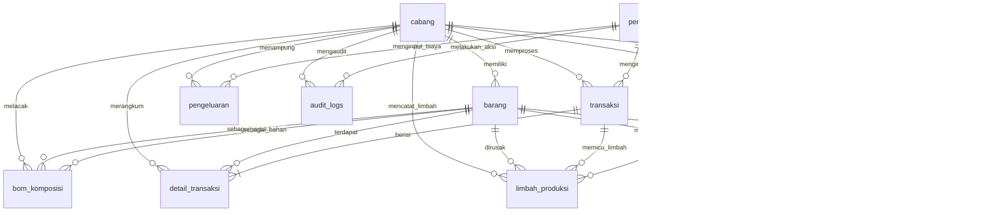
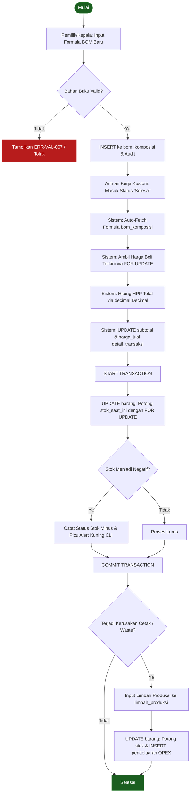
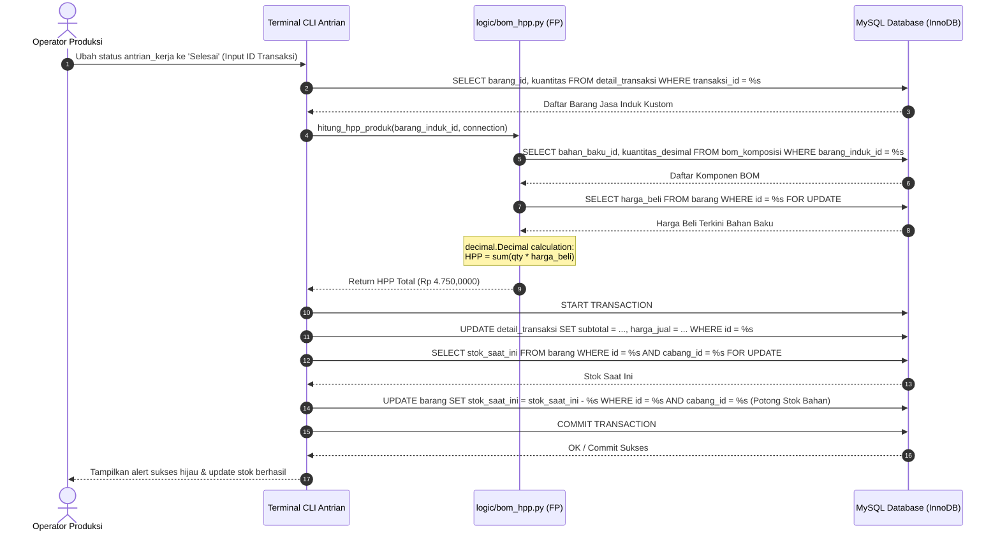
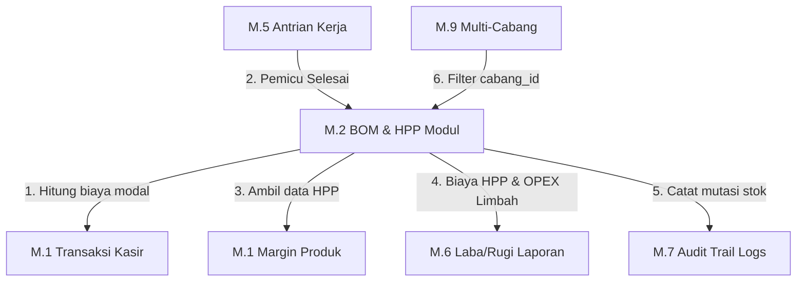

# BOM & HPP Design — AbuCom

## Riwayat Perubahan Dokumen

| Versi | Tanggal    | Perubahan | Oleh |
|:---:|---|---|---|
| **1.2** | 2026-05-29 | Validasi dan pemutakhiran komprehensif berdasarkan checklist Tahap A-F (Issue #0078). Penambahan mitigasi exception division by zero pada formula Gross Profit Margin. Sinkronisasi narasi referensi penarikan data harga beli dari tabel master barang untuk konsistensi dengan pseudocode. | Principal Manufacturing Systems Architect & Certified Cost Accounting Specialist |
| **1.1** | 2026-05-25 | Validasi, audit mendalam, dan penyempurnaan dokumen. Penyelarasan penuh DDL master barang (kolom `harga_grosir`, `min_grosir`, `harga_mitra`, dll.), penambahan penjelasan InnoDB `FOR UPDATE` locking, klarifikasi persistensi kalkulasi HPP terhadap `detail_transaksi`, penulisan pseudocode pure FP untuk pendaftaran BOM baru dan sinkronisasi ATK internal, penyelarasan `audit_logs` JSON trail, serta pembetulan presisi 4 desimal pada seluruh numerik kalkulasi. | Principal Manufacturing Systems Architect & Certified Cost Accounting Specialist |
| **1.0** | 2026-05-25 | Inisialisasi awal dokumen spesifikasi dan perancangan teknis untuk modul Bill of Materials (BOM) dan kalkulasi Harga Pokok Penjualan (HPP) berbasis presisi desimal. | Senior Manufacturing Systems Architect & Cost Accounting Specialist |

---

## Bagian 1 — Informasi Dokumen

### 1.1. Tujuan Dokumen
Dokumen **BOM & HPP Design** ini disusun untuk mendefinisikan secara komprehensif seluruh arsitektur data, logika kalkulasi, alur kerja transaksional, aturan validasi, dan spesifikasi teknis dari modul **Bill of Materials (BOM)** dan **Harga Pokok Penjualan (HPP)** pada sistem **AbuCom**. Dokumen ini menjadi pedoman mutlak (*Single Source of Truth*) bagi pengembang backend saat mengimplementasikan pustaka dan logic pada Python, serta memandu tim QA dalam menyusun uji fungsional dan verifikasi integritas data.

### 1.2. Cakupan Dokumen
Dokumen perancangan ini mencakup:
*   Definisi konsep dasar, analogi, dan klasifikasi barang dalam ekosistem manufaktur kustom percetakan AbuCom.
*   Skema fisik database relasional (ERD dan DDL) terfokus pada entitas BOM, HPP, transaksional, limbah, dan pengeluaran.
*   Formula matematis presisi tetap desimal untuk kalkulasi biaya komponen, HPP produk kustom, gross profit margin, serta simulasi numerik nyata.
*   Alur transaksional (BOM entry, auto-compute HPP, pemotongan stok bahan desimal di InnoDB, pencatatan limbah gagal produksi, dan sinkronisasi ATK).
*   Aturan validasi input CLI, tabel kode error standar, dan taktik penanganan stok negatif (alert kuning).
*   Integrasi modular lintas domain (Transaksi, Antrian, Laba/Rugi, Audit Trail, dan Multi-Cabang).
*   Spesifikasi implementasi teknis paradigma Functional Programming (FP) murni di Python.

### 1.3. Posisi Dokumen dalam Siklus SDLC
Dalam pengembangan sistem AbuCom CLI, dokumen ini merupakan deliverable kelima pada **Fase 03 Design (Perancangan Sistem)**. Dokumen ini bertindak sebagai jembatan langsung yang menerjemahkan kebutuhan fungsional analitis (SRS-F-007, SRS-F-008, SRS-F-010) ke dalam spesifikasi kode tingkat rendah sebelum fase konstruksi program dimulai.

```
+-----------------------------------+
|  Fase 02: Analysis (SRS & WFD)    |
+-----------------------------------+
                  |
                  v
+-----------------------------------+
|   Fase 03: Database & ERD Design  |
+-----------------------------------+
                  |
                  v
+===================================+
|   BOM & HPP Design v1.2 [DOK]     |  <-- POSISI DOKUMEN INI
+===================================+
                  |
                  v
+-----------------------------------+
|   Fase 04: Implementation Code    |
+-----------------------------------+
```

### 1.4. Hubungan dengan Dokumen SDLC Lainnya
*   **Dokumen Input (Acuan Utama)**:
    - [Database Schema (DDL SQL)](docs/sdlc/03_design/01_database_schema.sql): Spesifikasi fisik tabel `bom_komposisi`, `barang`, `detail_transaksi`, `limbah_produksi`, dan `pengeluaran`.
    - [ERD Database](docs/sdlc/03_design/02_erd_database.md): Peta kardinalitas dan batasan integritas referensial (Self-Referencing FK).
    - [System Architecture](docs/sdlc/03_design/03_system_architecture.md): Panduan paradigma FP murni, standard connection handling, dan State Dictionary Passing.
    - [Software Requirements Specification (SRS)](docs/sdlc/02_analysis/02_software_requirements.md): Spesifikasi fungsional SRS-F-007, SRS-F-008, SRS-F-005, SRS-F-009, dan SRS-F-010.
*   **Dokumen Output (Penerima Manfaat)**:
    - **Fase 04 Implementation**: Panduan pembuatan file modul `logic/bom_hpp.py`.
    - **Fase 05 Testing**: Acuan perancangan integration test suite untuk validasi HPP dan transaksional stok.

### 1.5. Audiens Target
1.  **Backend Developer (AI Coding Agent & Staf)**: Untuk memandu penulisan pure functions kalkulasi matematis desimal dan query transaksi terisolasi MySQL.
2.  **Quality Assurance Team (QA)**: Untuk merancang test cases fungsional terminal dan pengujian deviasi stok.
3.  **Pemilik Usaha / Kepala Percetakan**: Untuk memahami bagaimana sistem mengamankan modal, menghitung HPP, dan meminimalkan kerugian *waste* produksi.

### 1.6. Definisi, Akronim, dan Singkatan
*   **BOM** (*Bill of Materials*): Daftar terstruktur dari komponen dan kuantitas bahan baku yang dikonsumsi untuk memproduksi satu unit barang jadi kustom.
*   **HPP** (Harga Pokok Penjualan / *Cost of Goods Sold* - COGS): Akumulasi dari seluruh biaya modal langsung yang dihabiskan untuk memproduksi barang yang terjual.
*   **UoM** (*Unit of Measure*): Satuan dasar pengukuran untuk persediaan stok barang.
*   **FP** (*Functional Programming*): Paradigma pemrograman berbasis fungsi matematika murni tanpa mutasi status data global.
*   **SSoT** (*Single Source of Truth*): Sumber kebenaran tunggal data.
*   **ACID** (*Atomicity, Consistency, Isolation, Durability*): Standar keandalan pemrosesan transaksi basis data.
*   **FK** (*Foreign Key*): Kunci asing penjamin integritas referensial antar-tabel.
*   **OPEX** (*Operating Expense*): Biaya pengoperasian rutin operasional toko.
*   **InnoDB**: Engine penyimpanan MySQL default yang mendukung transaksi aman ACID dan penguncian baris (`FOR UPDATE`).

---

## Bagian 2 — Konsep Dasar BOM & HPP

### 2.1. Definisi Bill of Materials (BOM)
Dalam ekosistem AbuCom, **Bill of Materials (BOM)** dirancang sebagai formula racikan atau resep yang menjabarkan seluruh komponen bahan baku pembentuk satu unit produk cetak kustom jadi. Setiap produk kustom (misal stempel flash, buku yasin, baliho) memiliki spesifikasi komposisi yang diikat dalam database.
*   *Analogi Sederhana*: Sebuah stempel flash bulat bukan sekadar satu barang utuh. Di balik layar, ia terbentuk dari gabungan: gagang stempel flash (1.0000 unit), karet flash bulat (dimensi panjang $\times$ lebar desimal), tinta stempel khusus (volume mililiter desimal), dan kertas buffalo cover (lembaran).

### 2.2. Definisi Harga Pokok Penjualan (HPP)
**Harga Pokok Penjualan (HPP)** adalah nilai akumulasi modal riil yang dihitung dari total penjumlahan biaya masing-masing komponen bahan baku yang dikonsumsi dalam formula BOM tersebut. HPP menjadi representasi akurat biaya modal yang harus dibayarkan toko sebelum margin keuntungan ditambahkan untuk membentuk harga jual komersial.

### 2.3. Hubungan BOM ↔ HPP
Hubungan antara BOM dan HPP bersifat langsung dan kausal:
*   **BOM** bertindak sebagai **Variabel Input** (Daftar bahan baku dan volume pemakaian presisi desimal).
*   **HPP** bertindak sebagai **Hasil Output** (Biaya total representasi modal langsung).
Formula BOM yang presisi menjamin HPP yang dihitung bernilai akurat hingga empat digit di belakang koma, melindungi pemilik dari kerugian pembulatan tersembunyi.

### 2.4. Klasifikasi Barang dalam Konteks BOM
Dalam mendukung pemrosesan BOM dan HPP, barang diklasifikasikan ke dalam 3 jenis peran logis berdasarkan kolom `tipe_barang` pada tabel `barang`:

```
                    +------------------------------------+
                    |        KLASIFIKASI BARANG          |
                    +------------------------------------+
                                      |
       +------------------------------+------------------------------+
       |                              |                              |
+--------------+               +--------------+               +--------------+
| Barang Induk |               |  Bahan Baku  |               |  Retail ATK  |
|  (Barang)    |               | (Bahan Baku) |               | (Retail_ATK) |
+--------------+               +--------------+               +--------------+
```

1.  **`Barang Induk` (Produk Jadi Kustom)**:
    Barang akhir yang dipesan dan dijual kepada pelanggan (misal: stempel flash, buku yasin kustom). Entitas ini terdaftar di tabel `barang` dan bertindak sebagai parent di tabel `bom_komposisi`.
2.  **`Bahan Baku` (Komponen Pembentuk)**:
    Material mentah yang dikonsumsi dalam proses produksi cetak (misal: karet flash, gagang stempel, tinta). Memiliki `tipe_barang = 'Bahan_Baku'` di tabel `barang` dan tidak memiliki harga jual retail langsung melainkan hanya memiliki `harga_beli` yang digunakan sebagai penentu biaya komponen BOM.
3.  **`Retail ATK` (Dual-Purpose)**:
    Barang retail eceran yang dijual langsung (misal: kertas HVS, tinta printer). Memiliki `tipe_barang = 'Retail_ATK'` di tabel `barang`. Jenis barang ini unik karena dapat dijual langsung ke pelanggan umum ATAU diambil sebagai bahan baku produksi internal cetakan kustom melalui mekanisme sinkronisasi ATK.

---

## Bagian 3 — Skema Database BOM & HPP

### 3.1. Diagram ER Fokus BOM & HPP
Diagram Mermaid ERD di bawah memetakan hubungan relasional Crow's Foot di antara entitas database yang secara langsung berpartisipasi dalam pemrosesan BOM, perhitungan HPP, pencatatan limbah, pembukuan pengeluaran, stock opname, price tracking supplier, dan log audit:



### 3.2. DDL Tabel `bom_komposisi`
Definisi tabel fisik `bom_komposisi` sesuai dengan *Database Schema* SSoT:
```sql
CREATE TABLE bom_komposisi (
    id INT NOT NULL AUTO_INCREMENT PRIMARY KEY COMMENT 'Identifikasi unik baris komposisi BOM',
    barang_induk_id INT NOT NULL COMMENT 'Referensi produk jadi percetakan kustom',
    bahan_baku_id INT NOT NULL COMMENT 'Referensi komponen bahan baku pembentuk',
    kuantitas_desimal DECIMAL(15,4) NOT NULL DEFAULT 0.0000 COMMENT 'Volume/panjang/pcs bahan baku yang digunakan',
    cabang_id INT NOT NULL DEFAULT 1 COMMENT 'Cabang berlakunya standar formula BOM ini',
    created_at TIMESTAMP NOT NULL DEFAULT CURRENT_TIMESTAMP COMMENT 'Tanggal & waktu baris data dibuat',
    updated_at TIMESTAMP NOT NULL DEFAULT CURRENT_TIMESTAMP ON UPDATE CURRENT_TIMESTAMP COMMENT 'Tanggal & waktu terakhir baris data diperbarui',
    CONSTRAINT uq_bom_komposisi_induk_bahan UNIQUE (barang_induk_id, bahan_baku_id),
    CONSTRAINT fk_bom_komposisi_barang_induk_id FOREIGN KEY (barang_induk_id) REFERENCES barang(id) ON DELETE CASCADE ON UPDATE CASCADE,
    CONSTRAINT fk_bom_komposisi_bahan_baku_id FOREIGN KEY (bahan_baku_id) REFERENCES barang(id) ON DELETE RESTRICT ON UPDATE CASCADE,
    CONSTRAINT fk_bom_komposisi_cabang_id FOREIGN KEY (cabang_id) REFERENCES cabang(id) ON DELETE RESTRICT ON UPDATE CASCADE
) ENGINE=InnoDB DEFAULT CHARSET=utf8mb4 COLLATE=utf8mb4_unicode_ci 
  COMMENT='Komposisi bahan produk cetak kustom | Sensitivitas: Operasional | Modul: M.2';
```

### 3.3. DDL Tabel `barang` (Kolom Relevan BOM & HPP Lengkap)
DDL tabel fisik `barang` secara lengkap 100% sesuai dengan `01_database_schema.sql` untuk menjamin sinkronisasi data kebijakan harga dinamis (grosir/mitra):
```sql
CREATE TABLE barang (
    id INT NOT NULL AUTO_INCREMENT PRIMARY KEY COMMENT 'Identifikasi unik item barang master',
    nama_barang VARCHAR(100) NOT NULL COMMENT 'Nama komersial barang retail atau bahan baku',
    -- Nilai valid: 'Retail_ATK' | 'Bahan_Baku'
    tipe_barang VARCHAR(20) NOT NULL COMMENT 'Klasifikasi peran barang dalam alur operasional | Nilai valid: \'Retail_ATK\' | \'Bahan_Baku\'',
    satuan_uom VARCHAR(20) NOT NULL COMMENT 'Satuan dasar stok (Unit of Measure)',
    stok_saat_ini DECIMAL(15,4) NOT NULL DEFAULT 0.0000 COMMENT 'Jumlah kuantitas fisik stok yang tersedia',
    harga_beli DECIMAL(15,4) NOT NULL DEFAULT 0.0000 COMMENT 'Harga pengadaan/beli dari vendor supplier',
    harga_retail DECIMAL(15,4) NOT NULL DEFAULT 0.0000 COMMENT 'Harga jual per unit untuk pelanggan umum',
    harga_grosir DECIMAL(15,4) NOT NULL DEFAULT 0.0000 COMMENT 'Harga jual per unit untuk pembelian grosir',
    min_grosir DECIMAL(15,4) NOT NULL DEFAULT 1.0000 COMMENT 'Jumlah minimal pembelian pemicu harga grosir',
    harga_mitra DECIMAL(15,4) NOT NULL DEFAULT 0.0000 COMMENT 'Harga jual per unit khusus akun terdaftar Mitra',
    cabang_id INT NOT NULL DEFAULT 1 COMMENT 'Unit cabang pemilik kepemilikan stok barang',
    created_at TIMESTAMP NOT NULL DEFAULT CURRENT_TIMESTAMP COMMENT 'Tanggal & waktu baris data dibuat',
    updated_at TIMESTAMP NOT NULL DEFAULT CURRENT_TIMESTAMP ON UPDATE CURRENT_TIMESTAMP COMMENT 'Tanggal & waktu terakhir baris data diperbarui',
    CONSTRAINT chk_barang_harga_beli CHECK (harga_beli >= 0),
    CONSTRAINT chk_barang_harga_retail CHECK (harga_retail >= 0),
    CONSTRAINT chk_barang_harga_grosir CHECK (harga_grosir >= 0),
    CONSTRAINT chk_barang_harga_mitra CHECK (harga_mitra >= 0),
    CONSTRAINT chk_barang_min_grosir CHECK (min_grosir > 0),
    CONSTRAINT fk_barang_cabang_id FOREIGN KEY (cabang_id) REFERENCES cabang(id) ON DELETE RESTRICT ON UPDATE CASCADE
) ENGINE=InnoDB DEFAULT CHARSET=utf8mb4 COLLATE=utf8mb4_unicode_ci 
  COMMENT='Data master retail ATK, harga beli, dan bahan baku | Sensitivitas: Operasional | Modul: M.2';
```

### 3.4. Penjelasan Self-Referencing FK (`barang` ↔ `bom_komposisi`)
Tabel `bom_komposisi` dirancang unik menggunakan pola *Self-Referencing Foreign Key*. 
*   Kolom `barang_induk_id` merujuk ke `barang(id)` (berperan sebagai barang induk jadi, misal ID stempel kustom).
*   Kolom `bahan_baku_id` merujuk ke `barang(id)` (berperan sebagai bahan penyusun, misal ID gagang stempel atau ID tinta stempel).
Desain ini mengeliminasi kebutuhan pembuatan tabel terpisah untuk produk dan bahan baku, memungkinkan standardisasi data master dalam satu tabel master `barang` yang seragam.

### 3.5. Kebijakan CASCADE vs RESTRICT
Integritas referensial dijamin ketat oleh database engine InnoDB melalui aturan berikut:
1.  **`barang_induk_id` ON DELETE CASCADE**: Jika master barang induk cetak jadi kustom dihapus dari sistem, database secara otomatis menghapus bersih seluruh formula komposisi terkait di tabel `bom_komposisi` (mencegah *orphaned records*).
2.  **`bahan_baku_id` ON DELETE RESTRICT**: Database memblokir keras upaya penghapusan item bahan baku master jika ID bahan tersebut masih digunakan di dalam salah satu racikan formula BOM aktif. Hal ini mengamankan integritas formula historis.

### 3.6. Unique Constraint Komposit
Constraint `uq_bom_komposisi_induk_bahan` mengikat kombinasi (`barang_induk_id`, `bahan_baku_id`) harus unik. Hal ini mencegah kesalahan entri duplikat bahan baku sejenis untuk satu formula barang induk yang sama di sistem.

### 3.7. Analisis Persistensi HPP terhadap Tabel `detail_transaksi`
> [!IMPORTANT]
> Berdasarkan skema database fisik nyata pada `01_database_schema.sql`, tabel `detail_transaksi` **tidak memiliki** kolom `hpp` atau `harga_pokok`. Oleh karena itu, Harga Pokok Penjualan (HPP) hasil kalkulasi untuk pesanan produk kustom **tidak disimpan** secara langsung pada tabel `detail_transaksi`.
> 
> Sebagai solusinya, sistem menerapkan strategi berikut:
> 1. Nilai HPP produk induk kustom disimpan secara dinamis pada kolom `harga_beli` di tabel `barang` untuk baris barang bersangkutan.
> 2. Laporan keuangan (seperti Laba/Rugi M.6) menarik nilai HPP secara historis/real-time dengan mengeksekusi query JOIN yang menjumlahkan `bom_komposisi.kuantitas_desimal` dikalikan `barang.harga_beli` (atau `riwayat_harga_supplier.harga_beli`) bahan penyusun pada periode transaksi tersebut.
> 3. Kolom `subtotal` dan `harga_jual` pada tabel `detail_transaksi` tetap diperbarui secara transaksional berdasarkan harga akhir yang dibebankan kepada pelanggan.

---

## Bagian 4 — Formula dan Logika Kalkulasi HPP

### 4.1. Formula Biaya per Komponen
Perhitungan biaya modal riil dari satu komponen bahan baku dalam formula dirumuskan sebagai:
$$\text{Biaya Komponen} = \text{kuantitas\_desimal} \times \text{harga\_beli\_satuan}$$
Di mana:
*   $\text{kuantitas\_desimal}$ : Volume pemakaian bahan (pecahan desimal empat digit di belakang koma).
*   $\text{harga\_beli\_satuan}$ : Harga pengadaan satuan dari supplier.

### 4.2. Formula HPP Total Produk
HPP total produk jadi kustom ditentukan dari penjumlahan seluruh biaya komponen penyusunnya:
$$\text{HPP Produk} = \sum_{i=1}^{n} (\text{Biaya Komponen}_i)$$

### 4.3. Contoh Kalkulasi Numerik Stempel Flash
Berdasarkan spesifikasi operasional toko, stempel flash bulat ($d = 40 \text{ mm}$) dikonstruksi dari komponen-komponen berikut:
1.  **Karet Flash Bulat (Bahan Baku)**:
    *   Ukuran pemakaian: $0.0500 \text{ m} \times 0.0500 \text{ m} = 0.0025 \text{ m}^2$.
    *   Harga Beli Supplier: Rp 100.000,0000 / $\text{m}^2$.
    *   *Biaya Karet*: $0.0025 \times 100.000,0000 = \text{Rp } 250,0000$.
2.  **Gagang Stempel Flash Bulat (Bahan Baku)**:
    *   Kuantitas pemakaian: $1.0000 \text{ Pcs}$.
    *   Harga Beli Supplier: Rp 4.500,0000 / Pcs.
    *   *Biaya Gagang*: $1.0000 \times 4.500,0000 = \text{Rp } 4.500,0000$.

Kalkulasi HPP Total Produk:
$$\text{HPP Total} = \text{Rp } 250,0000 + \text{Rp } 4.500,0000 = \text{Rp } 4.750,0000$$

### 4.4. Contoh Kalkulasi Numerik Buku Yasin Hardcover
Kalkulasi biaya pembuatan 1.0000 unit Buku Yasin Hardcover kustom:
1.  **Cover Yasin Hardcover (Bahan Baku)**:
    *   Pemakaian: $1.0000 \text{ Pcs}$.
    *   Harga Beli Satuan: Rp 5.000,0000 / Pcs.
    *   *Biaya Cover*: $1.0000 \times 5.000,0000 = \text{Rp } 5.000,0000$.
2.  **Kertas Matt Paper Isi Yasin (Bahan Baku)**:
    *   Pemakaian: $100.0000 \text{ Lembar}$ (atau setara $0.2000 \text{ Rim}$).
    *   Harga Beli Satuan: Rp 100,0000 / Lembar.
    *   *Biaya Kertas*: $100.0000 \times 100,0000 = \text{Rp } 10.000,0000$.
3.  **Tinta Pigment Art Paper (Retail ATK diambil Produksi)**:
    *   Pemakaian: $0.0100 \text{ Liter}$ ($10.0000 \text{ Ml}$).
    *   Harga Beli Satuan: Rp 150.000,0000 / Liter.
    *   *Biaya Tinta*: $0.0100 \times 150.000,0000 = \text{Rp } 1.500,0000$.
4.  **Lem Buku / Hot Melt (Bahan Baku)**:
    *   Pemakaian: $0.0500 \text{ Pcs}$.
    *   Harga Beli Satuan: Rp 20.000,0000 / Pcs.
    *   *Biaya Lem*: $0.0500 \times 20.000,0000 = \text{Rp } 1.000,0000$.

Kalkulasi HPP Total Produk Buku Yasin:
$$\text{HPP Total} = \text{Rp } 5.000,0000 + \text{Rp } 10.000,0000 + \text{Rp } 1.500,0000 + \text{Rp } 1.000,0000 = \text{Rp } 17.500,0000$$

### 4.5. Presisi Desimal (Decimal Strategy)
Untuk mengeliminasi deviasi selisih nilai uang akibat bug floating point bawaan bahasa pemrograman, aturan pengerjaan diatur sangat ketat:
*   Seluruh komputasi matematika di Python **WAJIB** menggunakan pustaka `decimal.Decimal` presisi tetap 4 digit desimal.
*   Dilarang keras menggunakan tipe data `float` atau `double`.
*   Semua data desimal dibulatkan secara merata menggunakan standar pembulatan `ROUND_HALF_UP` (pembulatan ke atas jika $\ge 5$).

### 4.6. Formula Margin Keuntungan (Gross Profit Margin)
Nilai HPP yang akurat digunakan Pemilik untuk menganalisis persentase margin keuntungan kotor per produk (SRS-F-005):
$$\text{Margin Keuntungan Kotor } (\%) = \left( \frac{\text{Harga Jual} - \text{HPP}}{\text{Harga Jual}} \right) \times 100$$
Di mana $\text{Harga Jual}$ adalah tarif komersial (retail/grosir/mitra) yang dibayarkan pelanggan di kasir.
**Mitigasi Error**: Jika $\text{Harga Jual} = 0$, maka $\text{Margin} = 0.00\%$ secara eksplisit ditetapkan untuk menghindari pengecualian pembagian dengan nol (*Division by Zero Exception*).

---

## Bagian 5 — Alur Data dan Proses BOM & HPP

### 5.1. Diagram Alur Utama (End-to-End Flowchart)
Diagram di bawah mendokumentasikan alur data end-to-end mulai dari pendaftaran formula BOM baru oleh Pemilik, pemicuan kalkulasi HPP, hingga pencatatan limbah dan dekomposisi data ke laporan keuangan:



### 5.2. Alur 1 — Pendaftaran Formula BOM Baru
*   **Aktor**: `pemilik`, `kepala_percetakan`.
*   **Prakondisi**: Barang induk dan bahan baku penyusun harus sudah terdaftar di master data barang.
*   **Alur Prosedural**:
    1.  Aktor memilih menu Pendaftaran BOM, menginput `barang_induk_id`.
    2.  Aktor menginput daftar bahan penyusun: `bahan_baku_id` dan `kuantitas_desimal` (pecahan 4 desimal).
    3.  Sistem memverifikasi `uq_bom_komposisi_induk_bahan` di database.
    4.  Sistem memvalidasi `tipe_barang` dari `bahan_baku_id` (harus `'Bahan_Baku'` atau `'Retail_ATK'`).
    5.  Jika valid, sistem mengeksekusi operasi `INSERT INTO bom_komposisi` dengan `cabang_id` terikat.
    6.  Sistem mencatatkan log manipulasi data ke tabel `audit_logs`.

### 5.3. Alur 2 — Kalkulasi HPP saat Antrian Selesai (Trigger Utama)
Kalkulasi HPP tidak dipicu saat kasir mencetak nota di awal, melainkan dipicu secara otomatis oleh sistem saat staf mengubah status antrian kerja kustom menjadi `'Selesai'`. 
Dalam proses ini, sistem menarik data `harga_beli` terkini dari master data tabel `barang` untuk memastikan HPP dihitung menggunakan modal historis pengadaan terakhir.

#### Sequence Diagram Kalkulasi HPP & Pemotongan Stok


### 5.4. Alur 3 — Pemotongan Stok Bahan Baku Desimal & Concurrency Control
Pemotongan persediaan bahan baku di gudang wajib menggunakan query terparameter dan terisolasi:
```sql
UPDATE barang 
SET stok_saat_ini = stok_saat_ini - %s 
WHERE id = %s AND cabang_id = %s;
```
*   **Penjamin Atomicity (ACID)**: Query pemotongan stok wajib dikurung di dalam satu blok transaksi `START TRANSACTION ... COMMIT` InnoDB. Jika salah satu pemotongan stok bahan gagal, seluruh rangkaian transaksi dibatalkan (`ROLLBACK`).
*   **Concurrency Control (`FOR UPDATE` locking)**:
    Untuk mencegah race condition di mana beberapa operator kasir/produksi mengakses dan memotong stok bahan baku secara simultan, sistem **WAJIB** menggunakan klausa **`FOR UPDATE`** saat melakukan `SELECT` stok saat ini (`SELECT stok_saat_ini FROM barang WHERE id = %s FOR UPDATE`). Ini akan mengunci baris data di tingkat InnoDB engine sehingga transaksi lain harus mengantri hingga transaksi saat ini di-COMMIT atau ROLLBACK.
*   **Penanganan Stok Minus**: Sesuai regulasi SRS-F-007, sistem **TIDAK BOLEH** menggagalkan atau memblokir transaksi jika kuantitas stok bahan baku di database tidak mencukupi (stok menjadi negatif). Sistem tetap memproses pemotongan, membiarkan nilai `stok_saat_ini` bernilai negatif, mencatatkan status minus ke log keamanan, dan memancarkan peringatan visual kuning (`[yellow]Alert: Stok Bahan Baku [Nama Bahan] Menipis/Minus![/]`) di terminal CLI.

### 5.5. Alur 4 — Pencatatan Limbah Produksi (Waste)
Jika terjadi insiden salah cetak atau kegagalan mesin, bahan baku yang rusak dicatat secara transaksional:
1.  Staf Produksi menginput `transaksi_id`, `bahan_baku_id` yang rusak, `kuantitas_limbah` (desimal), dan `alasan_kerusakan`.
2.  Sistem menarik `harga_beli` bahan dari database.
3.  Hitung total kerugian: `kerugian_nominal = kuantitas_limbah * harga_beli`.
4.  Sistem menjalankan transaksi ACID:
    *   Kurangi `stok_saat_ini` di tabel `barang` sebesar `kuantitas_limbah`.
    *   `INSERT INTO limbah_produksi` mencatatkan detail insiden.
    *   `INSERT INTO pengeluaran` mencatatkan debit OPEX tipe `'Limbah'` dengan flag `disetujui_pemilik = TRUE` agar terbukukan di laporan laba rugi.
5.  Relasi BOM: Limbah hanya diizinkan diinput untuk bahan baku yang terdaftar aktif dalam formula BOM produk cetak kustom yang dipesan pada `transaksi_id` terkait.

### 5.6. Alur 5 — Sinkronisasi ATK Internal
Jika bahan baku produksi habis mendadak, staf diizinkan mengambil persediaan retail ATK (`tipe_barang = 'Retail_ATK'`) untuk produksi:
1.  Staf menginput ID ATK retail and kuantitas pengambilan.
2.  Sistem mengurangi `stok_saat_ini` ATK retail tersebut di database.
3.  Sistem mengalokasikan nilai biaya: `Biaya = kuantitas * harga_beli` (HPP retail).
4.  Nilai tersebut dibukukan sebagai pengeluaran operasional internal di tabel `pengeluaran` dengan tipe `'Tak_Terduga'` atau rutin.
5.  Aktivitas ini dicatat di audit log untuk menghindari penyalahgunaan inventaris retail toko oleh staf.

---

## Bagian 6 — Aturan Validasi dan Penanganan Exception

### 6.1. Tabel Aturan Validasi Input CLI
Setiap input pengetikan pengguna disaring secara ketat melalui aturan validasi berikut:

| Field Input | Tipe Data | Aturan Validasi Bisnis | Tindakan Jika Melanggar |
|---|---|---|---|
| `kuantitas_desimal` | `DECIMAL(15,4)` | HARUS berupa angka numerik positif > 0,0000. | Lempar `ERR-VAL-007`, kembalikan prompt. |
| `bahan_baku_id` | `INT` | HARUS terdaftar di `barang.id` dengan tipe `'Bahan_Baku'` atau `'Retail_ATK'`. | Lempar `ERR-VAL-008`, tolak pemrosesan. |
| `barang_induk_id` | `INT` | HARUS merujuk ke produk cetak kustom yang valid di database. | Tolak pendaftaran formula BOM. |
| `alasan_kerusakan` | `VARCHAR` | WAJIB diisi (tidak boleh kosong / enter saja). | Ulangi prompt input alasan. |

### 6.2. Tabel Kode Error Standar (Exception Codes)
Sistem menyajikan feedback kegagalan visual terstandardisasi di baris terbawah layar terminal CLI:

| Kode Error | Kategori | Pesan Visual di Terminal CLI | Deskripsi Teknis |
|---|---|---|---|
| **`ERR-VAL-007`** | Validasi | `⛔ ERR-VAL-007: Input kuantitas bahan baku tidak valid (harus angka desimal positif > 0)!` | Kuantitas BOM yang diinput non-numerik atau bernilai negatif. |
| **`ERR-VAL-008`** | Validasi | `⛔ ERR-VAL-008: ID bahan baku tidak valid untuk transaksi pesanan kustom ini!` | Bahan baku tidak terdaftar dalam formula BOM transaksi terkait. |
| **`ERR-STOCK-010`**| Gudang | `⚠️ ERR-STOCK-010: Peringatan: Stok bahan baku [Nama] minus di database!` | Saldo persediaan gudang bernilai negatif setelah pemotongan (alert kuning). |
| **`ERR-DB-007`**   | Database | `⛔ ERR-DB-007: Kegagalan koneksi database saat proses kalkulasi HPP!` | Terputusnya koneksi MySQL Mini PC Server lokal saat commit HPP. |

---

## Bagian 7 — Integrasi Lintas Modul

Modul BOM & HPP (`M.2`) dirancang terintegrasi erat secara real-time dengan modul operasional lainnya melalui skema basis data fisik:



1.  **Integrasi ke M.1 Transaksi & Nota**:
    Saat transaksi belanja dibuat, produk kustom yang masuk ke `detail_transaksi` mengunci subtotal. Ketika status antrian kerja selesai, nilai HPP dikalkulasi dan data mutasi persediaan dikomit transaksional.
2.  **Integrasi ke M.5 Antrian Kerja & Desain**:
    Perubahan status pekerjaan dari `'Produksi'` ke `'Selesai'` oleh staf di terminal antrian kerja bertindak sebagai *main trigger* bagi sistem untuk mengeksekusi fungsi kalkulasi HPP dan pemotongan stok bahan baku desimal.
3.  **Integrasi ke M.1 Margin Produk (SRS-F-005)**:
    Data HPP BOM ditarik secara real-time oleh modul margin pemilik untuk disandingkan dengan harga jual retail/mitra aktif guna memantau persentase keuntungan kotor per produk unggulan toko.
4.  **Integrasi ke M.6 Laporan Laba/Rugi (SRS-F-028)**:
    Total biaya HPP BOM dari seluruh transaksi yang lunas dan biaya limbah operasional dari tabel `pengeluaran` ditarik sebagai pengurang pendapatan kotor untuk menyajikan laporan Laba Bersih yang akurat bagi Pemilik.
5.  **Integrasi ke M.7 Audit Trail**:
    > [!IMPORTANT]
    > Setiap manipulasi data formula BOM (tambah/hapus) pada `bom_komposisi` atau pemotongan stok desimal manual pada `barang` **WAJIB** direkam secara kronologis ke dalam tabel `audit_logs`.
    > Log audit ditulis menggunakan format JSON pada kolom `old_value` dan `new_value` untuk menyimpan rekaman sebelum dan sesudah perubahan demi akuntabilitas logistik.
6.  **Integrasi ke Multi-Cabang (M.9)**:
    Setiap baris di tabel `bom_komposisi` memiliki kolom `cabang_id` (INT) yang bertindak sebagai filter pemisah data. Hal ini memungkinkan setiap cabang memiliki standar formula racikan produk cetak kustom yang bervariasi menyesuaikan harga pasar lokal di masa depan.

---

## Bagian 8 — Spesifikasi Implementasi Teknis

### 8.1. Penempatan Modul
Logika bisnis perhitungan HPP dan pemotongan stok murni dipisahkan dari presentation layer CLI dan ditempatkan secara eksklusif pada berkas logic Python:
`logic/bom_hpp.py`

### 8.2. Penerapan Paradigma FP Murni & Dependencies
Implementasi kode Python pada `logic/bom_hpp.py` diatur kaku menggunakan standar pemrograman fungsional murni:
*   **Tanpa Class/OOP**: Kode ditulis murni menggunakan definisi fungsi (`def`).
*   **Pure Functions**: Fungsi kalkulasi tidak boleh membaca state global, memanipulasi variabel di luar fungsinya, atau memicu side effects I/O langsung.
*   **Immutable Data**: Struktur records dibungkus menggunakan `namedtuple` dari modul standard `collections` untuk menjamin imutabilitas data selama pemrosesan di memori Python.
*   **Dependencies**: Library Python yang digunakan disinkronkan secara ketat sesuai dengan SRS:
    - `mysql-connector-python==8.4.0` (Database connector)
    - `decimal` (Standard Python precision)
    - `collections.namedtuple` (Immutable records)

### 8.3. Pseudocode Pure Functions Python
Berikut adalah pseudocode implementasi fungsi murni kalkulasi, pendaftaran BOM baru, sinkronisasi ATK internal, dan pemrosesan transaksional BOM & HPP:

```python
from decimal import Decimal
from collections import namedtuple

# Definisi struktur data imutabel
BOMKomponen = namedtuple('BOMKomponen', ['bahan_baku_id', 'nama_barang', 'kuantitas', 'harga_beli'])
KalkulasiResult = namedtuple('KalkulasiResult', ['is_success', 'hpp_total', 'komponen_list', 'error_msg'])
ProcessResult = namedtuple('ProcessResult', ['is_success', 'stok_minus_detected', 'error_msg'])

def hitung_biaya_komponen(kuantitas: Decimal, harga_beli_satuan: Decimal) -> Decimal:
    """Fungsi murni untuk mengalikan kuantitas pemakaian desimal dengan harga beli."""
    if kuantitas <= Decimal('0.0000'):
        return Decimal('0.0000')
    return (kuantitas * harga_beli_satuan).quantize(Decimal('0.0001'))

def hitung_hpp_produk(komponen_list: list[BOMKomponen]) -> Decimal:
    """Fungsi murni untuk menjumlahkan seluruh biaya komponen bahan penyusun."""
    return sum(
        (hitung_biaya_komponen(comp.kuantitas, comp.harga_beli) for comp in komponen_list),
        Decimal('0.0000')
    )

def daftar_bom_baru(
    barang_induk_id: int, 
    komponen_list: list[BOMKomponen], 
    cabang_id: int, 
    db_connection
) -> ProcessResult:
    """
    Fungsi pure FP untuk mendaftarkan formula BOM baru ke database.
    Menerapkan validasi kuantitas desimal > 0 dan constraint uq_bom_komposisi_induk_bahan.
    """
    cursor = db_connection.cursor()
    
    # Validasi awal kuantitas fungsional
    for comp in komponen_list:
        if comp.kuantitas <= Decimal('0.0000'):
            return ProcessResult(False, False, "ERR-VAL-007: Kuantitas bahan baku harus > 0.0000")
            
    try:
        db_connection.start_transaction()
        
        for comp in komponen_list:
            # Pendaftaran transaksional ke database
            cursor.execute(
                "INSERT INTO bom_komposisi (barang_induk_id, bahan_baku_id, kuantitas_desimal, cabang_id) "
                "VALUES (%s, %s, %s, %s)",
                (barang_induk_id, comp.bahan_baku_id, comp.kuantitas, cabang_id)
            )
            
            # Catat log audit trail (JSON)
            old_value_json = "null"
            new_value_json = f'{{"barang_induk_id": {barang_induk_id}, "bahan_baku_id": {comp.bahan_baku_id}, "kuantitas_desimal": {float(comp.kuantitas)}}}'
            cursor.execute(
                "INSERT INTO audit_logs (pengguna_id, action_type, target_table, old_value, new_value, cabang_id) "
                "VALUES (1, 'INSERT', 'bom_komposisi', %s, %s, %s)",
                (old_value_json, new_value_json, cabang_id)
            )
            
        db_connection.commit()
        return ProcessResult(True, False, None)
        
    except Exception as e:
        db_connection.rollback()
        return ProcessResult(False, False, f"ERR-DB-007: Gagal menyimpan formula BOM. Detail: {str(e)}")

def proses_pemotongan_stok(komponen_list: list[BOMKomponen], cabang_id: int, db_connection) -> ProcessResult:
    """
    Fungsi pemrosesan transaksi ACID database untuk memotong stok persediaan bahan.
    Menghasilkan stok_minus_detected=True jika sisa stok di database < kuantitas pemakaian.
    Menggunakan FOR UPDATE locking untuk mencegah race condition.
    """
    cursor = db_connection.cursor()
    stok_minus_detected = False
    
    try:
        # DB Engine InnoDB transaksi aman
        db_connection.start_transaction()
        
        for comp in komponen_list:
            # 1. Tarik stok saat ini dengan query terisolasi (Lock row via FOR UPDATE)
            cursor.execute(
                "SELECT stok_saat_ini FROM barang WHERE id = %s AND cabang_id = %s FOR UPDATE",
                (comp.bahan_baku_id, cabang_id)
            )
            row = cursor.fetchone()
            if not row:
                raise ValueError(f"Bahan baku ID {comp.bahan_baku_id} tidak ditemukan.")
                
            stok_sekarang = Decimal(str(row[0]))
            
            # Cek deteksi stok minus
            if stok_sekarang < comp.kuantitas:
                stok_minus_detected = True
                
            # 2. Update pemotongan stok di MySQL (mendukung angka negatif)
            cursor.execute(
                "UPDATE barang SET stok_saat_ini = stok_saat_ini - %s WHERE id = %s AND cabang_id = %s",
                (comp.kuantitas, comp.bahan_baku_id, cabang_id)
            )
            
            # 3. Log Audit Trail
            new_stok = stok_sekarang - comp.kuantitas
            old_val = f'{{"stok_saat_ini": {float(stok_sekarang)}}}'
            new_val = f'{{"stok_saat_ini": {float(new_stok)}}}'
            cursor.execute(
                "INSERT INTO audit_logs (pengguna_id, action_type, target_table, old_value, new_value, cabang_id) "
                "VALUES (1, 'UPDATE', 'barang', %s, %s, %s)",
                (old_val, new_val, cabang_id)
            )
            
        # Commit seluruh alur pemotongan jika tidak ada error
        db_connection.commit()
        return ProcessResult(True, stok_minus_detected, None)
        
    except Exception as e:
        db_connection.rollback()
        return ProcessResult(False, False, f"ERR-DB-007: Transaksi gagal. Detail: {str(e)}")

def proses_limbah_produksi(
    transaksi_id: int, 
    bahan_baku_id: int, 
    kuantitas_limbah: Decimal, 
    alasan: str, 
    produksi_id: int, 
    cabang_id: int, 
    db_connection
) -> ProcessResult:
    """Fungsi transaksional merekam log limbah produksi & membukukan biaya pengeluaran OPEX."""
    cursor = db_connection.cursor()
    
    try:
        db_connection.start_transaction()
        
        # 1. Query harga beli terkini bahan baku (FOR UPDATE)
        cursor.execute(
            "SELECT harga_beli FROM barang WHERE id = %s AND cabang_id = %s FOR UPDATE",
            (bahan_baku_id, cabang_id)
        )
        row = cursor.fetchone()
        if not row:
            raise ValueError("Bahan baku tidak valid.")
            
        harga_beli = Decimal(str(row[0]))
        kerugian_nominal = (kuantitas_limbah * harga_beli).quantize(Decimal('0.0001'))
        
        # 2. Kurangi stok bahan di database
        cursor.execute(
            "UPDATE barang SET stok_saat_ini = stok_saat_ini - %s WHERE id = %s AND cabang_id = %s",
            (kuantitas_limbah, bahan_baku_id, cabang_id)
        )
        
        # 3. Catat di limbah_produksi
        cursor.execute(
            "INSERT INTO limbah_produksi (transaksi_id, bahan_baku_id, kuantitas_limbah, alasan_kerusakan, kerugian_nominal, produksi_id, cabang_id) VALUES (%s, %s, %s, %s, %s, %s, %s)",
            (transaksi_id, bahan_baku_id, kuantitas_limbah, alasan, kerugian_nominal, produksi_id, cabang_id)
        )
        
        # 4. Bukukan ke pengeluaran (OPEX Limbah)
        deskripsi_biaya = f"Kerugian limbah bahan baku ID {bahan_baku_id} pada transaksi ID {transaksi_id} (Alasan: {alasan})"
        cursor.execute(
            "INSERT INTO pengeluaran (tipe_pengeluaran, nominal, deskripsi, tanggal_pengeluaran, kasir_id, disetujui_pemilik, cabang_id) VALUES ('Limbah', %s, %s, CURRENT_DATE, %s, TRUE, %s)",
            (kerugian_nominal, deskripsi_biaya, produksi_id, cabang_id)
        )
        
        db_connection.commit()
        return ProcessResult(True, False, None)
        
    except Exception as e:
        db_connection.rollback()
        return ProcessResult(False, False, f"ERR-DB-007: Gagal mencatat limbah. Detail: {str(e)}")

def sinkronisasi_atk_internal(
    barang_id: int, 
    kuantitas_ambil: Decimal, 
    keperluan: str, 
    pengguna_id: int, 
    cabang_id: int, 
    db_connection
) -> ProcessResult:
    """
    Fungsi transaksional untuk memproses sinkronisasi ATK internal (SRS-F-010).
    Mengurangi stok ATK retail dan membukukannya sebagai pengeluaran operasional toko.
    """
    cursor = db_connection.cursor()
    
    try:
        db_connection.start_transaction()
        
        # 1. Lock row dan validasi tipe_barang = 'Retail_ATK'
        cursor.execute(
            "SELECT tipe_barang, stok_saat_ini, harga_beli FROM barang WHERE id = %s AND cabang_id = %s FOR UPDATE",
            (barang_id, cabang_id)
        )
        row = cursor.fetchone()
        if not row:
            return ProcessResult(False, False, "ERR-VAL-008: Barang tidak ditemukan.")
            
        tipe_barang, stok_sekarang, harga_beli = row[0], Decimal(str(row[1])), Decimal(str(row[2]))
        if tipe_barang != 'Retail_ATK':
            return ProcessResult(False, False, "ERR-VAL-008: Tipe barang bukan Retail_ATK.")
            
        if stok_sekarang < kuantitas_ambil:
            return ProcessResult(False, False, "ERR-STOCK-010: Stok retail ATK tidak mencukupi.")
            
        # 2. Update stok
        cursor.execute(
            "UPDATE barang SET stok_saat_ini = stok_saat_ini - %s WHERE id = %s AND cabang_id = %s",
            (kuantitas_ambil, barang_id, cabang_id)
        )
        
        # 3. Hitung biaya nominal
        biaya_nominal = (kuantitas_ambil * harga_beli).quantize(Decimal('0.0001'))
        
        # 4. Bukukan sebagai pengeluaran Rutin internal
        deskripsi_biaya = f"Pengambilan internal ATK ID {barang_id} untuk keperluan: {keperluan}"
        cursor.execute(
            "INSERT INTO pengeluaran (tipe_pengeluaran, nominal, deskripsi, tanggal_pengeluaran, kasir_id, disetujui_pemilik, cabang_id) "
            "VALUES ('Rutin', %s, %s, CURRENT_DATE, %s, TRUE, %s)",
            (biaya_nominal, deskripsi_biaya, pengguna_id, cabang_id)
        )
        
        # 5. Log audit trail
        old_val = f'{{"stok_saat_ini": {float(stok_sekarang)}}}'
        new_val = f'{{"stok_saat_ini": {float(stok_sekarang - kuantitas_ambil)}}}'
        cursor.execute(
            "INSERT INTO audit_logs (pengguna_id, action_type, target_table, old_value, new_value, cabang_id) "
            "VALUES (%s, 'UPDATE', 'barang', %s, %s, %s)",
            (pengguna_id, old_val, new_val, cabang_id)
        )
        
        db_connection.commit()
        return ProcessResult(True, False, None)
        
    except Exception as e:
        db_connection.rollback()
        return ProcessResult(False, False, f"ERR-DB-007: Gagal sinkronisasi ATK. Detail: {str(e)}")
```

---

## Bagian 9 — Matriks Ketertelusuran (Traceability Matrix)

Matriks di bawah menjamin ketertelusuran dua arah (*bidirectional traceability*) untuk membuktikan rancangan BOM & HPP ini selaras 100% terhadap kebutuhan SRS, alur interaksi CLI, dan diagram proses bisnis To-Be:

| ID Use Case | Kode SRS Terkait | Workflow Terkait | CLI Menu Terkait | Bagian Dokumen Ini |
|---|---|---|---|---|
| **UC-007** | SRS-F-007 | WF-M2-01 (Kalkulasi HPP) | `MENU-M2-002` (Hitung HPP) | Bagian 4, Bagian 5.3, Bagian 8.3 |
| **UC-008** | SRS-F-008 | WF-M2-02 (Pencatatan Limbah) | `MENU-M2-003` (Mencatat Limbah) | Bagian 5.5, Bagian 8.3 |
| **UC-005** | SRS-F-005 | WF-M1-05 (Margin Produk) | `MENU-M1-005` (Margin per Produk)| Bagian 4.6, Bagian 7.3 |
| **UC-009** | SRS-F-009 | WF-M2-03 (Manajemen UoM) | `MENU-M2-001` (Kelola Satuan UoM) | Bagian 2.4, Bagian 6.1 |
| **UC-010** | SRS-F-010 | WF-M2-04 (ATK Internal) | `MENU-M2-004` (Sinkronisasi ATK) | Bagian 2.4, Bagian 5.6, Bagian 8.3 |

---

## Bagian 10 — Glosarium

*   **Bill of Materials (BOM)**: Daftar komposisi bahan mentah dan kuantitas presisi desimal yang dikonsumsi untuk membentuk satu barang cetak kustom.
*   **Harga Pokok Penjualan (HPP / COGS)**: Total representasi modal finansial riil langsung yang dihabiskan dalam pengerjaan produksi produk yang terjual.
*   **Presisi Desimal (Decimal Precision)**: Metode komputasi numerik presisi tetap di Python menggunakan tipe `decimal.Decimal` dan tipe `DECIMAL(15,4)` di MySQL guna menghindari pembulatan biner tidak akurat.
*   **Fungsi Murni (Pure Function)**: Fungsi matematika pemrograman fungsional murni yang selalu menghasilkan output yang identik untuk argumen input yang sama, tanpa memicu modifikasi state data global atau efek samping I/O.
*   **Self-Referencing FK**: Hubungan relasional database di mana kunci asing (`barang_induk_id` dan `bahan_baku_id`) merujuk kembali ke kunci primer tabel yang sama (`barang.id`).
*   **Limbah Produksi (Waste)**: Bahan baku yang mengalami kegagalan cetak fisik, robek, atau cacat yang stoknya dipotong dan kerugiannya dibukukan sebagai biaya OPEX.
*   **State Dictionary Passing**: Taktik pengelolaan sesi pengguna fungsional di memori Python dengan mengalirkan representasi status dictionary login aktif sebagai parameter argumen sekuensial fungsi CLI.
*   **InnoDB**: Engine default MySQL untuk mendukung integritas transaksi ACID, relasi foreign key, dan penguncian baris (`FOR UPDATE`).
*   **`FOR UPDATE`**: Perintah locking SQL untuk mengunci baris data hasil SELECT agar tidak dapat dibaca/diubah oleh transaksi concurrent lain hingga transaksi saat ini selesai (COMMIT/ROLLBACK).
*   **Audit Trail**: Catatan log kronologis terstruktur untuk mencatat setiap operasi manipulasi data sensitif di database.
*   **ROUND_HALF_UP**: Standar pembulatan desimal yang membulatkan angka ke atas jika digit berikutnya adalah 5 atau lebih.
