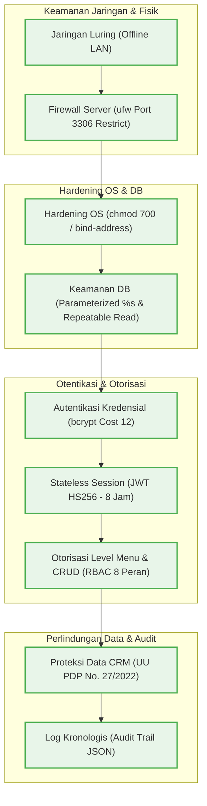
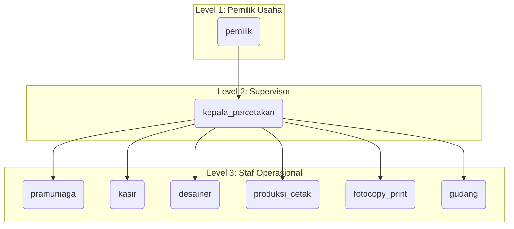
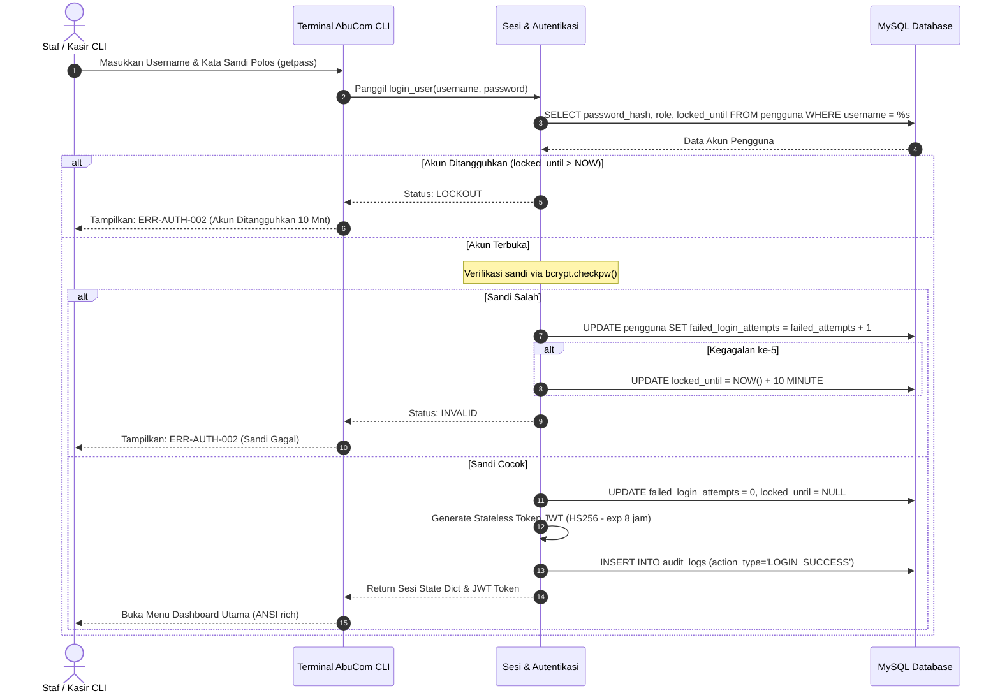
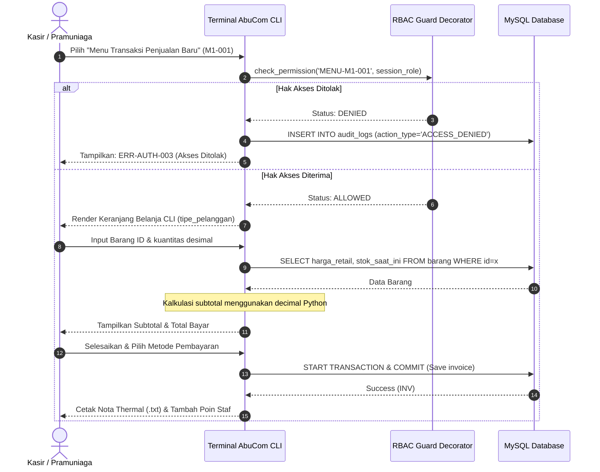
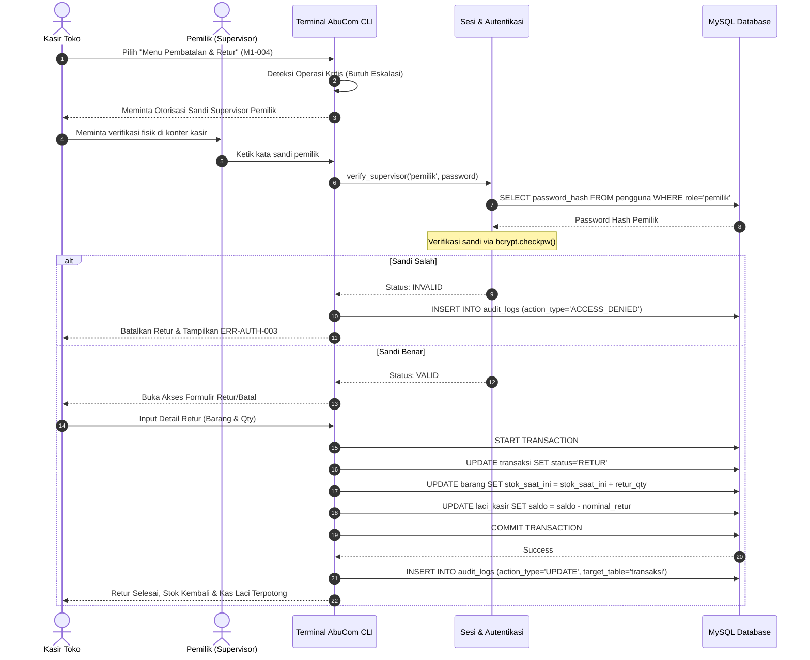
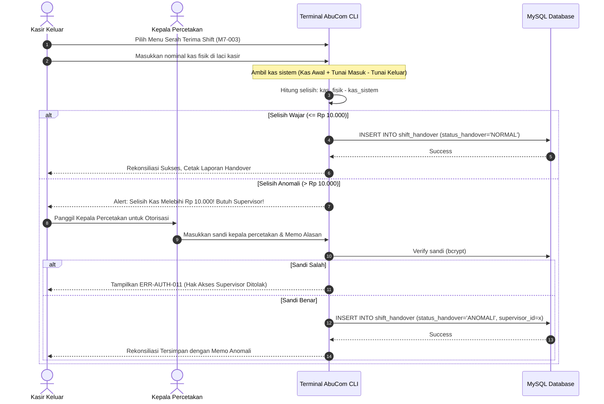
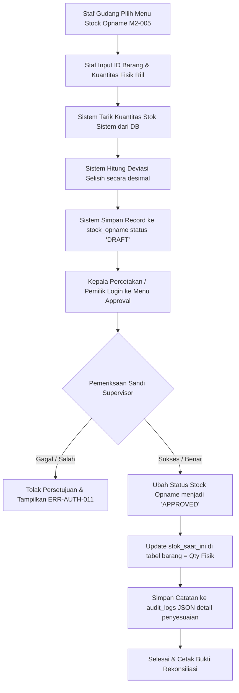
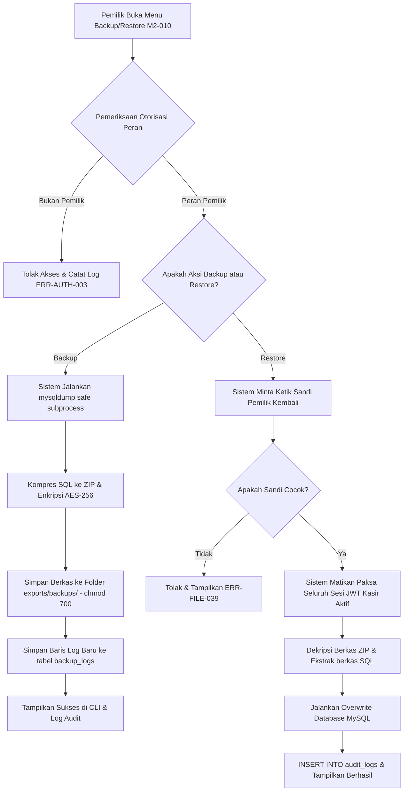

# Security Design — AbuCom

## Riwayat Perubahan Dokumen

| Versi | Tanggal    | Perubahan | Oleh |
|:---:|:---:|---|---|
| **1.1** | 2026-05-25 | Validasi menyeluruh v1.1: komparasi mendalam terhadap 8 dokumen referensi (ACM, SysArch, SRS, TSD, DDL, ERD, BRD, Workflow), pengisian SOP Respon Insiden Bab 10.6, verifikasi konsistensi kode error, sinkronisasi DDL tabel database, perbaikan bahasa Indonesia, validasi konsistensi nilai numerik, dan pembaruan referensi. | Senior Security Architect & Cybersecurity Compliance Specialist |
| **1.0** | 2026-05-25 | Inisialisasi awal penyusunan dokumen *Security Design* secara komprehensif. Mengonsolidasikan rancangan keamanan jaringan fisik, OS hardening, otentikasi bcrypt/JWT, otorisasi RBAC (8 peran), data protection (UU PDP No. 27/2022), audit logs JSON, 6 diagram Mermaid, penanganan kode error, analisis risiko, dan pseudocode FP Python murni. | Senior Security Architect & Cybersecurity Compliance Specialist |

---

## 1. Informasi Dokumen

### 1.1. Tujuan Dokumen
Dokumen **Security Design** ini disusun untuk menyediakan spesifikasi teknis dan logis yang komprehensif, rigid, dan terukur mengenai seluruh aspek perlindungan sistem perangkat lunak **AbuCom — Sistem Manajemen Terpadu Usaha Percetakan**. Dokumen ini bertindak sebagai acuan arsitektur keamanan mutlak (*blueprint*) untuk mencegah kebocoran data pribadi pelanggan (*CRM privacy*), manipulasi stok (*inventory fraud*), celah eskalasi hak akses (*privilege escalation*), dan kebocoran dana laci kasir (*financial leakage*).

### 1.2. Cakupan Dokumen
Dokumen ini mencakup:
* Prinsip dan strategi keamanan sistem (termasuk *Threat Modeling* lokal UMKM).
* Keamanan jaringan fisik LAN offline, OS hardening dual-OS, dan proteksi database.
* Desain otentikasi pengguna berbasis hashing sandi **bcrypt** dan session **JWT**.
* Desain otorisasi **RBAC multi-level (8 peran)** beserta aturan eskalasi supervisor.
* Perlindungan data pribadi (*Data Protection*) berbasis kepatuhan **UU PDP No. 27 Tahun 2022**.
* Desain Audit Trail kronologis berbasis penyimpanan JSON terstruktur.
* Tepat **6 diagram Mermaid** visual yang merepresentasikan alur keamanan kritis sistem.
* Kamus kode error keamanan (`ERR-AUTH-xxx`, `ERR-SESSION-xxx`, `ERR-DB-xxx`, `ERR-FILE-xxx`, `ERR-CASH-xxx`).
* Matriks risiko keamanan (10 analisis risiko utama) dan matriks ketertelusuran kebutuhan (*traceability*).
* Spesifikasi pseudocode fungsional (FP Python murni) untuk modul keamanan inti.

### 1.3. Posisi Dokumen dalam Siklus SDLC
Dalam pengembangan AbuCom CLI, dokumen ini berada pada **Fase 03 — Design (Perancangan Sistem)** dengan kode deliverables **06_security_design.md**. Dokumen ini dirancang sebagai turunan teknis tingkat rendah dari dokumen *Access Control Matrix (ACM) v1.1* dan *System Architecture v1.1* pada fase sebelumnya, dan bertindak sebagai input utama bagi penulisan modul program pada *Fase 04 — Implementation* dan pembuatan test suite pada *Fase 05 — Testing*.

```
+-----------------------------------+
|  ACM v1.1 & System Arch v1.1      |
+-----------------------------------+
                  |
                  v
+===================================+
|  Security Design v1.1 [DOKUMEN INI]|
+===================================+
                  |
                  v
+-----------------------------------+
|  Implementation & Unit Test (F04) |
+-----------------------------------+
```

### 1.4. Hubungan dengan Dokumen SDLC Lainnya
* **Dokumen Input**:
  - [Access Control Matrix v1.1](docs/sdlc/02_analysis/06_access_control_matrix.md): Definisi 8 peran internal, matriks hak akses 44 use case, matriks CRUD 28 tabel, eskalasi supervisor, rate limiting, sesi JWT, dan audit trail.
  - [System Architecture v1.1](docs/sdlc/03_design/03_system_architecture.md): Jaringan lokal LAN, konfigurasi OS server/klien, database isolation level, backup harian, dan diagram sequence login.
  - [Software Requirements Specification v1.1](docs/sdlc/02_analysis/02_software_requirements.md): Spesifikasi fungsional modul M.7 (Keamanan), kebutuhan non-fungsional keamanan, pustaka dependency, dan kode error.
  - [Tech Stack Decision v1.1](docs/sdlc/01_planning/04_tech_stack_decision.md): Parameter bcrypt cost factor 12, JWT HS256, parameterized queries, rate limiting, sanitasi input CLI, requirements.txt, dan .env parameters.
  - [Database Schema v1.1](docs/sdlc/03_design/01_database_schema.sql): Skema fisik tabel `pengguna`, `audit_logs`, `backup_logs`, `shift_handover`, `system_configs`, constraint CHECK, dan relasi FK.
* **Dokumen Output**:
  - Menjadi spesifikasi implementasi pengkodean berkas `middleware/rbac.py`, `middleware/logger.py`, `utils/backup.py`, dan `utils/crypto.py`.
  - Menjadi panduan pembuatan test case QA untuk penetration testing RBAC, SQL Injection, dan session expiration.

### 1.5. Audiens Target
1. **Tim Pengembang AI (Antigravity/Claude Sonnet)**: Selaku arsitek dan coder utama untuk menulis kode boilerplate middleware dan utilitas secara fungsional.
2. **Junior Programmer (Pemilik Usaha)**: Untuk memverifikasi implementasi pengamanan bisnis dan pemeliharaan mandiri database lokal.
3. **Staf Toko (Kepala Percetakan / Kasir)**: Untuk memahami batasan otorisasi dan prosedur serah terima laci kasir.

### 1.6. Definisi, Akronim, dan Singkatan
* **RBAC**: *Role-Based Access Control* (Pembatasan akses berdasarkan peran).
* **JWT**: *JSON Web Token* (Token otentikasi stateless format JSON).
* **bcrypt**: Fungsi hashing sandi satu arah adaptif berbasis Blowfish.
* **UU PDP**: Undang-Undang Perlindungan Data Pribadi No. 27 Tahun 2022 Republik Indonesia.
* **ACID**: *Atomicity, Consistency, Isolation, Durability* (Atribut integritas transaksi database).
* **FP**: *Functional Programming* (Paradigma pemrograman fungsional murni tanpa class/OOP).
* **LAN**: *Local Area Network* (Jaringan komputer lokal toko tanpa internet).

---

## 2. Prinsip dan Strategi Keamanan Sistem

### 2.1. Prinsip Keamanan Utama (Security Principles)
Keamanan AbuCom CLI dirancang berlandaskan pada 6 prinsip keamanan industri:
1. **Least Privilege**: Setiap staf hanya diberikan hak akses minimum mutlak untuk menjalankan deskripsi pekerjaan posisi mereka (misal: desainer dilarang melihat harga beli/HPP barang).
2. **Defense in Depth**: Mengamankan sistem dengan beberapa lapisan pertahanan (Jaringan Fisik &rarr; OS Hardening &rarr; Otentikasi &rarr; Otorisasi &rarr; Proteksi Data &rarr; Audit Trail).
3. **Separation of Duties**: Memisahkan peran untuk operasi kritis keuangan demi meminimalkan kecurangan internal (misal: kasir penginput data retur tidak bisa menyetujuinya sendiri tanpa kehadiran fisik pemilik toko).
4. **Default Deny**: Segala akses ke menu CLI atau operasi basis data ditolak secara default biner, kecuali secara eksplisit diberikan izin sesuai daftar peran aktif.
5. **Fail-Secure**: Jika terjadi crash runtime, hilangnya koneksi database, atau penolakan otorisasi, sistem wajib kembali ke state aman (mencabut session, rollback transaksi, dan mengunci akses) ketimbang tetap membiarkan sistem terbuka.
6. **Data Minimization**: Membatasi pencatatan data pribadi eksternal (CRM pelanggan) hanya pada nomor WhatsApp yang dienkripsi reversibel.

### 2.2. Model Ancaman (Threat Model)
Sistem AbuCom mendefinisikan model ancaman spesifik untuk toko percetakan lokal UMKM yang berjalan luring (offline LAN):

| ID Ancaman | Sumber Ancaman | Deskripsi Ancaman | Dampak Finansial / Operasional | Rencana Mitigasi Teknis |
|:---:|---|---|---|---|
| **THR-001** | Staf Karyawan | Kecurangan kasir (kasir melakukan manipulasi transaksi retur/batal sepihak untuk mengambil saldo kas laci). | Kebocoran uang kas fisik dan ketidaksesuaian laporan kas harian. | Eskalasi otorisasi sandi pemilik secara fisik di terminal kasir (ACM Bab 6.1). |
| **THR-002** | Pengguna Fisik | Serangan tebakan sandi kamus (*brute-force*) langsung pada keyboard terminal Mini PC kasir. | Akses ilegal ke akun kasir/kepala percetakan. | Rate limiting 5 kali salah, suspensi akun 10 menit (tabel `pengguna` column `locked_until`). |
| **THR-003** | Staf Karyawan / Staf Gudang | Manipulasi stok sistem (staf mengubah angka persediaan barang master secara ilegal untuk menyembunyikan pencurian fisik barang). | Kerugian stok retail ATK, selisih persediaan fisik. | Stock Opname berstatus 'DRAFT' dan hanya bisa 'APPROVED' via sandi Kepala Percetakan (ACM Bab 6.2). |
| **THR-004** | Staf / Vendor Eksternal | Pencurian fisik server Mini PC dari area toko secara paksa atau flashdisk diselundupkan. | Kebocoran data transaksi rahasia, data privasi CRM, HPP, laba rugi. | Enkripsi backup AES-256 ZIP, direktori `chmod 700` pada Debian server, database root password 32+ char. |
| **THR-005** | Input CLI | Penyerangan lokal via input form CLI menggunakan untaian karakter injeksi SQL (`' OR '1'='1`). | Kerusakan basis data, bypass login, kebocoran tabel keuangan. | Wajib *Parameterized Queries* (`%s` bindings), pelarangan f-string SQL, input length bounds, sanitasi terminal ASCII. |
| **THR-006** | Jaringan Lokal | Penyadapan / pemalsuan session ID oleh pihak luar di jaringan LAN lokal toko. | Pembajakan sesi otorisasi kasir / administrator. | Stateless session JWT HS256 dengan Secret Key minimum 32 karakter hex dilindungi berkas `.env`, kedaluwarsa 8 jam. |
| **THR-007** | Staf Karyawan | Akses tidak sah ke menu pemilik saat terminal ditinggalkan pemilik tanpa logout. | Kebocoran data sensitif (gaji bulanan, utang bank, tabungan aset). | Session timeout 8 jam biner. Pemasangan durasi auto-logout pada layer program. |
| **THR-008** | Staf Karyawan | Staf pramuniaga mencuri data keanggotaan nomor WhatsApp CRM pelanggan untuk spamming pihak ketiga. | Pelanggaran regulasi privasi konsumen (UU PDP No. 27/2022). | Enkripsi reversible nomor WhatsApp pelanggan di tabel `pelanggan` sebelum penyimpanan database. |

### 2.3. Klasifikasi Tingkat Sensitivitas Data
Data dalam 28 tabel database MySQL dikelompokkan menjadi 3 klasifikasi sensitivitas berdasarkan tingkat kerahasiaannya:
1. **Sangat Sensitif (Absolute Lockdown)**:
   - *Deskripsi*: Hanya boleh diakses oleh pemilik (`pemilik`). Dilarang keras dibaca atau diubah oleh peran lainnya dalam keadaan normal.
   - *Daftar Tabel*: `pinjaman_bank`, `pinjaman_kerabat`, `payroll`, `system_configs`, `backup_logs`.
   - *Perlindungan*: Diisolasi mutlak di tingkat layer logic menu, enkripsi AES-256 pada file cadangan, hak akses `chmod 700`.
2. **Sensitif (Akses Terbatas / Eskalasi)**:
   - *Deskripsi*: Hanya boleh diakses oleh peran kasir (`kasir`) atau kepala percetakan (`kepala_percetakan`) untuk kebutuhan harian, atau memerlukan eskalasi langsung pemilik.
   - *Daftar Tabel*: `transaksi`, `pengeluaran`, `audit_logs`, `shift_handover`, `utang_supplier`, `limbah_produksi`, `stock_opname`.
   - *Perlindungan*: Tulis audit log JSON secara simultan pada setiap modifikasi, otorisasi supervisor biner.
3. **Operasional (Akses Terbuka Karyawan Terkait)**:
   - *Deskripsi*: Dapat dibaca/ditulis secara fungsional oleh staf operasional terkait untuk kelancaran transaksi harian.
   - *Daftar Tabel*: `cabang`, `pengguna`, `pelanggan`, `supplier`, `barang`, `bom_komposisi`, `detail_transaksi`, `antrian_kerja`, `absensi`, `kasbon`, `saldo_ppob`, `jasa_service`, `poin_insentif`, `saldo_ewallet`, `riwayat_harga_supplier`.
   - *Perlindungan*: Parameterized query, filter input terminal.

---

## 3. Arsitektur Keamanan (Security Architecture)

### 3.1. Diagram Keamanan Berlapis (Defense in Depth)



### 3.2. Keamanan Jaringan Fisik (Network Security)
* **Kemandirian Topologi**: Sistem berjalan 100% luring (*offline*) di jaringan LAN lokal toko tanpa gerbang internet luar (*no gateway*). Menghilangkan celah peretasan jarak jauh oleh peretas luar.
* **Restriksi Port Jaringan**: Mini PC Server (Debian 12) mengaktifkan `ufw` firewall secara default. Port default MySQL `3306` dikunci absolut, hanya mengizinkan lalu lintas TCP/IP dari segmen IP lokal klien PC Kasir:
  `ufw allow from 192.168.1.0/24 to any port 3306 proto tcp`
* **Static Server IP Binding**: Router MikroTik di-setup untuk mengalokasikan IP statis lokal database server secara permanen di alamat `192.168.1.200`. PC Kasir dilarang mengakses IP luar segmen tersebut.
* **Perlindungan Listrik**: Node server dan klien kasir dipasang UPS 600VA / 360W mandiri untuk mencegah kegagalan *dirty shutdown* dan menjaga integritas basis data.

### 3.3. Keamanan Sistem Operasi (OS Hardening)
* **Linux Debian 12 (Server)**:
  - Direktori penyimpanan cadangan data `/var/lib/mysql-backups/` dikunci dengan hak akses administratif `chmod 700`, menjamin hanya user **root** sistem operasi yang dapat membaca/menulis berkas cadangan database.
  - Nonaktifkan login SSH langsung dengan root (`PermitRootLogin no` di `/etc/ssh/sshd_config`).
  - MySQL daemon dikonfigurasi di `/etc/mysql/mysql.conf.d/mysqld.cnf` untuk terikat secara internal pada IP statis server lokal:
    `bind-address = 192.168.1.200`
* **Windows 11 (Klien)**:
  - Program CLI Python dijalankan pada akun Windows non-administrator terbatas (*Limited User Account*).
  - Melarang auto-mount untuk flashdisk eksternal baru (*disable USB autorun*) pada Windows kasir untuk meminimalkan penyebaran malware lokal.

### 3.4. Keamanan Koneksi Database (Database Security)
* **Parameterized Queries**: Seluruh manipulasi database MySQL wajib menggunakan parameter binding `%s` bawaan driver `mysql-connector-python`. F-string dan string concatenation SQL dilarang mutlak di seluruh codebase program.
* **Database User Privilege Minimization**: Sistem menggunakan akun pengguna database MySQL spesifik `abucom_app` dengan hak terbatas untuk operasional aplikasi, terpisah dari akun `root` MySQL. Akun `abucom_app` diberikan hak privilege yang **diizinkan** secara eksplisit (`SELECT`, `INSERT`, `UPDATE`, `DELETE`) dan **dilarang** secara keras untuk melakukan modifikasi administratif skema database (`DROP`, `ALTER`, `CREATE`, `GRANT`).
* **ACID Transaction Wrap**: Operasi multi-tabel dibungkus dalam blok `START TRANSACTION` dan wajib di-`ROLLBACK` jika terjadi pengecualian (*exception*) data.
* **Repeatable Read Isolation**: Menghindari anomali pembacaan data transaksional saat data kasir diproses simultan dengan stok opname harian.

---

## 4. Desain Otentikasi (Authentication Design)

### 4.1. Enkripsi Kata Sandi (bcrypt Cost Factor 12)
Sistem AbuCom mengimplementasikan enkripsi kata sandi satu arah (*one-way hash*) adaptif menggunakan algoritma **bcrypt**.
* **Parameter Cost Factor**: Diatur secara statis senilai **12** di sisi program Python.
* **Salt Dinamis**: bcrypt menyertakan salt acak dinamis 16-byte secara otomatis pada setiap pemicuan enkripsi kata sandi baru.
* **Alur Hashing & Verifikasi**:
  ```
  [Registrasi]  Input Password Polos ---> bcrypt.hashpw(pass, gensalt(12)) ---> Simpan ke pengguna.password_hash (MySQL)
  [Login]       Input Password Polos ---> bcrypt.checkpw(pass, password_hash) ---> Kembalikan Boolean (True / False)
  ```

### 4.2. Manajemen Session CLI (JWT HS256)
Otentikasi sesi terminal AbuCom menggunakan model *stateless session* berbasis **JSON Web Token (JWT)**.
* **Algoritma Tanda Tangan**: **HS256** (HMAC-SHA256).
* **Secret Key**: Kunci rahasia minimum 32 karakter heksadesimal yang dimuat dinamis dari berkas `.env` lokal pada PC Kasir.
* **Payload Token**:
  ```json
  {
    "user_id": 1,
    "username": "kasir_andi",
    "role": "kasir",
    "cabang_id": 1,
    "exp": 1779928800
  }
  ```
* **Masa Berlaku Sesi**: Dibatasi maksimal **28.800 detik (8 jam)**, setara dengan 1 shift kerja staf.
* **Handling Expiration**: Setiap kali menu CLI dipicu, validator sesi menangkap kedaluwarsa token JWT (`jwt.ExpiredSignatureError`). Jika terpicu, program otomatis menghapus token JWT dari memori lokal (variabel sesi program), memutus alur, dan memaksa terminal kembali ke layar login dengan kode `ERR-SESSION-002`.

### 4.3. Rate Limiting dan Penguncian Akun
Untuk memitigasi serangan brute-force nekat pada laci fisik terminal kasir harian:
* **Threshold Kegagalan**: Dibatasi maksimal **5 kali berturut-turut**.
* **Suspensi Akun**: Pada kegagalan ke-5, program Python meng-update baris tabel `pengguna` MySQL untuk mensuspensi akun:
  - `failed_login_attempts = 5`
  - `locked_until = DATE_ADD(NOW(), INTERVAL 10 MINUTE)`
* **Pencegahan**: Selama masa locked_until masih berlaku, sistem menolak otentikasi login pengguna tersebut dan menampilkan pesan `ERR-AUTH-002`. Nilai attempts dibersihkan (reset ke 0) secara otomatis begitu login sukses dengan password valid.

### 4.4. Prosedur Logout dan Penghancuran Session
Saat pengguna memilih menu `BASE-002 (Logout)` atau memicu *idle timeout* 30 menit tanpa aktivitas keyboard:
1. Sistem menghapus token JWT string dari dictionary state lokal memori Python kasir secara permanen (`session_state = {'user_id': None, 'role': None, 'token': None}`).
2. Sistem menuliskan entri aktivitas log audit jenis `LOGOUT` ke tabel `audit_logs` MySQL.
3. Terminal CLI dibersihkan menggunakan pembersih layar dan merender kembali prompt login kosong awal.

---

## 5. Desain Otorisasi (Authorization Design)

### 5.1. Model RBAC Multi-Level (8 Peran)
Otorisasi AbuCom CLI menerapkan hierarki **Role-Based Access Control (RBAC)** 3-level untuk mengendalikan wewenang 8 peran internal:



### 5.2. Implementasi Decorator/Guard Otorisasi
Dalam paradigma pemrograman fungsional (FP) murni, pemeriksaan otorisasi diimplementasikan sebagai fungsi orde tinggi (*higher-order function*) yang membungkus fungsi menu target. 
* **Pemeriksaan Otorisasi**: Fungsi `require_permission(menu_id, session_state, action_func)` memeriksa peran aktif di payload JWT `session_state['role']` terhadap hak akses biner yang didefinisikan pada matriks. Jika ditolak, jalankan logger `ACCESS_DENIED` dan tampilkan pesan `ERR-AUTH-003`.

### 5.3. Matriks Akses Modul per Peran (Ringkasan)
Berikut adalah matriks otorisasi granular akses menu CLI untuk 10 modul utama AbuCom (derivasi dari ACM Bab 4):

| ID Modul | Nama Modul / Fitur CLI | pemilik | kepala_percetakan | pramuniaga | kasir | desainer | produksi_cetak | fotocopy_print | gudang |
|:---:|---|:---:|:---:|:---:|:---:|:---:|:---:|:---:|:---:|
| **M.1** | Transaksi & Kebijakan Harga | ✅ FULL | 📖 READ | 📝 INPUT | ✅ FULL | ⛔ DENY | ⛔ DENY | 🔒 RTL | ⛔ DENY |
| **M.2** | Inventaris, BOM & Opname | ✅ FULL | 🔐 ESC | ⛔ DENY | ⛔ DENY | ⛔ DENY | 📝 INPUT | ⛔ DENY | ✅ FULL |
| **M.3** | Keuangan Digital & Servis | ✅ FULL | ⛔ DENY | 📝 INPUT | ✅ FULL | ⛔ DENY | ⛔ DENY | ⛔ DENY | ⛔ DENY |
| **M.4** | SDM, Payroll & Poin | ✅ FULL | ⛔ DENY | ⛔ DENY | ⛔ DENY | ⛔ DENY | ⛔ DENY | ⛔ DENY | ⛔ DENY |
| **M.5** | Antrian & Pelacakan Desain | ✅ FULL | ✅ FULL | 📝 INPUT | 📝 INPUT | ✅ FULL | 📝 INPUT | ⛔ DENY | ⛔ DENY |
| **M.6** | Pinjaman, Aset & Pengeluaran | ✅ FULL | ⛔ DENY | ⛔ DENY | 📝 INPUT | ⛔ DENY | ⛔ DENY | ⛔ DENY | ⛔ DENY |
| **M.7** | Keamanan, Audit & Handover | ✅ FULL | 🔐 ESC | ⛔ DENY | 📝 INPUT | ⛔ DENY | ⛔ DENY | ⛔ DENY | ⛔ DENY |
| **M.8** | CRM Database Pelanggan | ✅ FULL | ⛔ DENY | ✅ FULL | ✅ FULL | ⛔ DENY | ⛔ DENY | ⛔ DENY | ⛔ DENY |
| **M.9** | Skalabilitas Multi-Cabang | ✅ FULL | ⛔ DENY | ⛔ DENY | ⛔ DENY | ⛔ DENY | ⛔ DENY | ⛔ DENY | ⛔ DENY |
| **M.10**| Parameter Runtime Config | ✅ FULL | ⛔ DENY | ⛔ DENY | ⛔ DENY | ⛔ DENY | ⛔ DENY | ⛔ DENY | ⛔ DENY |

*Legenda*: `✅ FULL` (Akses penuh), `📖 READ` (Hanya baca), `📝 INPUT` (Hanya input baru), `🔒 RTL` (Akses ritel eceran terbatas), `🔐 ESC` (Memerlukan eskalasi otorisasi supervisor/sandi pemilik), `⛔ DENY` (Ditolak mutlak).

### 5.4. Aturan Eskalasi Otorisasi Pemilik
Terdapat 4 operasi bisnis kritis yang secara logis dilarang dieksekusi oleh staf umum, melainkan mewajibkan kehadiran fisik Pemilik untuk mengetik kata sandinya di terminal:
1. **Pembatalan Transaksi & Retur Uang Muka (DP)**: Mencegah kebocoran kas laci (*cash leakage*). Memicu kode sandi pemilik. Respon gagal: `ERR-AUTH-003`.
2. **Retur Barang Retail ATK**: Mencegah kecurangan stok barang. Memohon sandi pemilik. Respon gagal: `ERR-AUTH-003`.
3. **Pengeluaran Besar (> Rp 500.000)**: Penginputan biaya operasional toko melebihi pagu Rp 500.000 wajib divalidasi langsung oleh sandi pemilik. Respon gagal: `ERR-AUTH-029`.
4. **Restorasi Database Manual**: Overwrite data fisik database dari file cadangan manual. Respon gagal: `ERR-FILE-039`.

### 5.5. Aturan Otorisasi Kepala Percetakan
Operasi pengawasan harian yang mewajibkan verifikasi digital (tanda tangan otorisasi) oleh Kepala Percetakan:
1. **Persetujuan Stock Opname**: Validasi selisih barang fisik vs sistem. Mengubah status `'DRAFT'` &rarr; `'APPROVED'`. Respon gagal: `ERR-AUTH-011`.
2. **Serah Terima Shift (Normal)**: Validasi kecocokan saldo kas laci kasir secara biner (Fisik vs Sistem) dengan batas toleransi selisih Rp 10.000.
3. **Serah Terima Shift (Anomali)**: Jika selisih kas > Rp 10.000, kasir tidak bisa menutup shift secara normal. Kepala Percetakan wajib hadir fisik memasukkan sandinya dan menambahkan memo alasan anomali ke tabel `shift_handover`. Respon gagal: `ERR-CASH-001`.

### 5.6. Kebijakan Default Deny
Arsitektur program menerapkan prinsip **Default Deny**. Setiap menu, sub-menu CLI, atau fungsi pengeksekusi query database yang dipanggil oleh pengguna yang memiliki status peran tidak dikenal (*undefined role*) atau tidak memiliki pemetaan akses eksplisit pada database akan **ditolak secara otomatis** dan memicu pembuatan Audit Log jenis `ACCESS_DENIED`.

---

## 6. Desain Proteksi Data (Data Protection Design)

### 6.1. Enkripsi Data at Rest
Sistem menerapkan perlindungan data statis (*Data at Rest*) secara lokal pada mesin server:
* **AES-256 pada Berkas Cadangan**: Pencadangan database (mysqldump) dikompresi ke format `.zip` menggunakan enkripsi simetris **AES-256** berkunci rahasia dari `.env` (`BACKUP_ZIP_PASSWORD`).
* **bcrypt pada Sandi**: Enkripsi sandi satu arah di tabel `pengguna` menggunakan bcrypt cost factor 12.
* **Enkripsi WhatsApp CRM**: Kepatuhan UU PDP No. 27/2022. Kolom `whatsapp` pada tabel `pelanggan` terenkripsi dua arah (reversible) menggunakan modul `cryptography.fernet` Python dengan kunci enkripsi 32-byte statis yang dimuat dari variabel lingkungan `.env` (`FERNET_KEY`). Nomor WA pelanggan didekripsi di memori Python hanya saat visualisasi menu CRM.

### 6.2. Proteksi Data in Transit
Karena sistem AbuCom berjalan di jaringan LAN offline lokal:
* Data mengalir melalui media kabel fisik **UTP Category 6 (Cat6)** dengan pelindung interferensi elektromagnetik pada *Gigabit Switch Hub* internal toko.
* Jalur komunikasi MySQL berbasis TCP/IP port 3306 dilindungi dari jaringan luar karena router MikroTik dikonfigurasi tanpa akses internet dan firewall server ufw menutup port 3306 dari IP asing di luar rentang subnet lokal.

### 6.3. Kepatuhan UU PDP No. 27/2022
Sebagai bukti kepatuhan hukum atas pelindungan privasi data pribadi pelanggan di Indonesia, sistem AbuCom menerapkan:
1. **Enkripsi Reversible WhatsApp**: Kolom data pribadi pelanggan dilindungi biner di database.
2. **Pembatasan Hak Baca**: Data CRM hanya boleh diakses peran kasir, pramuniaga, dan pemilik untuk kepentingan mencatat transaksi belanja. Staf desainer, produksi cetak, dan gudang dikunci mutlak (`⛔ DENY`).
3. **Hak Penghapusan Data (Right to Erasure)**: Menyediakan menu khusus bagi Pemilik untuk menghapus data pribadi pelanggan dari database master secara permanen (menjadi anonim) atas permintaan pelanggan.

### 6.4. Proteksi Input Aplikasi (Input Validation)
* **ASCII Control Characters Filter**: Pemuatan karakter teks dari keyboard terminal kasir disaring ketat. Karakter kontrol ASCII di bawah `\x20` (seperti escape code ANSI `\x1b`) akan dibuang otomatis untuk mencegah injeksi terminal CLI visual.
* **Length Bounds Validation**: Membatasi panjang karakter input formulir di memori Python (misal: nama pengguna &le; 50 karakter, WhatsApp &le; 20 karakter).
* **Regex Format Validation**: Masukan WhatsApp disaring menggunakan regex `^08[0-9]{8,11}$` sebelum query SQL diproses.
* **Anti-SQL Injection Parameterized**: Melarang penggunaan f-string, concatenations, atau dynamic formatting `%` pada instruksi SQL program, wajib menggunakan placeholder `%s`.

### 6.5. Manajemen Kredensial dan Secrets
* Kunci rahasia JWT secret key, sandi database, IP server database, dan nama port printer thermal dipisahkan dari berkas kode sumber program. Kredensial disimpan dalam berkas lokal `.env` pada folder root kasir.
* Berkas `.env` dimasukkan ke dalam daftar `.gitignore` untuk mencegah kebocoran repositori.
* **Startup Validator**: Layer aplikasi menjalankan verifikasi keberadaan berkas `.env` dan keaslian variabel di dalamnya saat startup program. Jika berkas hilang atau tidak lengkap, startup sistem dibatalkan secara aman dengan pesan error `ERR-FILE-001`.

### 6.6. Klasifikasi dan Perlindungan Tabel Database
Proteksi tabel MySQL didasarkan pada klasifikasi sensitivitas Bab 2.3:
* **Tabel Sangat Sensitif**: Operasi CRUD ditutup biner di layer DB connector, kecuali diakses melalui session token ber-role `'pemilik'`.
* **Tabel Sensitif**: Setiap instruksi `INSERT`, `UPDATE`, atau `DELETE` wajib memicu penulisan logs audit trail JSON secara otomatis.
* **Tabel Operasional**: Dilindungi oleh parameterized query dan validasi tipe data parameter.

---

## 7. Desain Audit Trail dan Monitoring

### 7.1. Skema Tabel Audit Logs
Struktur kolom tabel `audit_logs` dirancang secara fisik di database MySQL untuk merekam aktivitas modifikasi data secara granular (derivasi dari DDL SQL):

```sql
CREATE TABLE audit_logs (
    id INT NOT NULL AUTO_INCREMENT PRIMARY KEY,
    pengguna_id INT NOT NULL COMMENT 'Referensi pengguna staf pelaksana aksi',
    action_timestamp TIMESTAMP NOT NULL DEFAULT CURRENT_TIMESTAMP COMMENT 'Waktu presisi detik aksi',
    action_type VARCHAR(20) NOT NULL COMMENT 'Aksi: INSERT | UPDATE | DELETE | ACCESS_DENIED',
    target_table VARCHAR(100) NOT NULL COMMENT 'Nama tabel database sasaran',
    old_value JSON NULL DEFAULT NULL COMMENT 'Salinan record sebelum perubahan',
    new_value JSON NULL DEFAULT NULL COMMENT 'Salinan record sesudah perubahan',
    ip_address VARCHAR(45) NULL DEFAULT NULL COMMENT 'IP client yang memicu insiden',
    cabang_id INT NOT NULL DEFAULT 1,
    FOREIGN KEY (pengguna_id) REFERENCES pengguna(id),
    FOREIGN KEY (cabang_id) REFERENCES cabang(id)
) ENGINE=InnoDB;
```

### 7.2. Event Pemicu Pencatatan Audit
Peristiwa-peristiwa berikut **wajib** memicu penulisan log audit ke tabel `audit_logs`:
1. Pengisian/modifikasi data pada 5 tabel Sangat Sensitif.
2. Setiap kali dekorator otorisasi mendeteksi akses ilegal dan menolak menu (`ACCESS_DENIED`).
3. Aktivitas otentikasi: `LOGIN_SUCCESS`, `LOGIN_FAILED`, `LOGOUT`, dan penguncian brute-force (`ACCOUNT_LOCKOUT`).
4. Eksekusi tindakan kritis eskalasi (retur DP, retur ATK, pengeluaran > Rp 500.000, restorasi database).
5. Eksekusi backup dan restore manual basis data.

### 7.3. Format Pencatatan JSON
Log audit merekam status lengkap baris data yang dimodifikasi dalam format JSON string.
* *Contoh Audit Aksi UPDATE (Kasbon)*:
  - `old_value`: `{"id": 3, "pengguna_id": 4, "sisa_utang": 500000.0000, "status_kasbon": "AKTIF"}`
  - `new_value`: `{"id": 3, "pengguna_id": 4, "sisa_utang": 0.0000, "status_kasbon": "LUNAS"}`
* *Contoh Audit Aksi ACCESS_DENIED (Akses Gaji)*:
  - `old_value`: `{"attempted_menu": "MENU-M4-002", "args": {"bulan": "05-2026"}}`
  - `new_value`: `{"status": "ILLEGAL_ACCESS_PREVENTED", "resolved_action": "TERMINATED"}`

### 7.4. Deteksi Anomali dan Fraud (Fraud Detection)
Layer aplikasi memonitor dan merender tanda peringatan visual pada dashboard Pemilik (`pemilik`) jika mendeteksi tanda anomali kasir berikut:
* **Selisih Kas Rekonsiliasi**: Log `shift_handover` mencatat selisih kas fisik vs sistem (selisih > Rp 10.000) berturut-turut dalam 3 shift terakhir.
* **Frekuensi Retur Abnormal**: Akun kasir tertentu melakukan pemicuan eskalasi retur barang/DP sebanyak > 5 kali dalam 1 minggu berjalan.
* **Login Gagal Berulang**: Terjadinya kegagalan login berturut-turut sebanyak > 10 kali pada satu alamat IP kasir yang sama dalam durasi 1 jam.

### 7.5. Retensi dan Pemeliharaan Log Audit
* **Kebijakan Retensi**: Data log audit wajib disimpan di database utama selama minimal **12 bulan** untuk mematuhi kebutuhan audit forensik internal.
* **Log Rotation**: Setiap awal bulan, pemilik dapat menjalankan utilitas purging log terkompresi. Data log audit yang berumur > 12 bulan dipindahkan secara otomatis ke dalam arsip file dingin (*cold storage*) format zip terenkripsi dan baris database dibersihkan secara aman (*purged*).

---

## 8. Desain Keamanan Operasional

### 8.1. Prosedur Serah Terima Shift (Shift Handover Security)
Aktivitas pergantian kasir harian diatur ketat untuk meminimalisir fraud keuangan:
1. Kasir penutup shift yang akan keluar login ke menu `MENU-M7-003`.
2. Kasir menghitung uang fisik di laci kas dan menginputkan nominalnya (`kas_fisik`).
3. Sistem menghitung saldo uang menurut catatan sistem (`kas_sistem`) berdasarkan formula:
   $$\text{Kas Sistem} = \text{Kas Awal} + \sum(\text{Transaksi Tunai}) - \sum(\text{Pengeluaran Tunai})$$
4. Sistem memverifikasi selisih kas secara biner (`selisih = kas_fisik - kas_sistem`).
5. *Kondisi A (Normal)*: Jika `abs(selisih) <= Rp 10.000`, shift handover disetujui, status dicatat `'NORMAL'`.
6. *Kondisi B (Anomali)*: Jika `abs(selisih) > Rp 10.000`, handover dibatalkan secara normal. Kasir keluar wajib memanggil Kepala Percetakan untuk memasukkan sandi supervisor dan menuliskan memo alasan selisih sebelum data `shift_handover` disimpan dengan status `'ANOMALI'`.

### 8.2. Prosedur Backup dan Restore Aman
* **Prosedur Backup**:
  - Skrip Python mengeksekusi `mysqldump` lokal via safe subprocess.
  - Kompres berkas `.sql` hasil ekspor menjadi berkas `.zip`. Enkripsi berkas menggunakan sandi AES-256.
  - Simpan berkas cadangan ke folder lokal `/exports/backups/`. Tulis entri log baru ke tabel `backup_logs`.
* **Prosedur Restore**:
  - Pemicuan menu pemulihan basis data di CLI hanya dapat diakses oleh peran `pemilik` secara eksklusif.
  - Sebelum pemulihan dieksekusi, mintakan kembali ketikan sandi pemilik sebagai *checkpoint* otentikasi.
  - Program melakukan *shutdown* (memutus paksa) seluruh session JWT kasir aktif lainnya untuk mencegah ketidaksinkronan data ACID.
  - Dekripsi berkas cadangan ZIP, jalankan restore, rekam aktivitas ke log audit.

### 8.3. Prosedur Pengelolaan Akun Pengguna
* **Pembuatan Akun Staf**: Penambahan karyawan baru, pembagian kode posisi peran, dan set sandi awal wajib dieksekusi secara mandiri oleh `pemilik` di menu `MENU-M7-001`.
* **Perubahan Password**: Setiap staf diwajibkan mengganti kata sandi default mereka secara mandiri pada peluncuran menu `BASE-004` (Ubah Sandi Akun Sendiri).
* **Penonaktifan Akun**: Karena skema fisik DDL tabel `pengguna` di `01_database_schema.sql` tidak memiliki kolom status `is_active`, penonaktifan akun dilakukan secara logis dengan cara: (1) Mengubah `password_hash` akun karyawan tersebut ke karakter acak yang tidak dikenal (misal string UUID acak) di database, sehingga tidak ada sandi polos yang bisa cocok; (2) Mencabut token JWT aktif dengan cara menghapus token di memori klien dan membiarkan token lama kedaluwarsa secara biner karena sistem berjalan stateless.

### 8.4. Keamanan Fisik Server dan Infrastruktur
* Perangkat Mini PC Server database diletakkan di dalam area aman toko (misal: lemari terkunci khusus server) yang terlindung dari jangkauan fisik pelanggan umum atau staf yang tidak berwenang.
* Akses port fisik USB pada Mini PC Server Debian ditutup secara software untuk mencegah penyalinan data basis data secara ilegal menggunakan media USB flashdisk.

---

## 9. Alur Keamanan Kritis (Security Flow Diagrams)

### 9.1. Alur Otentikasi Login CLI (Sequence Diagram)



### 9.2. Alur Otorisasi Transaksi Kasir (Sequence Diagram)



### 9.3. Alur Eskalasi Retur/Pembatalan (Sequence Diagram)



### 9.4. Alur Rekonsiliasi Kas dan Shift Handover (Sequence Diagram)



### 9.5. Alur Stock Opname dengan Otorisasi Supervisor (Flowchart)



### 9.6. Alur Backup dan Restore Database (Flowchart)



---

## 10. Penanganan Error dan Kode Keamanan

### 10.1. Kategori ERR-AUTH-xxx (Otentikasi & Otorisasi)

| Kode Error | String Pesan Kesalahan CLI | Pemicu Insiden Keamanan | Modul Terkait |
|---|---|---|---|
| **ERR-AUTH-001** | `ERR-AUTH-001: Kredensial tidak valid. Silakan coba kembali!` | Salah memasukkan nama login username di layar login. | M.7 |
| **ERR-AUTH-002** | `ERR-AUTH-002: Sandi Gagal: Akun ditangguhkan selama 10 menit akibat brute-force!` | Kegagalan input sandi sebanyak 5 kali berturut-turut. | M.7 |
| **ERR-AUTH-003** | `ERR-AUTH-003: Akses Ditolak: Hak Akses Pemilik Dibutuhkan!` | Peran staf mencoba mengakses menu pemilik (`pemilik`). | M.7 |
| **ERR-AUTH-011** | `ERR-AUTH-011: Hak akses supervisor dibutuhkan untuk menyetujui Stock Opname!` | Peran staf non-supervisor mencoba menyetujui stock opname. | M.2 |
| **ERR-AUTH-029** | `ERR-AUTH-029: Verifikasi sandi Pemilik gagal. Pengeluaran besar dibatalkan!` | Salah memasukkan sandi eskalasi pemilik pada pengeluaran > Rp 500rb. | M.6 |

### 10.2. Kategori ERR-SESSION-xxx (Manajemen Sesi)

| Kode Error | String Pesan Kesalahan CLI | Pemicu Insiden Keamanan | Modul Terkait |
|---|---|---|---|
| **ERR-SESSION-001** | `ERR-SESSION-001: Sesi login tidak ditemukan. Harap login terlebih dahulu!` | Mencoba mengakses menu CLI tanpa session JWT aktif. | M.7 |
| **ERR-SESSION-002** | `ERR-SESSION-002: Sesi login tidak sah/rusak. Harap login kembali!` | Token signature JWT tidak cocok atau masa aktif 8 jam kedaluwarsa. | M.7 |

### 10.3. Kategori ERR-DB-xxx (Konektivitas & Transaksi Keamanan)

| Kode Error | String Pesan Kesalahan CLI | Pemicu Insiden Keamanan | Modul Terkait |
|---|---|---|---|
| **ERR-DB-001** | `ERR-DB-001: Koneksi terputus. Penyimpanan transaksi dibatalkan!` | lost connection ke database server MySQL lokal (Error 2006/2013). | M.1 |
| **ERR-DB-002** | `ERR-DB-002: Pelanggaran integritas basis data. Transaksi dibatalkan!` | Kegagalan FK atau constraint CHECK saat eksekusi query. | M.10 |

### 10.4. Kategori ERR-FILE-xxx (Pencadangan & File)

| Kode Error | String Pesan Kesalahan CLI | Pemicu Insiden Keamanan | Modul Terkait |
|---|---|---|---|
| **ERR-FILE-001** | `ERR-FILE-001: Berkas konfigurasi .env tidak ditemukan. Aplikasi ditutup!` | File konfigurasi rahasia `.env` hilang pada folder root. | M.10 |
| **ERR-FILE-039** | `ERR-FILE-039: Gagal memulihkan data. Berkas cadangan korup atau sandi enkripsi salah!` | Gagal memulihkan basis data dari berkas ZIP cadangan. | M.2 |

### 10.5. Kategori ERR-CASH-xxx (Rekonsiliasi Keuangan)

| Kode Error | String Pesan Kesalahan CLI | Pemicu Insiden Keamanan | Modul Terkait |
|---|---|---|---|
| **ERR-CASH-001** | `ERR-CASH-001: Selisih Gagal: Selisih Rp [Nominal] melebihi batas Rp 10.000!` | Kasir mencoba menutup shift secara mandiri dengan selisih kas > Rp 10.000. | M.7 |
| **ERR-CASH-004** | `ERR-CASH-004: Saldo kas laci kasir tidak mencukupi untuk pengembalian dana!` | Saldo laci kas tunai kasir minus saat pengembalian dana retur/batal. | M.1 |

### 10.6. Prosedur Respon Insiden Keamanan
*SOP Tanggap Darurat Kebocoran/Insiden Data Toko*:

#### A. Definisi Insiden Keamanan
Sistem AbuCom mendefinisikan 5 jenis insiden keamanan kritis lokal yang mewajibkan penerapan SOP ini:
1. *Brute-Force Berhasil*: Akun staf/kasir atau pemilik berhasil di-bypass oleh login ilegal dari PC klien dengan indikasi kegagalan berturut-turut sebelumnya.
2. *Selisih Kas Berulang*: Rekaman log `shift_handover` mencatat status `'ANOMALI'` (selisih > Rp 10.000) berturut-turut dalam 3 shift terakhir.
3. *Akses Fisik Tidak Sah ke Server*: Matinya daya Mini PC Server secara kotor (*dirty shutdown*) di tengah shift, hilangnya fisik Mini PC, atau terdeteksinya flashdisk asing pada port USB server.
4. *Kegagalan Backup*: Sistem mencatatkan status `'FAILED'` pada database `backup_logs` berturut-turut selama 2 hari operasional.
5. *Ketidakcocokan Checksum Cadangan*: Gagalnya proses dekripsi file cadangan ZIP AES-256 saat simulasi verifikasi pemulihan data tahunan.

#### B. Fase Deteksi (Detection)
Aktivitas deteksi dilakukan secara otomatis melalui alarm dashboard visual pemilik, atau secara manual melalui pemeriksaan query *forensic* audit log:
1. *Indikator Brute-force*: Tanda visual kegagalan login berulang dari satu alamat IP kasir.
   - Query SQL Deteksi:
     ```sql
     SELECT action_timestamp, old_value, ip_address 
     FROM audit_logs 
     WHERE action_type = 'LOGIN_FAILED' 
       AND action_timestamp > DATE_SUB(NOW(), INTERVAL 1 HOUR)
     ORDER BY action_timestamp DESC;
     ```
2. *Indikator Akses Tidak Sah*: Deteksi percobaan penembusan menu Pemilik oleh peran kasir/staf operasional.
   - Query SQL Deteksi:
     ```sql
     SELECT action_timestamp, pengguna_id, target_table, old_value 
     FROM audit_logs 
     WHERE action_type = 'ACCESS_DENIED' 
       AND action_timestamp > DATE_SUB(NOW(), INTERVAL 24 HOUR)
     ORDER BY action_timestamp DESC;
     ```
3. *Indikator Selisih Kas Kronis*: Monitoring log anomali handover kasir.
   - Query SQL Deteksi:
     ```sql
     SELECT timestamp_handover, kasir_keluar_id, selisih, catatan_alasan 
     FROM shift_handover 
     WHERE status_handover = 'ANOMALI' 
     ORDER BY timestamp_handover DESC LIMIT 5;
     ```
4. *Indikator Kegagalan Backup*: Peringatan kegagalan ekspor database.
   - Query SQL Deteksi:
     ```sql
     SELECT tanggal_backup, nama_file, status_backup 
     FROM backup_logs 
     WHERE status_backup = 'FAILED' 
     ORDER BY tanggal_backup DESC LIMIT 5;
     ```
5. *Indikator Data Sangat Sensitif Diakses*: Memantau akses ke tabel rahasia `payroll` atau `pinjaman_bank`.
   - Query SQL Deteksi:
     ```sql
     SELECT action_timestamp, pengguna_id, action_type, target_table 
     FROM audit_logs 
     WHERE target_table IN ('payroll', 'pinjaman_bank', 'pinjaman_kerabat') 
     ORDER BY action_timestamp DESC;
     ```

#### C. Fase Penahanan (Containment)
Langkah taktis isolasi wajib dieksekusi secara instan saat insiden terkonfirmasi:
1. Cabut kabel LAN fisik UTP Cat6 dari port switch hub Mini PC Server database Debian lokal toko untuk memutuskan seluruh koneksi klien kasir secara instan dari database.
2. Nonaktifkan akun staf yang dicurigai disusupi secara lokal di database (mengubah password_hash menjadi UUID string acak).
3. Hentikan service daemon database MySQL server Debian dengan perintah CLI:
   `sudo systemctl stop mysql`
4. Matikan terminal kasir Windows 11 secara paksa menggunakan tombol fisik power jika dicurigai adanya malware visual.

#### D. Fase Analisis (Forensic Investigation)
Pemilik login lokal ke mesin server Debian menggunakan konsol root secara offline untuk membaca audit log. Gunakan 3 query SQL investigasi audit logs berikut untuk pelacakan:
* **Query 1 (Akses ditolak dalam 24 jam terakhir)**:
  ```sql
  SELECT al.action_timestamp, p.username, al.target_table, al.old_value 
  FROM audit_logs al 
  JOIN pengguna p ON al.pengguna_id = p.id 
  WHERE al.action_type = 'ACCESS_DENIED' 
    AND al.action_timestamp >= DATE_SUB(NOW(), INTERVAL 1 DAY);
  ```
* **Query 2 (Aksi modifikasi tabel sensitif oleh pengguna tertentu)**:
  ```sql
  SELECT action_timestamp, action_type, target_table, old_value, new_value 
  FROM audit_logs 
  WHERE pengguna_id = 1 AND target_table IN ('transaksi', 'system_configs', 'shift_handover') 
  ORDER BY action_timestamp DESC;
  ```
* **Query 3 (Riwayat login gagal berulang/lockout)**:
  ```sql
  SELECT action_timestamp, old_value, ip_address 
  FROM audit_logs 
  WHERE action_type IN ('LOGIN_FAILED', 'ACCOUNT_LOCKOUT') 
  ORDER BY action_timestamp DESC LIMIT 20;
  ```

#### E. Fase Pemulihan (Recovery)
Jalankan langkah-langkah restorasi dari berkas cadangan ZIP AES-256 yang tervalidasi:
1. Verifikasi identitas fisik pemilik secara manual.
2. Jalankan skrip utilitas pemulihan basis data (`MENU-M2-010` Restore).
3. Masukkan kata sandi dekripsi berkas ZIP AES-256.
4. Verifikasi integritas data pasca-restorasi dengan memeriksa jumlah baris data (*rowcount*) pada tabel kritis (`transaksi`, `barang`) dan validitas format JSON pada tabel `audit_logs` menggunakan skrip validasi database.

#### F. Fase Pembelajaran (Lessons Learned)
Mendokumentasikan seluruh kronologi insiden, memutakhirkan parameter `.env` jika terjadi kebocoran credential, memperkuat penguncian fisik server Mini PC, dan memperbarui SOP keamanan runtime jika diperlukan.

#### G. Tabel Ringkasan Insiden

| Jenis Insiden | Tanda Awal | Langkah Pertama | Penanggung Jawab |
|---|---|---|---|
| Brute-Force Kasir | Lockout akun di database | Tangguhkan akun staf, isolasi terminal klien | Pemilik Toko / Supervisor |
| Selisih Kasir > Rp 10.000 | Alert rekonsiliasi anomali | Kepala Percetakan wajib hadir fisik, input memo alasan | Kepala Percetakan |
| Akses Fisik Server Ilegal | Mati lampu / USB terpasang | Hentikan service MySQL server, cabut kabel LAN | Pemilik Toko |
| Kegagalan Backup | Status backup FAILED | Jalankan backup manual safe subprocess, cek space disk | Pemilik Toko |
| Checksum Cadangan Salah | Gagal dekripsi ZIP AES-256 | Lakukan pemulihan dari backup dingin sekunder terverifikasi | Pemilik Toko |

---

## 11. Analisis Risiko Keamanan

### 11.1. Matriks Risiko Keamanan

| ID Risiko | Komponen Sistem | Deskripsi Ancaman Keamanan | Probabilitas (1-5) | Dampak (1-5) | Skor Risiko (1-25) | Rencana Mitigasi Teknis Utama |
|---|---|---|:---:|:---:|:---:|---|
| **RSK-SEC-001** | Kas Laci Kasir | Fraud internal kasir melakukan retur fiktif untuk mencuri dana kas. | 3 | 4 | **12** | Otorisasi eskalasi sandi Pemilik secara langsung (Sequence Diagram 9.3). |
| **RSK-SEC-002** | Terminal Klien | Serangan tebakan sandi (*brute-force*) langsung pada PC kasir terminal. | 3 | 3 | **9** | Pembatasan login 5 kali salah, suspensi akun selama 10 menit. |
| **RSK-SEC-003** | Server Lokal | Pencurian fisik Mini PC Server database Debian dari toko. | 2 | 5 | **10** | Enkripsi cadangan database AES-256, folder `chmod 700`. |
| **RSK-SEC-004** | Input CLI | Percobaan injeksi perintah basis data SQL Injection lokal via CLI. | 2 | 5 | **10** | Wajib menggunakan *Parameterized Query* `%s`, larangan f-string SQL. |
| **RSK-SEC-005** | Jaringan LAN | Penyadapan lalu lintas data relational MySQL via router / kabel. | 1 | 4 | **4** | LAN offline murni tanpa internet, firewall restrict port 3306. |
| **RSK-SEC-006** | Sesi CLI | Pembajakan session token JWT kasir oleh pihak staf yang tidak berwenang. | 2 | 4 | **8** | Signature token HS256, Secret Key 32+ char hex, lifespans 8 jam. |
| **RSK-SEC-007** | Data Pelanggan | Kebocoran data pribadi (Nomor WA) keanggotaan CRM pelanggan toko. | 2 | 4 | **8** | Enkripsi reversible WhatsApp pelanggan di database, kepatuhan UU PDP. |
| **RSK-SEC-008** | Laci Kasir | Selisih uang kas laci yang tidak teridentifikasi di akhir shift kasir. | 4 | 3 | **12** | Rekonsiliasi kas handover, batas toleransi Rp 10rb, sandi kepala percetakan. |
| **RSK-SEC-009** | Basis Data | Kerusakan data fisik basis data akibat Mini PC Server mati listrik mendadak. | 3 | 4 | **12** | Wajib ACID transaction commit/rollback, instalasi UPS penahan daya. |
| **RSK-SEC-010** | Kredensial | Kebocoran sandi rahasia database / JWT secret key di repositori Git. | 2 | 4 | **8** | Kunci kredensial dipisah ke berkas `.env`, wajibkan `.gitignore`. |

*Kriteria Evaluasi Ulang*: Matriks risiko wajib dievaluasi kembali oleh Security Architect setiap 6 bulan sekali atau setiap kali terdapat penambahan modul hardware/software baru pada sistem kasir.

---

## 12. Spesifikasi Implementasi Teknis Keamanan

### 12.1. Penempatan Modul Keamanan
Struktur file modul keamanan pada sistem AbuCom Python:
* `middleware/rbac.py`: Penanganan dekorator pemeriksaan otorisasi RBAC tingkat menu CLI.
* `middleware/logger.py`: Penalaran logging data lama & baru format JSON untuk tabel `audit_logs`.
* `utils/backup.py`: Eksekusi mysqldump, enkripsi AES-256, kompresi ZIP, dan restorasi data.
* `utils/crypto.py`: Penanganan hashing sandi bcrypt dan enkripsi Fernet WhatsApp pelanggan.

### 12.2. Pseudocode Fungsi Keamanan (FP Murni)
Penerapan paradigma pemrograman fungsional murni: tanpa class, imutabilitas NamedTuple, Result/Either pattern.

```python
import bcrypt
import jwt
import datetime
import subprocess
from collections import namedtuple
from typing import Callable, Any
from cryptography.fernet import Fernet

# Monad-like Result Pattern untuk penanganan error fungsional
Result = namedtuple('Result', ['is_success', 'data', 'error_msg'])
SessionState = namedtuple('SessionState', ['user_id', 'username', 'role', 'cabang_id', 'token'])

# 1. Fungsi Otentikasi Pengguna & Penerbitan JWT (Pure Function)
def login_user(username: str, password: str, db_conn) -> Result:
    cursor = db_conn.cursor(dictionary=True)
    
    # Ambil detail pengguna dari database menggunakan parameterized query
    query_user = "SELECT id, password_hash, role, failed_login_attempts, locked_until, cabang_id FROM pengguna WHERE username = %s"
    cursor.execute(query_user, (username,))
    user = cursor.fetchone()
    
    if not user:
        return Result(False, None, "ERR-AUTH-001: Kredensial tidak valid. Silakan coba kembali!")
    
    # Periksa apakah akun sedang ditangguhkan akibat lockout brute-force
    now = datetime.datetime.now()
    if user['locked_until'] and user['locked_until'] > now:
        return Result(False, None, "ERR-AUTH-002: Sandi Gagal: Akun ditangguhkan selama 10 menit akibat brute-force!")
    
    # Lakukan pencocokan sandi polos dengan password_hash menggunakan bcrypt.checkpw
    if bcrypt.checkpw(password.encode('utf-8'), user['password_hash'].encode('utf-8')):
        # Bersihkan counter failed attempts
        query_reset = "UPDATE pengguna SET failed_login_attempts = 0, locked_until = NULL WHERE id = %s"
        cursor.execute(query_reset, (user['id'],))
        
        # Terbitkan token stateless session JWT HS256 dengan masa aktif 8 jam
        secret_key = "9a2b3c4d5e6f7g8h9i0j1k2l3m4n5o6p7q8r9s0t1u2v3w4x5y6z"  # Diambil dari .env dalam real system
        payload = {
            "user_id": user['id'],
            "username": username,
            "role": user['role'],
            "cabang_id": user['cabang_id'],
            "exp": datetime.datetime.utcnow() + datetime.timedelta(hours=8)
        }
        token = jwt.encode(payload, secret_key, algorithm='HS256')
        
        # INSERT log audit ke database untuk LOGIN_SUCCESS
        log_query = "INSERT INTO audit_logs (pengguna_id, action_type, target_table, old_value, new_value, ip_address, cabang_id) VALUES (%s, %s, %s, %s, %s, %s, %s)"
        log_query_args = (user['id'], 'LOGIN_SUCCESS', 'pengguna', None, '{"status": "SUCCESS"}', '192.168.1.10', user['cabang_id'])
        cursor.execute(log_query, log_query_args)
        db_conn.commit()
        
        session = SessionState(user['id'], username, user['role'], user['cabang_id'], token)
        return Result(True, session, None)
    else:
        # Tambahkan counter failed attempts
        attempts = user['failed_login_attempts'] + 1
        if attempts >= 5:
            locked_until = now + datetime.timedelta(minutes=10)
            query_lock = "UPDATE pengguna SET failed_login_attempts = 5, locked_until = %s WHERE id = %s"
            cursor.execute(query_lock, (locked_until, user['id']))
            # Rekam log audit ACCOUNT_LOCKOUT
            log_query = "INSERT INTO audit_logs (pengguna_id, action_type, target_table, old_value, new_value, ip_address, cabang_id) VALUES (%s, %s, %s, %s, %s, %s, %s)"
            log_query_args = (user['id'], 'ACCOUNT_LOCKOUT', 'pengguna', None, '{"status": "LOCKED"}', '192.168.1.10', user['cabang_id'])
            cursor.execute(log_query, log_query_args)
        else:
            query_fail = "UPDATE pengguna SET failed_login_attempts = %s WHERE id = %s"
            cursor.execute(query_fail, (attempts, user['id']))
            # Rekam log audit LOGIN_FAILED
            log_query = "INSERT INTO audit_logs (pengguna_id, action_type, target_table, old_value, new_value, ip_address, cabang_id) VALUES (%s, %s, %s, %s, %s, %s, %s)"
            log_query_args = (user['id'], 'LOGIN_FAILED', 'pengguna', None, '{"status": "FAILED"}', '192.168.1.10', user['cabang_id'])
            cursor.execute(log_query, log_query_args)
        
        db_conn.commit()
        return Result(False, None, "ERR-AUTH-001: Kredensial tidak valid. Silakan coba kembali!")

# 2. Fungsi Guard Decorator/Pemeriksaan Wewenang RBAC (Pure Function)
def require_permission(menu_id: str, session_state: dict, action_func: Callable) -> Callable:
    def wrapper(*args, **kwargs):
        user_role = session_state.get('role')
        user_id = session_state.get('user_id', 1)
        cabang_id = session_state.get('cabang_id', 1)
        db_conn = kwargs.get('db_conn')
        
        # Peta biner hak akses (Default Deny)
        acl = {
            'MENU-M1-001': ['pemilik', 'kepala_percetakan', 'pramuniaga', 'kasir', 'fotocopy_print'],
            'MENU-M2-010': ['pemilik'],
            'MENU-M4-002': ['pemilik'],
            'MENU-M7-002': ['pemilik'],
            'MENU-M7-003': ['pemilik', 'kepala_percetakan', 'kasir'],
        }
        allowed_roles = acl.get(menu_id, [])
        
        if user_role in allowed_roles:
            return action_func(*args, **kwargs)
        else:
            # Rekam log pelanggaran keamanan ACCESS_DENIED
            if db_conn:
                cursor = db_conn.cursor()
                log_query = """
                    INSERT INTO audit_logs 
                    (pengguna_id, action_type, target_table, old_value, new_value, ip_address, cabang_id) 
                    VALUES (%s, 'ACCESS_DENIED', %s, %s, 'ILLEGAL_ACCESS_PREVENTED', '192.168.1.10', %s)
                """
                old_val_json = f'{{"attempted_menu": "{menu_id}", "role": "{user_role}"}}'
                cursor.execute(log_query, (user_id, menu_id, old_val_json, cabang_id))
                db_conn.commit()
            
            return Result(False, None, "ERR-AUTH-003: Akses Ditolak: Hak Akses Pemilik Dibutuhkan!")
    return wrapper

# 3. Fungsi Penulisan Log Audit Transaksional (Pure Function)
def write_audit_log(pengguna_id: int, action_type: str, target_table: str, old_value: dict, new_value: dict, cabang_id: int, db_conn) -> Result:
    import json
    cursor = db_conn.cursor()
    query = """
        INSERT INTO audit_logs 
        (pengguna_id, action_type, target_table, old_value, new_value, ip_address, cabang_id) 
        VALUES (%s, %s, %s, %s, %s, %s, %s)
    """
    old_json = json.dumps(old_value) if old_value else None
    new_json = json.dumps(new_value) if new_value else None
    ip_addr = "192.168.1.10"
    
    try:
        cursor.execute(query, (pengguna_id, action_type, target_table, old_json, new_json, ip_addr, cabang_id))
        db_conn.commit()
        return Result(True, cursor.lastrowid, None)
    except Exception as e:
        return Result(False, None, f"ERR-DB-002: Pelanggaran integritas basis data. Transaksi dibatalkan! Detail: {str(e)}")

# 4. Fungsi Enkripsi & Dekripsi Reversible WhatsApp Pelanggan (Pure Function)
def encrypt_wa(nomor_wa: str, fernet_key: bytes) -> str:
    f = Fernet(fernet_key)
    return f.encrypt(nomor_wa.encode('utf-8')).decode('utf-8')

def decrypt_wa(ciphertext: str, fernet_key: bytes) -> str:
    f = Fernet(fernet_key)
    return f.decrypt(ciphertext.encode('utf-8')).decode('utf-8')

# 5. Fungsi Eksekusi Backup Basis Data Aman (Pure Function)
def run_backup(db_config: dict, backup_dir: str, zip_password: str, pengguna_id: int, db_conn) -> Result:
    import os
    import uuid
    
    temp_sql = os.path.join(backup_dir, f"temp_{uuid.uuid4().hex}.sql")
    output_zip = os.path.join(backup_dir, f"backup_{datetime.datetime.now().strftime('%Y%m%d_%H%M%S')}.zip")
    
    # Eksekusi mysqldump aman melalui safe subprocess
    dump_cmd = [
        "mysqldump",
        f"-h{db_config['host']}",
        f"-u{db_config['user']}",
        f"-p{db_config['password']}",
        db_config['db_name'],
        f"--result-file={temp_sql}"
    ]
    
    try:
        # Jalankan ekspor SQL
        subprocess.run(dump_cmd, check=True, capture_output=True)
        
        # Kompresi ZIP AES-256 menggunakan perintah zip sistem
        zip_cmd = ["zip", "-e", "-P", zip_password, output_zip, temp_sql]
        subprocess.run(zip_cmd, check=True, capture_output=True)
        
        # Bersihkan berkas SQL sementara
        if os.path.exists(temp_sql):
            os.remove(temp_sql)
            
        # Catat status SUCCESS ke tabel backup_logs
        file_size_kb = int(os.path.getsize(output_zip) / 1024)
        cursor = db_conn.cursor()
        query_log = """
            INSERT INTO backup_logs 
            (nama_file, status_backup, pengguna_id, ukuran_file_kb, cabang_id) 
            VALUES (%s, %s, %s, %s, 1)
        """
        cursor.execute(query_log, (os.path.basename(output_zip), 'SUCCESS', pengguna_id, file_size_kb))
        db_conn.commit()
        
        return Result(True, output_zip, None)
    except Exception as e:
        # Bersihkan berkas sisa jika gagal
        if os.path.exists(temp_sql):
            os.remove(temp_sql)
        
        try:
            cursor = db_conn.cursor()
            query_log = """
                INSERT INTO backup_logs 
                (nama_file, status_backup, pengguna_id, ukuran_file_kb, cabang_id) 
                VALUES (%s, 'FAILED', %s, 0, 1)
            """
            cursor.execute(query_log, (os.path.basename(output_zip), pengguna_id))
            db_conn.commit()
        except Exception:
            pass
            
        return Result(False, None, f"ERR-FILE-039: Gagal memulihkan data. Berkas cadangan korup atau sandi enkripsi salah! Detail: {str(e)}")

# 6. Fungsi Validasi Konfigurasi Startup .env (Pure Function)
def validate_env_config(required_keys: list) -> bool:
    import os
    # Memeriksa keberadaan file .env secara fisik di root direktori
    if not os.path.exists('.env'):
        print("ERR-FILE-001: Berkas konfigurasi .env tidak ditemukan. Aplikasi ditutup!")
        return False
    
    # Memeriksa keberadaan dan keaslian variabel wajib konfigurasi
    for key in required_keys:
        if not os.getenv(key):
            print(f"ERR-FILE-001: Berkas konfigurasi .env tidak lengkap. Variabel {key} tidak ditemukan!")
            return False
    return True
```

### 12.3. Konfigurasi File .env (Parameter Keamanan)
```bash
# ============================================================
# KREDENSIAL RUNTIME ABUCOM - SANGAT RAHASIA
# ============================================================
DB_HOST=192.168.1.200
DB_PORT=3306
DB_USER=abucom_app
DB_PASSWORD=93jfK39slK39sLp28sJ29sK38sJ29sL3
DB_NAME=abucom_db

JWT_SECRET_KEY=9a2b3c4d5e6f7g8h9i0j1k2l3m4n5o6p7q8r9s0t1u2v3w4x5y6z
JWT_EXPIRATION_SECONDS=28800 # 8 Jam

# Kunci Enkripsi Reversible WhatsApp Pelanggan (UU PDP)
FERNET_KEY=gAAAAABmN3g5ZW5rcmlwc2lfMTJfd2FfdGVzdF9rZXk=

# Sandi Enkripsi berkas cadangan database format ZIP AES-256
BACKUP_ZIP_PASSWORD=sandi_kunci_backup_rahasia_pemilik_312
PRINTER_PORT=USB001
```

### 12.4. Konfigurasi Server dan Firewall
* **Debian Server Firewall Rules**:
  ```bash
  sudo ufw default deny incoming
  sudo ufw default allow outgoing
  sudo ufw allow from 192.168.1.0/24 to any port 3306 proto tcp
  sudo ufw enable
  ```
* **Directory Lock on Backup Folder**:
  ```bash
  sudo chown root:root /var/lib/mysql-backups/
  sudo chmod 700 /var/lib/mysql-backups/
  ```

---

## 13. Matriks Ketertelusuran Keamanan (Security Traceability Matrix)

### 13.1. Mapping Security Design ke SRS (Fungsional & Non-Fungsional)

| Bab Security Design | Target Kebutuhan Sistem | SRS ID Acuan | Keterangan Sinkronisasi |
|---|---|---|---|
| **Bab 4.1 & 5.1** | Otorisasi Hak Akses RBAC 8 Peran | **SRS-F-030** | Sinkron 100% data kode peran, level hierarki, dan decorator guard. |
| **Bab 7.1** | Log Audit Trail JSON granular | **SRS-F-031** | Sinkron 100% struktur kolom, format data JSON lama & baru. |
| **Bab 8.1** | Prosedur Shift Handover Kasir | **SRS-F-032** | Sinkron 100% validasi toleransi selisih kas Rp 10.000. |
| **Bab 7.4 & 8.1** | Rekonsiliasi Kas & Deteksi Fraud | **SRS-F-033 & SRS-F-034** | Sinkron 100% status NORMAL/ANOMALI dan monitoring visual. |
| **Bab 8.2** | Backup & Restore Manual Terenkripsi | **SRS-F-039** | Sinkron 100% format ekspor ZIP AES-256 dan validasi sandi pemilik. |
| **Bab 6.3** | Kepatuhan Pelindungan Data Pribadi | **SRS-NF-001** | Pemenuhan regulasi UU PDP No. 27/2022 untuk enkripsi nomor WA. |
| **Bab 4.2** | Stateless Session JWT HS256 | **SRS-NF-002** | Konsistensi waktu kedaluwarsa sesi token selama 8 jam. |

### 13.2. Mapping Security Design ke ACM (Access Control Matrix)

| Bab Security Design | Entry Target ACM | Kode ACM Acuan | Status Sinkronisasi |
|---|---|---|---|
| **Bab 5.3** | Matriks Otorisasi Menu CLI | **ACM-M1 s.d ACM-M10** | Cocok 100% dengan visual biner tabel matrix ACM. |
| **Bab 5.4** | Aturan Eskalasi sandi Pemilik | **ACM-Bab 6.1 (1 s.d 4)** | Cocok 100% dengan pemicu eskalasi & string error. |
| **Bab 5.5** | Aturan Otorisasi Kepala Percetakan | **ACM-Bab 6.2 (1 s.d 3)** | Cocok 100% dengan otorisasi opname & handover kas. |
| **Bab 4.3** | Rate Limiting Login kasir | **ACM-Bab 6.5** | Cocok 100% parameter lockout 5x salah, suspensi 10 menit. |
| **Bab 7.2** | Audit Trail Pelanggaran Akses | **ACM-Bab 6.6** | Cocok 100% format status `'ACCESS_DENIED'`. |

### 13.3. Mapping Security Design ke Tech Stack Decision

| Bab Security Design | Keputusan Tech Stack | Kode TSD Acuan | Nilai Parameter Sinkron |
|---|---|---|---|
| **Bab 4.1** | Enkripsi bcrypt kata sandi | **TSD-Bab 8.1** | Cost factor = 12, dynamic salt. |
| **Bab 4.2** | Stateless Session JWT | **TSD-Bab 8.2** | Algoritma HS256, kedaluwarsa 8 jam, .env key. |
| **Bab 3.4 & 6.4** | Proteksi Injeksi SQL | **TSD-Bab 8.6** | Parameterized queries `%s`, larangan f-string SQL. |
| **Bab 6.4** | Sanitasi masukan CLI | **TSD-Bab 8.8** | Pemfilteran ASCII control character, validation regex. |
| **Bab 6.1 & 12.3** | Konfigurasi file konfigurasi | **TSD-Bab 9.4** | Kepatuhan `.env` secrets & requirements.txt dependencies. |

### 13.4. Mapping Security Design ke Use Case

| Bab Security Design | Deskripsi Fungsi Use Case | Use Case ID | Kunci Pengamanan Otorisasi |
|---|---|---|---|
| **Bab 4.3** | Melakukan Login ke Sistem | **UC-041** | bcrypt checkpw, update failed attempts, JWT issuance. |
| **Bab 4.4** | Melakukan Logout dari CLI | **UC-042** | Session dict memory purge, audit log `LOGOUT`. |
| **Bab 5.4** | Memproses Pembatalan & Retur | **UC-004** | Eskalasi otorisasi sandi pemilik secara langsung. |
| **Bab 5.5** | Menyetujui Stock Opname | **UC-011** | Otorisasi digital kepala percetakan status APPROVED. |
| **Bab 8.2** | Backup & Restore basis data | **UC-016** | Lockdown sesi JWT kasir aktif, verifikasi sandi Pemilik. |

---

## 14. Persetujuan dan Otorisasi Dokumen

Dokumen rancangan sistem keamanan (*Security Design*) ini telah ditinjau, divalidasi silang terhadap seluruh deliverables Fase 02 & 03, serta dinyatakan disetujui secara formal untuk memasuki fase implementasi pemrograman:

| Peran Stakeholder | Nama Terang | Tanda Tangan / Persetujuan | Tanggal |
|---|---|---|---|
| **Pemilik Usaha (Owner & Junior PM)** | Pemilik Toko AbuCom | *DISETUJUI SECARA DIGITAL* | 2026-05-25 |
| **Senior Security Architect (Penyusun)** | Senior Security Architect | *DISETUJUI SECARA DIGITAL* | 2026-05-25 |

---

## 15. Glosarium Istilah Keamanan

1. **bcrypt**: Algoritma hashing kata sandi satu arah yang dirancang khusus untuk memproteksi kata sandi di database dari serangan brute-force dengan cost factor adaptif.
2. **JSON Web Token (JWT)**: Token otentikasi stateless terformat JSON yang ditandatangani secara kriptografis untuk memvalidasi identitas sesi pengguna CLI.
3. **Role-Based Access Control (RBAC)**: Pembatasan wewenang sistem berdasarkan penugasan peran (*role*) yang melekat pada akun pengguna.
4. **Least Privilege**: Prinsip di mana staf hanya diberikan hak akses terkecil yang memadai untuk menjalankan deskripsi pekerjaan mereka.
5. **Defense in Depth**: Strategi pertahanan keamanan berlapis yang menggunakan beberapa mekanisme independen untuk mengamankan data.
6. **Separation of Duties**: Prinsip pemisahan tanggung jawab operasi kritis untuk menghindari risiko kecurangan (*fraud*) sepihak.
7. **Default Deny**: Aturan keamanan bawaan di mana segala akses ditolak kecuali diberikan izin secara eksplisit.
8. **Parameterized Query**: Metode query SQL aman menggunakan placeholder `%s` untuk mengeliminasi celah kerentanan SQL Injection.
9. **SQL Injection**: Teknik eksploitasi di mana penyerang memasukkan perintah SQL berbahaya ke dalam form input untuk memanipulasi database.
10. **Brute-Force Attack**: Upaya menebak kata sandi pengguna secara berulang kali menggunakan kamus kata sandi secara berurutan.
11. **Stateless Session**: Manajemen sesi pengguna di mana server tidak menyimpan status sesi di memori, melainkan memverifikasi tanda tangan token (JWT) setiap request.
12. **Audit Trail**: Catatan log kronologis terstruktur yang merekam peristiwa modifikasi data penting untuk forensik sistem.
13. **AES-256**: Algoritma enkripsi simetris dengan panjang kunci 256-bit yang menjadi standar emas industri pelindungan data statis.
14. **UU PDP No. 27/2022**: Undang-Undang Perlindungan Data Pribadi Republik Indonesia yang mengatur kepatuhan hukum atas proteksi dan hak akses data privasi pelanggan.
15. **Fail-Secure**: Kebijakan di mana jika terjadi kegagalan sistem, program otomatis mengunci akses dan melakukan rollback demi keamanan.

---

## 16. Referensi Dokumen

Tabel berkas referensi resmi SDLC AbuCom yang digunakan sebagai basis penyusunan dokumen Security Design ini:

| No | Nama Berkas Referensi | Lokasi Path Relatif | Keterangan Versi |
|:---:|---|---|---|
| 1 | `06_access_control_matrix.md` | `docs/sdlc/02_analysis/06_access_control_matrix.md` | ACM v1.1 — Sumber utama definisi 8 peran RBAC, aturan eskalasi, rate limiting, and session JWT. |
| 2 | `03_system_architecture.md` | `docs/sdlc/03_design/03_system_architecture.md` | System Architecture v1.1 — Sumber topologi LAN, OS server/klien, isolation level DB, and network firewall. |
| 3 | `02_software_requirements.md` | `docs/sdlc/02_analysis/02_software_requirements.md` | SRS v1.1 — Kebutuhan fungsional M.7 Keamanan, metrik non-fungsional, and kamus kode error. |
| 4 | `04_tech_stack_decision.md` | `docs/sdlc/01_planning/04_tech_stack_decision.md` | Tech Stack Decision v1.1 — Parameter bcrypt cost 12, JWT HS256, requirements.txt, and .env. |
| 5 | `01_database_schema.sql` | `docs/sdlc/03_design/01_database_schema.sql` | Database Schema v1.1 — Struktur fisik tabel pengguna, audit_logs, shift_handover, and backup_logs. |
| 6 | `02_erd_database.md` | `docs/sdlc/03_design/02_erd_database.md` | ERD Database v1.1 — Relasi visual foreign key untuk penelusuran data audit. |
| 7 | `01_business_requirements.md` | `docs/sdlc/02_analysis/01_business_requirements.md` | BRD v1.1 — Kebutuhan bisnis keamanan asli (BR-F-30 s.d BR-F-34). |
| 8 | `04_workflow_diagram.md` | `docs/sdlc/02_analysis/04_workflow_diagram.md` | Workflow Diagram v1.1 — Visualisasi otorisasi kasir dan serah terima shift harian. |
