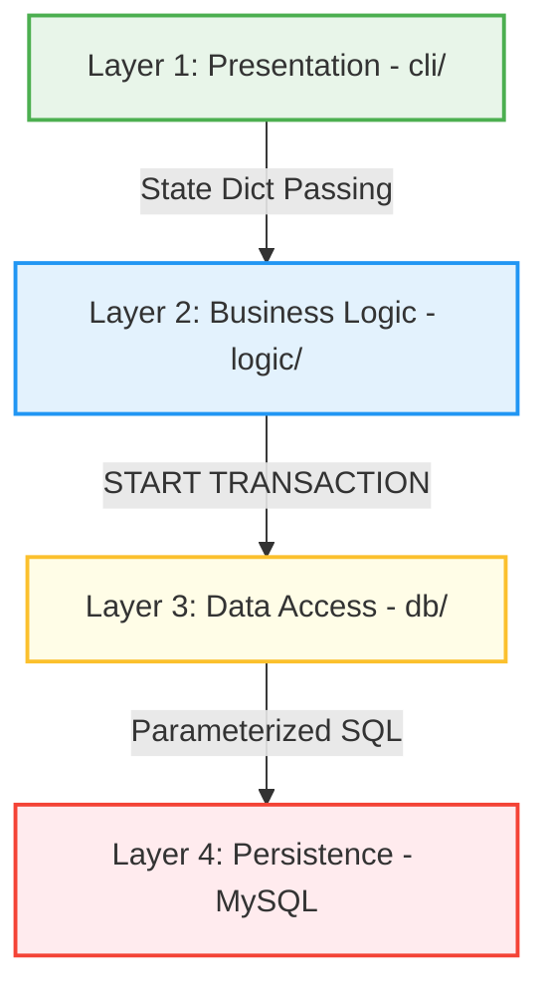

# Coding Standard — AbuCom

## Riwayat Perubahan Dokumen

| Versi | Tanggal | Perubahan | Oleh |
| :---: | :---: | --- | --- |
| **1.0** | 2026-05-25 | Inisialisasi awal penyusunan dokumen *Coding Standard* secara komprehensif. Menetapkan seluruh konvensi penamaan, prinsip pemrograman fungsional murni (FP), standar type hints, format penulisan query database, arsitektur berlapis, standar keamanan (bcrypt/JWT/RBAC), antarmuka CLI, portabilitas lintas OS, dependensi terkunci, standar testing, larangan mutlak, serta checklist kepatuhan pengkodean. | Principal Software Engineering Standards Architect & FP Code Quality Lead |

---

## 1. Informasi Dokumen

### 1.1. Tujuan Dokumen
Dokumen **Coding Standard** ini dirancang untuk mendefinisikan secara formal, rinci, dan mengikat seluruh aturan, konvensi, standardisasi penulisan kode Python, pola desain arsitektural fungsional, dan pedoman kualitas kode untuk proyek **AbuCom — Sistem Manajemen Terpadu Usaha Percetakan**. Standardisasi ini dirancang untuk mengeliminasi bug pembulatan biner, meminimalkan risiko kecurangan internal (*fraud*), menjamin portabilitas Dual-OS, serta memudahkan pemeliharaan mandiri oleh Junior Programmer di masa depan.

### 1.2. Cakupan Dokumen
Cakupan aturan dalam dokumen ini meliputi:
* Prinsip dasar penulisan kode fungsional murni (FP) Python 3.14.2+ tanpa *class* di alur bisnis utama.
* Konvensi penamaan berkas, modul, variabel, namedtuple, konstanta, dan *database mapping*.
* Standardisasi format gaya kode PEP 8, import, dan whitespace.
* Aturan penulisan dokumentasi kode (PEP 257 docstring) dan type hints (PEP 484).
* Arsitektur berlapis (4-Layer) beserta diagram, pola transaksional ACID, dan mechanism connection pool.
* Aturan penulisan query SQL terparameter aman (*parameterized queries*).
* Aturan penulisan modul keamanan (bcrypt Cost 12, stateless JWT, RBAC decorator, sanitasi input CLI, audit trail JSON, UU PDP).
* Konvensi visual presentasi CLI (`rich`, `tabulate`, navigasi sekuensial, getpass).
* Strategi portabilitas Lintas-OS (Windows 11 & Linux Debian 12).
* Pengelolaan dependensi versi terkunci, panduan unit testing, dan version control.
* Daftar larangan mutlak dan checklist kepatuhan sebelum penggabungan kode (*code merge*).

### 1.3. Posisi Dokumen dalam Siklus SDLC
Dalam siklus pengembangan sistem (*System Development Life Cycle* — SDLC) AbuCom, dokumen ini merupakan deliverable pertama pada **Fase 04 — Implementation (Fase Konstruksi)**. Dokumen ini mentransformasi rancangan logis arsitektural dan basis data dari Fase 03 menjadi instruksi pengkodean praktis bagi tim pengembang.

```
+-----------------------------------+
|     Fase 03: System Design        |
|  (Architecture, Database, Sec)    |
+-----------------------------------+
                  |
                  v
+===================================+
|   Coding Standard v1.0 [DOK]      |  <-- POSISI DELIVERABLE INI
+===================================+
                  |
                  v
+-----------------------------------+
|  Fase 04: Konstruksi Kode & Test  |
|  (logic/, db/, middleware/, cli/) |
+-----------------------------------+
```

### 1.4. Hubungan dengan Dokumen SDLC Lainnya
* **Dokumen Input (Acuan)**:
  - [Tech Stack Decision v1.1](docs/sdlc/01_planning/04_tech_stack_decision.md): SSoT untuk pembatasan Python 3.14.2+, dependensi terkunci, and portabilitas dual-OS.
  - [System Architecture v1.1](docs/sdlc/03_design/03_system_architecture.md): Blueprint 4-layer logis, modular 10-modul, database transactional retry, and data desimal.
  - [Security Design v1.1](docs/sdlc/03_design/06_security_design.md): Spesifikasi bcrypt cost 12, JWT token, RBAC matrix, audit log JSON, sanitasi CLI, and UU PDP Fernet key.
  - [BOM & HPP Design v1.1](docs/sdlc/03_design/05_bom_hpp_design.md): Referensi pseudocode pure FP untuk perhitungan matematis desimal dan sinkronisasi ATK.
* **Dokumen Output (Penerima Manfaat)**:
  - Seluruh modul kode sumber (`.py`) pada `logic/`, `db/`, `middleware/`, `cli/`, `utils/`, `config/`.
  - Berkas pengujian unit fungsional (`tests/`).

### 1.5. Audiens Target
* **Junior Programmer (Pemilik Toko)**: Sebagai panduan pembacaan dan pemeliharaan mandiri (*self-maintenance*).
* **Model AI Pengembang (Claude & Gemini)**: Sebagai instruksi mutlak untuk menggenerasikan boilerplate, middleware, dan test suite yang 100% patuh terhadap standar standar.

### 1.6. Definisi, Akronim, dan Singkatan
* **FP**: *Functional Programming* (Paradigma pemrograman fungsional murni).
* **OOP**: *Object-Oriented Programming* (Pemrograman Berorientasi Objek).
* **JWT**: *JSON Web Token* (Session token stateless terenkripsi).
* **RBAC**: *Role-Based Access Control* (Otorisasi hak akses berbasis peran).
* **ACID**: *Atomicity, Consistency, Isolation, Durability* (Integritas transaksi database).
* **UU PDP**: Undang-Undang Perlindungan Data Pribadi No. 27 Tahun 2022.

### 1.7. Tingkat Kepatuhan (Compliance Levels)
Kepatuhan terhadap dokumen standar ini dikelompokkan berdasarkan aturan RFC 2119:
* **WAJIB (MUST)**: Aturan yang tidak dapat dinegosiasikan. Ketidakpatuhan akan menggagalkan build sistem dan ditolak saat review kode.
* **DILARANG (MUST NOT)**: Praktik yang haram dilakukan. Pelanggaran memicu celah keamanan atau anomali data.
* **DIREKOMENDASIKAN (SHOULD)**: Praktik terbaik yang sangat disarankan untuk kebersihan kode. Pengecualian wajib disertai justifikasi tertulis.
* **OPSIONAL (MAY)**: Pilihan fleksibel yang diserahkan penuh kepada kenyamanan pengembang.

---

## 2. Prinsip Dasar Penulisan Kode

### 2.1. Filosofi Kode AbuCom
Filosofi kode AbuCom adalah **"Readability, Purity, and Financial Safety"**. Kode program dirancang agar mudah dipahami oleh programmer pemula, minim efek samping, dan mengutamakan integritas pembukuan kas/stok fisik toko percetakan.

### 2.2. Prinsip Functional Programming (FP) Murni
`[WAJIB]` **Penerapan FP Murni**: Seluruh logika bisnis operasional AbuCom wajib ditulis menggunakan paradigma Pemrograman Fungsional murni.
* **Justifikasi Teknis**: Menghilangkan mutasi data global (*side effects*) yang dapat memicu selisih nominal kas dan menjamin kemudahan pengujian unit.

#### 2.2.1. Fungsi Murni (Pure Functions)
`[WAJIB]` Setiap fungsi logika bisnis **MUST** berupa pure function: input parameter yang sama wajib mengembalikan output yang identik, tanpa memodifikasi variabel luar.
* **Salah (❌ OOP / Global State Mutator)**:
```python
# MELANGGAR STANDARD: Menggunakan variabel global eksternal dan mutasi langsung
stok_global = 100.0000

def potong_stok_salah(qty):
    global stok_global
    stok_global -= qty  # Efek samping! Mutasi global
    return stok_global
```
* **Benar (✅ Pure Function)**:
```python
from decimal import Decimal

# PATUH STANDARD: Menerima argumen, memproses secara deterministik, mengembalikan data baru
def potong_stok_benar(stok_saat_ini: Decimal, kuantitas_ambil: Decimal) -> Decimal:
    return (stok_saat_ini - kuantitas_ambil).quantize(Decimal('0.0001'))
```

#### 2.2.2. Imutabilitas Data (Data Immutability)
`[WAJIB]` Seluruh struktur data internal memori Python **MUST** bersifat *immutable*. Perubahan data dilakukan dengan menyalin objek baru (*new record*).
* **Salah (❌ Mutable Dictionary)**:
```python
# MELANGGAR: Dictionary bersifat mutable, nilainya dapat dirubah di tengah jalan
pelanggan = {"id": 1, "nama": "Budi", "whatsapp": "0812"}
pelanggan["whatsapp"] = "0813"  # Mutasi langsung!
```
* **Benar (✅ Immutable namedtuple)**:
```python
from collections import namedtuple

# PATUH: Objek namedtuple read-only, tidak dapat dimutasi setelah dibuat
Pelanggan = namedtuple('Pelanggan', ['id', 'nama', 'whatsapp'])
pelanggan_awal = Pelanggan(1, "Budi", "0812")
# Untuk merubah, buat salinan baru
pelanggan_baru = pelanggan_awal._replace(whatsapp="0813")
```

#### 2.2.3. Tanpa Class/OOP di Alur Bisnis Utama
`[DILARANG]` Pengembang dilarang keras mendeklarasikan kata kunci `class` atau membuat instansiasi objek OOP untuk alur bisnis utama (Modul M.1 - M.10).
* **Justifikasi Teknis**: Menjaga kesederhanaan arsitektural agar kode program mudah dipahami oleh pemilik usaha yang bertindak sebagai Junior Programmer.

#### 2.2.4. Pengelolaan State Tanpa OOP (Closures, State Dict Passing)
`[WAJIB]` Untuk memelihara sesi token login aktif, status keranjang belanja CLI, and navigasi menu, program **MUST** menggunakan pola **State Dictionary Passing** (mengalirkan kamus read-only sebagai argumen) atau **Nested Closures** (fungsi penutup leksikal).
* **Contoh State Dictionary Passing**:
```python
# State dictionary mengalir berantai sebagai argumen fungsi
session_state = {"user_id": 1, "role": "kasir", "token": "jwt_string"}

def render_kasir_menu(state: dict) -> None:
    print(f"Kasir ID: {state['user_id']} aktif.")
```

#### 2.2.5. Higher-Order Functions & Composition
`[DIREKOMENDASIKAN]` Manipulasi data koleksi (filter stok kritis, kalkulasi total audit logs) sebaiknya memanfaatkan fungsi orde tinggi bawaan Python seperti `map()`, `filter()`, dan `functools.reduce()`.

#### 2.2.6. Monad-like Error Handling (Result/Either Pattern)
`[WAJIB]` Logika bisnis **MUST NOT** melempar exception runtime yang tidak terkontrol (`try-except` abuse). Fungsi wajib mengembalikan tipe data NamedTuple `Result` berisi status kesuksesan secara eksplisit.
* **Template Result Pattern**:
```python
from collections import namedtuple
from typing import Any, Optional

Result = namedtuple('Result', ['is_success', 'data', 'error_msg'])

def hitung_insentif(poin: int) -> Result:
    if poin < 0:
        return Result(False, None, "ERR-VAL-001: Poin tidak boleh bernilai negatif.")
    nominal_komisi = poin * 1000
    return Result(True, nominal_komisi, None)
```

### 2.3. Prinsip Keamanan dalam Kode (Secure Coding)
`[WAJIB]` **Defense in Depth**: Seluruh alur input CLI disanitasi ketat, parameter query SQL wajib dibinding biner (`%s`), sandi dienkripsi bcrypt Cost 12, dan session dibatasi token JWT kedaluwarsa 8 jam. (Ref: [Security Design] Bab 2.1)

### 2.4. Prinsip Presisi Desimal (Decimal-First)
`[WAJIB]` **Decimal-First Policy**: Perhitungan nominal Rupiah, volume stok bahan desimal, suku bunga bank, dan poin insentif wajib diproses menggunakan `decimal.Decimal` presisi 4 desimal (`quantize(Decimal('0.0001'))`) dengan standard `ROUND_HALF_UP`.
* **Justifikasi Teknis**: Menolak tipe data `float` bawaan komputer yang memiliki kerentanan kehilangan akurasi biner (*floating point loss of precision*), memicu selisih kas pembukuan.

---

## 3. Konvensi Penamaan (Naming Conventions)

### 3.1. Penamaan File dan Direktori
`[WAJIB]` Nama direktori dan berkas program **MUST** menggunakan format **`snake_case`** (huruf kecil semua, dipisahkan garis bawah).
* *Contoh*: `logic/bom_hpp.py`, `middleware/rbac.py`, `db/db_connector.py`.

### 3.2. Penamaan Fungsi (snake_case)
`[WAJIB]` Nama fungsi **MUST** berupa kata kerja diikuti kata benda (`verb_noun`) dengan format **`snake_case`**.
* *Contoh*: `hitung_hpp_bom()`, `potong_stok_bahan()`, `verify_user_password()`.

### 3.3. Penamaan Variabel dan Konstanta
* `[WAJIB]` Variabel lokal dan parameter fungsi **MUST** menggunakan format **`snake_case`** yang deskriptif. (Contoh: `total_bayar`, `stok_saat_ini`).
* `[WAJIB]` Konstanta program **MUST** ditulis dengan huruf kapital penuh dipisahkan garis bawah **`UPPER_SNAKE_CASE`**. (Contoh: `BCRYPT_COST_FACTOR = 12`, `JWT_LIFETIME_SECONDS = 28800`).

### 3.4. Penamaan Parameter Fungsi
`[WAJIB]` Parameter penampung referensi database wajib dinamai `db_connection` atau `cursor`. Parameter penampung data state wajib dinamai `session_state`.

### 3.5. Penamaan NamedTuple dan Frozen Dataclass
`[WAJIB]` Tipe data NamedTuple and frozen Dataclass **MUST** menggunakan format **`PascalCase`** (huruf besar di awal kata).
* *Contoh*: `BOMItem`, `KalkulasiResult`, `SessionState`, `AuditLogEntry`.

### 3.6. Penamaan Modul dan Package
`[WAJIB]` Setiap folder package modul wajib memiliki berkas inisialisasi kosong `__init__.py` dan ditulis menggunakan format `snake_case`.

### 3.7. Konvensi Penamaan Database Entity di Kode Python
`[WAJIB]` Nama variabel penampung baris basis data di Python wajib diselaraskan 100% dengan nama kolom fisik database MySQL (Ref: [Database Schema] Bagian 2).
* *Contoh*: Kolom `failed_login_attempts` di MySQL harus terikat dengan variabel `failed_login_attempts` di Python, bukan `salah_login` atau `attempts`.

### 3.8. Tabel Ringkasan Konvensi Penamaan

| Entitas Kode | Aturan Format | Contoh Benar (✅) | Contoh Salah (❌) |
| --- | --- | --- | --- |
| **Direktori/Berkas** | `snake_case` | `logic/bom_hpp.py` | `logic/BOM-HPP.py` |
| **Fungsi** | `snake_case` (verb_noun) | `hitung_gaji_bersih()` | `SmartPayroll()` |
| **Variabel/Parameter** | `snake_case` | `sisa_utang_kasbon` | `SisaUtang` |
| **Konstanta** | `UPPER_SNAKE_CASE` | `JWT_SECRET_KEY` | `jwtSecretKey` |
| **NamedTuple** | `PascalCase` | `TransactionRecord` | `transaction_record` |
| **Database Column** | `snake_case` (sesuai DDL) | `failed_login_attempts` | `failedAttempts` |

---

## 4. Struktur Direktori Proyek

### 4.1. Layout Direktori Standar
Layout fisik proyek AbuCom wajib diorganisasikan secara modular untuk mendukung arsitektur berlapis:
```
abucom/
│
├── main.py                     # Entry point peluncuran aplikasi CLI
├── requirements.txt            # Dependensi library versi terkunci
├── .env.example                # Templat konfigurasi rahasia program
│
├── cli/                        # LAYER 1: PRESENTATION (Visual & Menus)
│   ├── __init__.py
│   ├── dashboard.py            # Menus dashboard harian per role
│   ├── menu_transaksi.py       # Interaksi Modul M.1
│   ├── menu_inventaris.py      # Interaksi Modul M.2
│   ├── menu_ppob_service.py    # Interaksi Modul M.3
│   └── menu_sdm_finansial.py   # Interaksi Modul M.4 & M.6
│
├── logic/                      # LAYER 2: BUSINESS LOGIC (Pure FP Python)
│   ├── __init__.py
│   ├── bom_hpp.py              # Logika kalkulasi HPP desimal (M.2)
│   ├── smart_payroll.py        # Logika payroll & komisi poin (M.4)
│   ├── financial_engine.py     # Logika pinjaman & laba rugi (M.6)
│   └── safety_validator.py     # Logika sanitasi input & checks
│
├── db/                         # LAYER 3: DATA ACCESS (SQL Engine)
│   ├── __init__.py
│   ├── db_connector.py         # Connection pooling & base connection
│   └── query_builder.py        # Parameterized transactional wrappers
│
├── middleware/                 # CROSS-CUTTING CONCERNS (Sec & Log)
│   ├── __init__.py
│   ├── auth_jwt.py             # Security logic otentikasi & JWT Sesi
│   ├── rbac_guard.py           # Otorisasi Level Menu & Action Guard
│   └── audit_logger.py         # Perekaman kronologis database JSON
│
├── utils/                      # PUSTAKA UTAS (Helper Functions)
│   ├── __init__.py
│   ├── crypto.py               # helper bcrypt password hash
│   ├── backup.py               # Utilitas backup zip AES-256
│   └── text_formatter.py       # Formatting thermal struk & rich tables
│
├── exports/                    # DIREKTORI KELUARAN FILE LOKAL
│   ├── backups/                # Hasil backup database .zip terenkripsi
│   ├── designs/                # mockup file PDF desain pelanggan
│   └── receipts/               # Berkas cetak nota struk .txt
│
└── tests/                      # AUTOMATED UNIT & INTEGRATION TESTING
    ├── __init__.py
    ├── test_bom_hpp.py         # Unit testing pure functions kalkulasi
    └── test_rbac_security.py   # Integration testing otorisasi RBAC
```

### 4.2. Penjelasan Setiap Direktori dan File
* `cli/`: Mengelola visualisasi antarmuka terminal `rich` dan parsing masukan keyboard. Layer ini diperbolehkan memiliki efek samping I/O (`print` / `input`).
* `logic/`: Pusat perhitungan matematika keuangan AbuCom. **MUST** berisi 100% pure functions tanpa I/O side effects, tanpa class, dan imutabel.
* `db/`: Menampung utilitas inisialisasi koneksi MySQL LAN lokal dan eksekusi ACID transaction block.
* `middleware/`: Melakukan pemadatan aspek keamanan global (otentikasi, JWT, suspensi rate limit, guard RBAC, dan audit trail).

### 4.3. Aturan Penempatan File Baru
`[WAJIB]` Setiap berkas program baru **MUST** ditempatkan secara disiplin pada sub-direktori layer penanggung jawabnya. Dilarang keras menaruh berkas logika perhitungan keuangan langsung pada folder root (`abucom/`) atau folder presentasi (`cli/`).

---

## 5. Standar Format dan Gaya Kode (Code Style)

### 5.1. Kepatuhan PEP 8
`[WAJIB]` Seluruh penulisan kode program Python wajib mematuhi panduan gaya penulisan **PEP 8** standard industri.

### 5.2. Indentasi dan Spasi
* `[WAJIB]` Indentasi kode program **MUST** menggunakan **4 spasi**, dilarang menggunakan karakter Tab (`\t`).
* `[WAJIB]` Berikan jarak **2 baris kosong** di antara definisi fungsi tingkat atas (*top-level function*).

### 5.3. Panjang Baris Maksimum
`[WAJIB]` Batas panjang karakter baris kode program **MUST NOT** melebihi **120 karakter** untuk menjamin keterbacaan pada mode side-by-side split screen IDE.

### 5.4. Penggunaan Import
#### 5.4.1. Urutan Import
`[WAJIB]` Struktur baris impor pustaka di bagian atas file program wajib diurutkan secara tertib:
1. Pustaka Standard Python (*Standard Library*).
2. Pustaka Pihak Ketiga (*Third-Party Library*).
3. Pustaka Lokal Modul Proyek (*Local Modules*).
* *Contoh*:
```python
# 1. Standard Library
import os
from decimal import Decimal

# 2. Third-Party
import jwt

# 3. Local Modules
from logic.bom_hpp import hitung_hpp_bom
```

#### 5.4.2. Larangan Wildcard Import
`[DILARANG]` Dilarang keras menggunakan wildcard import format `from module import *` karena mengotori ruang lingkup namespace dan menyulitkan pelacakan dependensi oleh Junior Programmer.

### 5.5. Penggunaan String
* `[WAJIB]` Gunakan **single quote (`'`)** secara konsisten untuk string internal kode (kunci dictionary, query, parameter).
* `[WAJIB]` Gunakan **double quote (`"`)** khusus untuk teks yang dirender ke layar pengguna (visual CLI) dan penulisan docstring.
* `[WAJIB]` Pemanfaatan *f-string* (`f"text {var}"`) **MUST** hanya untuk output display CLI, **DILARANG KERAS** memanfaatkannya untuk menyusun instruksi SQL.

### 5.6. Penggunaan Komentar dan Whitespace
`[DIREKOMENDASIKAN]` Berikan satu spasi di sekitar operator biner (`=`, `+`, `-`, `*`, `/`). Tambahkan komentar singkat ber-spasi untuk memperjelas alur kalkulasi rumit.

---

## 6. Standar Dokumentasi Kode (Docstrings & Comments)

### 6.1. Format Docstring Fungsi (PEP 257)
`[WAJIB]` Setiap fungsi publik atau modul utama wajib dilengkapi dokumentasi **docstring multi-baris** dengan mematuhi gaya penulisan **PEP 257** Google Style.

### 6.2. Template Docstring Standar AbuCom
Struktur docstring standard AbuCom wajib mendefinisikan kegunaan, argumen input beserta tipe data, pengembalian output, kemungkinan exception, and contoh penggunaan:
```python
def hitung_gross_margin(harga_jual: Decimal, hpp: Decimal) -> Decimal:
    """Mengalkulasi persentase margin keuntungan kotor per unit produk.

    (Ref: Tech Stack Decision Bab 2.2 - Presisi Keuangan)

    Args:
        harga_jual (Decimal): Tarif harga yang dibebankan kepada pelanggan.
        hpp (Decimal): Akumulasi nilai Harga Pokok Penjualan berbasis BOM.

    Returns:
        Decimal: Nilai persentase margin keuntungan kotor (contoh: 25.5000).

    Raises:
        ValueError: Jika nominal harga_jual bernilai nol (mencegah ZeroDivisionError).

    Example:
        >>> hitung_gross_margin(Decimal('10000'), Decimal('7500'))
        Decimal('25.0000')
    """
    if harga_jual == Decimal('0.0000'):
        raise ValueError("Harga jual tidak boleh bernilai nol untuk menghitung margin.")
    margin = ((harga_jual - hpp) / harga_jual) * 100
    return margin.quantize(Decimal('0.0001'))
```

### 6.3. Komentar Inline
`[DIREKOMENDASIKAN]` Komentar baris tunggal diletakkan di atas baris kode target dengan pemisah tanda pagar diikuti satu spasi (`# Comment`).

### 6.4. Header File / Module Docstring
`[WAJIB]` Setiap file modul `.py` baru **MUST** memiliki header metadata di baris teratas mendefinisikan tujuan modul dan kontributor (Ref: [System Architecture] Bab 1.4).

### 6.5. Penulisan TODO dan FIXME
* `[WAJIB]` Gunakan format `# TODO: [Tugas]` untuk menandai implementasi fitur yang ditangguhkan.
* `[WAJIB]` Gunakan format `# FIXME: [Masalah]` untuk menandai bug terdeteksi yang butuh perbaikan cepat.

---

## 7. Standar Type Hints (PEP 484)

### 7.1. Kewajiban Type Hints pada Semua Fungsi Publik
`[WAJIB]` Seluruh deklarasi fungsi publik di sisi program **MUST** memiliki anotasi tipe data argumen input and tipe data pengembalian output secara lengkap (*PEP 484 Type Hints*).
* **Justifikasi Teknis**: Memberikan validasi statis sintaksis bagi IDE and mempermudah model AI asisten pendeteksi *type mismatch error*.

### 7.2. Penggunaan Modul `typing`
`[WAJIB]` Gunakan modul standar `typing` untuk mendefinisikan tipe data komposit seperti `Optional`, `Union`, `Callable`, `Tuple`, `List`, dan `Dict`.

### 7.3. Type Hints untuk Decimal, NamedTuple, dan Koleksi
* Variabel nominal keuangan wajib bertipe `Decimal`.
* Variabel data record imutabel wajib dianotasikan dengan kelas NamedTuple penampungnya.
* *Contoh*: `komponen_list: list[BOMItem]`.

### 7.4. Contoh Implementasi Type Hints Standar
```python
from decimal import Decimal
from collections import namedtuple
from typing import Optional

BOMItem = namedtuple('BOMItem', ['nama_bahan', 'qty', 'harga_beli'])
KalkulasiResult = namedtuple('KalkulasiResult', ['hpp_total', 'status_valid'])

def proses_kalkulasi_hpp(
    barang_id: int, 
    komponen: list[BOMItem], 
    diskon_rate: Optional[Decimal] = None
) -> KalkulasiResult:
    total_hpp = sum((item.qty * item.harga_beli for item in komponen), Decimal('0.0000'))
    if diskon_rate:
        total_hpp -= total_hpp * diskon_rate
    return KalkulasiResult(total_hpp.quantize(Decimal('0.0001')), True)
```

---

## 8. Arsitektur Kode dan Pola Desain Fungsional

### 8.1. Arsitektur Berlapis 4-Layer
Sistem memisahkan kode program secara biner menjadi 4 lapis. Diagram alur logis arsitektur 4-layer (Ref: [System Architecture] Bab 4.2):



### 8.2. Aturan Dependensi Antar-Layer
`[WAJIB]` Aliran pemanggilan fungsi **MUST** berjalan satu arah atas ke bawah:
`cli/` &rarr; `logic/` &rarr; `db/` &rarr; `MySQL`.
* `[DILARANG]` Fungsi di layer bawah (`logic/` atau `db/`) mengimpor berkas atau memanggil fungsi visual dari layer presentasi (`cli/`).

### 8.3. Pola Pure Functions & Immutability
`[WAJIB]` Semua struktur data bisnis dibungkus NamedTuple. 

#### Boilerplate NamedTuple Standar
```python
from collections import namedtuple
# Template standar data imutabel
BOMItem = namedtuple('BOMItem', ['bahan_baku_id', 'qty_pemakaian', 'harga_beli'])
```

### 8.4. Pola State Dictionary Passing
`[WAJIB]` Layar menu CLI melacak data login staf aktif tanpa OOP. Sesi wajib dialirkan sebagai parameter `session_state` format dict:
```python
# Template Sesi CLI State
session_state = {
    'user_id': 3,
    'username': 'kasir_andi',
    'role': 'kasir',
    'token': 'jwt_string_token',
    'cabang_id': 1
}
```

### 8.5. Pola Nested Closures
`[DIREKOMENDASIKAN]` Pola nested closures digunakan untuk melacak riwayat breadcrumb navigasi menu internal terminal secara fungsional.
```python
def make_navigation(current_path: str):
    def add_subpath(subpath: str) -> str:
        return f"{current_path} > {subpath}"
    return add_subpath
```

### 8.6. Pola Higher-Order Functions & Composition
`[DIREKOMENDASIKAN]` Menggabungkan beberapa fungsi murni pemrosesan keuangan menggunakan komposisi fungsional terarah.

### 8.7. Pola Error Handling Fungsional (Result Pattern)
`[WAJIB]` Mengembalikan NamedTuple `Result` untuk menangani kegagalan operasional alur bisnis.

### 8.8. Pola Transaction Wrapper ACID
`[WAJIB]` Seluruh pembaruan multi-tabel (misal update stok di M.2 dan update transaksi lunas di M.1) **MUST** dibungkus dalam blok ACID transaksional InnoDB terisolasi (Ref: [System Architecture] Bab 6.3).

#### Template Boilerplate Transaksional ACID
```python
from collections import namedtuple
from typing import Callable, list

Result = namedtuple('Result', ['is_success', 'data', 'error_msg'])

def execute_acid_transaction(db_connection, operations: list[Callable[[Any], Any]]) -> Result:
    """Boilerplate wrapper fungsional untuk menjamin integritas transaksi ACID."""
    cursor = db_connection.cursor()
    try:
        db_connection.start_transaction()
        results = []
        for op in operations:
            res = op(cursor)  # Eksekusi fungsi operasi terparameter
            results.append(res)
        db_connection.commit()
        return Result(True, results, None)
    except Exception as e:
        db_connection.rollback()
        return Result(False, None, f"ERR-DB-TX: Transaksi dibatalkan secara aman. Detail: {str(e)}")
```

### 8.9. Pola Connection Pooling & Retry Mechanism
`[WAJIB]` Untuk memitigasi gangguan switch jaringan LAN toko, modul database **MUST** mengimplementasikan pooling connection driver (`pool_size=5`) dan percobaan ulang otomatis (*retry with exponential backoff*). (Ref: [System Architecture] Bab 6.2)

---

## 9. Standar Penulisan Kode Database (SQL & Data Access)

### 9.1. Wajib Parameterized Queries (`%s` Bindings)
`[WAJIB]` Seluruh pemicuan query dinamis SQL **MUST** menggunakan placeholder bind resmi `%s` bawaan driver MySQL.
* **Justifikasi Teknis**: Mengeliminasi 100% risiko eksploitasi peretasan basis data melalui teknik SQL Injection dari terminal kasir (Ref: [Security Design] Bab 3.4).

### 9.2. Pelarangan Mutlak F-string / String Formatting untuk SQL
`[DILARANG]` Dilarang keras menggabungkan variabel program ke instruksi query SQL menggunakan *f-string*, operator format `%`, atau fungsi `.format()`.
* **Salah (❌ SQL Injection Risk)**:
```python
# MELANGGAR: Variabel digabung langsung ke string query, celah SQL Injection!
query = f"SELECT * FROM pengguna WHERE username = '{username_input}'"
cursor.execute(query)
```
* **Benar (✅ Parameterized Query)**:
```python
# PATUH: Query statis dengan placeholder %s, variabel dilempar terpisah sebagai tuple
query = "SELECT * FROM pengguna WHERE username = %s"
cursor.execute(query, (username_input,))
```

### 9.3. Konvensi Penulisan Query SQL di Python
`[WAJIB]` Kata kunci perintah SQL dasar (seperti `SELECT`, `FROM`, `WHERE`, `INSERT`, `UPDATE`, `DELETE`, `JOIN`) **MUST** ditulis dengan huruf kapital penuh (*UPPERCASE*). Penulisan query multi-baris harus diindentasikan secara teratur.

### 9.4. Penggunaan `cursor.execute()` dan `cursor.executemany()`
* `cursor.execute()`: Digunakan untuk query tunggal transaksional.
* `cursor.executemany()`: **WAJIB** digunakan saat melakukan inisialisasi impor data massal dari file CSV (Modul M.2) guna mengefisienkan waktu pemrosesan database.

### 9.5. Penanganan Koneksi Database (Connection Pooling)
`[WAJIB]` Inisialisasi basis data menggunakan pool bawaan driver:
`db_pool = mysql.connector.pooling.MySQLConnectionPool(pool_name="abupool", pool_size=5, ...)`

### 9.6. Penanganan Error Database (Retry & Rollback)
`[WAJIB]` Tangkap kode error `2006` (*MySQL server has gone away*) atau `2013` (*Lost connection during query*), jalankan percobaan ulang koneksi 3 kali secara exponential backoff sebelum program dibekukan aman.

### 9.7. Standar Tipe Data `DECIMAL(15,4)` dan Mapping Python `decimal.Decimal`
`[WAJIB]` Seluruh pemetaan data numerik presisi **MUST** disinkronkan:
MySQL `DECIMAL(15,4)` &harr; Python `decimal.Decimal('0.0000')`.

---

## 10. Standar Penulisan Kode Keamanan (Secure Coding Standard)

### 10.1. Aturan Pengelolaan Kredensial (`.env` & `python-dotenv`)
* `[WAJIB]` Kredensial sensitif (sandi database, secret key JWT, Fernet key UU PDP) **MUST** disimpan di berkas `.env` lokal, dilarang keras di-hardcode ke file Python.
* `[WAJIB]` Berkas `.env` **MUST** masuk ke berkas `.gitignore`. Sediakan berkas `.env.example` kosong sebagai templat.
* `[WAJIB]` Skrip validator otomatis wajib mengecek kelengkapan `.env` saat startup aplikasi. Jika tidak ada, startup batal dengan kode `ERR-FILE-001`. (Ref: [Security Design] Bab 6.5)

### 10.2. Aturan Enkripsi Sandi (`bcrypt` Cost Factor 12)
`[WAJIB]` Enkripsi sandi staf baru menggunakan dynamic salt Blowfish bcrypt dengan cost factor = 12. Verifikasi sandi login kasir menggunakan checkpw bawaan. (Ref: [Security Design] Bab 4.1)
```python
import bcrypt

def hash_user_password(password_polos: str) -> str:
    """Mengenkripsi sandi satu arah menggunakan bcrypt Cost Factor 12."""
    salt = bcrypt.gensalt(rounds=12)
    hashed = bcrypt.hashpw(password_polos.encode('utf-8'), salt)
    return hashed.decode('utf-8')

def verify_user_password(password_polos: str, password_hash: str) -> bool:
    """Memverifikasi kecocokan sandi terhadap hash database."""
    return bcrypt.checkpw(password_polos.encode('utf-8'), password_hash.encode('utf-8'))
```

### 10.3. Aturan Sesi JWT HS256 (Masa Aktif 8 Jam)
`[WAJIB]` Token JWT ditandatangani dengan algoritma HS256 terikat secret key `.env`. Masa berlaku kedaluwarsa dibatasi maksimal 28.800 detik (8 jam biner). Deteksi kedaluwarsa signature wajib memicu pembersihan sesi dan redirect paksa ke layar login kosong. (Ref: [Security Design] Bab 4.2)

### 10.4. Aturan Implementasi RBAC (Guard/Decorator Fungsional)
`[WAJIB]` Batasi pemanggilan fungsi operasional bisnis menggunakan guard fungsional pembungkus `check_permission()` untuk memvalidasi peran JWT staf terhadap matriks otorisasi (Ref: [Security Design] Bab 5.3).
```python
def check_permission(menu_id: str, active_role: str) -> bool:
    """Validator biner hak akses menu CLI AbuCom."""
    # Matriks Otorisasi Sederhana
    RBAC_MATRIX = {
        'pemilik': ['MENU-M1-001', 'MENU-M4-002', 'MENU-M7-002', 'MENU-M2-010'],
        'kasir': ['MENU-M1-001', 'MENU-M1-003', 'MENU-M7-003'],
        'gudang': ['MENU-M2-001', 'MENU-M2-005', 'MENU-M2-009']
    }
    return menu_id in RBAC_MATRIX.get(active_role, [])
```

### 10.5. Aturan Sanitasi Input CLI
`[WAJIB]` Bersihkan ketikan masukan dari keyboard CLI dengan membuang karakter kontrol biner di bawah byte `\x20` (seperti `\x1b` ANSI escape) untuk mencegah perusakan visual terminal. (Ref: [Security Design] Bab 6.4)

### 10.6. Aturan Audit Trail Logging
`[WAJIB]` Setiap aksi modifikasi data sensitif (update stok manual di M.2, input pengeluaran M.6, status login failed) **MUST** secara otomatis memicu penulisan baris baru ke tabel `audit_logs` MySQL dengan merekam state data sebelum (`old_value`) dan sesudah (`new_value`) perubahan dalam format JSON string terstruktur. (Ref: [Security Design] Bab 7.1)

### 10.7. Aturan Proteksi Data Pribadi (UU PDP Compliance)
`[WAJIB]` Untuk mematuhi UU PDP No. 27/2022, kolom nomor WhatsApp pelanggan pada tabel `pelanggan` **MUST** dienkripsi secara reversible di memori Python menggunakan algoritma simetris `cryptography.fernet` dengan kunci Fernet 32-byte dari berkas `.env` sebelum dikirim ke database MySQL. (Ref: [Security Design] Bab 6.1)

---

## 11. Standar Penulisan Kode CLI (Presentation Layer)

### 11.1. Konvensi Visual `rich` (Panels, Colors, Progress Bars)
* `[WAJIB]` Gunakan panel visual `rich` format box double line (`═══`) untuk header menu.
* `[WAJIB]` Gunakan warna ANSI standard kontras: Hijau (Sukses/Lunas), Merah (Ditolak/Error), Kuning (Alert/Warning/Stock Minus/Belum Lunas), Biru (Panduan/Breadcrumb).
* `[WAJIB]` Gunakan console fallback fungsional untuk mendeteksi kapabilitas render ANSI warna terminal kasir.

### 11.2. Konvensi Tabel `tabulate`
`[WAJIB]` Penyajian visual mutasi kas, stok barang, and data laporan laba rugi **MUST** menggunakan layout tabular terformat rapi bawaan library `tabulate`.

### 11.3. Konvensi Navigasi Menu (Hotkey, Breadcrumb, Back/Exit)
* `[WAJIB]` Tombol `0` secara konsisten di setiap layar menu berfungsi untuk kembali ke sub-menu di atasnya (*back*).
* `[WAJIB]` Sediakan penunjuk breadcrumb di baris teratas console (Contoh: `Dashboard > M.1 Transaksi > Nota Lunas`).

### 11.4. Konvensi Input Password (`getpass`)
`[WAJIB]` Penginputan password akun atau sandi supervisor pemilik untuk eskalasi retur/opname **MUST** ditangkap menggunakan modul standar `getpass` Python (karakter sandi tidak dimunculkan di layar laci kasir).

### 11.5. Konvensi Pesan Error Visual (`ERR-XXX-YYY`)
`[WAJIB]` Tampilkan kegagalan sistem di baris terbawah dengan warna merah ANSI tebal ber-format:
`⛔ ERR-[KATEGORI]-[NOMOR]: [Pesan deskriptif fungsional bahasa Indonesia]`.
* *Contoh*: `⛔ ERR-STOCK-010: Ketersediaan persediaan barang di database tidak mencukupi!`

### 11.6. Konvensi Pembersihan Layar Terminal (Cross-OS)
`[WAJIB]` Fungsi pembersih terminal console wajib mendeteksi sistem operasi secara dinamis menggunakan platform runtime Python (Ref: [System Architecture] Bab 3.4).
```python
import platform
import os

def clear_terminal() -> None:
    """Membersihkan layar terminal console secara lintas OS."""
    os.system('cls' if platform.system() == 'Windows' else 'clear')
```

### 11.7. Konvensi Encoding UTF-8 Eksplisit
`[WAJIB]` Setiap operasi membuka/menulis berkas lokal (struk nota `.txt`, arsip desain) wajib mendeklarasikan encoding secara eksplisit: `open(file, 'w', encoding='utf-8')`.

---

## 12. Standar Portabilitas Lintas OS (Cross-OS Compatibility)

### 12.1. Penggunaan `pathlib` untuk Path Management
`[WAJIB]` Seluruh pengelolaan path berkas dan folder **MUST** memanfaatkan modul standard `pathlib` dengan operator pembagi `/`. Dilarang keras men-hardcode separator path slash (`/`) atau backslash (`\`).
* **Salah (❌ Hardcoded Windows Separator)**:
```python
# MELANGGAR: Hardcoded path windows, program akan crash saat di server Linux Debian
file_path = "exports\\backups\\db_dump.sql"
```
* **Benar (✅ Cross-OS pathlib Path)**:
```python
from pathlib import Path
# PATUH: Menggunakan pathlib, kompatibel 100% lintas OS target
folder_backup = Path('exports') / 'backups' / 'db_dump.sql'
```

### 12.2. Penggunaan `platform.system()` untuk Deteksi OS
`[WAJIB]` Penentuan perintah shell khusus (seperti pencetakan thermal mentah via COM1/USB001 Windows kasir) wajib dipisahkan logis menggunakan pemeriksaan `platform.system() == 'Windows'`.

### 12.3. Penggunaan Encoding `utf-8` Eksplisit
`[WAJIB]` Pembacaan berkas konfigurasi lokal wajib menggunakan encoding `'utf-8'` eksplisit untuk memitigasi anomali perbedaan default encoding Windows (CP1252) dan Linux (UTF-8).

### 12.4. Larangan Hardcode Path Separator
`[DILARANG]` Larangan mutlak menuliskan karakter pemisah path direktori secara statis di dalam string program.

---

## 13. Standar Pengelolaan Dependensi

### 13.1. File `requirements.txt` dengan Versi Terkunci
`[WAJIB]` Seluruh dependensi eksternal wajib dikunci versinya secara rigid (*pin exact version*) menggunakan syntax ganda `==` pada satu berkas `requirements.txt`.

### 13.2. Daftar Dependensi Wajib (Mandatory)
Pustaka luar mandatory yang berlisensi aman industri (Ref: [Tech Stack Decision] Bab 5.7):
* `mysql-connector-python==8.4.0` (Driver basis data resmi MySQL Oracle).
* `python-dotenv==1.0.1` (Pemisah kredensial aman berkas `.env`).
* `bcrypt==4.1.0` (Enkripsi hashing kata sandi Blowfish).
* `pyjwt==2.8.0` (Otentikasi token stateless session CLI).

### 13.3. Daftar Dependensi Rekomendasi
Pustaka luar visual pendukung estetika terminal kasir:
* `rich==13.7.0` (Pewarnaan visual ANSI & panel CLI).
* `tabulate==0.9.0` (Pemformatan grid tabel terminal).

### 13.4. Daftar Pustaka Standard Library yang Dimanfaatkan
Modul standard Python bawaan runtime yang wajib dioptimalkan:
* `decimal` (Akurasi fixed-point komputasi desimal).
* `functools`, `itertools`, `operator` (Dukungan Higher-Order Functions).
* `pathlib` (Portabilitas manajemen file path).
* `json` (Serialisasi data trail audit log).
* `csv` (Utility bulk data import).
* `datetime` (Timestamp transaksi & payroll).
* `typing` (Anotasi type hints).
* `getpass` (Masking ketikan sandi terminal).

### 13.5. Aturan Penambahan Dependensi Baru
`[WAJIB]` Pengembang dilarang memasang library luar baru tanpa justifikasi teknis tertulis dan wajib memperoleh persetujuan pemilik usaha guna menghindari risiko membengkaknya overhead runtime server lokal.

---

## 14. Standar Pengujian (Testing Standards)

### 14.1. Framework Testing (`unittest` / `pytest`)
`[WAJIB]` Penulisan skenario uji otomatis wajib menggunakan modul standar `unittest` bawaan Python atau `pytest`.

### 14.2. Target Code Coverage (≥ 90% Logika Bisnis)
`[WAJIB]` Kerapatan jangkauan pengujian unit (*Code Coverage*) **MUST** menjangkau minimal **90%** baris instruksi logika bisnis utama di folder `logic/` (terutama modul HPP BOM desimal, Smart Payroll, dan depresiasi aset).

### 14.3. Konvensi Penamaan Test File dan Test Function
* Berkas pengujian wajib dinamai `test_<modul_target>.py` di folder `tests/`.
* Fungsi pengujian wajib dinamai `test_<behavior_spesifik>()`. (Contoh: `test_kalkulasi_hpp_stempel_flash_sukses()`).

### 14.4. Aturan Unit Testing Pure Functions
`[WAJIB]` Unit testing pure functions **MUST** bersifat deterministik, terisolasi penuh, and **DILARANG** melakukan koneksi fisik database MySQL lokal atau file system. Uji data disuplai melalui mock namedtuples.

### 14.5. Aturan Integration Testing Database
`[WAJIB]` Pengujian modul database wajib berjalan pada database bayangan/skema pengujian khusus (`abucom_test_db`) and wajib meng-commit rollback data setelah uji diselesaikan agar database master tetap bersih.

### 14.6. Aturan Integration Testing Keamanan
`[DIREKOMENDASIKAN]` Susun skenario uji otomatis untuk memverifikasi penolakan menu RBAC bagi staf non-pemilik, kegagalan rate limit lockout brute-force, dan token signature JWT yang kedaluwarsa.

---

## 15. Standar Version Control (Git)

### 15.1. Strategi Branching (Feature Branching)
`[WAJIB]` Sistem mengadopsi model percabangan **Feature Branching**. Branch utama `main` dikunci steril. Seluruh fitur dikonstruksi pada branch terpisah.

### 15.2. Konvensi Penamaan Branch
`[WAJIB]` Penamaan branch fitur wajib diawali prefix yang terstandardisasi:
* `feature/<nama-modul>`: Penambahan fungsionalitas baru. (Contoh: `feature/modul-stok`).
* `bugfix/<deskripsi-bug>`: Perbaikan kesalahan program. (Contoh: `bugfix/selisih-grosir`).

### 15.3. Konvensi Commit Message
`[WAJIB]` Baris pesan commit wajib informatif menggunakan bahasa Indonesia profesional dengan format semantic prefix:
`<tipe-commit>: <Deskripsi singkat perubahan>`
* `feat`: Fitur baru. (Contoh: `feat: implementasi fungsi hitung HPP BOM desimal`).
* `fix`: Perbaikan bug. (Contoh: `fix: pembulatan desimal gaji kasbon UMR`).
* `docs`: Pembaruan dokumentasi. (Contoh: `docs: update header modul rbac`).

### 15.4. Aturan `.gitignore`
`[WAJIB]` Berkas `.gitignore` wajib mengecualikan file berikut dari repositori Git:
* Berkas kredensial rahasia: `.env`.
* Berkas cache program: `__pycache__/`, `*.pyc`, `.pytest_cache/`.
* Berkas backup & log lokal: `exports/backups/`, `exports/receipts/`.

### 15.5. Aturan Code Review
`[WAJIB]` Sebelum branch fitur digabungkan (*merged*) ke branch utama `main`, Junior Programmer wajib memicu Gemini 3 Flash selaku asisten reviewer kode otomatis untuk mengecek kepatuhan sintaksis terhadap Coding Standard ini.

---

## 16. Daftar Larangan Mutlak (Prohibited Practices)

Praktik-praktik berikut **DILARANG KERAS (MUST NOT)** diimplementasikan di dalam codebase program AbuCom:

| No | Praktik yang DILARANG MUTLAK | Dampak Negatif Kritis | Solusi / Standar yang Benar |
| --- | --- | --- | --- |
| 1 | Penggunaan `class` & OOP di alur bisnis | Kode kompleks, learning curve tinggi bagi pemilik | Wajib murni `def` functions & `namedtuple`. |
| 2 | Penggunaan data `float` untuk hitung uang | Terjadinya selisih pembulatan biner modal kas | Wajib menggunakan `decimal.Decimal` presisi 4 desimal. |
| 3 | Penyusunan SQL Query via *f-string* | Celah keamanan fatal eksploitasi SQL Injection | Wajib menggunakan parameterized query placeholders `%s`. |
| 4 | Penggunaan wildcard import (`from x import *`)| Korupsi namespace, debugging dependensi sulit | Wajib mengimpor modul secara eksplisit satu per satu. |
| 5 | Hardcoding kredensial di file program | Kebocoran data sensitif ke repositori publik Git | Wajib memisahkan rahasia ke berkas lokal `.env`. |
| 6 | Hardcoding OS separator (`/` atau `\`) | Program crash saat dideploy Dual-OS lintas klien | Wajib menggunakan operator pembagi `/` di `pathlib`. |
| 7 | Mengabaikan type hints fungsi publik | IDE tidak dapat memvalidasi statis sintaksis | Wajib mendeklarasikan anotasi typehints PEP 484 lengkap. |
| 8 | Pelemparan *exception* tak terkontrol | Sistem CLI crash mendadak di hadapan kasir | Wajib menggunakan fungsional Result / Either NamedTuple. |
| 9 | Penyimpanan data nomor WA CRM polos | Pelanggaran regulasi privasi konsumen UU PDP | Wajib enkripsi dua arah lokal via `cryptography.fernet`. |
| 10| Mutasi variabel global dari fungsi logic| State program tidak deterministik, memory leaks | Wajib mengembalikan objek salinan baru (Immutability). |

---

## 17. Checklist Kepatuhan Coding Standard

Developer wajib memastikan checklist self-review berikut bernilai **YA** sebelum melakukan pemicuan merger branch fitur:

- [ ] **1.** Apakah seluruh logika bisnis di folder `logic/` terbebas dari penggunaan kata kunci `class` (murni fungsional)?
- [ ] **2.** Apakah semua fungsi publik memiliki anotasi Type Hints (PEP 484) dan docstrings PEP 257 yang lengkap dengan format Args/Returns/Raises?
- [ ] **3.** Apakah seluruh komputasi nominal uang Rupiah dan volume stok bahan desimal diproses menggunakan `decimal.Decimal`?
- [ ] **4.** Apakah seluruh query database MySQL menggunakan parameterized placeholders `%s` dan terbebas dari penggabungan string f-string SQL?
- [ ] **5.** Apakah operasi perubahan data multi-tabel dibungkus di dalam blok transaksi transaksional ACID yang aman (commit/rollback)?
- [ ] **6.** Apakah file konfigurasi rahasia program dipisahkan ke berkas `.env` dan berkas `.env` tersebut sudah dikecualikan di `.gitignore`?
- [ ] **7.** Apakah penautan path berkas lokal dikelola menggunakan modul `pathlib` secara aman lintas Dual-OS (Windows & Linux)?
- [ ] **8.** Apakah modul CLI presentasi menggunakan warna ANSI kontras standard `rich` and tabel tabular rapi `tabulate`?
- [ ] **9.** Apakah kode program berjalan lancar di terminal Windows 11 Klien (CMD chcp 65001) maupun server Linux Debian 12 tanpa modifikasi berkas?
- [ ] **10.** Apakah seluruh dependensi library yang digunakan dicatatkan versinya secara terkunci di berkas `requirements.txt`?
- [ ] **11.** Apakah cakupan pengujian unit (*Code Coverage*) otomatis minimal sudah mencakup 90% dari keseluruhan baris logika bisnis?
- [ ] **12.** Apakah data pribadi WhatsApp CRM pelanggan dilindungi enkripsi reversible Fernet sebelum dikirim ke database untuk kepatuhan UU PDP?

---

## 18. Referensi Dokumen

Berikut adalah daftar dokumen referensi formal yang digunakan sebagai dasar penyusunan spesifikasi teknis Coding Standard ini:

| No | Nama Dokumen Referensi | Path Relatif File | Versi | Prioritas | Peran dalam Penyusunan |
| :---: | --- | --- | :---: | :---: | --- |
| 1 | **Tech Stack Decision** | `docs/sdlc/01_planning/04_tech_stack_decision.md` | v1.1 | **PRIMER** | Acuan wajib batasan Python 3.14.2+, standard library, dependensi versi terkunci, and portabilitas Dual-OS. |
| 2 | **System Architecture** | `docs/sdlc/03_design/03_system_architecture.md` | v1.1 | **PRIMER** | Acuan standard arsitektur 4-layer logis, standard transaksional ACID, connection pool retry, and detail layout folder. |
| 3 | **Security Design** | `docs/sdlc/03_design/06_security_design.md` | v1.1 | **PRIMER** | Acuan standard pengamanan sandi bcrypt, token JWT, matrix RBAC, data protection UU PDP, sanitasi CLI, and audit log. |
| 4 | **BOM & HPP Design** | `docs/sdlc/03_design/05_bom_hpp_design.md` | v1.1 | **SEKUNDER** | Contoh standard pseudocode fungsional murni Python,NamedTuple, pembulatan desimal, and sinkronisasi ATK internal. |
| 5 | **CLI Interaction Flow** | `docs/sdlc/03_design/04_cli_interaction_flow.md` | v1.1 | **SEKUNDER** | Acuan standard presentasi visual CLI, warna ANSI rich, format tabel tabulate, getpass, navigasi sekuensial, and error codes. |
| 6 | **Software Requirements Specification** | `docs/sdlc/02_analysis/02_software_requirements.md` | v1.1 | **SEKUNDER** | Acuan spesifikasi non-fungsional, target performa, target code coverage, and parameterisasi runtime. |
| 7 | **Database Schema (DDL SQL)** | `docs/sdlc/03_design/01_database_schema.sql` | v1.1 | **TERSIER** | Acuan konvensi penamaan tabel/kolom MySQL, index, constraints, default value, and standard InnoDB. |
| 8 | **ERD Database** | `docs/sdlc/03_design/02_erd_database.md` | v1.1 | **TERSIER** | Acuan penyesuaian penamaan entity di kode Python dengan skema database agar 100% konsisten. |
