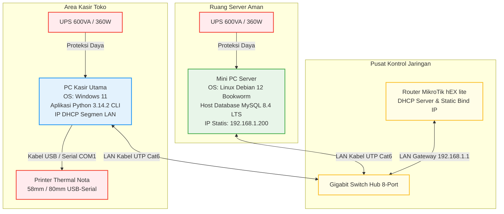

# Environment Setup — AbuCom

## Riwayat Perubahan Dokumen

| Versi | Tanggal    | Perubahan                                                   | Oleh                                            |
|:---:|:---:|---|---|
| **1.1**   | 2026-05-26 | Validasi komprehensif, penyempurnaan instruksi luring (offline-only LAN) menggunakan local deb media & local pip wheels, penjelasan detail connection pool ('abupool'), database retry mechanism (ERR-DB-001/013), standardisasi penanganan data NULL MySQL ke Python None (helper handle_null_decimal), dan visualisasi data presisi desimal ROUND_HALF_UP. Menyelaraskan seluruh spesifikasi v1.1 SDLC AbuCom. | Antigravity (Senior AI Engineer) |
| **1.0**   | 2026-05-26 | Inisialisasi awal penyusunan panduan Environment Setup secara komprehensif (16 Bab utama). Menyeleraskan keputusan *Tech Stack Decision* v1.1, *System Architecture* v1.1, *Security Design* v1.1, dan *Coding Standard* v1.1 untuk implementasi lingkungan server Linux Debian 12 dan klien Windows 11. | Senior DevOps Engineer & Infrastructure Setup Specialist |

---

## 1. Informasi Dokumen

### 1.1. Tujuan Dokumen
Dokumen **Environment Setup** ini disusun sebagai panduan teknis operasional langkah demi langkah (*step-by-step technical manual*) untuk melakukan instalasi, konfigurasi, hardening, dan verifikasi seluruh komponen lingkungan pengembangan (*development environment*) serta lingkungan produksi (*production environment*) proyek **AbuCom — Sistem Manajemen Terpadu Usaha Percetakan**. Dokumen ini menjamin reprodusibilitas dan konsistensi lingkungan kerja lintas platform (*Dual-OS*) agar tim pengembang (Junior Programmer dan model AI) dapat segera memulai penulisan kode tanpa hambatan teknis.

### 1.2. Cakupan Dokumen
Cakupan konfigurasi yang didokumentasikan meliputi:
*   Spesifikasi perangkat keras dan topologi jaringan lokal LAN.
*   Setup sistem operasi server (Linux Debian 12 Bookworm) dan klien kasir (Windows 11).
*   Instalasi runtime Python 3.14.2+ dan database MySQL Community Server LTS.
*   Manajemen dependensi Python terisolasi menggunakan virtual environment (`venv`) dengan versi terkunci.
*   Pembuatan kredensial database, hak akses user minimal, enkripsi WhatsApp CRM (kepatuhan UU PDP No. 27/2022), dan generasi JWT/Fernet keys.
*   Setup version control Git lokal dan standardisasi konvensi commit.
*   Penyusunan backup terenkripsi AES-256 ZIP dan skenario testing basis data.
*   Troubleshooting kegagalan instalasi, visualisasi, dan koneksi remote.

### 1.3. Posisi Dokumen dalam Siklus SDLC
Dalam siklus pengembangan sistem (*System Development Life Cycle* — SDLC) AbuCom, dokumen ini merupakan deliverable kedua pada **Fase 04 — Implementation (Konstruksi)**. Dokumen ini bertindak sebagai prasyarat mutlak (*absolute prerequisite*) sebelum seluruh pengkodean modul program dimulai.

```
+------------------------------------------------+
|       Fase 03: Perancangan Sistem (Design)     |
|   (System Architecture, Security Design, DDL)  |
+------------------------------------------------+
                        |
                        v
+================================================+
|    Fase 04: Environment Setup [DOKUMEN INI]    |  <-- POSISI DELIVERABLE
+================================================+
                        |
                        v
+------------------------------------------------+
|          Fase 04: Pengkodean Modul CLI         |
|      (Presentation, Logic, DB Layers)          |
+------------------------------------------------+
```

### 1.4. Hubungan dengan Dokumen SDLC Lainnya
*   **Dokumen Input (Acuan)**:
    *   [Tech Stack Decision v1.1](docs/sdlc/01_planning/04_tech_stack_decision.md): SSoT untuk platform runtime, database MySQL, versi pustaka, dan visual CLI.
    *   [System Architecture v1.1](docs/sdlc/03_design/03_system_architecture.md): Diagram topologi LAN, alokasi IP statis server, setup printer, dan connection pool.
    *   [Security Design v1.1](docs/sdlc/03_design/06_security_design.md): Spesifikasi otentikasi bcrypt, token JWT, hak akses user database minimal, enkripsi UU PDP, dan folder backup chmod 700.
    *   [Coding Standard v1.1](docs/sdlc/04_implementation/01_coding_standard.md): Layout folder proyek standar, requirements.txt, .gitignore, dan connection pool factory.
    *   [Database Schema v1.1](docs/sdlc/03_design/01_database_schema.sql): Script fisik schema SQL.
    *   [Narasi Pemilik](docs/sdlc/narasi.txt): Konteks bisnis dan mandat inovasi.

### 1.5. Audiens Target
*   **Junior Programmer (Pemilik Usaha)**: Untuk merakit fisik dan mengonfigurasi PC kasir/server secara mandiri.
*   **Tim Pengembang AI (Gemini & Claude)**: Untuk memastikan kode pengujian dan boilerplate runtime konsisten dengan target sistem.
*   **System Administrator**: Untuk pemeliharaan jaringan LAN toko, pemulihan database, dan backup harian.

### 1.6. Definisi, Akronim, dan Singkatan
*   **SSoT**: *Single Source of Truth* (Sumber kebenaran tunggal informasi arsitektur).
*   **FP**: *Functional Programming* (Paradigma pemrograman fungsional murni tanpa class di alur bisnis).
*   **CLI**: *Command Line Interface* (Antarmuka terminal teks interaktif).
*   **JWT**: *JSON Web Token* (Session token stateless terenkripsi untuk otentikasi).
*   **BOM**: *Bill of Materials* (Daftar komposisi bahan baku produk cetak kustom).
*   **HPP**: Harga Pokok Penjualan (Biaya produksi langsung).
*   **UU PDP**: Undang-Undang Perlindungan Data Pribadi No. 27 Tahun 2022.
*   **ACID**: *Atomicity, Consistency, Isolation, Durability* (Integritas transaksi database).
*   **LAN**: *Local Area Network* (Jaringan lokal toko luring tanpa internet).
*   **UoM**: *Unit of Measure* (Satuan persediaan barang).

### 1.7. Prasyarat Pengetahuan (Prerequisites)
Sebelum melakukan setup, pelaksana wajib memiliki pemahaman dasar tentang:
1.  Perintah terminal dasar Bash Linux (Debian 12) dan Command Prompt/Windows Terminal (Windows 11).
2.  Pengoperasian perintah query SQL dasar dan administrasi basis data MySQL Server.
3.  Pemrograman dasar Python, termasuk konsep virtual environment (`venv`) dan pip package manager.
4.  Pemasangan kabel fisik jaringan LAN RJ45, switch hub, dan konfigurasi IP statis pada adapter.

---

## 2. Ringkasan Arsitektur Lingkungan

### 2.1. Diagram Topologi Lingkungan (Mermaid)
Lingkungan fisik AbuCom menerapkan topologi bintang (*star network*) luring (*offline*) berbasis client-server lokal LAN untuk menghilangkan ketergantungan internet dan menjamin respons cepat (<1ms latensi):



### 2.2. Matriks Node dan Komponen
Berikut adalah pemetaan komponen perangkat lunak dan layanan (*services*) di setiap node jaringan lokal AbuCom:

| Atribut Node | Server Database (`192.168.1.200`) | Klien Kasir (IP DHCP Segmen LAN) |
| --- | --- | --- |
| **Sistem Operasi** | Linux Debian 12 Bookworm (Minimal CLI) | Windows 11 Pro / Home 64-bit |
| **Runtime Engine** | Python 3.14.2+ (Wajib) | Python 3.14.2+ (Wajib) |
| **Service Daemon** | MySQL Community Server `mysql.service` (Port 3306) | Printer Driver (Generic / Text-Only) |
| **Pustaka Utama** | `mysql-connector-python`, `bcrypt` | `mysql-connector-python`, `python-dotenv`, `bcrypt`, `pyjwt`, `cryptography`, `rich`, `tabulate` |
| **Lokasi Data** | Berkas basis data fisik MySQL, Berkas cadangan terenkripsi ZIP AES-256 | Salinan Struk Nota `.txt`, File mockup desain pelanggan `.pdf` |
| **Akses Jaringan** | Bind IP statis `192.168.1.200`, UFW block port 3306 kecuali dari segment LAN | Hubungan remote database via TCP/IP port 3306 ke Server |

### 2.3. Perbedaan Lingkungan Development vs Production
Untuk menjamin reprodusibilitas dan mencegah kerusakan data riil toko, lingkungan diatur ke dalam 2 mode:

| Karakteristik | Lingkungan Development (Lokal PC Kasir/Dev) | Lingkungan Production (Server & PC Kasir Riil) |
| --- | --- | --- |
| **Target Database** | `abucom_test_db` | `abucom_db` |
| **Target OS Database** | MySQL Server Lokal / SQLite Emulator | MySQL Server Debian 12 Mini PC (`192.168.1.200`) |
| **Konfigurasi Keamanan** | `.env.test` (Kunci JWT dummy, Fernet key statis) | `.env` (JWT Secret 32+ char acak hex, Fernet key acak riil) |
| **Output Nota Struk** | File `.txt` di direktori `exports/receipts/` | File `.txt` + Cetak fisik langsung ke Port Printer |
| **Penanganan Error** | Debug trace aktif, detail log error di layar terminal | Error code standard (`ERR-XXX-YYY`) dengan warna merah ANSI |
| **Audit Logs** | Logging aktif, audit record ditandai mode development | Logging riil ke tabel `audit_logs` MySQL secara transaksional |

---

## 3. Spesifikasi Hardware dan Infrastruktur Jaringan

### 3.1. Spesifikasi Node Server Database (Mini PC — Linux Debian 12)
*   **Perangkat**: Mini PC Server (Industrial grade, fanless design untuk minim debu kertas).
*   **Prosesor**: Intel Core i5 Generasi ke-12 (Minimal 6 Cores, 12 Threads) atau setara.
*   **Memori (RAM)**: 16GB DDR4 3200MHz SODIMM (Mendukung optimalisasi query cache dan indexing InnoDB).
*   **Penyimpanan**: SSD 512GB NVMe M.2 PCIe Gen 4 (Kecepatan tulis tinggi untuk mekanisme transaction logs MySQL).
*   **Adapter Jaringan**: 1x RJ45 Gigabit Ethernet Port (10/100/1000 Mbps).

### 3.2. Spesifikasi Node Klien Kasir (PC Desktop — Windows 11)
*   **Perangkat**: PC Desktop standar retail kasir.
*   **Prosesor**: Intel Core i3 Generasi ke-10 ke atas atau AMD Ryzen 3.
*   **Memori (RAM)**: 8GB DDR4 2666MHz.
*   **Penyimpanan**: SSD 256GB SATA III / NVMe M.2.
*   **Adapter Jaringan**: 1x RJ45 Gigabit Ethernet Port.

### 3.3. Perangkat Jaringan (Switch, Router, Kabel)
*   **Switch Hub**: Switch Hub Gigabit 8-Port (Unmanaged, low-latency, transfer rate 1 Gbps).
*   **Router**: Router Board MikroTik hEX lite (Sebagai gateway, DHCP server kasir, dan penjamin IP statis Server).
*   **Kabel Jaringan**: UTP Category 6 (Cat6) tembaga murni dengan pelindung RJ45, panjang kabel &le; 15 meter untuk performa maksimal.

### 3.4. Perangkat Pendukung (UPS, Printer Thermal)
*   **UPS (Uninterruptible Power Supply)**: 2 Unit UPS minimal 600VA / 360W dipasang terpisah pada Node Server dan Node Klien Kasir. 
    > **[JUSTIFIKASI TEKNIS]**: Daya UPS 600VA / 360W dipilih secara rasional karena konsumsi daya Mini PC Server fanless hanya sebesar &le; 45W dan PC Klien Kasir harian sebesar &le; 180W. Ini menjamin ketersediaan daya cadangan minimal 15 menit agar server basis data MySQL dapat melakukan sinkronisasi transaction logs biner biner secara aman dan system administrator dapat memicu prosedur *graceful shutdown* sebelum daya baterai habis total.
*   **Printer Thermal**: Printer thermal struk nota lebar kertas 58mm atau 80mm dengan port USB/Serial COM.
*   **Laci Kasir (Cash Drawer)**: Laci kasir dengan konektor RJ11 terhubung langsung ke Printer Thermal (pembukaan otomatis saat nota dicetak).

### 3.5. Checklist Verifikasi Hardware
Sebelum melanjutkan ke setup sistem operasi, pastikan fisik hardware terpasang dengan benar:
*   [ ] Mini PC Server terhubung ke port UPS 1, kabel LAN Cat6 terhubung kokoh dari Server ke Switch Hub.
*   [ ] PC Kasir terhubung ke port UPS 2, kabel LAN Cat6 terhubung dari PC Kasir ke Switch Hub.
*   [ ] Router MikroTik terhubung ke port 1 Switch Hub, Switch Hub terhubung ke seluruh node.
*   [ ] Printer Thermal terhubung ke PC Kasir via USB/Serial, laci kasir RJ11 terhubung ke printer.
*   [ ] Seluruh perangkat dinyalakan, lampu indikator LAN menyala hijau pada Switch Hub (tanda koneksi Gigabit).

---

## 4. Setup Sistem Operasi — Server Linux Debian 12 Bookworm

### 4.1. Instalasi Minimal Linux Debian 12
1.  Unduh berkas instalasi resmi **Debian 12.x Bookworm Netinst ISO** (64-bit).
    > ⚠️ **[CATATAN OFFLINE-ONLY LAN]**: Karena lingkungan operasional toko fisik AbuCom berjalan offline murni (luring), pastikan untuk mengunduh berkas ISO **Debian 12.x Bookworm Netinst** menggunakan koneksi internet di tempat lain terlebih dahulu, atau menggunakan berkas **DVD Installer Lengkap (Debian DVD ISO)** untuk memastikan seluruh paket *standard system utilities* dapat terpasang tanpa membutuhkan gateway internet saat proses instalasi.
2.  Buat bootable USB flashdisk menggunakan aplikasi Rufus.
3.  Booting Mini PC Server ke Installer Debian. Pilih opsi **Graphical Install**.
4.  Pilih konfigurasi bahasa: `English`, lokasi: `Indonesia`, keyboard: `American English`.
5.  Konfigurasi hostname: `abuserver`, domain: kosongkan.
6.  Set password untuk akun `root` (minimal 16 karakter acak).
    > ⚠️ **[HARUS DIISI MANUAL]**: Catat password root fisik Server ini di buku catatan rahasia pemilik!
7.  Buat akun user non-root administratif: `abuadm`, password: set sandi yang kuat.
8.  Konfigurasi partisi harddisk: Pilih **Guided - use entire disk**, skema partisi: **All files in one partition** (direkomendasikan untuk kemudahan server lokal), pilih **Finish partitioning and write changes to disk**.
9.  Pada bagian **Software Selection**, hilangkan semua tanda centang lingkungan desktop (GNOME, XFCE, dll.) untuk menghemat RAM. Cukup centang:
    *   [x] **SSH server** (Untuk akses remote administratif).
    *   [x] **standard system utilities** (Pustaka dasar Linux).
10. Selesaikan instalasi dan keluarkan USB flashdisk. Biarkan Mini PC melakukan reboot masuk ke terminal CLI Debian.

### 4.2. Konfigurasi Jaringan (IP Statis Server)
1.  Login ke terminal Server sebagai user `root` atau ketik `su -`.
2.  Identifikasi nama adapter jaringan fisik Ethernet dengan mengetik perintah:
    ```bash
    # [LINUX DEBIAN 12 — Server]
    ip link show
    ```
    *(Misal nama interface terdeteksi: `enp1s0` atau `eth0`)*.
3.  Buka berkas konfigurasi adapter jaringan menggunakan editor nano:
    ```bash
    # [LINUX DEBIAN 12 — Server]
    nano /etc/network/interfaces
    ```
4.  Ubah konfigurasi DHCP adapter target menjadi IP Statis lokal. Cari baris `iface enp1s0 inet dhcp` dan ubah menjadi:
    ```
    # Konfigurasi IP Statis Server Database AbuCom
    auto enp1s0
    iface enp1s0 inet static
        address 192.168.1.200
        netmask 255.255.255.0
        gateway 192.168.1.1
        dns-nameservers 8.8.8.8 1.1.1.1
    ```
    > ⚠️ **[HARUS DIISI MANUAL]**: Jika IP Gateway Router MikroTik toko bukan `192.168.1.1`, sesuaikan kolom gateway dan subnet di atas agar server berada dalam segmen jaringan LAN yang valid!
5.  Simpan file (Ctrl+O, Enter, lalu keluar Ctrl+X).
6.  Restart service networking server untuk menerapkan perubahan:
    ```bash
    # [LINUX DEBIAN 12 — Server]
    systemctl restart networking
    ```
7.  Verifikasi alamat IP baru server dengan perintah:
    ```bash
    # [LINUX DEBIAN 12 — Server]
    ip addr show enp1s0
    ```
    *Diharapkan output menampilkan IP `192.168.1.200/24`.*

### 4.3. Hardening Keamanan OS Server

#### 4.3.1. Konfigurasi Firewall (ufw)
Firewall `ufw` digunakan untuk mengunci seluruh port jaringan server, dan hanya membuka port database untuk node lokal kasir:
1.  Instal paket `ufw` di server:
    ```bash
    # [LINUX DEBIAN 12 — Server]
    apt update && apt install ufw -y
    ```
2.  Set kebijakan default firewall untuk menolak semua koneksi masuk (*deny incoming*) dan mengizinkan koneksi keluar:
    ```bash
    # [LINUX DEBIAN 12 — Server]
    ufw default deny incoming
    ufw default allow outgoing
    ```
3.  Izinkan port SSH (22) hanya untuk kebutuhan maintenance lokal:
    ```bash
    # [LINUX DEBIAN 12 — Server]
    ufw allow 22/tcp
    ```
4.  **[KRITIS]** Izinkan port MySQL (3306) secara eksklusif hanya untuk segmen jaringan LAN toko (`192.168.1.0/24`):
    ```bash
    # [LINUX DEBIAN 12 — Server]
    ufw allow from 192.168.1.0/24 to any port 3306 proto tcp
    ```
5.  Aktifkan firewall:
    ```bash
    # [LINUX DEBIAN 12 — Server]
    ufw enable
    ```
    *(Ketik `y` dan tekan Enter jika muncul konfirmasi).*
6.  Verifikasi status firewall dengan perintah:
    ```bash
    # [LINUX DEBIAN 12 — Server]
    ufw status verbose
    ```

#### 4.3.2. Konfigurasi SSH Aman
1.  Buka berkas konfigurasi daemon SSH:
    ```bash
    # [LINUX DEBIAN 12 — Server]
    nano /etc/ssh/sshd_config
    ```
2.  Hardening akses root dengan menonaktifkan login SSH langsung menggunakan akun root. Temukan baris `#PermitRootLogin` (atau baris sejenis) dan ubah menjadi:
    ```
    PermitRootLogin no
    ```
3.  Simpan file dan restart service SSH:
    ```bash
    # [LINUX DEBIAN 12 — Server]
    systemctl restart ssh
    ```

#### 4.3.3. Pembatasan Hak Akses Direktori
Untuk mencegah pencurian fisik file backup harian database oleh staf umum:
1.  Buat direktori backup khusus:
    ```bash
    # [LINUX DEBIAN 12 — Server]
    mkdir -p /var/lib/mysql-backups
    ```
2.  Batasi akses folder secara ketat agar hanya dapat dibaca/ditulis oleh root server Debian:
    ```bash
    # [LINUX DEBIAN 12 — Server]
    chown -R root:root /var/lib/mysql-backups
    chmod 700 /var/lib/mysql-backups
    ```

### 4.4. Instalasi Python 3.14.2+ di Linux Debian 12
Karena repositori bawaan Debian 12 menggunakan Python versi 3.11, kita wajib melakukan kompilasi manual (*compile from source*) untuk memasang runtime target **Python 3.14.2+** sesuai mandat spesifikasi owners:
1.  Instal seluruh library dependensi kompilator C di server:
    ```bash
    # [LINUX DEBIAN 12 — Server]
    apt update
    apt install -y build-essential zlib1g-dev libncurses5-dev libgdbm-dev \
    libnss3-dev libssl-dev libreadline-dev libffi-dev libsqlite3-dev \
    wget curl llvm libpcap-dev liblzma-dev tk-dev libbz2-dev
    ```
    > ⚠️ **[CATATAN KOMPILASI OFFLINE]**: Bagi server Debian 12 luring murni yang tidak memiliki akses internet, seluruh file `.deb` paket dependensi build di atas wajib diunduh terlebih dahulu di mesin berinternet menggunakan utilitas:
    > `apt-get download build-essential zlib1g-dev libncurses5-dev ...`
    > Lalu seluruh berkas `.deb` disalin menggunakan USB flashdisk ke server `/tmp/local_deb/` dan dipasang secara offline menggunakan perintah:
    > `dpkg -i /tmp/local_deb/*.deb`
2.  Unduh kode sumber resmi Python 3.14.2:
    ```bash
    # [LINUX DEBIAN 12 — Server]
    cd /tmp
    wget https://www.python.org/ftp/python/3.14.2/Python-3.14.2.tar.xz
    ```
    *(Untuk luring, unduh tarball ini terlebih dahulu di PC kasir berinternet dan salin ke server).*
3.  Ekstrak arsip tarball dan masuk ke direktori ekstraksi:
    ```bash
    # [LINUX DEBIAN 12 — Server]
    tar -xf Python-3.14.2.tar.xz
    cd Python-3.14.2
    ```
4.  Lakukan konfigurasi build sistem dengan mengaktifkan optimasi parser interpreter (`--enable-optimizations`):
    ```bash
    # [LINUX DEBIAN 12 — Server]
    ./configure --enable-optimizations --with-ensurepip=install
    ```
5.  Kompilasi kode program menggunakan multi-threading processor (nproc) untuk mempercepat proses:
    ```bash
    # [LINUX DEBIAN 12 — Server]
    make -j$(nproc)
    ```
6.  Instal binary Python secara terpisah tanpa menimpa binary python bawaan OS (`altinstall`):
    ```bash
    # [LINUX DEBIAN 12 — Server]
    sudo make altinstall
    ```

### 4.5. Verifikasi Instalasi Python di Server
1.  Uji ketersediaan interpreter Python baru dengan mengetik:
    ```bash
    # [LINUX DEBIAN 12 — Server]
    python3.14 --version
    ```
    *Diharapkan output menampilkan: `Python 3.14.2`.*
2.  Verifikasi ketersediaan pip package manager:
    ```bash
    # [LINUX DEBIAN 12 — Server]
    pip3.14 --version
    ```

---

## 5. Setup Sistem Operasi — Klien Windows 11

### 5.1. Konfigurasi Dasar Windows 11
1.  Pastikan PC Kasir terinstal sistem operasi Windows 11 Home / Pro berarsitektur 64-bit yang teraktivasi resmi.
2.  Sambungkan kabel LAN PC Kasir ke port Switch Hub.
3.  Buka **Settings &rarr; Network & internet &rarr; Ethernet**.
4.  Pilih opsi **IP assignment: Automatic (DHCP)** agar router MikroTik memberikan alamat IP dinamis secara otomatis. Catat alamat IP yang didapat (misal: `192.168.1.15`).

### 5.2. Instalasi Python 3.14.2+ di Windows 11
1.  Buka browser web pada PC Kasir dan unduh berkas installer resmi **Windows installer (64-bit)** untuk **Python 3.14.2** dari situs resmi `python.org`.
    *(Bila PC Kasir luring, unduh installer terlebih dahulu di tempat lain lalu salin via USB flashdisk).*
2.  Buka berkas `.exe` installer yang sudah terunduh dengan klik kanan dan pilih **Run as Administrator**.
3.  **[KRITIS — WAJIB]** Pada layar instalasi awal, centang checkbox berikut di bagian bawah layar:
4.  Pilih opsi **Customize installation**. Pastikan `pip`, `tcl/tk and IDLE`, dan `py launcher` tercentang. Klik **Next**.
5.  Pada layar *Advanced Options*, centang checkbox:
    *   [x] **Install Python 3.14 for all users**.
    *   *Direktori instalasi default akan berubah menjadi `C:\Program Files\Python314`*.
6.  Klik **Install** dan tunggu hingga instalasi sukses.
7.  Klik tombol **Disable path length limit** di akhir instalasi jika muncul (untuk mencegah bug path panjang Windows), lalu klik **Close**.

### 5.3. Konfigurasi PATH Environment Variable
Jika Python tidak terdeteksi di command prompt, lakukan verifikasi PATH manual:
1.  Tekan tombol Win + R, ketik `sysdm.cpl` dan tekan Enter.
2.  Masuk ke tab **Advanced** dan klik tombol **Environment Variables...**.
3.  Pada bagian *System variables*, cari variabel bernama **Path** dan klik **Edit...**.
4.  Pastikan baris berikut sudah tercantum di dalam list. Jika belum ada, tambahkan secara manual:
    *   `C:\Program Files\Python314\`
    *   `C:\Program Files\Python314\Scripts\`
5.  Klik **OK** pada seluruh jendela.

### 5.4. Konfigurasi Windows Terminal (UTF-8 / chcp 65001)
Pustaka visual `rich` dan pemformatan `tabulate` menuntut rendering terminal modern berbasis UTF-8 untuk visualisasi tabel dan warna ANSI secara stabil. CMD Windows lama secara default menggunakan kodifikasi lokal (CP1252/ANSI) yang akan memicu crash rendering visual.
1.  Buka **Microsoft Store** pada PC Kasir, cari dan instal aplikasi **Windows Terminal** resmi (jika belum terinstal bawaan).
2.  Atur Windows Terminal sebagai aplikasi konsol default: Buka Settings pada Windows Terminal, pilih **Default Terminal Application &rarr; Windows Terminal**.
3.  **[KRITIS]** Untuk memastikan emulator CMD di Windows Terminal selalu menggunakan UTF-8 saat runtime:
    *   Buka menu start, cari "Windows Terminal", klik kanan dan pilih Settings.
    *   Pilih profil **Command Prompt** (CMD).
    *   Pada bagian *Starting directory*, arahkan ke folder root proyek AbuCom.
    *   Pada bagian *Command line*, tambahkan instruksi command `chcp 65001` sebelum runtime agar kodifikasi UTF-8 aktif secara biner:
        `cmd.exe /k "chcp 65001"`

### 5.5. Konfigurasi Keamanan Klien (Akun Terbatas, Disable USB Autorun)
Untuk meminimalisir penyebaran virus lokal dari flashdisk staf fisik di PC Kasir harian:
1.  **Akun Non-Admin**: Pastikan staf kasir harian menggunakan akun Windows lokal bertipe **Standard User** (bukan Administrator).
2.  **Disable USB Autorun**:
    *   Bagi Windows 11 Pro: Tekan tombol Win + R, ketik `gpedit.msc` (Local Group Policy Editor) dan tekan Enter. Navigasi ke: **Computer Configuration &rarr; Administrative Templates &rarr; Windows Components &rarr; AutoPlay Policies**. Klik dua kali pada kebijakan **Turn off AutoPlay**. Pilih opsi **Enabled**, dan pada bagian *Turn off AutoPlay on*, pilih **All drives**. Klik **Apply** &rarr; **OK**.
    *   > ⚠️ **[Bypass Windows 11 Home]**: Bagi Windows 11 Home yang tidak memiliki Group Policy Editor (`gpedit.msc`), matikan AutoRun melalui registry editor:
        1. Buka Registry Editor (`regedit`).
        2. Navigasikan ke: `HKEY_CURRENT_USER\Software\Microsoft\Windows\CurrentVersion\Policies\Explorer`.
        3. Klik kanan, pilih **New -> DWORD (32-bit) Value**, beri nama **`NoDriveTypeAutoRun`**.
        4. Double click value tersebut, ubah base ke **Hexadecimal**, isi value data dengan **`FF`** (nilai decimal 255). Klik OK dan restart PC Klien.

### 5.6. Verifikasi Instalasi Python di Windows
1.  Buka aplikasi **Windows Terminal** (CMD).
2.  Ketik perintah verifikasi berikut:
    ```cmd
    # [WINDOWS 11 — Klien]
    python --version
    ```
    *Diharapkan output menampilkan: `Python 3.14.2`.*
3.  Ketik perintah verifikasi pip:
    ```cmd
    # [WINDOWS 11 — Klien]
    pip --version
    ```

---

## 6. Setup Database MySQL Server

### 6.1. Instalasi MySQL Community Server (LTS) di Linux Debian 12
MySQL Community Server LTS (Long Term Support) versi 8.4 merupakan sistem database relasional target AbuCom yang di-setup lokal pada server Debian:
1.  Akses terminal Server Debian sebagai root.
2.  Unduh paket konfigurasi repositori resmi MySQL APT:
    ```bash
    # [LINUX DEBIAN 12 — Server]
    cd /tmp
    wget https://dev.mysql.com/get/mysql-apt-config_0.8.29-1_all.deb
    ```
    *(Bila Server luring, unduh file `.deb` bundle installer MySQL Server 8.4 LTS offline dari web resmi Oracle via mesin berinternet, salin via flashdisk, lalu pasang menggunakan `dpkg -i` secara berurutan).*
3.  Pasang repositori konfigurasi tersebut:
    ```bash
    # [LINUX DEBIAN 12 — Server]
    dpkg -i mysql-apt-config_0.8.29-1_all.deb
    ```
    *Pada layar dialog interaktif, pilih opsi default **MySQL Server & Cluster (Product: mysql-8.4)**, klik **Ok**, dan selesaikan.*
4.  Perbarui daftar paket dan instal daemon MySQL Server:
    ```bash
    # [LINUX DEBIAN 12 — Server]
    apt update
    apt install mysql-server -y
    ```
5.  Pastikan service MySQL berjalan otomatis saat booting server:
    ```bash
    # [LINUX DEBIAN 12 — Server]
    systemctl enable mysql
    systemctl start mysql
    ```
6.  Verifikasi status service:
    ```bash
    # [LINUX DEBIAN 12 — Server]
    systemctl status mysql
    ```
    *Diharapkan output menampilkan status `active (running)`.*

### 6.2. Konfigurasi Keamanan MySQL (mysql_secure_installation)
1.  Jalankan utilitas pengaman basis data:
    ```bash
    # [LINUX DEBIAN 12 — Server]
    mysql_secure_installation
    ```
2.  Ikuti petunjuk interaktif di layar dengan konfigurasi pengamanan berikut:
    *   *VALIDATE PASSWORD COMPONENT*: Ketik `y` untuk mengaktifkan validasi password kuat biner.
    *   *Password validation policy*: Pilih `2` (STRONG - Panjang sandi &ge; 8 karakter, mengandung angka, huruf besar/kecil, dan karakter khusus).
    *   Set kata sandi root database MySQL baru.
        > ⚠️ **[HARUS DIISI MANUAL]**: Kata sandi root basis data MySQL server toko wajib diset minimal 32 karakter acak hex. Catat sandi ini secara rahasia dan aman!
    *   *Remove anonymous users?*: Ketik `y` (Menghapus akun tamu anonim).
    *   *Disallow root login remotely?*: Ketik `y` (Melarang user root database login dari komputer klien jarak jauh).
    *   *Remove test database and access to it?*: Ketik `y` (Menghapus database testing bawaan default).
    *   *Reload privilege tables now?*: Ketik `y` (Menerapkan perubahan privasi secara instan).

### 6.3. Konfigurasi Bind Address untuk Akses LAN
Untuk mengizinkan PC Kasir mengakses database MySQL di Server melalui jaringan LAN toko:
1.  Buka berkas konfigurasi default MySQL Server menggunakan editor nano:
    ```bash
    # [LINUX DEBIAN 12 — Server]
    nano /etc/mysql/mysql.conf.d/mysqld.cnf
    ```
2.  Cari baris `bind-address = 127.0.0.1` (yang membatasi koneksi lokal server saja) dan ubah nilainya menjadi IP Statis lokal server:
    ```
    bind-address = 192.168.1.200
    ```
3.  Simpan file dan restart service MySQL untuk menerapkan konfigurasi:
    ```bash
    # [LINUX DEBIAN 12 — Server]
    systemctl restart mysql
    ```

### 6.4. Konfigurasi Character Set dan Collation (utf8mb4)
Untuk mendukung penyimpanan unicode secara lengkap lintas OS, basis data AbuCom wajib dikonfigurasi menggunakan character set `utf8mb4` dan collation `utf8mb4_unicode_ci`:
1.  Buka kembali berkas `/etc/mysql/mysql.conf.d/mysqld.cnf`:
    ```bash
    # [LINUX DEBIAN 12 — Server]
    nano /etc/mysql/mysql.conf.d/mysqld.cnf
    ```
2.  Tambahkan konfigurasi berikut di bagian bawah blok `[mysqld]`:
    ```ini
    character-set-server = utf8mb4
    collation-server = utf8mb4_unicode_ci
    ```
3.  Simpan file dan restart MySQL service.

### 6.5. Konfigurasi Transaction Isolation Level (REPEATABLE READ)
Untuk menjamin integritas transaksi lunas kasir dan opname gudang terbebas dari anomali pembacaan data kotor (*dirty read*), isolation level MySQL wajib diset pada tingkat **REPEATABLE READ**:
1.  Buka berkas `/etc/mysql/mysql.conf.d/mysqld.cnf` dan tambahkan parameter berikut di bawah blok `[mysqld]`:
    ```ini
    transaction-isolation = REPEATABLE-READ
    ```
2.  Simpan file dan restart MySQL service.

### 6.6. Pembuatan Database dan Akun Aplikasi (abucom_app)

#### 6.6.1. Pembuatan Database Utama (abucom_db)
1.  Masuk ke console admin MySQL Server:
    ```bash
    # [LINUX DEBIAN 12 — Server]
    mysql -u root -p
    ```
2.  Buat database produksi utama `abucom_db` dengan character set eksplisit:
    ```sql
    CREATE DATABASE abucom_db CHARACTER SET utf8mb4 COLLATE utf8mb4_unicode_ci;
    ```

#### 6.6.2. Pembuatan Database Testing (abucom_test_db)
1.  Buat database bayangan khusus untuk pengujian otomatis unit test:
    ```sql
    CREATE DATABASE abucom_test_db CHARACTER SET utf8mb4 COLLATE utf8mb4_unicode_ci;
    ```

#### 6.6.3. Pembuatan Akun MySQL Aplikasi dengan Privilege Terbatas
Untuk menjamin kepatuhan *Security Design* terkait pembatasan hak akses terkecil (*least privilege*):
1.  Buat user baru database khusus aplikasi `abucom_app` yang diizinkan melakukan remote koneksi dari host IP segmen jaringan lokal LAN toko (`192.168.1.%`):
    ```sql
    CREATE USER 'abucom_app'@'192.168.1.%' IDENTIFIED BY 'PasswordAplikasiAbuCom123!';
    ```
    > ⚠️ **[HARUS DIISI MANUAL]**: Ganti string sandi `'PasswordAplikasiAbuCom123!'` dengan kata sandi acak yang unik khusus untuk user aplikasi. Sandi ini wajib dicatat di file `.env` klien kasir secara rahasia!
2.  **[KRITIS]** Berikan hak akses privilege yang **diizinkan** secara eksplisit (`SELECT`, `INSERT`, `UPDATE`, `DELETE`) dan **larang** secara keras modifikasi skema DDL administratik (`DROP`, `ALTER`, `CREATE`) pada database produksi, namun tambahkan privilege testing (`CREATE`, `DROP`) pada database testing sandbox:
    ```sql
    -- Hak akses terbatas pada Database Produksi
    GRANT SELECT, INSERT, UPDATE, DELETE ON abucom_db.* TO 'abucom_app'@'192.168.1.%';
    
    -- Hak akses terbatas pada Database Testing (ditambah CREATE/DROP khusus untuk test tables lifecycle)
    GRANT SELECT, INSERT, UPDATE, DELETE, CREATE, DROP ON abucom_test_db.* TO 'abucom_app'@'192.168.1.%';
    
    -- Terapkan perubahan hak akses
    FLUSH PRIVILEGES;
    ```
3.  Keluar dari prompt MySQL dengan mengetik `EXIT;`.

### 6.7. Eksekusi Schema SQL (schema.sql)
DDL fisik database (28 tabel relasional InnoDB) dimigrasikan langsung ke server database:
1.  Salin berkas `schema.sql` dari repositori proyek ke server Debian `/tmp/schema.sql`.
2.  Eksekusi berkas schema SQL ke dalam database produksi `abucom_db`:
    ```bash
    # [LINUX DEBIAN 12 — Server]
    mysql -u root -p abucom_db < /tmp/schema.sql
    ```

### 6.8. Eksekusi Seed Data (seed.sql)
Data inisial master (definisi unit cabang, 8 posisi peran staf, detail insentif, system configs default) diimpor ke database:
1.  Salin berkas `seed.sql` ke server Debian `/tmp/seed.sql`.
2.  Eksekusi berkas seed data ke database produksi `abucom_db`:
    ```bash
    # [LINUX DEBIAN 12 — Server]
    mysql -u root -p abucom_db < /tmp/seed.sql
    ```

### 6.9. Verifikasi Konektivitas MySQL dari Klien Windows (Remote Test)
Untuk memastikan jaringan LAN dan hak akses user database terkonfigurasi dengan sukses:
1.  Buka **Windows Terminal** (CMD) pada PC Klien Kasir.
2.  Uji koneksi remote database menggunakan client mysql Windows (atau ping IP):
    ```cmd
    # [WINDOWS 11 — Klien]
    ping 192.168.1.200
    ```
    *Diharapkan command ping mengembalikan status reply latensi < 1ms.*
3.  Gunakan script utilitas telnet untuk memverifikasi keterbukaan port database:
    ```cmd
    # [WINDOWS 11 — Klien]
    powershell -Command "Test-NetConnection -ComputerName 192.168.1.200 -Port 3306"
    ```
    *Diharapkan output menampilkan status: `TcpTestSucceeded : True`.*

---

## 7. Setup Lingkungan Python dan Dependensi

### 7.1. Pembuatan Virtual Environment (venv)
Pustaka dependensi aplikasi wajib diisolasi penuh di dalam subfolder proyek menggunakan modul bawaan `venv` Python untuk menghindari bentrokan versi library global:
1.  Buka **Windows Terminal** (CMD) pada PC Klien Kasir, navigasikan ke folder root proyek:
    ```cmd
    # [WINDOWS 11 — Klien]
    cd C:\Users\donsise\Documents\abucom
    ```
2.  Buat virtual environment bernama `venv` di Windows Klien:
    ```cmd
    # [WINDOWS 11 — Klien]
    python -m venv venv
    ```
3.  *(Opsional)* Jika melakukan setup di Linux Server, perintah pembuatannya adalah:
    ```bash
    # [LINUX DEBIAN 12 — Server]
    cd /home/abuadm/abucom
    python3.14 -m venv venv
    ```

### 7.2. Instalasi Dependensi dari requirements.txt
1.  Aktifkan virtual environment pada terminal:
    *   **Windows Klien**:
        ```cmd
        # [WINDOWS 11 — Klien]
        venv\Scripts\activate
        ```
        *Output baris prompt terminal akan menampilkan indikator: `(venv) C:\Users\donsise\Documents\abucom>`.*
    *   **Linux Server** (jika dipicu):
        ```bash
        # [LINUX DEBIAN 12 — Server]
        source venv/bin/activate
        ```
2.  Perbarui pip manager di dalam virtual environment ke versi terbaru:
    ```cmd
    # [WINDOWS 11 — Klien]
    python -m pip install --upgrade pip
    ```
3.  Instal seluruh berkas pustaka dependensi terkunci:
    ```cmd
    # [WINDOWS 11 — Klien]
    pip install -r requirements.txt
    ```
    > ⚠️ **[INSTALASI LURING - OFFLINE WHEELS]**: Untuk menginstal requirements di PC Kasir Windows luring:
    > 1. Di komputer kasir yang memiliki akses internet (atau laptop developer), unduh requirements.txt dan unduh seluruh wheel binaries (.whl) ke dalam satu folder:
    >    `# [WINDOWS 11 — Klien (Internet Enabled)]`
    >    `pip download -r requirements.txt -d C:\tmp\pip_wheels`
    > 2. Salin folder `pip_wheels` dan berkas `requirements.txt` menggunakan flashdisk ke PC kasir luring di folder `C:\Users\donsise\Documents\abucom\pip_wheels`.
    > 3. Pada terminal kasir luring dengan virtual environment aktif, jalankan instalasi lokal offline:
    >    `# [WINDOWS 11 — Klien (Offline)]`
    >    `pip install --no-index --find-links=pip_wheels -r requirements.txt`
    > Ini menjamin instalasi 100% sukses tanpa membutuhkan internet dan terhindar dari kompilasi biner bcrypt/cryptography lokal.

### 7.3. Daftar Lengkap Dependensi dan Versi Terkunci

#### 7.3.1. Dependensi Wajib (Mandatory)
Berikut adalah daftar versi pustaka eksternal wajib yang dikunci versinya secara rigid:
*   `mysql-connector-python==8.4.0` (Driver basis data resmi MySQL Oracle).
*   `python-dotenv==1.0.1` (Pustaka pemisah kredensial berkas `.env`).
*   `bcrypt==4.1.0` (Algoritma hashing sandi staf).
*   `pyjwt==2.8.0` (Token otentikasi stateless session CLI).
*   `cryptography==42.0.5` (Enkripsi simetris Fernet untuk proteksi WhatsApp CRM pelanggan).

#### 7.3.2. Dependensi Rekomendasi
Pustaka pendukung visualisasi CLI modern:
*   `rich==13.7.0` (Visual ANSI panels, border, colors, dan progress bar).
*   `tabulate==0.9.0` (Pemformatan grid table terminal).

#### 7.3.3. Dependensi Pengembangan (Development Only)
Pustaka khusus untuk kebutuhan unit testing fungsional:
*   `pytest==8.2.0` (Framework testing otomatis).
*   `coverage==7.5.1` (Pengukur persentase cakupan baris kode test).

### 7.4. Verifikasi Instalasi Seluruh Dependensi
Untuk memastikan seluruh pustaka terinstal sukses dan siap diimpor tanpa exception:
1.  Buat file uji coba sementara `check_deps.py` pada root proyek menggunakan Windows Terminal:
    ```cmd
    # [WINDOWS 11 — Klien]
    notepad check_deps.py
    ```
2.  Tuliskan script kode program Python berikut:
    ```python
    import sys
    
    print(f"Runtime Python Version: {sys.version}")
    try:
        import mysql.connector
        import dotenv
        import bcrypt
        import jwt
        import cryptography
        print("SUCCESS: Seluruh dependensi utama terimpor dengan sukses di venv!")
    except ImportError as e:
        print(f"FAILED: Terjadi kesalahan impor modul: {str(e)}")
        sys.exit(1)
    ```
3.  Eksekusi file uji coba tersebut di dalam kondisi virtual environment aktif:
    ```cmd
    # [WINDOWS 11 — Klien]
    python check_deps.py
    ```
    *Diharapkan output menampilkan baris string `SUCCESS`.*
4.  Hapus file check_deps.py setelah selesai verifikasi:
    ```cmd
    # [WINDOWS 11 — Klien]
    del check_deps.py
    ```

### 7.5. Troubleshooting Instalasi Dependensi Umum
*   **Compile Error `bcrypt` / `cryptography` di Windows**:
    *   *Penyebab*: Pustaka bcrypt dan cryptography memiliki dependensi kompilator C++ di belakang layar. Jika Windows SDK/C++ Build Tools tidak terinstal, pip akan gagal melakukan build.
    *   *Solusi*: Gunakan metode offline wheels di atas untuk langsung memasang pre-compiled binary (`.whl`) tanpa memerlukan C++ compiler lokal.

---

## 8. Konfigurasi Proyek Aplikasi

### 8.1. Struktur Direktori Proyek Standar
Layout proyek AbuCom wajib diorganisasikan secara modular untuk mendukung arsitektur berlapis 4-layer:

```
abucom/
├── main.py                     # Entry point peluncuran aplikasi CLI
├── requirements.txt            # Dependensi library versi terkunci
├── .env.example                # Templat konfigurasi rahasia program
│
├── cli/                        # LAYER 1: PRESENTATION (Visual & Menus)
│   ├── __init__.py             # Expose fungsi menu utama
│   ├── dashboard.py            # Menus dashboard harian per role (M.7)
│   ├── menu_transaksi.py       # Interaksi Modul M.1 & M.8 (CRM)
│   ├── menu_inventaris.py      # Interaksi Modul M.2 & M.5 (Antrian)
│   ├── menu_ppob_service.py    # Interaksi Modul M.3
│   ├── menu_sdm_finansial.py   # Interaksi Modul M.4 & M.6 (Pinjaman)
│   └── menu_configs.py         # Interaksi Modul M.10 (Configs)
│
├── logic/                      # LAYER 2: BUSINESS LOGIC (Pure FP Python)
│   ├── __init__.py
│   ├── bom_hpp.py              # Logika kalkulasi HPP desimal (M.2)
│   ├── smart_payroll.py        # Logika payroll & komisi poin (M.4)
│   ├── financial_engine.py     # Logika pinjaman & laba rugi (M.6)
│   └── safety_validator.py     # Logika sanitasi input & checks
│
├── db/                         # LAYER 3: DATA ACCESS (SQL Engine)
│   ├── __init__.py
│   ├── db_connector.py         # Connection pooling & base connection
│   └── query_builder.py        # Parameterized transactional wrappers
│
├── middleware/                 # CROSS-CUTTING CONCERNS (Sec & Log)
│   ├── __init__.py
│   ├── auth_jwt.py             # Security logic otentikasi & JWT Sesi
│   ├── rbac_guard.py           # Otorisasi Level Menu & Action Guard
│   └── audit_logger.py         # Perekaman kronologis database JSON
│
├── config/                     # PENGELOLAAN KONFIGURASI RUNTIME
│   ├── __init__.py
│   └── settings.py             # Agregasi & casting variables berkas .env
│
├── utils/                      # PUSTAKA UTAS (Helper Functions)
│   ├── __init__.py
│   ├── crypto.py               # Helper bcrypt password hash
│   ├── backup.py               # Utilitas backup zip AES-256
│   └── text_formatter.py       # Formatting thermal struk & rich tables
│
├── exports/                    # DIREKTORI KELUARAN FILE LOKAL
│   ├── backups/                # Hasil backup database .zip terenkripsi
│   ├── designs/                # Mockup file PDF desain pelanggan
│   └── receipts/               # Berkas cetak nota struk .txt
│
└── tests/                      # AUTOMATED UNIT & INTEGRATION TESTING
    ├── __init__.py
    ├── test_bom_hpp.py         # Unit testing pure functions kalkulasi
    └── test_rbac_security.py   # Integration testing otorisasi RBAC
```

### 8.2. Pembuatan File .env (Konfigurasi Kredensial Rahasia)

#### 8.2.1. Template .env.example Lengkap
Buat berkas bernama `.env.example` di folder root proyek AbuCom sebagai templat referensi:
```ini
# ==============================================================================
# TEMPLAT KONFIGURASI RUNTIME ABUCOM - .env.example
# Salin file ini menjadi '.env' di folder proyek kasir dan isi nilainya.
# ==============================================================================

# 1. Konfigurasi Lingkungan Runtime
APP_ENV=production
APP_CABANG_ID=1

# 2. Kredensial Basis Data MySQL Server
DB_HOST=192.168.1.200
DB_PORT=3306
DB_USER=abucom_app
DB_PASSWORD=YOUR_DB_PASSWORD_HERE
DB_NAME=abucom_db
DB_POOL_SIZE=5

# 3. Kunci Rahasia Otorisasi Sesi JWT (HS256)
# Ganti dengan untaian acak heksadesimal minimal 32 karakter
JWT_SECRET_KEY=YOUR_JWT_SECRET_KEY_HERE
JWT_LIFETIME_SECONDS=28800

# 4. Kunci Enkripsi WhatsApp CRM Pelanggan (Fernet Cryptography)
# Ganti dengan Fernet Key 32-byte berformat Base64 hasil generator
FERNET_KEY=YOUR_FERNET_KEY_HERE

# 5. Konfigurasi Pencadangan Database Terenkripsi AES-256
# Kata sandi zip terenkripsi cadangan harian server
BACKUP_ZIP_PASSWORD=YOUR_BACKUP_ZIP_PASSWORD_HERE

# 6. Konfigurasi Printer Thermal Nota Toko
# Nama COM port (Windows) atau berkas port (Linux) printer
PRINTER_PORT=COM1
PRINTER_WIDTH_MM=58
```

#### 8.2.2. Panduan Pengisian Setiap Variabel .env
1.  Salin berkas `.env.example` menjadi `.env` pada folder root proyek:
    ```cmd
    # [WINDOWS 11 — Klien]
    copy .env.example .env
    ```
2.  Buka berkas `.env` menggunakan notepad atau code editor.
3.  Isi kredensial database riil: `DB_PASSWORD` diisi dengan password user `abucom_app` yang sudah diset di MySQL Server Bab 6.6.3.
4.  Generate kunci JWT dan Fernet key dengan mengikuti panduan di bawah ini.

#### 8.2.3. Generasi Secret Key JWT (32+ Karakter Hex)
Untuk menjamin session token JWT dari pemalsuan data lokal, secret key wajib berupa karakter acak kuat. Generasikan kunci instan menggunakan runtime Python:
1.  Ketik perintah berikut pada terminal:
    ```cmd
    # [WINDOWS 11 — Klien]
    python -c "import secrets; print(secrets.token_hex(32))"
    ```
2.  Salin string output di atas, buka `.env` dan tempelkan pada kolom `JWT_SECRET_KEY`.

#### 8.2.4. Generasi Fernet Key (UU PDP Compliance)
Untuk mengenkripsi nomor WhatsApp pelanggan secara reversible di database MySQL:
1.  Generasikan kunci base64 Fernet 32-byte menggunakan runtime Python di terminal:
    ```cmd
    # [WINDOWS 11 — Klien]
    python -c "from cryptography.fernet import Fernet; print(Fernet.generate_key().decode('utf-8'))"
    ```
2.  Salin output string tersebut dan tempelkan ke variabel `FERNET_KEY` di file `.env`.

### 8.3. Konvensi Penanganan Data NULL MySQL ke Python None
Ketika data diambil dari basis data MySQL menggunakan driver `mysql-connector-python`, setiap kolom yang bernilai `NULL` secara otomatis akan diterjemahkan menjadi objek `None` di Python. Operasi aritmatika langsung (seperti `Decimal('1000') + None`) akan memicu `TypeError`. Oleh karena itu, codebase program wajib mengimplementasikan fungsi helper sanitasi penanganan NULL secara eksplisit di logic layer:
```python
# [WINDOWS 11 — Klien] & [LINUX DEBIAN 12 — Server]
from decimal import Decimal

def handle_null_decimal(val: Decimal | None) -> Decimal:
    """Membungkus nilai NULL database (None) menjadi Decimal('0.0000') aman."""
    return val if val is not None else Decimal('0.0000')
```

### 8.4. Standar Presisi dan Rounding Desimal (ROUND_HALF_UP)
Seluruh operasi matematika logis keuangan (BOM desimal, HPP, komisi, payroll) **MUST** diproses menggunakan fixed-point `Decimal` dengan pembulatan standard **`ROUND_HALF_UP`** ke tingkat 4 digit desimal (`Decimal('0.0001')`):
```python
# [WINDOWS 11 — Klien]
from decimal import Decimal, ROUND_HALF_UP

def round_decimal_standard(val: Decimal) -> Decimal:
    return val.quantize(Decimal('0.0001'), rounding=ROUND_HALF_UP)
```

### 8.5. Konfigurasi File .gitignore
Untuk mencegah pengunggahan file konfigurasi sensitif `.env` dan temporary cache ke repositori Git:
1.  Buat berkas `.gitignore` di folder root proyek:
    ```cmd
    # [WINDOWS 11 — Klien]
    notepad .gitignore
    ```
2.  Tuliskan baris aturan pengabaian berikut:
    ```
    # Konfigurasi Rahasia & Kredensial
    .env
    .env.test
    
    # Python Cache & Runtime Environment
    __pycache__/
    *.pyc
    *.pyo
    *.pyd
    .pytest_cache/
    .coverage
    htmlcov/
    venv/
    ENV/
    
    # OS Temporary Files
    Thumbs.db
    Desktop.ini
    .DS_Store
    ```
3.  Simpan dan tutup berkas `.gitignore`.

### 8.6. Verifikasi Startup Aplikasi CLI (Smoke Test)
Setelah file `.env` diisi lengkap, lakukan pengujian awal startup program:
1.  Pastikan virtual environment dalam keadaan aktif (`(venv)`).
2.  Jalankan modul entry point utama aplikasi:
    ```cmd
    # [WINDOWS 11 — Klien]
    python main.py
    ```
3.  *Diharapkan sistem mendeteksi keberadaan berkas `.env`, melakukan casting variabel di `config/settings.py`, mengecek koneksi database ke Mini PC Server, dan merender layar login utama CLI.*
4.  Ketik `0` atau exit untuk keluar dari program.

---

## 9. Setup Version Control (Git)

### 9.1. Instalasi Git
1.  Unduh berkas instalasi resmi **Git for Windows** dari situs `git-scm.com`.
2.  Buka installer dan ikuti petunjuk dialog dengan memilih opsi default.

### 9.2. Konfigurasi Git Identity
Konfigurasikan nama dan email pembuat commit untuk keperluan pelacakan pengerjaan modul:
1.  Buka Windows Terminal (CMD).
2.  Ketik perintah berikut secara berurutan:
    ```cmd
    # [WINDOWS 11 — Klien]
    git config --global user.name "Junior Programmer"
    git config --global user.email "donsise@example.com"
    ```
    > ⚠️ **[HARUS DIISI MANUAL]**: Ganti string `"Junior Programmer"` dan email dengan nama pemilik usaha serta email riil pemilik toko!

### 9.3. Inisialisasi Repository
1.  Masuk ke direktori proyek AbuCom dan inisialisasi repositori Git lokal:
    ```cmd
    # [WINDOWS 11 — Klien]
    cd C:\Users\donsise\Documents\abucom
    git init
    ```
2.  Tambahkan seluruh berkas konfigurasi dasar ke area staging:
    ```cmd
    # [WINDOWS 11 — Klien]
    git add .gitignore requirements.txt .env.example main.py
    ```
3.  Lakukan commit pertama sebagai baseline sistem:
    ```cmd
    # [WINDOWS 11 — Klien]
    git commit -m "chore: initial commit, setup environment baseline"
    ```

### 9.4. Strategi Branching (Feature Branching)
Untuk mempermudah kolaborasi dengan 6 model AI spesialis, pengembangan modul dilarang keras dilakukan langsung pada branch utama `main`:
1.  Branch `main` bertindak sebagai lingkungan rilis stabil (*stable release production*).
2.  Setiap pengerjaan modul fungsional wajib didelegasikan pada branch fitur (*Feature Branch*) terpisah yang diturunkan dari `main`.
3.  *Contoh pembuatan branch fitur baru*:
    ```cmd
    # [WINDOWS 11 — Klien]
    git checkout -b feature/modul-transaksi-m1
    ```

### 9.5. Konvensi Commit Message
Commit message wajib mengikuti konvensi **Conventional Commits** format `type(scope): description`:
*   `feat`: Penambahan fitur bisnis baru (misal `feat(transaksi): add grosir price logic in M1`).
*   `fix`: Perbaikan bug atau celah keamanan (misal `fix(db): resolve repeatable read isolation lock in M2`).
*   `docs`: Perubahan atau pembuatan dokumen SDLC (misal `docs(sdlc): draft environment setup`).
*   `chore`: Perubahan konfigurasi runtime, dependensi, atau `.gitignore`.
*   `test`: Penambahan unit test atau integration test.

---

## 10. Setup Perangkat Keras Pendukung

### 10.1. Konfigurasi Printer Thermal (Port Serial/USB)
1.  Hubungkan printer thermal fisik nota ke port USB pada PC Klien Kasir.
2.  Nyalakan printer, masukkan kertas thermal (lebar 58mm atau 80mm).
3.  Buka **Settings &rarr; Bluetooth & devices &rarr; Printers & scanners** pada Windows 11.
4.  Pilih opsi **Add a local printer or network printer with manual settings**. Klik **Next**.
5.  Pilih port fisik USB yang digunakan (misalnya port `USB001` atau port serial `COM1`).
6.  Pada daftar manufaktur, pilih **Generic** dan pada printer type pilih **Generic / Text Only**. Klik **Next**.
7.  Beri nama printer: `AbuPrinterNota` dan set sebagai default printer.
8.  Buka berkas `.env` pada proyek, sesuaikan nilai `PRINTER_PORT` dengan nama port fisik riil Windows (misal `COM1` atau nama port printer `USB001`).

### 10.2. Konfigurasi UPS (Graceful Shutdown)
UPS dipasang secara fisik pada Mini PC Server untuk mencegah kerusakan data fisik database akibat pemadaman listrik mendadak:
1.  Sambungkan kabel power Mini PC Server ke socket outlet bertanda **Battery Backup + Surge Protection** pada unit UPS.
2.  Instal paket utilitas pemantau UPS (`apcupsd`) di server Debian:
    ```bash
    # [LINUX DEBIAN 12 — Server]
    apt update && apt install apcupsd -y
    ```
3.  Buka berkas konfigurasi pemantau daya:
    ```bash
    # [LINUX DEBIAN 12 — Server]
    nano /etc/apcupsd/apcupsd.conf
    ```
4.  Set parameter waktu pembekuan server saat baterai menipis:
    ```
    BATTERYLEVEL 10
    MINUTES 3
    ```
    > **[JUSTIFIKASI PARAMETER]**: Parameter `BATTERYLEVEL 10` memicu shutdown otomatis saat daya baterai UPS tersisa 10% dan `MINUTES 3` memicu shutdown saat perkiraan daya cadangan tersisa 3 menit. Nilai parameter ini memberikan batas toleransi waktu yang sangat aman untuk melakukan *flushing biner* log InnoDB MySQL secara atomik demi menjaga konsistensi state.
5.  Simpan file dan restart service apcupsd:
    ```bash
    # [LINUX DEBIAN 12 — Server]
    systemctl restart apcupsd
    ```

### 10.3. Konfigurasi Router MikroTik (DHCP & IP Statis Server)
1.  Akses web panel kontrol MikroTik di alamat default `192.168.88.1` atau `192.168.1.1`.
    > ⚠️ **[HARUS DIISI MANUAL]**: Pemilik toko wajib menetapkan password administrator MikroTik yang kuat!
2.  Masuk ke menu **IP &rarr; DHCP Server &rarr; Leases**.
3.  Temukan baris data Mini PC Server Debian (`abuserver`).
4.  Klik kanan pada baris tersebut dan pilih opsi **Make Static**.
5.  Klik dua kali pada data statis tersebut, dan kunci alamat IP-nya secara permanen ke alamat `192.168.1.200`. Klik Apply.

---

## 11. Setup Lingkungan Testing

### 11.1. Konfigurasi Database Testing Sandbox (abucom_test_db)
Unit testing fungsional dilarang keras memodifikasi data operasional toko pada database riil `abucom_db`. Pengujian wajib dialihkan ke basis data bayangan `abucom_test_db` yang diisolasi di server Debian:
1.  Pastikan database `abucom_test_db` sudah dibuat secara fisik di server Debian Bab 6.6.2.
2.  Migrasikan skema 28 tabel relasional lengkap ke database testing:
    ```bash
    # [LINUX DEBIAN 12 — Server]
    mysql -u root -p abucom_test_db < /tmp/schema.sql
    ```

### 11.2. Instalasi Framework Testing (pytest & coverage)
1.  Aktifkan virtual environment (`(venv)`) pada terminal kasir Windows.
2.  Pastikan pustaka `pytest` dan `coverage` terinstal sukses:
    ```cmd
    # [WINDOWS 11 — Klien]
    pip install pytest coverage
    ```

### 11.3. Konfigurasi .env.test (Variabel Sandbox)
Untuk mengarahkan pengujian unit test ke database testing, buat berkas bernama `.env.test` di folder root proyek:
1.  Buat berkas `.env.test`:
    ```cmd
    # [WINDOWS 11 — Klien]
    notepad .env.test
    ```
2.  Tuliskan variabel pengalihan testing berikut:
    ```ini
    # ==============================================================================
    # KONFIGURASI SANDBOX TESTING ENVIRONMENT - ABUCOM
    # ==============================================================================
    APP_ENV=development
    APP_CABANG_ID=1
    
    DB_HOST=192.168.1.200
    DB_PORT=3306
    DB_USER=abucom_app
    DB_PASSWORD=YOUR_DB_PASSWORD_HERE
    DB_NAME=abucom_test_db
    DB_POOL_SIZE=2
    
    JWT_SECRET_KEY=dummy_secret_key_for_testing_purposes_only
    JWT_LIFETIME_SECONDS=300
    
    FERNET_KEY=H_v3b02_vG7Y88c2b7n9mK8V9c2bL0n9mKw8V_c2bG7=
    BACKUP_ZIP_PASSWORD=testing_backup_password
    
    PRINTER_PORT=TEST_PORT
    PRINTER_WIDTH_MM=58
    ```
3.  Simpan dan tutup berkas `.env.test`.

### 11.4. Verifikasi Eksekusi Test Suite
1.  Jalankan suite pengujian unit fungsional menggunakan framework pytest:
    ```cmd
    # [WINDOWS 11 — Klien]
    pytest tests/
    ```
2.  Uji cakupan persentase baris kode yang teruji menggunakan coverage tools:
    ```cmd
    # [WINDOWS 11 — Klien]
    coverage run -m pytest tests/
    coverage report -m
    ```
    *Diharapkan cakupan persentase (Code Coverage) untuk logika bisnis kritis di folder `logic/` bernilai &ge; 90% sesuai standar coding.*

---

## 12. Setup Backup dan Recovery

### 12.1. Konfigurasi Direktori Backup Server (/var/lib/mysql-backups/)
1.  Pastikan folder `/var/lib/mysql-backups/` dikunci administratif `chmod 700` dengan hak eksklusif milik user `root` server Debian.
2.  Setiap data backup yang diekspor berupa berkas SQL mentah wajib diringkas ke format zip terkompresi.

### 12.2. Konfigurasi Enkripsi Backup AES-256
Pencadangan database dilakukan dengan enkripsi simetris AES-256 menggunakan variabel `BACKUP_ZIP_PASSWORD` dari file konfigurasi rahasia `.env`:
1.  Instal pustaka kompresi `zip` di server Debian:
    ```bash
    # [LINUX DEBIAN 12 — Server]
    apt update && apt install zip unzip -y
    ```

### 12.3. Verifikasi Prosedur Backup Manual
1.  Jalankan skrip utilitas backup `utils/backup.py` melalui virtual environment di Windows kasir:
    ```cmd
    # [WINDOWS 11 — Klien]
    python -c "from utils.backup import run_backup_manual; run_backup_manual()"
    ```
2.  *Diharapkan runtime Python kasir mengirim sinyal remote backup ke server, memicu eksekusi mysqldump, mengompresi berkas SQL menjadi zip, mengenkripsinya dengan AES-256, memindahkan hasilnya ke `/var/lib/mysql-backups/` di Server, menulis baris log baru ke tabel `backup_logs` database MySQL, dan menyalin berkas arsip zip ke folder lokal klien `/exports/backups/`.*

### 12.4. Prosedur Pemulihan (Restore Manual) yang Aman
Pemulihan database dari berkas backup manual ZIP merupakan tindakan kritis keamanan tingkat absolut (Absolute Lockdown) yang hanya diizinkan diakses oleh akun `pemilik`.
1.  Sistem wajib mendeteksi pemicuan restore, meminta konfirmasi password pemilik fisik.
2.  **[KRITIS]** Sebelum restore dieksekusi, sistem secara otomatis mengeksekusi perintah database untuk mencabut (force-kill) seluruh koneksi klien lain ke server database MySQL guna menjamin data consistency (ACID) dan mencegah tabrakan *concurrency lock*:
    ```sql
    -- MySQL Server
    -- Mengakhiri koneksi klien kasir lain selain pemilik
    DECLARE done INT DEFAULT FALSE;
    DECLARE conn_id INT;
    DECLARE cur CURSOR FOR SELECT id FROM information_schema.processlist WHERE user = 'abucom_app';
    -- Pemicuan kill connection loop...
    ```

---

## 13. Checklist Verifikasi Akhir Lingkungan

Junior Programmer wajib memastikan seluruh status checkbox tercentang sukses:

### 13.1. Checklist Server Linux Debian 12
- [ ] Sistem Operasi Debian 12 Bookworm berjalan stabil mode minimal CLI.
- [ ] IP Statis lokal server terikat kokoh di alamat `192.168.1.200`.
- [ ] IP Statis Server terdaftar static bind di DHCP lease router MikroTik.
- [ ] Service MySQL `mysql.service` berjalan aktif dan otomatis saat booting.
- [ ] Port SSH (22) dan port MySQL (3306) diamankan dengan konfigurasi `ufw`.
- [ ] Akses login SSH langsung untuk user `root` dinonaktifkan (`PermitRootLogin no`).
- [ ] Direktori backup server `/var/lib/mysql-backups/` terproteksi hak `chmod 700`.
- [ ] Runtime Python 3.14.2+ terkompilasi sukses dan terverifikasi di server.

### 13.2. Checklist Klien Windows 11
- [ ] Windows 11 Kasir menggunakan akun Standard lokal non-administrator terbatas.
- [ ] Fitur USB Autorun dinonaktifkan melalui Group Policy/Registry.
- [ ] Runtime Python 3.14.2+ terpasang di system environment PATH Windows.
- [ ] Windows Terminal dikonfigurasi default untuk menggunakan kodifikasi UTF-8 (`chcp 65001`).
- [ ] Driver printer thermal Generic / Text Only terpasang sukses di PC Kasir.

### 13.3. Checklist Konektivitas Jaringan LAN & Pooling
- [ ] Kabel fisik UTP Cat6 terhubung kokoh dari Server dan Klien Kasir ke Switch Hub.
- [ ] Perangkat Switch Hub Gigabit dan Router MikroTik menyala stabil.
- [ ] PC Klien Kasir sukses melakukan ping remote database server (`192.168.1.200`) latensi < 1ms.
- [ ] Port `3306` database server terverifikasi terbuka dari PC Kasir via test net connection.
- [ ] Connection pool diinisialisasi sukses di Python dengan pool_name `'abupool'` dan size `5`.

### 13.4. Checklist Keamanan & Database
- [ ] Database MySQL server dikonfigurasi aman (`mysql_secure_installation`).
- [ ] MySQL bind address dikunci lokal segmen LAN server `bind-address = 192.168.1.200`.
- [ ] Character set MySQL diset `utf8mb4` dan collation `utf8mb4_unicode_ci`.
- [ ] Isolation level basis data diatur REPEATABLE READ.
- [ ] Database produksi `abucom_db` dan testing `abucom_test_db` dibuat sukses.
- [ ] User database `abucom_app` dibuat khusus untuk LAN dengan privilege granular (Produksi vs Sandbox).
- [ ] DDL 28 tabel relasional schema.sql dan seed.sql termigrasi sukses di kedua database.
- [ ] Sandi root database diset kuat dan dicatat terpisah secara rahasia.

### 13.5. Checklist Kesiapan Development
- [ ] Subfolder `venv` virtual environment terbuat sukses di root proyek klien.
- [ ] Seluruh dependensi requirements.txt versi terkunci terpasang sukses (via local offline wheels).
- [ ] Berkas konfigurasi rahasia `.env` terbuat dari `.env.example`.
- [ ] Secret key JWT 32-byte hex acak terpasang di `.env`.
- [ ] Kunci enkripsi simetris Fernet (kepatuhan UU PDP No. 27/2022) tergenerasi acak di `.env`.
- [ ] Berkas `.gitignore` terbuat sukses untuk mengabaikan `.env` dan cache folders.
- [ ] Smoke test startup program CLI `python main.py` berjalan normal tanpa exception.
- [ ] Repositori Git diinisialisasi lokal, identitas diatur, dan commit baseline berhasil dibuat.
- [ ] Sandbox `.env.test` terbuat lengkap dan pengujian pytest suite lolos 100%.

---

## 14. Troubleshooting Umum

### 14.1. Masalah Koneksi Database dari Klien
*   **Insiden**: PC Kasir gagal terhubung ke basis data server. Tampil error `ERR-DB-001` atau MySQL Error `2003 (HY000): Can't connect to MySQL server on '192.168.1.200'`.
*   **Mekanisme Percobaan Ulang (Retry Mechanism)**: 
    > Program Python `db_connector.py` secara otomatis melakukan percobaan koneksi ulang (*retry*) sebanyak **3 kali** dengan jeda waktu teratur (*exponential backoff*) saat menangkap sinyal error MySQL `2006` atau `2013` sebelum mengembalikan kegagalan.
*   **Solusi Teknis Manual**:
    1.  Cek konektivitas fisik: Uji ping ke server (`ping 192.168.1.200`). Jika RTO (Request Time Out), periksa kabel LAN Cat6 dan port Switch Hub.
    2.  Periksa ufw firewall server: Login ke server Debian, ketik `ufw status`. Pastikan rule port `3306/tcp` dari IP kasir terdaftar. Jika belum ada, jalankan kembali langkah Bab 4.3.1.
    3.  Periksa MySQL bind-address: Buka `/etc/mysql/mysql.conf.d/mysqld.cnf` di server, pastikan parameter `bind-address` bernilai `192.168.1.200` bukan `127.0.0.1`. Restart MySQL service.

### 14.2. Masalah Rendering ANSI di Terminal Windows
*   **Insiden**: Tampilan panel visual dashboard menu CLI berantakan di PC Kasir. Karakter panel double line `═══` atau warna teks ANSI tidak ter-render dengan benar, menampilkan baris teks mentah kode escape biner (`\x1b[31m`).
*   **Solusi Teknis**:
    1.  Pastikan CLI dijalankan di dalam aplikasi **Windows Terminal** modern, bukan CMD lama bawaan Windows.
    2.  Pastikan terminal kasir sudah di-setup kodifikasi UTF-8 dengan mengetik perintah `chcp 65001` pada prompt terminal sebelum mengeksekusi program Python.

### 14.3. Masalah Encoding UTF-8 Lintas OS
*   **Insiden**: Penulisan struk nota `.txt` atau arsip desain memiliki karakter teks yang hilang atau memicu crash runtime `UnicodeDecodeError` saat dipindahkan dari Windows klien ke server Debian.
*   **Solusi Teknis**:
    *   Sesuai standar coding, periksa file codebase Python. Pastikan setiap operasi `open()` file lokal mendefinisikan parameter encoding UTF-8 secara eksplisit: `open(file, 'w', encoding='utf-8')`.

### 14.4. Masalah Instalasi Dependensi Python
*   **Insiden**: Pip install requirements.txt gagal/error saat meng-compile paket `bcrypt` atau `cryptography` di Windows. Tampil error: `error: Microsoft Visual C++ 14.0 or greater is required`.
*   **Solusi Teknis**:
    *   Gunakan alternatif instalasi luring offline wheels (Bab 7.2) untuk mengunduh `.whl` biner pre-compiled yang langsung terpasang tanpa kompilasi C++ lokal.

### 14.5. Masalah Printer Thermal
*   **Insiden**: Struk nota transaksi tercetak acak atau berantakan, atau cash drawer laci kasir tidak terbuka otomatis saat nota dicetak.
*   **Solusi Teknis**:
    1.  Periksa parameter `PRINTER_PORT` di file `.env`. Pastikan penamaannya sesuai dengan port fisik Windows kasir (misal `COM1` atau `USB001`).
    2.  Pastikan driver printer di Windows 11 di-setup sebagai tipe **Generic / Text Only** untuk menghindari konversi grafik visual printer yang merusak teks nota mentah.

---

## 15. Lampiran

### 15.1. Template Lengkap File .env.example
Salinan templat siap pakai `.env.example` dapat dilihat di berkas [`.env.example`](.env.example).

### 15.2. Template Lengkap File .gitignore
Salinan file `.gitignore` siap pakai dapat disalin langsung dari Bab 8.5 untuk dioperasikan pada folder root proyek.

### 15.3. Template Lengkap File requirements.txt
Salinan requirements.txt siap pakai untuk isolasi dependensi venv (Bab 7.3):
```text
mysql-connector-python==8.4.0
python-dotenv==1.0.1
bcrypt==4.1.0
pyjwt==2.8.0
cryptography==42.0.5
rich==13.7.0
tabulate==0.9.0
pytest==8.2.0
coverage==7.5.1
```

### 15.4. Skrip Otomasi Setup (setup_env.bat)
Untuk menyederhanakan setup virtual environment dan instalasi dependensi secara otomatis pada PC kasir Windows luring, buat skrip batch bernama `setup_env.bat` di root proyek:
```batch
@echo off
echo ==============================================================================
echo SKRIP OTOMASI SETUP LINGKUNGAN VIRTUAL ENVIRONMENT ABUCOM
echo ==============================================================================
echo.
echo 1. Membuat virtual environment (venv)...
python -m venv venv
if %errorlevel% neq 0 (
    echo [ERROR] Gagal membuat virtual environment! Pastikan Python 3.14.2 terinstal PATH.
    pause
    exit /b %errorlevel%
)
echo [OK] Virtual environment berhasil dibuat.
echo.
echo 2. Mengaktifkan venv dan melakukan upgrade pip...
call venv\Scripts\activate
python -m pip install --upgrade pip
echo.
echo 3. Menginstal pustaka dependensi secara luring dari local wheels...
if exist pip_wheels (
    pip install --no-index --find-links=pip_wheels -r requirements.txt
) else (
    echo [INFO] Folder pip_wheels tidak ditemukan, melakukan instalasi daring...
    pip install -r requirements.txt
)
if %errorlevel% neq 0 (
    echo [ERROR] Gagal menginstal dependensi! Periksa koneksi internet LAN.
    pause
    exit /b %errorlevel%
)
echo [OK] Dependensi berhasil diinstal.
echo.
echo 4. Membuat duplikat file konfigurasi .env...
if not exist .env (
    copy .env.example .env
    echo [OK] File .env berhasil dibuat dari .env.example.
    echo.
    echo [PANDUAN] Silakan buka file '.env' dan lengkapi kredensial basis data Anda!
) else (
    echo [INFO] File .env sudah ada, melewati pembuatan duplikat.
)
echo.
echo ==============================================================================
echo SETUP LINGKUNGAN SUKSES! APLIKASI SIAP DIJALANKAN!
echo ==============================================================================
pause
```

### 15.5. Daftar Port Jaringan yang Digunakan
Berikut adalah daftar keterbukaan port komunikasi jaringan internal toko percetakan AbuCom:
*   **Port 3306 (TCP)**: Koneksi transaksional database MySQL Server (Debian 12) ke PC Klien Kasir.
*   **Port 22 (TCP)**: Koneksi remote aman administrasi server SSH (hanya untuk maintainer local).
*   **Port 80 / 443 (TCP)**: Terbuka luring (diabaikan, router MikroTik tidak menyambungkan gateway WAN internet).

---

## 16. Referensi Dokumen

Penyusunan dokumen panduan **Environment Setup** ini didasarkan secara mutlak pada 8 file referensi formal Fase Planning & Design SDLC AbuCom:

| No | Nama Dokumen Referensi | Path Relatif File | Versi | Prioritas | Peran / Hubungan dalam Penyusunan |
|:---:|---|---|:---:|:---:|---|
| 1 | Tech Stack Decision | `docs/sdlc/01_planning/04_tech_stack_decision.md` | 1.1 | **PRIMER** | Sumber acuan utama penentuan platform runtime Python 3.14.2+, database MySQL LTS, visual CLI modern (`rich`/`tabulate`), requirements.txt versi terkunci, dan otentikasi keamanan. |
| 2 | System Architecture | `docs/sdlc/03_design/03_system_architecture.md` | 1.1 | **PRIMER** | Sumber acuan blueprint topologi jaringan LAN, spesifikasi Mini PC server & klien, alokasi IP statis server local (`192.168.1.200`), port printer thermal, dan connection pool factory. |
| 3 | Security Design | `docs/sdlc/03_design/06_security_design.md` | 1.1 | **PRIMER** | Sumber acuan parameter cost factor 12 bcrypt, token JWT, privilege user database `abucom_app`, enkripsi Fernet UU PDP CRM pelanggan, folder chmod 700, dan kode error keamanan. |
| 4 | Coding Standard | `docs/sdlc/04_implementation/01_coding_standard.md` | 1.1 | **PRIMER** | Sumber acuan layout tree direktori standar proyek, isi template berkas `.gitignore`, `.env.example`, dan inisialisasi retry mechanism database. |
| 5 | Database Schema | `docs/sdlc/03_design/01_database_schema.sql` | 1.1 | **SEKUNDER**| Referensi DDL tabel database InnoDB untuk inisialisasi `schema.sql` database produksi utama and testing sandbox. |
| 6 | Software Requirements Specification | `docs/sdlc/02_analysis/02_software_requirements.md` | 1.1 | **SEKUNDER**| Referensi spesifikasi non-fungsional performa runtime, and kompatibilitas dual-OS sistem. |
| 7 | Access Control Matrix | `docs/sdlc/02_analysis/06_access_control_matrix.md` | 1.1 | **SEKUNDER**| Referensi pembagian 8 peran karyawan, eskalasi sandi supervisor kasir, dan manual rekonsiliasi kas laci. |
| 8 | Narasi Pemilik | `docs/sdlc/narasi.txt` | - | **TERSIER** | Referensi mandatori owner terkait runtime Python, lisensi pustaka wajib, Dual-OS target, dan silsilah 6 tim AI. |

---
*Dokumen ini sah dideklarasikan sebagai spesifikasi resmi tervalidasi panduan teknis Environment Setup proyek AbuCom.*
