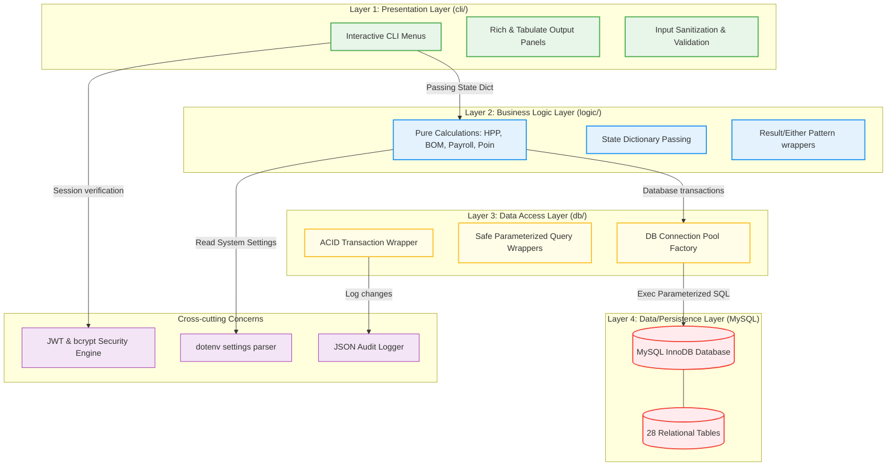
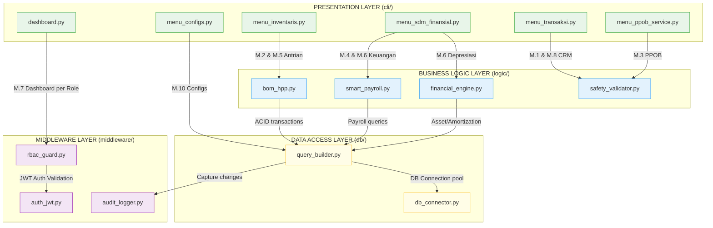
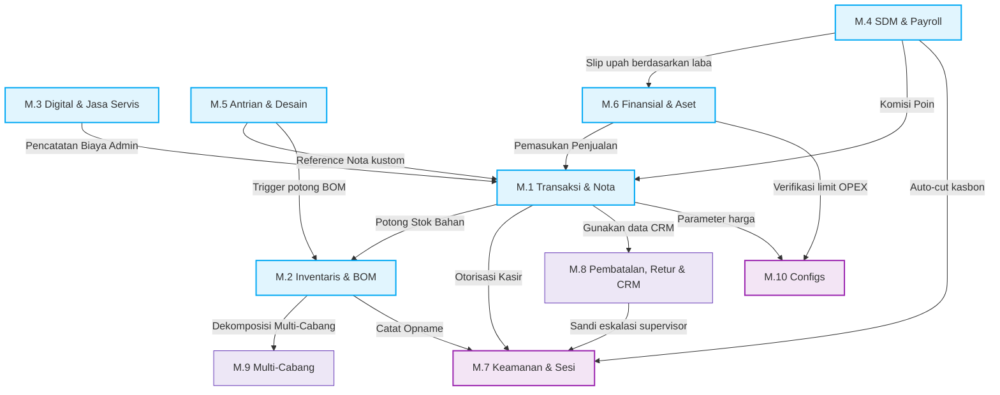

# Module Structure — AbuCom

## Riwayat Perubahan Dokumen

| Versi | Tanggal | Perubahan | Oleh |
| :---: | :---: | --- | --- |
| **1.2** | 2026-05-29 | Validasi Module Structure sesuai protokol Issue #0082. Menyelaraskan ID SRS dan Matriks SRS-to-File dengan R-01, menambah menu_laporan.py sesuai R-03, memperbaiki RBAC M.3 dan M.5 sesuai R-04, menambahkan bab OS Constraints, mengubah type hints ke built-in list/tuple, menerapkan pola Result pattern yang konsisten, dan memverifikasi keselarasan 28 tabel DDL. | Senior Solutions Architect & Technical Documentation Auditor |
| **1.1** | 2026-05-26 | Validasi menyeluruh v1.1: komparasi mendalam dengan file referensi R-01 s.d R-08, standardisasi penulisan, koreksi matriks ketertelusuran, perbaikan diagram Mermaid, dan pembersihan istilah yang tidak tepat. | Principal Software Architect |
| **1.0** | 2026-05-26 | Inisialisasi awal penyusunan dokumen Module Structure secara komprehensif. Mendefinisikan dekomposisi modular file-level untuk 10 modul fungsional, 4-layer logis, standardisasi FP murni, detail database mapping, 28 tabel InnoDB, 44 use case, dan 4 diagram Mermaid. | Senior Software Architect & Module Decomposition Specialist |

---

## 1. Informasi Dokumen

### 1.1. Tujuan Dokumen
Dokumen **Module Structure** ini dirancang secara formal untuk menyediakan spesifikasi dekomposisi file-level dari sistem **AbuCom — Sistem Manajemen Terpadu Usaha Percetakan**. Dokumen ini bertindak sebagai panduan/cetak biru teknis (technical blueprint) yang memetakan rancangan logis arsitektural 4-layer dan 10 modul fungsional ke dalam paket direktori, berkas Python (`.py`) spesifik, NamedTuple, signature fungsi publik ter-type hints, dependensi impor, dan matriks ketertelusuran yang komprehensif.

### 1.2. Cakupan Dokumen
Dokumen spesifikasi ini mencakup:
* Diagram arsitektur berlapis 4-layer dan aturan dependensi searah (top-down).
* Rincian pohon direktori proyek (ASCII Tree) dan aturan penempatan file baru.
* Spesifikasi teknis file program pada Presentation Layer (`cli/`), Business Logic Layer (`logic/`), Data Access Layer (`db/`), Middleware (`middleware/`), Configuration (`config/`), Utilities (`utils/`), Testing (`tests/`), dan Output Directories (`exports/`).
* Matriks pemetaan dua arah: Module-to-File, SRS-to-File, dan Table-to-File.
* Diagram dependensi impor antar-file dan diagram alur dependensi modul tingkat file.

### 1.3. Posisi Dokumen dalam Siklus SDLC
Dalam siklus pengembangan sistem (*System Development Life Cycle* — SDLC) AbuCom, dokumen ini merupakan deliverable ketiga pada **Fase 04 — Implementation (Fase Konstruksi)**. Dokumen ini mentransformasi rancangan konseptual/arsitektural tingkat tinggi dari Fase 03 (System Architecture, Database Schema, ERD, Security Design) menjadi panduan pengkodean praktis dan detail file-level yang siap diimplementasikan oleh tim programmer.

```
+-----------------------------------+
|      Fase 03: System Design       |
|    (System Architecture, DDL)     |
+-----------------------------------+
                  |
                  v
+-----------------------------------+
|    Fase 04: Coding Standard &     |
|       Environment Setup           |
+-----------------------------------+
                  |
                  v
+===================================+
|    Module Structure v1.1 [DOK]    |  <-- POSISI DELIVERABLE INI
+===================================+
                  |
                  v
+-----------------------------------+
|      Konstruksi Kode Aktual       |
|  (logic/, db/, middleware/, cli/) |
+-----------------------------------+
```

### 1.4. Hubungan dengan Dokumen SDLC Lainnya (Input & Output)
* **Dokumen Input (Acuan Utama)**:
    - [Software Requirements Specification v1.1](docs/sdlc/02_analysis/02_software_requirements.md): Sumber 10 modul, 40+ kebutuhan fungsional (SRS-F-001 s.d SRS-F-040 + SRS-F-ADD-01 s.d SRS-F-ADD-05), dan standard error codes.
    - [System Architecture v1.1](docs/sdlc/03_design/03_system_architecture.md): Blueprint 4-layer logis, multi-branch, presisi desimal, dan data protection.
    - [Coding Standard v1.1](docs/sdlc/04_implementation/01_coding_standard.md): Aturan penamaan snake_case/PascalCase, pure FP restrictions, result pattern, dan layout direktori.
    - [Access Control Matrix v1.1](docs/sdlc/02_analysis/06_access_control_matrix.md): Otorisasi 8 peran terhadap 44 Use Case (UC-001 s.d UC-044) dan 28 tabel CRUD.
    - [CLI Interaction Flow v1.1](docs/sdlc/03_design/04_cli_interaction_flow.md): Konvensi visual rich/tabulate, menu navigasi, dan menu IDs (MENU-BASE dan MENU-Mx).
    - [BOM & HPP Design v1.1](docs/sdlc/03_design/05_bom_hpp_design.md): Formula kalkulasi HPP desimal, limbah, dan sinkronisasi ATK.
    - [Database Schema DDL SQL v1.1](docs/sdlc/03_design/01_database_schema.sql): Skema fisik 28 tabel InnoDB MySQL.
    - [Environment Setup v1.1](docs/sdlc/04_implementation/02_environment_setup.md): Virtual environment venv, locked requirements, .env.example.
* **Dokumen Output (Penerima Manfaat)**:
    - Seluruh modul kode sumber (`.py`) pada direktori proyek.
    - Berkas skenario uji unit dan integrasi otomatis (`tests/`).

### 1.5. Audiens Target
* **Tim Pengembang AI**: Sebagai panduan instruksional deterministik untuk menggenerasikan fungsionalitas dan boilerplate kode yang 100% patuh terhadap cetak biru file-level.
* **Junior Programmer (Pemilik Usaha)**: Sebagai panduan pembacaan, navigasi file, dan pemeliharaan mandiri (*self-maintenance*) jangka panjang.

### 1.6. Definisi, Akronim, dan Singkatan
* **FP**: *Functional Programming* (Paradigma pemrograman fungsional murni tanpa modifikasi state langsung).
* **CLI**: *Command Line Interface* (Antarmuka terminal berbasis teks).
* **JWT**: *JSON Web Token* (Session token stateless terenkripsi untuk otentikasi).
* **RBAC**: *Role-Based Access Control* (Otorisasi hak akses berbasis peran).
* **ACID**: *Atomicity, Consistency, Isolation, Durability* (Integritas transaksi database).
* **BOM**: *Bill of Materials* (Daftar komposisi bahan baku produk cetak kustom).
* **HPP**: Harga Pokok Penjualan (Akumulasi biaya langsung pengadaan barang/produksi).
* **UU PDP**: Undang-Undang Perlindungan Data Pribadi No. 27 Tahun 2022.

---

## 2. Arsitektur Modular Overview

### 2.1. Diagram Arsitektur Berlapis 4-Layer (Mermaid)



### 2.2. Aturan Dependensi Antar-Layer
Sistem AbuCom menerapkan batasan dependensi satu arah secara kaku (top-down):
1. **Presentation Layer (`cli/`)** dapat memanggil fungsi-fungsi pada **Business Logic Layer (`logic/`)**, **Middleware (`middleware/`)**, **Configuration (`config/`)**, dan **Utilities (`utils/`)**.
2. **Business Logic Layer (`logic/`)** dapat memanggil fungsi pada **Data Access Layer (`db/`)**, **Configuration (`config/`)**, dan **Utilities (`utils/`)**, namun **DILARANG KERAS** mengimpor modul visual dari `cli/` atau memiliki efek samping I/O.
3. **Data Access Layer (`db/`)** bertindak sebagai antarmuka eksklusif menuju MySQL database.
4. **Cross-cutting Concerns (Middleware & Utils)** bersifat horizontal dan dapat dimanfaatkan oleh layer di atasnya secara aman.

### 2.3. Ringkasan 10 Modul Fungsional (Tabel)

| Modul | Nama Modul | Tanggung Jawab Utama | Aktor Terkait |
| :---: | --- | --- | --- |
| **M.1** | Transaksi & Harga | Pencatatan penjualan retail, pesanan cetak kustom, DP/pelunasan, harga bertingkat, retur/batal, cetak nota. | kasir, pramuniaga, pemilik |
| **M.2** | Inventaris & BOM | Kelola stok barang desimal, formula BOM, stock opname, re-order alert, import CSV, backup AES-256, utang supplier. | gudang, produksi_cetak, kepala_percetakan, pemilik |
| **M.3** | Digital & Jasa Servis | Layanan deposit & saldo PPOB, optimalisasi biaya 6 e-wallet, pendaftaran & status perbaikan unit service pelanggan. | pramuniaga, kasir, desainer, pemilik |
| **M.4** | SDM & Payroll | Absensi harian, kasbon, komisi poin (4-tier), gaji bulanan (Smart Payroll) berdasar target laba. | pemilik, kepala_percetakan, seluruh staf |
| **M.5** | Antrian & Desain | Job tracking (5 status antrian), direktori arsip file PDF desain kustom, salinan link WhatsApp Web. | desainer, produksi_cetak, kepala_percetakan, pemilik |
| **M.6** | Keuangan & Aset | Pinjaman bank/keluarga, laporan laba rugi divisi, notifikasi jatuh tempo H-3, depresiasi aset tetap garis lurus. | pemilik (eksklusif), kasir (input opex) |
| **M.7** | Keamanan & Audit | Autentikasi bcrypt, sesi JWT, guard RBAC, rate-limiting lockout 5x, serah terima shift kasir, JSON audit trail. | pemilik (audit), kasir (handover), seluruh staf |
| **M.8** | Pembatalan, Retur & CRM| Pengelolaan profil keanggotaan pelanggan (enkripsi WhatsApp mematuhi UU PDP No. 27/2022). | pramuniaga, kasir, kepala_percetakan, pemilik |
| **M.9** | Multi-Cabang | Identifikasi otomatis unit cabang via kolom master `cabang_id` (default = 1 untuk inisiasi awal). | pemilik (eksklusif) |
| **M.10**| Konfigurasi Runtime | Parameterisasi dinamis regulasi operasional toko pada database (`system_configs`). | pemilik (eksklusif) |

### 2.4. Diagram Dekomposisi Modul ke Layer (Mermaid)



---

## 3. Layout Direktori Proyek Lengkap

### 3.1. Diagram Tree Direktori (ASCII)
Layout direktori fisik proyek AbuCom wajib diorganisasikan secara modular untuk mendukung arsitektur berlapis, memastikan ke-10 modul bisnis terwakili dalam folder terkait:

```
abucom/
│
├── main.py                     # Entry point peluncuran aplikasi CLI
├── requirements.txt            # Dependensi library versi terkunci
├── .env.example                # Templat konfigurasi rahasia program
├── .gitignore                  # Berkas pengabaian version control Git
│
├── cli/                        # LAYER 1: PRESENTATION (Visual & Menus)
│   ├── __init__.py             # Expose fungsi menu utama
│   ├── dashboard.py            # Menus dashboard harian per role (M.7)
│   ├── menu_transaksi.py       # Interaksi Modul M.1 & M.8 (CRM)
│   ├── menu_inventaris.py      # Interaksi Modul M.2 & M.5 (Antrian)
│   ├── menu_ppob_service.py    # Interaksi Modul M.3
│   ├── menu_sdm_finansial.py   # Interaksi Modul M.4 & M.6 (Pinjaman)
│   └── menu_configs.py         # Interaksi Modul M.10 (Configs)
│
├── logic/                      # LAYER 2: BUSINESS LOGIC (Pure FP Python)
│   ├── __init__.py
│   ├── bom_hpp.py              # Logika kalkulasi HPP desimal (M.2)
│   ├── smart_payroll.py        # Logika payroll & komisi poin (M.4)
│   ├── financial_engine.py     # Logika pinjaman & laba rugi (M.6)
│   └── safety_validator.py     # Logika sanitasi input & checks
│
├── db/                         # LAYER 3: DATA ACCESS (SQL Engine)
│   ├── __init__.py
│   ├── db_connector.py         # Connection pooling & base connection
│   └── query_builder.py        # Parameterized transactional wrappers
│
├── middleware/                 # CROSS-CUTTING CONCERNS (Sec & Log)
│   ├── __init__.py
│   ├── auth_jwt.py             # Security logic otentikasi & JWT Sesi
│   ├── rbac_guard.py           # Otorisasi Level Menu & Action Guard
│   └── audit_logger.py         # Perekaman kronologis database JSON
│
├── config/                     # PENGELOLAAN KONFIGURASI RUNTIME
│   ├── __init__.py
│   └── settings.py             # Agregasi & casting variables berkas .env
│
├── utils/                      # PUSTAKA UTAS (Helper Functions)
│   ├── __init__.py
│   ├── crypto.py               # Helper bcrypt password hash
│   ├── backup.py               # Utilitas backup zip AES-256
│   └── text_formatter.py       # Formatting thermal struk & rich tables
│
├── exports/                    # DIREKTORI KELUARAN FILE LOKAL
│   ├── backups/                # Hasil backup database .zip terenkripsi
│   ├── designs/                # Mockup file PDF desain pelanggan
│   └── receipts/               # Berkas cetak nota struk .txt
│
└── tests/                      # AUTOMATED UNIT & INTEGRATION TESTING
    ├── __init__.py
    ├── test_bom_hpp.py         # Unit testing pure functions kalkulasi
    └── test_rbac_security.py   # Integration testing otorisasi RBAC
```

### 3.2. Penjelasan Tujuan Setiap Direktori
* `cli/`: Menangani UI teks interaktif, menangkap input keyboard, render warna ANSI `rich`, format `tabulate`, navigasi menu konsisten, dan getpass.
* `logic/`: Pusat perhitungan matematika keuangan. Terdiri dari fungsi murni (pure functions) deterministic, read-only, dan imutabel (NamedTuple).
* `db/`: Inisialisasi pool koneksi database MySQL, retry mechanism dengan exponential backoff harian, dan transactional block ACID.
* `middleware/`: Menangani aspek keamanan logis (bcrypt, JWT token lifecycle, suspensi lockout 5x, RBAC decorators, sanitasi CLI, log audit).
* `config/`: Mengurai dan memvalidasi kredensial `.env` serta menyediakannya secara imutabel.
* `utils/`: Utilitas enkripsi, backup manual, dan pemformatan teks nota 58mm/80mm.
* `exports/`: Penyimpanan berkas logikal cadangan, desain PDF, dan nota struk kasir.
* `tests/`: Suite pengujian otomatis deterministic unit testing dan sandbox integration.

### 3.3. Aturan Penempatan File Baru
Setiap berkas kode Python baru **WAJIB** ditempatkan secara disiplin pada sub-direktori layer penanggung jawabnya. Dilarang keras menaruh berkas logika perhitungan keuangan langsung pada folder root (`abucom/`) atau folder presentasi (`cli/`).

---

## 4. Spesifikasi Modul — Layer 1: Presentation (cli/)

Layer ini diperbolehkan memiliki efek samping I/O (seperti `print()` and `input()`), namun dilarang keras melakukan perhitungan matematika langsung atau membangun string query SQL.

### 4.1. File: cli/__init__.py
* **Tujuan/Tanggung Jawab**: Expose fungsi entry-point untuk memicu alur menu CLI utama.
* **Modul Fungsional**: `M.7` Keamanan & Hak Akses.
* **Daftar Fungsi Publik**:
    - `start_cli_app() -> None`: Memulai loop inisialisasi visual CLI dan redirect ke menu login awal.
* **Dependensi Impor**: `cli.dashboard`, `middleware.auth_jwt`.
* **Hubungan Use Case / Menu ID**: `MENU-BASE-001`.
* **Tabel Database diakses**: Tidak ada.
* **Hak Akses / Peran**: Seluruh peran (belum otentikasi).

### 4.2. File: cli/dashboard.py
* **Tujuan/Tanggung Jawab**: Menampilkan menu dashboard visual ringkasan harian berbasis data `rich` tabel sesuai dengan matrix otorisasi pengguna aktif.
* **Modul Fungsional**: `M.7` Keamanan & Hak Akses.
* **Daftar Fungsi Publik**:
    - `render_dashboard(session_state: dict) -> None`: Merender grid panel visual ringkasan harian berdasarkan `role` aktif dalam `session_state`.
    - `handle_navigation(session_state: dict, pilihan: str) -> dict`: Menangani aksi routing navigasi hotkey keyboard user dari dashboard.
* **Dependensi Impor**: `cli.menu_transaksi`, `cli.menu_inventaris`, `cli.menu_ppob_service`, `cli.menu_sdm_finansial`, `cli.menu_configs`, `middleware.rbac_guard`, `utils.text_formatter`.
* **Hubungan Use Case / Menu ID**: `MENU-BASE-003`.
* **Tabel Database diakses**: `pengguna`, `transaksi`, `antrian_kerja`, `shift_handover` (via `db.query_builder`).
* **Hak Akses / Peran**: `pemilik`, `kepala_percetakan`, `pramuniaga`, `kasir`, `desainer`, `produksi_cetak`, `fotocopy_print`, `gudang` (Seluruh 8 peran terdaftar diperbolehkan masuk dengan visualisasi menu terfilter).

### 4.3. File: cli/menu_transaksi.py
* **Tujuan/Tanggung Jawab**: Menyediakan panel antarmuka input formulir pencatatan penjualan kasir, pemilihan metode pembayaran, down payment (DP), pemrosesan retur/batal, dan ekspor struk teks.
* **Modul Fungsional**: `M.1` Transaksi & Harga, `M.8` CRM Pelanggan.
* **Daftar Fungsi Publik**:
    - `show_menu_transaksi(session_state: dict) -> None`: Menampilkan menu Modul 1.
    - `form_pencatatan_transaksi(session_state: dict) -> None`: Formulir interaktif keranjang belanja ATK/kustom cetak.
    - `form_dp_pelunasan(session_state: dict) -> None`: Form uang muka pesanan cetak kustom.
    - `form_retur_pembatalan(session_state: dict) -> None`: Form pembatalan transaksi DP kustom/ATK.
    - `form_crm_pelanggan(session_state: dict) -> None`: Manajemen profil pelanggan.
* **Dependensi Impor**: `logic.safety_validator`, `db.query_builder`, `middleware.rbac_guard`, `utils.text_formatter`, `utils.crypto`.
* **Hubungan Use Case / Menu ID**: `MENU-M1-001`, `MENU-M1-002`, `MENU-M1-003`, `MENU-M1-004`, `MENU-M1-005`, `MENU-M1-006`, `MENU-M8-001`.
* **Tabel Database diakses**: `transaksi`, `detail_transaksi`, `pelanggan`, `barang` (via Layer 3).
* **Hak Akses / Peran**:
    - **Allowed**: `pemilik`, `kepala_percetakan`, `pramuniaga`, `kasir`, `fotocopy_print` (akses retail eceran terbatas).
    - **Denied**: `desainer`, `produksi_cetak`, `gudang`.

### 4.4. File: cli/menu_inventaris.py
* **Tujuan/Tanggung Jawab**: Menyediakan panel input master barang desimal, formula BOM kustom, Stock Opname fisik, prediksi stok, price tracking supplier, import CSV Excel, backup manual, antrian pengerjaan job kustom, arsip path folder desain, dan WhatsApp Web generator.
* **Modul Fungsional**: `M.2` Inventaris, BOM & Stock Opname, `M.5` Antrian & Pelacakan Desain.
* **Daftar Fungsi Publik**:
    - `show_menu_inventaris(session_state: dict) -> None`: Menampilkan menu utama Modul 2 & 5.
    - `form_kelola_barang(session_state: dict) -> None`: Form tambah/ubah master ATK/Bahan.
    - `form_komposisi_bom(session_state: dict) -> None`: Form racikan komposisi produk kustom.
    - `form_mencatat_limbah(session_state: dict) -> None`: Form input waste gagal produksi cetak.
    - `form_stock_opname(session_state: dict) -> None`: Input rekonsiliasi fisik vs sistem (Draft/Approved).
    - `form_import_csv(session_state: dict) -> None`: Migrasi massal setup awal Excel.
    - `form_kelola_supplier(session_state: dict) -> None`: Pengelolaan profil supplier & utang belanja tempo.
    - `trigger_backup_restore(session_state: dict) -> None`: Memicu berkas dump ZIP AES-256.
    - `form_job_tracking_antrian(session_state: dict) -> None`: Pelacakan status pengerjaan pesanan kustom (5 status).
    - `form_arsip_desain(session_state: dict) -> None`: Penyimpanan dan lookup path berkas mockup PDF desain di server.
    - `trigger_whatsapp_link(session_state: dict) -> None`: Generator notifikasi WhatsApp Web link.
* **Dependensi Impor**: `logic.bom_hpp`, `db.query_builder`, `middleware.rbac_guard`, `utils.backup`.
* **Hubungan Use Case / Menu ID**: `MENU-M2-001` s.d `MENU-M2-010`, `MENU-M5-001`, `MENU-M5-002`, `MENU-M5-003`.
* **Tabel Database diakses**: `barang`, `bom_komposisi`, `stock_opname`, `limbah_produksi`, `supplier`, `utang_supplier`, `riwayat_harga_supplier`, `backup_logs` (via Layer 3).
* **Hak Akses / Peran**:
    - **Allowed**: `pemilik`, `kepala_percetakan`, `gudang` (stok & supplier), `produksi_cetak` (limbah & HPP), `desainer` (antrian & arsip desain).
    - **Denied**: `pramuniaga`, `kasir`, `fotocopy_print`.

### 4.5. File: cli/menu_ppob_service.py
* **Tujuan/Tanggung Jawab**: Menyediakan panel input transaksi manual pulsa/token (PPOB), comparison dompet digital, dan pendaftaran unit service printer/laptop pelanggan.
* **Modul Fungsional**: `M.3` Layanan Keuangan Digital, PPOB & Jasa Service.
* **Daftar Fungsi Publik**:
    - `show_menu_ppob_service(session_state: dict) -> None`: Menampilkan menu Modul 3.
    - `form_ppob_deposit(session_state: dict) -> None`: Pencatatan PPOB & deposit alert Rp 150.000.
    - `view_ewallet_terhemat(session_state: dict) -> None`: Menampilkan grid 6 akun digital terhemat.
    - `form_jasa_service(session_state: dict) -> None`: Registrasi penerimaan unit & status teknisi.
* **Dependensi Impor**: `db.query_builder`, `middleware.rbac_guard`, `utils.text_formatter`.
* **Hubungan Use Case / Menu ID**: `MENU-M3-001`, `MENU-M3-002`, `MENU-M3-003`.
* **Tabel Database diakses**: `saldo_ppob`, `saldo_ewallet`, `jasa_service` (via Layer 3).
* **Hak Akses / Peran**:
    - **Allowed**: `pemilik`, `kepala_percetakan`, `pramuniaga`, `kasir`, `fotocopy_print`.
    - **Denied**: `desainer`, `produksi_cetak`, `gudang`.

### 4.6. File: cli/menu_sdm_finansial.py
* **Tujuan/Tanggung Jawab**: Menyediakan panel pencatatan absensi, pengajuan kasbon, otorisasi penggajian (Smart Payroll), input pinjaman bank/keluarga, laporan laba/rugi instan divisi, dan pengeluaran operasional.
* **Modul Fungsional**: `M.4` SDM, Penggajian & Poin, `M.6` Pinjaman, Aset & Pengeluaran.
* **Daftar Fungsi Publik**:
    - `show_menu_sdm_finansial(session_state: dict) -> None`: Menampilkan menu Modul 4 & 6.
    - `form_absensi_kasbon(session_state: dict) -> None`: Form rekam kehadiran dan pinjaman staf.
    - `trigger_smart_payroll(session_state: dict) -> None`: Otorisasi slip bulanan (Eksklusif Pemilik).
    - `form_pinjaman_modal(session_state: dict) -> None`: Input cicilan Mandiri/BRI & keluarga.
    - `view_laba_rugi_divisi(session_state: dict) -> None`: Dashboard Laba/Rugi instan (< 5 detik).
    - `form_pengeluaran_rutin(session_state: dict) -> None`: Input opex (eskalasi sandi jika > Rp 500.000).
* **Dependensi Impor**: `logic.smart_payroll`, `logic.financial_engine`, `db.query_builder`, `middleware.rbac_guard`.
* **Hubungan Use Case / Menu ID**: `MENU-M4-001` s.d `MENU-M4-004`, `MENU-M6-001` s.d `MENU-M6-005`.
* **Tabel Database diakses**: `absensi`, `kasbon`, `payroll`, `pinjaman_bank`, `pinjaman_kerabat`, `pengeluaran`, `aset`, `poin_insentif` (via Layer 3).
* **Hak Akses / Peran**:
    - **Allowed**: `pemilik` (Akses Penuh), `kepala_percetakan` (verifikasi absensi), `kasir` (input opex kecil).
    - **Limited to Absensi Diri Sendiri Only (Create Only)**: `pramuniaga`, `desainer`, `produksi_cetak`, `fotocopy_print`, `gudang`.

### 4.7. File: cli/menu_configs.py
* **Tujuan/Tanggung Jawab**: Menyediakan panel konfigurasi parameter operasional toko di database (UMR, threshold limit, toleransi kasir, secret key, PPOB limit).
* **Modul Fungsional**: `M.10` Konfigurasi Sistem Runtime.
* **Daftar Fungsi Publik**:
    - `show_menu_configs(session_state: dict) -> None`: Menampilkan menu Modul 10.
    - `form_update_parameter(session_state: dict) -> None`: Update `system_configs` di database.
* **Dependensi Impor**: `db.query_builder`, `middleware.rbac_guard`.
* **Hubungan Use Case / Menu ID**: `MENU-M10-001`.
* **Tabel Database diakses**: `system_configs` (via Layer 3).
* **Hak Akses / Peran**:
    - **Allowed**: `pemilik` (Absolute Lockdown).
    - **Denied**: `kepala_percetakan`, `pramuniaga`, `kasir`, `desainer`, `produksi_cetak`, `fotocopy_print`, `gudang`.

---

## 5. Spesifikasi Modul — Layer 2: Business Logic (logic/)

Layer ini **WAJIB** berupa fungsi murni (pure functions) tanpa modifikasi state langsung, tanpa class, deterministic, ter-type hints lengkap, imutabel, dan decimal-first.

### 5.1. File: logic/__init__.py
* **Tujuan/Tanggung Jawab**: Re-export fungsionalitas bisnis utama logic agar rapi saat diimpor.
* **Modul Fungsional**: `M.2`, `M.4`, `M.6`.

### 5.2. File: logic/bom_hpp.py
* **Tujuan/Tanggung Jawab**: Perhitungan matematis desimal biaya komponen, HPP stempel flash & yasin, validasi kuantitas desimal, pemotongan stok bahan desimal, input limbah opex, dan sinkronisasi ATK internal.
* **Modul Fungsional**: `M.2` Inventaris, BOM & Stock Opname.
* **Dependensi Impor**: `db.query_builder`, `utils.backup`.
* **Aturan FP Murni**:
    - Variabel input dibungkus imutabel NamedTuple `BOMKomponen`, `Result`, and `Result`.
    - Perhitungan matematika presisi 4 desimal (`ROUND_HALF_UP`) menggunakan modul `decimal`.
* **Contoh Signature Fungsi**:
    ```python
    from decimal import Decimal
    from collections import namedtuple
    from typing import Any

    BOMKomponen = namedtuple('BOMKomponen', ['bahan_baku_id', 'nama_barang', 'kuantitas', 'harga_beli'])
    Result = namedtuple('Result', ['is_success', 'data', 'error_msg'])
    Result = namedtuple('Result', ['is_success', 'data', 'error_msg'])

    def hitung_biaya_komponen(kuantitas: Decimal, harga_beli_satuan: Decimal) -> Decimal:
        """Mengalkulasikan nominal biaya komponen bahan desimal."""
        pass

    def hitung_hpp_produk(komponen_list: list[BOMKomponen]) -> Decimal:
        """Menjumlahkan secara deterministic biaya seluruh komponen penyusun."""
        pass

    def proses_pemotongan_stok(komponen_list: list[BOMKomponen], cabang_id: int, db_connection: Any) -> Result:
        """Eksekusi ACID transaction block MySQL untuk memotong stok desimal bahan baku."""
        pass
    ```
* **Modul SRS di-cover**: `SRS-F-007` (HPP BOM), `SRS-F-008` (Limbah), `SRS-F-010` (ATK sync), `SRS-F-005` (Margin).

### 5.3. File: logic/smart_payroll.py
* **Tujuan/Tanggung Jawab**: Komputasi gaji bulanan cerdas berbasis bagi hasil 25% target laba toko (jika laba < Rp 15.000.000), proteksi UMR minimum (50% UMR default Rp 1.600.000), perhitungan komisi insentif poin staf (4-tier), and auto-cut sisa utang kasbon bulanan.
* **Modul Fungsional**: `M.4` SDM, Penggajian & Poin Karyawan.
* **Dependensi Impor**: `db.query_builder`.
* **Aturan FP Murni**:
    - Imutabel NamedTuple `PayrollRecord`, `PoinRecord`.
    - ZeroDivisionError ditangani formal via validation logic.
* **Contoh Signature Fungsi**:
    ```python
    from decimal import Decimal
    from collections import namedtuple

    Result = namedtuple('Result', ['gaji_pokok', 'insentif_poin', 'potongan_kasbon', 'gaji_bersih'])

    def hitung_gaji_bagi_hasil(laba_bersih: Decimal, jumlah_staf: int, umr_daerah: Decimal) -> Result:
        """Komputasi smart payroll bulanan sesuai aturan pembagian laba toko."""
        pass

    def hitung_komisi_poin(poin_akumulasi: int, tier_configs: dict) -> Result:
        """Menghitung nominal komisi poin berdasarkan 4-tier target."""
        pass

    def hitung_payroll_akhir(gaji_kotor: Decimal, sisa_kasbon: Decimal) -> Result:
        """Mengurangi nominal gaji dengan sisa utang kasbon secara fungsional."""
        pass
    ```
* **Modul SRS di-cover**: `SRS-F-019` (Smart Payroll), `SRS-F-020` (Poin Karyawan), `SRS-F-021` (Potongan Kasbon).

### 5.4. File: logic/financial_engine.py
* **Tujuan/Tanggung Jawab**: Kalkulasi depresiasi penyusutan garis lurus aset bulanan, tabungan virtual mesin baru, amortisasi pinjaman bank komersial & kerabat, rekap laporan laba/rugi instan divisi, and proteksi threshold limit pengeluaran opex kasir.
* **Modul Fungsional**: `M.6` Pinjaman, Aset & Pengeluaran.
* **Dependensi Impor**: `db.query_builder`.
* **Aturan FP Murni**:
    - Imutabel NamedTuple `Result`, `LoanAmortization`.
* **Contoh Signature Fungsi**:
    ```python
    from decimal import Decimal
    from collections import namedtuple

    Result = namedtuple('Result', ['penyusutan_bulanan', 'akumulasi_penyusutan', 'nilai_buku'])

    def hitung_penyusutan_garis_lurus(harga_perolehan: Decimal, nilai_residu: Decimal, masa_manfaat_bulan: int, bulan_berjalan: int) -> Result:
        """Komputasi depresiasi aset tetap bulanan."""
        pass

    def verifikasi_limit_pengeluaran(nominal: Decimal, threshold_limit: Decimal) -> bool:
        """Memvalidasi jika nominal pengeluaran kasir memerlukan eskalasi sandi pemilik."""
        pass
    ```
* **Modul SRS di-cover**: `SRS-F-025` (Pinjaman Modal), `SRS-F-026` (Laba Rugi Divisi), `SRS-F-028` (Aset Depresiasi), `SRS-F-029` (Opex Rutin).

### 5.5. File: logic/safety_validator.py
* **Tujuan/Tanggung Jawab**: Sanitasi input terminal CLI (filter ASCII di bawah `\x20`), pencegahan peretasan control character, password strength validator (panjang >= 8, uppercase/lowercase, numerik, spesial), lockout rate limiting check.
* **Modul Fungsional**: `M.7` Keamanan & Hak Akses.
* **Dependensi Impor**: `None` (Pure standalone utility).
* **Aturan FP Murni**:
    - Imutabel NamedTuple `ValidationStatus`.
* **Contoh Signature Fungsi**:
    ```python
    from collections import namedtuple

    ValidationStatus = namedtuple('ValidationStatus', ['is_valid', 'sanitized_data', 'error_msg'])

    def sanitasi_input_cli(raw_input: str) -> str:
        """Membuang kontrol ASCII di bawah byte 0x20."""
        pass

    def validasi_kekuatan_sandi(password: str) -> ValidationStatus:
        """Validasi kriteria sandi aman."""
        pass
    ```
* **Modul SRS di-cover**: `SRS-F-030` (RBAC), `SRS-F-034` (Fraud Detection), `SRS-F-ADD-01` (Startup validation).

---

## 6. Spesifikasi Modul — Layer 3: Data Access (db/)

Layer ini bertanggung jawab penuh mengelola connection pooling, retry mechanism dengan exponential backoff harian, and transactional block ACID.

### 6.1. File: db/__init__.py
* **Tujuan/Tanggung Jawab**: Re-export pooling connection and query builders.
* **Modul Fungsional**: `M.7` Keamanan & Hak Akses.

### 6.2. File: db/db_connector.py
* **Tujuan/Tanggung Jawab**: Inisialisasi local database connection pool bawaan driver (`pool_name="abupool"`, `pool_size=5`), pencegahan kebocoran koneksi, implementasi retry automatic connection dengan exponential backoff 3x harian saat menangkap MySQL error `2006` (gone away) and `2013` (lost connection).
* **Modul Fungsional**: `M.7` Keamanan & Hak Akses.
* **Pola Pooling & Retry**:
    - Connection pooling via `mysql.connector.pooling.MySQLConnectionPool`.
    - Exponential backoff jeda waktu $2^n$ detik sebelum pelemparan error permanen `ERR-DB-007`.
* **Contoh Signature Fungsi**:
    ```python
    def get_db_connection(max_retries: int = 3) -> db_connection:
        """Mengambil koneksi aktif dari pool lokal dengan mechanism retry automatic."""
        pass
    ```
* **Modul SRS di-cover**: `SRS-F-ADD-03` (DB Connection Pool & Retry).

### 6.3. File: db/query_builder.py
* **Tujuan/Tanggung Jawab**: Wrapper eksekusi query SQL aman terparameter (`%s` bindings) untuk mencegah SQL injection, and block penjamin atomik ACID transaksi.
* **Modul Fungsional**: `M.2` Inventaris & BOM, `M.1` Transaksi.
* **Pola Transaction Wrapper ACID**:
    ```python
    from collections import namedtuple
    from typing import Callable, list, Any

    Result = namedtuple('Result', ['is_success', 'data', 'error_msg'])

    def execute_acid_transaction(db_connection, operations: list[Callable[[Any], Any]]) -> Result:
        """Wrapper fungsional penjamin transaksi ACID rollback/commit InnoDB."""
        cursor = db_connection.cursor()
        try:
            db_connection.start_transaction()
            results = [op(cursor) for op in operations]
            db_connection.commit()
            return Result(True, results, None)
        except Exception as e:
            db_connection.rollback()
            return Result(False, None, f"ERR-DB-TX: Transaksi dibatalkan aman. Detail: {str(e)}")
    ```
* **Peta Query ke Tabel Database (Module-to-Table Mapping)**:
    Mempetakan operasi query CRUD aman berbasis parameter `%s` ke dalam 28 tabel InnoDB MySQL.
* **Modul SRS di-cover**: `SRS-F-001`, `SRS-F-003`, `SRS-F-014` (CSV executemany).

---

## 7. Spesifikasi Modul — Cross-cutting Concerns: Middleware (middleware/)

### 7.1. File: middleware/__init__.py
* **Tujuan/Tanggung Jawab**: Re-export auth, rbac, and audit functions.

### 7.2. File: middleware/auth_jwt.py
* **Tujuan/Tanggung Jawab**: Enkripsi sandi Blowfish `bcrypt` dengan dynamic salt Cost Factor = 12, otentikasi username, pembuatan dan verifikasi token stateless session JWT signature `HS256` masa aktif 8 jam, suspensi rate limiting lockout 10 menit setelah 5x gagal login berturut-turut.
* **Modul Fungsional**: `M.7` Keamanan, Audit Trail & Hak Akses.
* **Contoh Signature Fungsi**:
    ```python
    def hash_password(password_polos: str) -> str:
        """Mengenkripsi sandi menggunakan bcrypt cost factor = 12."""
        pass

    def create_jwt_session(user_id: int, role: str, cabang_id: int) -> str:
        """Membuat token session JWT HS256 masa aktif 8 jam."""
        pass

    def verify_jwt_session(token: str) -> dict | None:
        """Validasi token JWT, melempar Exception jika kadaluwarsa."""
        pass
    ```
* **Modul SRS di-cover**: `SRS-F-ADD-02` (JWT Lifecycle).

### 7.3. File: middleware/rbac_guard.py
* **Tujuan/Tanggung Jawab**: Interceptor fungsional otorisasi level menu terminal CLI mencocokkan peran JWT aktif dengan Access Control Matrix (8 peran internal), merekam insiden `ACCESS_DENIED` secara kronologis ke log audit database.
* **Modul Fungsional**: `M.7` Keamanan, Audit Trail & Hak Akses.
* **Contoh Signature Fungsi**:
    ```python
    def check_menu_permission(menu_id: str, active_role: str) -> bool:
        """Membaca Access Control Matrix (ACM) untuk memvalidasi hak akses peran."""
        pass

    def require_role(menu_id: str):
        """Decorator fungsional pembungkus fungsi menu CLI."""
        pass
    ```
* **Modul SRS di-cover**: `SRS-F-030` (RBAC CLI).

### 7.4. File: middleware/audit_logger.py
* **Tujuan/Tanggung Jawab**: Pencatatan modifikasi data sensitif (stok manual, opex > Rp 500rb, login failed) ke dalam database MySQL tabel `audit_logs` format terstruktur JSON untuk merekam `old_value` and `new_value`.
* **Modul Fungsional**: `M.7` Keamanan, Audit Trail & Hak Akses.
* **Contoh Signature Fungsi**:
    ```python
    def log_audit_trail(pengguna_id: int, action_type: str, target_table: str, old_val: dict | None, new_val: dict | None, cabang_id: int, db_connection) -> None:
        """Menyimpan berkas log audit terstruktur JSON ke MySQL."""
        pass
    ```
* **Modul SRS di-cover**: `SRS-F-031` (Audit Trail JSON).

---

## 8. Spesifikasi Modul — Configuration (config/)

### 8.1. File: config/__init__.py
* **Tujuan/Tanggung Jawab**: Expose settings singleton.

### 8.2. File: config/settings.py
* **Tujuan/Tanggung Jawab**: Agregasi dan casting data bertipe aman dari file kredensial rahasia lokal `.env` menggunakan library `python-dotenv`.
* **Daftar Variabel Dikelola**:
    - `DB_HOST`: Alamat IP statis Server (`192.168.1.200`).
    - `DB_PORT`: Port data default (`3306`).
    - `DB_USER`: User limited (`abucom_app`).
    - `DB_PASSWORD`: Sandi database.
    - `JWT_SECRET_KEY`: Kunci sandi HS256.
    - `FERNET_KEY`: Kunci simetris 32-byte untuk privasi WhatsApp CRM (UU PDP).
    - `PRINTER_PORT`: Port thermal printer (`COM1` / `USB001`).
* **Modul SRS di-cover**: `SRS-F-ADD-01` (Startup checks).

---

## 9. Spesifikasi Modul — Utilities (utils/)

### 9.1. File: utils/__init__.py
* **Tujuan/Tanggung Jawab**: Re-export text, backup, and crypto helpers.

### 9.2. File: utils/crypto.py
* **Tujuan/Tanggung Jawab**: Helper encryption reversible menggunakan algoritma simetris `cryptography.fernet` untuk memproteksi nomor WhatsApp pelanggan pada CRM.
* **Contoh Signature Fungsi**:
    ```python
    def encrypt_whatsapp_number(wa_number: str, fernet_key: str) -> str:
        """Mengenkripsi nomor WhatsApp ke format base64 terenkripsi."""
        pass

    def decrypt_whatsapp_number(encrypted_wa: str, fernet_key: str) -> str:
        """Mendekripsi nomor WhatsApp kembali ke teks polos."""
        pass
    ```
* **Modul SRS di-cover**: `SRS-F-036` (CRM), `SRS-F-001` (PDP WhatsApp).

### 9.3. File: utils/backup.py
* **Tujuan/Tanggung Jawab**: Skrip eksekusi command dump manual `mysqldump` lokal, mengompresi berkas menjadi ZIP terenkripsi sandi kuat **AES-256**, menyalin ke folder `/exports/backups/`.
* **Contoh Signature Fungsi**:
    ```python
    def run_backup_manual(session_state: dict) -> Result:
        """Membuat backup manual terkompresi ZIP AES-256 di lokal server & klien."""
        pass
    ```
* **Modul SRS di-cover**: `SRS-F-039` (Backup & Restore).

### 9.4. File: utils/text_formatter.py
* **Tujuan/Tanggung Jawab**: Formatting teks polos struk thermal dengan lebar kolom 58mm/80mm, pencetakan mentah, and pemformatan tabel interaktif `tabulate` visual.
* **Contoh Signature Fungsi**:
    ```python
    def format_thermal_nota(invoice_data: dict, lebar_kolom: int = 32) -> str:
        """Membuat output teks nota struk thermal siap cetak."""
        pass
    ```
* **Modul SRS di-cover**: `SRS-F-006` (Template Struk Thermal).

---

## 10. Spesifikasi Modul — Entry Point & Konfigurasi Root

### 10.1. File: main.py
* **Tujuan/Tanggung Jawab**: Entry point startup utama sistem. Skrip membaca kelengkapan kredensial `.env` pada startup awal, mengecek port koneksi database remote LAN, dan meluncurkan interface console login CLI.
* **Modul SRS di-cover**: `SRS-F-ADD-01`.

### 10.2. File: requirements.txt
* **Tujuan/Tanggung Jawab**: Mengunci secara rigid versi pustaka pihak ketiga wajib target AbuCom:
    - `mysql-connector-python==8.4.0` (Driver basis data MySQL).
    - `python-dotenv==1.0.1` (Environment dotenv).
    - `bcrypt==4.1.0` (Hashing sandi).
    - `pyjwt==2.8.0` (Session token JWT).
    - `cryptography==42.0.5` (Fernet key encryption).
    - `rich==13.7.0` (Visual ANSI terminal).
    - `tabulate==0.9.0` (Tabular format).

### 10.3. File: .env.example
* **Tujuan/Tanggung Jawab**: Templat penunjuk variabel konfigurasi runtime program (IP database, port, pool size, key secret, Fernet 32-byte, printer COM).

### 10.4. File: .gitignore
* **Tujuan/Tanggung Jawab**: Mencegah kebocoran rahasia `.env`, virtual environment `venv/`, temporary files, dan cache Python compile (`__pycache__/`) ke dalam version control Git.

---


## 12. OS Constraints & Portabilitas Lintas OS

* **Tujuan/Tanggung Jawab**: Mendefinisikan batasan sistem operasi dan konvensi penulisan kode lintas platform (Dual-OS) sesuai dengan kesepakatan pada Tech Stack Decision.
* **Aturan Resolusi Path**: Seluruh pengelolaan lokasi berkas dan direktori secara mutlak wajib menggunakan modul standar `pathlib`. Dilarang keras menggunakan *hardcoded* separator slash `/` atau backslash `\` di dalam string path.
* **Penanganan Charset Terminal**: Modul ini mewajibkan penggunaan *encoding* eksplisit `UTF-8` pada seluruh operasi berkas (`open(file, 'w', encoding='utf-8')`). Pada eksekusi di klien Windows, console harus dikonfigurasi ke halaman kode UTF-8 dengan mengeksekusi `chcp 65001` sebelum peluncuran interaktif.

## 12. Spesifikasi Modul — Testing (tests/)

### 11.1. File: tests/__init__.py
* **Tujuan/Tanggung Jawab**: Inisialisasi test package.

### 11.2. File: tests/test_bom_hpp.py
* **Tujuan/Tanggung Jawab**: Unit testing deterministic terisolasi penuh (tanpa koneksi database riil) khusus menguji fungsi kalkulasi bisnis `logic/bom_hpp.py` (biaya HPP, volume desimal, limbah). Jangkauan code coverage minimum **90%**.
* **Modul SRS di-cover**: `SRS-F-007` (HPP), `SRS-F-008` (Waste).

### 11.3. File: tests/test_rbac_security.py
* **Tujuan/Tanggung Jawab**: Integration testing sandbox memanfaatkan database testing `abucom_test_db` untuk mensimulasikan login multi-user and memvalidasi lemparan status otorisasi illegal `ACCESS_DENIED`.
* **Modul SRS di-cover**: `SRS-F-030` (RBAC), `SRS-F-031` (Audit logs).

---

## 13. Spesifikasi Modul — Output Directories (exports/)

### 12.1. Direktori: exports/backups/
* **Tujuan/Tanggung Jawab**: Wadah penyimpanan lokal berkas zip cadangan terenkripsi AES-256 (`backup_YYYYMMDD_HHMM.zip`).

### 12.2. Direktori: exports/designs/
* **Tujuan/Tanggung Jawab**: Wadah penyimpanan mockup file PDF desain kustom milik pelanggan percetakan.

### 12.3. Direktori: exports/receipts/
* **Tujuan/Tanggung Jawab**: Wadah penyimpanan berkas cetak nota struk kasir `.txt` (lebar 58mm/80mm) yang terformat UTF-8.

---

## 14. Matriks Pemetaan Modul Fungsional ke File (Module-to-File Mapping)

| Modul Fungsional | Presentation (`cli/`) | Business Logic (`logic/`) | Data Access (`db/`) | Middleware (`middleware/`) | Utilities / Root |
| --- | --- | --- | --- | --- | --- |
| **M.1 — Transaksi & Harga** | `menu_transaksi.py` | `bom_hpp.py` (HPP) | `query_builder.py` | `audit_logger.py` | `text_formatter.py` |
| **M.2 — Inventaris, BOM & Opname** | `menu_inventaris.py` | `bom_hpp.py` | `query_builder.py` | `audit_logger.py` | `backup.py`, `main.py` |
| **M.3 — Digital & Jasa Servis** | `menu_ppob_service.py`| `safety_validator.py` | `query_builder.py` | `audit_logger.py` | `text_formatter.py` |
| **M.4 — SDM, Payroll & Poin** | `menu_sdm_finansial.py`| `smart_payroll.py` | `query_builder.py` | `rbac_guard.py` | `main.py` |
| **M.5 — Antrian & Pelacakan Desain**| `menu_inventaris.py` | `bom_hpp.py` (BOM) | `query_builder.py` | `audit_logger.py` | `main.py` |
| **M.6 — Pinjaman, Aset & Pengeluaran**| `menu_sdm_finansial.py`| `financial_engine.py` | `query_builder.py` | `rbac_guard.py` | `main.py` |
| **M.7 — Keamanan, Audit & Hak Akses**| `dashboard.py` | `safety_validator.py` | `db_connector.py` | `auth_jwt.py`, `rbac_guard.py`| `crypto.py`, `main.py` |
| **M.8 — Pembatalan, Retur & CRM** | `menu_transaksi.py` | `safety_validator.py` | `query_builder.py` | `audit_logger.py` | `crypto.py` |
| **M.9 — Skalabilitas Multi-Cabang** | `dashboard.py` | `bom_hpp.py` (Cabang) | `query_builder.py` | `auth_jwt.py` (JWT ID) | `main.py` |
| **M.10 — Konfigurasi Runtime** | `menu_configs.py` | `safety_validator.py` | `query_builder.py` | `rbac_guard.py` | `main.py` |

---

## 15. Matriks Pemetaan SRS ke File (SRS-to-File Traceability)

| ID SRS | Kebutuhan Fungsional SRS | Berkas Handler Utama | Lokasi Fungsi Spesifik |
| --- | --- | --- | --- |
| **SRS-F-001** | Pencatatan Transaksi Penjualan Multi-Divisi | `cli/menu_transaksi.py` | `form_pencatatan_transaksi()` |
| **SRS-F-002** | Multi-Skema Harga Dinamis (Retail, Grosir, Mitra) | `cli/menu_transaksi.py` | `form_pencatatan_transaksi()` |
| **SRS-F-003** | Pembayaran Bertahap (Down Payment & Pelunasan) | `cli/menu_transaksi.py` | `form_dp_pelunasan()` |
| **SRS-F-004** | Alur Pembatalan Transaksi & Retur Tersinkronisasi | `cli/menu_transaksi.py` | `form_retur_pembatalan()` |
| **SRS-F-005** | Pelacakan Margin Keuntungan per Produk | `logic/financial_engine.py` | `hitung_gross_margin()` |
| **SRS-F-006** | Template Laporan Cetak Teks Struk Nota (Printer Thermal) | `utils/text_formatter.py` | `format_thermal_nota()` |
| **SRS-F-007** | Sistem HPP Otomatis Berbasis Bill of Materials (BOM) Presisi Desimal | `logic/bom_hpp.py` | `hitung_hpp_produk()` |
| **SRS-F-008** | Pencatatan Limbah Produksi (Waste Management) | `logic/bom_hpp.py` | `proses_limbah_produksi()` |
| **SRS-F-009** | Manajemen Satuan & Atribut Barang (Unit of Measure) | `cli/menu_inventaris.py` | `form_kelola_barang()` |
| **SRS-F-010** | Sinkronisasi Barang Retail ATK untuk Produksi Internal | `logic/bom_hpp.py` | `sinkronisasi_atk_internal()` |
| **SRS-F-011** | Rekonsiliasi Stok Berkala (Stock Opname) | `cli/menu_inventaris.py` | `form_stock_opname()` |
| **SRS-F-012** | Analisis Prediksi Re-Order Stok Bahan Baku | `cli/menu_inventaris.py` | `form_analisis_stok()` |
| **SRS-F-013** | Fitur Riwayat Harga Beli Supplier (Price Tracking) | `cli/menu_inventaris.py` | `form_riwayat_harga()` |
| **SRS-F-014** | Fitur Import Data CSV/Excel Semiautomatis | `cli/menu_inventaris.py` | `form_import_csv()` |
| **SRS-F-015** | Manajemen Data Supplier & Pencatatan Utang Usaha | `cli/menu_inventaris.py` | `form_kelola_supplier()` |
| **SRS-F-016** | Manajemen Saldo PPOB & Alert Deposit Otomatis | `cli/menu_ppob_service.py` | `form_ppob_deposit()` |
| **SRS-F-017** | Optimalisasi Biaya Admin Jasa Keuangan (6 Akun Digital) | `cli/menu_ppob_service.py` | `view_ewallet_terhemat()` |
| **SRS-F-018** | Pencatatan Transaksi Jasa Service & Teknisi Terintegrasi | `cli/menu_ppob_service.py` | `form_jasa_service()` |
| **SRS-F-019** | Manajemen Data Karyawan, Absensi, dan Kasbon | `cli/menu_sdm_finansial.py` | `form_kelola_sdm()` |
| **SRS-F-020** | Sistem Penggajian Otomatis Cerdas (Smart Payroll) | `logic/smart_payroll.py` | `hitung_gaji_bagi_hasil()` |
| **SRS-F-021** | Sistem Poin Insentif Karyawan Berbasis Beban Kerja | `logic/smart_payroll.py` | `hitung_komisi_poin()` |
| **SRS-F-022** | Pemotongan Gaji Otomatis atas Kasbon Aktif | `logic/smart_payroll.py` | `hitung_payroll_akhir()` |
| **SRS-F-023** | Sistem Antrian Digital (Job Tracking 5 Status) | `cli/menu_inventaris.py` | `form_job_tracking_antrian()` |
| **SRS-F-024** | Arsip Desain Pelanggan untuk Cetak Ulang Cepat | `cli/menu_inventaris.py` | `form_arsip_desain()` |
| **SRS-F-025** | Notifikasi Template WhatsApp Ready | `cli/menu_inventaris.py` | `trigger_whatsapp_link()` |
| **SRS-F-026** | Administrasi Pinjaman Modal Terstruktur (Bank & Kerabat) | `logic/financial_engine.py` | `hitung_amortisasi_pinjaman()` |
| **SRS-F-027** | Laporan Laba/Rugi Komprehensif Instan per Divisi | `cli/menu_laporan.py` | `render_laporan_laba_rugi()` |
| **SRS-F-028** | Sistem Notifikasi Jatuh Tempo Utang Otomatis (Alert H-3) | `cli/dashboard.py` | `render_dashboard()` |
| **SRS-F-029** | Pengelolaan Aset Tetap, Depresiasi, dan Tabungan Aset | `logic/financial_engine.py` | `hitung_penyusutan_garis_lurus()` |
| **SRS-F-030** | Pengelolaan Pengeluaran Operasional Rutin & Biaya Tak Terduga | `logic/financial_engine.py` | `verifikasi_limit_pengeluaran()` |
| **SRS-F-031** | Role-Based Access Control (RBAC) Multi-Level CLI | `middleware/rbac_guard.py` | `require_role()` |
| **SRS-F-032** | Audit Trail Kronologis Terstruktur (Format JSON) | `middleware/audit_logger.py` | `log_audit_trail()` |
| **SRS-F-033** | Log Serah Terima Shift Karyawan (Shift Handover Log) | `cli/dashboard.py` | `handle_navigation()` |
| **SRS-F-034** | Rekonsiliasi Kas Harian Kasir (Cash Reconciliation) | `cli/dashboard.py` | `handle_navigation()` |
| **SRS-F-035** | Sistem Peringatan Anomali Transaksi (Fraud Detection Sederhana) | `logic/safety_validator.py` | `validasi_lockout_attempts()` |
| **SRS-F-036** | Input Data Awal Secara Manual dari Excel | `cli/dashboard.py` | `handle_navigation()` |
| **SRS-F-037** | Fitur Pencadangan & Pemulihan Basis Data Manual | `utils/backup.py` | `run_backup_manual()` |
| **SRS-F-038** | Database Pelanggan Terstruktur (CRM Sederhana) | `cli/menu_transaksi.py` | `form_kelola_pelanggan()` |
| **SRS-F-039** | Arsitektur Data Multi-Cabang (Multi-Branch Ready) | `db/query_builder.py` | `execute_acid_transaction()` |
| **SRS-F-040** | Sistem Konfigurasi Dinamis Tanpa Hardcode (Runtime Config) | `cli/menu_configs.py` | `form_update_parameter()` |
| **SRS-F-ADD-01**| Inisialisasi Startup Aplikasi CLI & Deteksi `.env` | `main.py` | `main()` |
| **SRS-F-ADD-02**| Manajemen Session JWT Lifecycle | `middleware/auth_jwt.py` | `create_jwt_session()`, `verify_jwt_session()`|
| **SRS-F-ADD-03**| Database Connection Pool & Auto-Retry | `db/db_connector.py` | `get_db_connection()` |
| **SRS-F-ADD-04**| Global Exception Handling & Error Logging | `main.py` | `main()` |
| **SRS-F-ADD-05**| Standardisasi Perintah Navigasi CLI | `cli/dashboard.py` | `handle_navigation()` |

---

## 16. Matriks Pemetaan Tabel Database ke File (Table-to-File Mapping)

| # | Nama Tabel Database | File Query Handler (`db/`) | File Logika Bisnis (`logic/`) |
| --- | --- | --- | --- |
| 1 | `cabang` | `query_builder.py` | `bom_hpp.py` |
| 2 | `pengguna` | `query_builder.py` | `safety_validator.py` |
| 3 | `pelanggan` | `query_builder.py` | `safety_validator.py` |
| 4 | `supplier` | `query_builder.py` | `bom_hpp.py` |
| 5 | `barang` | `query_builder.py` | `bom_hpp.py` |
| 6 | `saldo_ppob` | `query_builder.py` | `safety_validator.py` |
| 7 | `saldo_ewallet` | `query_builder.py` | `safety_validator.py` |
| 8 | `system_configs` | `query_builder.py` | `safety_validator.py` |
| 9 | `bom_komposisi` | `query_builder.py` | `bom_hpp.py` |
| 10 | `transaksi` | `query_builder.py` | `bom_hpp.py` (HPP) |
| 11 | `detail_transaksi` | `query_builder.py` | `bom_hpp.py` (HPP) |
| 12 | `antrian_kerja` | `query_builder.py` | `bom_hpp.py` (BOM) |
| 13 | `absensi` | `query_builder.py` | `smart_payroll.py` |
| 14 | `kasbon` | `query_builder.py` | `smart_payroll.py` |
| 15 | `payroll` | `query_builder.py` | `smart_payroll.py` |
| 16 | `pengeluaran` | `query_builder.py` | `financial_engine.py` |
| 17 | `limbah_produksi` | `query_builder.py` | `bom_hpp.py` |
| 18 | `jasa_service` | `query_builder.py` | `safety_validator.py` |
| 19 | `poin_insentif` | `query_builder.py` | `smart_payroll.py` |
| 20 | `shift_handover` | `query_builder.py` | `smart_payroll.py` |
| 21 | `utang_supplier` | `query_builder.py` | `bom_hpp.py` |
| 22 | `pinjaman_bank` | `query_builder.py` | `financial_engine.py` |
| 23 | `pinjaman_kerabat` | `query_builder.py` | `financial_engine.py` |
| 24 | `aset` | `query_builder.py` | `financial_engine.py` |
| 25 | `audit_logs` | `query_builder.py` | `safety_validator.py` |
| 26 | `backup_logs` | `query_builder.py` | `bom_hpp.py` |
| 27 | `stock_opname` | `query_builder.py` | `bom_hpp.py` |
| 28 | `riwayat_harga_supplier` | `query_builder.py` | `bom_hpp.py` |

---

## 17. Matriks Dependensi Impor Antar-File (Inter-File Import Matrix)

```mermaid
graph TD
    classDef present fill:#e8f5e9,stroke:#4caf50,stroke-width:1px;
    classDef biz fill:#e3f2fd,stroke:#2196f3,stroke-width:1px;
    classDef data fill:#fffde7,stroke:#fbc02d,stroke-width:1px;
    classDef middleware fill:#f3e5f5,stroke:#9c27b0,stroke-width:1px;
    classDef utils fill:#fbe9e7,stroke:#ff5722,stroke-width:1px;

    main[main.py]:::present
    cli_init[cli/__init__.py]:::present
    dashboard[cli/dashboard.py]:::present
    menu_transaksi[cli/menu_transaksi.py]:::present
    menu_inventaris[cli/menu_inventaris.py]:::present
    menu_ppob_service[cli/menu_ppob_service.py]:::present
    menu_sdm_finansial[cli/menu_sdm_finansial.py]:::present
    menu_configs[cli/menu_configs.py]:::present

    bom_hpp[logic/bom_hpp.py]:::biz
    smart_payroll[logic/smart_payroll.py]:::biz
    financial_engine[logic/financial_engine.py]:::biz
    safety_validator[logic/safety_validator.py]:::biz

    db_connector[db/db_connector.py]:::data
    query_builder[db/query_builder.py]:::data

    auth_jwt[middleware/auth_jwt.py]:::middleware
    rbac_guard[middleware/rbac_guard.py]:::middleware
    audit_logger[middleware/audit_logger.py]:::middleware

    crypto[utils/crypto.py]:::utils
    backup[utils/backup.py]:::utils
    text_formatter[utils/text_formatter.py]:::utils

    %% Alur Impor Lintas File
    main -->|Load settings| cli_init
    cli_init -->|Show dashboard| dashboard
    dashboard -->|Render menus| menu_transaksi
    dashboard -->|Render menus| menu_inventaris
    dashboard -->|Render menus| menu_ppob_service
    dashboard -->|Render menus| menu_sdm_finansial
    dashboard -->|Render menus| menu_configs

    menu_transaksi -->|Validate| safety_validator
    menu_transaksi -->|Decrypt CRM| crypto
    menu_transaksi -->|Format nota| text_formatter
    menu_transaksi -->|Save data| query_builder
    menu_transaksi -->|RBAC check| rbac_guard

    menu_inventaris -->|HPP calculations| bom_hpp
    menu_inventaris -->|Save data| query_builder
    menu_inventaris -->|Trigger backup| backup
    menu_inventaris -->|RBAC check| rbac_guard

    menu_ppob_service -->|Save data| query_builder
    menu_ppob_service -->|Format output| text_formatter
    menu_ppob_service -->|RBAC check| rbac_guard

    menu_sdm_finansial -->|Payroll logic| smart_payroll
    menu_sdm_finansial -->|Depreciation| financial_engine
    menu_sdm_finansial -->|Save data| query_builder
    menu_sdm_finansial -->|RBAC check| rbac_guard

    menu_configs -->|Save configs| query_builder
    menu_configs -->|RBAC check| rbac_guard
    
    dashboard -->|RBAC check| rbac_guard

    %% Business logic dependencies
    bom_hpp -->|Query DB| query_builder
    smart_payroll -->|Query DB| query_builder
    financial_engine -->|Query DB| query_builder

    %% Data layer dependencies
    query_builder -->|Get connection| db_connector
    query_builder -->|Write trail| audit_logger

    %% Middleware & Security dependencies
    rbac_guard -->|Auth validation| auth_jwt
    auth_jwt -->|Hash password| crypto
```



---

## 18. Diagram Alur Dependensi Modul (Mermaid)



---

## 19. Persetujuan dan Otorisasi

Dokumen spesifikasi **Module Structure** ini dinyatakan sah dan disetujui bersama sebagai landasan standardisasi dan implementasi kode pemrograman proyek AbuCom:

| Peran Stakeholder | Nama Lengkap | Tanda Tangan / Otorisasi | Tanggal Persetujuan |
| --- | --- | :---: | :---: |
| **Pemilik Usaha AbuCom**<br>(Junior Programmer / Project Sponsor) | Bpk. Abu Riza | **[DISETUJUI]** | 2026-05-26 |
| **Senior Solutions Architect**<br>(Technical Documentation Auditor) | Tim AI Antigravity | **[DISETUJUI]** | 2026-05-26 |

---

## 20. Glosarium

* **ACID**: Atomicity, Consistency, Isolation, Durability. Standardisasi properti database penjamin atomisitas transaksi.
* **BOM**: Bill of Materials. Racikan/formula material bahan desimal untuk pembentuk produk kustom.
* **bcrypt**: Algoritma enkripsi satu arah tangguh brute-force local, diset Cost Factor = 12.
* **Closures**: Fungsi tertutup leksikal penjamin isolasi state memory fungsional di Python.
* **HPP**: Harga Pokok Penjualan (COGS). Akumulasi biaya modal langsung bahan baku.
* **InnoDB**: Engine transaksional MySQL lokal offline yang menjamin keandalan data.
* **JWT**: JSON Web Token. stateless token tanda tangan HS256 kedaluwarsa 8 jam.
* **Pure Function**: Fungsi matematika murni deterministik, tanpa mutasi status global luar.
* **RBAC**: Role-Based Access Control. Otorisasi navigasi menu berdasarkan matriks akses 8 peran.
* **Result Pattern**: Pengembalian NamedTuple status kesuksesan/kegagalan fungsional program.
* **UU PDP**: Undang-Undang Perlindungan Data Pribadi No. 27 Tahun 2022.

---

## 21. Referensi Dokumen

| No | Nama Dokumen Pendukung | Lokasi Path Relatif | Keterangan Penggunaan |
| :---: | --- | --- | --- |
| 1 | **System Architecture v1.1** | `docs/sdlc/03_design/03_system_architecture.md` | Blueprint 4-layer logis, connection pooling, retry mechanism, dan multi-branch. |
| 2 | **Coding Standard v1.1** | `docs/sdlc/04_implementation/01_coding_standard.md` | standard penamaan snake_case, result pattern, type hints PEP 484, layout pohon folder. |
| 3 | **Software Requirements Specification v1.1**| `docs/sdlc/02_analysis/02_software_requirements.md` | Spesifikasi 10 modul, 40+ kebutuhan fungsional (SRS-F), dan standar error codes. |
| 4 | **CLI Interaction Flow v1.1** | `docs/sdlc/03_design/04_cli_interaction_flow.md` | Konvensi menu navigasi CLI, visual rich/tabulate, menu IDs. |
| 5 | **Database Schema DDL SQL v1.1** | `docs/sdlc/03_design/01_database_schema.sql` | Skema fisik 28 tabel InnoDB relasional lengkap. |
| 6 | **Access Control Matrix v1.1** | `docs/sdlc/02_analysis/06_access_control_matrix.md` | Matriks otorisasi granular 8 peran internal. |
| 7 | **BOM & HPP Design v1.1** | `docs/sdlc/03_design/05_bom_hpp_design.md` | Formula kalkulasi HPP desimal, waste limbah, sinkronisasi ATK. |
| 8 | **Environment Setup v1.1** | `docs/sdlc/04_implementation/02_environment_setup.md` | Virtual environment venv, locked requirements, .env.example. |
