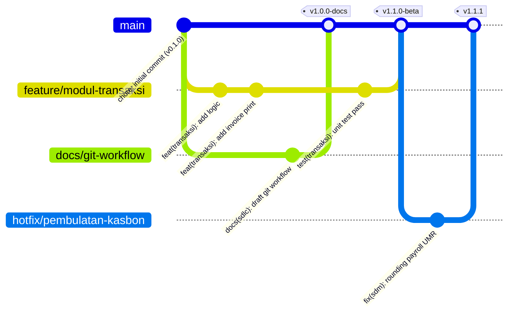
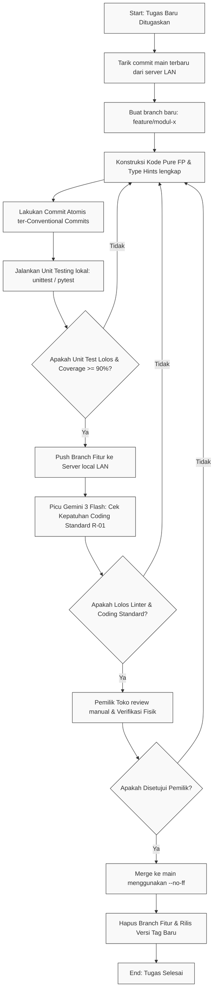
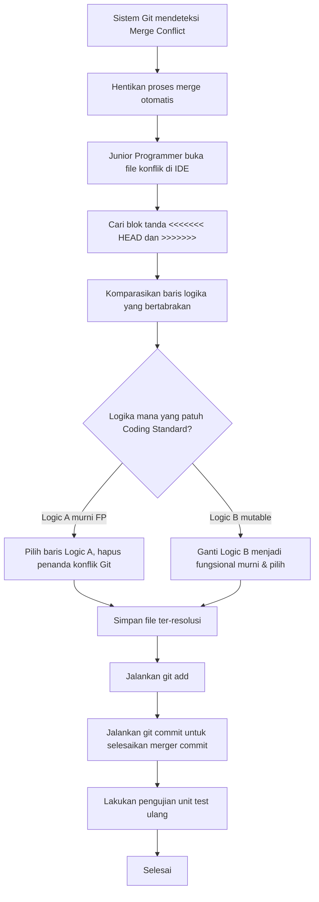

# Git Workflow — AbuCom

## Riwayat Perubahan Dokumen

| Versi | Tanggal | Perubahan | Oleh |
|:---:|:---:|:---|:---|
| **1.2** | 2026-05-29 | Validasi komprehensif berdasarkan Issue #0083 (T1-T10): Menambahkan prosedur initial commit, konfigurasi remote origin ke IP statis 192.168.1.200, penambahan enkripsi AES-256 pada file backup bundle, penyesuaian 16 scope commit, penambahan step notifikasi pada alur hotfix, perlindungan folder handover di .gitignore, serta penyempurnaan struktur dan diksi bahasa Indonesia. | Principal DevOps Architect & Technical Documentation Auditor |
| **1.1** | 2026-05-26 | Validasi komprehensif v1.1: Menyelesaikan seluruh temuan gap dari R-01 s.d R-07, mengintegrasikan 10 larangan mutlak R-01 Bab 16 ke Bab 14, menyempurnakan alur branching modul M.3, menetapkan konvensi commit layer logic/cli dan berkas docs SDLC, menambahkan perintah Git eksak pada setiap langkah alur kerja, mendefinisikan skema manual merge conflict, prosedur eskalasi AI, format laporan review Gemini 3 Flash, instruksi instalasi offline git-filter-repo, rotasi backup USB, email Junior Programmer baku, serta template handover_notes.txt dan lokasi penyimpanannya. | Principal DevOps Engineer & Technical Documentation Architect |
| **1.0** | 2026-05-26 | Inisialisasi awal penyusunan dokumen *Git Workflow* secara komprehensif. Menyelaraskan seluruh spesifikasi versi 1.1 dari Coding Standard, Environment Setup, Module Structure, Tech Stack Decision, System Architecture, Security Design, dan Narasi Pemilik. Mendefinisikan strategi feature branching, konvensi commit message, merge policy, code review quality gate, tagging, versioning, keamanan file sensitif, backup lokal, kolaborasi tim campuran (staf manusia + 6 AI), quick reference commands, dan checklist kepatuhan. | Senior DevOps Engineer & Git Workflow Architect |

---

## 1. Informasi Dokumen

Bab ini menjelaskan informasi umum mengenai dokumen *Git Workflow*, mencakup tujuan, cakupan, posisi dalam SDLC, hubungan dengan dokumen lain, target pembaca, serta definisi istilah.

### 1.1. Tujuan Dokumen
Dokumen **Git Workflow** ini disusun untuk mendefinisikan secara formal, rinci, dan mengikat seluruh standar, prosedur, dan kebijakan pengelolaan version control Git yang akan digunakan oleh seluruh tim pengembang (Junior Programmer dan 6 Model AI) selama proses konstruksi kode program **AbuCom — Sistem Manajemen Terpadu Usaha Percetakan**. Standardisasi ini dirancang untuk menjaga kualitas, ketertelusuran (*traceability*), kolaborasi yang harmonis, dan integritas codebase guna meminimalkan risiko selisih stok finansial, fraud data, atau kegagalan Dual-OS (Windows 11 & Linux Debian 12) pada laci kasir luring.

### 1.2. Cakupan Dokumen
Cakupan aturan dalam dokumen Git Workflow ini meliputi:
*   Prinsip dasar pengelolaan version control lokal offline LAN.
*   Konfigurasi Git awal (Instalasi, Identity, Global Setting, Remote Server, .gitignore, dan .gitattributes).
*   Strategi branching (Feature Branching Model, diagram Mermaid, konvensi penamaan branch, dan proteksi branch).
*   Konvensi commit (Conventional Commits, tipe, scope valid berbasis modul, deskripsi imperative, dan contoh commit Benar vs Salah).
*   Alur kerja pengembangan (flowchart Mermaid, alur kerja feature/bugfix/hotfix/docs).
*   Strategi merge dan conflict resolution (merge policy `--no-ff`, flowchart resolusi konflik, dan aturan preventif).
*   Code review dan quality gate (integrasi 12 checklist Coding Standard R-01, peran Gemini 3 Flash, kriteria kelulusan).
*   Tagging dan versioning (Semantic Versioning SemVer, konvensi tag `vX.Y.Z`).
*   Pengelolaan file sensitif dan keamanan Git (keamanan credentials, audit trail).
*   Prosedur backup dan recovery repository lokal secara offline LAN.
*   Panduan Git khusus untuk tim campuran (Junior Programmer + 6 Model AI).
*   Perintah Git yang sering digunakan (Quick Reference).
*   Checklist kepatuhan pre-merge.

**Di Luar Cakupan (Out-of-scope)**: Dokumen ini tidak mengatur detail teknis penulisan kode sumber (diatur di *Coding Standard*), spesifikasi infrastruktur server fisik (diatur di *System Architecture*), atau pedoman fungsional aplikasi (diatur di berkas *Software Requirements*).

### 1.3. Posisi Dokumen dalam Siklus SDLC
Dalam siklus pengembangan sistem (*System Development Life Cycle* — SDLC) AbuCom, dokumen ini merupakan deliverable keempat pada **Fase 04 — Implementation (Fase Konstruksi)**. Dokumen ini bertindak sebagai panduan operasional wajib guna mematangkan cara pengelolaan kode program yang dihasilkan pada Fase 04 ini.

```
+-----------------------------------+
|    Fase 04: Coding Standard       |
|       (Deliverable ke-1)          |
+-----------------------------------+
                  |
                  v
+-----------------------------------+
|    Fase 04: Environment Setup     |
|       (Deliverable ke-2)          |
+-----------------------------------+
                  |
                  v
+-----------------------------------+
|    Fase 04: Module Structure      |
|       (Deliverable ke-3)          |
+-----------------------------------+
                  |
                  v
+===================================+
|    Fase 04: Git Workflow [INI]    |  <-- POSISI DELIVERABLE INI
|       (Deliverable ke-4)          |
+===================================+
                  |
                  v
+-----------------------------------+
|    Fase 04: Konstruksi Kode       |
|    Aktual per Modul (M.1 - M.10)  |
+-----------------------------------+
```

### 1.4. Hubungan dengan Dokumen SDLC Lainnya (Input & Output)
*   **Dokumen Input (Acuan)**:
    - [Coding Standard v1.2](docs/sdlc/04_implementation/01_coding_standard.md): Acuan Bab 15 (Version Control Git), Bab 17 (Checklist Kepatuhan), standardisasi desimal `decimal.Decimal` dan FP murni.
    - [Environment Setup v1.1](docs/sdlc/04_implementation/02_environment_setup.md): Acuan Bab 9 (Setup Git lokal), Bab 8.5 (Setup .gitignore), credentials setup (.env.example).
    - [Module Structure v1.1](docs/sdlc/04_implementation/03_module_structure.md): Acuan Bab 2.3 (10 modul fungsional), Bab 3.1 (ASCII direktori pohon proyek), Bab 13 (Module-to-File mapping) untuk penentuan scope commit.
    - [Tech Stack Decision v1.1](docs/sdlc/01_planning/04_tech_stack_decision.md): SSoT untuk platform runtime, locked library version, dan dual-OS portabilitas.
    - [System Architecture v1.1](docs/sdlc/03_design/03_system_architecture.md): Diagram topologi LAN offline, isolation level repeatable read, dan connection pool 'abupool'.
    - [Security Design v1.1](docs/sdlc/03_design/06_security_design.md): Spesifikasi UU PDP (whatsapp CRM), enkripsi backup AES-256 ZIP, chmod 700 server, audit log JSON, brute-force rate-limiting, and sanitasi CLI.
    - [Narasi Pemilik](docs/sdlc/narasi.txt): Konteks tim campuran (Junior Programmer + 6 Model AI spesialis).
*   **Dokumen Output (Penerima Manfaat)**:
    - Seluruh proses pengerjaan konstruksi kode fungsional `.py` per modul pada repositori lokal `abucom/`.
    - Unit testing fungsional (`tests/`) and proses QA integrasi database testing.

### 1.5. Audiens Target
*   **Junior Programmer (Pemilik Toko)**: Sebagai panduan operasional integrasi branch, backup database lokal, dan peninjau kode (*reviewer*) utama.
*   **Model AI Pengembang (6 Asisten AI)**: Sebagai instruksi deterministik dan kaku mengenai cara pengerjaan branch, pembuatan pesan commit, atribusi kepemilikan, dan aturan merge.

### 1.6. Definisi, Akronim, dan Singkatan
*   **Branch**: Cabang independen dari codebase program untuk pengerjaan fitur terpisah.
*   **Commit**: Perekaman snapshot perubahan kode secara kronologis di Git.
*   **Merge**: Penggabungan riwayat perubahan dari branch fitur ke branch utama.
*   **SemVer**: *Semantic Versioning* (Format standar penamaan rilis vMAJOR.MINOR.PATCH).
*   **Conventional Commits**: Konvensi penulisan commit message terstruktur (`type(scope): description`).
*   **FP**: *Functional Programming* (Paradigma pemrograman fungsional murni tanpa class).
*   **LAN**: *Local Area Network* (Jaringan offline lokal toko tanpa koneksi luar).
*   **SDLC**: *Software Development Life Cycle* (Siklus hidup pengembangan perangkat lunak).
*   **BOM**: *Bill of Materials* (Daftar komposisi bahan baku produk cetak kustom).
*   **HPP**: Harga Pokok Penjualan (Biaya modal langsung pengadaan produksi).
*   **CRM**: *Customer Relationship Management* (Manajemen hubungan pelanggan).
*   **RBAC**: *Role-Based Access Control* (Otorisasi hak akses berbasis peran).
*   **JWT**: *JSON Web Token* (Session token stateless terenkripsi untuk otentikasi).
*   **ACID**: *Atomicity, Consistency, Isolation, Durability* (Integritas transaksi database).
*   **UoM**: *Unit of Measure* (Satuan terkecil dasar stok barang).
*   **UFW**: *Uncomplicated Firewall* (Firewall default pada server Debian).
*   **UPS**: *Uninterruptible Power Supply* (Perangkat daya cadangan stabiliser Mini PC kasir).

---

## 2. Prinsip Dasar Pengelolaan Version Control

Bab ini memaparkan prinsip dasar dan filosofi pengelolaan version control Git di AbuCom, serta memetakan peran dan wewenang Git untuk setiap anggota tim campuran.

### 2.1. Filosofi Version Control AbuCom
Filosofi pengelolaan Git di AbuCom berlandaskan tiga pilar utama: **"Traceability, Collaboration, and Code Integrity"** (Keterlacakan, Kolaborasi, dan Integritas Kode). 
Setiap perubahan baris kode wajib tercatat dengan jelas siapa pembuatnya (AI mana atau pemilik), apa tujuannya, bagian mana yang berubah (scope modul), dan wajib mempertahankan keselarasan 100% terhadap Coding Standard tanpa merusak state database luring.

### 2.2. Aturan Umum Penggunaan Git
1.  `[WAJIB]` Seluruh pengerjaan kode program (fungsional, utilitas, CLI, middleware, konfigurasi, test suite) wajib dilacak menggunakan repositori Git lokal.
2.  `[DILARANG KERAS]` Melakukan push langsung atau mengedit secara instan kode program di branch utama `main`.
3.  `[WAJIB]` Setiap tugas pengembangan wajib dikerjakan pada branch terpisah (*Feature Branch*) sebelum digabungkan melalui proses *code review* formal.
4.  `[WAJIB]` Seluruh pesan commit wajib mematuhi standar *Conventional Commits* menggunakan bahasa Indonesia profesional.

### 2.3. Peran dan Tanggung Jawab Tim dalam Git Workflow
Kolaborasi pengembangan AbuCom terdiri atas 1 Junior Programmer (manusia) dan 6 Model AI spesialis. Tabel berikut memetakan wewenang Git masing-masing peran secara formal:

| Anggota Tim | Kode Peran | Peran Git dalam Workflow | Cakupan Pekerjaan & Wewenang |
|:---|:---:|:---|:---|
| **Junior Programmer** (Pemilik Usaha) | `STK-000` | Owner, Integrator, Release Manager | Pemilik mutlak branch `main`, verifikator pre-merge quality gate, penilai merger, pengelola backup & tagging rilis. |
| **Gemini 3.1 Pro (High)** | `STK-009` | Heavy Logic Developer | Pengerjaan branch `feature/` modul berat (BOM M.2, Smart Payroll M.4, Financial M.6). |
| **Gemini 3.1 Pro (Low)** | `STK-010` | Routine Developer & Documenter | Pengerjaan branch `feature/` rutin, pembuatan branch `docs/` dokumen SDLC. |
| **Gemini 3 Flash** | `STK-011` | Automated Reviewer & Debugger | Reviewer cepat pre-merge quality gate, pengerjaan branch `bugfix/` or `hotfix/` ringan. |
| **Claude Sonnet 4.6 (Thinking)**| `STK-012` | Deep Coder & UI Specialist | Pengerjaan branch `feature/` FP tingkat tinggi, optimasi CLI `rich` (M.1 & M.5), branch `refactor/`. |
| **Claude Opus 4.6 (Thinking)** | `STK-013` | Security & Cryptography Lead | Pengerjaan branch `feature/` middleware keamanan (M.7), enkripsi Fernet WA (M.8), AES-256 backup. |
| **GPT-OSS 120B (Medium)** | `STK-014` | Boilerplate & Dummy Data Provider | Penyusunan branch `chore/` awal, inisialisasi `schema.sql` dan `seed.sql`. |

---

## 3. Konfigurasi Git Awal

Bab ini menetapkan panduan operasional langkah-demi-langkah untuk melakukan instalasi dan konfigurasi awal Git di sistem operasi dual-platform (Windows 11 dan Linux Debian 12).

### 3.1. Instalasi Git (Windows 11 & Linux Debian 12)
*   **Windows 11 (Klien Kasir)**:
    1.  Unduh installer resmi *Git for Windows* dari `git-scm.com`.
    2.  Jalankan instalasi dengan memilih opsi default, pastikan opsi *Git Bash* dan *Add to PATH* tercentang.
*   **Linux Debian 12 (Server Database)**:
    1.  Sebagai administrator (root), pasang Git secara luring menggunakan berkas `.deb` lokal atau repositori luring:
        `apt-get install git -y`

### 3.2. Konfigurasi Git Identity (user.name, user.email)
Setiap pengembang (staf manusia) wajib mendaftarkan identitas globalnya di mesin masing-masing:
```bash
git config --global user.name "Junior Programmer"
git config --global user.email "donsise@example.com"
```
> ⚠️ **[PERINGATAN SANGAT SENSITIF]**: Sebelum melakukan commit pertama, pemilik usaha fisik (Junior Programmer) `[WAJIB]` mengonfigurasi identitas aslinya. Penggunaan identitas palsu atau pengabaian konfigurasi ini `[DILARANG KERAS]` karena akan merusak ketertelusuran log audit Git yang mendeteksi penanggung jawab fisik riil. Pastikan perintah di atas dijalankan dengan nilai riil Anda (Ganti string `"Junior Programmer"` dengan nama asli Anda dan `"donsise@example.com"` dengan email riil aktif Anda).

### 3.3. Konfigurasi Global Git (core.autocrlf, core.editor, default branch)
Untuk mencegah anomali sintaksis akibat perbedaan line ending sistem operasi dual-OS (Windows 11 menggunakan CRLF `\r\n` sedangkan Debian 12 menggunakan LF `\n`):

1.  **Konfigurasi core.autocrlf**:
    *   Pada Windows Klien Kasir, jalankan perintah berikut:
        `git config --global core.autocrlf true`
    *   Pada Debian Server Database, jalankan perintah berikut:
        `git config --global core.autocrlf input`
    *(Langkah konfigurasi `core.autocrlf` di atas `[WAJIB]` dieksekusi secara manual pada console terminal masing-masing OS klien dan server sebelum melakukan clone atau commit pertama guna menolak kecacatan formatting visual lintasan baris).*
2.  **Konfigurasi Default Branch**:
    Jalankan perintah berikut untuk menggunakan nama branch utama yang konsisten:
    `git config --global init.defaultBranch main`
3.  **Konfigurasi Default Editor**:
    Jalankan perintah berikut untuk menyetel editor default konsol Git:
    `git config --global core.editor nano`

### 3.4. Konfigurasi Remote Server LAN (Origin)
Mengingat AbuCom beroperasi secara lokal (*offline LAN*), repositori pusat berada di Mini PC Server Debian. Klien Kasir (Windows 11) `[WAJIB]` menghubungkan repositori lokalnya ke server:
```cmd
git remote add origin abucom_app@192.168.1.200:/var/git/abucom.git
```
*(Catatan: IP `192.168.1.200` merupakan IP statis server sesuai penetapan di Dokumen System Architecture).*

### 3.5. Inisialisasi Repository Lokal dan Baseline
Buka Windows Terminal (CMD/Bash) di PC Kasir, masuk ke folder proyek dan inisialisasi repositori Git:
```cmd
cd C:\Users\donsise\Documents\abucom
git init
git add .gitignore requirements.txt .env.example main.py
git commit -m "chore: initial commit, setup environment baseline"
```

### 3.6. Konfigurasi File .gitignore (Lengkap)
Buat file `.gitignore` pada root direktori proyek `C:\Users\donsise\Documents\abucom\.gitignore` (gabungan R-01 Bab 15.4 & R-02 Bab 8.5) untuk mencegah kebocoran credentials atau berkas sampah ter-track:
```
# ==============================================================================
# KONFIGURASI PENGABAIAN GIT ABUCOM
# ==============================================================================

# 1. Konfigurasi Rahasia & Kredensial (KEAMANAN SANGAT SENSITIF)
.env
.env.test

# 2. Python Cache, Compiler & Runtime Environments
__pycache__/
*.pyc
*.pyo
*.pyd
.pytest_cache/
.coverage
htmlcov/
venv/
ENV/
pip_wheels/

# 3. Hasil Backup, Desain, Struk Kasir Lokal & Handover Notes
exports/backups/*
exports/designs/*
exports/receipts/*
exports/handover/*
!exports/backups/.gitkeep
!exports/designs/.gitkeep
!exports/receipts/.gitkeep
!exports/handover/.gitkeep

# 4. Berkas Temporary Sistem Operasi & IDE
Thumbs.db
Desktop.ini
.DS_Store
.vscode/
.idea/
*.log
*.bak
```

### 3.7. Konfigurasi File .gitattributes (Line Ending Cross-OS)
Buat file `.gitattributes` pada root direktori proyek `C:\Users\donsise\Documents\abucom\.gitattributes` untuk memaksa penanganan line ending yang konsisten lintas platform Dual-OS secara kaku:
```
# ==============================================================================
# ATRIBUSI LINE ENDING DUAL-OS ABUCOM
# ==============================================================================

# Atur default penanganan teks secara otomatis
* text=auto

# Paksa file Python, Markdown, SQL, dan Teks menggunakan line-feed (LF) khas Linux
*.py text eol=lf
*.md text eol=lf
*.sql text eol=lf
*.txt text eol=lf

# Paksa file batch script Windows menggunakan carriage-return + line-feed (CRLF)
*.bat text eol=crlf
*.cmd text eol=crlf
```
> ⚠️ **[INSTRUKSI OPERASIONAL VERIFIKASI]**: Pengembang `[WAJIB]` menuangkan berkas ini di root proyek untuk memproteksi integritas visual terminal rich.
> Untuk memverifikasi bahwa `.gitattributes` sudah bekerja memaksa penanganan LF secara presisi, jalankan perintah pengujian visual berikut di terminal:
> ```bash
> git check-attr eol -- logic/transaksi.py
> # Output yang diharapkan: logic/transaksi.py: eol: lf
> ```
> Jika output tidak sesuai (misal masih bertipe `crlf`), hapus indeks Git cache lokal dan lakukan reset:
> ```bash
> git rm --cached -r .
> git reset --hard HEAD
> ```

---

## 4. Strategi Branching

Bab ini merinci strategi feature branching yang digunakan untuk mengisolasi pengerjaan fitur, perbaikan bug, pembaruan dokumentasi, dan pemeliharaan konfigurasi.

### 4.1. Model Branching yang Diadopsi (Feature Branching Model)
Sistem AbuCom mengadopsi model **Feature Branching**. Model ini membatasi branch utama `main` agar selalu berada dalam keadaan bersih, steril, stabil, dan siap dirilis ke komputer kasir riil toko harian. Seluruh pengerjaan modul, perbaikan bug, atau penyusunan dokumen SDLC wajib diisolasi di branch-branch fitur tersendiri.

### 4.2. Diagram Alur Branching (Mermaid)



### 4.3. Daftar Branch dan Fungsinya

| Nama Branch | Tujuan / Tanggung Jawab Utama | Pembuat Branch | Kebijakan Merge ke `main` |
|:---|:---|:---|:---|
| **`main`** | Baseline produksi steril, menampung kode stabil yang sedang berjalan aktif di toko. | `STK-000` (Eksklusif) | `[DILARANG KERAS]` push langsung. Hanya boleh menerima merge dari branch fitur setelah lolos quality gate. |
| **`feature/<nama-modul>`** | Pengembangan use case baru modul fungsional (M.1 s.d M.10). | Model AI Coder (`STK-009`, `STK-012`, dll.) | `[WAJIB]` melalui *Pull Request/Merge Request* dengan verifikasi code review Gemini 3 Flash. |
| **`bugfix/<deskripsi-bug>`** | Perbaikan kesalahan atau celah logika yang ditemukan pada lingkungan development. | `STK-011` (Gemini Flash) / Developer terkait | Penggabungan normal setelah unit testing perbaikan dinyatakan sukses. |
| **`hotfix/<deskripsi-hotfix>`**| Perbaikan darurat atas anomali data di lingkungan produksi yang menghambat operasional toko. | `STK-000` atau Coder Keamanan (`STK-013`) | Penggabungan cepat setelah diverifikasi mandiri oleh pemilik. |
| **`docs/<nama-dokumen>`** | Penyusunan draf atau revisi dokumen SDLC di subfolder `docs/`. | `STK-010` (Gemini Pro Low) | Penggabungan langsung setelah disetujui format bahasanya oleh pemilik. |
| **`refactor/<deskripsi>`** | Restrukturisasi struktur `logic/` atau `db/` tanpa merubah output fungsi bisnis. | `STK-012` (Claude Sonnet) | `[WAJIB]` lolos 100% regression testing logic. |
| **`chore/<deskripsi>`** | Pemeliharaan berkas konfigurasi, ignore list, requirements.txt, or seed.sql. | `STK-014` (GPT-OSS) / Developer terkait | Penggabungan normal. |

### 4.4. Konvensi Penamaan Branch

| Tipe | Format Penamaan | Contoh Benar (✅) | Contoh Salah (❌) |
|:---|:---|:---|:---|
| **Feature** | `feature/modul-<nama-modul-singkat>` | `feature/modul-transaksi` | `feature/M1-Transaksi-Baru` |
| **Bugfix** | `bugfix/<nama-fitur-terkait>` | `bugfix/stok-minus-opname` | `bugfix/stok-error` |
| **Hotfix** | `hotfix/<deskripsi-singkat-darurat>` | `hotfix/jwt-expire-crash` | `hotfix/maling-stok` |
| **Docs** | `docs/<nama-dokumen-singkat>` | `docs/git-workflow` | `docs/workflowgit` |
| **Refactor**| `refactor/<modul-dan-bagian>` | `refactor/db-connector-pool` | `refactor/perapihan-kode` |
| **Chore** | `chore/<deskripsi-tugas>` | `chore/update-requirements` | `chore/requirements` |

> 💡 **[SKENARIO KASUS MODUL M.3 (DIGITAL & JASA SERVIS)]**:
> *   **Branch yang Dibuat**: `feature/modul-ppob-m3`
> *   **Aktor Pembuat**: `STK-010` (Gemini 3.1 Pro Low) selaku Routine Developer & Documenter.
> *   **Perintah Git Eksak (Memulai Pengerjaan)**:
>     ```bash
>     git checkout main
>     git pull origin main
>     git checkout -b feature/modul-ppob-m3
>     ```

### 4.5. Aturan Proteksi Branch (Branch Protection Rules)
1.  `[DILARANG KERAS]` Melakukan modifikasi langsung, commit mentah, atau force-push (`git push --force`) pada branch `main`.
2.  `[WAJIB]` Setiap proses penggabungan branch fitur ke `main` wajib berstatus bebas konflik (*conflict-free*).
3.  `[WAJIB]` Setiap merge ke `main` wajib dilampiri review persetujuan dari Gemini 3 Flash (`STK-011`) dan ditandatangani manual oleh pemilik (`STK-000`).

### 4.6. Siklus Hidup Branch (Branch Lifecycle)
1.  **Dibuat**: Branch fitur diturunkan langsung dari status commit `main` terbaru (`git checkout -b feature/modul-x main`).
2.  **Koding & Commit**: Pengembang melakukan pengerjaan, commit berkala di branch fitur, dan push ke server testing LAN.
3.  **Merge & Hapus**: Setelah branch fitur disetujui, pemilik melakukan merge ke `main` menggunakan kebijakan `--no-ff`. Branch fitur lokal dan remote wajib **langsung dihapus** (`git branch -d feature/modul-x`) untuk menjaga codebase tetap rapi.

---

## 5. Konvensi Commit

Bab ini menjelaskan standar penulisan pesan commit terstruktur berbasis konvensi Conventional Commits demi menjaga kerapian dan keterbacaan riwayat repositori Git.

### 5.1. Format Commit Message (Conventional Commits)
Setiap pesan commit wajib ditulis terstruktur menggunakan format **Conventional Commits** standar industri dalam bahasa Indonesia profesional:
```
<type>(<scope>): <description>

[Optional Body]

[Optional Footer / Co-authored attribution]
```

### 5.2. Daftar Tipe Commit yang Diizinkan

| Tipe Commit | Kategori / Tanggung Jawab Perubahan | Contoh Pesan Commit (Bahasa Indonesia) |
|:---:|:---|:---|
| **`feat`** | Penambahan fungsionalitas bisnis baru. | `feat(transaksi): tambah kalkulasi harga grosir M1` |
| **`fix`** | Perbaikan bug, kesalahan logika, or celah keamanan. | `fix(sdm): koreksi sisa kasbon potong payroll M4` |
| **`docs`** | Pembaruan draf dokumen SDLC or inline docstrings Python.| `docs(sdlc): susun spesifikasi git workflow v1.2` |
| **`chore`** | Pemeliharaan config, .gitignore, dependencies, DDL. | `chore(config): tambah dependensi cryptography di requirements` |
| **`test`** | Pembuatan or perbaikan unit/integration tests suite. | `test(inventaris): tambah unit test logic bom hpp` |
| **`refactor`**| Restrukturisasi kode tanpa merubah logika luar. | `refactor(db): optimasi connection pool factory db_connector` |
| **`style`** | Whitespace, formatting PEP 8, without logic changes. | `style(cli): perbaiki indentasi panel menu transaksi` |
| **`perf`** | Peningkatan efisiensi waktu eksekusi kode. | `perf(keuangan): kompresi pemrosesan query laba rugi instan` |
| **`revert`** | Membatalkan / me-rollback commit sebelumnya. | `revert: batalkan commit feat transaksi grosir` |
| **`ci`** | Perubahan konfigurasi alur integrasi CI/CD. | `ci: tambah script test checking linter` |
| **`build`** | Perubahan sistem build, setup wheels offline. | `build: setup local deb package installer` |

### 5.3. Aturan Scope Commit
Scope commit mendefinisikan bagian modul logis atau direktori layer mana yang dimodifikasi. Pengembang `[WAJIB]` menggunakan salah satu dari **16 scope resmi** berikut (sesuai Module Structure R-03 dan kebutuhan ekosistem):

`transaksi`, `inventaris`, `ppob`, `sdm`, `antrian`, `keuangan`, `keamanan`, `crm`, `cabang`, `config`, `db`, `cli`, `middleware`, `utils`, `logic`, `sdlc`.

### 5.4. Aturan Deskripsi Commit
*   Menggunakan huruf kecil di awal deskripsi (kecuali nama singkatan standard).
*   Menggunakan kata kerja bernada *imperative* (perintah) dalam bahasa Indonesia (misal: `tambah`, `koreksi`, `hapus`, `optimasi`, bukan *menambah*, *memperbaiki*).
*   Panjang deskripsi baris pertama maksimal **72 karakter** demi keterbacaan split-screen.

### 5.5. Aturan Body dan Footer Commit (Opsional)
*   **Body**: Menjelaskan konteks "mengapa" perubahan dilakukan dan "bagaimana" cara kerjanya jika kompleks.
*   **Footer**: Merekam pemutusan breaking changes (`BREAKING CHANGE:`) atau referensi issue terkait (misal: `Resolves: #0041`).
*   **Co-authored-by**: Atribusi wajib untuk AI (Detail di Bab 12).

### 5.6. Contoh Commit Message Lengkap (Benar vs Salah)

| Contoh Benar (✅) | Contoh Salah (❌) | Alasan Penolakan Salah |
|:---|:---|:---|
| `feat(transaksi): tambah uang muka DP pesanan kustom` | `Menambahkan fitur DP di menu kasir` | Tanpa tipe semantic, bahasa non-imperative, tidak ada scope. |
| `fix(sdm): koreksi sisa kasbon potong payroll` | `FIX BUG GAJI KASIR` | Huruf kapital penuh, tanpa scope, deskripsi tidak deskriptif. |
| `docs(sdlc): draft git workflow` | `docs: up` | Deskripsi terlalu pendek, scope tidak didefinisikan. |
| `chore(db): migrasi schema sql InnoDB` | `update schema.sql` | Tanpa tipe semantic, format berantakan. |

### 5.7. Aturan Atomisitas Commit (Atomic Commits)
Setiap commit `[WAJIB]` merepresentasikan **satu perubahan logis tunggal yang utuh**.

> ⚠️ **[PANDUAN KHUSUS COMMIT LINTAS-LAYER & DOKUMEN]**:
> 1.  **Larangan Commit Lintas-Layer (Logic vs CLI)**: Jika pengembang AI mengubah file logika `logic/transaksi.py` dan menu presentasi `cli/menu_transaksi.py` secara bersamaan, perubahan tersebut `[DILARANG KERAS]` digabungkan dalam satu commit. Perubahan wajib dipecah menjadi dua commit terpisah demi mempertahankan batasan arsitektural:
>     *   Commit 1 (Layer 2 - Business Logic): `feat(logic): tambah kalkulasi diskon grosir M1`
>     *   Commit 2 (Layer 1 - Presentation): `feat(cli): tambah form input diskon grosir M1`
> 2.  **Commit Berkas Dokumentasi SDLC Baru**: Untuk pembuatan atau revisi berkas draf dokumen perencanaan SDLC, gunakan tipe `docs` dengan scope `sdlc`. Contoh:
>     `docs(sdlc): tambah berkas spesifikasi git workflow v1.2`

---

## 6. Alur Kerja Pengembangan (Development Workflow)

Bab ini menguraikan alur kerja pengembangan harian secara taktis bagi seluruh anggota tim pengembang, mulai dari inisialisasi tugas hingga merge ke main.

### 6.1. Diagram Alur Kerja Lengkap (Mermaid — Flowchart)



### 6.2. Langkah-Langkah Detail Alur Kerja (Operasional dengan Command Eksak)
Setiap pengembang `[WAJIB]` menjalankan perintah Git eksak berikut secara kronologis sepanjang siklus tugas:

1.  **Sinkronisasi main lokal**: Tarik commit main terbaru dari server LAN:
    ```bash
    git checkout main
    git pull origin main
    ```
2.  **Isolasi (Pembuatan Branch Fitur)**: Buat branch baru yang representatif:
    ```bash
    git checkout -b feature/modul-ppob-m3
    ```
3.  **Koding & Commit**: Terapkan fungsional murni Python 3.14.2+, type hints PEP 484, dan docstring PEP 257. Lakukan staged commit atomis ter-Conventional Commits berkala:
    ```bash
    git add logic/ppob_service.py
    git commit -m "feat(ppob): tambah kalkulasi biaya deposit M3"
    ```
4.  **Verifikasi Lokal**: Jalankan pengujian unittest fungsional, ukur code coverage logic minimal 90%:
    ```bash
    pytest tests/
    coverage run -m pytest tests/ && coverage report -m
    ```
5.  **Quality Check & Push**: Push branch fitur ke server lokal LAN:
    ```bash
    git push origin feature/modul-ppob-m3
    ```
    *(Minta review otomatis dari Gemini 3 Flash `STK-011`, disusul persetujuan integrasi visual Junior Programmer `STK-000`).*
6.  **Integrasi (Merge & Hapus Branch)**: Gabungkan branch fitur secara non-fast-forward dan hapus branch lokal:
    ```bash
    git checkout main
    git merge --no-ff feature/modul-ppob-m3 -m "feat(ppob): gabungkan modul ppob digital M3"
    git branch -d feature/modul-ppob-m3
    ```

### 6.3. Alur Kerja untuk Penambahan Fitur Baru (Feature Workflow)
Wajib mematuhi alur step-by-step di atas secara kaku. Semua file logic bisnis baru dilarang ditaruh langsung di root folder melainkan diletakkan rapi pada folder layer-nya (misal `logic/` atau `cli/`).

### 6.4. Alur Kerja untuk Perbaikan Bug (Bugfix Workflow)
1.  Buat branch perbaikan dari main terbaru: `git checkout -b bugfix/stok-opname-minus`.
2.  Perbaiki kode logika, buat unit test baru khusus untuk menangkap kasus edge case tersebut.
3.  Commit dengan tipe `fix`, jalankan review, dan merge kembali ke main.

### 6.5. Alur Kerja untuk Perbaikan Darurat (Hotfix Workflow)
1.  Ditransmisikan saat server produksi offline di toko mengalami crash fatal.
2.  `[WAJIB]` **Notifikasi dan penghentian (*freeze*)**: Junior Programmer wajib menghentikan sementara seluruh aktivitas koding model AI yang sedang berjalan di branch fitur lain guna mencegah konflik merge yang fatal saat hotfix diintegrasikan.
3.  Buka branch hotfix: `git checkout -b hotfix/jwt-signature-key`.
4.  Perbaiki nilai parameter rahasia di `.env` (atau perbaikan middleware).
5.  Commit `fix(keamanan): perbaiki token validation`, merge langsung ke main, dan tag sebagai patch rilis.
6.  Cabut status pembekuan (*unfreeze*) agar AI dapat melanjutkan sinkronisasi dari `main` terbaru.

### 6.6. Alur Kerja untuk Pembaruan Dokumentasi (Docs Workflow)
1.  Turunkan branch dokumentasi: `git checkout -b docs/audit-logs`.
2.  Edit file `.md` terkait di folder `docs/`.
3.  Commit `docs(sdlc): perbarui tabel audit logs`, merge ke main.

---

## 7. Strategi Merge dan Conflict Resolution

Bab ini menguraikan kebijakan merge commit non-fast-forward dan memandu langkah-langkah resolusi konflik secara manual apabila terjadi tabrakan baris kode program.

### 7.1. Kebijakan Merge (Merge Policy)
Sistem AbuCom menerapkan kebijakan **Merge Commit non-fast-forward (`--no-ff`)** untuk setiap penggabungan branch fitur ke branch utama.
*   **Justifikasi**: Kebijakan `--no-ff` memaksa Git untuk selalu membuat commit merger baru. Hal ini sangat penting untuk menjaga keterbacaan pohon sejarah repositori (*history graph*) secara terstruktur, sehingga Junior Programmer dapat melacak kapan satu fitur modul spesifik diintegrasikan secara utuh.
*   `[DILARANG KERAS]` Menggunakan perintah rebase (`git rebase`) pada branch bersama karena merusak integritas garis waktu kontribusi AI.

### 7.2. Prosedur Merge Branch Fitur ke Main
Saat penggabungan siap dieksekusi oleh Pemilik Toko (`STK-000`):
```bash
# Pindah ke branch main
git checkout main

# Pastikan main lokal terupdate
git pull origin main

# Lakukan penggabungan dengan mematikan fast-forward
git merge --no-ff feature/modul-inventaris -m "chore(db): gabungkan modul inventaris M2"
```

### 7.3. Prosedur Penanganan Merge Conflict
Jika dua pengembang AI mengubah baris file Python yang sama dan memicu *Merge Conflict*:
1.  Sistem Git akan menghentikan proses merge dan menandai bagian file yang konflik menggunakan tag `<<<<<<< HEAD` dan `>>>>>>>`.
2.  Programer manusia (Junior Programmer) `[WAJIB]` turun tangan secara langsung melakukan resolusi konflik secara manual menggunakan editor kode.
3.  Pilih logika kode fungsional yang paling patuh terhadap Coding Standard (prioritaskan imutabilitas data dan presisi desimal `ROUND_HALF_UP`).
4.  Simpan file hasil resolusi, bersihkan terminal, tambahkan file ke area staging, dan selesaikan commit merge:
    ```bash
    git add logic/bom_hpp.py
    git commit -m "fix(conflict): resolusi konflik penggabungan stok desimal M2"
    ```

> ⚠️ **[PROSEDUR ESKALASI KONFLIK TIM CAMPURAN]**:
> Jika terjadi konflik pada logika bisnis yang kompleks dan Junior Programmer (`STK-000`) ragu dalam menentukan keputusan:
> 1.  `[WAJIB]` Batalkan proses merge sementara menggunakan perintah:
>     `git merge --abort`
> 2.  Delegasikan penugasan analisis komparasi kepada model AI spesialis logika berat `STK-009` (Gemini 3.1 Pro High) atau `STK-013` (Claude Opus 4.6).
> 3.  AI terpilih wajib menyerahkan laporan komparasi keaslian fungsionalitas dan pematuhan presisi desimal `ROUND_HALF_UP`.
> 4.  Junior Programmer mengeksekusi merge ulang berdasarkan rekomendasi tertulis AI yang paling optimal dan aman untuk keuangan toko.

### 7.4. Diagram Alur Resolusi Konflik (Mermaid)



### 7.5. Aturan Pencegahan Konflik (Preventive Rules)
1.  **Sering Pull**: Lakukan sinkronisasi `git pull` secara berkala sebelum memulai menulis baris kode baru.
2.  **Scope Terisolasi**: Batasi modifikasi file hanya pada matriks tanggung jawab modul Anda (Sesuai Bab 13 Module Structure R-03). Jangan menyentuh file milik modul lain tanpa izin.
3.  **Koordinasi AI**: Model-model AI wajib membaca status branch aktif sebelum meluncurkan pengerjaan.

---

## 8. Code Review dan Quality Gate

Bab ini menjabarkan gerbang kualitas (quality gate) yang wajib dilalui setiap branch sebelum diizinkan menyatu ke main, melibatkan review otomatis dan manual.

### 8.1. Prosedur Code Review Sebelum Merge
Setiap branch fitur yang telah diselesaikan wajib melalui tinjauan kode (*code review*) di repositori lokal LAN sebelum diperbolehkan menyatu ke `main`:
1.  Developer AI memicu pengajuan tinjauan ke Junior Programmer.
2.  Tinjauan otomatis dijalankan terlebih dahulu untuk menyaring kesalahan sintaksis kasat mata.
3.  Pemilik Toko melakukan review visual akhir secara manual pada berkas diff perubahan.

### 8.2. Peran Reviewer dalam Tim AbuCom
*   **Reviewer Otomatis (Gemini 3 Flash — `STK-011`)**: Bertanggung jawab mengecek kepatuhan sintaksis terhadap Coding Standard R-01, mendeteksi jika ada pendefinisian `class` ilegal, mengecek presisi desimal uang, dan memfilter credentials hardcoded.
*   **Reviewer Akhir (Junior Programmer — `STK-000`)**: Pemilik toko memverifikasi kecocokan fungsi terhadap workflow operasional kasir fisik dan menandatangani persetujuan merger.

> 📝 **[FORMAT LAPORAN REVIEW OTOMATIS GEMINI 3 FLASH]**:
> Reviewer Otomatis (`STK-011`) `[WAJIB]` menyerahkan laporan hasil review dalam berkas markdown dengan format struktur berikut:
> ```markdown
> # LAPORAN QUALITY GATE AUTOMATED REVIEW - ABUCOM
> Branch Target : feature/modul-ppob-m3
> Reviewer ID   : STK-011 (Gemini 3 Flash)
> Status Akhir  : [PASSED / FAILED]
> 
> ## Evaluasi 12 Checklist Kepatuhan Coding Standard:
> 1. FP Purity (No Class)    : [OK / VIOLATION]
> 2. PEP 484 Type Hints      : [OK / VIOLATION]
> 3. Decimal & ROUND_HALF_UP : [OK / VIOLATION]
> 4. SQL Parameterized (%s)  : [OK / VIOLATION]
> 5. ACID Transaction InnoDB : [OK / VIOLATION]
> 6. .env Ignored            : [OK / VIOLATION]
> 7. Pathlib Cross-OS        : [OK / VIOLATION]
> 8. Rich Panels & Tabulate  : [OK / VIOLATION]
> 9. Dual-OS compatibility   : [OK / VIOLATION]
> 10. Locked requirements.txt: [OK / VIOLATION]
> 11. Code Coverage >= 90%   : [OK / VIOLATION]
> 12. WhatsApp CRM Fernet    : [OK / VIOLATION]
> 
> ## Detail Pelanggaran & Rekomendasi (Jika FAILED):
> *   **File**: `logic/ppob_service.py` Line 42
>     *   *Pelanggaran*: Penggunaan literal float `150.0` untuk perhitungan saldo.
>     *   *Rekomendasi*: Ganti dengan `Decimal('150.0000')`.
> ```

### 8.3. Checklist Code Review (Pre-Merge Checklist)
Setiap tinjauan wajib memastikan 12 checklist dari Coding Standard (R-01 Bab 17) bernilai **YA**:
1.  `[WAJIB]` Bebas dari kata kunci `class` di alur bisnis utama (`logic/` terbebas dari OOP)?
2.  `[WAJIB]` Anotasi Type Hints PEP 484 dan docstring PEP 257 Args/Returns lengkap?
3.  `[WAJIB]` Komputasi nominal Rupiah & stok menggunakan `decimal.Decimal` dan pembulatan `ROUND_HALF_UP` eksplisit?
4.  `[WAJIB]` Query basis data MySQL menggunakan parameterized placeholders `%s`, bebas f-string?
5.  `[WAJIB]` Operasi multi-tabel dibungkus di dalam blok transaksi ACID yang aman (commit/rollback)?
6.  `[WAJIB]` Berkas rahasia `.env` telah dipastikan aman ter-ignore oleh berkas `.gitignore`?
7.  `[WAJIB]` Path berkas lokal dikelola menggunakan modul `pathlib` secara aman lintas OS?
8.  `[WAJIB]` CLI menggunakan rich panels dan tabulate tabular?
9.  `[WAJIB]` Berjalan Dual-OS (Windows CMD chcp 65001 & Linux Debian 12)?
10. `[WAJIB]` Seluruh dependencies dikunci versinya di requirements.txt?
11. `[WAJIB]` Code coverage logic test suite minimal 90%?
12. `[WAJIB]` Data pribadi nomor WhatsApp CRM terenkripsi simetris Fernet?

### 8.4. Kriteria Lulus Quality Gate
Suatu branch fitur dinyatakan **LULUS** quality gate dan layak digabungkan jika:
*   [x] 100% unit tests fungsional berstatus lolos (*pass*).
*   [x] Persentase jangkauan pengujian (*code coverage*) logic folder `logic/` &ge; 90%.
*   [x] Zero violation terhadap 12 checklist pre-merge.
*   [x] Sintaksis diagram alur Mermaid dinyatakan valid.

---

## 9. Strategi Tagging dan Versioning

Bab ini menjelaskan aturan Semantic Versioning (SemVer) dan prosedur pemberian tag release beranotasi formal pada baseline main.

### 9.1. Standar Semantic Versioning (SemVer)
Sistem rilis aplikasi AbuCom mematuhi standar **Semantic Versioning (SemVer)** dengan format penamaan versi:
`v<MAJOR>.<MINOR>.<PATCH>`
*   **MAJOR**: Rilis versi besar yang memuat perubahan arsitektur dasar masif (misal migrasi database dari offline ke multi-cabang terintegrasi online).
*   **MINOR**: Rilis penambahan modul fungsional baru (misal M.3 PPOB selesai).
*   **PATCH**: Rilis perbaikan bug darurat (*hotfix*) yang tidak merubah fungsi bisnis luar.

### 9.2. Konvensi Penamaan Tag
Setiap tag Git wajib diawali huruf kecil `v` diikuti digit SemVer:
*   *Contoh rilis produksi*: `v1.0.0`, `v1.1.0`, `v1.1.2`.
*   *Contoh rilis beta/development*: `v1.0.0-beta.1`.

### 9.3. Kapan Membuat Tag Baru
*   **Tag Minor/Major**: Dibuat setiap akhir siklus Sprint (2 mingguan) saat satu modul fungsional dinyatakan lulus uji QA dan siap dideploy ke PC kasir toko.
*   **Tag Patch**: Dibuat seketika setelah hotfix darurat selesai digabungkan ke `main`.

### 9.4. Prosedur Pembuatan Tag Release
Pembuatan tag release dieksekusi eksklusif oleh Pemilik Toko (`STK-000`) pada branch main:
```bash
# Pindah ke main
git checkout main

# Buat tag ber-annotated pesan formal
git tag -a v1.1.0 -m "release: modul transaksi M1 dan CRM M8 stabil siap pakai"

# Tampilkan daftar tag aktif
git tag -n
```

---

## 10. Pengelolaan File Sensitif dan Keamanan Git

Bab ini merinci perlindungan file sensitif, kredensial, dan data pribadi (UU PDP) agar tidak bocor ke dalam riwayat repositori Git.

### 10.1. Daftar File yang WAJIB Dikecualikan (.gitignore)
Untuk mencegah kebocoran credentials rahasia ke repositori bersama, file-file berikut `[DILARANG KERAS]` di-track oleh Git:
*   `.env` (Credentials produksi).
*   `.env.test` (Credentials testing).
*   `venv/` (Virtual environment lokal).
*   `__pycache__/` (Cache compile Python).
*   `*.log` (Log aplikasi).
*   `exports/backups/*.zip` (Cadangan database riil terenkripsi).
*   `exports/receipts/*.txt` (Nota belanja kasir fisik).

### 10.2. Daftar File yang WAJIB Di-track
File-file administrasi baseline berikut `[WAJIB]` masuk ke repositori Git:
*   `requirements.txt` (Kunci library).
*   `.env.example` (Templat kosong `.env`).
*   `.gitignore` (Ignore rules).
*   `.gitattributes` (Line ending settings).
*   `schema.sql` (Migrasi skema database).
*   `seed.sql` (Data inisial master).

### 10.3. Prosedur Darurat Jika Kredensial Tercommit
Jika terjadi kecelakaan di mana file rahasia `.env` (atau kata sandi database riil) tidak sengaja tercommit ke riwayat Git:
1.  **Rotasi Seketika**: Ganti kata sandi database MySQL root, user `abucom_app` di server Debian, dan generate ulang Fernet key serta secret key JWT di `.env` lokal.
2.  **Pembersihan Riwayat Repositori (Menggunakan git-filter-repo)**:
    Utilitas `git-filter-repo` `[WAJIB]` diunduh dan dipasang secara luring pada PC kasir dalam kondisi virtual environment aktif menggunakan perintah pip offline:
    ```bash
    pip install git-filter-repo --no-index --find-links C:/Users/donsise/Downloads/abucom_offline_packages
    ```
    Setelah terinstal, jalankan perintah berikut untuk menghapus file secara permanen dari seluruh sejarah commit Git agar tidak bisa ditarik kembali:
    ```bash
    git filter-repo --path .env --invert-paths --force
    ```
3.  **Catat Insiden**: Rekam kejadian bocornya credentials ke log audit manual pemilik dengan status `'SECURITY_BREACH_RESOLVED'`.

### 10.4. Aturan Perlindungan Rahasia (.env, JWT Key, Fernet Key)
`[DILARANG KERAS]` menuliskan credentials, pass database, secret key JWT, atau Fernet key UU PDP secara hardcoded (string statis) di dalam file Python. Seluruh rahasia wajib dipanggil dinamis via `os.environ` menggunakan perantara casting `config/settings.py` (R-03 Bab 8.2).

---

## 11. Prosedur Backup dan Recovery Repository

Bab ini menetapkan prosedur pencadangan repositori Git secara luring ke media penyimpanan fisik eksternal guna memitigasi kerusakan perangkat keras.

### 11.1. Strategi Backup Repository Git Lokal
Karena proyek AbuCom berjalan offline LAN luring tanpa server cloud eksternal (AWS/GCP ditolak di R-04 Bab 6.3), pencadangan repositori Git dilakukan secara berkala pada media fisik eksternal:
1.  Pencadangan dilakukan setiap akhir hari operasional toko (pukul 21:00 WIB) setelah proses *shift handover* kasir selesai.
2.  Gunakan perintah `git bundle` untuk membuat salinan file tunggal (*bundle file*) yang memampatkan seluruh riwayat commit repositori secara utuh.

### 11.2. Prosedur Clone/Mirror ke Media Eksternal
1.  Hubungkan USB Flashdisk khusus backup milik pemilik (terformat NTFS/ext4) ke PC Kasir.
2.  Jalankan perintah pembuatan bundle Git di root proyek:
    ```bash
    git bundle create exports/backups/abucom_repo_backup.bundle --all
    ```
3.  **Enkripsi File Backup**: Sesuai kebijakan *Security Design* (R-06), file bundle tersebut `[WAJIB]` dienkripsi menjadi format ZIP menggunakan kata sandi (AES-256) sebelum disalin. (Gunakan utilitas kompresi yang mendukung enkripsi AES, misal 7-Zip via CLI lokal):
    ```cmd
    7z a -tzip -p"SANDI_RAHASIA_DARI_ENV" -mem=AES256 exports/backups/abucom_repo_backup.zip exports/backups/abucom_repo_backup.bundle
    ```
4.  Salin file terenkripsi `abucom_repo_backup.zip` tersebut ke dalam USB Flashdisk eksternal. Hapus file `.bundle` asli tanpa enkripsi dari mesin lokal jika sudah berhasil.
5.  Batasi wewenang fisik flashdisk backup, simpan di brankas terkunci toko.

### 11.3. Prosedur Recovery Repository dari Backup
Jika PC Kasir Utama mengalami kerusakan SSD fatal:
1.  Pasang sistem operasi Windows 11 baru, instal runtime Python 3.14.2+ dan Git.
2.  Hubungkan USB Flashdisk backup pemilik. Ekstrak file `abucom_repo_backup.zip` menggunakan kata sandi rahasia untuk mendapatkan file `.bundle`.
3.  Lakukan restorasi repositori menggunakan clone langsung dari berkas bundle tersebut:
    ```bash
    git clone C:/path/to/extracted/abucom_repo_backup.bundle C:/Users/donsise/Documents/abucom
    ```
4.  Repositori Git akan kembali pulih 100% beserta seluruh sejarah commit dan branch-nya.

> 💡 **[PROSEDUR ROTASI 2 USB FLASHDISK BACKUP]**:
> Untuk menjamin keandalan data cadangan fisik, Pemilik Toko `[WAJIB]` menyiapkan minimal 2 unit USB Flashdisk khusus (kapasitas minimal 32GB) yang diberi label fisik secara permanen sebagai **USB-A (Hari Ganjil)** dan **USB-B (Hari Genap)**.
> *   **Skema Rotasi Harian**:
>     1.  Pada tanggal ganjil (misal 27 Mei), gunakan **USB-A**. Hubungkan ke PC Kasir, jalankan prosedur bundle dan enkripsi, salin berkas `.zip` ke USB-A, eject secara aman, dan simpan di brankas.
>     2.  Pada tanggal genap (misal 28 Mei), gunakan **USB-B**. Hubungkan ke PC Kasir, jalankan prosedur bundle dan enkripsi, salin berkas `.zip` ke USB-B, eject secara aman, dan simpan di brankas.
> Skema rotasi ini sangat krusial untuk mencegah kegagalan data cadangan akibat corrupt-nya salah satu USB saat proses penulisan bundle manual.

---

## 12. Panduan Git untuk Tim Campuran (Manusia + AI)

Bab ini menyusun panduan kolaborasi, penamaan branch, format atribusi kontribusi biner, dan alur serah terima pekerjaan (handover) antar-AI.

### 12.1. Konvensi Identitas Git untuk Setiap Model AI
Untuk memelihara audit kepemilikan kode program yang dihasilkan, setiap model AI pengembang wajib menggunakan konfigurasi identitas Git (name & email) yang unik dan konsisten sesuai profil peran mereka:

| Model AI | Nama Pengembang (Git `user.name`) | Alamat Email Git (Git `user.email`) | Peran Khusus di Repositori |
|:---|:---|:---|:---|
| **Junior Programmer** (Owner) | `Junior Programmer` | `donsise@example.com` | Integrator Utama, Pengelola Rilis |
| **Gemini 3.1 Pro (High)** | `gemini-pro-high` | `gemini-pro-high@abucom.local` | Pembuat Logika Berat logic/ |
| **Gemini 3.1 Pro (Low)** | `gemini-pro-low` | `gemini-pro-low@abucom.local` | Routine Coder & Documenter |
| **Gemini 3 Flash** | `gemini-flash` | `gemini-flash@abucom.local` | Automated Linter & Tester |
| **Claude Sonnet 4.6 (Thinking)**| `claude-sonnet` | `claude-sonnet@abucom.local` | UI & CLI UI Specialist |
| **Claude Opus 4.6 (Thinking)** | `claude-opus` | `claude-opus@abucom.local` | Security Middleware Developer |
| **GPT-OSS 120B (Medium)** | `gpt-oss-medium` | `gpt-oss-medium@abucom.local` | Boilerplate & Seed DDL Provider |

> ⚠️ **[INSTRUKSI OPERASIONAL INTEGRASI AI]**:
> Konvensi email dan identitas Git untuk model-model AI di atas belum didefinisikan secara baku pada SDLC terdahulu. Pemilik Toko `[WAJIB]` menyalin berkas config identitas AI ini ke sistem otomasi subagent masing-masing. Setiap model AI pengembang yang diaktifkan wajib menjalankan perintah `git config user.name "<nama-model>"` dan `git config user.email "<email-model>"` lokal pada direktori kerjanya sebelum melakukan commit pertama agar setiap commit terekam dengan atribusi yang valid.

### 12.2. Aturan Kolaborasi Branch Antar-AI
1.  `[DILARANG KERAS]` Dua model AI bekerja pada satu branch fitur yang sama secara simultan. Hal ini memicu merge conflict yang rumit.
2.  Setiap model AI wajib membuat sub-branch fitur sendiri untuk tugas spesifiknya (misal: `feature/modul-transaksi-cli` khusus untuk Claude Sonnet dan `feature/modul-transaksi-db` khusus untuk Gemini Pro High).
3.  Penggabungan antar sub-branch fitur dikelola secara formal menggunakan pull request lokal.

### 12.3. Aturan Atribusi Commit untuk Kontribusi AI (Co-authored-by)
Jika suatu fungsi Python dibangun secara kolaboratif (misal Claude Sonnet menulis logika CLI dan Gemini Pro High menyempurnakan kalkulasi desimal HPP-nya), commit message wajib menyertakan trailer **`Co-authored-by:`** di bagian footer pesan commit untuk menghormati atribusi hak cipta biner AI:
```
feat(inventaris): selesaikan formula HPP stempel flash desimal

tambahkan penyesuaian volume cairan karet stempel flash di logic M2.

Co-authored-by: gemini-pro-high <gemini-pro-high@abucom.local>
Signed-off-by: Junior Programmer <donsise@example.com>
```

### 12.4. Prosedur Handover Pekerjaan Antar-AI via Git
Saat satu model AI menyelesaikan tugas dasar (misal GPT-OSS membuat boilerplate DDL database) dan perlu diserahterjemahkan ke model AI berikutnya (misal Claude Opus memasang rbac guard):
1.  Model AI pertama (`GPT-OSS`) wajib melakukan commit dan push branch fitur target ke repositori lokal.
2.  Model AI pertama `[WAJIB]` menuliskan berkas catatan status program (`handover_notes.txt`) di folder `/exports/handover/` (Direktori ini dimasukkan ke `.gitignore` agar tidak mengotori repositori utama).
3.  Model AI kedua (`Claude Opus`) melakukan checkout branch tersebut, membaca `handover_notes.txt`, dan melanjutkan konstruksi pengkodean aspek keamanan.

> 📝 **[TEMPLATE FORMAT HANDOVER NOTES]**:
> Berkas `handover_notes.txt` `[WAJIB]` disusun secara rapi menggunakan struktur format berikut:
> ```
> ==============================================================================
> BERKAS SERAH TERIMA PEKERJAAN (HANDOVER NOTES) - ABUCOM
> ==============================================================================
> Waktu Serah Terima : [YYYY-MM-DD HH:MM:SS WIB]
> Model Pengirim     : [Nama Model AI Coder 1, contoh: gpt-oss-medium]
> Model Penerima     : [Nama Model AI Coder 2, contoh: claude-opus]
> Branch Terkait     : [feature/modul-database-setup]
> 
> STATUS IMPLEMENTASI:
> - [x] Use Case UC-001 (Skema Tabel): Selesai dibuat di db/query_builder.py.
> - [/] Use Case UC-002 (Inisialisasi Seed): Sedang dikerjakan.
> - [ ] Use Case UC-003 (Enkripsi Fernet): Belum disentuh.
> 
> DETAIL LOGIKA & STRUKTUR DATA:
> - Data DDL tabel pengguna sudah berjalan lancar di schema.sql.
> 
> INSTRUKSI LANJUTAN UNTUK MODEL PENERIMA:
> 1. Silakan aktifkan middleware/auth_jwt.py untuk melakukan verifikasi password bcrypt.
> 2. Posisikan enkripsi simetris Fernet pada data WA CRM tabel pelanggan.
> ==============================================================================
> ```

---

## 13. Perintah Git yang Sering Digunakan (Quick Reference)

Bab ini menyajikan rangkuman cepat perintah-perintah Git yang sering digunakan dalam operasional sehari-hari, branching, inspeksi, dan penyelamatan data.

### 13.1. Perintah Dasar Sehari-hari

| Perintah Git | Fungsi Utama | Contoh Penggunaan Aktual |
|:---|:---|:---|
| **`git status`** | Memeriksa status file (staged, unstaged, untracked). | `git status` |
| **`git add <file>`** | Menambahkan file spesifik ke area staging. | `git add logic/bom_hpp.py` |
| **`git commit -m "<msg>"`** | Merekam snapshot perubahan ke sejarah Git. | `git commit -m "feat(inventaris): add BOM HPP M2"`|
| **`git diff`** | Memeriksa perubahan baris kode sebelum commit. | `git diff logic/smart_payroll.py` |
| **`git log --oneline`** | Melihat daftar riwayat commit ringkas satu baris. | `git log --oneline -n 5` |

### 13.2. Perintah Branching dan Merge

| Perintah Git | Fungsi Utama | Contoh Penggunaan Aktual |
|:---|:---|:---|
| **`git branch`** | Menampilkan daftar branch lokal yang aktif. | `git branch` |
| **`git checkout -b <name>`**| Membuat branch baru dan langsung berpindah ke sana. | `git checkout -b feature/modul-transaksi` |
| **`git checkout <branch>`** | Berpindah ke branch target yang sudah ada. | `git checkout main` |
| **`git merge --no-ff <name>`**| Menggabungkan branch fitur dengan memaksa merge commit.| `git merge --no-ff feature/modul-transaksi` |
| **`git branch -d <name>`** | Menghapus branch lokal yang sudah tidak digunakan. | `git branch -d feature/modul-transaksi` |

### 13.3. Perintah Inspeksi dan Troubleshooting

| Perintah Git | Fungsi Utama | Contoh Penggunaan Aktual |
|:---|:---|:---|
| **`git log --graph`** | Melihat pohon riwayat commit secara visual grafis. | `git log --graph --oneline --all` |
| **`git reflog`** | Melacak sejarah pergerakan HEAD (penyelamat data). | `git reflog` |
| **`git stash`** | Menyimpan sementara perubahan unstaged agar branch bersih.| `git stash push -m "simpan kasir logic"` |
| **`git stash pop`** | Mengembalikan perubahan yang disimpan dari stash. | `git stash pop` |

### 13.4. Perintah Undo dan Recovery

| Perintah Git | Fungsi Utama | Contoh Penggunaan Aktual |
|:---|:---|:---|
| **`git checkout -- <file>`**| Membatalkan perubahan unstaged pada file spesifik. | `git checkout -- logic/bom_hpp.py` |
| **`git reset --soft HEAD~1`**| Membatalkan 1 commit terakhir, file kembali ke staged. | `git reset --soft HEAD~1` |
| **`git reset --hard HEAD~1`**| `[BAHAYA]` Menghapus mutlak 1 commit & perubahan file. | `git reset --hard HEAD~1` |
| **`git revert <commit-hash>`**| Membuat commit baru pembatalan commit target (aman). | `git revert a1b2c3d4` |

---

## 14. Larangan Mutlak (Prohibited Practices)

Bab ini menguraikan daftar praktik yang dilarang keras diimplementasikan oleh pengembang karena berdampak buruk bagi stabilitas, keamanan, dan keakuratan sistem.

| No | Praktik yang DILARANG MUTLAK | Dampak Negatif Kritis | Solusi / Standar yang Benar |
|:---:|:---|:---|:---|
| 1 | Melakukan push langsung ke branch `main`. | Codebase produksi tidak stabil, berisiko merusak sistem laci kasir riil toko. | Wajib menggunakan branch `feature/` dan melalui pre-merge quality gate. |
| 2 | Commit file rahasia `.env` atau kata sandi db. | Kebocoran kunci rahasia finansial dan credentials database ke riwayat Git. | Wajib memasukkan `.env` ke ignore list `.gitignore` sejak awal. |
| 3 | Melakukan force-push (`git push --force`). | Merusak sejarah commit pengembang AI lain, menghapus sejarah kontribusi. | Dilarang keras. Gunakan penggabungan merge normal. |
| 4 | Commit file binary besar (PDF desain, zip backup).| Ukuran repositori membengkak secara eksponensial pada server offline LAN. | Wajib meletakkan data di folder `/exports/` yang di-ignore Git. |
| 5 | Menulis commit message tidak informatif ("fix").| Menyulitkan proses tracking bug dan audit forensik internal pemilik. | Wajib mengikuti standar Conventional Commits terstruktur. |
| 6 | Mengerjakan multi-fitur di satu branch. | Rollback darurat tidak bisa dilakukan secara atomik, kode berantakan. | Satu branch khusus untuk satu tugas modular use case. |
| 7 | Merge ke `main` tanpa proses code review. | Masuknya bug pembulatan desimal atau OOP class ilegal ke codebase steril. | Wajib review otomatis Gemini 3 Flash dan tanda tangan Pemilik. |
| 8 | Force checkout menghapus merge conflict kasar. | Kehilangan baris logika transaksional ACID yang krusial untuk integritas database. | Selesaikan konflik secara manual dan teliti di editor kode. |

### 14.1. Integrasi 10 Larangan Mutlak Coding Standard (R-01 Bab 16)
Untuk menjamin kepatuhan penuh, berikut adalah visualisasi pemetaan 10 Larangan Mutlak Coding Standard (R-01) yang diintegrasikan langsung ke dalam gerbang review Git Workflow AbuCom:

| No | Larangan Mutlak Coding Standard (R-01) | Dampak Fatal di Repositori | Tindakan Quality Gate Git / Reviewer AI |
|:---:|:---|:---|:---|
| 1 | Penggunaan `class` & OOP di alur bisnis. | Kode kompleks, learning curve tinggi bagi pemilik. | Ditolak otomatis oleh `STK-011` jika terdeteksi keyword `class` di logic/. |
| 2 | Penggunaan data `float` untuk hitung uang. | Terjadinya selisih pembulatan biner modal kas. | Ditolak otomatis jika terdeteksi literal float/fungsi non-Decimal di logic/. |
| 3 | Penyusunan SQL Query via *f-string*. | Celah keamanan fatal eksploitasi SQL Injection. | Ditolak otomatis oleh pre-commit hook / Gemini review. |
| 4 | Penggunaan wildcard import (`from x import *`).| Korupsi namespace, debugging dependensi sulit. | Ditolak otomatis jika terdeteksi import `*` di Python file. |
| 5 | Hardcoding kredensial di file program. | Kebocoran data sensitif ke riwayat Git. | UFW / git-filter-repo memicu suspension lockout. |
| 6 | Hardcoding OS separator (`/` atau `\`). | Program crash saat dideploy Dual-OS lintas klien. | Wajib menggunakan `pathlib` separator `/`. |
| 7 | Mengabaikan type hints fungsi publik. | IDE tidak dapat memvalidasi statis sintaksis. | Reviewer AI menolak merge request. |
| 8 | Pelemparan *exception* tak terkontrol. | Sistem CLI crash mendadak di hadapan kasir. | Wajib menggunakan Result / Either NamedTuple. |
| 9 | Penyimpanan data nomor WA CRM polos. | Pelanggaran regulasi privasi konsumen UU PDP. | Wajib enkripsi reversible lokal via `cryptography.fernet`. |
| 10| Mutasi variabel global dari fungsi logic. | State program tidak deterministik, memory leaks. | Wajib mengembalikan objek salinan baru (Immutability). |

---

## 15. Checklist Kepatuhan Git Workflow

Bab ini memuat checklist kepatuhan akhir yang wajib diperiksa dan ditandatangani oleh integrator utama sebelum branch fitur diizinkan merge ke main.

Staf pengembang dan pemilik toko `[WAJIB]` memastikan checklist berikut bernilai **YA** sebelum branch fitur diperbolehkan menyatu ke branch utama `main`:

*   [ ] **1.** Apakah branch fitur didelegasikan dari branch `main` terbaru dan dinamai sesuai konvensi prefix (misal `feature/modul-transaksi`)?
*   [ ] **2.** Apakah seluruh pesan commit pada branch fitur telah mematuhi standar *Conventional Commits* format semantic (misal `feat(transaksi): ...`)?
*   [ ] **3.** Apakah berkas rahasia `.env` dan `.env.test` telah dipastikan aman ter-ignore oleh berkas `.gitignore`?
*   [ ] **4.** Apakah berkas `.gitattributes` telah terbuat dan diatur untuk memaksa line ending LF lintas platform Dual-OS?
*   [ ] **5.** Apakah seluruh pengujian unit test fungsional pada folder `tests/` dinyatakan lolos 100% tanpa error?
*   [ ] **6.** Apakah persentase jangkauan pengujian (*code coverage*) logika bisnis utama di folder `logic/` telah mencapai minimal 90%?
*   [ ] **7.** Apakah review otomatis dari Gemini 3 Flash (`STK-011`) telah dipicu dan menyatakan kode 100% patuh terhadap Coding Standard (zero violation)?
*   [ ] **8.** Apakah proses penggabungan branch dipastikan menggunakan kebijakan merge commit `--no-ff` (non-fast-forward)?
*   [ ] **9.** Apakah setiap commit yang dikerjakan secara kolaboratif telah mencantumkan atribusi `Co-authored-by` untuk model AI terkait?
*   [ ] **10.** Apakah branch fitur yang telah sukses digabungkan langsung dihapus secara lokal dan remote demi kebersihan repositori?

---

## 16. Referensi Dokumen

Berikut adalah daftar dokumen referensi formal versi 1.2 yang digunakan sebagai dasar penyusunan spesifikasi teknis Git Workflow ini:

| No | Kode Ref | Nama Dokumen Referensi | Path Relatif File | Versi | Prioritas | Peran / Relevansi Spesifik |
|:---:|:---:|:---|:---|:---:|:---:|:---|
| 1 | R-01 | **Coding Standard** | `docs/sdlc/04_implementation/01_coding_standard.md` | v1.1 | **PRIMER** | Sumber aturan Bab 15 (Version Control Git), Bab 16 (Larangan), Bab 17 (Checklist), serta standardisasi desimal. |
| 2 | R-02 | **Environment Setup** | `docs/sdlc/04_implementation/02_environment_setup.md` | v1.1 | **PRIMER** | Sumber spesifikasi Bab 9 (Setup Git lokal), Bab 8.5 (ignore rules), dan verifikasi credentials. |
| 3 | R-03 | **Module Structure** | `docs/sdlc/04_implementation/03_module_structure.md` | v1.1 | **SEKUNDER** | Peta direktori standar proyek, daftar 10 modul fungsional, dan matriks pemetaan file untuk scope commit. |
| 4 | R-04 | **Tech Stack Decision**| `docs/sdlc/01_planning/04_tech_stack_decision.md` | v1.1 | **SEKUNDER** | Batasan runtime, locked requirements, dual-OS portabilitas, dan spesifikasi asisten AI. |
| 5 | R-05 | **System Architecture**| `docs/sdlc/03_design/03_system_architecture.md` | v1.1 | **TERSIER** | Konfigurasi physical server, local LAN offline, connection pool size 5, dan repeatable read isolation level. |
| 6 | R-06 | **Security Design** | `docs/sdlc/03_design/06_security_design.md` | v1.1 | **TERSIER** | Keamanan credentials, enkripsi backups AES-256 ZIP, chmod 700 server, dan audit log JSON structure. |
| 7 | R-07 | **Narasi Pemilik** | `docs/sdlc/narasi.txt` | v1.1 | **TERSIER** | Konteks operasional, susunan tim campuran (Junior Programmer + 6 Model AI spesialis), dan kolaborasi luring. |
