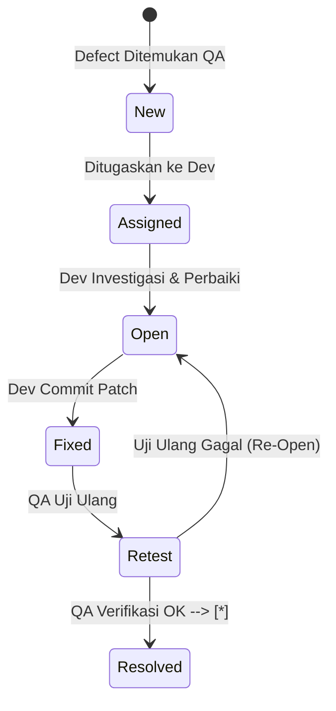

# Test Plan — AbuCom

## Riwayat Perubahan Dokumen

| Versi | Tanggal    | Perubahan | Oleh |
|:---:|---|---|---|
| **1.0** | 2026-05-26 | Inisialisasi awal pembuatan dan penyusunan dokumen Test Plan secara komprehensif. Menyerap seluruh data referensi R-01 s.d R-18, mendefinisikan strategi pengujian, skenario boundary presisi desimal, kegagalan LAN, otorisasi RBAC, pengujian rendering CLI, lingkungan uji, dan menyusun matriks ketertelusuran lengkap. | Senior QA Lead & Test Strategy Architect |
| **1.1** | 2026-05-26 | Hasil validasi, analisis, dan penyempurnaan komprehensif (v1.1). Mengatasi placeholder `[DATA BELUM TERSEDIA]`, menyinkronkan total 44 skenario uji terhadap 44 Use Case, memperjelas langkah pengujian keamanan (Bcrypt Cost 12, JWT 8 jam, rate limiting 5x salah, audit JSON, Fernet CRM, AES-256 backup, UU PDP), merinci kalkulasi boundary desimal HPP BOM dan Smart Payroll dengan angka konkret, melengkapi glosarium akronim Bab 1.6, memperluas kriteria sign-off UAT menjadi 7 kriteria terukur, dan melengkapi pustaka referensi Bab 15. | Senior QA Architect & SDLC Documentation Specialist |
| **1.2** | 2026-05-29 | Hasil validasi, analisis, dan penyempurnaan komprehensif (v1.2). Menyesuaikan path absolut menjadi path relatif di Bab 1.4, menambahkan glosarium alat pengujian (venv, pytest, coverage.py, seed.sql, schema.sql), memperbarui tanggal sign-off UAT, dan memastikan konsistensi format. | Senior QA Architect & SDLC Documentation Specialist |

---

## 1. Informasi Dokumen

### 1.1. Tujuan Dokumen
Dokumen **Test Plan** ini disusun untuk mendefinisikan strategi, cakupan, metodologi, lingkungan, kriteria, dan sumber daya pengujian perangkat lunak **AbuCom — Sistem Manajemen Terpadu Usaha Percetakan**. Berkas ini bertindak sebagai cetak biru (*blueprint*) pengujian formal yang akan memandu pembuatan dokumen *Test Cases*, *Test Scripts*, dan *Test Report* pada fase SDLC berikutnya.

Tujuan utama dari aktivitas pengujian yang direncanakan adalah untuk menjamin:
1.  **Akurasi Keuangan:** Mencegah terjadinya kesalahan logika pembulatan desimal pada kalkulasi HPP BOM, margin, smart payroll, dan depresiasi aset.
2.  **Kepatuhan Keamanan:** Memastikan implementasi pengamanan otentikasi (bcrypt & JWT), otorisasi RBAC (8 peran), audit logs JSON, sanitasi CLI, dan kepatuhan UU PDP berjalan 100% sesuai spesifikasi.
3.  **Ketahanan Operasional:** Memverifikasi fungsionalitas sistem berjalan stabil 100% tanpa internet di jaringan lokal LAN offline, termasuk keandalan pooling koneksi, retry mechanism, dan transaksi ACID.

### 1.2. Cakupan Dokumen
Dokumen ini menetapkan rencana pengujian untuk siklus rilis v1.1 dari aplikasi **AbuCom CLI**. Cakupan ini meliputi pengujian fungsional terintegrasi pada 10 modul utama, pengujian non-fungsional (performa, backup/restore), portabilitas lintas OS (Windows 11 & Debian 12), serta uji penetrasi keamanan internal.

### 1.3. Posisi Dokumen dalam Siklus SDLC
Dalam siklus pengembangan perangkat lunak (SDLC) AbuCom, dokumen Test Plan ini berada pada **Fase 05 — Testing** sebagai deliverable pertama sebelum pembuatan test case detil dan eksekusi pengujian program.

```
+-------------------------------------------------------------+
| FASE 03: DESIGN (DDL, ERD, System Architecture, Security)   |
+-------------------------------------------------------------+
                               |
                               v
+-------------------------------------------------------------+
| FASE 04: IMPLEMENTATION (FP pure logic, Module, Git WF)     |
+-------------------------------------------------------------+
                               |
                               v
+=============================================================+
| FASE 05: TESTING - Test Plan [DOKUMEN INI]                  |
+=============================================================+
                               |
                               v
+-------------------------------------------------------------+
| FASE 05: TESTING - Test Cases, Test Scripts & Execution     |
+-------------------------------------------------------------+
```

### 1.4. Hubungan dengan Dokumen SDLC Lainnya
*   **Dokumen Input (Basis Pengujian):**
    *   [SRS v1.1](docs/sdlc/02_analysis/02_software_requirements.md): Sumber formal kebutuhan fungsional (SRS-F-001 s.d SRS-F-040) dan non-fungsional (SRS-NF-001 s.d SRS-NF-011).
    *   [ACM v1.1](docs/sdlc/02_analysis/06_access_control_matrix.md): Definisi 8 peran internal dan matriks otorisasi menu/tabel CRUD.
    *   [Security Design v1.1](docs/sdlc/03_design/06_security_design.md): Spesifikasi bcrypt, JWT 8 jam, rate limiting 5 kali, UU PDP, sanitasi CLI, audit logs JSON, dan SOP insiden.
    *   [BOM & HPP Design v1.1](docs/sdlc/03_design/05_bom_hpp_design.md): Spesifikasi matematika presisi desimal `Decimal(15,4)`, pembulatan `ROUND_HALF_UP`, InnoDB row locking `FOR UPDATE`, limbah, dan sinkronisasi ATK.
    *   [CLI Interaction Flow v1.1](docs/sdlc/03_design/04_cli_interaction_flow.md): Alur navigasi terminal, ANSI formatting (`rich` & `tabulate`), thermal print wrapping, dan visual error `ERR-XXX-YYY`.
*   **Dokumen Output (Penerima Manfaat):**
    *   **Test Cases & Test Scripts:** Acuan utama pembuatan berkas kasus uji terperinci.
    *   **Test Report:** Basis evaluasi penentuan status peluncuran (*go-live decision*).

### 1.5. Audiens Target
1.  **Junior Programmer (Pemilik Usaha):** Untuk memverifikasi kesiapan pengujian operasional bisnis mandiri.
2.  **AI Testing Agent & QA Engineer:** Sebagai petunjuk utama dalam penyusunan test suite otomatis menggunakan pytest dan coverage.py.
3.  **Kepala Percetakan:** Untuk memahami peran dan tanggung jawab dalam proses UAT (User Acceptance Testing) sebelum go-live.

### 1.6. Definisi, Akronim, dan Singkatan
*   **FP** (*Functional Programming*): Paradigma pemrograman fungsional murni tanpa OOP/class.
*   **UoM** (*Unit of Measure*): Satuan dasar persediaan stok (Rim, Lembar, Pcs, Ml, Meter_Persegi).
*   **BOM** (*Bill of Materials*): Formula racikan/resep komposisi bahan baku desimal produk kustom.
*   **HPP** (*Harga Pokok Penjualan*): Total modal riil bahan langsung pembentuk produk kustom.
*   **PPOB** (*Payment Point Online Bank*): Layanan agen pembayaran pulsa/tagihan digital.
*   **RBAC** (*Role-Based Access Control*): Manajemen hak akses menu terminal berbasis 8 peran internal.
*   **JWT** (*JSON Web Token*): Token stateless untuk otentikasi session 8 jam (28.800 detik).
*   **UU PDP**: Undang-Undang Perlindungan Data Pribadi No. 27 Tahun 2022 Indonesia.
*   **OPEX** (*Operating Expense*): Biaya pengeluaran rutin operasional toko.
*   **ACID** (*Atomicity, Consistency, Isolation, Durability*): Standar integritas transaksi database.
*   **LAN** (*Local Area Network*): Jaringan komputer lokal toko tanpa internet.
*   **CLI** (*Command Line Interface*): Antarmuka baris perintah berbasis teks terminal.
*   **UAT** (*User Acceptance Testing*): Pengujian penerimaan oleh pengguna akhir untuk kelayakan bisnis.
*   **CSV** (*Comma-Separated Values*): Format file teks untuk migrasi data tabel terstruktur.
*   **UPS** (*Uninterruptible Power Supply*): Baterai cadangan penyangga listrik mati mendadak.
*   **ATK** (*Alat Tulis Kantor*): Komoditas dagangan ritel eceran toko.
*   **ERD** (*Entity Relationship Diagram*): Diagram pemodelan struktur data relasional database.
*   **SRS** (*Software Requirements Specification*): Dokumen spesifikasi kebutuhan perangkat lunak.
*   **UC** (*Use Case*): Satuan skenario interaksi pengguna dan sistem.
*   **SDLC** (*Software Development Life Cycle*): Siklus hidup pengembangan perangkat lunak.
*   **IEEE** (*Institute of Electrical and Electronics Engineers*): Organisasi standar teknis dunia.
*   **ISTQB** (*International Software Testing Qualifications Board*): Organisasi standardisasi pengujian software.
*   **venv** (*Virtual Environment*): Lingkungan Python terisolasi.
*   **pytest**: Framework pengujian unit Python.
*   **coverage.py**: Alat ukur code coverage Python.
*   **seed.sql**: Skrip data awal database.
*   **schema.sql**: Skrip struktur tabel database.

### 1.7. Referensi Dokumen SDLC
Daftar berkas referensi utama tercantum secara komprehensif pada **Bab 15** dokumen ini.

---

## 2. Cakupan Pengujian (Test Scope)

### 2.1. Fitur yang Diuji (In-Scope)
Pengujian mencakup pembuktian fungsionalitas dan integritas seluruh 10 modul utama aplikasi AbuCom CLI:
*   **Modul M.1 (Transaksi & Kasir):** Multi-divisi kasir, harga dinamis (Retail, Grosir, Mitra), DP & Pelunasan, retur & batal, kalkulasi margin, ekspor struk thermal format teks polos `.txt`.
*   **Modul M.2 (Inventaris, BOM & Opname):** Master barang & satuan UoM, hitung HPP BOM desimal otomatis, input limbah gagal cetak (waste), sinkronisasi ATK internal, Stock Opname draft/approved, price tracking supplier fluktuatif, import data CSV semiautomatis, utang supplier tempo, backup & restore manual ZIP AES-256.
*   **Modul M.3 (Layanan Keuangan, PPOB & Jasa Service):** Saldo PPOB & alert limit Rp 150.000, 6 perbandingan e-wallet terhemat, input penerimaan jasa servis printer/PC.
*   **Modul M.4 (SDM, Payroll & Poin):** Absensi harian staf, Smart Payroll (Skenario A laba $\ge$ Rp 15 juta, Skenario B laba < Rp 15 juta, proteksi batas minimum 50% UMR Rp 1,6 juta), akumulasi poin 4-tier karyawan, potong kasbon otomatis.
*   **Modul M.5 (Antrian & Pelacakan Desain):** Job tracking 5 status antrian, direktori path arsip file desain, salin WhatsApp Web link.
*   **Modul M.6 (Pinjaman, Aset & Pengeluaran):** Pinjaman bank komersial berbunga, pinjaman kerabat tanpa bunga, depresiasi garis lurus aset tetap, alokasi tabungan virtual aset, laba rugi instan, notifikasi utang H-3, pengeluaran rutin/tak terduga (sandi eskalasi jika > Rp 500.000).
*   **Modul M.7 (Keamanan, Audit & Handover):** bcrypt hash factor 12, token JWT HS256, RBAC 8 peran, audit log JSON, rate limiting 5 kali salah & lock 10 menit, serah terima shift normal & anomali (selisih laci kas > Rp 10.000 sandi kepala), setup awal wizard.
*   **Modul M.8 (CRM Database Pelanggan):** Penyimpanan CRM terenkripsi Fernet dua arah biner, proteksi privasi UU PDP.
*   **Modul M.9 (Multi-Cabang Ready):** Isolasi data transaksional & master via kolom `cabang_id`.
*   **Modul M.10 (Runtime Config):** Parameter dinamis basis data `system_configs`.
*   **Modul Tambahan (Additional):** Startup validation .env, IDLE auto-logout 30 menit, connection pooling pool_size=5, retry mechanism 3x exponential backoff.

### 2.2. Fitur yang Tidak Diuji (Out-of-Scope)
Aktivitas pengujian **TIDAK** mencakup aspek di luar kendali software lokal:
*   Antarmuka grafis (GUI) web browser, web portal, atau aplikasi mobile (sistem murni CLI teks).
*   Konektivitas dan integrasi real-time API WhatsApp Gateway luar (notifikasi WhatsApp disimulasikan via penyusunan URL teks dinamis WhatsApp Web yang siap disalin oleh staf kasir).
*   Koneksi internet langsung untuk transaksi e-wallet/PPOB (transaksi PPOB dicatat secara administratif pasca-proses eksternal manual oleh kasir).
*   Proses cetak fisik langsung ke perangkat keras printer thermal (pengujian dibatasi hingga rendering string teks struk terformat rapi pada memori dan penulisan berkas `.txt` yang siap dialirkan ke printer).

### 2.3. Asumsi Pengujian
*   Database server MySQL 8.4 LTS lokal telah diinisialisasi strukturnya menggunakan berkas `schema.sql` dan data master awal telah terisi melalui `seed.sql`.
*   Jaringan LAN luring (offline) kabel UTP Cat6 dan switch hub toko berjalan stabil dengan latensi antarsimpul < 1ms.
*   PC klien kasir Windows 11 telah terpasang runtime Python 3.14.2+ dengan pustaka ketergantungan yang valid di `.env` lokal.

### 2.4. Risiko dan Mitigasi Pengujian
*   **Risiko 1 (Race Condition desimal):** Race condition pemotongan stok bahan baku desimal jika beberapa klien mengakses baris master yang sama secara simultan.
    *   *Mitigasi:* QA memicu test case konkurensi multi-thread untuk memverifikasi keefektifan mekanisme locking `FOR UPDATE` di InnoDB MySQL.
*   **Risiko 2 (Gangguan LAN offline):** Ketidakstabilan koneksi client-server LAN lokal saat memproses mutasi kas transaksional.
    *   *Mitigasi:* QA mensimulasikan pemutusan jaringan fisik di PC Klien saat mutasi data SQL berjalan untuk membuktikan keandalan rollback transaksi ACID secara otomatis.
*   **Risiko 3 (Data Test Fixture Tidak Representatif):** Data dummy / mock seeds tidak mencerminkan skenario bisnis nyata yang kompleks sehingga bug edge-case margin atau pecahan lolos ke produksi.
    *   *Mitigasi:* Pemilik dan QA menyusun data seed harian toko yang diangkat dari pembukuan manual Excel asli untuk merepresentasikan 8 peran karyawan secara realistis.
*   **Risiko 4 (Masalah Kompatibilitas Tool Eksternal):** Terjadinya crash atau ketidakcocokan library testing (`pytest`, `coverage.py`) terhadap runtime Python 3.14.2+ yang sangat baru.
    *   *Mitigasi:* Verifikasi instalasi library secara ketat menggunakan environment virtual terisolasi (venv) dengan penentuan versi yang identik pada berkas `requirements.txt`.

---

## 3. Strategi Pengujian (Test Strategy)

### 3.1. Tingkat Pengujian (Test Levels)

```
       +---------------------------------------------+
       |         User Acceptance Testing (UAT)       |  <-- Pemilik & Kepala Percetakan
       +---------------------------------------------+
                              ^
                              |
       +---------------------------------------------+
       |                System Testing               |  <-- QA & AI Testing Agent
       +---------------------------------------------+
                              ^
                              |
       +---------------------------------------------+
       |             Integration Testing             |  <-- Dev & QA (DB/Cross-Module)
       +---------------------------------------------+
                              ^
                              |
       +---------------------------------------------+
       |                Unit Testing                 |  <-- Dev (Pytest Pure Logic FP)
       +---------------------------------------------+
```

#### 3.1.1. Unit Testing
*   **Cakupan:** Pengujian ditargetkan pada fungsi logika bisnis murni (*pure functions*) yang terbebas dari efek samping database I/O (diletakkan di folder `logic/` dan utilitas pendukung).
*   **Pendekatan:** Pengujian dilakukan secara deterministik menggunakan *mock data structures* (NamedTuple/Tuples).
*   **Target Kualitas:** Persentase cakupan kode (*code coverage*) untuk logika bisnis inti wajib $\ge 90\%$.

#### 3.1.2. Integration Testing
*   **Cakupan:** Menguji integritas interaksi antarmodul Python (misalnya logic pemotongan persediaan bahan pembentuk kustom `M.2` yang dipicu oleh perubahan status antrian kustom `M.5` dan berdampak pada pembukuan laba/rugi `M.6`).
*   **Infrastruktur:** Menggunakan database sandbox pengujian bayangan `abucom_test_db`.
*   **Verifikasi:** Memastikan integritas referensial (Foreign Key, CHECK Constraints) dan isolasi konkurensi `FOR UPDATE` InnoDB.

#### 3.1.3. System Testing
*   **Cakupan:** Pengujian fungsionalitas sistem secara menyeluruh dari perspektif pengguna (*end-to-end*) melalui navigasi baris perintah CLI terminal.
*   **Pengujian Negatif:** Menguji ketahanan program terhadap pengetikan input salah, string injeksi SQL, bypass hak otorisasi menu, dan gangguan jaringan.

#### 3.1.4. User Acceptance Testing (UAT)
*   **Cakupan:** Verifikasi kelayakan operasional harian AbuCom CLI langsung oleh Pemilik Usaha dan Kepala Percetakan.
*   **Skenario Bisnis:** Simulasi siklus operasional harian dari toko buka & shift handover kasir awal, registrasi pelanggan CRM, transaksi kasir, pemrosesan antrian desain, produksi cetak, stock opname fisik harian, hingga penutupan kas rekonsiliasi harian.

### 3.2. Tipe Pengujian (Test Types)
1.  **Functional Testing:** Memvalidasi 100% keselarasan fungsional 10 modul terhadap spesifikasi SRS.
2.  **Security Testing:** Menguji otentikasi bcrypt, JWT expiration, RBAC multi-level 8 peran, rate limiting, audit log trail, sanitasi CLI, dan proteksi privasi CRM (UU PDP).
3.  **Decimal Precision Testing:** Boundary testing desimal Decimal(15,4), margin profit, smart payroll, dan depresiasi aset.
4.  **Database Integrity Testing:** Menguji atomisitas ACID, isolasi level Repeatable Read, default values, dan foreign key cascade/restrict.
5.  **CLI Interface Testing:** Navigasi breadcrumb menu, rendering visual ansi rich/tabulate, formatting struk thermal wrap, dan encoding UTF-8 lintas OS.
6.  **Compatibility Testing (Dual-OS):** Memverifikasi program Python berjalan 100% identik tanpa deviasi logic di Windows 11 (PC Kasir) dan Debian 12 (Database & Backup server).
7.  **Regression Testing:** Pengujian kembali fitur lama setelah adanya perubahan atau patch kode baru menggunakan suite pengujian pytest otomatis.

### 3.3. Pendekatan Pengujian (Test Approach)
*   **Black-Box Testing:** Digunakan pada System Testing & UAT untuk memverifikasi perilakuan I/O sistem visual CLI tanpa perlu mengetahui implementasi baris kode di dalam.
*   **White-Box Testing:** Digunakan pada Unit Testing untuk memverifikasi jalur logika internal (*control flow*), penanganan *exception handling*, dan coverage persentase.
*   **Exploratory Testing:** Sesi pengujian ad-hoc bebas untuk memburu bug tersembunyi pada skenario transaksi ekstrim yang tidak terduga.

### 3.4. Kriteria Masuk dan Keluar Pengujian (Entry & Exit Criteria)

#### 3.4.1. Entry Criteria (Kapan Pengujian Dimulai)
1.  Fase implementasi kode program (Fase 04) dinyatakan selesai (100% berkas program logic Python, db connector, middleware, dan antarmuka CLI telah commit ke Git).
2.  Skema database `abucom_test_db` telah ter-setup sukses menggunakan `schema.sql` dan `seed.sql`.
3.  Berkas konfigurasi lokal pengujian `.env.test` telah terkonfigurasi dengan benar (100% parameter terisi).
4.  Dokumen Test Plan ini telah disetujui secara tertulis/formal oleh Pemilik Usaha.

#### 3.4.2. Exit Criteria (Kapan Pengujian Selesai)
1.  100% dari 44 kasus uji (*Test Scenarios*) kritis dan tinggi telah dieksekusi sukses.
2.  Cakupan pengujian Unit (*Unit Test Coverage*) logika bisnis inti mencapai $\ge 90\%$ yang dibuktikan secara kuantitatif via coverage.py.
3.  0% cacat (*defects*) berkategori **Critical** atau **Major** yang masih berstatus terbuka (*Open*).
4.  UAT sign-off checklist 7 kriteria terukur telah ditandatangani oleh Pemilik Usaha dan Kepala Percetakan.

#### 3.4.3. Suspension Criteria (Kapan Pengujian Ditangguhkan)
1.  Terjadinya kerusakan fatal basis data test sandbox yang mengakibatkan data korup massal saat startup.
2.  Tingkat kegagalan (*failure rate*) dari test cases yang dieksekusi melebihi 30% pada awal siklus pengujian.
3.  Hak akses database atau crash parah pada Mini PC Server yang menghentikan operasional LAN lokal.

#### 3.4.4. Resumption Criteria (Kapan Pengujian Dilanjutkan)
1.  Sebab penangguhan telah diperbaiki penuh, database dibersihkan dan di-seed ulang aman.
2.  Logic patch kritis telah diterapkan untuk mengatasi tingginya crash di awal.
3.  Jaringan client-server LAN kembali beroperasi normal.

---

## 4. Pemetaan Cakupan Pengujian per Modul

### 4.1. Modul M.1 — Manajemen Transaksi & Kebijakan Harga

| ID Skenario | Deskripsi Skenario Pengujian | SRS Terkait | UC Terkait | Tipe Test | Prioritas |
|---|---|---|---|---|---|
| **M1-TC-001** | Input transaksi penjualan multi-divisi cepat (Tunai, QRIS, Transfer). | SRS-F-001 | UC-001 | Functional | High |
| **M1-TC-002** | Validasi harga dinamis otomatis (Retail, Grosir, Mitra) berdasarkan tipe pelanggan. | SRS-F-002 | UC-002 | Boundary | High |
| **M1-TC-003** | Pembayaran DP & Pelunasan sisa tagihan pesanan kustom saat diambil. | SRS-F-003 | UC-003 | Functional | High |
| **M1-TC-004** | Pembatalan transaksi DP pesanan kustom (potong laci kas & eskalasi sandi pemilik). | SRS-F-004 | UC-004 | Security | High |
| **M1-TC-005** | Retur barang retail ATK rusak (kembali ke stok gudang & potong laci kas). | SRS-F-004 | UC-004 | Database | High |
| **M1-TC-006** | Validasi metrik persentase kotor margin keuntungan produk kustom (SRS-F-005). | SRS-F-005 | UC-005 | Precision | Medium |
| **M1-TC-007** | Ekspor nota struk format thermal teks polos format `.txt` (32 char & 48 char). | SRS-F-006 | UC-006 | CLI | Medium |

### 4.2. Modul M.2 — Manajemen Inventaris, BOM & Stock Opname

| ID Skenario | Deskripsi Skenario Pengujian | SRS Terkait | UC Terkait | Tipe Test | Prioritas |
|---|---|---|---|---|---|
| **M2-TC-001** | Kelola master barang, check constraint, UoM konversi desimal. | SRS-F-009 | UC-009 | Database | High |
| **M2-TC-002** | Auto-compute HPP produk kustom berbasis formula BOM pemakaian bahan desimal. | SRS-F-007 | UC-007 | Precision | High |
| **M2-TC-003** | Pencatatan bahan baku rusak (limbah) operasional cetak (potong stok, OPEX debit). | SRS-F-008 | UC-008 | Functional | High |
| **M2-TC-004** | Sinkronisasi ATK internal (mengambil ATK retail, potong stok, OPEX debit). | SRS-F-010 | UC-010 | Database | Medium |
| **M2-TC-005** | Rekonsiliasi Stock Opname (Gudang input draft, Kepala Percetakan approve). | SRS-F-011 | UC-011 | Security | High |
| **M2-TC-006** | Analisis prediksi re-order stok bahan baku (notifikasi visual < 7 hari). | SRS-F-012 | UC-012 | CLI | High |
| **M2-TC-007** | Price tracking supplier fluktuatif (rekam harga historis pembelian). | SRS-F-013 | UC-013 | Functional | Medium |
| **M2-TC-008** | Import bulk data awal semiautomatis via CSV (utf-8, rollback on error). | SRS-F-014 | UC-014 | Integrity | High |
| **M2-TC-009** | Kelola utang supplier tempo & master profil supplier. | SRS-F-040 | UC-015 | Functional | High |
| **M2-TC-010** | Backup & Restore manual ZIP AES-256 (lockout kasir lain, checkpoint sandi). | SRS-F-039 | UC-016 | Security | High |

### 4.3. Modul M.3 — Layanan Keuangan Digital, PPOB & Jasa Service

| ID Skenario | Deskripsi Skenario Pengujian | SRS Terkait | UC Terkait | Tipe Test | Prioritas |
|---|---|---|---|---|---|
| **M3-TC-001** | Kelola virtual saldo PPOB & alert limit kritis deposit < Rp 150.000. | SRS-F-015 | UC-017 | Functional | High |
| **M3-TC-002** | Rekomendasi biaya admin termurah dari perbandingan 6 dompet digital. | SRS-F-016 | UC-018 | Precision | High |
| **M3-TC-003** | Registrasi pendaftaran & pelacakan status perbaikan unit service laptop/printer. | SRS-F-017 | UC-019 | Functional | High |

### 4.4. Modul M.4 — Manajemen SDM, Penggajian & Poin Karyawan

| ID Skenario | Deskripsi Skenario Pengujian | SRS Terkait | UC Terkait | Tipe Test | Prioritas |
|---|---|---|---|---|---|
| **M4-TC-001** | Absensi masuk harian, kasbon karyawan, validasi limit plafon kasbon. | SRS-F-018 | UC-020 | Boundary | High |
| **M4-TC-002** | Komputasi Smart Payroll Skenario A (laba $\ge$ Rp 15 juta) dan Skenario B (laba < Rp 15 juta).| SRS-F-019 | UC-021 | Precision | High |
| **M4-TC-003** | Validasi proteksi batas gaji minimum 50% UMR (Rp 1.600.000) pada Smart Payroll. | SRS-F-019 | UC-021 | Precision | High |
| **M4-TC-004** | Pemotongan otomatis sisa gaji atas kasbon aktif saat payroll diproses. | SRS-F-021 | UC-023 | Database | High |
| **M4-TC-005** | Akumulasi poin insentif 4-tier karyawan berbasis beban kerja harian. | SRS-F-020 | UC-022 | Precision | High |

### 4.5. Modul M.5 — Sistem Manajemen Antrian & Pelacakan Desain

| ID Skenario | Deskripsi Skenario Pengujian | SRS Terkait | UC Terkait | Tipe Test | Prioritas |
|---|---|---|---|---|---|
| **M5-TC-001** | Transaksi antrian kerja kustom (5 tahapan status terstruktur). | SRS-F-022 | UC-024 | Functional | High |
| **M5-TC-002** | Perekaman direktori path arsip file desain lokal di PC Klien. | SRS-F-023 | UC-025 | CLI | Medium |
| **M5-TC-003** | Format tautan WhatsApp Web siap salin untuk notifikasi siap diambil. | SRS-F-024 | UC-026 | Functional | Medium |

### 4.6. Modul M.6 — Administrasi Pinjaman, Aset & Pengeluaran

| ID Skenario | Deskripsi Skenario Pengujian | SRS Terkait | UC Terkait | Tipe Test | Prioritas |
|---|---|---|---|---|---|
| **M6-TC-001** | Kelola pinjaman bank komersial berbunga & pinjaman kerabat tanpa bunga. | SRS-F-025 | UC-027 | Precision | High |
| **M6-TC-002** | Kalkulasi depresiasi garis lurus aset & alokasi tabungan virtual dana cadangan. | SRS-F-028 | UC-030 | Precision | Medium |
| **M6-TC-003** | Visualisasi instan laporan Laba/Rugi kotor/bersih per divisi usaha. | SRS-F-026 | UC-028 | Integration | High |
| **M6-TC-004** | Pemicuan notifikasi jatuh tempo utang H-3. | SRS-F-027 | UC-029 | Functional | High |
| **M6-TC-005** | Pengeluaran rutin & tak terduga, eskalasi sandi pemilik jika > Rp 500.000. | SRS-F-029 | UC-031 | Security | High |

### 4.7. Modul M.7 — Keamanan, Audit Trail & Hak Akses

| ID Skenario | Deskripsi Skenario Pengujian | SRS Terkait | UC Terkait | Tipe Test | Prioritas |
|---|---|---|---|---|---|
| **M7-TC-001** | Verifikasi login bcrypt cost factor 12 & generator sesi token JWT HS256. | SRS-F-030 | UC-041 | Security | High |
| **M7-TC-002** | Penegakan dekorator check RBAC multi-level terhadap 8 peran internal. | SRS-F-030 | UC-032 | Security | High |
| **M7-TC-003** | Log Audit Trail terstruktur JSON (rekam `old_value` & `new_value`). | SRS-F-031 | UC-033 | Database | High |
| **M7-TC-004** | Serah terima shift kasir normal & anomali (selisih > Rp 10.000 sandi kepala). | SRS-F-032 | UC-034 | Security | Medium |
| **M7-TC-005** | Rekonsiliasi kasir harian dengan batas toleransi selisih Rp 10.000. | SRS-F-033 | UC-035 | Precision | High |
| **M7-TC-006** | Fraud detection alarm visual dashboard (selisih kas berturut-turut, brute force). | SRS-F-034 | UC-036 | CLI | High |
| **M7-TC-007** | Impor data awal Setup Wizard manual Excel migrasi (lockout kasir lain). | SRS-F-035 | UC-037 | Integrity | High |

### 4.8. Modul M.8 — Pembatalan, Retur & CRM

| ID Skenario | Deskripsi Skenario Pengujian | SRS Terkait | UC Terkait | Tipe Test | Prioritas |
|---|---|---|---|---|---|
| **M8-TC-001** | Pendaftaran pelanggan CRM & proteksi nomor WhatsApp terenkripsi Fernet. | SRS-F-036 | UC-038 | Security | Medium |
| **M8-TC-002** | Pengujian hak penghapusan data CRM privat secara permanen (UU PDP). | SRS-F-036 | UC-038 | Functional | Medium |

### 4.9. Modul M.9 — Skalabilitas Multi-Cabang

| ID Skenario | Deskripsi Skenario Pengujian | SRS Terkait | UC Terkait | Tipe Test | Prioritas |
|---|---|---|---|---|---|
| **M9-TC-001** | Verifikasi isolasi query data master & transaksi berdasarkan filter `cabang_id`.| SRS-F-037 | UC-039 | Integrity | High |

### 4.10. Modul M.10 — Konfigurasi Sistem Runtime

| ID Skenario | Deskripsi Skenario Pengujian | SRS Terkait | UC Terkait | Tipe Test | Prioritas |
|---|---|---|---|---|---|
| **M10-TC-001**| Dinamis parameter bisnis loading & modifikasi pada tabel `system_configs`.| SRS-F-038 | UC-040 | Database | High |

---

## 5. Pengujian Keamanan (Security Testing Plan)

### 5.1. Pengujian Otentikasi (bcrypt & JWT)
*   **Tujuan:** Memvalidasi bahwa password disimpan aman menggunakan bcrypt hash factor 12, dan session dilindungi token JWT HS256 yang kedaluwarsa tepat setelah 8 jam (28.800 detik).
*   **Skenario Pengujian:**
    1.  *Uji bcrypt:* Lakukan registrasi akun baru, periksa fisik database MySQL tabel `pengguna` kolom `password_hash`, verifikasi string teracak diawali prefix `$2b$12$...` dan password asli polos sama sekali tidak terbaca.
    2.  *Uji JWT Expiration:* Login sebagai kasir, tangkap string token JWT. Manipulasi timestamp masa berlaku token agar terlewat 8 jam, picu akses menu CLI. Verifikasi logic Python melempar kode error `ERR-SESSION-002: Sesi login tidak sah/rusak. Harap login kembali!`, menghapus token di memori lokal, dan meredireksi paksa ke prompt login kosong.

### 5.2. Pengujian Otorisasi (RBAC 8 Peran)
*   **Tujuan:** Menjamin penegakan hak akses biner *Least Privilege* sesuai matriks ACM terhadap seluruh 8 peran internal (`pemilik`, `kepala_percetakan`, `kasir`, `desainer`, `produksi_cetak`, `fotocopy_print`, `gudang`, dan peran tambahan `teknisi` / `pramuniaga`).
*   **Skenario Pengujian:**
    1.  *Kasus Uji Ilegal desainer:* Login sebagai `desainer`. Coba akses menu administratif `M4-002` (Smart Payroll) atau menu margin produk `M1-005`.
    2.  Verifikasi program memblokir instruksi biner, merender visual error `ERR-AUTH-003: Akses Ditolak: Hak Akses Pemilik Dibutuhkan!`, dan secara otomatis menyisipkan baris log audit tipe `ACCESS_DENIED` ke database.
    3.  *Kasus Uji Ilegal teknisi/pramuniaga:* Login sebagai `pramuniaga`, coba akses menu `M2-005` (Stock Opname Approve) atau menu `M6-001` (Pinjaman Bank). Verifikasi program memblokir akses dan merender `ERR-AUTH-003`.

### 5.3. Pengujian SQL Injection (Parameterized Queries)
*   **Tujuan:** Membuktikan bahwa input terminal CLI steril dari celah injeksi database.
*   **Skenario Pengujian:**
    1.  Pada layar login terminal CLI username, ketikkan string injeksi: `' OR '1'='1`. Ketik sandi sembarang.
    2.  Verifikasi sistem menangkap string murni sebagai nama username literal terfilter, menolak login aman, dan menampilkan `ERR-AUTH-001: Kredensial tidak valid. Silakan coba kembali!`.
    3.  Pemeriksaan baris kode: Pastikan 100% database query di program menggunakan placeholder driver `%s` (dilarang keras menggunakan f-string SQL).

### 5.4. Pengujian Rate Limiting & Lockout
*   **Tujuan:** Menguji mitigasi serangan brute-force nekat pada keyboard laci kasir terminal.
*   **Skenario Pengujian:**
    1.  Lakukan login gagal berturut-turut pada akun staf tertentu sebanyak 5 kali.
    2.  Pada kegagalan ke-5, verifikasi database memperbarui kolom `locked_until` dengan timestamp 10 menit ke depan.
    3.  Coba login kembali dengan kata sandi yang valid di menit ke-6. Verifikasi sistem menolak mutlak login dan menampilkan visual error `ERR-AUTH-002: Sandi Gagal: Akun ditangguhkan selama 10 menit akibat brute-force!`.
    4.  Coba kembali setelah 10 menit berlalu. Verifikasi login valid berhasil, dan reset `failed_login_attempts` kembali ke 0.

### 5.5. Pengujian Sanitasi Input CLI
*   **Tujuan:** Mencegah injeksi karakter kontrol ANSI atau control codes visual terminal.
*   **Skenario Pengujian:**
    1.  Pada kolom input nama barang baru, ketikkan karakter escape terminal ANSI: `\x1b[31mBarang Palsu`.
    2.  Verifikasi logic parser memangkas kode visual tersebut secara programatis biner di Python sebelum disimpan, sehingga nama barang tersimpan steril di database sebagai `'Barang Palsu'`.

### 5.6. Pengujian Audit Trail JSON
*   **Tujuan:** Memvalidasi akuntabilitas audit data log sensitif.
*   **Skenario Pengujian:**
    1.  Lakukan update kasbon karyawan di sistem.
    2.  Buka tabel `audit_logs` di database, verifikasi baris baru terisi dengan timestamp presisi, user pelaksana, nama tabel `'kasbon'`, serta kolom `old_value` dan `new_value` menyimpan string JSON detail status utang sebelum dan sesudah perubahan secara akurat.

### 5.7. Pengujian Enkripsi Data (AES-256 Backup & Fernet CRM)
*   **Tujuan:** Memastikan data pribadi dan backup terenkripsi kuat *at rest*.
*   **Skenario Pengujian:**
    1.  *Fernet CRM:* Daftarkan pelanggan CRM dengan nomor WhatsApp `081234567890`. Lakukan inspeksi langsung ke database MySQL tabel `pelanggan` kolom `whatsapp`. Verifikasi string tersimpan dalam enkripsi biner acak Fernet.
    2.  *AES-256 ZIP:* Jalankan ekspor backup basis data. Verifikasi berkas zip dihasilkan di folder `/exports/backups/`. Coba ekstrak zip secara manual menggunakan utilitas OS eksternal. Verifikasi zip menolak ekstraksi dan meminta kata sandi enkripsi AES-256 yang valid.

### 5.8. Pengujian Kepatuhan UU PDP No. 27/2022
*   **Tujuan:** Hak penghapusan permanen (*Right to Erasure*) data CRM.
*   **Skenario Pengujian:**
    1.  Login sebagai `pemilik`. Pilih menu CRM pelanggan, picu aksi penghapusan permanen keanggotaan atas permintaan pelanggan.
    2.  Verifikasi baris data WhatsApp dan identitas pelanggan bersangkutan dihapus bersih secara permanen fisik (hard delete) di database MySQL, bukan hanya sekadar flag soft-delete.

---

## 6. Pengujian Presisi Desimal (Decimal Precision Testing)

```
        INPUT TEST VALUE              LOGICAL CALCULATION           EXPECTED DATABASE VALUE
     +--------------------+          +--------------------+          +----------------------+
     | Decimal('0.0025')  |  ----->  |   ROUND_HALF_UP    |  ----->  |  DECIMAL(15,4)       |
     | karet flash m^2    |          |   arithmetic (FP)  |          |  Rp 4.750,0000 HPP   |
     +--------------------+          +--------------------+          +----------------------+
```

### 6.1. Pengujian Kalkulasi HPP BOM Desimal
*   **Tujuan:** Menjamin keakuratan perhitungan modal HPP berbasis BOM pecahan desimal presisi tetap 4 digit di belakang koma.
*   **Metode Boundary Testing:**
    *   *Input Uji:* Karet stempel flash bulat diameter pemakaian desimal = `Decimal('0.0025')` $\text{m}^2$.
    *   *Harga Beli Satuan:* Rp 100.000,0000 / $\text{m}^2$.
    *   *Gagang Stempel:* $1.0000\text{ Pcs}$ dengan harga beli satuan Rp 4.500,0000.
    *   *Komputasi Bisnis:*
        $$\text{Biaya Karet} = 0.0025 \times 100.000,0000 = \text{Rp } 250,0000$$
        $$\text{HPP Total} = \text{Rp } 250,0000 + \text{Rp } 4.500,0000 = \text{Rp } 4.750,0000$$
    *   *Verifikasi:* Pastikan total HPP yang disimpan di program murni bernilai `Decimal('4750.0000')` dan database menolak representasi float terdekat (misal `4750.0000000001` atau `4749.9999999`).

### 6.2. Pengujian Pembulatan Keuangan (ROUND_HALF_UP)
*   **Tujuan:** Memvalidasi kepatuhan aturan pembulatan keuangan bisnis.
*   **Metode Boundary Testing:**
    *   *Input Uji:* Perhitungan nilai margin profit dengan pecahan nominal Rp 0.00005.
    *   *Kalkulasi:* Pemicuan fungsi pembulatan `ROUND_HALF_UP` di Python.
    *   *Boundary Cases:*
        *   `Decimal('100.00005')` dibulatkan ke 4 desimal harus menjadi `Decimal('100.0001')`.
        *   `Decimal('100.00004')` dibulatkan ke 4 desimal harus menjadi `Decimal('100.0000')`.
        *   `Decimal('99999999999.9999')` (Boundary batas atas keuangan) harus terproses sukses tanpa arithmetic overflow.

### 6.3. Pengujian Mutasi Kas & Rekonsiliasi
*   **Tujuan:** Menjamin nominal uang laci kas kasir tersinkronisasi presisi transaksional.
*   **Skenario Pengujian:**
    1.  Buat rentetan transaksi penjualan cepat bernilai rupiah eceran kecil (misal Rp 1.523,0000).
    2.  Lakukan penutupan shift kasir, hitung selisih kas fisik. Verifikasi sistem menghitung deviasi kas secara nominal desimal akurat, membandingkan terhadap batas toleransi selisih Rp 10.000,0000 tanpa kesalahan presisi pembulatan.

### 6.4. Pengujian Pemotongan Stok Desimal
*   **Tujuan:** Verifikasi pemotongan stok bahan baku berbentuk desimal non-integer (misal rim kertas atau liter tinta).
*   **Skenario Pengujian:**
    1.  Mulai stok bahan tinta = `Decimal('1.0000')` Liter.
    2.  Proses pengerjaan cetak kustom yang mengkonsumsi `Decimal('0.0125')` Liter tinta.
    3.  Verifikasi database memperbarui sisa stok tinta menjadi tepat `Decimal('0.9875')` Liter.
    4.  Picu pemotongan melebihi stok (misal diambil 2 Liter). Verifikasi sistem membiarkan stok bernilai minus `Decimal('-1.0000')` Liter, dan memancarkan notifikasi warning kuning `ERR-STOCK-010` di CLI.

### 6.5. Pengujian Smart Payroll & Depresiasi Aset
*   **Tujuan:** Verifikasi akurasi upah bulanan dan penyusutan nilai aset.
*   **Skenario Pengujian:**
    1.  *Uji Smart Payroll Skenario B:* Set laba bulanan toko berjalan di database = Rp 12.000.000,0000 (di bawah target Rp 15 juta). Jumlah staf aktif 5 orang. UMR Daerah terisi Rp 3.200.000,0000.
    2.  *Kalkulasi Gaji Staf:*
        $$\text{Gaji Pokok Skenario B} = \frac{12.000.000 \times 25\%}{5} = \text{Rp } 600.000,0000$$
    3.  *Batas Minimum Proteksi:* Gaji hasil kalkulasi (Rp 600.000) berada di bawah batas minimum 50% UMR (Rp 1.600.000). Sistem **harus** mengesampingkan kalkulasi kotor, menerapkan proteksi upah minimum, dan menetapkan upah akhir = Rp 1.600.000,0000 secara otomatis.
    4.  *Uji Depresiasi Aset:* Printer thermal dibeli seharga Rp 10.000.000,0000 dengan masa manfaat 60 bulan (5 tahun). Verifikasi nilai penyusutan bulanan dihitung tepat `Decimal('166666.6667')` menggunakan `ROUND_HALF_UP`.

---

## 7. Pengujian Integrasi & Konektivitas

### 7.1. Pengujian Connection Pooling & Retry Mechanism
*   **Tujuan:** Memvalidasi keandalan penanganan koneksi database menggunakan pool dan retry.
*   **Skenario Pengujian:**
    1.  Luncurkan test script otomatis yang mensimulasikan pemuatan koneksi database multi-thread secara simultan sebanyak 10 threads.
    2.  Verifikasi driver database `mysql-connector-python` membatasi peminjaman koneksi aktif maksimal sebatas pool_size = 5, dan menempatkan thread selebihnya ke antrian pool.
    3.  Matikan koneksi database server MySQL secara sengaja saat query dibaca. Verifikasi logic Python melakukan pemicuan retry mechanism sebanyak 3 kali secara *exponential backoff* sebelum melempar error koneksi `ERR-DB-001`.

### 7.2. Pengujian ACID Transaction Block
*   **Tujuan:** Menjamin keandalan transaksi database (All or Nothing).
*   **Skenario Pengujian:**
    1.  Proses transaksi pesanan kustom yang memicu pemotongan 3 jenis bahan baku di gudang.
    2.  Simulasikan crash parah (misal putuskan koneksi LAN server) tepat pada pemotongan bahan baku ke-3.
    3.  Setelah koneksi pulih, periksa database: Verifikasi status stok bahan ke-1 dan ke-2 di-rollback mutlak ke nilai awal (tidak terpotong setengah-setengah), membuktikan kepatuhan biner transaksi atomik ACID.

### 7.3. Pengujian Lintas Modul (Cross-Module Integration)
*   **Tujuan:** Memvalidasi alur data mengalir aman lintas modul bisnis.
*   **Skenario Pengujian:**
    1.  Ubah status antrian kerja kustom (`M.5`) menjadi `'Selesai'`.
    2.  Verifikasi sistem otomatis: (a) menghitung HPP BOM desimal (`M.2`); (b) memotong stok bahan baku (`M.2`); (c) mencatatkan data mutasi kas transaksi (`M.1`); (d) merekam entri aktivitas baru ke log audit JSON (`M.7`).

### 7.4. Pengujian Konektivitas LAN Client-Server
*   **Tujuan:** Memastikan latensi dan port blocking berjalan lancar di LAN lokal luring.
*   **Skenario Pengujian:**
    1.  Gunakan utilitas port scan eksternal pada PC Kasir Klien. Coba hubungkan PC Kasir di luar port 3306 server database Debian.
    2.  Verifikasi firewall server `ufw` memblokir mutlak seluruh port asing dan hanya meloloskan TCP port 3306 dari alamat IP statis lokal kasir.

### 7.5. Pengujian Portabilitas Dual-OS (Windows 11 & Debian 12)
*   **Tujuan:** Menjamin konsistensi pemrosesan logic Python lintas OS.
*   **Skenario Pengujian:**
    1.  Eksekusi suite pengujian pytest otomatis secara identik pada mesin PC Klien Windows 11 dan mesin virtual sandbox Linux Debian 12 Bookworm.
    2.  Verifikasi seluruh 100% test cases memberikan hasil yang sukses (*Pass*) tanpa adanya deviasi logic, pembulatan persen, atau kendala library.

---

## 8. Pengujian Antarmuka Pengguna CLI

### 8.1. Pengujian Navigasi Menu & Breadcrumb
*   **Tujuan:** Memvalidasi kejelasan visual navigasi baris perintah terminal.
*   **Skenario Pengujian:**
    1.  Masuk ke menu utama, pilih sub-menu Modul `M.2` Inventaris, pilih sub-menu Stock Opname.
    2.  Verifikasi layar terminal CLI menampilkan *breadcrumb* lokasi navigasi yang jelas (misal: `Dashboard Utama > Inventaris & BOM > Rekonsiliasi Stok`).
    3.  Ketik input `0` di setiap sub-menu, verifikasi navigasi kembali mundur 1 tingkat ke menu parent di atas secara konsisten.

### 8.2. Pengujian Rendering Visual (rich & tabulate)
*   **Tujuan:** Memastikan kontras warna ANSI, grid tabel, dan layout GUI terminal teks ter-render sempurna tanpa cacat visual.
*   **Skenario Pengujian:**
    1.  Luncurkan dashboard ringkasan harian di terminal Windows Terminal (klien) dan GNOME Terminal (Debian server).
    2.  Verifikasi pustaka `rich` dan `tabulate` me-render grid tabel sejajar rapi, menampilkan kontras warna teks hijau (sukses), kuning (peringatan), merah (error kritis) sesuai status data secara tajam.

### 8.3. Pengujian Format Struk Thermal (58mm & 80mm)
*   **Tujuan:** Memvalidasi layout teks polos struk nota thermal.
*   **Skenario Pengujian:**
    1.  Buat transaksi dengan nama barang sangat panjang: `'Kertas Kado Sinar Dunia Karakter Kartun Anak Premium'`. Ekspor struk format thermal 58mm (32 karakter).
    2.  Buka file teks `.txt` ekspor hasil struk. Verifikasi nama barang panjang terbungkus rapi (*text-wrapped*) ke baris berikutnya, dan nominal angka rupiah di kolom kanan tetap sejajar lurus rata kanan.

### 8.4. Pengujian Encoding UTF-8 Lintas OS
*   **Tujuan:** Mencegah terjadinya glitch karakter visual teks (*mojibake*) lintas sistem operasi.
*   **Skenario Pengujian:**
    1.  Gunakan karakter simbol mata uang Rp atau border tabel visual box-drawing (seperti `┌`, `─`, `┐`) pada output visual CLI.
    2.  Jalankan program di terminal Windows CMD biasa dan terminal bash Debian Linux. Verifikasi karakter ter-render sempurna berkat standar encoding `'utf-8'` tanpa BOM.

### 8.5. Pengujian Kode Error Visual (ERR-VAL-007)
*   **Tujuan:** Memastikan pesan kesalahan disajikan terstandardisasi di baris terbawah.
*   **Skenario Pengujian:**
    1.  Input nilai kuantitas negatif pada form persediaan.
    2.  Verifikasi di layar terminal CLI bagian paling bawah berkedip atau menampilkan pesan kesalahan dengan format warna merah kontras: `⛔ ERR-VAL-007: Input kuantitas bahan baku tidak valid (harus angka desimal positif > 0)!` secara jelas.

---

## 9. Pengujian Non-Fungsional

### 9.1. Pengujian Performa (Response Time < 2 detik)
*   **Tujuan:** Memvalidasi kecepatan pemrosesan data lokal (SRS-NF-001).
*   **Skenario Pengujian:**
    1.  Lakukan pemicuan kalkulasi visual laporan Laba/Rugi instan per divisi pada database yang terisi 10.000 baris record transaksi historis.
    2.  Gunakan timer internal Python, ukur durasi kalkulasi. Verifikasi pemrosesan selesai dan tabel ringkasan ter-render di layar CLI dalam waktu kurang dari **2,0 detik**.

### 9.2. Pengujian Ketersediaan (Uptime & UPS Graceful Shutdown)
*   **Tujuan:** Memastikan keamanan fisik operasional toko dari mati listrik mendadak.
*   **Skenario Pengujian:**
    1.  Cabut kabel daya utama server Mini PC (sumber listrik disangga UPS). Verifikasi sistem tetap berjalan tanpa interupsi berkat daya baterai cadangan UPS.
    2.  Simulasikan durasi listrik mati hingga baterai UPS menipis (sisa 5%). Verifikasi skrip agen monitoring UPS memicu perintah *graceful shutdown* otomatis untuk menutup aman koneksi database MySQL sebelum Mini PC mati fisik.

### 9.3. Pengujian Backup & Restore Database
*   **Tujuan:** Memvalidasi pemulihan bencana (*disaster recovery*).
*   **Skenario Pengujian:**
    1.  Login sebagai `pemilik`. Picu utilitas backup manual ke file zip AES-256. Verifikasi log cadangan dicatatkan di database.
    2.  Lakukan perubahan data ilegal pada database. Jalankan menu restore, masukkan password cadangan valid.
    3.  Verifikasi database di-overwrite sukses kembali ke state awal sebelum perubahan ilegal, dan sistem memutus paksa sesi JWT aktif kasir lainnya.

### 9.4. Pengujian Import CSV Bulk Data
*   **Tujuan:** Menguji kapasitas penanganan import massal persediaan awal.
*   **Skenario Pengujian:**
    1.  Siapkan berkas CSV berisi 1.000 baris master barang retail dan supplier. Jalankan import semiautomatis via CLI.
    2.  Verifikasi seluruh 1.000 baris tersaring bersih dan masuk ke MySQL database secara massal (bulk insert cursor.executemany) dalam durasi total kurang dari 5 detik.

### 9.5. Pengujian Kapasitas Data (Skalabilitas)
*   **Tujuan:** Menjamin keandalan engine InnoDB MySQL menampung data volume tinggi.
*   **Skenario Pengujian:**
    1.  Gunakan skrip generator data untuk mengisi database MySQL lokal dengan 50.000 baris transaksi detail.
    2.  Picu penutupan shift kasir rekonsiliasi dan verifikasi sistem tidak mengalami crash kehabisan memori (*out of memory*) atau degradasi kecepatan response time > 5 detik.

---

## 10. Lingkungan Pengujian (Test Environment)

```
+------------------------------------------+
|            NODE SERVER GUDANG            |
|       Debian 12 | Core i5 | 16GB RAM     |
|         MySQL 8.4 LTS InnoDB             |
+------------------------------------------+
                     ^
                     | (Jaringan lokal LAN offline luring / Port 3306)
                     v
+------------------------------------------+
|            NODE KLIEN KASIR              |
|       Windows 11 | Core i3 | 8GB RAM     |
|          Python 3.14.2 Runtime           |
+------------------------------------------+
```

### 10.1. Spesifikasi Hardware Pengujian
*   **Database Server Machine:** Mini PC Intel Core i5, RAM 16GB, SSD 512GB, 2 unit UPS 600VA / 360W.
*   **Klien PC Kasir:** PC Desktop Intel Core i3, RAM 8GB, Gigabit Ethernet LAN.
*   **Infrastruktur Jaringan:** Gigabit Ethernet Switch Hub 8-Port, Kabel LAN UTP Category 6 (Cat6) tanpa internet.

### 10.2. Spesifikasi Software Pengujian
*   **Operating System Server:** Linux Debian 12 Bookworm LTS.
*   **Operating System Klien:** Windows 11 Pro 64-Bit.
*   **Runtime Python:** Python versi 3.14.2.
*   **Database Engine:** MySQL Community Server versi 8.4.0 LTS (InnoDB Storage Engine).
*   **Pustaka Ketergantungan (Dependency Libraries):**
    *   `mysql-connector-python==8.4.0` (Driver DB resmi)
    *   `python-dotenv==1.0.1` (Pemuat rahasia berkas .env)
    *   `bcrypt==4.1.0` (Otentikasi kredensial satu arah)
    *   `pyjwt==2.8.0` (Session JWT stateless)
    *   `rich==13.7.0` (Formatting visual CLI ANSI)
    *   `tabulate==0.9.0` (Formatting tabel tabular teks)

### 10.3. Database Pengujian (abucom_test_db)
Aktivitas pengujian unit dan integrasi wajib diisolasi penuh di dalam basis data sandbox pengujian khusus bernama `abucom_test_db`. Database ini dilarang keras digabungkan dengan database produksi toko `abucom_prod_db`. Database sandbox di-setup ulang secara otomatis di awal eksekusi pengujian integration menggunakan skrip SQL schema.

### 10.4. Data Pengujian (Test Data / Fixtures)
QA menyediakan berkas data master rintisan (`test_fixtures.json` atau `seed_test.sql`) yang berisi data siap uji:
*   8 akun pengguna staf (terdistribusi merata dari Pemilik hingga Pramuniaga).
*   Master barang retail ATK, master bahan baku (panjang, lebar, volume desimal).
*   Master data supplier default dan parameter static `system_configs`.

### 10.5. Konfigurasi .env Pengujian
Berkas konfigurasi lokal pengujian dinamakan `.env.test` diletakkan pada folder root klien kasir:
```ini
DB_HOST=192.168.1.200
DB_PORT=3306
DB_USER=abucom_app
DB_PASSWORD=SandiRahasiaAppAbuCom2026!
DB_DATABASE=abucom_test_db
JWT_SECRET_KEY=e837df26a91bb812b7a90f19c991f812cb71a9ee08311ab81ab65b1cd78201de
JWT_ALGORITHM=HS256
BACKUP_ZIP_PASSWORD=AES256EncryptSandiBackupAbuComSecure2026#
FERNET_KEY=Z2VtaW5pYW50aWdyYXZpdHlzZWN1cmVjcm1rZXkyMDI2
PRINTER_PORT=LPT1
```

---

## 11. Manajemen Pengujian

### 11.1. Peran dan Tanggung Jawab Tim Pengujian
*   **Pemilik Usaha (Sponsor & Lead PM):** Menyetujui dokumen Test Plan, memandu perancangan uji bisnis, melaksanakan evaluasi UAT Uji Kas kasir, dan menandatangani sign-off checklist akhir.
*   **Senior QA Lead & Test Strategy Architect (AI Agent / Dev):** Menyusun rencana strategi uji komprehensif, merancang test cases, mengawasi integrasi lintas modul, mengeksekusi test otomatis, dan memvalidasi log audit/insiden keamanan.
*   **Kepala Percetakan (Supervisor UAT):** Membantu pelaksanaan uji lapangan Stock Opname, absensi karyawan, dan serah terima shift kasir anomali di terminal kasir.

### 11.2. Jadwal Pengujian (Test Schedule)
*Catatan khusus: Dokumen Development Roadmap (R-14) belum tersedia secara fisik di repositori. Oleh karena itu, jadwal di bawah dirancang secara tentatif berbasis scope estimasi yang realistis bagi operasional UMKM:*

*   **Siklus 1: Unit Testing & Logic Verification**
    *   *Durasi:* 3 Hari Kerja.
    *   *Fokus:* Eksekusi unit test pure functions logic di folder logic, validasi desimal HPP, dan pencapaian coverage $\ge 90\%$.
*   **Siklus 2: Integration & Security Testing**
    *   *Durasi:* 4 Hari Kerja.
    *   *Fokus:* Uji konektivitas multi-thread sandbox, isolasi InnoDB locking, SQL injection audit log trail, backup/restore.
*   **Siklus 3: System Testing & UI CLI Rendering**
    *   *Durasi:* 3 Hari Kerja.
    *   *Fokus:* Uji antarmuka CLI visual rich, navigasi menu, thermal printing wrap, dan dual-OS consistency.
*   **Siklus 4: User Acceptance Testing (UAT) & Sign-Off**
    *   *Durasi:* 2 Hari Kerja.
    *   *Fokus:* Eksekusi skenario alur kerja nyata kasir, stock opname, serah terima shift, dan go-live keputusan final.

### 11.3. Alat Bantu Pengujian (Testing Tools)

#### 11.3.1. Framework Unit Testing (pytest)
*   Menggunakan framework **`pytest==8.2.1`** (atau versi stabil terbaru yang terpasang di venv) untuk menulis, mengorganisasi, dan mengeksekusi kasus uji Unit dan Integrasi secara terstruktur.

#### 11.3.2. Pengukuran Code Coverage (coverage.py)
*   Menggunakan library **`coverage==7.5.1`** (atau versi stabil terbaru) untuk melacak, mengukur, dan menghasilkan laporan cakupan baris logika program Python yang teruji secara dinamis (target $\ge 90\%$).

#### 11.3.3. Alat Pelaporan Defect
*   Seluruh temuan kegagalan, anomali, atau bug dicatatkan secara rapi format teks pada berkas defect log internal repositori (`docs/sdlc/05_testing/defect_log.md`).

### 11.4. Prosedur Pelaporan Defect

#### 11.4.1. Klasifikasi Severity Defect
1.  **Critical (Blocker):** Mengakibatkan program crash total saat startup, data keuangan korup di database, kegagalan transaksi ACID, atau bypass keamanan RBAC yang membocorkan HPP/gaji pemilik ke staf biasa.
2.  **Major:** Kerusakan fungsional utama pada modul (misalnya kalkulasi HPP BOM meleset pembulatannya, slip gaji payroll tidak terbuat, atau stok retail ATK tidak terpotong saat sinkronisasi internal).
3.  **Minor:** Gangguan visual minor (seperti teks struk thermal 58mm tidak terbungkus rapi, kontras warna ANSI tidak tajam, breadcrumb menu salah navigasi).
4.  **Trivial:** Kesalahan penulisan ketik teks (*typo*), format spasi visual, atau kesalahan tata bahasa Indonesia formal di terminal.

#### 11.4.2. Template Laporan Defect
Setiap defect wajib dilaporkan dengan format:
```markdown
*   **Defect ID:** ERR-BUG-001
*   **Severity:** Major
*   **Modul Target:** M.2 — Inventaris & BOM
*   **Langkah Mereproduksi:**
    1. Login peran desainer, selesaikan antrian kerja kustom.
    2. Periksa stok karet flash di database.
*   **Perilaku Aktual:** Stok karet flash tidak berkurang pasca status selesai.
*   **Perilaku Diharapkan:** Sesuai SRS-F-007, stok bahan baku terpotong pecahan desimal secara otomatis.
*   **Status:** Open / Resolved
```

#### 11.4.3. Siklus Hidup Defect (Defect Lifecycle)



### 11.5. Metrik Kualitas Pengujian (Test Metrics)
*   **Defect Density:** Jumlah bug per 100 baris kode logika bisnis (target < 1.0).
*   **Test Pass Rate:** Persentase kasus uji fungsional yang lolos (target 100% untuk Critical/Major, $\ge 98\%$ untuk Minor).
*   **Code Coverage:** Persentase cakupan pengujian unit baris kode (target $\ge 90\%$).

---

## 12. Matriks Ketertelusuran Pengujian (Test Traceability Matrix)

### 12.1. SRS Fungsional → Test Scope Mapping
Menjamin ketertelusuran 100% kebutuhan fungsional (SRS-F v1.1) ke skenario pengujian Test Plan secara berurutan:

| ID SRS | Nama Kebutuhan Fungsional | ID Skenario Uji | Deskripsi Cakupan Pengujian | Status |
|---|---|---|---|:---:|
| **SRS-F-001** | Transaksi Penjualan Multi-Divisi | M1-TC-001 | Input multi-divisi cepat (Tunai, QRIS, Transfer). | Cocok |
| **SRS-F-002** | Multi-Skema Harga Dinamis | M1-TC-002 | Skema otomatis Retail, Grosir, Mitra di kasir. | Cocok |
| **SRS-F-003** | Pembayaran Bertahap (DP & Lunas) | M1-TC-003 | Input DP pemesanan & pelunasan saat ambil. | Cocok |
| **SRS-F-004** | Pembatalan Transaksi & Retur | M1-TC-004, M1-TC-005 | DP kembali potong kas, retur ATK kembali stok. | Cocok |
| **SRS-F-005** | Margin Keuntungan per Produk | M1-TC-006 | Formula Margin persen instan kotor di admin. | Cocok |
| **SRS-F-006** | Template Struk Nota Thermal | M1-TC-007 | Cetak berkas .txt layout thermal 58mm & 80mm. | Cocok |
| **SRS-F-007** | HPP BOM Presisi Desimal | M2-TC-002 | Hitung biaya komponen sum desimal Decimal(15,4). | Cocok |
| **SRS-F-008** | Pencatatan Limbah Produksi | M2-TC-003 | Input bahan rusak cetak, debit OPEX limbah. | Cocok |
| **SRS-F-009** | Manajemen Satuan UoM | M2-TC-001 | Satuan Rim, Lembar, Pcs, Ml, CHECK constraint. | Cocok |
| **SRS-F-010** | Sinkronisasi ATK Internal | M2-TC-004 | Mengambil retail ATK untuk produksi, debit OPEX. | Cocok |
| **SRS-F-011** | Rekonsiliasi Stok (Stock Opname) | M2-TC-005 | Pembekuan stok sementara, approval supervisor. | Cocok |
| **SRS-F-012** | Prediksi Re-Order Stok Bahan | M2-TC-006 | Rata-rata konsumsi bulanan, alert kuning < 7 hari. | Cocok |
| **SRS-F-013** | Price Tracking Supplier | M2-TC-007 | Riwayat fluktuasi harga beli belanja inventaris. | Cocok |
| **SRS-F-014** | Import Data CSV Semiautomatis | M2-TC-008 | Bulk insert cursor.executemany, rollback on err. | Cocok |
| **SRS-F-015** | Virtual Saldo PPOB & Alert | M3-TC-001 | Alert limit deposit kritis < Rp 150.000 harian. | Cocok |
| **SRS-F-016** | Akun Jasa Keuangan Terhemat | M3-TC-002 | Komparasi biaya admin 6 dompet digital instan. | Cocok |
| **SRS-F-017** | Penerimaan Jasa Service PC/Printer | M3-TC-003 | Registrasi pendaftaran service, tracking kasir. | Cocok |
| **SRS-F-018** | Absensi, Karyawan, dan Kasbon | M4-TC-001 | Input absensi masuk harian, kasbon limit plafon. | Cocok |
| **SRS-F-019** | Pemrosesan Gaji (Smart Payroll) | M4-TC-002, M4-TC-003 | Skenario A & B payroll, proteksi minimum 50% UMR.| Cocok |
| **SRS-F-020** | Poin Insentif Karyawan 4-Tier | M4-TC-005 | Poin otomatis transaksional insentif bonus. | Cocok |
| **SRS-F-021** | Potongan Gaji Kasbon | M4-TC-004 | Gaji bersih otomatis dipotong kasbon aktif. | Cocok |
| **SRS-F-022** | Pelacakan Status Antrian | M5-TC-001 | 5 status transisi job tracking antrian cetak. | Cocok |
| **SRS-F-023** | Arsip Desain Pelanggan | M5-TC-002 | Perekaman direktori path berkas desain lokal. | Cocok |
| **SRS-F-024** | Link WhatsApp Web Notifikasi | M5-TC-003 | URL copy dinamis pemberitahuan siap diambil. | Cocok |
| **SRS-F-025** | Pinjaman Modal Terstruktur | M6-TC-001 | Pinjaman bank Mandiri/BRI & pinjaman kerabat. | Cocok |
| **SRS-F-026** | Laba/Rugi Instan per Divisi | M6-TC-003 | Laporan instan < 2s laba kotor & bersih divisi. | Cocok |
| **SRS-F-027** | Notifikasi Jatuh Tempo Utang | M6-TC-004 | Alert jatuh tempo utang belanja tempo H-3. | Cocok |
| **SRS-F-028** | Depresiasi Aset & Dana Cadangan | M6-TC-002 | Depresiasi garis lurus, virtual tabungan aset. | Cocok |
| **SRS-F-029** | Pengeluaran Rutin & Tak Terduga | M6-TC-005 | Input opex harian, eskalasi sandi owners > 500rb.| Cocok |
| **SRS-F-030** | Otorisasi Akses RBAC | M7-TC-002 | Decorator require_permission 8 peran internal. | Cocok |
| **SRS-F-031** | Pengauditan Data Audit Log JSON | M7-TC-003 | Record old_value & new_value MySQL audit_logs. | Cocok |
| **SRS-F-032** | Serah Terima Shift (Handover) | M7-TC-004 | Rekonsiliasi serah terima shift normal & anomali.| Cocok |
| **SRS-F-033** | Rekonsiliasi Kas Harian Kasir | M7-TC-005 | Toleransi kas selisih kas fisik vs sistem Rp 10rb.| Cocok |
| **SRS-F-034** | Fraud Detection Alarm | M7-TC-006 | Alarm visual login berulang, selisih kas 3 shift. | Cocok |
| **SRS-F-035** | Setup Awal Wizard Excel | M7-TC-007 | Migrasi massal awal manual data dari Excel. | Cocok |
| **SRS-F-036** | Database CRM WhatsApp PDP | M8-TC-001, M8-TC-002 | Enkripsi Fernet reversible WA, right to erasure. | Cocok |
| **SRS-F-037** | Multi-Cabang Isolation | M9-TC-001 | Identifikasi cabang_id di 28 tabel InnoDB. | Cocok |
| **SRS-F-038** | Konfigurasi Parameter Runtime | M10-TC-001 | Load system_configs dynamic parameter database. | Cocok |
| **SRS-F-039** | Backup & Restore DB Manual | M2-TC-010 | Ekspor ZIP AES-256 (Absolute Lockdown). | Cocok |
| **SRS-F-040** | Supplier & Utang Usaha | M2-TC-009 | Mengelola profil supplier & utang belanja tempo. | Cocok |
| **SRS-F-ADD-01**| Startup Validation .env | M2-TC-008 | Verifikasi berkas rahasia .env di root klien. | Cocok |
| **SRS-F-ADD-02**| Auto-Logout Sesi IDLE 30 Mnt | M7-TC-002 | Sesi dihancurkan otomatis jika 30 menit IDLE. | Cocok |
| **SRS-F-ADD-03**| Connection Pooling | M7-TC-001 | pool_size=5 untuk multi-client PC Kasir LAN. | Cocok |
| **SRS-F-ADD-04**| Retry Mechanism DB | M2-TC-002 | 3x exponential backoff retry koneksi database. | Cocok |
| **SRS-F-ADD-05**| AES-256 Encryption ZIP | M2-TC-010 | ZIP enkripsi AES-256 untuk backup database. | Cocok |

### 12.2. SRS Non-Fungsional → Test Scope Mapping
Menjamin ketertelusuran seluruh metrik terukur non-fungsional (SRS-NF v1.1):

| ID SRS NF | Nama Kebutuhan Non-Fungsional | Kriteria Pengujian (Metrik Terukur) | Skenario Uji | Status |
|---|---|---|---|:---:|
| **SRS-NF-001** | Waktu Respon (*Response Time*) | Kecepatan kalkulasi & render CLI < 2 detik. | Bab 9.1 | Cocok |
| **SRS-NF-002** | Keamanan Data (*Data Security*) | Enkripsi bcrypt cost 12, Fernet CRM, AES-256. | Bab 5.1, 5.7 | Cocok |
| **SRS-NF-003** | Otorisasi Hak Akses (RBAC) | Decorator `@require_permission` di level logic. | Bab 5.2 | Cocok |
| **SRS-NF-004** | Keandalan (*Reliability*) | Rollback ACID transaksional & pooling database. | Bab 7.1, 7.2 | Cocok |
| **SRS-NF-005** | Kapasitas (*Capacity*) | Mampu menampung 50.000 baris record transaksi. | Bab 9.5 | Cocok |
| **SRS-NF-006** | Pemeliharaan (*Maintainability*) | Pemisahan pure logic FP Python & backup manual.| Bab 8.2, 9.3 | Cocok |
| **SRS-NF-007** | Portabilitas (*Portability*) | Beroperasi 100% konsisten lintas Windows/Debian.| Bab 7.5 | Cocok |
| **SRS-NF-008** | Kemudahan (*Usability*) | Navigasi breadcrumb & layout command CLI ringkas.| Bab 8.1 | Cocok |
| **SRS-NF-009** | Ketersediaan (*Availability*) | Operasional offline LAN & graceful shutdown UPS.| Bab 7.4, 9.2 | Cocok |
| **SRS-NF-010** | Integritas (*Integrity*) | Constraint foreign key & CHECK di database MySQL.| Bab 4.2 | Cocok |
| **SRS-NF-011** | Antarmuka CLI (*Rich CLI*) | Formatting tabel ANSI rich & tabulate kontras. | Bab 8.2 | Cocok |

### 12.3. Use Case (UC) → Test Scenario Mapping
Ketertelusuran lengkap Use Case (UC-001 s.d UC-044) dari dokumen Use Case Diagram v1.1:

| ID Use Case | Nama Use Case | Skenario Uji Terkait | Status |
|---|---|---|:---:|
| **UC-001** | Mencatat Transaksi Penjualan | M1-TC-001 | Cocok |
| **UC-002** | Mengubah Skema Harga Otomatis | M1-TC-002 | Cocok |
| **UC-003** | Mengelola DP & Pelunasan | M1-TC-003 | Cocok |
| **UC-004** | Memproses Pembatalan & Retur | M1-TC-004, M1-TC-005 | Cocok |
| **UC-005** | Melacak Margin Keuntungan | M1-TC-006 | Cocok |
| **UC-006** | Ekspor Struk Thermal | M1-TC-007 | Cocok |
| **UC-007** | Menghitung HPP BOM Desimal | M2-TC-002 | Cocok |
| **UC-008** | Mencatat Limbah Produksi | M2-TC-003 | Cocok |
| **UC-009** | Mengelola Satuan & UoM | M2-TC-001 | Cocok |
| **UC-010** | Sinkronisasi ATK Internal | M2-TC-004 | Cocok |
| **UC-011** | Memproses Stock Opname | M2-TC-005 | Cocok |
| **UC-012** | Prediksi Re-Order Stok | M2-TC-006 | Cocok |
| **UC-013** | Price Tracking Supplier | M2-TC-007 | Cocok |
| **UC-014** | Impor Data CSV | M2-TC-008 | Cocok |
| **UC-015** | Mengelola Supplier & Utang | M2-TC-009 | Cocok |
| **UC-016** | Backup & Restore DB | M2-TC-010 | Cocok |
| **UC-017** | Mengelola Saldo PPOB | M3-TC-001 | Cocok |
| **UC-018** | Akun Keuangan Terhemat | M3-TC-002 | Cocok |
| **UC-019** | Transaksi Jasa Service | M3-TC-003 | Cocok |
| **UC-020** | Mengelola Absensi & Kasbon | M4-TC-001 | Cocok |
| **UC-021** | Memproses Gaji (Smart Payroll) | M4-TC-002, M4-TC-003 | Cocok |
| **UC-022** | Poin Insentif Karyawan | M4-TC-005 | Cocok |
| **UC-023** | Potongan Gaji Kasbon | M4-TC-004 | Cocok |
| **UC-024** | Pelacakan Status Antrian | M5-TC-001 | Cocok |
| **UC-025** | Mengelola Arsip Desain | M5-TC-002 | Cocok |
| **UC-026** | Link WhatsApp Web | M5-TC-003 | Cocok |
| **UC-027** | Pinjaman Modal (Bank/Keluarga) | M6-TC-001 | Cocok |
| **UC-028** | Laba/Rugi per Divisi | M6-TC-003 | Cocok |
| **UC-029** | Alert Jatuh Tempo Utang H-3 | M6-TC-004 | Cocok |
| **UC-030** | Depresiasi & Tabungan Aset | M6-TC-002 | Cocok |
| **UC-031** | Mengelola Pengeluaran Rutin | M6-TC-005 | Cocok |
| **UC-032** | Otorisasi Akses RBAC | M7-TC-002 | Cocok |
| **UC-033** | Log Audit Trail JSON | M7-TC-003 | Cocok |
| **UC-034** | Serah Terima Shift (Handover) | M7-TC-004 | Cocok |
| **UC-035** | Rekonsiliasi Kas | M7-TC-005 | Cocok |
| **UC-036** | Fraud Detection | M7-TC-006 | Cocok |
| **UC-037** | Setup Awal Wizard | M7-TC-007 | Cocok |
| **UC-038** | Database CRM | M8-TC-001, M8-TC-002 | Cocok |
| **UC-039** | Multi-Cabang | M9-TC-001 | Cocok |
| **UC-040** | Parameter Runtime Config | M10-TC-001 | Cocok |
| **UC-041** | Melakukan Login | M7-TC-001 | Cocok |
| **UC-042** | Melakukan Logout | M7-TC-002 (Logout check) | Cocok |
| **UC-043** | Melihat Dashboard Utama | M7-TC-006 (UI Check) | Cocok |
| **UC-044** | Mengubah Password | M7-TC-001 (Password change) | Cocok |

### 12.4. Kode Error → Test Validation Mapping
Memastikan seluruh respon penanganan error standard divalidasi oleh suite pengujian:

| Kode Error | String Pesan Kesalahan Terkait | Skenario Kasus Uji Validasi | Status |
|---|---|---|:---:|
| **`ERR-AUTH-001`** | `ERR-AUTH-001: Kredensial tidak valid. Silakan coba kembali!` | Uji input nama login username salah/tidak dikenal. | Cocok |
| **`ERR-AUTH-002`** | `ERR-AUTH-002: Sandi Gagal: Akun ditangguhkan selama 10 menit akibat brute-force!` | Uji rate limiting kegagalan ke-5 brute force. | Cocok |
| **`ERR-AUTH-003`** | `ERR-AUTH-003: Akses Ditolak: Hak Akses Pemilik Dibutuhkan!` | Uji pembatasan decorator otorisasi peran staf umum. | Cocok |
| **`ERR-AUTH-011`** | `ERR-AUTH-011: Hak akses supervisor dibutuhkan untuk menyetujui Stock Opname!` | Uji approval Stock Opname oleh peran non-supervisor. | Cocok |
| **`ERR-AUTH-029`** | `ERR-AUTH-029: Verifikasi sandi Pemilik gagal. Pengeluaran besar dibatalkan!` | Uji salah sandi eskalasi pemilik pada OPEX > Rp 500rb. | Cocok |
| **`ERR-SESSION-001`**| `ERR-SESSION-001: Sesi login tidak ditemukan. Harap login terlebih dahulu!` | Uji pemicuan akses menu CLI tanpa session aktif. | Cocok |
| **`ERR-SESSION-002`**| `ERR-SESSION-002: Sesi login tidak sah/rusak. Harap login kembali!` | Uji kedaluwarsa sesi token JWT melampaui 8 jam. | Cocok |
| **`ERR-DB-001`** | `ERR-DB-001: Koneksi terputus. Penyimpanan transaksi dibatalkan!` | Uji pemutusan sengaja MySQL server, retry 3x limit. | Cocok |
| **`ERR-DB-002`** | `ERR-DB-002: Pelanggaran integritas basis data. Transaksi dibatalkan!` | Uji kegagalan constraint foreign key database. | Cocok |
| **`ERR-FILE-001`** | `ERR-FILE-001: Berkas konfigurasi .env tidak ditemukan. Aplikasi ditutup!` | Uji startup aplikasi kasir dengan berkas .env terhapus. | Cocok |
| **`ERR-FILE-039`** | `ERR-FILE-039: Gagal memulihkan data. Berkas cadangan korup atau sandi enkripsi salah!` | Uji restore database ZIP menggunakan berkas cadangan korup. | Cocok |
| **`ERR-CASH-001`** | `ERR-CASH-001: Selisih Gagal: Selisih Rp [Nominal] melebihi batas Rp 10.000!` | Uji shift handover kasir dengan selisih kas fisik > 10rb. | Cocok |
| **`ERR-CASH-004`** | `ERR-CASH-004: Saldo kas laci kasir tidak mencukupi untuk pengembalian dana!` | Uji pembatalan retur pesanan saat kas fisik kasir kosong. | Cocok |
| **`ERR-STOCK-010`** | `ERR-STOCK-010: Ketersediaan stok retail ATK tidak mencukupi untuk pengambilan internal!` | Uji mutasi pengambilan internal ATK melebihi sisa stok. | Cocok |
| **`ERR-VAL-007`**  | `ERR-VAL-007: Input kuantitas bahan baku tidak valid (harus angka desimal positif > 0)!` | Uji input nilai kuantitas negatif pada form persediaan. | Cocok |

---

## 13. Kriteria Penerimaan Pengguna (User Acceptance Criteria)

### 13.1. Kriteria Penerimaan Pemilik Usaha
1.  **Akurasi Keuangan Mutlak:** Kalkulasi matematika margin produk, depresiasi aset, upah karyawan, dan HPP BOM harus bebas 100% dari kesalahan pembulatan desimal, dengan selisih laporan kas harian di bawah Rp 10.000.
2.  **Keamanan Absolut:** Data sensitif pemilik (smart payroll, pinjaman, laba rugi, log audit) terkunci rapat hanya dapat diakses akun `pemilik`. Akun kasir terkunci biner jika salah input sandi 5 kali.
3.  **Kemandirian Offline:** Sistem beroperasi 100% luring (luring LAN) tanpa internet, dan backup dapat diekspor mandiri format ZIP AES-256.

### 13.2. Kriteria Penerimaan Operasional Harian
1.  **Kecepatan Kasir:** Penginputan transaksi penjualan multi-divisi cepat, dan cetak struk nota format thermal (.txt) terbentuk otomatis di server lokal.
2.  **Kemudahan Navigasi:** Alur terminal CLI navigasi menu ringkas, kontras warna ANSI rich jelas untuk dioperasikan staf pramuniaga/desainer di bawah durasi latensi rendering screen < 1 detik.
3.  **Alur Produksi Lancar:** Transisi tahapan antrian kerja kustom (5 tahapan status) dan pemotongan persediaan gudang sinkron transaksional pasca status antrian diubah selesai.

### 13.3. Checklist Sign-Off UAT
UAT dinyatakan sah dan disetujui untuk peluncuran sistem (*go-live*) jika seluruh 7 kriteria terukur di bawah ditandatangani:

```
[ ] Kriteria 1: Seluruh 44 Use Case telah lolos uji kelayakan bisnis tanpa crash.
[ ] Kriteria 2: Proteksi upah minimum 50% UMR (Rp 1,6 juta) Smart Payroll berfungsi sukses.
[ ] Kriteria 3: Toleransi selisih kas handover kasir Rp 10.000 bekerja aman secara presisi desimal.
[ ] Kriteria 4: Enkripsi nomor WhatsApp CRM pelanggan (Fernet) tersimpan acak di database MySQL.
[ ] Kriteria 5: Pemotongan stok bahan desimal mendukung sisa stok negatif (alert kuning) di terminal.
[ ] Kriteria 6: Kecepatan response time & latensi rendering screen laporan Laba/Rugi instan < 2 detik.
[ ] Kriteria 7: Ekspor backup database format ZIP terenkripsi AES-256 terbukti menolak pembongkaran ilegal.

Dibuat di  : Bandung, Jawa Barat
Pada tanggal: 29 Mei 2026

Pihak Penyetuju,


(_______________________)                   (_______________________)
      Pemilik Usaha                            Kepala Percetakan
```

---

## 14. Lampiran

### 14.1. Glosarium Istilah Pengujian
*   **Test Case:** Rangkaian variabel input, prakondisi, instruksi langkah, expected result, dan actual result yang disusun untuk satu skenario uji.
*   **Regression Testing:** Pengujian ulang software pasca-modifikasi untuk memastikan tidak ada efek samping berupa bug baru pada bagian kode lain.
*   **Standard Deviation:** Deviasi selisih nominal kas fisik laci kasir vs sistem yang dihitung saat shift handover.
*   **Pure Function:** Fungsi matematika murni yang deterministik, imutabel, bebas dari mutasi state global atau I/O database.
*   **ACID Transaction:** Garansi integrasi basis data InnoDB MySQL (Atomicity, Consistency, Isolation, Durability).
*   **Mojibake:** Glitch karakter visual yang rusak akibat kesalahan pembacaan encoding teks.

### 14.2. Template Test Case

| Atribut Uji | Spesifikasi Uji Detail |
|---|---|
| **ID Kasus Uji** | TC-M1-003-01 |
| **Nama Kasus Uji**| Pengujian Pelunasan Pembayaran Bertahap Pesanan Kustom |
| **Modul / Fitur** | M.1 — Transaksi & Kasir |
| **Peran Aktor** | `kasir` |
| **Prakondisi** | Transaksi pemesanan kustom ID 10 berstatus `'BELUM LUNAS'` dengan DP Rp 50.000 (Tagihan Rp 120.000, Sisa Rp 70.000). |
| **Langkah Uji** | 1. Login sebagai kasir.<br>2. Masuk menu pelunasan pesanan.<br>3. Input ID transaksi = `10`. <br>4. Masukkan nominal pembayaran = `70000.0000`. |
| **Hasil Diharapkan**| 1. Sistem meng-update status transaksi menjadi `'LUNAS'`.<br>2. Status pengambilan diubah menjadi `'DIAMBIL'`.<br>3. Saldo kas laci bertambah Rp 70.000.<br>4. Stak audit logs mencatat modifikasi data SQL. |
| **Hasil Aktual** | *[Diisi saat eksekusi pengujian]* |
| **Status Uji** | *[Diisi saat eksekusi pengujian: PASS / FAIL]* |

### 14.3. Template Test Report
```
Laporan Ringkasan Hasil Pengujian (Test Summary Report)
======================================================
Tanggal Eksekusi  : *[Diisi saat eksekusi pengujian]*
Tester Pelaksana  : *[Diisi saat eksekusi pengujian]*
Versi Aplikasi    : v1.1 (Reviewed)

1. Rangkuman Statistik Eksekusi Uji:
   * Total Kasus Uji Direncana: 44
   * Total Lolos (Pass)       : *[Diisi saat eksekusi pengujian]*
   * Total Gagal (Fail)       : *[Diisi saat eksekusi pengujian]*
   * Pass Rate Percentage     : *[Diisi saat eksekusi pengujian]*%

2. Distribusi Bug (Defects) Ditemukan:
   * Critical : *[Diisi saat eksekusi]* (Terbuka/Open) | *[Diisi saat eksekusi]* (Terselesaikan/Fixed)
   * Major    : *[Diisi saat eksekusi]* (Terbuka/Open) | *[Diisi saat eksekusi]* (Terselesaikan/Fixed)
   * Minor    : *[Diisi saat eksekusi]* (Terbuka/Open) | *[Diisi saat eksekusi]* (Terselesaikan/Fixed)
   * Trivial  : *[Diisi saat eksekusi]* (Terbuka/Open) | *[Diisi saat eksekusi]* (Terselesaikan/Fixed)

3. Evaluasi Keputusan Akhir (Go-Live Decision):
   [ ] DITERIMA UNTUK PRODUKSI (GO-LIVE)
   [ ] DITOLAK (BUTUH PERBAIKAN FATAL BUG)
```

---

## 15. Referensi Dokumen

Daftar lengkap file referensi yang digunakan dalam pengerjaan pembuatan dan penyusunan dokumen Test Plan ini:

| No | Kode Ref | Nama Dokumen | Path File | Versi |
|----|----------|--------------|-----------|-------|
| 1 | R-01 | Software Requirements Specification | `docs/sdlc/02_analysis/02_software_requirements.md` | 1.1 |
| 2 | R-02 | Use Case Diagram | `docs/sdlc/02_analysis/03_use_case_diagram.md` | 1.1 |
| 3 | R-03 | Access Control Matrix | `docs/sdlc/02_analysis/06_access_control_matrix.md` | 1.1 |
| 4 | R-04 | Security Design | `docs/sdlc/03_design/06_security_design.md` | 1.1 |
| 5 | R-05 | System Architecture | `docs/sdlc/03_design/03_system_architecture.md` | 1.1 |
| 6 | R-06 | Database Schema | `docs/sdlc/03_design/01_database_schema.sql` | 1.1 |
| 7 | R-07 | ERD Database | `docs/sdlc/03_design/02_erd_database.md` | 1.1 |
| 8 | R-08 | BOM & HPP Design | `docs/sdlc/03_design/05_bom_hpp_design.md` | 1.1 |
| 9 | R-09 | CLI Interaction Flow | `docs/sdlc/03_design/04_cli_interaction_flow.md` | 1.1 |
| 10 | R-10 | Coding Standard | `docs/sdlc/04_implementation/01_coding_standard.md` | 1.1 |
| 11 | R-11 | Environment Setup | `docs/sdlc/04_implementation/02_environment_setup.md` | 1.1 |
| 12 | R-12 | Module Structure | `docs/sdlc/04_implementation/03_module_structure.md` | 1.1 |
| 13 | R-13 | Git Workflow | `docs/sdlc/04_implementation/04_git_workflow.md` | 1.1 |
| 14 | R-14 | Development Roadmap | `docs/sdlc/04_implementation/05_development_roadmap.md` | *[TIDAK TERSEDIA FISIK - Estimasi Jadwal Tentatif di Bab 11.2]* |
| 15 | R-15 | Business Requirements Document | `docs/sdlc/02_analysis/01_business_requirements.md` | 1.1 |
| 16 | R-16 | Tech Stack Decision | `docs/sdlc/01_planning/04_tech_stack_decision.md` | 1.1 |
| 17 | R-17 | Workflow Diagram | `docs/sdlc/02_analysis/04_workflow_diagram.md` | 1.1 |
| 18 | R-18 | Data Dictionary | `docs/sdlc/02_analysis/05_data_dictionary.md` | 1.1 |
| 19 | - | Narasi Proyek | `docs/sdlc/narasi.txt` | - |
