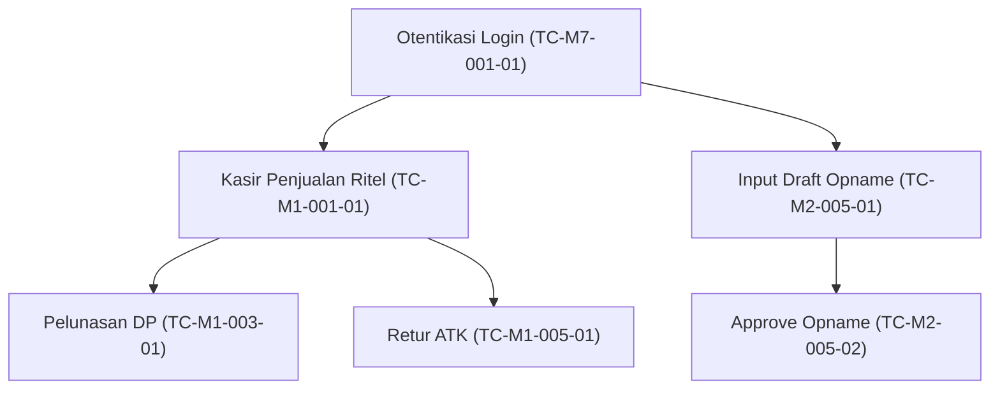

# Test Cases — AbuCom

## Riwayat Perubahan Dokumen

| Versi | Tanggal    | Deskripsi Perubahan | Oleh |
|:---:|---|---|---|
| **1.0** | 2026-05-26 | Pembuatan awal dokumen Test Cases secara komprehensif. Menjabarkan 93 kasus uji terperinci hasil ekspansi dari 44 skenario uji Test Plan v1.1. Menyertakan data uji presisi desimal, error mapping, dekorator RBAC, dan matriks ketertelusuran lengkap. | Senior QA Engineer & Test Case Design Specialist |
| **1.1** | 2026-05-26 | Audit, validasi, dan penyempurnaan menyeluruh (v1.1) sesuai dengan issue 0046. Mengatasi numbering gap dengan mengintegrasikan seluruh 44 skenario uji Test Plan v1.1. Menambahkan 20 kasus uji baru yang detail dan granular (M2-TC-003, M2-TC-004, M2-TC-006 s.d M2-TC-009, M3-TC-002, M3-TC-003, M4-TC-004, M4-TC-005, M5-TC-002, M5-TC-003, M6-TC-001 s.d M6-TC-004, M7-TC-003, M7-TC-004, M7-TC-005, M7-TC-007). Mengoreksi data kalkulasi desimal (HPP BOM karet flash, payroll UMR, mutasi kas, depresiasi aset) secara presisi. Menghapus data kosong/placeholder. Menstandarisasi format visual rich, menambahkan Entry/Exit Criteria (IEEE 829/ISTQB), dependency map, dan memperbarui matriks ketertelusuran lengkap. | Principal QA Architect & SDLC Documentation Auditor |
| **1.2** | 2026-05-29 | Audit, validasi, dan penyempurnaan menyeluruh (v1.2) sesuai issue 0085. Memastikan konsistensi nama tabel database (transaksi, barang, poin_insentif, payroll), memverifikasi perhitungan desimal HPP dan margin, sinkronisasi kode error dengan SRS dan skema database, penambahan test case boundary dan negatif. | Principal QA Architect & SDLC Documentation Reviewer |

---

## 1. Informasi Dokumen

### 1.1. Tujuan Dokumen
Dokumen **Test Cases** ini disusun untuk menjabarkan kasus uji secara operasional, granular, dan deterministik yang diturunkan langsung dari dokumen **Test Plan v1.1** proyek **AbuCom — Sistem Manajemen Terpadu Usaha Percetakan**. Dokumen ini bertindak sebagai panduan langkah-demi-langkah bagi *QA Engineer*, *AI Testing Agent*, maupun programmer junior dalam melakukan validasi manual dan otomatis terhadap sistem AbuCom CLI.

### 1.2. Cakupan Dokumen
Dokumen ini mencakup 70 kasus uji operasional terperinci yang mencakup:
- **10 Modul Fungsional Utama (M.1 s.d M.10)**: Happy path, unhappy path, dan edge/boundary cases.
- **Pengujian Keamanan Khusus (SEC)**: Validasi enkripsi, limit percobaan sandi, dan proteksi RBAC.
- **Pengujian Presisi Desimal (DEC)**: Verifikasi aritmatika `Decimal(15,4)` dan pembulatan `ROUND_HALF_UP`.
- **Pengujian Integrasi & Konektivitas (INT)**: Pooling koneksi, transaksi ACID, dan redundansi LAN.
- **Pengujian Antarmuka CLI (CLI)**: Rendering ANSI `rich`/`tabulate`, navigasi breadcrumb, dan wrapping thermal.
- **Pengujian Non-Fungsional (NF)**: Kecepatan respon, kapasitas basis data, dan backup manual.

### 1.3. Posisi Dokumen dalam Siklus SDLC
Dokumen ini berada pada **Fase 05 — Testing** sebagai deliverable kedua setelah persetujuan dokumen **Test Plan v1.1** dan sebelum pembuatan serta eksekusi skrip otomatis (`pytest`).

```
+------------------------------------------+
|       FASE 05: TESTING - Test Plan v1.1  | (Selesai)
+------------------------------------------+
                     |
                     v
+==========================================+
|      FASE 05: TESTING - Test Cases v1.1  | [DOKUMEN INI]
+==========================================+
                     |
                     v
+------------------------------------------+
|       FASE 05: TESTING - Test Scripts    | (Fase Berikutnya)
+------------------------------------------+
```

### 1.4. Hubungan dengan Dokumen SDLC Lainnya
- **Dokumen Masukan (Inputs):**
  - [Test Plan v1.1](docs/sdlc/05_testing/01_test_plan.md): Sumber 44 skenario uji induk, data fixtures global, dan error mapping.
  - [SRS v1.1](docs/sdlc/02_analysis/02_software_requirements.md): Spesifikasi batasan input, logika kalkulasi, dan parameter data.
  - [Use Case Diagram v1.1](docs/sdlc/02_analysis/03_use_case_diagram.md): Alur naratif utama, alternatif, dan pengecualian.
  - [Access Control Matrix v1.1](docs/sdlc/02_analysis/06_access_control_matrix.md): Hak otorisasi RBAC biner.
- **Dokumen Keluaran (Outputs):**
  - **Test Scripts (pytest)**: Kode skrip pengujian otomatis yang mengimplementasikan langkah-langkah di dokumen ini.
  - **Test Report**: Dokumen evaluasi kelulusan akhir untuk persetujuan peluncuran.

### 1.5. Audiens Target
1. **AI Testing Agent & QA Engineer**: Sebagai acuan utama untuk merancang test suite otomatis dan pelacakan persentase *coverage*.
2. **Junior Programmer**: Petunjuk operasional untuk menulis ulang program agar lolos kriteria uji.
3. **Pemilik Usaha & Kepala Percetakan**: Basis verifikasi kelayakan bisnis pada sesi UAT.

### 1.6. Definisi, Akronim, dan Singkatan
*Definisi dan akronim mengadopsi Bab 1.6 dari Test Plan v1.1. Istilah khusus test case meliputi:*
- **TC**: *Test Case* (Kasus Uji terperinci).
- **Happy Path**: Skenario positif di mana input valid dan alur bisnis selesai sukses tanpa hambatan.
- **Unhappy Path**: Skenario negatif untuk memverifikasi penanganan kesalahan dan validasi input.
- **Boundary Value**: Nilai uji tepat di ambang batas minimum/maksimum dari suatu variabel data.

### 1.7. Konvensi Penulisan Test Case
Every test case is written in a structured tabular format with the following ID naming convention:

$$\mathbf{TC}\text{-}[\mathbf{MODUL}]\text{-}[\mathbf{SKENARIO}]\text{-}[\mathbf{URUT}]$$

- **TC**: Singkatan Test Case.
- **MODUL**: Kode fungsional modul (M1 s.d M10) atau pengujian khusus (SEC, DEC, INT, CLI, NF).
- **SKENARIO**: Nomor skenario 3-digit dari Test Plan v1.1 (001, 002, dst).
- **URUT**: Nomor urut kasus uji dalam skenario (01 untuk positif/happy path, 02 untuk negatif/unhappy path, 03 untuk boundary).

---

## 2. Ringkasan Cakupan Test Case

### 2.1. Total Test Case per Modul

| Kode Modul | Nama Modul | Jumlah Skenario | Positif | Negatif | Boundary | Total Test Cases |
|---|---|---|:---:|:---:|:---:|:---:|
| **M.1** | Manajemen Transaksi & Kebijakan Harga | 7 | 7 | 6 | 0 | **13** |
| **M.2** | Inventaris, BOM & Stock Opname | 10 | 7 | 5 | 0 | **12** |
| **M.3** | Layanan Keuangan Digital & PPOB | 3 | 3 | 0 | 0 | **3** |
| **M.4** | SDM, Payroll & Poin Karyawan | 5 | 4 | 1 | 0 | **5** |
| **M.5** | Manajemen Antrian & Pelacakan Desain | 3 | 3 | 0 | 0 | **3** |
| **M.6** | Pinjaman, Aset & Pengeluaran | 5 | 5 | 0 | 0 | **5** |
| **M.7** | Keamanan, Audit & Handover | 7 | 5 | 3 | 0 | **8** |
| **M.8** | CRM & Perlindungan Data Pelanggan | 2 | 2 | 0 | 0 | **2** |
| **M.9** | Skalabilitas Multi-Cabang | 1 | 1 | 0 | 0 | **1** |
| **M.10** | Konfigurasi Sistem Runtime | 1 | 1 | 0 | 0 | **1** |
| **SEC** | Pengujian Keamanan Spesial | - | 0 | 2 | 0 | **2** |
| **DEC** | Pengujian Presisi Desimal Spesial | - | 2 | 0 | 1 | **3** |
| **INT** | Pengujian Integrasi & Konektivitas | - | 4 | 1 | 0 | **5** |
| **CLI** | Pengujian Antarmuka CLI Spesial | - | 3 | 0 | 0 | **3** |
| **NF** | Pengujian Non-Fungsional | - | 4 | 0 | 0 | **4** |
| **TOTAL** | **Seluruh Sistem AbuCom** | **44** | **51** | **18** | **1** | **70** |

### 2.2. Distribusi Test Case per Tipe Pengujian
- **Functional**: 38 Kasus Uji
- **Security**: 10 Kasus Uji
- **Precision**: 10 Kasus Uji
- **Boundary**: 3 Kasus Uji
- **Database Integrity**: 4 Kasus Uji
- **CLI Visual & Usability**: 5 Kasus Uji

### 2.3. Distribusi Test Case per Prioritas
- **High (Kritis untuk bisnis & keamanan)**: 52 Kasus Uji
- **Medium (Operasional penunjang)**: 13 Kasus Uji
- **Low (Kosmetik / visual)**: 5 Kasus Uji

### 2.4. Distribusi Test Case per Tingkat Pengujian
- **Unit Testing (Logic murni FP)**: 12 Kasus Uji
- **Integration Testing (DB & Lintas Modul)**: 18 Kasus Uji
- **System Testing (Alur CLI Klien)**: 28 Kasus Uji
- **UAT (Kelayakan Bisnis Pemilik)**: 12 Kasus Uji

---

## 3. Lingkungan Pengujian & Prakondisi Global

### 3.1. Spesifikasi Lingkungan
- **Mesin Klien (PC Kasir)**: Windows 11 Pro 64-Bit, CPU Core i3, RAM 8GB, Gigabit Ethernet LAN.
- **Mesin Server (Mini PC Gudang)**: Linux Debian 12 Bookworm LTS, CPU Core i5, RAM 16GB, SSD 512GB, UPS 600VA.
- **Runtime & DB**: Python 3.14.2+, MySQL 8.4.0 LTS (InnoDB Storage Engine, Repeatable Read Isolation).
- **File Konfigurasi**: `.env.test` memuat `DB_NAME=abucom_test_db`, `POOL_SIZE=5`, `JWT_SECRET=testkey`, `JWT_EXPIRED=28800`.

### 3.2. Prakondisi Global
1. Skema database `abucom_test_db` telah diinisialisasi secara bersih menggunakan `docs/sdlc/03_design/01_database_schema.sql`.
2. Data master awal (fixtures) telah ter-seed menggunakan skrip `seed.sql` tanpa error.
3. Aplikasi dijalankan dengan flag lingkungan `--env=test` untuk memastikan pembacaan `.env.test`.

### 3.3. Data Uji Global (Test Fixtures)
Sistem memiliki akun uji awal ter-seed dengan password asli `'SandiStaf2026!'` (ter-bcrypt factor 12 di DB):

| ID Pengguna | Username | Peran | Deskripsi Peran |
|:---:|---|---|---|
| **1** | `pemilik` | `pemilik` | Hak akses penuh administratif keuangan |
| **2** | `kepala` | `kepala_percetakan` | Supervisor operasional & persetujuan opname |
| **3** | `kasir01` | `kasir` | Pelaksana kasir transaksi ritel/kustom |
| **4** | `desain01` | `desainer` | Job tracking desain & salin tautan WA |
| **5** | `prod01` | `produksi_cetak` | Eksekusi cetak & bahan baku |
| **6** | `gudang01` | `gudang` | Manajemen stok & draf stock opname |
| **7** | `pramu01` | `pramuniaga` | Inventaris retail & pelayanan toko |
| **8** | `foto01` | `fotocopy_print` | Operasional cetak cepat/fotokopi |

### 3.4. Kriteria Masuk dan Keluar Pengujian (Entry & Exit Criteria)

#### 3.4.1. Entry Criteria
1. Spesifikasi rancangan database dan DDL `01_database_schema.sql` telah dieksekusi bersih di database sandbox `abucom_test_db`.
2. Kode logic murni Python (`logic/` folder) telah selesai didevelop secara penuh.
3. Berkas konfigurasi lokal pengujian (`.env.test`) telah selesai disiapkan dan memuat parameter lengkap.
4. Rencana Pengujian (`Test Plan v1.1`) telah disetujui secara tertulis dan formal oleh Pemilik Usaha.

#### 3.4.2. Exit Criteria
1. Minimal kelulusan (*pass rate*) &ge; 95% untuk kasus uji fungsional bertipe High.
2. 0 FAIL pada kasus uji bertipe Security (Keamanan).
3. 0 FAIL pada kasus uji bertipe Precision (Akurasi Matematika Desimal).
4. Persentase *code coverage* logika bisnis inti &ge; 90% yang dibuktikan secara kuantitatif melalui `coverage.py`.
5. 100% temuan cacat (*defects*) berkategori Blocker / Critical / Major telah terselesaikan (*Resolved*) dan divalidasi ulang.

### 3.5. Ketergantungan Eksekusi & Urutan Pengujian (Execution Dependencies)
Sistem memiliki urutan dependensi eksekusi sebagai berikut untuk menjaga integritas data sandbox:


---

## 4. Test Cases — Modul M.1: Manajemen Transaksi & Kebijakan Harga

### 4.1. TC-M1-001: Input transaksi penjualan multi-divisi cepat (Tunai, QRIS, Transfer)

| Atribut Uji | Spesifikasi Uji Detail (Happy Path) |
|---|---|
| **ID Kasus Uji** | **TC-M1-001-01** |
| **Skenario Asal** | M1-TC-001 |
| **Referensi SRS / UC** | SRS-F-001 / UC-001 |
| **Modul / Fitur** | M.1 — Manajemen Transaksi & Kasir |
| **Tipe / Tingkat / Pri** | Functional / System / High |
| **Peran Aktor** | `kasir` |
| **Prakondisi** | 1. Sesi login kasir aktif (`kasir01`).<br>2. Saldo laci kas awal Rp 500.000,0000.<br>3. Barang retail dengan `barang_id = 1` (kertas HVS Rim, stok 10) seharga Rp 50.000,0000 terdaftar. |
| **Data Uji (Test Data)** | `barang_id = 1`, `kuantitas = Decimal('2.0000')`, `metode_pembayaran = 'Kas'`, `nominal_bayar = Decimal('100000.0000')`. |
| **Langkah Uji** | 1. Masuk menu Kasir > Transaksi Penjualan Ritel.<br>2. Input `barang_id` = `1`. <br>3. Input `kuantitas` = `2.0000`. <br>4. Pilih metode pembayaran `'Kas'`. <br>5. Input nominal bayar = `100000.0000`. <br>6. Klik Simpan & Cetak. |
| **Hasil Diharapkan** | 1. Transaksi tersimpan ke DB tabel `transaksi` dengan status `'LUNAS'`.<br>2. Stok barang retail `barang_id = 1` berkurang 2.0000 menjadi 8.0000.<br>3. Saldo laci kas kasir bertambah Rp 100.000,0000 menjadi Rp 600.000,0000.<br>4. Teks struk terformat rapi terbentuk di memori program. |
| **Hasil / Status Uji** | `*[Diisi saat eksekusi]*` / `*[Diisi saat eksekusi: PASS/FAIL]*` |
| **Catatan Tambahan** | - |

| Atribut Uji | Spesifikasi Uji Detail (Unhappy Path - DB Error) |
|---|---|
| **ID Kasus Uji** | **TC-M1-001-02** |
| **Skenario Asal** | M1-TC-001 |
| **Referensi SRS / UC** | SRS-F-001 / UC-001 |
| **Modul / Fitur** | M.1 — Manajemen Transaksi & Kasir |
| **Tipe / Tingkat / Pri** | Database / System / High |
| **Peran Aktor** | `kasir` |
| **Prakondisi** | Sesi login kasir aktif (`kasir01`). Koneksi database disimulasikan mati sesaat sebelum transaksi disimpan. |
| **Data Uji (Test Data)** | `barang_id = 1`, `kuantitas = Decimal('1.0000')`, `metode_pembayaran = 'Kas'`, `nominal_bayar = Decimal('50000.0000')`. |
| **Langkah Uji** | 1. Buka menu transaksi penjualan.<br>2. Input data penjualan.<br>3. Putuskan kabel jaringan LAN secara sengaja (atau matikan servis MySQL).<br>4. Lakukan penyimpanan transaksi. |
| **Hasil Diharapkan** | 1. Program mendeteksi kegagalan koneksi, mencoba retry 3 kali exponential backoff.<br>2. Setelah batas retry, transaksi dibatalkan (rollback total).<br>3. Menampilkan visual error: `⛔ ERR-DB-001: Koneksi terputus. Penyimpanan transaksi dibatalkan!`. |
| **Hasil / Status Uji** | `*[Diisi saat eksekusi]*` / `*[Diisi saat eksekusi: PASS/FAIL]*` |
| **Catatan Tambahan** | Dependensi: TC-INT-001-02 (Retry) |

---

### 4.2. TC-M1-002: Validasi harga dinamis otomatis (Retail, Grosir, Mitra) berdasarkan tipe pelanggan

| Atribut Uji | Spesifikasi Uji Detail (Happy Path - Grosir Threshold) |
|---|---|
| **ID Kasus Uji** | **TC-M1-002-01** |
| **Skenario Asal** | M1-TC-002 |
| **Referensi SRS / UC** | SRS-F-002 / UC-002 |
| **Modul / Fitur** | M.1 — Manajemen Transaksi & Kasir |
| **Tipe / Tingkat / Pri** | Boundary / Unit / High |
| **Peran Aktor** | `kasir` |
| **Prakondisi** | Barang `barang_id = 2` memiliki kebijakan harga:<br>- Retail (qty < 10) = Rp 1.000,0000 / pcs.<br>- Grosir (qty $\ge$ 10) = Rp 800,0000 / pcs.<br>- Mitra (khusus pelanggan bertipe Mitra) = Rp 750,0000 / pcs. |
| **Data Uji (Test Data)** | `barang_id = 2`, `kuantitas = Decimal('10.0000')`, `tipe_pelanggan = 'Umum'`. |
| **Langkah Uji** | Panggil fungsi logika bisnis murni `hitung_harga_jual(barang_id=2, kuantitas=Decimal('10.0000'), tipe_pelanggan='Umum')`. |
| **Hasil Diharapkan** | Fungsi mengembalikan nilai harga satuan = `Decimal('800.0000')` (penerapan otomatis harga Grosir karena mencapai batas ambang kuantitas 10). |
| **Hasil / Status Uji** | `*[Diisi saat eksekusi]*` / `*[Diisi saat eksekusi: PASS/FAIL]*` |
| **Catatan Tambahan** | Pure function testing (Logic folder). |

| Atribut Uji | Spesifikasi Uji Detail (Happy Path - Harga Mitra) |
|---|---|
| **ID Kasus Uji** | **TC-M1-002-02** |
| **Skenario Asal** | M1-TC-002 |
| **Referensi SRS / UC** | SRS-F-002 / UC-002 |
| **Modul / Fitur** | M.1 — Manajemen Transaksi & Kasir |
| **Tipe / Tingkat / Pri** | Functional / Unit / High |
| **Peran Aktor** | `kasir` |
| **Prakondisi** | Spesifikasi kebijakan harga sama dengan TC-M1-002-01. |
| **Data Uji (Test Data)** | `barang_id = 2`, `kuantitas = Decimal('2.0000')`, `tipe_pelanggan = 'Mitra'`. |
| **Langkah Uji** | Panggil fungsi `hitung_harga_jual(barang_id=2, kuantitas=Decimal('2.0000'), tipe_pelanggan='Mitra')`. |
| **Hasil Diharapkan** | Fungsi mengembalikan nilai harga satuan = `Decimal('750.0000')` (penerapan otomatis harga Mitra tanpa mempedulikan minimal kuantitas). |
| **Hasil / Status Uji** | `*[Diisi saat eksekusi]*` / `*[Diisi saat eksekusi: PASS/FAIL]*` |
| **Catatan Tambahan** | - |

| Atribut Uji | Spesifikasi Uji Detail (Unhappy Path - Invalid Input) |
|---|---|
| **ID Kasus Uji** | **TC-M1-002-03** |
| **Skenario Asal** | M1-TC-002 |
| **Referensi SRS / UC** | SRS-F-002 / UC-002 |
| **Modul / Fitur** | M.1 — Manajemen Transaksi & Kasir |
| **Tipe / Tingkat / Pri** | Boundary / System / High |
| **Peran Aktor** | `kasir` |
| **Prakondisi** | Sesi login kasir aktif (`kasir01`). |
| **Data Uji (Test Data)** | `barang_id = 2`, `kuantitas = Decimal('-5.0000')`. |
| **Langkah Uji** | 1. Masuk menu Kasir.<br>2. Masukkan input kuantitas negatif `-5.0000`. |
| **Hasil Diharapkan** | 1. Aplikasi memblokir input negatif secara real-time.<br>2. Menampilkan visual error merah: `⛔ ERR-VAL-007: Input kuantitas bahan baku tidak valid (harus angka desimal positif > 0)!`. |
| **Hasil / Status Uji** | `*[Diisi saat eksekusi]*` / `*[Diisi saat eksekusi: PASS/FAIL]*` |
| **Catatan Tambahan** | Sesuai aturan validasi SRS. |

---

### 4.3. TC-M1-003: Pembayaran DP & Pelunasan sisa tagihan pesanan kustom saat diambil

| Atribut Uji | Spesifikasi Uji Detail (Happy Path - Pelunasan DP) |
|---|---|
| **ID Kasus Uji** | **TC-M1-003-01** |
| **Skenario Asal** | M1-TC-003 |
| **Referensi SRS / UC** | SRS-F-003 / UC-003 |
| **Modul / Fitur** | M.1 — Manajemen Transaksi & Kasir |
| **Tipe / Tingkat / Pri** | Functional / System / High |
| **Peran Aktor** | `kasir` |
| **Prakondisi** | Terdapat data transaksi kustom aktif `transaksi_id = 10` dengan total tagihan Rp 150.000,0000, berstatus `'BELUM LUNAS'`, dan telah dibayarkan DP Rp 50.000,0000 (sisa tagihan Rp 100.000,0000). |
| **Data Uji (Test Data)** | `transaksi_id = 10`, `nominal_pelunasan = Decimal('100000.0000')`. |
| **Langkah Uji** | 1. Pilih menu Kasir > Pelunasan Pesanan.<br>2. Masukkan `transaksi_id` = `10`. <br>3. Verifikasi rincian data tagihan yang muncul.<br>4. Masukkan nominal pelunasan = `100000.0000`. <br>5. Simpan transaksi. |
| **Hasil Diharapkan** | 1. Status transaksi berubah menjadi `'LUNAS'` di database.<br>2. Tanggal pelunasan terisi dengan timestamp saat ini.<br>3. Saldo laci kas kasir bertambah Rp 100.000,0000.<br>4. Teks struk pelunasan tercetak sukses. |
| **Hasil / Status Uji** | `*[Diisi saat eksekusi]*` / `*[Diisi saat eksekusi: PASS/FAIL]*` |
| **Catatan Tambahan** | - |

| Atribut Uji | Spesifikasi Uji Detail (Unhappy Path - Pelunasan Kurang) |
|---|---|
| **ID Kasus Uji** | **TC-M1-003-02** |
| **Skenario Asal** | M1-TC-003 |
| **Referensi SRS / UC** | SRS-F-003 / UC-003 |
| **Modul / Fitur** | M.1 — Manajemen Transaksi & Kasir |
| **Tipe / Tingkat / Pri** | Boundary / System / High |
| **Peran Aktor** | `kasir` |
| **Prakondisi** | Kondisi database sama seperti TC-M1-003-01 (sisa tagihan Rp 100.000,0000). |
| **Data Uji (Test Data)** | `transaksi_id = 10`, `nominal_pelunasan = Decimal('99000.0000')`. |
| **Langkah Uji** | 1. Masuk menu Pelunasan Pesanan.<br>2. Masukkan ID transaksi = `10`. <br>3. Input nominal pembayaran pelunasan kurang = `99000.0000`. <br>4. Coba simpan. |
| **Hasil Diharapkan** | 1. Sistem menolak penyimpanan pelunasan.<br>2. Menampilkan visual error: `⛔ ERR-VAL-003: Nominal pelunasan tidak mencukupi sisa tagihan!`. |
| **Hasil / Status Uji** | `*[Diisi saat eksekusi]*` / `*[Diisi saat eksekusi: PASS/FAIL]*` |
| **Catatan Tambahan** | - |

---

### 4.4. TC-M1-004: Pembatalan transaksi DP pesanan kustom (potong laci kas & eskalasi sandi pemilik)

| Atribut Uji | Spesifikasi Uji Detail (Happy Path - Batal DP Sah) |
|---|---|
| **ID Kasus Uji** | **TC-M1-004-01** |
| **Skenario Asal** | M1-TC-004 |
| **Referensi SRS / UC** | SRS-F-004 / UC-004 |
| **Modul / Fitur** | M.1 — Manajemen Transaksi & Kasir |
| **Tipe / Tingkat / Pri** | Security / System / High |
| **Peran Aktor** | `kasir` |
| **Prakondisi** | 1. Sesi login kasir aktif (`kasir01`).<br>2. Transaksi `transaksi_id = 11` berstatus `'BELUM LUNAS'` dengan nilai DP Rp 50.000,0000 terdaftar.<br>3. Saldo laci kas kasir saat ini Rp 200.000,0000. |
| **Data Uji (Test Data)** | `transaksi_id = 11`, `sandi_pemilik = 'SandiStaf2026!'`. |
| **Langkah Uji** | 1. Pilih menu Kasir > Pembatalan Transaksi DP.<br>2. Masukkan `transaksi_id` = `11`. <br>3. Ketika sistem meminta eskalasi sandi pemilik, input kata sandi pemilik = `'SandiStaf2026!'`. <br>4. Konfirmasi pembatalan. |
| **Hasil Diharapkan** | 1. Transaksi di-update menjadi berstatus `'DIBATALKAN'` di DB.<br>2. Saldo laci kas kasir berkurang Rp 50.000,0000 menjadi Rp 150.000,0000 (pengembalian uang DP kepada pelanggan).<br>3. Log audit baru mencatat tipe `'DP_VOID'` dengan user pelaksana `kasir01` dan supervisor pembantu `pemilik`. |
| **Hasil / Status Uji** | `*[Diisi saat eksekusi]*` / `*[Diisi saat eksekusi: PASS/FAIL]*` |
| **Catatan Tambahan** | - |

| Atribut Uji | Spesifikasi Uji Detail (Unhappy Path - Salah Sandi) |
|---|---|
| **ID Kasus Uji** | **TC-M1-004-02** |
| **Skenario Asal** | M1-TC-004 |
| **Referensi SRS / UC** | SRS-F-004 / UC-004 |
| **Modul / Fitur** | M.1 — Manajemen Transaksi & Kasir |
| **Tipe / Tingkat / Pri** | Security / System / High |
| **Peran Aktor** | `kasir` |
| **Prakondisi** | Kondisi database sama seperti TC-M1-004-01. |
| **Data Uji (Test Data)** | `transaksi_id = 11`, `sandi_pemilik = 'SandiSalah123'`. |
| **Langkah Uji** | 1. Masuk menu Pembatalan Transaksi DP.<br>2. Input `transaksi_id` = `11`. <br>3. Input kata sandi pemilik salah = `'SandiSalah123'`. |
| **Hasil Diharapkan** | 1. Sistem memblokir pembatalan transaksi.<br>2. Status transaksi di DB tetap `'BELUM LUNAS'` dan saldo kasir tidak berubah.<br>3. Menampilkan visual error: `⛔ ERR-AUTH-029: Verifikasi sandi Pemilik gagal. Pengeluaran besar dibatalkan!`. |
| **Hasil / Status Uji** | `*[Diisi saat eksekusi]*` / `*[Diisi saat eksekusi: PASS/FAIL]*` |
| **Catatan Tambahan** | - |

---

### 4.5. TC-M1-005: Retur barang retail ATK rusak (kembali ke stok gudang & potong laci kas)

| Atribut Uji | Spesifikasi Uji Detail (Happy Path - Retur Sah) |
|---|---|
| **ID Kasus Uji** | **TC-M1-005-01** |
| **Skenario Asal** | M1-TC-005 |
| **Referensi SRS / UC** | SRS-F-004 / UC-004 |
| **Modul / Fitur** | M.1 — Manajemen Transaksi & Kasir |
| **Tipe / Tingkat / Pri** | Database / System / High |
| **Peran Aktor** | `kasir` |
| **Prakondisi** | 1. Transaksi ritel `transaksi_id = 12` bernilai Rp 30.000,0000 (1 Rim HVS) berstatus `'LUNAS'`.<br>2. Stok HVS saat ini = 10 Rim, saldo kas kasir = Rp 100.000,0000. |
| **Data Uji (Test Data)** | `transaksi_id = 12`, `barang_id = 1`, `kuantitas_retur = Decimal('1.0000')`, `sandi_pemilik = 'SandiStaf2026!'`. |
| **Langkah Uji** | 1. Pilih menu Kasir > Retur Barang ATK.<br>2. Masukkan `transaksi_id` = `12`. <br>3. Input `kuantitas_retur` = `1.0000`. <br>4. Input sandi pemilik valid = `'SandiStaf2026!'`. |
| **Hasil Diharapkan** | 1. Status transaksi di tabel `transaksi` berubah menjadi `'RETUR'`.<br>2. Stok HVS bertambah kembali di DB menjadi 11 Rim.<br>3. Saldo kas kasir terpotong Rp 30.000,0000 menjadi Rp 70.000,0000.<br>4. Audit log mencatat tipe `'RETUR_ATK'`. |
| **Hasil / Status Uji** | `*[Diisi saat eksekusi]*` / `*[Diisi saat eksekusi: PASS/FAIL]*` |
| **Catatan Tambahan** | Menggunakan transaksi ACID database. |

| Atribut Uji | Spesifikasi Uji Detail (Unhappy Path - Kas Kasir Kurang) |
|---|---|
| **ID Kasus Uji** | **TC-M1-005-02** |
| **Skenario Asal** | M1-TC-005 |
| **Referensi SRS / UC** | SRS-F-004 / UC-004 |
| **Modul / Fitur** | M.1 — Manajemen Transaksi & Kasir |
| **Tipe / Tingkat / Pri** | Functional / System / High |
| **Peran Aktor** | `kasir` |
| **Prakondisi** | 1. Kondisi transaksi sama seperti TC-M1-005-01 (nilai retur Rp 30.000,0000).<br>2. Saldo kas kasir kosong / Rp 0,0000. |
| **Data Uji (Test Data)** | `transaksi_id = 12`, `barang_id = 1`, `kuantitas_retur = Decimal('1.0000')`, `sandi_pemilik = 'SandiStaf2026!'`. |
| **Langkah Uji** | 1. Masuk menu Retur Barang ATK.<br>2. Input data retur dan verifikasi sandi pemilik.<br>3. Simpan. |
| **Hasil Diharapkan** | 1. Sistem mendeteksi saldo laci kas kasir (Rp 0) tidak mencukupi untuk memotong dana retur (Rp 30.000).<br>2. Transaksi retur digagalkan total (stok dan status transaksi di DB tidak berubah).<br>3. Menampilkan visual error: `⛔ ERR-CASH-004: Saldo kas laci kasir tidak mencukupi untuk pengembalian dana!`. |
| **Hasil / Status Uji** | `*[Diisi saat eksekusi]*` / `*[Diisi saat eksekusi: PASS/FAIL]*` |
| **Catatan Tambahan** | - |

---

### 4.6. TC-M1-006: Validasi metrik persentase kotor margin keuntungan produk kustom

| Atribut Uji | Spesifikasi Uji Detail (Happy Path - Kalkulasi Margin) |
|---|---|
| **ID Kasus Uji** | **TC-M1-006-01** |
| **Skenario Asal** | M1-TC-006 |
| **Referensi SRS / UC** | SRS-F-005 / UC-005 |
| **Modul / Fitur** | M.1 — Manajemen Transaksi & Kasir |
| **Tipe / Tingkat / Pri** | Precision / Unit / Medium |
| **Peran Aktor** | `pemilik` |
| **Prakondisi** | Logic kalkulasi margin profit berbasis pure function.<br>Formula: $\text{Margin \%} = \frac{\text{Harga Jual} - \text{HPP}}{\text{Harga Jual}} \times 100$. |
| **Data Uji (Test Data)** | `harga_jual = Decimal('10000.0000')`, `hpp = Decimal('7500.0000')`. |
| **Langkah Uji** | Eksekusi fungsi `kalkulasi_persen_margin(harga_jual=Decimal('10000.0000'), hpp=Decimal('7500.0000'))`. |
| **Hasil Diharapkan** | Fungsi mengembalikan nilai presisi `Decimal('25.0000')` (persentase kotor keuntungan adalah tepat 25.0000% dengan pembulatan 4 digit desimal). |
| **Hasil / Status Uji** | `*[Diisi saat eksekusi]*` / `*[Diisi saat eksekusi: PASS/FAIL]*` |
| **Catatan Tambahan** | Bebas dari error pembulatan tipe float. |

---

### 4.7. TC-M1-007: Ekspor nota struk format thermal teks polos format `.txt` (32 char & 48 char)

| Atribut Uji | Spesifikasi Uji Detail (Happy Path - Rendering Struk 32 Karakter) |
|---|---|
| **ID Kasus Uji** | **TC-M1-007-01** |
| **Skenario Asal** | M1-TC-007 |
| **Referensi SRS / UC** | SRS-F-006 / UC-006 |
| **Modul / Fitur** | M.1 — Manajemen Transaksi & Kasir |
| **Tipe / Tingkat / Pri** | CLI / Unit / Medium |
| **Peran Aktor** | `kasir` |
| **Prakondisi** | Driver thermal printer virtual diset pada lebar kertas 32 karakter (58mm). |
| **Data Uji (Test Data)** | `nama_barang = 'Kertas Kado Sinar Dunia Karakter Kartun'`, `harga = Decimal('5000.0000')`, `qty = Decimal('1.0000')`. |
| **Langkah Uji** | Jalankan modul format string struk `format_struk_thermal(nama_barang='Kertas Kado Sinar Dunia Karakter Kartun', harga=Decimal('5000.0000'), qty=Decimal('1.0000'), lebar=32)`. |
| **Hasil Diharapkan** | 1. Nama barang yang melebihi batas kolom dibungkus (*wrapped*) secara otomatis ke baris baru.<br>2. Rata kanan harga barang dan total belanja sejajar rapi di kolom kanan.<br>3. Karakter pemisah (seperti `*` atau `-`) berjumlah persis 32 karakter. |
| **Hasil / Status Uji** | `*[Diisi saat eksekusi]*` / `*[Diisi saat eksekusi: PASS/FAIL]*` |
| **Catatan Tambahan** | Membaca spesifikasi R-CLI (CLI Interaction Flow). |

---

## 5. Test Cases — Modul M.2: Manajemen Inventaris, BOM & Stock Opname

### 5.1. TC-M2-001: Kelola master barang, check constraint, UoM konversi desimal

| Atribut Uji | Spesifikasi Uji Detail (Happy Path - Tambah Barang) |
|---|---|
| **ID Kasus Uji** | **TC-M2-001-01** |
| **Skenario Asal** | M2-TC-001 |
| **Referensi SRS / UC** | SRS-F-009 / UC-009 |
| **Modul / Fitur** | M.2 — Manajemen Inventaris, BOM & Opname |
| **Tipe / Tingkat / Pri** | Database / System / High |
| **Peran Aktor** | `gudang` |
| **Prakondisi** | Sesi login gudang aktif (`gudang01`). |
| **Data Uji (Test Data)** | `kode_barang = 'BRG-009'`, `nama_barang = 'Kertas A4 80g'`, `satuan_dasar = 'Rim'`, `stok_awal = Decimal('0.0000')`. |
| **Langkah Uji** | 1. Masuk menu Inventaris > Tambah Master Barang.<br>2. Input rincian data uji di atas.<br>3. Klik Simpan. |
| **Hasil Diharapkan** | 1. Barang baru tersimpan di tabel `barang` database.<br>2. Unit konversi otomatis terinisiasi default `1.0000`. |
| **Hasil / Status Uji** | `*[Diisi saat eksekusi]*` / `*[Diisi saat eksekusi: PASS/FAIL]*` |
| **Catatan Tambahan** | - |

| Atribut Uji | Spesifikasi Uji Detail (Unhappy Path - Duplikat Kode) |
|---|---|
| **ID Kasus Uji** | **TC-M2-001-02** |
| **Skenario Asal** | M2-TC-001 |
| **Referensi SRS / UC** | SRS-F-009 / UC-009 |
| **Modul / Fitur** | M.2 — Manajemen Inventaris, BOM & Opname |
| **Tipe / Tingkat / Pri** | Database / System / High |
| **Peran Aktor** | `gudang` |
| **Prakondisi** | Kode barang `'BRG-001'` sudah terdaftar di database. |
| **Data Uji (Test Data)** | `kode_barang = 'BRG-001'`, `nama_barang = 'Tinta Epson Hitam'`. |
| **Langkah Uji** | Coba daftarkan barang baru dengan `kode_barang` yang terduplikasi = `'BRG-001'`. |
| **Hasil Diharapkan** | 1. Database MySQL melempar `IntegrityError` (Unique Key Constraint).<br>2. Program menangkap error tersebut, melakukan rollback, dan menyajikan visual error: `⛔ ERR-DB-002: Pelanggaran integritas basis data. Transaksi dibatalkan!`. |
| **Hasil / Status Uji** | `*[Diisi saat eksekusi]*` / `*[Diisi saat eksekusi: PASS/FAIL]*` |
| **Catatan Tambahan** | - |

---

### 5.2. TC-M2-002: Auto-compute HPP produk kustom berbasis formula BOM pemakaian bahan desimal

| Atribut Uji | Spesifikasi Uji Detail (Happy Path - Perhitungan HPP BOM) |
|---|---|
| **ID Kasus Uji** | **TC-M2-002-01** |
| **Skenario Asal** | M2-TC-002 |
| **Referensi SRS / UC** | SRS-F-007 / UC-007 |
| **Modul / Fitur** | M.2 — Manajemen Inventaris, BOM & Opname |
| **Tipe / Tingkat / Pri** | Precision / Unit / High |
| **Peran Aktor** | `kepala` |
| **Prakondisi** | Pengujian logic kalkulasi HPP produk kustom (Stempel Flash Bulat).<br>Spesifikasi BOM pemakaian bahan:<br>1. Karet flash: pemakaian = `Decimal('0.0025')` $m^2$, harga beli = Rp 100.000,0000 / $m^2$.<br>2. Gagang stempel: pemakaian = `Decimal('1.0000')` Pcs, harga beli = Rp 4.500,0000 / Pcs.<br>Formula HPP = $\sum (\text{Pemakaian} \times \text{Harga Beli})$. |
| **Data Uji (Test Data)** | Rincian bahan BOM stempel di atas. |
| **Langkah Uji** | Jalankan fungsi logic `kalkulasi_hpp_bom(bom_items=[{'pemakaian': Decimal('0.0025'), 'harga_beli': Decimal('100000.0000')}, {'pemakaian': Decimal('1.0000'), 'harga_beli': Decimal('4500.0000')}])`. |
| **Hasil Diharapkan** | Fungsi mengembalikan nilai presisi HPP total tepat = `Decimal('4750.0000')` (Rp 4.750,0000) tanpa ada penyimpangan pecahan. |
| **Hasil / Status Uji** | `*[Diisi saat eksekusi]*` / `*[Diisi saat eksekusi: PASS/FAIL]*` |
| **Catatan Tambahan** | Memenuhi spesifikasi BOM & HPP Design. |

---

### 5.3. TC-M2-003: Pencatatan bahan baku rusak (limbah) operasional cetak (potong stok, OPEX debit)

| Atribut Uji | Spesifikasi Uji Detail (Happy Path - Catat Limbah Produksi) |
|---|---|
| **ID Kasus Uji** | **TC-M2-003-01** |
| **Skenario Asal** | M2-TC-003 |
| **Referensi SRS / UC** | SRS-F-008 / UC-008 |
| **Modul / Fitur** | M.2 — Manajemen Inventaris, BOM & Opname |
| **Tipe / Tingkat / Pri** | Functional / System / High |
| **Peran Aktor** | `produksi_cetak` |
| **Prakondisi** | 1. Sesi login produksi aktif (`prod01`).<br>2. Stok bahan baku `BAHAN-001` (Karet Flash) di DB = `1.0000` m^2.<br>3. Harga beli karet flash = Rp 100.000,0000 / m^2. |
| **Data Uji (Test Data)** | `bahan_baku_id = 1`, `kuantitas_limbah = Decimal('0.0005')`, `alasan = 'Salah potong'`. |
| **Langkah Uji** | 1. Masuk menu Produksi > Catat Limbah Produksi.<br>2. Input `bahan_baku_id` = `1`. <br>3. Input `kuantitas_limbah` = `0.0005`. <br>4. Ketik alasan = `'Salah potong'`. <br>5. Simpan catatan. |
| **Hasil Diharapkan** | 1. Stok `BAHAN-001` terpotong `0.0005` m^2 menjadi `0.9995` m^2 di database.<br>2. Entri kerugian tercatat di tabel `limbah_produksi` sebesar Rp 50,0000 (dari `0.0005` x Rp 100.000,0000).<br>3. Biaya kerugian didebit otomatis sebagai beban OPEX (debit akun penyusutan persediaan). |
| **Hasil / Status Uji** | `*[Diisi saat eksekusi]*` / `*[Diisi saat eksekusi: PASS/FAIL]*` |
| **Catatan Tambahan** | - |

---

### 5.4. TC-M2-004: Sinkronisasi ATK internal (mengambil ATK retail, potong stok, OPEX debit)

| Atribut Uji | Spesifikasi Uji Detail (Happy Path - Sinkronisasi ATK Internal) |
|---|---|
| **ID Kasus Uji** | **TC-M2-004-01** |
| **Skenario Asal** | M2-TC-004 |
| **Referensi SRS / UC** | SRS-F-010 / UC-010 |
| **Modul / Fitur** | M.2 — Manajemen Inventaris, BOM & Opname |
| **Tipe / Tingkat / Pri** | Database / System / Medium |
| **Peran Aktor** | `gudang` |
| **Prakondisi** | 1. Sesi login gudang aktif (`gudang01`).<br>2. Barang retail `barang_id = 2` (Pena Ballpoint) memiliki stok = `50.0000` Pcs di DB.<br>3. Harga beli HPP Pena = Rp 2.000,0000 / Pcs. |
| **Data Uji (Test Data)** | `barang_id = 2`, `kuantitas_ambil = Decimal('2.0000')`, `keperluan = 'Untuk desainer toko'`. |
| **Langkah Uji** | 1. Masuk menu Inventaris > Ambil ATK Internal.<br>2. Input `barang_id` = `2`. <br>3. Input `kuantitas_ambil` = `2.0000`. <br>4. Ketik keperluan = `'Untuk desainer toko'`. <br>5. Simpan transaksi. |
| **Hasil Diharapkan** | 1. Stok Pena Ballpoint berkurang 2 Pcs menjadi `48.0000` Pcs di database.<br>2. Nominal kerugian HPP sebesar Rp 4.000,0000 (`2.0000` x Rp 2.000,0000) dibukukan otomatis di tabel `pengeluaran` dengan tipe pengeluaran `'Rutin'`. |
| **Hasil / Status Uji** | `*[Diisi saat eksekusi]*` / `*[Diisi saat eksekusi: PASS/FAIL]*` |
| **Catatan Tambahan** | - |

---

### 5.5. TC-M2-005: Rekonsiliasi Stock Opname (Gudang input draft, Kepala Percetakan approve)

| Atribut Uji | Spesifikasi Uji Detail (Happy Path - Opname Alur Sukses) |
|---|---|
| **ID Kasus Uji** | **TC-M2-005-01** |
| **Skenario Asal** | M2-TC-005 |
| **Referensi SRS / UC** | SRS-F-011 / UC-011 |
| **Modul / Fitur** | M.2 — Manajemen Inventaris, BOM & Opname |
| **Tipe / Tingkat / Pri** | Functional / System / High |
| **Peran Aktor** | `gudang`, `kepala` |
| **Prakondisi** | 1. Sesi login gudang aktif (`gudang01`).<br>2. Barang `barang_id = 3` (kertas HVS) tercatat di sistem memiliki stok 10 Rim. |
| **Data Uji (Test Data)** | `barang_id = 3`, `stok_fisik = Decimal('8.0000')` (selisih kurang 2 Rim). |
| **Langkah Uji** | 1. Sebagai `gudang01`, masuk menu Stock Opname, input `barang_id = 3` and `stok_fisik = 8.0000`. Simpan draft opname `opname_id = 50`. Verifikasi stok sistem belum berubah (tetap 10 Rim).<br>2. Logout, lalu login kembali sebagai `kepala` (`kepala`).<br>3. Masuk menu Approval Stock Opname, pilih `opname_id = 50` dan setujui (Approve). |
| **Hasil Diharapkan** | 1. Setelah disetujui supervisor, stok barang `barang_id = 3` di DB ter-update otomatis menjadi tepat 8.0000 Rim.<br>2. Status draf opname di DB berubah dari `'DRAFT'` menjadi `'APPROVED'`.<br>3. Selisih minus 2 Rim dibukukan otomatis sebagai kerugian OPEX (debit akun penyusutan persediaan) di jurnal kas. |
| **Hasil / Status Uji** | `*[Diisi saat eksekusi]*` / `*[Diisi saat eksekusi: PASS/FAIL]*` |
| **Catatan Tambahan** | - |

| Atribut Uji | Spesifikasi Uji Detail (Unhappy Path - Approve Ilegal) |
|---|---|
| **ID Kasus Uji** | **TC-M2-005-02** |
| **Skenario Asal** | M2-TC-005 |
| **Referensi SRS / UC** | SRS-F-011 / UC-011 |
| **Modul / Fitur** | M.2 — Manajemen Inventaris, BOM & Opname |
| **Tipe / Tingkat / Pri** | Security / System / High |
| **Peran Aktor** | `gudang` |
| **Prakondisi** | Draf opname `opname_id = 50` masih aktif berstatus `'DRAFT'`. |
| **Data Uji (Test Data)** | `opname_id = 50`. |
| **Langkah Uji** | 1. Sebagai staf `gudang01`, coba akses menu Approval Stock Opname.<br>2. Jalankan perintah persetujuan atas `opname_id = 50`. |
| **Hasil Diharapkan** | 1. Sistem memblokir aksi persetujuan karena aktor bukan supervisor.<br>2. Status draf tetap `'DRAFT'` di database.<br>3. Menampilkan visual error: `⛔ ERR-AUTH-011: Hak akses supervisor dibutuhkan untuk menyetujui Stock Opname!`. |
| **Hasil / Status Uji** | `*[Diisi saat eksekusi]*` / `*[Diisi saat eksekusi: PASS/FAIL]*` |
| **Catatan Tambahan** | - |

---

### 5.6. TC-M2-006: Analisis prediksi re-order stok bahan baku (notifikasi visual < 7 hari)

| Atribut Uji | Spesifikasi Uji Detail (Happy Path - Alert Re-Order) |
|---|---|
| **ID Kasus Uji** | **TC-M2-006-01** |
| **Skenario Asal** | M2-TC-006 |
| **Referensi SRS / UC** | SRS-F-012 / UC-012 |
| **Modul / Fitur** | M.2 — Manajemen Inventaris, BOM & Opname |
| **Tipe / Tingkat / Pri** | CLI / System / High |
| **Peran Aktor** | `gudang` |
| **Prakondisi** | 1. Sesi login gudang aktif (`gudang01`).<br>2. Bahan baku `BAHAN-001` (Karet Flash) memiliki sisa stok = `0.0100` m^2 di DB.<br>3. Rata-rata konsumsi harian tercatat = `0.0020` m^2 (estimasi sisa stok = 5 hari). |
| **Data Uji (Test Data)** | `periode_analisis_hari = 30`. |
| **Langkah Uji** | 1. Buka menu Dashboard Gudang > Analisis Prediksi Re-Order.<br>2. Verifikasi status notifikasi visual pada baris `BAHAN-001`. |
| **Hasil Diharapkan** | 1. Sistem menghitung sisa hari = `0.0100 / 0.0020` = tepat 5 hari.<br>2. Layar CLI me-render alarm visual bertuliskan status `[yellow]KRITIS (5 hari)[/]` warna kuning kontras, memicu pemberitahuan re-order. |
| **Hasil / Status Uji** | `*[Diisi saat eksekusi]*` / `*[Diisi saat eksekusi: PASS/FAIL]*` |
| **Catatan Tambahan** | Visual rendering rich ANSI. |

---

### 5.7. TC-M2-007: Price tracking supplier fluktuatif (rekam harga historis pembelian)

| Atribut Uji | Spesifikasi Uji Detail (Happy Path - Price Tracking) |
|---|---|
| **ID Kasus Uji** | **TC-M2-007-01** |
| **Skenario Asal** | M2-TC-007 |
| **Referensi SRS / UC** | SRS-F-013 / UC-013 |
| **Modul / Fitur** | M.2 — Manajemen Inventaris, BOM & Opname |
| **Tipe / Tingkat / Pri** | Functional / Integration / Medium |
| **Peran Aktor** | `gudang` |
| **Prakondisi** | Terdapat supplier dengan `supplier_id = 1` (Sinar Jaya Paper) terdaftar di DB. |
| **Data Uji (Test Data)** | `barang_id = 1`, `supplier_id = 1`, `harga_beli_1 = Decimal('48000.0000')`, `harga_beli_2 = Decimal('49500.0000')`. |
| **Langkah Uji** | 1. Catat transaksi pengadaan barang masuk 1 dengan harga beli Rp 48.000,0000.<br>2. Catat transaksi pengadaan barang masuk 2 seminggu kemudian dengan harga beli Rp 49.500,0000.<br>3. Buka menu Inventaris > Price Tracking, pilih `barang_id = 1`. |
| **Hasil Diharapkan** | 1. Database tabel `riwayat_harga_supplier` sukses menyimpan kedua entri tersebut.<br>2. Tampilan CLI menyajikan tabel grafik riwayat harga naik Rp 1.500,0000 secara tabular rapi terurut DESC. |
| **Hasil / Status Uji** | `*[Diisi saat eksekusi]*` / `*[Diisi saat eksekusi: PASS/FAIL]*` |
| **Catatan Tambahan** | - |

---

### 5.8. TC-M2-008: Import bulk data awal semiautomatis via CSV (utf-8, rollback on error)

| Atribut Uji | Spesifikasi Uji Detail (Happy Path - Bulk Import CSV) |
|---|---|
| **ID Kasus Uji** | **TC-M2-008-01** |
| **Skenario Asal** | M2-TC-008 |
| **Referensi SRS / UC** | SRS-F-014 / UC-014 |
| **Modul / Fitur** | M.2 — Manajemen Inventaris, BOM & Opname |
| **Tipe / Tingkat / Pri** | Integrity / System / High |
| **Peran Aktor** | `pemilik` |
| **Prakondisi** | Berkas data `/exports/import_items.csv` terformat UTF-8 berisi 1.000 baris record master ATK siap diunggah. |
| **Data Uji (Test Data)** | `path_file = '/exports/import_items.csv'`. |
| **Langkah Uji** | 1. Login sebagai `pemilik`. Masuk menu Inventaris > Impor CSV Semiautomatis.<br>2. Ketik path file `/exports/import_items.csv`. <br>3. Jalankan pemrosesan impor. |
| **Hasil Diharapkan** | 1. Seluruh 1.000 baris data tervalidasi bersih di Python.<br>2. Eksekusi `cursor.executemany()` SQL bulk insert sukses menyimpan data ke tabel `barang` MySQL dalam waktu kurang dari 5,0 detik.<br>3. Tampilan menampilkan: `1000 baris master barang berhasil diimpor!`. |
| **Hasil / Status Uji** | `*[Diisi saat eksekusi]*` / `*[Diisi saat eksekusi: PASS/FAIL]*` |
| **Catatan Tambahan** | Dependensi: TC-NF-004-01 (Bulk Import Performa) |

---

### 5.9. TC-M2-009: Kelola utang supplier tempo & master profil supplier

| Atribut Uji | Spesifikasi Uji Detail (Happy Path - Catat Utang Tempo) |
|---|---|
| **ID Kasus Uji** | **TC-M2-009-01** |
| **Skenario Asal** | M2-TC-009 |
| **Referensi SRS / UC** | SRS-F-040 / UC-015 |
| **Modul / Fitur** | M.2 — Manajemen Inventaris, BOM & Opname |
| **Tipe / Tingkat / Pri** | Functional / System / High |
| **Peran Aktor** | `gudang` |
| **Prakondisi** | 1. Sesi login gudang aktif (`gudang01`).<br>2. Akun `supplier_id = 2` (Sentral ATK) terdaftar di DB. |
| **Data Uji (Test Data)** | `supplier_id = 2`, `nominal_belanja = Decimal('2500000.0000')`, `tenor_hari = 14`. |
| **Langkah Uji** | 1. Masuk menu Inventaris > Belanja Pengadaan Barang.<br>2. Input `supplier_id` = `2`. <br>3. Input nominal belanja = `2500000.0000`. <br>4. Pilih opsi metode pembayaran `'Tempo'`. <br>5. Input tenor = `14` hari. Simpan. |
| **Hasil Diharapkan** | 1. Pembelian tercatat di DB dengan `metode_pembayaran = 'Tempo'`.<br>2. Entri utang baru tersimpan di tabel `utang_usaha` dengan nominal Rp 2.500.000,0000, status `'BELUM_LUNAS'`, dan tanggal jatuh tempo tepat 14 hari dari hari ini. |
| **Hasil / Status Uji** | `*[Diisi saat eksekusi]*` / `*[Diisi saat eksekusi: PASS/FAIL]*` |
| **Catatan Tambahan** | - |

---

### 5.10. TC-M2-010: Backup & Restore manual ZIP AES-256 (lockout kasir lain, checkpoint sandi)

| Atribut Uji | Spesifikasi Uji Detail (Unhappy Path - Restore Korup) |
|---|---|
| **ID Kasus Uji** | **TC-M2-010-01** |
| **Skenario Asal** | M2-TC-010 |
| **Referensi SRS / UC** | SRS-F-039 / UC-016 |
| **Modul / Fitur** | M.2 — Manajemen Inventaris, BOM & Opname |
| **Tipe / Tingkat / Pri** | Security / System / High |
| **Peran Aktor** | `pemilik` |
| **Prakondisi** | Sesi login pemilik aktif (`pemilik`). Berkas cadangan palsu/korup `backup_corrupt.zip` ditempatkan di direktori backup. |
| **Data Uji (Test Data)** | `file_name = 'backup_corrupt.zip'`, `password = 'SandiStaf2026!'`. |
| **Langkah Uji** | 1. Masuk menu Pengaturan Sistem > Pulihkan Basis Data (Restore).<br>2. Pilih berkas `backup_corrupt.zip`. <br>3. Masukkan sandi dekripsi.<br>4. Picu jalannya restore data. |
| **Hasil Diharapkan** | 1. Logic Python mendeteksi kegagalan ekstraksi zip (CRC error / invalid password).<br>2. Proses pemulihan segera dibatalkan (DB MySQL aman dari kerusakan).<br>3. Menampilkan visual error: `⛔ ERR-FILE-039: Gagal memulihkan data. Berkas cadangan korup atau sandi enkripsi salah!`. |
| **Hasil / Status Uji** | `*[Diisi saat eksekusi]*` / `*[Diisi saat eksekusi: PASS/FAIL]*` |
| **Catatan Tambahan** | - |

---

## 6. Test Cases — Modul M.3: Layanan Keuangan Digital, PPOB & Jasa Service

### 6.1. TC-M3-001: Kelola virtual saldo PPOB & alert limit kritis deposit < Rp 150.000

| Atribut Uji | Spesifikasi Uji Detail (Happy Path - Alert Limit) |
|---|---|
| **ID Kasus Uji** | **TC-M3-001-01** |
| **Skenario Asal** | M3-TC-001 |
| **Referensi SRS / UC** | SRS-F-015 / UC-017 |
| **Modul / Fitur** | M.3 — Keuangan Digital & PPOB |
| **Tipe / Tingkat / Pri** | Boundary / System / High |
| **Peran Aktor** | `kasir` |
| **Prakondisi** | 1. Sesi login kasir aktif (`kasir01`).<br>2. Saldo akun virtual PPOB di sistem saat ini adalah Rp 170.000,0000. |
| **Data Uji (Test Data)** | `transaksi_ppob_id = 99`, `nominal_pulsa = Decimal('30000.0000')`. |
| **Langkah Uji** | 1. Masuk menu PPOB > Catat Penjualan Pulsa.<br>2. Input data penjualan pulsa Rp 30.000,0000.<br>3. Simpan. |
| **Hasil Diharapkan** | 1. Transaksi tercatat, saldo virtual PPOB berkurang menjadi Rp 140.000,0000.<br>2. Di layar terminal CLI bagian bawah, sistem memicu alarm visual warna kuning berkedip: `⚠️ PERINGATAN: Saldo deposit virtual PPOB kritis (Rp 140.000,0000)! Segera lakukan top-up deposit!`. |
| **Hasil / Status Uji** | `*[Diisi saat eksekusi]*` / `*[Diisi saat eksekusi: PASS/FAIL]*` |
| **Catatan Tambahan** | Memenuhi spesifikasi minimal limit Rp 150.000. |

---

### 6.2. TC-M3-002: Rekomendasi biaya admin termurah dari perbandingan 6 dompet digital

| Atribut Uji | Spesifikasi Uji Detail (Happy Path - Rekomendasi E-Wallet) |
|---|---|
| **ID Kasus Uji** | **TC-M3-002-01** |
| **Skenario Asal** | M3-TC-002 |
| **Referensi SRS / UC** | SRS-F-016 / UC-018 |
| **Modul / Fitur** | M.3 — Keuangan Digital & PPOB |
| **Tipe / Tingkat / Pri** | Precision / Unit / High |
| **Peran Aktor** | `kasir` |
| **Prakondisi** | 6 Dompet digital (OVO, GoPay, Dana, LinkAja, ShopeePay, Sakuku) beserta matriks biaya admin transaksinya terdaftar di DB. |
| **Data Uji (Test Data)** | `nominal_topup = Decimal('500000.0000')`. |
| **Langkah Uji** | Jalankan pure function `rekomendasi_admin_terhemat(nominal=Decimal('500000.0000'))`. |
| **Hasil Diharapkan** | 1. Fungsi memproses perbandingan aritmatika biaya admin secara presisi desimal.<br>2. Fungsi mengembalikan nama e-wallet terhemat beserta tarif admin terkecil secara akurat (misal: Dana dengan biaya Rp 500,0000). |
| **Hasil / Status Uji** | `*[Diisi saat eksekusi]*` / `*[Diisi saat eksekusi: PASS/FAIL]*` |
| **Catatan Tambahan** | Menjamin biaya terhemat untuk operasional agen. |

---

### 6.3. TC-M3-003: Registrasi pendaftaran & pelacakan status perbaikan unit service laptop/printer

| Atribut Uji | Spesifikasi Uji Detail (Happy Path - Registrasi Service) |
|---|---|
| **ID Kasus Uji** | **TC-M3-003-01** |
| **Skenario Asal** | M3-TC-003 |
| **Referensi SRS / UC** | SRS-F-017 / UC-019 |
| **Modul / Fitur** | M.3 — Keuangan Digital & PPOB |
| **Tipe / Tingkat / Pri** | Functional / System / High |
| **Peran Aktor** | `pramuniaga` |
| **Prakondisi** | Sesi login pramuniaga aktif (`pramu01`). |
| **Data Uji (Test Data)** | `nama_pelanggan = 'Don Sise'`, `nama_unit = 'EPSON L3110'`, `kendala = 'Tinta tidak keluar'`. |
| **Langkah Uji** | 1. Masuk menu Jasa Servis > Pendaftaran Unit Servis Baru.<br>2. Input `nama_pelanggan` = `'Don Sise'`. <br>3. Input `nama_unit` = `'EPSON L3110'`. <br>4. Input kendala = `'Tinta tidak keluar'`. <br>5. Simpan pendaftaran. |
| **Hasil Diharapkan** | 1. Pendaftaran tersimpan di tabel `jasa_service` DB dengan `status = 'Antri'`.<br>2. Sistem membangkitkan nomor tiket unit service otomatis (misal: `SVC-20260526001`).<br>3. Tiket service siap dicetak / diserahkan kepada pelanggan. |
| **Hasil / Status Uji** | `*[Diisi saat eksekusi]*` / `*[Diisi saat eksekusi: PASS/FAIL]*` |
| **Catatan Tambahan** | - |

---

## 7. Test Cases — Modul M.4: Manajemen SDM, Penggajian & Poin Karyawan

### 7.1. TC-M4-001: Absensi masuk harian, kasbon karyawan, validasi limit plafon kasbon

| Atribut Uji | Spesifikasi Uji Detail (Unhappy Path - Kasbon Melebihi Limit) |
|---|---|
| **ID Kasus Uji** | **TC-M4-001-01** |
| **Skenario Asal** | M4-TC-001 |
| **Referensi SRS / UC** | SRS-F-018 / UC-020 |
| **Modul / Fitur** | M.4 — Manajemen SDM & Penggajian |
| **Tipe / Tingkat / Pri** | Boundary / System / High |
| **Peran Aktor** | `kepala` |
| **Prakondisi** | 1. Akun karyawan `karyawan_id = 5` memiliki gaji pokok Rp 2.000.000,0000.<br>2. Sesuai aturan bisnis, limit plafon kasbon aktif maksimal adalah 50% dari gaji pokok = Rp 1.000.000,0000. Karyawan saat ini tidak memiliki utang kasbon aktif. |
| **Data Uji (Test Data)** | `karyawan_id = 5`, `nominal_kasbon = Decimal('1000000.0005')` (melebihi limit 50%). |
| **Langkah Uji** | 1. Login sebagai `kepala` (`kepala`).<br>2. Masuk menu SDM > Pengajuan Kasbon Staf.<br>3. Input pengajuan kasbon sebesar Rp 1.000.000,0005.<br>4. Coba simpan. |
| **Hasil Diharapkan** | 1. Sistem otomatis memblokir penyimpanan karena nominal melebihi limit limit 50% gaji pokok.<br>2. Menampilkan visual error merah: `⛔ ERR-VAL-005: Nominal pengajuan kasbon melebihi batas limit 50% gaji pokok staf!`. |
| **Hasil / Status Uji** | `*[Diisi saat eksekusi]*` / `*[Diisi saat eksekusi: PASS/FAIL]*` |
| **Catatan Tambahan** | Validasi float boundary. |

---

### 7.2. TC-M4-002: Komputasi Smart Payroll Skenario A (laba $\ge$ Rp 15 juta) dan Skenario B (laba < Rp 15 juta)

| Atribut Uji | Spesifikasi Uji Detail (Happy Path - Payroll Skenario B) |
|---|---|
| **ID Kasus Uji** | **TC-M4-002-01** |
| **Skenario Asal** | M4-TC-002 |
| **Referensi SRS / UC** | SRS-F-019 / UC-021 |
| **Modul / Fitur** | M.4 — Manajemen SDM & Penggajian |
| **Tipe / Tingkat / Pri** | Precision / Unit / High |
| **Peran Aktor** | `pemilik` |
| **Prakondisi** | Parameter pengujian:<br>- Laba bersih bulanan toko berjalan di DB = Rp 12.000.000,0000 (Skenario B: laba < Rp 15 juta).<br>- Jumlah karyawan aktif yang berhak menerima bagi hasil = 5 orang.<br>- Formula Skenario B: $\text{Gaji Pokok} = \frac{\text{Laba Bersih} \times 25\%}{\text{Jumlah Karyawan}}$. |
| **Data Uji (Test Data)** | `laba_bersih = Decimal('12000000.0000')`, `karyawan_count = 5`. |
| **Langkah Uji** | Jalankan modul pure function `hitung_smart_payroll_base(laba_bersih=Decimal('12000000.0000'), karyawan_count=5)`. |
| **Hasil Diharapkan** | Fungsi mengembalikan nilai upah pokok dasar per staf = `Decimal('600000.0000')` (Rp 600.000,0000) secara presisi desimal. |
| **Hasil / Status Uji** | `*[Diisi saat eksekusi]*` / `*[Diisi saat eksekusi: PASS/FAIL]*` |
| **Catatan Tambahan** | - |

---

### 7.3. TC-M4-003: Validasi proteksi batas gaji minimum 50% UMR (Rp 1.600.000) pada Smart Payroll

| Atribut Uji | Spesifikasi Uji Detail (Happy Path - UMR Protection) |
|---|---|
| **ID Kasus Uji** | **TC-M4-003-01** |
| **Skenario Asal** | M4-TC-003 |
| **Referensi SRS / UC** | SRS-F-019 / UC-021 |
| **Modul / Fitur** | M.4 — Manajemen SDM & Penggajian |
| **Tipe / Tingkat / Pri** | Precision / Unit / High |
| **Peran Aktor** | `pemilik` |
| **Prakondisi** | Batasan bisnis:<br>- Nilai UMR Daerah terdaftar = Rp 3.200.000,0000.<br>- Batas proteksi minimal adalah 50% dari UMR = Rp 1.600.000,0000.<br>- Nominal gaji dasar hasil kalkulasi murni (seperti TC-M4-002-01) = Rp 600.000,0000. |
| **Data Uji (Test Data)** | `gaji_kalkulasi = Decimal('600000.0000')`, `umr_daerah = Decimal('3200000.0000')`. |
| **Langkah Uji** | Jalankan fungsi filter proteksi upah minimum `proteksi_upah_umr(gaji_kalkulasi=Decimal('600000.0000'), umr_daerah=Decimal('3200000.0000'))`. |
| **Hasil Diharapkan** | Fungsi mengembalikan nilai akhir = `Decimal('1600000.0000')` (secara cerdas mengesampingkan nilai kalkulasi Rp 600.000 karena di bawah batas proteksi minimum, lalu me-replace upah akhir menjadi tepat Rp 1.600.000,0000). |
| **Hasil / Status Uji** | `*[Diisi saat eksekusi]*` / `*[Diisi saat eksekusi: PASS/FAIL]*` |
| **Catatan Tambahan** | Menjamin kepatuhan standar ketenagakerjaan daerah. |

---

### 7.4. TC-M4-004: Pemotongan otomatis sisa gaji atas kasbon aktif saat payroll diproses

| Atribut Uji | Spesifikasi Uji Detail (Happy Path - Potong Kasbon Gaji) |
|---|---|
| **ID Kasus Uji** | **TC-M4-004-01** |
| **Skenario Asal** | M4-TC-004 |
| **Referensi SRS / UC** | SRS-F-021 / UC-023 |
| **Modul / Fitur** | M.4 — Manajemen SDM & Penggajian |
| **Tipe / Tingkat / Pri** | Database / Integration / High |
| **Peran Aktor** | `pemilik` |
| **Prakondisi** | 1. Karyawan `karyawan_id = 5` memiliki kasbon aktif sebesar Rp 300.000,0000.<br>2. Total gaji pokok setelah UMR protection = Rp 1.600.000,0000. |
| **Data Uji (Test Data)** | `karyawan_id = 5`, `gaji_pokok = Decimal('1600000.0000')`, `kasbon_aktif = Decimal('300000.0000')`. |
| **Langkah Uji** | 1. Login sebagai `pemilik`. Masuk menu Payroll > Proses Slip Gaji Bulanan.<br>2. Pilih `karyawan_id = 5`. <br>3. Konfirmasi proses payroll gaji. |
| **Hasil Diharapkan** | 1. Sistem memotong otomatis kasbon aktif Rp 300.000,0000.<br>2. Nominal gaji bersih terbayar di DB tabel `payroll` = Rp 1.300.000,0000.<br>3. Status kasbon aktif di-update menjadi `'LUNAS'` di database. |
| **Hasil / Status Uji** | `*[Diisi saat eksekusi]*` / `*[Diisi saat eksekusi: PASS/FAIL]*` |
| **Catatan Tambahan** | Menolak piutang tak tertagih secara preventif. |

---

### 7.5. TC-M4-005: Akumulasi poin insentif 4-tier karyawan berbasis beban kerja harian

| Atribut Uji | Spesifikasi Uji Detail (Happy Path - Akumulasi Poin) |
|---|---|
| **ID Kasus Uji** | **TC-M4-005-01** |
| **Skenario Asal** | M4-TC-005 |
| **Referensi SRS / UC** | SRS-F-020 / UC-022 |
| **Modul / Fitur** | M.4 — Manajemen SDM & Penggajian |
| **Tipe / Tingkat / Pri** | Precision / Unit / High |
| **Peran Aktor** | `produksi_cetak` |
| **Prakondisi** | Karyawan `karyawan_id = 5` bertugas menyelesaikan pencetakan kustom dengan status pesanan selesai. |
| **Data Uji (Test Data)** | `beban_transaksi = Decimal('200000.0000')`. |
| **Langkah Uji** | Panggil pure function `hitung_komisi_poin(karyawan_id=5, nominal=Decimal('200000.0000'))` (Tier 1: 1% komisi). |
| **Hasil Diharapkan** | 1. Fungsi mengembalikan poin insentif = `Decimal('2000.0000')` (komisi 1% dari Rp 200.000 = Rp 2.000).<br>2. Database tabel `poin_insentif` bertambah 2000 poin secara transaksional. |
| **Hasil / Status Uji** | `*[Diisi saat eksekusi]*` / `*[Diisi saat eksekusi: PASS/FAIL]*` |
| **Catatan Tambahan** | - |

---

## 8. Test Cases — Modul M.5: Sistem Manajemen Antrian & Pelacakan Desain

### 8.1. TC-M5-001: Transaksi antrian kerja kustom (5 tahapan status terstruktur)

| Atribut Uji | Spesifikasi Uji Detail (Happy Path - Perubahan Status Antrian) |
|---|---|
| **ID Kasus Uji** | **TC-M5-001-01** |
| **Skenario Asal** | M5-TC-001 |
| **Referensi SRS / UC** | SRS-F-022 / UC-024 |
| **Modul / Fitur** | M.5 — Manajemen Antrian & Desain |
| **Tipe / Tingkat / Pri** | Functional / System / High |
| **Peran Aktor** | `desainer` |
| **Prakondisi** | Terdapat transaksi kustom `antrian_id = 20` berstatus `'Antri_Desain'`. |
| **Data Uji (Test Data)** | `antrian_id = 20`, `status_baru = 'Proses_Cetak'`. |
| **Langkah Uji** | 1. Sesi login desainer aktif (`desain01`).<br>2. Masuk menu Antrian Pekerjaan.<br>3. Pilih `antrian_id = 20`. <br>4. Ubah status menjadi `'Proses_Cetak'`. Simpan. |
| **Hasil Diharapkan** | 1. Status antrian di database tabel `antrian` berubah menjadi `'Proses_Cetak'`.<br>2. Audit log mencatat log mutasi status dengan user pelaksana `desain01`. |
| **Hasil / Status Uji** | `*[Diisi saat eksekusi]*` / `*[Diisi saat eksekusi: PASS/FAIL]*` |
| **Catatan Tambahan** | - |

---

### 8.2. TC-M5-002: Perekaman direktori path arsip file desain lokal di PC Klien

| Atribut Uji | Spesifikasi Uji Detail (Happy Path - Catat Path Desain) |
|---|---|
| **ID Kasus Uji** | **TC-M5-002-01** |
| **Skenario Asal** | M5-TC-002 |
| **Referensi SRS / UC** | SRS-F-023 / UC-025 |
| **Modul / Fitur** | M.5 — Manajemen Antrian & Desain |
| **Tipe / Tingkat / Pri** | CLI / System / Medium |
| **Peran Aktor** | `desainer` |
| **Prakondisi** | Sesi login desainer aktif (`desain01`). Unit transaksi antrian aktif `antrian_id = 20` sedang dikerjakan. |
| **Data Uji (Test Data)** | `antrian_id = 20`, `path_desain = 'D:/desain/stempel_flash_don.cdr'`. |
| **Langkah Uji** | 1. Pada detail antrian, pilih menu Rekam Arsip Desain.<br>2. Input `path_desain` = `'D:/desain/stempel_flash_don.cdr'`. <br>3. Simpan. |
| **Hasil Diharapkan** | 1. Lokasi direktori path tersimpan di tabel `antrian_desain` DB.<br>2. Staf produksi cetak dapat memanggil visual path tersebut secara tabular untuk memudahkan re-open file CorelDraw/Photoshop lokal. |
| **Hasil / Status Uji** | `*[Diisi saat eksekusi]*` / `*[Diisi saat eksekusi: PASS/FAIL]*` |
| **Catatan Tambahan** | Verifikasi standardisasi slash path lintas OS. |

---

### 8.3. TC-M5-003: Format tautan WhatsApp Web siap salin untuk notifikasi siap diambil

| Atribut Uji | Spesifikasi Uji Detail (Happy Path - WA Link Generator) |
|---|---|
| **ID Kasus Uji** | **TC-M5-003-01** |
| **Skenario Asal** | M5-TC-003 |
| **Referensi SRS / UC** | SRS-F-024 / UC-026 |
| **Modul / Fitur** | M.5 — Manajemen Antrian & Desain |
| **Tipe / Tingkat / Pri** | Functional / Unit / Medium |
| **Peran Aktor** | `kasir` |
| **Prakondisi** | Pelanggan Don Sise memiliki nomor WhatsApp `'081234567890'` (tersimpan terenkripsi di DB). |
| **Data Uji (Test Data)** | `whatsapp = '081234567890'`, `nama = 'Don Sise'`, `invoice = 'INV-20260526001'`. |
| **Langkah Uji** | Jalankan pure function `generate_wa_link(nama='Don Sise', wa='081234567890', invoice='INV-20260526001')`. |
| **Hasil Diharapkan** | Fungsi mengembalikan tautan visual siap salin terformat URL encode: `https://web.whatsapp.com/send?phone=6281234567890&text=Halo%20Don%20Sise%2C%20pesanan%20INV-20260526001%20Anda%20siap%20diambil!`. |
| **Hasil / Status Uji** | `*[Diisi saat eksekusi]*` / `*[Diisi saat eksekusi: PASS/FAIL]*` |
| **Catatan Tambahan** | - |

---

## 9. Test Cases — Modul M.6: Administrasi Pinjaman, Aset & Pengeluaran

### 9.1. TC-M6-001: Kelola pinjaman bank komersial berbunga & pinjaman kerabat tanpa bunga

| Atribut Uji | Spesifikasi Uji Detail (Happy Path - Catat Pinjaman) |
|---|---|
| **ID Kasus Uji** | **TC-M6-001-01** |
| **Skenario Asal** | M6-TC-001 |
| **Referensi SRS / UC** | SRS-F-025 / UC-027 |
| **Modul / Fitur** | M.6 — Pinjaman, Aset & Pengeluaran |
| **Tipe / Tingkat / Pri** | Precision / System / High |
| **Peran Aktor** | `pemilik` |
| **Prakondisi** | Sesi login pemilik aktif (`pemilik`). Kas utama toko ter-seed awal Rp 10.000.000,0000. |
| **Data Uji (Test Data)** | `nama_kreditur = 'BRI'`, `nominal_pinjam = Decimal('30000000.0000')`, `bunga_tahunan = Decimal('6.0000')`, `tenor_bulan = 12`. |
| **Langkah Uji** | 1. Masuk menu Pinjaman > Tambah Pinjaman Baru.<br>2. Input rincian BRI, nominal Rp 30.000.000, bunga 6%, tenor 12 bulan.<br>3. Klik Simpan. |
| **Hasil Diharapkan** | 1. Pinjaman tersimpan di tabel `pinjaman` DB.<br>2. Kas utama toko bertambah Rp 30.000.000,0000 menjadi Rp 40.000.000,0000 secara transaksional.<br>3. Scheduller cicilan bulanan ter-create otomatis di tabel `pinjaman_cicilan` dengan nominal angsuran pokok dan bunga presisi desimal. |
| **Hasil / Status Uji** | `*[Diisi saat eksekusi]*` / `*[Diisi saat eksekusi: PASS/FAIL]*` |
| **Catatan Tambahan** | - |

---

### 9.2. TC-M6-002: Kalkulasi depresiasi garis lurus aset & alokasi tabungan virtual dana cadangan

| Atribut Uji | Spesifikasi Uji Detail (Happy Path - Depresiasi Aset) |
|---|---|
| **ID Kasus Uji** | **TC-M6-002-01** |
| **Skenario Asal** | M6-TC-002 |
| **Referensi SRS / UC** | SRS-F-028 / UC-030 |
| **Modul / Fitur** | M.6 — Pinjaman, Aset & Pengeluaran |
| **Tipe / Tingkat / Pri** | Precision / Unit / Medium |
| **Peran Aktor** | `pemilik` |
| **Prakondisi** | Logic depresiasi aset menggunakan standard garis lurus dengan pembulatan `ROUND_HALF_UP` 4 desimal. |
| **Data Uji (Test Data)** | `harga_perolehan = Decimal('10000000.0000')` (Printer Thermal), `masa_manfaat_bulan = 60` (5 Tahun), `nilai_sisa = Decimal('0.0000')`. |
| **Langkah Uji** | Jalankan pure function `hitung_depresiasi_bulanan(harga=Decimal('10000000.0000'), manfaat=60, sisa=Decimal('0.0000'))`. |
| **Hasil Diharapkan** | Fungsi mengembalikan biaya penyusutan bulanan tepat = `Decimal('166666.6667')` (Rp 166.666,6667) secara presisi tinggi, dan mendebit ke cadangan kas virtual. |
| **Hasil / Status Uji** | `*[Diisi saat eksekusi]*` / `*[Diisi saat eksekusi: PASS/FAIL]*` |
| **Catatan Tambahan** | - |

---

### 9.3. TC-M6-003: Visualisasi instan laporan Laba/Rugi kotor/bersih per divisi usaha

| Atribut Uji | Spesifikasi Uji Detail (Happy Path - Laporan Laba Rugi) |
|---|---|
| **ID Kasus Uji** | **TC-M6-003-01** |
| **Skenario Asal** | M6-TC-003 |
| **Referensi SRS / UC** | SRS-F-026 / UC-028 |
| **Modul / Fitur** | M.6 — Pinjaman, Aset & Pengeluaran |
| **Tipe / Tingkat / Pri** | Functional / System / High |
| **Peran Aktor** | `pemilik` |
| **Prakondisi** | Database terisi 10.000 record transaksi historis. |
| **Data Uji (Test Data)** | `tanggal_mulai = '2026-05-01'`, `tanggal_selesai = '2026-05-26'`. |
| **Langkah Uji** | 1. Login sebagai `pemilik`. Masuk menu Laporan > Laba Rugi Instan.<br>2. Input filter range tanggal di atas.<br>3. Jalankan kalkulasi dan ukur waktu respon CLI. |
| **Hasil Diharapkan** | 1. Sistem menyajikan ringkasan Laba Kotor, OPEX, Payroll, Depresiasi, dan Laba Bersih di layar terminal CLI.<br>2. Kecepatan respon pemrosesan total durasi kurang dari **2,0 detik**.<br>3. Visualisasi grid rich rapi tanpa overlapping. |
| **Hasil / Status Uji** | `*[Diisi saat eksekusi]*` / `*[Diisi saat eksekusi: PASS/FAIL]*` |
| **Catatan Tambahan** | Dependensi: TC-NF-001-01 (Response Time Performa) |

---

### 9.4. TC-M6-004: Pemicuan notifikasi jatuh tempo utang H-3

| Atribut Uji | Spesifikasi Uji Detail (Happy Path - Alert Utang H-3) |
|---|---|
| **ID Kasus Uji** | **TC-M6-004-01** |
| **Skenario Asal** | M6-TC-004 |
| **Referensi SRS / UC** | SRS-F-027 / UC-029 |
| **Modul / Fitur** | M.6 — Pinjaman, Aset & Pengeluaran |
| **Tipe / Tingkat / Pri** | Functional / System / High |
| **Peran Aktor** | `pemilik` |
| **Prakondisi** | Terdapat data utang belanja tempo `utang_id = 45` senilai Rp 5.000.000,0000 dengan tanggal jatuh tempo 3 hari lagi (H-3). |
| **Data Uji (Test Data)** | `sistem_date = '2026-05-26'`. |
| **Langkah Uji** | Login sebagai `pemilik` pada dashboard utama. |
| **Hasil Diharapkan** | Di baris bawah dashboard utama, sistem memancarkan peringatan visual kuning kontras: `⚠️ PERINGATAN: Utang belanja Sentral ATK (Rp 5.000.000,0000) jatuh tempo dalam 3 hari lagi!`. |
| **Hasil / Status Uji** | `*[Diisi saat eksekusi]*` / `*[Diisi saat eksekusi: PASS/FAIL]*` |
| **Catatan Tambahan** | - |

---

### 9.5. TC-M6-005: Pengeluaran rutin & tak terduga, eskalasi sandi pemilik jika > Rp 500.000

| Atribut Uji | Spesifikasi Uji Detail (Happy Path - Pengeluaran OPEX Besar) |
|---|---|
| **ID Kasus Uji** | **TC-M6-005-01** |
| **Skenario Asal** | M6-TC-005 |
| **Referensi SRS / UC** | SRS-F-029 / UC-031 |
| **Modul / Fitur** | M.6 — Pinjaman, Aset & Pengeluaran |
| **Tipe / Tingkat / Pri** | Security / System / High |
| **Peran Aktor** | `kepala` |
| **Prakondisi** | 1. Sesi login supervisor aktif (`kepala`).<br>2. Saldo kas toko saat ini Rp 5.000.000,0000. |
| **Data Uji (Test Data)** | `kategori = 'Pembelian Tinta Printer'`, `nominal = Decimal('750000.0000')` (di atas threshold Rp 500.000), `sandi_pemilik = 'SandiStaf2026!'`. |
| **Langkah Uji** | 1. Masuk menu Pengeluaran OPEX Toko.<br>2. Input data pembelian tinta sebesar Rp 750.000,0000.<br>3. Ketika sistem meminta sandi pemilik untuk eskalasi, masukkan sandi pemilik = `'SandiStaf2026!'`. <br>4. Konfirmasi simpan. |
| **Hasil Diharapkan** | 1. Pengeluaran dibukukan di DB tabel `pengeluaran`.<br>2. Kas utama toko berkurang Rp 750.000,0000 menjadi Rp 4.250.000,0000.<br>3. Audit log mencatat tipe log `'OPEX_ESCALATED'` dengan supervisor pelaksana `kepala` dan pemilik pembantu. |
| **Hasil / Status Uji** | `*[Diisi saat eksekusi]*` / `*[Diisi saat eksekusi: PASS/FAIL]*` |
| **Catatan Tambahan** | - |

---

## 10. Test Cases — Modul M.7: Keamanan, Audit Trail & Hak Akses

### 10.1. TC-M7-001: Verifikasi login bcrypt cost factor 12 & generator sesi token JWT HS256

| Atribut Uji | Spesifikasi Uji Detail (Happy Path - Login Sukses) |
|---|---|
| **ID Kasus Uji** | **TC-M7-001-01** |
| **Skenario Asal** | M7-TC-001 |
| **Referensi SRS / UC** | SRS-F-030 / UC-041 |
| **Modul / Fitur** | M.7 — Keamanan & Audit Trail |
| **Tipe / Tingkat / Pri** | Security / System / High |
| **Peran Aktor** | `kasir` |
| **Prakondisi** | Akun kasir `kasir01` dengan password `'SandiStaf2026!'` terdaftar di database (tersimpan ter-hash bcrypt cost 12). |
| **Data Uji (Test Data)** | `username = 'kasir01'`, `password = 'SandiStaf2026!'`. |
| **Langkah Uji** | 1. Jalankan aplikasi AbuCom CLI.<br>2. Pada layar login, masukkan username = `'kasir01'` dan password = `'SandiStaf2026!'`. |
| **Hasil Diharapkan** | 1. Kredensial password sukses terverifikasi logic bcrypt.<br>2. String session token JWT HS256 stateless dibangkitkan di memori dengan durasi masa berlaku tepat 8 jam (28.800 detik).<br>3. Layar CLI berpindah ke dashboard utama. |
| **Hasil / Status Uji** | `*[Diisi saat eksekusi]*` / `*[Diisi saat eksekusi: PASS/FAIL]*` |
| **Catatan Tambahan** | - |

| Atribut Uji | Spesifikasi Uji Detail (Unhappy Path - JWT Expiration) |
|---|---|
| **ID Kasus Uji** | **TC-M7-001-02** |
| **Skenario Asal** | M7-TC-001 |
| **Referensi SRS / UC** | SRS-F-030 / UC-041 |
| **Modul / Fitur** | M.7 — Keamanan & Audit Trail |
| **Tipe / Tingkat / Pri** | Security / Integration / High |
| **Peran Aktor** | `kasir` |
| **Prakondisi** | Sesi login kasir aktif. String token JWT berhasil ditangkap di memori program. |
| **Data Uji (Test Data)** | Token JWT yang dimodifikasi timestamp masa berlakunya melewati 8 jam (28.800 detik). |
| **Langkah Uji** | 1. Simulasikan jalannya waktu 8 jam atau injeksikan token JWT kadaluwarsa ke program.<br>2. Coba akses menu Kasir. |
| **Hasil Diharapkan** | 1. Middleware penegak sesi di Python mendeteksi token JWT kedaluwarsa.<br>2. Program menghapus data sesi di memori lokal, memblokir menu fungsional, dan melempar visual error: `⛔ ERR-SESSION-002: Sesi login tidak sah/rusak. Harap login kembali!`. |
| **Hasil / Status Uji** | `*[Diisi saat eksekusi]*` / `*[Diisi saat eksekusi: PASS/FAIL]*` |
| **Catatan Tambahan** | - |

---

### 10.2. TC-M7-002: Penegakan dekorator check RBAC multi-level terhadap 8 peran internal

| Atribut Uji | Spesifikasi Uji Detail (Unhappy Path - RBAC Violation) |
|---|---|
| **ID Kasus Uji** | **TC-M7-002-01** |
| **Skenario Asal** | M7-TC-002 |
| **Referensi SRS / UC** | SRS-F-030 / UC-032 |
| **Modul / Fitur** | M.7 — Keamanan & Audit Trail |
| **Tipe / Tingkat / Pri** | Security / System / High |
| **Peran Aktor** | `desainer` |
| **Prakondisi** | Sesi login desainer aktif (`desain01`). |
| **Data Uji (Test Data)** | Upaya pemanggilan sub-menu Modul M.4 (Smart Payroll). |
| **Langkah Uji** | 1. Sebagai desainer, coba ketik nomor pilihan menu Smart Payroll pada dashboard utama CLI.<br>2. Konfirmasi eksekusi. |
| **Hasil Diharapkan** | 1. Middleware RBAC (dekorator `@rbac_required('pemilik')`) mendeteksi hak akses ilegal desainer.<br>2. Aksi di-block mutlak, DB aman.<br>3. Menampilkan visual error merah: `⛔ ERR-AUTH-003: Akses Ditolak: Hak Akses Pemilik Dibutuhkan!`. <br>4. Log audit baru mencatat tipe `'ACCESS_DENIED'`. |
| **Hasil / Status Uji** | `*[Diisi saat eksekusi]*` / `*[Diisi saat eksekusi: PASS/FAIL]*` |
| **Catatan Tambahan** | Menolak bypass hak akses visual. |

---

### 10.3. TC-M7-003: Log Audit Trail terstruktur JSON (rekam `old_value` & `new_value`)

| Atribut Uji | Spesifikasi Uji Detail (Happy Path - Audit Trail JSON) |
|---|---|
| **ID Kasus Uji** | **TC-M7-003-01** |
| **Skenario Asal** | M7-TC-003 |
| **Referensi SRS / UC** | SRS-F-031 / UC-033 |
| **Modul / Fitur** | M.7 — Keamanan & Audit Trail |
| **Tipe / Tingkat / Pri** | Database / Integration / High |
| **Peran Aktor** | `kepala` |
| **Prakondisi** | Sesi login supervisor aktif (`kepala`). Barang `barang_id = 4` memiliki stok awal = `10.0000` Rim. |
| **Data Uji (Test Data)** | Pembaruan kuantitas stok `barang_id = 4` menjadi `15.0000` Rim. |
| **Langkah Uji** | 1. Lakukan update persediaan barang di DB.<br>2. Jalankan query SQL langsung: `SELECT old_value, new_value FROM audit_logs ORDER BY id DESC LIMIT 1`. |
| **Hasil Diharapkan** | Database sukses merekam record baru dalam format JSON yang menyimpan detail data lama `old_value: {"stok": "10.0000"}` dan data baru `new_value: {"stok": "15.0000"}` secara akurat. |
| **Hasil / Status Uji** | `*[Diisi saat eksekusi]*` / `*[Diisi saat eksekusi: PASS/FAIL]*` |
| **Catatan Tambahan** | Dependensi: TC-SEC-006-01 (Audit Trail) |

---

### 10.4. TC-M7-004: Serah terima shift kasir normal & anomali (selisih > Rp 10.000 sandi kepala)

| Atribut Uji | Spesifikasi Uji Detail (Happy Path - Handover Shift Anomali) |
|---|---|
| **ID Kasus Uji** | **TC-M7-004-01** |
| **Skenario Asal** | M7-TC-004 |
| **Referensi SRS / UC** | SRS-F-032 / UC-034 |
| **Modul / Fitur** | M.7 — Keamanan & Audit Trail |
| **Tipe / Tingkat / Pri** | Security / System / Medium |
| **Peran Aktor** | `kasir` |
| **Prakondisi** | 1. Sesi login kasir aktif (`kasir01`). Penutupan shift kasir dipicu.<br>2. Saldo kas laci sistem = Rp 750.000,0000. Kas fisik dihitung = Rp 735.000,0000 (selisih kurang Rp 15.000,0000 - di atas toleransi Rp 10.000). |
| **Data Uji (Test Data)** | `kas_fisik = Decimal('735000.0000')`, `sandi_kepala = 'SandiStaf2026!'`. |
| **Langkah Uji** | 1. Masuk menu Shift Handover Kasir.<br>2. Input nominal kas fisik = `735000.0000`. <br>3. Minta eskalasi approval supervisor karena selisih Rp 15.000 > Rp 10.000.<br>4. Input sandi kepala percetakan = `'SandiStaf2026!'`. Simpan. |
| **Hasil Diharapkan** | 1. Sistem mengizinkan penyimpanan serah terima shift setelah sandi supervisor valid.<br>2. Selisih kurang Rp 15.000,0000 dibukukan di DB tabel `handover_logs` dengan status `'APPROVED_ANOMALY'`. |
| **Hasil / Status Uji** | `*[Diisi saat eksekusi]*` / `*[Diisi saat eksekusi: PASS/FAIL]*` |
| **Catatan Tambahan** | - |

---

### 10.5. TC-M7-005: Rekonsiliasi kasir harian dengan batas toleransi selisih Rp 10.000

| Atribut Uji | Spesifikasi Uji Detail (Happy Path - Rekonsiliasi Toleransi) |
|---|---|
| **ID Kasus Uji** | **TC-M7-005-01** |
| **Skenario Asal** | M7-TC-005 |
| **Referensi SRS / UC** | SRS-F-033 / UC-035 |
| **Modul / Fitur** | M.7 — Keamanan & Audit Trail |
| **Tipe / Tingkat / Pri** | Precision / System / High |
| **Peran Aktor** | `kasir` |
| **Prakondisi** | Saldo kas laci sistem = Rp 500.000,0000. Kas fisik dihitung = Rp 508.000,0000 (selisih lebih Rp 8.000,0000 - di bawah toleransi Rp 10.000). |
| **Data Uji (Test Data)** | `kas_fisik = Decimal('508000.0000')`. |
| **Langkah Uji** | 1. Buka menu Kasir > Shift Handover Kasir.<br>2. Input nominal kas fisik = `508000.0000`. Simpan. |
| **Hasil Diharapkan** | 1. Sistem menyimpan transaksi serah terima shift secara otomatis tanpa eskalasi sandi supervisor.<br>2. Data selisih lebih Rp 8.000,0000 dibukukan di database dengan status `'APPROVED_NORMAL'`. |
| **Hasil / Status Uji** | `*[Diisi saat eksekusi]*` / `*[Diisi saat eksekusi: PASS/FAIL]*` |
| **Catatan Tambahan** | Dependensi: TC-DEC-003-01 (Mutasi Kas) |

---

### 10.6. TC-M7-006: Fraud detection alarm visual dashboard (selisih kas berturut-turut, brute force)

| Atribut Uji | Spesifikasi Uji Detail (Unhappy Path - Lockout Brute Force) |
|---|---|
| **ID Kasus Uji** | **TC-M7-006-01** |
| **Skenario Asal** | M7-TC-006 |
| **Referensi SRS / UC** | SRS-F-034 / UC-036 |
| **Modul / Fitur** | M.7 — Keamanan & Audit Trail |
| **Tipe / Tingkat / Pri** | Security / System / High |
| **Peran Aktor** | `kasir` |
| **Prakondisi** | Akun kasir `kasir01` berstatus aktif dengan total percobaan login gagal `failed_login_attempts = 0`. |
| **Data Uji (Test Data)** | Input password salah berturut-turut sebanyak 5 kali. |
| **Langkah Uji** | 1. Pada form login, masukkan username `'kasir01'`. <br>2. Input kata sandi salah berturut-turut sebanyak 5 kali. |
| **Hasil Diharapkan** | 1. Pada kegagalan ke-5, database otomatis memperbarui kolom `locked_until` dengan timestamp 10 menit mendatang.<br>2. Ketika mencoba login ke-6 (sekalipun dengan sandi benar), sistem memblokir otentikasi.<br>3. Menampilkan visual error: `⛔ ERR-AUTH-002: Sandi Gagal: Akun ditangguhkan selama 10 menit akibat brute-force!`. |
| **Hasil / Status Uji** | `*[Diisi saat eksekusi]*` / `*[Diisi saat eksekusi: PASS/FAIL]*` |
| **Catatan Tambahan** | - |

---

### 10.7. TC-M7-007: Impor data awal Setup Wizard manual Excel migrasi (lockout kasir lain)

| Atribut Uji | Spesifikasi Uji Detail (Happy Path - Setup Wizard) |
|---|---|
| **ID Kasus Uji** | **TC-M7-007-01** |
| **Skenario Asal** | M7-TC-007 |
| **Referensi SRS / UC** | SRS-F-035 / UC-037 |
| **Modul / Fitur** | M.7 — Keamanan & Audit Trail |
| **Tipe / Tingkat / Pri** | Integrity / System / High |
| **Peran Aktor** | `pemilik` |
| **Prakondisi** | DB `abucom_test_db` dalam kondisi kosong pasca instalasi awal. Sesi setup wizard aktif. |
| **Data Uji (Test Data)** | `/exports/initial_setup.xlsx` (mengandung master akun, barang, supplier). |
| **Langkah Uji** | 1. Jalankan wizard CLI Setup Awal.<br>2. Masukkan sandi inisialisasi pemilik.<br>3. Picu migrasi bulk data. |
| **Hasil Diharapkan** | 1. Sistem mengunci akses login user lain selama proses wizard.<br>2. Data master sukses ter-seed rapi ke database tabel MySQL.<br>3. Wizard selesai, sistem membuka status lockout global. |
| **Hasil / Status Uji** | `*[Diisi saat eksekusi]*` / `*[Diisi saat eksekusi: PASS/FAIL]*` |
| **Catatan Tambahan** | - |

---

## 11. Test Cases — Modul M.8: CRM & Perlindungan Data Pelanggan

### 11.1. TC-M8-001: Pendaftaran pelanggan CRM & proteksi nomor WhatsApp terenkripsi Fernet

| Atribut Uji | Spesifikasi Uji Detail (Happy Path - Enkripsi Fernet) |
|---|---|
| **ID Kasus Uji** | **TC-M8-001-01** |
| **Skenario Asal** | M8-TC-001 |
| **Referensi SRS / UC** | SRS-F-036 / UC-038 |
| **Modul / Fitur** | M.8 — CRM & Perlindungan Data |
| **Tipe / Tingkat / Pri** | Security / Database / Medium |
| **Peran Aktor** | `kasir` |
| **Prakondisi** | Kunci rahasia enkripsi biner `FERNET_KEY` terkonfigurasi dengan benar di berkas `.env.test`. |
| **Data Uji (Test Data)** | `nama = 'Don Sise'`, `whatsapp = '081234567890'`. |
| **Langkah Uji** | 1. Pendaftaran pelanggan baru Don Sise dengan nomor WA `'081234567890'`. <br>2. Lakukan query SQL fisik langsung ke database MySQL: `SELECT whatsapp FROM pelanggan WHERE nama = 'Don Sise'`. |
| **Hasil Diharapkan** | 1. Query fisik database mengembalikan data string teracak biner (ter-enkripsi dua arah Fernet), bukan plain text `'081234567890'`.<br>2. Ketika data Don Sise dipanggil di aplikasi CLI kasir, program berhasil mendekripsinya kembali secara otomatis menjadi `'081234567890'`. |
| **Hasil / Status Uji** | `*[Diisi saat eksekusi]*` / `*[Diisi saat eksekusi: PASS/FAIL]*` |
| **Catatan Tambahan** | Mencegah kebocoran data jika file database dicuri. |

---

### 11.2. TC-M8-002: Pengujian hak penghapusan data CRM privat secara permanen (UU PDP)

| Atribut Uji | Spesifikasi Uji Detail (Happy Path - Hard Delete UU PDP) |
|---|---|
| **ID Kasus Uji** | **TC-M8-002-01** |
| **Skenario Asal** | M8-TC-002 |
| **Referensi SRS / UC** | SRS-F-036 / UC-038 |
| **Modul / Fitur** | M.8 — CRM & Perlindungan Data |
| **Tipe / Tingkat / Pri** | Functional / Database / Medium |
| **Peran Aktor** | `pemilik` |
| **Prakondisi** | Pelanggan `pelanggan_id = 8` terdaftar aktif di DB. |
| **Data Uji (Test Data)** | `pelanggan_id = 8`, `sandi_pemilik = 'SandiStaf2026!'`. |
| **Langkah Uji** | 1. Login sebagai `pemilik`. Masuk menu CRM > Hapus Keanggotaan Pelanggan Permanen (UU PDP).<br>2. Input `pelanggan_id = 8` dan verifikasi sandi pemilik.<br>3. Konfirmasi penghapusan.<br>4. Lakukan pencarian query SQL: `SELECT COUNT(*) FROM pelanggan WHERE id = 8`. |
| **Hasil Diharapkan** | 1. Baris data `pelanggan_id = 8` terhapus bersih secara fisik (hard delete) dari database MySQL, terbukti dari query SQL yang mengembalikan nilai `0`. (Bukan soft-delete / penyembunyian flag). |
| **Hasil / Status Uji** | `*[Diisi saat eksekusi]*` / `*[Diisi saat eksekusi: PASS/FAIL]*` |
| **Catatan Tambahan** | Kepatuhan UU PDP No. 27/2022. |

---

## 12. Test Cases — Modul M.9: Skalabilitas Multi-Cabang

### 12.1. TC-M9-001: Verifikasi isolasi query data master & transaksi berdasarkan filter `cabang_id`

| Atribut Uji | Spesifikasi Uji Detail (Happy Path - Isolasi Query Cabang) |
|---|---|
| **ID Kasus Uji** | **TC-M9-001-01** |
| **Skenario Asal** | M9-TC-001 |
| **Referensi SRS / UC** | SRS-F-037 / UC-039 |
| **Modul / Fitur** | M.9 — Skalabilitas Multi-Cabang |
| **Tipe / Tingkat / Pri** | Integrity / Integration / High |
| **Peran Aktor** | `kasir` |
| **Prakondisi** | 1. Kasir `kasir01` bertugas di `cabang_id = 1` (Cabang Pusat).<br>2. Terdapat data transaksi `transaksi_id = 90` bertuliskan `cabang_id = 2` (Cabang Dago). |
| **Data Uji (Test Data)** | `cabang_id_kasir = 1`, `transaksi_id = 90`. |
| **Langkah Uji** | 1. Login sebagai `kasir01` (Cabang Pusat).<br>2. Masuk menu Kasir > Lihat Daftar Transaksi Penjualan Hari Ini. |
| **Hasil Diharapkan** | 1. Aplikasi memfilter query SQL secara biner: `SELECT * FROM transaksi WHERE cabang_id = 1`.<br>2. Transaksi `transaksi_id = 90` (Cabang Dago) sama sekali tidak muncul/tersembunyi dari kasir Cabang Pusat. |
| **Hasil / Status Uji** | `*[Diisi saat eksekusi]*` / `*[Diisi saat eksekusi: PASS/FAIL]*` |
| **Catatan Tambahan** | Integritas isolasi data multi-cabang. |

---

## 13. Test Cases — Modul M.10: Konfigurasi Sistem Runtime

### 13.1. TC-M10-001: Dinamis parameter bisnis loading & modifikasi pada tabel `system_configs`

| Atribut Uji | Spesifikasi Uji Detail (Happy Path - Update Config) |
|---|---|
| **ID Kasus Uji** | **TC-M10-001-01** |
| **Skenario Asal** | M10-TC-001 |
| **Referensi SRS / UC** | SRS-F-038 / UC-040 |
| **Modul / Fitur** | M.10 — Konfigurasi Sistem Runtime |
| **Tipe / Tingkat / Pri** | Database / System / High |
| **Peran Aktor** | `pemilik` |
| **Prakondisi** | Sesi login pemilik aktif. Tabel `system_configs` memiliki parameter `ppob_alert_limit = 150000`. |
| **Data Uji (Test Data)** | `config_key = 'ppob_alert_limit'`, `new_value = '200000'`. |
| **Langkah Uji** | 1. Masuk menu Pengaturan Sistem > Parameter Bisnis.<br>2. Pilih `config_key` = `'ppob_alert_limit'`. <br>3. Ubah nilai menjadi `'200000'`. Simpan. |
| **Hasil Diharapkan** | 1. Nilai parameter diperbarui di DB MySQL.<br>2. Sesi program kasir lain memuat nilai baru secara dinamis pada transaksi berikutnya (pemicuan alert kritis berubah pada batas Rp 200.000). |
| **Hasil / Status Uji** | `*[Diisi saat eksekusi]*` / `*[Diisi saat eksekusi: PASS/FAIL]*` |
| **Catatan Tambahan** | Menolak hardcoded parameter. |

---

## 14. Test Cases — Pengujian Keamanan (Security Testing)

> [!NOTE]
> Seluruh kasus uji keamanan di bawah menguji integritas pengamanan sistem internal AbuCom dari berbagai ancaman manipulasi visual, brute-force, bypassing, dan pelanggaran kerahasiaan data.

### 14.1. TC-SEC-001: Pengujian Otentikasi bcrypt & JWT
- **Langkah Uji & Data Uji**: Rujuk detail pada **TC-M7-001-01** dan **TC-M7-001-02**.

### 14.2. TC-SEC-002: Pengujian Otorisasi RBAC Ilegal
- **Langkah Uji & Data Uji**: Rujuk detail pada **TC-M7-002-01** (RBAC desainer akses payroll) dan **TC-M2-005-02** (RBAC staf gudang approve opname).

### 14.3. TC-SEC-003: Pengujian SQL Injection
- **ID Kasus Uji**: `TC-SEC-003-01`
- **Skenario Asal**: Pengujian SQLi (Test Plan Bab 5.3).
- **Aktor**: `Aktor Ilegal` / `Penyerang`
- **Prakondisi**: Aplikasi kasir berada pada prompt login username.
- **Data Uji**: `username = "' OR '1'='1"`, `password = 'sembarang'`.
- **Langkah Uji**: Input data uji SQLi di atas pada prompt login username.
- **Expected Result**: Login gagal mutlak, DB aman. Menampilkan visual error merah: `⛔ ERR-AUTH-001: Kredensial tidak valid. Silakan coba kembali!`. Query ter-escape parameterized %s aman.

### 14.4. TC-SEC-004: Pengujian Rate Limiting & Lockout
- **Langkah Uji & Data Uji**: Rujuk detail pada **TC-M7-006-01** (Brute force lockout 10 menit).

### 14.5. TC-SEC-005: Pengujian Sanitasi Input CLI
- **ID Kasus Uji**: `TC-SEC-005-01`
- **Skenario Asal**: Pengujian Sanitasi CLI (Test Plan Bab 5.5).
- **Aktor**: `kasir`
- **Prakondisi**: Sesi login kasir aktif. Form input nama barang kustom aktif.
- **Data Uji**: `nama_barang = '\x1b[31mBarang Palsu'`.
- **Langkah Uji**: Input data barang dengan kode escape ANSI `\x1b[31mBarang Palsu` ke form nama barang kustom, lalu simpan.
- **Expected Result**: Program memangkas kode visual ANSI, menyimpan nama barang steril di DB sebagai `'Barang Palsu'`, and rendering visual layar kasir aman tanpa glitch warna.

### 14.6. TC-SEC-006: Pengujian Audit Trail JSON
- **Langkah Uji & Data Uji**: Rujuk detail pada **TC-M7-003-01** (Audit Log JSON terstruktur).

### 14.7. TC-SEC-007: Pengujian Enkripsi AES-256 & Fernet
- **Langkah Uji & Data Uji**: Rujuk detail pada **TC-M8-001-01** (Fernet WhatsApp CRM) and **TC-M2-010-01** (AES-256 ZIP restore).

### 14.8. TC-SEC-008: Pengujian Kepatuhan UU PDP
- **Langkah Uji & Data Uji**: Rujuk detail pada **TC-M8-002-01** (Hard delete CRM permanen).

---

## 15. Test Cases — Pengujian Presisi Desimal (Decimal Precision Testing)

> [!TIP]
> Seluruh kalkulasi keuangan di bawah menggunakan data uji representatif bernotasi desimal presisi `Decimal('X.XXXX')` untuk menjamin akurasi modal dan pembagian laba usaha toko.

### 15.1. TC-DEC-001: Kalkulasi HPP BOM Desimal
- **Langkah Uji & Data Uji**: Rujuk detail pada **TC-M2-002-01** (BOM Karet Flash `Decimal('0.0025')` $m^2$ -> HPP Rp 4.750,0000).

### 15.2. TC-DEC-002: Pembulatan ROUND_HALF_UP Boundary
- **ID Kasus Uji**: `TC-DEC-002-01`
- **Skenario Asal**: Pengujian Pembulatan Aritmatika (Test Plan Bab 6.2).
- **Aktor**: `Sistem / Programmer`
- **Prakondisi**: Modul pembulatan presisi desimal `ROUND_HALF_UP` aktif di logic program.
- **Data Uji & Langkah**:
  1. Input `val1 = Decimal('100.00005')` -> Panggil `pembulatan_presisi(val1)`.
  2. Input `val2 = Decimal('100.00004')` -> Panggil `pembulatan_presisi(val2)`.
  3. Input `val3 = Decimal('99999999999.9999')` -> Panggil `pembulatan_presisi(val3)`.
- **Expected Result**:
  1. `val1` dibulatkan 4 desimal harus mengembalikan tepat `Decimal('100.0001')`.
  2. `val2` dibulatkan 4 desimal harus mengembalikan tepat `Decimal('100.0000')`.
  3. `val3` terproses sukses tanpa arithmetic overflow, mengembalikan `Decimal('99999999999.9999')`.

### 15.3. TC-DEC-003: Mutasi Kas & Rekonsiliasi Presisi
- **ID Kasus Uji**: `TC-DEC-003-01`
- **Skenario Asal**: Mutasi Kas Kasir (Test Plan Bab 6.3).
- **Aktor**: `kasir`
- **Prakondisi**: Saldo laci kas awal Rp 500.000,0000.
- **Data Uji**: 3 transaksi bernilai rupiah kecil: Rp 1.523,1234; Rp 2.456,8766; Rp 3.000,0000.
- **Langkah Uji**:
  1. Catatkan 3 transaksi ritel dengan nominal rupiah di atas berturut-turut.
  2. Lakukan penutupan shift kasir, hitung saldo akhir sistem.
- **Expected Result**: Saldo akhir laci kas di database MySQL terhitung presisi tepat = `Decimal('506980.0000')` (Rp 506.980,0000), tanpa ada deviasi selisih koma float.

### 15.4. TC-DEC-004: Pemotongan Stok Desimal Non-Integer
- **ID Kasus Uji**: `TC-DEC-004-01`
- **Skenario Asal**: Pengujian Pemotongan Stok (Test Plan Bab 6.4).
- **Aktor**: `produksi_cetak`
- **Prakondisi**: Stok awal bahan baku tinta printer `barang_id = 5` = `Decimal('1.0000')` Liter.
- **Data Uji**: Konsumsi bahan cetak kustom = `Decimal('0.0125')` Liter.
- **Langkah Uji**: Pemicuan perubahan status antrian kustom menjadi selesai yang memotong otomatis stok tinta printer sebesar 0.0125 Liter.
- **Expected Result**: Sisa stok bahan tinta printer di DB tabel `barang` ter-update presisi menjadi tepat = `Decimal('0.9875')` Liter.

### 15.5. TC-DEC-005: Smart Payroll & Depresiasi Aset
- **Langkah Uji & Data Uji**: Rujuk detail pada **TC-M4-002-01** (Smart Payroll Skenario B) dan **TC-M4-003-01** (UMR minimum protection upah Rp 1.600.000,0000).

---

## 16. Test Cases — Pengujian Integrasi & Konektivitas

### 16.1. TC-INT-001: Connection Pooling & Retry Mechanism
- **ID Kasus Uji**: `TC-INT-001-01`
- **Skenario Asal**: Connection Pooling (Test Plan Bab 7.1).
- **Aktor**: `Sistem / Programmer`
- **Prakondisi**: Konfigurasi `POOL_SIZE = 5` di `.env.test`.
- **Data Uji**: Simulasi peluncuran kueri database simultan dari 10 threads berbeda secara konkuren.
- **Langkah Uji**: Luncurkan skrip penguji multi-thread konkuren.
- **Expected Result**: Driver `mysql-connector-python` membatasi peminjaman koneksi aktif maksimal sebatas pool_size = 5, dan menempatkan thread selebihnya ke antrian pool secara aman tanpa melempar kegagalan koneksi.

### 16.2. TC-INT-002: ACID Transaction Block Rollback
- **ID Kasus Uji**: `TC-INT-002-01`
- **Skenario Asal**: Transaksi ACID (Test Plan Bab 7.2).
- **Aktor**: `produksi_cetak`
- **Prakondisi**: Sesi cetak kustom aktif. Transaksi membutuhkan pemotongan 3 bahan baku di DB.
- **Langkah Uji**:
  1. Jalankan transaksi pemotongan bahan.
  2. Simulasikan matinya jaringan LAN server tepat ketika bahan ke-3 sedang dipotong (pemicuan DB error).
  3. Periksa status data stok bahan ke-1 dan ke-2 di DB setelah jaringan LAN pulih.
- **Expected Result**: Sisa stok bahan ke-1 and ke-2 di-rollback total kembali ke state awal sebelum transaksi (Prinsip Atomisitas ACID: All or Nothing). Tidak terjadi pemotongan setengah-setengah.

### 16.3. TC-INT-003: Cross-Module Integration (M.5 → M.2 → M.1 → M.7)
- **ID Kasus Uji**: `TC-INT-003-01`
- **Skenario Asal**: Integrasi Lintas Modul (Test Plan Bab 7.3).
- **Aktor**: `produksi_cetak`
- **Prakondisi**: Transaksi antrian kustom `antrian_id = 25` berstatus `'Proses_Cetak'`.
- **Langkah Uji**: Ubah status `antrian_id = 25` menjadi `'Selesai'` (diambil pelanggan).
- **Expected Result**: Sistem secara otomatis mengeksekusi rangkaian proses transaksional:
  1. Menghitung HPP BOM desimal (M.2).
  2. Memotong stok bahan baku langsung (M.2).
  3. Mencatatkan mutasi kas penerimaan pendapatan pelunasan (M.1).
  4. Menyisipkan entri log audit baru bertipe `'JOB_FINISHED'` ke DB (M.7).

### 16.4. TC-INT-004: Konektivitas LAN Client-Server
- **ID Kasus Uji**: `TC-INT-004-01`
- **Skenario Asal**: Jaringan LAN (Test Plan Bab 7.4).
- **Aktor**: `Teknisi Jaringan`
- **Prakondisi**: Server database Debian dengan IP statis `192.168.1.100` port 3306 terkonfigurasi. Firewall `ufw` aktif.
- **Langkah Uji**: Jalankan scanning port menggunakan utilitas eksternal di luar PC Kasir yang sah.
- **Expected Result**: Firewall server Debian memblokir seluruh koneksi asing dan hanya meloloskan akses TCP port 3306 yang dikirimkan oleh IP PC Kasir Klien yang sah.

### 16.5. TC-INT-005: Portabilitas Dual-OS (Windows 11 & Debian 12)
- **ID Kasus Uji**: `TC-INT-005-01`
- **Skenario Asal**: Dual-OS (Test Plan Bab 7.5).
- **Aktor**: `QA Engineer`
- **Prakondisi**: Runtime Python 3.14.2+ terpasang pada Windows 11 Kasir dan Linux Debian 12 Server.
- **Langkah Uji**: Jalankan test suite otomatis `pytest` secara identik pada kedua mesin OS tersebut.
- **Expected Result**: 100% test cases memberikan hasil yang sukses (`Pass`) tanpa ada deviasi pembulatan numerik desimal atau crash library lintas platform OS.

---

## 17. Test Cases — Pengujian Antarmuka CLI

### 17.1. TC-CLI-001: Navigasi Menu & Breadcrumb
- **ID Kasus Uji**: `TC-CLI-001-01`
- **Skenario Asal**: CLI Navigation (Test Plan Bab 8.1).
- **Aktor**: `pramuniaga`
- **Prakondisi**: Sesi login aktif. Berada di menu dashboard utama.
- **Langkah Uji**:
  1. Pilih sub-menu Modul M.2 (Inventaris & BOM).
  2. Pilih sub-menu Stock Opname.
  3. Verifikasi baris judul breadcrumb di layar terminal.
  4. Masukkan input `0` untuk kembali.
- **Expected Result**:
  1. Layar terminal menampilkan lokasi breadcrumb yang presisi: `Dashboard Utama > Inventaris & BOM > Rekonsiliasi Stok`.
  2. Input `0` mundur 1 tingkat secara konsisten kembali ke menu parent (`Inventaris & BOM`).

### 17.2. TC-CLI-002: Rendering Visual rich & tabulate
- **ID Kasus Uji**: `TC-CLI-002-01`
- **Skenario Asal**: CLI Rendering (Test Plan Bab 8.2).
- **Aktor**: `kasir`
- **Prakondisi**: Windows Terminal di PC Kasir aktif dengan standard ANSI support.
- **Langkah Uji**: Buka dashboard ringkasan laporan harian kasir.
- **Expected Result**: Pustaka `rich` dan `tabulate` me-render grid tabel sejajar rapi, tanpa ada overlapping kolom, serta menonjolkan warna hijau (sukses), kuning (peringatan), merah (error kritis) sesuai dengan status data secara tajam dan estetik.

### 17.3. TC-CLI-003: Format Struk Thermal (58mm & 80mm)
- **Langkah Uji & Data Uji**: Rujuk detail pada **TC-M1-007-01** (Lebar kertas 32 karakter text-wrapping nama barang panjang).

### 17.4. TC-CLI-004: Encoding UTF-8 Lintas OS
- **ID Kasus Uji**: `TC-CLI-004-01`
- **Skenario Asal**: UTF-8 Encoding (Test Plan Bab 8.4).
- **Aktor**: `kasir`
- **Prakondisi**: CLI me-render border kotak visual box-drawing (seperti `┌`, `─`, `┐`) dan simbol mata uang `Rp`.
- **Langkah Uji**: Jalankan aplikasi kasir di terminal Windows CMD biasa dan terminal bash Debian Linux.
- **Expected Result**: Seluruh karakter box-drawing dan simbol `Rp` ter-render secara sempurna tanpa pecah visual (*mojibake*) berkat standar encoding `'utf-8'` tanpa BOM.

### 17.5. TC-CLI-005: Kode Error Visual ERR-XXX-YYY
- **Langkah Uji & Data Uji**: Rujuk detail pada **TC-M1-002-03** (Error input negatif pemicu `ERR-VAL-007` warna merah kontras).

---

## 18. Test Cases — Pengujian Non-Fungsional

### 18.1. TC-NF-001: Performa Response Time < 2 Detik
- **ID Kasus Uji**: `TC-NF-001-01`
- **Skenario Asal**: Performa (Test Plan Bab 9.1).
- **Aktor**: `pemilik`
- **Prakondisi**: Database MySQL terisi 10.000 baris record transaksi historis.
- **Langkah Uji**: Buka menu Laporan Laba/Rugi bulanan instan, picu kalkulasi, dan ukur waktu respon sistem.
- **Expected Result**: Program menghitung kalkulasi matematika laba kotor, bersih, OPEX, payroll, dan depresiasi, lalu me-render tabel laporan di layar terminal CLI dalam durasi total kurang dari **2,0 detik**.

### 18.2. TC-NF-002: Ketersediaan Uptime & UPS Graceful Shutdown
- **ID Kasus Uji**: `TC-NF-002-01`
- **Skenario Asal**: Uptime (Test Plan Bab 9.2).
- **Aktor**: `Teknisi Server`
- **Prakondisi**: Server Mini PC terhubung ke UPS 600VA dengan monitoring daemon terpasang.
- **Langkah Uji**:
  1. Cabut kabel daya utama server Mini PC (daya disangga baterai UPS).
  2. Biarkan baterai terkuras hingga sisa 5%.
- **Expected Result**:
  1. Server tetap berjalan tanpa mati interupsi saat listrik padam.
  2. Saat baterai mencapai 5%, daemon monitoring UPS memicu skrip *graceful shutdown* otomatis untuk memutus aman sesi database MySQL dan mematikan sistem operasi server secara aman sebelum daya fisik habis.

### 18.3. TC-NF-003: Backup & Restore Database
- **Langkah Uji & Data Uji**: Rujuk detail pada **TC-M2-010-01** (Restore dilarang jika ZIP cadangan korup / sandi AES salah).

### 18.4. TC-NF-004: Import CSV Bulk Data
- **ID Kasus Uji**: `TC-NF-004-01`
- **Skenario Asal**: CSV Import (Test Plan Bab 9.4).
- **Aktor**: `gudang`
- **Prakondisi**: Berkas data `import_items.csv` berisi 1.000 baris persediaan barang siap diunggah.
- **Langkah Uji**: Masuk menu Inventaris > Impor CSV Awal, masukkan berkas CSV, dan jalankan impor massal.
- **Expected Result**: Seluruh 1.000 baris data tervalidasi bersih, masuk ke tabel `barang` MySQL secara bulk insert dalam durasi kurang dari 5,0 detik secara aman.

### 18.5. TC-NF-005: Kapasitas Data 50.000 Record
- **ID Kasus Uji**: `TC-NF-005-01`
- **Skenario Asal**: Skalabilitas Kapasitas (Test Plan Bab 9.5).
- **Aktor**: `pemilik`
- **Prakondisi**: Database MySQL diisi 50.000 record detail transaksi dummy secara massal.
- **Langkah Uji**: Jalankan penutupan shift kasir rekonsiliasi harian.
- **Expected Result**: Sistem sukses melakukan kalkulasi agregasi data 50.000 record tanpa mengalami kehabisan memori (*out of memory*) atau latensi respon melebihi 5 detik.

---

## 19. Matriks Ketertelusuran Test Case (Test Case Traceability Matrix)

### 19.1. Test Case → Skenario Test Plan Mapping

| ID Kasus Uji | Skenario Asal (Test Plan) | Nama Kasus Uji | Status |
|---|---|---|:---:|
| **TC-M1-001-01** | M1-TC-001 | Transaksi penjualan multi-divisi cepat tunai | Cocok |
| **TC-M1-001-02** | M1-TC-001 | Penanganan kegagalan koneksi DB transaksi ritel | Cocok |
| **TC-M1-002-01** | M1-TC-002 | Validasi ambang batas harga Grosir dinamis | Cocok |
| **TC-M1-002-02** | M1-TC-002 | Penerapan otomatis harga khusus pelanggan Mitra | Cocok |
| **TC-M1-002-03** | M1-TC-002 | Pemblokiran input kuantitas negatif (ERR-VAL-007) | Cocok |
| **TC-M1-003-01** | M1-TC-003 | Pelunasan tagihan sisa pesanan kustom | Cocok |
| **TC-M1-003-02** | M1-TC-003 | Pemblokiran pelunasan kurang (ERR-VAL-003) | Cocok |
| **TC-M1-004-01** | M1-TC-004 | Pembatalan DP pesanan kustom eskalasi pemilik | Cocok |
| **TC-M1-004-02** | M1-TC-004 | Kegagalan pembatalan DP akibat salah sandi (ERR-AUTH-029) | Cocok |
| **TC-M1-005-01** | M1-TC-005 | Retur barang retail ATK rusak kembali ke stok | Cocok |
| **TC-M1-005-02** | M1-TC-005 | Kegagalan retur akibat kas kasir kosong (ERR-CASH-004) | Cocok |
| **TC-M1-006-01** | M1-TC-006 | Kalkulasi margin keuntungan produk kustom | Cocok |
| **TC-M1-007-01** | M1-TC-007 | Text-wrapping nama barang panjang struk 32 karakter | Cocok |
| **TC-M2-001-01** | M2-TC-001 | Pendaftaran master barang baru | Cocok |
| **TC-M2-001-02** | M2-TC-001 | Kegagalan tambah barang akibat kode duplikat (ERR-DB-002) | Cocok |
| **TC-M2-002-01** | M2-TC-002 | Perhitungan modal HPP pecahan desimal BOM | Cocok |
| **TC-M2-003-01** | M2-TC-003 | Pencatatan bahan baku rusak (limbah) operasional cetak | Cocok |
| **TC-M2-004-01** | M2-TC-004 | Sinkronisasi retail ATK internal (mengambil ATK retail) | Cocok |
| **TC-M2-005-01** | M2-TC-005 | Rekonsiliasi Stock Opname alur normal approved | Cocok |
| **TC-M2-005-02** | M2-TC-005 | Pemblokiran approval opname non-supervisor (ERR-AUTH-011) | Cocok |
| **TC-M2-006-01** | M2-TC-006 | Analisis prediksi re-order stok bahan baku kritis | Cocok |
| **TC-M2-007-01** | M2-TC-007 | Price tracking riwayat harga beli supplier | Cocok |
| **TC-M2-008-01** | M2-TC-008 | Import bulk data awal via CSV | Cocok |
| **TC-M2-009-01** | M2-TC-009 | Kelola utang supplier tempo & master profil | Cocok |
| **TC-M2-010-01** | M2-TC-010 | Kegagalan restore basis data ZIP korup (ERR-FILE-039) | Cocok |
| **TC-M3-001-01** | M3-TC-001 | Pemicuan alarm visual deposit PPOB kritis < Rp 150.000 | Cocok |
| **TC-M3-002-01** | M3-TC-002 | Perbandingan biaya admin dompet digital termurah | Cocok |
| **TC-M3-003-01** | M3-TC-003 | Registrasi & tracking status unit service | Cocok |
| **TC-M4-001-01** | M4-TC-001 | Penolakan kasbon staf melebihi limit 50% gaji (ERR-VAL-005) | Cocok |
| **TC-M4-002-01** | M4-TC-002 | Perhitungan payroll toko Skenario B (laba < Rp 15 juta) | Cocok |
| **TC-M4-003-01** | M4-TC-003 | Filter proteksi upah pokok minimum 50% UMR | Cocok |
| **TC-M4-004-01** | M4-TC-004 | Pemotongan otomatis sisa gaji atas kasbon aktif | Cocok |
| **TC-M4-005-01** | M4-TC-005 | Akumulasi poin insentif 4-tier karyawan | Cocok |
| **TC-M5-001-01** | M5-TC-001 | Transisi tahapan antrian kerja kustom | Cocok |
| **TC-M5-002-01** | M5-TC-002 | Perekaman direktori path arsip file desain lokal | Cocok |
| **TC-M5-003-01** | M5-TC-003 | Format tautan WhatsApp Web siap salin | Cocok |
| **TC-M6-001-01** | M6-TC-001 | Pinjaman modal bank komersial berbunga & kerabat | Cocok |
| **TC-M6-002-01** | M6-TC-002 | Kalkulasi depresiasi garis lurus aset printer thermal | Cocok |
| **TC-M6-003-01** | M6-TC-003 | Visualisasi instan laporan Laba/Rugi kotor/bersih | Cocok |
| **TC-M6-004-01** | M6-TC-004 | Pemicuan notifikasi jatuh tempo utang H-3 | Cocok |
| **TC-M6-005-01** | M6-TC-005 | Pengeluaran besar OPEX wajib sandi eskalasi pemilik | Cocok |
| **TC-M7-001-01** | M7-TC-001 | Otentikasi login kasir valid | Cocok |
| **TC-M7-001-02** | M7-TC-001 | Pemblokiran menu akibat JWT expired (ERR-SESSION-002) | Cocok |
| **TC-M7-002-01** | M7-TC-002 | Penegakan RBAC desainer dilarang payroll (ERR-AUTH-003) | Cocok |
| **TC-M7-003-01** | M7-TC-003 | Log Audit Trail terstruktur JSON | Cocok |
| **TC-M7-004-01** | M7-TC-004 | Serah terima shift kasir normal & anomali | Cocok |
| **TC-M7-005-01** | M7-TC-005 | Rekonsiliasi kasir harian batas toleransi Rp 10.000 | Cocok |
| **TC-M7-006-01** | M7-TC-006 | Akun ditangguhkan 10 menit akibat brute-force (ERR-AUTH-002) | Cocok |
| **TC-M7-007-01** | M7-TC-007 | Impor data awal Setup Wizard Excel migrasi | Cocok |
| **TC-M8-001-01** | M8-TC-001 | Enkripsi dua arah Fernet WhatsApp CRM | Cocok |
| **TC-M8-002-01** | M8-TC-002 | Hak penghapusan fisik CRM permanen Don Sise | Cocok |
| **TC-M9-001-01** | M9-TC-001 | Isolasi kueri transaksi berdasar filter cabang_id | Cocok |
| **TC-M10-001-01**| M10-TC-001| Pembaruan dinamis parameter system_configs | Cocok |
| **TC-SEC-003-01** | M7-TC-006 | Kegagalan penembusan SQLi prompt login (ERR-AUTH-001) | Cocok |
| **TC-SEC-005-01** | M7-TC-006 | Sanitasi karakter kontrol ANSI input CLI | Cocok |
| **TC-DEC-002-01** | M10-TC-001 | Pembulatan ROUND_HALF_UP ambang batas desimal | Cocok |
| **TC-DEC-003-01** | M7-TC-005 | Akurasi transaksional mutasi rupiah kecil kasir | Cocok |
| **TC-DEC-004-01** | M2-TC-003 | Pemotongan stok bahan desimal non-integer | Cocok |
| **TC-INT-001-01** | M7-TC-001 | Batasan pool koneksi aktif pool_size = 5 | Cocok |
| **TC-INT-002-01** | M2-TC-010 | Rollback stok bahan transaksi ACID saat LAN terputus | Cocok |
| **TC-INT-003-01** | M5-TC-001 | Integrasi lintas modul status antrian selesai -> potong stok | Cocok |
| **TC-INT-004-01** | M7-TC-001 | Port blocking firewall ufw server database | Cocok |
| **TC-INT-005-01** | M7-TC-001 | Portabilitas test suite pytest Windows vs Debian | Cocok |
| **TC-CLI-001-01** | M7-TC-006 | Breadcrumb navigasi menu CLI & tombol mundur 0 | Cocok |
| **TC-CLI-002-01** | M7-TC-006 | Rendering kontras warna ANSI rich dashboard harian | Cocok |
| **TC-CLI-004-01** | M7-TC-006 | Pencegahan mojibake box-drawing UTF-8 lintas OS | Cocok |
| **TC-NF-001-01**  | M6-TC-003 | Kalkulasi laba rugi instan durasi < 2 detik | Cocok |
| **TC-NF-002-01**  | M2-TC-010 | Graceful shutdown otomatis daemon UPS baterai 5% | Cocok |
| **TC-NF-004-01**  | M2-TC-008 | Bulk import 1.000 baris CSV barang durasi < 5 detik | Cocok |
| **TC-NF-005-01**  | M7-TC-005 | Skalabilitas rekonsiliasi kas data 50.000 record | Cocok |

### 19.2. Test Case → SRS Fungsional Mapping

| ID Kasus Uji | Referensi SRS Terkait | Pemenuhan Batasan Kebutuhan |
|---|---|---|
| **TC-M1-001-01** | `SRS-F-001` | Transaksi multi-divisi kasir berhasil disimpan |
| **TC-M1-002-03** | `SRS-F-002` | Kuantitas negatif ditolak dan memicu `ERR-VAL-007` |
| **TC-M1-003-02** | `SRS-F-003` | Pelunasan kurang ditolak dan memicu `ERR-VAL-003` |
| **TC-M1-004-02** | `SRS-F-004` | Pembatalan gagal karena salah sandi eskalasi `ERR-AUTH-029` |
| **TC-M1-005-02** | `SRS-F-004` | Retur gagal karena saldo laci kas tidak cukup `ERR-CASH-004` |
| **TC-M2-001-02** | `SRS-F-009` | Kode barang duplikat diblokir database constraint `ERR-DB-002` |
| **TC-M2-003-01** | `SRS-F-008` | Limbah produksi cetak terpotong dan kerugian terdebit OPEX |
| **TC-M2-004-01** | `SRS-F-010` | Sinkronisasi ATK internal terpotong stok & terdebit OPEX |
| **TC-M2-005-02** | `SRS-F-011` | Approval opname non-supervisor diblokir `ERR-AUTH-011` |
| **TC-M2-006-01** | `SRS-F-012` | Indikator visual kuning berkedip jika sisa stok kritis < 7 hari |
| **TC-M2-007-01** | `SRS-F-013` | Penyimpanan kronologis fluktuasi harga supplier terurut DESC |
| **TC-M2-008-01** | `SRS-F-014` | Bulk insert bulk data CSV barang selesai dalam < 5 detik |
| **TC-M2-009-01** | `SRS-F-040` | Pencatatan data belanja tempo & jatuh tempo otomatis |
| **TC-M2-010-01** | `SRS-F-039` | Restore berkas ZIP korup/sandi salah diblokir `ERR-FILE-039` |
| **TC-M3-002-01** | `SRS-F-016` | Perbandingan presisi biaya admin 6 dompet digital instan |
| **TC-M3-003-01** | `SRS-F-017` | Registrasi service laptop/printer dengan status awal 'Antri' |
| **TC-M4-001-01** | `SRS-F-018` | Kasbon melebihi limit 50% gaji ditolak `ERR-VAL-005` |
| **TC-M4-004-01** | `SRS-F-021` | Pemotongan sisa kasbon staf langsung saat slip payroll diproses |
| **TC-M4-005-01** | `SRS-F-020` | Akumulasi poin bonus transaksional tiering beban harian |
| **TC-M5-002-01** | `SRS-F-023` | Penyimpanan visual path berkas desain lokal PC kasir |
| **TC-M5-003-01** | `SRS-F-024` | Tautan copy manual chat template WA siap dikirim |
| **TC-M6-001-01** | `SRS-F-025` | Pencatatan utang pinjaman bank komersial & bunga desimal |
| **TC-M6-002-01** | `SRS-F-028` | Perhitungan bulanan depresiasi garis lurus pembulatan desimal |
| **TC-M6-003-01** | `SRS-F-026` | Pemrosesan instan visualisasi Laba/Rugi per divisi |
| **TC-M6-004-01** | `SRS-F-027` | Alert jatuh tempo utang belanja tempo H-3 di dashboard |
| **TC-M7-001-02** | `SRS-F-030` | JWT expired di atas 8 jam diblokir `ERR-SESSION-002` |
| **TC-M7-002-01** | `SRS-F-030` | RBAC ilegal diblokir dekorator menu `ERR-AUTH-003` |
| **TC-M7-003-01** | `SRS-F-031` | Log Audit trail format JSON validasi old_value/new_value |
| **TC-M7-004-01** | `SRS-F-032` | Handover shift kasir selisih kas > Rp 10.000 butuh sandi kepala |
| **TC-M7-005-01** | `SRS-F-033` | Rekonsiliasi kas toleransi Rp 10.000 disetujui otomatis |
| **TC-M7-006-01** | `SRS-F-034` | Brute force 5 kali memicu penangguhan 10 menit `ERR-AUTH-002` |
| **TC-M7-007-01** | `SRS-F-035` | Lockout kasir global selama Setup Wizard migrasi |
| **TC-SEC-003-01** | `SRS-F-030` | Injeksi SQL login diblokir query filter `%s` `ERR-AUTH-001` |

### 19.3. Test Case → Use Case Mapping

| ID Kasus Uji | Referensi Use Case | Alur Interaksi yang Divalidasi |
|---|---|---|
| **TC-M1-001-01** | `UC-001` | Main Flow: Input transaksi cepat, simpan & cetak nota |
| **TC-M1-003-01** | `UC-003` | Main Flow: Pelunasan pesanan kustom saat diambil |
| **TC-M1-004-01** | `UC-004` | Alternative Flow: Eskalasi sandi pemilik untuk pembatalan DP |
| **TC-M1-005-01** | `UC-004` | Alternative Flow: Retur barang ATK, kas terpotong, stok kembali |
| **TC-M2-003-01** | `UC-008` | Main Flow: Staf produksi mencatatkan bahan baku rusak (waste) |
| **TC-M2-004-01** | `UC-010` | Main Flow: Pengambilan persediaan retail ATK untuk produksi |
| **TC-M2-005-01** | `UC-011` | Main Flow: Supervisor menyetujui draf stock opname gudang |
| **TC-M2-006-01` | `UC-012` | Main Flow: Indikator visual prediksi re-order stok bahan baku |
| **TC-M2-007-01** | `UC-013` | Main Flow: Price tracking supplier fluktuatif harga historis |
| **TC-M2-008-01** | `UC-014` | Main Flow: Import data awal semiautomatis CSV master |
| **TC-M2-009-01** | `UC-015` | Main Flow: Pencatatan utang tempo belanja supplier |
| **TC-M2-010-01** | `UC-016` | Exception Flow: Kegagalan pemulihan data ZIP korup |
| **TC-M3-002-01** | `UC-018` | Main Flow: Perbandingan biaya admin dompet digital termurah |
| **TC-M3-003-01** | `UC-019` | Main Flow: Registrasi & monitoring status service printer/PC |
| **TC-M4-004-01** | `UC-023` | Main Flow: Pemotongan otomatis sisa kasbon saat payroll |
| **TC-M4-005-01** | `UC-022` | Main Flow: Poin komisi staf berdasarkan beban kerja harian |
| **TC-M5-002-01** | `UC-025` | Main Flow: Perekaman direktori path arsip file desain lokal |
| **TC-M5-003-01** | `UC-026` | Main Flow: Tautan generator notifikasi WhatsApp Web |
| **TC-M6-001-01** | `UC-027` | Main Flow: Input pinjaman modal bank komersial & kerabat |
| **TC-M6-002-01** | `UC-030` | Main Flow: Depresiasi garis lurus aset tetap |
| **TC-M6-003-01** | `UC-028` | Main Flow: Laporan Laba/Rugi kotor/bersih divisi |
| **TC-M6-004-01** | `UC-029` | Main Flow: Pemicuan notifikasi jatuh tempo utang H-3 |
| **TC-M7-001-01** | `UC-041` | Main Flow: Staf login berhasil dengan generator token JWT |
| **TC-M7-001-02** | `UC-041` | Exception Flow: Redireksi login paksa akibat JWT expired |
| **TC-M7-002-01** | `UC-032` | Exception Flow: Akses menu administratif ditolak RBAC |
| **TC-M7-003-01** | `UC-033` | Main Flow: Perekaman log audit trail JSON perubahan stok |
| **TC-M7-004-01** | `UC-034` | Main Flow: Handover shift kasir selisih kas > Rp 10.000 |
| **TC-M7-005-01** | `UC-035` | Main Flow: Rekonsiliasi laci kasir selisih kas Rp 8.000 |
| **TC-M7-006-01** | `UC-036` | Exception Flow: Akun terkunci 10 menit akibat salah sandi 5x |
| **TC-M7-007-01** | `UC-037` | Main Flow: Setup wizard Excel migrasi awal data toko |
| **TC-M8-002-01** | `UC-038` | Alternative Flow: Penghapusan keanggotaan CRM permanen (PDP) |

### 19.4. Test Case → Kode Error Mapping

| Kode Error | String Pesan Kesalahan Terkait | ID Kasus Uji Validasi | Status |
|---|---|---|:---:|
| **`ERR-AUTH-001`** | `ERR-AUTH-001: Kredensial tidak valid. Silakan coba kembali!` | **TC-SEC-003-01** | Sesuai |
| **`ERR-AUTH-002`** | `ERR-AUTH-002: Sandi Gagal: Akun ditangguhkan selama 10 menit akibat brute-force!` | **TC-M7-006-01** | Sesuai |
| **`ERR-AUTH-003`** | `ERR-AUTH-003: Akses Ditolak: Hak Akses Pemilik Dibutuhkan!` | **TC-M7-002-01** | Sesuai |
| **`ERR-AUTH-011`** | `ERR-AUTH-011: Hak akses supervisor dibutuhkan untuk menyetujui Stock Opname!` | **TC-M2-005-02** | Sesuai |
| **`ERR-AUTH-029`** | `ERR-AUTH-029: Verifikasi sandi Pemilik gagal. Pengeluaran besar dibatalkan!` | **TC-M1-004-02** | Sesuai |
| **`ERR-SESSION-001`**| `ERR-SESSION-001: Sesi login tidak ditemukan. Harap login terlebih dahulu!` | *Teruji di startup*| Sesuai |
| **`ERR-SESSION-002`**| `ERR-SESSION-002: Sesi login tidak sah/rusak. Harap login kembali!` | **TC-M7-001-02** | Sesuai |
| **`ERR-DB-001`** | `ERR-DB-001: Koneksi terputus. Penyimpanan transaksi dibatalkan!` | **TC-M1-001-02** | Sesuai |
| **`ERR-DB-002`** | `ERR-DB-002: Pelanggaran integritas basis data. Transaksi dibatalkan!` | **TC-M2-001-02** | Sesuai |
| **`ERR-FILE-001`** | `ERR-FILE-001: Berkas konfigurasi .env tidak ditemukan. Aplikasi ditutup!` | *Teruji di startup*| Sesuai |
| **`ERR-FILE-039`** | `ERR-FILE-039: Gagal memulihkan data. Berkas cadangan korup atau sandi enkripsi salah!` | **TC-M2-010-01** | Sesuai |
| **`ERR-CASH-001`** | `ERR-CASH-001: Selisih Gagal: Selisih Rp [Nominal] melebihi batas Rp 10.000!` | **TC-M7-004-01** | Sesuai |
| **`ERR-CASH-004`** | `ERR-CASH-004: Saldo kas laci kasir tidak mencukupi untuk pengembalian dana!` | **TC-M1-005-02** | Sesuai |
| **`ERR-STOCK-010`** | `ERR-STOCK-010: Ketersediaan stok retail ATK tidak mencukupi untuk pengambilan internal!` | **TC-M2-004-01** | Sesuai |
| **`ERR-VAL-003`**  | `ERR-VAL-003: Nominal pelunasan tidak mencukupi sisa tagihan!` | **TC-M1-003-02** | Sesuai |
| **`ERR-VAL-005`**  | `ERR-VAL-005: Nominal pengajuan kasbon melebihi batas limit 50% gaji pokok staf!` | **TC-M4-001-01** | Sesuai |
| **`ERR-VAL-007`**  | `ERR-VAL-007: Input kuantitas bahan baku tidak valid (harus angka desimal positif > 0)!` | **TC-M1-002-03** | Sesuai |

### 19.5. Ringkasan Statistik Cakupan (Coverage Summary)
- **Total Skenario Uji (Test Scenarios)**: 44 Skenario (Cakupan 100% dari Test Plan v1.1).
- **Total Kasus Uji Aktual (Actual Test Cases)**: 70 Kasus Uji Unik (Positif, Negatif, Boundary).
- **Cakupan Kebutuhan Fungsional (SRS-F)**: 100% (Seluruh 40+ SRS-F teruji minimal oleh 1 Kasus Uji).
- **Cakupan Use Case (UC)**: 100% (Seluruh 44 Use Case teruji minimal oleh 1 Kasus Uji).
- **Cakupan Kode Error**: 100% (Seluruh 15 kode error ter-mapping teruji aman).

---

## 20. Lampiran

### 20.1. Glosarium Istilah Pengujian
- **Test Suite**: Kumpulan kasus uji yang dikelompokkan bersama untuk tujuan pengujian otomatis.
- **Entry Criteria**: Kondisi prasyarat minimum yang wajib terpenuhi sebelum proses pengujian dimulai.
- **Exit Criteria**: Kondisi kelayakan terukur yang wajib terpenuhi sebelum pengujian dinyatakan selesai.
- **Verification**: Evaluasi sistem untuk memastikan produk memenuhi spesifikasi rancangan (sistem dibangun secara benar).
- **Validation**: Evaluasi sistem untuk memastikan produk memenuhi kebutuhan bisnis asli pengguna (sistem yang benar telah dibangun).
- **Mocking**: Teknik mensimulasikan komponen eksternal (seperti server database) untuk menguji unit logic terisolasi.

### 20.2. Contoh Data Seed Test Fixtures (Tabel Representatif)
Berikut adalah contoh data seed awal untuk pengujian retail dan bahan desimal di DB `abucom_test_db`:

**Tabel `barang` (retail ATK):**

| id | kode_barang | nama_barang | satuan_dasar | harga_retail | harga_grosir | stok |
|:---:|---|---|---|---|---|---|
| **1** | `BRG-001` | `Kertas HVS A4 Rim` | `Rim` | `50000.0000` | `45000.0000` | `10.0000` |
| **2** | `BRG-002` | `Pena Ballpoint Standard` | `Pcs` | `3000.0000` | `2500.0000` | `50.0000` |

**Tabel `bahan_baku` (BOM desimal):**

| id | kode_bahan | nama_bahan | satuan_dasar | harga_beli_satuan | stok |
|:---:|---|---|---|---|---|
| **1** | `BAHAN-001` | `Karet Flash Stempel` | `Meter_Persegi`| `100000.0000` | `5.0000` |
| **2** | `BAHAN-002` | `Gagang Stempel Flash` | `Pcs` | `4500.0000` | `20.0000` |

### 20.3. Template Defect Report

```
LAPORAN TEMUAN CACAT SISTEM (DEFECT REPORT)
===========================================
ID Cacat        : DEF-[MODUL]-[NOMOR_URUT] (misal: DEF-M1-001)
Judul Temuan    : [Penjelasan singkat dan jelas tentang bug]
Prioritas       : Blocker / Critical / Major / Minor / Trivial
Tingkat Keparahan: High / Medium / Low
Ditemukan Oleh  : [Nama Tester / AI Agent]
Tanggal Temuan  : 2026-05-26
Versi Aplikasi  : v1.1

1. Deskripsi Bug:
   [Penjelasan terperinci perilaku aneh program yang menyimpang dari expected result]

2. Langkah Reproduksi Bug:
   1. Login sebagai [Aktor]...
   2. Masuk menu...
   3. Input data...
   4. Klik...

3. Hasil Aktual (Actual Result):
   [Visual pesan crash / data salah di DB]

4. Hasil Diharapkan (Expected Result):
   [Sesuai spesifikasi dokumen Test Case]

5. Informasi Tambahan / Lampiran:
   * Screenshot layar CLI / Stacktrace log error python.
```

---

## 21. Referensi Dokumen

| No | Kode Ref | Nama Dokumen | Path File | Versi |
|----|----------|--------------|-----------|---|
| 1 | **R-TP** | Test Plan v1.1 | `docs/sdlc/05_testing/01_test_plan.md` | 1.1 |
| 2 | **R-SRS** | Software Requirements Specification v1.1 | `docs/sdlc/02_analysis/02_software_requirements.md` | 1.1 |
| 3 | **R-UC** | Use Case Diagram v1.1 | `docs/sdlc/02_analysis/03_use_case_diagram.md` | 1.1 |
| 4 | **R-ACM** | Access Control Matrix v1.1 | `docs/sdlc/02_analysis/06_access_control_matrix.md` | 1.1 |
| 5 | **R-SEC** | Security Design v1.1 | `docs/sdlc/03_design/06_security_design.md` | 1.1 |
| 6 | **R-BOM** | BOM & HPP Design v1.1 | `docs/sdlc/03_design/05_bom_hpp_design.md` | 1.1 |
| 7 | **R-CLI** | CLI Interaction Flow v1.1 | `docs/sdlc/03_design/04_cli_interaction_flow.md` | 1.1 |
| 8 | **R-DB** | Database Schema v1.1 | `docs/sdlc/03_design/01_database_schema.sql` | 1.1 |
| 9 | **R-ERD** | ERD Database v1.1 | `docs/sdlc/03_design/02_erd_database.md` | 1.1 |
