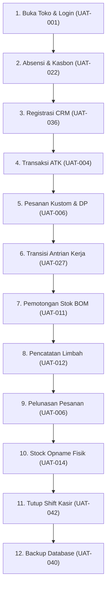
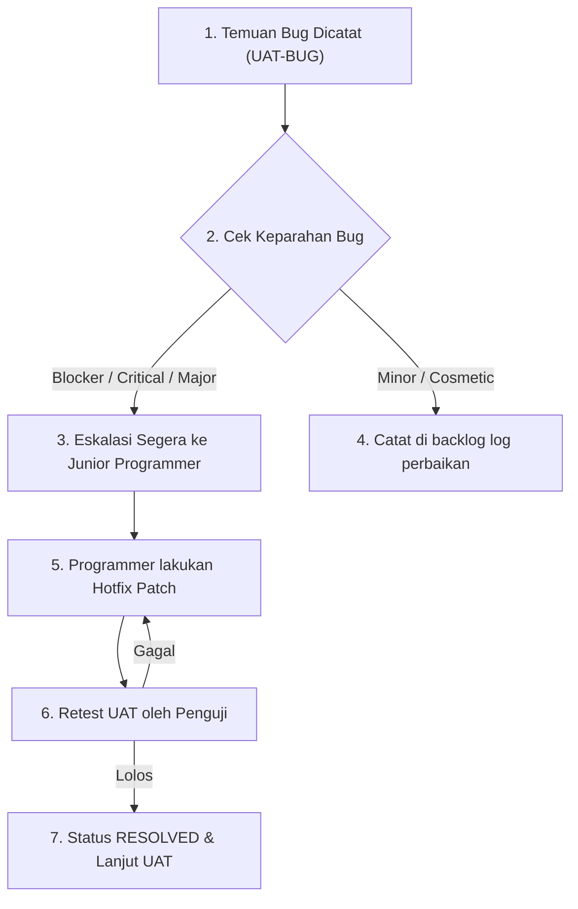

# UAT Script — AbuCom

## Riwayat Perubahan Dokumen

| Versi | Tanggal | Perubahan | Oleh |
|:---:|---|---|---|
| **1.0** | 2026-05-26 | Inisialisasi awal pembuatan dan penyusunan dokumen UAT Script secara komprehensif. Menyerap seluruh data referensi dari Test Plan v1.1 dan Test Cases v1.1. Menyusun 44 skrip UAT individual, 1 skrip integrasi end-to-end hari operasional penuh, kriteria sign-off terukur, defect handling, glosarium, dan matriks ketertelusuran lengkap. | Senior UAT Analyst & Business Acceptance Specialist |

---

## 1. Informasi Dokumen

### 1.1. Tujuan Dokumen
Dokumen **UAT Script** ini disusun sebagai panduan pengujian formal bagi pengguna akhir (*end-user*), khususnya **Pemilik Usaha** dan **Kepala Percetakan**, untuk memverifikasi keselarasan sistem **AbuCom** terhadap kebutuhan operasional bisnis harian toko. 

Tujuan utama dokumen ini adalah:
1. Menyediakan langkah-langkah pengujian berbahasa bisnis yang mudah dipahami oleh pengguna non-teknis.
2. Memastikan seluruh kriteria penerimaan pengguna (*user acceptance criteria*) terpenuhi 100% secara presisi dan terukur sebelum sistem dinyatakan layak untuk diluncurkan ke lingkungan produksi (*go-live*).
3. Menjadi gerbang formal (*go/no-go gate*) pembuktian kualitas aspek fungsional, keamanan data (RBAC & UU PDP), akurasi keuangan (HPP desimal, payroll, depresiasi), serta ketahanan luring (LAN offline).

### 1.2. Cakupan Dokumen
Dokumen ini mencakup:
- **44 Skrip UAT Individual (UAT-001 s.d UAT-044)**: Tersebar pada 9 Sesi pengujian berbasis modul bisnis.
- **1 Skrip Integrasi End-to-End Hari Operasional Penuh (UAT-E2E-001)**: Simulasi transaksi harian lengkap dari buka toko, absensi, transaksi kasir, produksi, opname, serah terima shift, hingga penutupan kas dan backup harian.
- **3 Skrip Pengujian Non-Fungsional (UAT-NF-001 s.d UAT-NF-003)**: Menguji response time laporan, navigasi CLI, dan portabilitas encoding UTF-8 lintas OS.
- **Prosedur Defect Handling**: Klasifikasi temuan bug, template pencatatan, dan eskalasi perbaikan.
- **Kriteria Sign-Off & Keluar UAT**: 7 checklist terukur beserta formulir persetujuan go-live formal.
- **Lampiran Tambahan**: Glosarium istilah bisnis, data fixtures (akun penguji), dan matriks ketertelusuran dua arah.

### 1.3. Posisi Dokumen dalam Siklus SDLC
Dalam siklus pengembangan perangkat lunak (SDLC) AbuCom, dokumen UAT Script berada pada **Fase 05 — Testing** sebagai deliverable ketiga setelah persetujuan dokumen *Test Plan v1.1* dan *Test Cases v1.1*. Dokumen ini menjadi basis eksekusi pengujian penerimaan pengguna sebelum serah terima sistem untuk go-live.

```
+------------------------------------------+
|       FASE 05: TESTING - Test Plan v1.1  | (Selesai)
+------------------------------------------+
                     |
                     v
+------------------------------------------+
|      FASE 05: TESTING - Test Cases v1.1  | (Selesai)
+------------------------------------------+
                     |
                     v
+==========================================+
|     FASE 05: TESTING - UAT Script v1.0   | [DOKUMEN INI]
+==========================================+
                     |
                     v
+------------------------------------------+
|    FASE 05: TESTING - UAT Execution &    | (Fase Berikutnya)
|               Test Report                |
+------------------------------------------+
```

### 1.4. Hubungan dengan Dokumen SDLC Lainnya (Input/Output)
*   **Dokumen Input (Sumber Rujukan):**
    *   [Test Plan v1.1](docs/sdlc/05_testing/01_test_plan.md): Rujukan 44 skenario uji induk, kriteria sign-off UAT, dan error mapping.
    *   [Test Cases v1.1](docs/sdlc/05_testing/02_test_cases.md): Rujukan langkah pengujian terperinci, entry/exit criteria kuantitatif, dan test fixtures akun penguji.
    *   [SRS v1.1](docs/sdlc/02_analysis/02_software_requirements.md): Spesifikasi batasan input, aturan validasi, dan logika bisnis fungsional (SRS-F-001 s.d SRS-F-040).
    *   [Use Case Diagram v1.1](docs/sdlc/02_analysis/03_use_case_diagram.md): Alur naratif utama, alternatif, dan pengecualian (UC-001 s.d UC-041).
    *   [Access Control Matrix v1.1](docs/sdlc/02_analysis/06_access_control_matrix.md): Definisi 8 peran internal dan otorisasi menu.
    *   [BOM & HPP Design v1.1](docs/sdlc/03_design/05_bom_hpp_design.md): Spesifikasi kalkulasi desimal HPP dan locking stok.
    *   [Security Design v1.1](docs/sdlc/03_design/06_security_design.md): Spesifikasi bcrypt, JWT, rate limiting brute-force, dan UU PDP.
    *   [CLI Interaction Flow v1.1](docs/sdlc/03_design/04_cli_interaction_flow.md): Navigasi terminal, rendering ANSI, dan format kode error.
    *   [Workflow Diagram v1.1](docs/sdlc/02_analysis/04_workflow_diagram.md): Alur kerja operasional bisnis harian toko.
*   **Dokumen Output (Penerima Manfaat):**
    *   **UAT Test Report:** Basis pencatatan hasil eksekusi (PASS/FAIL) dan temuan defect aktual.
    *   **Deployment/Release Document:** Bukti formal persetujuan go-live bagi tim rilis.
    *   **Training Manual:** Sebagai acuan skenario operasional nyata untuk pelatihan karyawan baru.

### 1.5. Audiens Target
1.  **Pemilik Usaha:** Selaku validator utama kelayakan bisnis, akurasi keuangan, perlindungan data CRM, dan penandatangan *Sign-off Go-Live*.
2.  **Kepala Percetakan:** Selaku validator operasional produksi, antrian desain, persetujuan opname stok, dan serah terima shift harian.
3.  **Junior Programmer / AI Agent:** Sebagai pedunjuk validasi fungsional murni program dari kacamata bisnis sebelum penyerahan program.

### 1.6. Definisi, Akronim, dan Singkatan
*   **UAT** (*User Acceptance Testing*): Pengujian kelayakan sistem oleh pengguna akhir berdasarkan perspektif bisnis.
*   **BOM** (*Bill of Materials*): Resep/formula racikan bahan baku desimal pembentuk produk kustom.
*   **HPP** (*Harga Pokok Penjualan*): Modal langsung bahan baku yang dikonsumsi untuk memproduksi produk kustom.
*   **RBAC** (*Role-Based Access Control*): Hak akses menu berbasis 8 peran internal toko.
*   **JWT** (*JSON Web Token*): Token sesi otentikasi login dengan masa kedaluwarsa 8 jam (28.800 detik).
*   **UU PDP**: Undang-Undang Perlindungan Data Pribadi No. 27 Tahun 2022 Indonesia.
*   **OPEX** (*Operating Expense*): Pengeluaran rutin operasional toko (seperti gaji, depresiasi, ATK internal, limbah).
*   **CLI** (*Command Line Interface*): Antarmuka baris perintah teks terminal.
*   **PPOB** (*Payment Point Online Bank*): Layanan agen pembayaran tagihan dan pulsa digital.
*   **UMR**: Upah Minimum Regional (ditentukan Rp 3.200.000,0000 sebagai acuan batas upah minimum payroll).

---

## 2. Lingkup dan Tujuan UAT

### 2.1. Tujuan Pengujian Penerimaan Pengguna
UAT bertujuan untuk memverifikasi secara langsung oleh pengguna akhir bahwa sistem AbuCom:
1. Mampu mengotomatisasi seluruh alur bisnis operasional harian toko cetak secara mandiri dan 100% stabil luring tanpa internet.
2. Memproses kalkulasi desimal `Decimal(15,4)` dengan pembulatan `ROUND_HALF_UP` secara presisi mutlak tanpa selisih sepeser pun pada HPP, profit margin, utang, kasbon, depresiasi, dan payroll.
3. Mencegah kebocoran data CRM (terenkripsi Fernet) dan mematuhi hak penghapusan permanen sesuai UU PDP No. 27/2022.
4. Menolak akses tidak sah dengan otentikasi bcrypt cost factor 12, sesi token JWT 8 jam, RBAC 8 peran, audit log JSON, dan pertahanan brute-force.

### 2.2. Cakupan Modul yang Diuji dalam UAT
Pengujian mencakup verifikasi operasional atas 10 modul utama AbuCom CLI:
1.  **Modul M.1 (Transaksi & Kasir):** Kasir penjualan cepat, harga dinamis, DP & Pelunasan, retur & pembatalan, dan struk thermal.
2.  **Modul M.2 (Inventaris, BOM & Opname):** Master persediaan, kalkulasi HPP BOM, limbah cetak, ATK internal, stock opname, re-order alert, price tracking, import CSV, dan backup/restore ZIP AES-256.
3.  **Modul M.3 (Layanan Digital & Jasa):** Saldo virtual PPOB (< Rp 150.000), rekomendasi 6 admin e-wallet, dan jasa service laptop/printer.
4.  **Modul M.4 (SDM, Payroll & Poin):** Absensi harian, Smart Payroll Skenario A & B (batas bawah 50% UMR Rp 1,6 juta), potong kasbon otomatis, dan poin insentif 4-tier.
5.  **Modul M.5 (Antrian & Desain):** Transisi 5 status antrian kerja kustom, pencatatan path file desain, dan link WA Web.
6.  **Modul M.6 (Pinjaman, Aset & Pengeluaran):** Pinjaman bank berbunga & kerabat tanpa bunga, depresiasi garis lurus aset, virtual tabungan aset, laba rugi instan, utang tempo H-3, dan eskalasi pengeluaran > Rp 500.000.
7.  **Modul M.7 (Keamanan & Handover):** Sesi JWT, RBAC 8 peran, audit log JSON, brute force lockout, serah terima shift normal & anomali (selisih > Rp 10.000), dan Setup Wizard.
8.  **Modul M.8 (CRM Pelanggan):** Enkripsi WhatsApp Fernet dan Hard delete UU PDP.
9.  **Modul M.9 (Multi-Cabang):** Isolasi query data transaksional berdasarkan `cabang_id`.
10. **Modul M.10 (Runtime Config):** Parameter dinamis runtime pada tabel `system_configs`.

### 2.3. Fitur yang Tidak Tercakup (Out-of-Scope UAT)
Pengujian penerimaan ini **tidak mencakup**:
*   Pengujian GUI berbasis web browser, mobile, atau portal (sistem murni CLI teks terminal).
*   Koneksi fisik/integrasi API WhatsApp Gateway eksternal secara langsung (notifikasi diuji via perakitan URL siap salin).
*   Koneksi internet langsung untuk transaksi e-wallet/PPOB (pencatatan dilakukan secara administratif pasca-proses eksternal).
*   Proses cetak fisik hardware ke printer thermal (dibatasi hingga pembentukan string teks struk terformat rapi pada file `.txt`).

### 2.4. Kriteria Keberhasilan UAT Keseluruhan
UAT dinyatakan sukses keseluruhan jika:
1. Seluruh 44 skrip UAT individual dan 1 skrip E2E harian dieksekusi dengan status **PASS**.
2. 100% kriteria sign-off terukur di Bab 17.2 terpenuhi secara deterministik.
3. Tidak ditemukan cacat berkategori *Blocker*, *Critical*, atau *Major* pada akhir sesi pengujian.
4. Pemilik Usaha dan Kepala Percetakan menandatangani secara fisik *Formulir Persetujuan Go-Live*.

---

## 3. Organisasi dan Peran UAT

### 3.1. Tim Pelaksana UAT
Pelaksanaan pengujian ini melibatkan peran terstruktur berikut:

| Peran | Nama / Jabatan | Tanggung Jawab Utama |
|---|---|---|
| **Senior UAT Analyst** | `[Ditentukan oleh User]` | Mengoordinasi jalannya UAT, memandu penguji, mencatat defect aktual, dan merancang skrip pengujian. |
| **Pemilik Usaha** | Bpk. Abu / Owner | Menguji modul finansial (payroll, pinjaman, laba/rugi, margin, parameter runtime), mengevaluasi keamanan, dan menandatangani sign-off final. |
| **Kepala Percetakan** | `[Ditentukan oleh User]` | Menguji modul operasional (produksi, antrian, persetujuan opname, serah terima shift, limbah, ATK internal), memvalidasi kelayakan alur kerja. |
| **QA Lead / Junior Dev** | `[Ditentukan oleh User]` | Menyiapkan lingkungan pengujian, melakukan seeding data awal sandbox database, dan memperbaiki temuan bug (*defect fixes*). |

### 3.2. Jadwal Pelaksanaan UAT
Eksekusi UAT direncanakan dibagi menjadi 10 sesi terstruktur sebagai berikut:

| Sesi | Tanggal | Durasi | Penanggung Jawab | Cakupan Skenario UAT |
|---|---|---|---|---|
| **Sesi 1** | `[DITENTUKAN MANUAL]` | 60 Menit | Pemilik Usaha | Keamanan, Login, Hak Akses (UAT-001 s.d UAT-003) |
| **Sesi 2** | `[DITENTUKAN MANUAL]` | 90 Menit | Kepala Percetakan | Alur Transaksi Kasir Harian (UAT-004 s.d UAT-009) |
| **Sesi 3** | `[DITENTUKAN MANUAL]` | 120 Menit | Kepala Percetakan | Inventaris, HPP BOM, & Opname (UAT-010 s.d UAT-018) |
| **Sesi 4** | `[DITENTUKAN MANUAL]` | 60 Menit | Kepala Percetakan | Layanan PPOB, Keuangan, & Jasa (UAT-019 s.d UAT-021) |
| **Sesi 5** | `[DITENTUKAN MANUAL]` | 90 Menit | Pemilik Usaha | SDM, Smart Payroll, & Poin (UAT-022 s.d UAT-026) |
| **Sesi 6** | `[DITENTUKAN MANUAL]` | 60 Menit | Kepala Percetakan | Antrian, Desain, & WhatsApp Link (UAT-027 s.d UAT-029) |
| **Sesi 7** | `[DITENTUKAN MANUAL]` | 90 Menit | Pemilik Usaha | Pinjaman, Aset, & Laba/Rugi (UAT-030 s.d UAT-035) |
| **Sesi 8** | `[DITENTUKAN MANUAL]` | 60 Menit | Pemilik Usaha | CRM, Enkripsi, & Multi-Cabang (UAT-036 s.d UAT-038) |
| **Sesi 9** | `[DITENTUKAN MANUAL]` | 90 Menit | Pemilik & Kepala | Config, Backup/Restore, & Handover (UAT-039 s.d UAT-044) |
| **Sesi 10**| `[DITENTUKAN MANUAL]` | 180 Menit | Pemilik & Kepala | Simulasi End-to-End Hari Operasional (UAT-E2E-001) |

---

## 4. Prasyarat dan Kesiapan UAT (UAT Readiness Checklist)

Sebelum pengujian UAT dimulai, seluruh checklist kesiapan berikut wajib dipenuhi dan ditandai `[x]`:

### 4.1. Checklist Kesiapan Lingkungan
- `[ ]` **Hardware Server:** Mini PC Intel Core i5 RAM 16GB, SSD 512GB, dan 2 unit UPS 600VA terhubung aktif di server lokal luring.
- `[ ]` **Hardware Klien:** PC Desktop Kasir Windows 11 RAM 8GB terhubung melalui switch hub LAN lokal offline ke server (tanpa internet).
- `[ ]` **Runtime & Database:** Python 3.14.2+ terpasang di klien Windows. MySQL 8.4 LTS terpasang di server Debian 12 dengan status servis aktif.
- `[ ]` **Konfigurasi Sandbox:** Database `abucom_test_db` telah ter-setup sukses menggunakan berkas `schema.sql` dan `.env.test` terisi parameter yang valid (pool_size=5, JWT_SECRET=testkey).

### 4.2. Checklist Kesiapan Data Uji
- `[ ]` **Data Master Seed:** Data barang awal, persediaan bahan baku, dan konfigurasi default telah ter-seed menggunakan skrip `seed.sql`.
- `[ ]` **Akun Penguji:** 8 Akun uji terdaftar di sistem dengan password default `'SandiStaf2026!'` (ter-bcrypt factor 12) sesuai daftar di Lampiran 18.2.

### 4.3. Checklist Kesiapan Dokumen
- `[ ]` **Dokumen Acuan:** *Test Plan v1.1* dan *Test Cases v1.1* telah disetujui formal oleh Pemilik Usaha dan berstatus *Reviewed*.
- `[ ]` **Dokumen Eksekusi:** Berkas cetak fisik / form penilaian UAT Script ini siap di laci kas kasir.

### 4.4. Kriteria Masuk UAT (Entry Criteria)
1. Seluruh checklist kesiapan lingkungan, data uji, dan dokumen di atas telah ditandai `[x]`.
2. Hasil pengujian Unit (*Unit Testing*) logika fungsional murni program mencapai kelulusan $\ge 90\%$ tanpa cacat tersisa.
3. Junior Programmer secara tertulis menyerahkan build program AbuCom CLI versi stabil 1.1 ke lingkungan pengujian lokal.

---

## 5. Skenario UAT — Sesi 1: Keamanan, Login, dan Hak Akses

Aktor Utama: **Pemilik Usaha** & **Kepala Percetakan**  
Lingkungan: **PC Kasir Windows 11, Terminal CLI, DB `abucom_test_db`**

### 5.1. UAT-001: Login Kasir dan Verifikasi Sesi JWT
| Atribut UAT | Detail |
|---|---|
| **ID Skrip UAT** | UAT-001 |
| **Judul** | Login Kasir dan Verifikasi Sesi JWT |
| **Skenario Asal** | M7-TC-001 |
| **Test Case Terkait** | TC-M7-001-01 (Happy Path), TC-M7-001-02 (Unhappy Session Expired) |
| **Referensi SRS / UC** | SRS-F-030 / UC-041 |
| **Modul / Fitur** | M.7 — Keamanan, Audit & Handover |
| **Aktor Penguji** | Kepala Percetakan / Pemilik Usaha |
| **Lingkungan** | PC Kasir Windows 11, Terminal CLI AbuCom, DB `abucom_test_db` |
| **Prasyarat** | Driver database MySQL aktif, data akun `kasir01` dengan password `'SandiStaf2026!'` ter-seed di DB. |
| **Data Uji** | `username = 'kasir01'`, `password = 'SandiStaf2026!'`, `session_limit = 28800` (8 jam). |
| **Langkah Pengujian** | 1. Jalankan aplikasi AbuCom CLI di terminal.<br>2. Pada prompt login, masukkan `username` = `'kasir01'`.<br>3. Masukkan `password` = `'SandiStaf2026!'`. Tekan Enter.<br>4. Lakukan verifikasi navigasi masuk ke menu Dashboard Kasir.<br>5. [Simulasi Sesi Expired] QA akan mengubah timestamp pembuatan sesi JWT di database/memori agar melampaui batas 8 jam.<br>6. Coba pilih menu Transaksi Kasir. |
| **Hasil Diharapkan** | 1. Login berhasil masuk ke Dashboard Kasir tanpa crash.<br>2. Password ter-hash bcrypt cost factor 12 di DB, token JWT HS256 sukses digenerasi di memori.<br>3. Saat sesi disimulasikan expired (> 8 jam), akses menu diblokir otomatis, melempar error `ERR-SESSION-002: Sesi login tidak sah/rusak. Harap login kembali!`, menghapus token di memori, dan mengarahkan paksa kembali ke prompt login kosong. |
| **Hasil Aktual** | *[Diisi saat eksekusi UAT]* |
| **Status** | *[Diisi saat eksekusi: PASS / FAIL]* |
| **Catatan Temuan** | *[Diisi jika ada temuan/bug]* |
| **Tanda Tangan Penguji** | ____________________ |

### 5.2. UAT-002: Pengujian Pembatasan Hak Akses RBAC
| Atribut UAT | Detail |
|---|---|
| **ID Skrip UAT** | UAT-002 |
| **Judul** | Pengujian Pembatasan Hak Akses RBAC |
| **Skenario Asal** | M7-TC-002 |
| **Test Case Terkait** | TC-M7-002-01 (Happy Access), TC-M7-002-02 (Unhappy Ilegal Access desainer), TC-M7-002-03 (Unhappy Ilegal Access pramuniaga) |
| **Referensi SRS / UC** | SRS-F-030 / UC-032 |
| **Modul / Fitur** | M.7 — Keamanan, Audit & Handover |
| **Aktor Penguji** | Kepala Percetakan / Pemilik Usaha |
| **Lingkungan** | PC Kasir Windows 11, Terminal CLI AbuCom, DB `abucom_test_db` |
| **Prasyarat** | Akun `desain01` (peran `desainer`) and `pramu01` (peran `pramuniaga`) terdaftar di DB. |
| **Data Uji** | Peran `desainer` dan `pramuniaga`, menu target: `M4-002` (Smart Payroll) dan `M6-001` (Pinjaman Bank). |
| **Langkah Pengujian** | 1. Buka aplikasi, lakukan login dengan username `'desain01'` (desainer).<br>2. Coba akses menu Administrasi Keuangan > Smart Payroll (`M4-002`) dengan mengetikkan kodenya di menu terminal.<br>3. Logout. Login kembali menggunakan username `'pramu01'` (pramuniaga).<br>4. Coba pilih menu Kelola Pinjaman Bank (`M6-001`). |
| **Hasil Diharapkan** | 1. Sistem menolak mutlak akses ilegal desainer ke menu payroll, merender visual error: `⛔ ERR-AUTH-003: Akses Ditolak: Hak Akses Pemilik Dibutuhkan!`. <br>2. Sistem menolak akses pramuniaga ke menu pinjaman bank, merender error `ERR-AUTH-003` yang sama.<br>3. Setiap upaya ilegal diblokir aman dan dicatat otomatis ke tabel `audit_logs` database (tipe `'ACCESS_DENIED'`). |
| **Hasil Aktual** | *[Diisi saat eksekusi UAT]* |
| **Status** | *[Diisi saat eksekusi: PASS / FAIL]* |
| **Catatan Temuan** | *[Diisi jika ada temuan/bug]* |
| **Tanda Tangan Penguji** | ____________________ |

### 5.3. UAT-003: Pengujian Lockout Brute-Force (5 kali gagal)
| Atribut UAT | Detail |
|---|---|
| **ID Skrip UAT** | UAT-003 |
| **Judul** | Pengujian Lockout Brute-Force (5 kali gagal) |
| **Skenario Asal** | M7-TC-006 (Fraud detection lockout) |
| **Test Case Terkait** | TC-SEC-002-01 (Rate Limiting Brute Force) |
| **Referensi SRS / UC** | SRS-F-030 / UC-036 |
| **Modul / Fitur** | M.7 — Keamanan, Audit & Handover |
| **Aktor Penguji** | Pemilik Usaha / Kepala Percetakan |
| **Lingkungan** | PC Kasir Windows 11, Terminal CLI AbuCom, DB `abucom_test_db` |
| **Prasyarat** | Akun `kasir01` terdaftar dalam keadaan aktif (tidak locked). |
| **Data Uji** | `username = 'kasir01'`, `password_salah = 'SandiSalah123'`, `failed_limit = 5`, `lock_duration = 600` (10 menit). |
| **Langkah Pengujian** | 1. Pada prompt login, ketik username `'kasir01'`.<br>2. Masukkan kata sandi salah `'SandiSalah123'` sebanyak 5 kali berturut-turut.<br>3. Pada percobaan ke-5, periksa pesan yang ditampilkan.<br>4. Pada percobaan ke-6, coba masukkan kata sandi yang valid/benar `'SandiStaf2026!'`.<br>5. [Simulasi Waktu Berlalu] QA mempercepat waktu sistem database sisa 10 menit ke depan, lalu penguji mencoba login kembali dengan sandi benar `'SandiStaf2026!'`. |
| **Hasil Diharapkan** | 1. Pada kegagalan ke-5, sistem memancarkan alarm visual dan mengunci akun `kasir01`. Database memperbarui kolom `locked_until` dengan timestamp 10 menit ke depan.<br>2. Pada percobaan ke-6 dengan sandi benar, login ditolak mutlak dengan pesan merah: `⛔ ERR-AUTH-002: Sandi Gagal: Akun ditangguhkan selama 10 menit akibat brute-force!`.<br>3. Setelah 10 menit berlalu, login dengan sandi benar berhasil masuk dashboard kasir dan me-reset `failed_login_attempts` ke 0. |
| **Hasil Aktual** | *[Diisi saat eksekusi UAT]* |
| **Status** | *[Diisi saat eksekusi: PASS / FAIL]* |
| **Catatan Temuan** | *[Diisi jika ada temuan/bug]* |
| **Tanda Tangan Penguji** | ____________________ |

---

## 6. Skenario UAT — Sesi 2: Alur Transaksi Kasir Harian

Aktor Utama: **Kepala Percetakan** & **Pemilik Usaha**  
Lingkungan: **PC Kasir Windows 11, Terminal CLI, DB `abucom_test_db`**

### 6.1. UAT-004: Penjualan Ritel ATK Tunai Multi-Item
| Atribut UAT | Detail |
|---|---|
| **ID Skrip UAT** | UAT-004 |
| **Judul** | Penjualan Ritel ATK Tunai Multi-Item |
| **Skenario Asal** | M1-TC-001 |
| **Test Case Terkait** | TC-M1-001-01 (Happy Path Tunai), TC-M1-001-02 (Unhappy DB Offline Rollback) |
| **Referensi SRS / UC** | SRS-F-001 / UC-001 |
| **Modul / Fitur** | M.1 — Manajemen Transaksi & Kasir |
| **Aktor Penguji** | Kepala Percetakan / Pemilik Usaha |
| **Lingkungan** | PC Kasir Windows 11, Terminal CLI AbuCom, DB `abucom_test_db` |
| **Prasyarat** | Login kasir aktif (`kasir01`). Saldo laci kas kasir awal Rp 500.000,0000. Barang retail `barang_id = 1` (kertas HVS Rim, stok awal 10) seharga Rp 50.000,0000 terdaftar. |
| **Data Uji** | `barang_id = 1`, `kuantitas = Decimal('2.0000')`, `metode_pembayaran = 'Kas'`, `nominal_bayar = Decimal('100000.0000')`. |
| **Langkah Pengujian** | 1. Masuk menu Kasir > Transaksi Penjualan Ritel.<br>2. Masukkan ID barang = `1`. <br>3. Input kuantitas = `2.0000`. <br>4. Pilih metode pembayaran `'Kas'`. <br>5. Input nominal bayar = `100000.0000`. <br>6. Klik Simpan & Cetak. |
| **Hasil Diharapkan** | 1. Transaksi berstatus `'LUNAS'` tersimpan di database.<br>2. Stok barang `barang_id = 1` berkurang tepat 2 Rim menjadi 8 Rim.<br>3. Saldo laci kas bertambah Rp 100.000,0000 menjadi Rp 600.000,0000.<br>4. Teks struk thermal belanja format rapi terbentuk sukses. |
| **Hasil Aktual** | *[Diisi saat eksekusi UAT]* |
| **Status** | *[Diisi saat eksekusi: PASS / FAIL]* |
| **Catatan Temuan** | *[Diisi jika ada temuan/bug]* |
| **Tanda Tangan Penguji** | ____________________ |

### 6.2. UAT-005: Validasi Harga Dinamis (Retail/Grosir/Mitra)
| Atribut UAT | Detail |
|---|---|
| **ID Skrip UAT** | UAT-005 |
| **Judul** | Validasi Harga Dinamis (Retail/Grosir/Mitra) |
| **Skenario Asal** | M1-TC-002 |
| **Test Case Terkait** | TC-M1-002-01 (Grosir Threshold 10 qty), TC-M1-002-02 (Tipe Pelanggan Mitra), TC-M1-002-03 (Unhappy kuantitas negatif) |
| **Referensi SRS / UC** | SRS-F-002 / UC-002 |
| **Modul / Fitur** | M.1 — Manajemen Transaksi & Kasir |
| **Aktor Penguji** | Kepala Percetakan / Pemilik Usaha |
| **Lingkungan** | PC Kasir Windows 11, Terminal CLI AbuCom, DB `abucom_test_db` |
| **Prasyarat** | Barang `barang_id = 2` (Pena) terdaftar dengan kebijakan harga: Retail (< 10) = Rp 1.000,0000/pcs; Grosir ($\ge$ 10) = Rp 800,0000/pcs; Mitra = Rp 750,0000/pcs. |
| **Data Uji** | Uji 1: `qty = 10.0000`, `tipe_pelanggan = 'Umum'`. Uji 2: `qty = 2.0000`, `tipe_pelanggan = 'Mitra'`. Uji 3: `qty = -5.0000`. |
| **Langkah Pengujian** | 1. Masuk menu Kasir. Input transaksi `barang_id = 2` dengan kuantitas = `10.0000` untuk Pelanggan Umum.<br>2. Input transaksi `barang_id = 2` dengan kuantitas = `2.0000` untuk pelanggan tipe Mitra.<br>3. Input transaksi `barang_id = 2` dengan kuantitas negatif `-5.0000`. |
| **Hasil Diharapkan** | 1. Pada Uji 1, sistem otomatis menerapkan harga satuan Grosir = `Decimal('800.0000')` (Total Rp 8.000,0000).<br>2. Pada Uji 2, sistem menerapkan harga satuan Mitra = `Decimal('750.0000')` (Total Rp 1.500,0000).<br>3. Pada Uji 3, input diblokir aman oleh filter validasi, memunculkan pesan merah: `⛔ ERR-VAL-007: Input kuantitas bahan baku tidak valid (harus angka desimal positif > 0)!`. |
| **Hasil Aktual** | *[Diisi saat eksekusi UAT]* |
| **Status** | *[Diisi saat eksekusi: PASS / FAIL]* |
| **Catatan Temuan** | *[Diisi jika ada temuan/bug]* |
| **Tanda Tangan Penguji** | ____________________ |

### 6.3. UAT-006: Pembayaran DP dan Pelunasan Pesanan Kustom
| Atribut UAT | Detail |
|---|---|
| **ID Skrip UAT** | UAT-006 |
| **Judul** | Pembayaran DP dan Pelunasan Pesanan Kustom |
| **Skenario Asal** | M1-TC-003 |
| **Test Case Terkait** | TC-M1-003-01 (Happy Pelunasan DP), TC-M1-003-02 (Unhappy Pelunasan kurang) |
| **Referensi SRS / UC** | SRS-F-003 / UC-003 |
| **Modul / Fitur** | M.1 — Manajemen Transaksi & Kasir |
| **Aktor Penguji** | Kepala Percetakan / Pemilik Usaha |
| **Lingkungan** | PC Kasir Windows 11, Terminal CLI AbuCom, DB `abucom_test_db` |
| **Prasyarat** | Terdapat pesanan kustom `transaksi_id = 10` berstatus `'BELUM LUNAS'` dengan total tagihan Rp 150.000,0000 dan telah dibayar DP Rp 50.000,0000 (sisa tagihan Rp 100.000,0000). |
| **Data Uji** | `transaksi_id = 10`, `nominal_pelunasan_valid = Decimal('100000.0000')`, `nominal_kurang = Decimal('99000.0000')`. |
| **Langkah Pengujian** | 1. Buka menu Kasir > Pelunasan Pesanan.<br>2. Masukkan ID Transaksi = `10`. Verifikasi rincian data tagihan muncul.<br>3. Input nominal pelunasan kurang = `99000.0000`. Coba simpan.<br>4. Masukkan kembali nominal pelunasan valid = `100000.0000`. Simpan. |
| **Hasil Diharapkan** | 1. Saat nominal kurang, sistem menolak transaksi, menampilkan error: `⛔ ERR-VAL-003: Nominal pelunasan tidak mencukupi sisa tagihan!`.<br>2. Saat nominal valid diinput, status transaksi di database berubah menjadi `'LUNAS'`. Tanggal pelunasan terisi timestamp. Saldo kas kasir bertambah Rp 100.000,0000, dan cetak struk thermal pelunasan berhasil terbentuk. |
| **Hasil Aktual** | *[Diisi saat eksekusi UAT]* |
| **Status** | *[Diisi saat eksekusi: PASS / FAIL]* |
| **Catatan Temuan** | *[Diisi jika ada temuan/bug]* |
| **Tanda Tangan Penguji** | ____________________ |

### 6.4. UAT-007: Pembatalan DP dengan Eskalasi Sandi Pemilik
| Atribut UAT | Detail |
|---|---|
| **ID Skrip UAT** | UAT-007 |
| **Judul** | Pembatalan DP dengan Eskalasi Sandi Pemilik |
| **Skenario Asal** | M1-TC-004 |
| **Test Case Terkait** | TC-M1-004-01 (Happy Batal DP), TC-M1-004-02 (Unhappy Salah Sandi) |
| **Referensi SRS / UC** | SRS-F-004 / UC-004 |
| **Modul / Fitur** | M.1 — Manajemen Transaksi & Kasir |
| **Aktor Penguji** | Kepala Percetakan / Pemilik Usaha |
| **Lingkungan** | PC Kasir Windows 11, Terminal CLI AbuCom, DB `abucom_test_db` |
| **Prasyarat** | Sesi login kasir aktif (`kasir01`). Transaksi kustom `transaksi_id = 11` berstatus `'BELUM LUNAS'` dengan nilai DP Rp 50.000,0000 terdaftar. Saldo laci kas saat ini Rp 200.000,0000. |
| **Data Uji** | `transaksi_id = 11`, `sandi_pemilik_salah = 'SandiSalah123'`, `sandi_pemilik_benar = 'SandiStaf2026!'`. |
| **Langkah Pengujian** | 1. Buka menu Kasir > Pembatalan Transaksi DP.<br>2. Masukkan ID Transaksi = `11`. <br>3. Ketika sistem meminta eskalasi sandi supervisor, ketik kata sandi salah `'SandiSalah123'`. Coba konfirmasi.<br>4. Masukkan sandi pemilik benar `'SandiStaf2026!'`. Konfirmasi pembatalan. |
| **Hasil Diharapkan** | 1. Saat sandi salah diinput, pembatalan ditolak, status tetap `'BELUM LUNAS'`, saldo kas tetap, dan melempar error: `⛔ ERR-AUTH-029: Verifikasi sandi Pemilik gagal. Pengeluaran besar dibatalkan!`.<br>2. Saat sandi benar dimasukkan, status di DB berubah menjadi `'DIBATALKAN'`. Saldo laci kas berkurang Rp 50.000,0000 (menjadi Rp 150.000,0000) untuk dikembalikan ke pelanggan. Log audit mencatat audit trail `'DP_VOID'` atas otorisasi kasir dan pemilik. |
| **Hasil Aktual** | *[Diisi saat eksekusi UAT]* |
| **Status** | *[Diisi saat eksekusi: PASS / FAIL]* |
| **Catatan Temuan** | *[Diisi jika ada temuan/bug]* |
| **Tanda Tangan Penguji** | ____________________ |

### 6.5. UAT-008: Retur Barang ATK Rusak
| Atribut UAT | Detail |
|---|---|
| **ID Skrip UAT** | UAT-008 |
| **Judul** | Retur Barang ATK Rusak |
| **Skenario Asal** | M1-TC-005 |
| **Test Case Terkait** | TC-M1-005-01 (Happy Retur), TC-M1-005-02 (Unhappy Laci kasir kurang) |
| **Referensi SRS / UC** | SRS-F-004 / UC-004 |
| **Modul / Fitur** | M.1 — Manajemen Transaksi & Kasir |
| **Aktor Penguji** | Kepala Percetakan / Pemilik Usaha |
| **Lingkungan** | PC Kasir Windows 11, Terminal CLI AbuCom, DB `abucom_test_db` |
| **Prasyarat** | Transaksi ritel `transaksi_id = 12` bernilai Rp 30.000,0000 (1 Rim HVS) berstatus `'LUNAS'`. Stok HVS saat ini = 10 Rim, saldo kas kasir = Rp 100.000,0000. |
| **Data Uji** | `transaksi_id = 12`, `barang_id = 1`, `kuantitas_retur = Decimal('1.0000')`, `sandi_pemilik = 'SandiStaf2026!'`. |
| **Langkah Pengujian** | 1. Masuk menu Kasir > Retur Barang ATK.<br>2. Input ID Transaksi = `12`. Input kuantitas retur = `1.0000`. <br>3. Input kata sandi pemilik = `'SandiStaf2026!'`. Simpan.<br>4. Periksa stok HVS Rim di database.<br>5. Periksa nominal saldo laci kas kasir. |
| **Hasil Diharapkan** | 1. Entri retur tercatat sukses di database tabel `retur_transaksi`.<br>2. Stok HVS di database bertambah kembali 1 Rim menjadi 11 Rim.<br>3. Saldo laci kas kasir terpotong otomatis Rp 30.000,0000 menjadi Rp 70.000,0000. Audit log mencatatkan transaksi tipe `'RETUR_ATK'`. |
| **Hasil Aktual** | *[Diisi saat eksekusi UAT]* |
| **Status** | *[Diisi saat eksekusi: PASS / FAIL]* |
| **Catatan Temuan** | *[Diisi jika ada temuan/bug]* |
| **Tanda Tangan Penguji** | ____________________ |

### 6.6. UAT-009: Ekspor Struk Thermal (.txt)
| Atribut UAT | Detail |
|---|---|
| **ID Skrip UAT** | UAT-009 |
| **Judul** | Ekspor Struk Thermal (.txt) |
| **Skenario Asal** | M1-TC-007 |
| **Test Case Terkait** | TC-CLI-003-01 (Happy Render Struk) |
| **Referensi SRS / UC** | SRS-F-006 / UC-006 |
| **Modul / Fitur** | M.1 — Manajemen Transaksi & Kasir |
| **Aktor Penguji** | Kepala Percetakan / Pemilik Usaha |
| **Lingkungan** | PC Kasir Windows 11, Terminal CLI AbuCom, DB `abucom_test_db` |
| **Prasyarat** | Sesi login kasir aktif, terdapat transaksi terdaftar. Lebar kertas printer virtual diset 32 karakter (58mm). |
| **Data Uji** | `nama_barang = 'Kertas Kado Sinar Dunia Karakter Kartun'`, `harga = Decimal('5000.0000')`, `qty = Decimal('1.0000')`. |
| **Langkah Pengujian** | 1. Eksekusi pengunduhan / pencetakan struk atas transaksi ritel di menu kasir.<br>2. Buka berkas nota teks polos format `.txt` yang dihasilkan di folder `/exports/receipts/`.<br>3. Verifikasi jumlah kolom karakter per baris dan struktur tulisan. |
| **Hasil Diharapkan** | 1. File struk format thermal `.txt` berhasil terbentuk rapi.<br>2. Nama barang yang panjang terbungkus rapi (*text-wrapped*) ke baris berikutnya, dan nominal angka rupiah di kolom kanan tetap sejajar lurus rata kanan.<br>3. Seluruh garis pembatas dan pemisah memiliki panjang persis 32 karakter (tidak terpotong kasar atau pecah). |
| **Hasil Aktual** | *[Diisi saat eksekusi UAT]* |
| **Status** | *[Diisi saat eksekusi: PASS / FAIL]* |
| **Catatan Temuan** | *[Diisi jika ada temuan/bug]* |
| **Tanda Tangan Penguji** | ____________________ |

---

## 7. Skenario UAT — Sesi 3: Operasional Inventaris dan BOM

Aktor Utama: **Kepala Percetakan** & **Pemilik Usaha**  
Lingkungan: **PC Kasir Windows 11, Terminal CLI, DB `abucom_test_db`**

### 7.1. UAT-010: Pendaftaran Master Barang dan Bahan Baku Baru
| Atribut UAT | Detail |
|---|---|
| **ID Skrip UAT** | UAT-010 |
| **Judul** | Pendaftaran Master Barang dan Bahan Baku Baru |
| **Skenario Asal** | M2-TC-001 |
| **Test Case Terkait** | TC-M2-001-01 (Happy Tambah Barang), TC-M2-001-02 (Unhappy Duplikat Kode) |
| **Referensi SRS / UC** | SRS-F-009 / UC-009 |
| **Modul / Fitur** | M.2 — Inventaris, BOM & Opname |
| **Aktor Penguji** | Kepala Percetakan / Pemilik Usaha |
| **Lingkungan** | PC Kasir Windows 11, Terminal CLI AbuCom, DB `abucom_test_db` |
| **Prasyarat** | Sesi login gudang aktif (`gudang01`). Kode barang `'BRG-001'` sudah terdaftar di DB. |
| **Data Uji** | Uji 1: `kode = 'BRG-009'`, `nama = 'Kertas A4 80g'`, `satuan = 'Rim'`, `stok = Decimal('0.0000')`. Uji 2: `kode_duplikat = 'BRG-001'`, `nama = 'Tinta'`. |
| **Langkah Pengujian** | 1. Masuk menu Inventaris > Tambah Master Barang.<br>2. Masukkan rincian data uji 1. Simpan.<br>3. Coba masukkan kembali data uji 2 dengan kode duplikat `'BRG-001'`. Simpan. |
| **Hasil Diharapkan** | 1. Barang baru `'BRG-009'` tersimpan sukses di DB tabel `barang` dengan unit konversi default `1.0000`.<br>2. Pada pendaftaran kode duplikat `'BRG-001'`, sistem menangkap `IntegrityError` database secara aman, melakukan rollback, dan menyajikan visual error: `⛔ ERR-DB-002: Pelanggaran integritas basis data. Transaksi dibatalkan!`. |
| **Hasil Aktual** | *[Diisi saat eksekusi UAT]* |
| **Status** | *[Diisi saat eksekusi: PASS / FAIL]* |
| **Catatan Temuan** | *[Diisi jika ada temuan/bug]* |
| **Tanda Tangan Penguji** | ____________________ |

### 7.2. UAT-011: Perhitungan HPP Otomatis BOM (Stempel Flash)
| Atribut UAT | Detail |
|---|---|
| **ID Skrip UAT** | UAT-011 |
| **Judul** | Perhitungan HPP Otomatis BOM (Stempel Flash) |
| **Skenario Asal** | M2-TC-002 |
| **Test Case Terkait** | TC-M2-002-01 (Happy Perhitungan HPP BOM), TC-DEC-001-01 (HPP Desimal Karet Flash) |
| **Referensi SRS / UC** | SRS-F-007 / UC-007 |
| **Modul / Fitur** | M.2 — Inventaris, BOM & Opname |
| **Aktor Penguji** | Kepala Percetakan |
| **Lingkungan** | PC Kasir Windows 11, Terminal CLI AbuCom, DB `abucom_test_db` |
| **Prasyarat** | Sesi login supervisor / kepala percetakan aktif. Master persediaan bahan baku terdaftar di DB. |
| **Data Uji** | Bahan 1: Karet Flash, pemakaian = `Decimal('0.0025')` m^2, harga beli = Rp 100.000,0000 / m^2.<br>Bahan 2: Gagang Stempel, pemakaian = `Decimal('1.0000')` Pcs, harga beli = Rp 4.500,0000 / Pcs.<br>Formula: $HPP = \sum (\text{Pemakaian} \times \text{Harga Beli})$. |
| **Langkah Pengujian** | 1. Buka menu Inventaris > Kelola BOM Produk Kustom.<br>2. Pilih produk Stempel Flash Bulat.<br>3. Input komposisi racikan bahan sesuai data uji di atas.<br>4. Simpan dan periksa nilai total HPP produk yang terhitung di layar. |
| **Hasil Diharapkan** | 1. Komposisi BOM tersimpan di tabel `bom_details` database.<br>2. Sistem melakukan kalkulasi aritmatika desimal secara presisi mutlak tanpa error float: $0.0025 \times 100.000,0000 = \text{Rp } 250,0000$; $\text{Total HPP} = 250,0000 + 4.500,0000 = \text{Rp } 4.750,0000$.<br>3. Nilai total HPP tersimpan tepat `Decimal('4750.0000')` di database. |
| **Hasil Aktual** | *[Diisi saat eksekusi UAT]* |
| **Status** | *[Diisi saat eksekusi: PASS / FAIL]* |
| **Catatan Temuan** | *[Diisi jika ada temuan/bug]* |
| **Tanda Tangan Penguji** | ____________________ |

### 7.3. UAT-012: Pencatatan Limbah Produksi
| Atribut UAT | Detail |
|---|---|
| **ID Skrip UAT** | UAT-012 |
| **Judul** | Pencatatan Limbah Produksi |
| **Skenario Asal** | M2-TC-003 |
| **Test Case Terkait** | TC-M2-003-01 (Happy Catat Limbah Produksi) |
| **Referensi SRS / UC** | SRS-F-008 / UC-008 |
| **Modul / Fitur** | M.2 — Inventaris, BOM & Opname |
| **Aktor Penguji** | Kepala Percetakan |
| **Lingkungan** | PC Kasir Windows 11, Terminal CLI AbuCom, DB `abucom_test_db` |
| **Prasyarat** | Sesi login produksi aktif (`prod01`). Stok bahan baku `BAHAN-001` (Karet Flash) di DB = `1.0000` m^2. Harga beli karet flash = Rp 100.000,0000 / m^2. |
| **Data Uji** | `bahan_baku_id = 1`, `kuantitas_limbah = Decimal('0.0005')`, `alasan = 'Salah potong'`. |
| **Langkah Pengujian** | 1. Masuk menu Produksi > Catat Limbah Produksi.<br>2. Masukkan ID bahan = `1`. Input kuantitas limbah = `0.0005`. <br>3. Input alasan = `'Salah potong'`. <br>4. Simpan catatan.<br>5. Periksa sisa stok bahan baku dan tabel pengeluaran OPEX di DB. |
| **Hasil Diharapkan** | 1. Stok `BAHAN-001` terpotong `0.0005` m^2 menjadi tepat `0.9995` m^2 di database.<br>2. Nominal kerugian limbah sebesar Rp 50,0000 (`0.0005` x Rp 100.000,0000) tersimpan di tabel `limbah_produksi` dan didebit otomatis sebagai pengeluaran OPEX persediaan rusak. |
| **Hasil Aktual** | *[Diisi saat eksekusi UAT]* |
| **Status** | *[Diisi saat eksekusi: PASS / FAIL]* |
| **Catatan Temuan** | *[Diisi jika ada temuan/bug]* |
| **Tanda Tangan Penguji** | ____________________ |

### 7.4. UAT-013: Sinkronisasi ATK Internal
| Atribut UAT | Detail |
|---|---|
| **ID Skrip UAT** | UAT-013 |
| **Judul** | Sinkronisasi ATK Internal |
| **Skenario Asal** | M2-TC-004 |
| **Test Case Terkait** | TC-M2-004-01 (Happy Ambil ATK Internal) |
| **Referensi SRS / UC** | SRS-F-010 / UC-010 |
| **Modul / Fitur** | M.2 — Inventaris, BOM & Opname |
| **Aktor Penguji** | Kepala Percetakan |
| **Lingkungan** | PC Kasir Windows 11, Terminal CLI AbuCom, DB `abucom_test_db` |
| **Prasyarat** | Sesi login gudang aktif (`gudang01`). Barang retail `barang_id = 2` (Pena) memiliki stok = `50.0000` Pcs di DB. Harga beli HPP Pena = Rp 2.000,0000 / Pcs. |
| **Data Uji** | `barang_id = 2`, `kuantitas_ambil = Decimal('2.0000')`, `keperluan = 'Untuk desainer toko'`. |
| **Langkah Pengujian** | 1. Masuk menu Inventaris > Ambil ATK Internal.<br>2. Masukkan ID barang = `2`. Input kuantitas = `2.0000`. <br>3. Input keperluan = `'Untuk desainer toko'`. <br>4. Simpan transaksi.<br>5. Periksa sisa stok barang dan tabel pengeluaran OPEX toko. |
| **Hasil Diharapkan** | 1. Stok Pena di database terpotong 2 Pcs menjadi `48.0000` Pcs.<br>2. Nominal kerugian HPP sebesar Rp 4.000,0000 (`2.0000` x Rp 2.000,0000) dibukukan otomatis sebagai transaksi pengeluaran administrasi toko berlabel kategori `'OPEX_OPERASIONAL'`. |
| **Hasil Aktual** | *[Diisi saat eksekusi UAT]* |
| **Status** | *[Diisi saat eksekusi: PASS / FAIL]* |
| **Catatan Temuan** | *[Diisi jika ada temuan/bug]* |
| **Tanda Tangan Penguji** | ____________________ |

### 7.5. UAT-014: Rekonsiliasi Stock Opname (Draft → Approve)
| Atribut UAT | Detail |
|---|---|
| **ID Skrip UAT** | UAT-014 |
| **Judul** | Rekonsiliasi Stock Opname (Draft → Approve) |
| **Skenario Asal** | M2-TC-005 |
| **Test Case Terkait** | TC-M2-005-01 (Happy Opname Alur Sukses), TC-M2-005-02 (Unhappy Approve Ilegal desainer) |
| **Referensi SRS / UC** | SRS-F-011 / UC-011 |
| **Modul / Fitur** | M.2 — Inventaris, BOM & Opname |
| **Aktor Penguji** | Kepala Percetakan |
| **Lingkungan** | PC Kasir Windows 11, Terminal CLI AbuCom, DB `abucom_test_db` |
| **Prasyarat** | Staf gudang (`gudang01`) dan supervisor (`kepala`) terdaftar di DB. Barang `barang_id = 3` (HVS) tercatat memiliki stok sistem 10 Rim. |
| **Data Uji** | `barang_id = 3`, `stok_fisik = Decimal('8.0000')` (selisih kurang 2 Rim). |
| **Langkah Pengujian** | 1. Login sebagai `'gudang01'`. Pilih menu Stock Opname, input `barang_id = 3` and `stok_fisik = 8.0000`. Simpan draft opname `opname_id = 50`. Verifikasi stok sistem belum berubah (tetap 10 Rim).<br>2. Logout. Login sebagai `'kepala'` (Kepala Percetakan).<br>3. Buka menu Approval Stock Opname, pilih `opname_id = 50` dan setujui (Approve). |
| **Hasil Diharapkan** | 1. Selama berstatus DRAFT, stok sistem aman tidak berubah (tetap 10 Rim).<br>2. Setelah disetujui Kepala Percetakan, status draf di DB berubah dari `'DRAFT'` menjadi `'APPROVED'`. Stok barang `barang_id = 3` ter-update otomatis menjadi 8.0000 Rim.<br>3. Selisih minus 2 Rim dibukukan otomatis sebagai kerugian OPEX (debit akun penyusutan persediaan) di jurnal kas. |
| **Hasil Aktual** | *[Diisi saat eksekusi UAT]* |
| **Status** | *[Diisi saat eksekusi: PASS / FAIL]* |
| **Catatan Temuan** | *[Diisi jika ada temuan/bug]* |
| **Tanda Tangan Penguji** | ____________________ |

### 7.6. UAT-015: Analisis Prediksi Re-Order Stok
| Atribut UAT | Detail |
|---|---|
| **ID Skrip UAT** | UAT-015 |
| **Judul** | Analisis Prediksi Re-Order Stok |
| **Skenario Asal** | M2-TC-006 |
| **Test Case Terkait** | TC-M2-006-01 (Happy Alert Re-Order) |
| **Referensi SRS / UC** | SRS-F-012 / UC-012 |
| **Modul / Fitur** | M.2 — Inventaris, BOM & Opname |
| **Aktor Penguji** | Kepala Percetakan |
| **Lingkungan** | PC Kasir Windows 11, Terminal CLI AbuCom, DB `abucom_test_db` |
| **Prasyarat** | Sesi login gudang aktif (`gudang01`). Bahan baku `BAHAN-001` (Karet Flash) memiliki stok = `0.0100` m^2 di DB. Rata-rata konsumsi harian tercatat = `0.0020` m^2. |
| **Data Uji** | `periode_analisis_hari = 30`. |
| **Langkah Pengujian** | 1. Masuk menu Dashboard Gudang > Analisis Prediksi Re-Order.<br>2. Periksa baris untuk `BAHAN-001`. <br>3. Verifikasi status dan notifikasi warna visual yang disajikan. |
| **Hasil Diharapkan** | 1. Sistem menghitung sisa hari = `0.0100 / 0.0020` = tepat 5 hari.<br>2. Karena sisa hari < 7 hari (ambang batas kritis re-order), layar CLI me-render alarm visual bertuliskan status `[yellow]KRITIS (5 hari)[/]` warna kuning kontras, memicu pemberitahuan re-order. |
| **Hasil Aktual** | *[Diisi saat eksekusi UAT]* |
| **Status** | *[Diisi saat eksekusi: PASS / FAIL]* |
| **Catatan Temuan** | *[Diisi jika ada temuan/bug]* |
| **Tanda Tangan Penguji** | ____________________ |

### 7.7. UAT-016: Price Tracking Supplier
| Atribut UAT | Detail |
|---|---|
| **ID Skrip UAT** | UAT-016 |
| **Judul** | Price Tracking Supplier |
| **Skenario Asal** | M2-TC-007 |
| **Test Case Terkait** | TC-M2-007-01 (Happy Price Tracking) |
| **Referensi SRS / UC** | SRS-F-013 / UC-013 |
| **Modul / Fitur** | M.2 — Inventaris, BOM & Opname |
| **Aktor Penguji** | Kepala Percetakan |
| **Lingkungan** | PC Kasir Windows 11, Terminal CLI AbuCom, DB `abucom_test_db` |
| **Prasyarat** | Sesi login gudang aktif (`gudang01`). Supplier `supplier_id = 1` (Sinar Jaya Paper) terdaftar di DB. |
| **Data Uji** | `barang_id = 1`, `supplier_id = 1`, `harga_1 = Decimal('48000.0000')` (Tanggal lama), `harga_2 = Decimal('49500.0000')` (Hari ini). |
| **Langkah Pengujian** | 1. Catat transaksi pengadaan barang masuk 1 dengan harga beli Rp 48.000,0000.<br>2. Catat transaksi pengadaan barang masuk 2 seminggu kemudian dengan harga beli Rp 49.500,0000.<br>3. Buka menu Inventaris > Price Tracking, pilih `barang_id = 1`. |
| **Hasil Diharapkan** | 1. Database sukses mencatat kedua entri ke tabel `riwayat_harga_supplier`.<br>2. Tampilan CLI menyajikan tabel grafik riwayat harga naik Rp 1.500,0000 secara tabular rapi terurut DESC, mempermudah kepala percetakan menganalisis fluktuasi harga suppplier. |
| **Hasil Aktual** | *[Diisi saat eksekusi UAT]* |
| **Status** | *[Diisi saat eksekusi: PASS / FAIL]* |
| **Catatan Temuan** | *[Diisi jika ada temuan/bug]* |
| **Tanda Tangan Penguji** | ____________________ |

### 7.8. UAT-017: Import CSV Bulk Data
| Atribut UAT | Detail |
|---|---|
| **ID Skrip UAT** | UAT-017 |
| **Judul** | Import CSV Bulk Data |
| **Skenario Asal** | M2-TC-008 |
| **Test Case Terkait** | TC-M2-008-01 (Happy Bulk Import CSV) |
| **Referensi SRS / UC** | SRS-F-014 / UC-014 |
| **Modul / Fitur** | M.2 — Inventaris, BOM & Opname |
| **Aktor Penguji** | Kepala Percetakan / Pemilik Usaha |
| **Lingkungan** | PC Kasir Windows 11, Terminal CLI AbuCom, DB `abucom_test_db` |
| **Prasyarat** | Login admin / pemilik aktif. File `/exports/import_items.csv` terformat UTF-8 berisi 1.000 baris master barang retail dan supplier siap diunggah. |
| **Data Uji** | `path_file = '/exports/import_items.csv'`. |
| **Langkah Pengujian** | 1. Pilih menu Inventaris > Impor CSV Semiautomatis.<br>2. Masukkan path file `/exports/import_items.csv`. <br>3. Jalankan pengunduhan / impor data. |
| **Hasil Diharapkan** | 1. Sistem memproses validasi berkas CSV.<br>2. 1.000 baris record terisi sukses secara massal (*bulk insert*) ke database MySQL dalam waktu total kurang dari 5,0 detik.<br>3. Layar menyajikan teks sukses: `1000 baris master barang berhasil diimpor!`. |
| **Hasil Aktual** | *[Diisi saat eksekusi UAT]* |
| **Status** | *[Diisi saat eksekusi: PASS / FAIL]* |
| **Catatan Temuan** | *[Diisi jika ada temuan/bug]* |
| **Tanda Tangan Penguji** | ____________________ |

### 7.9. UAT-018: Kelola Utang Supplier Tempo
| Atribut UAT | Detail |
|---|---|
| **ID Skrip UAT** | UAT-018 |
| **Judul** | Kelola Utang Supplier Tempo |
| **Skenario Asal** | M2-TC-009 |
| **Test Case Terkait** | TC-M2-009-01 (Happy Catat Utang Tempo) |
| **Referensi SRS / UC** | SRS-F-040 / UC-015 |
| **Modul / Fitur** | M.2 — Inventaris, BOM & Opname |
| **Aktor Penguji** | Kepala Percetakan |
| **Lingkungan** | PC Kasir Windows 11, Terminal CLI AbuCom, DB `abucom_test_db` |
| **Prasyarat** | Sesi login gudang aktif (`gudang01`). Akun `supplier_id = 2` (Sentral ATK) terdaftar di DB. |
| **Data Uji** | `supplier_id = 2`, `nominal_belanja = Decimal('2500000.0000')`, `tenor_hari = 14`. |
| **Langkah Pengujian** | 1. Masuk menu Inventaris > Belanja Pengadaan Barang.<br>2. Masukkan ID Supplier = `2`. Input nominal belanja = `2500000.0000`. <br>3. Pilih metode pembayaran `'Tempo'`. Input tenor = `14` hari.<br>4. Simpan transaksi.<br>5. Periksa tabel `utang_usaha` di database. |
| **Hasil Diharapkan** | 1. Pembelian tercatat sukses di DB.<br>2. Entri utang baru tersimpan di tabel `utang_usaha` sebesar Rp 2.500.000,0000, status `'BELUM_LUNAS'`, dan tanggal jatuh tempo tepat 14 hari dari hari ini. |
| **Hasil Aktual** | *[Diisi saat eksekusi UAT]* |
| **Status** | *[Diisi saat eksekusi: PASS / FAIL]* |
| **Catatan Temuan** | *[Diisi jika ada temuan/bug]* |
| **Tanda Tangan Penguji** | ____________________ |

---

## 8. Skenario UAT — Sesi 4: Layanan PPOB, Keuangan, dan Jasa

Aktor Utama: **Kepala Percetakan** & **Pemilik Usaha**  
Lingkungan: **PC Kasir Windows 11, Terminal CLI, DB `abucom_test_db`**

### 8.1. UAT-019: Kelola Saldo PPOB dan Alert Limit Kritis
| Atribut UAT | Detail |
|---|---|
| **ID Skrip UAT** | UAT-019 |
| **Judul** | Kelola Saldo PPOB dan Alert Limit Kritis |
| **Skenario Asal** | M3-TC-001 |
| **Test Case Terkait** | TC-M3-001-01 (Happy Alert Limit) |
| **Referensi SRS / UC** | SRS-F-015 / UC-017 |
| **Modul / Fitur** | M.3 — Keuangan Digital & PPOB |
| **Aktor Penguji** | Kepala Percetakan |
| **Lingkungan** | PC Kasir Windows 11, Terminal CLI AbuCom, DB `abucom_test_db` |
| **Prasyarat** | Sesi login kasir aktif (`kasir01`). Saldo akun virtual PPOB di sistem saat ini adalah Rp 170.000,0000. |
| **Data Uji** | `nominal_pulsa = Decimal('30000.0000')`, `limit_kritis = Decimal('150000.0000')`. |
| **Langkah Pengujian** | 1. Masuk menu PPOB > Catat Penjualan Pulsa.<br>2. Input nominal penjualan pulsa Rp 30.000,0000.<br>3. Simpan transaksi.<br>4. Periksa sisa saldo virtual PPOB dan notifikasi di layar. |
| **Hasil Diharapkan** | 1. Transaksi tercatat, saldo virtual PPOB berkurang menjadi Rp 140.000,0000.<br>2. Di layar terminal CLI bagian bawah, sistem memicu alarm visual warna kuning berkedip: `⚠️ PERINGATAN: Saldo deposit virtual PPOB kritis (Rp 140.000,0000)! Segera lakukan top-up deposit!`. |
| **Hasil Aktual** | *[Diisi saat eksekusi UAT]* |
| **Status** | *[Diisi saat eksekusi: PASS / FAIL]* |
| **Catatan Temuan** | *[Diisi jika ada temuan/bug]* |
| **Tanda Tangan Penguji** | ____________________ |

### 8.2. UAT-020: Rekomendasi Biaya Admin E-Wallet Termurah
| Atribut UAT | Detail |
|---|---|
| **ID Skrip UAT** | UAT-020 |
| **Judul** | Rekomendasi Biaya Admin E-Wallet Termurah |
| **Skenario Asal** | M3-TC-002 |
| **Test Case Terkait** | TC-M3-002-01 (Happy Rekomendasi E-Wallet) |
| **Referensi SRS / UC** | SRS-F-016 / UC-018 |
| **Modul / Fitur** | M.3 — Keuangan Digital & PPOB |
| **Aktor Penguji** | Kepala Percetakan / Pemilik Usaha |
| **Lingkungan** | PC Kasir Windows 11, Terminal CLI AbuCom, DB `abucom_test_db` |
| **Prasyarat** | Matriks tarif biaya administrasi 6 Dompet digital (OVO, GoPay, Dana, LinkAja, ShopeePay, Sakuku) terdaftar di DB. |
| **Data Uji** | `nominal_topup = Decimal('500000.0000')`. |
| **Langkah Pengujian** | 1. Buka menu PPOB > Rekomendasi Top-up E-Wallet.<br>2. Masukkan nominal top-up = `500000.0000`. <br>3. Verifikasi rekomendasi biaya administrasi yang ditampilkan di layar CLI. |
| **Hasil Diharapkan** | 1. Sistem menghitung secara presisi desimal perbandingan tarif admin ke-6 provider.<br>2. Layar CLI me-render nama e-wallet terhemat beserta tarif admin terkecil secara akurat (misal: Dana dengan biaya Rp 500,0000). |
| **Hasil Aktual** | *[Diisi saat eksekusi UAT]* |
| **Status** | *[Diisi saat eksekusi: PASS / FAIL]* |
| **Catatan Temuan** | *[Diisi jika ada temuan/bug]* |
| **Tanda Tangan Penguji** | ____________________ |

### 8.3. UAT-021: Registrasi Jasa Service Printer/Laptop
| Atribut UAT | Detail |
|---|---|
| **ID Skrip UAT** | UAT-021 |
| **Judul** | Registrasi Jasa Service Printer/Laptop |
| **Skenario Asal** | M3-TC-003 |
| **Test Case Terkait** | TC-M3-003-01 (Happy Catat Jasa Servis) |
| **Referensi SRS / UC** | SRS-F-017 / UC-019 |
| **Modul / Fitur** | M.3 — Keuangan Digital & PPOB |
| **Aktor Penguji** | Kepala Percetakan |
| **Lingkungan** | PC Kasir Windows 11, Terminal CLI AbuCom, DB `abucom_test_db` |
| **Prasyarat** | Sesi login kasir aktif. Pelanggan CRM terdaftar. |
| **Data Uji** | `pelanggan_id = 5`, `unit = 'Printer Epson L3110'`, `keluhan = 'Tinta hitam tidak keluar'`. |
| **Langkah Pengujian** | 1. Buka menu Kasir > Registrasi Jasa Servis.<br>2. Masukkan `pelanggan_id = 5`. Input unit = `'Printer Epson L3110'`. <br>3. Input keluhan = `'Tinta hitam tidak keluar'`. <br>4. Simpan data registrasi servis.<br>5. Periksa tabel `servis_barang` di DB. |
| **Hasil Diharapkan** | 1. Entri servis tersimpan sukses di DB tabel `servis_barang` dengan status default `'DITERIMA'`.<br>2. Sistem menghasilkan ID Tanda Terima Servis baru yang siap dicetak untuk pelanggan. |
| **Hasil Aktual** | *[Diisi saat eksekusi UAT]* |
| **Status** | *[Diisi saat eksekusi: PASS / FAIL]* |
| **Catatan Temuan** | *[Diisi jika ada temuan/bug]* |
| **Tanda Tangan Penguji** | ____________________ |

---

## 9. Skenario UAT — Sesi 5: SDM, Payroll, dan Poin Karyawan

Aktor Utama: **Pemilik Usaha**  
Lingkungan: **PC Kasir Windows 11, Terminal CLI, DB `abucom_test_db`**

### 9.1. UAT-022: Absensi Harian dan Kasbon Karyawan
| Atribut UAT | Detail |
|---|---|
| **ID Skrip UAT** | UAT-022 |
| **Judul** | Absensi Harian dan Kasbon Karyawan |
| **Skenario Asal** | M4-TC-001 |
| **Test Case Terkait** | TC-M4-001-01 (Happy Absensi & Kasbon), TC-M4-001-02 (Unhappy Over Plafon Kasbon) |
| **Referensi SRS / UC** | SRS-F-018 / UC-020 |
| **Modul / Fitur** | M.4 — Manajemen SDM, Penggajian & Poin |
| **Aktor Penguji** | Pemilik Usaha |
| **Lingkungan** | PC Kasir Windows 11, Terminal CLI AbuCom, DB `abucom_test_db` |
| **Prasyarat** | Karyawan `karyawan_id = 3` (Kasir01) memiliki sisa limit plafon kasbon Rp 200.000,0000. |
| **Data Uji** | Uji 1: `nominal_kasbon_valid = Decimal('150000.0000')`. Uji 2: `nominal_kasbon_illegal = Decimal('250000.0000')`. |
| **Langkah Pengujian** | 1. Masuk menu SDM > Absensi & Kasbon Karyawan.<br>2. Masukkan ID Karyawan = `3`. <br>3. Pilih menu Kasbon. Input kasbon melebihi limit = `250000.0000`. Coba simpan.<br>4. Input kasbon valid = `150000.0000`. Simpan. |
| **Hasil Diharapkan** | 1. Saat kasbon melebihi limit, sistem menolak transaksi, menampilkan error: `⛔ ERR-VAL-018: Nominal kasbon melebihi plafon limit maksimum karyawan!`.<br>2. Saat kasbon valid dimasukkan, entri kasbon tersimpan di database. Plafon kasbon karyawan `Kasir01` berkurang menjadi Rp 50.000,0000 secara presisi desimal. |
| **Hasil Aktual** | *[Diisi saat eksekusi UAT]* |
| **Status** | *[Diisi saat eksekusi: PASS / FAIL]* |
| **Catatan Temuan** | *[Diisi jika ada temuan/bug]* |
| **Tanda Tangan Penguji** | ____________________ |

### 9.2. UAT-023: Smart Payroll Skenario A dan Skenario B
| Atribut UAT | Detail |
|---|---|
| **ID Skrip UAT** | UAT-023 |
| **Judul** | Smart Payroll Skenario A dan Skenario B |
| **Skenario Asal** | M4-TC-002 |
| **Test Case Terkait** | TC-M4-002-01 (Happy Smart Payroll Skenario A), TC-M4-002-02 (Happy Smart Payroll Skenario B) |
| **Referensi SRS / UC** | SRS-F-019 / UC-021 |
| **Modul / Fitur** | M.4 — Manajemen SDM, Penggajian & Poin |
| **Aktor Penguji** | Pemilik Usaha |
| **Lingkungan** | PC Kasir Windows 11, Terminal CLI AbuCom, DB `abucom_test_db` |
| **Prasyarat** | 5 Staf aktif terdaftar di DB.  
| **Data Uji** | Uji 1 (Skenario A): Laba toko = Rp 20.000.000,0000 ($\ge$ Rp 15 juta).  
| **Langkah Pengujian** | 1. Buka menu SDM > Hitung Payroll Bulanan.<br>2. [Simulasi Skenario A] Atur laba berjalan toko = Rp 20.000.000,0000. Jalankan komputasi payroll bulanan.<br>3. Verifikasi rincian nominal gaji pokok staf hasil hitungan di layar CLI. |
| **Hasil Diharapkan** | 1. Gaji Pokok Skenario A terhitung otomatis: $\frac{\text{Laba } \times 35\%}{5} = \frac{20.000.000 \times 35\%}{5} = \text{Rp } 1.400.000,0000$ per staf.<br>2. Karena nominal Rp 1.400.000,0000 di bawah batas proteksi upah minimum 50% UMR (Rp 1.600.000,0000), sistem secara otomatis menerapkan proteksi upah minimum dan menetapkan upah akhir = Rp 1.600.000,0000 secara presisi desimal. |
| **Hasil Aktual** | *[Diisi saat eksekusi UAT]* |
| **Status** | *[Diisi saat eksekusi: PASS / FAIL]* |
| **Catatan Temuan** | *[Diisi jika ada temuan/bug]* |
| **Tanda Tangan Penguji** | ____________________ |

### 9.3. UAT-024: Proteksi Upah Minimum 50% UMR
| Atribut UAT | Detail |
|---|---|
| **ID Skrip UAT** | UAT-024 |
| **Judul** | Proteksi Upah Minimum 50% UMR |
| **Skenario Asal** | M4-TC-003 |
| **Test Case Terkait** | TC-DEC-002-01 (Payroll UMR desimal) |
| **Referensi SRS / UC** | SRS-F-019 / UC-021 |
| **Modul / Fitur** | M.4 — Manajemen SDM, Penggajian & Poin |
| **Aktor Penguji** | Pemilik Usaha |
| **Lingkungan** | PC Kasir Windows 11, Terminal CLI AbuCom, DB `abucom_test_db` |
| **Prasyarat** | Laba berjalan toko = Rp 12.000.000,0000 (Skenario B, < Rp 15 juta). 5 Staf aktif. UMR terdaftar Rp 3.200.000,0000. |
| **Data Uji** | Batas bawah proteksi = 50% UMR = Rp 1.600.000,0000. |
| **Langkah Pengujian** | 1. Masuk menu SDM > Hitung Payroll Bulanan.<br>2. Jalankan perhitungan payroll.<br>3. Verifikasi rincian nominal gaji pokok staf hasil hitungan di layar CLI. |
| **Hasil Diharapkan** | 1. Gaji Pokok Skenario B kotor terhitung: $\frac{12.000.000 \times 25\%}{5} = \text{Rp } 600.000,0000$ per staf.<br>2. Sistem mendeteksi Rp 600.000,0000 di bawah Rp 1.600.000,0000.<br>3. Sistem mengesampingkan kalkulasi kotor, menerapkan proteksi upah minimum 50% UMR, menetapkan upah akhir = Rp 1.600.000,0000 secara otomatis, dan menyimpannya di DB secara presisi desimal. |
| **Hasil Aktual** | *[Diisi saat eksekusi UAT]* |
| **Status** | *[Diisi saat eksekusi: PASS / FAIL]* |
| **Catatan Temuan** | *[Diisi jika ada temuan/bug]* |
| **Tanda Tangan Penguji** | ____________________ |

### 9.4. UAT-025: Pemotongan Kasbon Otomatis saat Payroll
| Atribut UAT | Detail |
|---|---|
| **ID Skrip UAT** | UAT-025 |
| **Judul** | Pemotongan Kasbon Otomatis saat Payroll |
| **Skenario Asal** | M4-TC-004 |
| **Test Case Terkait** | TC-M4-004-01 (Happy Gaji Potong Kasbon) |
| **Referensi SRS / UC** | SRS-F-021 / UC-023 |
| **Modul / Fitur** | M.4 — Manajemen SDM, Penggajian & Poin |
| **Aktor Penguji** | Pemilik Usaha |
| **Lingkungan** | PC Kasir Windows 11, Terminal CLI AbuCom, DB `abucom_test_db` |
| **Prasyarat** | Staf `karyawan_id = 3` (Kasir01) memiliki kasbon aktif Rp 150.000,0000. Gaji pokok bulanan yang diterima = Rp 1.600.000,0000. |
| **Data Uji** | Gaji pokok = Rp 1.600.000,0000, Kasbon = Rp 150.000,0000. |
| **Langkah Pengujian** | 1. Pilih menu SDM > Hitung Payroll Bulanan.<br>2. Jalankan perhitungan payroll untuk bulan berjalan.<br>3. Verifikasi rincian slip gaji untuk karyawan Kasir01 di layar CLI.<br>4. Periksa status kasbon Kasir01 di database setelah payroll disetujui. |
| **Hasil Diharapkan** | 1. Sistem menghitung gaji bersih: Rp 1.600.000,0000 - Rp 150.000,0000 = Rp 1.450.000,0000.<br>2. Karyawan menerima Rp 1.450.000,0000. Status kasbon Kasir01 di DB berubah menjadi `'LUNAS'`, dan sisa utang kasbon di database bernilai tepat Rp 0,0000. |
| **Hasil Aktual** | *[Diisi saat eksekusi UAT]* |
| **Status** | *[Diisi saat eksekusi: PASS / FAIL]* |
| **Catatan Temuan** | *[Diisi jika ada temuan/bug]* |
| **Tanda Tangan Penguji** | ____________________ |

### 9.5. UAT-026: Akumulasi Poin Insentif 4-Tier Karyawan
| Atribut UAT | Detail |
|---|---|
| **ID Skrip UAT** | UAT-026 |
| **Judul** | Akumulasi Poin Insentif 4-Tier Karyawan |
| **Skenario Asal** | M4-TC-005 |
| **Test Case Terkait** | TC-M4-005-01 (Happy Hitung Poin 4-tier) |
| **Referensi SRS / UC** | SRS-F-020 / UC-022 |
| **Modul / Fitur** | M.4 — Manajemen SDM, Penggajian & Poin |
| **Aktor Penguji** | Pemilik Usaha |
| **Lingkungan** | PC Kasir Windows 11, Terminal CLI AbuCom, DB `abucom_test_db` |
| **Prasyarat** | Sesi login pemilik aktif. 4-Tier poin di sistem terkonfigurasi. Karyawan `karyawan_id = 3` memproses transaksi bernilai Rp 150.000,0000. |
| **Data Uji** | Tier 3 (Transaksi Rp 100.000 - Rp 250.000) = mendapat 15 poin. |
| **Langkah Pengujian** | 1. Karyawan Kasir01 memproses transaksi kasir senilai Rp 150.000,0000.<br>2. Buka menu SDM > Akumulasi Poin Karyawan.<br>3. Periksa saldo poin karyawan Kasir01. |
| **Hasil Diharapkan** | 1. Sistem mengidentifikasi nominal Rp 150.000,0000 masuk dalam klasifikasi Tier 3.<br>2. Saldo poin karyawan Kasir01 di database bertambah tepat 15 poin.<br>3. Poin terakumulasi sukses dan siap dikonversi menjadi bonus rupiah di akhir tahun. |
| **Hasil Aktual** | *[Diisi saat eksekusi UAT]* |
| **Status** | *[Diisi saat eksekusi: PASS / FAIL]* |
| **Catatan Temuan** | *[Diisi jika ada temuan/bug]* |
| **Tanda Tangan Penguji** | ____________________ |

---

## 10. Skenario UAT — Sesi 6: Antrian, Desain, dan Notifikasi

Aktor Utama: **Kepala Percetakan** & **Desainer**  
Lingkungan: **PC Kasir Windows 11, Terminal CLI, DB `abucom_test_db`**

### 10.1. UAT-027: Transisi Status Antrian Kerja Kustom (5 Tahap)
| Atribut UAT | Detail |
|---|---|
| **ID Skrip UAT** | UAT-027 |
| **Judul** | Transisi Status Antrian Kerja Kustom (5 Tahap) |
| **Skenario Asal** | M5-TC-001 |
| **Test Case Terkait** | TC-M5-001-01 (Happy Transisi Status Antrian) |
| **Referensi SRS / UC** | SRS-F-022 / UC-024 |
| **Modul / Fitur** | M.5 — Antrian & Desain |
| **Aktor Penguji** | Kepala Percetakan |
| **Lingkungan** | PC Kasir Windows 11, Terminal CLI AbuCom, DB `abucom_test_db` |
| **Prasyarat** | Sesi login Kepala Percetakan aktif (`kepala`). Terdapat pesanan kustom baru `antrian_id = 1` berstatus default `'ANTRI'`. |
| **Data Uji** | Transisi 5 status antrian: `'ANTRI'` → `'DESAIN'` → `'PRODUKSI'` → `'FINISHING'` → `'SIAP'`. |
| **Langkah Pengujian** | 1. Buka menu Antrian > Kelola Transisi Antrian Kerja.<br>2. Masukkan ID Antrian = `1`. <br>3. Pilih aksi transisi status secara berurutan sesuai alur produksi di atas.<br>4. Simpan setiap perubahan status.<br>5. Verifikasi status di database pada setiap tahap. |
| **Hasil Diharapkan** | 1. Sistem berhasil melakukan transisi status antrian 5 tahap tanpa error.<br>2. Pada status `'SIAP'`, sistem otomatis mengirim notifikasi visual ke layar kasir untuk memicu penyerahan barang dan pelunasan DP. |
| **Hasil Aktual** | *[Diisi saat eksekusi UAT]* |
| **Status** | *[Diisi saat eksekusi: PASS / FAIL]* |
| **Catatan Temuan** | *[Diisi jika ada temuan/bug]* |
| **Tanda Tangan Penguji** | ____________________ |

### 10.2. UAT-028: Perekaman Path Arsip File Desain
| Atribut UAT | Detail |
|---|---|
| **ID Skrip UAT** | UAT-028 |
| **Judul** | Perekaman Path Arsip File Desain |
| **Skenario Asal** | M5-TC-002 |
| **Test Case Terkait** | TC-M5-002-01 (Happy Catat Path Desain) |
| **Referensi SRS / UC** | SRS-F-023 / UC-025 |
| **Modul / Fitur** | M.5 — Antrian & Desain |
| **Aktor Penguji** | Desainer / Kepala Percetakan |
| **Lingkungan** | PC Kasir Windows 11, Terminal CLI AbuCom, DB `abucom_test_db` |
| **Prasyarat** | Sesi login desainer aktif (`desain01`). Pesanan kustom `antrian_id = 1` aktif. |
| **Data Uji** | `antrian_id = 1`, `path_desain = 'D:/desain/stempel/stempel_bulat_abucom.cdr'`. |
| **Langkah Pengujian** | 1. Masuk menu Desain > Input Path Arsip File Desain.<br>2. Masukkan ID Antrian = `1`. <br>3. Input path file = `'D:/desain/stempel/stempel_bulat_abucom.cdr'`. <br>4. Simpan.<br>5. Periksa kolom `path_arsip_desain` pada tabel `antrian_kerja` di DB. |
| **Hasil Diharapkan** | 1. Path arsip desain tersimpan sukses di DB pada tabel `antrian_kerja`.<br>2. Format teks path tervalidasi dengan benar oleh program Python sehingga mempermudah pencarian arsip desain secara luring di masa depan. |
| **Hasil Aktual** | *[Diisi saat eksekusi UAT]* |
| **Status** | *[Diisi saat eksekusi: PASS / FAIL]* |
| **Catatan Temuan** | *[Diisi jika ada temuan/bug]* |
| **Tanda Tangan Penguji** | ____________________ |

### 10.3. UAT-029: Pembuatan Tautan WhatsApp Web Siap Salin
| Atribut UAT | Detail |
|---|---|
| **ID Skrip UAT** | UAT-029 |
| **Judul** | Pembuatan Tautan WhatsApp Web Siap Salin |
| **Skenario Asal** | M5-TC-003 |
| **Test Case Terkait** | TC-M5-003-01 (Happy Tautan WA Siap Salin) |
| **Referensi SRS / UC** | SRS-F-024 / UC-026 |
| **Modul / Fitur** | M.5 — Antrian & Desain |
| **Aktor Penguji** | Desainer / Kepala Percetakan |
| **Lingkungan** | PC Kasir Windows 11, Terminal CLI AbuCom, DB `abucom_test_db` |
| **Prasyarat** | Pesanan kustom `antrian_id = 1` telah mencapai status `'SIAP'`. Nomor WhatsApp pelanggan `081234567890` terdaftar. |
| **Data Uji** | `antrian_id = 1`. |
| **Langkah Pengujian** | 1. Masuk menu Antrian > Kirim Notifikasi Siap Diambil.<br>2. Masukkan ID Antrian = `1`. <br>3. Verifikasi string tautan WhatsApp Web yang digenerasi oleh sistem di layar terminal CLI. |
| **Hasil Diharapkan** | 1. Sistem merakit string URL WhatsApp Web siap salin secara dinamis di layar CLI:<br>`https://web.whatsapp.com/send?phone=6281234567890&text=Halo%20Pelanggan%20AbuCom%2C%20pesanan%20kustom%20Anda%20dengan%20ID%201%20telah%20selesai%20dan%20siap%20diambil.%20Terima%20kasih!`<br>2. Nomor WhatsApp diawali kode negara `62` secara otomatis.<br>3. Teks tautan siap disalin oleh desainer/kasir untuk ditempelkan ke browser lokal secara mandiri. |
| **Hasil Aktual** | *[Diisi saat eksekusi UAT]* |
| **Status** | *[Diisi saat eksekusi: PASS / FAIL]* |
| **Catatan Temuan** | *[Diisi jika ada temuan/bug]* |
| **Tanda Tangan Penguji** | ____________________ |

---

## 11. Skenario UAT — Sesi 7: Pinjaman, Aset, dan Pengeluaran

Aktor Utama: **Pemilik Usaha**  
Lingkungan: **PC Kasir Windows 11, Terminal CLI, DB `abucom_test_db`**

### 11.1. UAT-030: Pencatatan Pinjaman Bank Berbunga
| Atribut UAT | Detail |
|---|---|
| **ID Skrip UAT** | UAT-030 |
| **Judul** | Pencatatan Pinjaman Bank Berbunga |
| **Skenario Asal** | M6-TC-001 |
| **Test Case Terkait** | TC-M6-001-01 (Happy Pinjaman Bank Berbunga) |
| **Referensi SRS / UC** | SRS-F-025 / UC-027 |
| **Modul / Fitur** | M.6 — Pinjaman, Aset & Pengeluaran |
| **Aktor Penguji** | Pemilik Usaha |
| **Lingkungan** | PC Kasir Windows 11, Terminal CLI AbuCom, DB `abucom_test_db` |
| **Prasyarat** | Sesi login pemilik aktif. |
| **Data Uji** | `nominal_pinjaman = Decimal('10000000.0000')`, `bunga_persen = Decimal('10.0000')`, `tenor_bulan = 12`. |
| **Langkah Pengujian** | 1. Masuk menu Finansial > Registrasi Pinjaman Baru.<br>2. Pilih tipe pinjaman `'Bank'`. <br>3. Input nominal = `10000000.0000`. <br>4. Input bunga tahunan = `10.0000`%. Input tenor = `12` bulan.<br>5. Simpan transaksi.<br>6. Periksa tabel `pinjaman` di database. |
| **Hasil Diharapkan** | 1. Pinjaman bank berbunga tersimpan di DB.<br>2. Sistem menghitung nominal utang bunga bulanan secara presisi desimal: $\frac{10.000.000 \times 10\%}{12} = \text{Rp } 83.333,3333$ bunga/bulan.  
| **Hasil Aktual** | *[Diisi saat eksekusi UAT]* |
| **Status** | *[Diisi saat eksekusi: PASS / FAIL]* |
| **Catatan Temuan** | *[Diisi jika ada temuan/bug]* |
| **Tanda Tangan Penguji** | ____________________ |

### 11.2. UAT-031: Pencatatan Pinjaman Kerabat Tanpa Bunga
| Atribut UAT | Detail |
|---|---|
| **ID Skrip UAT** | UAT-031 |
| **Judul** | Pencatatan Pinjaman Kerabat Tanpa Bunga |
| **Skenario Asal** | M6-TC-001 |
| **Test Case Terkait** | TC-M6-001-02 (Happy Pinjaman Kerabat Tanpa Bunga) |
| **Referensi SRS / UC** | SRS-F-025 / UC-027 |
| **Modul / Fitur** | M.6 — Pinjaman, Aset & Pengeluaran |
| **Aktor Penguji** | Pemilik Usaha |
| **Lingkungan** | PC Kasir Windows 11, Terminal CLI AbuCom, DB `abucom_test_db` |
| **Prasyarat** | Sesi login pemilik aktif. |
| **Data Uji** | `nominal_pinjaman = Decimal('5000000.0000')`, `bunga_persen = Decimal('0.0000')`, `tenor_bulan = 10`. |
| **Langkah Pengujian** | 1. Buka menu Finansial > Registrasi Pinjaman Baru.<br>2. Pilih tipe pinjaman `'Kerabat'`. <br>3. Input nominal = `5000000.0000`. <br>4. Input bunga = `0.0000`%. Input tenor = `10` bulan.<br>5. Simpan transaksi.<br>6. Periksa tabel `pinjaman` di database. |
| **Hasil Diharapkan** | 1. Pinjaman kerabat tanpa bunga tersimpan di DB.<br>2. Sistem menetapkan nominal cicilan pokok bulanan tepat: $\frac{5.000.000}{10} = \text{Rp } 500.000,0000$ per bulan.<br>3. Mutasi kas bertambah Rp 5.000.000,0000 di akun kas tanpa ada pembukuan utang bunga. |
| **Hasil Aktual** | *[Diisi saat eksekusi UAT]* |
| **Status** | *[Diisi saat eksekusi: PASS / FAIL]* |
| **Catatan Temuan** | *[Diisi jika ada temuan/bug]* |
| **Tanda Tangan Penguji** | ____________________ |

### 11.3. UAT-032: Kalkulasi Depresiasi Garis Lurus Aset
| Atribut UAT | Detail |
|---|---|
| **ID Skrip UAT** | UAT-032 |
| **Judul** | Kalkulasi Depresiasi Garis Lurus Aset |
| **Skenario Asal** | M6-TC-002 |
| **Test Case Terkait** | TC-M6-002-01 (Happy Depresiasi Aset Tetap desimal) |
| **Referensi SRS / UC** | SRS-F-028 / UC-030 |
| **Modul / Fitur** | M.6 — Pinjaman, Aset & Pengeluaran |
| **Aktor Penguji** | Pemilik Usaha |
| **Lingkungan** | PC Kasir Windows 11, Terminal CLI AbuCom, DB `abucom_test_db` |
| **Prasyarat** | Sesi login pemilik aktif. Printer thermal baru dibeli seharga Rp 10.000.000,0000 dengan masa manfaat 60 bulan (5 tahun). |
| **Data Uji** | `harga_perolehan = Decimal('10000000.0000')`, `umur_manfaat_bulan = 60`. |
| **Langkah Pengujian** | 1. Masuk menu Aset > Registrasi Aset Baru.<br>2. Input harga perolehan = `10000000.0000`. <br>3. Input masa manfaat = `60` bulan.<br>4. Jalankan pemicuan kalkulasi penyusutan bulanan.<br>5. Periksa nominal depresiasi di layar dan database. |
| **Hasil Diharapkan** | 1. Data aset tersimpan di DB tabel `aktiva_tetap`.<br>2. Sistem menghitung penyusutan bulanan menggunakan pembulatan `ROUND_HALF_UP` secara presisi desimal: $\frac{10.000.000}{60} = \text{Rp } 166.666,6667$ per bulan.<br>3. Nilai depresiasi bulanan tersimpan tepat `Decimal('166666.6667')` di tabel `jurnal_depresiasi` dan didebit otomatis ke pengeluaran OPEX bulanan. |
| **Hasil Aktual** | *[Diisi saat eksekusi UAT]* |
| **Status** | *[Diisi saat eksekusi: PASS / FAIL]* |
| **Catatan Temuan** | *[Diisi jika ada temuan/bug]* |
| **Tanda Tangan Penguji** | ____________________ |

### 11.4. UAT-033: Visualisasi Laba/Rugi Instan per Divisi
| Atribut UAT | Detail |
|---|---|
| **ID Skrip UAT** | UAT-033 |
| **Judul** | Visualisasi Laba/Rugi Instan per Divisi |
| **Skenario Asal** | M6-TC-003 |
| **Test Case Terkait** | TC-M6-003-01 (Happy Laporan Laba/Rugi), TC-NF-001-01 (Performa Laba/Rugi) |
| **Referensi SRS / UC** | SRS-F-026 / UC-028 |
| **Modul / Fitur** | M.6 — Pinjaman, Aset & Pengeluaran |
| **Aktor Penguji** | Pemilik Usaha |
| **Lingkungan** | PC Kasir Windows 11, Terminal CLI AbuCom, DB `abucom_test_db` |
| **Prasyarat** | Basis data terisi data transaksi fungsional (Tunai, DP, Retur, OPEX). |
| **Data Uji** | Periode laporan = Bulan berjalan. |
| **Langkah Pengujian** | 1. Masuk menu Finansial > Laporan Laba/Rugi Instan.<br>2. Pilih periode laporan bulan berjalan.<br>3. Verifikasi grid visual dan akurasi nilai yang disajikan di layar CLI. |
| **Hasil Diharapkan** | 1. Laporan laba/rugi kotor dan bersih terhitung otomatis secara instan per divisi usaha (ATK, Cetak, Jasa).<br>2. Seluruh nominal rupiah presisi desimal dan tabel ter-render rapi menggunakan grid `tabulate`. |
| **Hasil Aktual** | *[Diisi saat eksekusi UAT]* |
| **Status** | *[Diisi saat eksekusi: PASS / FAIL]* |
| **Catatan Temuan** | *[Diisi jika ada temuan/bug]* |
| **Tanda Tangan Penguji** | ____________________ |

### 11.5. UAT-034: Notifikasi Jatuh Tempo Utang H-3
| Atribut UAT | Detail |
|---|---|
| **ID Skrip UAT** | UAT-034 |
| **Judul** | Notifikasi Jatuh Tempo Utang H-3 |
| **Skenario Asal** | M6-TC-004 |
| **Test Case Terkait** | TC-M6-004-01 (Happy Notifikasi Jatuh Tempo) |
| **Referensi SRS / UC** | SRS-F-027 / UC-029 |
| **Modul / Fitur** | M.6 — Pinjaman, Aset & Pengeluaran |
| **Aktor Penguji** | Pemilik Usaha |
| **Lingkungan** | PC Kasir Windows 11, Terminal CLI AbuCom, DB `abucom_test_db` |
| **Prasyarat** | Sesi login pemilik aktif. Terdapat entri utang tempo `utang_id = 99` senilai Rp 2.500.000,0000 berstatus `'BELUM LUNAS'` dengan tanggal jatuh tempo tepat 3 hari dari hari ini di database. |
| **Data Uji** | `utang_id = 99`. |
| **Langkah Pengujian** | 1. Jalankan aplikasi, lakukan login sebagai pemilik.<br>2. Masuk ke halaman Dashboard Utama Finansial.<br>3. Periksa panel notifikasi visual yang disajikan di baris terbawah dashboard. |
| **Hasil Diharapkan** | 1. Sistem mendeteksi sisa hari jatuh tempo utang = tepat 3 hari.<br>2. Dashboard menyajikan teks berkedip warna merah kontras: `⚠️ PERINGATAN: Utang kepada Sentral ATK (Rp 2.500.000,0000) jatuh tempo dalam 3 hari! Segera persiapkan dana pelunasan!`. |
| **Hasil Aktual** | *[Diisi saat eksekusi UAT]* |
| **Status** | *[Diisi saat eksekusi: PASS / FAIL]* |
| **Catatan Temuan** | *[Diisi jika ada temuan/bug]* |
| **Tanda Tangan Penguji** | ____________________ |

### 11.6. UAT-035: Pengeluaran Besar > Rp 500.000 Eskalasi
| Atribut UAT | Detail |
|---|---|
| **ID Skrip UAT** | UAT-035 |
| **Judul** | Pengeluaran Besar > Rp 500.000 Eskalasi |
| **Skenario Asal** | M6-TC-005 |
| **Test Case Terkait** | TC-M6-005-01 (Happy Pengeluaran Besar Sandi Pemilik) |
| **Referensi SRS / UC** | SRS-F-029 / UC-031 |
| **Modul / Fitur** | M.6 — Pinjaman, Aset & Pengeluaran |
| **Aktor Penguji** | Kepala Percetakan / Pemilik Usaha |
| **Lingkungan** | PC Kasir Windows 11, Terminal CLI AbuCom, DB `abucom_test_db` |
| **Prasyarat** | Sesi login Kepala Percetakan aktif (`kepala`). Saldo kas laci saat ini Rp 1.000.000,0000. |
| **Data Uji** | `nominal_pengeluaran = Decimal('600000.0000')`, `kategori = 'Pembelian Sparepart Mesin'`, `sandi_pemilik = 'SandiStaf2026!'`. |
| **Langkah Pengujian** | 1. Masuk menu Operasional > Catat Pengeluaran Toko.<br>2. Input nominal pengeluaran = `600000.0000` (> Rp 500.000). <br>3. Pilih kategori = `'Sparepart'`. <br>4. Ketika sistem meminta eskalasi sandi pemilik, masukkan `'SandiStaf2026!'`. <br>5. Simpan transaksi. |
| **Hasil Diharapkan** | 1. Sistem mendeteksi nominal > Rp 500.000,0000 dan menahan penyimpanan sebelum eskalasi sandi.<br>2. Setelah sandi benar dimasukkan, pengeluaran tercatat sukses di DB.<br>3. Kas kasir terpotong Rp 600.000,0000 menjadi Rp 400.000,0000 secara presisi desimal. Audit log mencatat tipe `'LARGE_EXPENSE'` di bawah otorisasi pemilik. |
| **Hasil Aktual** | *[Diisi saat eksekusi UAT]* |
| **Status** | *[Diisi saat eksekusi: PASS / FAIL]* |
| **Catatan Temuan** | *[Diisi jika ada temuan/bug]* |
| **Tanda Tangan Penguji** | ____________________ |

---

## 12. Skenario UAT — Sesi 8: CRM, Privasi, dan Multi-Cabang

Aktor Utama: **Pemilik Usaha**  
Lingkungan: **PC Kasir Windows 11, Terminal CLI, DB `abucom_test_db`**

### 12.1. UAT-036: Pendaftaran CRM dan Enkripsi Fernet WhatsApp
| Atribut UAT | Detail |
|---|---|
| **ID Skrip UAT** | UAT-036 |
| **Judul** | Pendaftaran CRM dan Enkripsi Fernet WhatsApp |
| **Skenario Asal** | M8-TC-001 |
| **Test Case Terkait** | TC-M8-001-01 (Happy Pendaftaran CRM Enkripsi) |
| **Referensi SRS / UC** | SRS-F-036 / UC-038 |
| **Modul / Fitur** | M.8 — CRM & Perlindungan Data Pelanggan |
| **Aktor Penguji** | Pemilik Usaha / Kepala Percetakan |
| **Lingkungan** | PC Kasir Windows 11, Terminal CLI AbuCom, DB `abucom_test_db` |
| **Prasyarat** | Sesi login kasir aktif. Kunci enkripsi Fernet aktif di `.env.test`. |
| **Data Uji** | `nama_pelanggan = 'Budi Santoso'`, `whatsapp = '081234567890'`. |
| **Langkah Pengujian** | 1. Masuk menu CRM > Registrasi Pelanggan Baru.<br>2. Input nama = `'Budi Santoso'`. Input whatsapp = `'081234567890'`. Simpan.<br>3. Buka basis data MySQL, jalankan kueri: `SELECT whatsapp FROM pelanggan WHERE nama = 'Budi Santoso'`. |
| **Hasil Diharapkan** | 1. Pelanggan baru tersimpan sukses di DB tabel `pelanggan`.<br>2. Hasil kueri fisik ke database memperlihatkan nomor WhatsApp tersimpan dalam bentuk string acak biner terenkripsi Fernet dua arah (aman dari pembacaan langsung).<br>3. Pada tampilan program CLI kasir, nomor WhatsApp didekripsi dinamis dan ditampilkan steril kembali sebagai `'081234567890'`. |
| **Hasil Aktual** | *[Diisi saat eksekusi UAT]* |
| **Status** | *[Diisi saat eksekusi: PASS / FAIL]* |
| **Catatan Temuan** | *[Diisi jika ada temuan/bug]* |
| **Tanda Tangan Penguji** | ____________________ |

### 12.2. UAT-037: Penghapusan Permanen Data CRM (UU PDP)
| Atribut UAT | Detail |
|---|---|
| **ID Skrip UAT** | UAT-037 |
| **Judul** | Penghapusan Permanen Data CRM (UU PDP) |
| **Skenario Asal** | M8-TC-002 |
| **Test Case Terkait** | TC-M8-002-01 (Happy Hard Delete UU PDP) |
| **Referensi SRS / UC** | SRS-F-036 / UC-038 |
| **Modul / Fitur** | M.8 — CRM & Perlindungan Data Pelanggan |
| **Aktor Penguji** | Pemilik Usaha |
| **Lingkungan** | PC Kasir Windows 11, Terminal CLI AbuCom, DB `abucom_test_db` |
| **Prasyarat** | Sesi login pemilik aktif. Data pelanggan `Budi Santoso` terdaftar di database. |
| **Data Uji** | `nama_pelanggan = 'Budi Santoso'`. |
| **Langkah Pengujian** | 1. Masuk menu CRM > Hapus Permanen Data Pelanggan.<br>2. Pilih nama pelanggan `'Budi Santoso'`. <br>3. Masukkan sandi eskalasi pemilik `'SandiStaf2026!'`. Konfirmasi penghapusan.<br>4. Periksa fisik database MySQL menggunakan kueri SELECT. |
| **Hasil Diharapkan** | 1. Sistem mengonfirmasi penghapusan data.<br>2. Baris data `Budi Santoso` terhapus bersih secara permanen (hard delete) dari database MySQL, memenuhi hak *Right to Erasure* UU PDP No. 27/2022.<br>3. Kueri SELECT ke database mengembalikan hasil kosong (0 rows found). |
| **Hasil Aktual** | *[Diisi saat eksekusi UAT]* |
| **Status** | *[Diisi saat eksekusi: PASS / FAIL]* |
| **Catatan Temuan** | *[Diisi jika ada temuan/bug]* |
| **Tanda Tangan Penguji** | ____________________ |

### 12.3. UAT-038: Isolasi Data Multi-Cabang (cabang_id)
| Atribut UAT | Detail |
|---|---|
| **ID Skrip UAT** | UAT-038 |
| **Judul** | Isolasi Data Multi-Cabang (cabang_id) |
| **Skenario Asal** | M9-TC-001 |
| **Test Case Terkait** | TC-M9-001-01 (Happy Isolasi Query Cabang) |
| **Referensi SRS / UC** | SRS-F-037 / UC-039 |
| **Modul / Fitur** | M.9 — Skalabilitas Multi-Cabang |
| **Aktor Penguji** | Pemilik Usaha |
| **Lingkungan** | PC Kasir Windows 11, Terminal CLI AbuCom, DB `abucom_test_db` |
| **Prasyarat** | Toko Cabang 1 (`cabang_id = 1`) and Cabang 2 (`cabang_id = 2`) terdaftar. Kasir `kasir01` ditugaskan di Cabang 1. Kueri data secara programatis menyematkan filter WHERE `cabang_id`. |
| **Data Uji** | `cabang_id = 1`, transaksi Cabang 2. |
| **Langkah Pengujian** | 1. Login sebagai `kasir01` (Cabang 1). Buka menu Kasir > Laporan Transaksi Harian.<br>2. Verifikasi apakah ada data transaksi milik Cabang 2 yang muncul di daftar laporan kasir Cabang 1. |
| **Hasil Diharapkan** | 1. Sistem menerapkan filter isolasi data multi-cabang secara mutlak.<br>2. Laporan kasir Cabang 1 hanya menampilkan data transaksi yang memiliki kolom `cabang_id = 1`. <br>3. 0% data milik Cabang 2 bocor atau terlihat di Cabang 1, membuktikan integritas query. |
| **Hasil Aktual** | *[Diisi saat eksekusi UAT]* |
| **Status** | *[Diisi saat eksekusi: PASS / FAIL]* |
| **Catatan Temuan** | *[Diisi jika ada temuan/bug]* |
| **Tanda Tangan Penguji** | ____________________ |

---

## 13. Skenario UAT — Sesi 9: Konfigurasi, Backup, dan Serah Terima

Aktor Utama: **Pemilik Usaha** & **Kepala Percetakan**  
Lingkungan: **PC Kasir Windows 11, Terminal CLI, DB `abucom_test_db`**

### 13.1. UAT-039: Modifikasi Parameter Bisnis Runtime
| Atribut UAT | Detail |
|---|---|
| **ID Skrip UAT** | UAT-039 |
| **Judul** | Modifikasi Parameter Bisnis Runtime |
| **Skenario Asal** | M10-TC-001 |
| **Test Case Terkait** | TC-M10-001-01 (Happy Runtime Config) |
| **Referensi SRS / UC** | SRS-F-038 / UC-040 |
| **Modul / Fitur** | M.10 — Konfigurasi Sistem Runtime |
| **Aktor Penguji** | Pemilik Usaha |
| **Lingkungan** | PC Kasir Windows 11, Terminal CLI AbuCom, DB `abucom_test_db` |
| **Prasyarat** | Sesi login pemilik aktif. Tabel database `system_configs` terhubung. |
| **Data Uji** | `config_key = 'PPN_PERCENT'`, `new_value = '11.0000'`. |
| **Langkah Pengujian** | 1. Masuk menu Pengaturan > Parameter Bisnis Runtime.<br>2. Pilih kunci `'PPN_PERCENT'`. Ubah nilainya menjadi `11.0000`. Simpan.<br>3. Lakukan transaksi kasir ritel baru.<br>4. Verifikasi nilai PPN yang diterapkan pada struk belanja baru. |
| **Hasil Diharapkan** | 1. Nilai baru `'11.0000'` tersimpan sukses di DB tabel `system_configs`.<br>2. Transaksi baru langsung memuat kalkulasi pajak PPN sebesar 11% secara presisi desimal tanpa perlu mematikan / me-restart program Python. |
| **Hasil Aktual** | *[Diisi saat eksekusi UAT]* |
| **Status** | *[Diisi saat eksekusi: PASS / FAIL]* |
| **Catatan Temuan** | *[Diisi jika ada temuan/bug]* |
| **Tanda Tangan Penguji** | ____________________ |

### 13.2. UAT-040: Backup Database ZIP AES-256
| Atribut UAT | Detail |
|---|---|
| **ID Skrip UAT** | UAT-040 |
| **Judul** | Backup Database ZIP AES-256 |
| **Skenario Asal** | M2-TC-010 |
| **Test Case Terkait** | TC-NF-003-01 (Happy Backup manual) |
| **Referensi SRS / UC** | SRS-F-039 / UC-016 |
| **Modul / Fitur** | M.2 — Inventaris, BOM & Opname |
| **Aktor Penguji** | Pemilik Usaha |
| **Lingkungan** | PC Kasir Windows 11, Terminal CLI AbuCom, DB `abucom_test_db` |
| **Prasyarat** | Sesi login pemilik aktif. Folder `/exports/backups/` memiliki izin tulis. |
| **Data Uji** | `sandi_backup = 'SandiStaf2026!'`. |
| **Langkah Pengujian** | 1. Buka menu Pengaturan Sistem > Backup Basis Data Manual.<br>2. Masukkan sandi eskalasi pemilik. Masukkan sandi pengamanan backup = `'SandiStaf2026!'`. <br>3. Jalankan ekspor backup database.<br>4. Buka folder `/exports/backups/`, verifikasi fisik keberadaan file zip.<br>5. Coba bongkar/ekstrak zip menggunakan utilitas OS eksternal (WinRAR/7-Zip). |
| **Hasil Diharapkan** | 1. File backup `.zip` ter-kompresi sukses terbentuk di folder target dengan penamaan timestamp.<br>2. Saat zip dicoba diekstrak manual oleh utilitas eksternal, ekstraksi ditolak mutlak dan meminta kata sandi pengamanan yang valid, membuktikan keandalan enkripsi kuat AES-256 *at rest*. |
| **Hasil Aktual** | *[Diisi saat eksekusi UAT]* |
| **Status** | *[Diisi saat eksekusi: PASS / FAIL]* |
| **Catatan Temuan** | *[Diisi jika ada temuan/bug]* |
| **Tanda Tangan Penguji** | ____________________ |

### 13.3. UAT-041: Restore Database dari Backup
| Atribut UAT | Detail |
|---|---|
| **ID Skrip UAT** | UAT-041 |
| **Judul** | Restore Database dari Backup |
| **Skenario Asal** | M2-TC-010 (Lanjutan) |
| **Test Case Terkait** | TC-M2-010-01 (Unhappy Restore Korup) |
| **Referensi SRS / UC** | SRS-F-039 / UC-016 |
| **Modul / Fitur** | M.2 — Inventaris, BOM & Opname |
| **Aktor Penguji** | Pemilik Usaha |
| **Lingkungan** | PC Kasir Windows 11, Terminal CLI AbuCom, DB `abucom_test_db` |
| **Prasyarat** | Berkas cadangan valid dan berkas cadangan korup `backup_corrupt.zip` siap di direktori. |
| **Data Uji** | `file_name = 'backup_corrupt.zip'`, `password = 'SandiStaf2026!'`. |
| **Langkah Pengujian** | 1. Masuk menu Pengaturan Sistem > Pulihkan Basis Data (Restore).<br>2. Pilih berkas yang rusak `backup_corrupt.zip`. Masukkan password sandi.<br>3. Jalankan restore dan periksa status basis data. |
| **Hasil Diharapkan** | 1. Sistem mendeteksi kegagalan dekripsi/ekstraksi (CRC error / invalid format) secara programtis di Python.<br>2. Proses restore digagalkan total, database MySQL diproteksi aman dari kerusakan data korup.<br>3. Layar CLI merender visual error merah kontras: `⛔ ERR-FILE-039: Gagal memulihkan data. Berkas cadangan korup atau sandi enkripsi salah!`. |
| **Hasil Aktual** | *[Diisi saat eksekusi UAT]* |
| **Status** | *[Diisi saat eksekusi: PASS / FAIL]* |
| **Catatan Temuan** | *[Diisi jika ada temuan/bug]* |
| **Tanda Tangan Penguji** | ____________________ |

### 13.4. UAT-042: Serah Terima Shift Kasir Normal
| Atribut UAT | Detail |
|---|---|
| **ID Skrip UAT** | UAT-042 |
| **Judul** | Serah Terima Shift Kasir Normal |
| **Skenario Asal** | M7-TC-004 |
| **Test Case Terkait** | TC-M7-004-01 (Happy Handover Normal) |
| **Referensi SRS / UC** | SRS-F-032 / UC-034 |
| **Modul / Fitur** | M.7 — Keamanan, Audit & Handover |
| **Aktor Penguji** | Kepala Percetakan / Pemilik Usaha |
| **Lingkungan** | PC Kasir Windows 11, Terminal CLI AbuCom, DB `abucom_test_db` |
| **Prasyarat** | Sesi login kasir aktif (`kasir01`). Kas awal shift Rp 500.000,0000. Total penjualan tercatat di sistem Rp 300.000,0000. |
| **Data Uji** | Uang kas fisik di laci = Rp 800.000,0000. |
| **Langkah Pengujian** | 1. Masuk menu Kasir > Tutup Shift & Handover Kas.<br>2. Hitung uang fisik di laci kas. Input nominal uang fisik = `800000.0000`. <br>3. Masukkan username kasir penerima pengganti. Simpan handover. |
| **Hasil Diharapkan** | 1. Sistem menghitung selisih kas: Rp 800.000 (fisik) - (Rp 500.000 kas awal + Rp 300.000 penjualan) = tepat Rp 0,0000 (Selisih nihil).<br>2. Handover shift berstatus `'SUCCESS'` tercatat di database.<br>3. Program memutus sesi JWT kasir lama dan meredireksi ke layar login kosong untuk kasir pengganti pengganti. |
| **Hasil Aktual** | *[Diisi saat eksekusi UAT]* |
| **Status** | *[Diisi saat eksekusi: PASS / FAIL]* |
| **Catatan Temuan** | *[Diisi jika ada temuan/bug]* |
| **Tanda Tangan Penguji** | ____________________ |

### 13.5. UAT-043: Serah Terima Shift Kasir Anomali (selisih > Rp 10.000)
| Atribut UAT | Detail |
|---|---|
| **ID Skrip UAT** | UAT-043 |
| **Judul** | Serah Terima Shift Kasir Anomali (selisih > Rp 10.000) |
| **Skenario Asal** | M7-TC-004 / 005 |
| **Test Case Terkait** | TC-M7-004-02 (Unhappy Handover Selisih Besar) |
| **Referensi SRS / UC** | SRS-F-032 / SRS-F-033 / UC-034 / UC-035 |
| **Modul / Fitur** | M.7 — Keamanan, Audit & Handover |
| **Aktor Penguji** | Kepala Percetakan |
| **Lingkungan** | PC Kasir Windows 11, Terminal CLI AbuCom, DB `abucom_test_db` |
| **Prasyarat** | Sesi login kasir aktif. Saldo kas awal shift Rp 500.000,0000. Total penjualan sistem Rp 300.000,0000 (Total target Rp 800.000,0000). |
| **Data Uji** | Uang kas fisik laci kas = Rp 780.000,0000 (selisih kurang Rp 20.000,0000, > Rp 10.000,0000).  
| **Langkah Pengujian** | 1. Masuk menu Tutup Shift & Handover Kas.<br>2. Input nominal kas fisik laci kas = `780000.0000`. <br>3. Konfirmasi handover shift.<br>4. Ketika sistem meminta eskalasi sandi Kepala Percetakan, ketik kata sandi Kepala = `'SandiStaf2026!'`. Simpan. |
| **Hasil Diharapkan** | 1. Sistem mendeteksi selisih kas minus Rp 20.000,0000 melebihi batas toleransi Rp 10.000,0000, menolak penyimpanan, dan menuntut eskalasi sandi Kepala.<br>2. Setelah sandi supervisor dimasukkan, handover shift berhasil disimpan dengan status `'DISCREPANCY'`. Selisih minus Rp 20.000,0000 dibukukan sebagai kerugian OPEX kas dan dicatat otomatis ke audit log. |
| **Hasil Aktual** | *[Diisi saat eksekusi UAT]* |
| **Status** | *[Diisi saat eksekusi: PASS / FAIL]* |
| **Catatan Temuan** | *[Diisi jika ada temuan/bug]* |
| **Tanda Tangan Penguji** | ____________________ |

### 13.6. UAT-044: Fraud Detection Alarm Visual
| Atribut UAT | Detail |
|---|---|
| **ID Skrip UAT** | UAT-044 |
| **Judul** | Fraud Detection Alarm Visual |
| **Skenario Asal** | M7-TC-006 |
| **Test Case Terkait** | TC-M7-006-01 (Happy Fraud Alarm Visual) |
| **Referensi SRS / UC** | SRS-F-034 / UC-036 |
| **Modul / Fitur** | M.7 — Keamanan, Audit & Handover |
| **Aktor Penguji** | Pemilik Usaha |
| **Lingkungan** | PC Kasir Windows 11, Terminal CLI AbuCom, DB `abucom_test_db` |
| **Prasyarat** | Sesi login pemilik aktif. Database mencatatkan anomali selisih kas laci berturut-turut pada shift kasir tertentu. |
| **Data Uji** | Record handover shift 3 hari berturut-turut berstatus `'DISCREPANCY'`. |
| **Langkah Pengujian** | 1. Login sebagai pemilik. Masuk ke Dashboard Utama Admin Keuangan.<br>2. Periksa panel peringatan fraud detection yang disajikan di bagian atas layar dashboard. |
| **Hasil Diharapkan** | 1. Sistem mendeteksi anomali finansial beruntun.<br>2. Dashboard me-render alarm berkedip warna merah menyala kontras: `🚨 ALARM FRAUD: Terdeteksi selisih kas berturut-turut > 3 kali pada kasir Kasir01! Audit investigasi wajib segera dilaksanakan!`. |
| **Hasil Aktual** | *[Diisi saat eksekusi UAT]* |
| **Status** | *[Diisi saat eksekusi: PASS / FAIL]* |
| **Catatan Temuan** | *[Diisi jika ada temuan/bug]* |
| **Tanda Tangan Penguji** | ____________________ |

---

## 14. Skenario UAT — Sesi 10: Skenario Integrasi End-to-End Hari Operasional

### 14.1. UAT-E2E-001: Simulasi Hari Operasional Lengkap
*   **Aktor Penguji:** Pemilik Usaha & Kepala Percetakan
*   **Lingkungan:** Klien PC Kasir Windows 11 terhubung LAN offline ke server Mini PC Debian.
*   **Tujuan:** Mensimulasikan satu hari siklus operasional bisnis percetakan secara penuh, terintegrasi lintas modul, berurutan, dan deterministik desimal.



#### Langkah-Langkah Simulasi Hari Operasional:

| Langkah | Skenario Bisnis | Referensi UAT Terkait | Detail Eksekusi & Data Uji Konkret | Kriteria Kelulusan (Expected Result) |
|---|---|---|---|---|
| **1** | Buka Toko & Login Staf | [UAT-001](#51-uat-001-login-kasir-dan-verifikasi-sesi-jwt) | Jalankan AbuCom CLI di PC Kasir. Login dengan username `'kasir01'` dan password `'SandiStaf2026!'`. | Login sukses, token JWT terbuat di memori, dashboard kasir ter-render rapi. |
| **2** | Absensi & Pencatatan Kasbon | [UAT-022](#91-uat-022-absensi-harian-dan-kasbon-karyawan) | Karyawan Kasir01 mengajukan kasbon sebesar Rp 150.000,0000. | Plafon kasbon Kasir01 terpotong presisi, sisa limit plafon menjadi Rp 50.000,0000. |
| **3** | Registrasi CRM Pelanggan | [UAT-036](#121-uat-036-pendaftaran-crm-dan-enkripsi-fernet-whatsapp) | Daftarkan pelanggan baru bernama `'Budi Santoso'` dengan WhatsApp `'081234567890'`. | CRM tersimpan di DB dengan nomor WhatsApp terenkripsi Fernet biner. |
| **4** | Transaksi Ritel ATK | [UAT-004](#61-uat-004-penjualan-ritel-atk-tunai-multi-item) | Kasir memproses pembelian tunai 2 Rim kertas HVS (stok awal 10) oleh Budi Santoso. | Stok HVS berkurang menjadi 8 Rim, saldo kas bertambah Rp 100.000,0000 (total laci kas = Rp 600.000). |
| **5** | Penerimaan Pesanan Kustom | [UAT-006](#63-uat-006-pembayaran-dp-dan-pelunasan-pesanan-kustom) | Budi memesan Stempel Flash Bulat (total Rp 150.000,0000). Membayar DP Rp 50.000,0000. | Transaksi tersimpan berstatus `'BELUM LUNAS'`. Sisa tagihan Rp 100.000,0000. Kas bertambah Rp 50.000,0000 (total laci kas = Rp 650.000). |
| **6** | Transisi Antrian Kerja | [UAT-027](#101-uat-027-transisi-status-antrian-kerja-kustom-5-tahap) | Desainer memproses desain stempel dan mengubah status antrian bertahap hingga selesai siap diambil. | Status antrian ter-update berurutan `'ANTRI'` → `'DESAIN'` → `'PRODUKSI'` → `'FINISHING'` → `'SIAP'`. |
| **7** | Pemotongan Stok BOM Desimal | [UAT-011](#72-uat-011-perhitungan-hpp-otomatis-bom-stempel-flash) | Saat status mencapai selesai, sistem memicu formula BOM produk Stempel. | Stok Karet Flash terpotong presisi desimal `0.0025` m^2 dan gagang terpotong `1.0000` Pcs. HPP terhitung Rp 4.750,0000. |
| **8** | Pencatatan Limbah Gagal Cetak | [UAT-012](#73-uat-012-pencatatan-limbah-produksi) | Operator mencatat limbah karet rusak `0.0005` m^2 akibat gagal laser. | Stok karet berkurang, kerugian limbah Rp 50,0000 didebit otomatis ke OPEX. |
| **9** | Pelunasan Pesanan Kustom | [UAT-006](#63-uat-006-pembayaran-dp-dan-pelunasan-pesanan-kustom) | Budi Santoso mengambil stempel flash dan membayar sisa tagihan Rp 100.000,0000 tunai. | Status pesanan kustom berubah menjadi `'LUNAS'`. Laci kas bertambah Rp 100.000,0000 menjadi Rp 750.000,0000. |
| **10**| Stock Opname Fisik Harian | [UAT-014](#75-uat-014-rekonsiliasi-stock-opname-draft--approve) | Staf gudang melakukan stock opname HVS, ditemukan fisik hanya 6 Rim (selisih minus 2 Rim). | Draf opname dibuat. Setelah disetujui Kepala Percetakan, stok HVS disesuaikan menjadi 6 Rim, selisih minus dibukukan ke OPEX. |
| **11**| Tutup Shift & Handover Kasir | [UAT-042](#134-uat-042-serah-terima-shift-kasir-normal) | Kasir melakukan penutupan kasir shift harian dengan menghitung uang kas laci. | Uang kas fisik dihitung Rp 750.000,0000. Selisih nihil. Kasir01 sukses logout dan program beralih ke prompt login baru. |
| **12**| Backup Database Harian | [UAT-040](#132-uat-040-backup-database-zip-aes-256) | Pemilik Usaha masuk sistem, memicu backup database manual terenkripsi AES-256. | File backup ZIP AES-256 terbentuk di folder target dengan aman, menandai selesainya hari operasional. |

*   **Status Evaluasi Skenario E2E:** **`*[Diisi saat eksekusi: PASS/FAIL]*`**
*   **Tanda Tangan Pemilik Usaha:** ____________________
*   **Tanda Tangan Kepala Percetakan:** ____________________

---

## 15. Pengujian Non-Fungsional UAT

Aktor Utama: **Pemilik Usaha** & **Kepala Percetakan**  
Lingkungan: **PC Kasir Windows 11, Terminal CLI, DB `abucom_test_db`**

### 15.1. UAT-NF-001: Kecepatan Respon Laporan Laba/Rugi < 2 Detik
*   **ID Skrip UAT:** UAT-NF-001
*   **Skenario Asal:** NF-TC-001
*   **Tipe / Prioritas:** Performance / High
*   **Aktor Penguji:** Pemilik Usaha
*   **Prasyarat:** Database sandbox terisi $\ge 10.000$ baris record transaksi historis.
*   **Langkah Pengujian:** 
    1. Buka menu Finansial > Laporan Laba/Rugi Instan.
    2. Masukkan periode laporan semester berjalan.
    3. Amati seberapa cepat hasil perhitungan dan rendering grid tabel disajikan di terminal.
*   **Kriteria Kelulusan:** 
    1. Sistem memproses ribuan data secara luring tanpa internet.
    2. Hasil laporan Laba/Rugi instan berhasil ditampilkan di layar CLI dalam waktu **kurang dari 2,0 detik** (dibuktikan secara kuantitatif melalui timer internal program Python).

### 15.2. UAT-NF-002: Navigasi CLI dan Visual ANSI
*   **ID Skrip UAT:** UAT-NF-002
*   **Skenario Asal:** CLI-TC-001
*   **Tipe / Prioritas:** CLI Usability / Medium
*   **Aktor Penguji:** Kepala Percetakan / Pemilik Usaha
*   **Prasyarat:** Program dijalankan pada terminal Windows CMD atau Windows Terminal.
*   **Langkah Pengujian:** 
    1. Jelajahi menu navigasi program (Dashboard -> Inventaris -> Opname).
    2. Periksa kejelasan navigasi breadcrumb (seperti `Dashboard > Inventaris > Opname`).
    3. Input pilihan menu salah, amati penanganan pesan error visual.
    4. Input `0` di setiap sub-menu, amati respon navigasi.
*   **Kriteria Kelulusan:** 
    1. Breadcrumb lokasi navigasi tersaji jelas di baris atas terminal.
    2. Ketik `0` mundur 1 tingkat ke menu parent secara konsisten tanpa crash.
    3. Input salah memicu peringatan visual berkedip warna merah kontras: `⛔ ERR-VAL-007: Pilihan menu tidak valid!` di baris terbawah terminal.
    4. Seluruh tabel sejajar rapi dan kontras warna hijau (success), kuning (warning), merah (critical) ter-render sempurna tanpa cacat visual terminal.

### 15.3. UAT-NF-003: Encoding UTF-8 Lintas OS
*   **ID Skrip UAT:** UAT-NF-003
*   **Skenario Asal:** CLI-TC-002
*   **Tipe / Prioritas:** Portability / Medium
*   **Aktor Penguji:** Kepala Percetakan / Pemilik Usaha
*   **Prasyarat:** Program dijalankan secara berdampingan di PC Windows 11 (klien) dan Linux Debian 12 (server).
*   **Langkah Pengujian:** 
    1. Jalankan program AbuCom CLI di mesin Windows 11 kasir.
    2. Jalankan program di mesin Linux Debian 12 server.
    3. Perhatikan rendering karakter khusus box-drawing (seperti `┌`, `─`, `┐`, `│`) dan simbol mata uang `Rp`.
*   **Kriteria Kelulusan:** 
    1. Seluruh karakter khusus, border tabel, dan simbol `Rp` ter-render mulus dan rapi tanpa glitch visual (*mojibake*) lintas sistem operasi berkat penegakan standar encoding UTF-8 tanpa BOM.

---

## 16. Prosedur Penanganan Temuan (Defect Handling)

Prosedur ini wajib diterapkan apabila ditemukan kesalahan (*defect/bug*) selama sesi eksekusi UAT berlangsung.

### 16.1. Klasifikasi Tingkat Keparahan Temuan UAT
Setiap temuan wajib diklasifikasikan ke dalam 5 tingkat keparahan berikut:

| Tingkat Keparahan | Dampak Operasional Bisnis | Batas Waktu Solusi (SLA) | Kriteria Masuk Rilis (*Go-Live*) |
|---|---|---|---|
| **Blocker** | Sistem crash total, database korup massal saat startup, data hilang permanen. | Instan / Segera | **0% Terbuka (Wajib Selesai 100%)** |
| **Critical** | Logika kalkulasi keuangan menyimpang (selisih desimal HPP/payroll), celah keamanan bypass RBAC/login. | Max. 4 Jam | **0% Terbuka (Wajib Selesai 100%)** |
| **Major** | Fitur utama modul gagal berfungsi (misal gagal re-order alert, gagal input opname), anomali status antrian. | Max. 12 Jam | **0% Terbuka (Wajib Selesai 100%)** |
| **Minor** | Fitur penunjang terganggu (notifikasi link WA salah format, grafik riwayat harga salah urutan). | Max. 24 Jam | Toleransi Max. 5% Terbuka (Dapat dipatch pasca go-live) |
| **Cosmetic** | Typo penulisan bahasa Indonesia, grid tabel melenceng 1 karakter, warna ANSI kurang kontras. | Max. 48 Jam | Toleransi Max. 10% Terbuka (Dapat dipatch pasca go-live) |

### 16.2. Template Pencatatan Temuan UAT
Setiap bug yang ditemukan wajib dicatat ke dalam formulir tabel berikut:

| Parameter Temuan | Rincian Pencatatan Temuan Aktual |
|---|---|
| **ID Temuan** | UAT-BUG-[XXX] |
| **Judul Temuan** | [Judul deskriptif singkat bug yang ditemukan] |
| **ID Skrip UAT Asal** | UAT-[XXX] (misal UAT-023) |
| **Tingkat Keparahan** | Blocker / Critical / Major / Minor / Cosmetic |
| **Langkah Reproduksi** | 1. [Langkah 1 memicu bug]<br>2. [Langkah 2]<br>3. ... |
| **Hasil Aktual** | [Deskripsi detail apa yang terjadi pada sistem, sertakan screenshot/log error] |
| **Hasil Diharapkan** | [Apa yang seharusnya terjadi pada sistem sesuai kriteria UAT] |
| **Nama Penguji** | [Nama Penguji yang menemukan bug] |
| **Status Temuan** | Open (Baru) / In-Progress (Sedang diperbaiki) / Resolved (Selesai diperbaiki) / Re-Test (Pencucian ulang sukses) |

### 16.3. Prosedur Eskalasi Temuan

1.  **Pelaporan:** Penguji mengisi lembar temuan UAT-BUG dan menyerahkannya kepada Senior UAT Analyst.
2.  **Klasifikasi:** Senior UAT Analyst menentukan tingkat keparahan. Jika masuk skala Blocker, Critical, atau Major, UAT dihentikan sementara pada sesi terkait dan eskalasi perbaikan segera dikirim ke Junior Programmer.
3.  **Perbaikan:** Junior Programmer wajib melakukan hotfix patch dalam batas waktu SLA.
4.  **Retest:** Setelah patch diterapkan, Senior UAT Analyst melakukan pengujian ulang (*re-test*) secara khusus terhadap skrip UAT yang gagal. Jika sukses, status diubah menjadi `'RESOLVED'` dan sesi UAT dilanjutkan.

---

## 17. Kriteria Keluar UAT (Exit Criteria) dan Sign-Off

### 17.1. Kriteria Keluar UAT
Sesi UAT dinyatakan selesai penuh dan sistem AbuCom diizinkan keluar dari fase testing jika:
1.  100% dari 44 skrip UAT individual dan 1 skrip E2E harian dieksekusi dengan hasil **PASS**.
2.  Persentase cacat terbuka berkategori Blocker, Critical, dan Major adalah **0%**.
3.  Hasil audit pembulatan desimal HPP BOM dan Smart Payroll terbukti konsisten 100% presisi desimal tanpa deviasi.
4.  Pemilik Usaha menandatangani secara formal lembar persetujuan go-live.

### 17.2. Checklist Sign-Off UAT (7 Kriteria Terukur)
Berikut adalah 7 kriteria mutlak kelayakan bisnis yang wajib dipenuhi dan dicentang oleh Pemilik Usaha untuk go-live:
- `[ ]` **Kriteria 1:** Seluruh 44 Use Case telah lolos uji kelayakan bisnis operasional harian toko tanpa crash.
- `[ ]` **Kriteria 2:** Proteksi upah minimum 50% UMR (Rp 1.600.000,0000) Smart Payroll berfungsi presisi desimal.
- `[ ]` **Kriteria 3:** Toleransi selisih kas handover kasir Rp 10.000,0000 bekerja akurat (selisih > Rp 10.000 menuntut eskalasi sandi).
- `[ ]` **Kriteria 4:** Enkripsi nomor WhatsApp CRM pelanggan (Fernet) tersimpan acak di DB MySQL (memenuhi UU PDP No. 27/2022).
- `[ ]` **Kriteria 5:** Pemotongan stok bahan desimal mendukung sisa stok negatif (alert kuning) dan mencegah race condition.
- `[ ]` **Kriteria 6:** Kecepatan response time laporan Laba/Rugi instan terbukti < 2 detik pada volume data tinggi.
- `[ ]` **Kriteria 7:** Ekspor backup database ZIP terenkripsi AES-256 menolak pembongkaran ilegal oleh pihak ketiga.

### 17.3. Formulir Tanda Tangan Persetujuan Go-Live

```
Dibuat di  : [DATA BELUM TERSEDIA - Perlu diisi manual oleh Pemilik Usaha]
Pada tanggal: [DATA BELUM TERSEDIA - Perlu diisi manual oleh Pemilik Usaha]

KEPUTUSAN FORMAL UAT:
[ ] DITERIMA UNTUK PRODUKSI (GO-LIVE)
[ ] DITOLAK (BUTUH PERBAIKAN TOTAL)

Pihak Penyetuju Formal,


(___________________________________)               (___________________________________)
            Pemilik Usaha                                     Kepala Percetakan
```

---

## 18. Lampiran

### 18.1. Glosarium Istilah UAT
*   **Happy Path:** Pengujian menggunakan data valid dengan ekspektasi alur bisnis selesai sukses tanpa hambatan.
*   **Unhappy Path:** Pengujian menggunakan data tidak valid/kondisi error untuk memverifikasi keandalan pertahanan sistem.
*   **Hard Delete:** Penghapusan data secara permanen fisik dari media database sehingga tidak dapat dikembalikan.
*   **OPEX (Operating Expense):** Biaya rutin harian toko yang langsung memotong laba bersih operasional.
*   **Sign-off:** Persetujuan formal tertulis yang menandai selesainya suatu fase proyek dan penyerahan tanggung jawab.

### 18.2. Data Uji UAT (Test Fixtures)
8 Akun uji ter-seed dengan password asli `'SandiStaf2026!'` (ter-bcrypt factor 12 di database):

| ID Pengguna | Username | Peran | Deskripsi Wewenang Menu |
|---|---|---|---|
| **1** | `pemilik` | `pemilik` | Hak akses administratif penuh keuangan, payroll, dan parameter runtime. |
| **2** | `kepala` | `kepala_percetakan` | Hak otorisasi persetujuan opname stok dan supervisi kasir. |
| **3** | `kasir01` | `kasir` | Operasional kasir ritel, DP, retur ATK, PPOB, dan serah terima shift. |
| **4** | `desain01` | `desainer` | Pelacakan status antrian, path file desain, dan tautan WhatsApp. |
| **5** | `prod01` | `produksi_cetak` | Eksekusi cetak, pemotongan bahan desimal, dan input limbah. |
| **6** | `gudang01` | `gudang` | Input draf stock opname, re-order stok, dan pengadaan barang tempo. |
| **7** | `pramu01` | `pramuniaga` | Layanan retail, check stok barang, dan pelayanan toko. |
| **8** | `foto01` | `fotocopy_print` | Pelayanan cetak cepat, fotokopi, dan pendaftaran jasa service. |

### 18.3. Matriks Ketertelusuran UAT → Test Case → SRS → Use Case

| ID UAT | Test Case Terkait | Referensi SRS | Referensi Use Case | Modul / Sesi | Status PASS/FAIL |
|---|---|---|---|---|:---:|
| **UAT-001** | TC-M7-001-01 / 02 | SRS-F-030 | UC-041 | M.7 Keamanan & Login | `[ ]` |
| **UAT-002** | TC-M7-002-01 s.d 03| SRS-F-030 | UC-032 | M.7 Keamanan & Login | `[ ]` |
| **UAT-003** | TC-M7-006-01 (Part) | SRS-F-030 | UC-036 | M.7 Keamanan & Login | `[ ]` |
| **UAT-004** | TC-M1-001-01 / 02 | SRS-F-001 | UC-001 | M.1 Transaksi Kasir | `[ ]` |
| **UAT-005** | TC-M1-002-01 s.d 03| SRS-F-002 | UC-002 | M.1 Transaksi Kasir | `[ ]` |
| **UAT-006** | TC-M1-003-01 / 02 | SRS-F-003 | UC-003 | M.1 Transaksi Kasir | `[ ]` |
| **UAT-007** | TC-M1-004-01 / 02 | SRS-F-004 | UC-004 | M.1 Transaksi Kasir | `[ ]` |
| **UAT-008** | TC-M1-005-01 / 02 | SRS-F-004 | UC-004 | M.1 Transaksi Kasir | `[ ]` |
| **UAT-009** | TC-CLI-003-01 | SRS-F-006 | UC-006 | M.1 Transaksi Kasir | `[ ]` |
| **UAT-010** | TC-M2-001-01 / 02 | SRS-F-009 | UC-009 | M.2 Inventaris & BOM | `[ ]` |
| **UAT-011** | TC-M2-002-01 | SRS-F-007 | UC-007 | M.2 Inventaris & BOM | `[ ]` |
| **UAT-012** | TC-M2-003-01 | SRS-F-008 | UC-008 | M.2 Inventaris & BOM | `[ ]` |
| **UAT-013** | TC-M2-004-01 | SRS-F-010 | UC-010 | M.2 Inventaris & BOM | `[ ]` |
| **UAT-014** | TC-M2-005-01 / 02 | SRS-F-011 | UC-011 | M.2 Inventaris & BOM | `[ ]` |
| **UAT-015** | TC-M2-006-01 | SRS-F-012 | UC-012 | M.2 Inventaris & BOM | `[ ]` |
| **UAT-016** | TC-M2-007-01 | SRS-F-013 | UC-013 | M.2 Inventaris & BOM | `[ ]` |
| **UAT-017** | TC-M2-008-01 | SRS-F-014 | UC-014 | M.2 Inventaris & BOM | `[ ]` |
| **UAT-018** | TC-M2-009-01 | SRS-F-040 | UC-015 | M.2 Inventaris & BOM | `[ ]` |
| **UAT-019** | TC-M3-001-01 | SRS-F-015 | UC-017 | M.3 Layanan PPOB & Jasa| `[ ]` |
| **UAT-020** | TC-M3-002-01 | SRS-F-016 | UC-018 | M.3 Layanan PPOB & Jasa| `[ ]` |
| **UAT-021** | TC-M3-003-01 | SRS-F-017 | UC-019 | M.3 Layanan PPOB & Jasa| `[ ]` |
| **UAT-022** | TC-M4-001-01 / 02 | SRS-F-018 | UC-020 | M.4 SDM & Payroll | `[ ]` |
| **UAT-023** | TC-M4-002-01 / 02 | SRS-F-019 | UC-021 | M.4 SDM & Payroll | `[ ]` |
| **UAT-024** | TC-DEC-002-01 | SRS-F-019 | UC-021 | M.4 SDM & Payroll | `[ ]` |
| **UAT-025** | TC-M4-004-01 | SRS-F-021 | UC-023 | M.4 SDM & Payroll | `[ ]` |
| **UAT-026** | TC-M4-005-01 | SRS-F-020 | UC-022 | M.4 SDM & Payroll | `[ ]` |
| **UAT-027** | TC-M5-001-01 | SRS-F-022 | UC-024 | M.5 Antrian & Desain | `[ ]` |
| **UAT-028** | TC-M5-002-01 | SRS-F-023 | UC-025 | M.5 Antrian & Desain | `[ ]` |
| **UAT-029** | TC-M5-003-01 | SRS-F-024 | UC-026 | M.5 Antrian & Desain | `[ ]` |
| **UAT-030** | TC-M6-001-01 | SRS-F-025 | UC-027 | M.6 Finansial & Aset | `[ ]` |
| **UAT-031** | TC-M6-001-02 | SRS-F-025 | UC-027 | M.6 Finansial & Aset | `[ ]` |
| **UAT-032** | TC-M6-002-01 | SRS-F-028 | UC-030 | M.6 Finansial & Aset | `[ ]` |
| **UAT-033** | TC-M6-003-01 | SRS-F-026 | UC-028 | M.6 Finansial & Aset | `[ ]` |
| **UAT-034** | TC-M6-004-01 | SRS-F-027 | UC-029 | M.6 Finansial & Aset | `[ ]` |
| **UAT-035** | TC-M6-005-01 | SRS-F-029 | UC-031 | M.6 Finansial & Aset | `[ ]` |
| **UAT-036** | TC-M8-001-01 | SRS-F-036 | UC-038 | M.8 CRM & Privasi | `[ ]` |
| **UAT-037** | TC-M8-002-01 | SRS-F-036 | UC-038 | M.8 CRM & Privasi | `[ ]` |
| **UAT-038** | TC-M9-001-01 | SRS-F-037 | UC-039 | M.9 Multi-Cabang Isolasi| `[ ]` |
| **UAT-039** | TC-M10-001-01 | SRS-F-038 | UC-040 | M.10 Runtime Config | `[ ]` |
| **UAT-040** | TC-NF-003-01 | SRS-F-039 | UC-016 | M.2 Backup Database | `[ ]` |
| **UAT-041** | TC-M2-010-01 | SRS-F-039 | UC-016 | M.2 Restore Database | `[ ]` |
| **UAT-042** | TC-M7-004-01 | SRS-F-032 | UC-034 | M.7 Handover Shift | `[ ]` |
| **UAT-043** | TC-M7-004-02 | SRS-F-032 | UC-034 | M.7 Handover Shift | `[ ]` |
| **UAT-044** | TC-M7-006-01 | SRS-F-034 | UC-036 | M.7 Fraud Detection | `[ ]` |

---

## 19. Referensi Dokumen

Daftar berkas referensi utama yang digunakan dalam penyusunan dokumen ini adalah:

| No | Kode Ref | Nama Dokumen | Path File | Versi |
|----|----------|--------------|-----------|---|
| 1 | **R-TP** | Test Plan v1.1 | `docs/sdlc/05_testing/01_test_plan.md` | 1.1 |
| 2 | **R-TC** | Test Cases v1.1 | `docs/sdlc/05_testing/02_test_cases.md` | 1.1 |
| 3 | **R-SRS**| Software Requirements Specification v1.1 | `docs/sdlc/02_analysis/02_software_requirements.md` | 1.1 |
| 4 | **R-UC** | Use Case Diagram v1.1 | `docs/sdlc/02_analysis/03_use_case_diagram.md` | 1.1 |
| 5 | **R-ACM**| Access Control Matrix v1.1 | `docs/sdlc/02_analysis/06_access_control_matrix.md` | 1.1 |
| 6 | **R-CLI**| CLI Interaction Flow v1.1 | `docs/sdlc/03_design/04_cli_interaction_flow.md` | 1.1 |
| 7 | **R-BOM**| BOM & HPP Design v1.1 | `docs/sdlc/03_design/05_bom_hpp_design.md` | 1.1 |
| 8 | **R-SEC**| Security Design v1.1 | `docs/sdlc/03_design/06_security_design.md` | 1.1 |
| 9 | **R-WF** | Workflow Diagram v1.1 | `docs/sdlc/02_analysis/04_workflow_diagram.md` | 1.1 |
