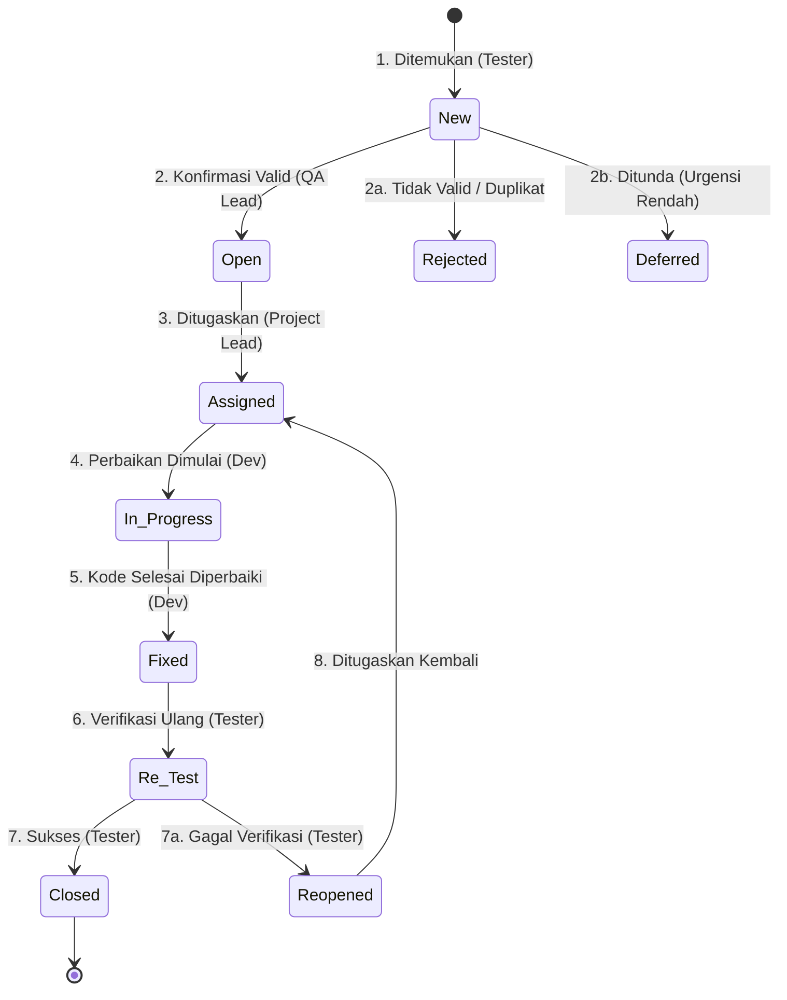
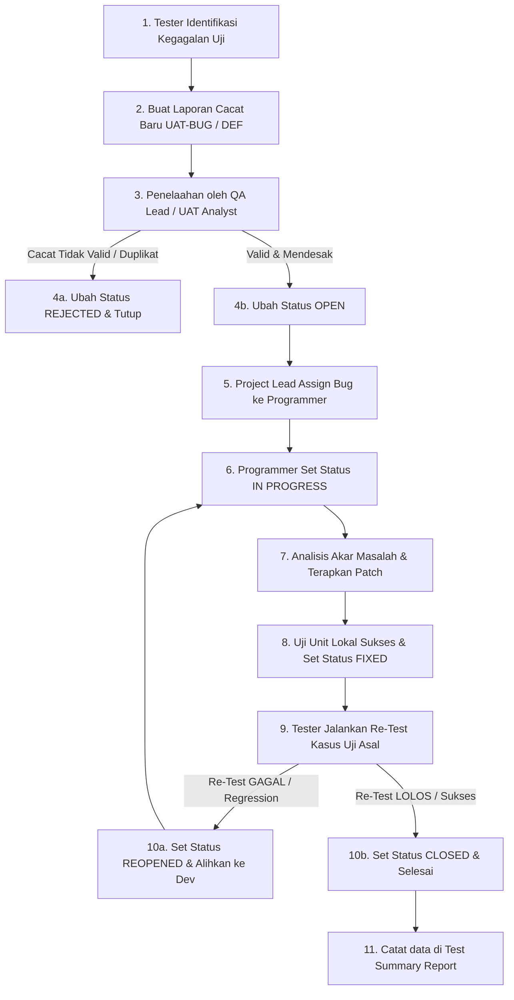

# Bug Report Template — AbuCom

## Riwayat Perubahan Dokumen

| Versi | Tanggal | Deskripsi Perubahan | Oleh |
|:---:|---|---|---|
| **1.0** | 2026-05-27 | Inisialisasi awal pembuatan dan penyusunan dokumen Bug Report Template secara komprehensif. Menyerap data dari Test Plan v1.1, Test Cases v1.1, UAT Script v1.1, SRS v1.1, Security Design v1.1, dan CLI Interaction Flow v1.1. Menyediakan standar klasifikasi keparahan (severity), prioritas perbaikan (priority), alur siklus hidup bug, template formulir pelaporan, prosedur eskalasi, metrik kualitas, integrasi traceability, 15 daftar kode error sistem, serta 4 contoh pengisian konkret tanpa placeholder. | Senior QA Engineer & Defect Management Specialist |

---

## 1. Informasi Dokumen

### 1.1. Tujuan Dokumen
Dokumen **Bug Report Template** ini disusun untuk menetapkan standar formal, prosedur baku, serta cetakan formulir pencatatan temuan cacat (*defect/bug*) selama seluruh siklus pengujian sistem **AbuCom — Sistem Manajemen Terpadu Usaha Percetakan**. 

Standardisasi ini bertujuan untuk:
1. **Meningkatkan Efisiensi Reproduksi**: Menjamin setiap laporan bug memiliki detail langkah reproduksi dan data input yang lengkap, sehingga programmer/AI agent dapat segera mereproduksi dan memperbaiki bug tanpa hambatan komunikasi.
2. **Standardisasi Klasifikasi**: Memberikan panduan objektif dalam menentukan tingkat keparahan (*severity*) teknis dan prioritas (*priority*) bisnis perbaikan.
3. **Menjaga Ketertelusuran (Traceability)**: Menghubungkan setiap temuan cacat dengan Test Case, Use Case, kebutuhan SRS, serta kode error sistem yang terdampak.
4. **Akuntabilitas Kualitas**: Menjadi instrumen formal pelacakan status penanganan cacat dari penemuan (*discovery*) hingga verifikasi akhir (*closure*).

### 1.2. Cakupan Dokumen
Dokumen ini berlaku untuk seluruh fase pengujian sistem AbuCom CLI (Unit Testing, Integration Testing, System Testing, dan User Acceptance Testing / UAT). Cakupan materi dokumen meliputi klasifikasi severity & priority, diagram siklus hidup bug (*bug lifecycle*), pemetaan kategori bug terhadap 10 modul utama, formulir standar, prosedur eskalasi normal dan keamanan khusus, metrik kualitas, register 15 kode error sistem, serta 4 contoh pelaporan konkret.

### 1.3. Posisi Dokumen dalam Siklus SDLC
Dalam siklus pengembangan perangkat lunak (SDLC) AbuCom, dokumen Bug Report Template ini berada pada **Fase 05 — Testing** sebagai deliverable keempat yang memandu proses pelaporan defect hasil eksekusi pengujian.

```
+-------------------------------------------------------------+
| FASE 05: TESTING - Test Plan v1.1 (Deliverable 1)           |
+-------------------------------------------------------------+
                               |
                               v
+-------------------------------------------------------------+
| FASE 05: TESTING - Test Cases v1.1 (Deliverable 2)          |
+-------------------------------------------------------------+
                               |
                               v
+-------------------------------------------------------------+
| FASE 05: TESTING - UAT Script v1.1 (Deliverable 3)          |
+-------------------------------------------------------------+
                               |
                               v
+=============================================================+
| FASE 05: TESTING - Bug Report Template [DOKUMEN INI]        |
+=============================================================+
                               |
                               v
+-------------------------------------------------------------+
| FASE 05: TESTING - Test Execution, Defect Logs & Report     |
+-------------------------------------------------------------+
```

### 1.4. Hubungan dengan Dokumen SDLC Lainnya (Input/Output)
* **Dokumen Input (Sumber Rujukan):**
  * [Test Plan v1.1](docs/sdlc/05_testing/01_test_plan.md): Sumber 44 skenario uji, 10 modul M.1-M.10, spesifikasi lingkungan sandbox `abucom_test_db`, dan kriteria sign-off.
  * [Test Cases v1.1](docs/sdlc/05_testing/02_test_cases.md): Sumber 70 kasus uji operasional, data fixtures (8 akun uji), dan konvensi penamaan TC.
  * [UAT Script v1.1](docs/sdlc/05_testing/03_uat_script.md): Sumber prosedur defect handling UAT, klasifikasi tingkat keparahan UAT, alur eskalasi temuan, dan kriteria keluar UAT.
  * [SRS v1.1](docs/sdlc/02_analysis/02_software_requirements.md): Spesifikasi kebutuhan fungsional (SRS-F-001 s.d SRS-F-040) dan non-fungsional (SRS-NF-001 s.d SRS-NF-011) yang dilanggar oleh bug.
  * [Security Design v1.1](docs/sdlc/03_design/06_security_design.md): Spesifikasi bcrypt cost factor 12, JWT 8 jam, RBAC, audit log JSON, enkripsi Fernet, dan SOP insiden.
  * [CLI Interaction Flow v1.1](docs/sdlc/03_design/04_cli_interaction_flow.md): Format kode error visual terminal `⛔ ERR-XXX-YYY`, formatting rich/tabulate, dan struk thermal.
* **Dokumen Output (Penerima Manfaat):**
  * **Defect Log / Bug Registry**: Kumpulan berkas laporan bug aktual hasil eksekusi pengujian.
  * **Test Summary Report**: Rekonsiliasi data defect untuk penentuan keputusan peluncuran (*go-live decision*).

### 1.5. Audiens Target
1. **AI Testing Agent & QA Engineer**: Sebagai acuan formal dalam memformat temuan bug otomatis yang dihasilkan oleh test suite pytest dan mengirimkannya ke backlog perbaikan.
2. **Junior Programmer**: Panduan untuk membaca laporan bug, memahami langkah reproduksi, mencatat akar penyebab (*root cause*), dan memperbarui catatan perbaikan.
3. **Pemilik Usaha & Kepala Percetakan**: Basis standardisasi untuk merekam temuan selama sesi UAT bisnis harian.

### 1.6. Definisi, Akronim, dan Singkatan
* **Bug / Defect**: Ketidaksesuaian antara hasil aktual sistem dengan hasil yang diharapkan sesuai spesifikasi kebutuhan (SRS).
* **Severity (Tingkat Keparahan)**: Ukuran dampak teknis dari suatu bug terhadap operasional fungsionalitas sistem.
* **Priority (Prioritas Perbaikan)**: Ukuran urgensi bisnis untuk memperbaiki bug berdasarkan jadwal rilis dan dampak komersial.
* **Regression Bug**: Bug yang muncul kembali di area sistem yang sebelumnya berfungsi normal akibat adanya perubahan atau patch kode di modul lain.
* **Hotfix**: Patch kode kritis yang dideploy cepat untuk mengatasi bug Blocker atau Critical di lingkungan operasional.
* **Workaround**: Solusi sementara yang dapat digunakan pengguna untuk menyelesaikan alur bisnis meskipun bug belum diperbaiki secara permanen.
* **SLA (Service Level Agreement)**: Batas waktu tanggap (respon) dan penyelesaian perbaikan yang disepakati berdasarkan tingkat keparahan bug.
* **ACID**: Atomicity, Consistency, Isolation, Durability (standar keandalan transaksi basis data).
* **RBAC**: Role-Based Access Control (sistem kontrol akses berbasis peran).
* **JWT**: JSON Web Token (token sesi otentikasi stateless).
* **UU PDP**: Undang-Undang Perlindungan Data Pribadi No. 27 Tahun 2022.

### 1.7. Konvensi Penamaan ID Bug
Untuk menjamin kerapian pelacakan, setiap temuan bug wajib diberi ID unik dengan ketentuan format sebagai berikut:

#### 1.7.1. Bug Internal Fase Testing (QA)
$$\mathbf{DEF}\text{-}[\mathbf{MODUL}]\text{-}[\mathbf{NOMOR\_URUT}]$$
* **DEF**: Singkatan dari Defect (Bug).
* **MODUL**: Kode modul terdampak (M1 s.d M10, SEC, DEC, INT, CLI, NF).
* **NOMOR_URUT**: Angka 3-digit berurutan dari `001` s.d `999` dalam modul tersebut.
* *Contoh*: `DEF-M2-001` (Bug pertama pada modul M.2), `DEF-SEC-003` (Bug ketiga pada modul Keamanan).

#### 1.7.2. Bug Hasil Temuan UAT
$$\mathbf{UAT}\text{-}\mathbf{BUG}\text{-}[\mathbf{NOMOR\_URUT}]$$
* **UAT-BUG**: Penanda khusus temuan cacat selama User Acceptance Testing.
* **NOMOR_URUT**: Angka 3-digit berurutan dari `001` s.d `999`.
* *Contoh*: `UAT-BUG-001`, `UAT-BUG-024`.

---

## 2. Klasifikasi Tingkat Keparahan Bug (Severity Classification)

### 2.1. Definisi Tingkat Keparahan
Tingkat Keparahan (*Severity*) mengukur seberapa besar dampak teknis bug merusak operasional sistem AbuCom. Severity ditentukan secara objektif oleh **Penguji (Tester/QA/UAT Tester)** saat bug ditemukan, murni berdasarkan tingkat kerusakan fungsionalitas software tanpa mempedulikan jadwal bisnis.

### 2.2. Tabel Klasifikasi Severity
Sistem AbuCom mengadopsi standar **IEEE 1044** yang disesuaikan ke dalam 5 level severity berikut:

| Level Severity | Nama Level | Definisi Teknis | Dampak Operasional pada Sistem |
|:---:|---|---|---|
| **S1** | **Blocker** | Bug menyebabkan crash total program, kegagalan startup, *dirty database shutdown*, atau data hilang permanen (*data loss*). | Pengujian terhenti total. Tidak ada jalan keluar (*no workaround*). Sistem mati total. |
| **S2** | **Critical** | Kegagalan fitur inti bisnis, penyimpangan kalkulasi keuangan desimal, bypass keamanan RBAC/login, atau pelanggaran privasi data pribadi. | Fungsi kritis bisnis tidak dapat digunakan. Tidak tersedia workaround yang dapat diterima secara bisnis. |
| **S3** | **Major** | Kegagalan fungsionalitas utama pada modul yang mengganggu alur bisnis normal, namun tidak merusak data keuangan atau keamanan. | Alur utama terganggu, namun tersedia solusi alternatif sementara (*workaround*) yang dapat dijalankan staf. |
| **S4** | **Minor** | Kegagalan fungsionalitas penunjang / kosmetik interaktif yang tidak menghentikan alur operasional utama bisnis. | Gangguan kecil. Pengguna masih dapat menyelesaikan transaksi harian tanpa hambatan berarti. |
| **S5** | **Cosmetic / Trivial** | Kesalahan ejaan (*typo*) bahasa Indonesia pada label menu CLI, misalignment grid tabel 1-2 karakter, atau warna ANSI kurang kontras. | Fungsionalitas program 100% normal. Hanya berdampak estetika visual antarmuka terminal. |

### 2.3. Contoh Konkret Severity per Level (Konteks AbuCom)
* **Blocker (S1)**: Aplikasi AbuCom CLI langsung tertutup paksa (*crash to desktop*) saat dijalankan karena gagal membaca berkas `.env` tanpa memberikan pesan error terstandar (`ERR-FILE-001`), atau database mengalami korupsi tabel akibat pemadaman listrik di tengah penutupan shift kasir.
* **Critical (S2)**: Kalkulasi HPP produk stempel kustom di modul M.2 menghasilkan tipe pecahan `float` (seperti `4750.0000000001` akibat bug presisi float biner) alih-alih `Decimal('4750.0000')`, menyebabkan ketidakakuratan margin profit kumulatif toko. Contoh lain: Akun dengan peran `desainer` berhasil masuk ke menu Smart Payroll (`M4-002`) yang seharusnya terkunci rapat hanya untuk `pemilik`.
* **Major (S3)**: Fitur alarm prediksi re-order stok bahan baku (`M2-TC-006`) gagal memancarkan warna kuning peringatan di layar CLI ketika sisa stok bahan karet stempel berada di bawah ambang batas 7 hari, meskipun staf gudang masih bisa melihat jumlah stok manual.
* **Minor (S4)**: Tautan (URL) WhatsApp Web yang digenerasi otomatis untuk notifikasi pelanggan siap ambil (`M5-TC-003`) salah menyisipkan kode spasi `%20` sehingga teks di browser berdempetan, namun kasir masih bisa menyalin link dan mengeditnya manual.
* **Cosmetic / Trivial (S5)**: Label pilihan navigasi di menu utama bertuliskan `"Administarsi Keuangan"` (typo ejaan) yang seharusnya ditulis secara baku `"Administrasi Keuangan"`.

---

## 3. Klasifikasi Prioritas Perbaikan (Priority Classification)

### 3.1. Definisi Tingkat Prioritas
Tingkat Prioritas (*Priority*) mengukur seberapa cepat dan mendesak bug tersebut harus diperbaiki dari kacamata kebutuhan bisnis dan jadwal rilis toko. Priority ditentukan secara subjektif oleh **Project Lead / Pemilik Usaha** setelah berkoordinasi dengan QA Lead.

### 3.2. Tabel Klasifikasi Priority

| Level Priority | Nama Level | Target SLA Perbaikan | Deskripsi & Urgensi Bisnis |
|:---:|---|---|---|
| **P1** | **Urgent** | **$\le$ 4 Jam** | Bug harus segera diperbaiki saat itu juga. Menghentikan operasional toko atau seluruh jalannya fase testing. Wajib dibuatkan *hotfix*. |
| **P2** | **High** | **$\le$ 1 Hari Kerja** | Bug harus diselesaikan dalam siklus pengujian berjalan sebelum build versi berikutnya dirilis. |
| **P3** | **Medium** | **$\le$ 3 Hari Kerja** | Bug penting untuk diperbaiki, namun dapat dijadwalkan pada rilis minor berikutnya atau setelah bug prioritas tinggi selesai. |
| **P4** | **Low** | **Rilis Mendatang / Backlog** | Bug dapat ditunda perbaikannya hingga ada waktu luang atau dimasukkan sebagai backlog pemeliharaan berkala. |

### 3.3. Matriks Severity vs Priority
Kombinasi antara Severity dan Priority menentukan alur penanganan bug. Matriks di bawah ini menjadi acuan formal penentuan prioritas perbaikan berdasarkan tingkat keparahannya:

| Severity $\rightarrow$ <br> Priority $\downarrow$ | Blocker (S1) | Critical (S2) | Major (S3) | Minor (S4) | Cosmetic (S5) |
|---|---|---|---|---|---|
| **Urgent (P1)** | **S1-P1**: Hotfix Instan. Diawasi langsung oleh Pemilik. | **S2-P1**: Hotfix Instan. Celah keamanan aktif / salah desimal keuangan. | **S3-P1**: Alur bisnis macet total menjelang Go-Live. | Tidak Berlaku | Tidak Berlaku |
| **High (P2)** | Tidak Berlaku | **S2-P2**: Perbaikan dalam 24 jam. Celah keamanan non-aktif / data sensitif terisolasi. | **S3-P2**: Fitur utama rusak tanpa workaround yang mudah. | **S4-P2**: Bug minor pada modul transaksi kasir operasional. | Tidak Berlaku |
| **Medium (P3)** | Tidak Berlaku | Tidak Berlaku | **S3-P3**: Fitur utama rusak tetapi tersedia workaround yang stabil. | **S4-P3**: Bug minor pada modul pendukung (misal: CRM/Poin). | **S5-P3**: Cacat tampilan visual pada struk thermal. |
| **Low (P4)** | Tidak Berlaku | Tidak Berlaku | Tidak Berlaku | **S4-P4**: Gangguan minor pada fitur jarang dipakai. | **S5-P4**: Typo penulisan menu / grid melenceng. |

---

## 4. Siklus Hidup Bug (Bug Lifecycle)

### 4.1. Diagram Status Bug (State Transition Diagram)
Berikut adalah visualisasi alur transisi status bug dari pertama kali ditemukan hingga dinyatakan selesai diperbaiki menggunakan standar `stateDiagram-v2` Mermaid:



### 4.2. Deskripsi Setiap Status
1. **New (Baru)**: Bug baru dilaporkan oleh Tester/QA dan tercatat di sistem, namun belum ditinjau oleh QA Lead.
2. **Open (Terbuka)**: Bug telah ditelaah oleh QA Lead dan dikonfirmasi sebagai cacat yang valid (bukan kesalahan pengoperasian penguji).
3. **Assigned (Ditugaskan)**: Bug telah dialokasikan kepada Junior Programmer / AI Agent tertentu untuk diperbaiki.
4. **In Progress (Sedang Diperbaiki)**: Programmer sedang aktif menganalisis akar masalah dan menulis patch perbaikan kode.
5. **Fixed (Telah Diperbaiki)**: Perbaikan kode selesai ditulis, diuji unit secara lokal, dan di-commit ke repositori Git. Menunggu verifikasi formal QA.
6. **Re-Test (Verifikasi Ulang)**: Penguji melakukan eksekusi ulang terhadap Test Case yang sebelumnya gagal untuk membuktikan keandalan patch.
7. **Closed (Ditutup)**: Bug dinyatakan selesai 100% karena pengujian ulang berhasil lolos tanpa efek samping (*regression*).
8. **Reopened (Dibuka Kembali)**: Bug dibuka kembali karena pengujian ulang gagal (cacat masih muncul) atau patch menimbulkan bug baru di area terkait.
9. **Rejected (Ditolak)**: Bug dinyatakan tidak valid karena: (a) Merupakan fitur bawaan (*working as designed*); (b) Duplikat dengan bug ID lain; (c) Tidak dapat direproduksi akibat data fixture salah.
10. **Deferred (Ditunda)**: Bug valid tetapi disepakati oleh Pemilik Usaha untuk ditunda perbaikannya pada rilis mayor berikutnya karena urgensi bisnis rendah.

### 4.3. Aturan Transisi Antar Status
Untuk menjaga integritas siklus hidup bug, hanya peran tertentu yang memiliki wewenang untuk mengubah status bug:

* **Tester / QA / UAT Tester**: Berhak mengubah status ke `New`, `Re-Test`, `Closed`, dan `Reopened`. Tester **dilarang keras** menutup langsung bug tanpa melalui fase `Re-Test`.
* **QA Lead / Senior UAT Analyst**: Berhak mengubah status dari `New` ke `Open`, `Rejected`, atau `Deferred`.
* **Project Lead / Pemilik Usaha**: Berhak menentukan assignment (`Assigned`) ke developer dan menyetujui penundaan status `Deferred`.
* **Junior Programmer / AI Agent Developer**: Berhak mengubah status ke `In Progress` dan `Fixed`. Developer **dilarang keras** mengubah status langsung ke `Closed` atau `Rejected`.

---

## 5. Kategori Bug (Bug Category/Type)

### 5.1. Tabel Kategori Bug
Cacat dikelompokkan ke dalam kategori berikut untuk mempermudah analisis densitas bug (*defect density*) per modul sistem:

| Kode Kategori | Nama Kategori | Deskripsi Teknis Kerusakan |
|---|---|---|
| **CAT-FUNC** | Fungsional | Penyimpangan logika bisnis, kegagalan pemrosesan menu, atau alur kerja program CLI yang tidak sesuai dengan spesifikasi fungsional SRS-F. |
| **CAT-SEC** | Keamanan | Kerusakan pada otentikasi login, bypass otorisasi RBAC, kegagalan log audit JSON, kebocoran data CRM privat, atau kegagalan proteksi brute force. |
| **CAT-DEC** | Presisi Desimal | Bug aritmatika yang melibatkan Decimal(15,4), kesalahan pembulatan `ROUND_HALF_UP` pada HPP BOM, margin, Smart Payroll, atau depresiasi aset. |
| **CAT-DB** | Integritas Database | Pelanggaran constraint basis data (Unique Key, CHECK, Foreign Key), kegagalan rollback ACID saat LAN offline, atau kebocoran pooling koneksi. |
| **CAT-CLI** | Antarmuka CLI | Glitch rendering warna ANSI `rich`, visual grid tabel `tabulate` melenceng, pembungkusan teks struk thermal 32/48 karakter pecah, atau encoding UTF-8 rusak. |
| **CAT-PERF** | Performa | Latensi pemrosesan laporan laba rugi atau stock opname > 2.0 detik pada volume data tinggi, atau terdeteksinya memory leak pada sesi idle. |
| **CAT-COMPAT** | Kompatibilitas | Penyimpangan jalannya logika program Python akibat dijalankan secara Dual-OS lintas Windows 11 (PC Kasir) dan Linux Debian 12 (Server). |
| **CAT-CONFIG** | Konfigurasi | Bug pembacaan parameter lingkungan `.env`, inisialisasi startup validator yang tidak aman, atau manipulasi runtime dinamis `system_configs`. |

### 5.2. Pemetaan Kategori Bug ke Modul AbuCom (M.1 s.d M.10)
Berikut adalah matriks pemetaan kategori bug yang paling kritis dan berpotensi muncul pada setiap modul AbuCom:

| ID Modul | Nama Modul Utama | Kategori Utama Terdampak | Deskripsi Risiko Kasus |
|---|---|---|---|
| **M.1** | Transaksi & Kasir | `CAT-FUNC`, `CAT-DEC`, `CAT-CLI` | Pembayaran DP gantung, pembulatan total belanja, ekspor struk thermal `.txt` 32 karakter pecah. |
| **M.2** | Inventaris & BOM | `CAT-DEC`, `CAT-DB`, `CAT-CONFIG` | Kalkulasi HPP pecahan desimal, write database stock opname draft/approved, backup/restore ZIP AES-256. |
| **M.3** | Layanan Digital | `CAT-FUNC`, `CAT-CONFIG` | Alert limit deposit PPOB < Rp 150.000, komparasi admin 6 e-wallet, data suku cadang jasa servis. |
| **M.4** | SDM & Payroll | `CAT-DEC`, `CAT-FUNC` | Proteksi upah minimum 50% UMR (Rp 1.600.000), pemotongan otomatis kasbon, akumulasi poin 4-tier. |
| **M.5** | Antrian & Desain | `CAT-FUNC`, `CAT-CLI` | Transisi 5 status antrian tidak berurutan, perekaman path file lokal, perakitan link WhatsApp Web. |
| **M.6** | Laporan Keuangan | `CAT-DEC`, `CAT-PERF`, `CAT-SEC` | Depresiasi garis lurus aset, aggregasi laba rugi instan < 2 detik, eskalasi sandi pemilik pengeluaran > Rp 500.000. |
| **M.7** | Keamanan & Handover | `CAT-SEC`, `CAT-DB` | Sesi token JWT 8 jam, RBAC 8 peran, audit log JSON, brute force lockout, toleransi selisih kas kasir Rp 10.000. |
| **M.8** | CRM Pelanggan | `CAT-SEC`, `CAT-FUNC` | Enkripsi Fernet nomor WA, hard delete data keanggotaan CRM permanen (kepatuhan regulasi UU PDP). |
| **M.9** | Multi-Cabang | `CAT-DB`, `CAT-CONFIG` | Kebocoran data transaksi akibat kegagalan isolasi query filter `cabang_id`. |
| **M.10** | Config Runtime | `CAT-CONFIG`, `CAT-DB` | Startup validator `.env`, parsing konfigurasi parameter bisnis pada tabel `system_configs`. |

---

## 6. Template Formulir Laporan Bug (Bug Report Form)

### 6.1. Template Formulir Utama (Tabel Format)

| Nama Field (Atribut) | Tipe Data / Pilihan | Keterangan Aturan Pengisian |
|---|---|---|
| **ID Bug** | String (Format ID) | ID unik terstandardisasi sesuai Bab 1.7.1. (misal: `DEF-M1-001`). |
| **Judul Bug** | String (Teks Bebas) | Ringkasan singkat kesalahan dengan pola: `[Perilaku Salah] pada [Lokasi Modul] saat [Kondisi Aksi]`. |
| **Tanggal Pelaporan** | Date (YYYY-MM-DD) | Tanggal ditemukannya bug secara riil. |
| **Pelapor** | String (Nama Akun) | Username akun penguji / nama Tester QA yang menemukan. |
| **Versi Aplikasi** | String (Versi Build) | Versi rilis aplikasi yang diuji (misal: `v1.1`). |
| **Modul Terdampak** | String (Modul ID) | Kode dan nama modul (M.1 s.d M.10) yang bermasalah. |
| **Kategori Bug** | String (Kode Kategori) | Kode kategori bug sesuai klasifikasi Bab 5.1 (misal: `CAT-DEC`). |
| **Severity** | Enum Choice | Pilihan tingkat keparahan teknis: `S1 Blocker` / `S2 Critical` / `S3 Major` / `S4 Minor` / `S5 Cosmetic`. |
| **Priority** | Enum Choice | Pilihan prioritas perbaikan bisnis: `P1 Urgent` / `P2 High` / `P3 Medium` / `P4 Low`. |
| **Referensi SRS** | String (SRS ID) | ID spesifikasi kebutuhan formal yang dilanggar (misal: `SRS-F-007`). |
| **Referensi Use Case** | String (UC ID) | ID use case terkait (misal: `UC-021`). |
| **Referensi Test Case** | String (TC ID) | ID kasus uji yang dieksekusi dan gagal (misal: `TC-M2-002-01`). |
| **Peran Aktor** | String (Posisi Peran) | Peran login pengguna saat bug dipicu sesuai ACM (misal: `kepala_percetakan`). |
| **Lingkungan (Environment)**| String (Teks Detail) | Detail OS, terminal, Python runtime, dan database sandbox yang digunakan (sesuai Bab 6.4). |
| **Prasyarat (Prakondisi)** | Text Area | Kondisi awal database master / data fixtures sebelum bug dipicu. |
| **Langkah Reproduksi** | Numbered List (1, 2, ...) | Langkah sekuensial yang wajib diikuti secara persis untuk memunculkan kembali bug. |
| **Hasil Diharapkan** | Text Area | Perilaku fungsional / nilai data yang seharusnya terjadi menurut spesifikasi. |
| **Hasil Aktual** | Text Area | Perilaku menyimpang / pesan crash error riil yang terjadi di layar CLI. |
| **Lampiran / Evidence** | Text / File Path | Stacktrace error log python / screenshoot tangkapan layar visual terminal CLI. |
| **Ditugaskan Ke** | String (Nama Dev) | Developer / Programmer / AI Agent pelaksana perbaikan. |
| **Status Bug** | Enum Choice | Status lifecycle: `New` / `Open` / `Assigned` / `In Progress` / `Fixed` / `Re-Test` / `Closed` / `Reopened`. |
| **Tanggal Perbaikan** | Date / [Belum Ada] | Tanggal ketika status diubah menjadi `Fixed`. |
| **Catatan Perbaikan** | Text Area | Penjelasan teknis mengenai akar penyebab (*root cause*) dan patch kode yang diterapkan oleh developer. |
| **Tanggal Verifikasi** | Date / [Belum Ada] | Tanggal ketika status ditutup sukses menjadi `Closed`. |

---

### 6.2. Panduan Pengisian Setiap Field
Untuk menjamin laporan bug yang dikirimkan memiliki kualitas tinggi, setiap penguji wajib menaati 4 prinsip penulisan **"Good Bug Report"** berikut:

1. **Prinsip Spesifik**: Satu berkas bug report hanya boleh membahas satu temuan bug unik. Jangan menggabungkan beberapa bug yang berbeda dalam satu laporan, meskipun terjadi pada modul yang sama.
2. **Prinsip Dapat Direproduksi (Reproducible)**: Langkah reproduksi harus ditulis sejelas mungkin dengan numbered list. Hindari penulisan langkah yang ambigu atau melompat-lompat. Staf developer yang belum pernah melihat bug tersebut harus dapat memunculkannya kembali dengan hanya membaca laporan.
3. **Prinsip Tidak Ambigu (Precise)**: Gunakan data kuantitatif. Hindari kata-kata bersayap seperti "kadang-kadang crash", "sepertinya lambat", atau "angka tidak pas". Sebutkan nilai angka nominal rupiah desimal yang dimasukkan dan pesan error yang tertera secara persis.
4. **Prinsip Objektif (Faktual)**: Laporkan fakta perilaku sistem, bukan opini atau tuduhan. Analisis akar penyebab (*root cause*) adalah tugas dari programmer, tugas penguji adalah mendeskripsikan secara akurat letak penyimpangan data.

#### 6.2.1. Standar Penulisan Langkah Reproduksi
Setiap langkah reproduksi wajib ditulis menggunakan numbered list terstruktur dengan format aksi masukan yang konsisten:
```
1. Login sebagai [Aktor] menggunakan username [username_seed] dan password [password_default].
2. Masuk menu utama CLI, pilih angka [pilihan_menu] untuk membuka sub-menu [Nama_Menu].
3. Pada form input [Nama_Field], masukkan nilai data = [Nilai_Input_Konkret].
4. Konfirmasi aksi dengan menekan Enter / memilih [Aksi].
5. Perhatikan perilaku di bagian layar [Area_Layar_CLI].
```

---

### 6.3. Contoh Pengisian Bug Report — Bug Fungsional (Happy Path Failure)

| Field | Isi Laporan Temuan Aktual |
|---|---|
| **ID Bug** | `DEF-M1-001` |
| **Judul Bug** | Menu Pelunasan DP menerima nominal kurang dari sisa tagihan tanpa menampilkan error `ERR-VAL-003` |
| **Tanggal Pelaporan** | 2026-05-27 |
| **Pelapor** | `kasir01` |
| **Versi Aplikasi** | `v1.1` |
| **Modul Terdampak** | `M.1 — Manajemen Transaksi & Kasir` |
| **Kategori Bug** | `CAT-FUNC` |
| **Severity** | `S2 — Critical` |
| **Priority** | `P1 — Urgent` |
| **Referensi SRS** | `SRS-F-003` |
| **Referensi Use Case** | `UC-003` |
| **Referensi Test Case** | `TC-M1-003-02` |
| **Peran Aktor** | `kasir` |
| **Lingkungan** | Windows 11 Pro, Windows Terminal v1.18, Python 3.14.2+, Database sandbox `abucom_test_db` |
| **Prasyarat** | Transaksi pesanan kustom `id = 10` berstatus `'BELUM LUNAS'` dengan total tagihan Rp 150.000,0000 dan telah dibayar DP Rp 50.000,0000 (sisa tagihan = Rp 100.000,0000) terdaftar di database. |
| **Langkah Reproduksi** | 1. Login sebagai kasir menggunakan username `kasir01` dan password `SandiStaf2026!`. <br>2. Masuk menu Kasir > Pelunasan Pesanan.<br>3. Input ID transaksi = `10` pada prompt. Verifikasi rincian data sisa tagihan Rp 100.000,0000 muncul di layar.<br>4. Pada kolom nominal pembayaran pelunasan, input nilai = `99000.0000`. Tekan Enter.<br>5. Perhatikan status transaksi dan laci kas. |
| **Hasil Diharapkan** | Sistem mendeteksi nominal pembayaran kurang dari sisa tagihan, menolak penyimpanan transaksi, membatalkan penambahan saldo kas, dan menyajikan pesan error visual: `⛔ ERR-VAL-003: Jumlah pembayaran kurang dari sisa tagihan Rp 100.000,0000!`. |
| **Hasil Aktual** | Sistem memproses sukses pelunasan, mengubah status transaksi di database `transaksi` menjadi `'LUNAS'`, dan saldo kas bertambah Rp 99.000,0000 tanpa memancarkan error `ERR-VAL-003` (toko merugi Rp 1.000,0000). |
| **Lampiran / Evidence** | Screenshoot tersimpan di `exports/receipts/evidence_def_m1_001.png` |
| **Ditugaskan Ke** | Junior Programmer |
| **Status Bug** | `Open` |
| **Tanggal Perbaikan** | `[DATA BELUM TERSEDIA - Perlu diisi manual oleh Junior Programmer]` |
| **Catatan Perbaikan** | `[DATA BELUM TERSEDIA - Perlu diisi manual oleh Junior Programmer]` |
| **Tanggal Verifikasi** | `[DATA BELUM TERSEDIA - Perlu diisi manual oleh QA Lead]` |

---

### 6.4. Contoh Pengisian Bug Report — Bug Keamanan (Security Vulnerability)

| Field | Isi Laporan Temuan Aktual |
|---|---|
| **ID Bug** | `DEF-SEC-001` |
| **Judul Bug** | Bypass Hak Akses: Peran `desainer` berhasil masuk menu Smart Payroll tanpa diblokir oleh RBAC Guard |
| **Tanggal Pelaporan** | 2026-05-27 |
| **Pelapor** | `QA_Lead_Agent` |
| **Versi Aplikasi** | `v1.1` |
| **Modul Terdampak** | `M.7 — Keamanan, Audit & Handover` |
| **Kategori Bug** | `CAT-SEC` |
| **Severity** | `S2 — Critical` |
| **Priority** | `P1 — Urgent` |
| **Referensi SRS** | `SRS-F-030` |
| **Referensi Use Case** | `UC-032` |
| **Referensi Test Case** | `TC-M7-002-02` |
| **Peran Aktor** | `desainer` |
| **Lingkungan** | Debian 12 Bookworm LTS, bash console, Python 3.14.2+, Database sandbox `abucom_test_db` |
| **Prasyarat** | Akun staf `desain01` ber-role `'desainer'` terdaftar aktif di database. |
| **Langkah Reproduksi** | 1. Buka terminal, login menggunakan username `desain01` dan password `SandiStaf2026!`. <br>2. Pada prompt navigasi menu utama CLI, ketikkan kode menu tersembunyi = `M4-002` (Smart Payroll). Tekan Enter. <br>3. Perhatikan layar tampilan CLI. |
| **Hasil Diharapkan** | Sistem mendeteksi peran desainer tidak memiliki hak akses menu payroll sesuai matriks ACM, memblokir akses biner, melempar error visual `⛔ ERR-AUTH-003: Akses Ditolak: Hak Akses Pemilik Dibutuhkan!`, dan merekam entri log tipe `'ACCESS_DENIED'` ke tabel `audit_logs` di database. |
| **Hasil Aktual** | Sistem meloloskan akses desainer, me-render form input bulan Smart Payroll, dan membiarkan desainer melihat data upah karyawan toko tanpa memicu error `ERR-AUTH-003`. Tidak ada entri log `'ACCESS_DENIED'` yang ditulis ke database. |
| **Lampiran / Evidence** | Audit Log SQL dump & Stacktrace: `exports/logs/evidence_def_sec_001.txt` |
| **Ditugaskan Ke** | Junior Programmer |
| **Status Bug** | `Assigned` |
| **Tanggal Perbaikan** | `[DATA BELUM TERSEDIA - Perlu diisi manual oleh Junior Programmer]` |
| **Catatan Perbaikan** | `[DATA BELUM TERSEDIA - Perlu diisi manual oleh Junior Programmer]` |
| **Tanggal Verifikasi** | `[DATA BELUM TERSEDIA - Perlu diisi manual oleh QA Lead]` |

---

### 6.5. Contoh Pengisian Bug Report — Bug Presisi Desimal (Calculation Error)

| Field | Isi Laporan Temuan Aktual |
|---|---|
| **ID Bug** | `DEF-DEC-001` |
| **Judul Bug** | Perhitungan depresiasi garis lurus bulanan printer thermal menghasilkan pembulatan float tidak presisi |
| **Tanggal Pelaporan** | 2026-05-27 |
| **Pelapor** | `pemilik` |
| **Versi Aplikasi** | `v1.1` |
| **Modul Terdampak** | `M.6 — Administrasi Pinjaman, Aset & Pengeluaran` |
| **Kategori Bug** | `CAT-DEC` |
| **Severity** | `S2 — Critical` |
| **Priority** | `P2 — High` |
| **Referensi SRS** | `SRS-F-028` |
| **Referensi Use Case** | `UC-030` |
| **Referensi Test Case** | `TC-M6-002-01` (Part) |
| **Peran Aktor** | `pemilik` |
| **Lingkungan** | Windows 11 Pro, Windows Terminal, Python 3.14.2+, Database sandbox `abucom_test_db` |
| **Prasyarat** | Terdaftar master data aset tetap: Printer Thermal seharga Rp 10.000.000,0000 dengan masa manfaat 60 bulan (5 tahun). |
| **Langkah Reproduksi** | 1. Login menggunakan akun `pemilik` dengan password `SandiStaf2026!`. <br>2. Pilih menu Laporan Keuangan > Kelola Depresiasi Aset.<br>3. Pilih aset Printer Thermal, klik aksi kalkulasi depresiasi bulanan.<br>4. Periksa nilai depresiasi bulanan yang terhitung dan disimpan ke database. |
| **Hasil Diharapkan** | Sistem menghitung penyusutan bulanan menggunakan pembulatan presisi desimal: $10.000.000 / 60 = 166.666,66666...$ dibulatkan secara `ROUND_HALF_UP` 4 desimal menjadi tepat `Decimal('166666.6667')` (Rp 166.666,6667). |
| **Hasil Aktual** | Sistem me-render dan menyimpan nilai depresiasi bulanan sebesar `166666.6666` (salah pembulatan pemotongan string float) di DB, menimbulkan akumulasi deviasi sisa nilai buku aset. |
| **Lampiran / Evidence** | Tangkapan layar isi query tabel MySQL `aset` kolom `penyusutan_bulanan` terlampir di `exports/logs/evidence_def_dec_001.txt` |
| **Ditugaskan Ke** | Junior Programmer |
| **Status Bug** | `Open` |
| **Tanggal Perbaikan** | `[DATA BELUM TERSEDIA - Perlu diisi manual oleh Junior Programmer]` |
| **Catatan Perbaikan** | `[DATA BELUM TERSEDIA - Perlu diisi manual oleh Junior Programmer]` |
| **Tanggal Verifikasi** | `[DATA BELUM TERSEDIA - Perlu diisi manual oleh QA Lead]` |

---

### 6.6. Contoh Pengisian Bug Report — Bug Antarmuka CLI (Visual/Rendering Error)

| Field | Isi Laporan Temuan Aktual |
|---|---|
| **ID Bug** | `DEF-CLI-001` |
| **Judul Bug** | Garis pembatas (divider) nota struk thermal 58mm pecah karena render 31 karakter |
| **Tanggal Pelaporan** | 2026-05-27 |
| **Pelapor** | `pramu01` |
| **Versi Aplikasi** | `v1.1` |
| **Modul Terdampak** | `M.1 — Manajemen Transaksi & Kasir` |
| **Kategori Bug** | `CAT-CLI` |
| **Severity** | `S5 — Cosmetic` |
| **Priority** | `P3 — Medium` |
| **Referensi SRS** | `SRS-F-006` |
| **Referensi Use Case** | `UC-006` |
| **Referensi Test Case** | `TC-CLI-003-01` |
| **Peran Aktor** | `kasir` |
| **Lingkungan** | Windows 11 Pro, Windows Command Prompt (CMD) default encoding cp1252, Python 3.14.2+ |
| **Prasyarat** | Driver virtual thermal printer diset pada lebar kertas 32 karakter (58mm). |
| **Langkah Reproduksi** | 1. Buka aplikasi AbuCom CLI pada cmd.exe di Windows. <br>2. Transaksikan penjualan ritel ATK, klik cetak nota. <br>3. Buka berkas struk teks polos `.txt` hasil ekspor di folder `/exports/receipts/`. <br>4. Perhatikan garis pembatas antara kolom nama barang dan harga. |
| **Hasil Diharapkan** | Garis pemisah nota struk (berupa simbol `*` atau `-`) ter-render sejajar rapi sebanyak persis 32 karakter sesuai dengan lebar kertas (32 kolom teks). |
| **Hasil Aktual** | Garis pembatas ter-render ganjil sebanyak 31 karakter, mengakibatkan teks nominal harga di baris bawahnya melenceng 1 karakter ke arah kiri (misalignment kolom). |
| **Lampiran / Evidence** | File teks struk visual: `exports/receipts/evidence_def_cli_001.txt` |
| **Ditugaskan Ke** | Junior Programmer |
| **Status Bug** | `Open` |
| **Tanggal Perbaikan** | `[DATA BELUM TERSEDIA - Perlu diisi manual oleh Junior Programmer]` |
| **Catatan Perbaikan** | `[DATA BELUM TERSEDIA - Perlu diisi manual oleh Junior Programmer]` |
| **Tanggal Verifikasi** | `[DATA BELUM TERSEDIA - Perlu diisi manual oleh QA Lead]` |

---

## 7. Prosedur Pelaporan dan Eskalasi Bug

### 7.1. Alur Pelaporan Bug (Flowchart)
Berikut adalah diagram alir standar penanganan temuan bug dari pertama kali diidentifikasi oleh penguji hingga ditutup aman setelah verifikasi ulang, divisualisasikan dengan `flowchart TD` Mermaid:



### 7.2. Peran dan Tanggung Jawab dalam Manajemen Bug
* **Tester / QA Analyst / UAT Tester**:
  * Mengidentifikasi kegagalan program selama eksekusi kasus uji fungsional dan non-fungsional.
  * Mengisi seluruh field pada formulir Bug Report secara jujur dan akurat.
  * Melakukan eksekusi ulang pengujian (*re-test*) secara ketat setelah programmer merilis patch perbaikan.
* **QA Lead / Senior UAT Analyst**:
  * Meninjau antrian bug berstatus `New` untuk menyaring kebenaran laporan.
  * Menyetujui status `Open` dan menolak temuan yang tidak valid (`Rejected`).
  * Memverifikasi tingkat keparahan (*severity*) teknis yang diajukan oleh penguji.
* **Junior Programmer / AI Agent Developer**:
  * Menganalisis akar penyebab cacat (*root cause analysis*) berdasarkan langkah reproduksi laporan bug.
  * Menulis kode perbaikan (*patch*) yang andal dan bersih sesuai standar pemrograman.
  * Memperbarui field *Catatan Perbaikan* dengan deskripsi teknis perubahan kode sebelum mengubah status menjadi `Fixed`.
* **Project Lead / Pemilik Usaha**:
  * Menentukan tingkat prioritas perbaikan (*priority*) dari sudut pandang jadwal komersial toko.
  * Menyetujui penangguhan perbaikan cacat (`Deferred`).
  * Memantau SLA penanganan cacat agar proyek selesai tepat waktu.

### 7.3. SLA Penanganan Bug per Severity Level
Untuk menjaga ritme kerja rilis aplikasi, waktu respon awal dan batas waktu penyelesaian perbaikan (*resolution time*) dikunci ketat berdasarkan tingkat keparahan:

| Severity Level | Maksimal SLA Respon Awal | Maksimal SLA Solusi Fixed | Maksimal SLA Re-Test QA | Tindakan Eskalasi Khusus |
|:---:|---|---|---|---|
| **S1 — Blocker** | $\le$ 30 Menit | $\le$ 4 Jam | $\le$ 2 Jam | Wajibkan pengembang langsung menghentikan pekerjaan lain dan fokus pada pembuatan Hotfix. |
| **S2 — Critical** | $\le$ 1 Jam | $\le$ 8 Jam (1 Hari) | $\le$ 4 Jam | Melaporkan langsung kepada Pemilik Usaha. Evaluasi celah keamanan biner. |
| **S3 — Major** | $\le$ 4 Jam | $\le$ 24 Jam (3 Hari) | $\le$ 1 Hari | Diselesaikan dalam siklus iterasi berjalan sebelum penutupan fase testing. |
| **S4 — Minor** | $\le$ 8 Jam | $\le$ 5 Hari Kerja | Batch Mingguan | Dapat dijadwalkan pada rilis minor berikutnya secara berkala. |
| **S5 — Cosmetic** | $\le$ 24 Jam | Rilis Mendatang | Batch Rilis | Dikelompokkan ke dalam backlog pemeliharaan tampilan antarmuka. |

### 7.4. Prosedur Eskalasi Khusus Bug Keamanan (Security Defect Protocol)
Bug bertipe **`CAT-SEC`** (seperti bypass hak akses, kebocoran data CRM privat, atau kerentanan enkripsi database) memiliki risiko hukum dan kerugian operasional yang sangat tinggi. Oleh karena itu, penanganannya wajib menaati protokol khusus berikut:

1. **Prinsip Konfidensialitas**: Detail temuan bug keamanan **dilarang keras** disebarluaskan di luar tim inti penguji (QA Lead) dan pengembang (Junior Programmer/Pemilik). Laporan bug tidak boleh disimpan di folder publik yang dapat dibaca staf umum.
2. **Prioritas Otomatis**: Setiap temuan `CAT-SEC` otomatis diklasifikasikan minimal pada level severity **`S2 Critical`** dan prioritas **`P1 Urgent`** atau **`P2 High`**.
3. **Eskalasi Langsung**: QA Lead wajib mengirimkan notifikasi peringatan langsung kepada **Pemilik Usaha** dalam waktu kurang dari 30 menit setelah bug divalidasi.
4. **Verifikasi Security Re-test**: Proses penutupan bug keamanan (`Closed`) wajib menyertakan bukti hasil pengujian ulang khusus keamanan (*security regression testing*) untuk membuktikan celah bypass tidak dapat dieksploitasi lagi dari segala sudut menu.

---

## 8. Integrasi dengan Proses Pengujian

### 8.1. Hubungan Bug Report dengan Test Case
Setiap bug yang ditemukan selama eksekusi *System Testing* wajib dikaitkan dengan ID Test Case yang gagal. Ketika suatu kasus uji gagal dieksekusi:
1. Tester menandai status Test Case menjadi **`FAIL`** pada *Test Case Registry*.
2. Tester membuat Bug Report baru dengan mencantumkan ID Test Case tersebut pada field *Referensi Test Case*.
3. Programmer menulis patch perbaikan. Setelah patch diterapkan, status Bug berubah menjadi `Fixed`.
4. Tester membaca ID Test Case acuan, melakukan eksekusi ulang (*re-run*), dan jika sukses, mengubah status Test Case menjadi **`PASS`** dan menutup status Bug menjadi **`CLOSED`**.

### 8.2. Hubungan Bug Report dengan UAT Script
Selama sesi User Acceptance Testing oleh pengguna akhir (Pemilik Usaha & Kepala Percetakan):
1. Setiap temuan penyimpangan dicatat menggunakan ID berformat `UAT-BUG-XXX` dengan merujuk langsung ke nomor skrip UAT asal (field *ID Skrip UAT Asal*).
2. Temuan UAT-BUG ini dikelola melalui alur defect handling UAT (Bab 16.3 UAT Script v1.1).
3. UAT tidak dapat dinyatakan sah (*sign-off*) untuk rilis Go-Live jika masih terdapat UAT-BUG berkategori *Blocker*, *Critical*, atau *Major* yang berstatus *Open* atau belum terverifikasi sukses.

### 8.3. Ketertelusuran Bug &rarr; Test Case &rarr; SRS &rarr; Use Case (Matriks Traceability)
Matriks ketertelusuran di bawah ini menjamin setiap bug terdokumentasi asal-usul kebutuhannya secara transparan, mencegah adanya bug yang terisolasi dari spesifikasi rancangan:

| ID Bug | Test Case Gagal | Skenario Asal | Spesifikasi SRS Dilanggar | Use Case Terkait | Modul Bisnis | Status Akhir |
|---|---|---|---|---|---|:---:|
| **`DEF-M1-001`** | `TC-M1-003-02` | `M1-TC-003` | `SRS-F-003` | `UC-003` | M.1 Transaksi | `Open` |
| **`DEF-SEC-001`**| `TC-M7-002-02` | `M7-TC-002` | `SRS-F-030` | `UC-032` | M.7 Keamanan | `Assigned` |
| **`DEF-DEC-001`**| `TC-M6-002-01` | `M6-TC-002` | `SRS-F-028` | `UC-030` | M.6 Laporan | `Open` |
| **`DEF-CLI-001`**| `TC-CLI-003-01` | `M1-TC-007` | `SRS-F-006` | `UC-006` | M.1 Transaksi | `Open` |

---

## 9. Metrik dan Pelaporan Agregat Bug

### 9.1. Template Ringkasan Statistik Bug (Bug Summary Dashboard)
Metrik temuan cacat wajib direkonsiliasi dan dilaporkan secara periodik kepada Pemilik Usaha menggunakan struktur dashboard ringkas berikut:

```
================================================================================
           LAPORAN RINGKASAN STATISTIK BUG (BUG SUMMARY DASHBOARD)
================================================================================
Tanggal Laporan    : 2026-05-27
Periode Pengujian  : 2026-05-20 s.d 2026-05-27
Versi Aplikasi     : v1.1 (Reviewed Build)
Penyusun Laporan   : Senior QA Engineer
--------------------------------------------------------------------------------

1. RANGKUMAN STATISTIK CACAT (DEFECTS):
   * Total Bug Ditemukan (All) : 4
   * Total Bug Berstatus Open  : 3
   * Total Bug Berstatus Fixed : 0
   * Total Bug Berstatus Closed: 0

2. DISTRIBUSI STATUS BUG PER LEVEL SEVERITY:
   * S1 - Blocker  : [0] Open | [0] Fixed | [0] Closed | Total: 0
   * S2 - Critical : [3] Open | [0] Fixed | [0] Closed | Total: 3
   * S3 - Major    : [0] Open | [0] Fixed | [0] Closed | Total: 0
   * S4 - Minor    : [0] Open | [0] Fixed | [0] Closed | Total: 0
   * S5 - Cosmetic : [1] Open | [0] Fixed | [0] Closed | Total: 1

3. DENSITAS CACAT PER MODUL SISTEM (DEFECT DENSITY):
   * M.1 — Manajemen Transaksi & Kasir : 2 Bug
   * M.2 — Inventaris, BOM & Opname    : 0 Bug
   * M.6 — Pinjaman, Aset & Pengeluaran: 1 Bug
   * M.7 — Keamanan, Audit & Handover  : 1 Bug
   * Modul Lainnya (M.3, M.4, M.5, ...) : 0 Bug

4. METRIK EVALUASI KUALITAS PENGERJAAN:
   * Bug Resolution Rate  : 0.00% (Closed / Total Ditemukan)
   * Bug Reopen Rate      : 0.00% (Reopened / Total Closed)
   * Mean Time to Resolve : 0.00 jam (Rata-rata durasi perbaikan P1/P2)
--------------------------------------------------------------------------------
STATUS KELAYAKAN GO-LIVE: DITANGGUHKAN (Terdapat 3 Bug Critical aktif!)
================================================================================
```

### 9.2. Metrik Kualitas yang Dilacak
QA Lead wajib melakukan pemantauan berkala terhadap 5 metrik kualitas berikut untuk mengukur stabilitas kode program:

1. **Bug Discovery Rate**: Jumlah temuan bug baru per hari atau per sesi eksekusi uji. Kenaikan tajam di akhir fase menandakan stabilitas kode masih rendah.
2. **Bug Resolution Rate**: Persentase jumlah bug yang ditutup sukses (`Closed`) dibandingkan total temuan bug. Standar minimal kelayakan rilis Go-Live adalah **$\ge$ 95%** (dengan 0% Blocker/Critical/Major terbuka).
3. **Bug Reopen Rate**: Persentase bug yang dibuka kembali (`Reopened`) setelah sebelumnya dinyatakan `Fixed`. Metrik reopen rate yang tinggi ($\ge$ 10%) menandakan kualitas patch programmer kurang andal atau pengujian lokal developer lemah.
4. **Mean Time to Resolve (MTTR)**: Rata-rata waktu (dalam satuan jam/hari) yang dibutuhkan programmer untuk menyelesaikan perbaikan cacat sejak status diubah menjadi `Assigned` hingga `Fixed` berdasarkan SLA Bab 7.3.
5. **Defect Density (Kerapatan Bug)**: Jumlah temuan bug per modul fungsional atau per 1000 baris kode program (*Lines of Code / LOC*). Modul dengan kerapatan bug yang tinggi wajib dijadikan sasaran audit kode statis dan pengujian regresi intensif.

---

## 10. Lampiran

### 10.1. Glosarium Istilah Manajemen Bug
* **Anomaly**: Penyimpangan apa pun dari spesifikasi atau ekspektasi kelayakan perangkat lunak (sinonim dari Bug/Cacat).
* **BOM (Bill of Materials)**: Formula komposisi pemakaian bahan baku desimal pembentuk stempel kustom.
* **Brute-Force**: Metode serangan keamanan menebak kata sandi secara berulang pada terminal kasir.
* **Checkpoint**: Tahap pemeriksaan keamanan tambahan (seperti meminta verifikasi sandi ulang) sebelum memproses instruksi kritis.
* **Clean Session**: Pembersihan total token kedaluwarsa dari memori program klien untuk mencegah hijacking.
* **Crash to Desktop**: Penghentian jalannya aplikasi secara kotor tanpa penanganan error yang menutup paksa jendela program.
* **Failed Login Attempts**: Counter penghitung kegagalan login berturut-turut untuk pencegahan fraud.
* **Fernet**: Algoritma kriptografi simetris yang menjamin kerahasiaan data CRM nomor WhatsApp pelanggan.
* **Integritas Referensial**: Konsistensi data antartabel MySQL yang dijaga oleh Foreign Key dan CHECK Constraints.
* **Mojibake**: Cacat tampilan di mana karakter visual ornamen terminal CLI ter-render rusak akibat kegagalan encoding teks.
* **Pure Function**: Fungsi pemrograman fungsional murni yang deterministik, imutabel, dan bebas efek samping DB I/O.
* **Sandi Eskalasi**: Kata sandi milik Pemilik Toko yang wajib diinputkan untuk mengotorisasi transaksi di atas batas nominal toleransi.
* **Stateless Session**: Manajemen sesi pengguna yang tidak bergantung pada penyimpanan status server konvensional.

### 10.2. Daftar Kode Error Sistem AbuCom (Error Code Registry)
Daftar formal 15 kode error standar yang ter-seeding dalam program AbuCom CLI dan wajib dirujuk dalam laporan bug:

| Kode Error | String Pesan Kesalahan Terkait | Skenario Pemicu Error | Status RTM |
|---|---|---|:---:|
| **`ERR-AUTH-001`** | `ERR-AUTH-001: Kredensial tidak valid. Silakan coba kembali!` | Login gagal karena salah username atau sandi polos. | Cocok |
| **`ERR-AUTH-002`** | `ERR-AUTH-002: Sandi Gagal: Akun ditangguhkan selama 10 menit akibat brute-force!` | Blokir login akibat kegagalan masuk ke-5 berturut-turut. | Cocok |
| **`ERR-AUTH-003`** | `ERR-AUTH-003: Akses Ditolak: Hak Akses Pemilik Dibutuhkan!` | Staf non-pemilik mencoba masuk menu administratif pemilik. | Cocok |
| **`ERR-AUTH-011`** | `ERR-AUTH-011: Hak akses supervisor dibutuhkan untuk menyetujui Stock Opname!` | Gudang mencoba approve draf stock opname. | Cocok |
| **`ERR-AUTH-029`** | `ERR-AUTH-029: Verifikasi sandi Pemilik gagal. Pengeluaran besar dibatalkan!` | Salah memasukkan sandi eskalasi pengeluaran > Rp 500.000. | Cocok |
| **`ERR-SESSION-001`**| `ERR-SESSION-001: Sesi login tidak ditemukan. Harap login terlebih dahulu!` | Mengakses menu CLI fungsional tanpa token JWT aktif. | Cocok |
| **`ERR-SESSION-002`**| `ERR-SESSION-002: Sesi login tidak sah/rusak. Harap login kembali!` | Token JWT kedaluwarsa melampaui batas aktif 8 jam. | Cocok |
| **`ERR-DB-001`** | `ERR-DB-001: Koneksi terputus. Penyimpanan transaksi dibatalkan!` | Kegagalan LAN offline MySQL terputus melebihi batas retry. | Cocok |
| **`ERR-DB-002`** | `ERR-DB-002: Pelanggaran integritas basis data. Transaksi dibatalkan!` | Kegagalan Foreign Key atau Unique Constraint MySQL. | Cocok |
| **`ERR-FILE-001`** | `ERR-FILE-001: Berkas konfigurasi .env tidak ditemukan. Aplikasi ditutup!` | File konfigurasi `.env` hilang pada folder root. | Cocok |
| **`ERR-FILE-039`** | `ERR-FILE-039: Gagal memulihkan data. Berkas cadangan korup atau sandi enkripsi salah!` | Gagal memulihkan basis data dari berkas cadangan ZIP AES-256. | Cocok |
| **`ERR-CASH-001`** | `ERR-CASH-001: Selisih Gagal: Selisih Rp [Nominal] melebihi batas Rp 10.000!` | Handover kasir mencatat selisih fisik kasir > Rp 10.000. | Cocok |
| **`ERR-CASH-004`** | `ERR-CASH-004: Saldo kas laci kasir tidak mencukupi untuk pengembalian dana!` | Saldo laci tunai minus saat pembatalan DP atau retur. | Cocok |
| **`ERR-STOCK-010`** | `ERR-STOCK-010: Ketersediaan stok retail ATK tidak mencukupi untuk pengambilan internal!` | Ambil ATK internal produksi melebihi sisa stok di database. | Cocok |
| **`ERR-VAL-007`**  | `ERR-VAL-007: Input kuantitas bahan baku tidak valid (harus angka desimal positif > 0)!` | Input kuantitas bernilai negatif atau nol pada form. | Cocok |

---

### 10.3. Template Bug Report Kosong (Siap Cetak/Salin)
Gunakan kode di bawah ini untuk disalin secara langsung sebagai templat pembuatan berkas laporan bug baru:

```markdown
# LAPORAN TEMUAN CACAT SISTEM (DEFECT REPORT)
===========================================
ID Cacat        : DEF-[MODUL]-[NOMOR_URUT] 
Judul Temuan    : [Format: Kelakuan Salah pada Modul saat Aksi]
Prioritas       : Blocker / Critical / Major / Minor / Trivial
Tingkat Keparahan: High / Medium / Low
Ditemukan Oleh  : [Username Penguji]
Tanggal Temuan  : YYYY-MM-DD
Versi Aplikasi  : v1.1

1. Deskripsi Bug:
   [Deskripsi perilaku salah program yang menyimpang dari expected result]

2. Langkah Reproduksi Bug:
   1. Login sebagai [Aktor]...
   2. Masuk menu...
   3. Input data...
   4. Klik...

3. Hasil Aktual (Actual Result):
   [Visual pesan crash / data salah di DB]

4. Hasil Diharapkan (Expected Result):
   [Sesuai spesifikasi dokumen Test Case]

5. Informasi Tambahan / Lampiran:
   * Screenshot layar CLI / Stacktrace log error python.
```

---

### 10.4. Checklist Kelengkapan Bug Report
Setiap penguji wajib memverifikasi kelengkapan berkas laporan bug menggunakan 8 parameter di bawah ini sebelum menyerahkannya kepada QA Lead:

- `[ ]` **1. Standardisasi ID**: ID bug ditulis dengan konvensi penamaan yang benar (`DEF-...` atau `UAT-BUG-...`).
- `[ ]` **2. Judul Deskriptif**: Judul merepresentasikan ringkasan fungsionalitas salah secara jelas tanpa kalimat mengambang.
- `[ ]` **3. Traceability Valid**: Mencantumkan referensi ID Test Case, nomor Use Case, dan klausa SRS secara akurat.
- `[ ]` **4. Severity & Priority Objektif**: Tingkat keparahan teknis dan prioritas bisnis terisi rasional sesuai matriks Bab 3.3.
- `[ ]` **5. Langkah Reproduksi Atomik**: Setiap langkah ditulis runtut menggunakan list angka terperinci dengan menyertakan data masukan konkret.
- `[ ]` **6. Kontras Hasil**: Deskripsi hasil diharapkan vs aktual tersaji kuantitatif dan didasarkan pada fakta sistem.
- `[ ]` **7. Lampiran Valid**: Menyertakan file path bukti tangkapan layar CLI atau file teks error traceback yang sahih.
- `[ ]` **8. Bebas Placeholder**: Tidak menyisipkan teks template sisa atau data *dummy* kosong.

---

## 11. Referensi Dokumen

Daftar lengkap berkas dokumentasi SDLC sistem AbuCom yang dirujuk dalam penyusunan dokumen Bug Report Template ini:

| No | Kode Ref | Nama Dokumen | Path Berkas Relatif | Versi |
|----|:---:|---|---|:---:|
| 1 | **R-TP** | Test Plan v1.1 | [01_test_plan.md](docs/sdlc/05_testing/01_test_plan.md) | 1.1 |
| 2 | **R-TC** | Test Cases v1.1 | [02_test_cases.md](docs/sdlc/05_testing/02_test_cases.md) | 1.1 |
| 3 | **R-UAT**| UAT Script v1.1 | [03_uat_script.md](docs/sdlc/05_testing/03_uat_script.md) | 1.1 |
| 4 | **R-SRS**| Software Requirements Specification | [02_software_requirements.md](docs/sdlc/02_analysis/02_software_requirements.md) | 1.1 |
| 5 | **R-SEC**| Security Design | [06_security_design.md](docs/sdlc/03_design/06_security_design.md) | 1.1 |
| 6 | **R-CLI**| CLI Interaction Flow | [04_cli_interaction_flow.md](docs/sdlc/03_design/04_cli_interaction_flow.md) | 1.1 |
| 7 | **R-ACM**| Access Control Matrix | [06_access_control_matrix.md](docs/sdlc/02_analysis/06_access_control_matrix.md) | 1.1 |
| 8 | **R-DB** | Database Schema DDL | [01_database_schema.sql](docs/sdlc/03_design/01_database_schema.sql) | 1.1 |
| 9 | **R-BOM**| BOM & HPP Design | [05_bom_hpp_design.md](docs/sdlc/03_design/05_bom_hpp_design.md) | 1.1 |
| 10| **R-NAR**| Narasi Proyek AbuCom | [narasi.txt](docs/sdlc/narasi.txt) | - |

---

## 12. Lembar Validasi Dokumen

> [!NOTE]
> Lembar ini mencatat persetujuan formal atas berlakunya dokumen Bug Report Template ini untuk memandu aktivitas defect management selama siklus hidup proyek AbuCom.

Dibuat di  : [DATA BELUM TERSEDIA - Perlu diisi manual oleh Pemilik Usaha]
Pada tanggal: [DATA BELUM TERSEDIA - Perlu diisi manual oleh Pemilik Usaha]

**KEPUTUSAN VALIDASI DOKUMEN:**
`[ ]` DITERIMA & DIBERLAKUKAN  
`[ ]` DITOLAK UNTUK REVISI  

Pihak Penyetuju Formal,

<br><br><br>

( ___________________________________ ) &nbsp;&nbsp;&nbsp;&nbsp;&nbsp;&nbsp;&nbsp;&nbsp;&nbsp;&nbsp;&nbsp;&nbsp;&nbsp;&nbsp; ( ___________________________________ )
<br>
&nbsp;&nbsp;&nbsp;&nbsp;&nbsp;&nbsp;&nbsp;&nbsp;&nbsp;&nbsp;&nbsp;&nbsp;&nbsp;&nbsp;&nbsp;&nbsp; **Pemilik Usaha** &nbsp;&nbsp;&nbsp;&nbsp;&nbsp;&nbsp;&nbsp;&nbsp;&nbsp;&nbsp;&nbsp;&nbsp;&nbsp;&nbsp;&nbsp;&nbsp;&nbsp;&nbsp;&nbsp;&nbsp;&nbsp;&nbsp;&nbsp;&nbsp;&nbsp;&nbsp;&nbsp;&nbsp;&nbsp;&nbsp;&nbsp;&nbsp;&nbsp;&nbsp;&nbsp;&nbsp;&nbsp;&nbsp;&nbsp;&nbsp;&nbsp;&nbsp;&nbsp;&nbsp;&nbsp;&nbsp;&nbsp;&nbsp;&nbsp;&nbsp;&nbsp;&nbsp;&nbsp;&nbsp;&nbsp;&nbsp;&nbsp; **Kepala Percetakan**
