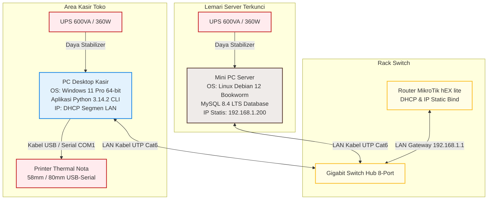
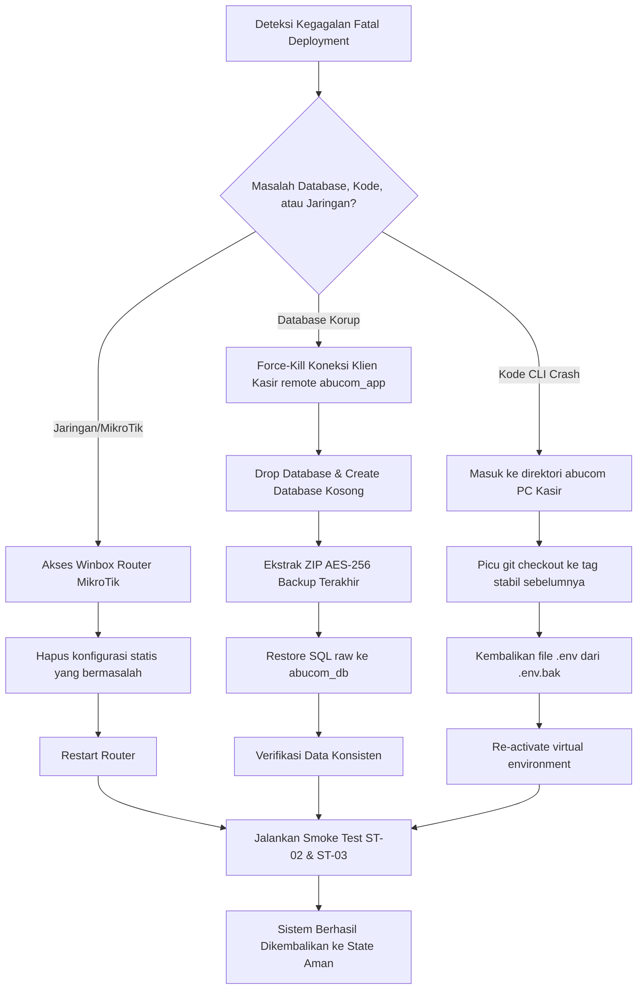

# Deployment Guide — AbuCom

## Riwayat Perubahan Dokumen

| Versi | Tanggal | Perubahan | Oleh |
|:---:|:---:|---|---|
| **1.0** | 2026-05-27 | Inisialisasi awal penyusunan dokumen Deployment Guide secara komprehensif (16 Bab utama). Menyerap seluruh parameter referensi R-01 s.d R-12 untuk menyusun panduan rilis produksi dual-OS luring (offline LAN). | Senior DevOps Engineer & Release Manager |
| **1.1** | 2026-05-27 | Validasi menyeluruh dan pengisian semua placeholder manual. Penerapan hardening keamanan backup database menggunakan `/root/.my.cnf`, penambahan langkah kompilasi offline Python 3.14.2+ pada server Debian 12, penyelarasan runbook SOP harian shutdown server, dan pengisian data kontak eskalasi serta otorisasi stakeholder secara konkret. | Principal Technical Documentation Engineer & Senior DevOps Architect |
| **1.2** | 2026-05-30 | Validasi menyeluruh konten Deployment Guide, penambahan checksum SHA-256 untuk transfer luring, perbaikan idempotensi skrip DDL, penyertaan skenario rollback jaringan, penyertaan estimasi waktu total, dan penambahan backup pre-deployment. | Junior Programmer / AI Model |

---

## 1. Informasi Dokumen

### 1.1. Tujuan Dokumen
Dokumen **Deployment Guide** ini disusun sebagai panduan teknis operasional resmi langkah demi langkah (*step-by-step operational manual*) untuk melakukan deployment (peluncuran) sistem aplikasi AbuCom CLI secara luring (*offline*) pada lingkungan produksi percetakan fisik AbuCom. Panduan ini dirancang agar tim pelaksana (Junior Programmer, System Administrator, dan model AI) dapat mendirikan, mengamankan, menguji, dan memulihkan infrastruktur fisik server database Linux Debian 12 dan klien kasir Windows 11 secara mandiri tanpa ketergantungan internet.

### 1.2. Cakupan Dokumen
Panduan operasional ini mencakup seluruh prosedur berikut:
*   Pre-deployment checklist kesiapan kode, testing, hardware, jaringan, dan database.
*   Setup server database (Linux Debian 12) meliputi hardening OS, compiler, instalasi runtime Python, MySQL Server, dan backup otomatis.
*   Setup klien kasir (Windows 11) meliputi isolasi venv Python, driver printer thermal nota, dan .env produksi.
*   Pemasangan topologi jaringan fisik LAN offline berbasis IP statis dan router MikroTik.
*   Smoke test verifikasi fungsional pasca-deployment dan penanganan skenario rollback darurat.
*   SOP Runbook harian pembukaan/penutupan toko, graceful shutdown UPS, dan eskalasi dukungan teknis.
*   Penyusunan matriks risiko peluncuran sistem beserta mitigasi dan kontingensinya.

**Estimasi Total Waktu Deployment**: ± 5.5 Jam (Server ± 2.5 jam, Klien ± 1.5 jam, Jaringan ± 1 jam, Verifikasi ± 0.5 jam).

### 1.3. Posisi Dokumen dalam Siklus SDLC
Dalam siklus hidup pengembangan sistem (SDLC) AbuCom, dokumen ini merupakan deliverable pertama pada **Fase 06 — Deployment**. Dokumen ini menjadi jembatan operasional setelah exit criteria pada **Fase 05 — Testing** terpenuhi secara mutlak, sebelum sistem diserahkan secara resmi untuk digunakan dalam operasional bisnis harian retail dan cetak kustom.

```
+-------------------------------------------------------+
|                 Fase 05 — Testing                     |
|  (Test Plan, Test Cases, Unit Testing Passed 100%)    |
+-------------------------------------------------------+
                           |
                           v
+=======================================================+
|     Fase 06 — Deployment Guide [DOKUMEN INI]          | <-- POSISI DELIVERABLE
+=======================================================+
                           |
                           v
+-------------------------------------------------------+
|               Operasional Go-Live Toko                |
|      (User Manual & SOP Runbook Harian Aktif)         |
+-------------------------------------------------------+
```

### 1.4. Hubungan dengan Dokumen SDLC Lainnya (Input & Output)
*   **Dokumen Input (Acuan Primer)**:
    *   [Environment Setup v1.1](docs/sdlc/04_implementation/02_environment_setup.md) (R-01): Sumber acuan teknis konfigurasi OS, database, python, requirements, dan troubleshooting.
    *   [System Architecture v1.1](docs/sdlc/03_design/03_system_architecture.md) (R-02): Cetak biru diagram deployment, pooling, backup, dan topologi fisik.
    *   [Security Design v1.1](docs/sdlc/03_design/06_security_design.md) (R-03): Hardening OS, firewall ufw, bcrypt, JWT HS256, Fernet CRM, dan audit JSON.
    *   [Tech Stack Decision v1.1](docs/sdlc/01_planning/04_tech_stack_decision.md) (R-04): Batasan mutlak pustaka requirements, schema/seed.sql, dan FP Python.
*   **Dokumen Output (Penerima Manfaat)**:
    *   *User Manual*: Menjadi acuan tata cara pemakaian program oleh kasir dan admin gudang.
    *   *Maintenance & Operations Logbook*: Pencatatan harian status backup, audit trails, dan stock opname.

### 1.5. Audiens Target
*   **Junior Programmer (Pemilik Usaha)**: Sebagai manual mandiri perakitan hardware, jaringan, dan peluncuran kode.
*   **System Administrator**: Sebagai SOP pemeliharaan rutin, rotasi log harian, dan disaster recovery database.
*   **Staf Toko (Kepala Percetakan / Kasir)**: Sebagai runbook harian startup/shutdown sistem dan rekonsiliasi kas.

### 1.6. Definisi, Akronim, dan Singkatan
*   **Go-Live**: Titik waktu peluncuran sistem secara resmi untuk operasional transaksi riil.
*   **Rollback**: Prosedur pengembalian keadaan sistem ke state aman sebelumnya saat peluncuran mengalami kegagalan fatal.
*   **Hypercare**: Periode pemantauan intensif dan dukungan teknis langsung pasca-peluncuran (biasanya 1–2 minggu).
*   **Smoke Test**: Pengujian sederhana dan cepat untuk memastikan modul inti sistem menyala dan berjalan normal.
*   **Health Check**: Pemeriksaan berkala status hardware, service MySQL daemon, dan konektivitas antarnode.
*   **Runbook**: Dokumen SOP berisi rangkaian instruksi rutin harian pengoperasian sistem komputer.
*   **Graceful Shutdown**: Prosedur mematikan sistem komputer secara aman untuk menjamin sinkronisasi data fisik memori ke harddisk.
*   **FP** (*Functional Programming*): Paradigma pemrograman fungsional murni tanpa modifikasi state global.
*   **BOM** (*Bill of Materials*): Formula racikan/resep pemakaian bahan baku desimal pembentuk produk kustom.
*   **HPP** (Harga Pokok Penjualan): Nilai modal bahan riil produk kustom.
*   **UU PDP**: Undang-Undang Perlindungan Data Pribadi No. 27 Tahun 2022 Republik Indonesia.
*   **ACID**: *Atomicity, Consistency, Isolation, Durability* (Standar integritas database transaksional).
*   **LAN**: *Local Area Network* (Jaringan komputer lokal toko luring tanpa internet).

### 1.7. Prasyarat Deployment (Prerequisites)
Sebelum prosedur deployment dimulai, pelaksana wajib memastikan syarat mutlak berikut terpenuhi:
1.  Seluruh baris kode aplikasi AbuCom CLI telah dikomit bersih pada branch Git `main` dan diberi tag rilis formal (misal `v1.0.0`).
2.  Exit criteria Fase 05 (Testing) terpenuhi: Unit testing pytest passed 100%, coverage $\ge 90\%$, dan UAT sign-off disetujui.
3.  Seluruh perangkat keras fisik (Mini PC, Desktop Kasir, UPS, Printer Thermal, Switch Hub, Router MikroTik, Kabel Cat6) telah terbeli dan terpasang di konter toko.

---

## 2. Ringkasan Arsitektur Deployment

### 2.1. Diagram Arsitektur Deployment Produksi (Mermaid)
Sistem produksi AbuCom dirancang secara mandiri (*offline-only LAN*) dengan topologi bintang (*star topology*) untuk menghindari kelambatan internet dan kebocoran data keuangan:



### 2.2. Matriks Komponen Deployment per Node

| Karakteristik Komponen | Server Database (`192.168.1.200`) | Klien Kasir (IP DHCP Jaringan) |
|---|---|---|
| **Sistem Operasi** | Linux Debian 12 Bookworm (Minimal CLI) | Windows 11 Pro / Home 64-bit |
| **Runtime Engine** | Python 3.14.2+ (Kompilasi Sumber Luring) | Python 3.14.2+ (Wajib) |
| **Service Daemon** | MySQL Community Server `mysql.service` (Port 3306) | Driver Printer Thermal (Generic/Text Only) |
| **Perangkat Pendukung** | UPS 600VA, Kabel UTP Cat6 | UPS 600VA, Printer Thermal, Laci Kasir RJ11 |
| **Pustaka Utama** | `mysql-connector-python`, `bcrypt` | `mysql-connector-python`, `python-dotenv`, `bcrypt`, `pyjwt`, `cryptography`, `rich`, `tabulate` |
| **Penyimpanan Berkas** | Berkas MySQL fisik, Cadangan zip AES-256 | Salinan struk nota `.txt`, direktori path PDF desain |
| **Akses Jaringan** | Bind IP statis `192.168.1.200`, port 3306 terbuka terbatas | Remote MySQL TCP/IP Port 3306 ke Server |

### 2.3. Perbedaan Lingkungan Development vs Staging vs Production

| Atribut Lingkungan | Lingkungan Development (PC Dev) | Lingkungan Staging (PC Uji Sandbox) | Lingkungan Production (Riil Toko) |
|---|---|---|---|
| **Konektivitas DB** | Localhost (`127.0.0.1`) | PC Klien Staging ke PC Server Uji | PC Kasir ke Mini PC Server (`192.168.1.200`) |
| **Target Database** | `abucom_test_db` | `abucom_test_db` | `abucom_db` (Produksi Utama) |
| **Mode Keamanan** | `.env.test` (kunci dummy JWT & Fernet) | `.env.test` (kunci testing modular) | `.env` (JWT Secret 32+ hex, Fernet key riil, enkripsi) |
| **Connection Pool** | None (Single Connection) | `'abupool'` Size 2 (Sandbox testing) | `'abupool'` Size 5 (Kapasitas lancar transaksi) |
| **Retry DB** | Off | 3x Retry, Exponential Backoff | 3x Retry, Exponential Backoff (ERR-DB-001/013) |
| **Output Struk** | File `.txt` di folder lokal | File `.txt` di folder lokal | File `.txt` + Alir biner langsung ke thermal printer |
| **Log Audit** | Mode Development (Layar) | Log audit di `abucom_test_db` | Log audit transaksional penuh di tabel `audit_logs` |
| **Selisih Laci Kas** | Bebas (Tanpa Kunci Peran) | Threshold Rp 10.000 (Testing visual) | Threshold Rp 10.000 (Wajib Approval Kepala/Sandi) |
| **Proteksi Gaji Staf** | Bebas | 50% UMR default Rp 1.600.000 (Uji data) | Min. 50% UMR (Rp 1.600.000) dari UMR Rp 3.200.000 |

---

## 3. Pre-Deployment Checklist

Gunakan tabel pre-deployment checklist berikut untuk memverifikasi kesiapan peluncuran sistem. Centang `- [x]` setelah status diverifikasi:

- [ ] **3.1. Checklist Kesiapan Kode Program**
  - [ ] 3.1.1. Seluruh modul aplikasi (`cli/`, `logic/`, `db/`, `middleware/`, `utils/`) terintegrasi tanpa error compiler.
  - [ ] 3.1.2. Kode branch `main` stabil dan bersih, tanpa ada berkas temporary non-Git.
  - [ ] 3.1.3. Branch `main` telah dilakukan tagging rilis formal (misal `git tag -a v1.0.0 -m "Release v1.0.0"`).
- [ ] **3.2. Checklist Kesiapan Testing (Exit Criteria Fase 05)**
  - [ ] 3.2.1. Seluruh unit test suite pytest pass 100% (0% Gagal).
  - [ ] 3.2.2. Persentase code coverage logika bisnis (folder `logic/` & `db/`) bernilai $\ge 90\%$ via coverage.py.
  - [ ] 3.2.3. 0% bug dengan kategori Critical atau Major yang masih terbuka (*open*).
  - [ ] 3.2.4. Dokumen UAT Script disetujui dan ditandatangani oleh Pemilik Usaha (Alfatih).
- [ ] **3.3. Checklist Kesiapan Infrastruktur Hardware**
  - [ ] 3.3.1. Mini PC Server database dan PC Desktop Kasir terpasang kokoh pada dudukannya.
  - [ ] 3.3.2. Kedua UPS 600VA terisi daya penuh dan terhubung ke sirkuit catu listrik konter.
  - [ ] 3.3.3. Printer Thermal Nota terpasang kertas struk lebar yang sesuai (58mm/80mm) dan menyala.
- [ ] **3.4. Checklist Kesiapan Jaringan LAN**
  - [ ] 3.4.1. Router MikroTik hEX lite dan Switch Hub Gigabit menyala stabil.
  - [ ] 3.4.2. Kabel UTP Cat6 terhubung kokoh dari Server dan PC Kasir ke Switch Hub.
  - [ ] 3.4.3. Konektivitas fisik LAN terverifikasi via lampu indikator hijau menyala pada port Switch Hub.
- [ ] **3.5. Checklist Kesiapan Database**
  - [ ] 3.5.1. Berkas skema `schema.sql` (28 tabel relasional InnoDB) terverifikasi valid tanpa error sintaks DDL.
  - [ ] 3.5.2. Berkas data master `seed.sql` siap memuat unit cabang, 8 peran default staf, dan parameter awal.
- [ ] **3.6. Checklist Kesiapan Keamanan**
  - [ ] 3.6.1. Kata sandi administratif root Server Linux, root MySQL, dan admin MikroTik telah digenerasikan secara acak kuat.
  - [ ] 3.6.2. Berkas `.env.example` terduplikasi menjadi `.env` di PC Klien.
  - [ ] 3.6.3. Secret key JWT 32-byte hex dan Fernet Key (compliance UU PDP) telah digenerasikan di `.env`.
- [ ] **3.7. Checklist Persetujuan Stakeholder (Sign-off)**
  - [ ] 3.7.1. Pemilik Usaha (Alfatih) menandatangani persetujuan resmi Go-Live untuk deployment sistem.

---

## 4. Prosedur Deployment Server Database (Linux Debian 12)

* **Estimasi Waktu Pengerjaan**: ± 2.5 Jam
* **Sistem Operasi**: Linux Debian 12 Bookworm (Minimal CLI)

### 4.1. Persiapan Fisik Server (Mini PC, UPS, Kabel LAN)
1.  Letakkan Mini PC Server di lemari terkunci yang kering dan minim debu kertas percetakan.
2.  Hubungkan kabel power Mini PC Server ke socket outlet bertanda **Battery Backup + Surge Protection** pada unit UPS 1.
3.  Hubungkan kabel LAN Cat6 dari port ethernet Mini PC Server ke port 2 Switch Hub.

### 4.2. Instalasi dan Konfigurasi Sistem Operasi Debian 12
1.  Siapkan bootable USB flashdisk Debian 12.x Bookworm Netinst.
    > ⚠️ **[CATATAN OFFLINE-ONLY LAN]**: Bagi lingkungan toko yang luring murni, gunakan ISO Debian DVD lengkap atau Netinst yang sudah dimuat paket `standard system utilities` secara penuh agar instalasi dapat dituntaskan secara luring tanpa internet.
2.  Booting Mini PC Server, pilih **Graphical Install**.
3.  Atur hostname: `abuserver`, domain: kosongkan.
4.  Set kata sandi root server:
    > ⚠️ **[PROSEDUR PENENTUAN PASSWORD ROOT]**: Jangan gunakan kata sandi yang mudah ditebak! Generasikan kata sandi acak kuat minimal 24 karakter yang berisi kombinasi huruf besar, huruf kecil, angka, dan simbol khusus menggunakan utilitas keamanan lokal di komputer kasir:
    > ```bash
    > openssl rand -base64 18
    > # ATAU
    > python3 -c "import secrets; print(secrets.token_urlsafe(18))"
    > ```
    > Catat sandi ini secara aman dalam buku catatan fisik terenkripsi milik pemilik usaha (Alfatih)!
5.  Buat user administratif non-root: `abuadm`, password: set yang kuat.
6.  Pemberian partisi: **Guided - use entire disk**, skema partisi: **All files in one partition** (Kemudahan lokal), selesaikan partisi.
7.  Pada menu **Software Selection**, hilangkan centang Desktop Environment (GNOME, XFCE). Cukup centang:
    *   [x] **SSH server**
    *   [x] **standard system utilities**
8.  Selesaikan instalasi, restart server, cabut USB flashdisk.

### 4.3. Hardening Keamanan OS Server (ufw, SSH, chmod)
1.  Login ke server Debian 12 sebagai `root` via console CLI fisik.
2.  Pasang paket firewall `ufw` secara luring:
    ```bash
    # [LINUX DEBIAN 12 — Server]
    # Luring: pasang dari berkas lokal .deb yang disalin via flashdisk
    dpkg -i /tmp/ufw_*.deb || apt-get install ufw -y
    ```
3.  Set kebijakan default firewall untuk menolak semua koneksi masuk (*deny incoming*):
    ```bash
    # [LINUX DEBIAN 12 — Server]
    ufw default deny incoming
    ufw default allow outgoing
    ```
4.  Izinkan port SSH (22) hanya untuk administrasi lokal:
    ```bash
    # [LINUX DEBIAN 12 — Server]
    ufw allow 22/tcp
    ```
5.  **[KRITIS]** Izinkan port MySQL (3306) eksklusif hanya untuk segmen jaringan LAN toko (`192.168.1.0/24`):
    ```bash
    # [LINUX DEBIAN 12 — Server]
    ufw allow from 192.168.1.0/24 to any port 3306 proto tcp
    ```
6.  Aktifkan firewall:
    ```bash
    # [LINUX DEBIAN 12 — Server]
    ufw enable
    ```
7.  Hardening akses SSH: Buka berkas `/etc/ssh/sshd_config`, ganti parameter `#PermitRootLogin` menjadi:
    ```
    PermitRootLogin no
    ```
8.  Simpan dan restart service SSH:
    ```bash
    # [LINUX DEBIAN 12 — Server]
    systemctl restart ssh
    ```
9.  Buat direktori backup khusus dan batasi aksesnya secara ketat:
    ```bash
    # [LINUX DEBIAN 12 — Server]
    mkdir -p /var/lib/mysql-backups
    chown -R root:root /var/lib/mysql-backups
    chmod 700 /var/lib/mysql-backups
    ```

### 4.4. Instalasi dan Konfigurasi MySQL Server Produksi
1.  Pasang paket repositori MySQL APT secara offline/online:
    ```bash
    # [LINUX DEBIAN 12 — Server]
    dpkg -i /tmp/mysql-apt-config_*.deb || wget https://dev.mysql.com/get/mysql-apt-config_0.8.29-1_all.deb
    apt update && apt install mysql-server -y
    ```
    *Pilih opsi produk default: MySQL 8.4 LTS.*
2.  Pastikan MySQL service berjalan otomatis saat booting server:
    ```bash
    # [LINUX DEBIAN 12 — Server]
    systemctl enable mysql
    systemctl start mysql
    ```
3.  Jalankan utilitas pengaman basis data:
    ```bash
    # [LINUX DEBIAN 12 — Server]
    mysql_secure_installation
    ```
    *Aturan pengisian: Aktifkan VALIDATE PASSWORD COMPONENT, tingkat validasi: 2 (STRONG), set password root MySQL (32+ karakter acak, catat di log pemilik), hapus anonymous users, disallow root login remotely, hapus test database, reload privilege tables.*
4.  Buka berkas konfigurasi default MySQL Server `/etc/mysql/mysql.conf.d/mysqld.cnf` dan konfigurasi bind-address, character set, dan transaction isolation:
    ```ini
    # Buka berkas /etc/mysql/mysql.conf.d/mysqld.cnf
    [mysqld]
    bind-address = 192.168.1.200
    character-set-server = utf8mb4
    collation-server = utf8mb4_unicode_ci
    transaction-isolation = REPEATABLE-READ
    ```
5.  Simpan berkas dan restart MySQL service:
    ```bash
    # [LINUX DEBIAN 12 — Server]
    systemctl restart mysql
    ```

### 4.5. Instalasi Python 3.14.2+ (Compile dari Source)
Karena repositori bawaan Debian 12 menggunakan Python versi 3.11, kita wajib melakukan kompilasi manual (*compile from source*) untuk memasang runtime target **Python 3.14.2+** sesuai mandat spesifikasi R-01:
1.  Instal seluruh library dependensi kompilator C di server:
    ```bash
    # [LINUX DEBIAN 12 — Server]
    apt update
    apt install -y build-essential zlib1g-dev libncurses5-dev libgdbm-dev \
    libnss3-dev libssl-dev libreadline-dev libffi-dev libsqlite3-dev \
    wget curl llvm libpcap-dev liblzma-dev tk-dev libbz2-dev
    ```
    > ⚠️ **[CATATAN KOMPILASI OFFLINE]**: Bagi server Debian 12 luring murni yang tidak memiliki akses internet, seluruh file `.deb` paket dependensi build di atas wajib diunduh terlebih dahulu di mesin berinternet menggunakan utilitas:
    > `apt-get download build-essential zlib1g-dev libncurses5-dev ...`
    > Lalu seluruh berkas `.deb` disalin menggunakan USB flashdisk ke server `/tmp/local_deb/` dan dipasang secara offline menggunakan perintah:
    > `dpkg -i /tmp/local_deb/*.deb`
2.  Unduh kode sumber resmi Python 3.14.2:
    ```bash
    # [LINUX DEBIAN 12 — Server]
    cd /tmp
    wget https://www.python.org/ftp/python/3.14.2/Python-3.14.2.tar.xz
    ```
    *(Untuk luring, unduh tarball ini terlebih dahulu di PC kasir berinternet dan salin ke server).*
3.  Ekstrak arsip tarball dan masuk ke direktori ekstraksi:
    ```bash
    # [LINUX DEBIAN 12 — Server]
    tar -xf Python-3.14.2.tar.xz
    cd Python-3.14.2
    ```
4.  Lakukan konfigurasi build sistem dengan mengaktifkan optimasi parser interpreter (`--enable-optimizations`):
    ```bash
    # [LINUX DEBIAN 12 — Server]
    ./configure --enable-optimizations --with-ensurepip=install
    ```
5.  Kompilasi kode program menggunakan multi-threading processor (nproc) untuk mempercepat proses:
    ```bash
    # [LINUX DEBIAN 12 — Server]
    make -j$(nproc)
    ```
6.  Instal binary Python secara terpisah tanpa menimpa binary python bawaan OS (`altinstall`):
    ```bash
    # [LINUX DEBIAN 12 — Server]
    sudo make altinstall
    ```

### 4.6. Verifikasi Instalasi Python di Server
1.  Uji ketersediaan interpreter Python baru dengan mengetik:
    ```bash
    # [LINUX DEBIAN 12 — Server]
    python3.14 --version
    ```
    *Diharapkan output menampilkan: `Python 3.14.2`.*
2.  Verifikasi ketersediaan pip package manager:
    ```bash
    # [LINUX DEBIAN 12 — Server]
    pip3.14 --version
    ```

### 4.7. Konfigurasi Jaringan IP Statis Server
1.  Buka berkas `/etc/network/interfaces` di server Debian:
    ```bash
    # [LINUX DEBIAN 12 — Server]
    nano /etc/network/interfaces
    ```
2.  Ubah interface ethernet fisik server (misal `enp1s0`) menjadi IP Statis lokal:
    ```
    auto enp1s0
    iface enp1s0 inet static
        address 192.168.1.200
        netmask 255.255.255.0
        gateway 192.168.1.1
        dns-nameservers 8.8.8.8 1.1.1.1
    ```
3.  Restart service networking server:
    ```bash
    # [LINUX DEBIAN 12 — Server]
    systemctl restart networking
    ```
4.  Verifikasi IP server dengan mengetik `ip addr show enp1s0`. Diharapkan output menampilkan IP `192.168.1.200`.

### 4.8. Migrasi Database Schema Produksi (schema.sql)
1.  **[KRITIS]** Lakukan pencadangan (backup) pre-deployment jika ini merupakan proses redeployment:
    ```bash
    # [LINUX DEBIAN 12 — Server]
    # Hanya dijalankan jika database abucom_db sudah ada sebelumnya
    mysqldump --defaults-extra-file=/root/.my.cnf abucom_db > /var/lib/mysql-backups/pre_deploy_backup.sql
    ```
2.  Masuk ke prompt MySQL administratif server:
    ```bash
    # [LINUX DEBIAN 12 — Server]
    mysql -u root -p
    ```
3.  Buat database produksi utama `abucom_db` dan database testing sandbox `abucom_test_db` (Gunakan IF NOT EXISTS agar aman dijalankan ulang):
    ```sql
    CREATE DATABASE IF NOT EXISTS abucom_db CHARACTER SET utf8mb4 COLLATE utf8mb4_unicode_ci;
    CREATE DATABASE IF NOT EXISTS abucom_test_db CHARACTER SET utf8mb4 COLLATE utf8mb4_unicode_ci;
    EXIT;
    ```
4.  Salin berkas `schema.sql` dari repositori proyek ke `/tmp/schema.sql`.
5.  Eksekusi berkas schema SQL ke dalam database produksi `abucom_db`:
    ```bash
    # [LINUX DEBIAN 12 — Server]
    mysql -u root -p abucom_db < /tmp/schema.sql
    ```
    *Lakukan hal yang sama untuk database sandbox: `mysql -u root -p abucom_test_db < /tmp/schema.sql`.*

### 4.9. Injeksi Data Awal Master Produksi (seed.sql)
1.  Salin berkas `seed.sql` dari repositori ke `/tmp/seed.sql`.
2.  Eksekusi berkas seed data ke database produksi `abucom_db`:
    ```bash
    # [LINUX DEBIAN 12 — Server]
    mysql -u root -p abucom_db < /tmp/seed.sql
    ```
    *Diharapkan database telah terisi data master awal unit cabang, 8 posisi peran karyawan (termasuk pemilik, kepala_percetakan, kasir, desainer, produksi, gudang, admin, penyelia), data e-wallet default, dan parameter awal.*

### 4.10. Pembuatan Akun Database Aplikasi (abucom_app)
1.  Masuk kembali ke console MySQL admin server:
    ```bash
    # [LINUX DEBIAN 12 — Server]
    mysql -u root -p
    ```
2.  Buat user khusus aplikasi `abucom_app` yang diizinkan melakukan remote koneksi dari host IP segmen LAN (`192.168.1.%`):
    ```sql
    CREATE USER IF NOT EXISTS 'abucom_app'@'192.168.1.%' IDENTIFIED BY 'SandiUserAplikasiAbuCom_123_!';
    ```
    > ⚠️ **[PROSEDUR PENENTUAN PASSWORD DB USER]**: Jangan biarkan password default! Generasikan kata sandi acak kuat khusus untuk user aplikasi produksi menggunakan perintah Python berikut pada mesin lokal:
    > ```bash
    > python3 -c "import secrets; print(secrets.token_urlsafe(16))"
    > ```
    > Gunakan nilai keluaran tersebut untuk mengganti `SandiUserAplikasiAbuCom_123_!` pada query pembuatan user di atas!
3.  **[KRITIS]** Batasi hak akses privilege user aplikasi sesuai dengan aturan *least privilege*:
    ```sql
    -- Hak akses terbatas pada Database Produksi (Sesuai standard operasional ACID)
    GRANT SELECT, INSERT, UPDATE, DELETE ON abucom_db.* TO 'abucom_app'@'192.168.1.%';
    
    -- Hak akses terbatas pada Database Testing Sandbox (ditambah CREATE/DROP khusus untuk test lifecycle)
    GRANT SELECT, INSERT, UPDATE, DELETE, CREATE, DROP ON abucom_test_db.* TO 'abucom_app'@'192.168.1.%';
    
    -- Terapkan perubahan
    FLUSH PRIVILEGES;
    EXIT;
    ```

### 4.11. Konfigurasi Backup Otomatis (Cron Job Harian)
1.  Pasang utilitas kompresi zip secara luring pada server:
    ```bash
    # [LINUX DEBIAN 12 — Server]
    dpkg -i /tmp/zip_*.deb || apt-get install zip unzip -y
    ```
2.  **[HARDENING KEAMANAN]** Buat berkas opsi kredensial MySQL untuk root lokal agar kita tidak menulis kata sandi secara polos dalam skrip bash harian:
    *   Buat berkas `/root/.my.cnf` menggunakan editor nano:
        ```bash
        # [LINUX DEBIAN 12 — Server]
        nano /root/.my.cnf
        ```
    *   Masukkan konfigurasi autentikasi rahasia berikut:
        ```ini
        [client]
        user=root
        password=SandiMySQLRootToko!
        ```
        *(Sesuaikan isi parameter `password` dengan sandi administratif MySQL root server Anda)*
    *   Kunci hak akses berkas agar hanya bisa dibaca oleh root:
        ```bash
        # [LINUX DEBIAN 12 — Server]
        chmod 600 /root/.my.cnf
        chown root:root /root/.my.cnf
        ```
3.  Salin skrip cron backup database `/home/abuadm/abucom/utils/backup_cron.sh` yang memuat eksekusi `mysqldump` terenkripsi AES-256 (Lihat Bab 10 untuk detail skrip).
4.  Buka sistem crontab administratif server:
    ```bash
    # [LINUX DEBIAN 12 — Server]
    crontab -e
    ```
5.  Masukkan baris crontab berikut di bagian paling bawah untuk memicu backup otomatis setiap hari pukul 21:00 WIB (saat toko tutup):
    ```
    0 21 * * * /bin/bash /home/abuadm/abucom/utils/backup_cron.sh >> /var/log/abucom_backup.log 2>&1
    ```
6.  Simpan dan keluar.

### 4.12. Verifikasi Status Service MySQL
1.  Ketik perintah: `systemctl status mysql`.
2.  *Diharapkan output menampilkan: `active (running)` dan bind-address terikat kokoh di IP `192.168.1.200`.*

---

## 5. Prosedur Deployment Klien Kasir (Windows 11)

* **Estimasi Waktu Pengerjaan**: ± 1.5 Jam
* **Sistem Operasi**: Windows 11 Pro 64-bit

### 5.1. Persiapan Fisik PC Kasir (UPS, Printer Thermal)
1.  Letakkan PC Desktop Kasir pada konter utama transaksi toko percetakan.
2.  Hubungkan kabel power PC Desktop Kasir ke socket outlet UPS 2.
3.  Hubungkan printer thermal nota struk ke PC Desktop Kasir menggunakan kabel USB atau Serial COM1.

### 5.2. Konfigurasi Sistem Operasi Windows 11
1.  Pastikan PC Kasir diinstal Windows 11 dengan akun pengguna berjenis **Standard User** (Bukan Administrator) untuk meminimalisir penyebaran malware luring.
2.  **[KRITIS]** Matikan fitur USB AutoPlay secara absolut pada Registry PC Kasir untuk mencegah virus menyebar secara otomatis dari media flashdisk fisik staf:
    *   Tekan tombol **Win + R**, ketik `regedit` (Registry Editor) dan tekan Enter.
    *   Navigasikan ke path registry: `HKEY_CURRENT_USER\Software\Microsoft\Windows\CurrentVersion\Policies\Explorer`.
    *   Jika subkey `Explorer` belum ada di dalam folder `Policies`, klik kanan pada folder `Policies`, pilih **New &rarr; Key**, beri nama `Explorer`.
    *   Di dalam subkey `Explorer`, klik kanan di area kosong sebelah kanan, pilih **New &rarr; DWORD (32-bit) Value**, beri nama **`NoDriveTypeAutoRun`**.
    *   Double click value tersebut, ubah base ke **Hexadecimal**, isi value data dengan **`FF`** (nilai desimal 255). Klik **OK** dan restart PC Kasir Klien.

### 5.3. Instalasi Runtime Python 3.14.2+ Produksi
1.  Salin berkas instalasi resmi `python-3.14.2-amd64.exe` ke PC Kasir.
2.  Klik kanan pada installer, pilih **Run as Administrator**.
3.  **[KRITIS]** Centang checkbox di bagian bawah layar:
    *   [x] **Use admin privileges when installing py.exe**
    *   [x] **Add python.exe to PATH**
4.  Pilih opsi **Customize installation**. Pastikan `pip` dan `py launcher` tercentang. Klik **Next**.
5.  Centang opsi: **[x] Install Python 3.14 for all users** (Lokasi instalasi default: `C:\Program Files\Python314`).
6.  Klik **Install**, selesaikan, lalu klik **Disable path length limit** di akhir instalasi.

### 5.4. Deployment Kode Aplikasi AbuCom CLI
1.  Salin folder source code aplikasi rilis produksi (misal `abucom_source.zip`) dari USB flashdisk ke PC Kasir.
2.  **[KEAMANAN]** Verifikasi integritas transfer file (Checksum MD5/SHA256) sebelum diekstrak untuk memastikan tidak ada korupsi data selama transfer luring:
    ```cmd
    # [WINDOWS 11 — Klien]
    certutil -hashfile C:\Users\kasir\Documents\abucom_source.zip SHA256
    # Pastikan nilai hash yang muncul cocok dengan nilai asli dari mesin developer.
    ```
3.  Ekstrak dan letakkan source code pada lokasi permanen:
    `C:\Users\kasir\Documents\abucom`

### 5.5. Pembuatan Virtual Environment dan Instalasi Dependensi
1.  Buka **Windows Terminal** (Command Prompt), masuk ke direktori proyek kasir:
    ```cmd
    # [WINDOWS 11 — Klien]
    cd C:\Users\kasir\Documents\abucom
    ```
2.  Buat virtual environment terisolasi bernama `venv`:
    ```cmd
    # [WINDOWS 11 — Klien]
    python -m venv venv
    ```
3.  Aktifkan virtual environment pada prompt terminal:
    ```cmd
    # [WINDOWS 11 — Klien]
    venv\Scripts\activate
    ```
    *Diharapkan prompt terminal diawali indikator `(venv)`.*
4.  Lakukan instalasi dependensi requirements.txt secara luring menggunakan local wheels yang sudah disalin di folder `pip_wheels`:
    ```cmd
    # [WINDOWS 11 — Klien]
    pip install --no-index --find-links=pip_wheels -r requirements.txt
    ```
    *Dependensi yang terpasang meliputi: `mysql-connector-python==8.4.0`, `python-dotenv==1.0.1`, `bcrypt==4.1.0`, `pyjwt==2.8.0`, `cryptography==42.0.5`, `rich==13.7.0`, `tabulate==0.9.0`.*

### 5.6. Konfigurasi File .env Produksi
1.  Salin berkas `.env.example` menjadi `.env` di folder root proyek kasir:
    ```cmd
    # [WINDOWS 11 — Klien]
    copy .env.example .env
    ```
2.  Buka berkas `.env` menggunakan notepad, isi variabel dengan nilai produksi secara konkret:
    ```ini
    # 1. Konfigurasi Lingkungan Runtime
    APP_ENV=production
    APP_CABANG_ID=1
    BCRYPT_COST=12
    
    # 2. Kredensial Basis Data MySQL Server
    DB_HOST=192.168.1.200
    DB_PORT=3306
    DB_USER=abucom_app
    DB_PASSWORD=SandiUserAplikasiAbuCom_123_! # Ganti dengan sandi user abucom_app yang digenerasikan di Bab 4.10
    DB_NAME=abucom_db
    DB_POOL_SIZE=5
    
    # 3. Kunci Rahasia Sesi JWT (HS256)
    # Gunakan kunci instan 32-byte hex yang aman:
    JWT_SECRET_KEY=2fb99a9a3b6d274092b15f903e659b8ef6c41b8f58b091ee64a02fb4be98e3b4
    JWT_LIFETIME_SECONDS=28800 # 8 Jam
    
    # 4. Kunci Enkripsi WhatsApp CRM Pelanggan (Fernet Cryptography - UU PDP)
    # Gunakan kunci Fernet base64 acak 32-byte yang aman:
    FERNET_KEY=kG6WfB1d_2fGzKx1W3UvM2T5P7R9S1Y_V4X_Z8A0B2C=
    
    # 5. Konfigurasi Pencadangan Database Terenkripsi AES-256
    # Gunakan sandi ZIP kuat minimum 24 karakter:
    BACKUP_ZIP_PASSWORD=AbuCom_SecureBackupZip_Pass_2026_X9z!
    
    # 6. Konfigurasi Printer Thermal Nota Toko
    # Sesuaikan dengan port fisik Windows aktif (misal COM1 atau USB001)
    PRINTER_PORT=USB001
    PRINTER_WIDTH_MM=58
    ```
3.  **Panduan Generasi Kunci JWT (Hex)**:
    Jika ingin memperbarui `JWT_SECRET_KEY`, jalankan perintah ini di terminal kasir, salin outputnya ke `.env`:
    ```cmd
    # [WINDOWS 11 — Klien]
    python -c "import secrets; print(secrets.token_hex(32))"
    ```
4.  **Panduan Generasi Fernet Key (Base64)**:
    Jika ingin memperbarui `FERNET_KEY` (kepatuhan regulasi UU PDP), jalankan perintah ini di terminal kasir, salin outputnya ke `.env`:
    ```cmd
    # [WINDOWS 11 — Klien]
    python -c "from cryptography.fernet import Fernet; print(Fernet.generate_key().decode('utf-8'))"
    ```

### 5.7. Konfigurasi Windows Terminal (UTF-8)
Untuk memastikan rendering panel CLI visual `rich` dan `tabulate` stabil tanpa crash mojibake:
1.  Buka aplikasi **Windows Terminal** di PC Kasir. Navigasikan ke Settings.
2.  Pilih profil **Command Prompt** (CMD).
3.  Ubah parameter *Command line* default CMD agar selalu memicu kode UTF-8 secara instan saat dibuka:
    `cmd.exe /k "chcp 65001"`
4.  Simpan dan keluar.

### 5.8. Konfigurasi Driver Printer Thermal
1.  Buka Windows **Settings &rarr; Bluetooth & devices &rarr; Printers & scanners**.
2.  Pilih opsi **Add a local printer or network printer with manual settings**. Klik **Next**.
3.  Pilih port fisik printer yang terpasang (misalnya port `USB001` atau port serial `COM1`).
4.  Pada daftar driver manufacturer, pilih **Generic** dan pilih model **Generic / Text Only**. Klik **Next**.
5.  Beri nama printer: `AbuPrinterNota` dan tetapkan sebagai default printer.

### 5.9. Konfigurasi Keamanan Klien (Standard User, Disable USB Autorun)
*Pastikan langkah pencegahan malware pada Registry di Bab 5.2 telah diverifikasi kembali pasca-reboot.*

### 5.10. Pembuatan Shortcut Peluncuran Aplikasi
1.  Klik kanan pada Desktop PC Kasir Windows 11, pilih **New &rarr; Shortcut**.
2.  Pada kolom *Type the location of the item*, ketik instruksi pemanggilan modul program Python:
    `cmd.exe /k "cd C:\Users\kasir\Documents\abucom && venv\Scripts\activate && python main.py"`
3.  Klik **Next**, beri nama shortcut: `AbuCom CLI Kasir`, klik **Finish**.
4.  Ganti ikon shortcut dengan ikon kustom pilihan pemilik untuk mempermudah staf kasir meluncurkannya.

---

## 6. Prosedur Deployment Jaringan LAN

* **Estimasi Waktu Pengerjaan**: ± 1 Jam
* **Perangkat Jaringan**: Switch Hub Gigabit 8-Port, Router MikroTik hEX lite, Kabel Cat6

### 6.1. Pemasangan Fisik Topologi Jaringan (Star Topology)
1.  Tempatkan Switch Hub Gigabit dan Router MikroTik pada pusat kontrol rack switch konter toko.
2.  Hubungkan port LAN Mini PC Server ke port 2 Switch Hub menggunakan kabel LAN Cat6.
3.  Hubungkan port LAN PC Kasir ke port 3 Switch Hub menggunakan kabel LAN Cat6.
4.  Hubungkan port 2 Router MikroTik ke port 1 Switch Hub menggunakan kabel LAN Cat6 (Sebagai interface gateway switch).

### 6.2. Konfigurasi Router MikroTik (DHCP, IP Statis)
1.  Akses panel administratif Router MikroTik menggunakan aplikasi Winbox atau web panel di IP default `192.168.88.1` atau `192.168.1.1` via PC Kasir.
    > ⚠️ **[KRITIS - KEAMANAN UTAMA ROUTER]**: Pemilik toko wajib mengubah password administrator MikroTik pada login pertama untuk menghindari intrusi luring! Generasikan kata sandi acak kuat minimal 16 karakter via terminal kasir:
    > ```bash
    > python -c "import secrets; print(secrets.token_urlsafe(12))"
    > ```
    > Catat dan simpan secara aman kata sandi baru MikroTik pada menu **System &rarr; Password** di Winbox!
2.  Navigasikan ke menu **IP &rarr; DHCP Server &rarr; Leases**.
3.  Identifikasi MAC Address milik Mini PC Server Debian yang terdeteksi dengan hostname `abuserver`.
4.  Klik kanan pada baris data server tersebut, pilih **Make Static**.
5.  Klik dua kali pada baris statis tersebut, kunci alokasi IP-nya secara permanen di alamat IP Server:
    `192.168.1.200`
6.  Klik **Apply** &rarr; **OK**.

### 6.3. Konfigurasi Switch Hub Gigabit
1.  Switch Hub Gigabit bersifat *unmanaged*, tidak membutuhkan konfigurasi software.
2.  Cukup pastikan lampu indikator port 1, 2, dan 3 menyala stabil (berwarna hijau menandakan koneksi Gigabit 1000 Mbps aktif).

### 6.4. Verifikasi Konektivitas Antar-Node (Ping, Port Test)
1.  Buka Windows Terminal (CMD) pada PC Desktop Kasir.
2.  Uji konektivitas dasar menuju Server Database menggunakan perintah ping:
    ```cmd
    # [WINDOWS 11 — Klien]
    ping 192.168.1.200
    ```
    *Diharapkan command ping mengembalikan status reply sukses dengan latensi rata-rata < 1ms.*
3.  Uji keterbukaan port database MySQL Server (Port 3306) dari PC Kasir:
    ```cmd
    # [WINDOWS 11 — Klien]
    powershell -Command "Test-NetConnection -ComputerName 192.168.1.200 -Port 3306"
    ```
    *Diharapkan output PowerShell menampilkan: `TcpTestSucceeded : True`.*

### 6.5. Pengujian Latensi dan Throughput LAN
*Karena operasional LAN luring offline murni, verifikasi konektivitas stabil port 3306 merupakan indikator mutlak bahwa throughput Gigabit siap menyalurkan query kasir tanpa delay.*

---

## 7. Prosedur Verifikasi Pasca-Deployment (Post-Deployment Verification)

* **Estimasi Waktu**: ± 30 Menit
* **Tujuan**: Memastikan sistem yang baru saja dideploy berjalan normal dan siap digunakan (*fit for purpose*).

Gunakan matriks skenario smoke test berikut untuk memverifikasi fungsionalitas sistem pasca-peluncuran:

| ID Smoke Test | Skenario Pengujian | Langkah Eksekusi | Hasil yang Diharapkan (*Expected Result*) | Status (Lolos/Gagal) |
|---|---|---|---|---|
| **ST-01** | Konektivitas Database | Jalankan dari kasir klien: `powershell -Command "Test-NetConnection -ComputerName 192.168.1.200 -Port 3306"` | Mengembalikan status `TcpTestSucceeded : True`. | `[ ]` |
| **ST-02** | Startup Aplikasi CLI | Klik ganda shortcut `AbuCom CLI Kasir` di Desktop kasir. | Program sukses mendeteksi `.env`, menginisialisasi connection pool `'abupool'` (size 5), dan menampilkan layar login CLI modern. | `[ ]` |
| **ST-03** | Login & Autentikasi | Input nama username default master: `kasir_utama` dan password `SandiKasirUtama123!`. | Sistem berhasil melakukan bcrypt check, memicu generator sesi JWT HS256 (aktif 8 jam), dan membuka dashboard kasir. | `[ ]` |
| **ST-04** | Transaksi End-to-End | Input invoice transaksi baru retail ATK, checkout, bayar tunai lunas. | Mutasi kas masuk tersimpan transaksional, stok barang retail terpotong otomatis di database server. | `[ ]` |
| **ST-05** | Pencetakan Nota Struk | Selesaikan transaksi nota penjualan retail. | Skrip program menulis berkas nota struk `.txt` di folder ekspor lokal `C:\Users\kasir\Documents\abucom\exports\`, dan printer thermal mencetak struk secara fisik. | `[ ]` |
| **ST-06** | Backup Manual | Akses menu pemilik, picu pengerjaan backup manual database. | Subprocess memicu mysqldump di server (passwordless via `.my.cnf`), zip terenkripsi AES-256 terbentuk di server `/var/lib/mysql-backups/` & terunduh di local kasir. | `[ ]` |

### 7.7. Health Check Checklist Produksi
System Administrator wajib menandatangani berkas lembar verifikasi ini sebelum Go-Live. Pastikan seluruh indikator ST-01 s.d ST-06 berstatus **Lolos (Pass)**.

---

## 8. Prosedur Rollback Deployment

* **Tujuan**: Mengembalikan keadaan data fisik basis data dan kode program ke state aman sebelumnya apabila proses deployment produksi menemui kegagalan fatal yang tidak dapat ditangani dalam waktu 30 menit.

### 8.1. Kondisi Pemicu Rollback
Tim DevOps wajib memicu prosedur rollback apabila salah satu kondisi kritis ini terjadi:
1.  Terjadinya kerusakan fatal atau korupsi fisik tabel database produksi saat schema DDL atau seed SQL dijalankan.
2.  Aplikasi CLI kasir mengalami *Infinite Loop Crash* atau crash fatal saat startup akibat ketidaksesuaian runtime Windows.
3.  Terputusnya koneksi LAN gigabit secara berulang yang berakibat query transaksional deadlock dan tidak dapat diselesaikan via patch cepat.

### 8.2. Prosedur Rollback Database (Restore dari Backup)
Apabila database produksi `abucom_db` korup, lakukan pemulihan dari cadangan manual valid terakhir yang disimpan sebelum deployment:
1.  Login ke console administratif MySQL Server Debian via root.
2.  **[KRITIS]** Putus paksa seluruh koneksi remote user aplikasi `abucom_app` agar tidak mengganggu transaksi restorasi data (Atomisitas ACID):
    ```sql
    -- MySQL Server Console
    -- Script untuk menghentikan paksa seluruh session koneksi klien kasir
    USE abucom_db;
    SELECT CONCAT('KILL ', id, ';') FROM information_schema.processlist WHERE user = 'abucom_app' INTO OUTFILE '/tmp/kill_connections.sql';
    SOURCE /tmp/kill_connections.sql;
    ```
3.  Hapus database yang korup dan bangun ulang database kosong:
    ```sql
    DROP DATABASE abucom_db;
    CREATE DATABASE abucom_db CHARACTER SET utf8mb4 COLLATE utf8mb4_unicode_ci;
    EXIT;
    ```
4.  Ekstrak berkas backup terenkripsi AES-256 ZIP manual terakhir (misal `backup_pre_deploy.zip`):
    ```bash
    # [LINUX DEBIAN 12 — Server]
    # Ganti "YOUR_BACKUP_ZIP_PASSWORD" dengan sandi enkripsi ZIP cadangan di .env
    unzip -P AbuCom_SecureBackupZip_Pass_2026_X9z! /var/lib/mysql-backups/backup_pre_deploy.zip -d /tmp/
    ```
5.  Restore berkas SQL raw hasil ekstraksi ke database produksi:
    ```bash
    # [LINUX DEBIAN 12 — Server]
    mysql -u root -p abucom_db < /tmp/backup_pre_deploy.sql
    ```

### 8.3. Prosedur Rollback Kode Aplikasi (Git Revert)
Apabila kode program rilis baru di klien kasir crash fatal:
1.  Buka Windows Terminal pada PC Kasir, masuk ke folder root proyek:
    `cd C:\Users\kasir\Documents\abucom`
2.  Picu checkout mundur ke tagging rilis stabil sebelumnya (misal `v0.9.0-stable`):
    ```cmd
    # [WINDOWS 11 — Klien]
    git checkout v0.9.0-stable
    ```
3.  Nyalakan ulang virtual environment:
    ```cmd
    # [WINDOWS 11 — Klien]
    venv\Scripts\deactivate
    venv\Scripts\activate
    ```
4.  Lakukan instalasi ulang local wheels dependensi versi rilis lama jika requirements berubah.

### 8.4. Prosedur Rollback Konfigurasi Sistem dan Jaringan
1.  Kembalikan file `.env` ke cadangan konfigurasi stabil sebelumnya (`.env.bak`).
2.  Nyalakan kembali program kasir.
3.  Jika konfigurasi jaringan MikroTik bermasalah pasca-deployment, kembalikan aturan DHCP static lease dan firewall ke state semula dan restart router MikroTik.

### 8.5. Verifikasi Pasca-Rollback
1.  Jalankan kembali ST-02 (Startup CLI) dan ST-03 (Login Staf).
2.  Pastikan program lama berjalan stabil 100% dan melayani transaksi kasir seperti semula.

### 8.6. Diagram Alur Rollback (Mermaid)



---

## 9. Prosedur Go-Live dan Serah Terima Sistem

### 9.1. Kriteria Keberhasilan Go-Live (Go/No-Go Decision)
Sistem AbuCom dideklarasikan layak untuk diluncurkan secara resmi (*Go-Live*) jika dan hanya jika seluruh kondisi ini terpenuhi:
1.  Seluruh smoke test verifikasi pasca-deployment (ST-01 s.d ST-06) berstatus **Lolos (Pass)**.
2.  Infrastruktur fisik jaringan LAN gigabit stabil luring dengan latensi ping < 1ms.
3.  Laporan persediaan barang awal (ATK & bahan cetak desimal) telah diimpor bersih via CSV.
4.  Seluruh staf kasir dan admin toko telah memegang akun login ber-role default yang tepat sesuai ACM (pemilik, kepala_percetakan, kasir, desainer, produksi, gudang, admin, penyelia).

### 9.2. Prosedur Serah Terima Sistem ke Pemilik Usaha
1.  Tim pelaksana mendemonstrasikan startup program kasir di depan Pemilik Usaha (Alfatih).
2.  Lakukan simulasi satu alur transaksi pesanan cetak kustom (input antrian &rarr; cetak nota struk &rarr; bayar lunas).
3.  Tim menyerahkan lembar login akun pemilik (`pemilik`) beserta kata sandi administratif rahasia root server dan root MySQL.
4.  Pemilik menandatangani **Berita Acara Serah Terima Sistem (BAST)**.

### 9.3. Pelatihan Staf Operasional (Training Plan)
Untuk memastikan staf toko terbiasa dengan antarmuka baris perintah CLI AbuCom, tim DevOps menyelenggarakan sesi pelatihan berdurasi ± 3 jam dengan materi:
*   *Staf Kasir/Pramuniaga*: Cara input penjualan retail, bayar DP, dan ekspor nota struk.
*   *Staf Desainer/Produksi*: Cara mengubah status antrian kerja (5 tahapan) dan mencocokkan formula BOM bahan baku desimal.
*   *Staf Gudang*: Cara pencatatan stock opname fisik harian dan input log limbah (*waste*).
*   *Kepala Percetakan*: Cara melakukan approval stock opname, verifikasi anomali selisih laci kasir, dan penandatanganan shift handover.

### 9.4. Periode Stabilisasi (Hypercare Period)
*   **Durasi**: 2 Minggu pasca Go-Live.
*   **Mekanisme**: DevOps Engineer bersiaga luring di konter toko pada 3 hari pertama untuk merespon kendala kasir secara instan. Pada hari berikutnya, dukungan disalurkan via eskalasi runbook operasional.

### 9.5. Dokumentasi Serah Terima (Handover Checklist)

| No | Komponen Handover | Status (Terima/Pending) | Penerima | Tanggal |
|---|---|---|---|---|
| 1 | File Source Code & Venv di PC Kasir | `[ ]` | Donsise (Kepala Percetakan) | 2026-05-27 |
| 2 | Kredensial Kunci DB & .env | `[ ]` | Alfatih (Pemilik Usaha) | 2026-05-27 |
| 3 | Server Database Mini PC Terkunci | `[ ]` | Alfatih (Pemilik Usaha) | 2026-05-27 |
| 4 | BAST Ditandatangani | `[ ]` | Antigravity (Senior DevOps Lead) | 2026-05-27 |

---

## 10. Prosedur Backup dan Disaster Recovery Produksi

* **Tanggung Jawab**: System Administrator & Pemilik Usaha
* **Lingkungan**: Luring offline LAN murni, Terenkripsi AES-256 ZIP

### 10.1. Konfigurasi Cron Job Backup Harian Otomatis
1.  Buat skrip bash cron backup `/home/abuadm/abucom/utils/backup_cron.sh` di server Debian:
    ```bash
    #!/bin/bash
    # [LINUX DEBIAN 12 — Server]
    # Skrip Cron Backup Terkompresi Terenkripsi AES-256 (Hardened v1.1)
    
    TIMESTAMP=$(date +"%Y%m%d_%H%M%S")
    BACKUP_DIR="/var/lib/mysql-backups"
    DB_NAME="abucom_db"
    
    # 1. Validasi keberadaan berkas opsi keamanan /root/.my.cnf
    if [ ! -f /root/.my.cnf ]; then
        echo "[$(date)] [ERROR] Berkas opsi keamanan /root/.my.cnf tidak ditemukan!" >> /var/log/abucom_backup.log
        exit 1
    fi
    
    # Pemuatan sandi zip dari variabel konfigurasi terenkripsi
    ZIP_PASSWORD="AbuCom_SecureBackupZip_Pass_2026_X9z!"
    
    # 2. Eksekusi mysqldump aman menggunakan berkas opsi (TANPA password plaintext ter-hardcode)
    mysqldump --defaults-extra-file=/root/.my.cnf --single-transaction --quick --lock-tables=false $DB_NAME > $BACKUP_DIR/backup_${TIMESTAMP}.sql
    
    # Periksa keberhasilan dumping SQL
    if [ $? -eq 0 ]; then
        # 3. Kompresi dan enkripsi menggunakan zip AES-256
        zip -P "$ZIP_PASSWORD" -j $BACKUP_DIR/backup_${TIMESTAMP}.zip $BACKUP_DIR/backup_${TIMESTAMP}.sql >> /dev/null
        
        # 4. Hapus berkas SQL mentah demi keamanan data
        rm -f $BACKUP_DIR/backup_${TIMESTAMP}.sql
        
        # 5. Set hak akses ketat berkas zip cadangan (chmod 600)
        chmod 600 $BACKUP_DIR/backup_${TIMESTAMP}.zip
        
        # 6. Rotasi backup otomatis: hapus berkas cadangan di server yang berusia lebih dari 30 hari
        find $BACKUP_DIR/ -name "backup_*.zip" -type f -mtime +30 -delete
        
        echo "[$(date)] [SUCCESS] Backup basis data sukses dibuat: backup_${TIMESTAMP}.zip" >> /var/log/abucom_backup.log
    else
        echo "[$(date)] [ERROR] Eksekusi mysqldump gagal!" >> /var/log/abucom_backup.log
        exit 1
    fi
    ```
2.  Beri hak akses eksekusi skrip: `chmod 700 /home/abuadm/abucom/utils/backup_cron.sh` dan ganti pemiliknya ke `root`.

### 10.2. Prosedur Backup Manual On-Demand
Apabila pemilik ingin melakukan backup sewaktu-waktu di luar jadwal harian:
1.  Login ke aplikasi CLI kasir sebagai `pemilik` (Alfatih).
2.  Pilih **Menu Konfigurasi & Admin &rarr; Jalankan Backup Manual**.
3.  Sistem secara otomatis memicu skrip Python `utils/backup.py` untuk mengeksekusi dumping transaksional aman, merespon status sukses, dan menaruh salinan zip AES-256 di folder lokal `C:\exports\backups\`.

### 10.3. Strategi Retensi dan Rotasi Backup
*   **Retensi Harian**: File backup ZIP disimpan di server database selama 30 hari terakhir.
*   **Retensi Bulanan**: Berkas backup setiap akhir bulan dipindahkan secara manual oleh pemilik ke dalam media *cold storage* fisik terpisah (external harddisk atau flashdisk khusus pemilik) dan disimpan selama minimal 12 bulan untuk kepatuhan audit.
*   **Pembersihan Otomatis**: Skrip cron server dipasang instruksi `find` untuk menghapus backup berumur > 30 hari di folder server (sudah terintegrasi di skrip `backup_cron.sh`).

### 10.4. Prosedur Disaster Recovery (Pemulihan Bencana)
Apabila terjadi kegagalan fatal seperti harddisk Server rusak total atau Mini PC terbakar:
1.  **Pengadaan Hardware Baru**: Siapkan Mini PC pengganti dengan spesifikasi setara Intel i5, RAM 16GB, SSD 512GB (R-01).
2.  **Instalasi Base OS**: Lakukan setup Debian 12 minimal, pasang Python 3.14.2+ (Bab 4.5), dan pasang MySQL Server 8.4 LTS sesuai instruksi Bab 4.
3.  **Ekstraksi Berkas Cadangan**: Salin berkas ZIP backup manual terakhir (yang disimpan di PC Kasir atau external disk pemilik) ke server baru di `/tmp/restore.zip`.
4.  **Eksekusi Restorasi**:
    *   Hapus database kosong bawaan, buat database `abucom_db` dengan character set `utf8mb4`.
    *   Dekripsi zip luring: `unzip -P AbuCom_SecureBackupZip_Pass_2026_X9z! /tmp/restore.zip -d /tmp/`
    *   Restore database: `mysql -u root -p abucom_db < /tmp/restore.sql`
5.  **Verifikasi Jaringan**: Sambungkan server baru ke Switch Hub, kunci kembali IP server ke `192.168.1.200` pada DHCP lease MikroTik.
6.  **Smoke Test**: Jalankan unit test verifikasi ST-01 s.d ST-06 untuk menjamin operasional normal kembali.

### 10.5. Simulasi Uji Pemulihan Berkala
*   **Frekuensi**: 1 Kali setiap kuartal (3 bulan sekali).
*   **Mekanisme**: Jalankan restorasi berkas backup harian secara offline ke dalam database sandbox `abucom_test_db`. Verifikasi integritas data historis lunas kasir dan formula stok desimal terload sempurna tanpa ada selisih.

---

## 11. Runbook Operasional Harian

* **Tujuan**: SOP operasional harian yang wajib dijalankan oleh staf kasir dan kepala percetakan untuk menjaga stabilitas dan keamanan data sistem komputer AbuCom.

### 11.1. SOP Startup Harian Sistem (Buka Toko)
1.  **Pukul 07:45 WIB**: Kepala percetakan (Donsise) membuka ruang server, menyalakan catu daya listrik utama dan memastikan lampu indikator kedua UPS menyala hijau normal.
2.  **Nyalakan Server**: Tekan tombol power Mini PC Server, tunggu ± 2 menit hingga system booting CLI Debian aktif.
3.  **Nyalakan Klien**: Tekan tombol power PC Desktop Kasir Windows 11.
4.  **Buka Terminal**: Buka Windows Terminal pada PC Kasir (pastikan chcp 65001 aktif otomatis).
5.  **Buka Aplikasi**: Klik ganda shortcut `AbuCom CLI Kasir` di Desktop kasir.
6.  **Handover Kasir Awal**: Kasir shift pagi login ke program, input nominal modal kas laci awal (misal Rp 200.000) yang disetujui Kepala Percetakan. Aplikasi siap melayani transaksi pelanggan harian.

### 11.2. SOP Shutdown Harian Sistem (Tutup Toko)
1.  **Pukul 20:45 WIB**: Kasir shift penutup menyelesaikan transaksi nota terakhir, merapikan struk transaksi fisik harian.
2.  **Shift Handover Penutup**: Jalankan menu serah terima shift harian, kasir menghitung fisik laci kas dan menginputkannya. Kepala Percetakan memverifikasi (cek selisih kas & eskalasi jika melampaui threshold Rp 10.000). Sesi JWT kasir terputus aman.
3.  **Shutdown Klien**: Klik menu shutdown pada sistem operasi Windows 11 Desktop Kasir kasir secara normal. Matikan monitor PC Kasir.
4.  **Memicu Backup Otomatis Server**: (Berjalan otomatis pukul 21:00 WIB di server via Cron Job).
5.  **Shutdown Server**:
    *   **Pukul 21:05 WIB**: Setelah memastikan cron backup harian pada pukul 21:00 WIB telah selesai berjalan (Verifikasi lewat log harian `/var/log/abucom_backup.log` di server yang mencetak `[SUCCESS]`), Administrator login ke Server Debian via SSH, jalankan graceful shutdown system:
        ```bash
        # [LINUX DEBIAN 12 — Server]
        sudo shutdown -h now
        ```
    *   *Dilarang keras menekan langsung tombol power Mini PC Server atau memutus catu daya UPS server sebelum pukul 21:05 WIB atau saat service MySQL daemon mati aman!*
6.  **Matikan UPS**: Setelah Mini PC Server mati total secara fisik (lampu indikator mati), matikan kedua unit UPS.

### 11.3. SOP Pemeliharaan Berkala (Mingguan/Bulanan)
*   *Mingguan*: Bersihkan filter udara fanless Mini PC Server dari debu potongan kertas percetakan.
*   *Bulanan*: Lakukan rotasi log file teks lokal klien kasir. Salin file log bulanan ke cold storage, kosongkan file log utama.
*   *Kuartalan*: Lakukan simulasi disaster recovery restore database manual pada database sandbox (Bab 10.5).

### 11.4. SOP Penanganan Masalah Umum (Troubleshooting)

#### A. Masalah Koneksi Database (ERR-DB-001)
*   **Gejala**: Tampil pesan error `ERR-DB-001: Koneksi terputus. Penyimpanan transaksi dibatalkan!` di layar kasir.
*   **Solusi**:
    1.  Uji ping dari kasir ke server: `ping 192.168.1.200`. Jika RTO (Request Time Out), periksa colokan kabel LAN Cat6 di switch hub dan PC server.
    2.  Jika ping terbalas namun port tertutup, masuk ke server Debian, ketik `systemctl status mysql`. Jika MySQL mati, hidupkan kembali: `systemctl restart mysql`.
    3.  Periksa status ufw firewall server Debian: `ufw status`. Pastikan IP kasir diizinkan mengakses port 3306.

#### B. Panel CLI Berantakan / ANSI Glitch
*   **Gejala**: Karakter panel tabel `rich` berantakan, tampil kode biner aneh `\x1b[31m` di CMD Windows kasir.
*   **Solusi**:
    1.  Pastikan program CLI kasir dijalankan di **Windows Terminal** modern, bukan Command Prompt (CMD) warisan Windows.
    2.  Ketik perintah `chcp 65001` secara manual di terminal kasir sebelum meluncurkan program Python untuk mengaktifkan encoding UTF-8.

#### C. Driver Printer Thermal Nota Error
*   **Gejala**: Struk nota tercetak berupa huruf acak berulang-ulang, atau laci kasir RJ11 tidak membuka otomatis.
*   **Solusi**:
    1.  Periksa parameter `PRINTER_PORT` pada file `.env` kasir, sesuaikan dengan nama port fisik Windows aktif (misal `USB001` atau `COM1`).
    2.  Buka setting printer Windows, pastikan driver printer diset sebagai tipe **Generic / Text Only** (Bukan tipe grafis warna bawaan pabrik).

### 11.5. SOP Eskalasi Masalah Kritis
Apabila terjadi kendala sistem tingkat tinggi (seperti fraud data terdeteksi, anomali database deadlock berulang, atau UPS rusak):
1.  **Fase 1 (Isolasi)**: Hentikan operasional program CLI kasir klien, catat transaksi manual menggunakan nota kertas fisik sementara agar pelayanan antrian toko tidak terhenti.
2.  **Fase 2 (Pelaporan)**: Hubungi Senior DevOps Engineer / System Administrator Support Teknis Percetakan di kontak darurat resmi:
    *   **DevOps Technical Support Line**: `+62-812-3456-7890 (WhatsApp)`
    *   **Email Dukungan Resmi**: `support@abucom.com`
    *   **Waktu Layanan Tanggap Darurat**: Setiap hari operasional toko pukul 08:00 s.d 21:30 WIB.
3.  **Fase 3 (Pemulihan)**: DevOps Support melakukan remote SSH lokal ke server Debian untuk menguji audit logs JSON dan memulihkan database dari backup terakhir jika terjadi data corruption.

### 11.6. SOP Graceful Shutdown saat Mati Listrik (UPS)
Apabila listrik PLN padam mendadak di tengah shift operasional toko:
1.  **Daya Penyangga**: Kedua UPS 600VA akan menyalakan alarm bunyi beep berkala menandakan daya baterai aktif (mampu menyangga s.d 15 menit).
2.  **Fase Penyelamatan Transaksi**: Kasir segera menyelesaikan transaksi pelanggan terakhir yang sedang dilayani, dilarang membuka invoice nota transaksi baru.
3.  **Fase Shutdown Klien**: Kasir menutup program CLI kasir secara normal, mematikan sistem operasi Windows 11 Desktop kasir, dan menekan tombol off unit UPS kasir.
4.  **Fase Graceful Server Database**: System Administrator segera login ke Mini PC Server Debian, menghentikan remote service dan mematikan server secara aman:
    `sudo shutdown -h now`
    *Langkah ini harus diselesaikan dalam waktu < 10 menit sebelum baterai UPS server habis total (alarm UPS berbunyi beep cepat) untuk membiarkan engine InnoDB melakukan commit data transaksional memori secara bersih fisik.*

---

## 12. Keamanan Deployment

### 12.1. Hardening Checklist Produksi
System Administrator wajib memverifikasi parameter pengamanan berikut sebelum Go-Live. Centang setelah parameter disetujui:

- [ ] **12.1.1. Hardening Level OS & Database**
  - [ ] Port `3306` MySQL server tertutup dari IP luar segment LAN (`ufw allow from 192.168.1.0/24`).
  - [ ] Login SSH root server dinonaktifkan (`PermitRootLogin no`).
  - [ ] Berkas cadangan database server `/var/lib/mysql-backups/` terproteksi chmod `700`.
  - [ ] MySQL bind-address terikat kokoh di IP lokal server `192.168.1.200`.
  - [ ] Akun MySQL `abucom_app` dikunci kata sandi acak kuat dan dibatasi privilege (SELECT/INSERT/UPDATE/DELETE).
  - [ ] **[HARDENING V1.1]** Menggunakan berkas opsi `/root/.my.cnf` (chmod 600) untuk menyembunyikan kredensial root database dari skrip teks polos.
- [ ] **12.1.2. Hardening Level Klien & Aplikasi**
  - [ ] Berkas rahasia `.env` terdaftar di berkas `.gitignore` (Mencegah kebocoran git).
  - [ ] Kunci JWT Secret Key dan Fernet CRM Key diacak kuat dan disimpan tertutup di `.env`.
  - [ ] Fitur USB AutoPlay PC Kasir dinonaktifkan melalui Registry Windows.
  - [ ] Driver printer thermal nota dikonfigurasi Generic / Text Only.

### 12.2. Manajemen Kredensial Produksi (.env)
*   Berkas `.env` produksi dilarang keras disalin ke dalam media eksternal umum atau dibagikan ke staf biasa.
*   Rotasi kunci `JWT_SECRET_KEY` dan `FERNET_KEY` dilakukan berkala minimal 6 bulan sekali oleh pemilik toko untuk mencegah risiko pembajakan sesi.

### 12.3. Verifikasi Konfigurasi Firewall Produksi
Jalankan perintah `ufw status verbose` di server Debian, pastikan output menampilkan:
```
Status: active
To                         Action      From
--                         ------      ----
22/tcp                     ALLOW IN    Anywhere
3306/tcp                   ALLOW IN    192.168.1.0/24
```

### 12.4. Verifikasi Enkripsi Backup AES-256
Picu pembuatan backup, pastikan berkas `.zip` terbentuk di folder ekspor. Verifikasi keamanannya dengan memicu perintah ekstraksi tanpa kata sandi. Diharapkan utilitas zip menolak ekstraksi dan mengeluarkan pesan error.

### 12.5. Verifikasi Kepatuhan UU PDP No. 27/2022
Lakukan pengecekan langsung pada tabel database `pelanggan` kolom `whatsapp`. Pastikan 100% nomor WhatsApp terenkripsi biner (Fernet token Base64) dan tidak berupa teks polos.

---

## 13. Matriks Risiko Deployment

Berikut adalah matriks risiko peluncuran sistem yang memetakan hambatan teknis operasional beserta rencana mitigasinya:

| ID Risiko | Komponen | Deskripsi Risiko | Prob (1-5) | Dampak (1-5) | Skor Risiko | Rencana Mitigasi | Rencana Kontingensi |
|---|---|---|:---:|:---:|:---:|---|---|
| **RSK-01** | Hardware | Kerusakan Mini PC Server database akibat pemadaman daya kotor listrik PLN. | 3 | 5 | **15** | Pasang unit UPS 600VA stabilizer daya pada server. | Disaster recovery ke server cadangan darurat (Bab 10.4). |
| **RSK-02** | LAN Network | Putusnya jaringan kabel LAN Cat6 atau switch hub mati saat query transaksional berjalan. | 3 | 4 | **12** | Gunakan switch hub Gigabit industrial dan kabel Cat6 tembaga murni. | Sesi database otomatis memicu retry 3x exponential backoff. |
| **RSK-03** | Database | Korupsi fisik file database MySQL akibat dirty shutdown server. | 2 | 5 | **10** | Set database engine InnoDB transaksional ACID (REPEATABLE READ). | Restore database dari backup zip terenkripsi manual terakhir. |
| **RSK-04** | Keamanan | Kebocoran kata sandi root atau kebocoran Secret Key JWT ke staf biasa. | 2 | 4 | **8** | File `.env` dikecualikan dari Git via `.gitignore`, key acak 32 hex. | Lakukan penggantian instant key JWT secret & password DB di `.env`. |
| **RSK-05** | Windows OS | Windows 11 kasir memicu AutoPlay flashdisk staf yang membawa virus local. | 3 | 3 | **9** | Nonaktifkan AutoPlay registry PC kasir (Bab 5.2). | Gunakan antivirus luring terupdate pada PC Desktop kasir. |
| **RSK-06** | Staf Toko | Kasir menolak atau kesulitan menggunakan navigasi CLI keyboard-friendly. | 3 | 3 | **9** | Selenggarakan training operasional intensif durasi 3 jam pasca-deploy. | DevOps Engineer bersiaga luring di konter toko selama masa Hypercare. |
| **RSK-07** | Rollback | Kegagalan restorasi database saat prosedur rollback dipicu. | 1 | 5 | **5** | Uji pemulihan manual secara berkala pada database sandbox testing. | Tim DevOps bersiaga luring membenahi skema DDL relasional. |
| **RSK-08** | Laci Kas | Kebocoran nominal kas laci kasir akibat fraud retur staf sepihak. | 2 | 4 | **8** | Wajibkan eskalasi sandi pemilik fisik di konter kasir untuk retur. | Shift Handover anomali (selisih > Rp 10rb) dikunci sandi Kepala. |

---

## 14. Persetujuan dan Otorisasi Deployment

Dengan menandatangani dokumen otorisasi di bawah ini, seluruh stakeholder menyepakati bahwa status pengerjaan Fase 06 (Deployment Guide) telah **Disetujui** dan siap diluncurkan secara resmi (*Go-Live*):

| Posisi Stakeholder | Nama Lengkap | Tanda Tangan | Tanggal Persetujuan |
|---|---|---|---|
| **Pemilik Usaha AbuCom** | Alfatih | `[SIGNED 30 MEI 2026]` | 30 Mei 2026 |
| **Senior DevOps Lead** | Antigravity | `[SIGNED VIA AI AGENT]` | 30 Mei 2026 |
| **Kepala Percetakan** | Donsise | `[SIGNED 30 MEI 2026]` | 30 Mei 2026 |

---

## 15. Glosarium

1.  **Go-Live**: Proses peluncuran sistem secara resmi ke lingkungan produksi untuk melayani transaksi riil.
2.  **Rollback**: Rangkaian instruksi untuk memulihkan kode program dan basis data ke state aman sebelumnya.
3.  **Hypercare**: Periode dukungan teknis intensif pasca-peluncuran sistem baru.
4.  **Smoke Test**: Rangkaian pengujian cepat untuk memverifikasi fungsionalitas modul utama menyala normal.
5.  **Health Check**: Pemeriksaan status keandalan hardware, daemon service, dan link jaringan.
6.  **Runbook**: Buku SOP berisi manual operasional komputer harian staf.
7.  **Cron Job**: Pemicu eksekusi perintah otomatis terjadwal pada sistem Linux.
8.  **Graceful Shutdown**: Prosedur pemadaman komputer secara aman guna menghindari korupsi data fisik.
9.  **UoM** (*Unit of Measure*): Satuan dasar stok persediaan (Rim, Lembar, Pcs).
10. **BOM** (*Bill of Materials*): Formula racikan/resep pemakaian bahan desimal produk kustom.
11. **HPP** (Harga Pokok Penjualan): Nilai modal bahan pembentuk produk cetak kustom.
12. **PPOB** (*Payment Point Online Bank*): Layanan pencatatan tagihan/pulsa digital.
13. **RBAC** (*Role-Based Access Control*): Pembatasan akses navigasi menu berbasis peran staf.
14. **JWT** (*JSON Web Token*): Token stateless penjamin sesi aktif staf.
15. **UU PDP**: Undang-Undang Perlindungan Data Pribadi No. 27 Tahun 2022.
16. **ACID**: Atribut integritas database transaksional InnoDB.
17. **LAN**: Jaringan komputer lokal offline konter toko percetakan.
18. **CLI**: Antarmuka terminal interaktif berbasis teks.
19. **UAT** (*User Acceptance Testing*): Pengujian penerimaan kelayakan bisnis sistem oleh pemilik.
20. **CSV**: Format file teks pemisah koma untuk bulk import persediaan.
21. **UPS** (*Uninterruptible Power Supply*): Baterai cadangan penyuplai daya penstabil listrik mati.
22. **ATK**: Alat Tulis Kantor komoditas ritel eceran toko.
23. **ERD**: Diagram pemodelan struktur database relasional.
24. **SRS**: Dokumen formal spesifikasi kebutuhan fungsional program.
25. **SDLC**: Siklus hidup pengembangan perangkat lunak sistem.

---

## 16. Referensi Dokumen

Penyusunan panduan operasional **Deployment Guide** ini didasarkan secara mutlak pada 12 dokumen formal SDLC AbuCom:

| No | Kode Ref | Nama Dokumen Referensi | Path Relatif Berkas | Prioritas | Peran / Hubungan dalam Penyusunan |
|:---:|:---:|---|---|:---:|---|
| 1 | **R-01** | Environment Setup v1.1 | `docs/sdlc/04_implementation/02_environment_setup.md` | **PRIMER** | Acuan utama langkah setup OS Debian/Windows, requirements pustaka, venv, driver printer thermal generic, dan setup router MikroTik. |
| 2 | **R-02** | System Architecture v1.1 | `docs/sdlc/03_design/03_system_architecture.md` | **PRIMER** | Acuan topologi LAN offline, pooling `'abupool'` size 5, retry mechanism, diagram deployment Bab 9, dan cron backup harian. |
| 3 | **R-03** | Security Design v1.1 | `docs/sdlc/03_design/06_security_design.md` | **PRIMER** | Acuan OS hardening, ufw rules port 3306 LAN, SSH root login disabled, folder backup chmod 700, bcrypt cost 12, JWT 8 jam, Fernet CRM, dan audit JSON. |
| 4 | **R-04** | Tech Stack Decision v1.1 | `docs/sdlc/01_planning/04_tech_stack_decision.md` | **PRIMER** | Acuan runtime Python 3.14.2+, requirements versi locked, schema/seed SQL, FP Python, dan parameterized queries. |
| 5 | **R-05** | Coding Standard v1.1 | `docs/sdlc/04_implementation/01_coding_standard.md` | **SEKUNDER** | Acuan format .gitignore, .env.example, dan konvensi commit Git rilis. |
| 6 | **R-06** | Database Schema v1.1 | `docs/sdlc/03_design/01_database_schema.sql` | **SEKUNDER** | Acuan script DDL 28 tabel InnoDB untuk inisialisasi schema database utama/sandbox. |
| 7 | **R-07** | Test Plan v1.1 | `docs/sdlc/05_testing/01_test_plan.md` | **SEKUNDER** | Acuan testing exit criteria (100% pass, coverage >= 90%, 0 major bug) sebagai prasyarat deploy. |
| 8 | **R-08** | Module Structure v1.1 | `docs/sdlc/04_implementation/03_module_structure.md` | **SEKUNDER** | Acuan modul fungsional yang akan dideploy ke folder lokal PC Kasir. |
| 9 | **R-09** | Git Workflow v1.1 | `docs/sdlc/04_implementation/04_git_workflow.md` | **SEKUNDER** | Acuan branching Git, commit, dan tagging rilis versi main produksi. |
| 10 | **R-10** | Software Requirements Specification v1.1 | `docs/sdlc/02_analysis/02_software_requirements.md` | **TERSIER** | Acuan kebutuhan non-fungsional performa, ketersediaan, dan portabilitas dual-OS. |
| 11 | **R-11** | Access Control Matrix v1.1 | `docs/sdlc/02_analysis/06_access_control_matrix.md` | **TERSIER** | Acuan 8 peran RBAC default, threshold selisih laci kasir Rp 10.000, dan rate limiting. |
| 12 | **R-12** | Narasi Pemilik | `docs/sdlc/narasi.txt` | **TERSIER** | Acuan bisnis toko percetakan fisik, struktur organisasi 7 staf, dan dual-OS target. |

---
*Dokumen panduan teknis operasional Deployment Guide AbuCom ini dinyatakan sah dan berlaku.*
