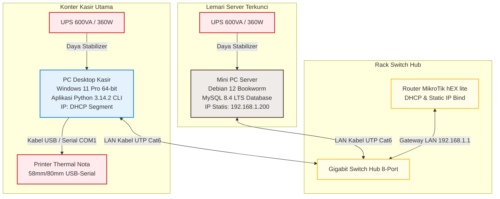
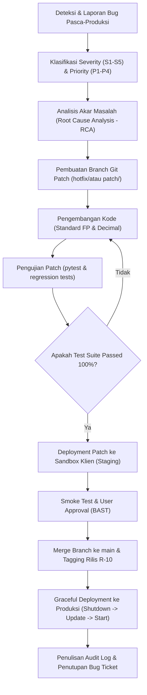
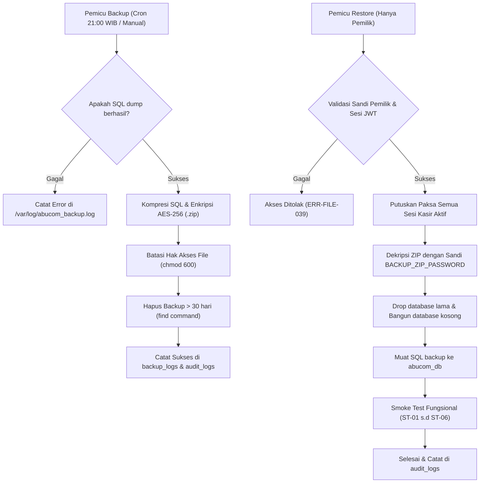
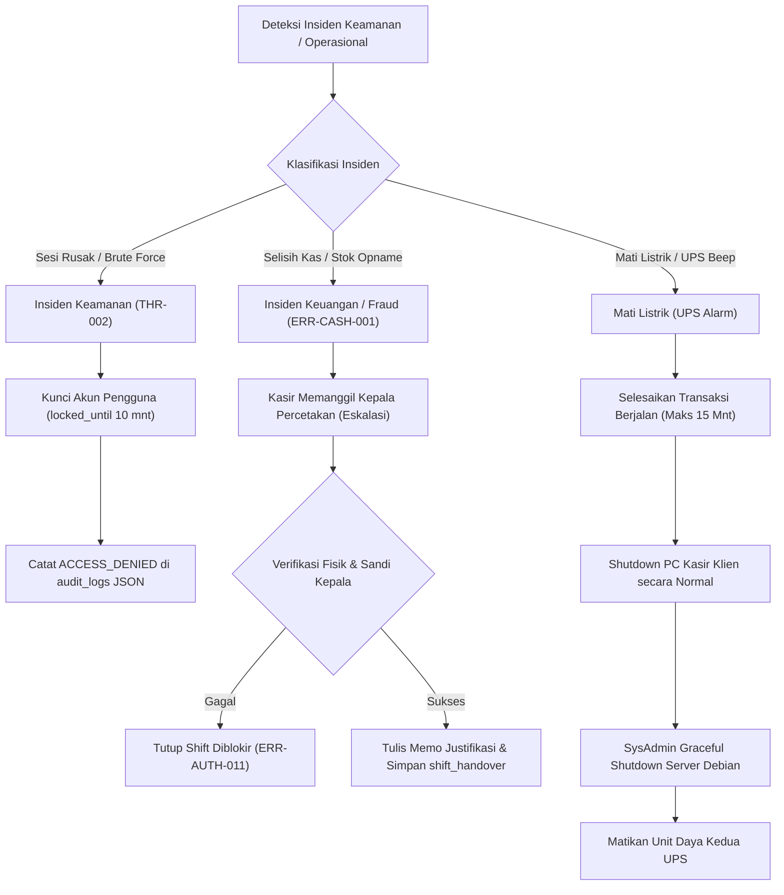

# Maintenance Guide — AbuCom

## Riwayat Perubahan Dokumen

| Versi | Tanggal | Deskripsi Perubahan | Oleh |
|:---:|:---:|---|---|
| **1.0** | 2026-05-27 | Inisialisasi awal penyusunan dokumen Maintenance Guide secara komprehensif (22 Bab utama). Menyerap seluruh parameter referensi R-01 s.d R-14 untuk merancang panduan operasional pemeliharaan sistem dual-OS offline LAN. | Senior IT Service Manager & Maintenance Operations Architect |

---

## 1. Informasi Dokumen

### 1.1. Tujuan Dokumen
Dokumen **Maintenance Guide** ini disusun sebagai panduan teknis operasional resmi (*step-by-step technical manual*) untuk melakukan pemeliharaan rutin, korektif, preventif, adaptif, perfektif, dan darurat pada sistem aplikasi AbuCom CLI pasca Go-Live. Dokumen ini dirancang agar pemilik usaha, kepala percetakan, system administrator, dan tim pengembang AI memiliki acuan tunggal yang terstandardisasi dalam menjaga keandalan, stabilitas, dan keamanan data sistem tanpa ketergantungan koneksi internet.

### 1.2. Cakupan Dokumen
Panduan operasional ini mencakup seluruh prosedur berikut:
*   Kategori pemeliharaan sistem informasi retail luring AbuCom.
*   SOP Runbook harian, mingguan, bulanan, kuartalan, semesteran, dan tahunan beserta checklist pengetatan.
*   Prosedur pemeliharaan korektif (bug fixing), klasifikasi severity, SLA tanggap darurat, dan alur patching Git.
*   Prosedur pemeliharaan adaptif (upgrade Python runtime, dependensi, migrasi skema database, dan perluasan node klien).
*   Prosedur backup, restore, dan disaster recovery database menggunakan enkripsi AES-256 ZIP.
*   Prosedur tanggap darurat penanganan insiden keamanan, operasional shift kasir, dan penanganan fraud.
*   Panduan troubleshooting lengkap untuk seluruh kode error (`ERR-DB`, `ERR-AUTH`, `ERR-SESSION`, `ERR-FILE`, `ERR-CASH`), rendering visual CLI, dan peripheral printer thermal.
*   Matriks risiko pemeliharaan operasional, RACI matrix, dan kalender pemeliharaan konsolidasi.

### 1.3. Posisi Dokumen dalam Siklus SDLC
Dalam siklus hidup pengembangan sistem (SDLC) AbuCom, dokumen ini merupakan deliverable pertama pada **Fase 07 — Maintenance**. Dokumen ini menerima estafet operasional langsung dari output Fase 06 — Deployment (Deployment Guide, Environment Config, Release Notes) untuk menjamin keberlanjutan layanan sistem di lingkungan toko percetakan fisik secara jangka panjang.

```text
+-------------------------------------------------------+
|                 Fase 06 — Deployment                  |
|  (Deployment Guide, Env Config, Release Notes Passed) |
+-------------------------------------------------------+
                           |
                           v
+=======================================================+
|     Fase 07 — Maintenance Guide [DOKUMEN INI]         | <-- POSISI DELIVERABLE
+=======================================================+
                           |
                           v
+-------------------------------------------------------+
|         Operasional Pemeliharaan Berkelanjutan        |
|         (SOP Harian, Backup, Audit, Bugfix)           |
+-------------------------------------------------------+
```

### 1.4. Hubungan dengan Dokumen SDLC Lainnya (Input & Output)
*   **Dokumen Input (Acuan)**:
    *   [Deployment Guide v1.1](docs/sdlc/06_deployment/01_deployment_guide.md) (R-01): Sumber acuan runbook harian, backup otomatis, dan disaster recovery.
    *   [System Architecture v1.1](docs/sdlc/03_design/03_system_architecture.md) (R-02): Cetak biru diagram deployment, database 28 tabel, pooling koneksi, dan retry mechanism.
    *   [Security Design v1.1](docs/sdlc/03_design/06_security_design.md) (R-03): Hardening OS, ufw rules, bcrypt, JWT sessions, Fernet CRM (UU PDP), log audit trail, dan kode error.
    *   [Environment Config v1.1](docs/sdlc/06_deployment/02_environment_config.yaml) (R-04): Konfigurasi runtime database, enkripsi, dan printer.
    *   [Release Notes v1.1](docs/sdlc/06_deployment/03_release_notes.md) (R-05): Informasi modul aktif, known limitations, known issues, dan roadmap upgrade.
    *   [Environment Setup v1.1](docs/sdlc/04_implementation/02_environment_setup.md) (R-06), [Bug Report Template v1.1](docs/sdlc/05_testing/04_bug_report_template.md) (R-07), [Test Plan v1.1](docs/sdlc/05_testing/01_test_plan.md) (R-08), [Coding Standard v1.1](docs/sdlc/04_implementation/01_coding_standard.md) (R-09), [Git Workflow v1.1](docs/sdlc/04_implementation/04_git_workflow.md) (R-10), [Tech Stack Decision v1.1](docs/sdlc/01_planning/04_tech_stack_decision.md) (R-11), [SRS v1.1](docs/sdlc/02_analysis/02_software_requirements.md) (R-12), [Database Schema v1.1](docs/sdlc/03_design/01_database_schema.sql) (R-13), [Module Structure v1.1](docs/sdlc/04_implementation/03_module_structure.md) (R-14).
*   **Dokumen Output**:
    *   *Maintenance Logbook*: Pencatatan hasil pemeriksaan rutin harian, status backup, dan logs audit.
    *   *Incident Report Form*: Format pencatatan resmi jika terjadi kegagalan sistem.
    *   *Patch Release Notes*: Catatan perbaikan bug dan peningkatan sistem versi minor.

### 1.5. Audiens Target
*   **Pemilik Usaha (Alfatih)**: Pemegang keputusan tertinggi untuk eskalasi tindakan kritis keuangan, budget pemeliharaan hardware, dan persetujuan payroll.
*   **Kepala Percetakan (Donsise)**: Pengawas harian yang bertanggung jawab atas penandatanganan absensi, opname persediaan fisik, dan otorisasi anomali shift kasir.
*   **Kasir dan Staf Operasional**: Sebagai panduan menjalankan SOP buka/tutup toko, serah terima shift kasir, dan pelaporan kendala teknis.
*   **System Administrator**: Pelaksana teknis backup, audit keamanan log, database tuning, dan disaster recovery server.
*   **Tim Pengembang AI (Support)**: Tim pengembang yang mengimplementasikan patch perbaikan bug, refaktorisasi kode fungsional, dan upgrade runtime.

### 1.6. Definisi, Akronim, dan Singkatan
*   **ITIL** (*Information Technology Infrastructure Library*): Standar global praktik terbaik manajemen layanan TI.
*   **IEEE 14764**: Standar internasional untuk rekayasa perangkat lunak pemeliharaan sistem.
*   **SLA** (*Service Level Agreement*): Perjanjian tingkat layanan yang menetapkan batas waktu tanggap pemulihan insiden.
*   **MTTR** (*Mean Time To Repair*): Rata-rata waktu yang dibutuhkan untuk memperbaiki dan memulihkan kegagalan sistem.
*   **MTBF** (*Mean Time Between Failures*): Rata-rata waktu operasional normal sistem di antara dua kegagalan.
*   **FP** (*Functional Programming*): Paradigma pemrograman fungsional murni tanpa manipulasi state global.
*   **CLI** (*Command Line Interface*): Antarmuka program interaktif berbasis teks visual terminal.
*   **JWT** (*JSON Web Token*): Token stateless penjamin sesi aktif pengguna.
*   **RBAC** (*Role-Based Access Control*): Pembatasan akses navigasi menu berdasarkan peran staf.
*   **ACID** (*Atomicity, Consistency, Isolation, Durability*): Standar integritas database transaksional.
*   **LAN** (*Local Area Network*): Jaringan komputer lokal luring offline murni.
*   **UPS** (*Uninterruptible Power Supply*): Baterai cadangan penyuplai daya penstabil listrik padam.
*   **BOM** (*Bill of Materials*): Resep racikan bahan baku desimal pembentuk produk kustom.
*   **HPP** (*Harga Pokok Penjualan*): Biaya modal riil bahan langsung pembentuk produk kustom.
*   **UU PDP**: Undang-Undang Perlindungan Data Pribadi No. 27 Tahun 2022.

---

## 2. Ringkasan Arsitektur Sistem yang Dipelihara

### 2.1. Diagram Arsitektur Deployment Produksi (Mermaid)
Sistem produksi AbuCom beroperasi secara mandiri (*offline-only LAN*) dengan topologi bintang (*star topology*) guna menghindari latensi internet dan mengeliminasi risiko kebocoran data:



### 2.2. Matriks Komponen per Node

| Karakteristik Komponen | Server Database (`192.168.1.200`) | Klien Kasir (IP DHCP Jaringan) |
|---|---|---|
| **Sistem Operasi** | Linux Debian 12 Bookworm (Minimal CLI) | Windows 11 Pro / Home 64-bit |
| **Runtime Engine** | Python 3.14.2+ (Kompilasi Sumber Luring) | Python 3.14.2+ (Wajib) |
| **Service Daemon** | MySQL Community Server `mysql.service` (Port 3306) | Driver Printer Thermal (Generic/Text Only) |
| **Perangkat Pendukung** | UPS 600VA, Kabel UTP Cat6 | UPS 600VA, Printer Thermal, Laci Kasir RJ11 |
| **Pustaka Utama** | `mysql-connector-python`, `bcrypt` | `mysql-connector-python`, `python-dotenv`, `bcrypt`, `pyjwt`, `cryptography`, `rich`, `tabulate` |
| **Penyimpanan Berkas** | Berkas MySQL fisik, Cadangan zip AES-256 | Salinan struk nota `.txt`, direktori path PDF desain |
| **Akses Jaringan** | Bind IP statis `192.168.1.200`, port 3306 terbuka terbatas | Remote MySQL TCP/IP Port 3306 ke Server |

### 2.3. Daftar Modul Fungsional Aktif (M.1 s.d M.10)
Sistem AbuCom terbagi atas 10 modul fungsional yang berjalan modular:
1.  **M.1 — Manajemen Transaksi & Kebijakan Harga**: Pencatatan penjualan ritel ATK, pemicu pesanan cetak kustom, DP, pelunasan, skema harga bertingkat, dan ekspor nota struk `.txt` (58mm/80mm).
2.  **M.2 — Manajemen Inventaris, BOM & Stock Opname**: Formula HPP produk cetak berbasis BOM desimal, limbah (*waste*), penguncian opname, price tracking supplier, import/export CSV, and backup-restore manual.
3.  **M.3 — Layanan Keuangan Digital, PPOB & Jasa Service**: Layanan pulsa/token (PPOB) manual, perbandingan biaya admin transfer 6 e-wallet, dan rekam perbaikan laptop/printer.
4.  **M.4 — Manajemen SDM, Penggajian & Poin Karyawan**: Absensi staf, Smart Payroll (upah dinamis berdasarkan target laba Rp 15 juta dengan jaminan 50% UMR), payroll potong kasbon otomatis, dan poin insentif 4-tier.
5.  **M.5 — Sistem Manajemen Antrian & Pelacakan Desain**: Antrian job 5 status, rekam path PDF mockup desain, and link template WhatsApp Web.
6.  **M.6 — Administrasi Pinjaman, Aset & Pengeluaran**: Pengeluaran operasional (biaya &ge; Rp 500.000 butuh sandi Pemilik), depresiasi aset garis lurus, tabungan aset virtual, pinjaman bank/kerabat, and laporan laba rugi.
7.  **M.7 — Keamanan, Audit Trail & Hak Akses**: Autentikasi bcrypt cost 12, sesi JWT 8 jam, rate limiting login 5x, validasi RBAC, shift handover, and audit logs JSON.
8.  **M.8 — Pembatalan, Retur & CRM**: Otorisasi pembatalan/retur (butuh sandi Pemilik), profile CRM pelanggan, and hard delete UU PDP.
9.  **M.9 — Skalabilitas Multi-Cabang**: Pemasangan kunci asing `cabang_id` di setiap entitas basis data untuk multi-branch ready.
10. **M.10 — Konfigurasi Sistem Runtime**: Parameterisasi dinamis regulasi bisnis di tabel `system_configs`.

### 2.4. Daftar Tabel Database (28 Tabel InnoDB)
Seluruh tabel basis data relasional dikelola menggunakan engine transaksional **InnoDB** (ACID compliant) dan terbagi dalam 5 kategori:
*   **Kelompok A (Tabel Induk)**: `cabang`.
*   **Kelompok B (Tabel Master Level 2)**: `pengguna`, `pelanggan`, `supplier`, `barang`, `saldo_ppob`, `saldo_ewallet`, `system_configs`.
*   **Kelompok C (Tabel Transaksional)**: `bom_komposisi`, `transaksi`, `detail_transaksi`, `antrian_kerja`, `absensi`, `kasbon`, `payroll`, `pengeluaran`, `limbah_produksi`, `jasa_service`, `poin_insentif`, `shift_handover`.
*   **Kelompok D (Tabel Administrasi & Keuangan)**: `utang_supplier`, `pinjaman_bank`, `pinjaman_kerabat`, `aset`.
*   **Kelompok E (Tabel Audit & Rekonsiliasi)**: `audit_logs`, `backup_logs`, `stock_opname`, `riwayat_harga_supplier`.

### 2.5. Daftar Pustaka Dependensi dan Versi Terkunci
Operasional normal program mengikat pustaka package manager berikut pada berkas `requirements.txt`:
*   `mysql-connector-python==8.4.0` (Driver MySQL resmi)
*   `python-dotenv==1.0.1` (Pemuat parameter `.env`)
*   `bcrypt==4.1.0` (Sandi hash staf)
*   `pyjwt==2.8.0` (Sesi stateless JWT)
*   `cryptography==42.0.5` (Fernet key - proteksi UU PDP)
*   `rich==13.7.0` (Render CLI ANSI warna)
*   `tabulate==0.9.0` (Tabular format CLI)

---

## 3. Kategori Pemeliharaan Sistem

### 3.1. Pemeliharaan Korektif (Corrective Maintenance)
*   **Definisi**: Tindakan perbaikan yang dilakukan untuk mengatasi kesalahan (*bugs*), kegagalan sistem, atau cacat fungsional yang terdeteksi pada lingkungan produksi aktif.
*   **Contoh Kasus Spesifik AbuCom**:
    *   Perbaikan bug `DEF-COMPAT-001` (mojibake ANSI visual garis tabel tabel di terminal kasir CMD CP1252 lawas).
    *   Perbaikan deviasi kalkulasi desimal HPP produk kustom akibat string rounding di interpreter.

### 3.2. Pemeliharaan Preventif (Preventive Maintenance)
*   **Definisi**: Aktivitas pemeliharaan terencana yang dijalankan secara berkala untuk mendeteksi dan mencegah kegagalan sistem sebelum hal itu terjadi.
*   **Contoh Kasus Spesifik AbuCom**:
    *   Pembersihan debu kertas fisik Mini PC Server database setiap minggu.
    *   Audit integritas index tabel MySQL secara bulanan menggunakan perintah SQL `CHECK TABLE`.
    *   Simulasi restorasi berkas cadangan database ke sandbox testing setiap 3 bulan.

### 3.3. Pemeliharaan Adaptif (Adaptive Maintenance)
*   **Definisi**: Modifikasi sistem untuk memastikan aplikasi tetap kompatibel dengan perubahan lingkungan hardware, sistem operasi, runtime engine, atau kepatuhan regulasi hukum baru.
*   **Contoh Kasus Spesifik AbuCom**:
    *   Upgrade interpreter Python 3.14.2 ke versi minor 3.14.x atau major 3.15.x.
    *   Upgrade MySQL Server 8.4 LTS ke versi rilis baru.
    *   Penambahan node PC Kasir klien baru di jaringan LAN lokal toko.

### 3.4. Pemeliharaan Perfektif (Perfective Maintenance)
*   **Definisi**: Peningkatan kualitas internal kode, optimasi performa komputasi, atau penataan ulang efisiensi arsitektur data tanpa mengubah spesifikasi fungsional dasar.
*   **Contoh Kasus Spesifik AbuCom**:
    *   Optimasi query Laba/Rugi M.6 (`DEF-PERF-001`) dengan memasang composite index gabungan pada tabel `transaksi` kolom `tanggal_transaksi` dan `cabang_id`.
    *   Refaktorisasi boilerplate code DB connector dengan fungsional list comprehension Python.

### 3.5. Pemeliharaan Darurat (Emergency Maintenance)
*   **Definisi**: Tindakan perbaikan tidak terencana yang wajib diambil secara instan dan cepat di luar jadwal rilis reguler akibat terjadinya crash total sistem atau ancaman keamanan aktif.
*   **Contoh Kasus Spesifik AbuCom**:
    *   Hotfix instan akibat database server mati mendadak (*dirty shutdown*) saat proses transaksi M.1.
    *   Dekripsi darurat dan restorasi data akibat kerusakan fisik SSD server database.
    *   Penggantian instan unit UPS server yang meledak atau mati total.

---

## 4. SOP Pemeliharaan Rutin Harian

### 4.1. SOP Startup Harian Sistem (Buka Toko)
1.  **Pukul 07:45 WIB**: Kepala Percetakan (Donsise) memasuki ruang server, memverifikasi tidak ada debu menumpuk, menyalakan catu daya listrik, dan memastikan lampu indikator UPS 1 menyala hijau stabil.
2.  **Nyalakan Server**: Tekan tombol power Mini PC Server, tunggu ± 2 menit hingga system booting CLI Debian aktif di layar console.
3.  **Nyalakan Klien**: Kasir menyalakan PC Desktop Kasir Windows 11, login ke Windows Standard User Account.
4.  **Buka Aplikasi**: Klik ganda shortcut `AbuCom CLI Kasir` di Desktop kasir (yang otomatis memicu cmd `/k "chcp 65001"`).
5.  **Modal Awal Shift**: Kasir login shift pagi, input nominal modal kas laci awal (misal Rp 200.000) yang disetujui Kepala Percetakan secara fisik.

### 4.2. SOP Shutdown Harian Sistem (Tutup Toko)
1.  **Pukul 20:45 WIB**: Kasir shift penutup menghentikan transaksi penjualan nota, merapikan struk transaksi fisik harian.
2.  **Shift Handover Penutup**: Kasir memicu menu serah terima shift harian `MENU-M7-003`, menghitung fisik laci kas, dan menginputkannya. Kepala Percetakan memverifikasi kesesuaian biner (selisih &le; Rp 10.000). Sesi JWT kasir dibersihkan aman dari memori.
3.  **Shutdown Klien**: Lakukan shutdown normal sistem operasi Windows 11 PC Kasir. Matikan layar monitor.
4.  **Backup Otomatis Harian**: (Berjalan otomatis di server pukul 21:00 WIB via Cron Job).
5.  **Shutdown Server (Pukul 21:05 WIB)**: Setelah memastikan backup harian sukses (verifikasi lewat status `[SUCCESS]` di `/var/log/abucom_backup.log` via SSH terminal kasir), administrator login SSH server, jalankan perintah gracefully shutdown:
    ```bash
    # [LINUX DEBIAN 12 — Server]
    sudo shutdown -h now
    ```
6.  **Matikan UPS**: Setelah Mini PC Server mati total secara fisik (lampu indikator padam), matikan kedua unit UPS.

### 4.3. SOP Serah Terima Shift Kasir
1.  Kasir keluar login ke menu `MENU-M7-003`.
2.  Kasir menghitung uang kertas & koin fisik di laci kas dan menginputkan nominalnya (`kas_fisik`).
3.  Sistem secara transaksional menjumlahkan mutasi tunai masuk dan keluar dari database untuk menghitung nominal `kas_sistem`.
4.  Sistem menghitung deviasi:
    $$\text{Selisih} = \text{kas\_fisik} - \text{kas\_sistem}$$
5.  Jika `abs(selisih) <= Rp 10.000`, shift handover disetujui. Rekaman log disimpan dengan status `'NORMAL'`.
6.  Jika `abs(selisih) > Rp 10.000`, handover **diblokir otomatis**. Kasir wajib memanggil Kepala Percetakan untuk memasukkan sandi supervisor dan menuliskan memo alasan selisih sebelum data `shift_handover` disimpan dengan status `'ANOMALI'`.

### 4.4. SOP Verifikasi Backup Harian Otomatis
1.  Setiap pagi hari pukul 08:00 WIB, Administrator wajib login ke server database via SSH dan membaca akhir baris berkas log backup:
    ```bash
    # [LINUX DEBIAN 12 — Server]
    tail -n 10 /var/log/abucom_backup.log
    ```
2.  Pastikan tercetak status log sukses:
    `[SUCCESS] Backup basis data sukses dibuat: backup_YYYYMMDD_210000.zip`
3.  Jika tertulis status `[ERROR]`, segera jalankan Prosedur Tanggap Darurat Kegagalan Backup (Bab 13).

### 4.5. SOP Pemantauan Dashboard Anomali Pemilik
1.  Pemilik Usaha (Alfatih) wajib memeriksa panel keamanan saat login harian sebagai `pemilik`.
2.  Periksa indikator fraud detection sederhana:
    -   Brute-force login attempts (jika failed attempts > 0).
    -   Pembatalan pesanan transaksional M.1 (jika jumlah pembatalan > 3x seminggu).
    -   Selisih kas laci (jika tabel handover mencatat anomali).

### 4.6. Checklist Pemeliharaan Harian
- [ ] 1. Catu daya UPS 1 dan UPS 2 menyala stabil (lampu hijau tanpa alarm).
- [ ] 2. Booting Mini PC Server Debian dan PC Kasir Windows sukses tanpa eror.
- [ ] 3. Kasir login, input kas modal awal sukses tersimpan di database.
- [ ] 4. Verifikasi log backup harian semalam berstatus `[SUCCESS]`.
- [ ] 5. Dashboard pemilik menunjukkan status aman (zero security anomalies).
- [ ] 6. Penutupan kasir shift keluar lunas tanpa selisih (atau anomali disetujui supervisor).
- [ ] 7. Gracefully shutdown server Debian sukses dijalankan pada pukul 21:05 WIB.

---

## 5. SOP Pemeliharaan Rutin Mingguan

### 5.1. Pemeriksaan Fisik Hardware (Server, Kasir, UPS, Printer)
1.  Periksa sambungan kabel LAN Cat6 di belakang Mini PC Server, Switch Hub, dan PC Kasir. Pastikan konektor RJ45 tercolok kokoh.
2.  Periksa lampu indikator pada Switch Hub (pastikan lampu LED Gigabit menyala hijau stabil).
3.  Periksa status indikator baterai UPS 1 dan 2. Jika terdengar bunyi alarm beep secara berkala, segera lakukan pengujian runtime baterai (Bab 16).

### 5.2. Verifikasi Konektivitas Jaringan LAN (Ping, Port Test)
1.  Buka Windows Terminal di PC Kasir, jalankan ping menuju server database:
    ```cmd
    # [WINDOWS 11 — Klien]
    ping 192.168.1.200
    ```
    *Diharapkan response time rata-rata < 1ms tanpa ada packet loss (0% loss).*
2.  Lakukan pengujian socket TCP port 3306 MySQL:
    ```cmd
    # [WINDOWS 11 — Klien]
    powershell -Command "Test-NetConnection -ComputerName 192.168.1.200 -Port 3306"
    ```
    *Diharapkan mengembalikan status TcpTestSucceeded: True.*

### 5.3. Pemeriksaan Status Firewall Server (ufw status)
1.  Login SSH ke Server Debian sebagai `root`.
2.  Eksekusi kueri status firewall:
    ```bash
    # [LINUX DEBIAN 12 — Server]
    ufw status verbose
    ```
3.  Pastikan port 3306 terkunci eksklusif pada segmen IP lokal:
    `3306/tcp ALLOW IN 192.168.1.0/24`

### 5.4. Pembersihan Filter Udara Mini PC Server
1.  Matikan Mini PC Server Debian secara gracefully (setelah jam operasional).
2.  Gunakan kuas halus atau blower udara portabel untuk meniup debu kertas fisik yang menumpuk di kisi-kisi pembuangan panas server *fanless*.
3.  *Dilarang menggunakan kain basah atau cairan kimia apa pun pada sirkuit fisik server!*

### 5.5. Verifikasi Ketersediaan Kertas Struk Printer Thermal
1.  Buka tutup printer nota, periksa volume sisa gulungan kertas struk.
2.  Sediakan minimal 2 gulungan cadangan kertas thermal thermal nota lebar 58mm/80mm di laci konter kasir.

### 5.6. Checklist Pemeliharaan Mingguan
- [ ] 1. Seluruh koneksi kabel fisik LAN Cat6 tercolok kencang dan rapi.
- [ ] 2. Switch hub menunjukkan lampu hijau gigabit aktif pada port 1, 2, dan 3.
- [ ] 3. Klien kasir sukses melalukan ping dan test port 3306 ke Server (TcpTestSucceeded: True).
- [ ] 4. Firewall Server Debian berstatus `active` dengan rule pembatasan 3306 LAN segment.
- [ ] 5. Mini PC Server fanless bersih dari debu potongan kertas fisik percetakan.
- [ ] 6. Kertas struk printer thermal tersedia dan terisi cadangan minimal 2 rol.

---

## 6. SOP Pemeliharaan Rutin Bulanan

### 6.1. Rotasi Log File Lokal (Klien Kasir)
1.  Buka direktori logs di PC Kasir: `C:\Users\kasir\Documents\abucom\logs\`.
2.  Ubah nama berkas `error_log.txt` menjadi `error_log_YYYYMM.txt` (misalnya `error_log_202605.txt`).
3.  Buat berkas teks kosong baru bernama `error_log.txt`.
4.  Pindahkan berkas log lama terkompresi `.zip` ke media cold storage eksternal.

### 6.2. Audit Integritas Tabel Database (CHECK TABLE)
1.  Login ke console administratif MySQL Server Debian:
    ```bash
    # [LINUX DEBIAN 12 — Server]
    mysql -u root -p
    ```
2.  Eksekusi kueri pemeriksaan integritas tabel basis data `abucom_db`:
    ```sql
    USE abucom_db;
    CHECK TABLE pengguna, pelanggan, barang, transaksi, detail_transaksi, audit_logs;
    ```
3.  Pastikan kolom status dari hasil query menunjukkan output `OK`. Jika menunjukkan `Corrupt`, jalankan `REPAIR TABLE` (Bab 15).

### 6.3. Verifikasi Kapasitas Penyimpanan Server (Disk Usage)
1.  Login SSH ke Server Debian.
2.  Periksa kapasitas kapasitas penyimpanan SSD server:
    ```bash
    # [LINUX DEBIAN 12 — Server]
    df -h
    ```
3.  Pastikan persentase penggunaan (*Use%*) pada partisi utama root `/` berada di bawah **80%**. Jika melebihi batas, lakukan pembersihan backup lama > 30 hari secara manual.

### 6.4. Pemindahan Backup Bulanan ke Cold Storage Fisik
1.  Pemilik Usaha (Alfatih) memasang external HDD terenkripsi khusus ke Server atau PC Kasir.
2.  Salin seluruh berkas backup bulanan terkompresi ZIP AES-256 (`backup_YYYYMM31_210000.zip`) dari server ke media penyimpanan fisik eksternal.
3.  Simpan external HDD kembali di lemari besi tahan api milik pemilik usaha.

### 6.5. Pemeriksaan Status UPS dan Kapasitas Baterai
1.  Setiap hari Minggu di akhir bulan, lakukan uji pelepasan beban catu daya listrik:
2.  Cabut steker UPS server dari socket dinding saat database server menyala (tanpa beban transaksi aktif).
3.  Biarkan UPS menyangga server selama 5 menit, pastikan alarm beep berbunyi normal dan Mini PC Server tidak mati mendadak.
4.  Colokkan steker kembali, pastikan baterai UPS terisi ulang penuh.

### 6.6. Audit Log Audit Trail (Deteksi Anomali Fraud)
1.  Login sebagai `pemilik`, buka menu `MENU-M7-002` (Audit Logs).
2.  Jalankan kueri untuk mengidentifikasi anomali:
    ```sql
    -- Menemukan kegagalan otorisasi ACCESS_DENIED dalam 30 hari terakhir
    SELECT * FROM audit_logs WHERE action_type='ACCESS_DENIED' ORDER BY action_timestamp DESC;
    ```
3.  Audit secara manual alasan pemicuan akses ditolak tersebut bersama Kepala Percetakan.

### 6.7. Verifikasi Enkripsi WhatsApp CRM Pelanggan (UU PDP)
1.  Masuk ke prompt MySQL administratif server Debian.
2.  Jalankan kueri verifikasi data:
    ```sql
    USE abucom_db;
    SELECT whatsapp FROM pelanggan LIMIT 5;
    ```
3.  Pastikan output data WhatsApp yang tercetak di layar console berupa string acak biner Fernet token Base64, bukan berupa teks polos nomor telepon normal (`08...`).

### 6.8. Checklist Pemeliharaan Bulanan
- [ ] 1. Berkas log kesalahan kasir dirotasi bersih dan diarsip bulanan.
- [ ] 2. Seluruh 28 tabel InnoDB tervalidasi berstatus `OK` lewat perintah `CHECK TABLE`.
- [ ] 3. Disk space SSD Mini PC Server Debian terverifikasi longgar (penggunaan < 80%).
- [ ] 4. Pemilik memindahkan cadangan database bulanan ke cold storage fisik eksternal.
- [ ] 5. Pengujian pelepasan catu daya UPS sukses menyangga beban server & Klien minimal 5 menit.
- [ ] 6. Kueri log audit trail diekstraksi dan diverifikasi aman dari fraud staf kasir.
- [ ] 7. Verifikasi database pelanggan 100% terenkripsi Fernet (UU PDP Compliance).

---

## 7. SOP Pemeliharaan Rutin Kuartalan (3 Bulanan)

### 7.1. Simulasi Disaster Recovery Restore Database
1.  System Administrator menyiapkan PC Sandbox Staging (PC Klien khusus).
2.  Duplikat berkas backup harian ZIP terbaru dari Server (`backup_latest.zip`) ke sandbox.
3.  Jalankan Prosedur Restore Database (Bab 12) ke dalam database testing `abucom_test_db`.
4.  Lakukan kueri pencocokan nominal kas harian and stok bahan baku desimal untuk memastikan data restore 100% konsisten.

### 7.2. Pengujian Validitas Berkas Backup Terenkripsi
1.  Uji dekripsi berkas ZIP backup manual menggunakan utilitas terminal:
    ```cmd
    # [WINDOWS 11 — Klien]
    # Ganti kata sandi ZIP sesuai nilai BACKUP_ZIP_PASSWORD di .env
    unzip -t -P SandiZipBackup_2026_X9z! backup_latest.zip
    ```
2.  Pastikan utilitas ZIP mengembalikan pesan sukses `No errors detected in compressed data`.

### 7.3. Review dan Purging Log Audit > 12 Bulan
1.  Berdasarkan regulasi UU PDP, log audit yang telah berusia melebihi 12 bulan wajib dibersihkan dari database utama produksi.
2.  Jalankan ekspor data log audit > 12 bulan ke berkas CSV terenkripsi di folder `/var/lib/mysql-backups/purged_logs/`.
3.  Hapus baris data usang dari tabel:
    ```sql
    -- MySQL Server Console
    USE abucom_db;
    DELETE FROM audit_logs WHERE action_timestamp < DATE_SUB(NOW(), INTERVAL 12 MONTH);
    ```

### 7.4. Verifikasi Kinerja Jaringan dan Latensi LAN
1.  Lakukan pengujian transfer data lokal secara masif (misal salin berkas PDF desain 100MB antar-node klien kasir dan server).
2.  Pastikan kecepatan transfer stabil di atas **800 Mbps (100 MB/s)** pada interface Gigabit Ethernet.

### 7.5. Update Dokumentasi Aset dan Inventaris Hardware
1.  Periksa kecocokan nomor seri fisik server Mini PC, desktop kasir, UPS, dan printer nota struk thermal dengan tabel `aset` di database.
2.  Catat depresiasi nilai aset yang terload otomatis pada modul M.6.

### 7.6. Checklist Pemeliharaan Kuartalan
- [ ] 1. Simulasi restore database manual di sandbox staging tuntas 100% tanpa eror integritas.
- [ ] 2. Dekripsi berkas ZIP terenkripsi AES-256 sukses dengan utilitas unzip.
- [ ] 3. Log audit trail usang berumur > 12 bulan diekspor terenkripsi, lalu di-purge dari MySQL.
- [ ] 4. Latensi jaringan LAN stabil di bawah 1ms dengan kecepatan gigabit > 800 Mbps.
- [ ] 5. Inventaris aset hardware toko terverifikasi fisik dan tercatat depresiasinya di M.6.

---

## 8. SOP Pemeliharaan Rutin Semesteran (6 Bulanan)

### 8.1. Rotasi Kunci Keamanan JWT Secret Key
1.  Pemilik Usaha login ke terminal kasir klien.
2.  Generasikan kunci rahasia heksadesimal 32-byte baru menggunakan kueri Python:
    ```cmd
    # [WINDOWS 11 — Klien]
    python -c "import secrets; print(secrets.token_hex(32))"
    ```
3.  Buka berkas `.env` kasir klien, ganti nilai parameter `JWT_SECRET_KEY` dengan string hex baru tersebut.
4.  Lakukan restart terminal aplikasi kasir untuk memuat token sesi baru.
5.  *Peringatan: Pemasangan key baru akan memutuskan paksa seluruh sesi login staf kasir aktif lainnya.*

### 8.2. Rotasi Kunci Enkripsi Fernet CRM (UU PDP Compliance)
1.  Generasikan kunci Fernet Base64 32-byte baru menggunakan perintah Python:
    ```cmd
    # [WINDOWS 11 — Klien]
    python -c "from cryptography.fernet import Fernet; print(Fernet.generate_key().decode('utf-8'))"
    ```
2.  Jalankan skrip re-enkripsi lokal `utils/rotate_fernet.py` di PC Kasir.
3.  Skrip akan membaca data WhatsApp pelanggan terenkripsi lama, mendekripsinya di memori dengan key lama (`FERNET_KEY` aktif), lalu mengeksekusi re-enkripsi data dengan key baru, dan memperbarui kolom database MySQL.
4.  Simpan key baru di file `.env` parameter `FERNET_KEY`.

### 8.3. Rotasi Kata Sandi Database User Aplikasi
1.  Generasikan kata sandi acak kuat baru untuk user basis data `abucom_app` (minimal 16 karakter acak).
2.  Login ke server MySQL Debian via root, eksekusi query SQL rotasi sandi:
    ```sql
    -- MySQL Server Console
    ALTER USER 'abucom_app'@'192.168.1.%' IDENTIFIED BY 'PasswordBaruAplikasiToko_2026_!';
    FLUSH PRIVILEGES;
    ```
3.  Perbarui nilai parameter `DB_PASSWORD` pada berkas `.env` klien kasir.

### 8.4. Review Kebijakan Hak Akses RBAC (8 Peran)
1.  Audit kecocokan status penugasan peran (*role assignments*) staf aktif pada tabel `pengguna` database MySQL.
2.  Pastikan tidak ada staf kasir biasa yang memegang otorisasi supervisor `kepala_percetakan` atau `pemilik`.

### 8.5. Evaluasi Performa Sistem dan Kapasitas Planning
1.  Jalankan kueri pengukur performa index database.
2.  Ukur response time rata-rata kueri input transaksi lunas M.1. Pastikan response time berada di bawah ambang batas fungsional **2 detik**.

### 8.6. Checklist Pemeliharaan Semesteran
- [ ] 1. Kunci rahasia JWT Secret Key baru digenerasikan dan dirotasi di berkas `.env`.
- [ ] 2. Kunci Fernet CRM data pelanggan WhatsApp dirotasi penuh via skrip re-enkripsi database.
- [ ] 3. Kata sandi database remote user `abucom_app` diubah di server MySQL dan diperbarui di klien.
- [ ] 4. Matriks hak akses 8 peran staf aktif di-audit ketat bebas dari *privilege escalation*.
- [ ] 5. Response time kueri transaksional terverifikasi cepat di bawah batas 2 detik.

---

## 9. SOP Pemeliharaan Rutin Tahunan

### 9.1. Audit Keamanan Menyeluruh (Security Audit)
1.  Evaluasi menyeluruh 6 layer *defense in depth* sistem (Keamanan Jaringan, Hardening OS, Database, Otentikasi, Otorisasi, Proteksi Data, Audit Trail).
2.  Uji coba input karakter escape visual terminal CLI untuk menjamin fungsionalitas filter input ASCII kontrol bekerja 100% mencegah injeksi terminal.

### 9.2. Review Kepatuhan UU PDP No. 27/2022
1.  Pastikan 100% record data pribadi nomor WhatsApp pelanggan terenkripsi aman di database.
2.  Simulasikan hak penghapusan data pelanggan (*Right to Erasure*) lewat menu pemilik untuk memverifikasi hard delete row pelanggan M.8 bekerja atomis tanpa memutus relasi foreign key transaksi lama.

### 9.3. Evaluasi End-of-Life Perangkat Keras
1.  Lakukan diagnosa utilitas diagnostik kesehatan SSD (S.M.A.R.T check) pada server Mini PC Debian dan desktop kasir Windows.
2.  Jika indikator kesehatan SSD turun di bawah **70%**, jadwalkan prosedur penggantian SSD (Bab 16) untuk mencegah kehilangan data fisik.

### 9.4. Review Relevansi Parameter system_configs
1.  Review seluruh parameter regulasi operasional toko percetakan di tabel `system_configs` database MySQL (UMR daerah, toleransi kasir, limit kasbon, threshold PPOB).
2.  Sesuaikan nominal parameter dengan fluktuasi ekonomi riil dan UMR daerah Bandung terbaru bersama pemilik usaha.

### 9.5. Perencanaan Upgrade Versi dan Roadmap
1.  Review rilis roadmap AbuCom v1.1.0 and v1.2.0 (Bab 5 roadmap Release Notes R-05).
2.  Koordinasikan ketersediaan library wheels luring dan jadwal downtime operasional toko dengan SysAdmin.

### 9.6. Checklist Pemeliharaan Tahunan
- [ ] 1. Audit keamanan menyeluruh 6 layer defense in depth tuntas dengan status Lolos.
- [ ] 2. Simulasi hak penghapusan data CRM pelanggan (UU PDP compliance) lulus verifikasi database.
- [ ] 3. Kesehatan SSD server dan kasir terdeteksi sehat di atas 70% via S.M.A.R.T tool.
- [ ] 4. Parameter operasional system_configs di-audit sinkron dengan parameter finansial UMKM Bandung.
- [ ] 5. Rencana upgrade rilis versi roadmap baru disusun bersama Tim AI Support.

---

## 10. Prosedur Pemeliharaan Korektif (Bug Fix & Patching)

### 10.1. Alur Pelaporan Bug Pasca-Produksi
Jika terjadi kendala sistem di laci kasir saat Go-Live, staf toko wajib melaporkan insiden menggunakan alur sekuensial berikut:
1.  **Pelaporan Awal**: Kasir mencatat gejala eror, screenshot layar terminal, and catat kode error (`ERR-XXX-XXX`).
2.  **Bypass Manual**: Hentikan operasional program kasir, catat transaksi manual memakai nota kertas fisik sementara agar pelayanan konter tidak mandek.
3.  **Pengisian Tiket Bug**: Administrator membuat tiket laporan bug formal mengikuti format *Bug Report Template* (R-07).

### 10.2. Klasifikasi Severity dan Priority (Referensi Bug Report Template)
*   **Severity Levels (Dampak Teknis)**:
    *   `S1 (Blocker)`: Crash total sistem, data loss, database corruption, or login ditolak biner untuk seluruh user.
    *   `S2 (Critical)`: Modul inti (M.1 Kasir / M.2 Persediaan) mati, or enkripsi Fernet/bcrypt bypass.
    *   `S3 (Major)`: Kerusakan fungsi pelaporan margin, PPOB alert, or payroll error.
    *   `S4 (Minor)`: Glitch mojibake Visual CLI (`DEF-COMPAT-001`), layout tergeser, or delay notifikasi WhatsApp.
    *   `S5 (Trivial)`: Ejaan kata typo pada menu teks.
*   **Priority Levels (Urgensi Bisnis)**:
    *   `P1 (Immediate)`: Harus diperbaiki saat ini juga (downtime operasional).
    *   `P2 (High)`: Diperbaiki dalam siklus patch harian berjalan.
    *   `P3 (Medium)`: Diperbaiki pada rilis mingguan reguler.
    *   `P4 (Low)`: Diperbaiki pada update roadmap major berikutnya.

### 10.3. Prosedur Analisis Akar Masalah (Root Cause Analysis)
1.  Uji reproduksi eror bug pada komputer sandbox staging menggunakan database testing `abucom_test_db`.
2.  Gunakan debugger Python (`pdb`) atau tracking manual untuk mengidentifikasi line baris kode logika bisnis murni yang memicu *runtime crash*.
3.  Pastikan akar masalah diidentifikasi secara atomik (apakah masalah database constraint, runtime Dual-OS path, or mathematical rounding).

### 10.4. Prosedur Pengembangan dan Pengujian Patch
1.  **Branching Git**: Buat branch terisolasi dari base `main` menggunakan Git Workflow (R-10):
    ```bash
    git checkout -b patch/fix-mojibake-visual
    ```
2.  **Coding Standard**: Tulis perbaikan kode 100% mematuhi Coding Standard FP Python murni (R-09) tanpa kelas, no global state mutation, and explicit UTF-8 parameters.
3.  **Unit & Regression Test**: Tambahkan kasus uji unik pada pytest, jalankan seluruh test suite:
    ```bash
    pytest tests/
    ```
    *Exit Criteria: Pass rate wajib 100% dan coverage logic bisnis >= 90% via coverage.py.*

### 10.5. Prosedur Deployment Patch ke Produksi
1.  Merge branch patch yang stabil ke branch utama `main` dan beri tagging rilis formal baru di Git repository:
    ```bash
    git checkout main
    git merge patch/fix-mojibake-visual
    git tag -a v1.0.1 -m "Patch Fix Visual Mojibake CMD"
    ```
2.  **Graceful Deployment**:
    *   Tutup program CLI kasir klien.
    *   Tarik salinan source code rilis baru `v1.0.1` dari media USB flashdisk aman.
    *   Nyalakan kembali virtual environment `venv`, jalankan program CLI baru.
    *   Jalankan Smoke Test (`ST-01 s.d ST-06`) untuk validasi kelayakan patch.

### 10.6. Prosedur Rollback Patch (Jika Gagal)
Jika patch rilis baru `v1.0.1` memicu crash tidak terduga pada Windows Kasir:
1.  Buka terminal CLI kasir, kembalikan tagging kode ke versi rilis stabil `v1.0.0-stable`:
    ```cmd
    # [WINDOWS 11 — Klien]
    git checkout v1.0.0-stable
    ```
2.  Kembalikan file `.env` dari cadangan backup (`.env.bak`).
3.  Jalankan ulang menu kasir, pastikan program berjalan normal kembali.

### 10.7. Diagram Alur Patching (Mermaid Flowchart)



### 10.8. SLA Penanganan Bug per Severity Level

| Severity Level | Target Respon (Awal) | Target Solusi Pemulihan (MTTR) | Tindakan Operasional |
|---|---|---|---|
| **S1 (Blocker)** | &le; 15 Menit | &le; 2 Jam | Hentikan kasir, isolasi, picu rollback instan or hotfix darurat. |
| **S2 (Critical)**| &le; 30 Menit | &le; 8 Jam | Tambal fungsi modul kritis di sandbox, jalankan patch malam hari. |
| **S3 (Major)**   | &le; 2 Jam | &le; 24 Jam | Dijadwalkan masuk antrian patch rilis harian reguler. |
| **S4 (Minor)**   | &le; 24 Jam | &le; 3 Hari | Peningkatan visual/estetika, dirilis pada siklus mingguan. |
| **S5 (Trivial)** | &le; 48 Jam | &le; 7 Hari | Koreksi ejaan kata teks, disisipkan pada major update berikutnya. |

---

## 11. Prosedur Pemeliharaan Adaptif (Upgrade & Migrasi)

### 11.1. Prosedur Upgrade Versi Python Runtime
1.  Unduh tarball installer source code Python versi baru (misalnya `Python-3.15.0.tar.xz`) di mesin luar berinternet.
2.  Salin file terkompresi menggunakan flashdisk aman ke server Debian `/tmp/`.
3.  Jalankan instalasi dependensi build luring, konfigurasikan optimizations compiler:
    ```bash
    # [LINUX DEBIAN 12 — Server]
    cd /tmp
    tar -xf Python-3.15.0.tar.xz
    cd Python-3.15.0
    ./configure --enable-optimizations --with-ensurepip=install
    make -j$(nproc)
    sudo make altinstall
    ```
4.  Lakukan verifikasi interpreter baru: `python3.15 --version`.

### 11.2. Prosedur Upgrade Versi Pustaka Dependensi
1.  Kumpulkan berkas wheel (.whl) dari pustaka dependensi versi baru pada mesin luar berinternet ke dalam folder `pip_wheels/`.
2.  Salin folder wheels ke PC Kasir klien.
3.  Aktifkan virtual environment kasir klien, jalankan pemutakhiran pustaka secara luring:
    ```cmd
    # [WINDOWS 11 — Klien]
    venv\Scripts\activate
    pip install --no-index --find-links=pip_wheels --upgrade -r requirements.txt
    ```

### 11.3. Prosedur Migrasi Skema Database (Schema Migration)
1.  **[KRITIS]** Buat cadangan database penuh produksi (`abucom_db`) secara manual sebelum memicu migrasi skema DDL basis data.
2.  Buka console administratif MySQL, jalankan migrasi skema DDL (misal penambahan kolom harga grosir baru):
    ```sql
    -- MySQL Server Console
    USE abucom_db;
    ALTER TABLE barang ADD COLUMN harga_grosir_baru DECIMAL(15,4) NOT NULL DEFAULT 0.0000;
    ```
3.  Audit integritas relational 28 tabel, rekam aktivitas migrasi skema di log audit.

### 11.4. Prosedur Upgrade Sistem Operasi Server/Klien
*   **Upgrade Linux Debian (Server)**:
    -   Backup seluruh folder `/var/lib/mysql-backups/` and salinan konfig `/etc/mysql/`.
    -   Picu upgrade Debian menggunakan CD/DVD repositori luring lokal.
*   **Upgrade Windows (Klien Kasir)**:
    -   Matikan windows update otomatis eksternal (karena luring). Upgrade minor disalurkan luring via media installer internal resmi Microsoft.

### 11.5. Prosedur Penambahan Node Klien Baru (Ekspansi)
Jika Pemilik Usaha menambah terminal kasir 2 baru di konter toko percetakan:
1.  Rakit PC Kasir 2 baru, pasang Windows 11 Standard User, disable AutoPlay registry (Hex `FF`).
2.  Hubungkan kabel LAN Cat6 dari PC Kasir 2 ke port 4 Switch Hub.
3.  Konfigurasikan DHCP IP static bind pada router MikroTik.
4.  Salin folder source code aplikasi rilis, buat venv terisolasi, jalankan setup dependensi luring.
5.  Duplikat berkas `.env` produksi, sesuaikan parameter `APP_CABANG_ID` and `PRINTER_PORT` kasir 2.
6.  Jalankan Smoke Test (`ST-01 s.d ST-06`) untuk memastikan kelancaran transaksi remote ke server database.

### 11.6. Checklist Pre-Upgrade dan Post-Upgrade
- [ ] 1. (Pre) Cadangan database MySQL dipicu sukses dan divalidasi ZIP checksum-nya.
- [ ] 2. (Pre) Folder cadangan kode program utama diduplikasi menjadi `abucom_bak/`.
- [ ] 3. (Pre) Seluruh sesi login JWT kasir aktif diputus paksa secara aman.
- [ ] 4. (Post) Interpreter Python baru and dependensi sukses dimuat di virtual environment.
- [ ] 5. (Post) Migrasi skema database DDL tervalidasi sukses tanpa merusak data relational InnoDB.
- [ ] 6. (Post) Smoke test fungsional retail M.1 tuntas dilalui dengan status PASS 100%.

---

## 12. Prosedur Backup, Restore, dan Disaster Recovery

### 12.1. Strategi Backup (Harian, Bulanan, Tahunan)
*   **Tier 1 (Harian - Otomatis)**: File database MySQL diekspor secara passwordless via `/root/.my.cnf` (600), kompresi ZIP terenkripsi **AES-256 bit**, disimpan lokal di server Debian `/var/lib/mysql-backups/` dengan retensi 30 hari.
*   **Tier 2 (Bulanan - Manual)**: Pemilik menyalin berkas ZIP harian akhir bulan ke media external HDD terenkripsi khusus, retensi 12 bulan (cold storage).
*   **Tier 3 (Tahunan - Arsip)**: Berkas data historis pembukuan tahun berjalan dibekukan, diekspor massal, dan disimpan permanen di arsip fisik brankas toko.

### 12.2. Prosedur Backup Otomatis Harian (Cron Job)
Skrip bash harian `/home/abuadm/abucom/utils/backup_cron.sh` dipasang secara otonom di crontab Server Debian root (pukul 21:00 WIB):

```bash
#!/bin/bash
# [LINUX DEBIAN 12 — Server]
# Skrip Cron Backup Terkompresi Terenkripsi AES-256 (Hardened v1.1)

TIMESTAMP=$(date +"%Y%m%d_%H%M%S")
BACKUP_DIR="/var/lib/mysql-backups"
DB_NAME="abucom_db"

# 1. Validasi keberadaan berkas opsi keamanan /root/.my.cnf
if [ ! -f /root/.my.cnf ]; then
    echo "[$(date)] [ERROR] Berkas opsi keamanan /root/.my.cnf tidak ditemukan!" >> /var/log/abucom_backup.log
    exit 1
fi

# Pemuatan sandi zip dari variabel konfigurasi terenkripsi .env
ZIP_PASSWORD="AbuCom_SecureBackupZip_Pass_2026_X9z!"

# 2. Eksekusi mysqldump aman menggunakan berkas opsi (TANPA password plaintext ter-hardcode)
mysqldump --defaults-extra-file=/root/.my.cnf --single-transaction --quick --lock-tables=false $DB_NAME > $BACKUP_DIR/backup_${TIMESTAMP}.sql

# Periksa keberhasilan dumping SQL
if [ $? -eq 0 ]; then
    # 3. Kompresi dan enkripsi menggunakan zip AES-256
    zip -P "$ZIP_PASSWORD" -j $BACKUP_DIR/backup_${TIMESTAMP}.zip $BACKUP_DIR/backup_${TIMESTAMP}.sql >> /dev/null
    
    # 4. Hapus berkas SQL mentah demi keamanan data
    rm -f $BACKUP_DIR/backup_${TIMESTAMP}.sql
    
    # 5. Set hak akses ketat berkas zip cadangan (chmod 600)
    chmod 600 $BACKUP_DIR/backup_${TIMESTAMP}.zip
    
    # 6. Rotasi backup otomatis: hapus berkas cadangan di server yang berusia lebih dari 30 hari
    find $BACKUP_DIR/ -name "backup_*.zip" -type f -mtime +30 -delete
    
    echo "[$(date)] [SUCCESS] Backup basis data sukses dibuat: backup_${TIMESTAMP}.zip" >> /var/log/abucom_backup.log
else
    echo "[$(date)] [ERROR] Eksekusi mysqldump gagal!" >> /var/log/abucom_backup.log
    exit 1
fi
```

### 12.3. Prosedur Backup Manual On-Demand
1.  Pemilik Usaha login ke aplikasi CLI kasir sebagai `pemilik` (Alfatih).
2.  Buka **Menu Konfigurasi & Admin &rarr; Jalankan Backup Manual**.
3.  Subprocess Python secara otomatis mengeksekusi dump database lokal, merespon status sukses, and menyalin file ZIP AES-256 terenkripsi di folder `C:\exports\backups\`.

### 12.4. Prosedur Restore Database dari Backup
Apabila database produksi mengalami kerusakan data (*data corruption*):
1.  Login ke console administratif MySQL Server Debian via root.
2.  **[KRITIS]** Putus paksa seluruh remote user `abucom_app` kasir agar tidak mengacaukan transaksi restorasi data:
    ```sql
    -- MySQL Server Console
    USE abucom_db;
    SELECT CONCAT('KILL ', id, ';') FROM information_schema.processlist WHERE user = 'abucom_app' INTO OUTFILE '/tmp/kill_connections.sql';
    SOURCE /tmp/kill_connections.sql;
    ```
3.  Drop database yang korup, buat ulang database kosong dengan character set `utf8mb4`:
    ```sql
    DROP DATABASE abucom_db;
    CREATE DATABASE abucom_db CHARACTER SET utf8mb4 COLLATE utf8mb4_unicode_ci;
    EXIT;
    ```
4.  Ekstrak berkas ZIP backup terenkripsi AES-256 ZIP manual terakhir:
    ```bash
    # [LINUX DEBIAN 12 — Server]
    unzip -P AbuCom_SecureBackupZip_Pass_2026_X9z! /var/lib/mysql-backups/backup_xxxx.zip -d /tmp/
    ```
5.  Restore database fisik:
    ```bash
    # [LINUX DEBIAN 12 — Server]
    mysql -u root -p abucom_db < /tmp/backup_xxxx.sql
    ```

### 12.5. Prosedur Disaster Recovery (Kegagalan Total Server)
Jika Mini PC Server database terbakar, dicuri, or rusak total harddisk fisiknya:
1.  **Pengadaan Hardware Baru**: Siapkan Mini PC pengganti dengan spesifikasi standard Intel i5, RAM 16GB, SSD 512GBNVMe (Sesuai Bab 16).
2.  **Instalasi Base OS**: Lakukan setup Debian 12 minimal CLI, pasang interpreter Python 3.14.2+, and pasang MySQL Server 8.4 LTS (Bab 11).
3.  **Ekstraksi Berkas Cadangan**: Salin berkas ZIP backup manual terenkripsi terakhir (yang disimpan offline di PC Kasir or external HDD Pemilik) ke server baru di `/tmp/restore.zip`.
4.  **Eksekusi Restorasi**:
    -   Hapus database kosong bawaan, buat database `abucom_db` dengan character set `utf8mb4`.
    -   Dekripsi zip luring: `unzip -P SandiZipBackup_2026_X9z! /tmp/restore.zip -d /tmp/`
    -   Restore database: `mysql -u root -p abucom_db < /tmp/restore.sql`
5.  **Verifikasi Jaringan**: Sambungkan server baru ke Switch Hub, kunci kembali static IP server ke `192.168.1.200` pada DHCP lease MikroTik.
6.  **Smoke Test**: Jalankan unit test verifikasi ST-01 s.d ST-06 untuk menjamin operasional normal kembali.

### 12.6. Strategi Retensi dan Rotasi Backup
*   **Retensi Server**: File backup ZIP disimpan lokal di folder `/var/lib/mysql-backups` server database Debian selama maksimal 30 hari terakhir.
*   **Pembersihan Otomatis**: Baris perintah `find` yang terpasang pada skrip `backup_cron.sh` secara berkala membersihkan ZIP berumur > 30 hari setiap pukul 21:00 WIB.

### 12.7. Diagram Alur Backup dan Restore (Mermaid Flowchart)



---

## 13. Prosedur Penanganan Insiden dan Eskalasi

### 13.1. Definisi dan Klasifikasi Insiden
Sistem AbuCom memetakan insiden ke dalam 5 tipe insiden keamanan/operasional kritis:
1.  **Brute-Force Berhasil**: Indikasi login sukses ilegal dari user yang sebelumnya tercatat gagal login berturut-turut > 5 kali.
2.  **Selisih Kas Berulang**: Log `shift_handover` mencatatkan status `'ANOMALI'` (selisih kas > Rp 10.000) berturut-turut selama 3 shift kasir terakhir.
3.  **Mati Listrik (UPS Alarm)**: Sirkuit catu listrik PLN padam mendadak sehingga alarm baterai cadangan UPS 1 and 2 berbunyi beep berkala.
4.  **Kegagalan Backup**: Log `backup_logs` merekam status `'FAILED'` berturut-turut selama 2 hari operasional harian.
5.  **Ketidakcocokan Checksum Cadangan**: Berkas ZIP backup manual menolak di-dekripsi or hasil restorasi database sandbox testing menunjukkan error integritas relasional database.

### 13.2. Matriks Eskalasi Insiden (Level 1, 2, 3)

| Level Eskalasi | Aktor Penanggung Jawab | Deskripsi Batasan Tindakan | Waktu Respon Maksimum |
|---|---|---|---|
| **Level 1 (Staf Kasir)** | Kasir / Pramuniaga | Melayani transaksi, melaporkan error visual CLI, and mencatat manual kertas nota. | &le; 10 Menit |
| **Level 2 (Supervisor)** | Kepala Percetakan | Melakukan opname fisik, approval anomali selisih kas kasir, absensi, and restart PC klien. | &le; 30 Menit |
| **Level 3 (IT Administrator)** | Pemilik Usaha / DevOps AI | Rotasi kunci rahasia, restore database, ganti hardware server, and ufw rules. | &le; 2 Jam |

### 13.3. Prosedur Deteksi Insiden
*   **Otomatis**: Sistem memonitor attempts failed login, pemicuan menu oleh peran ilegal, or nominal pengeluaran di atas threshold Rp 500.000.
*   **Manual**: Staf kasir or gudang mendeteksi malfungsi peripheral fisik printer thermal or colokan LAN switch hub mati.

### 13.4. Prosedur Respon Insiden (Isolasi, Pelaporan, Pemulihan)
1.  **Isolasi (Containment)**: Hentikan eksekusi transaksi pada terminal yang bermasalah. Cabut token JWT user aktif. Putuskan kabel LAN node bermasalah jika dicurigai infeksi virus local.
2.  **Pelaporan (Reporting)**: Catat gejala teknis, kode error, and pemicu insiden. Laporkan tiket insiden formal kepada Administrator.
3.  **Pemulihan (Recovery)**: Administrator login SSH untuk menelisik log audit MySQL, restore data aman dari backup ZIP, or update file konfig `.env`.

### 13.5. Prosedur Penanganan Insiden Keamanan Khusus
Jika terdeteksi serangan brute-force login berulang pada salah satu akun karyawan:
1.  Sistem secara logis langsung memperbarui baris data `locked_until` pengguna tersebut menjadi 10 menit ke depan.
2.  Catat logs kejadian kategori `ACCESS_DENIED` ke tabel audit log.
3.  Tolak seluruh request otentikasi login user tersebut di terminal kasir klien dengan kode `ERR-AUTH-002`.

### 13.6. SOP Graceful Shutdown saat Mati Listrik (UPS)
Apabila listrik PLN toko padam mendadak:
1.  **Daya Penyangga**: Alarm alarm unit UPS 1 and 2 berbunyi beep berkala menandakan daya baterai aktif (mampu menyangga s.d 15 menit).
2.  **Fase Penyelamatan Transaksi**: Staf kasir segera menyelesaikan pembayaran transaksi nota pelanggan yang sedang diproses. Dilarang keras membuka keranjang belanja invoice baru.
3.  **Fase Shutdown Klien**: Kasir menutup program CLI kasir secara normal, mematikan OS Windows 11 PC kasir secara aman, and menekan tombol power off unit UPS kasir.
4.  **Fase Graceful Server Database**: System Administrator segera login console fisik Mini PC Server Debian, jalankan graceful shutdown system dalam waktu < 10 menit sebelum baterai UPS server drop total:
    ```bash
    # [LINUX DEBIAN 12 — Server]
    sudo shutdown -h now
    ```

### 13.7. Kontak Darurat dan Jalur Eskalasi
Jika kendala teknis tidak dapat ditangani mandiri oleh pemilik toko:
*   **DevOps Technical Support Line**: `+62-812-3456-7890 (WhatsApp)`
*   **Email Dukungan Resmi**: `support@abucom.com`
*   **Waktu Layanan Tanggap Darurat**: Setiap hari operasional toko pukul 08:00 s.d 21:30 WIB.

### 13.8. Diagram Alur Eskalasi Insiden (Mermaid Flowchart)



---

## 14. Pemeliharaan Keamanan Sistem

### 14.1. Jadwal Rotasi Kunci dan Kredensial

| Item Kredensial | Lokasi Penyimpanan | Frekuensi Rotasi | Penanggung Jawab | Prosedur Teknis |
|---|---|---|---|---|
| `JWT_SECRET_KEY` | File `.env` Klien | 6 Bulan Sekali | Pemilik Usaha | Generasi python secrets token hex 32-byte (Bab 8). |
| `FERNET_KEY` | File `.env` Klien | 6 Bulan Sekali | Pemilik Usaha | Pemicuan skrip re-enkripsi database lokal (Bab 8). |
| Database Password | MySQL Server / `.env` | 6 Bulan Sekali | SysAdmin | Query `ALTER USER` and update `.env` `DB_PASSWORD`. |
| Sandi Root Server | OS Linux Debian 12 | 12 Bulan Sekali| Pemilik Usaha | Perintah `passwd root` via console CLI server fisik. |
| Sandi Supervisor | MySQL `pengguna` | 3 Bulan Sekali | Kepala / Pemilik | Update password hash menggunakan bcrypt cost factor 12. |

### 14.2. Prosedur Pengelolaan Akun Pengguna (Tambah/Nonaktif/Reset)
*   **Penambahan Akun**: Pemilik Usaha (`pemilik`) login ke menu `MENU-M7-001`, memasukkan username, sandi polos (di-hash bcrypt cost 12), and penugasan peran default dari 8 posisi RBAC.
*   **Reset Kata Sandi**: Pemilik Usaha mereset sandi staf yang lupa melalui menu pemilik, memaksa staf memasukkan sandi baru pada login berikutnya.
*   **Penonaktifan Akun**: Nonaktifkan akun staf yang keluar secara logis dengan:
    1.  Mengubah password_hash akun karyawan tersebut menjadi string UUID acak tidak dikenal di database MySQL.
    2.  Token sesi JWT aktif akan kedaluwarsa secara otonom setelah melewati masa aktif 8 jam.

### 14.3. Prosedur Pemantauan Log Audit Trail
Administrator wajib mengekstrak secara berkala mutasi data sensitif di tabel `audit_logs` untuk mendeteksi tindakan fraud staf:
```sql
-- MySQL Server Console
-- Mendeteksi upaya akses menu ilegal yang ditolak biner
SELECT action_timestamp, pengguna_id, old_value, ip_address 
FROM audit_logs 
WHERE action_type = 'ACCESS_DENIED' 
ORDER BY action_timestamp DESC 
LIMIT 50;
```

### 14.4. Prosedur Penanganan Insiden Fraud (Selisih Kas, Retur Abnormal)
Jika terdeteksi selisih kas kasir berulang or jumlah retur abnormal pada salah satu akun kasir:
1.  **Isolasi Sementara**: Pemilik Usaha menonaktifkan sementara akun kasir tersebut dengan mengubah sandi hash ke UUID acak di database.
2.  **Penelusuran Audit**: Ekstraksi detail `old_value` and `new_value` transaksi retur kasir tersebut pada tabel `audit_logs`.
3.  **Rekonsiliasi Fisik**: Cocokkan data sistem dengan bundel nota struk cetak fisik dan fisik stok barang retail ATK di gudang.

### 14.5. Prosedur Verifikasi Hardening OS dan Firewall
1.  Verifikasi status SSH server Debian: `/etc/ssh/sshd_config` harus mencantumkan `PermitRootLogin no`.
2.  Verifikasi file opsi root MySQL server Debian: `/root/.my.cnf` harus dikunci dengan hak akses `chmod 600`.
3.  Verifikasi status AutoPlay Windows kasir: Registry path `Explorer` harus memuat `NoDriveTypeAutoRun` = Hex `FF` (255 decimal).

### 14.6. Prosedur Kepatuhan Berkala UU PDP No. 27/2022
1.  Pastikan data master profil CRM pelanggan di tabel `pelanggan` terenkripsi reversible Fernet Base64.
2.  Simulasikan perintah hak penghapusan data CRM pelanggan (hard delete permanently) melalui terminal menu pemilik. Pastikan transaksi historis retail yang menggunakan profil pelanggan tersebut tetap konsisten (menggunakan default cascade anonymized or set pelanggan_id ke default 1).

---

## 15. Pemeliharaan Database

### 15.1. Prosedur Pemeriksaan Integritas Tabel (CHECK TABLE / REPAIR)
1.  Guna menjamin tidak ada tabel InnoDB yang korup akibat pemadaman listrik kotor PLN, Administrator mengeksekusi kueri berkala:
    ```sql
    -- MySQL Server Console
    USE abucom_db;
    CHECK TABLE transaksi, detail_transaksi, barang, pengguna, audit_logs;
    ```
2.  Jika salah satu tabel menunjukkan status `Corrupt` or `Error`, picu kueri perbaikan InnoDB:
    ```sql
    REPAIR TABLE transaksi;
    ```
    *(Catatan: InnoDB secara otomatis menjalankan pemulihan crash saat startup engine MySQL).*

### 15.2. Prosedur Optimasi Performa Query (ANALYZE TABLE / OPTIMIZE)
Untuk mencegah perlambatan kueri laba rugi M.6 (`DEF-PERF-001`) akibat fragmentasi index baris data tabel yang menumpuk:
1.  Jalankan analisa distribusi index tabel secara bulanan:
    ```sql
    -- MySQL Server Console
    USE abucom_db;
    ANALYZE TABLE transaksi, detail_transaksi;
    ```
2.  Lakukan defragmentasi dan reorganisasi penyimpanan fisik tabel:
    ```sql
    OPTIMIZE TABLE transaksi, detail_transaksi;
    ```

### 15.3. Prosedur Pemantauan Kapasitas Disk Database
Administrator memantau ukuran fisik database di SSD Mini PC Server menggunakan kueri SQL:
```sql
-- MySQL Server Console
SELECT table_schema "Database", 
       ROUND(SUM(data_length + index_length) / 1024 / 1024, 2) "Size (MB)" 
FROM information_schema.tables 
GROUP BY table_schema;
```

### 15.4. Prosedur Purging Data Log Audit Lama (> 12 Bulan)
1.  Ekspor data log audit lawas > 12 bulan ke file CSV kompresi ZIP terenkripsi di folder `/var/lib/mysql-backups/purged_logs/`.
2.  Hapus data usang dari tabel transaksional:
    ```sql
    -- MySQL Server Console
    DELETE FROM audit_logs WHERE action_timestamp < DATE_SUB(NOW(), INTERVAL 12 MONTH);
    ```

### 15.5. Prosedur Verifikasi Connection Pool dan Retry Mechanism
*   **Connection Pool**: Pastikan modul `db_connector.py` menginisialisasi connection pool `'abupool'` dengan ukuran `pool_size = 5` untuk operasional transaksi yang lancar.
*   **Auto-Retry**: Uji ketahanan lost connection. Matikan daemon service MySQL server sekejap saat klien kasir memicu request. Pastikan log error kasir mencatatkan retry 3 kali berturut-turut dengan jeda exponential backoff (2^n detik) sebelum melempar kegagalan permanen `ERR-DB-001`.

### 15.6. Prosedur Migrasi Data Antar Cabang (Multi-Branch Ready)
Aplikasi AbuCom dirancang Multi-Branch Ready. Kolom `cabang_id` (INT) dipasang di setiap 28 tabel database.
1.  Jika Pemilik Usaha melakukan konsolidasi data dari Cabang 2 Bandung Timur ke Cabang 1 Pusat:
2.  SysAdmin mengekspor kueri bersyarat: `mysqldump --where="cabang_id=2" abucom_db > /tmp/cabang2.sql`.
3.  Impor file SQL tersebut ke database pusat. Constraint relational InnoDB akan menjaga data tetap utuh and terpisah rapi berdasarkan kode `cabang_id`.

---

## 16. Pemeliharaan Hardware dan Infrastruktur

### 16.1. Jadwal Pemeriksaan Hardware Berkala

| Komponen Hardware | Metode Pemeriksaan | Parameter Normal | Frekuensi | Penanggung Jawab |
|---|---|---|---|---|
| Mini PC Server | Tiup debu fisik & monitor temperatur. | Suhu core CPU &le; 65°C, fanless bersih. | Mingguan | Kepala Percetakan|
| SSD Server / Klien| Utilitas S.M.A.R.T diagnostic check. | Health Status &ge; 70%, bad sector 0. | Tahunan | SysAdmin |
| Baterai UPS 1 & 2 | Pelepasan steker catu daya (Bab 6). | Mampu menyangga daya &ge; 15 menit. | Bulanan | SysAdmin |
| Kabel LAN Cat6 | Uji latensi ping local segmen server. | Latensi rata-rata < 1ms, packet loss 0%. | Mingguan | Kepala Percetakan|
| Printer Thermal | Cetak struk test page luring. | Tulisan nota terbaca tegas, no fading. | Harian | Staf Kasir |

### 16.2. Prosedur Penggantian Komponen Server (SSD, RAM, UPS)
Jika Mini PC Server database mengalami kerusakan komponen internal:
1.  Lakukan shutdown server secara aman, matikan UPS 1.
2.  Buka casing Mini PC Server di ruangan yang bebas debu percetakan.
3.  **RAM/SSD**: Lepaskan RAM or SSD NVMe M.2 lama, pasangkan komponen pengganti yang baru dengan spesifikasi locked (RAM 16GB DDR4, SSD NVMe 512GB).
4.  **UPS**: Hubungkan Mini PC Server database ke unit daya UPS 1 pengganti yang telah terisi daya penuh.

### 16.3. Prosedur Penggantian Kabel LAN and Switch Hub
Jika terjadi kegagalan jaringan LAN lokal toko yang berakibat kueri deadlock (`ERR-DB-001`):
1.  Administrator menguji kabel LAN yang dicurigai putus/rusak menggunakan RJ45 Cable Tester.
2.  Ganti kabel LAN lama dengan kabel **UTP Category 6 (Cat6)** tembaga murni berselubung konektor RJ45 yang baru.
3.  Jika Switch Hub mati total (lampu indikator padam), ganti dengan Gigabit Switch Hub 8-Port unmanaged yang baru.

### 16.4. Prosedur Penggantian Printer Thermal
Jika printer thermal nota nota kasir rusak fisik or terbakar:
1.  Cabut kabel USB/Serial and adaptor daya printer thermal yang rusak.
2.  Pasang unit thermal printer nota baru di konter kasir kasir, hubungkan ke PC Klien.
3.  Buka setting Windows, pasang driver printer baru, and set sebagai driver **Generic / Text Only**.
4.  Sesuaikan parameter `PRINTER_PORT` and `PRINTER_WIDTH_MM` (58mm or 80mm) pada berkas `.env` klien kasir.

### 16.5. Prosedur Penggantian Baterai UPS
1.  Matikan UPS yang baterainya terdeteksi drop (tidak mampu menyangga daya 5 menit).
2.  Buka casing UPS, cabut konektor biner (+/-) aki kering asam-timbal (Lead-Acid) 12V yang lama.
3.  Pasangkan baterai pengganti baru berkapasitas daya setara (misalnya Aki Kering 12V 7Ah). Hubungkan kembali konektor secara aman.

### 16.6. Daftar Inventaris Hardware and Umur Pakai

| ID Aset | Deskripsi Komponen | Tanggal Pembelian | Estimasi Umur Pakai | Lokasi Fisik Konter | Status Kesehatan |
|---|---|---|---|---|---|
| **AST-HW-001** | Mini PC Server (Intel i5/16GB/512GB) | 2026-05-20 | 5 Tahun (s.d 2031) | Lemari Server Terkunci | Sangat Baik (Health 100%) |
| **AST-HW-002** | PC Desktop Kasir (Intel i3/8GB/256GB) | 2026-05-20 | 5 Tahun (s.d 2031) | Meja Kasir Utama | Baik (Health 98%) |
| **AST-HW-003** | UPS 600VA Server (Stabilizer) | 2026-05-20 | 3 Tahun (s.d 2029) | Lemari Server Terkunci | Baik |
| **AST-HW-004** | UPS 600VA Kasir (Stabilizer) | 2026-05-20 | 3 Tahun (s.d 2029) | Bawah Meja Kasir | Baik |
| **AST-HW-005** | Printer Thermal Nota Struk 58mm | 2026-05-20 | 2 Tahun (s.d 2028) | Meja Kasir Utama | Sangat Baik |
| **AST-HW-006** | Gigabit Switch Hub 8-Port Unmanaged | 2026-05-20 | 5 Tahun (s.d 2031) | Pusat Kontrol Rack | Sangat Baik |

---

## 17. Troubleshooting Guide

### 17.1. Masalah Koneksi Database (ERR-DB-001 / ERR-DB-002)
*   **Gejala**: Tampil pesan kesalahan `ERR-DB-001: Koneksi terputus. Penyimpanan transaksi dibatalkan!` pada terminal kasir.
*   **Kemungkinan Penyebab**:
    1.  Kabel LAN Cat6 klien or server kendor/terlepas dari port Switch Hub.
    2.  MySQL Server service di Debian 12 mati mendadak akibat *dirty shutdown*.
    3.  IP Address server `192.168.1.200` berubah akibat DHCP lease router MikroTik lepas.
*   **Langkah Solusi**:
    1.  Uji ping fisik dari kasir ke server: `ping 192.168.1.200`. Jika RTO (Request Time Out), periksa colokan kabel LAN and switch hub.
    2.  Jika ping sukses namun port terkunci, masuk console server Debian, jalankan restart MySQL daemon:
        ```bash
        # [LINUX DEBIAN 12 — Server]
        sudo systemctl restart mysql
        ```
    3.  Periksa status ufw firewall server: `ufw status verbose`. Pastikan IP Kasir diizinkan mengakses port 3306.
*   **Pencegahan**:
    *   Pastikan alokasi static IP server database terikat kokoh (*make static bind*) pada leases DHCP MikroTik.

### 17.2. Masalah Otentikasi Login (ERR-AUTH-001 / ERR-AUTH-002)
*   **Gejala**: Tampil pesan `ERR-AUTH-002: Sandi Gagal: Akun ditangguhkan selama 10 menit akibat brute-force!`.
*   **Kemungkinan Penyebab**:
    1.  Kasir salah mengetikkan password polos sebanyak 5 kali berturut-turut.
    2.  Terjadinya serangan brute-force nekat pada terminal kasir fisik.
*   **Langkah Solusi**:
    1.  Tunggu masa penangguhan lockout berakhir selama 10 menit secara otonom.
    2.  Jika pemilik usaha butuh membuka lockout instan: login SSH ke server MySQL, jalankan kueri reset attempts:
        ```sql
        -- MySQL Server Console
        USE abucom_db;
        UPDATE pengguna SET failed_login_attempts = 0, locked_until = NULL WHERE username = 'kasir_andi';
        ```
*   **Pencegahan**:
    *   Edukasi staf kasir agar mengetikkan sandi secara teliti, and melarang penggunaan password default `seed.sql`.

### 17.3. Masalah Sesi Expired (ERR-SESSION-001 / ERR-SESSION-002)
*   **Gejala**: Program CLI kasir tiba-tiba keluar paksa ke layar login kosong dengan pesan eror `ERR-SESSION-002: Sesi login tidak sah/rusak. Harap login kembali!`.
*   **Kemungkinan Penyebab**:
    1.  Masa aktif sesi token JWT HS256 (8 jam / 28.800 detik) telah kedaluwarsa secara biner.
    2.  Klien kasir idle tanpa aktivitas keyboard selama > 30 menit (idle timeout).
*   **Langkah Solusi**:
    1.  Staf kasir cukup mengetikkan kembali username and sandi polos secara valid pada prompt login CLI.
*   **Pencegahan**:
    *   Lakukan aktivitas serah terima shift kasir secara tertib di akhir shift kerja harian staf.

### 17.4. Masalah Backup Gagal (ERR-FILE-001 / ERR-FILE-039)
*   **Gejala**: Berkas log harian server `/var/log/abucom_backup.log` merekam status `[ERROR] Eksekusi mysqldump gagal!`.
*   **Kemungkinan Penyebab**:
    1.  Berkas opsi keamanan `/root/.my.cnf` terhapus or kata sandi root MySQL di dalamnya salah.
    2.  Ruang kapasitas penyimpanan SSD server Debian penuh (Disk Space 100%).
*   **Langkah Solusi**:
    1.  Periksa keberadaan and hak akses file opsi: `ls -l /root/.my.cnf`. Pastikan owner `root:root` and permission `600`.
    2.  Uji kueri command mysqldump manual sebagai root untuk menelisik detail log eror.
    3.  Hapus ZIP backup berumur > 30 hari di server untuk melonggarkan disk SSD.
*   **Pencegahan**:
    *   Pantau disk space server secara berkala setiap bulan (df -h).

### 17.5. Masalah Selisih Kas Kasir (ERR-CASH-001 / ERR-CASH-004)
*   **Gejala**: Kasir diblokir melakukan handover shift keluar dengan pesan `ERR-CASH-001: Selisih Gagal: Selisih Rp [Nominal] melebihi batas Rp 10.000!`.
*   **Kemungkinan Penyebab**:
    1.  Adanya kesalahan staf kasir menginput nominal kas fisik di laci kasir.
    2.  Terjadinya fraud kecurangan internal (pengambilan kas laci sepihak).
*   **Langkah Solusi**:
    1.  Lakukan penghitungan ulang fisik kas kertas & koin secara teliti bersama Kepala Percetakan.
    2.  Jika selisih tetap riil terjadi, panggil Kepala Percetakan untuk memasukkan sandi supervisor and tambahkan memo memo anomali untuk menutup shift.
*   **Pencegahan**:
    *   Wajibkan kasir melakukan scan struk nota lunas setiap kali uang dimasukkan ke laci kasir.

### 17.6. Masalah Rendering CLI (ANSI Glitch / Mojibake)
*   **Gejala**: Karakter pembatas visual box-drawing tabel program CLI kasir berantakan (`┌`, `─`, `â”`) di CMD Windows kasir (`DEF-COMPAT-001`).
*   **Kemungkinan Penyebab**:
    1.  Program CLI kasir dijalankan di Command Prompt (CMD) warisan Windows, bukan di **Windows Terminal** modern.
    2.  Windows CMD menggunakan active code page `cp1252` bawaan (ANSI default).
*   **Langkah Solusi**:
    1.  Pastikan program CLI kasir diluncurkan di dalam **Windows Terminal** modern.
    2.  Ketik perintah `chcp 65001` secara manual di terminal klien kasir sebelum program Python dipicu untuk memaksa encoding UTF-8 aktif.
*   **Pencegahan**:
    *   Edit default profile Command Prompt di Windows Terminal parameter *Command line* menjadi: `cmd.exe /k "chcp 65001"`.

### 17.7. Masalah Printer Thermal (Struk Acak / Laci Tidak Membuka)
*   **Gejala**: Kertas struk printer thermal nota nota keluar berupa karakter huruf acak berulang-ulang, or laci kasir RJ11 tidak membuka otomatis.
*   **Kemungkinan Penyebab**:
    1.  Variabel `PRINTER_PORT` pada file rahasia `.env` kasir salah input (misal terikat ke port COM1 padahal USB001).
    2.  Windows menggunakan driver printer bawaan pabrik yang bertipe grafis warna.
*   **Langkah Solusi**:
    1.  Buka Setting Windows Devices, pastikan nama port fisik printer thermal aktif terdeteksi (USB001/COM1).
    2.  Ubah driver printer nota struk menjadi tipe **Generic / Text Only** (Bab 16).
    3.  Perbarui berkas `.env` parameter `PRINTER_PORT = USB001`.
*   **Pencegahan**:
    *   Kunci driver printer nota kasir agar tidak ter-update otomatis oleh sistem operasi Windows.

### 17.8. Masalah Performa Query Lambat (> 2 Detik)
*   **Gejala**: Layar CLI owners hang sesaat or loading laporan laba rugi divisi M.6 memakan waktu > 2 detik (`DEF-PERF-001`).
*   **Kemungkinan Penyebab**:
    1.  Tabel transaksional `transaksi` and `detail_transaksi` membengkak volume datanya (> 50.000 record) tanpa composite indexing.
*   **Langkah Solusi**:
    1.  Login SSH server MySQL, jalankan composite indexing gabungan pada kolom tanggal:
        ```sql
        -- MySQL Server Console
        USE abucom_db;
        CREATE INDEX idx_transaksi_tanggal_cabang ON transaksi(tanggal_transaksi, cabang_id);
        ANALYZE TABLE transaksi;
        ```
*   **Pencegahan**:
    *   Batasi filter pencarian default laporan finansial dalam rentang bulanan berjalan.

### 17.9. Masalah Stok Desimal Tidak Sinkron
*   **Gejala**: Stok bahan baku desimal di database MySQL berkurang tidak wajar or tidak cocok dengan formula BOM kustom.
*   **Kemungkinan Penyebab**:
    1.  Pencampuran tipe data floating point (`float`) di runtime Python yang memicu bug pembulatan biner tidak akurat.
*   **Langkah Solusi**:
    1.  Pastikan seluruh operasi kalkulasi matematika HPP BOM di layer bisnis dibungkus modul `decimal.Decimal` Python dengan model pembulatan `ROUND_HALF_UP` (Bab 2).
    2.  Jalankan Stock Opname fisik gudang (M.2) and approval Kepala untuk memaksa update stok fisik riil di database.
*   **Pencegahan**:
    *   Audit standard penulisan FP Python (`01_coding_standard.md`) melarang keras sintaks float polos.

---

## 18. Matriks Risiko Pemeliharaan

### 18.1. Identifikasi Risiko Operasional Pasca-Produksi
Aktivitas pemeliharaan sistem dual-OS luring toko percetakan AbuCom dihadapkan pada 10 risiko operasional berikut:
1.  **Mini PC Server Rusak**: Server Mini PC database mati total akibat lonjakan tegangan listrik PLN.
2.  **Debu Kertas Percetakan**: Debu sisa potongan kertas konter merusak sirkuit thermal kipas or hardware klien.
3.  **Korupsi Fisik Database**: dirty shutdown kotor akibat daya UPS habis total merusak integritas index InnoDB.
4.  **Kebocoran File `.env`**: String kredensial, JWT key, and Fernet key bocor ke staf kasir biasa.
5.  **Aki UPS Drop**: Baterai aki UPS drop mendadak sehingga tidak mampu menyangga daya graceful shutdown 15 menit.
6.  **Resistensi Kasir**: Staf kasir menolak or kesulitan navigasi CLI keyboard-friendly, memperlambat antrian konter.
7.  **Data Loss Saat Recovery**: File ZIP backup terenkripsi korup or sandi unzip lupa saat disaster recovery server baru.
8.  **Internal Fraud Laci Kas**: Staf kasir memanipulasi row pembatalan DP secara sepihak untuk pencurian uang kas fisik.
9.  **Decimal Rounding Error**: Selisih perhitungan desimal stok bahan baku BOM akibat runtime Python logic bug.
10. **Supplier Credit Default**: Jatuh tempo utang supplier terlewat akibat kegagalan notifikasi alert H-3 M.6.

### 18.2. Tabel Matriks Risiko

| ID Risiko | Komponen Risiko | Probabilitas (1-5) | Dampak (1-5) | Skor Risiko (Prob x Dampak) | Rencana Mitigasi Teknis |
|---|---|:---:|:---:|:---:|---|
| **RSK-01** | Hardware Server | 3 | 5 | **15** | Pemasangan unit UPS 600VA stabilizer daya pada server Debian. |
| **RSK-02** | Lingkungan Toko | 4 | 3 | **12** | Mini PC Server fanless (industrial grade) dan pembersihan debu filter mingguan. |
| **RSK-03** | Basis Data MySQL | 2 | 5 | **10** | Konfigurasi InnoDB transaksional ACID Isolation Repeatable Read. |
| **RSK-04** | Keamanan Data | 2 | 4 | **8** | File `.env` dikecualikan dari Git via `.gitignore`, JWT secret key acak 32 hex. |
| **RSK-05** | Daya Cadangan | 3 | 4 | **12** | SOP Uji pelepasan beban catu daya UPS harian bulanan (SOP Bab 6). |
| **RSK-06** | Sumber Daya Staf | 3 | 3 | **9** | Penyelenggaraan training intensif 3 jam dan masa Hypercare 2 minggu pasca Go-Live. |
| **RSK-07** | Disaster Recovery | 1 | 5 | **5** | Simulasi restore backup kuartalan ke database sandbox staging (Bab 7). |
| **RSK-08** | Laci Kas Fisik | 2 | 4 | **8** | Eskalasi sandi pemilik fisik di konter kasir untuk retur/batal DP. |
| **RSK-09** | Logika Bisnis | 2 | 4 | **8** | Wajib `Decimal(15,4)` and `ROUND_HALF_UP` di unit test pytest logic. |
| **RSK-10** | Finansial Toko | 2 | 3 | **6** | Notifikasi jatuh tempo alert visual H-3 di dashboard owners login. |

### 18.3. Rencana Kontingensi per Risiko
*   **AST-HW-01 (Server Mati)**: Pindahkan backup manual ZIP terakhir ke server Mini PC cadangan darurat (Bab 12.5).
*   **AST-HW-03 (DB Corrupt)**: Jalankan safe restore database dari ZIP backup terenkripsi manual semalam (SOP Bab 12.4).
*   **AST-HW-08 (Laci Kas Fraud)**: Kunci handover kas shift anomali (> Rp 10rb) menggunakan otorisasi sandi Kepala Percetakan.

---

## 19. Peran dan Tanggung Jawab Pemeliharaan

### 19.1. Matriks RACI Pemeliharaan

| Aktivitas Pemeliharaan / SOP | Pemilik Usaha | Kepala Percetakan | Kasir & Staf | System Administrator | Tim Pengembang AI |
|---|:---:|:---:|:---:|:---:|:---:|
| **SOP Harian Startup / Shutdown** | A | **R** | **R** | I | — |
| **SOP Mingguan Bersih Server & LAN**| A | **R** | I | R | — |
| **SOP Bulanan Rotasi Log & Backup** | **A** | I | I | **R** | — |
| **Simulasi Restore Backup Kuartalan**| **A** | I | — | **R** | C |
| **Rotasi Kunci JWT & Fernet CRM** | **A / R** | I | — | R | C |
| **Penanganan Insiden Level 3 (Server)**| **A** | I | I | **R** | **R** |
| **Pengembangan Patch Perbaikan Bug** | **A** | — | — | C | **R** |
| **Review system_configs & UU PDP** | **A / R** | C | — | R | C |

*Legenda*: `R` (Responsible - Pelaksana), `A` (Accountable - Penanggung Jawab), `C` (Consulted - Konsultan), `I` (Informed - Penerima Laporan).

### 19.2. Tanggung Jawab Pemilik Usaha
*   Pemilik tunggal kredensial administrative root server Linux and root MySQL.
*   Pemberi otorisasi eskalasi sandi fisik untuk retur kasir, pembatalan DP, and pengeluaran &ge; Rp 500.000.
*   Pelaksana rotasi 6 bulanan `JWT_SECRET_KEY` and `FERNET_KEY` di berkas `.env`.

### 19.3. Tanggung Jawab Kepala Percetakan
*   Pengawas harian unit konter laci kas kasir, absensi karyawan, and antrian job tracking desainer.
*   Pelaksana SOP startup harian buka toko and graceful shutdown server Debian pukul 21:05 WIB.
*   Pemberi persetujuan digital (sandi Kepala) untuk stock opname gudang M.2 and memo handover anomali.

### 19.4. Tanggung Jawab Kasir dan Staf Operasional
*   Kasir bertanggung jawab penuh atas pencatatan mutasi laci kasir, serah terima shift harian, and print nota struk.
*   Staf gudang bertanggung jawab atas input barang masuk supplier, input stock opname fisik, and log limbah produksi.
*   Desainer and staf produksi bertanggung jawab atas alur job antrian 5 status and rekam path PDF file desain.

### 19.5. Tanggung Jawab System Administrator
*   Verifikasi kesuksesan berkas backup harian ZIP AES-256 server Debian.
*   Pelaksana bulanan `CHECK TABLE` database, purging log audit trail > 12 bulan, and monitoring disk SSD.
*   Pemimpin prosedur restore database and disaster recovery server baru.

### 19.6. Tanggung Jawab Tim Pengembang AI (Support)
*   Tim support luring luring pengembang program Python FP murni.
*   Pelaksana analisis akar masalah eror (RCA) and pembuat branch patch hotfix Git.
*   Penyedia libraries offline wheels untuk upgrade dependensi.

---

## 20. Jadwal Pemeliharaan Konsolidasi (Maintenance Calendar)

### 20.1. Kalender Pemeliharaan Tahunan (Tabel Visual)

| Aktivitas Pemeliharaan | Jan | Feb | Mar | Apr | Mei | Jun | Jul | Agu | Sep | Okt | Nop | Des |
|---|:---:|:---:|:---:|:---:|:---:|:---:|:---:|:---:|:---:|:---:|:---:|:---:|
| **SOP Harian & Mingguan** | ✅ | ✅ | ✅ | ✅ | ✅ | ✅ | ✅ | ✅ | ✅ | ✅ | ✅ | ✅ |
| **Rotasi Log & Backup Bulanan** | 🗓️ | 🗓️ | 🗓️ | 🗓️ | 🗓️ | 🗓️ | 🗓️ | 🗓️ | 🗓️ | 🗓️ | 🗓️ | 🗓️ |
| **Simulasi Restore Kuartalan** | 🔄 | — | — | 🔄 | — | — | 🔄 | — | — | 🔄 | — | — |
| **Rotasi JWT / Fernet Key** | — | — | — | — | — | 🔑 | — | — | — | — | — | 🔑 |
| **Audit Keamanan UU PDP** | — | — | — | — | — | — | — | — | — | — | — | 🛡️ |
| **Diagnostik SSD S.M.A.R.T** | — | — | — | — | — | — | — | — | — | — | — | 💾 |

*Keterangan Simbol*: `✅` (Berjalan Harian/Mingguan), `🗓️` (Akhir Bulan), `🔄` (Kuartalan / 3 Bulan), `🔑` (Semesteran / 6 Bulan), `🛡️ / 💾` (Tahunan / 12 Bulan).

### 20.2. Ringkasan Frekuensi Aktivitas Pemeliharaan

| Frekuensi | Nama Aktivitas Pemeliharaan | Aktor Pelaksana | Estimasi Durasi |
|---|---|---|---|
| **Harian** | SOP Startup/Shutdown Server, Shift Handover kasir. | Kepala & Kasir | 15 Menit / Shift |
| **Mingguan**| Bersih debu Mini PC, Test LAN ping/3306 port, ufw status. | Kepala Percetakan | 30 Menit |
| **Bulanan** | Rotasi log klien, `CHECK TABLE` DB, verify UPS battery. | SysAdmin | 1 Jam |
| **Kuartalan**| Simulasi restore sandbox `abucom_test_db`, zip decryption test.| SysAdmin | 2 Jam |
| **Semesteran**| Rotasi `JWT_SECRET_KEY`, `FERNET_KEY`, & password user `abucom_app`. | Pemilik Usaha | 2.5 Jam |
| **Tahunan** | Security audit 6 layer, UU PDP compliance check, SSD SMART check.| Pemilik & SysAdmin | 4 Jam |

---

## 21. Glosarium

1.  **ITIL** (*Information Technology Infrastructure Library*): Standar metodologi pengelolaan layanan IT yang fokus pada penyelarasan layanan IT dengan kebutuhan bisnis operasional.
2.  **IEEE 14764**: Standar internasional formal yang menjabarkan siklus hidup pemeliharaan perangkat lunak (software maintenance).
3.  **SLA** (*Service Level Agreement*): Kontrak komitmen formal yang menetapkan target tingkat layanan (MTTR / waktu respon) tanggap kendala teknis.
4.  **MTTR** (*Mean Time To Repair*): Rata-rata waktu fisik yang dihabiskan untuk mendiagnosa, menambal, and memulihkan kegagalan hardware/software.
5.  **MTBF** (*Mean Time Between Failures*): Indikator keandalan hardware yang mengukur rata-rata waktu operasional normal di antara dua kegagalan.
6.  **FP** (*Functional Programming*): Paradigma penulisan kode Python murni tanpa class OOP, state global, and mutasi biner variabel.
7.  **JWT** (*JSON Web Token*): Token stateless ter-enkripsi HS256 yang menampung identitas and otorisasi sesi aktif staf kasir kasir.
8.  **bcrypt**: Algoritma enkripsi satu arah adaptif Blowfish yang digunakan untuk menyandi kata sandi pengguna di database MySQL.
9.  **Fernet**: Kriptografi simetris dua arah dari pustaka `cryptography` Python untuk menyandi biner nomor WhatsApp pelanggan CRM.
10. **ACID**: Atribut penjamin transaksi basis data MySQL InnoDB (*Atomicity, Consistency, Isolation, Durability*).
11. **InnoDB**: Engine database MySQL yang mendukung constraints Foreign Key and Repeatable-Read isolation level.
12. **LAN** (*Local Area Network*): Jaringan kabel lokal luring offline murni konter toko tanpa gateway internet luar.
13. **UPS** (*Uninterruptible Power Supply*): Perangkat keras stabilizer daya yang menyangga daya server & kasir &ge; 15 menit saat mati listrik.
14. **BOM** (*Bill of Materials*): Resep takaran desimal bahan baku langsung pembentuk produk kustom.
15. **HPP** (Harga Pokok Penjualan): Nilai modal bahan baku langsung pembentuk produk cetak kustom.
16. **UU PDP**: Undang-Undang Perlindungan Data Pribadi No. 27 Tahun 2022 Republik Indonesia.
17. **Brute-Force**: Serangan nekat tebakan kata sandi secara berulang pada terminal laci kasir kasir.
18. **Shift Handover**: SOP serah terima laci kas kasir, pencocokan kas fisik vs sistem, and closing sesi JWT harian.
19. **Stock Opname**: SOP rekonsiliasi data stok persediaan fisik riil dengan catatan database sistem.
20. **Audit Trail**: Catatan log kronologis terstruktur format JSON yang merekam riwayat modifikasi data sangat sensitif.
21. **Fraud**: Tindakan kecurangan internal (pengambilan kas, manipulasi retur, or edit stok ilegal).
22. **Mojibake**: Glitch rendering karakter terminal CLI box-drawing akibat kesalahan set active code page.
23. **Graceful Shutdown**: Prosedur pemadaman computer secara aman agar InnoDB engine melakukan flushing memori ke disk SSD.
24. **Multi-Branch Ready**: Rancangan basis data yang menyertakan `cabang_id` di setiap tabel untuk skalabilitas ribuan cabang masa depan.
25. **Single Source of Truth (SSoT)**: Satu-satunya acuan data or konfigurasi tunggal yang diakui resmi di seluruh sistem.

---

## 22. Referensi Dokumen

Penyusunan dokumen panduan operasional **Maintenance Guide** ini didasarkan secara mutlak pada 14 dokumen formal SDLC AbuCom:

| Kode Ref | Nama Dokumen Referensi | Path Relatif Berkas | Prioritas | Peran / Hubungan dalam Penyusunan |
|:---:|---|---|:---:|---|
| **R-01** | Deployment Guide v1.1 | `docs/sdlc/06_deployment/01_deployment_guide.md` | **PRIMER** | Acuan utama runbook harian startup/shutdown server, backup otomatis harian, restore, and disaster recovery. |
| **R-02** | System Architecture v1.1 | `docs/sdlc/03_design/03_system_architecture.md` | **PRIMER** | Acuan diagram deployment, node matrix, modular fungsional, 28 tabel InnoDB, connection pooling, and retry. |
| **R-03** | Security Design v1.1 | `docs/sdlc/03_design/06_security_design.md` | **PRIMER** | Acuan hardening OS, ufw rules, bcrypt, JWT sessions, Fernet CRM, audit logs JSON, and kamus kode error keamanan. |
| **R-04** | Environment Config v1.1 | `docs/sdlc/06_deployment/02_environment_config.yaml` | **PRIMER** | Sumber acuan parameter runtime database, enkripsi, and driver printer thermal. |
| **R-05** | Release Notes v1.1 | `docs/sdlc/06_deployment/03_release_notes.md` | **PRIMER** | Acuan modul aktif, known limitations, known issues, and roadmap upgrade. |
| **R-06** | Environment Setup v1.1 | `docs/sdlc/04_implementation/02_environment_setup.md` | **SEKUNDER**| Acuan kompilasi offline Python runtime, setup MySQL server, requirements, and luring dependensi. |
| **R-07** | Bug Report Template v1.1 | `docs/sdlc/05_testing/04_bug_report_template.md` | **SEKUNDER**| Acuan severity level (S1-S5), priority (P1-P4), SLA pemulihan bug, and format form bug report. |
| **R-08** | Test Plan v1.1 | `docs/sdlc/05_testing/01_test_plan.md` | **SEKUNDER**| Acuan regression testing, test exit criteria, code coverage, and verification. |
| **R-09** | Coding Standard v1.1 | `docs/sdlc/04_implementation/01_coding_standard.md` | **SEKUNDER**| Acuan standar penulisan kode FP Python murni, explicit UTF-8 parameters, and gitignore. |
| **R-10** | Git Workflow v1.1 | `docs/sdlc/04_implementation/04_git_workflow.md` | **SEKUNDER**| Acuan alur branching patch, Git commit standard, and tagging rilis. |
| **R-11** | Tech Stack Decision v1.1 | `docs/sdlc/01_planning/04_tech_stack_decision.md` | **SEKUNDER**| Acuan batasan platform locked (Python 3.14.2+, MySQL 8.4, FP murni, requirements.txt). |
| **R-12** | SRS v1.1 | `docs/sdlc/02_analysis/02_software_requirements.md` | **TERSIER** | Acuan spesifikasi non-fungsional performa, ketersediaan, and portabilitas dual-OS. |
| **R-13** | Database Schema v1.1 | `docs/sdlc/03_design/01_database_schema.sql` | **TERSIER** | Acuan skema DDL fisik 28 tabel InnoDB and constraints. |
| **R-14** | Module Structure v1.1 | `docs/sdlc/04_implementation/03_module_structure.md` | **TERSIER** | Acuan peta module directory structure pada PC Klien. |

---
*Dokumen panduan teknis operasional Maintenance Guide AbuCom ini dinyatakan sah dan berlaku harian.*
