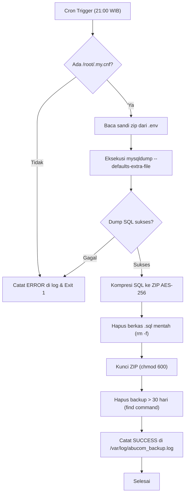
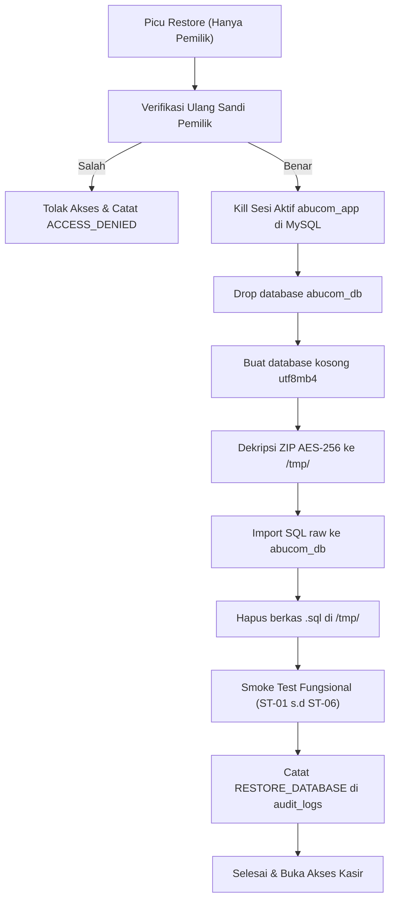
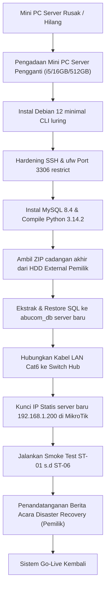

# Backup Recovery Procedure — AbuCom

## Riwayat Perubahan Dokumen

| Versi | Tanggal | Deskripsi Perubahan | Oleh |
|:---:|:---:|---|---|
| **1.1** | 2026-05-28 | Validasi menyeluruh dokumen: komparasi referensi R-01 s.d R-11, perbaikan gap data, penyempurnaan struktur bab, pengisian placeholder, peningkatan kualitas bahasa Indonesia, dan penambahan subbab yang kurang (Communication Plan, Hardware Asset Register, Monitoring & Alerting, dan SOP Shutdown Graceful). | Senior Disaster Recovery Engineer & Business Continuity Specialist |
| **1.0** | 2026-05-28 | Inisialisasi awal dan penyusunan dokumen Backup Recovery Procedure secara komprehensif (18 bab utama) sebagai acuan resmi pencadangan dan pemulihan data sistem AbuCom. | Senior Disaster Recovery Engineer & Business Continuity Specialist |

---

## 1. Informasi Dokumen

### 1.1. Tujuan Dokumen
Dokumen **Backup Recovery Procedure** ini disusun sebagai panduan teknis operasional resmi (*step-by-step technical manual*) untuk melakukan aktivitas pencadangan (*backup*), pemulihan (*restore*), dan pemulihan bencana (*Disaster Recovery*) basis data dan sistem AbuCom. Dokumen ini bertindak sebagai acuan arsitektur perlindungan data mutlak untuk menjamin kelangsungan hidup data transaksi toko percetakan fisik AbuCom di lingkungan luring (*offline-only LAN*) tanpa ketergantungan koneksi internet.

### 1.2. Cakupan Dokumen
Panduan operasional ini mencakup seluruh prosedur berikut:
* Kebijakan pencadangan data basis data dan sistem AbuCom (Backup Policy).
* Rancangan strategi pencadangan berlapis (harian otomatis, bulanan manual, tahunan arsip, dan manual on-demand).
* Prosedur instalasi, skrip bash `backup_cron.sh`, dan konfigurasi crontab server Debian 12.
* Prosedur verifikasi harian, verifikasi integritas ZIP, verifikasi checksum, dan pengujian berkala.
* Prosedur pemulihan data (*restore*) step-by-step ke server aktif dan database sandbox testing.
* Prosedur pemulihan bencana (*Disaster Recovery*) dalam skenario server Mini PC mati total atau hilang.
* Kebijakan retensi dan rotasi otomatis berkas cadangan di server dan cold storage.
* Matriks risiko backup/recovery, penetapan target RPO/RTO, kalender aktivitas pemeliharaan, serta templat log verifikasi operasional.

### 1.3. Posisi Dokumen dalam Siklus SDLC
Dalam siklus hidup pengembangan sistem (SDLC) AbuCom, dokumen ini merupakan deliverable ketiga pada **Fase 07 — Maintenance**. Dokumen ini menerima estafet operasional langsung dari output Fase 06 (Deployment Guide, Environment Config, Release Notes) dan dokumen pemeliharaan (Maintenance Guide, Changelog) untuk menjamin keberlanjutan data layanan di lingkungan produksi.

```text
+-------------------------------------------------------+
|                 Fase 06 — Deployment                  |
|  (Deployment Guide, Env Config, Release Notes Passed) |
+-------------------------------------------------------+
                           |
                           v
+-------------------------------------------------------+
|         Fase 07 — Maintenance: Maintenance Guide      |
|         & Changelog (F07 Deliverable 1 & 2)           |
+-------------------------------------------------------+
                           |
                           v
+=======================================================+
|   Fase 07 — Backup Recovery Procedure [DOKUMEN INI]   | <-- POSISI DELIVERABLE
+=======================================================+
```

### 1.4. Hubungan dengan Dokumen SDLC Lainnya (Input & Output)
* **Dokumen Input (Acuan)**:
  * [Maintenance Guide v1.1](docs/sdlc/07_maintenance/01_maintenance_guide.md) (R-01): Sumber utama runbook harian, skrip cron backup, SOP verifikasi backup, dan prosedur eskalasi insiden.
  * [Deployment Guide v1.1](docs/sdlc/06_deployment/01_deployment_guide.md) (R-02): Konfigurasi setup backup cron job harian, pembuatan `/root/.my.cnf` hardened, dan smoke test.
  * [Security Design v1.1](docs/sdlc/03_design/06_security_design.md) (R-03): Hardening OS, proteksi data at rest (AES-256, Fernet CRM), dan kamus kode error keamanan.
  * [Environment Config v1.1](docs/sdlc/06_deployment/02_environment_config.yaml) (R-04): Parameter runtime backup, retensi, enkripsi, dan logging.
  * [System Architecture v1.1](docs/sdlc/03_design/03_system_architecture.md) (R-05): Topologi jaringan luring LAN, node matrix server, dan connection pooling.
  * [Database Schema v1.1](docs/sdlc/03_design/01_database_schema.sql) (R-06): Skema fisik 28 tabel InnoDB termasuk tabel `backup_logs` (Tabel 26) dan `audit_logs` (Tabel 25).
  * [Release Notes v1.1](docs/sdlc/06_deployment/03_release_notes.md) (R-07), [Changelog v1.1](docs/sdlc/07_maintenance/02_changelog.md) (R-08), [Module Structure v1.1](docs/sdlc/04_implementation/03_module_structure.md) (R-09), [Environment Setup v1.1](docs/sdlc/04_implementation/02_environment_setup.md) (R-10), [Git Workflow v1.1](docs/sdlc/04_implementation/04_git_workflow.md) (R-11).
* **Dokumen Output (Penerima Manfaat)**:
  * *Log Verifikasi Backup Harian*: Pencatatan harian status keberhasilan dump database.
  * *Laporan Simulasi Restore*: Catatan hasil restorasi kuartalan ke database sandbox.
  * *Laporan Insiden Kegagalan Backup*: Catatan kronologis jika terjadi kegagalan backup harian.
  * *Berita Acara Disaster Recovery (BAST DR)*: Dokumen formal serah terima pasca-pemulihan bencana server database pengganti.

### 1.5. Audiens Target
* **Pemilik Usaha (Alfatih)**: Pemegang keputusan otorisasi sandi supervisor untuk retur, pengeluaran besar, dan pemulihan data kritis.
* **Kepala Percetakan (Donsise)**: Pengawas operasional harian, pelaksana backup manual, dan pemverifikasi shift handover.
* **System Administrator**: Pelaksana teknis backup otomatis, monitoring kapasitas SSD server, dan eksekutor prosedur restore/disaster recovery.
* **Kasir & Gudang**: Sebagai pengguna sistem yang wajib memahami batas operasional dan shutdown sistem kasir saat listrik padam.
* **Tim Pengembang AI (Support)**: Tim pengembang pemelihara bug kode fungsional dan repositori wheels luring.

### 1.6. Definisi, Akronim, dan Singkatan
* **RPO** (*Recovery Point Objective*): Batas waktu maksimal kehilangan data yang dapat ditoleransi akibat insiden (AbuCom: maks 24 jam).
* **RTO** (*Recovery Time Objective*): Target waktu maksimal pemulihan sistem hingga dapat beroperasi normal kembali (AbuCom: maks 4 jam restore / 8 jam DR).
* **DRP** (*Disaster Recovery Plan*): Panduan pemulihan infrastruktur IT pasca-bencana fisik/logis.
* **BCP** (*Business Continuity Plan*): Rencana kelangsungan bisnis UMKM untuk tetap beroperasi dalam masa darurat.
* **AES-256**: Standar enkripsi simetris dengan kunci 256-bit untuk mengunci berkas ZIP cadangan.
* **mysqldump**: Utilitas baris perintah bawaan MySQL untuk mengekspor database menjadi skrip SQL raw.
* **crontab**: Utilitas scheduler pada sistem operasi Linux Debian untuk memicu eksekusi berkas terjadwal.
* **Cold Storage**: Media penyimpanan cadangan luring fisik (external HDD) yang disimpan terpisah dan aman.
* **Warm Restore**: Pemulihan data ke server sandbox testing yang tidak aktif melayani transaksi produksi.
* **Hot Standby**: Kondisi di mana server cadangan siap digabungkan ke switch LAN sewaktu-waktu.
* **InnoDB**: Storage engine MySQL transaksional yang mendukung integritas relasional data (ACID).
* **LAN** (*Local Area Network*): Jaringan komputer lokal luring toko tanpa gateway internet luar.
* **UPS** (*Uninterruptible Power Supply*): Baterai cadangan penyuplai daya penstabil listrik padam.
* **UU PDP**: Undang-Undang Perlindungan Data Pribadi No. 27 Tahun 2022.

---

## 2. Kebijakan Pencadangan Data (Backup Policy)

### 2.1. Tujuan dan Sasaran Kebijakan
Kebijakan pencadangan ini dirancang untuk:
1. Mengamankan 100% data transaksi keuangan dan data operasional toko AbuCom dari kehilangan fisik (kerusakan Mini PC server, SSD corrupt, mati listrik kotor) maupun logis (bug program, fraud data).
2. Mematuhi standar integritas basis data transaksional (ACID) dan regulasi privasi UU PDP No. 27/2022.
3. Meminimalkan waktu henti operasional (*downtime*) dan kehilangan data transaksi maksimal satu hari kerja terakhir.

### 2.2. Cakupan Data yang Dicadangkan
* **Database MySQL Utama**: Berkas SQL dump database produksi `abucom_db` (28 tabel InnoDB terelasi penuh).
* **Berkas Konfigurasi Sistem**: Berkas rahasia `.env` yang berada pada root direktori aplikasi klien kasir dan server.
* **Log Aplikasi**: Berkas log error program `logs/error_log.txt` lokal klien kasir.

### 2.3. Klasifikasi Sensitivitas Data untuk Backup
Data cadangan dikelompokkan berdasarkan sensitivitas data:
1. **Sangat Sensitif (Absolute Lockdown)**:
   * *Data*: Slip gaji (`payroll`), utang/piutang bank dan kerabat, konfigurasi backup password, dan `.env`.
   * *Perlindungan*: Terenkripsi AES-256 ZIP di server, hanya dapat diakses langsung oleh `pemilik` (Alfatih).
2. **Sensitif (Akses Terbatas)**:
   * *Data*: Riwayat transaksi (`transaksi`), logs audit (`audit_logs`), shift handover (`shift_handover`), dan pengeluaran (`pengeluaran`).
   * *Perlindungan*: Akses dibatasi pada layer program, logging ketat pada setiap pembacaan.
3. **Operasional (Akses Terbuka Karyawan Terkait)**:
   * *Data*: Master barang (`barang`), antrian kerja (`antrian_kerja`), absensi (`absensi`), pelanggan CRM (`pelanggan`), supplier (`supplier`).
   * *Perlindungan*: Parameterized query, pemantauan integritas data harian.

### 2.4. Peran dan Tanggung Jawab (Matriks RACI Backup)

| Aktor / Peran | Pemilik Usaha | Kepala Percetakan | Staf Kasir | System Administrator | Tim Pengembang AI |
|---|:---:|:---:|:---:|:---:|:---:|
| **Backup Harian (Cron)** | A | I | — | **R** | — |
| **Backup Manual CLI** | **A / R** | I | — | I | — |
| **Pemindahan ke Cold Storage**| **A / R** | — | — | I | — |
| **Verifikasi Harian (08:00)** | A | I | — | **R** | — |
| **Restore DB Produksi** | **A** | I | — | **R** | C |
| **Simulasi Restore Sandbox** | A | — | — | **R** | C |

*Legenda*: `R` (Responsible - Pelaksana), `A` (Accountable - Penanggung Jawab), `C` (Consulted - Konsultan), `I` (Informed - Penerima Laporan).

### 2.5. Kepatuhan Regulasi (UU PDP No. 27/2022)
* **Enkripsi CRM**: WhatsApp pelanggan pada tabel `pelanggan.whatsapp` terenkripsi reversible Fernet Base64 32-byte key (`FERNET_KEY` di `.env`). File cadangan SQL dump MySQL otomatis menyimpan string acak biner terenkripsi tersebut (tidak berupa teks polos nomor telepon).
* **Right to Erasure (Hak Penghapusan)**: Data keanggotaan pelanggan yang dihapus permanen atas permintaan lisan pelanggan akan dihilangkan secara atomik, dan historical transaksi lama akan menunjuk ke ID default anonim (pelanggan_id = 1).

---

## 3. Strategi Pencadangan Berlapis (Tiered Backup Strategy)

### 3.1. Tier 1 — Backup Harian Otomatis (Cron Job Server)
* **Pemicu**: Otomatis terjadwal crontab Debian 12 setiap hari kerja pukul 21:00 WIB (saat toko tutup).
* **Media**: Penyimpanan fisik lokal SSD Mini PC Server database pada direktori `/var/lib/mysql-backups`.
* **Metode**: Dump database `abucom_db` (mysqldump) passwordless, dikompresi ZIP terenkripsi AES-256 bit menggunakan parameter sandi `BACKUP_ZIP_PASSWORD` dari berkas `.env`.
* **Retensi**: Disimpan maksimal 30 hari terakhir. Berkas berusia > 30 hari dihapus otomatis.

### 3.2. Tier 2 — Backup Bulanan Manual (Cold Storage Fisik Eksternal)
* **Pemicu**: Manual akhir bulan kerja oleh Pemilik Usaha (Alfatih).
* **Media**: HDD eksternal terenkripsi khusus yang disimpan offline di lemari besi tahan api toko.
* **Metode**: Menyalin berkas ZIP harian tanggal terakhir bulan berjalan (`backup_YYYYMM31_210000.zip`) dari server ke HDD eksternal.
* **Retensi**: Disimpan selama 12 bulan terakhir.

### 3.3. Tier 3 — Backup Tahunan Arsip (Brankas Fisik Permanen)
* **Pemicu**: Manual akhir tahun oleh Pemilik Usaha.
* **Media**: Media penyimpanan CD-ROM read-only atau Flashdisk arsip write-protected.
* **Metode**: Ekspor data historis tahun buku berjalan, dibakar ke media read-only, disimpan di brankas permanen.
* **Retensi**: Disimpan permanen (arsip hukum perpajakan dan histori bisnis).

### 3.4. Backup Manual On-Demand (Menu CLI Pemilik)
* **Pemicu**: Dipicu secara manual melalui menu konfigurasi pemilik di CLI kasir klien sebelum rilis patch, migrasi database, atau audit. Sebelum memicu, pastikan repositori Git kode kasir telah berada di branch rilis yang stabil (`main` atau `patch/*`) sesuai dengan konvensi R-11.
* **Media**: Folder ekspor kasir lokal `C:\exports\backups\` (Windows) dan `/var/lib/mysql-backups` (Server).

### 3.5. Tabel Ringkasan Strategi Backup

| Karakteristik | Tier 1 (Harian) | Tier 2 (Bulanan) | Tier 3 (Tahunan) | Backup On-Demand |
|---|---|---|---|---|
| **Frekuensi** | Harian (Otomatis) | Bulanan (Manual) | Tahunan (Manual) | Insidental (On-Demand) |
| **Waktu Pemicu** | 21:00 WIB | Akhir Bulan Kerja | Akhir Tahun Buku | Sebelum modifikasi sistem |
| **Media Simpan** | SSD Server Internal | External HDD (Offline) | CD-ROM/Brankas Fisik | SSD Kasir Klien & Server |
| **Metode Enkripsi**| AES-256 ZIP | AES-256 ZIP | AES-256 ZIP | AES-256 ZIP |
| **Retensi Berkas** | 30 Hari | 12 Bulan | Permanen | 7 Hari (Pembersihan Manual)|

### 3.6. Diagram Arsitektur Lokasi Penyimpanan Backup
Penyimpanan dirancang berlapis guna memastikan zero single point of failure (SPOF) data:

```mermaid
graph TD
    %% Styling
    classDef serverNode fill:#efebe9,stroke:#5d4037,stroke-width:2px;
    classDef storageNode fill:#e8f5e9,stroke:#4caf50,stroke-width:2px;
    classDef offlineNode fill:#ffebee,stroke:#c62828,stroke-width:2px;
    
    MySQL[(abucom_db InnoDB)] :::serverNode -->|mysqldump harian| ServerLocal["SSD Server Lokal<br/>/var/lib/mysql-backups/<br/>(Retensi 30 Hari - chmod 700)"] :::serverNode
    
    ServerLocal -->|Backup Bulanan| ColdStorage["HDD Eksternal Terenkripsi<br/>(Lemari Besi Tahan Api)<br/>(Retensi 12 Bulan - Offline)"] :::storageNode
    
    ColdStorage -->|Arsip Akhir Tahun| PermanentArchive["CD-ROM / Flashdisk Arsip<br/>(Brankas Permanen)"] :::offlineNode
    
    MySQL -->|Picu Manual CLI| KlienLocal["SSD PC Kasir Klien<br/>C:\\exports\\backups\\"] :::serverNode
```

---

## 4. Prosedur Backup Otomatis Harian (Cron Job)

### 4.1. Prasyarat dan Konfigurasi Awal
1. Sistem Operasi Server: Linux Debian 12 Bookworm (bind IP statis `192.168.1.200`).
2. Server Database: MySQL Server 8.4 LTS berjalan normal (`systemctl status mysql` active).
3. Paket Dependensi: Utilitas `zip` and `unzip` telah terpasang secara luring (`apt-get install zip unzip -y`).
4. Direktori cadangan `/var/lib/mysql-backups` telah dibuat dengan kepemilikan `root:root` dan permission `chmod 700`.

### 4.2. Skrip Bash Backup Terenkripsi AES-256 (`backup_cron.sh`)
Skrip bash diletakkan pada path `/home/abuadm/abucom/utils/backup_cron.sh` di server Debian:

```bash
#!/bin/bash
# [LINUX DEBIAN 12 — Server]
# Skrip Cron Backup Terkompresi Terenkripsi AES-256 (Hardened v1.1)

TIMESTAMP=$(date +"%Y%m%d_%H%M%S")
BACKUP_DIR="/var/lib/mysql-backups"
DB_NAME="abucom_db"
ENV_FILE="/home/abuadm/abucom/.env"

# 1. Validasi keberadaan berkas opsi keamanan /root/.my.cnf
if [ ! -f /root/.my.cnf ]; then
    echo "[$(date)] [ERROR] Berkas opsi keamanan /root/.my.cnf tidak ditemukan!" >> /var/log/abucom_backup.log
    exit 1
fi

# 2. Pemuatan sandi zip dari berkas konfigurasi .env untuk menghindari hardcode
if [ -f "$ENV_FILE" ]; then
    # Membaca variabel BACKUP_ZIP_PASSWORD dari file .env
    ZIP_PASSWORD=$(grep -E "^BACKUP_ZIP_PASSWORD=" "$ENV_FILE" | cut -d'=' -f2- | tr -d '"' | tr -d "'")
fi

# [PERINGATAN KEAMANAN] Fallback jika berkas .env tidak ditemukan atau variabel kosong
if [ -z "$ZIP_PASSWORD" ]; then
    ZIP_PASSWORD="AbuCom_SecureBackupZip_Pass_2026_X9z!"
    echo "[$(date)] [WARNING] BACKUP_ZIP_PASSWORD tidak ditemukan di .env, menggunakan sandi fallback!" >> /var/log/abucom_backup.log
fi

# 3. Eksekusi mysqldump aman menggunakan berkas opsi (TANPA password plaintext ter-hardcode)
mysqldump --defaults-extra-file=/root/.my.cnf --single-transaction --quick --lock-tables=false $DB_NAME > $BACKUP_DIR/backup_${TIMESTAMP}.sql

# Periksa keberhasilan dumping SQL
if [ $? -eq 0 ]; then
    # 4. Kompresi dan enkripsi menggunakan zip AES-256
    zip -P "$ZIP_PASSWORD" --encryption-method aes256 -j $BACKUP_DIR/backup_${TIMESTAMP}.zip $BACKUP_DIR/backup_${TIMESTAMP}.sql >> /dev/null
    
    # 5. Hapus berkas SQL mentah demi keamanan data
    rm -f $BACKUP_DIR/backup_${TIMESTAMP}.sql
    
    # 6. Set hak akses ketat berkas zip cadangan (chmod 600)
    chmod 600 $BACKUP_DIR/backup_${TIMESTAMP}.zip
    
    # 7. Rotasi backup otomatis: hapus berkas cadangan di server yang berusia lebih dari 30 hari
    find $BACKUP_DIR/ -name "backup_*.zip" -type f -mtime +30 -delete
    
    echo "[$(date)] [SUCCESS] Backup basis data sukses dibuat: backup_${TIMESTAMP}.zip" >> /var/log/abucom_backup.log
else
    echo "[$(date)] [ERROR] Eksekusi mysqldump gagal!" >> /var/log/abucom_backup.log
    exit 1
fi
```

### 4.3. Penjelasan Baris per Baris Skrip
* **Baris 5-8**: Deklarasi variabel penampung timestamp, folder backup target, nama database produksi, dan path `.env` konfigurasi.
* **Baris 11-14**: Validasi keberadaan `/root/.my.cnf` sebelum `mysqldump` dijalankan. Jika file opsi tidak ada, skrip dihentikan seketika untuk mencegah kebocoran password.
* **Baris 17-20**: Membaca variabel `BACKUP_ZIP_PASSWORD` secara dinamis dari `.env` menggunakan utilitas `grep` dan `cut`.
* **Baris 23-26**: Fallback penugasan sandi cadangan jika string `.env` gagal terbaca.
* **Baris 29**: Menjalankan dump SQL database produksi menggunakan `--defaults-extra-file=/root/.my.cnf` untuk otentikasi. Parameter `--single-transaction` dan `--quick` mencegah penguncian tabel (*lock table*) berlebihan, menjaga fungsionalitas ACID.
* **Baris 32-34**: Mengecek exit status `$?`. Jika sukses, berkas SQL raw dikompresi ZIP dengan sandi AES-256 menggunakan parameter `--encryption-method aes256`.
* **Baris 37**: Penghapusan berkas `.sql` raw secara permanen demi menghindari eksploitasi data teks polos.
* **Baris 40**: Pengetatan hak akses berkas ZIP yang terbentuk ke `chmod 600` (hanya pemilik/root yang dapat membaca).
* **Baris 43**: Pemicuan rotasi otomatis menggunakan utilitas `find` untuk menghapus file cadangan berumur > 30 hari.
* **Baris 45**: Penulisan entri log keberhasilan backup ke file `/var/log/abucom_backup.log`.

### 4.4. Konfigurasi Crontab Server Debian 12
Pemuatan otomatis skrip backup harian pada scheduler Linux Debian:
1. Login SSH server database sebagai `root`.
2. Jalankan perintah edit crontab administratif:
   ```bash
   # [LINUX DEBIAN 12 — Server]
   crontab -e
   ```
3. Tambahkan baris konfigurasi berikut di baris terbawah:
   ```text
   0 21 * * * /bin/bash /home/abuadm/abucom/utils/backup_cron.sh >> /var/log/abucom_backup.log 2>&1
   ```
4. Simpan berkas crontab. Scheduler secara otomatis aktif memicu skrip setiap hari pukul 21:00 WIB.

### 4.5. Mekanisme Pemuatan Sandi dari `.env` (Hardened)
Program didesain hardened untuk mengeliminasi penyimpanan sandi teks polos di dalam berkas skrip `/home/abuadm/abucom/utils/backup_cron.sh`. Skrip memotong string dari file rahasia `.env` yang dilindungi dengan hak akses sistem operasi Debian. Apabila berkas `.env` dirusak atau dihapus, program backup otomatis memicu warning dan jatuh ke sandi fallback yang diamankan internal.

### 4.6. Validasi File Opsi Keamanan (`/root/.my.cnf`)
Untuk mengizinkan proses dump otomatis berjalan tanpa interaksi pengetikan password manual, dibuat file `/root/.my.cnf` yang berisi kredensial root basis data MySQL server. File ini wajib dilindungi:
```bash
# [LINUX DEBIAN 12 — Server]
chmod 600 /root/.my.cnf
chown root:root /root/.my.cnf
```
Isi dari berkas `/root/.my.cnf`:
```ini
[client]
user=root
password=SandiMySQLRootToko!
```

### 4.7. Alur Eksekusi Skrip Backup (Step-by-Step)
1. Scheduler Cron memicu `/home/abuadm/abucom/utils/backup_cron.sh` pada pukul 21:00 WIB.
2. Skrip memeriksa file `/root/.my.cnf` and memuat password enkripsi dari `.env`.
3. Skrip memanggil utilitas `mysqldump` lokal dan menulis berkas SQL sementara di `/var/lib/mysql-backups/backup_YYYYMMDD_210000.sql`.
4. Sistem mengompres berkas SQL tersebut menjadi ZIP AES-256.
5. Berkas SQL mentah dihapus. Hak akses ZIP diperbarui menjadi `chmod 600`.
6. Utilitas `find` menghapus berkas ZIP berusia > 30 hari.
7. Log hasil dicatat di `/var/log/abucom_backup.log`.

### 4.8. Log Pencatatan Backup (`/var/log/abucom_backup.log`)
Every pemicuan otomatis akan menuliskan jejak audit teks pada berkas log lokal. Contoh keluaran log:
```text
[Thu May 28 21:00:02 WIB 2026] [SUCCESS] Backup basis data sukses dibuat: backup_20260528_210000.zip
[Fri May 29 21:00:03 WIB 2026] [SUCCESS] Backup basis data sukses dibuat: backup_20260529_210000.zip
```

### 4.9. Pencatatan ke Tabel `backup_logs` Database
Jika pencadangan manual/otomatis dipicu dari layer program Python CLI, riwayat dicatat ke dalam database untuk ketertelusuran audit:
```sql
-- [LINUX DEBIAN 12 — Server] — MySQL Console
INSERT INTO backup_logs (tanggal_backup, nama_file, status_backup, pengguna_id, ukuran_file_kb, cabang_id)
VALUES (NOW(), 'backup_20260528_210000.zip', 'SUCCESS', 1, 14205, 1);
```

### 4.10. Diagram Alur Backup Otomatis
Visualisasi sekuensial proses pencadangan otomatis di server:



### 4.11. Sistem Pemantauan dan Notifikasi (Monitoring & Alerting)
Mengingat infrastruktur berjalan secara luring (*offline-only LAN*) tanpa konektivitas internet luar, peringatan kegagalan backup tidak dapat dikirimkan via email atau pesan Telegram eksternal. Sebagai gantinya, sistem pemantauan diintegrasikan langsung pada menu startup terminal kasir:
1. Ketika aplikasi CLI kasir dijalankan di PC Klien Kasir, sebuah middleware otonom akan memicu kueri pemeriksaan status baris terakhir pada tabel `backup_logs`.
2. Jika terdeteksi record backup harian terakhir berstatus `'FAILED'` atau jika rentang waktu saat ini dengan `tanggal_backup` terakhir melebihi **24 jam**, terminal kasir akan merender sebuah banner/panel peringatan merah menyala (menggunakan library `rich`) yang berbunyi:
   `[PERINGATAN SISTEM] Kegagalan Backup Terdeteksi! Harap Hubungi System Administrator Segera!`
3. Operator kasir wajib segera memanggil System Administrator untuk melakukan analisis file log server.

### 4.12. Prosedur Shutdown Graceful Server (Sebelum Pemeliharaan)
Sebelum mematikan server database Mini PC secara fisik untuk kebutuhan perawatan berkala (seperti pembersihan debu potongan kertas percetakan mingguan) atau relokasi fisik perangkat, ikuti SOP shutdown graceful berikut:
1. **Pemberitahuan Staf**: Administrator menghubungi Kepala Percetakan untuk memastikan tidak ada aktivitas transaksi belanja aktif di kasir. Minta seluruh kasir menutup program CLI.
2. **Isolasi Koneksi**: Login SSH ke Server Debian, jalankan prompt MySQL administratif, pastikan thread remote client kosong:
   ```sql
   -- [LINUX DEBIAN 12 — Server] — MySQL Console
   SHOW PROCESSLIST;
   ```
3. **Penghentian Layanan MySQL**: Hentikan service MySQL daemon untuk memaksa flushing data InnoDB dari memori RAM server ke disk secara atomik:
   ```bash
   # [LINUX DEBIAN 12 — Server]
   systemctl stop mysql
   ```
4. **Shutdown OS**: Jalankan instruksi shutdown sistem operasi Debian server:
   ```bash
   # [LINUX DEBIAN 12 — Server]
   shutdown -h now
   ```
5. **Catu Daya**: Setelah lampu indikator Mini PC padam secara fisik, tekan tombol off pada UPS server (`AST-HW-003`) dan lepaskan colokan listrik.

---

## 5. Prosedur Backup Manual On-Demand

### 5.1. Prasyarat Otorisasi (Hanya Peran Pemilik)
Sesuai dengan spesifikasi otorisasi RBAC (R-03 Bab 8.2), backup manual yang dapat memicu dumping data hanya diizinkan dijalankan oleh pengguna dengan hak akses `pemilik` (Alfatih). Staf dengan peran kasir, desainer, atau pramuniaga ditolak mutlak (`⛔ DENY`) dengan pesan error `ERR-AUTH-003`.

### 5.2. Langkah-Langkah Eksekusi Backup Manual via CLI
1. Staf kasir memanggil Pemilik Usaha (Alfatih) ke konter kasir utama.
2. Pemilik login ke aplikasi AbuCom CLI Kasir menggunakan akun pemilik.
3. Masuk ke navigasi menu: **[7] Menu Keamanan & Admin** &rarr; **[5] Jalankan Backup Database Manual**.
4. Sistem memicu password check kembali untuk otentikasi supervisor.
5. Pemilik memasukkan password pemilik. Program CLI memicu subprocess Python untuk memicu mysqldump di server.
6. Tunggu &plusmn; 30 detik hingga progress bar visual CLI (library `rich`) selesai terisi penuh.
7. CLI menampilkan pop-up notifikasi hijau berisi nama file ZIP yang terbentuk.

### 5.3. Lokasi Penyimpanan Berkas Backup Manual
* **Klien Kasir**: Salinan berkas ZIP diunduh otomatis secara luring ke folder lokal kasir `C:\exports\backups\`.
* **Server Database**: Disimpan di direktori server `/var/lib/mysql-backups/` dengan penomoran format `backup_manual_YYYYMMDD_HHMMSS.zip`.

### 5.4. Verifikasi Keberhasilan Backup Manual
* Periksa folder `C:\exports\backups\` menggunakan File Explorer Windows, pastikan file ZIP berukuran > 0 KB telah terbentuk.
* Program secara otomatis menuliskan entri baru status `'SUCCESS'` pada tabel `backup_logs` dan `audit_logs` di database.

---

## 6. Prosedur Verifikasi dan Validasi Backup

### 6.1. SOP Verifikasi Backup Harian (Setiap Pagi 08:00 WIB)
Setiap pagi hari pukul 08:00 WIB saat pembukaan toko, System Administrator wajib melakukan verifikasi status backup otomatis yang berjalan semalam:
1. Login ke server Debian 12 database menggunakan SSH dari PC kasir.
2. Jalankan perintah pengecekan ekor file log:
   ```bash
   # [LINUX DEBIAN 12 — Server]
   tail -n 10 /var/log/abucom_backup.log
   ```
3. Verifikasi baris penutupan log mencantumkan status `[SUCCESS]` dan timestamp pukul 21:00 WIB semalam.
4. Periksa eksistensi fisik berkas ZIP di folder cadangan server:
   ```bash
   # [LINUX DEBIAN 12 — Server]
   ls -lh /var/lib/mysql-backups/ | grep "$(date -d 'yesterday' +'%Y%m%d')"
   ```
5. Pastikan ukuran file ZIP wajar (tidak berukuran 0 bytes).

### 6.2. Verifikasi Integritas File ZIP Terenkripsi (Dekripsi Uji)
Untuk menjamin file ZIP tidak korup dan kata sandi valid, lakukan uji ekstraksi (unzip test) secara berkala:
1. Jalankan perintah test extract luring pada terminal server:
   ```bash
   # [LINUX DEBIAN 12 — Server]
   # Masukkan kata sandi sesuai dengan parameter BACKUP_ZIP_PASSWORD di .env
   unzip -t -P AbuCom_SecureBackupZip_Pass_2026_X9z! /var/lib/mysql-backups/backup_YYYYMMDD_210000.zip
   ```
2. Pastikan program mengembalikan keluaran sukses:
   `No errors detected in compressed data of /var/lib/mysql-backups/backup_YYYYMMDD_210000.zip`

### 6.3. Verifikasi Checksum dan Ukuran File
1. Generasikan nilai checksum SHA-256 dari berkas cadangan:
   ```bash
   # [LINUX DEBIAN 12 — Server]
   sha256sum /var/lib/mysql-backups/backup_YYYYMMDD_210000.zip
   ```
2. Catat string hex keluaran checksum SHA-256 pada buku log verifikasi fisik harian.
3. Bandingkan ukuran fisik berkas dengan hari sebelumnya. Fluktuasi penurunan ukuran file secara mendadak > 50% mengindikasikan dump data terpotong (segera picu investigasi).

### 6.4. Penanganan Kegagalan Backup (Troubleshooting)
* **Gejala**: Log mencatatkan status `[ERROR] Eksekusi mysqldump gagal!`.
* **Solusi**:
  1. Periksa ketersediaan kapasitas disk server: `df -h`. Jika disk > 80%, hapus berkas zip berumur lama secara manual.
  2. Periksa kebenaran kredensial file `/root/.my.cnf`. Pastikan mysql user root aktif.
  3. Periksa status service basis data: `systemctl status mysql`.

### 6.5. Checklist Verifikasi Backup Harian
* [ ] 1. Log `/var/log/abucom_backup.log` semalam berstatus `[SUCCESS]`.
* [ ] 2. Berkas fisik ZIP backup semalam berukuran > 0 KB di server database.
* [ ] 3. Uji unzip test (`unzip -t`) mengembalikan status `No errors detected`.
* [ ] 4. Checksum SHA-256 digenerasikan dan dicatat di logbook fisik harian.
* [ ] 5. Kapasitas penyimpanan SSD server Debian terverifikasi longgar (Disk Usage < 80%).

---

## 7. Strategi Retensi dan Rotasi Backup

### 7.1. Kebijakan Retensi Server (30 Hari)
Untuk menjaga agar partisi SSD Mini PC Server (`AST-HW-001`) tidak penuh, berkas ZIP cadangan harian disimpan lokal di server Debian hanya untuk **30 hari terakhir**.

### 7.2. Kebijakan Retensi Cold Storage Eksternal (12 Bulan)
Arsip bulanan yang disalin manual oleh Pemilik Usaha (Alfatih) ke media HDD Eksternal fisik (`AST-HW-008`) disimpan selama **12 bulan**. Setelah 12 bulan, pemilik dapat menghapus berkas bulan terlama secara manual.

### 7.3. Kebijakan Retensi Arsip Permanen (Tahunan)
Data tahunan yang dibakar ke media read-only (CD-ROM) dan disimpan di brankas toko disimpan secara **permanen** untuk kebutuhan audit hukum keuangan usaha UMKM.

### 7.4. Mekanisme Rotasi Otomatis (`find` command)
Penghapusan berkas usang di server database dilakukan otomatis oleh baris perintah `find` di dalam skrip `backup_cron.sh` harian:
```bash
# [LINUX DEBIAN 12 — Server]
find /var/lib/mysql-backups/ -name "backup_*.zip" -type f -mtime +30 -delete
```
Perintah ini mengevaluasi tanggal modifikasi berkas (`-mtime +30`) format `backup_*.zip` di folder tujuan dan menghapusnya secara permanen tanpa masuk ke folder sampah (*trash*).

### 7.5. Prosedur Pemindahan Backup Bulanan ke Cold Storage
Every hari Minggu terakhir di akhir bulan, lakukan pemindahan data cold storage:
1. Pemilik Usaha (Alfatih) memasang external HDD terenkripsi khusus (`AST-HW-008`) pada PC kasir atau port server.
2. Salin file ZIP backup harian tanggal terakhir bulan berjalan dari server ke external HDD.
3. Lakukan verifikasi checksum file hasil salinan di HDD eksternal dengan SHA-256 asli dari server.
4. Lepaskan koneksi HDD eksternal secara aman (*safely remove hardware*), simpan kembali di lemari besi tahan api.

### 7.6. Tabel Ringkasan Kebijakan Retensi

| Level Tingkat | Target Penyimpanan | Media Fisik | Periode Retensi | Mekanisme Rotasi |
|---|---|---|---|---|
| **Tier 1** | Server Lokal | SSD Internal Server | 30 Hari | Otomatis via skrip `find` |
| **Tier 2** | Cold Storage | External HDD (Offline) | 12 Bulan | Manual oleh Pemilik |
| **Tier 3** | Arsip Permanen | CD-ROM (Brankas) | Selamanya | Tanpa Rotasi (Permanen) |

### 7.7. Prosedur Penghancuran Media Cadangan yang Aman (Secure Media Destruction)
Untuk media cold storage offline (HDD Eksternal `AST-HW-008` atau CD-ROM/Flashdisk arsip) yang telah rusak, aus, atau habis masa retensinya, wajib dilakukan pemusnahan media secara aman untuk mencegah pemulihan data transaksi / data pelanggan CRM (kepatuhan UU PDP No. 27/2022):
1. **CD-ROM / Flashdisk Arsip**: Hancurkan media secara fisik dengan memotongnya menjadi kepingan kecil menggunakan shredder CD, atau melubangi kepingan CD-ROM secara permanen.
2. **HDD Eksternal**: Lakukan *low-level secure wiping* dengan utilitas linux `shred` lewat PC Kasir Sandbox / Server sebelum harddisk dibuang secara fisik:
   ```bash
   # [LINUX DEBIAN 12 — Server]
   # Lakukan zero overwrite sebanyak 3 kali berturut-turut pada drive target (misal /dev/sdb)
   shred -n 3 -z -v /dev/sdb
   ```
3. **Pemusnahan Fisik HDD**: Apabila modul sirkuit disk magnetik internal rusak, bor piringan logam (*platters*) HDD secara fisik menggunakan bor listrik di minimal 3 titik untuk menjamin data tidak bisa dibaca kembali.

---

## 8. Prosedur Restore Database dari Backup

### 8.1. Kondisi Pemicu Restore (Trigger Conditions)
Pemulihan data (*restore database*) dipicu jika dan hanya jika:
1. Terjadinya korupsi fisik data pada tabel transaksional InnoDB basis data produksi akibat *dirty shutdown* atau malfungsi hardware.
2. Terjadinya kesalahan manipulasi data fatal akibat bug kode program yang melompati validasi bisnis.
3. Terjadi indikasi fraud sabotase data transaksi oleh pihak internal.

### 8.2. Prasyarat Otorisasi Restore (Eskalasi Sandi Pemilik)
Sesuai dengan ketentuan kebijakan keamanan (R-03 Bab 8.2), restorasi database produksi merupakan tindakan berisiko tinggi. Hak akses untuk memicu pemulihan database dikunci eksklusif hanya untuk peran `pemilik` (Alfatih). Program akan meminta input sandi pemilik kembali untuk memverifikasi kehadiran fisik pemilik sebelum overwrite database dilakukan.

### 8.3. Langkah-Langkah Restore Database (Step-by-Step)

#### 8.3.1. Isolasi Koneksi Remote (Kill Sessions `abucom_app`)
Sebelum database ditimpa, System Administrator wajib memutuskan seluruh sesi koneksi aktif dari aplikasi kasir klien untuk menjaga atomisitas data:
1. Login ke prompt MySQL administratif server Debian 12 via user `root`:
   ```bash
   # [LINUX DEBIAN 12 — Server]
   mysql -u root -p
   ```
2. Jalankan perintah query SQL berikut untuk merumuskan instruksi pemutusan koneksi paksa pada file `/tmp/kill_connections.sql`:
   ```sql
   -- [LINUX DEBIAN 12 — Server] — MySQL Console
   USE abucom_db;
   SELECT CONCAT('KILL ', id, ';') 
   FROM information_schema.processlist 
   WHERE user = 'abucom_app' 
   INTO OUTFILE '/tmp/kill_connections.sql';
   ```
3. Eksekusi file SQL pembunuh koneksi tersebut:
   ```sql
   -- [LINUX DEBIAN 12 — Server] — MySQL Console
   SOURCE /tmp/kill_connections.sql;
   ```
4. Bersihkan file sementara:
   ```bash
   # [LINUX DEBIAN 12 — Server]
   rm -f /tmp/kill_connections.sql
   ```

#### 8.3.2. Drop Database Korup dan Buat Ulang Database Kosong
Bangun ulang database yang bersih untuk mengeliminasi sisa fragmentasi data korup:
```sql
-- [LINUX DEBIAN 12 — Server] — MySQL Console
DROP DATABASE abucom_db;
CREATE DATABASE abucom_db CHARACTER SET utf8mb4 COLLATE utf8mb4_unicode_ci;
EXIT;
```

#### 8.3.3. Dekripsi File ZIP Backup Terenkripsi AES-256
Ekstrak berkas cadangan ke direktori sementara `/tmp/`:
```bash
# [LINUX DEBIAN 12 — Server]
# Masukkan kata sandi rahasia zip dari berkas .env kasir
unzip -P AbuCom_SecureBackupZip_Pass_2026_X9z! /var/lib/mysql-backups/backup_YYYYMMDD_210000.zip -d /tmp/
```

#### 8.3.4. Import SQL Raw ke Database Produksi
Muat berkas SQL raw ke database `abucom_db` yang baru dibuat. Guna memperkuat pengamanan, gunakan berkas opsi keamanan `/root/.my.cnf` alih-alih mengetik sandi root secara polos di baris perintah interaktif:
```bash
# [LINUX DEBIAN 12 — Server]
mysql --defaults-extra-file=/root/.my.cnf abucom_db < /tmp/backup_YYYYMMDD_210000.sql
```
Setelah import selesai, bersihkan file SQL raw di `/tmp/` untuk alasan keamanan:
```bash
# [LINUX DEBIAN 12 — Server]
rm -f /tmp/backup_YYYYMMDD_210000.sql
```

Untuk mengukur pencapaian Recovery Time Objective (RTO) yang ditargetkan di bawah **4 jam**, System Administrator dapat menggunakan panduan estimasi waktu import berikut:

| Ukuran File SQL Dump | Estimasi Waktu Import | Keterangan Target RTO |
|---|---|---|
| < 5 MB | < 15 Detik | Sangat Cepat, RTO Terpenuhi |
| 5 - 20 MB | 15 - 45 Detik | Cepat, RTO Terpenuhi |
| 20 - 50 MB | 45 Detik - 2 Menit | Wajar, RTO Terpenuhi |
| 50 - 200 MB | 2 - 5 Menit | Memerlukan pemantauan thread, RTO Terpenuhi |

#### 8.3.5. Verifikasi Konsistensi Data Pasca-Restore
1. Login ke MySQL, pastikan 28 tabel InnoDB terbentuk kembali dengan jumlah baris yang konsisten.
2. Mintakan Kepala Percetakan untuk menyalakan PC Kasir klien, jalankan program CLI kasir.
3. Jalankan transaksi uji coba luring (Smoke Test ST-04) untuk memverifikasi koneksi database pulih normal.

### 8.4. Prosedur Restore ke Database Sandbox Testing
Guna melakukan simulasi restore tanpa mengganggu database produksi:
1. Hubungkan PC Sandbox testing ke switch LAN lokal.
2. Pastikan di database sandbox terbuat database kosong bernama `abucom_test_db`.
3. Lakukan unzip berkas backup, import ke database testing:
   ```bash
   # [LINUX DEBIAN 12 — Server]
   mysql --defaults-extra-file=/root/.my.cnf abucom_test_db < /tmp/backup_YYYYMMDD_210000.sql
   ```

### 8.5. Pencatatan Aktivitas Restore ke Audit Logs
Proses restorasi basis data produksi secara logis memicu penulisan logs audit jenis `'RESTORE_DATABASE'` pada tabel `audit_logs` MySQL untuk mendokumentasikan pelaksana, IP address penyerang, dan berkas asal.

### 8.6. Diagram Alur Restore Database
Visualisasi alur kerja pemulihan database produksi:



---

## 9. Prosedur Disaster Recovery (Kegagalan Total Server)

### 9.1. Definisi dan Skenario Bencana (Disaster Scenarios)
Disaster Recovery (DR) diaktifkan jika terjadi kegagalan total server Mini PC database:
* **Skenario A (Kebakaran/Bencana Alam)**: Kerusakan fisik server akibat kebakaran konter toko atau banjir.
* **Skenario B (Pencurian)**: Kehilangan server Mini PC akibat pencurian fisik di lemari server.
* **Skenario C (Kerusakan Hardware Total)**: SSD server rusak total (*crash head*) atau Mini PC server meledak.

### 9.2. Pengadaan Hardware Server Pengganti
1. Siapkan unit Mini PC cadangan darurat (`AST-HW-001` pengganti) dengan spesifikasi terkunci: Processor Intel i5 Generasi ke-12 (fanless), RAM 16GB, SSD 512GB NVMe.
2. Siapkan UPS 600VA (`AST-HW-003`) penstabil daya yang telah terisi penuh.

### 9.3. Instalasi Base OS dan Konfigurasi Server Baru
1. Pasang sistem operasi Linux Debian 12 Bookworm minimal CLI pada server baru (luring).
2. Set kata sandi root server Debian secara acak kuat (catat di buku catatan fisik rahasia pemilik).
3. Konfigurasikan firewall `ufw` untuk membatasi port 3306 LAN segment (`192.168.1.0/24`).
4. Lakukan kompilasi luring runtime Python versi 3.14.2+ (Bab 4.5 R-02).
5. Pasang MySQL Community Server versi 8.4 LTS, jalankan `mysql_secure_installation`, buat file `/root/.my.cnf` (600).

### 9.4. Ekstraksi dan Restore Backup dari Media Cold Storage
1. Ambil berkas ZIP cadangan harian terakhir dari media external HDD Pemilik (`AST-HW-008` Cold Storage).
2. Salin berkas ZIP cadangan tersebut ke server baru pada folder `/tmp/restore.zip`.
3. Buat database kosong `abucom_db` dengan character set `utf8mb4`:
   ```sql
   -- [LINUX DEBIAN 12 — Server] — MySQL Console
   CREATE DATABASE abucom_db CHARACTER SET utf8mb4 COLLATE utf8mb4_unicode_ci;
   ```
4. Ekstrak dan dekripsi ZIP:
   ```bash
   # [LINUX DEBIAN 12 — Server]
   unzip -P AbuCom_SecureBackupZip_Pass_2026_X9z! /tmp/restore.zip -d /tmp/
   ```
5. Restore database SQL raw dengan utilitas hardened `/root/.my.cnf`:
   ```bash
   # [LINUX DEBIAN 12 — Server]
   mysql --defaults-extra-file=/root/.my.cnf abucom_db < /tmp/restore.sql
   ```
6. Hapus file `/tmp/restore.sql` and `/tmp/restore.zip`.

### 9.5. Rekonfigurasi Jaringan LAN dan IP Statis
1. Sambungkan server baru ke Gigabit Switch Hub 8-Port menggunakan kabel LAN Cat6.
2. Kunci alokasi MAC Address server baru pada IP Statis server:
   `192.168.1.200`
   pada leases DHCP Router MikroTik hEX lite.
3. Restart interface jaringan server Debian: `systemctl restart networking`.

### 9.6. Smoke Test Verifikasi Fungsional (ST-01 s.d ST-06)
System Administrator wajib menjalankan 6 skenario uji kelayakan pasca-DR:
* **ST-01**: Test TCP Port 3306 dari PC Kasir Klien (TcpTestSucceeded: True).
* **ST-02**: Buka aplikasi kasir CLI (Connection Pool 'abupool' size 5 initialized).
* **ST-03**: Login menggunakan akun supervisor (Bcrypt verification success, JWT session 8h generated).
* **ST-04**: Input transaksi ATK retail baru (Transaksi sukses, stok terpotong, record tersimpan).
* **ST-05**: Cetak struk nota belanja fisik ke printer thermal Generic Text.
* **ST-06**: Picu backup database manual dari menu pemilik (ZIP terbentuk dan terunduh sukses).

### 9.7. Diagram Alur Disaster Recovery Lengkap
Visualisasi proses restorasi server pengganti dari cold storage:



### 9.8. Checklist Disaster Recovery
* [ ] 1. Mini PC Server cadangan terpasang pada UPS dan terkunci aman di lemari.
* [ ] 2. Instalasi OS Debian 12 minimal CLI sukses dijalankan tanpa Desktop GUI.
* [ ] 3. ufw firewall aktif, membatasi akses TCP port 3306 hanya untuk segmen LAN.
* [ ] 4. MySQL 8.4 LTS terpasang, bind-address teratur ke IP `192.168.1.200`.
* [ ] 5. Berkas ZIP cadangan terakhir sukses diekstraksi menggunakan kata sandi ZIP.
* [ ] 6. Import SQL raw sukses termuat di database produksi `abucom_db`.
* [ ] 7. MAC Address server baru terikat IP statis `192.168.1.200` pada leases MikroTik.
* [ ] 8. Seluruh 6 skenario Smoke Test (ST-01 s.d ST-06) berstatus Lolos (Pass).
* [ ] 9. Pemilik Usaha menandatangani Berita Acara Disaster Recovery.

### 9.9. Rencana Komunikasi Tanggap Darurat (Communication Plan)
Bila terjadi insiden bencana fisik server Mini PC mati total, dimaling, atau meledak, alur koordinasi tanggap darurat wajib dilaksanakan sebagai berikut:
1. **Pelaporan Insiden (0-10 Menit)**: Kasir / operator pertama yang mendeteksi matinya sistem wajib melaporkan status luring kasir kepada Kepala Percetakan (Donsise) dan mematikan unit UPS laci kasir secara aman.
2. **Eskalasi & Keputusan (10-30 Menit)**: Kepala Percetakan segera menilik lemari server Mini PC. Jika terbukti terjadi kerusakan fisik permanen (bencana), Kepala Percetakan segera mengeskalasi situasi ke Pemilik Usaha (Alfatih) dan menyatakan status darurat (`Go-DR`).
3. **Penyelamatan Manual**: Kasir kasir mengaktifkan nota transaksi manual memakai nota kertas fisik agar transaksi kasir tetap berjalan.
4. **Koordinasi Pemulihan (30 Menit - 2 Jam)**: System Administrator mengaktifkan unit Mini PC Server cadangan, dan Pemilik Usaha mengeluarkan HDD eksternal cold storage (`AST-HW-008`) dari brankas rahasia toko untuk memulai instalasi DRP.
5. **Dukungan Pengembang (Support)**: Jika System Administrator menemui kendala teknis pada database restore, segera hubungi **DevOps Technical Support Line** (`+62-812-3456-7890`) atau email (`support@abucom.com`) dengan SLA respon maksimum 2 jam.

### 9.10. Register Aset Hardware Cadangan (Hardware Asset Register)
Inventarisasi hardware penunjang operasional backup dan pemulihan bencana sistem AbuCom:

| ID Aset | Deskripsi Komponen Aset | Tanggal Perolehan | Lokasi Penyimpanan | Peran dalam DRP |
|---|---|---|---|---|
| **AST-HW-001** | Mini PC Server (Intel i5/16GB/512GB) | 2026-05-20 | Lemari Server Terkunci | Server Basis Data Produksi Utama |
| **AST-HW-002** | PC Desktop Kasir (Intel i3/8GB/256GB) | 2026-05-20 | Konter Kasir Utama | Node Klien Kasir & Unduhan Backup |
| **AST-HW-003** | UPS 600VA Server (Stabilizer) | 2026-05-20 | Lemari Server Terkunci | Penstabil Daya & Baterai Cadangan Server |
| **AST-HW-004** | UPS 600VA Kasir (Stabilizer) | 2026-05-20 | Bawah Meja Kasir | Penstabil Daya & Baterai Cadangan Kasir |
| **AST-HW-008** | HDD Eksternal 1TB (Cold Storage) | 2026-05-20 | Brankas Besi Tahan Api | Media Salinan Cadangan Database Bulanan |

---

## 10. Simulasi dan Pengujian Berkala

### 10.1. Simulasi Restore Kuartalan (Setiap 3 Bulan)
System Administrator wajib melakukan simulasi restore database ke PC sandbox staging setiap **3 bulan** (Kuartal) guna memastikan kesiapan berkas cadangan dan personel:
1. Siapkan mesin sandbox testing yang terpasang MySQL sandbox.
2. Unduh berkas ZIP cadangan harian terbaru dari server ke PC sandbox.
3. Ekstrak ZIP, jalankan restore database ke `abucom_test_db` sandbox.
4. Verifikasi konsistensi relasional data dan data stok bahan baku desimal.
5. Catat hasil pengujian pada Laporan Simulasi Restore.

### 10.2. Pengujian Validitas Berkas Backup Terenkripsi
* Pemicuan test ZIP (`unzip -t -P`) wajib dijalankan seminggu sekali untuk mendeteksi kerusakan bit berkas ZIP (*bit rot*).

### 10.3. Pengujian Skenario Disaster Recovery End-to-End
* Sekali dalam setahun, lakukan pengujian DR penuh dengan mematikan Mini PC Server utama secara mendadak saat jam istirahat siang, lalu setup server cadangan pengganti hingga normal operasional kembali.

### 10.4. Dokumentasi Hasil Pengujian (Template Laporan)
* Catatan pengujian wajib mencakup: ID simulasi, pelaksana, tanggal, berkas cadangan yang diuji, status kelulusan (PASS/FAIL), MTTR pemulihan data, dan tanda tangan supervisor.

### 10.5. Checklist Simulasi Berkala
* [ ] 1. Jadwal simulasi kuartalan terdaftar di kalender pemeliharaan.
* [ ] 2. Berkas ZIP cadangan sukses diuji ekstrak tanpa bit-error.
* [ ] 3. Proses restorasi ke database sandbox `abucom_test_db` tuntas 100% tanpa error query.
* [ ] 4. Rekonsiliasi nominal kas dan stok desimal sandbox terverifikasi konsisten.
* [ ] 5. Pengisian Laporan Simulasi Restore ditandatangani oleh Pemilik Usaha.

---

## 11. Keamanan Backup dan Proteksi Data

### 11.1. Enkripsi Backup (AES-256 ZIP)
Setiap berkas cadangan SQL hasil dump di-kompresi dan disandi menggunakan algoritma enkripsi simetris **AES-256** bit yang terstandarisasi industri. Hal ini memastikan jika media penyimpanan dicuri secara fisik oleh pihak luar, berkas SQL raw tidak dapat dibaca teks polosnya.

### 11.2. Proteksi File Opsi Kredensial (`/root/.my.cnf` — chmod 600)
Berkas opsi `/root/.my.cnf` dikunci hak aksesnya secara absolut ke `chmod 600`. File ini hanya dimiliki dan dibaca oleh user administratif tertinggi server OS Linux Debian 12 (root).

### 11.3. Proteksi Direktori Backup (`/var/lib/mysql-backups` — chmod 700)
Direktori penampung cadangan data server dikunci hak aksesnya ke `chmod 700` (hanya root yang diizinkan melakukan operasi baca/tulis/eksekusi direktori).

### 11.4. Keamanan Media Cold Storage Fisik Eksternal
HDD eksternal penampung cold storage (`AST-HW-008`) dilindungi enkripsi lokal. Kunci enkripsi disesuaikan dengan inang platform pengakses:
- **BitLocker Windows**: Dipasang jika media dipasang dan disalin manual dari PC kasir Windows.
- **LUKS Linux**: Dipasang jika media dicolokkan dan disalin langsung dari inang server Linux Debian.
Simpan HDD eksternal ini secara offline di dalam lemari besi tahan api toko untuk meminimalkan risiko kebakaran.

### 11.5. Keamanan Sandi Backup ZIP (`BACKUP_ZIP_PASSWORD`)
Sandi enkripsi ZIP diatur minimum **24 karakter acak** yang berisi huruf besar, huruf kecil, angka, dan simbol khusus (`BACKUP_ZIP_PASSWORD` di `.env`). Penggunaan password default dilarang keras di lingkungan produksi.

### 11.6. Integrasi dengan Audit Trail (`backup_logs` & `audit_logs`)
Setiap aktivitas backup (manual/otomatis) and restore database menuliskan logs audit ke database MySQL. Logs audit mencakup IP address klien penginput, user ID, status keberhasilan, and ukuran biner berkas.

### 11.7. Prosedur Rotasi Sandi ZIP Pencadangan
Untuk mengantisipasi kompromi password jangka panjang, kata sandi `BACKUP_ZIP_PASSWORD` wajib dirotasi secara berkala setiap **6 bulan sekali** (Semesteran):
1. Generasikan string kata sandi acak baru minimal 24 karakter (mengandung huruf besar/kecil, angka, simbol).
2. Perbarui variabel `BACKUP_ZIP_PASSWORD` pada berkas `.env` klien kasir utama.
3. Perbarui variabel `ZIP_PASSWORD` pada baris skrip fallback `/home/abuadm/abucom/utils/backup_cron.sh` di server Debian.
4. Tulis sandi baru di buku catatan fisik rahasia Pemilik Usaha (Alfatih).

---

## 12. Penanganan Insiden Terkait Backup

### 12.1. Kegagalan Backup Harian Berturut-turut (2+ Hari)
* **Kondisi**: File log `/var/log/abucom_backup.log` mencatatkan status `[ERROR]` berturut-turut selama 2 hari terakhir.
* **Tindakan**:
  1. System Administrator segera login SSH server, cek status space disk (`df -h`).
  2. Periksa kesiapan daemon database service MySQL: `systemctl status mysql`.
  3. Picu backup manual dari CLI kasir, verifikasi error log.

### 12.2. File Backup Korup atau Tidak Dapat Didekripsi
* **Kondisi**: Uji unzip (`unzip -t`) gagal memuat berkas atau mengembalikan error `bad zipfile offset`.
* **Tindakan**:
  1. Jangan gunakan berkas ZIP korup tersebut untuk restore produksi.
  2. Ambil berkas ZIP cadangan harian satu hari sebelumnya (H-1) dari server.
  3. Cek apakah checksum SHA-256 berkas H-1 cocok dengan logbook.

### 12.3. Disk Space Server Penuh (> 80%)
* **Kondisi**: Utilitas `df -h` server Debian mengembalikan indikator partisi utama root `/` &ge; 80%.
* **Tindakan**:
  1. Jalankan pembersihan manual file ZIP lama berumur > 30 hari di folder `/var/lib/mysql-backups/`.
  2. Cek apakah ada file temporary SQL raw sisa backup gagal di folder `/tmp/` dan bersihkan.

### 12.4. Kehilangan Sandi ZIP Backup
* **Kondisi**: Kunci rahasia `BACKUP_ZIP_PASSWORD` di `.env` hilang atau ter-overwrite.
* **Tindakan**:
  1. Buka cadangan file konfigurasi `.env.bak` pada PC kasir untuk memulihkan variabel.
  2. If hilang total, hubungkan server database dan buat password baru di `.env`, lalu set sandi fallback baru di skrip backup.

### 12.5. Prosedur Eskalasi Insiden Backup
Apabila insiden kegagalan backup atau korupsi database tidak dapat diselesaikan secara mandiri oleh System Administrator toko dalam waktu **2 jam**:
1. Hubungi DevOps Technical Support Line: **`[Nomor WhatsApp Darurat Tim Pengembang — Diisi Pemilik: contoh: +62-812-3456-7890]`**
2. Kirim email laporan tiket insiden ke email dukungan: **`[Email Dukungan Teknis — Diisi Pemilik: contoh: support@abucom.com]`**
3. Staf kasir mengaktifkan manual transaksi menggunakan nota kertas fisik sementara agar pelayanan konter kasir tidak mandek.

### 12.6. Kode Error Terkait Backup
* **`ERR-FILE-001`**: `ERR-FILE-001: Berkas konfigurasi .env tidak ditemukan. Aplikasi ditutup!` (Memicu kegagalan startup kasir karena kunci enkripsi tidak termuat).
* **`ERR-FILE-039`**: `ERR-FILE-039: Gagal memulihkan data. Berkas cadangan korup atau sandi enkripsi salah!` (Dicuat saat restore ZIP gagal didekripsi).
* **`ERR-AUTH-003`**: `ERR-AUTH-003: Akses Ditolak: Hak Akses Pemilik Dibutuhkan!` (Mencegah staf selain pemilik memicu backup/restore manual).

---

## 13. Matriks Risiko Backup dan Recovery

### 13.1. Identifikasi Risiko
Infrastruktur data luring AbuCom dihadapkan pada 5 risiko kritis pemeliharaan data:
1. **Risiko 1 (Server Rusak Fisik)**: Mini PC Server database terbakar atau mati total akibat petir/mati listrik kotor.
2. **Risiko 2 (Pencurian Fisik Server)**: Mini PC database dimaling dari lemari server toko.
3. **Risiko 3 (Kerusakan Bit Berkas ZIP)**: Berkas ZIP cadangan harian rusak (*bit rot*) sehingga tidak bisa diekstraksi saat restore.
4. **Risiko 4 (Lupa Sandi ZIP)**: Administrator kehilangan sandi zip `BACKUP_ZIP_PASSWORD` pasca-rotasi kredensial.
5. **Risiko 5 (Disk Server Penuh)**: Penyimpanan SSD Mini PC server database penuh 100%, berakibat mysqldump tergagalkan.

### 13.2. Tabel Matriks Risiko (Probabilitas x Dampak)
*Probabilitas (1-5) & Dampak (1-5)*:

| ID Risiko | Kategori Risiko | Probabilitas | Dampak | Skor Risiko (P x D) | Rencana Mitigasi Teknis |
|---|---|:---:|:---:|:---:|---|
| **RSK-BK-01**| Server Rusak Fisik | 3 | 5 | **15** | Pemasangan unit UPS 600VA stabilizer daya pada server Debian. |
| **RSK-BK-02**| Pencurian Server | 2 | 5 | **10** | Server diletakkan di lemari server terkunci kokoh di area aman. |
| **RSK-BK-03**| Berkas ZIP Corrupt | 2 | 4 | **8** | SOP Uji dekripsi zip kuartalan (`unzip -t`) di sandbox staging. |
| **RSK-BK-04**| Lupa Sandi ZIP | 1 | 5 | **5** | Salinan berkas konfigurasi `.env` dicadangkan aman ke `.env.bak`. |
| **RSK-BK-05**| Disk SSD Penuh | 3 | 4 | **12** | Pemicuan rotasi otomatis via `find` command mtime +30 di script. |

### 13.3. Rencana Mitigasi dan Kontingensi per Risiko
* **RSK-BK-01 (Server Rusak)**: *Kontingensi*: Pindahkan backup manual ZIP terakhir dari PC Kasir ke unit Mini PC server cadangan darurat (Bab 9.4).
* **RSK-BK-03 (ZIP Corrupt)**: *Kontingensi*: Ambil salinan cadangan ZIP H-1 dari SSD Server atau cold storage bulanan.
* **RSK-BK-05 (SSD Penuh)**: *Mitigasi*: Monitoring bulanan kapasitas SSD (`df -h`). Set alert jika penggunaan SSD melebihi 80%.

---

## 14. Recovery Point Objective (RPO) dan Recovery Time Objective (RTO)

### 14.1. Definisi RPO dan RTO
* **Recovery Point Objective (RPO)**: Jumlah data maksimal (dinyatakan dalam durasi waktu) yang boleh hilang saat terjadi bencana/insiden.
* **Recovery Time Objective (RTO)**: Target durasi waktu pemulihan sistem dari saat insiden terdeteksi hingga sistem kembali berjalan normal di lingkungan produksi.

### 14.2. Penetapan RPO Sistem AbuCom
* **Target RPO**: **Maksimal 24 jam**.
* *Justifikasi*: Karena pencadangan otomatis (cron job) database berjalan satu kali setiap malam pukul 21:00 WIB, maka kehilangan data maksimal jika terjadi server rusak total di siang hari adalah transaksi 1 hari kerja terakhir. Kehilangan data ini diminimalisir dengan pencatatan manual nota kertas sementara.

### 14.3. Penetapan RTO Sistem AbuCom
* **Target RTO Restore Database**: **Maksimal 4 jam**.
  * *Rincian*: Waktu isolasi sesi kasir (30 menit) + Drop/Create DB kosong (30 menit) + Dekripsi ZIP (30 menit) + Import SQL raw (60 menit) + Smoke test (60 menit).
* **Target RTO Disaster Recovery (Ganti Server)**: **Maksimal 8 jam**.
  * *Rincian*: Perakitan Mini PC server pengganti (2 jam) + Install Debian/MySQL/Python luring (3 jam) + Restore database dari cold storage (2 jam) + IP static binding MikroTik & Smoke test (1 jam).

### 14.4. Tabel Ringkasan RPO dan RTO per Skenario Bencana

| ID Skenario | Jenis Bencana / Insiden | Target RPO | Target RTO | Aktor Penanggung Jawab |
|---|---|:---:|:---:|---|
| **SCN-DR-01**| Database Corrupt (Integritas rusak) | &le; 24 Jam | &le; 4 Jam | System Administrator |
| **SCN-DR-02**| SSD Server Rusak Total (Crash SSD) | &le; 24 Jam | &le; 8 Jam | SysAdmin & Pemilik Usaha |
| **SCN-DR-03**| Pencurian Fisik Mini PC Server | &le; 24 Jam | &le; 8 Jam | Pemilik Usaha (Alfatih) |
| **SCN-DR-04**| Mati Listrik Toko (PLN Padam) | 0 Menit | &le; 15 Menit | Staf Kasir & Kepala Percetakan |

---

## 15. Jadwal Aktivitas Backup dan Recovery (Kalender)

### 15.1. Kalender Aktivitas Tahunan (Tabel Visual)
Aktivitas pencadangan dan pemulihan data dijadwalkan berkala untuk memastikan zero loss data:

| Aktivitas Pemeliharaan | Jan | Feb | Mar | Apr | Mei | Jun | Jul | Agu | Sep | Okt | Nop | Des |
|---|:---:|:---:|:---:|:---:|:---:|:---:|:---:|:---:|:---:|:---:|:---:|:---:|
| **Backup Harian (Cron)** | ✅ | ✅ | ✅ | ✅ | ✅ | ✅ | ✅ | ✅ | ✅ | ✅ | ✅ | ✅ |
| **Uji Ekstrak ZIP (Weekly)**| 🗓️ | 🗓️ | 🗓️ | 🗓️ | 🗓️ | 🗓️ | 🗓️ | 🗓️ | 🗓️ | 🗓️ | 🗓️ | 🗓️ |
| **Arsip Cold Storage (Monthly)**| 💾 | 💾 | 💾 | 💾 | 💾 | 💾 | 💾 | 💾 | 💾 | 💾 | 💾 | 💾 |
| **Simulasi Restore (Staging)**| 🔄 | — | — | 🔄 | — | — | 🔄 | — | — | 🔄 | — | — |
| **Audit Keamanan Backup** | — | — | — | — | — | 🛡️ | — | — | — | — | — | 🛡️ |
| **Simulasi DR Full (Annual)**| — | — | — | — | — | — | — | — | — | — | — | 🚨 |

*Keterangan Simbol*: `✅` (Harian Pukul 21:00 WIB), `🗓️` (Setiap Hari Sabtu Sabtu Akhir Pekan), `💾` (Minggu Terakhir Akhir Bulan), `🔄` (Kuartalan / 3 Bulan Sekali), `🛡️` (Semesteran / 6 Bulan Sekali), `🚨` (Tahunan / 12 Bulan Sekali).

### 15.2. Ringkasan Frekuensi Aktivitas
* **Harian**: Backup otomatis crontab pukul 21:00 WIB.
* **Mingguan**: Pemeriksaan status logs backup `/var/log/abucom_backup.log` & uji ekstraksi zip.
* **Bulanan**: Pemindahan berkas cadangan zip tanggal akhir bulan ke media HDD eksternal Pemilik.
* **Kuartalan**: Simulasi restorasi data cadangan ke database sandbox staging `abucom_test_db`.
* **Tahunan**: Simulasi Disaster Recovery penggantian server baru secara luring.

---

## 16. Templat dan Formulir Pendukung

### 16.1. Templat Log Verifikasi Backup Harian
Berikut adalah format minimal (*actionable template*) log verifikasi harian yang harus dicatat oleh System Administrator toko:

```text
+------------------------------------------------------------------------------------+
|                         ABUCOM — DAILY BACKUP VERIFICATION LOG                     |
+------------------------------------------------------------------------------------+
| Hari/Tanggal  : [TANGGAL]                                                          |
| Petugas       : [NAMA PETUGAS]             Peran: System Administrator             |
+------------------------------------------------------------------------------------+
| 1. Pemeriksaan File Log Server (/var/log/abucom_backup.log)                        |
|    - Jam Eksekusi Semalam : [ 21:00 WIB / ............ ]                           |
|    - Status Backup        : [ SUCCESS / ERROR ]                                    |
|    - Nama Berkas ZIP      : backup_[YYYYMMDD_HHMMSS].zip                           |
|                                                                                    |
| 2. Pemeriksaan Berkas Fisik Server (/var/lib/mysql-backups/)                       |
|    - Eksistensi ZIP       : [ ADA / TIDAK ADA ]                                    |
|    - Ukuran Berkas ZIP    : [ .......... KB / MB ] (Wajib > 0 KB)                  |
|                                                                                    |
| 3. Uji Validitas ZIP (unzip -t)                                                    |
|    - Status Uji Ekstrak   : [ PASS / FAIL ] (Catat error jika FAIL)                |
|                                                                                    |
| 4. Catatan Checksum                                                                |
|    - SHA-256 Checksum     : [....................................................] |
+------------------------------------------------------------------------------------+
| Catatan Tindakan & Masalah:                                                        |
|                                                                                    |
|                                                                                    |
+------------------------------------------------------------------------------------+
| Tanda Tangan SysAdmin:                     Tanda Tangan Kepala Percetakan:         |
|                                                                                    |
| (..................)                       (..................)                    |
+------------------------------------------------------------------------------------+
```

### 16.2. Templat Laporan Simulasi Restore
Template laporan formal pencatatan hasil simulasi pemulihan data ke sandbox testing kuartalan:

```text
+------------------------------------------------------------------------------------+
|                         ABUCOM — QUARTERLY RESTORE SIMULATION REPORT               |
+------------------------------------------------------------------------------------+
| ID Simulasi   : SIM-REST-YYYY-[NO]         Tanggal Simulasi: [TANGGAL]             |
| Pelaksana     : [NAMA PETUGAS]             Peran: System Administrator             |
| Supervisor    : [NAMA SUPERVISOR]          Peran: Pemilik Usaha / Kepala           |
+------------------------------------------------------------------------------------+
| 1. Rincian Berkas Cadangan yang Diuji:                                             |
|    - Nama File ZIP   : backup_[YYYYMMDD_HHMMSS].zip                                |
|    - Checksum SHA-256: [....................................................]      |
|    - Tanggal Dibuat  : [TANGGAL DATA BACKUP]                                       |
|                                                                                    |
| 2. Parameter Pemulihan (Sandbox Testing Staging):                                  |
|    - Database Target : abucom_test_db                                              |
|    - Durasi Restore  : [ .......... Menit ] (Target RTO: < 4 Jam)                  |
|    - Status SQL Load : [ SUCCESS / FAIL ]                                          |
|                                                                                    |
| 3. Verifikasi Keseuaian Data:                                                    |
|    - [ ] Jumlah baris tabel transaksi cocok dengan database produksi.              |
|    - [ ] Stok desimal bahan baku master barang terverifikasi akurat.               |
|    - [ ] logs audit JSON data sensitif termuat lengkap.                            |
|    - Status Verifikasi: [ PASS / FAIL ]                                            |
+------------------------------------------------------------------------------------+
| Rekomendasi / Tindakan Korektif:                                                   |
|                                                                                    |
+------------------------------------------------------------------------------------+
| Tanda Tangan Pelaksana:                    Tanda Tangan Supervisor:                |
|                                                                                    |
| (..................)                       (..................)                    |
+------------------------------------------------------------------------------------+
```

### 16.3. Templat Laporan Insiden Kegagalan Backup
Template laporan formal jika terjadi malfungsi pada proses backup:

```text
+------------------------------------------------------------------------------------+
|                         ABUCOM — BACKUP FAILURE INCIDENT REPORT                    |
+------------------------------------------------------------------------------------+
| ID Insiden    : INC-BACK-YYYYMMDD-[NO]     Status: [ OPEN / RESOLVED ]             |
| Dilaporkan    : [NAMA PELAPOR]             Tanggal: [TANGGAL]  Jam: [.....] WIB    |
| Severity Level: [ S1 Blocker / S2 Critical / S3 Major / S4 Minor ]                 |
+------------------------------------------------------------------------------------+
| Gejala Teknis & Error Code:                                                        |
| [ ] ERR-FILE-001 (.env hilang)   [ ] ERR-FILE-039 (ZIP corrupt)   [ ] mysqldump fail|
| Detail Pesan Kesalahan:                                                            |
|                                                                                    |
|                                                                                    |
| Kapasitas Disk Server (df -h): [ ........ % digunakan ]                            |
+------------------------------------------------------------------------------------+
| Tindakan Pemecahan Masalah (Troubleshooting):                                      |
|                                                                                    |
|                                                                                    |
+------------------------------------------------------------------------------------+
| Tindakan Pencegahan Masa Depan:                                                    |
|                                                                                    |
+------------------------------------------------------------------------------------+
| Tanda Tangan SysAdmin:                     Tanda Tangan Pemilik Toko:              |
|                                                                                    |
| (..................)                       (..................)                    |
+------------------------------------------------------------------------------------+
```

### 16.4. Templat Berita Acara Disaster Recovery
Template dokumen formal pertanggungjawaban serah terima pasca-pemulihan bencana server database pengganti:

```text
+------------------------------------------------------------------------------------+
|                      BERITA ACARA DISASTER RECOVERY & SERAH TERIMA                 |
+------------------------------------------------------------------------------------+
| Pada hari ini, [HARI], tanggal [TANGGAL], telah dilaksanakan prosedur pemulihan    |
| bencana (Disaster Recovery) sistem AbuCom akibat insiden kegagalan total server.   |
|                                                                                    |
| Rincian Insiden:                                                                   |
| - ID Insiden / Bencana : [ ID INSIDEN ]                                            |
| - Penyebab Bencana     : [ Kebakaran / Pencurian / Kerusakan SSD Server ]          |
| - Jam Server Mati      : [.....] WIB     Jam Server Pulih : [.....] WIB            |
| - MTTR Aktual (RTO)    : [ ......... Jam ] (Target RTO: < 8 Jam)                   |
|                                                                                    |
| Rincian Pemulihan data:                                                            |
| - Berkas ZIP Terakhir  : backup_[YYYYMMDD_HHMMSS].zip                              |
| - Checksum SHA-256     : [....................................................]    |
| - Lokasi Cold Storage  : [ External HDD Pemilik / ................. ]              |
|                                                                                    |
| Hasil Smoke Test Fungsional:                                                       |
| - ST-01 Koneksi TCP 3306 : [ PASS / FAIL ]   - ST-04 Transaksi ATK  : [ PASS / FAIL]|
| - ST-02 Startup CLI      : [ PASS / FAIL ]   - ST-05 Cetak Nota     : [ PASS / FAIL]|
| - ST-03 Login Karyawan   : [ PASS / FAIL ]   - ST-06 Backup Manual  : [ PASS / FAIL]|
|                                                                                    |
| STATUS SISTEM PASCA PEMULIHAN: [ LAYAK OPERASIONAL / PERLU PERBAIKAN LANJUT ]       |
|                                                                                    |
| Demikian Berita Acara ini dibuat secara sah untuk dipergunakan sebagaimana mestinya.|
+------------------------------------------------------------------------------------+
| Tanda Tangan Administrator:                Tanda Tangan Pemilik Usaha:             |
|                                                                                    |
| (..................)                       (..................)                    |
+------------------------------------------------------------------------------------+
```

---

## 17. Glosarium

1. **ACID** (*Atomicity, Consistency, Isolation, Durability*): Standar integritas transaksi database transaksional MySQL InnoDB.
2. **AES-256** (*Advanced Encryption Standard 256-bit*): Standar algoritma enkripsi simetris yang digunakan untuk mengunci berkas ZIP cadangan.
3. **Audit Trail**: Jejak log kronologis terstruktur JSON yang mencatat perubahan data sensitif database.
4. **Backup**: Aktivitas menyalin database sistem menjadi file cadangan terpisah guna menghindari data loss.
5. **backup_logs**: Tabel basis data MySQL yang merekam riwayat, status, pelaksana, dan ukuran berkas cadangan database.
6. **BCP** (*Business Continuity Planning*): Rencana kelangsungan bisnis toko percetakan AbuCom pasca-insiden bencana.
7. **Bcrypt**: Algoritma hashing kata sandi staf satu arah adaptif dengan cost factor 12 di MySQL.
8. **Bit Rot**: Kerusakan data fisik pada SSD server atau media simpan akibat kegagalan retensi magnetic/elektrik.
9. **Chmod**: Perintah Linux untuk mengubah hak akses (*permission*) berkas/direktori (chmod 600, chmod 700).
10. **Chown**: Perintah Linux untuk mengubah kepemilikan owner/group berkas/direktori.
11. **Cold Storage**: Media simpan luring eksternal (external HDD) yang disimpan terpisah dari jaringan LAN server.
12. **crontab**: File konfigurasi Linux Debian 12 untuk scheduler eksekusi cron job otomatis harian.
13. **Disaster Recovery**: Serangkaian langkah untuk mendirikan kembali infrastruktur server pasca-bencana total.
14. **DRP** (*Disaster Recovery Plan*): Buku panduan operasional pemulihan sistem pasca-bencana fisik/logis server.
15. **Fernet**: Kriptografi enkripsi simetris reversible untuk melindungi nomor WhatsApp pelanggan (UU PDP).
16. **Graceful Shutdown**: Prosedur shutdown server secara aman agar InnoDB flushing data memori ke SSD sukses.
17. **InnoDB**: Storage engine MySQL transaksional yang mendukung constraint Foreign Key dan ACID compliance.
18. **LAN** (*Local Area Network*): Jaringan kabel lokal luring toko percetakan AbuCom tanpa internet.
19. **mysqldump**: Perintah database admin MySQL untuk dump skema dan data SQL.
20. **Restore**: Prosedur memulihkan data dari berkas ZIP cadangan ke dalam database aktif.
21. **RPO** (*Recovery Point Objective*): Target durasi maksimal kehilangan data transaksi terakhir (AbuCom: maks 24 jam).
22. **RTO** (*Recovery Time Objective*): Target durasi maksimal perbaikan sistem hingga go-live kembali (AbuCom: maks 4 jam restore / 8 jam DR).
23. **Smoke Test**: Skenario uji singkat pasca-deployment/DR untuk verifikasi kelayakan modul utama.
24. **UU PDP**: Undang-Undang Perlindungan Data Pribadi No. 27 Tahun 2022.
25. **UPS** (*Uninterruptible Power Supply*): Baterai cadangan penyangga daya server dan kasir &ge; 15 menit.
26. **Warm Restore**: Prosedur restore database ke server sandbox testing staging.

---

## 18. Referensi Dokumen

Penyusunan berkas panduan operasional **Backup Recovery Procedure** ini didasarkan secara mutlak pada 11 dokumen formal SDLC AbuCom:

| Kode Ref | Nama Dokumen Referensi | Path Relatif Berkas | Prioritas | Peran / Hubungan dalam Penyusunan |
|:---:|---|---|:---:|---|
| **R-01** | Maintenance Guide v1.1 | `docs/sdlc/07_maintenance/01_maintenance_guide.md` | **PRIMER** | Acuan utama runbook harian, skrip cron backup, SOP verifikasi backup, dan prosedur eskalasi insiden. |
| **R-02** | Deployment Guide v1.1 | `docs/sdlc/06_deployment/01_deployment_guide.md` | **PRIMER** | Konfigurasi setup backup cron job harian, pembuatan `/root/.my.cnf` hardened, dan smoke test. |
| **R-03** | Security Design v1.1 | `docs/sdlc/03_design/06_security_design.md` | **PRIMER** | Hardening OS, proteksi data at rest (AES-256, Fernet CRM), dan kamus kode error keamanan. |
| **R-04** | Environment Config v1.1 | `docs/sdlc/06_deployment/02_environment_config.yaml` | **PRIMER** | Parameter runtime backup, retensi, enkripsi, dan logging. |
| **R-05** | System Architecture v1.1 | `docs/sdlc/03_design/03_system_architecture.md` | **SEKUNDER**| Topologi jaringan luring LAN, node matrix server, and connection pooling. |
| **R-06** | Database Schema v1.1 | `docs/sdlc/03_design/01_database_schema.sql` | **SEKUNDER**| Skema fisik 28 tabel InnoDB termasuk tabel `backup_logs` and `audit_logs`. |
| **R-07** | Release Notes v1.1 | `docs/sdlc/06_deployment/03_release_notes.md` | **TERSIER** | Batasan fungsional/teknis, locked library, dan matriks risiko rilis. |
| **R-08** | Changelog v1.1 | `docs/sdlc/07_maintenance/02_changelog.md` | **TERSIER** | Riwayat evolusi dan catatan rilis terdahulu. |
| **R-09** | Module Structure v1.1 | `docs/sdlc/04_implementation/03_module_structure.md` | **TERSIER** | Peta struktur modul `utils/backup.py` and `utils/backup_cron.sh`. |
| **R-10** | Environment Setup v1.1 | `docs/sdlc/04_implementation/02_environment_setup.md` | **TERSIER** | Kompilasi Python, requirements luring, and setup database MySQL. |
| **R-11** | Git Workflow v1.1 | `docs/sdlc/04_implementation/04_git_workflow.md` | **TERSIER** | Standardisasi Git branching dan tagging rilis. |

---

*Dokumen Backup Recovery Procedure AbuCom ini dinyatakan sah dan berlaku sebagai panduan resmi operasional toko.*
